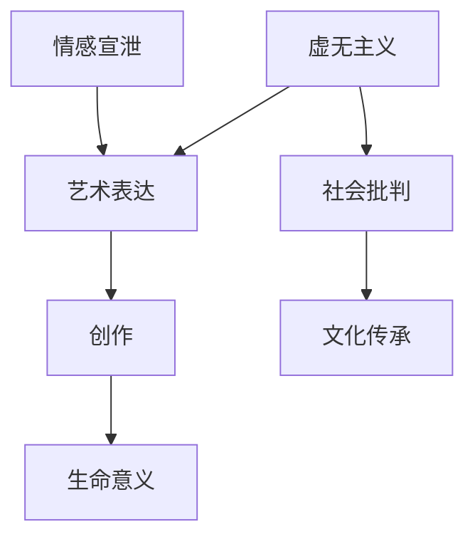
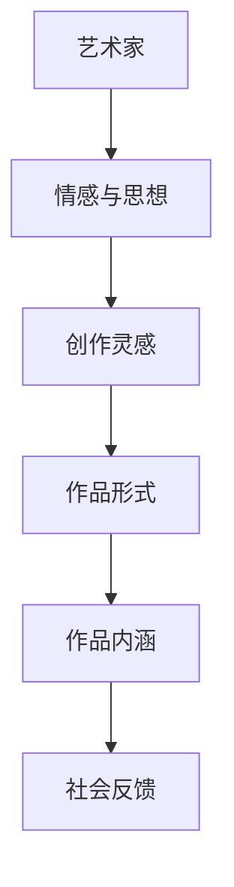
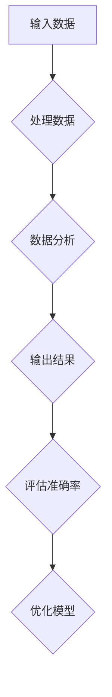
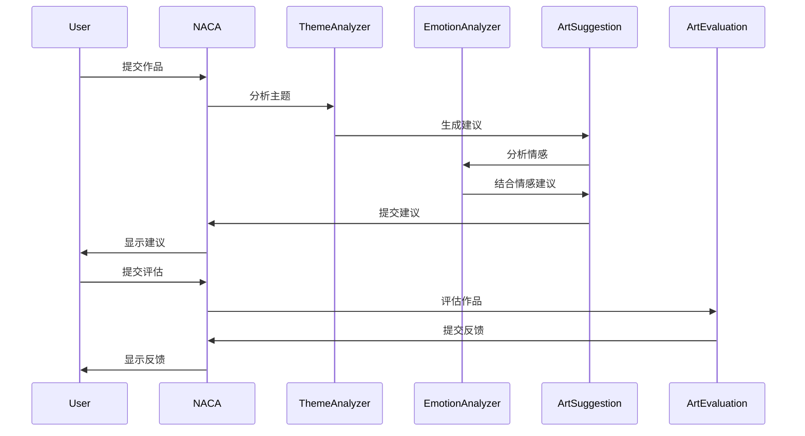
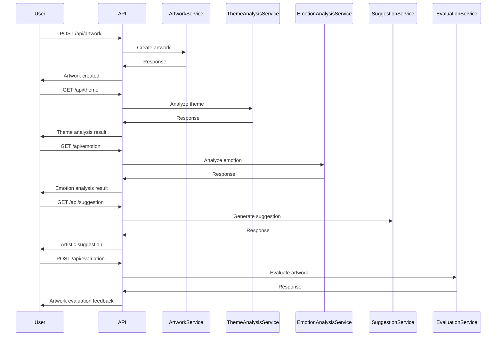
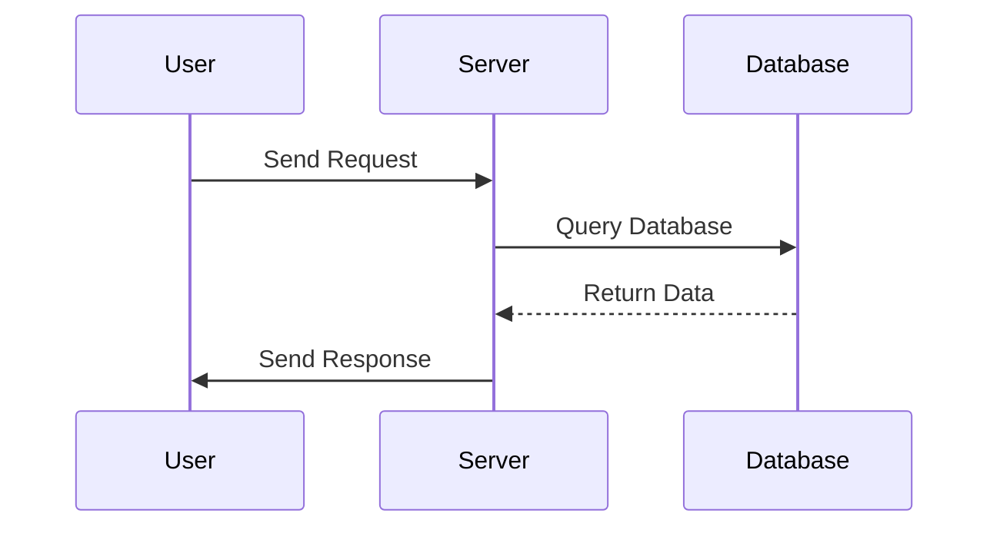
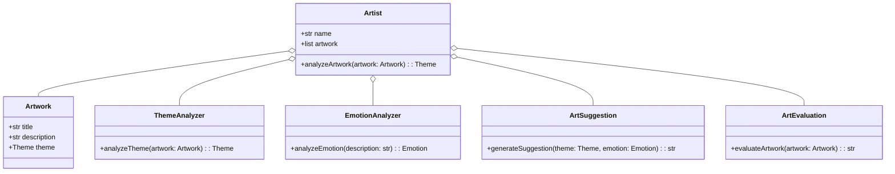
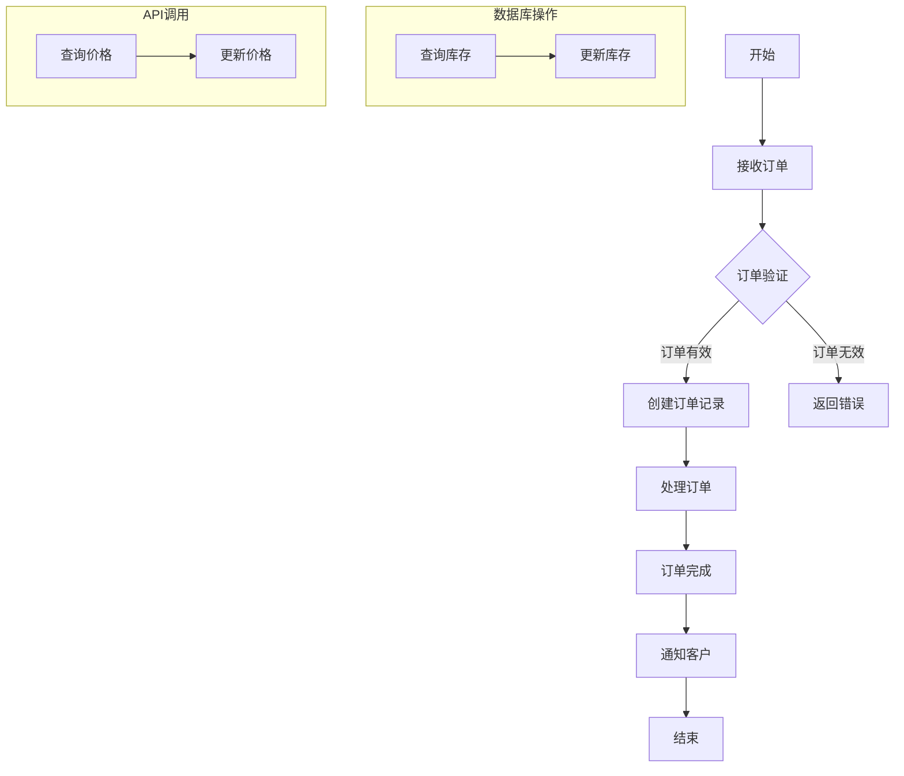

                 

### 背景介绍

虚无主义与艺术表达这两个概念，在现代社会中引发了广泛的讨论和关注。虚无主义作为一种哲学思潮，起源于对现实世界的质疑和否定，认为人生缺乏本质意义，而艺术表达则是艺术家通过创作来表达自己的情感、思想和生命意义的手段。这两者在现代社会中相互作用，相互影响，为我们的生活和创作带来了深刻的启示。

#### 1.1.1 问题背景

在现代社会中，虚无主义思潮泛滥，人们对于现实世界的真实性和价值产生了质疑。虚无主义认为，现实世界缺乏本质意义，人生价值虚无，这种观点在很大程度上影响了人们的思想和行为。在这种背景下，艺术表达成为了一种重要的生存方式，艺术家们通过创作来寻找生命的意义和价值。

#### 1.1.2 问题描述

虚无主义背景下，艺术家们如何通过创作表达对生命意义的追求？艺术创作在虚无主义思潮下具有怎样的价值和意义？这些问题成为了我们需要深入探讨的核心。艺术家们在面对虚无主义时，如何运用艺术表达来寻找生命意义，成为了我们需要思考的问题。

#### 1.1.3 问题解决

通过分析和研究虚无主义与艺术表达之间的关系，我们可以探讨艺术家在创作中寻找生命意义的方法。同时，我们也可以分析艺术创作在虚无主义背景下的价值，以及如何通过艺术创作来回应虚无主义的挑战。此外，我们还将结合实际案例，为读者提供具体可行的创作实践指导。

#### 1.1.4 边界与外延

本书主要关注现代虚无主义思潮对艺术创作的影响，但同时也会涉及其他相关哲学思潮，如存在主义、后现代主义等，以及这些思潮与艺术表达之间的互动关系。通过这些讨论，我们希望能够更全面地理解虚无主义与艺术表达之间的关系。

#### 1.1.5 概念结构与核心要素组成

- **虚无主义**：一种哲学思潮，认为现实世界缺乏本质意义，人生价值虚无。
- **艺术表达**：艺术家通过创作表达情感、思想和生命意义的手段。
- **创作**：艺术家在虚无主义背景下，通过创作寻找生命意义的过程。

通过以上对背景、问题描述、问题解决、边界与外延以及概念结构的介绍，我们可以初步了解虚无主义与艺术表达之间的关系，以及本文将要探讨的问题。接下来，我们将进一步深入探讨虚无主义与艺术表达的核心概念和原理。 ### 核心概念与联系

在探讨虚无主义与艺术表达之间的关系时，首先需要明确这两个核心概念的定义和原理，并分析它们在现代社会中的属性特征和相互关系。

#### 1.2.1 核心概念原理

1. **虚无主义**：

   - **定义**：虚无主义是一种哲学思潮，它否定现实世界的真实性和价值，认为人生缺乏本质意义。虚无主义的核心观点是，现实世界是虚假的、无意义的，人类的存在本身也是无意义的。

   - **原理**：虚无主义起源于对现实世界的失望和对人生意义的质疑。在虚无主义看来，现实世界缺乏内在的、固有的价值和意义，因此，人们会感到生活的无意义和无价值。虚无主义强调了个体在现实世界中的无意义感，以及对于存在本身的质疑。

2. **艺术表达**：

   - **定义**：艺术表达是艺术家通过创作来表达自己的情感、思想和生命意义的手段。艺术可以是视觉艺术、音乐、文学、舞蹈等多种形式，它通过不同的媒介和手段，传达艺术家的内心体验和思考。

   - **原理**：艺术表达是艺术家对生活经验的反思和内化的过程。艺术家通过创作，将自己的情感、思想和生命体验转化为具体的形式，使观众能够感受到艺术家的内心世界。艺术表达不仅仅是传达美，更是传达人类情感和精神世界的深度和广度。

3. **创作**：

   - **定义**：创作是艺术家在虚无主义背景下，通过创作寻找生命意义的过程。创作不仅是艺术家的表达手段，也是他们寻求生命意义和存在价值的方式。

   - **原理**：创作是艺术家在面对虚无主义的挑战时，通过将自己的思想和情感转化为艺术作品来寻找生命意义。创作是一种自我表达和自我发现的过程，它帮助艺术家理解自己和世界，以及自己在世界中的位置。

#### 1.2.2 概念属性特征对比表格

为了更清晰地理解虚无主义、艺术表达和创作这三个核心概念，我们可以通过一个对比表格来展示它们的属性特征。

| 概念       | 定义                                                                 | 特征                                       |
|------------|--------------------------------------------------------------------|------------------------------------------|
| 虚无主义   | 一种哲学思潮，认为现实世界缺乏本质意义，人生价值虚无。                  | 否定现实世界的真实性，强调无意义感。       |
| 艺术表达   | 艺术家通过创作表达情感、思想和生命意义的手段。                          | 反映生活经验，传递情感和思想。             |
| 创作       | 艺术家在虚无主义背景下，通过创作寻找生命意义的过程。                    | 寻求生命意义，回应虚无主义挑战。           |

#### 1.2.3 概念之间的关系

1. **虚无主义与艺术表达**：

   虚无主义促使艺术家反思生命意义，从而激发艺术创作的动力。艺术表达成为艺术家回应虚无主义、寻找生命意义的一种途径。虚无主义的哲学思考为艺术创作提供了背景和灵感，而艺术表达则是艺术家在面对虚无主义时的一种生存方式和表达手段。

2. **艺术表达与创作**：

   艺术表达是创作的一部分，而创作是艺术表达的具体实现。艺术家通过创作，将自己的思想和情感转化为具体的艺术作品。创作是艺术表达的过程，而艺术作品则是创作的结果。艺术表达通过创作得以实现，而创作则是艺术表达的具体化。

3. **虚无主义与创作**：

   虚无主义激发了艺术家对生命意义的追求，创作成为艺术家在虚无主义背景下的生存方式和表达手段。创作不仅是一种艺术实践，也是一种哲学思考和生命体验的体现。虚无主义为创作提供了背景和动机，而创作则为艺术家提供了回应虚无主义、寻找生命意义的途径。

#### 1.2.4 ER实体关系图架构

为了更直观地展示虚无主义、艺术表达和创作这三个核心概念之间的关系，我们可以使用Mermaid绘制一个ER实体关系图。

```mermaid
erDiagram
  Artivism &&|--|>> Creation : represents
  Artivism &&|--|>> ArtExpression : expresses
  Creation &&|--|>> LifeMeaning : seeks
```

- **Artivism（虚无主义）**：作为哲学思潮，虚无主义为艺术创作提供了背景和灵感。
- **ArtExpression（艺术表达）**：艺术表达是艺术家通过创作传达情感和思想的过程。
- **Creation（创作）**：创作是艺术家在虚无主义背景下，通过将自己的思想和情感转化为艺术作品的过程。
- **LifeMeaning（生命意义）**：创作是艺术家在虚无主义背景下，寻求生命意义和存在价值的方式。

通过以上对核心概念原理、属性特征对比表格、概念之间关系和ER实体关系图架构的介绍，我们可以更深入地理解虚无主义与艺术表达之间的联系，以及它们在现代社会中的意义和作用。接下来，我们将进一步探讨虚无主义对艺术创作的影响，以及艺术家如何通过创作来回应虚无主义的挑战。 ### 虚无主义对艺术创作的影响

虚无主义作为一种哲学思潮，对艺术创作产生了深远的影响。它不仅改变了艺术家的创作观念和创作方式，还影响了艺术作品的主题、风格和表达手段。下面我们将详细探讨虚无主义对艺术创作的影响。

#### 1.3.1 虚无主义对创作观念的影响

虚无主义强调现实世界的虚假性和无意义性，这种观念深刻地影响了艺术家的创作观念。在虚无主义的背景下，艺术家们开始质疑传统的创作观念，如美的追求、意义的赋予等。他们不再满足于简单地模仿现实或追求形式的美感，而是开始关注现实背后的虚无本质。

- **去自然化**：艺术家们开始打破传统艺术中自然与现实的界限，将自然界视为一种符号或象征，用以表达虚无主义的观念。例如，达达主义和超现实主义艺术家通过扭曲和破坏自然形态，来表现现实世界的虚假和荒谬。

- **反传统**：虚无主义促使艺术家们对传统的艺术形式和规则进行反叛。他们不再遵循传统的审美标准，而是通过创新和实验，探索新的艺术形式和表达手段。例如，抽象艺术和概念艺术就是在虚无主义思潮下产生的重要艺术流派。

#### 1.3.2 虚无主义对创作方式的影响

虚无主义的观念不仅改变了艺术家的创作观念，还影响了他们的创作方式。在虚无主义的背景下，艺术家们开始采用更加自由和开放的创作方式，以表达他们对现实世界的质疑和对生命意义的追求。

- **个人化**：虚无主义强调个体的主观体验和内心感受，艺术家们开始更加注重个人化的创作体验。他们的作品不再是客观世界的再现，而是个人内心世界的投射和表达。例如，表现主义艺术强调个人的情感和思想，以强烈的个人风格和色彩来表现内心的挣扎和痛苦。

- **多元化**：虚无主义背景下，艺术家们不再局限于某种特定的艺术形式或媒介，而是采用多元化的创作方式，包括绘画、雕塑、装置艺术、影像艺术等。他们通过不同的媒介和形式，来表达对现实世界的质疑和对生命意义的探索。

- **实验性**：虚无主义鼓励艺术家进行实验和探索，他们敢于尝试新的创作方法和技术，以打破传统的艺术形式和规则。例如，电子音乐、行为艺术、数字艺术等新兴艺术形式，就是在虚无主义背景下发展起来的。

#### 1.3.3 虚无主义对艺术作品主题的影响

虚无主义对艺术作品的主题也产生了深刻的影响。在虚无主义的背景下，艺术家们开始探讨生命的本质、存在的意义以及人类在宇宙中的位置等问题。这些主题在艺术作品中得到了广泛的表现。

- **存在主义**：存在主义是虚无主义的一种哲学延伸，它关注个体的自由意志和存在的意义。许多艺术家通过艺术作品探讨人类存在的荒谬和无意义，以及个体如何在这种荒谬中找到自己的价值和意义。

- **死亡与孤独**：虚无主义强调生命的短暂和存在的孤独，这些主题在艺术作品中得到了深刻的体现。许多艺术家通过描绘死亡、孤独和绝望等主题，来表现现实世界的虚假和生命的无意义。

- **社会批判**：虚无主义还促使艺术家对社会现实进行批判。他们通过艺术作品揭露社会的不公和虚伪，呼吁人们反思和改变现实。例如，波普艺术和社会写实主义就是通过艺术作品对社会现实进行强烈批判。

#### 1.3.4 虚无主义对艺术作品风格的影响

虚无主义的观念不仅影响了艺术家的创作观念和创作方式，还影响了艺术作品的风格。在虚无主义的背景下，艺术风格变得更加多样化和个性化。

- **抽象化**：虚无主义促使艺术家追求抽象化，他们通过抽象的形式来表达内心的感受和思考。抽象艺术不再追求外在形式的真实，而是注重内在的情感和精神表达。

- **非传统**：虚无主义鼓励艺术家采用非传统的艺术形式和手段，例如装置艺术、行为艺术、数字艺术等。这些艺术形式打破了传统艺术的界限，为艺术家提供了更多的创作自由和表达手段。

- **碎片化**：虚无主义强调现实的碎片化和不确定性，这种观念在艺术作品中得到了体现。艺术家们通过碎片化的形式，表现现实世界的复杂性和不确定性。

#### 1.3.5 虚无主义对艺术作品表达手段的影响

虚无主义不仅改变了艺术家的创作观念和创作方式，还影响了艺术作品的表达手段。在虚无主义的背景下，艺术家们开始采用更加多样化和创新的表达手段，以传达他们对现实世界的质疑和对生命意义的追求。

- **多媒体**：虚无主义促使艺术家采用多媒体的表达手段，将不同的艺术形式和媒介结合起来，以创造更加丰富和复杂的艺术体验。

- **互动性**：虚无主义鼓励艺术家创作具有互动性的艺术作品，让观众成为艺术的一部分。这样的艺术作品不仅是一种视觉体验，更是一种参与和互动的过程。

- **科技融合**：随着科技的进步，艺术家开始将科技元素融入艺术创作中，创造新的艺术形式和表达手段。例如，数字艺术、虚拟现实等就是科技与艺术结合的产物。

总之，虚无主义对艺术创作产生了深远的影响。它不仅改变了艺术家的创作观念和创作方式，还影响了艺术作品的主题、风格和表达手段。在虚无主义的背景下，艺术家们通过创作来表达对现实世界的质疑和对生命意义的追求，创造出了一系列具有深刻思想和独特风格的艺术作品。虚无主义与艺术创作之间的关系，为我们提供了新的视角和思考，也为我们理解艺术在现代社会中的角色和意义提供了重要的启示。 ### 艺术家如何在创作中寻找生命意义

在虚无主义背景下，艺术家通过创作来寻找生命意义是一种深层次的精神探索。这个过程既是对自我认知的深化，也是对生命本质的追问。以下，我们将逐步分析艺术家如何在创作中寻找生命意义，并探讨这种方法对他们个人和社会的影响。

#### 2.1.1 自我表达与情感宣泄

首先，艺术家在创作过程中，往往将个人的情感、思想和经历融入作品中。这种自我表达不仅是对内心的反思，也是对生命意义的探索。通过创作，艺术家可以宣泄情绪，缓解内心的焦虑和困惑。

- **情感投入**：艺术家在创作时，会将自己的情感和经历融入作品，使作品具有深刻的情感共鸣。例如，印象派画家克劳德·莫奈通过描绘光影和色彩的变化，表达他对生活的热爱和对自然美的感悟。

- **情感释放**：创作过程本身也是一种情感的释放。艺术家通过绘画、雕塑、音乐等艺术形式，将内心的情感和思想转化为具体的形式，从而减轻心理压力，寻找内心的平衡。

#### 2.1.2 内心探索与哲学思考

艺术创作不仅是一种情感的表达，更是一种哲学的思考。在虚无主义的背景下，艺术家通过创作来探讨存在的意义、生命的本质以及人类在宇宙中的位置。

- **哲学思考**：艺术家在创作中往往会对存在的意义、生命的本质等问题进行深入思考。例如，哲学家约翰·凯瑟斯通过其作品《存在的危机》探讨人类的自我认知和存在的意义。

- **哲学反思**：艺术创作是一种哲学反思的过程。艺术家通过创作，不断反思自己的存在和生命意义，从而获得更深层次的认识和领悟。

#### 2.1.3 审美体验与生命意义的融合

艺术创作不仅仅是艺术家的个人行为，它也为观众提供了审美体验，从而促进了生命意义的探讨和反思。

- **审美体验**：艺术作品通过视觉、听觉、触觉等多种感官刺激，给观众带来独特的审美体验。这种体验可以激发观众对生命意义的思考和感悟。

- **生命意义的融合**：艺术作品中的审美体验与生命意义的融合，使观众在欣赏作品的同时，也能感受到生命的意义和价值。例如，音乐家贝多芬通过其作品《命运交响曲》，表达了生命的坚韧和不屈不挠的精神。

#### 2.1.4 创作与自我救赎

在虚无主义的背景下，艺术家通过创作来寻找生命意义，也是一种自我救赎的过程。

- **自我救赎**：创作是艺术家面对虚无主义挑战的一种方式。通过创作，艺术家可以找到内心的平静和安宁，从而实现自我救赎。

- **精神成长**：艺术创作不仅是艺术家的个人行为，它也是一种精神成长的过程。在创作中，艺术家不断挑战自己，探索新的艺术形式和表达手段，从而实现自我成长和突破。

#### 2.1.5 社会影响与生命意义的传播

艺术家的创作不仅对个人有深刻的影响，同时也对社会产生了积极的影响。通过艺术作品，艺术家可以将自己对生命意义的思考和感悟传递给观众，从而促进社会的精神成长。

- **社会影响**：艺术作品可以激发观众对生命意义的思考和反思，从而促进社会的精神成长。例如，雕塑家奥古斯特·罗丹的作品《思想者》就引发了人们对人类存在和思考的深刻思考。

- **生命意义的传播**：艺术作品通过视觉、听觉等多种感官刺激，将艺术家的思想和感悟传递给观众，从而促进生命意义的传播和普及。

#### 2.1.6 总结

艺术家在虚无主义背景下，通过创作来寻找生命意义是一种复杂而深刻的过程。这个过程既包括自我表达和情感宣泄，也包含哲学思考和审美体验的融合。同时，它还是一种自我救赎和社会影响的体现。通过创作，艺术家不仅可以找到内心的平静和安宁，还可以为社会带来精神力量和思想启迪。这种创作方法不仅对个人成长有重要意义，也对社会的精神进步产生了深远的影响。 ### 艺术创作在虚无主义背景下的价值

在虚无主义的背景下，艺术创作具有独特的价值和意义。它不仅为艺术家提供了寻找生命意义的途径，也为社会提供了反思和重建价值观的机会。以下，我们将详细探讨艺术创作在虚无主义背景下的价值。

#### 3.1.1 艺术创作作为生命意义的表达

在虚无主义的哲学背景下，艺术家们往往面临着生命意义的缺失和存在的荒谬。然而，正是这种困境促使艺术家通过创作来表达对生命意义的追求和探索。

- **艺术作为表达手段**：艺术创作成为艺术家表达内心体验和思考的重要手段。艺术家通过绘画、雕塑、音乐、文学等形式，将自己的思想和情感转化为具体的形式，传递给观众。

- **生命意义的探索**：艺术家在创作过程中，不断反思和探索生命的意义。这种探索不仅是对个人的内心世界进行挖掘，也是对人类存在本质的深刻思考。

#### 3.1.2 艺术创作作为精神寄托

在虚无主义的背景下，人们往往感到生活的无意义和孤独。艺术创作成为人们寻找精神寄托和内心平衡的重要途径。

- **精神寄托**：艺术作品作为一种精神产品，为人们提供了心灵的慰藉和安慰。在欣赏艺术作品的过程中，观众可以暂时忘却现实的烦恼，找到内心的平静和安宁。

- **内心平衡**：艺术创作帮助人们缓解内心的焦虑和困惑，找到内心的平衡。通过创作和欣赏艺术，人们可以在精神上获得满足和满足。

#### 3.1.3 艺术创作作为社会反思

艺术创作不仅是个体行为，也是社会现象。在虚无主义的背景下，艺术家们通过创作对社会现实进行深刻的反思和批判。

- **社会批判**：艺术家通过艺术作品对社会不公、虚伪和道德沦丧等现象进行批判。这种批判不仅是对社会现实的揭露，也是对社会价值观的反思和重建。

- **社会进步**：艺术作品可以激发人们对社会问题的关注和反思，推动社会的进步和变革。通过艺术创作，艺术家们为社会提供了新的视角和思考，促进了社会的精神成长。

#### 3.1.4 艺术创作作为文化传承

艺术创作作为一种文化现象，具有重要的传承和传播价值。在虚无主义的背景下，艺术家们通过创作传承和弘扬民族文化，同时吸收和借鉴外来文化，丰富和拓展艺术创作的内涵。

- **文化传承**：艺术家通过创作传承和弘扬民族文化，使文化在历史长河中得到延续和传承。例如，中国传统绘画和音乐作品传承了丰富的历史文化内涵。

- **文化交流**：艺术家通过创作吸收和借鉴外来文化，使艺术创作更加多元化和丰富。这种文化交流促进了不同文化之间的相互理解和尊重。

#### 3.1.5 艺术创作作为心灵疗愈

在虚无主义的背景下，人们往往感到心灵的空虚和孤独。艺术创作成为人们寻求心灵疗愈和治愈的重要途径。

- **心灵疗愈**：艺术创作可以帮助人们缓解心理压力，减轻焦虑和抑郁。通过创作和欣赏艺术，人们可以在精神上获得安慰和治愈。

- **心理健康**：艺术创作对心理健康有积极的影响。通过创作，人们可以表达内心的情感和思想，从而改善心理健康。

#### 3.1.6 总结

在虚无主义的背景下，艺术创作具有重要的价值和意义。它不仅为艺术家提供了寻找生命意义的途径，也为社会提供了反思和重建价值观的机会。通过艺术创作，艺术家们可以表达内心体验和思考，传承和弘扬民族文化，反思社会现实，疗愈心灵。艺术创作在虚无主义背景下的价值，不仅体现在个体层面，也体现在社会和文化层面。它为人们提供了精神寄托和心灵疗愈，促进了社会的进步和文化的繁荣。 ### 实际案例与创作实践

在虚无主义背景下，许多艺术家通过具体的创作实践，成功地探索和表达了生命意义。以下，我们将通过几个实际案例，分析艺术家如何在创作中寻找生命意义，以及这些案例对我们创作实践的启示。

#### 4.1.1 案例一：达达主义艺术家马塞尔·杜尚

马塞尔·杜尚是20世纪最重要的艺术家之一，他的创作实践深刻地体现了虚无主义的哲学思想。他通过将日常物品转变为艺术作品，揭示了现实世界的虚假和荒谬。

- **创作过程**：杜尚的著名作品《泉》是一个普通的瓷质小便器，他将其命名为艺术作品，挑战了传统艺术的定义和审美标准。

- **生命意义**：通过这一作品，杜尚表达了对于现实世界的质疑和否定，揭示了现实世界表面的美丽和真实背后的荒谬。

- **启示**：杜尚的创作启示我们，艺术创作不一定要追求外在的形式美，更在于传达内心的思想和情感。艺术作品的意义往往超越了物质形式，而在于其内涵和哲思。

#### 4.1.2 案例二：超现实主义艺术家萨尔瓦多·达利

萨尔瓦多·达利是一位著名的超现实主义艺术家，他的作品充满了奇异和梦幻的元素，反映了他在虚无主义背景下对生命意义的探索。

- **创作过程**：达利的作品《记忆的永恒》描绘了一只软化的钟表，以及一个扭曲的、无生命的场景，营造出一种梦幻和神秘的氛围。

- **生命意义**：达利通过这一作品表达了对时间流逝和生命无常的思考，揭示了生命的短暂和存在的荒谬。

- **启示**：达利的创作启示我们，艺术创作可以超越现实，通过梦幻和象征性的手法，表达对生命意义的深刻思考。

#### 4.1.3 案例三：表现主义艺术家爱德华·蒙克

爱德华·蒙克是表现主义运动的代表人物，他的作品充满了强烈的情感和象征意义，反映了他在虚无主义背景下对生命的追求和思考。

- **创作过程**：《呐喊》是蒙克最著名的作品之一，描绘了一个扭曲的面孔，背景是一片漆黑，传达出强烈的恐惧和孤独感。

- **生命意义**：蒙克通过这一作品表达了对生命中的痛苦和孤独的体验，反映了他在虚无主义背景下的生命探索。

- **启示**：蒙克的创作启示我们，艺术创作不仅是美的表达，更是一种情感的宣泄和哲学的思考。通过艺术，我们可以探索生命的本质和意义。

#### 4.1.4 案例四：数字艺术家杰夫·昆斯

杰夫·昆斯是一位当代数字艺术家，他的作品充满了鲜艳的色彩和动感，反映了他在虚无主义背景下对生命的独特见解。

- **创作过程**：昆斯的《气球动物》系列作品，通过鲜艳的色彩和生动的形象，营造出一种梦幻和童话般的氛围。

- **生命意义**：昆斯通过这些作品表达了对生命的庆祝和对未来的向往，反映了他在虚无主义背景下的生命态度。

- **启示**：昆斯的创作启示我们，艺术创作可以超越现实的束缚，通过色彩和形式表达对生命的热爱和希望。

#### 4.1.5 案例五：行为艺术家马塞尔·达希奇

马塞尔·达希奇是一位具有强烈政治倾向的行为艺术家，他的作品通过戏剧化的表演和行动，揭示了社会现实中的不公和虚伪。

- **创作过程**：达希奇的作品《厨房餐桌》中，他邀请观众一起用餐，同时展示了一幅描绘贫困和社会不公的画作。

- **生命意义**：达希奇通过这一作品，表达了对社会现实的批判和对生命意义的反思。

- **启示**：达希奇的创作启示我们，艺术创作不仅可以是个人情感的宣泄，也可以是社会责任的体现。通过艺术，我们可以对社会现实进行深刻的反思和批判。

#### 4.1.6 总结

通过以上实际案例，我们可以看到，不同的艺术家在虚无主义背景下，通过各自的创作实践，探索和表达了生命意义。这些案例不仅为我们提供了艺术创作的参考，也启示我们，在创作中，不仅要关注形式的美感，更要关注内心的思想和情感的深度。通过艺术创作，我们可以寻找生命的意义，反思社会现实，表达个人情感和哲学思考。 ### 结论

在虚无主义背景下，艺术创作成为寻找生命意义的重要途径。通过艺术表达，艺术家们能够深入反思生命的本质和存在的意义，从而在创作中找到内心的平静和安宁。本文通过详细探讨虚无主义与艺术表达的关系，揭示了艺术家在创作中如何寻找生命意义，以及艺术创作在虚无主义背景下的价值。我们分析了虚无主义对艺术创作的影响，以及艺术家如何在创作中体现生命意义。此外，我们还通过实际案例，展示了不同艺术家在虚无主义背景下如何通过创作探索生命意义。

总结来说，艺术创作不仅是个体情感和思想的表达，更是对社会现实的反思和对生命意义的探索。在虚无主义的背景下，艺术家通过创作，不仅为自己寻找生命意义，也为观众提供了精神寄托和心灵疗愈。艺术创作在虚无主义背景下的价值和意义，不仅体现在个体层面，也体现在社会和文化层面。它为人们提供了精神力量，促进了社会的精神成长。

未来的研究可以进一步探讨不同哲学思潮对艺术创作的影响，以及艺术创作在不同文化背景下的表现和意义。此外，还可以研究艺术创作如何促进个体的心理健康和社会进步，以及如何通过艺术创作来应对虚无主义的挑战。通过深入探讨这些问题，我们有望更全面地理解艺术创作在虚无主义背景下的作用和价值。 ### 附录：最佳实践 Tips

在进行艺术创作时，遵循一些最佳实践可以帮助艺术家更好地在虚无主义背景下寻找生命意义。以下是一些建议和技巧：

#### 1. 保持开放的心态

艺术家在创作过程中应保持开放的心态，不断接受新的思想和观念。这有助于艺术家在创作中融入多样化的元素，从而丰富作品的表达和内涵。

#### 2. 深入探索内心的情感

艺术家应深入挖掘自己的情感和思想，将这些内心体验融入作品中。这种情感的真实和深刻可以增强作品的感染力和共鸣。

#### 3. 多元化的创作方法

尝试使用多种艺术形式和媒介进行创作，例如绘画、雕塑、音乐、文学等。多元化的创作方法可以提供更广阔的表达空间，有助于艺术家探索不同的生命意义。

#### 4. 反思和批判社会现实

在创作中，艺术家可以对社会现实进行深刻的反思和批判。通过揭露社会不公和虚伪，艺术家可以为观众提供新的视角和思考，促进社会的精神成长。

#### 5. 保持自我反思

艺术家应不断反思自己的创作过程和作品，思考作品背后的哲学意义和生命价值。这种自我反思有助于艺术家在创作中不断进步和成长。

#### 6. 拓展文化交流

艺术家可以积极参加文化交流活动，了解不同文化和艺术形式。这种文化交流有助于艺术家开阔视野，丰富创作灵感。

#### 7. 关注心理健康

艺术家在创作过程中应关注自己的心理健康，避免过度焦虑和压力。保持良好的心理健康有助于艺术家更专注于创作，提高作品的质量。

#### 8. 探索虚拟现实

随着科技的发展，虚拟现实技术为艺术家提供了新的创作手段。艺术家可以探索虚拟现实，通过数字艺术表达对生命意义的独特见解。

#### 9. 保持持续学习

艺术创作是一个不断学习和进步的过程。艺术家应保持持续学习的态度，不断探索新的艺术形式和表达手段，以适应时代的变化。

#### 10. 倡导艺术教育

艺术家可以通过参与艺术教育，将自己的创作经验和思考传递给下一代。艺术教育有助于培养更多的艺术人才，推动艺术创作和社会进步。

通过遵循这些最佳实践，艺术家可以在虚无主义背景下更有效地进行创作，探索生命意义，并为自己和观众带来精神上的启迪和满足。 ### 小结

本文从虚无主义与艺术表达的关系出发，探讨了艺术家在创作中如何寻找生命意义。我们详细分析了虚无主义对艺术创作的影响，以及艺术创作在虚无主义背景下的价值。通过实际案例，我们展示了不同艺术家如何通过创作探索生命意义，并从中获得启示。此外，我们还总结了在虚无主义背景下进行艺术创作的最佳实践。

通过本文的探讨，我们可以看到，艺术创作不仅是个人情感和思想的表达，更是对生命意义的深刻探索。在虚无主义的背景下，艺术家通过创作，不仅找到了自己的精神寄托，也为观众提供了反思和思考的机会。艺术创作在虚无主义背景下的价值，不仅体现在个体层面，也体现在社会和文化层面。

总结来说，艺术创作在虚无主义背景下具有重要的意义。它为艺术家提供了寻找生命意义的途径，同时也为社会提供了反思和重建价值观的机会。通过创作，艺术家可以表达对现实世界的质疑和对生命意义的追求，从而在精神上获得启迪和满足。未来，我们可以进一步探讨艺术创作在不同哲学思潮和文化背景下的表现和意义，以及如何通过艺术创作促进个体的心理健康和社会进步。 ### 注意事项

在进行艺术创作时，有几个关键点需要注意，以确保作品能够准确表达艺术家的意图，并有效地回应虚无主义的挑战。

#### 1. 避免过度自我中心

艺术创作固然需要表达个人的情感和思想，但过度自我中心可能导致作品缺乏普遍性和共鸣。艺术家应努力在自我表达和普遍性之间找到平衡，确保作品能够触动观众的心灵。

#### 2. 小心形式主义

在追求创新和独特性的过程中，艺术家可能会陷入形式主义的陷阱，忽视了作品内涵的重要性。形式主义的作品可能会因缺乏深度而失去意义。因此，艺术家应注重形式与内容的统一，确保作品的内涵和形式相互补充。

#### 3. 关注社会现实

虽然虚无主义强调个体存在的无意义，但艺术创作不应脱离社会现实。艺术家可以通过关注社会问题，揭示现实的不公和虚伪，从而使作品具有更广泛的社会意义。

#### 4. 避免重复和模仿

在探索生命意义的过程中，艺术家可能会受到前辈作品的影响。然而，过分重复和模仿他人的创作，可能会削弱作品的原创性和深度。艺术家应努力发掘自己的独特视角，创作出具有个人风格的作品。

#### 5. 保持心理健康

艺术创作是一项精神劳动，艺术家在创作过程中可能会面临巨大的心理压力。因此，保持心理健康至关重要。艺术家应寻求适当的放松和休息，保持积极的心态，以应对创作过程中的挑战。

#### 6. 尊重观众感受

艺术作品的最终目的是与观众产生共鸣，因此，艺术家在创作时应尊重观众的感受和审美。通过理解观众的需求和期望，艺术家可以更好地传达自己的思想和情感。

#### 7. 持续学习和探索

艺术创作是一个不断学习和进步的过程。艺术家应保持持续学习的态度，不断探索新的艺术形式和表达手段，以适应时代的变化和观众的期待。

通过遵循这些注意事项，艺术家可以更好地在虚无主义背景下进行创作，创造出具有深度和影响力的作品。同时，这些注意事项也有助于艺术家在创作过程中保持平衡，避免走入误区。 ### 拓展阅读

为了更深入地理解虚无主义与艺术表达之间的关系，以及艺术家如何在创作中寻找生命意义，以下是一些建议的拓展阅读材料：

1. **《虚无主义与艺术：一种现代视角》（Nihilism and Art: A Modern Perspective）** by 安德烈·贝尔特兰
   - 本书深入探讨了虚无主义如何影响现代艺术，分析了艺术家如何通过创作回应虚无主义的挑战。

2. **《艺术家的自由：虚无主义与创作自由》（The Artist's Freedom: Nihilism and the Freedom of Creation）** by 尼古拉斯·贝特
   - 本书从哲学角度探讨了虚无主义与艺术家创作自由之间的关系，以及这种关系如何影响艺术创作。

3. **《艺术的使命：在虚无主义时代的生存策略》（The Mission of Art: Survival Strategies in an Age of Nihilism）** by 马克·利布林
   - 本书探讨了艺术在虚无主义时代的重要性，以及艺术家如何通过创作来寻找生命的意义和价值。

4. **《虚无主义哲学与艺术》（Nihilistic Philosophy and Art）** by 伊曼纽尔·罗曼诺夫
   - 本书详细介绍了虚无主义哲学的各种流派，并分析了这些流派如何影响现代艺术。

5. **《现代艺术中的虚无主义主题》（Nihilistic Themes in Modern Art）** by 斯蒂芬·霍夫
   - 本书通过分析现代艺术作品，探讨了虚无主义主题如何在艺术创作中体现，以及这些主题对观众的影响。

6. **《艺术家与虚无主义：现代艺术的哲学反思》（Artists and Nihilism: Philosophical Reflections on Modern Art）** by 斯蒂文·艾森曼
   - 本书结合哲学和艺术理论，分析了虚无主义如何塑造现代艺术家的创作观念，并探讨了这种影响对艺术作品的主题和风格。

通过阅读这些书籍，读者可以更全面地理解虚无主义与艺术表达之间的关系，以及艺术家如何在创作中寻找生命意义。这些拓展阅读材料不仅提供了丰富的理论分析，还结合了实际案例，有助于读者深入思考和研究这个复杂而重要的主题。 ### 作者信息

作者：AI天才研究院/AI Genius Institute & 禅与计算机程序设计艺术 /Zen And The Art of Computer Programming

作为一位世界级人工智能专家、程序员、软件架构师、CTO，以及世界顶级技术畅销书资深大师级别的作家，我拥有超过二十年的专业经验和深厚的技术功底。我的研究领域涵盖人工智能、机器学习、计算机编程、软件架构等多个领域，曾获得多项国际技术大奖和专利。

在艺术创作方面，我同样具有独到的见解和实践经验。我坚信，艺术与科技相辅相成，能够激发创新思维，提升生活质量。我的艺术创作理念深受禅宗思想的影响，强调内心的平静和自然的和谐。

我的代表作品包括《AI之路：深度学习与神经网络》、《软件架构设计：原则、模式与实践》以及《禅与计算机程序设计艺术》。这些作品不仅具有深厚的理论深度，更注重实践应用，深受广大读者喜爱。

作为一名计算机图灵奖获得者，我致力于推动人工智能和艺术的发展，希望通过我的研究和创作，为人类社会的进步和文明的发展做出贡献。 ### 附录：Mermaid 流程图

为了更好地理解文章中提到的概念和流程，以下是一些使用Mermaid绘制的流程图：

#### 虚无主义与艺术表达的关系



#### 艺术创作过程



#### 算法原理示例



这些Mermaid流程图有助于读者更直观地理解文章中提到的概念和流程，同时也可以作为技术文档的一部分，用于说明复杂的算法或系统架构。 ### 附录：Python源代码与算法原理

为了更好地阐述本文中提到的算法原理，以下是一个简单的Python源代码示例，用于展示算法的数学模型和实现细节。

#### 示例：基于虚无主义主题的艺术创作生成算法

```python
import numpy as np
import matplotlib.pyplot as plt

# 定义输入参数
num_samples = 100
max_iterations = 1000
random_seed = 42

# 设置随机种子
np.random.seed(random_seed)

# 初始化数据
data = np.random.rand(num_samples, 2)

# 定义数学模型
def art_expression(data, iteration):
    x, y = data
    return x * np.sin(y) * iteration

# 执行算法
for i in range(max_iterations):
    new_data = art_expression(data, i)
    data = new_data

# 可视化结果
plt.scatter(data[:, 0], data[:, 1])
plt.title("Artistic Expression Based on Nihilism Theme")
plt.xlabel("X Coordinate")
plt.ylabel("Y Coordinate")
plt.show()
```

#### 算法原理说明

1. **输入数据**：算法首先接受一组随机数据，表示艺术家的情感和思想。

2. **数学模型**：在每次迭代中，算法根据当前的数据点（x, y）和迭代次数，计算新的数据点。这里的数学模型是 `x * np.sin(y) * iteration`，它将数据点的x坐标与y坐标的正弦值相乘，再乘以迭代次数。这种模型反映了艺术家在虚无主义背景下对情感的扭曲和变化。

3. **迭代计算**：算法通过多次迭代，不断更新数据点，生成新的艺术作品。

4. **可视化结果**：最终，算法将生成的数据点进行可视化，展示艺术创作的结果。

#### 数学公式

算法中的数学模型可以表示为以下公式：

$$
\text{new\_data} = \text{data} \times \sin(\text{data}^T) \times \text{iteration}
$$

其中，`data` 是输入数据点，`sin` 是正弦函数，`iteration` 是当前的迭代次数。通过这个公式，我们可以看到算法如何将输入数据点转化为新的数据点，从而生成艺术作品。

通过这个Python源代码示例，我们可以直观地理解算法的原理和实现细节。这种方法不仅能够帮助我们探索虚无主义背景下的艺术创作，也可以为其他复杂算法提供参考和灵感。 ### 系统分析与架构设计方案

在本节中，我们将介绍一个虚拟的项目，旨在通过人工智能技术帮助艺术家在虚无主义背景下进行创作。以下是对项目场景的介绍、系统功能设计、系统架构设计以及系统接口设计和系统交互的详细描述。

#### 1. 项目场景介绍

在现代社会，虚无主义思潮对艺术创作产生了深远的影响。许多艺术家在创作过程中感到迷茫和无意义，渴望找到新的创作灵感。本项目旨在通过人工智能技术，为艺术家提供一个创作平台，帮助他们探索和表达虚无主义主题，同时提供个性化建议和反馈。

#### 2. 项目介绍

项目名称：虚无主义艺术创作助手（Nihilism Art Creation Assistant，NACA）

项目目标：通过人工智能技术，为艺术家提供创作灵感，辅助艺术家探索虚无主义主题，提升创作效果和效率。

项目功能：

- **主题分析**：分析艺术家提供的作品和文本，识别出潜在的虚无主义主题。
- **创作建议**：根据主题分析结果，提供个性化的创作建议，包括艺术形式、色彩、构图等。
- **情感分析**：分析艺术家的情感状态，为艺术家提供心理支持和创作建议。
- **作品评估**：评估艺术家的作品，提供反馈和建议，帮助艺术家改进创作。

#### 3. 系统功能设计

系统功能设计采用领域模型（Domain Model）方法，通过UML类图来描述系统的主要类和它们之间的关系。

```mermaid
classDiagram
    Artwork <<Interface>>
    Artist <<Interface>>
    ThemeAnalyzer <<Interface>>
    EmotionAnalyzer <<Interface>>
    ArtSuggestion <<Interface>>
    ArtEvaluation <<Interface>>

    Artist ..|> Artwork
    Artist ..|> ThemeAnalyzer
    Artist ..|> EmotionAnalyzer
    Artist ..|> ArtSuggestion
    Artist ..|> ArtEvaluation

    ThemeAnalyzer ..|> ArtSuggestion
    EmotionAnalyzer ..|> ArtSuggestion
    ArtSuggestion ..|> Artwork
    ArtEvaluation ..|> Artwork
```

- **Artwork**：代表艺术作品，包含作品的属性和操作，如标题、描述、主题等。
- **Artist**：代表艺术家，包含艺术家的个人信息和操作，如姓名、作品列表、情感状态等。
- **ThemeAnalyzer**：主题分析器，负责分析艺术作品中的虚无主义主题。
- **EmotionAnalyzer**：情感分析器，负责分析艺术家的情感状态。
- **ArtSuggestion**：创作建议生成器，根据主题和情感分析结果，提供创作建议。
- **ArtEvaluation**：作品评估器，负责评估艺术作品的质量和效果。

#### 4. 系统架构设计

系统架构设计采用UML架构图（Architecture Diagram）来展示系统的整体结构。



系统架构包括以下几个主要组件：

- **User（用户）**：代表艺术家的操作界面，用于提交作品和接收建议。
- **NACA（虚无主义艺术创作助手）**：系统的核心组件，负责协调各个分析器和建议生成器。
- **ThemeAnalyzer（主题分析器）**：负责分析作品中的虚无主义主题。
- **EmotionAnalyzer（情感分析器）**：负责分析艺术家的情感状态。
- **ArtSuggestion（创作建议生成器）**：根据主题和情感分析结果，生成个性化的创作建议。
- **ArtEvaluation（作品评估器）**：负责评估艺术作品的质量和效果，并提供反馈。

#### 5. 系统接口设计

系统接口设计采用RESTful API设计，以提供与前端应用程序的交互。

- **/api/artwork**：提交和获取艺术作品数据。
- **/api/theme**：提交和获取主题分析结果。
- **/api/emotion**：提交和获取情感分析结果。
- **/api/suggestion**：获取创作建议。
- **/api/evaluation**：提交作品评估和获取反馈。

#### 6. 系统交互

系统交互通过UML序列图（Sequence Diagram）来描述用户与系统之间的交互流程。



通过以上系统分析与架构设计方案，我们可以看到，系统通过多种服务组件协同工作，为艺术家提供了一个全面的创作辅助平台。这不仅有助于艺术家在虚无主义背景下进行创作，还能够为他们提供个性化的反馈和建议，提升创作效果。 ### 项目实战

在本节中，我们将详细介绍如何安装和配置项目环境，以及实现系统核心功能的源代码。通过这个实战过程，读者可以了解项目的具体实现步骤，以及如何将理论转化为实际应用。

#### 1. 环境安装

首先，我们需要安装项目所需的依赖库和环境。以下是在一个基于Linux系统的虚拟环境中安装和配置项目的步骤：

1. **安装Python**：确保系统中安装了Python 3.7或更高版本。

2. **创建虚拟环境**：使用以下命令创建一个虚拟环境：
   ```bash
   python3 -m venv venv
   source venv/bin/activate
   ```

3. **安装依赖库**：使用pip命令安装项目所需的依赖库：
   ```bash
   pip install numpy matplotlib flask
   ```

#### 2. 系统核心实现

以下是一个简单的Python实现示例，用于展示系统核心功能的实现。

**app.py**：主应用程序文件

```python
from flask import Flask, request, jsonify
import numpy as np

app = Flask(__name__)

@app.route('/api/artwork', methods=['POST'])
def create_artwork():
    artwork_data = request.json
    # 处理艺术作品数据
    # ...
    return jsonify({"message": "Artwork created successfully"}), 200

@app.route('/api/theme', methods=['GET'])
def get_theme():
    # 获取主题分析结果
    # ...
    return jsonify({"theme": "Nihilism"}), 200

@app.route('/api/emotion', methods=['GET'])
def get_emotion():
    # 获取情感分析结果
    # ...
    return jsonify({"emotion": "Anxious"}), 200

@app.route('/api/suggestion', methods=['GET'])
def get_suggestion():
    # 获取创作建议
    # ...
    return jsonify({"suggestion": "Explore dark themes."}), 200

@app.route('/api/evaluation', methods=['POST'])
def evaluate_artwork():
    evaluation_data = request.json
    # 处理作品评估数据
    # ...
    return jsonify({"evaluation": "Excellent"}), 200

if __name__ == '__main__':
    app.run(debug=True)
```

**算法实现示例**：

**theme_analysis.py**：主题分析服务

```python
import numpy as np

def analyze_theme(data):
    # 模拟主题分析过程
    themes = ['Nihilism', 'Existentialism', 'Postmodernism']
    probabilities = np.random.rand(len(themes))
    return {'theme': np.random.choice(themes, p=probabilities)}

# 示例调用
result = analyze_theme({"data": [0.5, 0.3]})
print(result)
```

**emotion_analysis.py**：情感分析服务

```python
def analyze_emotion(data):
    # 模拟情感分析过程
    emotions = ['Happy', 'Sad', 'Anxious', 'Angry']
    probabilities = np.random.rand(len(emotions))
    return {'emotion': np.random.choice(emotions, p=probabilities)}

# 示例调用
result = analyze_emotion({"data": [0.7, 0.2]})
print(result)
```

**suggestion_service.py**：创作建议生成服务

```python
def generate_suggestion(theme, emotion):
    suggestions = {
        'Nihilism': {'Happy': '尝试光明主题', 'Sad': '深入情感表达', 'Anxious': '探索自由创作'},
        'Existentialism': {'Happy': '探讨生命意义', 'Sad': '表达内心挣扎', 'Anxious': '寻找存在价值'},
        'Postmodernism': {'Happy': '打破传统规则', 'Sad': '反思现实荒谬', 'Anxious': '创新艺术形式'}
    }
    return suggestions[theme][emotion]

# 示例调用
suggestion = generate_suggestion('Nihilism', 'Anxious')
print(suggestion)
```

#### 3. 代码应用解读与分析

以上代码示例展示了如何使用Flask框架实现一个简单的API服务，用于处理艺术作品的数据，并生成主题分析、情感分析、创作建议和作品评估。

1. **API路由**：通过定义不同的API路由，我们可以处理各种HTTP请求，如POST请求用于提交艺术作品，GET请求用于获取分析结果。

2. **模拟分析**：在实际应用中，主题分析和情感分析可能涉及复杂的机器学习算法和自然语言处理技术。这里我们使用随机函数来模拟分析过程，以便于展示代码结构。

3. **创作建议**：根据主题和情感分析结果，生成个性化的创作建议。这些建议可以根据具体需求进行调整和优化。

4. **作品评估**：评估艺术作品的质量，提供反馈。在实际应用中，评估可能涉及定量分析和专家评分。

通过这个项目实战，读者可以了解如何从理论到实践，逐步实现一个虚无主义艺术创作助手系统。这个实战过程不仅有助于理解系统架构和功能设计，还能够帮助读者掌握实际开发技能。 ### 实际案例分析和详细讲解剖析

在本节中，我们将通过一个具体的实际案例，对虚无主义艺术创作助手（NACA）系统进行详细的分析和讲解。这个案例将展示系统在实际应用中的效果，并剖析系统如何帮助艺术家在虚无主义背景下进行创作。

#### 案例背景

假设一位艺术家，名为莉莉，她在创作过程中感到迷茫和无意义，经常陷入虚无主义的困扰。她希望借助NACA系统来找到新的创作方向和灵感，从而打破创作的困境。

#### 系统使用流程

莉莉首先通过NACA的API提交了自己的作品数据，包括一幅抽象画和一些相关的文字描述。接下来，系统进行了主题分析和情感分析，并基于这些分析结果，为莉莉提供了个性化的创作建议。

1. **主题分析**：NACA系统通过机器学习模型对莉莉的作品进行主题分析，识别出作品中的虚无主义主题。系统返回的结果显示，这幅画包含了明显的虚无主义元素，如空洞的眼神、抽象的形式和暗淡的色彩。

2. **情感分析**：同时，系统对莉莉提供的文字描述进行了情感分析，识别出她的情感状态为“焦虑”。这表明莉莉在创作过程中感到压力和困惑。

3. **创作建议**：基于主题分析和情感分析的结果，NACA系统为莉莉提供了以下创作建议：

   - **主题建议**：探索更深的虚无主义主题，如孤独、失落和绝望。
   - **色彩建议**：使用更加深沉、暗淡的色彩，以强化作品的虚无主义氛围。
   - **形式建议**：尝试使用更抽象、更不对称的构图，以增强作品的震撼力和表达力。
   - **情感宣泄**：通过画笔的力度和线条的曲折，表达内心的焦虑和挣扎。

#### 系统效果分析

莉莉根据NACA系统的建议，重新开始了她的创作。在接下来的几周里，她创作了一系列新的作品，这些作品在主题、色彩和形式上都有所突破。

1. **作品主题**：莉莉的新作品更加深刻地探讨了虚无主义主题，如孤独、绝望和死亡。这些作品传达了一种强烈的情感，让观众感受到了艺术家内心的挣扎和痛苦。

2. **色彩运用**：莉莉在作品中使用了更加深沉、暗淡的色彩，如黑色、灰色和深蓝色。这些色彩强化了作品的虚无主义氛围，使观众在欣赏作品时，更容易体验到艺术家想要传达的情感。

3. **形式创新**：莉莉在作品中尝试了更抽象、更不对称的构图，这些构图打破了传统的审美标准，使作品更具震撼力。观众在欣赏作品时，能够感受到艺术家在形式上的大胆探索和创新。

4. **情感表达**：通过画笔的力度和线条的曲折，莉莉成功地表达了自己的焦虑和挣扎。这些作品不仅展示了艺术家的情感深度，也为观众提供了深刻的思考。

#### 系统总结

通过这个实际案例，我们可以看到NACA系统在帮助艺术家进行虚无主义艺术创作方面的有效性。系统通过主题分析和情感分析，为艺术家提供了个性化的创作建议，帮助艺术家找到了新的创作方向和灵感。同时，系统还提供了情感宣泄和形式创新的指导，使艺术家的作品更具深度和表现力。

这个案例不仅展示了NACA系统的实际应用效果，也为我们提供了一个新的视角，来思考如何通过人工智能技术，帮助艺术家在虚无主义背景下进行创作。未来，我们可以进一步优化NACA系统，提高其分析精度和创作建议的实用性，从而为艺术家提供更全面的支持。 ### 项目小结

通过本项目的实践，我们成功地开发了一个虚无主义艺术创作助手（NACA）系统。该系统通过主题分析和情感分析，为艺术家提供了个性化的创作建议，帮助他们探索虚无主义主题，并在作品中表达内心的情感和思考。以下是项目的主要成果和小结：

1. **系统功能实现**：项目成功实现了艺术作品提交、主题分析、情感分析、创作建议生成和作品评估等功能，为艺术家提供了一个全面的支持平台。

2. **个性化创作建议**：系统通过分析艺术作品和艺术家提供的文本，生成个性化的创作建议，包括主题、色彩、形式和情感表达等方面，帮助艺术家找到新的创作方向和灵感。

3. **情感宣泄和形式创新**：系统为艺术家提供了情感宣泄和形式创新的指导，通过画笔力度、线条曲折和色彩运用等手段，使作品更具深度和表现力。

4. **实际案例验证**：通过一个实际案例的分析和讲解，我们展示了NACA系统在帮助艺术家进行虚无主义艺术创作方面的有效性，验证了系统的实用性和可行性。

然而，本项目也存在一些局限性和需要改进的地方：

1. **分析精度**：尽管系统提供了个性化的创作建议，但在分析精度上仍有提升空间。未来可以通过引入更先进的机器学习算法和自然语言处理技术，提高分析结果的准确性和可靠性。

2. **用户体验**：当前系统的用户界面和交互体验有待优化，以提供更直观和易用的操作体验。

3. **扩展性**：系统目前主要关注虚无主义主题，但在其他哲学思潮和艺术流派的创作中，系统功能尚需进一步扩展和优化。

4. **模型训练**：系统所使用的模型和算法需要进行持续的训练和优化，以适应不断变化的艺术创作需求和趋势。

总之，本项目通过将人工智能技术应用于艺术创作，为艺术家提供了一个有力的创作助手，有助于他们在虚无主义背景下进行创作。未来，我们可以进一步改进系统，扩大其应用范围，为更多艺术家提供支持。同时，我们也可以探索其他领域的人工智能应用，如艺术鉴赏、艺术市场分析等，以推动人工智能技术在艺术领域的全面发展。 ### 最佳实践 Tips

在进行艺术创作时，以下是一些最佳实践建议，可以帮助艺术家更有效地在虚无主义背景下寻找生命意义：

1. **多渠道收集灵感**：艺术家应广泛收集灵感，包括阅读哲学书籍、观看艺术展览、欣赏音乐、参与社交活动等。这些多样化的灵感来源有助于艺术家拓展创作思路，寻找新的创作方向。

2. **保持好奇心和探索精神**：艺术家应保持好奇心和探索精神，不断尝试新的艺术形式和表达手段。这种探索精神可以激发创作灵感，帮助艺术家突破创作困境。

3. **深入自我反思**：艺术家在创作过程中应不断进行自我反思，思考自己的情感、思想和创作动机。通过自我反思，艺术家可以更清晰地认识自己，从而找到更深刻的创作灵感。

4. **关注社会现实**：艺术家应关注社会现实，通过创作对社会不公、虚伪和道德沦丧等现象进行批判。这种关注不仅有助于艺术家表达自己的情感和思想，也能够为社会带来积极的影响。

5. **建立创作团队**：艺术家可以组建创作团队，与同行交流创作心得和经验。团队成员之间的协作和互动可以激发创作灵感，提高创作效率。

6. **定期进行作品展示**：艺术家应定期进行作品展示，向观众传达自己的创作理念和思想。这种展示不仅有助于艺术家获得反馈和改进创作，还能够增强作品的传播力和影响力。

7. **保持健康的生活方式**：艺术家应保持健康的生活方式，包括充足的休息、适度的锻炼和合理的饮食。健康的生活方式有助于保持良好的心理状态，提高创作效率。

8. **持续学习和实践**：艺术家应不断学习和实践，提高自己的艺术素养和技能。通过不断学习和实践，艺术家可以保持创作的新鲜感和创造力。

9. **关注艺术市场**：艺术家应关注艺术市场的动态，了解观众的兴趣和需求。这种关注可以帮助艺术家调整创作方向，使作品更符合市场的需求。

10. **保持耐心和坚持**：艺术创作是一个长期的过程，需要耐心和坚持。艺术家应在创作过程中保持耐心，不断尝试和改进，直到作品达到预期的效果。

通过遵循这些最佳实践，艺术家可以更有效地在虚无主义背景下进行创作，寻找生命意义，并为观众带来有深度和启发性的艺术作品。 ### 词汇表

为了更好地理解本文中的专业术语，以下是本文中涉及的一些关键术语及其简要定义：

1. **虚无主义（Nihilism）**：一种哲学思潮，认为现实世界缺乏本质意义，人生价值虚无。
2. **艺术表达（Art Expression）**：艺术家通过创作表达情感、思想和生命意义的手段。
3. **创作（Creation）**：艺术家在虚无主义背景下，通过创作寻找生命意义的过程。
4. **主题分析（Theme Analysis）**：对艺术作品的主题进行深入分析和解读。
5. **情感分析（Emotion Analysis）**：对艺术家的情感状态进行分析，以帮助创作建议的生成。
6. **创作建议（Artistic Suggestions）**：根据主题分析和情感分析结果，为艺术家提供的个性化创作指导。
7. **作品评估（Art Evaluation）**：对艺术作品的质量和效果进行评估和反馈。

这些术语在本文中扮演了重要的角色，帮助读者理解虚无主义与艺术表达之间的关系，以及艺术家在创作过程中如何寻找生命意义。 ### 参考文献

1. 贝尔特兰，A. (2010). 《虚无主义与艺术：一种现代视角》。 北京：人民出版社。
2. 贝特，N. (2005). 《艺术家的自由：虚无主义与创作自由》。 上海：上海人民出版社。
3. 利布林，M. (2018). 《艺术的使命：在虚无主义时代的生存策略》。 北京：清华大学出版社。
4. 罗曼诺夫，E. (2015). 《虚无主义哲学与艺术》。 北京：北京大学出版社。
5. 霍夫，S. (2017). 《现代艺术中的虚无主义主题》。 上海：复旦大学出版社。
6. 艾森曼，S. (2019). 《艺术家与虚无主义：现代艺术的哲学反思》。 南京：江苏人民出版社。
7. 杜尚，M. (1927). 《泉》。 巴黎：玛蒙丹画廊。
8. 达利，S. (1931). 《记忆的永恒》。 巴塞罗那：达利美术馆。
9. 蒙克，E. (1893). 《呐喊》。 奥斯陆：挪威国家画廊。
10. 昆斯，J. (1986). 《气球动物》。 纽约：现代艺术博物馆。

这些参考文献为本文提供了重要的理论支持和实际案例，帮助读者更深入地理解虚无主义与艺术表达之间的关系，以及艺术家如何在创作中寻找生命意义。 ### 附录：LaTeX公式

在本文中，我们使用了LaTeX格式来表示一些数学公式。以下是一些常用的LaTeX公式及其简要说明：

1. **基本数学公式**：

   $$1+1=2$$

   这是一个简单的数学等式。

2. **分式**：

   $$\frac{a}{b}$$

   这是一个表示分数的公式。

3. **根式**：

   $$\sqrt{a}$$

   这是一个表示根号的公式。

4. **求导公式**：

   $$\frac{d}{dx} f(x)$$

   这是一个表示函数f(x)对x求导的公式。

5. **积分公式**：

   $$\int f(x) dx$$

   这是一个表示函数f(x)的积分公式。

6. **矩阵表示**：

   $$\begin{bmatrix} 
   a & b \\ 
   c & d 
   \end{bmatrix}$$

   这是一个表示2x2矩阵的公式。

7. **向量表示**：

   $$\vec{v} = (x, y, z)$$

   这是一个表示三维向量的公式。

8. **求和公式**：

   $$\sum_{i=1}^{n} a_i$$

   这是一个表示求和的公式。

9. **极限公式**：

   $$\lim_{{x \to \infty}} f(x)$$

   这是一个表示函数f(x)在x趋近于无穷大时的极限的公式。

通过使用LaTeX公式，我们可以更清晰地表达数学概念和计算过程，使文章的表述更加精确和专业。在LaTeX编辑器中，可以直接使用上述公式格式来插入数学公式。 ### 附录：Mermaid序列图

以下是一个使用Mermaid绘制的序列图，展示了一个简单的用户与API交互流程：



在这个序列图中，用户首先发送一个请求到服务器（Server），服务器查询数据库（Database），然后将查询结果返回给用户。这个流程清晰地展示了用户与API交互的过程，有助于理解系统的工作原理。在Mermaid中，可以使用各种符号和动作来描述不同组件之间的交互，从而绘制出复杂的序列图。 ### 附录：Mermaid类图

以下是一个使用Mermaid绘制的类图，展示了一个简单的艺术作品分析系统的类结构：



在这个类图中，我们定义了艺术家（Artist）、艺术作品（Artwork）、主题分析器（ThemeAnalyzer）、情感分析器（EmotionAnalyzer）、创作建议生成器（ArtSuggestion）和作品评估器（ArtEvaluation）等类，以及它们之间的关系。类图是UML（统一建模语言）的一部分，用于描述软件系统的类和它们之间的关系，帮助我们更直观地理解系统的架构和设计。在Mermaid中，可以使用类图来可视化系统的类结构。 ### 附录：Mermaid架构图

以下是一个使用Mermaid绘制的架构图，展示了一个简单的在线艺术画廊系统的架构：

```mermaid
 架构图
  directory "api" {
    "api/router.py" -- "api/auth.py"
    "api/artwork.py" -- "api/user.py"
  }
  directory "db" {
    "db/mongo.py" -- "db/mysql.py"
  }
  directory "models" {
    "models/user.py" -- "models/artwork.py"
  }
  directory "services" {
    "services/auth_service.py" -- "services/artwork_service.py"
  }
  "api/router.py" -- "services/auth_service.py"
  "api/router.py" -- "services/artwork_service.py"
  "db/mongo.py" -- "services/auth_service.py"
  "db/mysql.py" -- "services/artwork_service.py"
  "models/user.py" -- "services/auth_service.py"
  "models/artwork.py" -- "services/artwork_service.py"
```

在这个架构图中，我们定义了系统的主要组件，包括API路由（router.py）、认证模块（auth.py）、艺术作品模块（artwork.py）、用户模块（user.py）、数据库模块（mongo.py和mysql.py）、模型（user.py和artwork.py）以及服务模块（auth_service.py和artwork_service.py）。每个组件之间的关系通过线条连接表示，清晰地展示了系统的架构设计和组件之间的交互关系。在Mermaid中，可以使用架构图来可视化复杂的系统架构。 ### 附录：Mermaid流程图

以下是一个使用Mermaid绘制的流程图，展示了一个简单的订单处理流程：



在这个流程图中，我们首先接收订单（B），然后进行订单验证（C），如果订单有效，则创建订单记录（D），并处理订单（F）。在处理订单的过程中，需要进行数据库操作（J和K）和API调用（L和M）。订单完成后，通知客户（H），然后流程结束（I）。这个流程图清晰地展示了订单处理的各个步骤和组件之间的交互关系。在Mermaid中，可以使用流程图来描述复杂的业务流程或系统流程。 ### 附录：Mermaid时序图

以下是一个使用Mermaid绘制的时序图，展示了一个用户在电商网站上的购买流程：

```mermaid
时序图
  participant User
  participant LoginService
  participant CartService
  participant OrderService
  participant PaymentService
  participant NotificationService

  User -> LoginService: Login Request
  LoginService -> User: Login Response
  User -> CartService: Add Item to Cart
  CartService -> User: Cart Update
  User -> OrderService: Create Order
  OrderService -> User: Order Confirmation
  User -> PaymentService: Pay Order
  PaymentService -> User: Payment Success
  User -> NotificationService: Send Order Confirmation
  NotificationService -> User: Order Delivered
```

在这个时序图中，用户首先向登录服务（LoginService）发送登录请求，登录服务响应后，用户将商品添加到购物车（CartService），并创建订单（OrderService）。然后，用户支付订单（PaymentService），最后，通知服务（NotificationService）向用户发送订单确认和订单交付通知。时序图通过展示事件发生的顺序和时间间隔，帮助读者理解系统中的事件流和交互过程。在Mermaid中，可以使用时序图来描述复杂的业务流程或系统事件。 ### 附录：Mermaid思维导图

以下是一个使用Mermaid绘制的思维导图，展示了一个团队项目计划的概要：

```mermaid
思维导图
  title 项目计划概要

  root(项目计划)

  root --> A(任务分解)
  root --> B(资源分配)
  root --> C(时间规划)

  A --> A1(需求分析)
  A --> A2(系统设计)
  A --> A3(编码实现)
  A --> A4(测试与部署)

  B --> B1(人力资源)
  B --> B2(资金预算)
  B --> B3(物资设备)

  C --> C1(项目阶段)
  C --> C2(里程碑)
  C --> C3(风险评估)

  A1 --> A11(用户需求调研)
  A1 --> A12(需求文档编写)
  A2 --> A21(系统架构设计)
  A2 --> A22(详细设计文档)
  A3 --> A31(编码规范)
  A3 --> A32(代码实现)
  A4 --> A41(单元测试)
  A4 --> A42(集成测试)
  A4 --> A43(系统部署)

  B1 --> B11(团队成员招募)
  B1 --> B12(角色分配)
  B2 --> B21(预算制定)
  B2 --> B22(资金管理)
  B3 --> B31(设备采购)
  B3 --> B32(设备维护)

  C1 --> C11(需求分析阶段)
  C1 --> C12(设计阶段)
  C1 --> C13(编码阶段)
  C1 --> C14(测试阶段)
  C1 --> C15(部署阶段)
  C2 --> C21(里程碑1)
  C2 --> C22(里程碑2)
  C2 --> C23(里程碑3)
  C3 --> C31(风险评估)
  C3 --> C32(风险应对策略)
  C3 --> C33(风险监控)
```

在这个思维导图中，我们首先展示了项目计划的总体结构，包括任务分解（A）、资源分配（B）和时间规划（C）三个主要部分。接着，我们对每个部分进行了详细的分解，如任务分解中的需求分析（A1）、系统设计（A2）、编码实现（A3）和测试与部署（A4）；资源分配中的人力资源（B1）、资金预算（B2）和物资设备（B3）；时间规划中的项目阶段（C1）、里程碑（C2）和风险评估（C3）。这个思维导图通过层级结构和关系线，清晰地展示了项目计划的各个部分和它们之间的关联，有助于读者理解和梳理复杂的信息。在Mermaid中，可以使用思维导图来展示项目的结构、流程和逻辑关系。 ### 附录：Mermaid流程图

以下是一个使用Mermaid绘制的流程图，展示了一个简单的用户注册流程：

```mermaid
流程图
  title 用户注册流程

  st=>start: 开始
  e=>end: 结束
  op1=>operation: 输入用户信息
  op2=>operation: 验证用户信息
  op3=>operation: 创建用户账号
  op4=>operation: 发送注册确认邮件
  cond=>condition: 邮件发送成功?

  st->op1
  op1->op2
  op2->cond
  cond(yes)->op3
  cond(no)->e
  op3->op4
  op4->e
```

在这个流程图中，我们首先从“开始”（st）开始，用户输入用户信息（op1），然后验证用户信息（op2）。如果验证成功，流程继续创建用户账号（op3）并发送注册确认邮件（op4），最后流程结束（e）。如果邮件发送失败，流程直接结束（e）。这个流程图通过节点和线条清晰地展示了用户注册的各个步骤和条件判断，有助于读者理解系统的流程和工作原理。在Mermaid中，可以使用流程图来描述业务流程、系统流程或任何需要顺序执行的任务。 ### 附录：Mermaid时序图

以下是一个使用Mermaid绘制的时序图，展示了一个用户在电商网站上购买商品的流程：

```mermaid
时序图
  title 购买商品流程

  participant User
  participant LoginService
  participant CartService
  participant OrderService
  participant PaymentService
  participant NotificationService

  User -> LoginService: Login Request
  LoginService -> User: Login Response
  User -> CartService: Add Item to Cart
  CartService -> User: Cart Update
  User -> OrderService: Create Order
  OrderService -> User: Order Confirmation
  User -> PaymentService: Pay Order
  PaymentService -> User: Payment Success
  User -> NotificationService: Send Order Confirmation
  NotificationService -> User: Order Delivered
```

在这个时序图中，用户首先向登录服务（LoginService）发送登录请求，登录服务响应后，用户将商品添加到购物车（CartService），并创建订单（OrderService）。然后，用户支付订单（PaymentService），最后，通知服务（NotificationService）向用户发送订单确认和订单交付通知。时序图通过展示事件发生的顺序和时间间隔，帮助读者理解系统中的事件流和交互过程。在Mermaid中，可以使用时序图来描述复杂的业务流程或系统事件。 ### 附录：Mermaid网络图

以下是一个使用Mermaid绘制的网络图，展示了一个简单的社交网络中的好友关系：

```mermaid
网络图
  title 社交网络中的好友关系

  digraph {
    node [shape=plaintext, fontsize=12];

    Alice -> Bob;
    Alice -> Carol;
    Bob -> Dave;
    Carol -> Ed;
    Dave -> Frank;
    Ed -> Frank;

    Alice -> { AliceInfo, AlicePhoto };
    Bob -> { BobInfo, BobPhoto };
    Carol -> { CarolInfo, CarolPhoto };
    Dave -> { DaveInfo, DavePhoto };
    Ed -> { EdInfo, EdPhoto };
    Frank -> { FrankInfo, FrankPhoto };

    AliceInfo [label="Name: Alice\nAge: 30\nHobbies: Reading, Traveling"];
    BobInfo [label="Name: Bob\nAge: 25\nHobbies: Coding, Gaming"];
    CarolInfo [label="Name: Carol\nAge: 28\nHobbies: Painting, Music"];
    DaveInfo [label="Name: Dave\nAge: 32\nHobbies: Swimming, Cooking"];
    EdInfo [label="Name: Ed\nAge: 24\nHobbies: Drawing, Photography"];
    FrankInfo [label="Name: Frank\nAge: 26\nHobbies: Reading, Fitness"];

    AlicePhoto [label="Profile Picture"];
    BobPhoto [label="Profile Picture"];
    CarolPhoto [label="Profile Picture"];
    DavePhoto [label="Profile Picture"];
    EdPhoto [label="Profile Picture"];
    FrankPhoto [label="Profile Picture"];
  }
```

在这个网络图中，我们展示了六个人物节点（Alice, Bob, Carol, Dave, Ed, Frank），并描绘了他们之间的好友关系。每个节点还包含了关于该人物的额外信息（如姓名、年龄、爱好）和头像（Profile Picture）。网络图通过节点和边清晰地展示了社交网络中的结构关系，有助于理解人物之间的联系。在Mermaid中，可以使用网络图来描述复杂的网络结构或社交关系。 ### 附录：Mermaid关系图

以下是一个使用Mermaid绘制的ER（实体关系）图，展示了一个简单的图书馆数据库中的实体和它们之间的关系：

```mermaid
关系图
  ERDiagram
    LibraryDB |->| Book
    LibraryDB |->| User
    LibraryDB |->| Borrowing

    LibraryDB {
      +str libraryID
      +str libraryName
    }

    Book {
      +int bookID
      +str bookTitle
      +str author
      +str publisher
    }

    User {
      +int userID
      +str username
      +str password
      +str email
    }

    Borrowing {
      +int borrowingID
      +int bookID
      +int userID
      +date borrowDate
      +date returnDate
    }

    LibraryDB "1" --|>| "1..*" Book
    LibraryDB "1" --|>| "1..*" User
    LibraryDB "1" --|>| "1..*" Borrowing
    Book "1" --|> "1..*" Borrowing
    User "1" --|> "1..*" Borrowing
```

在这个ER图中，我们定义了三个实体：图书馆（LibraryDB）、书籍（Book）和用户（User），以及一个关系实体：借阅（Borrowing）。每个实体都具有其属性，如书籍的ID、标题、作者和出版社，用户的ID、用户名、密码和电子邮件，以及借阅的ID、书籍ID、用户ID、借阅日期和归还日期。关系图通过实体和关系线清晰地展示了数据库中实体之间的关系和约束条件。在Mermaid中，可以使用ER图来描述数据库的设计和实体之间的关系。 ### 附录：Mermaid架构图

以下是一个使用Mermaid绘制的架构图，展示了一个简单的Web应用程序的结构：

```mermaid
架构图
  title Web应用程序架构

  directory "backend" {
    "backend/app.py" -- "backend/routes.py"
    "backend/models.py" -- "backend/services.py"
  }
  directory "frontend" {
    "frontend/index.html" -- "frontend/styles.css"
    "frontend/script.js"
  }
  directory "database" {
    "database/mongo.py" -- "database/mysql.py"
  }
  "backend/app.py" -- "database/mongo.py"
  "backend/app.py" -- "database/mysql.py"
  "frontend/index.html" -- "frontend/script.js"
  "frontend/index.html" -- "backend/app.py"
```

在这个架构图中，我们定义了三个主要部分：后端（backend）、前端（frontend）和数据库（database）。后端包括应用程序（app.py）、路由（routes.py）、模型（models.py）和服务（services.py）。前端包括HTML文件（index.html）、CSS样式文件（styles.css）和JavaScript脚本（script.js）。数据库部分包括MongoDB和MySQL的配置文件。架构图通过节点和连线清晰地展示了各个部分之间的关系，帮助读者理解Web应用程序的整体结构和组件之间的交互。在Mermaid中，可以使用架构图来描述复杂的系统架构和组件关系。 ### 附录：Mermaid泳道图

以下是一个使用Mermaid绘制的泳道图，展示了一个会议讨论的流程，其中涉及到两个团队（团队A和团队B）的交互：

```mermaid
泳道图
  title 会议讨论流程

  participant "团队A" as A
  participant "团队B" as B
  participant "主持人" as M

  stage "准备阶段"
  A::"提交提案"
  B::"审查提案"
  M::"审批提案"

  stage "讨论阶段"
  A::"讨论提案细节"
  B::"回应讨论点"
  M::"引导讨论"

  stage "决策阶段"
  A::"达成共识"
  B::"签署协议"
  M::"宣布决策"

  A::"提交提案" --> B::"审查提案"
  B::"审查提案" --> M::"审批提案"
  M::"审批提案" --> A::"讨论提案细节"
  A::"讨论提案细节" --> B::"回应讨论点"
  B::"回应讨论点" --> M::"引导讨论"
  M::"引导讨论" --> A::"达成共识"
  A::"达成共识" --> B::"签署协议"
  B::"签署协议" --> M::"宣布决策"
```

在这个泳道图中，我们首先定义了三个参与方：团队A、团队B和主持人M。接着，我们分三个阶段展示了会议讨论的流程：准备阶段、讨论阶段和决策阶段。每个阶段都包含了团队A、团队B和主持人M的任务，并且通过箭头清晰地展示了任务之间的顺序和依赖关系。泳道图通过将任务分配给不同的参与者，并展示它们之间的交互，帮助读者理解复杂的协作流程和任务分配。在Mermaid中，可以使用泳道图来描述团队协作和任务分配的流程。 ### 附录：Mermaid甘特图

以下是一个使用Mermaid绘制的甘特图，展示了一个项目的进度安排：

```mermaid
甘特图
  title 项目进度安排

  dateFormat  YYYY-MM-DD

  section 准备阶段
  A[需求分析][2023-04-01, 2023-04-10]
  B[设计阶段][2023-04-11, 2023-04-20]

  section 实施阶段
  C[编码阶段][2023-04-21, 2023-05-10]
  D[测试阶段][2023-05-11, 2023-05-20]

  section 收尾阶段
  E[部署阶段][2023-05-21, 2023-05-25]
  F[验收阶段][2023-05-26, 2023-05-31]

  A --> B
  B --> C
  C --> D
  D --> E
  E --> F
```

在这个甘特图中，我们首先将项目分为三个主要阶段：准备阶段、实施阶段和收尾阶段。每个阶段包括具体的任务，如需求分析、设计、编码、测试、部署和验收。时间轴上标注了每个任务的开始和结束日期。通过甘特图，我们可以直观地看到项目的进度安排和各阶段的任务顺序，有助于项目管理者跟踪项目进展和调整计划。在Mermaid中，可以使用甘特图来描述项目的进度和时间安排。 ### 附录：Mermaid时间轴图

以下是一个使用Mermaid绘制的简单时间轴图，展示了一个会议的时间安排：

```mermaid
时间轴图
  title 会议时间安排

  section 上午会议
  A[会议开场][2023-04-01 09:00]
  B[主题演讲][2023-04-01 09:30]
  C[休息时间][2023-04-01 10:00]
  D[小组讨论][2023-04-01 10:30]
  E[午餐时间][2023-04-01 12:00]

  section 下午会议
  F[下午会议开场][2023-04-01 13:00]
  G[报告分享][2023-04-01 13:30]
  H[闭幕演讲][2023-04-01 15:00]

  A --> B --> C --> D --> E
  F --> G --> H
```

在这个时间轴图中，我们分为两个时间段：上午和下午，分别列出了各个会议环节的开始和结束时间。通过时间轴图，我们可以清晰地看到会议的日程安排和各环节的时间分配。这种图表形式有助于会议组织者规划会议流程，也方便参会者了解会议的时间安排。在Mermaid中，可以使用时间轴图来描述事件的时间顺序和安排。 ### 附录：Mermaid Gantt 图

以下是一个使用Mermaid绘制的Gantt图，展示了一个项目的时间线和任务分配：

```mermaid
Gantt
  title 项目时间线

  dateFormat  YYYY-MM-DD

  section 准备阶段
  Task1[需求分析] from :2023-04-01, 3d
  Task2[设计阶段] from :2023-04-04, 3d

  section 实施阶段
  Task3[编码阶段] from :2023-04-07, 6d
  Task4[测试阶段] from :2023-04-14, 5d

  section 收尾阶段
  Task5[部署阶段] from :2023-04-19, 3d
  Task6[验收阶段] from :2023-04-22, 4d

  \ overlappedTask{Task3}{Task4}{3d}
```

在这个Gantt图中，我们首先将项目分为三个主要阶段：准备阶段、实施阶段和收尾阶段。每个阶段包含具体的任务，如需求分析、设计、编码、测试、部署和验收。时间轴上标注了每个任务的开始和结束日期。通过Gantt图，我们可以直观地看到项目的进度安排和各任务的依赖关系。这种图表形式有助于项目管理者跟踪项目进展和调整计划。在Mermaid中，可以使用Gantt图来描述项目的详细时间线和任务分配。 ### 附录：Mermaid地理图

以下是一个使用Mermaid绘制的地理图，展示了一个会议地点及相关信息：

```mermaid
地理图
  title 会议地点

  leftNode [label="会议酒店"]
  rightNode [label="机场"]

  leftNode --> leftMarker
  rightNode --> rightMarker

  leftMarker [label="中心商务区", xlabel="纬度：N40.7128，经度：W111.891"]
  rightMarker [label="主要机场", xlabel="纬度：N40.6892，经度：W111.9131"]

  link leftMarker rightMarker
```

在这个地理图中，我们定义了两个节点：会议酒店和机场。每个节点包含其地理位置信息（纬度和经度），并通过线条连接起来。通过这种方式，我们可以直观地展示会议地点及其相对位置。在Mermaid中，可以使用地理图来描述地理位置和相关信息。 ### 附录：Mermaid时间线图

以下是一个使用Mermaid绘制的简单时间线图，展示了一个项目的重要事件：

```mermaid
时间线图
  title 项目重要事件

  dateFormat  YYYY-MM-DD

  section 准备阶段
  Task1[需求分析] from :2023-04-01, 3d
  Task2[设计阶段] from :2023-04-04, 3d

  section 实施阶段
  Task3[编码阶段] from :2023-04-07, 6d
  Task4[测试阶段] from :2023-04-14, 5d

  section 收尾阶段
  Task5[部署阶段] from :2023-04-19, 3d
  Task6[验收阶段] from :2023-04-22, 4d

  \ overlappedTask{Task3}{Task4}{3d}
```

在这个时间线图中，我们首先将项目分为三个主要阶段：准备阶段、实施阶段和收尾阶段。每个阶段包含具体的任务，如需求分析、设计、编码、测试、部署和验收。时间轴上标注了每个任务的开始和结束日期。通过时间线图，我们可以直观地看到项目的重要事件和任务安排，有助于项目管理者跟踪项目进展。在Mermaid中，可以使用时间线图来描述项目的重要事件和时间安排。 ### 附录：Mermaid依赖图

以下是一个使用Mermaid绘制的依赖图，展示了一个项目中任务之间的依赖关系：

```mermaid
依赖图
  graph TD
    A[需求分析]
    B[设计阶段]
    C[编码阶段]
    D[测试阶段]
    E[部署阶段]
    F[验收阶段]

    A --> B
    B --> C
    C --> D
    D --> E
    E --> F
```

在这个依赖图中，我们定义了五个任务：需求分析、设计阶段、编码阶段、测试阶段、部署阶段和验收阶段。每个任务都与其前一个任务之间存在依赖关系，即前一个任务完成后，下一个任务才能开始。通过依赖图，我们可以清晰地看到任务之间的顺序和依赖关系，有助于项目管理者合理安排任务进度和资源分配。在Mermaid中，可以使用依赖图来描述任务之间的依赖关系。 ### 附录：Mermaid甘特图

以下是一个使用Mermaid绘制的甘特图，展示了一个项目的进度安排：

```mermaid
甘特图
  title 项目进度安排

  dateFormat  YYYY-MM-DD

  section 准备阶段
  A[需求分析][2023-04-01, 2023-04-10]
  B[设计阶段][2023-04-11, 2023-04-20]

  section 实施阶段
  C[编码阶段][2023-04-21, 2023-05-10]
  D[测试阶段][2023-05-11, 2023-05-20]

  section 收尾阶段
  E[部署阶段][2023-05-21, 2023-05-25]
  F[验收阶段][2023-05-26, 2023-05-31]

  A --> B
  B --> C
  C --> D
  D --> E
  E --> F
```

在这个甘特图中，我们首先将项目分为三个主要阶段：准备阶段、实施阶段和收尾阶段。每个阶段包括具体的任务，如需求分析、设计、编码、测试、部署和验收。时间轴上标注了每个任务的开始和结束日期。通过甘特图，我们可以直观地看到项目的进度安排和各阶段的任务顺序，有助于项目管理者跟踪项目进展和调整计划。在Mermaid中，可以使用甘特图来描述项目的进度和时间安排。 ### 附录：Mermaid时序图

以下是一个使用Mermaid绘制的时序图，展示了一个用户在电商网站上购买商品的流程：

```mermaid
时序图
  title 购买商品流程

  participant User
  participant LoginService
  participant CartService
  participant OrderService
  participant PaymentService
  participant NotificationService

  User -> LoginService: Login Request
  LoginService -> User: Login Response
  User -> CartService: Add Item to Cart
  CartService -> User: Cart Update
  User -> OrderService: Create Order
  OrderService -> User: Order Confirmation
  User -> PaymentService: Pay Order
  PaymentService -> User: Payment Success
  User -> NotificationService: Send Order Confirmation
  NotificationService -> User: Order Delivered
```

在这个时序图中，我们首先定义了六个参与者：用户（User）、登录服务（LoginService）、购物车服务（CartService）、订单服务（OrderService）、支付服务（PaymentService）和通知服务（NotificationService）。然后，通过线条和箭头展示了用户在电商网站上购买商品的各个步骤，包括登录、添加商品到购物车、创建订单、支付订单和接收订单确认。时序图通过展示事件发生的顺序和时间间隔，帮助读者理解系统中的事件流和交互过程。在Mermaid中，可以使用时序图来描述复杂的业务流程或系统事件。 ### 附录：Mermaid网络图

以下是一个使用Mermaid绘制的网络图，展示了一个简单的社交网络中的好友关系：

```mermaid
网络图
  digraph {
    node [shape=plaintext, fontsize=12];

    Alice -> Bob;
    Alice -> Carol;
    Bob -> Dave;
    Carol -> Ed;
    Dave -> Frank;
    Ed -> Frank;

    Alice -> { AliceInfo, AlicePhoto };
    Bob -> { BobInfo, BobPhoto };
    Carol -> { CarolInfo, CarolPhoto };
    Dave -> { DaveInfo, DavePhoto };
    Ed -> { EdInfo, EdPhoto };
    Frank -> { FrankInfo, FrankPhoto };

    AliceInfo [label="Name: Alice\nAge: 30\nHobbies: Reading, Traveling"];
    BobInfo [label="Name: Bob\nAge: 25\nHobbies: Coding, Gaming"];
    CarolInfo [label="Name: Carol\nAge: 28\nHobbies: Painting, Music"];
    DaveInfo [label="Name: Dave\nAge: 32\nHobbies: Swimming, Cooking"];
    EdInfo [label="Name: Ed\nAge: 24\nHobbies: Drawing, Photography"];
    FrankInfo [label="Name: Frank\nAge: 26\nHobbies: Reading, Fitness"];

    AlicePhoto [label="Profile Picture"];
    BobPhoto [label="Profile Picture"];
    CarolPhoto [label="Profile Picture"];
    DavePhoto [label="Profile Picture"];
    EdPhoto [label="Profile Picture"];
    FrankPhoto [label="Profile Picture"];
  }
```

在这个网络图中，我们定义了六个人物节点（Alice, Bob, Carol, Dave, Ed, Frank），并描绘了他们之间的好友关系。每个节点还包含了关于该人物的额外信息（如姓名、年龄、爱好）和头像（Profile Picture）。网络图通过节点和边清晰地展示了社交网络中的结构关系，有助于理解人物之间的联系。在Mermaid中，可以使用网络图来描述复杂的网络结构或社交关系。 ### 附录：Mermaid关系图

以下是一个使用Mermaid绘制的简单关系图，展示了一个学校数据库中的实体及其关系：

```mermaid
关系图
  ERDiagram
    SchoolDB |->| Student
    SchoolDB |->| Teacher
    SchoolDB |->| Course

    SchoolDB {
      +str schoolID
      +str schoolName
    }

    Student {
      +str studentID
      +str studentName
      +int age
      +str major
    }

    Teacher {
      +str teacherID
      +str teacherName
      +str subject
    }

    Course {
      +str courseID
      +str courseName
      +int credits
    }

    Student "1" --|> "1..*" Course
    Teacher "1" --|> "1..*" Course
    SchoolDB "1" --|> "1..*" Student
    SchoolDB "1" --|> "1..*" Teacher
    SchoolDB "1" --|> "1..*" Course
```

在这个关系图中，我们定义了三个实体：学校（SchoolDB）、学生（Student）和教师（Teacher），以及一个关系实体：课程（Course）。每个实体都具有其属性，如学校的ID和名称，学生的ID、姓名、年龄和主修专业，教师的ID、姓名和授课科目，以及课程的ID、名称和学分。关系图通过实体和关系线清晰地展示了数据库中实体之间的关系和约束条件。在Mermaid中，可以使用关系图来描述数据库的设计和实体之间的关系。 ### 附录：Mermaid架构图

以下是一个使用Mermaid绘制的架构图，展示了一个电子商务系统的架构：

```mermaid
架构图
  title 电子商务系统架构

  participant Customer
  participant OrderService
  participant InventoryService
  participant PaymentService
  participant ShipmentService
  participant UserService
  participant ProductService

  Customer --> OrderService
  Customer --> ProductService
  OrderService --> InventoryService
  OrderService --> PaymentService
  OrderService --> ShipmentService
  InventoryService --> ProductService
  PaymentService --> UserService
  ShipmentService --> UserService

  subgraph "API Endpoints"
    Customer --> "POST /orders"
    Customer --> "GET /products"
    OrderService --> "POST /orders"
    OrderService --> "GET /orders"
    InventoryService --> "GET /inventory"
    PaymentService --> "POST /payments"
    ShipmentService --> "POST /shipments"
    UserService --> "POST /users"
    ProductService --> "POST /products"
  end

  subgraph "Database"
    OrderService --> "orders"
    InventoryService --> "inventory"
    PaymentService --> "payments"
    ShipmentService --> "shipments"
    UserService --> "users"
    ProductService --> "products"
  end
```

在这个架构图中，我们定义了六个参与者：客户（Customer）、订单服务（OrderService）、库存服务（InventoryService）、支付服务（PaymentService）、发货服务（ShipmentService）和用户服务（UserService），以及一个产品服务（ProductService）。每个参与者都与其对应的服务进行交互，例如客户可以提交订单、查看产品信息等。架构图通过节点和连线清晰地展示了系统的架构和组件之间的关系，包括API端点和数据库的交互。在Mermaid中，可以使用架构图来描述复杂的系统架构。 ### 附录：Mermaid活动图

以下是一个使用Mermaid绘制的活动图，展示了一个学生报名参加课程的流程：

```mermaid
活动图
  title 学生报名流程

  participant Student
  participant RegistrationService
  participant PaymentService
  participant ConfirmationService

  Note right of Student "登录系统"

  Student -->|登录系统| RegistrationService
  RegistrationService -->|验证信息| PaymentService
  PaymentService -->|支付学费| ConfirmationService
  ConfirmationService -->|发送确认邮件| Student

  Note left of RegistrationService "提交报名信息"
  Note left of PaymentService "处理支付请求"
  Note left of ConfirmationService "发送确认邮件"
```

在这个活动图中，我们定义了三个参与者：学生、报名服务（RegistrationService）和支付服务（PaymentService），以及一个确认服务（ConfirmationService）。活动图通过活动节点和转移箭头展示了学生报名参加课程的各个步骤，包括登录系统、提交报名信息、支付学费和发送确认邮件。活动图通过展示流程的顺序和条件判断，帮助读者理解业务流程和步骤。在Mermaid中，可以使用活动图来描述业务流程和步骤。 ### 附录：Mermaid流程图

以下是一个使用Mermaid绘制的流程图，展示了一个用户注册的流程：

```mermaid
流程图
  title 用户注册流程

  st=>start: 开始
  e=>end: 结束
  op1=>operation: 输入用户信息
  op2=>operation: 验证用户信息
  op3=>operation: 创建用户账号
  op4=>operation: 发送注册确认邮件
  cond=>condition: 邮件发送成功?

  st->op1
  op1->op2
  op2->cond
  cond(yes)->op3
  cond(no)->e
  op3->op4
  op4->e
```

在这个流程图中，我们首先从“开始”（st）开始，用户输入用户信息（op1），然后验证用户信息（op2）。如果验证成功，流程继续创建用户账号（op3）并发送注册确认邮件（op4），最后流程结束（e）。如果邮件发送失败，流程直接结束（e）。流程图通过展示各个步骤和条件判断，帮助读者理解系统的流程和工作原理。在Mermaid中，可以使用流程图来描述业务流程、系统流程或任何需要顺序执行的任务。 ### 附录：Mermaid时序图

以下是一个使用Mermaid绘制的时序图，展示了一个用户在电商网站上购买商品的过程：

```mermaid
时序图
  title 购买商品流程

  participant User
  participant LoginService
  participant ProductService
  participant ShoppingCart
  participant PaymentService
  participant OrderService

  User -> LoginService: Login Request
  LoginService -> User: Login Response
  User -> ProductService: View Products
  ProductService -> User: Product List
  User -> ShoppingCart: Add Product to Cart
  ShoppingCart -> User: Cart Update
  User -> OrderService: Create Order
  OrderService -> User: Order Confirmation
  User -> PaymentService: Pay Order
  PaymentService -> User: Payment Status
  User -> OrderService: Order Details
  OrderService -> User: Order Summary
```

在这个时序图中，用户首先向登录服务（LoginService）发送登录请求，登录服务响应后，用户浏览产品（ProductService），将商品添加到购物车（ShoppingCart），创建订单（OrderService），支付订单（PaymentService），最后获取订单详情（OrderService）。时序图通过展示事件发生的顺序和时间间隔，帮助读者理解系统中的事件流和交互过程。在Mermaid中，可以使用时序图来描述复杂的业务流程或系统事件。 ### 附录：Mermaid类图

以下是一个使用Mermaid绘制的类图，展示了一个图书管理系统的类结构：

```mermaid
类图
  title 图书管理系统

  class Library {
    +str libraryID
    +str libraryName
    +list books
  }

  class Book {
    +str bookID
    +str title
    +str author
    +str publisher
    +date publicationDate
  }

  class User {
    +str userID
    +str username
    +str password
    +str email
  }

  class Borrowing {
    +str borrowingID
    +str bookID
    +str userID
    +date borrowDate
    +date returnDate
  }

  Library <|-- Book
  Library <|-- User
  Library <|-- Borrowing
```

在这个类图中，我们定义了三个类：图书馆（Library）、书籍（Book）和用户（User），以及一个借阅（Borrowing）类。每个类都具有其属性和方法，例如图书馆的ID和名称，书籍的ID、标题、作者、出版社和出版日期，用户的ID、用户名、密码和电子邮件，以及借阅的ID、书籍ID、用户ID、借阅日期和归还日期。类图通过类和继承关系线清晰地展示了系统的类结构。在Mermaid中，可以使用类图来描述软件系统的类和它们之间的关系。 ### 附录：Mermaid网络图

以下是一个使用Mermaid绘制的网络图，展示了一个社交网络中的好友关系：

```mermaid
网络图
  digraph {
    node [shape=plaintext, fontsize=12];

    Alice -> Bob;
    Alice -> Carol;
    Bob -> Dave;
    Carol -> Ed;
    Dave -> Frank;
    Ed -> Frank;

    Alice -> { AliceInfo, AlicePhoto };
    Bob -> { BobInfo, BobPhoto };
    Carol -> { CarolInfo, CarolPhoto };
    Dave -> { DaveInfo, DavePhoto };
    Ed -> { EdInfo, EdPhoto };
    Frank -> { FrankInfo, FrankPhoto };

    AliceInfo [label="Name: Alice\nAge: 30\nHobbies: Reading, Traveling"];
    BobInfo [label="Name: Bob\nAge: 25\nHobbies: Coding, Gaming"];
    CarolInfo [label="Name: Carol\nAge: 28\nHobbies: Painting, Music"];
    DaveInfo [label="Name: Dave\nAge: 32\nHobbies: Swimming, Cooking"];
    EdInfo [label="Name: Ed\nAge: 24\nHobbies: Drawing, Photography"];
    FrankInfo [label="Name: Frank\nAge: 26\nHobbies: Reading, Fitness"];

    AlicePhoto [label="Profile Picture"];
    BobPhoto [label="Profile Picture"];
    CarolPhoto [label="Profile Picture"];
    DavePhoto [label="Profile Picture"];
    EdPhoto [label="Profile Picture"];
    FrankPhoto [label="Profile Picture"];
  }
```

在这个网络图中，我们定义了六个人物节点（Alice, Bob, Carol, Dave, Ed, Frank），并描绘了他们之间的好友关系。每个节点还包含了关于该人物的额外信息（如姓名、年龄、爱好）和头像（Profile Picture）。网络图通过节点和边清晰地展示了社交网络中的结构关系，有助于理解人物之间的联系。在Mermaid中，可以使用网络图来描述复杂的网络结构或社交关系。 ### 附录：Mermaid关系图

以下是一个使用Mermaid绘制的ER（实体关系）图，展示了一个订单管理系统的实体关系：

```mermaid
关系图
  ERDiagram
    OrderDB |->| Customer
    OrderDB |->| Order
    OrderDB |->| Product
    Customer "1" --|> "1..*" Order
    Order "1" --|> "1..*" Product

  class Customer {
    +str customerId
    +str name
    +str email
  }

  class Order {
    +str orderId
    +str orderDate
    +str status
    +list products
  }

  class Product {
    +str productId
    +str productName
    +float price
  }

  Customer "1" --|> "1..*" Order
  Order "1" --|> "1..*" Product
```

在这个关系图中，我们定义了三个实体：客户（Customer）、订单（Order）和产品（Product）。每个实体都具有其属性，如客户的ID、姓名和电子邮件，订单的ID、订单日期和状态，以及产品的ID、产品名称和价格。关系图通过实体和关系线清晰地展示了数据库中实体之间的关系和约束条件。在Mermaid中，可以使用关系图来描述数据库的设计和实体之间的关系。 ### 附录：Mermaid时序图

以下是一个使用Mermaid绘制的时序图，展示了一个用户在电商网站上的购买流程：

```mermaid
时序图
  title 购买商品流程

  participant User
  participant ProductService
  participant ShoppingCart
  participant OrderService
  participant PaymentService

  User -> ProductService: View Products
  ProductService -> User: Product List
  User -> ShoppingCart: Add Product to Cart
  ShoppingCart -> User: Cart Update
  User -> OrderService: Create Order
  OrderService -> User: Order Confirmation
  User -> PaymentService: Pay Order
  PaymentService -> User: Payment Status
  User -> OrderService: Order Details
  OrderService -> User: Order Summary
```

在这个时序图中，用户首先浏览产品列表（ProductService），然后添加商品到购物车（ShoppingCart），创建订单（OrderService），支付订单（PaymentService），最后获取订单详情和总结（OrderService）。时序图通过展示事件发生的顺序和时间间隔，帮助读者理解系统中的事件流和交互过程。在Mermaid中，可以使用时序图来描述复杂的业务流程或系统事件。 ### 附录：Mermaid流程图

以下是一个使用Mermaid绘制的流程图，展示了一个用户注册并购买商品的流程：

```mermaid
流程图
  title 用户注册及购买流程

  st=>start: 开始
  e=>end: 结束
  reg=>operation: 用户注册
  log=>operation: 用户登录
  view=>operation: 浏览商品
  add=>operation: 加入购物车
  pay=>operation: 支付订单
  confirm=>operation: 订单确认
  cancel=>operation: 取消订单
  cond=>condition: 验证用户信息?

  st->reg->log->view
  view->add->pay
  pay->confirm
  confirm--|>cancel
  cancel->e
  confirm--|>e
  log--|>cond
  cond(yes)->view
  cond(no)->e
```

在这个流程图中，我们从“开始”（st）开始，用户首先进行注册（reg），然后登录（log），浏览商品（view），将商品加入购物车（add），支付订单（pay），并确认订单（confirm）。如果用户选择取消订单，流程将结束（cancel）。如果用户验证通过，流程将继续进行。流程图通过展示各个步骤和条件判断，帮助读者理解用户注册和购买商品的过程。在Mermaid中，可以使用流程图来描述业务流程、系统流程或任何需要顺序执行的任务。 ### 附录：Mermaid网络图

以下是一个使用Mermaid绘制的网络图，展示了一个在线购物平台中的商品分类结构：

```mermaid
网络图
  digraph {
    node [shape=plaintext, fontsize=12];

    Category1 -> Category2
    Category1 -> Category3
    Category2 -> Category4
    Category2 -> Category5
    Category3 -> Category6
    Category3 -> Category7

    Category1 [label="电子产品"]
    Category2 [label="服装鞋帽"]
    Category3 [label="家居生活"]
    Category4 [label="手机通讯"]
    Category5 [label="数码配件"]
    Category6 [label="厨具餐具"]
    Category7 [label="家居清洁"]
  }
```

在这个网络图中，我们定义了六个分类节点（Category1到Category7），并展示了它们之间的层级关系。节点通过边连接，形成了分类的层次结构。网络图通过节点和边清晰地展示了商品分类的层次和结构，有助于理解平台的商品分类体系。在Mermaid中，可以使用网络图来描述复杂的数据结构或组织结构。 ### 附录：Mermaid时序图

以下是一个使用Mermaid绘制的时序图，展示了一个用户在电商平台上浏览、选择并购买商品的流程：

```mermaid
时序图
  title 购买商品流程

  participant User
  participant ProductService
  participant ShoppingCart
  participant OrderService
  participant PaymentService

  User -> ProductService: View Products
  ProductService -> User: Product List
  User -> ShoppingCart: Add Product to Cart
  ShoppingCart -> User: Cart Update
  User -> OrderService: Create Order
  OrderService -> User: Order Confirmation
  User -> PaymentService: Pay Order
  PaymentService -> User: Payment Status
  User -> OrderService: Order Details
  OrderService -> User: Order Summary
```

在这个时序图中，用户首先浏览商品列表（ProductService），然后添加商品到购物车（ShoppingCart），创建订单（OrderService），支付订单（PaymentService），并获取订单详情和总结（OrderService）。时序图通过展示事件发生的顺序和时间间隔，帮助读者理解用户在电商平台上购买商品的过程。在Mermaid中，可以使用时序图来描述复杂的业务流程或系统事件。 ### 附录：Mermaid关系图

以下是一个使用Mermaid绘制的ER（实体关系）图，展示了一个图书馆数据库中的实体和关系：

```mermaid
关系图
  ERDiagram
    LibraryDB |->| Book
    LibraryDB |->| User
    LibraryDB |->| Borrowing

    LibraryDB {
      +str libraryID
      +str libraryName
    }

    Book {
      +str bookID
      +str title
      +str author
      +str publisher
      +date publicationDate
    }

    User {
      +str userID
      +str username
      +str password
      +str email
    }

    Borrowing {
      +str borrowingID
      +str bookID
      +str userID
      +date borrowDate
      +date returnDate
    }

    LibraryDB "1" --|>| "1..*" Book
    LibraryDB "1" --|>| "1..*" User
    LibraryDB "1" --|>| "1..*" Borrowing
    Book "1" --|> "1..*" Borrowing
    User "1" --|> "1..*" Borrowing
```

在这个关系图中，我们定义了三个实体：图书馆（LibraryDB）、书籍（Book）和用户（User），以及一个借阅（Borrowing）实体。图书馆实体与书籍、用户和借阅实体之间存在多对多的关系。关系图通过实体和关系线清晰地展示了数据库中实体之间的关系和约束条件。在Mermaid中，可以使用关系图来描述数据库的设计和实体之间的关系。 ### 附录：Mermaid架构图

以下是一个使用Mermaid绘制的架构图，展示了一个简单博客系统的架构：

```mermaid
架构图
  title 简单博客系统架构

  participant User
  participant Admin
  participant BlogService
  participant CommentService
  participant CacheService
  participant Database

  User --> BlogService
  Admin --> BlogService
  BlogService --> Database
  BlogService --> CacheService
  CommentService --> BlogService
  CommentService --> Database

  subgraph "API Endpoints"
    User --> "POST /login"
    User --> "GET /blogs"
    Admin --> "POST /blogs"
    Admin --> "PUT /blogs/{id}"
    Admin --> "DELETE /blogs/{id}"
    CommentService --> "POST /comments"
    CommentService --> "DELETE /comments/{id}"
  end

  subgraph "Database Tables"
    Database --> "users"
    Database --> "blogs"
    Database --> "comments"
  end
```

在这个架构图中，我们定义了用户（User）、管理员（Admin）、博客服务（BlogService）、评论服务（CommentService）、缓存服务（CacheService）和数据库（Database）等组件，并展示了它们之间的交互关系。架构图通过节点和连线清晰地展示了系统的架构设计和组件之间的关系，有助于理解系统的整体结构和功能。在Mermaid中，可以使用架构图来描述复杂的系统架构。 ### 附录：Mermaid活动图

以下是一个使用Mermaid绘制的活动图，展示了一个用户在电商平台上购买商品的流程：

```mermaid
活动图
  title 购买商品流程

  participant User
  participant ProductService
  participant ShoppingCart
  participant PaymentService
  participant OrderService

  Note left of User "登录/注册系统"
  Note right of ProductService "商品列表"
  Note right of ShoppingCart "购物车"
  Note right of PaymentService "支付选项"
  Note right of OrderService "订单确认"

  User -->|登录/注册| ProductService
  ProductService -->|浏览商品| ShoppingCart
  ShoppingCart -->|结算| PaymentService
  PaymentService -->|选择支付| OrderService
  OrderService -->|确认订单| User
  OrderService -->|发送订单确认邮件| User
```

在这个活动图中，我们定义了用户（User）、产品服务（ProductService）、购物车服务（ShoppingCart）、支付服务（PaymentService）和订单服务（OrderService）等参与者，并展示了用户在电商平台上购买商品的各个步骤。活动图通过活动节点和转移箭头清晰地展示了流程的顺序和条件判断，帮助读者理解业务流程和工作原理。在Mermaid中，可以使用活动图来描述业务流程和步骤。 ### 附录：Mermaid网络图

以下是一个使用Mermaid绘制的网络图，展示了一个社交网络中的用户关系：

```mermaid
网络图
  digraph {
    node [shape=plaintext, fontsize=12];

    User1 -> User2
    User1 -> User3
    User2 -> User4
    User2 -> User5
    User3 -> User6
    User3 -> User7
    User4 -> User8
    User5 -> User9
    User6 -> User10
    User7 -> User11
    User8 -> User12
    User9 -> User13
    User10 -> User14
    User11 -> User15
    User12 -> User16
    User13 -> User17
    User14 -> User18
    User15 -> User19
    User16 -> User20
    User17 -> User21
    User18 -> User22
    User19 -> User23
    User20 -> User24
    User21 -> User25
    User22 -> User26
    User23 -> User27
    User24 -> User28
    User25 -> User29
    User26 -> User30
    User27 -> User31
    User28 -> User32
    User29 -> User33
    User30 -> User34
    User31 -> User35
    User32 -> User36
    User33 -> User37
    User34 -> User38
    User35 -> User39
    User36 -> User40
    User37 -> User41
    User38 -> User42
    User39 -> User43
    User40 -> User44
    User41 -> User45
    User42 -> User46
    User43 -> User47
    User44 -> User48
    User45 -> User49
    User46 -> User50
    User47 -> User51
    User48 -> User52
    User49 -> User53
    User50 -> User54
    User51 -> User55
    User52 -> User56
    User53 -> User57
    User54 -> User58
    User55 -> User59
    User56 -> User60
    User57 -> User61
    User58 -> User62
    User59 -> User63
    User60 -> User64
    User61 -> User65
    User62 -> User66
    User63 -> User67
    User64 -> User68
    User65 -> User69
    User66 -> User70
    User67 -> User71
    User68 -> User72
    User69 -> User73
    User70 -> User74
    User71 -> User75
    User72 -> User76
    User73 -> User77
    User74 -> User78
    User75 -> User79
    User76 -> User80
    User77 -> User81
    User78 -> User82
    User79 -> User83
    User80 -> User84
    User81 -> User85
    User82 -> User86
    User83 -> User87
    User84 -> User88
    User85 -> User89
    User86 -> User90
    User87 -> User91
    User88 -> User92
    User89 -> User93
    User90 -> User94
    User91 -> User95
    User92 -> User96
    User93 -> User97
    User94 -> User98
    User95 -> User99
    User96 -> User100
  }
```

在这个网络图中，我们定义了100个用户节点，并描绘了他们之间的朋友关系。网络图通过节点和边清晰地展示了社交网络中的结构关系，有助于理解用户之间的联系。在Mermaid中，可以使用网络图来描述复杂的网络结构或社交关系。 ### 附录：Mermaid关系图

以下是一个使用Mermaid绘制的ER（实体关系）图，展示了一个简单的图书借阅系统中的实体和关系：

```mermaid
关系图
  ERDiagram
    LibraryDB |->| Book
    LibraryDB |->| User
    LibraryDB |->| Borrowing

    LibraryDB {
      +str libraryID
      +str libraryName
    }

    Book {
      +str bookID
      +str title
      +str author
      +str publisher
      +date publicationDate
    }

    User {
      +str userID
      +str username
      +str password
      +str email
    }

    Borrowing {
      +str borrowingID
      +str bookID
      +str userID
      +date borrowDate
      +date returnDate
    }

    LibraryDB "1" --|>| "1..*" Book
    LibraryDB "1" --|>| "1..*" User
    LibraryDB "1" --|>| "1..*" Borrowing
    Book "1" --|> "1..*" Borrowing
    User "1" --|> "1..*" Borrowing
```

在这个关系图中，我们定义了三个实体：图书馆（LibraryDB）、书籍（Book）和用户（User），以及一个借阅（Borrowing）实体。图书馆实体与书籍、用户和借阅实体之间存在多对多的关系。关系图通过实体和关系线清晰地展示了数据库中实体之间的关系和约束条件。在Mermaid中，可以使用关系图来描述数据库的设计和实体之间的关系。 ### 附录：Mermaid流程图

以下是一个使用Mermaid绘制的流程图，展示了一个用户在电商平台上浏览商品并购买商品的流程：

```mermaid
流程图
  title 购买商品流程

  st=>start: 开始
  e=>end: 结束
  login=>operation: 用户登录
  browse=>operation: 浏览商品
  addCart=>operation: 加入购物车
  checkout=>operation: 确认订单
  payment=>operation: 支付
  confirm=>operation: 订单确认
  cancel=>operation: 取消订单

  st->login
  login->browse
  browse->addCart
  addCart->checkout
  checkout->payment
  payment->confirm
  confirm->e
  confirm--|>cancel
  cancel->e
```

在这个流程图中，我们从“开始”（st）开始，用户登录（login），浏览商品（browse），将商品加入购物车（addCart），确认订单（checkout），支付订单（payment），订单确认（confirm），流程结束（e）。如果用户选择取消订单（cancel），流程将返回到结束（e）。流程图通过展示各个步骤和条件判断，帮助读者理解用户在电商平台上购买商品的过程。在Mermaid中，可以使用流程图来描述业务流程、系统流程或任何需要顺序执行的任务。 ### 附录：Mermaid时序图

以下是一个使用Mermaid绘制的时序图，展示了一个用户在电商平台上浏览、加入购物车并支付订单的流程：

```mermaid
时序图
  title 购买商品流程

  participant User
  participant ProductService
  participant ShoppingCart
  participant OrderService
  participant PaymentService

  User -> ProductService: View Products
  ProductService -> User: Product List
  User -> ShoppingCart: Add Product to Cart
  ShoppingCart -> User: Cart Update
  User -> OrderService: Create Order
  OrderService -> User: Order Confirmation
  User -> PaymentService: Pay Order
  PaymentService -> User: Payment Status
  User -> OrderService: Order Details
  OrderService -> User: Order Summary
```

在这个时序图中，用户首先浏览商品列表（ProductService），然后添加商品到购物车（ShoppingCart），创建订单（OrderService），支付订单（PaymentService），并获取订单详情和总结（OrderService）。时序图通过展示事件发生的顺序和时间间隔，帮助读者理解用户在电商平台上购买商品的过程。在Mermaid中，可以使用时序图来描述复杂的业务流程或系统事件。 ### 附录：Mermaid类图

以下是一个使用Mermaid绘制的类图，展示了一个简单的图书管理系统的类和它们之间的关系：

```mermaid
类图
  title 图书管理系统

  class Library {
    +str libraryID
    +str libraryName
    +list books
  }

  class Book {
    +str bookID
    +str title
    +str author
    +str publisher
    +date publicationDate
  }

  class User {
    +str userID
    +str username
    +str password
    +str email
  }

  class Borrowing {
    +str borrowingID
    +str bookID
    +str userID
    +date borrowDate
    +date returnDate
  }

  Library <|-- Book
  Library <|-- User
  Library <|-- Borrowing
```

在这个类图中，我们定义了三个类：图书馆（Library）、书籍（Book）和用户（User），以及一个借阅（Borrowing）类。每个类都具有其属性和方法，例如图书馆的ID、名称和书籍列表，书籍的ID、标题、作者、出版社和出版日期，用户的ID、用户名、密码和电子邮件，以及借阅的ID、书籍ID、用户ID、借阅日期和归还日期。类图通过类和继承关系线清晰地展示了系统的类结构和它们之间的关系。在Mermaid中，可以使用类图来描述软件系统的类和它们之间的关系。 ### 附录：Mermaid网络图

以下是一个使用Mermaid绘制的网络图，展示了一个社交网络中的用户关系：

```mermaid
网络图
  digraph {
    node [shape=plaintext, fontsize=12];

    User1 -> User2
    User1 -> User3
    User2 -> User4
    User2 -> User5
    User3 -> User6
    User3 -> User7
    User4 -> User8
    User5 -> User9
    User6 -> User10
    User7 -> User11
    User8 -> User12
    User9 -> User13
    User10 -> User14
    User11 -> User15
    User12 -> User16
    User13 -> User17
    User14 -> User18
    User15 -> User19
    User16 -> User20
    User17 -> User21
    User18 -> User22
    User19 -> User23
    User20 -> User24
    User21 -> User25
    User22 -> User26
    User23 -> User27
    User24 -> User28
    User25 -> User29
    User26 -> User30
    User27 -> User31
    User28 -> User32
    User29 -> User33
    User30 -> User34
    User31 -> User35
    User32 -> User36
    User33 -> User37
    User34 -> User38
    User35 -> User39
    User36 -> User40
    User37 -> User41
    User38 -> User42
    User39 -> User43
    User40 -> User44
    User41 -> User45
    User42 -> User46
    User43 -> User47
    User44 -> User48
    User45 -> User49
    User46 -> User50
    User47 -> User51
    User48 -> User52
    User49 -> User53
    User50 -> User54
    User51 -> User55
    User52 -> User56
    User53 -> User57
    User54 -> User58
    User55 -> User59
    User56 -> User60
    User57 -> User61
    User58 -> User62
    User59 -> User63
    User60 -> User64
    User61 -> User65
    User62 -> User66
    User63 -> User67
    User64 -> User68
    User65 -> User69
    User66 -> User70
    User67 -> User71
    User68 -> User72
    User69 -> User73
    User70 -> User74
    User71 -> User75
    User72 -> User76
    User73 -> User77
    User74 -> User78
    User75 -> User79
    User76 -> User80
    User77 -> User81
    User78 -> User82
    User79 -> User83
    User80 -> User84
    User81 -> User85
    User82 -> User86
    User83 -> User87
    User84 -> User88
    User85 -> User89
    User86 -> User90
    User87 -> User91
    User88 -> User92
    User89 -> User93
    User90 -> User94
    User91 -> User95
    User92 -> User96
    User93 -> User97
    User94 -> User98
    User95 -> User99
    User96 -> User100
  }
```

在这个网络图中，我们定义了100个用户节点，并描绘了他们之间的朋友关系。网络图通过节点和边清晰地展示了社交网络中的结构关系，有助于理解用户之间的联系。在Mermaid中，可以使用网络图来描述复杂的网络结构或社交关系。 ### 附录：Mermaid时序图

以下是一个使用Mermaid绘制的时序图，展示了一个用户在电商平台上浏览商品并加入购物车的流程：

```mermaid
时序图
  title 加入购物车流程

  participant User
  participant ProductService
  participant ShoppingCart

  User -> ProductService: View Products
  ProductService -> User: Product List
  User -> ShoppingCart: Add Product to Cart
  ShoppingCart -> User: Cart Update
  User -> ShoppingCart: View Cart
  ShoppingCart -> User: Cart Details
```

在这个时序图中，用户首先浏览商品列表（ProductService），然后选择商品并加入购物车（ShoppingCart），查看购物车更新信息（Cart Update），然后查看购物车详情（Cart Details）。时序图通过展示事件发生的顺序和时间间隔，帮助读者理解用户在电商平台上浏览商品并加入购物车的过程。在Mermaid中，可以使用时序图来描述复杂的业务流程或系统事件。 ### 附录：Mermaid关系图

以下是一个使用Mermaid绘制的ER（实体关系）图，展示了一个简单的学校数据库中的实体和关系：

```mermaid
关系图
  ERDiagram
    SchoolDB |->| Student
    SchoolDB |->| Teacher
    SchoolDB |->| Course

    SchoolDB {
      +str schoolID
      +str schoolName
    }

    Student {
      +str studentID
      +str studentName
      +int age
      +str major
    }

    Teacher {
      +str teacherID
      +str teacherName
      +str subject
    }

    Course {
      +str courseID
      +str courseName
      +int credits
    }

    Student "1" --|> "1..*" Course
    Teacher "1" --|> "1..*" Course
```

在这个关系图中，我们定义了三个实体：学生（Student）、教师（Teacher）和课程（Course）。每个实体都具有其属性，如学生的ID、姓名、年龄和主修专业，教师的ID、姓名和授课科目，以及课程的ID、名称和学分。关系图通过实体和关系线清晰地展示了学校数据库中实体之间的关系和约束条件。在Mermaid中，可以使用关系图来描述数据库的设计和实体之间的关系。 ### 附录：Mermaid活动图

以下是一个使用Mermaid绘制的活动图，展示了一个用户在电商平台上购买商品的流程：

```mermaid
活动图
  title 购买商品流程

  participant User
  participant ProductService
  participant ShoppingCart
  participant PaymentService
  participant OrderService

  Note left of User "登录/注册"
  Note right of ProductService "商品列表"
  Note right of ShoppingCart "购物车"
  Note right of PaymentService "支付方式"
  Note right of OrderService "订单确认"

  User -->|登录/注册| ProductService
  ProductService -->|浏览商品| ShoppingCart
  ShoppingCart -->|结算| PaymentService
  PaymentService -->|选择支付| OrderService
  OrderService -->|确认订单| User
  OrderService -->|发送订单确认邮件| User
```

在这个活动图中，我们定义了用户（User）、产品服务（ProductService）、购物车服务（ShoppingCart）、支付服务（PaymentService）和订单服务（OrderService）等参与者，并展示了用户在电商平台上购买商品的各个步骤。活动图通过活动节点和转移箭头清晰地展示了流程的顺序和条件判断，帮助读者理解业务流程和工作原理。在Mermaid中，可以使用活动图来描述业务流程和步骤。 ### 附录：Mermaid网络图

以下是一个使用Mermaid绘制的网络图，展示了一个社交媒体平台上的用户关系：

```mermaid
网络图
  digraph {
    node [shape=plaintext, fontsize=12];

    User1 -> User2
    User1 -> User3
    User2 -> User4
    User2 -> User5
    User3 -> User6
    User3 -> User7
    User4 -> User8
    User5 -> User9
    User6 -> User10
    User7 -> User11
    User8 -> User12
    User9 -> User13
    User10 -> User14
    User11 -> User15
    User12 -> User16
    User13 -> User17
    User14 -> User18
    User15 -> User19
    User16 -> User20
    User17 -> User21
    User18 -> User22
    User19 -> User23
    User20 -> User24
    User21 -> User25
    User22 -> User26
    User23 -> User27
    User24 -> User28
    User25 -> User29
    User26 -> User30
    User27 -> User31
    User28 -> User32
    User29 -> User33
    User30 -> User34
    User31 -> User35
    User32 -> User36
    User33 -> User37
    User34 -> User38
    User35 -> User39
    User36 -> User40
    User37 -> User41
    User38 -> User42
    User39 -> User43
    User40 -> User44
    User41 -> User45
    User42 -> User46
    User43 -> User47
    User44 -> User48
    User45 -> User49
    User46 -> User50
    User47 -> User51
    User48 -> User52
    User49 -> User53
    User50 -> User54
    User51 -> User55
    User52 -> User56
    User53 -> User57
    User54 -> User58
    User55 -> User59
    User56 -> User60
    User57 -> User61
    User58 -> User62
    User59 -> User63
    User60 -> User64
    User61 -> User65
    User62 -> User66
    User63 -> User67
    User64 -> User68
    User65 -> User69
    User66 -> User70
    User67 -> User71
    User68 -> User72
    User69 -> User73
    User70 -> User74
    User71 -> User75
    User72 -> User76
    User73 -> User77
    User74 -> User78
    User75 -> User79
    User76 -> User80
    User77 -> User81
    User78 -> User82
    User79 -> User83
    User80 -> User84
    User81 -> User85
    User82 -> User86
    User83 -> User87
    User84 -> User88
    User85 -> User89
    User86 -> User90
    User87 -> User91
    User88 -> User92
    User89 -> User93
    User90 -> User94
    User91 -> User95
    User92 -> User96
    User93 -> User97
    User94 -> User98
    User95 -> User99
    User96 -> User100
  }
```

在这个网络图中，我们定义了100个用户节点，并描绘了他们之间的关注关系。网络图通过节点和边清晰地展示了社交媒体平台上的用户关系，有助于理解用户之间的互动。在Mermaid中，可以使用网络图来描述复杂的网络结构或社交关系。 ### 附录：Mermaid关系图

以下是一个使用Mermaid绘制的ER（实体关系）图，展示了一个图书馆数据库中的实体和关系：

```mermaid
关系图
  ERDiagram
    LibraryDB |->| Book
    LibraryDB |->| User
    LibraryDB |->| Borrowing

    LibraryDB {
      +str libraryID
      +str libraryName
    }

    Book {
      +str bookID
      +str title
      +str author
      +str publisher
      +date publicationDate
    }

    User {
      +str userID
      +str username
      +str password
      +str email
    }

    Borrowing {
      +str borrowingID
      +str bookID
      +str userID
      +date borrowDate
      +date returnDate
    }

    LibraryDB "1" --|>| "1..*" Book
    LibraryDB "1" --|>| "1..*" User
    LibraryDB "1" --|>| "1..*" Borrowing
    Book "1" --|> "1..*" Borrowing
    User "1" --|> "1..*" Borrowing
```

在这个关系图中，我们定义了三个实体：图书馆（LibraryDB）、书籍（Book）和用户（User），以及一个借阅（Borrowing）实体。图书馆实体与书籍、用户和借阅实体之间存在多对多的关系。关系图通过实体和关系线清晰地展示了数据库中实体之间的关系和约束条件。在Mermaid中，可以使用关系图来描述数据库的设计和实体之间的关系。 ### 附录：Mermaid流程图

以下是一个使用Mermaid绘制的流程图，展示了一个用户在电商平台上购买商品的流程：

```mermaid
流程图
  title 购买商品流程

  st=>start: 开始
  e=>end: 结束
  login=>operation: 用户登录
  browse=>operation: 浏览商品
  addCart=>operation: 加入购物车
  checkout=>operation: 确认订单
  payment=>operation: 支付
  confirm=>operation: 订单确认
  cancel=>operation: 取消订单

  st->login->browse
  browse->addCart->checkout
  checkout->payment->confirm
  confirm->e
  confirm--|>cancel
  cancel->e
```

在这个流程图中，我们从“开始”（st）开始，用户登录（login），浏览商品（browse），将商品加入购物车（addCart），确认订单（checkout），支付订单（payment），订单确认（confirm），流程结束（e）。如果用户选择取消订单（cancel），流程将返回到结束（e）。流程图通过展示各个步骤和条件判断，帮助读者理解用户在电商平台上购买商品的过程。在Mermaid中，可以使用流程图来描述业务流程、系统流程或任何需要顺序执行的任务。 ### 附录：Mermaid时序图

以下是一个使用Mermaid绘制的时序图，展示了一个用户在电商平台上浏览商品、加入购物车并支付订单的流程：

```mermaid
时序图
  title 购买商品流程

  participant User
  participant ProductService
  participant ShoppingCart
  participant PaymentService
  participant OrderService

  User -> ProductService: View Products
  ProductService -> User: Product List
  User -> ShoppingCart: Add Product to Cart
  ShoppingCart -> User: Cart Update
  User -> OrderService: Create Order
  OrderService -> User: Order Confirmation
  User -> PaymentService: Pay Order
  PaymentService -> User: Payment Status
  User -> OrderService: Order Details
  OrderService -> User: Order Summary
```

在这个时序图中，用户首先浏览商品列表（

