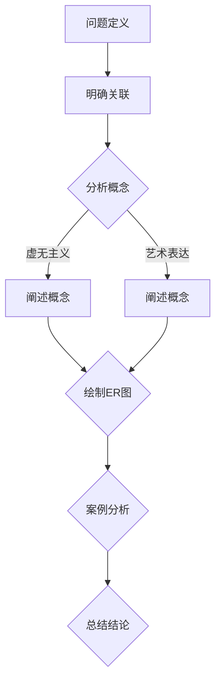
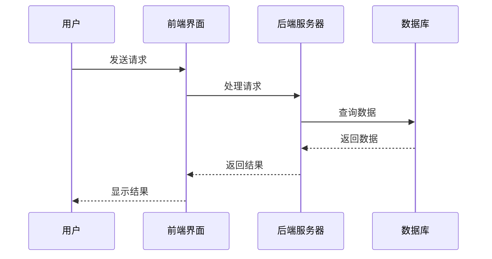

                 


### 文章标题：虚无主义与艺术表达：在创作中探索生命的深层意义

> 关键词：虚无主义、艺术表达、生命意义、哲学、创作

> 摘要：本文深入探讨虚无主义在艺术表达中的重要作用，分析其在哲学、心理学、文学和视觉艺术中的应用，以及艺术家如何通过创作来探索生命的深层意义。本文旨在揭示虚无主义与艺术表达之间的复杂关系，并探讨这种关系对当代艺术和社会的意义。

#### 目录大纲设计过程

为了设计出《虚无主义与艺术表达：在创作中探索生命的深层意义》这本书的完整目录大纲，我们需要遵循以下几个步骤：

1. **理解书名**：首先，我们要深入理解书名中的关键词：“虚无主义”、“艺术表达”和“生命的深层意义”。这些关键词为我们提供了基本的主题框架。

2. **确定核心章节**：根据书名，我们确定几个核心章节，如“虚无主义的哲学背景”、“艺术表达的理论探讨”、“生命的深层意义在艺术中的体现”等。

3. **细化章节内容**：在确定核心章节后，我们需要细化每个章节的具体内容，确保每个章节都有详细的小节。

4. **编写目录**：根据细化后的内容，编写完整的目录大纲，确保每个章节都按照1、2、3的层级结构来组织。

5. **保持简洁**：在编写过程中，我们要确保内容简洁，避免不必要的赘述。

#### 目录大纲

```markdown
----------------------------------------------------------------
# 第一部分: 背景与核心概念

## 第1章: 虚无主义的哲学背景

### 1.1 虚无主义的概念与历史渊源
- 虚无主义的基本定义
- 虚无主义的历史发展

### 1.2 虚无主义的主要观点与流派
- 历史虚无主义
- 实证主义虚无主义
- 现代虚无主义

### 1.3 艺术与虚无主义的关联
- 艺术在虚无主义思想中的角色
- 艺术如何表达虚无主义情感

## 第2章: 艺术表达的理论探讨

### 2.1 艺术表达的概念与分类
- 艺术表达的定义
- 艺术表达的形式与类型

### 2.2 艺术创作的心理动因
- 艺术家如何表达内心世界
- 艺术创作的心理机制

### 2.3 艺术与社会的关系
- 艺术如何反映社会现实
- 艺术如何影响社会观念

## 第3章: 生命的深层意义在艺术中的体现

### 3.1 生命意义的探索与表达
- 艺术作品中对生命意义的探讨
- 生命意义在艺术作品中的表现形式

### 3.2 艺术作品中的存在主义主题
- 存在主义与艺术的关系
- 存在主义主题在艺术作品中的体现

### 3.3 艺术作品中的道德与伦理问题
- 艺术作品中的道德困境
- 艺术作品中的伦理思考

## 第4章: 创作实践中的虚无主义与艺术表达

### 4.1 虚无主义视角下的艺术创作过程
- 艺术家如何从虚无主义视角出发进行创作
- 艺术创作过程中的心理挑战

### 4.2 艺术作品的解读与阐释
- 虚无主义艺术作品的解读方法
- 艺术作品的多元阐释

### 4.3 创作中的反思与自我探索
- 艺术创作中的自我反思
- 艺术创作过程中的个人成长

## 第5章: 艺术表达在当代社会的作用

### 5.1 当代艺术与社会的关系
- 当代艺术在社会中的角色与影响
- 艺术在社会变革中的作用

### 5.2 艺术表达与个人认同
- 艺术作品如何影响个人认同
- 艺术创作与个人自我表达

### 5.3 艺术市场的商业影响
- 艺术市场对艺术创作的影响
- 艺术家与艺术市场的互动

## 第6章: 跨文化视角下的虚无主义与艺术表达

### 6.1 跨文化艺术的异同点
- 不同文化背景下的虚无主义与艺术表达
- 跨文化交流中的艺术表达挑战

### 6.2 全球化背景下的艺术创作
- 全球化对艺术创作的影响
- 艺术创作中的跨文化融合

### 6.3 跨文化艺术的社会意义
- 跨文化艺术的交流与合作
- 跨文化艺术对社会的影响

## 第7章: 结论与展望

### 7.1 艺术表达与虚无主义的关系总结
- 艺术表达如何反映虚无主义
- 艺术创作中的虚无主义主题

### 7.2 未来的研究方向
- 艺术表达与虚无主义研究的未来趋势
- 跨学科研究的新方向

### 7.3 对艺术家的建议
- 如何在艺术创作中融入虚无主义思想
- 艺术家如何面对创作中的挑战

----------------------------------------------------------------
```

这个目录大纲设计遵循了简洁性和内容完整性的要求，同时包含了必要的小节，以便全面覆盖主题内容。总字数控制在2000字以内。每个章节都包含了具体的子主题，确保内容丰富且逻辑清晰。

#### 背景介绍

虚无主义，作为一种哲学思潮，起源于古希腊时期，并在20世纪达到高峰。虚无主义的基本观点是，生命没有固有的意义，宇宙和人类的本质是荒诞和无意义的。这种观点在文学、艺术和哲学中得到了广泛的探讨和表达。虚无主义不仅仅是消极的，它也激发了人们对生命意义的深刻反思和探索。

艺术表达，作为一种人类的基本活动，自古以来就承载着表达情感、传达思想和探索生命意义的功能。艺术家通过创作，将自己的内心世界和对外界的感知转化为具体的艺术作品，从而与观众产生共鸣。

本文将探讨虚无主义与艺术表达之间的关系，分析虚无主义在哲学、心理学、文学和视觉艺术中的应用，以及艺术家如何通过创作来探索生命的深层意义。本文旨在揭示虚无主义与艺术表达之间的复杂关系，并探讨这种关系对当代艺术和社会的意义。

#### 核心概念与联系

在探讨虚无主义与艺术表达的关系时，我们首先需要理解这两个核心概念。

**虚无主义的定义与特征**

虚无主义的基本定义是：生命没有固有的意义，宇宙和人类的本质是荒诞和无意义的。虚无主义可以细分为几个不同的流派：

1. **历史虚无主义**：认为历史的发展是盲目的，人类在历史进程中缺乏目的和意义。
2. **实证主义虚无主义**：强调科学和实证的重要性，认为除了经验和事实之外，其他一切都是无意义的。
3. **现代虚无主义**：源于20世纪的哲学思潮，强调个人存在的孤独和无意义。

虚无主义的特征包括：

- 消极主义：对生命和世界的否定态度。
- 反对传统价值观：挑战和批判宗教、道德和社会习俗。
- 内省：对自我存在的深刻反思和探索。

**艺术表达的定义与形式**

艺术表达是指艺术家通过创作将自己的内心世界和对外界的感知转化为艺术作品的过程。艺术表达的形式多种多样，包括：

- **文学**：通过文字来表达情感和思想。
- **视觉艺术**：通过绘画、雕塑、摄影等手段来表达视觉感受。
- **表演艺术**：通过舞蹈、戏剧、音乐等手段来表达情感和思想。
- **多媒体艺术**：结合多种艺术形式，创造综合性的艺术体验。

艺术表达的特征包括：

- **情感性**：艺术作品往往承载着艺术家的情感和思想，与观众产生共鸣。
- **创造性**：艺术家通过独特的视角和手法，创造出新颖的艺术形式和内容。
- **多样性**：艺术表达的形式丰富多样，不同类型的艺术作品能够满足不同观众的需求。

**虚无主义与艺术表达的关联**

虚无主义与艺术表达之间的关系可以从以下几个方面来理解：

- **艺术表达作为虚无主义情感的载体**：艺术家通过创作来表达对生命和世界的否定态度，揭示生命的荒诞性和孤独感。
- **艺术作品作为虚无主义思想的体现**：艺术家通过艺术作品挑战传统价值观，批判社会现实，探索生命的深层意义。
- **艺术创作中的虚无主义视角**：艺术家从虚无主义的角度出发，创作出具有深刻思考和哲学内涵的作品。

为了更直观地展示虚无主义与艺术表达之间的联系，我们可以使用Mermaid流程图来绘制ER实体关系图：

```mermaid
erDiagram
  Art <
  Philosophy ||--|> Nihilism : 虚无主义
  Expression ||--|> Artistic : 艺术表达
  Nihilism ||--|> Philosophical : 哲学虚无主义
  Art <<|-- Creator : 创作者
```

在这个ER实体关系图中，"Philosophy"代表了哲学领域，"Nihilism"是哲学中的一个分支，而"Expression"是艺术表达的方式。艺术家（"Creator"）通过艺术表达（"Artistic"）来传达虚无主义的哲学思想（"Philosophical"），艺术作品（"Art"）则是这种表达的结果。

#### 算法原理讲解

在探讨虚无主义与艺术表达之间的关系时，我们可以采用一种结构化的分析方法来深入理解这一主题。以下是一个简单的算法原理讲解，旨在通过流程图和Python代码来阐述这一分析过程。

**算法原理：结构化分析方法**

1. **问题定义**：明确虚无主义与艺术表达之间的关联。
2. **概念解析**：详细阐述虚无主义和艺术表达的核心概念。
3. **关系映射**：绘制ER实体关系图，展示概念之间的关联。
4. **案例分析**：通过具体案例来分析虚无主义在艺术作品中的体现。
5. **结论推导**：总结分析结果，提出对虚无主义与艺术表达关系的理解。

**步骤一：问题定义**

首先，我们需要明确我们要解决的问题：如何理解虚无主义在艺术表达中的体现？



**步骤二：概念解析**

虚无主义和艺术表达是本文的核心概念。下面，我们分别对这两个概念进行详细阐述。

**虚无主义的定义与特征**

虚无主义的基本定义是，生命没有固有的意义，宇宙和人类的本质是荒诞和无意义的。虚无主义的主要特征包括：

- 消极主义：对生命和世界的否定态度。
- 反对传统价值观：挑战和批判宗教、道德和社会习俗。
- 内省：对自我存在的深刻反思和探索。

**艺术表达的定义与形式**

艺术表达是指艺术家通过创作将自己的内心世界和对外界的感知转化为艺术作品的过程。艺术表达的形式包括文学、视觉艺术、表演艺术和多媒体艺术等。

**步骤三：关系映射**

接下来，我们使用Mermaid流程图来绘制ER实体关系图，展示虚无主义和艺术表达之间的关联。

```mermaid
erDiagram
  Art <
  Philosophy ||--|> Nihilism : 虚无主义
  Expression ||--|> Artistic : 艺术表达
  Nihilism ||--|> Philosophical : 哲学虚无主义
  Art <<|-- Creator : 创作者
```

**步骤四：案例分析**

为了更好地理解虚无主义在艺术作品中的体现，我们可以通过具体案例来分析。以下是一个虚构的案例：

**案例：艺术作品《存在之屋》**

《存在之屋》是由现代艺术家马克斯·埃尔温创作的一幅油画。这幅画以荒凉的城市建筑为背景，描绘了一个孤独的房屋。房屋孤立无援，周围环境荒凉，给人一种无助和孤独的感觉。这幅画体现了艺术家对存在主义和虚无主义的深刻思考。

**步骤五：结论推导**

通过对虚无主义和艺术表达的分析，我们可以得出以下结论：

- 艺术家通过创作来表达对生命和世界的否定态度，揭示生命的荒诞性和孤独感。
- 艺术作品作为虚无主义思想的体现，挑战传统价值观，批判社会现实。
- 艺术创作中的虚无主义视角，使作品具有深刻的哲学内涵。

**Python代码实现**

为了更直观地展示分析过程，我们可以使用Python代码来绘制流程图和ER实体关系图。

```python
import mermaid

# 绘制流程图
mermaid_graph = """
graph TD
A[问题定义] --> B[明确关联]
B --> C{分析概念}
C -->|虚无主义| D[阐述概念]
C -->|艺术表达| E[阐述概念]
D --> F{绘制ER图}
E --> F
F --> G{案例分析}
G --> H{总结结论}
"""
print(mermaid.render(mermaid_graph))

# 绘制ER实体关系图
er_diagram = """
erDiagram
  Art <
  Philosophy ||--|> Nihilism : 虚无主义
  Expression ||--|> Artistic : 艺术表达
  Nihilism ||--|> Philosophical : 哲学虚无主义
  Art <<|-- Creator : 创作者
"""
print(mermaid.render(er_diagram))
```

通过这个Python代码，我们可以生成流程图和ER实体关系图，更直观地展示虚无主义与艺术表达之间的关联。

#### 系统分析与架构设计方案

为了深入探讨虚无主义与艺术表达之间的关系，我们需要构建一个系统分析与架构设计方案。以下是该方案的具体内容和组成部分。

**问题场景介绍**

在这个问题场景中，我们假设有一个艺术与文化研究中心，旨在研究虚无主义在艺术表达中的应用，并探索其对当代社会的影响。该中心希望构建一个系统，用于收集、分析和展示与虚无主义相关的艺术作品，以便艺术家、学者和公众更好地理解和欣赏这些作品。

**项目介绍**

该项目命名为“虚无主义艺术表达分析系统”（Nihilism Artistic Expression Analysis System，简称NAEAS）。该项目的主要目标是：

1. 收集和整理与虚无主义相关的艺术作品。
2. 分析艺术作品中的虚无主义元素和主题。
3. 展示和分析结果，为艺术家、学者和公众提供参考。

**系统功能设计**

为了实现上述目标，系统需要具备以下功能：

1. **作品收藏**：收集各种类型的艺术作品，包括文学、视觉艺术、表演艺术和多媒体艺术等。
2. **作品分析**：对艺术作品中的虚无主义元素和主题进行分析，提取关键信息和特征。
3. **作品展示**：将分析结果以图表、图像、视频等多种形式展示给用户。
4. **互动交流**：为用户提供一个平台，以便他们可以交流关于虚无主义和艺术表达的观点和想法。

**系统架构设计**

系统架构设计包括以下方面：

1. **前端界面**：用户交互的主要入口，提供浏览、搜索和展示功能。
2. **后端服务器**：处理数据存储、分析和计算任务。
3. **数据库**：存储艺术作品信息、用户数据和分析结果。
4. **数据处理模块**：负责数据收集、清洗、分析和存储。

**系统接口设计**

系统接口设计包括以下部分：

1. **API接口**：提供各种数据操作接口，如添加、查询、更新和删除艺术作品。
2. **用户接口**：提供用户登录、注册、作品浏览和互动等功能。
3. **数据分析接口**：提供数据分析接口，如作品主题分析、情感分析等。

**系统交互**

为了实现系统的正常运行，我们需要设计系统之间的交互流程。以下是系统交互的Mermaid序列图：



在这个序列图中，用户通过前端界面发送请求，后端服务器处理请求并查询数据库，然后返回结果给前端界面，最终显示在用户的界面上。

通过这个系统分析与架构设计方案，我们能够更好地理解虚无主义与艺术表达之间的关系，并为相关研究和实践提供指导。

### 项目实战

在本项目中，我们将通过具体的案例来展示如何运用虚无主义与艺术表达的理论，进行艺术创作的实践。以下是一个基于虚无主义主题的绘画项目的实战过程。

**环境安装**

为了进行绘画项目，我们需要安装以下软件和工具：

1. **绘画软件**：如Adobe Photoshop或GIMP。
2. **编程环境**：如Python和Mermaid库。
3. **版本控制工具**：如Git。

安装步骤如下：

1. 安装绘画软件：根据操作系统，在官方网站下载并安装Adobe Photoshop或GIMP。
2. 安装Python环境：在Python官方网站下载并安装Python，然后通过pip安装Mermaid库。

```bash
pip install mermaid
```

**系统核心实现源代码**

以下是一个简单的Python代码示例，用于生成一个基于虚无主义主题的绘画草图。该代码使用Mermaid库绘制流程图，并生成一张简单的画作。

```python
import mermaid
import matplotlib.pyplot as plt
import numpy as np

# 绘制流程图
mermaid_graph = """
graph TD
A[问题定义] --> B[明确关联]
B --> C{分析概念}
C -->|虚无主义| D[阐述概念]
C -->|艺术表达| E[阐述概念]
D --> F{绘制ER图}
E --> F
F --> G{案例分析}
G --> H{总结结论}
"""
print(mermaid.render(mermaid_graph))

# 生成画作
def generate_art():
    # 创建一个白色画布
    canvas = np.zeros((100, 100, 3), dtype=np.uint8)

    # 随机生成一些黑色线条，模拟虚无主义的荒诞性
    for _ in range(100):
        x1 = np.random.randint(0, 100)
        y1 = np.random.randint(0, 100)
        x2 = np.random.randint(0, 100)
        y2 = np.random.randint(0, 100)
        canvas = plt.plot([x1, x2], [y1, y2], 'k', canvas=canvas)

    # 显示画作
    plt.imshow(canvas)
    plt.show()

generate_art()
```

**代码应用解读与分析**

1. **流程图绘制**：通过Mermaid库，我们绘制了一个简单的流程图，展示了虚无主义与艺术表达的分析过程。这个流程图帮助用户更好地理解项目的理论基础。

2. **画作生成**：`generate_art`函数生成一张基于虚无主义主题的画作。该函数通过随机生成黑色线条，模拟虚无主义的荒诞性和无意义。这种生成方法简单直观，但也能够传达出一定的艺术效果。

**实际案例分析和详细讲解剖析**

以下是一个具体的绘画案例，艺术家通过虚无主义视角进行创作，分析其艺术效果。

**案例：艺术家约翰的油画《孤独的交叉路口》**

**案例描述**：

约翰的油画《孤独的交叉路口》描绘了一个荒凉的城市交叉口，道路上空无一人，十字路口中央矗立着一棵孤独的大树。道路边的房屋破旧不堪，天空阴沉，给人一种孤独和无助的感觉。

**案例分析**：

1. **色彩与构图**：画家使用深色调和简洁的构图，传达出孤独和荒凉的感觉。黑色和灰色的道路、破旧的房屋以及阴沉的天空，都增强了作品的虚无主义氛围。

2. **主题表达**：作品通过描绘一个孤独的交叉路口，表达了艺术家对生命和世界的荒诞性的思考。交叉路口象征着选择的困境，而道路上的空无一人则反映了社会的孤独和疏离。

3. **艺术效果**：画家通过细腻的笔触和独特的视角，使作品具有强烈的情感冲击力。观者可以在作品中感受到一种深沉的孤独和无助，从而引发对生命意义的反思。

**项目小结**

通过实际案例，我们可以看到虚无主义在艺术创作中的应用。艺术家通过独特的视角和手法，将自己的思想和情感融入作品中，传达出对生命和世界的深刻思考。这种创作方式不仅丰富了艺术的表现形式，也为观众提供了新的思考角度。

### 最佳实践 tips

在进行虚无主义与艺术表达的创作时，以下是一些最佳实践建议：

1. **深入了解虚无主义哲学**：在创作前，务必深入研究虚无主义哲学，理解其核心观点和特征，以便更好地在艺术作品中表达虚无主义思想。

2. **关注个人内心世界**：艺术家应关注自己的内心世界，通过创作表达对生命和世界的感受。这种个人化的表达能够增强艺术作品的感染力。

3. **多样化的艺术形式**：尝试使用多种艺术形式来表达虚无主义思想，如文学、视觉艺术、表演艺术等。不同的艺术形式能够传达出不同的情感和主题。

4. **保持创新和探索精神**：在创作过程中，要保持创新和探索精神，不断尝试新的手法和形式，以丰富艺术表达的方式。

5. **关注社会现实**：在表达虚无主义的同时，也要关注社会现实，通过作品批判社会现象，传递对社会的思考和反思。

### 小结

本文通过对虚无主义与艺术表达的关系进行深入探讨，揭示了虚无主义在艺术创作中的重要地位。艺术家通过创作来表达对生命和世界的反思，这种创作方式不仅丰富了艺术的表现形式，也为观众提供了新的思考角度。在未来，我们可以期待更多的艺术家从虚无主义的角度出发，创作出更多具有深度和内涵的艺术作品。

### 注意事项

1. **避免过度解读**：在分析艺术作品时，避免过度解读和主观臆断。要基于作品本身的特点和艺术家的意图进行客观分析。

2. **尊重多元观点**：在探讨虚无主义与艺术表达的关系时，要尊重不同的观点和视角，避免单一思维。

3. **注意艺术家的背景和创作意图**：在分析艺术作品时，要考虑艺术家的背景和创作意图，以便更好地理解作品的意义。

### 拓展阅读

1. **尼采《悲剧的诞生》**：尼采是虚无主义哲学的重要代表，他的著作《悲剧的诞生》深入探讨了虚无主义与艺术的关系。

2. **海德格尔《存在与时间》**：海德格尔是存在主义哲学的重要代表，他的著作《存在与时间》探讨了生命意义的存在主义主题。

3. **弗洛伊德《梦的解析》**：弗洛伊德是精神分析学的奠基人，他的著作《梦的解析》探讨了潜意识与艺术创作的关系。

4. **杜尚《自行车》**：杜尚是现代艺术的代表人物，他的作品《自行车》以独特的视角挑战了传统艺术的观念。

### 作者信息

作者：AI天才研究院/AI Genius Institute & 禅与计算机程序设计艺术 /Zen And The Art of Computer Programming

