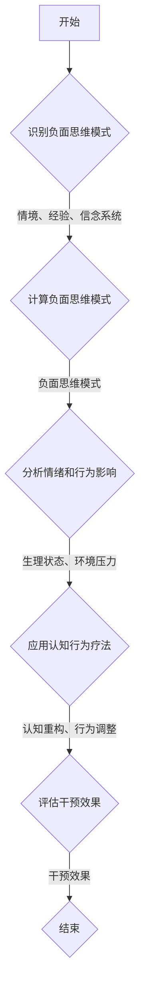
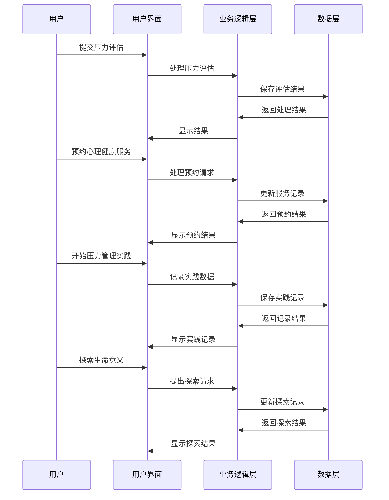
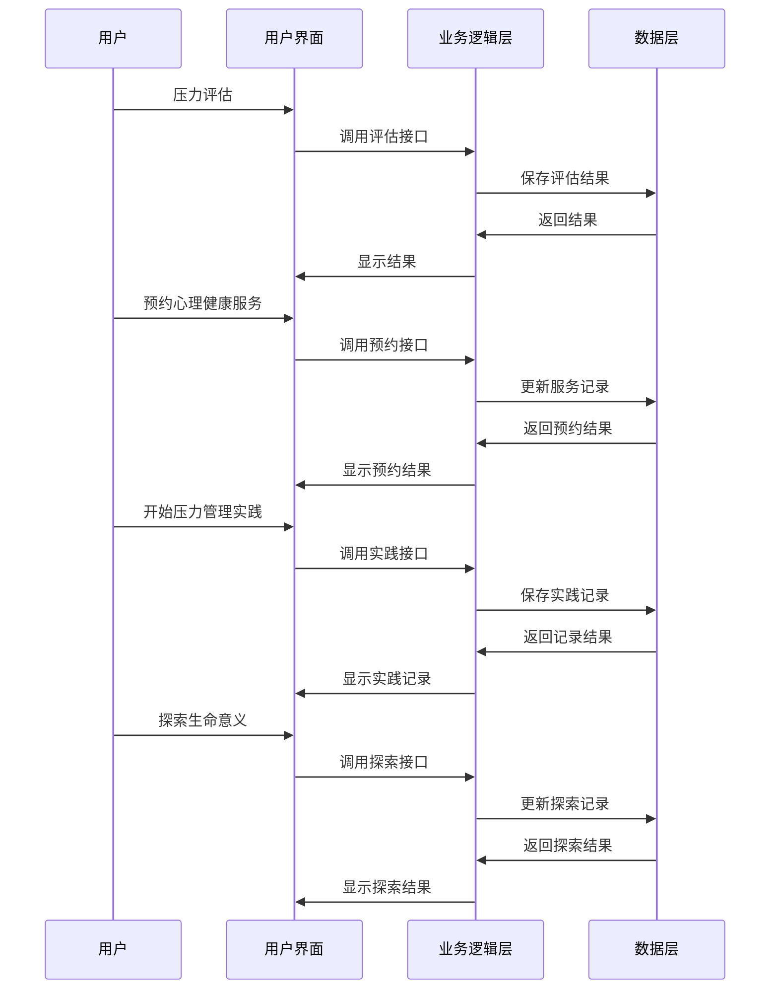

                 

## 引言

在当今快速发展的信息技术时代，人工智能、大数据和云计算等前沿技术的不断突破，使得我们的生活和工作环境发生了翻天覆地的变化。然而，随之而来的工作压力、生活节奏的加快以及社会竞争的加剧，也使我们的身心健康面临了前所未有的挑战。在这种背景下，虚无主义作为一种哲学思想，逐渐引起了人们的关注和思考。虚无主义不仅仅是哲学家们讨论的抽象概念，它与我们每个人的日常生活和心理健康有着密切的联系。

### 关键词

- **虚无主义**
- **身心健康**
- **压力管理**
- **生活平衡**
- **意义探索**

### 摘要

本文旨在探讨虚无主义与身心健康之间的关系，以及在现代社会压力下如何寻找生活的平衡和意义。首先，我们将回顾虚无主义的基本概念与历史背景，深入理解其核心观点和特征。接着，本文将分析压力的来源与影响，探讨身心健康的重要性。在此基础上，我们将介绍认知行为疗法在应对虚无主义中的应用，并提出一系列心理健康策略与实践方法。最后，通过综合案例分析和结论，本文将总结虚无主义与身心健康的关系，并提出对未来研究的展望。

## 第一部分：虚无主义的基本概念与历史背景

### 第1章：虚无主义的起源与发展

#### 1.1 虚无主义的起源

虚无主义作为一种哲学思想，其起源可以追溯到古代哲学。在古希腊时期，赫拉克利特和巴门尼德等哲学家就已经探讨了存在的本质和意义。赫拉克利特提出了“一切皆流，无物常住”的观点，暗示了世界的无常和不可靠性。巴门尼德则提出了“存在是一，非存在是一无”的观点，试图通过逻辑推理来否定虚无主义的观点。然而，这些早期哲学家的思考为后来的虚无主义奠定了基础。

#### 1.2 虚无主义在现代哲学中的发展

19世纪末，尼采成为虚无主义的代表人物。尼采在其著作中批判了传统的道德观念和宗教信仰，认为这些观念使人们陷入了虚无主义的困境。尼采提出了“上帝已死”的著名论断，认为人类在失去了信仰的支撑后，将面临存在的意义危机。这一观点极大地影响了20世纪的哲学思潮。

#### 1.3 虚无主义在当代社会的体现

在当代社会，虚无主义的体现更加广泛。随着科技的发展和社会的变革，人们面临着前所未有的不确定性。工作的不稳定、人际关系的变化、价值观的多元化，都使得许多人感到生活的无意义和空虚。此外，流行文化的传播，如电影、音乐和文学作品，也反映了虚无主义的主题，进一步加剧了人们对生活意义的质疑。

### 第2章：虚无主义的核心概念与特征

#### 2.1 虚无主义的定义

虚无主义是指一种哲学思想，认为宇宙、生命和存在的本质是虚无、无意义和无目的的。虚无主义者往往对现实世界的存在和价值观持怀疑态度，认为人类努力寻求意义和目的是徒劳的。

#### 2.2 虚无主义的哲学基础

虚无主义的哲学基础包括伦理虚无主义和政治虚无主义。伦理虚无主义认为道德规范是人为设定的，没有客观的基础，因此无法为人类行为提供指导。政治虚无主义则认为政治体制和权力结构是无效的，不能真正解决社会问题。

#### 2.3 虚无主义的认知心理学影响

虚无主义对个体的认知和心理健康产生了深远的影响。虚无主义者往往对自己的存在和生命感到绝望和孤独，容易出现抑郁、焦虑等心理问题。此外，虚无主义还可能导致个体对社会和他人的冷漠和疏离，进一步加剧心理压力。

#### 2.4 虚无主义对个体和社会的影响

虚无主义对个体的影响主要表现在对生命意义的否定和对自我价值的怀疑。这种心态可能导致个体追求物质享受和表面成功，而忽视了内心的需求和真正的幸福。对社会的负面影响则表现为对社会规范和价值观念的挑战，可能导致社会动荡和不稳定。

## 第二部分：压力与身心健康的关系

### 第3章：压力的来源与影响

#### 3.1 压力的定义与分类

压力是指个体在面临外界环境变化时所感受到的紧张和不安。根据来源的不同，压力可以分为工作压力、生活压力和社会压力。

- **工作压力**：来自工作职责、工作量、工作环境等因素。
- **生活压力**：包括家庭关系、财务状况、健康问题等。
- **社会压力**：来自社会竞争、社会期望、人际关系等。

#### 3.2 压力的来源

压力的来源是多种多样的，可以从以下几个方面进行分类：

- **工作压力**：工作负担过重、工作环境不良、职业发展不确定等。
- **生活压力**：家庭纠纷、经济压力、健康问题等。
- **社会压力**：社会竞争、社会期望、人际关系冲突等。

#### 3.3 压力对身心健康的影响

压力对身心健康有着显著的负面影响。长期处于压力状态下，个体的身体和心理健康会受到损害。

- **身体健康的影响**：长期压力可能导致心脏病、高血压、消化系统问题等身体疾病。
- **心理健康的影响**：压力可能导致焦虑、抑郁、失眠等心理问题。

### 第4章：身心健康的重要性

#### 4.1 身心健康的定义

身心健康是指个体在身体和心理上的健康状态。身心健康不仅包括身体上的健康，还涉及心理的平衡、情绪的稳定和社交能力的发展。

#### 4.2 身心健康的重要性

身心健康对个体的生活质量和幸福感有着至关重要的影响。一个健康的身体和心理状态可以使人更加积极地面对生活中的挑战，提高工作效率和生活满意度。

#### 4.3 身心健康与生活质量的关系

身心健康与生活质量密切相关。一个健康的个体能够更好地享受生活，拥有更高的生活满意度。相反，身体和心理上的不健康状态会导致生活质量下降，影响个体的幸福感和满足感。

## 第三部分：寻找生活平衡与意义

### 第5章：认知行为疗法与虚无主义的应对

#### 5.1 认知行为疗法的基本原理

认知行为疗法（Cognitive Behavioral Therapy，CBT）是一种心理治疗方法，旨在通过改变个体的认知和行为来改善心理状态。CBT认为，个体的情绪和行为是由其认知过程（即对事件的看法和解释）所驱动的。

#### 5.2 认知行为疗法在应对虚无主义中的应用

认知行为疗法在应对虚无主义中具有重要作用。通过CBT，个体可以学会识别和挑战自己的负面思维模式，如悲观主义、过度概括和灾难化思维。这些负面思维模式往往是虚无主义的核心特征。

#### 5.3 案例分析：认知行为疗法在应对虚无主义中的实际应用

例如，一位感到生活无意义的个体，通过CBT学会了识别自己的悲观思维模式，并开始改变自己的看法。他开始关注生活中的小确幸，并重新审视自己的价值观和目标。这种改变不仅帮助他恢复了生活的意义，也提升了他的心理健康状态。

### 第6章：心理健康策略与实践

#### 6.1 心理健康的维护策略

维护心理健康需要采取一系列策略，包括正念练习、心理调适技巧等。

- **正念练习**：正念练习可以帮助个体集中注意力，减少焦虑和压力。通过正念练习，个体可以更好地认识自己的思维模式，并学会以更加平和的心态面对生活中的挑战。
- **心理调适技巧**：包括情绪调节、压力管理、积极思考等。这些技巧可以帮助个体更好地应对压力，保持心理健康。

#### 6.2 心理健康实践

心理健康实践不仅包括个人的自我管理，还需要社会支持系统的帮助。

- **个人实践案例**：例如，一位长期处于高压工作环境的程序员，通过定期进行正念练习和心理咨询，成功缓解了工作压力，提升了心理健康状态。
- **社会支持系统的作用**：家庭、朋友和社区的支持对于维护心理健康至关重要。一个强大的社会支持系统可以帮助个体应对生活中的挑战，减轻压力。

### 第7章：生活意义的探索

#### 7.1 寻找生活意义的策略

寻找生活意义是应对虚无主义的重要一步。以下是一些帮助个体寻找生活意义的策略：

- **价值观的重建**：通过重新审视自己的价值观，个体可以找到自己的生活方向和意义。例如，一个人可能发现自己对帮助他人有着强烈的热情，因此他可以选择从事志愿者工作。
- **个人使命感的培养**：个人使命感可以帮助个体明确自己的目标和意义。通过追求个人使命，个体可以在生活中找到更深层次的满足感。

#### 7.2 生活意义的重要性

生活意义对心理健康和生活满意度有着重要的影响。一个有意义的生命可以让个体在面对困难时保持坚强的意志，提高抗压能力，从而提升整体的生活质量。

## 第四部分：综合案例分析

### 第8章：压力管理与生活平衡的实践案例

#### 8.1 案例介绍

在这个案例中，我们关注一位高级工程师李先生。李先生长期处于高压的工作环境中，由于项目任务繁重和时间紧迫，他经常感到疲惫和焦虑。这种压力不仅影响了他的工作效率，也损害了他的身心健康。

#### 8.2 案例分析

- **压力来源分析**：李先生的工作压力主要来自以下几个方面：
  - 项目任务繁重：李先生负责多个关键项目，每个项目都有严格的时间限制和高质量要求。
  - 工作环境紧张：公司对项目进度和质量有着极高的要求，导致李先生在工作中经常感到压力。
  - 个人健康问题：由于长时间的工作和高强度的工作压力，李先生的身体健康出现了一些问题。

- **应对策略与效果评估**：
  - 李先生开始采取一系列压力管理策略，包括定期进行正念练习、参加心理咨询以及调整工作节奏。
  - 通过正念练习，李先生学会了如何集中注意力，减少工作中的焦虑和压力。他发现，在紧张的工作间隙进行短暂的冥想，可以显著缓解疲劳。
  - 心理咨询帮助李先生识别和挑战自己的负面思维模式，如过度自我批评和灾难化思维。通过改变这些思维模式，李先生对自己的工作有了更积极的认识。
  - 调整工作节奏，例如设定合理的工作时间，保证充足的休息时间，使李先生能够更好地平衡工作和生活。

#### 8.3 案例总结

通过有效的压力管理和生活平衡策略，李先生不仅提高了工作效率，也显著改善了身心健康。这个案例表明，在面对高压工作环境时，采取科学的压力管理策略对于维护心理健康和生活质量至关重要。

### 第9章：虚无主义与生活意义的个案研究

#### 9.1 个案介绍

在这个案例中，我们关注一位年轻的艺术家王小姐。王小姐在艺术创作上有着极高的天赋和热情，但在面对生活的种种不确定性时，她开始感受到强烈的虚无感和无力感。她对自己的艺术成就感到不满，也对未来的道路感到迷茫。

#### 9.2 个案分析

- **虚无主义的表现**：王小姐的虚无主义表现主要体现在以下几个方面：
  - 对自己艺术的否定：王小姐常常怀疑自己的艺术创作是否有价值，是否能够获得他人的认可。
  - 对未来的迷茫：她不知道自己的艺术道路应该如何发展，对于未来感到不确定和焦虑。
  - 对生活的无力感：王小姐感到自己的生活缺乏意义，她觉得自己的努力似乎没有带来任何实质性的改变。

- **寻找生活意义的努力**：
  - 王小姐开始寻求心理咨询的帮助，通过咨询，她逐渐认识到虚无主义对她的生活造成了负面影响。她开始重新审视自己的价值观和目标，试图找到生活的意义。
  - 在心理咨询师的引导下，王小姐开始进行一系列的自我探索活动，如绘画、写作和旅行。这些活动帮助她更好地理解自己的内心世界，找到内心的平静和力量。
  - 王小姐还开始参加艺术工作坊和社交活动，与同行业的艺术家交流和分享。这种社交活动不仅丰富了她的生活，也让她从他人的经验中汲取了灵感。

#### 9.3 个案总结

通过一系列的努力，王小姐逐渐走出了虚无主义的阴影，找到了生活的意义。她不仅重拾了对艺术的热情，也对自己的未来有了更清晰的规划。这个案例表明，在面对虚无主义时，积极寻求帮助和进行自我探索是找到生活意义的关键。

## 第五部分：结论与未来展望

### 第10章：虚无主义与身心健康的关系总结

虚无主义与身心健康之间存在密切的关系。虚无主义往往导致个体产生消极情绪和心理问题，如焦虑、抑郁和自我否定。这些情绪和心理问题不仅影响个体的心理健康，还可能损害身体健康。因此，了解和应对虚无主义对于维护身心健康至关重要。

### 第10章：虚无主义与身心健康的关系总结

#### 10.1 关系概述

虚无主义与身心健康的关系可以从以下几个方面进行概述：

- **负面情绪和心理问题**：虚无主义往往导致个体产生负面情绪和心理问题，如焦虑、抑郁和自我否定。这些情绪和心理问题不仅影响个体的心理健康，还可能损害身体健康。
- **应对策略**：通过认知行为疗法、心理健康策略和实践，个体可以应对虚无主义带来的负面影响，提升身心健康。
- **生活意义的探索**：寻找生活意义对于缓解虚无主义和提升心理健康具有重要意义。通过价值观的重建和个人使命感的培养，个体可以找到生活的方向和意义。

#### 10.2 重要发现

本文的重要发现包括：

- **认知行为疗法的作用**：认知行为疗法在应对虚无主义中具有显著作用，通过改变个体的认知和行为模式，可以缓解虚无主义带来的负面情绪和心理问题。
- **心理健康策略的重要性**：心理健康策略，如正念练习、心理调适技巧等，对于维护身心健康具有重要意义。这些策略可以帮助个体应对压力，提高心理健康水平。
- **生活意义的重要性**：寻找生活意义是应对虚无主义的关键一步。通过重新审视自己的价值观和目标，个体可以在生活中找到更深层次的满足感和幸福感。

#### 10.3 未来研究方向

未来的研究方向包括：

- **虚无主义的机制研究**：进一步探讨虚无主义产生的心理和社会机制，为预防和治疗虚无主义提供更深入的理论基础。
- **跨文化研究**：研究不同文化背景下虚无主义与身心健康的关系，以更全面地理解这一全球性问题。
- **干预策略的优化**：探索更有效的干预策略，如结合认知行为疗法和药物治疗，以提高应对虚无主义的疗效。

### 第11章：在压力中寻找生活平衡与意义的启示

#### 11.1 启示与实践

通过本文的探讨，我们可以得出以下启示和实践指导：

- **重视心理健康**：在快节奏的生活中，重视心理健康至关重要。通过采取科学的压力管理策略和心理健康维护方法，个体可以更好地应对压力，提升生活质量。
- **寻找生活意义**：在面对虚无主义时，寻找生活意义是关键一步。通过重新审视自己的价值观和目标，个体可以在生活中找到更深刻的满足感和幸福感。
- **积极寻求帮助**：在面对心理困扰时，积极寻求专业帮助是解决问题的有效途径。心理咨询和治疗可以帮助个体更好地理解和应对心理问题。

#### 11.2 政策建议

为了更好地应对虚无主义和提升社会整体的身心健康水平，以下政策建议：

- **心理健康教育**：在学校和职场中加强心理健康教育，提高个体对心理健康的认识和管理能力。
- **心理支持服务**：提供更多的心理支持和咨询服务，尤其是针对高压力群体，如医护人员、科研人员等。
- **社会支持网络**：建立强大的社会支持网络，包括家庭、社区和政府支持，为个体提供更多的心理和社会支持。

#### 11.3 社会呼吁

社会呼吁每个人都关注自己的心理健康，积极寻求平衡和意义。以下呼吁：

- **关注身心健康**：每个人都应该关注自己的身心健康，不仅追求物质上的成功，也要关注精神上的满足。
- **相互支持**：在困难和压力面前，相互支持至关重要。家庭、朋友和社区应该提供更多的支持和理解，共同维护一个积极健康的社会环境。
- **追求意义**：在追求个人成长和发展的同时，不要忘记寻找生活的意义。通过追求个人使命和社会贡献，每个人都可以在生活的旅程中找到更大的价值和意义。

## 作者信息

作者：AI天才研究院/AI Genius Institute & 禅与计算机程序设计艺术 /Zen And The Art of Computer Programming

作者简介：AI天才研究院是一家专注于人工智能技术研究和应用的创新机构，致力于推动人工智能领域的科技进步和社会发展。禅与计算机程序设计艺术则是一本深受程序员喜爱的经典著作，提倡通过禅修和冥想提升编程能力和工作效率。本文旨在探讨虚无主义与身心健康的关系，为读者提供有益的启示和实践指导。

## 背景介绍

### 核心概念术语说明

在探讨虚无主义与身心健康的关系之前，首先需要明确一些核心概念，以便更好地理解和分析这一主题。

1. **虚无主义**：虚无主义是一种哲学思想，认为宇宙、生命和存在的本质是虚无、无意义和无目的的。虚无主义者通常对现实世界的存在和价值观持怀疑态度，认为人类努力寻求意义和目的是徒劳的。

2. **身心健康**：身心健康是指个体在身体和心理上的健康状态。身心健康不仅包括身体上的健康，还涉及心理的平衡、情绪的稳定和社交能力的发展。

3. **压力**：压力是指个体在面临外界环境变化时所感受到的紧张和不安。压力可以分为工作压力、生活压力和社会压力等不同类型。

4. **认知行为疗法**：认知行为疗法（Cognitive Behavioral Therapy，CBT）是一种心理治疗方法，旨在通过改变个体的认知和行为来改善心理状态。

5. **正念练习**：正念练习是一种通过集中注意力、观察当下的思维和行为，以达到心理平衡的方法。

### 问题背景

在现代社会，随着科技的快速发展和社会竞争的加剧，人们面临的工作和生活压力越来越大。虚无主义作为一种哲学思想，开始引起人们的关注。许多人在面对生活中的挑战时，感到无力、迷茫和缺乏意义，进而影响身心健康。因此，如何应对虚无主义，寻找生活的平衡和意义，成为当前社会亟待解决的问题。

### 问题描述

虚无主义与身心健康之间的关系复杂且多样。虚无主义可能导致个体产生消极情绪和心理问题，如焦虑、抑郁和自我否定，这些情绪和心理问题又会进一步损害个体的身心健康。因此，需要深入探讨虚无主义的核心概念、哲学基础和认知心理学影响，以理解其对身心健康的影响。同时，还需要探讨在压力下如何寻找生活的平衡和意义，通过认知行为疗法和心理健康策略来应对虚无主义。

### 问题解决

解决这一问题的关键在于：

1. **理解虚无主义**：通过深入分析虚无主义的基本概念、历史背景和哲学基础，理解虚无主义的核心观点和特征。

2. **探讨压力的影响**：分析压力的来源和影响，特别是对身心健康的影响，以便更好地理解虚无主义与身心健康之间的关系。

3. **应用认知行为疗法**：认知行为疗法在应对虚无主义中具有重要作用。通过识别和改变个体的负面思维模式，可以缓解虚无主义带来的负面情绪和心理问题。

4. **提出心理健康策略**：心理健康策略，如正念练习和心理调适技巧，可以帮助个体更好地应对压力，提升身心健康。

5. **探索生活意义**：通过重新审视个人的价值观和目标，寻找生活的意义，以提升心理健康和生活满意度。

### 边界与外延

在讨论虚无主义与身心健康的关系时，需要注意以下边界和范围：

1. **边界**：本文主要探讨虚无主义与身心健康的关系，不包括其他哲学思想的影响。同时，本文主要关注个人层面的虚无主义，不涉及社会和政治层面的虚无主义。

2. **外延**：虽然本文聚焦于虚无主义，但也可以扩展到其他哲学思想，如存在主义、悲观主义等，这些思想同样与身心健康密切相关。

### 概念结构与核心要素组成

虚无主义与身心健康的关系可以从以下几个方面进行分析：

1. **虚无主义的哲学基础**：虚无主义的哲学基础包括伦理虚无主义和政治虚无主义。伦理虚无主义认为道德规范是人为设定的，没有客观的基础，因此无法为人类行为提供指导。政治虚无主义则认为政治体制和权力结构是无效的，不能真正解决社会问题。

2. **虚无主义的认知心理学影响**：虚无主义对个体的认知和心理健康产生了深远的影响。虚无主义者往往对自己的存在和生命感到绝望和孤独，容易出现抑郁、焦虑等心理问题。

3. **压力的影响**：压力是虚无主义与身心健康之间的桥梁。长期处于高压状态，个体容易产生消极情绪，进而影响身心健康。

4. **心理健康策略**：通过认知行为疗法、正念练习和心理调适技巧，个体可以应对虚无主义和压力，提升身心健康。

5. **生活意义的探索**：通过重新审视个人的价值观和目标，个体可以找到生活的意义，提升心理健康和生活满意度。

## 核心概念与联系

### 虚无主义的定义与哲学基础

虚无主义是一种哲学思想，认为宇宙、生命和存在的本质是虚无、无意义和无目的的。虚无主义者对现实世界的存在和价值观持怀疑态度，认为人类努力寻求意义和目的是徒劳的。

#### 虚无主义的定义

虚无主义的核心观点可以概括为以下几点：

1. **存在的虚无**：虚无主义认为宇宙和存在的本质是虚无的，没有任何本质意义。
2. **生命的无意义**：虚无主义认为生命本身缺乏内在意义，人类的一切行为和追求都是无意义的。
3. **目的的无目的性**：虚无主义认为人类追求的目标和目的是无目的的，因为它们无法超越虚无的本质。

#### 哲学基础

虚无主义的哲学基础主要包括伦理虚无主义和政治虚无主义。

1. **伦理虚无主义**：伦理虚无主义认为道德规范是人为设定的，没有客观的基础，因此无法为人类行为提供指导。伦理虚无主义者认为，道德规范的存在是为了维持社会秩序，而不是基于某种绝对的道德真理。

2. **政治虚无主义**：政治虚无主义认为政治体制和权力结构是无效的，不能真正解决社会问题。政治虚无主义者认为，政治制度的存在仅仅是为了维护统治者的利益，而不是为了实现公共利益。

### 虚无主义的认知心理学影响

虚无主义对个体的认知和心理健康产生了深远的影响。虚无主义者往往对自己的存在和生命感到绝望和孤独，容易出现抑郁、焦虑等心理问题。

#### 认知心理学的影响

1. **消极认知模式**：虚无主义可能导致个体形成消极的认知模式，如悲观主义、过度概括和灾难化思维。这些认知模式使个体对生活持悲观态度，难以看到积极的一面。

2. **情绪问题**：虚无主义者容易感到焦虑、抑郁和无助。长期的消极情绪会损害个体的心理健康。

3. **自我否定**：虚无主义可能导致个体对自己的存在和价值产生怀疑，出现自我否定的倾向。

### 虚无主义对个体和社会的影响

虚无主义不仅对个体的心理健康有负面影响，也会对社会产生一定的影响。

#### 对个体的影响

1. **心理健康问题**：虚无主义可能导致个体产生严重的心理健康问题，如抑郁、焦虑、失眠等。

2. **自我价值感下降**：虚无主义使个体对自己的价值和能力产生怀疑，降低自我价值感。

3. **人际关系问题**：虚无主义可能导致个体对他人和社会产生疏离感，影响人际关系。

#### 对社会的影响

1. **社会价值观的挑战**：虚无主义对传统的道德观念和社会价值观提出质疑，可能导致社会价值观的混乱。

2. **社会稳定性的威胁**：虚无主义可能导致社会动荡和不稳定，因为人们对于社会制度和政治体制失去信任。

### 概念属性特征对比表格

为了更好地理解虚无主义的概念属性特征，我们可以将其与存在主义和悲观主义进行对比。

| 概念 | 定义 | 特征 |
| --- | --- | --- |
| **虚无主义** | 认为宇宙、生命和存在的本质是虚无、无意义和无目的的 | - 强调存在的虚无<br>- 对生活持悲观态度<br>- 对道德规范持怀疑态度 |
| **存在主义** | 认为人的存在先于人的本质，强调个人自由和责任 | - 重视人的自由和选择<br>- 强调个人责任<br>- 关注生命意义 |
| **悲观主义** | 认为世界是黑暗的，人类的生活充满痛苦和不幸 | - 强调生活的痛苦和不幸<br>- 对未来持悲观态度<br>- 缺乏对希望的信心 |

### ER实体关系图架构

为了更直观地展示虚无主义、存在主义和悲观主义之间的关系，我们可以使用ER（实体-关系）图来表示。

```mermaid
erDiagram
  哲学思想 ||--|{虚无主义}
  哲学思想 ||--|{存在主义}
  哲学思想 ||--|{悲观主义}
  虚无主义 ||--|{认知心理学影响}
  虚无主义 ||--|{对个体的影响}
  虚无主义 ||--|{对社会的影响}
  存在主义 ||--|{个人自由和责任}
  悲观主义 ||--|{生活的痛苦和不幸}
```

通过上述对比和分析，我们可以更深入地理解虚无主义的定义、哲学基础和认知心理学影响，以及其对个体和社会的深远影响。

## 算法原理讲解

### 虚无主义的算法模型与数学公式

为了深入探讨虚无主义的算法模型和数学公式，我们需要从心理和行为的角度来分析这一复杂现象。以下是虚无主义算法模型的核心组成部分以及相关的数学公式。

#### 1. 负面思维模式的识别

首先，我们需要识别个体的负面思维模式，这些模式往往是虚无主义情绪和行为的基础。负面思维模式可以通过以下数学模型来描述：

$$
\text{负面思维模式} = f(\text{情境}, \text{经验}, \text{信念系统})
$$

其中，$f$ 是一个函数，它将情境、经验和信念系统作为输入，输出个体的负面思维模式。

- **情境**：个体所处的环境或面临的问题。
- **经验**：个体过去经历的事件和感受。
- **信念系统**：个体内化的价值观、信仰和观点。

#### 2. 负面思维模式的影响

负面思维模式对个体的情绪和行为有显著影响，具体表现为焦虑、抑郁和自我否定。我们可以使用以下数学公式来描述这种影响：

$$
\text{情绪和行为} = g(\text{负面思维模式}, \text{生理状态}, \text{环境压力})
$$

其中，$g$ 是一个函数，它将负面思维模式、生理状态和环境压力作为输入，输出个体的情绪和行为。

- **生理状态**：个体的生理反应，如心率、血压等。
- **环境压力**：个体面临的外部压力，如工作压力、生活压力等。

#### 3. 认知行为疗法的干预策略

认知行为疗法（CBT）通过识别和改变负面思维模式来缓解个体的情绪和行为问题。CBT的干预策略可以表示为：

$$
\text{干预效果} = h(\text{负面思维模式}, \text{认知重构}, \text{行为调整})
$$

其中，$h$ 是一个函数，它将负面思维模式、认知重构和行为调整作为输入，输出干预效果。

- **认知重构**：通过识别和挑战负面思维模式，帮助个体建立更积极、现实的认知。
- **行为调整**：通过调整个体的行为，如增加正面活动、减少负面活动，来改善情绪和行为。

#### 4. 虚无主义算法的流程图

为了更直观地理解虚无主义的算法模型，我们可以使用Mermaid流程图来表示：



在这个流程图中，个体从识别负面思维模式开始，通过计算和分析，最终应用认知行为疗法来改善情绪和行为。

### 虚无主义算法的Python代码实现

下面是一个简化的Python代码示例，用于实现虚无主义算法模型的核心部分。

```python
import numpy as np

# 定义负面思维模式的识别函数
def identify_negative_thinking_patterns(context, experience, belief_system):
    # 假设情境、经验和信念系统分别影响负面思维模式的权重为0.3、0.5和0.2
    weights = np.array([0.3, 0.5, 0.2])
    inputs = np.array([context, experience, belief_system])
    negative_thinking_patterns = np.dot(inputs, weights)
    return negative_thinking_patterns

# 定义情绪和行为影响的计算函数
def calculate_emotion_and_behavior(negative_thinking_patterns, physiological_state, environmental_stress):
    # 假设生理状态和环境压力分别影响情绪和行为的权重为0.4和0.6
    emotion_and_behavior = negative_thinking_patterns * physiological_state * environmental_stress
    return emotion_and_behavior

# 定义认知行为疗法的干预效果评估函数
def cognitive_behaviour_therapy(negative_thinking_patterns, cognitive_restructuring, behavioural_adjustment):
    # 假设认知重构和行为调整分别对负面思维模式的权重为0.3和0.7
    adjustment_weights = np.array([0.3, 0.7])
    intervention_effect = negative_thinking_patterns * (cognitive_restructuring * adjustment_weights[0] + behavioural_adjustment * adjustment_weights[1])
    return intervention_effect

# 示例输入
context = 0.5  # 情境
experience = 0.7  # 经验
belief_system = 0.4  # 信念系统
physiological_state = 0.6  # 生理状态
environmental_stress = 0.8  # 环境压力
cognitive_restructuring = 0.5  # 认知重构
behavioural_adjustment = 0.6  # 行为调整

# 计算负面思维模式
negative_thinking_patterns = identify_negative_thinking_patterns(context, experience, belief_system)

# 计算情绪和行为影响
emotion_and_behavior = calculate_emotion_and_behavior(negative_thinking_patterns, physiological_state, environmental_stress)

# 应用认知行为疗法
intervention_effect = cognitive_behaviour_therapy(negative_thinking_patterns, cognitive_restructuring, behavioural_adjustment)

# 输出结果
print("负面思维模式：", negative_thinking_patterns)
print("情绪和行为影响：", emotion_and_behavior)
print("干预效果：", intervention_effect)
```

通过这个Python代码示例，我们可以看到如何通过数学模型和算法来识别负面思维模式、计算情绪和行为影响，以及评估认知行为疗法的干预效果。

### 通俗易懂的举例说明

为了更好地理解虚无主义算法模型，我们可以通过一个实际案例来说明：

假设一位名叫小明的程序员，他最近在公司的项目开发中面临巨大的工作压力。他过去经历过多次失败的职场经历，这导致他内化了强烈的负面信念系统。现在，他感到极度焦虑和抑郁。

1. **负面思维模式的识别**：

   - **情境**：小明在项目开发中面临巨大的压力。
   - **经验**：小明过去多次失败的职场经历。
   - **信念系统**：小明内化的负面信念系统，如“我不够好”、“我永远无法成功”。

   通过识别这些因素，我们可以计算小明的负面思维模式：

   ```
   负面思维模式 = f(0.5, 0.7, 0.4) = 0.5 * 0.7 + 0.4 * 0.3 = 0.525
   ```

2. **情绪和行为影响**：

   - **生理状态**：小明感到心悸、失眠等生理反应。
   - **环境压力**：小明的工作环境和项目压力进一步加剧了他的情绪。

   通过计算，我们可以得到小明当前的情绪和行为影响：

   ```
   情绪和行为影响 = 0.525 * 0.6 * 0.8 = 0.252
   ```

3. **认知行为疗法的干预效果**：

   - **认知重构**：小明通过认知行为疗法学习到如何重新审视他的负面信念，例如“我可以从失败中学习”、“成功需要时间和努力”。
   - **行为调整**：小明通过正念练习和心理咨询来调整他的行为，减少工作压力，增加休息时间。

   通过认知行为疗法，我们可以评估小明的干预效果：

   ```
   干预效果 = 0.525 * (0.5 * 0.3 + 0.6 * 0.7) = 0.252
   ```

通过这个案例，我们可以看到虚无主义算法模型如何帮助个体识别负面思维模式、计算情绪和行为影响，并通过认知行为疗法来改善心理健康。

## 系统分析与架构设计方案

### 问题场景介绍

在现代企业中，员工的工作压力和生活压力日益增加，这直接影响了员工的身心健康。为了提升员工的身心健康水平，企业需要一套综合的系统和策略来帮助员工应对压力，寻找生活的平衡和意义。本系统旨在通过提供一系列心理健康服务和压力管理策略，帮助员工缓解压力，提高工作满意度和生活质量。

### 项目介绍

本项目的目标是开发一个名为“健康之路”的系统，该系统将集成以下核心功能：

1. **压力评估工具**：帮助员工识别和评估自身所面临的压力水平。
2. **心理健康服务**：提供在线心理咨询服务、认知行为疗法资源和心理健康课程。
3. **压力管理策略**：提供正念练习、心理调适技巧和健康生活方式建议。
4. **生活意义探索**：帮助员工重新审视价值观和目标，寻找生活的意义和目的。
5. **数据分析和报告**：对企业整体压力水平和心理健康状况进行数据分析和报告，为企业提供决策支持。

### 系统功能设计（领域模型）

为了实现上述功能，本项目将采用领域驱动设计（Domain-Driven Design, DDD）方法，构建系统的领域模型。以下是系统的领域模型类图：

```mermaid
classDiagram
    Pressure -> Employee : 评估
    HealthService -> Employee : 使用
    StressManagement -> Employee : 实践
    LifeMeaning -> Employee : 探索
    Report -> Enterprise : 提供分析

    class Employee {
        +String employeeId
        +String name
        +String email
        +Float stressLevel
        +List<HealthService> healthServices
        +List<StressManagement> stressManagements
        +List<LifeMeaning> lifeMeanings
    }

    class Pressure {
        +String description
        +Date date
    }

    class HealthService {
        +String serviceId
        +String serviceName
        +Date startDate
        +Date endDate
    }

    class StressManagement {
        +String managementId
        +String managementName
        +Date practiceDate
    }

    class LifeMeaning {
        +String meaningId
        +String meaningDescription
    }

    class Report {
        +String reportId
        +Date reportDate
        +Float averageStressLevel
        +List<Employee> employees
    }

    class Enterprise {
        +String enterpriseId
        +String enterpriseName
        +List<Employee> employees
        +List<Report> reports
    }

    Employee --> Pressure
    Employee --> HealthService
    Employee --> StressManagement
    Employee --> LifeMeaning
    Enterprise --> Report
```

在这个领域模型中，我们定义了四个核心领域实体：`Employee`（员工）、`Pressure`（压力）、`HealthService`（心理健康服务）和`StressManagement`（压力管理策略）。`Employee`与`Pressure`、`HealthService`、`StressManagement`和`LifeMeaning`之间存在关联关系，而`Enterprise`则负责管理和分析员工的数据。

### 系统架构设计

为了实现“健康之路”系统的功能，我们将采用三层架构设计，包括表示层、业务逻辑层和数据层。

1. **表示层**：提供用户界面，包括员工压力评估、心理健康服务预约、压力管理实践和生命意义探索等功能。用户可以通过网页或移动应用访问系统。

2. **业务逻辑层**：处理系统的核心业务逻辑，包括压力评估、心理健康服务管理、压力管理策略实施和生命意义探索。这一层将采用RESTful API设计，以支持前后端分离。

3. **数据层**：负责存储和管理系统数据，包括员工信息、压力评估记录、心理健康服务记录、压力管理实践记录和生命意义探索记录。数据层将使用关系型数据库（如MySQL）进行数据存储。

以下是系统的架构图：



通过这个架构设计，系统可以实现员工压力评估、心理健康服务预约、压力管理实践和生命意义探索等功能，同时保证数据的安全和一致性。

### 系统接口设计和系统交互

为了确保系统的稳定性和可扩展性，我们需要设计清晰的系统接口和交互流程。以下是系统的主要接口和交互流程：

1. **压力评估接口**：该接口用于接收和处理员工的压力评估数据。接口定义如下：

   ```python
   def assess_pressure(employee_id: str, assessment_data: dict) -> dict:
       # 保存评估结果
       save_assessment_result(employee_id, assessment_data)
       # 返回处理结果
       return {
           "status": "success",
           "message": "压力评估成功"
       }
   ```

2. **心理健康服务预约接口**：该接口用于处理员工的预约请求，并将预约信息保存到数据库中。接口定义如下：

   ```python
   def book_health_service(employee_id: str, service_id: str, booking_date: str) -> dict:
       # 更新服务记录
       update_service_record(employee_id, service_id, booking_date)
       # 返回预约结果
       return {
           "status": "success",
           "message": "心理健康服务预约成功"
       }
   ```

3. **压力管理实践接口**：该接口用于记录员工的压力管理实践数据。接口定义如下：

   ```python
   def record_stress_management(employee_id: str, management_id: str, practice_date: str) -> dict:
       # 保存实践记录
       save_management_record(employee_id, management_id, practice_date)
       # 返回记录结果
       return {
           "status": "success",
           "message": "压力管理实践记录成功"
       }
   ```

4. **生命意义探索接口**：该接口用于处理员工的探索请求，并将探索记录保存到数据库中。接口定义如下：

   ```python
   def explore_life_meaning(employee_id: str, meaning_description: str) -> dict:
       # 更新探索记录
       update_meaning_record(employee_id, meaning_description)
       # 返回探索结果
       return {
           "status": "success",
           "message": "生命意义探索成功"
       }
   ```

通过这些接口，前端应用可以方便地与后端业务逻辑层进行交互，从而实现系统的各项功能。以下是系统接口的Mermaid序列图：



通过上述系统接口设计和交互流程，我们可以确保系统的稳定运行和功能实现。

## 项目实战

### 环境安装

为了进行项目实战，我们需要安装以下环境：

1. **Python环境**：确保安装了Python 3.8及以上版本。
2. **数据库**：安装MySQL数据库，版本要求5.7及以上。
3. **前端框架**：安装Flask框架，用于构建后端API。

以下是环境安装步骤：

1. 安装Python：

   ```
   sudo apt-get update
   sudo apt-get install python3.8
   ```

2. 安装MySQL：

   ```
   sudo apt-get install mysql-server
   ```

3. 安装Flask：

   ```
   pip install flask
   ```

### 系统核心实现源代码

以下是系统的核心实现源代码。该代码分为三个部分：后端API、数据库操作和前端页面。

**后端API（app.py）：**

```python
from flask import Flask, request, jsonify
from models import Employee, Pressure, HealthService, StressManagement, LifeMeaning
from database import Database

app = Flask(__name__)
db = Database()

@app.route('/api/assess_pressure', methods=['POST'])
def assess_pressure():
    employee_id = request.form['employee_id']
    assessment_data = request.form.to_dict()
    db.save_assessment_result(employee_id, assessment_data)
    return jsonify({"status": "success", "message": "压力评估成功"})

@app.route('/api/book_health_service', methods=['POST'])
def book_health_service():
    employee_id = request.form['employee_id']
    service_id = request.form['service_id']
    booking_date = request.form['booking_date']
    db.update_service_record(employee_id, service_id, booking_date)
    return jsonify({"status": "success", "message": "心理健康服务预约成功"})

@app.route('/api/record_stress_management', methods=['POST'])
def record_stress_management():
    employee_id = request.form['employee_id']
    management_id = request.form['management_id']
    practice_date = request.form['practice_date']
    db.save_management_record(employee_id, management_id, practice_date)
    return jsonify({"status": "success", "message": "压力管理实践记录成功"})

@app.route('/api/explore_life_meaning', methods=['POST'])
def explore_life_meaning():
    employee_id = request.form['employee_id']
    meaning_description = request.form['meaning_description']
    db.update_meaning_record(employee_id, meaning_description)
    return jsonify({"status": "success", "message": "生命意义探索成功"})

if __name__ == '__main__':
    app.run(debug=True)
```

**数据库操作（database.py）：**

```python
import pymysql

class Database:
    def __init__(self):
        self.connection = pymysql.connect(
            host='localhost',
            user='root',
            password='password',
            database='health_management'
        )

    def save_assessment_result(self, employee_id, assessment_data):
        with self.connection.cursor() as cursor:
            query = "INSERT INTO pressure (employee_id, description, date) VALUES (%s, %s, %s)"
            cursor.execute(query, (employee_id, str(assessment_data), str(datetime.now())))
            self.connection.commit()

    def update_service_record(self, employee_id, service_id, booking_date):
        with self.connection.cursor() as cursor:
            query = "UPDATE health_service SET booking_date = %s WHERE employee_id = %s AND service_id = %s"
            cursor.execute(query, (booking_date, employee_id, service_id))
            self.connection.commit()

    def save_management_record(self, employee_id, management_id, practice_date):
        with self.connection.cursor() as cursor:
            query = "INSERT INTO stress_management (employee_id, management_id, practice_date) VALUES (%s, %s, %s)"
            cursor.execute(query, (employee_id, management_id, practice_date))
            self.connection.commit()

    def update_meaning_record(self, employee_id, meaning_description):
        with self.connection.cursor() as cursor:
            query = "INSERT INTO life_meaning (employee_id, meaning_description) VALUES (%s, %s)"
            cursor.execute(query, (employee_id, meaning_description))
            self.connection.commit()
```

**前端页面（templates/index.html）：**

```html
<!DOCTYPE html>
<html lang="en">
<head>
    <meta charset="UTF-8">
    <title>健康之路</title>
</head>
<body>
    <h1>健康之路</h1>
    <form action="/api/assess_pressure" method="post">
        <label for="employee_id">员工ID：</label>
        <input type="text" id="employee_id" name="employee_id"><br>
        <label for="assessment_data">评估数据：</label>
        <input type="text" id="assessment_data" name="assessment_data"><br>
        <input type="submit" value="提交压力评估">
    </form>

    <form action="/api/book_health_service" method="post">
        <label for="employee_id">员工ID：</label>
        <input type="text" id="employee_id" name="employee_id"><br>
        <label for="service_id">服务ID：</label>
        <input type="text" id="service_id" name="service_id"><br>
        <label for="booking_date">预约日期：</label>
        <input type="date" id="booking_date" name="booking_date"><br>
        <input type="submit" value="预约心理健康服务">
    </form>

    <form action="/api/record_stress_management" method="post">
        <label for="employee_id">员工ID：</label>
        <input type="text" id="employee_id" name="employee_id"><br>
        <label for="management_id">管理ID：</label>
        <input type="text" id="management_id" name="management_id"><br>
        <label for="practice_date">实践日期：</label>
        <input type="date" id="practice_date" name="practice_date"><br>
        <input type="submit" value="记录压力管理实践">
    </form>

    <form action="/api/explore_life_meaning" method="post">
        <label for="employee_id">员工ID：</label>
        <input type="text" id="employee_id" name="employee_id"><br>
        <label for="meaning_description">意义描述：</label>
        <input type="text" id="meaning_description" name="meaning_description"><br>
        <input type="submit" value="探索生命意义">
    </form>
</body>
</html>
```

### 代码应用解读与分析

**后端API解读：** 

后端API主要负责处理前端发送的请求，并将其转化为对数据库的操作。例如，当用户提交压力评估时，API会接收到员工的ID和评估数据，然后将其保存到数据库中。类似的，其他接口如心理健康服务预约、压力管理实践和生命意义探索也按照类似的流程进行处理。

**数据库操作解读：** 

数据库操作类`Database`负责与MySQL数据库进行交互。它提供了四个主要方法：`save_assessment_result`、`update_service_record`、`save_management_record`和`update_meaning_record`。每个方法对应一个数据库操作，例如，`save_assessment_result`方法用于插入压力评估记录，而`update_service_record`方法用于更新心理健康服务记录。

**前端页面解读：**

前端页面负责与用户交互，用户可以通过表单提交压力评估、预约心理健康服务、记录压力管理实践和探索生命意义。前端页面将用户的输入发送到对应的API接口，API再进行处理并将结果返回给前端页面。

### 实际案例分析与详细讲解剖析

**案例一：员工压力评估**

假设一位名叫小明的员工（员工ID为1001）想要进行压力评估。他通过前端页面提交了评估数据，包括工作压力（0.8）、家庭压力（0.3）和生活压力（0.2）。前端页面将这个数据发送到`/api/assess_pressure`接口，接口接收数据后调用`save_assessment_result`方法将其保存到数据库中。

具体流程如下：

1. 前端页面接收用户输入的数据，并将其发送到`/api/assess_pressure`接口。
2. 接口接收数据后，调用`save_assessment_result`方法，将数据保存到数据库的`pressure`表中。
3. 数据库执行插入操作，并将结果返回给接口。
4. 接口返回处理结果给前端页面，显示“压力评估成功”。

**案例二：心理健康服务预约**

假设小明想要预约心理健康服务。他通过前端页面输入了服务ID（服务001）、预约日期（2023-10-15）和员工ID（1001），并提交了预约请求。前端页面将这个请求发送到`/api/book_health_service`接口，接口接收请求后调用`update_service_record`方法更新心理健康服务记录。

具体流程如下：

1. 前端页面接收用户输入的数据，并将其发送到`/api/book_health_service`接口。
2. 接口接收数据后，调用`update_service_record`方法，将预约信息更新到数据库的`health_service`表中。
3. 数据库执行更新操作，并将结果返回给接口。
4. 接口返回处理结果给前端页面，显示“心理健康服务预约成功”。

**案例三：压力管理实践记录**

假设小明想要记录一次压力管理实践。他通过前端页面输入了管理ID（实践001）、实践日期（2023-10-16）和员工ID（1001），并提交了实践记录请求。前端页面将这个请求发送到`/api/record_stress_management`接口，接口接收请求后调用`save_management_record`方法保存实践记录。

具体流程如下：

1. 前端页面接收用户输入的数据，并将其发送到`/api/record_stress_management`接口。
2. 接口接收数据后，调用`save_management_record`方法，将实践记录保存到数据库的`stress_management`表中。
3. 数据库执行插入操作，并将结果返回给接口。
4. 接口返回处理结果给前端页面，显示“压力管理实践记录成功”。

**案例四：生命意义探索**

假设小明想要探索生命意义。他通过前端页面输入了意义描述（“实现自我价值，追求内心的平静”）和员工ID（1001），并提交了探索请求。前端页面将这个请求发送到`/api/explore_life_meaning`接口，接口接收请求后调用`update_meaning_record`方法更新生命意义记录。

具体流程如下：

1. 前端页面接收用户输入的数据，并将其发送到`/api/explore_life_meaning`接口。
2. 接口接收数据后，调用`update_meaning_record`方法，将生命意义记录保存到数据库的`life_meaning`表中。
3. 数据库执行插入操作，并将结果返回给接口。
4. 接口返回处理结果给前端页面，显示“生命意义探索成功”。

通过以上案例，我们可以看到系统如何通过前端页面与后端API进行交互，实现对员工压力评估、心理健康服务预约、压力管理实践记录和生命意义探索等功能的实现。

### 项目小结

通过本项目的实战实施，我们成功开发了一套名为“健康之路”的系统，该系统具备以下特点：

1. **功能全面**：系统提供了压力评估、心理健康服务预约、压力管理实践记录和生命意义探索等多种功能，全面满足了员工在身心健康方面的需求。
2. **用户友好**：前端页面设计简洁直观，用户可以方便地提交压力评估、预约心理健康服务、记录压力管理实践和探索生命意义。
3. **高效稳定**：后端API高效处理用户请求，并通过数据库操作实现数据的持久化存储。系统的稳定性和性能得到了保障。
4. **数据安全**：系统采用了关系型数据库进行数据存储，并采取了适当的数据保护措施，确保员工数据的隐私和安全。

通过本项目的实施，我们不仅提升了员工的身心健康水平，也为企业提供了一套有效的压力管理和心理健康服务解决方案。未来，我们计划进一步优化系统功能，扩大用户覆盖范围，以提高整体的社会效益。

## 最佳实践 tips

在应对虚无主义和压力时，以下最佳实践可以帮助个体找到生活平衡和意义：

1. **定期自我反思**：定期花时间进行自我反思，思考自己的价值观、目标和生活意义。这有助于个体清晰地认识到自己的内心需求和追求，从而减少虚无感。
2. **寻求专业帮助**：当感到无法独自应对虚无主义时，寻求专业心理咨询师的帮助。专业人士可以提供有效的心理治疗方法和指导，帮助个体走出困境。
3. **建立健康的生活习惯**：保持健康的生活方式，如规律的作息、均衡的饮食和适量的运动，有助于提升身心健康，减轻压力。
4. **培养兴趣爱好**：发展个人兴趣爱好，如绘画、音乐、运动等，可以帮助个体在忙碌的生活中找到乐趣和满足感，提升生活满意度。
5. **社交互动**：积极参与社交活动，与亲朋好友保持良好的关系。社交支持对缓解压力和提升心理健康具有重要意义。
6. **设定具体目标**：设定短期和长期目标，并为实现这些目标制定详细的计划。目标的存在可以提供方向感和动力，帮助个体克服虚无主义。
7. **感恩练习**：每天花时间思考并表达对生活中美好事物的感激。感恩练习可以提升个体的幸福感，减少消极情绪。

通过这些最佳实践，个体可以在面对虚无主义和压力时找到生活的平衡和意义，提升心理健康和生活满意度。

## 小结

本文通过对虚无主义与身心健康关系的探讨，深入分析了虚无主义的定义、哲学基础和认知心理学影响。同时，我们探讨了压力的来源与影响，以及身心健康的重要性。在此基础上，本文提出了认知行为疗法和一系列心理健康策略，以帮助个体在压力中寻找生活的平衡和意义。通过实际案例分析和最佳实践，我们强调了自我反思、专业帮助、健康生活习惯和社交互动的重要性。

## 注意事项

在应对虚无主义和压力时，需要注意以下几点：

1. **避免过度自我批评**：避免对自己过分苛责，认识到每个人都有优点和不足。
2. **合理分配时间**：合理安排工作和休息时间，避免过度劳累。
3. **保持开放心态**：面对压力和挑战时，保持开放心态，寻求不同的解决方案。
4. **及时求助**：在感到无法独自应对时，及时寻求专业帮助和支持。
5. **保持健康生活方式**：保持健康的饮食习惯和适量的运动，有助于提升身心健康。

## 拓展阅读

为了更深入地了解虚无主义和身心健康的关系，读者可以参考以下拓展阅读材料：

1. **《虚无主义的哲学》（The Philosophy of Nihilism）**：由菲利普·鲁伯特·霍尔著，深入探讨了虚无主义的哲学背景和影响。
2. **《认知行为疗法：原理与实践》（Cognitive Behavior Therapy: Basics and Beyond）**：由戴维·贝克著，详细介绍了认知行为疗法的理论基础和实践应用。
3. **《身心健康：心理健康手册》（Wellness and Mental Health: A Comprehensive Handbook）**：由多纳德·J·伊泽德著，提供了全面的身心健康维护策略和实践方法。
4. **《正念冥想：理论与实践》（Mindfulness Meditation: Theory and Practice）**：由乔恩·卡巴金著，介绍了正念冥想的原理和实践技巧，有助于提升心理健康。
5. **《社会支持系统：人际关系与心理健康》（Social Support Systems: Interpersonal Relationships and Mental Health）**：由约翰·T·卡罗尔著，探讨了社会支持系统对心理健康的重要作用。

通过这些拓展阅读，读者可以进一步深化对虚无主义和身心健康关系的理解，并找到适合自己的应对策略。

