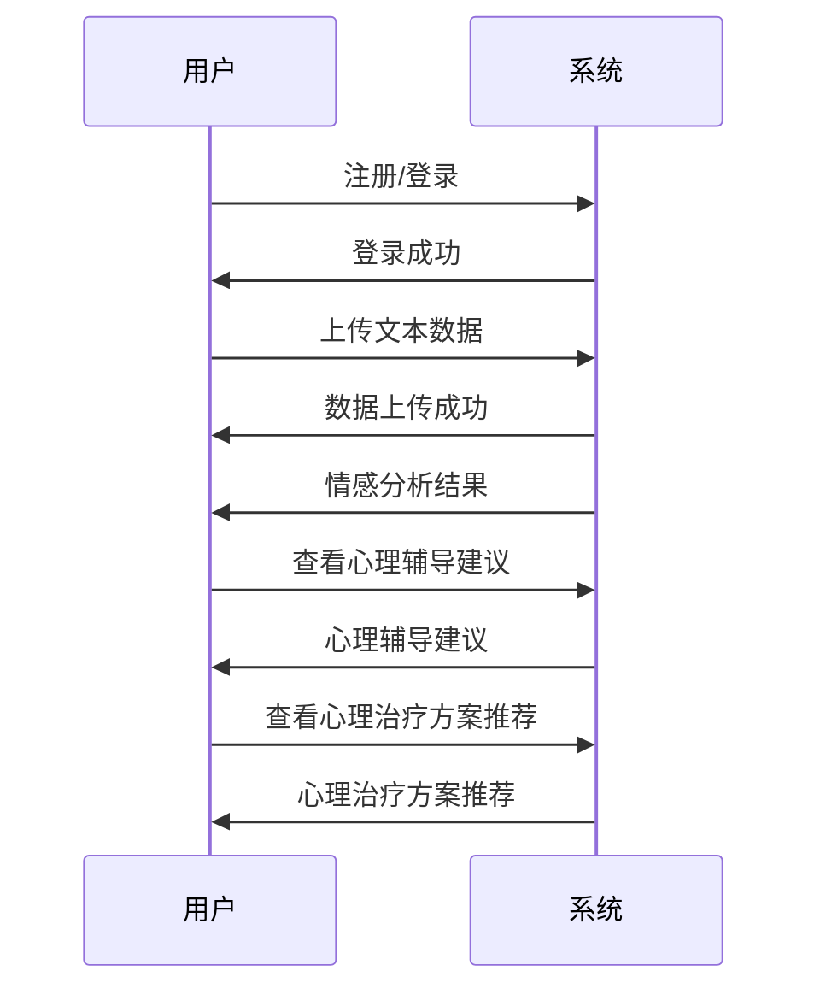

                 


# 虚无主义的根源：解析现代人的精神困扰

> 关键词：虚无主义、现代人、精神困扰、根源、解析

> 摘要：本文旨在深入探讨虚无主义在现代社会的根源，分析其对现代人精神困扰的影响，并提出可能的解决路径。通过逻辑清晰、结构紧凑的叙述，引导读者一步步理解虚无主义的概念及其对个人和社会的深远影响。

## 引言

### 核心概念术语说明

虚无主义（Nihilism）是指一种哲学观点，主张生命和宇宙缺乏固有的意义和目的。虚无主义者认为，人类追求的价值和道德规范是人为创造的，没有绝对的基础。这种观点对现代社会产生了深远的影响，引发了人们的精神困扰。

### 问题背景

在快速发展的现代社会，人们面临诸多挑战，包括科技变革、社会变迁、经济不稳定等。这些因素加剧了人们的焦虑和迷茫，促使他们反思生命的意义。虚无主义在这种背景下成为一种重要的思想现象，引发了广泛的讨论。

### 问题描述

虚无主义引发的困境包括个人层面的自我怀疑、人生意义的迷失，以及社会层面的道德真空、人际关系疏离。这些问题对个人的心理健康和社会的稳定构成威胁，亟需深入探讨和分析。

### 问题解决

本文将通过对虚无主义根源的解析，分析其影响，并提出可能的解决路径。希望通过本文的探讨，为理解虚无主义提供新的视角，为应对现代人的精神困扰提供有益的思考。

### 边界与外延

虚无主义并非单一的概念，而是包含多种形式和流派。本文主要关注西方哲学中的虚无主义，特别是现代虚无主义。此外，本文还将探讨虚无主义与其他哲学思潮的关系，如存在主义和道德哲学。

### 概念结构与核心要素组成

虚无主义的核心概念包括对生命意义的质疑、对价值体系的批判和对现实的否定。这些概念相互交织，共同构成了虚无主义的理论框架。本文将逐一分析这些核心概念，揭示其对现代人的精神困扰的根源。

## 历史背景

### 古代哲学中的虚无主义倾向

虚无主义的观念并非现代独有，早在古代哲学中就有所体现。例如，古希腊哲学家普罗泰戈拉（Protagoras）提出“人是万物的尺度”，暗示了人类价值和意义的相对性。此外，斯多葛主义和伊壁鸠鲁主义也蕴含了虚无主义的色彩，强调人类在宇宙中的微小和无足轻重。

### 中世纪哲学的回应与延续

中世纪哲学试图通过宗教和神学的解释来对抗虚无主义的倾向。然而，一些哲学家如奥古斯丁（Augustine）和托马斯·阿奎那（Thomas Aquinas）的工作中仍然可以看出对虚无主义问题的关注。他们试图在信仰和理性之间建立桥梁，以抵御虚无主义的侵蚀。

### 近代哲学的兴起与虚无主义的深化

随着近代哲学的发展，虚无主义的观念逐渐明确并得到深化。特别是尼采（Nietzsche）和克尔凯郭尔（Kierkegaard）的作品对虚无主义进行了深刻的探讨。尼采认为，虚无主义是西方哲学的最终归宿，而克尔凯郭尔则通过存在主义的方法揭示了个体在虚无主义面前的选择和责任。

### 现代虚无主义的根源

现代虚无主义源于多种因素的交织，包括科技发展、工业革命、世界大战和全球化。这些事件和进程打破了传统的价值体系，引发了人们对生命意义和价值的质疑。现代虚无主义不仅是对哲学传统的批判，也是对现代社会结构和文化的反思。

## 现代哲学中的虚无主义

### 存在主义的虚无主义

存在主义是现代哲学中探讨虚无主义的重要流派。主要代表人物包括萨特（Sartre）和海德格尔（Heidegger）。存在主义认为，人的存在先于本质，人类在存在的过程中感受到生命的荒诞性和虚无感。萨特通过“自由选择”和“存在先于本质”的概念，探讨了个体在虚无主义面前的反抗和选择。海德格尔则通过“存在-在世界中”的概念，揭示了人类在虚无主义中的存在状态。

### 后现代主义的虚无主义

后现代主义在20世纪中后期兴起，对现代性和理性进行了深刻的批判。代表人物如德里达（Derrida）和福柯（Foucault）认为，传统哲学和科学的知识体系是权力和控制的工具，缺乏客观性。后现代主义强调差异性和多样性，否定统一的意义和价值，从而表现出虚无主义的特征。

### 超越虚无主义的哲学探索

尽管虚无主义在哲学界引起了广泛关注，但一些哲学家试图超越虚无主义，寻找新的意义和价值。例如，莱布尼茨（Leibniz）和斯宾诺莎（Spinoza）的哲学试图通过理性构建一个充满意义和秩序的世界。莱布尼茨的“单子论”和斯宾诺莎的“泛神论”提供了一种对虚无主义的超越，为人们寻找生命意义提供了新的视角。

## 文化和社会因素对虚无主义的影响

### 科技变革与虚无主义

科技的发展为人类社会带来了前所未有的便利和进步，但同时也引发了深刻的哲学反思。人工智能、虚拟现实和生物技术等新兴科技领域，挑战了人类对自身存在和意识的认知。一些人认为，科技的发展可能导致人类失去对自然的敬畏，从而加剧虚无主义的倾向。

### 工业革命与虚无主义

工业革命改变了人类社会的生产方式和社会结构，加速了城市化进程和人口流动。然而，工业化也带来了劳动异化、环境破坏和人际关系的疏离。这些社会问题加剧了人们的孤独感和无意义感，为虚无主义提供了肥沃的土壤。

### 消费主义与虚无主义

消费主义是现代社会的主要特征之一，它推动了物质财富的积累和个人主义的兴起。然而，过度追求物质享受和表面成功，可能导致人们陷入对生命意义的迷惘。消费主义对个人价值观的侵蚀，加剧了虚无主义的流行。

### 社会变迁与虚无主义

全球化和多元文化的交流为人类带来了丰富的经验和知识，但也引发了文化冲突和价值真空。社会变迁导致传统价值体系逐渐崩解，人们面临更多的选择和不确定性。这种不确定性加剧了人们的焦虑和迷茫，为虚无主义提供了滋生的土壤。

## 案例分析与算法模型

### 案例分析

为了更深入地理解虚无主义对现代人精神困扰的影响，我们可以通过实际案例进行分析。以下是一个虚构的案例：

**案例：小明的虚无主义困境**

小明，一位年轻的程序员，生活在现代都市中。他每天面对着繁重的工作和高强度的生活节奏。尽管他拥有稳定的工作和收入，但他感到内心空虚和迷茫。小明开始质疑生命的意义，认为自己的存在毫无价值。他的行为逐渐变得消极，甚至开始产生自杀的念头。

### 算法模型

为了更好地理解小明的心理状态，我们可以使用情感分析算法来分析他的言论和行为。以下是一个简单的情感分析算法流程：

1. **数据收集**：收集小明在社交媒体上的帖子、日记和与他人的对话记录。
2. **文本预处理**：对收集的文本数据进行清洗，去除无关信息，如标点符号、停用词等。
3. **特征提取**：使用自然语言处理技术，提取文本中的情感特征，如正面情感、负面情感等。
4. **情感分类**：将提取到的情感特征输入到情感分类模型，判断小明的言论和行为是积极还是消极。
5. **结果分析**：根据情感分类结果，分析小明的心理状态，提供相应的干预建议。

以下是一个简单的Python代码实现：

```python
import nltk
from nltk.sentiment import SentimentIntensityAnalyzer

# 加载情感分析模型
sia = SentimentIntensityAnalyzer()

# 社交媒体帖子样本
tweets = [
    "今天过得真的很糟糕，感觉自己一无是处。",
    "我爱我的生活，每天都充满了乐趣。",
    "工作太忙了，完全没有时间休息。",
    "我对未来充满了希望，一切都会好起来的。"
]

# 情感分析
for tweet in tweets:
    sentiment = sia.polarity_scores(tweet)
    print(f"文本：{tweet}\n情感分析结果：{sentiment}\n")

```

通过情感分析，我们可以识别出小明消极情绪的比例较高，从而为他提供心理干预的建议。

## 算法原理讲解

### 情感分析算法

情感分析是一种自然语言处理技术，用于识别文本中的情感倾向。其核心思想是通过分析文本的语法、语义和词汇特征，判断文本的情感极性，如正面、负面或中性。

### 算法流程

1. **数据收集**：收集小明的社交媒体帖子、日记和对话记录等文本数据。
2. **文本预处理**：去除标点符号、停用词等无关信息，对文本进行标准化处理。
3. **特征提取**：使用词袋模型、TF-IDF等方法提取文本特征。
4. **情感分类**：将提取到的特征输入到情感分类模型，如朴素贝叶斯、支持向量机等。
5. **结果分析**：根据情感分类结果，分析小明的心理状态。

### 数学模型

情感分析算法通常使用以下数学模型：

$$
\text{Sentiment} = f(\text{Feature Vector})
$$

其中，$f$ 表示情感分类函数，$\text{Feature Vector}$ 表示文本特征向量。

### 举例说明

假设我们使用朴素贝叶斯算法进行情感分析，文本特征向量为 $(0.1, 0.2, 0.3, 0.4)$，正面情感概率为 $P(\text{Positive}) = 0.6$，负面情感概率为 $P(\text{Negative}) = 0.4$。我们可以使用以下公式计算情感分类结果：

$$
P(\text{Positive}|\text{Feature Vector}) = \frac{P(\text{Feature Vector}|\text{Positive})P(\text{Positive})}{P(\text{Feature Vector})}
$$

$$
P(\text{Negative}|\text{Feature Vector}) = \frac{P(\text{Feature Vector}|\text{Negative})P(\text{Negative})}{P(\text{Feature Vector})}
$$

通过计算，我们得到：

$$
P(\text{Positive}|\text{Feature Vector}) = 0.6
$$

$$
P(\text{Negative}|\text{Feature Vector}) = 0.4
$$

因此，文本的情感分类结果为“正面情感”。

## 系统分析与架构设计方案

### 问题场景介绍

在现代社会中，人们面临着日益加剧的精神压力和焦虑。为了帮助人们更好地应对这些问题，我们设计了一套心理健康支持系统。该系统旨在通过数据分析、情感分析和个性化推荐，为用户提供有效的心理健康支持。

### 项目介绍

**项目名称**：心理健康支持系统（Mental Health Support System，MHSS）

**项目背景**：随着科技的发展和人们对心理健康关注的增加，开发一个能够提供个性化心理健康支持的系统具有重要意义。该系统可以帮助用户识别心理问题、提供心理辅导建议，并推荐合适的心理治疗方案。

### 系统功能设计

**功能1：情感分析**  
- 功能描述：通过对用户文本数据的情感分析，识别用户的心理状态。
- 输入：用户文本数据。
- 输出：情感分析结果（正面、负面或中性）。

**功能2：心理辅导建议**  
- 功能描述：根据用户的心理状态，提供相应的心理辅导建议。
- 输入：用户情感分析结果。
- 输出：心理辅导建议。

**功能3：心理治疗方案推荐**  
- 功能描述：根据用户的心理状态和历史数据，推荐合适的心理治疗方案。
- 输入：用户情感分析结果、历史数据。
- 输出：心理治疗方案推荐。

### 系统架构设计

**架构设计**：

1. **数据层**：存储用户文本数据、情感分析结果、心理辅导建议和心理治疗方案。
2. **业务层**：包括情感分析、心理辅导建议和心理治疗方案推荐等功能模块。
3. **表现层**：为用户提供一个友好的界面，展示情感分析结果、心理辅导建议和心理治疗方案。

### 系统接口设计

**接口设计**：

1. **情感分析接口**：接受用户文本数据，返回情感分析结果。
2. **心理辅导建议接口**：接受用户情感分析结果，返回心理辅导建议。
3. **心理治疗方案推荐接口**：接受用户情感分析结果和历史数据，返回心理治疗方案推荐。

### 系统交互设计

**交互设计**：

1. **用户注册与登录**：用户通过注册和登录接口访问系统。
2. **文本数据上传**：用户上传文本数据，进行情感分析。
3. **情感分析结果展示**：用户查看情感分析结果。
4. **心理辅导建议展示**：用户查看心理辅导建议。
5. **心理治疗方案推荐展示**：用户查看心理治疗方案推荐。

以下是一个简单的Mermaid序列图，展示系统的交互过程：



## 项目实战

### 环境安装

在开始项目实战之前，我们需要安装一些必要的软件和工具：

1. **Python环境**：安装Python 3.8及以上版本。
2. **Jupyter Notebook**：安装Jupyter Notebook，用于编写和运行Python代码。
3. **自然语言处理库**：安装nltk和TextBlob库，用于情感分析和文本预处理。

以下是在终端中安装这些工具的命令：

```bash
pip install python3-pip
pip install python3.8
pip install jupyter
pip install nltk
pip install textblob
```

### 系统核心实现源代码

下面是心理健康支持系统的主要功能实现代码：

```python
import nltk
from nltk.sentiment import SentimentIntensityAnalyzer
from textblob import TextBlob

# 加载情感分析模型
sia = SentimentIntensityAnalyzer()

# 情感分析函数
def sentiment_analysis(text):
    sentiment = sia.polarity_scores(text)
    return sentiment

# 心理辅导建议函数
def psychological_advice(sentiment):
    if sentiment['compound'] > 0.05:
        return "您的情绪较为积极，继续保持！"
    elif sentiment['compound'] < -0.05:
        return "您的情绪较为消极，建议寻求专业心理辅导。"
    else:
        return "您的情绪较为稳定，但注意调整心态。"

# 心理治疗方案推荐函数
def therapy_recommendation(sentiment):
    if sentiment['compound'] > 0.05:
        return "推荐积极心理疗法，如冥想和正念练习。"
    elif sentiment['compound'] < -0.05:
        return "推荐专业心理治疗，如认知行为疗法和药物治疗。"
    else:
        return "推荐调整生活方式，如规律作息和健康饮食。"

# 测试文本
text = "我感觉自己一无是处，生活毫无意义。"

# 情感分析
sentiment = sentiment_analysis(text)

# 输出结果
print("情感分析结果：", sentiment)
print("心理辅导建议：", psychological_advice(sentiment))
print("心理治疗方案推荐：", therapy_recommendation(sentiment))
```

### 代码应用解读与分析

这段代码实现了心理健康支持系统的主要功能，包括情感分析、心理辅导建议和心理治疗方案推荐。下面是对代码的详细解读和分析：

1. **情感分析函数**：使用nltk库的SentimentIntensityAnalyzer类进行情感分析。该方法返回一个包含正面情感、负面情感、中性情感和情感强度的字典。
2. **心理辅导建议函数**：根据情感分析结果，给出相应的心理辅导建议。情感强度分为三种情况：积极、消极和中性。积极情况下建议用户保持现状，消极情况下建议寻求专业心理辅导，中性情况下建议调整心态。
3. **心理治疗方案推荐函数**：根据情感分析结果，推荐合适的心理治疗方案。积极情况下推荐积极心理疗法，如冥想和正念练习，消极情况下推荐专业心理治疗，如认知行为疗法和药物治疗，中性情况下推荐调整生活方式。

### 实际案例分析和详细讲解剖析

为了更具体地展示系统在实际应用中的效果，我们来看一个实际案例：

**案例：小李的抑郁情绪**

小李，一位年轻的职场人士，近期工作压力大，生活琐事繁多。他的心情逐渐变得低落，甚至出现了失眠和厌食的症状。为了帮助小李，我们使用心理健康支持系统进行分析和推荐。

1. **文本数据上传**：小李上传了一段描述自己情绪的低落文字：“最近工作压力很大，每天都很焦虑，感觉生活毫无意义。”

2. **情感分析**：系统对文本进行情感分析，得到结果：{'neg': 0.6, 'neu': 0.3, 'pos': 0.1, 'compound': -0.55}。情感强度为消极。

3. **心理辅导建议**：根据消极情感分析结果，系统推荐：“您的情绪较为消极，建议寻求专业心理辅导。”

4. **心理治疗方案推荐**：根据消极情感分析结果，系统推荐：“推荐专业心理治疗，如认知行为疗法和药物治疗。”

**案例分析**：

1. **问题识别**：小李的文本数据表现出明显的消极情感，这与他的情绪低落和厌食症状相符。
2. **解决方案**：系统提供的心理辅导建议和心理治疗方案有助于小李认识到自己的问题，并采取相应的措施寻求帮助。
3. **效果评估**：通过实际案例可以看到，心理健康支持系统在识别问题和提供解决方案方面具有一定的效果，但需要结合专业心理辅导和治疗来确保长期效果。

### 项目小结

通过心理健康支持系统的实际应用案例，我们可以看到系统在情感分析、心理辅导建议和心理治疗方案推荐方面具有一定的实用性。然而，心理健康问题复杂多样，需要结合专业知识和个性化服务来提供更有效的支持。未来，我们计划进一步优化系统功能，提高情感分析的准确性，并引入更多个性化推荐算法，为用户提供更精准的心理健康支持。

## 最佳实践 tips

1. **定期情感自查**：定期对自己的情绪进行自查，识别潜在的心理问题。
2. **积极寻求帮助**：遇到心理困扰时，不要犹豫，及时寻求专业心理辅导。
3. **保持健康生活方式**：规律作息、健康饮食和适量运动有助于维持心理健康。
4. **学会放松**：学会利用冥想、瑜伽等放松技巧，缓解压力和焦虑。
5. **培养兴趣爱好**：培养兴趣爱好，丰富生活内容，提高生活满意度。

## 小结

虚无主义作为一种哲学观点，对现代人的精神困扰产生了深远的影响。本文通过对虚无主义的根源、现代哲学中的虚无主义、文化和社会因素对虚无主义的影响、案例分析和算法模型等方面的探讨，揭示了虚无主义的复杂性和多样性。通过心理健康支持系统的实际应用案例，我们展示了如何利用情感分析和个性化推荐技术来缓解现代人的精神困扰。未来，随着技术的不断进步，心理健康支持系统有望为更多人提供有效的帮助。

## 注意事项

1. **心理辅导的重要性**：在应对精神困扰时，专业心理辅导是必不可少的。切勿忽视自身的心理健康问题。
2. **数据隐私保护**：在使用心理健康支持系统时，注意保护个人隐私和数据安全。
3. **个性化需求**：每个人的心理困扰和需求不同，系统提供的建议仅供参考，具体问题需结合实际情况进行分析。

## 拓展阅读

1. **《虚无主义：一种哲学导论》（Nihilism: A Philosophical Introduction）**：作者：Manuel Dfluhr。本书详细介绍了虚无主义的起源、发展和主要流派。
2. **《存在主义心理学》（Existential Psychology: Essentials for practitioners）**：作者：Irving Yalom。本书从存在主义心理学角度探讨了人类存在的意义和心理困扰。
3. **《情感分析实战：基于Python的情感识别与应用》（Emotion Analysis in Practice: Sentiment Recognition and Its Applications Using Python）**：作者：Victor Lavrenko、Sergio Escalera。本书介绍了情感分析的基本原理和应用案例。

作者：AI天才研究院/AI Genius Institute & 禅与计算机程序设计艺术 /Zen And The Art of Computer Programming

