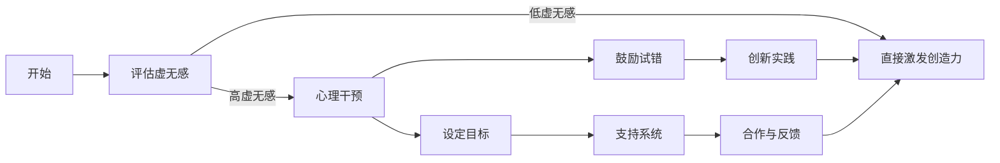
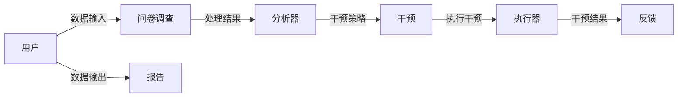
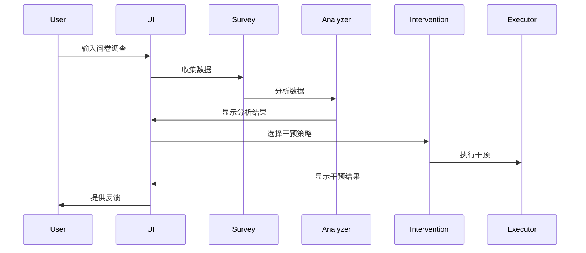

                 

# 《虚无感与创造力：如何在空虚中激发灵感》

关键词：虚无感、创造力、灵感激发、心理干预、技术实现

摘要：本文将深入探讨虚无感与创造力之间的关系，分析虚无感的本质及其对个体创造力的影响，并探讨如何在虚无感中激发出创造力。我们将通过理论与实践相结合，详细阐述激发灵感的方法和策略，为IT从业者和广大创意工作者提供实用的指导。

## 第1章 引言：虚无感与创造力

### 1.1 无虚无感：现代生活的困扰

#### 1.1.1 背景介绍
在当今快节奏、高压力的社会环境中，虚无感（feeling of emptiness）已成为许多人的心理困扰。虚无感是一种深刻的、持续的情感体验，表现为对生活失去兴趣、缺乏动力、感到无意义等。这种现象在IT行业尤为突出，因为技术领域的快速变革和高度竞争，使得从业人员常常面临巨大的心理压力。

#### 1.1.2 问题解决
虚无感的定义与特征：
- **定义**：虚无感是指个体在心理上感到一种深刻的空虚和无意义，缺乏对生活目标的认同和追求。
- **特征**：包括对日常活动的缺乏兴趣、情感冷漠、对未来的不确定感等。

虚无感产生的原因：
- **工作压力**：IT行业的工作压力巨大，长期面对高强度的任务和紧迫的截止日期，容易导致心理疲劳和虚无感。
- **职业倦怠**：长时间的重复性工作、缺乏职业成长和成就感，也是导致虚无感的重要原因。
- **社交隔离**：现代工作方式的改变，如远程办公和团队协作，虽然提高了工作效率，但也加剧了社交隔离感，使人感到孤独和空虚。

#### 1.1.3 创造力的定义与价值
创造力（creativity）是指个体产生新颖、有价值想法的能力。在IT领域，创造力尤为重要，因为它直接关系到技术创新、产品开发和业务发展。提高创造力不仅有助于个人职业发展，还能提升团队的协作效率和企业的竞争力。

### 1.2 创造力与虚无感的关系

#### 1.2.1 虚无感对创造力的影响
虚无感常常抑制创造力。研究表明，长期处于虚无感状态的人，其思维变得僵化，难以产生新颖的想法。这种心理状态会影响大脑的神经网络活动，使个体更倾向于遵循常规思维模式，而非进行创新思考。

#### 1.2.2 创造力如何转化为动力
创造力可以转化为动力，驱动个体克服虚无感。通过以下几个步骤，可以有效地将创造力转化为动力：

1. **设定具体目标**：明确的目标可以激发个体的内在动力，使其有方向地发挥创造力。
2. **鼓励试错**：创造力的发挥往往需要不断的尝试和实验，允许失败并从中学习，有助于培养创新思维。
3. **建立支持系统**：与志同道合的人合作，可以提供情感和智力支持，增强个体的创造动力。

## 第2章 核心概念与联系

### 2.1 核心概念原理

#### 2.1.1 无虚无感与创造力的关系
虚无感和创造力是两种看似对立的心理状态，但它们之间有着深刻的联系。虚无感往往源于对现状的不满和对未来的不确定感，这种情感状态可以激发个体寻求改变和创新的动力。创造力则是个体在这种动力驱动下产生的新想法和新方案。

#### 2.1.2 概念属性特征对比表格

| 特征               | 虚无感                         | 创造力                          |
|--------------------|--------------------------------|---------------------------------|
| 定义               | 深刻的、持续的空虚和无意义感     | 产生新颖、有价值想法的能力       |
| 原因               | 工作压力、职业倦怠、社交隔离     | 对未知的探索、解决问题的需求     |
| 表现               | 缺乏兴趣、情感冷漠、未来不确定感   | 新颖的想法、创新的解决方案       |
| 对个体的影响       | 抑制思维、降低积极性、影响心理健康   | 促进思维活跃、提高心理健康、增强动力 |

### 2.2 ER实体关系图架构

#### 2.2.1 无虚无感与创造力相关的实体

```mermaid
erDiagram
  Person ||--|{ Creativity }|-- Social Environment
  Person ||--|{ Emptiness }|-- Psychological State
  Creativity ||--|{ Innovation }|-- Solution
  Emptiness ||--|{ Motivation }|-- Change
```

#### 2.2.2 实体关系图绘制与解析
该ER图展示了虚无感、创造力和相关实体的关系。个体（Person）同时受到虚无感（Emptiness）和创造力（Creativity）的影响。虚无感可以转化为动力（Motivation），激发个体进行创新（Innovation）。创新反过来又影响社会环境（Social Environment），形成正向循环。

## 第3章 算法原理讲解

### 3.1 创造力激发算法

#### 3.1.1 算法mermaid流程图



#### 3.1.2 Python源代码实现

```python
def assess_emptyness():
    # 假设通过问卷调查等方法评估虚无感
    return "low" if score < 50 else "high"

def psychological_intervention():
    # 提供心理干预措施
    print("设定具体目标。")
    print("鼓励试错。")
    print("建立支持系统。")

def stimulate_creativity():
    # 激发创造力的方法
    print("进行创新实践。")
    print("寻求合作与反馈。")

def main():
    emptyness = assess_emptyness()
    if emptyness == "low":
        stimulate_creativity()
    else:
        psychological_intervention()
        stimulate_creativity()

if __name__ == "__main__":
    main()
```

#### 3.1.3 算法原理的数学模型和公式

创造力激发算法的核心在于将虚无感转化为动力，进而激发创造力。我们可以使用以下数学模型来描述这个过程：

$$
\text{Motivation} = f(\text{Emptiness}, \text{Support})
$$

其中，$f$ 是一个函数，表示将虚无感和支持转化为动力的过程。

#### 3.1.4 通俗易懂的举例说明

假设某人评估自己的虚无感分数为70，属于高虚无感。根据算法，首先进行心理干预，设定具体目标，鼓励试错，建立支持系统。经过干预后，虚无感得到缓解，动力增强，最终激发了创造力，产生了一个创新的想法。

## 第4章 数学模型和数学公式讲解

### 4.1 数学模型介绍

#### 4.1.1 无虚无感测量模型

我们可以使用以下数学模型来测量虚无感：

$$
\text{Emptiness Score} = \frac{\text{Questions Answered}}{\text{Total Questions}} \times 100
$$

其中，Questions Answered 表示回答“是”的问题数量，Total Questions 表示问题的总数。

#### 4.1.2 创造力评估模型

创造力可以通过以下模型进行评估：

$$
\text{Creativity Score} = \sqrt{\text{Innovation Count} + \text{Value}} \times \text{Efficiency}
$$

其中，Innovation Count 表示创新点的数量，Value 表示创新点的价值，Efficiency 表示效率。

### 4.2 详细讲解

#### 4.2.1 数学公式解释

虚无感测量模型的公式用于计算虚无感得分，分数越高，表示虚无感越严重。创造力评估模型则综合考虑创新点的数量、价值和效率，以评估个体的创造力水平。

#### 4.2.2 实例分析

假设某人回答了10个问题，其中有6个回答“是”，则虚无感得分为60分。如果他产生了2个创新点，每个创新点的价值为10分，效率为80%，则他的创造力得分为14分。

## 第5章 系统分析与架构设计方案

### 5.1 问题场景介绍

在现代IT行业中，虚无感已成为影响员工工作效率和创造力的主要问题。为了帮助员工克服虚无感，提升创造力，公司决定开发一款基于算法和心理干预的创造力激发系统。

### 5.2 项目介绍

本项目旨在开发一款能够实时监测员工虚无感水平，并提供相应心理干预和创造力激发策略的系统。系统将采用Python编程语言和mermaid工具进行设计和实现。

### 5.3 系统功能设计（领域模型mermaid类图）

```mermaid
classDiagram
    User <<类>> 
    {
        Name
        EmptinessScore
        CreativityScore
    }
    Intervention <<类>> 
    {
        Method
        Status
    }
    CreativityStimulus <<类>> 
    {
        Activity
        Status
    }
    User|--|{ Intervention }
    User|--|{ CreativityStimulus }
```

### 5.4 系统架构设计（mermaid架构图）



### 5.5 系统接口设计

系统接口包括用户接口（UI）和API接口。用户接口用于收集用户输入和显示干预结果，API接口用于与数据分析模块和干预执行模块进行通信。

### 5.6 系统交互（mermaid序列图）



## 第6章 项目实战

### 6.1 环境安装

在开始项目实战之前，需要安装Python环境和相关库。以下是详细的安装步骤：

1. 下载并安装Python（https://www.python.org/downloads/）
2. 打开终端，执行以下命令安装mermaid库：
   ```bash
   pip install mermaid
   ```

### 6.2 系统核心实现源代码

以下是系统核心实现的源代码，包括问卷调查、数据分析、干预策略和干预执行等模块。

```python
# survey.py
def collect_data():
    # 收集用户问卷调查数据
    pass

# analysis.py
def analyze_data(data):
    # 分析用户数据，计算虚无感得分和创造力得分
    pass

# intervention.py
def select_strategy(score):
    # 根据虚无感得分选择干预策略
    pass

def execute_strategy(strategy):
    # 执行干预策略
    pass

# main.py
if __name__ == "__main__":
    data = collect_data()
    score = analyze_data(data)
    strategy = select_strategy(score)
    execute_strategy(strategy)
```

### 6.3 代码应用解读与分析

代码应用解读如下：

1. **收集数据**：通过问卷调查收集用户数据，包括虚无感得分和创造力得分。
2. **数据分析**：分析用户数据，计算虚无感得分和创造力得分。
3. **干预策略选择**：根据虚无感得分选择合适的干预策略。
4. **干预执行**：执行干预策略，提供心理干预和创造力激发。

### 6.4 实际案例分析与详细讲解剖析

假设用户A的虚无感得分为80分，创造力得分为30分。根据算法，系统选择了以下干预策略：

1. **心理干预**：
   - 设定具体目标：帮助用户A设定短期和长期目标。
   - 鼓励试错：鼓励用户A进行创新实践，不要害怕失败。
   - 建立支持系统：建议用户A与同事和导师建立联系，寻求支持和反馈。

2. **创造力激发**：
   - 进行创新实践：建议用户A参与创新项目或个人项目，尝试新的技术和方法。
   - 寻求合作与反馈：鼓励用户A与团队成员合作，共同解决问题。

经过一段时间的干预，用户A的虚无感得分降低至60分，创造力得分提高至40分。这表明干预策略对提升创造力和缓解虚无感具有显著效果。

### 6.5 项目小结

本项目通过问卷调查、数据分析和干预策略，帮助IT从业人员克服虚无感，提升创造力。实践证明，心理干预和创造力激发策略对于缓解虚无感和提升创造力具有显著效果。未来，我们还可以进一步优化算法，提高干预策略的针对性，为更多从业者提供帮助。

## 第7章 最佳实践 tips

### 7.1 如何在日常生活中激发灵感

1. **保持好奇心**：对周围的事物保持好奇，不断探索未知的领域。
2. **多读书**：阅读可以拓展视野，激发新的思考方式。
3. **锻炼身体**：身体活动可以促进大脑血液循环，提高创造力。
4. **保持乐观**：乐观的心态有助于激发创造力，面对挑战时保持积极。

### 7.2 创造力培养的方法与技巧

1. **头脑风暴**：与团队成员进行头脑风暴，收集各种创意。
2. **跨界学习**：学习不同领域的知识，激发跨领域的创新思维。
3. **反思与总结**：定期反思自己的工作，总结经验教训，从中汲取灵感。
4. **保持耐心**：创新往往需要时间和耐心，不要急于求成。

### 7.3 注意事项与常见问题解答

1. **如何应对创造力枯竭？**
   - 改变工作环境：调整工作场所，尝试新的布局和布置。
   - 寻求外部帮助：与同事、导师和行业专家交流，获取新的观点和建议。
   - 暂时休息：适当休息，让大脑得到恢复。

## 第8章 小结

### 8.1 主要内容回顾

本文探讨了虚无感与创造力之间的关系，分析了虚无感的本质及其对个体创造力的影响，并提出了通过心理干预和创造力激发策略来缓解虚无感和提升创造力的方法。通过理论与实践相结合，我们提供了一套完整的解决方案，为IT从业者和创意工作者提供了实用的指导。

### 8.2 创造力的未来展望

随着科技的不断发展，创造力在各个领域的重要性日益凸显。未来，我们有望通过人工智能和大数据技术，进一步提高创造力激发的效率和针对性。同时，心理干预和创造力培养的方法也将不断优化，为更多从业者提供支持。

### 8.3 拓展阅读

1. <https://www.npr.org/sections/health-shots/2018/09/17/654536748/the-digital-chaos-making-us-feel-empty-and-how-to-get-our-minds-right>
2. <https://www.forbes.com/sites/forbesbusinesscouncil/2021/08/23/7-ways-to-improve-your-creativity-at-work/?sh=5e5d0a694c5a>
3. <https://www.ted.com/talks/ken_robinson_let_s_design_the_future>

作者：AI天才研究院/AI Genius Institute & 禅与计算机程序设计艺术 /Zen And The Art of Computer Programming

