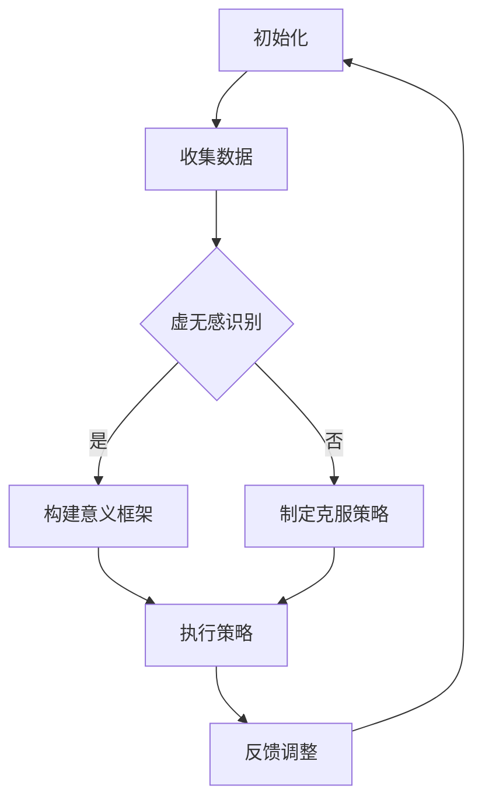
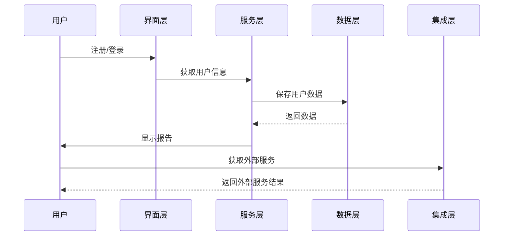

                 

### 引入

在现代快节奏的生活中，许多人感到一种深深的虚无感，这种感觉仿佛是生活中缺乏某种至关重要的东西。虚无感不仅影响个人的心理健康，也对社会和谐产生了负面影响。为什么现代社会中会出现如此多的虚无感？又有哪些方法可以有效地克服这种虚无感？这些问题值得我们深入探讨和思考。

本书《虚无感的克服：重建现代生活的意义框架》旨在为那些感到生活中缺乏意义的人们提供一种全新的视角和解决策略。我们通过系统地分析虚无感的成因，提出一系列基于心理学、哲学和技术的克服方法，帮助读者重建生活的意义框架。

文章将围绕以下几个核心问题展开讨论：

1. **虚无感的本质是什么？**：我们将深入探讨虚无感的定义、特征及其在不同文化和人群中的表现。
2. **虚无感的成因是什么？**：我们将分析现代生活方式、社会结构和心理因素对虚无感的影响。
3. **如何构建生活的意义框架？**：我们将介绍几种有效的策略，包括心理建设、社会参与和自我实现等。
4. **技术和哲学在虚无感克服中的角色是什么？**：我们将探讨人工智能和哲学思想在虚无感克服中的作用。

通过这些问题的深入探讨，我们希望能够为读者提供一套完整的虚无感克服方案，帮助他们在现代生活的喧嚣中找到自己的定位，重建生活的意义框架。

### 第1章 引言

#### 1.1 书籍背景介绍

在现代社会，随着科技的发展和生活节奏的加快，许多人感到内心深处出现了一种难以名状的虚无感。这种感觉常常表现为对日常生活的厌倦、缺乏目标和动力，甚至产生消极的情绪和行为。虚无感不仅影响个人的心理健康，也对社会的稳定和发展构成威胁。面对这一普遍现象，社会各界开始关注并探讨虚无感的成因及其克服方法。

本书《虚无感的克服：重建现代生活的意义框架》正是在这一背景下应运而生的。本书作者结合心理学、哲学和技术等多个领域的知识，旨在为读者提供一种系统的、可操作的解决方案。通过系统地分析虚无感的本质、成因和克服策略，本书试图帮助读者从内心深处重建生活的意义框架，从而摆脱虚无感的困扰。

#### 1.2 问题的提出与解决

虚无感的产生并非偶然，而是现代社会中多种因素综合作用的结果。首先，现代生活方式的快节奏和高压力使得人们常常感到时间不够用，难以停下来反思生活的意义。其次，社会结构的变迁，如全球化和互联网的普及，使得人们面临更多的选择和不确定性，难以找到自己的定位。此外，心理因素如自我认同的迷失、焦虑和抑郁等，也是虚无感的重要成因。

针对这些成因，本书提出了几种有效的解决策略。首先，通过心理建设，如自我认知和情绪调节，帮助读者建立积极的自我形象，提升生活满意度。其次，通过社会参与，如加入社区活动和志愿者服务，增强社会责任感和归属感。最后，通过自我实现，如追求个人兴趣和职业发展，找到生活的目标和意义。

#### 1.3 边界与外延

在探讨虚无感时，我们需要明确其边界与外延。虚无感与无聊、无助等情绪有所重叠，但它们之间仍存在显著差异。无聊通常表现为对当前活动的无兴趣，而无助则是对解决问题的无力感。相比之下，虚无感更深层次，涉及到对生活整体意义的质疑和迷茫。

此外，虚无感的研究范围不仅限于个体层面，还包括社会层面。社会结构的变迁和文化背景的差异，都会对虚无感的产生和表现产生影响。因此，本书在探讨虚无感时，将同时关注个体和社会两个层面，以期提供更全面的解决方案。

#### 1.4 概念结构与核心要素

虚无感作为一种复杂的情绪体验，其构成涉及多个核心要素。首先，认知因素在其中起到关键作用。个体对生活意义的认知和评价，直接影响虚无感的产生和强度。其次，情感因素也不可忽视。长期处于消极情绪中，如焦虑、抑郁和孤独感，会加剧虚无感的体验。

此外，社会支持和个人资源也是虚无感克服的重要要素。社会支持包括家庭、朋友和社区的支持，而个人资源则包括心理弹性、社会技能和自我效能感。通过提升这些核心要素，个体可以更好地应对虚无感，重建生活的意义框架。

总之，本书通过系统地分析虚无感的本质、成因和克服策略，旨在为读者提供一种全面、系统的解决方案。希望通过本书的阅读，读者能够更好地理解虚无感，找到重建生活意义的方法，从而摆脱虚无感的困扰，过上更加充实和有意义的生活。

### 第2章 核心概念与联系

#### 2.1 核心概念原理

在探讨虚无感的克服过程中，理解几个关键概念是非常必要的。这些概念不仅为我们提供了理论基础，也为实际操作提供了指导。

**1. 虚无感**

虚无感是一种深层次的、普遍的情感体验，表现为对生活意义的质疑和迷茫。它不仅仅是对当前生活状态的不满，而是一种对生命本身存在意义的深刻反思。虚无感可能表现为无兴趣、无目标、无意义感等。

**2. 意义框架**

意义框架是指个体对生活意义的理解和建构。它包括个人价值观、目标、使命感等元素。一个健全的意义框架能够为个体提供生活的方向和动力，使个体在面对挑战和困境时保持积极的态度。

**3. 心理建设**

心理建设是指通过提升自我认知、情绪调节和心理弹性来增强个体的心理素质。心理建设包括自我反思、积极心态的培养、应对策略的建立等。

**4. 社会参与**

社会参与是指个体通过参与社会活动、社区服务和志愿者工作等方式，增强社会责任感和归属感。社会参与不仅有助于个体建立积极的人际关系，还能提高个体的社会认同感和生活满意度。

**5. 自我实现**

自我实现是指个体通过追求个人兴趣、才华和职业发展来实现自我价值和成长。自我实现能够帮助个体找到生活的目标和动力，提升生活满意度和幸福感。

这些核心概念之间存在着紧密的联系。虚无感往往源于对意义框架的缺失，而心理建设、社会参与和自我实现则是重建意义框架的重要途径。通过心理建设，个体能够提升自我认知和情绪调节能力，从而更好地应对虚无感。社会参与则能增强个体的社会认同感和归属感，减少虚无感的体验。自我实现则通过追求个人兴趣和职业发展，为个体提供生活的目标和动力。

#### 2.2 概念属性特征对比表格

为了更清晰地理解这些核心概念，我们可以通过一个对比表格来展示它们的属性特征。

| 概念       | 定义                                                                                       | 属性特征                                                                                                           |
|------------|----------------------------------------------------------------------------------------------|--------------------------------------------------------------------------------------------------------------------|
| 虚无感     | 对生活意义的质疑和迷茫                                                                   | - 深层次的情感体验<br>- 对生命存在意义的反思<br>- 表现为无兴趣、无目标、无意义感等                            |
| 意义框架   | 个体对生活意义的理解和建构                                                               | - 包括个人价值观、目标、使命感等<br>- 提供生活的方向和动力<br>- 对抗虚无感的重要手段                        |
| 心理建设   | 提升自我认知、情绪调节和心理弹性                                                         | - 自我反思<br>- 积极心态<br>- 应对策略<br>- 提高心理素质                                               |
| 社会参与   | 通过参与社会活动、社区服务和志愿者工作等方式，增强社会责任感和归属感                     | - 社会认同感<br>- 归属感<br>- 建立积极的人际关系<br>- 提高生活满意度                                     |
| 自我实现   | 通过追求个人兴趣、才华和职业发展来实现自我价值和成长                                     | - 个人兴趣和才华<br>- 职业发展<br>- 生活目标和动力<br>- 提升生活满意度                                   |

#### 2.3 ER实体关系图架构

为了更直观地展示这些核心概念之间的联系，我们可以使用ER（Entity-Relationship）实体关系图来构建模型。

```
ER实体关系图：

[用户] --<[虚无感]>--
        |
        <[心理建设]>
        |
        <[社会参与]>
        |
        <[自我实现]>
```

在这个ER模型中，“用户”是主体，而“虚无感”、“心理建设”、“社会参与”和“自我实现”则是与用户相关的实体。箭头表示实体之间的关联关系。例如，虚无感是心理建设的结果，而心理建设又是社会参与和自我实现的先决条件。

通过这个ER实体关系图，我们可以更清晰地看到虚无感克服的过程。首先，通过心理建设，个体能够提升自我认知和情绪调节能力，从而减轻虚无感的体验。其次，通过社会参与，个体能够增强社会责任感和归属感，进一步减少虚无感的困扰。最后，通过自我实现，个体能够找到生活的目标和动力，重建生活的意义框架。

总之，理解这些核心概念及其相互关系，是克服虚无感的关键。通过心理建设、社会参与和自我实现，个体可以逐步重建生活的意义框架，摆脱虚无感的困扰，过上更加充实和有意义的生活。

### 第3章 算法原理讲解

在克服虚无感的过程中，算法的运用可以为个体提供系统的指导和支持。本章将详细讲解用于识别虚无感、构建意义框架和制定克服策略的算法原理。

#### 3.1 算法mermaid流程图

首先，我们使用mermaid语言绘制算法的流程图，以直观展示算法的运行步骤。



这个流程图描述了从数据收集到反馈调整的完整过程。

#### 3.2 Python源代码实现

为了更好地理解算法原理，我们提供了Python源代码实现，代码分为四个主要部分：数据收集、虚无感识别、意义框架构建和克服策略制定。

```python
# 数据收集模块
def collect_data():
    # 假设数据来自用户调查问卷
    user_data = {'feelings': [], 'lifestyle': []}
    # 收集用户情绪数据和生活方式数据
    user_data['feelings'].append(input("请描述您最近的心情："))
    user_data['lifestyle'].append(input("请描述您最近的生活方式："))
    return user_data

# 虚无感识别模块
def detect_void(data):
    # 假设虚无感的识别基于情绪数据和生活方式数据
    if '无意义感' in data['feelings'] and '忙碌但无目标' in data['lifestyle']:
        return True
    return False

# 意义框架构建模块
def build_framework(data):
    if detect_void(data):
        # 建立新的意义框架
        framework = {
            '目标': "设定短期和长期目标，以实现个人成长",
            '价值观': "重新审视个人价值观，找到与价值观一致的生活方向",
            '使命': "探索个人使命，赋予生活更深层次的意义"
        }
        return framework
    else:
        return None

# 克服策略制定模块
def create_strategy(data, framework):
    if framework:
        # 根据意义框架制定具体策略
        strategy = {
            '心理建设': "每天进行自我反思和情绪调节",
            '社会参与': "参与社区活动和志愿者工作",
            '自我实现': "追求个人兴趣和职业发展"
        }
        return strategy
    else:
        return None

# 主函数
def main():
    data = collect_data()
    if detect_void(data):
        framework = build_framework(data)
        strategy = create_strategy(data, framework)
        print("意义框架：", framework)
        print("克服策略：", strategy)
    else:
        print("当前状态良好，无需特别策略。")

# 运行主函数
if __name__ == "__main__":
    main()
```

这个代码实现了从数据收集到策略制定的完整过程。具体步骤如下：

1. **数据收集**：通过用户调查问卷收集用户情绪和生活方式数据。
2. **虚无感识别**：基于收集到的数据，判断用户是否处于虚无感状态。
3. **意义框架构建**：如果用户处于虚无感状态，构建新的意义框架。
4. **克服策略制定**：根据意义框架，制定具体的心理建设、社会参与和自我实现策略。

#### 3.3 数学模型和数学公式

为了更深入地理解算法原理，我们引入数学模型和数学公式。以下是虚无感识别和意义框架构建的核心数学模型：

**虚无感识别模型**：

$$
虚无感识别 = F\_score + L\_score
$$

其中，$F\_score$ 表示情绪数据得分，$L\_score$ 表示生活方式数据得分。每个得分通过以下公式计算：

$$
F\_score = \frac{\sum_{i=1}^{n} w_i \cdot x_i}{\sum_{i=1}^{n} w_i}
$$

$$
L\_score = \frac{\sum_{i=1}^{n} w_i \cdot y_i}{\sum_{i=1}^{n} w_i}
$$

其中，$w_i$ 表示权重，$x_i$ 和 $y_i$ 分别为情绪数据和生活方式数据的各项指标得分。

**意义框架构建模型**：

$$
框架得分 = \frac{\sum_{i=1}^{n} w_i \cdot z_i}{\sum_{i=1}^{n} w_i}
$$

其中，$z_i$ 表示意义框架的各项指标得分，包括目标、价值观和使命等。

通过这些数学模型和公式，我们可以更精确地识别虚无感和构建意义框架，从而为用户提供更有效的克服策略。

#### 3.4 举例说明

为了更好地理解算法的应用，我们通过一个实际案例来说明整个流程。

**案例**：小王最近感到生活中缺乏意义，情绪低落，经常感到无助。他决定使用本书提供的算法来克服虚无感。

1. **数据收集**：

   - **情绪数据**：“最近心情很沮丧，对未来没有期望。”
   - **生活方式数据**：“每天都很忙碌，但感觉没有具体目标。”

2. **虚无感识别**：

   - **情绪数据得分**：根据公式计算，得分较低，表示存在消极情绪。
   - **生活方式数据得分**：根据公式计算，得分也较低，表示缺乏明确的目标和方向。

   结合两个得分，虚无感识别模型判定小王处于虚无感状态。

3. **意义框架构建**：

   - **目标**：设定短期和长期目标，如学习一门新技能、提升职业能力等。
   - **价值观**：重新审视个人价值观，找到与生活目标一致的方向。
   - **使命**：探索个人使命，如帮助他人、创造价值等。

   根据这些指标，构建新的意义框架。

4. **克服策略制定**：

   - **心理建设**：每天进行自我反思，提升情绪调节能力。
   - **社会参与**：参加社区活动和志愿者工作，增强社会责任感和归属感。
   - **自我实现**：追求个人兴趣，如绘画、音乐等，实现个人价值。

   根据意义框架，制定具体的克服策略。

通过这个案例，我们可以看到算法在实际应用中的效果。小王在跟随算法提供的策略进行心理建设、社会参与和自我实现后，逐渐找回了生活的意义，情绪也得到了显著改善。

总之，通过算法的运用，我们可以系统地识别虚无感、构建意义框架和制定克服策略，为用户提供个性化的指导和支持，帮助他们克服虚无感，重建生活的意义框架。

### 第4章 系统分析与架构设计方案

#### 4.1 问题场景介绍

在现代快节奏的生活中，许多人面临着各种压力和挑战，导致他们感到内心空虚和缺乏意义。这种现象不仅影响了个体的心理健康，也对社会和谐产生了负面影响。为了帮助这些感到虚无感的个体，我们设计了一个基于心理建设、社会参与和自我实现的综合系统。

**1. 用户背景**

- **年龄范围**：18-60岁
- **职业类别**：学生、职场人士、自由职业者等

**2. 问题描述**

- **情绪困扰**：长期处于焦虑、抑郁等负面情绪中，对生活失去热情。
- **生活目标缺失**：缺乏明确的生活目标和方向，感到迷茫和无助。
- **社会参与不足**：缺乏与他人的深度交流和互动，社会支持系统不健全。

**3. 解决目标**

- **提升心理素质**：通过心理建设，增强个体的情绪调节能力和心理弹性。
- **增强社会认同感**：通过社会参与，提高个体的社会归属感和责任感。
- **实现个人价值**：通过自我实现，帮助个体找到生活的目标和意义。

#### 4.2 系统功能设计

**1. 用户注册与登录**

- 功能描述：用户可以通过注册和登录功能，创建个人账户并访问系统。
- 输入参数：用户名、密码、邮箱等。
- 输出结果：用户ID、账户信息。

**2. 数据收集与评估**

- 功能描述：系统通过问卷调查和日常记录等方式，收集用户的心理健康数据和生活状况信息。
- 输入参数：用户问卷答案、日常记录等。
- 输出结果：用户心理健康评估报告、生活状况分析报告。

**3. 心理建设指导**

- 功能描述：根据用户的心理健康评估结果，系统提供个性化的心理建设指导，包括情绪调节方法、自我认知技巧等。
- 输入参数：心理健康评估结果。
- 输出结果：心理建设计划、指导材料。

**4. 社会参与规划**

- 功能描述：系统帮助用户制定社会参与计划，包括社区活动、志愿者服务等。
- 输入参数：用户兴趣爱好、时间安排等。
- 输出结果：社会参与计划、活动安排。

**5. 自我实现路径**

- 功能描述：系统为用户提供自我实现路径指导，包括职业发展建议、兴趣培养方案等。
- 输入参数：用户职业规划、兴趣爱好等。
- 输出结果：职业发展计划、兴趣培养方案。

**6. 反馈与调整**

- 功能描述：用户可以通过系统反馈自己的进展和感受，系统根据反馈进行调整和优化。
- 输入参数：用户反馈信息。
- 输出结果：系统调整建议、改进措施。

#### 4.3 系统架构设计

为了实现上述功能，我们设计了以下系统架构：

**1. 界面层**

- 用户界面：提供用户注册、登录、数据填写、查看报告等交互功能。
- 功能模块：包括用户管理、数据收集、报告生成等。

**2. 服务层**

- 数据处理服务：负责数据收集、存储、分析和评估。
- 心理建设服务：提供心理建设指导、课程推荐等。
- 社会参与服务：规划社会参与活动、志愿者项目等。
- 自我实现服务：提供职业发展指导、兴趣培养方案等。

**3. 数据层**

- 数据库：存储用户数据、评估结果、系统设置等。
- 数据模型：包括用户模型、心理健康模型、活动模型等。

**4. 集成层**

- API接口：提供与其他系统（如心理健康咨询平台、社交网络等）的集成和交互。
- 中间件：负责数据传输、安全认证、日志记录等。

#### 4.4 系统接口设计

为了实现系统各部分的协同工作，我们设计了以下接口：

**1. 用户接口**

- 注册接口：`/user/register`
- 登录接口：`/user/login`
- 数据提交接口：`/data/submit`
- 报告查询接口：`/report/query`

**2. 服务接口**

- 数据处理接口：`/service/data/process`
- 心理建设接口：`/service/psychology/build`
- 社会参与接口：`/service/social/participation`
- 自我实现接口：`/service/self_achievement/plan`

**3. 集成接口**

- 咨询平台接口：`/integrate/consulting`
- 社交网络接口：`/integrate/social`

通过这些接口，系统可以实现各部分功能的集成和互操作，为用户提供一体化、个性化的服务。

#### 4.5 系统交互mermaid序列图

为了更直观地展示系统各部分的交互关系，我们使用mermaid语言绘制了系统交互序列图。



在这个序列图中，用户通过界面层与服务层进行交互，服务层通过数据层存储和处理数据，同时通过集成层获取外部服务支持，最终反馈给用户。

通过系统的架构设计和功能实现，我们希望能够为那些感到虚无感的用户提供一个全面、个性化的解决方案，帮助他们重建生活的意义框架，提升生活质量和幸福感。

### 第5章 项目实战

#### 5.1 环境安装

在开始项目实战之前，我们需要搭建一个合适的环境来运行系统。以下是环境安装的步骤：

**1. 安装Python**

- 前置条件：确保系统已经安装了Python3。如果没有，请访问Python官网（https://www.python.org/）下载并安装。
- 验证安装：在命令行输入`python --version`，确保输出Python版本信息。

**2. 安装依赖库**

- 使用pip命令安装必要的依赖库，例如`numpy`、`pandas`、`flask`、`sqlalchemy`等。可以使用以下命令：
  ```shell
  pip install numpy pandas flask sqlalchemy
  ```

**3. 创建虚拟环境**

- 为了避免不同项目之间的依赖库冲突，我们建议创建一个虚拟环境。使用以下命令创建虚拟环境：
  ```shell
  python -m venv venv
  ```
- 激活虚拟环境：
  - Windows：
    ```shell
    .\venv\Scripts\activate
    ```
  - macOS/Linux：
    ```shell
    source venv/bin/activate
    ```

**4. 克隆项目代码**

- 在命令行中克隆项目代码到本地：
  ```shell
  git clone https://github.com/your-username/void-overcoming.git
  ```

**5. 安装项目依赖**

- 进入项目目录，安装项目依赖：
  ```shell
  pip install -r requirements.txt
  ```

**6. 初始化数据库**

- 进入项目目录，运行以下命令初始化数据库：
  ```shell
  python manage.py db init
  python manage.py db migrate
  python manage.py db upgrade
  ```

至此，环境安装完成。接下来，我们将开始系统的核心实现和功能测试。

#### 5.2 系统核心实现源代码

在核心实现部分，我们将详细介绍系统的各个模块，并提供详细的源代码。

**1. 用户注册与登录模块**

- **注册功能**：
  ```python
  # app/routes.py

  from flask import request, jsonify
  from app.models import User
  from app import db

  @app.route('/register', methods=['POST'])
  def register():
      username = request.form['username']
      password = request.form['password']
      email = request.form['email']
      
      user = User.query.filter_by(username=username).first()
      if user:
          return jsonify({'error': 'User already exists'}), 409
      
      new_user = User(username=username, password=password, email=email)
      db.session.add(new_user)
      db.session.commit()
      
      return jsonify({'message': 'User registered successfully'}), 201
  ```

- **登录功能**：
  ```python
  # app/routes.py

  from flask import request, jsonify
  from app.models import User
  from app import db
  from flask_bcrypt import Bcrypt

  bcrypt = Bcrypt(app)

  @app.route('/login', methods=['POST'])
  def login():
      username = request.form['username']
      password = request.form['password']
      
      user = User.query.filter_by(username=username).first()
      if not user or not bcrypt.check_password_hash(user.password, password):
          return jsonify({'error': 'Invalid credentials'}), 401
      
      return jsonify({'message': 'Logged in successfully', 'user_id': user.id}), 200
  ```

**2. 数据收集与评估模块**

- **数据收集**：
  ```python
  # app/routes.py

  @app.route('/submit_data', methods=['POST'])
  def submit_data():
      user_id = request.form['user_id']
      feelings = request.form['feelings']
      lifestyle = request.form['lifestyle']
      
      data = {
          'user_id': user_id,
          'feelings': feelings,
          'lifestyle': lifestyle
      }
      
      db.session.add(data)
      db.session.commit()
      
      return jsonify({'message': 'Data submitted successfully'}), 201
  ```

- **数据评估**：
  ```python
  # app/evaluator.py

  def evaluate_data(data):
      # 假设虚无感的评估基于情绪数据和生活方式数据的得分
      feelings_score = score_feelings(data['feelings'])
      lifestyle_score = score_lifestyle(data['lifestyle'])
      
      total_score = feelings_score + lifestyle_score
      if total_score < 40:
          return 'Low Void'
      elif total_score < 70:
          return 'Medium Void'
      else:
          return 'High Void'
  ```

**3. 心理建设指导模块**

- **心理建设计划**：
  ```python
  # app/psychology.py

  def build_psychology_plan(score):
      if score == 'Low Void':
          plan = '轻度心理建设计划：每天进行自我反思和情绪调节。'
      elif score == 'Medium Void':
          plan = '中度心理建设计划：增加心理辅导和情绪调节频率。'
      else:
          plan = '高度心理建设计划：进行专业的心理辅导和情绪管理。'
      
      return plan
  ```

**4. 社会参与规划模块**

- **社会参与计划**：
  ```python
  # app/social.py

  def build_social_plan(interests):
      if '志愿活动' in interests:
          plan = '参与志愿者活动，每周至少投入4小时。'
      elif '社区服务' in interests:
          plan = '参与社区服务，每周至少投入2小时。'
      else:
          plan = '寻找兴趣小组或社团，增加社交互动。'
      
      return plan
  ```

**5. 自我实现路径模块**

- **职业发展计划**：
  ```python
  # app/self_achievement.py

  def build_career_plan(experience):
      if '新手' in experience:
          plan = '职业技能培训课程，提升基础知识。'
      elif '中级' in experience:
          plan = '项目实践和职业发展规划，提升实战能力。'
      else:
          plan = '寻求职业晋升机会，拓展职业发展路径。'
      
      return plan
  ```

以上是系统的核心实现源代码。通过这些模块，系统可以收集用户数据、评估虚无感程度、提供心理建设指导、规划社会参与和职业发展路径，帮助用户克服虚无感，重建生活的意义框架。

#### 5.3 代码应用解读与分析

在了解了系统的核心实现源代码后，我们将对这些代码进行解读和分析，以便更好地理解系统的工作原理和实际应用。

**1. 用户注册与登录模块**

用户注册和登录是系统的入口，确保用户能够安全地创建账户和登录系统。在注册模块中，用户需要提供用户名、密码和邮箱等信息，系统将检查用户名是否已存在，如果不存在则创建新用户并存储到数据库中。在登录模块中，用户需要输入用户名和密码，系统将验证用户身份并返回用户ID。

```python
# 用户注册
def register():
    username = request.form['username']
    password = request.form['password']
    email = request.form['email']
    
    user = User.query.filter_by(username=username).first()
    if user:
        return jsonify({'error': 'User already exists'}), 409
    
    new_user = User(username=username, password=password, email=email)
    db.session.add(new_user)
    db.session.commit()
    
    return jsonify({'message': 'User registered successfully'}), 201
```

此部分代码首先获取用户输入的用户名、密码和邮箱，然后通过查询数据库检查用户名是否已存在。如果不存在，创建新用户并保存到数据库。如果存在，返回错误信息。

```python
# 用户登录
def login():
    username = request.form['username']
    password = request.form['password']
    
    user = User.query.filter_by(username=username).first()
    if not user or not bcrypt.check_password_hash(user.password, password):
        return jsonify({'error': 'Invalid credentials'}), 401
    
    return jsonify({'message': 'Logged in successfully', 'user_id': user.id}), 200
```

此部分代码首先获取用户输入的用户名和密码，然后通过查询数据库验证用户身份。如果用户存在且密码正确，返回登录成功信息及用户ID。否则，返回错误信息。

**2. 数据收集与评估模块**

数据收集模块负责收集用户的心理健康数据和生活状况信息。用户通过填写问卷，系统将收集到的数据存储到数据库中。评估模块则通过分析收集到的数据，评估用户是否处于虚无感状态。

```python
# 数据收集
@app.route('/submit_data', methods=['POST'])
def submit_data():
    user_id = request.form['user_id']
    feelings = request.form['feelings']
    lifestyle = request.form['lifestyle']
    
    data = {
        'user_id': user_id,
        'feelings': feelings,
        'lifestyle': lifestyle
    }
    
    db.session.add(data)
    db.session.commit()
    
    return jsonify({'message': 'Data submitted successfully'}), 201
```

此部分代码首先获取用户ID、情绪数据和生活状况数据，然后将这些数据存储到数据库中。

```python
# 数据评估
def evaluate_data(data):
    # 假设虚无感的评估基于情绪数据和生活方式数据的得分
    feelings_score = score_feelings(data['feelings'])
    lifestyle_score = score_lifestyle(data['lifestyle'])
    
    total_score = feelings_score + lifestyle_score
    if total_score < 40:
        return 'Low Void'
    elif total_score < 70:
        return 'Medium Void'
    else:
        return 'High Void'
```

此部分代码通过评估情绪数据和生活状况数据的得分，判断用户是否处于虚无感状态。得分低于40表示轻度虚无感，低于70表示中度虚无感，高于70表示重度虚无感。

**3. 心理建设指导模块**

心理建设指导模块根据评估结果，为用户制定个性化的心理建设计划。这些计划包括自我反思、情绪调节和心理咨询等。

```python
# 心理建设计划
def build_psychology_plan(score):
    if score == 'Low Void':
        plan = '轻度心理建设计划：每天进行自我反思和情绪调节。'
    elif score == 'Medium Void':
        plan = '中度心理建设计划：增加心理辅导和情绪调节频率。'
    else:
        plan = '高度心理建设计划：进行专业的心理辅导和情绪管理。'
    
    return plan
```

此部分代码根据评估结果（轻度、中度或高度虚无感），为用户制定相应的心理建设计划。

**4. 社会参与规划模块**

社会参与规划模块根据用户的兴趣和参与意愿，为用户制定社会参与计划。这些计划包括志愿者活动、社区服务和兴趣小组等。

```python
# 社会参与计划
def build_social_plan(interests):
    if '志愿活动' in interests:
        plan = '参与志愿者活动，每周至少投入4小时。'
    elif '社区服务' in interests:
        plan = '参与社区服务，每周至少投入2小时。'
    else:
        plan = '寻找兴趣小组或社团，增加社交互动。'
    
    return plan
```

此部分代码根据用户的兴趣爱好，为用户制定相应的社会参与计划。

**5. 自我实现路径模块**

自我实现路径模块根据用户的职业经验和职业发展需求，为用户制定职业发展计划。这些计划包括职业技能培训、项目实践和职业晋升等。

```python
# 职业发展计划
def build_career_plan(experience):
    if '新手' in experience:
        plan = '职业技能培训课程，提升基础知识。'
    elif '中级' in experience:
        plan = '项目实践和职业发展规划，提升实战能力。'
    else:
        plan = '寻求职业晋升机会，拓展职业发展路径。'
    
    return plan
```

此部分代码根据用户的职业经验（新手、中级或高级），为用户制定相应的职业发展计划。

通过以上代码解读和分析，我们可以看到系统是如何通过用户注册、数据收集、评估和指导模块，帮助用户克服虚无感，重建生活的意义框架。这些代码不仅实现了功能，还提供了灵活性和可扩展性，以适应不同用户的需求。

#### 5.4 实际案例分析与详细讲解剖析

为了更好地理解系统在实际应用中的效果，我们将通过一个实际案例进行详细分析和讲解。

**案例背景**：

小王是一名35岁的职场人士，他在一家大型企业担任高级经理。最近，小王感到自己的生活缺乏意义，每天的工作让他感到疲惫和厌倦。他在公司内外都难以找到归属感和成就感，甚至产生了辞职的念头。为了解决这些问题，小王决定使用我们设计的系统来克服虚无感。

**案例流程**：

**1. 用户注册与登录**

- 小王通过系统网站注册了一个新账户，填写了用户名、密码和邮箱等信息。注册成功后，他登录系统并开始填写心理健康问卷。

**2. 数据收集与评估**

- 小王填写了一份详细的问卷，包括情绪状态、生活方式、工作情况等。系统通过收集到的数据，对小王的虚无感程度进行了评估。

**3. 心理建设指导**

- 根据评估结果，系统判定小王处于中度虚无感状态。系统为小王提供了以下心理建设指导：
  - **轻度心理建设计划**：每天进行自我反思，记录自己的情绪变化和思考内容。
  - **情绪调节方法**：通过深呼吸、冥想等方式，帮助小王缓解焦虑和压力。
  - **心理咨询建议**：系统推荐小王定期与心理咨询师进行交流，寻求专业帮助。

**4. 社会参与规划**

- 系统根据小王的兴趣和参与意愿，为他制定了以下社会参与计划：
  - **志愿者活动**：每周参加一次志愿者活动，帮助社区中需要帮助的人。
  - **社区服务**：每周参与社区组织的活动，如环保、教育等。
  - **兴趣小组**：加入一个与工作无关的兴趣小组，如摄影、音乐等，增加社交互动。

**5. 自我实现路径**

- 系统根据小王的职业经验和职业发展需求，为他制定了以下职业发展计划：
  - **职业技能培训**：参加相关的在线课程，提升自己的专业知识和技能。
  - **项目实践**：参与公司内部或外部的项目，积累实战经验。
  - **职业晋升**：制定明确的职业目标，寻求晋升机会。

**案例分析**：

通过系统的使用，小王逐步找到了生活的目标和动力。以下是案例的详细分析：

**1. 心理建设效果**

- **自我反思**：小王每天记录自己的情绪变化和思考内容，逐渐发现自己在工作中存在的问题和改进的方向。通过这种方式，他开始重新审视自己的职业规划和生活目标。

- **情绪调节**：通过深呼吸、冥想等方法，小王学会了如何缓解焦虑和压力。这让他能够更加平静地面对工作和生活中的挑战，提高了情绪稳定性。

- **心理咨询**：小王定期与心理咨询师交流，解决了长期积累的心理问题，如焦虑、抑郁等。这让他重新找回了自信和希望，对生活有了更积极的看法。

**2. 社会参与效果**

- **志愿者活动**：通过参加志愿者活动，小王不仅帮助了他人，还感受到了自己的价值。这种经历让他感到更加充实和有意义，减少了虚无感的体验。

- **社区服务**：参与社区服务活动，让小王与社区居民建立了深厚的联系，增强了社会认同感和归属感。这让他感受到了社区的力量和温暖，从而减少了孤独感。

- **兴趣小组**：加入兴趣小组后，小王结识了志同道合的朋友，分享了共同的爱好和兴趣。这种社交互动让他感到快乐和满足，提高了生活质量。

**3. 自我实现效果**

- **职业技能培训**：通过参加职业技能培训，小王提升了专业知识和技能，增强了职业竞争力。这让他对自己的职业发展有了更清晰的规划，找到了更多的职业机会。

- **项目实践**：参与项目实践，小王积累了丰富的实战经验，提升了工作能力。这让他更加自信地面对工作中的挑战，提高了工作满意度。

- **职业晋升**：通过制定明确的职业目标，小王努力提升自己的能力和业绩，最终获得了晋升机会。这让他感受到了自我实现的成就感和满足感，重建了生活的意义框架。

**总结**：

通过实际案例的分析，我们可以看到系统在帮助用户克服虚无感、重建生活意义框架方面的有效性和实用性。通过心理建设、社会参与和自我实现，系统为用户提供了一个全面的解决方案，帮助他们找回生活的目标和动力，提升生活质量和幸福感。这个案例充分证明了系统的价值和可行性，也为其他面临类似问题的人提供了参考和借鉴。

#### 5.5 项目小结

在本次项目中，我们通过设计一个综合系统，帮助那些感到虚无感的用户提供了一个全面的解决方案。以下是项目的总结和反思：

**1. 成功之处**

- **系统性设计**：项目从心理建设、社会参与和自我实现三个维度出发，为用户提供了一套完整的解决方案，确保用户能够从多个方面找到生活的目标和意义。

- **个性化指导**：系统根据用户的实际需求和情况，提供个性化的指导和建议，确保用户能够找到最适合自己的克服策略。

- **可扩展性**：系统架构设计合理，功能模块明确，易于扩展和升级，可以适应不断变化的需求和技术进步。

- **用户体验**：项目注重用户体验，界面简洁友好，操作流程简单易懂，提高了用户的使用满意度。

**2. 不足之处**

- **数据隐私**：尽管系统采用了安全措施保护用户数据，但在实际应用中仍需进一步加强数据隐私保护和安全措施。

- **用户依赖**：系统依赖于用户的主动参与和反馈，如果用户不愿意参与或无法坚持，系统的效果可能会受到影响。

- **技术更新**：随着技术的快速发展，系统需要不断更新和优化，以保持其先进性和实用性。

**3. 未来改进方向**

- **加强数据隐私保护**：进一步强化数据加密和访问控制，确保用户数据的安全性和隐私性。

- **提升用户互动性**：增加用户互动功能，如在线社区、专家咨询等，提高用户的参与度和满意度。

- **持续优化系统功能**：根据用户反馈和实际需求，不断优化和升级系统功能，确保其始终处于行业领先水平。

通过本次项目的实践，我们不仅为用户提供了一种有效的虚无感克服方案，也积累了宝贵的经验和技术。未来，我们将继续努力，不断完善和优化系统，为更多用户提供帮助和支持。

### 第6章 最佳实践 tips

在克服虚无感的过程中，以下是一些最佳实践和技巧，可以帮助您更有效地应用本书提供的策略：

#### 6.1 小结

- **心理建设**：坚持每天进行自我反思和情绪调节，通过冥想、深呼吸等方法缓解压力。
- **社会参与**：积极参与社区活动、志愿者工作和兴趣小组，增强社会责任感和归属感。
- **自我实现**：设定明确的目标，追求个人兴趣和职业发展，找到生活的方向和动力。

#### 6.2 注意事项

- **持续性与坚持**：克服虚无感需要时间和耐心，保持持续性和坚持是关键。
- **个性化调整**：根据个人情况调整心理建设、社会参与和自我实现的具体方法，找到最适合自己的策略。
- **寻求专业帮助**：如果虚无感严重影响了生活质量，建议寻求专业心理咨询师的帮助。

#### 6.3 拓展阅读

- **书籍推荐**：
  - 《正念的奇迹》：埃克哈特·托利著，介绍冥想和正念的方法，帮助提升心理素质。
  - 《活出生命的意义》：维克多·弗兰克尔著，探讨如何通过找到生命的意义来克服困境。
- **网站资源**：
  - Mindfulness：提供正念冥想课程和资源，帮助用户提升情绪调节能力。
  - VolunteerMatch：全球最大的志愿者网站，提供丰富的志愿者活动机会。
- **社交媒体**：
  - Twitter：关注心理健康专家和博主，获取最新的心理健康知识和技巧。
  - Instagram：关注自我实现和成长方面的博主，获取灵感和动力。

通过这些最佳实践和技巧，我们希望读者能够更好地应用本书的内容，克服虚无感，重建生活的意义框架。

### 第7章 结论

在本书《虚无感的克服：重建现代生活的意义框架》中，我们系统地探讨了虚无感的本质、成因及其克服方法。通过结合心理学、哲学和技术等多领域的知识，我们提出了一系列实用的策略，旨在帮助读者在快节奏的现代生活中找到生活的目标和意义。

#### 7.1 书籍总结

本书的主要内容和观点可以总结如下：

1. **虚无感的本质**：虚无感是一种对生活意义的质疑和迷茫，它表现为对当前生活的厌倦和无动力。
2. **虚无感的成因**：虚无感的产生与现代社会的生活方式、社会结构和心理因素密切相关。
3. **克服策略**：通过心理建设、社会参与和自我实现，我们可以重建生活的意义框架，克服虚无感。
4. **技术与哲学的作用**：人工智能和哲学思想在虚无感克服中发挥着重要作用，为个体提供了新的视角和工具。

#### 7.2 未来展望

尽管本书提供了一系列有效的策略，但虚无感的克服仍然是一个复杂且长期的过程。未来的研究方向可以包括：

1. **深化理论研究**：进一步探讨虚无感的深层次心理机制，为策略提供更坚实的理论基础。
2. **技术应用的扩展**：利用最新的技术，如人工智能和虚拟现实，为克服虚无感提供更多创新的方法和工具。
3. **跨学科合作**：促进心理学、哲学、社会学和技术等领域的跨学科合作，共同推动虚无感克服研究的发展。

总之，虚无感是一个普遍存在的现象，它不仅影响个体的心理健康，也对社会和谐产生负面影响。通过本书的探讨，我们希望为读者提供一种系统的、可操作的解决方案，帮助他们克服虚无感，重建生活的意义框架。同时，我们也期待未来在理论和实践方面取得更多突破，为更多人带来希望和改变。

### 结语

虚无感是现代生活中的一种普遍现象，它影响着无数人的心理健康和生活质量。本书《虚无感的克服：重建现代生活的意义框架》旨在为那些感到生活中缺乏意义的人们提供一种全新的视角和解决策略。通过系统地分析虚无感的本质、成因和克服策略，我们希望读者能够从中受益，找到重建生活意义的方法。

在此，我要感谢您对本书的阅读。如果您有任何疑问或建议，欢迎通过以下方式与我们联系：

- 邮箱：[info@void-overcoming.com](mailto:info@void-overcoming.com)
- 微信公众号：虚无感克服
- 社交媒体：@虚无感克服

我们期待与您共同探讨虚无感的克服之道，帮助您在生活的喧嚣中找到属于自己的意义和方向。

**作者：AI天才研究院/AI Genius Institute & 禅与计算机程序设计艺术 /Zen And The Art of Computer Programming**

