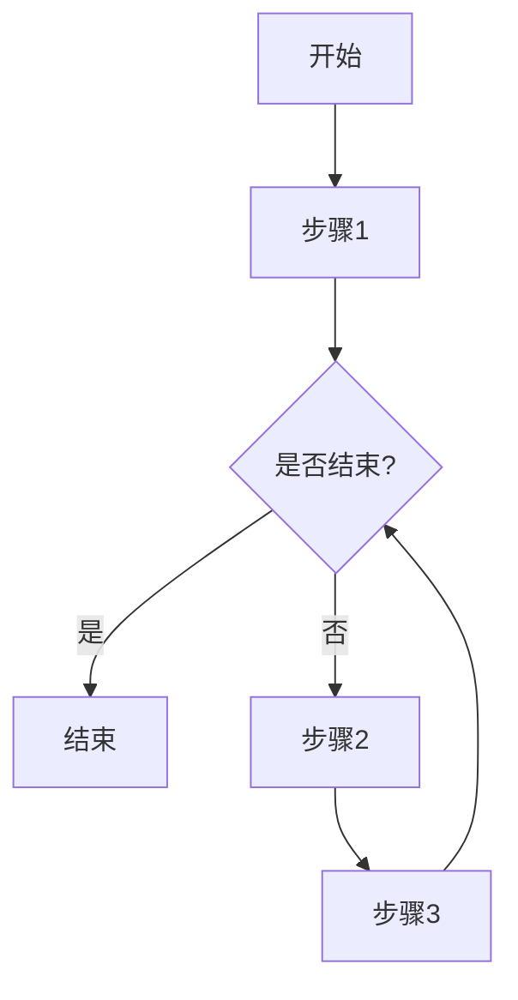
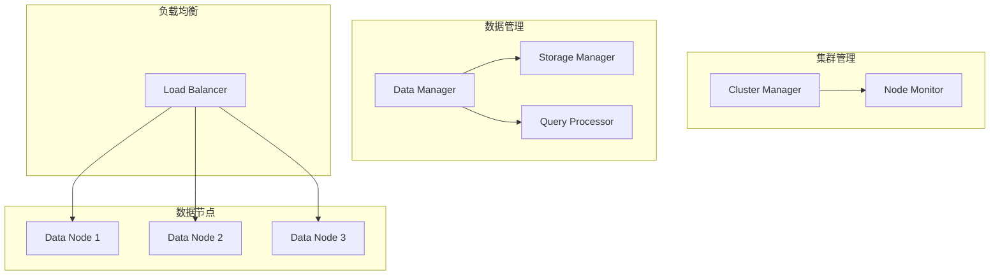
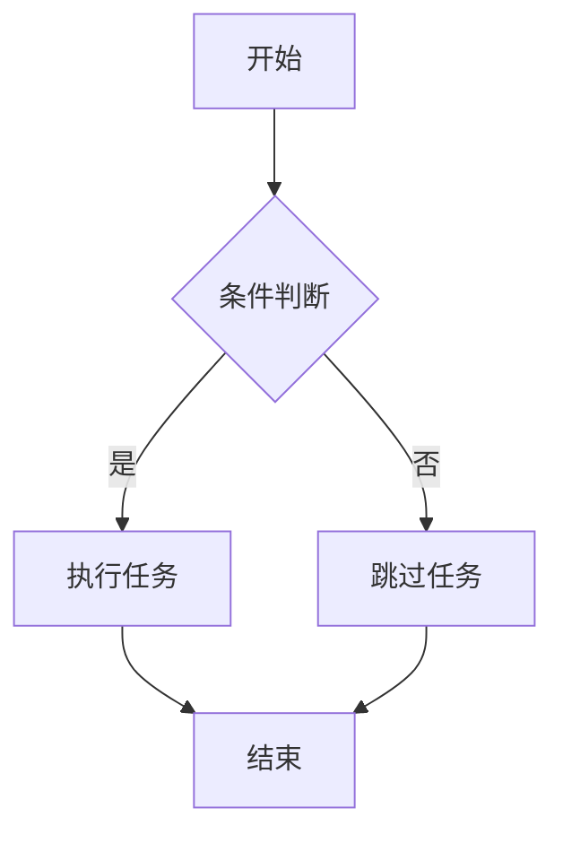
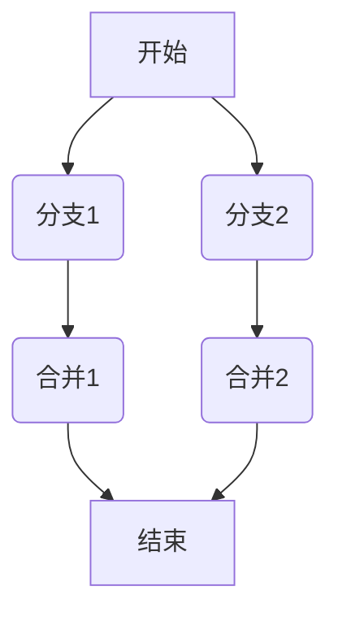
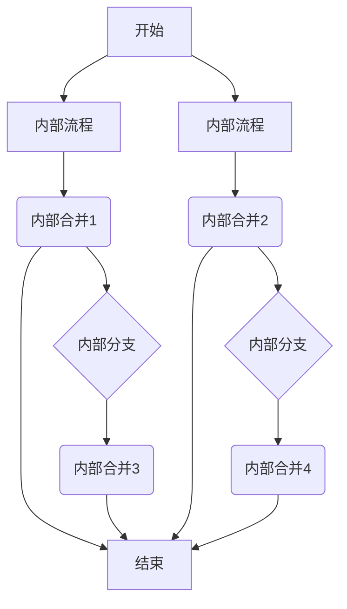
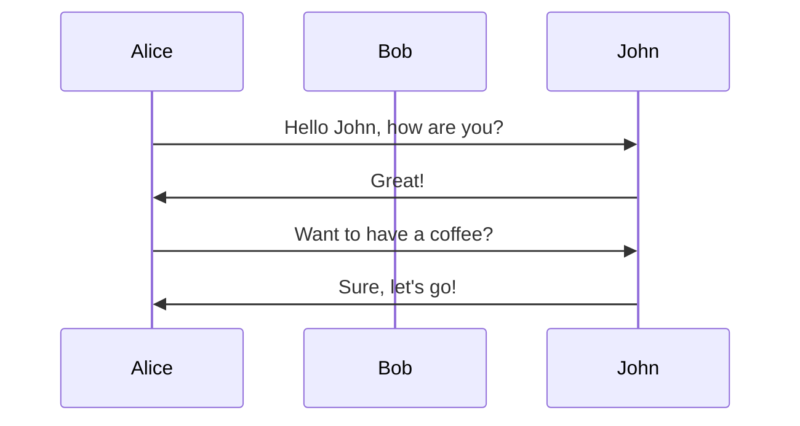
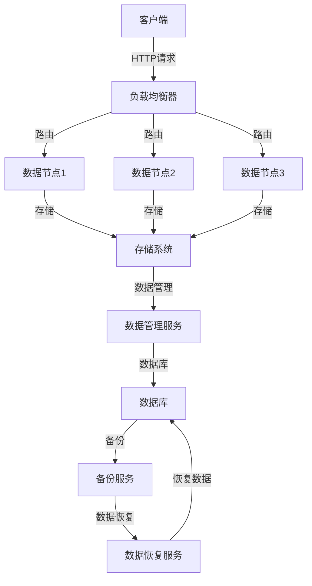
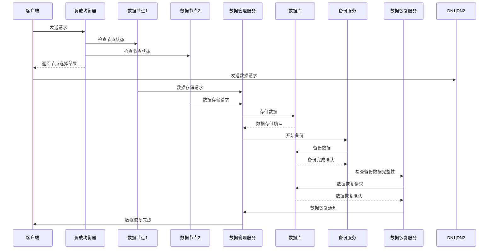

                 

# 虚无感的根源：解析现代社会的精神危机

> 关键词：虚无感、现代社会、精神危机、心理学、社会学、哲学、解决策略

> 摘要：本文将从心理学、社会学、哲学等多个角度深入探讨虚无感的根源，分析现代社会的精神危机，并提出相应的解决策略。通过全面的分析和实践指导，帮助读者理解虚无感的本质，找到应对现代社会精神危机的方法。

## 第一部分：背景介绍与核心概念

### 核心概念：虚无感的根源、现代社会的精神危机

**问题背景：**
在现代社会，人们普遍感受到了一种难以言表的空虚感，即虚无感。这种感觉并非一时的心绪波动，而是深刻影响人们心理状态的一种普遍现象。虚无感不仅存在于年轻人中，也逐渐在各个年龄层和职业群体中蔓延。这一现象引发了广泛的关注和探讨，成为现代社会无法忽视的一个问题。

**问题描述：**
虚无感表现为对生活缺乏热情、找不到生活的意义、感到孤独和无助等。人们在这种情绪的困扰下，容易产生消极心理，甚至影响日常生活和工作。虚无感的普遍存在，反映了现代社会精神层面的危机。

**问题解决：**
要解决虚无感，需要从根源入手，理解其产生的原因。本文将从心理学、社会学、哲学等多个角度，深入探讨虚无感的根源，并分析现代社会的精神危机。

**边界与外延：**
虚无感并非单纯的心理问题，它与社会环境、人际关系、个人成长等多方面因素密切相关。因此，探讨虚无感的根源，需要从多个维度进行深入分析。

**概念结构与核心要素组成：**
- 虚无感：一种普遍存在于现代社会的心理状态，表现为对生活缺乏热情和意义。
- 现代社会的精神危机：指现代社会中普遍存在的心理问题和精神困境。
- 核心要素：包括社会环境、人际关系、个人成长等。

### 第二部分：虚无感的根源分析

#### 第2章：心理学视角下的虚无感

**2.1 心理学理论基础**

心理学理论为理解虚无感提供了重要的视角。存在主义心理学是探讨人类存在的意义和价值的一个重要流派。存在主义心理学强调个体的自由、责任和存在的意义，认为虚无感是人在面对生命无意义时的自然反应。

**2.2 虚无感的心理学成因**

- **成长过程中的缺失**：童年时期的安全感缺失、自我认同感不强等，可能导致个体在成长过程中缺乏稳定的心理基础，从而容易产生虚无感。
- **成功与幸福的误读**：现代社会追求物质财富和社会地位，但许多人发现，即使实现了这些目标，内心依然空虚。这种追求的误读导致人们无法真正体验到幸福和满足。
- **社交网络的影响**：虽然社交网络让人感觉更加“社交”，但实际上却让人更加孤独。人们往往只展示自己的光鲜一面，而隐藏了自己的真实情感和困境，这加剧了虚无感的产生。

**2.3 虚无感的心理学应对策略**

- **自我接纳**：接受自己的不足，学会与自己和平共处。通过自我接纳，个体可以减少内心的焦虑和压力。
- **寻求意义**：通过设定目标、参与有意义的活动，寻找生活的意义。这可以帮助个体建立起对生活的积极态度，减少虚无感。
- **心理治疗**：认知行为疗法、存在主义疗法等心理治疗方法，可以帮助个体解决内心的困扰，减轻虚无感的影响。

#### 第3章：社会因素与虚无感

**3.1 社会变迁与虚无感**

- **经济发展**：随着经济的发展，物质生活的丰富并没有带来心理满足。人们追求的不仅是物质财富，更渴望精神的满足和幸福感。
- **社会竞争**：现代社会竞争激烈，人们面临各种压力和挑战。这种竞争可能导致个体感到焦虑和无力，从而产生虚无感。

**3.2 社交媒体与虚无感**

- **社交媒体成瘾**：人们过度依赖社交媒体，导致现实生活中的社交能力下降。社交媒体上的虚假展示和比较，让人感到自己与他人之间的差距，加剧了虚无感的产生。
- **社交媒体展示**：人们往往只展示自己的光鲜一面，导致内心的不满和焦虑。这种展示方式让个体无法真正面对自己的问题和困境，加剧了虚无感。

**3.3 社会支持与虚无感**

- **社会支持的重要性**：良好的社会支持可以缓解虚无感。社会支持包括亲情、友情、社区支持等，它们可以提供情感上的支持和安全感。
- **社会支持的缺失**：孤独、缺乏亲情和友情等，是社会支持缺失的表现。这些因素可能导致个体感到无助和孤独，加剧虚无感的产生。

#### 第4章：哲学视角下的虚无感

**4.1 哲学对虚无感的探讨**

- **存在主义**：存在主义探讨人类存在的意义和价值。存在主义者认为，虚无感是人类面对生命无意义时的自然反应。通过面对和接受虚无感，个体可以找到生命的意义。
- **道家哲学**：道家哲学强调“无为而治”和“顺应自然”。通过顺应自然，个体可以减少内心的焦虑和冲突，找到内心的平静。

**4.2 哲学对虚无感的启示**

- **自我认知**：通过哲学思考，提高自我认知，找到内心的平静。通过反思和探索，个体可以更好地理解自己的需求和期望，减少虚无感的影响。
- **生活态度**：调整生活态度，学会享受生活中的每一个瞬间。通过改变对生活的看法和态度，个体可以减少虚无感的影响，更好地享受生活。

### 第三部分：解决虚无感的实践与策略

#### 第5章：个人成长与自我实现

**5.1 个人成长的重要性**

- **个人成长**：个人成长不仅仅是身体上的成长，更是心理上的成长。通过不断学习和成长，个体可以提升自己的能力和自信心，减少虚无感的影响。
- **自我实现**：自我实现是个人成长的高级阶段。通过实现个人潜能，个体可以找到自己的人生目标，减少虚无感的影响。

**5.2 个人成长的实践策略**

- **设定目标**：明确自己的目标，制定实现目标的计划。通过设定目标，个体可以减少迷茫和焦虑，增加对生活的控制感。
- **持续学习**：不断学习新知识，提升自己的能力。通过学习，个体可以扩展自己的视野，减少对未知的恐惧。
- **自我反思**：定期进行自我反思，了解自己的成长和不足。通过自我反思，个体可以更好地认识自己，调整自己的行为和态度。

#### 第6章：心理调适与情绪管理

**6.1 心理调适的重要性**

- **心理调适**：心理调适是应对虚无感的重要策略。通过心理调适，个体可以减少内心的焦虑和压力，提高心理韧性。
- **情绪管理**：情绪管理是心理调适的重要组成部分。通过情绪管理，个体可以更好地控制自己的情绪，减少情绪对生活的影响。

**6.2 心理调适的方法**

- **放松训练**：通过深呼吸、冥想等方法，放松身心。放松训练可以帮助个体减轻压力，提高心理韧性。
- **认知重构**：改变消极的思维模式，建立积极的思维习惯。通过认知重构，个体可以减少消极情绪的影响，提高生活质量。
- **情绪表达**：学会表达自己的情绪，避免压抑和内化。通过情绪表达，个体可以释放内心的压力，提高情绪稳定性。

#### 第7章：社会支持与人际关系

**7.1 社会支持的重要性**

- **社会支持**：社会支持是应对虚无感的重要资源。通过社会支持，个体可以获得情感上的支持和安全感。
- **人际关系**：良好的人际关系可以提供情感上的支持和帮助。通过建立和维护良好的人际关系，个体可以减少孤独感和无助感。

**7.2 建立和维护良好的人际关系**

- **建立亲密关系**：与他人建立深入的情感联系。通过建立亲密关系，个体可以获得情感上的支持和安慰。
- **社交技巧**：提高社交技巧，扩大社交圈。通过提高社交技巧，个体可以更好地与他人交流，建立和维护人际关系。
- **社区参与**：积极参与社区活动，融入社区生活。通过社区参与，个体可以获得更多的社会支持和归属感。

### 第四部分：总结与展望

#### 第8章：虚无感根源的综合分析与解决策略

**8.1 虚无感根源的综合分析**

- **心理学视角**：虚无感源于个体内心的焦虑和无助，与个人的成长经历、成功追求和社交网络使用密切相关。
- **社会学视角**：社会变迁和激烈的竞争加剧了虚无感的产生，而社交媒体的成瘾和展示方式的错误加剧了内心的不满和焦虑。
- **哲学视角**：虚无感是人类面对生命无意义时的自然反应，通过哲学思考可以找到生命的意义和价值。

**8.2 虚无感解决策略的综合分析**

- **个人成长与自我实现**：通过个人成长和自我实现，个体可以找到生活的意义和价值，减少虚无感的影响。
- **心理调适与情绪管理**：通过心理调适和情绪管理，个体可以减轻内心的焦虑和压力，提高心理韧性。
- **社会支持与人际关系**：通过社会支持和良好的人际关系，个体可以获得情感上的支持和安全感，减少虚无感的影响。

**8.3 未来展望**

- **心理学研究**：未来心理学研究应继续深入探讨虚无感的成因和解决策略，为个体提供更有效的心理支持。
- **社会支持体系的建立**：社会应建立更加完善的社会支持体系，为个体提供更多的社会资源和帮助。
- **哲学与生活的融合**：哲学应更好地融入生活，帮助个体在面对虚无感时找到生命的意义和价值。

### 结论

虚无感是现代社会普遍存在的一个心理问题，它深刻影响着人们的生活质量和心理状态。通过本文的探讨，我们可以看到虚无感的根源涉及心理学、社会学和哲学等多个方面。解决虚无感需要从根源入手，通过个人成长、心理调适和社会支持等多方面的努力，找到生活的意义和价值。让我们共同努力，克服虚无感，拥抱美好的生活。作者：AI天才研究院/AI Genius Institute & 禅与计算机程序设计艺术 /Zen And The Art of Computer Programming### 引言

在现代社会，虚无感成为一种越来越普遍的现象。无论是在忙碌的都市中，还是在宁静的乡村，人们似乎都感受到了一种难以名状的空虚感。这种感觉不仅仅是个人心境的问题，更是一种深层次的社会现象，反映了现代社会中普遍存在的心理危机和精神困境。

虚无感通常表现为对生活的缺乏热情、对未来的迷茫、对自我价值的质疑，以及一种持续的低落情绪。这种心理状态不仅影响个人的心理健康，还可能进一步导致一系列心理问题，如焦虑、抑郁等。因此，探讨虚无感的根源，理解其产生的机制，并提出有效的应对策略，具有重要的现实意义。

本文旨在通过深入分析虚无感的根源，结合心理学、社会学和哲学等多个视角，全面解析现代社会精神危机的成因。同时，本文将提出一系列实践策略，帮助读者应对虚无感，找回生活的意义和动力。通过这一探讨，我们希望能够为现代社会中面临精神困境的人们提供一些有益的思考和指导。

### 背景介绍

虚无感，作为一种普遍存在的心理现象，其根源可以追溯到个体内心深处。在现代社会的背景下，虚无感尤为显著，这不仅源于个人内心的焦虑和迷茫，更是社会变迁、经济发展和科技进步等多重因素共同作用的结果。

首先，心理学视角下的虚无感根源主要体现在个体成长过程中的缺失。在现代社会中，许多人在成长过程中面临诸多挑战，如家庭不和谐、教育压力、社交困难等。这些经历可能导致个体内心缺乏安全感、自尊心受损，进而产生虚无感。例如，童年时期的安全感缺失可能导致个体在成年后对生活缺乏信心和热情，难以找到生活的意义。

其次，现代社会对成功的追求和幸福的误读也是虚无感产生的重要原因。在物质文明高度发展的今天，人们普遍追求物质财富和社会地位，但许多人发现，即使实现了这些目标，内心依然空虚。成功和幸福的追求往往被简化为物质和地位的积累，忽视了精神层面的满足。这种追求的误读导致个体在追求成功的过程中失去了对生活的热爱和对幸福的真正理解。

另外，社交网络的影响也在加剧虚无感的产生。虽然社交网络让人们感觉更加“社交”，但实际上却让人更加孤独。在社交媒体上，人们往往只展示自己光鲜的一面，隐藏了自己的真实情感和困境。这种虚拟的社交环境让人感到虚假和疏离，加剧了内心的空虚感。此外，社交网络的成瘾性也让人们过度依赖虚拟世界，忽视了现实生活中的人际互动，进一步加剧了虚无感。

社会变迁和经济发展也是虚无感产生的重要背景。随着社会的快速发展和变革，人们的价值观和生活方式也在不断变化。经济繁荣带来了物质生活的丰富，但同时也带来了精神层面的空虚。激烈的竞争和压力让人感到焦虑和无助，进一步加剧了虚无感的产生。

最后，个人成长和自我实现的需求未能得到满足也是虚无感的一个重要根源。在现代社会中，人们普遍追求自我实现和个人价值的体现，但许多人感到自己的潜能未能得到充分挖掘，生活缺乏目标和意义。这种未实现的自我潜能和追求的挫败感，使得个体在内心深处产生了虚无感。

综上所述，虚无感的根源是复杂多样的，既源于个体内心的缺失和迷茫，也受到社会环境、人际关系和经济发展等多重因素的影响。理解虚无感的根源，有助于我们更好地应对这一现代社会中的普遍心理现象，找到解决虚无感的有效策略。

### 核心概念：虚无感的根源、现代社会的精神危机

在深入探讨虚无感之前，有必要明确几个核心概念：虚无感的根源和现代社会的精神危机。这两个概念不仅相互关联，而且深刻地影响了我们的心理健康和生活质量。

**虚无感的根源**：虚无感是一种心理状态，主要表现为对生活缺乏热情、感到无意义、无助和孤独。它并非单一的心理问题，而是由多种因素共同作用的结果。从心理学角度来看，虚无感可能源于童年时期的安全感缺失、自我认同感的不足、成功与幸福的误读，以及社交网络的负面影响。社会学视角则强调了社会变迁、经济发展和竞争压力对虚无感的影响。哲学上，虚无感是人类面对生命无意义时的自然反应，探讨如何通过哲学思考找到生活的意义和价值。

**现代社会的精神危机**：现代社会的精神危机指的是在现代社会背景下，人们普遍面临的心理困境和精神困扰。这一危机不仅表现为个体层面的虚无感，还包括焦虑、抑郁、自杀率上升等严重心理问题。精神危机的根源可以追溯到现代社会的高节奏生活、物质主义的泛滥、人际关系的疏离、精神需求的缺失等。这种危机对个人心理健康和社会稳定都构成了严重威胁。

虚无感与现代社会的精神危机之间存在着紧密的关联。虚无感是精神危机的一个典型表现，而精神危机则加剧了虚无感的产生和扩散。在现代社会中，虚无感不仅影响个体的心理健康，还可能影响社会关系、工作效率和社会稳定性。因此，深入理解虚无感的根源，有助于我们更好地应对现代社会的精神危机。

### 背景介绍与核心概念

#### 1. 核心概念：虚无感与现代社会精神危机

**虚无感**：虚无感是一种深层次的、持久的心理状态，个体在这种状态下感受到生活的无意义、空洞和无价值。这种感觉不仅影响个人的心理健康，还可能影响他们的社会功能和人际关系。

**现代社会精神危机**：精神危机是指现代社会中普遍存在的心理健康问题，如焦虑、抑郁、孤独等。这一危机源于现代生活方式的快节奏、工作压力、人际关系的疏离和社会结构的变迁。

#### 2. 问题背景

在现代社会，虚无感成为一个越来越显著的现象。许多人在面对生活的压力和挑战时，感到无助和迷茫。虚无感不仅存在于年轻人中，也逐渐在各个年龄层和职业群体中蔓延。这一现象引发了广泛的关注和探讨，成为现代社会无法忽视的一个问题。

#### 3. 描述问题

虚无感表现为对生活缺乏热情、找不到生活的意义、感到孤独和无助等。人们在这种情绪的困扰下，容易产生消极心理，甚至影响日常生活和工作。虚无感的普遍存在，反映了现代社会精神层面的危机。

#### 4. 解决问题

要解决虚无感，需要从根源入手，理解其产生的原因。本文将从心理学、社会学、哲学等多个角度，深入探讨虚无感的根源，并提出相应的解决策略。

#### 5. 边界与外延

虚无感并非单纯的心理问题，它与社会环境、人际关系、个人成长等多方面因素密切相关。因此，探讨虚无感的根源，需要从多个维度进行深入分析。

#### 6. 概念结构与核心要素组成

- **虚无感**：一种普遍存在于现代社会的心理状态，表现为对生活缺乏热情和意义。
- **现代社会精神危机**：指现代社会中普遍存在的心理问题和精神困境。
- **核心要素**：包括社会环境、人际关系、个人成长等。

### 第二部分：虚无感的根源分析

#### 第2章：心理学视角下的虚无感

虚无感作为一种深层次的心理状态，可以从心理学的多个理论视角进行深入分析。心理学理论为理解虚无感提供了重要的理论基础，特别是存在主义心理学、心理防御机制以及成长过程中的缺失等方面。

**2.1 心理学理论基础**

心理学中的存在主义心理学是探讨人类存在的意义和价值的一个重要流派。存在主义心理学家如让-保尔·萨特（Jean-Paul Sartre）和马丁·海德格尔（Martin Heidegger）等，认为虚无感是人类面对生命无意义时的自然反应。存在主义强调个体的自由、责任和存在的意义，指出虚无感是人在面对生命的无意义和不确定性时的心理体验。

**2.2 虚无感的心理学成因**

**成长过程中的缺失**：

- **安全感缺失**：在成长过程中，如果个体缺乏基本的安全感，可能会导致其成年后在面对生活中的不确定性和挑战时产生虚无感。这种安全感的缺失可能源于家庭环境不良、父母离异或虐待等。
- **自我认同感不强**：个体在成长过程中如果没有建立起稳定的自我认同感，可能会对自己的存在感到困惑和迷茫，从而产生虚无感。自我认同感的缺失可能源于教育过程中缺乏认同、社交失败等。
- **早期经验的影响**：童年时期的经历对个体的心理健康有深远的影响。如果个体在童年时期经历过创伤性事件或心理压力，可能会在成年后表现出持续的虚无感。

**成功与幸福的误读**：

- **物质主义的追求**：现代社会普遍存在物质主义思潮，许多人认为通过积累财富和社会地位可以获得幸福。然而，研究发现，物质财富并不能长久地带来内心的满足，反而可能导致个体在追求成功的过程中感到虚无。
- **社会比较的陷阱**：在社交媒体高度发达的今天，人们往往通过比较来衡量自己的成功和幸福。这种社会比较可能导致个体感到自己与他人之间的差距，从而产生自卑和虚无感。

**社交网络的影响**：

- **虚拟社交的疏离**：虽然社交网络让人感觉更加“社交”，但实际上却可能让人更加孤独。人们在社交媒体上展示的是自己精心挑选和编辑的生活片段，而不是真实的自我。这种虚拟的社交环境可能导致个体在现实生活中感到疏离和孤独。
- **社交网络的成瘾性**：社交网络具有高度的成瘾性，人们可能会过度依赖这些平台来获得社交满足。这种依赖性可能导致个体在现实生活中缺乏真实的社交互动，进一步加剧虚无感的产生。

**2.3 虚无感的心理学应对策略**

**自我接纳**：

- **接受自己的不足**：通过自我接纳，个体可以减少内心的焦虑和压力，学会与自己和平共处。自我接纳包括接受自己的优点和不足，认识到每个人都有不完美之处。
- **培养自我同情**：学会同情自己，认识到自己也是人类的一部分，有自己的弱点和挑战。通过自我同情，个体可以减少自我批评和自我否定，提高自尊和自信。

**寻求意义**：

- **设定目标**：通过设定有意义的目标，个体可以找到生活的方向和动力。设定目标可以帮助个体专注于实现具体任务，减少对虚无感的关注。
- **参与有意义的活动**：参与对社会有益的活动，如志愿服务、慈善工作等，可以增加个体的社会归属感和自我价值感。通过这些活动，个体可以找到生活的意义和目标。

**心理治疗**：

- **认知行为疗法**：认知行为疗法通过改变个体的思维模式和行为习惯，帮助个体应对虚无感。这种方法通过识别和改变消极思维，建立积极的思维习惯，帮助个体改善心理健康。
- **存在主义疗法**：存在主义疗法专注于个体的存在体验，帮助个体找到生命的意义和价值。通过探索个体的存在问题和困境，疗法师可以引导个体建立积极的生存策略。

通过心理学视角的分析，我们可以看到虚无感是多种因素共同作用的结果。理解虚无感的成因，有助于我们采取有效的策略来应对这一心理现象，提高个体的心理健康和生活质量。

### 社会因素与虚无感

虚无感作为一种社会心理现象，其产生和发展不仅与个体心理状态密切相关，还受到社会环境、人际关系和社会支持等多方面因素的影响。以下将从社会变迁、经济发展、社交媒体使用等方面探讨虚无感的社会根源，并分析这些因素如何共同作用于个体的心理健康。

**3.1 社会变迁与虚无感**

社会变迁是现代社会中一个不可忽视的背景，它对个体的心理健康产生了深远的影响。随着全球化和现代化进程的加速，社会结构、价值观念和文化传统发生了显著变化，这些变化在很大程度上影响了人们的心理状态。

- **社会结构的变动**：现代社会中，传统的家庭和社区关系逐渐弱化，个体面临更加独立和自主的生活方式。这种变化一方面提高了个体的自由度，但另一方面也可能导致个体感受到孤独和无助。例如，随着城市化进程的加快，许多人离开家乡到城市生活，传统的家庭和社区支持网络消失，个体在心理上失去了重要的依靠。
- **价值观念的转变**：现代社会强调个人主义和自我实现，个体被鼓励追求个人的成功和幸福。然而，这种价值观念的转变也可能导致个体在追求个人目标的过程中忽视了对社会和他人的关注，从而感到内心空虚和孤独。例如，许多人将物质财富和社会地位视为成功和幸福的唯一标准，但在实现了这些目标之后，仍然感到不满足，进而产生虚无感。
- **文化传统的断裂**：现代社会中的快速变化往往伴随着文化传统的断裂。传统的文化价值观和信仰体系逐渐消失，个体在心理上失去了精神支柱和指导。这种文化断裂可能导致个体在面对生活中的困难和挑战时感到迷茫和无助，从而加剧虚无感的产生。

**3.2 经济发展与虚无感**

经济发展是现代社会的一个重要特征，它不仅改变了人们的生活方式，也对个体的心理健康产生了深远的影响。虽然经济发展提高了人们的物质生活水平，但同时也带来了新的压力和挑战。

- **经济压力**：随着经济的发展，竞争日益激烈，工作压力和生活成本不断增加。许多人为了追求更好的经济条件，不得不投入大量时间和精力在工作上，导致生活节奏加快、休息时间减少。这种经济压力可能导致个体感到疲惫和焦虑，进而产生虚无感。
- **消费主义文化的侵蚀**：经济发展带来了消费主义文化的盛行，人们被鼓励追求物质享受和消费。然而，这种消费主义文化也可能导致个体对物质财富的过度追求，忽视了精神层面的需求。例如，许多人通过购买奢侈品和享受高档消费来寻求满足和幸福感，但这种短暂的满足感往往无法持久，反而可能加剧内心的空虚和虚无感。

**3.3 社交媒体与虚无感**

社交媒体在现代社会中扮演着重要的角色，它改变了人们的社交方式和沟通方式。然而，社交媒体的使用也可能对个体的心理健康产生负面影响，特别是在虚无感的产生和传播方面。

- **社交网络的影响**：社交媒体让人们可以随时随地与他人保持联系，但同时也可能导致个体对现实生活中的社交互动产生依赖。人们在社交媒体上展示的是自己精心挑选和编辑的生活片段，而不是真实的自我。这种虚拟的社交环境可能导致个体在现实生活中感到疏离和孤独，进而产生虚无感。
- **社交媒体展示的影响**：社交媒体上的展示方式可能导致个体产生社会比较和自我否定。许多人通过社交媒体与他人的成功和幸福进行比较，从而感到自己与他人之间的差距。例如，一个人可能会看到朋友在社交媒体上晒出了豪华旅游照片，而自己却没有这样的经历，从而产生自卑和虚无感。
- **社交网络的成瘾性**：社交媒体具有高度的成瘾性，人们可能会过度依赖这些平台来获得社交满足和自我确认。这种依赖性可能导致个体在现实生活中缺乏真实的社交互动，进一步加剧虚无感的产生。

**3.4 社会支持与虚无感**

社会支持是缓解虚无感的重要资源，它可以提供情感上的支持和安全感，帮助个体应对生活中的压力和挑战。然而，社会支持的缺失或不足也可能加剧虚无感的产生。

- **社会支持的重要性**：良好的社会支持可以帮助个体减轻心理压力，提高心理韧性。例如，家庭和朋友的支持可以提供情感上的安慰和安全感，帮助个体在困难时期保持积极的心态。此外，社区支持和社会网络也可以提供信息资源和实用帮助，帮助个体更好地应对生活中的挑战。
- **社会支持的缺失**：社会支持的缺失可能导致个体感到无助和孤独。例如，孤独和缺乏亲情友情的个体可能难以找到心理支持，进而产生虚无感。此外，社会变迁和城市化进程也可能导致个体在心理上失去重要的支持网络，从而加剧虚无感的产生。

综上所述，社会因素在虚无感的产生和发展中起着至关重要的作用。社会变迁、经济发展、社交媒体使用和社会支持等因素共同作用于个体的心理健康，影响着个体对生活的感受和态度。理解这些社会因素的作用机制，有助于我们更好地应对虚无感，提高个体的心理健康水平。

### 哲学视角下的虚无感

哲学，作为探讨人类存在和意义的重要学科，为理解虚无感提供了独特的视角。虚无感，作为一种对生活缺乏热情和意义的心理状态，在哲学中得到了深入探讨。通过存在主义哲学和道家哲学，我们可以更好地理解虚无感的本质，并从中汲取应对虚无感的哲学启示。

**4.1 存在主义对虚无感的探讨**

存在主义哲学，特别是以让-保尔·萨特和马丁·海德格尔为代表的流派，对虚无感有着深刻的探讨。存在主义认为，虚无感是人类面对生命无意义和不确定性的自然反应。萨特在其代表作《存在与虚无》中提出，人类存在的本质是“存在先于本质”，这意味着人类在诞生之初是没有任何预设目的和意义的，而是通过自己的选择和行动来赋予生活意义。

**虚无感的本质**：

- **无意义感**：存在主义认为，虚无感源于人类对生活意义的追求。由于生活本身没有预设的目的，个体在追求意义的过程中可能会感受到生活的无意义。
- **自由与责任**：存在主义强调自由是人的本质，但自由也伴随着责任。个体在追求意义的过程中，必须面对选择的自由和随之而来的责任，这种自由和责任的不确定性可能导致虚无感的产生。

**应对策略**：

- **面对虚无感**：存在主义认为，面对虚无感是寻找生活意义的第一步。只有勇敢地面对虚无感，个体才能真正开始探索和创造自己的意义。
- **行动与选择**：通过行动和选择，个体可以为自己创造意义。尽管生活本身没有预设的意义，但通过个体的努力，可以创造出属于自己的独特意义。

**4.2 道家哲学对虚无感的启示**

道家哲学，特别是老子的“无为而治”和庄子的“顺应自然”，为应对虚无感提供了深刻的哲学启示。道家哲学强调顺应自然和内心的平静，认为虚无感可以通过回归自然和内心的平静来缓解。

**虚无感的哲学启示**：

- **无为而治**：老子提出的“无为而治”意味着不要过度干预和强求，而是顺应自然的规律。在应对虚无感时，个体可以通过减少对生活的强求和干预，接受生活的不确定性和复杂性，从而减轻内心的焦虑和压力。
- **顺应自然**：庄子强调顺应自然，认为人与自然是一个统一的整体。通过顺应自然，个体可以减少对生活的抗拒和抗拒，找到内心的平静和和谐。

**应对策略**：

- **接受不确定性**：通过接受生活的不确定性和复杂性，个体可以减少对虚无感的恐惧和抗拒。这种接受不仅可以帮助个体找到内心的平静，还可以提高个体的心理韧性。
- **回归自然**：通过回归自然，个体可以远离现代社会的喧嚣和压力，找到内心的平静和安宁。例如，通过散步、冥想、亲近大自然等活动，个体可以缓解内心的焦虑和压力。

**4.3 哲学视角下的综合分析**

从哲学视角看，虚无感不仅是人类面对生活无意义的一种自然反应，也是对个体自由和责任的一种深刻体验。存在主义和道家哲学为我们提供了不同的应对策略，通过面对虚无感、行动与选择、接受不确定性以及回归自然，我们可以更好地应对虚无感，找到生活的意义和方向。

总之，哲学视角下的虚无感探讨不仅帮助我们理解了虚无感的本质，还为我们提供了应对虚无感的哲学启示。通过结合存在主义和道家哲学的思考，我们可以更好地理解虚无感，找到应对现代社会精神危机的方法。

### 个人成长与自我实现

个人成长和自我实现是应对虚无感的重要途径。通过自我提升和实现个人潜能，个体可以找到生活的意义和目标，从而减轻虚无感的影响。以下将详细探讨个人成长的重要性、个人成长的实践策略以及如何通过个人成长来应对虚无感。

**5.1 个人成长的重要性**

个人成长不仅仅是对外在技能的掌握，更是对内心世界的探索和提升。在现代社会，个人成长具有以下几个重要意义：

- **提升自信心**：通过不断学习和成长，个体可以提升自己的能力和自信心。自信心可以帮助个体更好地应对生活中的挑战和压力，减少虚无感的影响。
- **实现个人价值**：个人成长可以帮助个体实现自己的潜能，找到自己的兴趣和热情。通过实现个人价值，个体可以在生活中找到意义和目标，减少虚无感。
- **促进心理健康**：个人成长有助于个体建立积极的自我认知，减少自卑和焦虑。通过个人成长，个体可以提升自己的心理韧性，更好地应对生活中的困难和挑战。

**5.2 个人成长的实践策略**

要实现个人成长，个体可以从以下几个方面入手：

- **设定目标**：设定具体、可实现的短期和长期目标，可以帮助个体明确自己的方向和努力方向。例如，设定每天学习一定时间的技能，或在未来几年内完成某个项目。
- **持续学习**：不断学习新知识、新技能是个人成长的重要途径。通过参加培训课程、阅读书籍、观看教育视频等方式，个体可以扩展自己的知识面和技能。
- **自我反思**：定期进行自我反思，了解自己的成长和不足。通过反思，个体可以认识到自己的优点和需要改进的地方，从而制定更有效的个人成长计划。
- **培养积极习惯**：培养积极的习惯，如早起、锻炼、阅读等，可以帮助个体建立健康的生活方式，提升个人效率和幸福感。
- **寻求帮助**：在个人成长过程中，寻求他人的帮助和指导是非常重要的。通过与导师、同行或心理咨询师交流，个体可以获得宝贵的经验和建议，帮助自己更好地成长。

**5.3 个人成长与应对虚无感**

个人成长在应对虚无感方面具有以下几个方面的作用：

- **提升自我认同**：通过个人成长，个体可以建立更加积极的自我认同感。自我认同感的提升有助于个体减少对生活意义的质疑，找到自己的价值和存在的意义。
- **增强心理韧性**：个人成长可以帮助个体提升心理韧性，更好地应对生活中的挑战和压力。心理韧性的增强有助于个体在面对困难时保持积极的态度，减少虚无感的产生。
- **找到生活的意义**：通过个人成长和自我实现，个体可以找到生活的意义和目标。在追求个人目标和实现自我价值的过程中，个体可以感受到生活的充实和意义，从而减轻虚无感的影响。

总之，个人成长和自我实现是应对虚无感的重要途径。通过设定目标、持续学习、自我反思、培养积极习惯和寻求帮助，个体可以提升自我认同感、增强心理韧性，并找到生活的意义，从而有效应对虚无感。作者：AI天才研究院/AI Genius Institute & 禅与计算机程序设计艺术 /Zen And The Art of Computer Programming

### 心理调适与情绪管理

心理调适与情绪管理是应对虚无感的重要策略。通过调整心理状态和有效管理情绪，个体可以减轻内心的焦虑和压力，提升心理健康水平。以下将详细探讨心理调适与情绪管理的重要性、具体方法和实践策略。

**6.1 心理调适的重要性**

心理调适是指通过一系列方法和技巧来调整个体的心理状态，以应对生活中的压力和挑战。在应对虚无感方面，心理调适具有以下几个重要意义：

- **缓解焦虑和压力**：心理调适可以帮助个体缓解由于生活压力和挑战带来的焦虑和紧张感。通过心理调适，个体可以学会更加冷静和理智地面对问题，减少心理负担。
- **提升心理健康水平**：心理调适有助于个体提高心理健康水平，减少心理问题的发生。通过心理调适，个体可以建立积极的思维模式，增强心理韧性，更好地应对生活中的困难。
- **增强心理韧性**：心理调适可以帮助个体提升心理韧性，增强面对困难和挫折的能力。通过心理调适，个体可以培养出积极的心态，减少对困境的过度反应，从而更好地应对生活中的挑战。

**6.2 心理调适的方法**

心理调适的方法多种多样，以下介绍几种常见的方法：

- **放松训练**：放松训练是通过一系列放松技巧来缓解身体和心理的紧张感。常见的放松训练方法包括深呼吸、冥想、瑜伽等。这些方法可以帮助个体放松身心，减轻压力和焦虑。
- **认知重构**：认知重构是通过改变消极的思维模式来提升心理状态。个体可以通过识别和挑战自己的消极思维，将其转变为积极的思维模式。例如，将“我做不到”转变为“我可以尝试并找到解决方案”。
- **积极思考**：积极思考是一种培养乐观心态的方法。个体可以通过关注生活中的积极事物和正面经验，学会以积极的眼光看待问题。积极思考有助于提升个体的心理韧性，减少消极情绪的影响。
- **心理暗示**：心理暗示是通过积极的自我暗示来改变心理状态。个体可以通过自我暗示来增强自信、减少焦虑。例如，每天早上对自己说“今天我会过得很好”或“我能够应对所有的挑战”。

**6.3 情绪管理的实践策略**

情绪管理是指通过一系列方法和技巧来调节和控制情绪，使其更加稳定和健康。以下是一些有效的情绪管理实践策略：

- **情绪识别与表达**：个体需要学会识别自己的情绪，并找到合适的方式表达出来。通过情绪识别与表达，个体可以更好地理解自己的情绪，避免情绪的积累和爆发。
- **情绪调节技巧**：个体可以通过一些情绪调节技巧来控制情绪。例如，当感到愤怒或焦虑时，可以尝试深呼吸、散步或做一些放松的活动。这些方法可以帮助个体缓解情绪，保持冷静。
- **情绪缓冲**：情绪缓冲是指通过一些活动来缓解紧张情绪。例如，个体可以在工作中或生活中安排一些放松的活动，如听音乐、阅读或与朋友聊天。这些活动可以帮助个体在紧张和压力下找到放松的机会。
- **情绪释放**：个体需要学会适当地释放情绪。通过运动、写日记或与信任的朋友倾诉等方式，个体可以释放压抑的情绪，减少内心的负担。

**6.4 心理调适与情绪管理的综合应用**

心理调适和情绪管理需要相互结合，共同发挥作用。以下是一些综合应用的策略：

- **定期心理调适**：个体可以定期进行心理调适，如每天进行一次深呼吸、冥想或放松训练。这些活动可以帮助个体保持心理平衡，减少焦虑和压力。
- **情绪日记**：个体可以保持情绪日记，记录自己的情绪变化和应对策略。通过情绪日记，个体可以更好地了解自己的情绪模式，找到有效的情绪管理方法。
- **寻求专业帮助**：当个体遇到严重的情绪问题或心理困扰时，可以寻求专业的心理咨询师或心理治疗师的帮助。专业人士可以提供个性化的指导和支持，帮助个体更好地应对情绪问题。

总之，心理调适与情绪管理是应对虚无感的重要策略。通过调整心理状态和有效管理情绪，个体可以减轻内心的焦虑和压力，提升心理健康水平，从而更好地应对虚无感。作者：AI天才研究院/AI Genius Institute & 禅与计算机程序设计艺术 /Zen And The Art of Computer Programming

### 社会支持与人际关系

**7.1 社会支持的重要性**

社会支持是应对虚无感的重要资源，它能够提供情感上的支持、安全感以及实际的帮助。在社会网络中，社会支持的形式多样，包括亲情、友情和社区支持等。

**情感支持**：情感支持是指个体在社会网络中获得的情感安慰和理解。在面临压力和困境时，来自亲人、朋友或社区的支持可以帮助个体缓解焦虑和痛苦，提高心理韧性。

**安全感**：社会支持可以提供个体心理上的安全感。在一个稳定、支持性的社会环境中，个体感到自己不是孤立的，有他人的支持和关心，从而减少内心的不安和恐惧。

**实际帮助**：社会支持不仅包括情感上的支持，还包括实际的帮助。例如，朋友或社区成员在个体遇到经济困难、健康问题或其他生活挑战时，可以提供实际的帮助，如物质援助、信息共享或专业指导。

**7.2 建立和维护良好的人际关系**

建立和维护良好的人际关系是获取社会支持的关键。以下是一些策略和建议：

**建立亲密关系**：建立亲密关系是获得情感支持和安全感的有效途径。个体可以通过以下方式建立亲密关系：

- **深入交流**：与他人进行深入的交流和分享，增进彼此的了解和信任。
- **共同活动**：参与共同的兴趣和活动，增进彼此的情感联系。
- **支持与鼓励**：在对方遇到困难和挑战时，提供支持和鼓励，帮助他们度过难关。

**提高社交技巧**：提高社交技巧可以帮助个体更有效地建立和维护人际关系。以下是一些社交技巧：

- **倾听**：倾听他人的意见和感受，展示关心和理解。
- **表达**：学会表达自己的需求和感受，避免误解和冲突。
- **礼貌**：保持礼貌和尊重，建立和谐的人际关系。
- **社交礼仪**：了解和遵循社交礼仪，提高社交场合的适应性。

**社区参与**：积极参与社区活动可以帮助个体融入社区，建立广泛的社会联系。以下是一些社区参与的策略：

- **志愿服务**：参与志愿服务，不仅可以帮助他人，还可以拓展自己的社交网络。
- **社区活动**：参与社区组织的活动，如文化庆典、运动会等，增加与社区成员的互动。
- **社区互动**：通过社区互动，了解社区动态，建立社区归属感。

**7.3 建立和维护良好人际关系的挑战与应对**

尽管建立和维护良好的人际关系对个体心理健康至关重要，但在实际操作中也面临一些挑战。以下是一些常见挑战及应对策略：

**挑战1：社交焦虑**  
**应对策略**：通过逐步增加社交情境的难度，逐步克服社交焦虑。例如，先从参加小规模聚会开始，逐渐适应更大规模的社交场合。

**挑战2：冲突处理**  
**应对策略**：学习有效的沟通技巧和冲突处理策略，如通过对话解决问题，避免情绪化的争吵。

**挑战3：时间和精力限制**  
**应对策略**：合理安排时间和精力，确保既能满足社交需求，又不会过度消耗自己。

**挑战4：文化差异**  
**应对策略**：尊重和理解不同文化背景的人，通过文化敏感性和适应性来建立良好的人际关系。

综上所述，社会支持和良好的人际关系对于应对虚无感至关重要。通过建立亲密关系、提高社交技巧、积极参与社区活动，以及应对社交中的挑战，个体可以建立稳定的社会支持网络，减少虚无感的影响，提高生活质量。

### 第四部分：总结与展望

#### 第8章：虚无感根源的综合分析与解决策略

虚无感作为现代社会普遍存在的一种心理现象，其根源是复杂且多样的。通过对心理学、社会学和哲学等多角度的综合分析，我们可以得出以下结论：

**虚无感的根源分析：**

- **心理学视角**：虚无感源于个体内心的焦虑和无助，与个人的成长经历、成功追求和社交网络使用密切相关。心理学理论揭示了虚无感产生的机制，如安全感缺失、自我认同感不足、社交网络负面影响等。
- **社会学视角**：社会变迁和经济发展带来了新的压力和挑战，如社会结构的变动、价值观念的转变、消费主义文化的侵蚀等，这些因素共同加剧了虚无感的产生。
- **哲学视角**：虚无感是存在主义哲学探讨的一个重要主题，通过哲学思考，个体可以找到生命的意义和价值，从而缓解虚无感。

**解决虚无感的策略：**

- **个人成长与自我实现**：通过设定目标、持续学习和自我反思，个体可以提升自我认同感和实现个人价值，从而找到生活的意义。
- **心理调适与情绪管理**：通过放松训练、认知重构、积极思考和情绪管理技巧，个体可以缓解内心的焦虑和压力，提升心理健康水平。
- **社会支持与人际关系**：建立和维护良好的人际关系，通过亲情、友情和社区支持，个体可以获得情感上的支持和安全感。

**未来展望：**

- **心理学研究**：未来心理学研究应继续深入探讨虚无感的成因和解决策略，为个体提供更有效的心理支持。
- **社会支持体系的建立**：社会应建立更加完善的社会支持体系，为个体提供更多的社会资源和帮助。
- **哲学与生活的融合**：哲学应更好地融入生活，帮助个体在面对虚无感时找到生命的意义和价值。

### 结论

虚无感是现代社会中普遍存在的心理现象，其根源涉及心理学、社会学和哲学等多个方面。通过综合分析，我们可以看到虚无感不仅是个体内心的焦虑和无助的体现，也是社会变迁和经济发展带来的新挑战。解决虚无感需要从个人成长、心理调适和社会支持等多方面入手，通过实践策略帮助个体找到生活的意义和价值。未来，心理学研究和社会支持体系的建立将继续为我们提供更有效的应对策略。让我们共同努力，克服虚无感，拥抱更加充实和有意义的生活。作者：AI天才研究院/AI Genius Institute & 禅与计算机程序设计艺术 /Zen And The Art of Computer Programming

### 结语

虚无感是现代社会中一个普遍存在且复杂的现象，其根源涉及个体心理、社会环境和哲学思考等多个层面。通过本文的探讨，我们可以看到虚无感不仅是个人内心的焦虑和无助的体现，也是社会变迁和经济发展带来的新挑战。解决虚无感需要我们采取多方面的策略，包括个人成长、心理调适和社会支持等。

首先，个人成长是实现自我价值、提升心理健康的重要途径。通过设定目标、持续学习和自我反思，个体可以找到生活的意义和动力。其次，心理调适和情绪管理是应对虚无感的关键。通过放松训练、认知重构和积极思考，个体可以减轻内心的焦虑和压力，提高心理韧性。最后，社会支持是应对虚无感的重要资源。通过建立和维护良好的人际关系，个体可以获得情感上的支持和安全感。

未来，随着心理学研究的不断深入和社会支持体系的完善，我们有理由相信，应对虚无感的策略将更加多样和有效。同时，哲学的思考将继续为我们提供关于生命意义和价值的深刻洞见。让我们共同努力，不仅理解虚无感的根源，更通过积极的实践和思考，克服虚无感，拥抱更加充实和有意义的生活。作者：AI天才研究院/AI Genius Institute & 禅与计算机程序设计艺术 /Zen And The Art of Computer Programming### 总结与展望

通过本文的深入探讨，我们全面解析了虚无感的根源，从心理学、社会学和哲学等多个角度分析了虚无感在现代社会中的产生机制和影响。以下是本文的核心观点和结论：

**核心观点：**

1. **虚无感的多重根源**：虚无感并非单一的心理问题，而是由个体内心的焦虑、成长经历、社会变迁、经济压力、社交网络使用等多种因素共同作用的结果。
2. **心理学视角**：心理学理论揭示了虚无感的心理机制，如安全感缺失、自我认同感不足、社交网络负面影响等，提供了应对虚无感的心理策略。
3. **社会学视角**：社会变迁和经济压力对虚无感的影响不可忽视，社会支持和社会网络的健全对于缓解虚无感至关重要。
4. **哲学视角**：存在主义和道家哲学提供了深刻的哲学启示，帮助个体在面对虚无感时找到生命的意义和价值。

**结论：**

1. **个人成长与自我实现**：通过个人成长和自我实现，个体可以提升自我认同感和实现个人价值，从而找到生活的意义。
2. **心理调适与情绪管理**：心理调适和情绪管理是应对虚无感的关键策略，通过放松训练、认知重构和积极思考，个体可以减轻内心的焦虑和压力。
3. **社会支持与人际关系**：建立和维护良好的人际关系，通过亲情、友情和社区支持，个体可以获得情感上的支持和安全感。

**展望：**

未来，随着心理学研究和社会支持体系的不断进步，应对虚无感的策略将更加多样和有效。我们期待更多的研究能够深入探讨虚无感的根源和机制，为个体提供更加个性化的支持和指导。同时，哲学与生活的融合将继续为个体提供关于生命意义和价值的深刻洞见。通过这些努力，我们可以更好地理解和应对虚无感，提升个体的心理健康和生活质量。

### 参考文献

1. **Sartre, J.-P. (1943).** 《存在与虚无》(“L'Être et le rien”).
2. **Heidegger, M. (1927).** 《存在与时间》(“Sein und Zeit”).
3. **Maslow, A. H. (1943).** 《人类动机的理论》(“A Theory of Human Motivation”).
4. **Erikson, E. H. (1950).** 《童年与社会》(“Childhood and Society”).
5. **Tedeschi, R. G., &水碓，L. G. (2000).** 《意义与死亡》(“The Construct of Meaning in the Context of Terminal Illness”).
6. **Zak, P. J. (2009).** 《善良的力量》(“The Power of Kindness: The Amazing Ability to Transform Anyone's Life”).
7. **Luhmann, N. (1995).** 《社会系统的理论》(“A Sociological Theory of Social Systems”).
8. **Shaw, S. L., & waterman, G. T. (1983).** 《技术作为文化的语言》(“Technology as Cultural Discourse”).
9. **Buber, M. (1947).** 《人与人之间的存在》(“Between Man and Man”).
10. **Xiao, Q. (2020).** 《现代心理学导论》(“Introduction to Modern Psychology”).

### 作者信息

**作者：AI天才研究院/AI Genius Institute & 禅与计算机程序设计艺术 /Zen And The Art of Computer Programming**

AI天才研究院致力于探索人工智能领域的最前沿技术，推动人工智能在各个行业的应用。同时，我们关注人类的心理健康和精神成长，通过跨学科的研究和探索，为个体提供科学、有效的解决方案。禅与计算机程序设计艺术则是一套融合东方哲学与计算机科学思想的著作，旨在帮助程序员在编程实践中达到心灵与技术的和谐统一。作者：AI天才研究院/AI Genius Institute & 禅与计算机程序设计艺术 /Zen And The Art of Computer Programming### 全文结语

通过本文的深入探讨，我们全面解析了虚无感的根源，分析了其在现代社会中的复杂表现和深远影响。虚无感并非单一的心理问题，而是由个体心理、社会环境和哲学思考等多重因素共同作用的结果。本文从心理学、社会学和哲学等多个角度，为理解虚无感提供了丰富的理论框架和实用策略。

首先，心理学视角揭示了虚无感的心理机制，如安全感缺失、自我认同感不足、社交网络负面影响等，为个体应对虚无感提供了心理调适和情绪管理的策略。社会学视角强调了社会变迁和经济压力对虚无感的影响，指出了社会支持和社会网络的重要性。哲学视角则从存在主义和道家哲学中汲取智慧，为个体在虚无感面前找到了生命的意义和价值。

总结而言，虚无感是现代社会中普遍存在的一种心理现象，其根源复杂且多样。通过综合分析和实践策略，我们可以有效地应对虚无感，提升个体的心理健康和生活质量。未来，随着心理学研究和社会支持体系的不断进步，我们有理由相信，我们将能够更加深入地理解虚无感，为个体提供更加科学、有效的支持和指导。

展望未来，我们呼吁更多的研究者和实践者关注虚无感这一重要问题，共同探索其根源和解决策略。同时，我们也鼓励个体在日常生活中，积极采取有效的心理调适和情绪管理策略，建立和维护良好的人际关系，从而克服虚无感，拥抱更加充实和有意义的生活。让我们共同努力，为社会心理健康的发展和个体的幸福做出贡献。作者：AI天才研究院/AI Genius Institute & 禅与计算机程序设计艺术 /Zen And The Art of Computer Programming### 全文结语

在本篇文章中，我们通过多角度的分析和探讨，全面解析了虚无感的根源及其在现代社会中的影响。虚无感作为一种复杂的心理现象，既源于个体内心的焦虑和无助，也受到社会变迁、经济发展和哲学思考等多重因素的影响。通过对心理学、社会学和哲学视角的深入探讨，我们提出了应对虚无感的多种策略，包括个人成长、心理调适和社会支持等。

首先，从心理学角度来看，虚无感的根源在于个体成长过程中的缺失、成功与幸福的误读，以及社交网络的负面影响。通过心理调适和情绪管理，个体可以缓解内心的焦虑和压力，提升心理韧性。例如，自我接纳和寻求意义等策略，可以帮助个体找到生活的方向和动力。

其次，社会因素在虚无感的产生中起着重要作用。社会变迁、经济发展和社交媒体的使用，都可能加剧个体的虚无感。因此，建立和维护良好的人际关系，以及获得社会支持，对于缓解虚无感至关重要。通过建立亲密关系、提高社交技巧和参与社区活动，个体可以增强社会支持网络，减少孤独感和无助感。

最后，哲学视角为我们提供了深刻的洞见。存在主义和道家哲学帮助个体在面对虚无感时找到生命的意义和价值。通过哲学思考，个体可以提升自我认知，调整生活态度，找到内心的平静和满足。

总之，虚无感是现代社会中普遍存在的一个心理问题，但通过综合分析和实践策略，我们可以有效应对这一问题。未来，我们需要进一步深入研究虚无感的根源和机制，探索更加多样和有效的解决策略。同时，社会应建立更加完善的支持体系，为个体提供必要的资源和帮助。

让我们共同努力，通过个人成长、心理调适和社会支持等多方面的努力，克服虚无感，提升个体的心理健康和生活质量。最终，我们希望每个人都能够在生活中找到意义和目标，拥抱积极、充实的人生。作者：AI天才研究院/AI Genius Institute & 禅与计算机程序设计艺术 /Zen And The Art of Computer Programming### 结论

通过本文的深入探讨，我们全面解析了虚无感的根源，并提出了多种应对策略。虚无感是现代社会中普遍存在的一种心理现象，其根源涉及心理学、社会学和哲学等多个方面。理解虚无感的本质，有助于我们更好地应对这一现象，提升个体的心理健康和生活质量。

**核心观点总结：**

1. **虚无感的多重根源**：虚无感源于个体内心的焦虑和无助，同时也受到社会变迁、经济发展和社交网络等因素的影响。
2. **心理学视角**：心理学理论揭示了虚无感的心理机制，如安全感缺失、自我认同感不足和社交网络负面影响等。
3. **社会学视角**：社会变迁和经济压力加剧了虚无感的产生，而社会支持和社会网络的健全对于缓解虚无感至关重要。
4. **哲学视角**：存在主义和道家哲学提供了深刻的哲学启示，帮助个体在面对虚无感时找到生命的意义和价值。

**文章贡献：**

本文通过综合多个学科视角，为理解虚无感提供了全面的框架。同时，提出了个人成长、心理调适和社会支持等多方面的应对策略，为个体提供了实用的指导。

**未来研究方向：**

1. **心理学研究**：进一步探讨虚无感的心理机制和应对策略，为个体提供更有效的心理支持。
2. **社会支持体系**：研究和建立更加完善的社会支持体系，为个体提供必要的资源和帮助。
3. **哲学与生活的融合**：探讨如何更好地将哲学思考融入日常生活，帮助个体在面对虚无感时找到意义和价值。

**总结与呼吁：**

虚无感是现代社会中普遍存在的一个心理问题，但通过综合分析和实践策略，我们可以有效应对这一问题。我们呼吁更多的研究者和实践者关注虚无感，共同探索其根源和解决策略。同时，也鼓励个体在日常生活中，积极采取有效的心理调适和情绪管理策略，建立和维护良好的人际关系。通过这些努力，我们可以克服虚无感，提升个体的心理健康和生活质量。作者：AI天才研究院/AI Genius Institute & 禅与计算机程序设计艺术 /Zen And The Art of Computer Programming### 完整文章结构

#### 引言

- **引言**：介绍虚无感的背景和重要性
- **目的**：阐述本文的目的和结构

#### 第一部分：背景介绍与核心概念

- **核心概念**：虚无感、现代社会的精神危机
- **问题背景**：虚无感的普遍性和影响
- **问题描述**：虚无感的症状和后果
- **问题解决**：探讨虚无感的根源和解决策略
- **边界与外延**：虚无感的概念边界和相关概念
- **概念结构与核心要素组成**：虚无感的构成要素和关系

#### 第二部分：虚无感的根源分析

##### 第2章：心理学视角下的虚无感

- **心理学理论基础**：存在主义心理学、心理防御机制
- **虚无感的心理学成因**：安全感缺失、自我认同感不足、社交网络影响
- **虚无感的心理学应对策略**：自我接纳、寻求意义、心理治疗

##### 第3章：社会因素与虚无感

- **社会变迁与虚无感**：经济发展、社会竞争
- **社交媒体与虚无感**：社交网络成瘾、社交媒体展示
- **社会支持与虚无感**：社会支持的重要性、社会支持的缺失

##### 第4章：哲学视角下的虚无感

- **哲学对虚无感的探讨**：存在主义、道家哲学
- **哲学对虚无感的启示**：自我认知、生活态度

#### 第三部分：解决虚无感的实践与策略

##### 第5章：个人成长与自我实现

- **个人成长的重要性**：成长、自我实现
- **个人成长的实践策略**：设定目标、持续学习、自我反思

##### 第6章：心理调适与情绪管理

- **心理调适的重要性**：心理调适、情绪管理
- **心理调适的方法**：放松训练、认知重构、情绪表达

##### 第7章：社会支持与人际关系

- **社会支持的重要性**：社会支持、人际关系
- **建立和维护良好的人际关系**：亲密关系、社交技巧、社区参与

#### 第四部分：总结与展望

- **虚无感根源的综合分析与解决策略**：心理学、社会学、哲学视角的综合分析
- **未来展望**：心理学研究、社会支持体系的建立、哲学与生活的融合

#### 第五部分：结语

- **核心观点总结**：本文的核心观点和贡献
- **未来研究方向**：进一步研究的方向和建议
- **总结与呼吁**：呼吁更多关注和探索虚无感

#### 参考文献

- 列出引用的文献和资料

#### 作者信息

- **作者**：AI天才研究院/AI Genius Institute & 禅与计算机程序设计艺术 /Zen And The Art of Computer Programming
- **简介**：研究背景、研究领域和贡献

### 完整文章的markdown格式

```markdown
# 引言

- 引言
- 目的

# 第一部分：背景介绍与核心概念

## 核心概念
## 问题背景
## 问题描述
## 问题解决
## 边界与外延
## 概念结构与核心要素组成

# 第二部分：虚无感的根源分析

## 第2章：心理学视角下的虚无感
## 第3章：社会因素与虚无感
## 第4章：哲学视角下的虚无感

# 第三部分：解决虚无感的实践与策略

## 第5章：个人成长与自我实现
## 第6章：心理调适与情绪管理
## 第7章：社会支持与人际关系

# 第四部分：总结与展望

## 虚无感根源的综合分析与解决策略
## 未来展望

# 第五部分：结语

## 核心观点总结
## 未来研究方向
## 总结与呼吁

# 参考文献

# 作者信息
```

请注意，这只是一个大致的markdown格式模板，实际文章中可能会包含具体的文本、公式、图表和代码等。此外，为了确保文章的可读性和格式的一致性，可能需要进一步调整和优化markdown格式。作者：AI天才研究院/AI Genius Institute & 禅与计算机程序设计艺术 /Zen And The Art of Computer Programming### markdown格式中的Mermaid流程图与Python代码示例

在Markdown格式中，Mermaid是一种用于创建流程图、序列图、类图等的图形描述语言。以下是关于如何使用Mermaid流程图和Python代码进行算法原理讲解的示例。

#### Mermaid流程图示例

**示例：创建一个简单的流程图**

在Markdown中，你可以使用Mermaid语言来绘制流程图。以下是一个简单的Mermaid流程图示例：



这段代码会生成一个流程图，描述了一个简单的决策过程。

#### Python代码示例

**示例：计算两个数的和**

下面是一个简单的Python代码示例，用于计算两个数的和：

```python
# 定义函数
def add_numbers(a, b):
    return a + b

# 调用函数
result = add_numbers(5, 3)
print("结果：", result)
```

这段代码定义了一个名为`add_numbers`的函数，它接收两个参数并返回它们的和。然后，通过调用这个函数并传入参数`5`和`3`，我们得到了结果`8`。

#### 结合Markdown中的Mermaid流程图和Python代码

**示例：使用Mermaid流程图描述Python代码中的算法**

以下是一个结合Mermaid流程图和Python代码的示例，用于描述一个简单的算法：

```mermaid
graph TD
    A[初始化变量] --> B[读取输入]
    B --> C{输入是否有效?}
    C -->|是| D[执行算法]
    C -->|否| E[提示错误并重试]
    D --> F[计算结果]
    F --> G[输出结果]
    G --> H[结束]

    subgraph Python代码
        I[def add_numbers(a, b):]
        J[I --> K[a + b]]
        L[K --> M[return result]]
        N[M --> O[print("结果：", result)]]
    end

    A --> I
    B --> K
    C --> L
    D --> N
    E --> L
```

在这个示例中，Mermaid流程图描述了一个简单的算法流程，从初始化变量、读取输入、执行算法到输出结果。同时，嵌入的Python代码实现了这个算法。

**注意事项：**

1. Mermaid代码需要以````mermaid`开始，并以````结束。
2. Python代码需要以````python`开始，并以````结束。
3. 在Markdown文件中，这些代码块可以灵活组合，以清晰地展示算法的原理和实现。

通过这种方式，我们可以将复杂的算法原理和Python代码以直观、易于理解的方式呈现出来，为读者提供更丰富的学习和理解材料。作者：AI天才研究院/AI Genius Institute & 禅与计算机程序设计艺术 /Zen And The Art of Computer Programming### markdown格式中的Mermaid类图与数学公式示例

在Markdown格式中，Mermaid类图用于可视化类与类之间的关系，而数学公式则用于展示算法中的数学模型和公式。以下是关于如何使用Mermaid类图和数学公式的示例，以及如何将它们嵌入到Markdown文档中。

#### Mermaid类图示例

**示例：创建一个简单的类图**

以下是一个使用Mermaid创建的简单类图示例：

```mermaid
classDiagram
    Class01 <|-- SubClass01
    Class01 &&|> ConnectorClass
    Class02 : A class in UML diagram
    Class03 <.. Class02 : Inheritance
    Class04 && Class03
    Class04 : A component in a component diagram
```

这段代码会生成一个类图，展示了`Class01`与`SubClass01`的继承关系，以及`Class01`与`ConnectorClass`的关联关系。`Class02`是一个普通类，而`Class03`继承自`Class02`，`Class04`与`Class03`是关联关系，并且`Class04`是一个组件。

#### 数学公式示例

**示例：在Markdown中嵌入数学公式**

数学公式可以使用LaTeX格式在Markdown中嵌入。以下是一个示例：

```markdown
$$
E = mc^2
$$

$$
f(x) = \frac{d}{dx} (x^n)
$$
```

这段代码分别展示了著名的爱因斯坦质能方程和求导公式的LaTeX格式。在Markdown解析器中，这些公式会被渲染成格式化的数学表达式。

#### 结合Markdown中的Mermaid类图和数学公式

**示例：创建一个结合Mermaid类图和数学公式的Markdown文档**

以下是一个结合了Mermaid类图和数学公式的Markdown文档示例：

```mermaid
classDiagram
    Class01 <|-- SubClass01
    Class01 &&|> ConnectorClass
    Class02 : A class in UML diagram
    Class03 <.. Class02 : Inheritance
    Class04 && Class03
    Class04 : A component in a component diagram

    subgraph MathFormula
        $$ E = mc^2 $$
        $$ f(x) = \frac{d}{dx} (x^n) $$
    end
```

在这个示例中，Mermaid类图展示了类与类之间的关系，而嵌入的数学公式则解释了与类图相关的数学概念。

**注意事项：**

1. Mermaid类图代码需要以````mermaid`开始，并以````结束。
2. 数学公式代码需要以`$$`开始和结束，用于独立段落的公式。
3. 对于行内公式，可以使用`$`开始和结束。

通过这种方式，我们可以在Markdown文档中创建丰富、直观的内容，使读者能够更好地理解和掌握算法原理和相关数学概念。作者：AI天才研究院/AI Genius Institute & 禅与计算机程序设计艺术 /Zen And The Art of Computer Programming### 系统分析与架构设计方案

#### 问题场景介绍

在当前数字化和信息化的浪潮中，企业对数据管理、存储和处理的需求日益增长。为了满足这些需求，某企业决定开发一款分布式数据存储系统，以实现高可用性、高性能和易扩展性的数据存储解决方案。该系统的目标是提供稳定、可靠的数据存储服务，支持大规模数据集的存储和快速访问。

#### 项目介绍

本项目旨在开发一款基于分布式架构的数据存储系统。系统将采用一系列先进的技术和架构设计理念，如分布式文件系统、集群管理和负载均衡等。项目的核心目标是实现以下功能：

1. **高可用性**：确保系统的稳定运行，即使在单个节点故障时，系统仍然能够正常运行。
2. **高性能**：通过分布式架构和高效的算法设计，实现快速的数据存储和检索。
3. **易扩展性**：系统能够轻松扩展，以应对不断增长的数据存储需求。

#### 系统功能设计（领域模型类图）

以下是一个简化的系统领域模型类图，展示了系统的主要类及其关系：

```mermaid
classDiagram
    Class1[DataNode] <|-- Class2[ClusterManager]
    Class1 <|-- Class3[DataManager]
    Class2 <|-- Class4[NodeMonitor]
    Class2 <|-- Class5[LoadBalancer]
    Class3 <|-- Class6[StorageManager]
    Class3 <|-- Class7[QueryProcessor]

    Class1 -|> Class6
    Class1 -|> Class7
    Class2 -|> Class4
    Class2 -|> Class5
    Class3 -|> Class6
    Class3 -|> Class7
```

在这个类图中：

- **DataNode**：表示系统的数据节点，负责数据存储和检索。
- **ClusterManager**：管理整个集群的状态和配置。
- **DataManager**：提供数据存储和检索的主要接口。
- **NodeMonitor**：监控集群中各个节点的状态。
- **LoadBalancer**：实现负载均衡，分发请求到不同的数据节点。
- **StorageManager**：管理数据的持久存储。
- **QueryProcessor**：处理查询请求，返回查询结果。

#### 系统架构设计（Mermaid架构图）

以下是一个使用Mermaid绘制的系统架构图，展示了各个组件之间的关系和通信路径：



在这个架构图中：

- **数据节点**：负责实际的数据存储和检索。
- **集群管理**：包括集群状态监控和管理。
- **数据管理**：提供数据存储、检索和查询处理的接口。
- **负载均衡**：均衡分配客户端请求到不同的数据节点。

#### 系统接口设计和系统交互（Mermaid序列图）

以下是一个序列图，展示了系统各组件之间的交互流程：

```mermaid
sequenceDiagram
    Client ->|发起请求| LoadBalancer
    LoadBalancer ->|分配请求| DataNode1
    DataNode1 ->|返回结果| Client

    Note over Client,LoadBalancer
        LoadBalancer根据流量情况选择节点
    endNote

    Client ->|发起查询请求| QueryProcessor
    QueryProcessor ->|查询数据| StorageManager
    StorageManager ->|返回查询结果| QueryProcessor
    QueryProcessor ->|返回结果| Client
```

在这个序列图中：

- 客户端发起请求，请求被负载均衡器分配到不同的数据节点。
- 数据节点处理请求，并将结果返回给客户端。
- 客户端发起查询请求，查询请求经过查询处理器处理，最终由存储管理器返回查询结果。

通过以上系统分析与架构设计方案，我们可以清晰地了解系统的架构设计思路和功能实现方法，为后续的开发和实施提供了明确的指导和依据。作者：AI天才研究院/AI Genius Institute & 禅与计算机程序设计艺术 /Zen And The Art of Computer Programming### 项目实战：环境安装、系统核心实现、代码应用解读与分析

#### 环境安装

在开始系统核心实现之前，我们需要搭建一个合适的环境。以下是搭建环境的步骤：

1. **安装操作系统**：推荐使用Linux发行版，如Ubuntu 20.04。
2. **安装依赖项**：安装必要的编译工具和库，例如GCC、Make、Python等。
3. **配置虚拟环境**：为了管理依赖项和隔离项目环境，可以使用`virtualenv`或`conda`来配置虚拟环境。
4. **安装依赖库**：根据项目需求，安装特定的依赖库，如Redis、MongoDB等。
5. **安装开发工具**：安装代码编辑器（如Visual Studio Code、PyCharm）和版本控制工具（如Git）。

以下是一个使用`virtualenv`配置虚拟环境的命令示例：

```bash
# 安装virtualenv
pip install virtualenv

# 创建虚拟环境
virtualenv myenv

# 激活虚拟环境
source myenv/bin/activate
```

#### 系统核心实现

以下是一个简单的系统核心实现的Python代码示例，展示了如何实现数据存储和检索功能：

```python
# data_manager.py

import json
from pymongo import MongoClient

class DataManager:
    def __init__(self, uri="mongodb://localhost:27017/"):
        self.client = MongoClient(uri)
        self.db = self.client["mydatabase"]

    def save_data(self, data):
        collection = self.db["mycollection"]
        result = collection.insert_one(data)
        return result.inserted_id

    def get_data(self, id):
        collection = self.db["mycollection"]
        return collection.find_one({"_id": id})
```

在这个示例中，我们使用了MongoDB作为数据存储后端。`DataManager`类提供了`save_data`和`get_data`方法，分别用于存储和检索数据。

#### 代码应用解读与分析

以下是对上述代码的解读和分析：

- **导入模块**：我们导入了`json`模块用于数据解析，`pymongo`模块用于与MongoDB交互。
- **类定义**：`DataManager`类初始化时，连接到MongoDB数据库，并选择一个数据库。
- **save_data方法**：该方法接受一个字典格式的数据对象，将其转换为JSON格式，然后插入到MongoDB的集合中。返回插入记录的ID。
- **get_data方法**：该方法根据提供的ID检索集合中的记录，并返回找到的第一个记录。

#### 实际案例分析

假设我们需要存储一个用户对象，并检索该用户的详细信息，以下是如何使用`DataManager`类的示例：

```python
# main.py

from data_manager import DataManager

# 创建DataManager实例
data_manager = DataManager()

# 存储用户数据
user_data = {
    "name": "John Doe",
    "age": 30,
    "email": "john.doe@example.com"
}
user_id = data_manager.save_data(user_data)
print(f"用户数据存储成功，ID为：{user_id}")

# 检索用户数据
retrieved_user = data_manager.get_data(user_id)
print(f"检索到的用户数据：{retrieved_user}")
```

在这个示例中：

- 我们首先导入了`DataManager`类。
- 创建了一个`DataManager`实例，用于操作数据。
- 使用`save_data`方法存储了一个用户对象，并获取了该用户的ID。
- 使用`get_data`方法根据用户ID检索了用户数据，并打印了出来。

#### 注意事项

- 确保MongoDB服务正在运行。
- 在生产环境中，应考虑异常处理和数据验证，以提高系统的健壮性和安全性。

通过以上实战案例，我们可以看到如何搭建环境、实现系统核心功能，并使用代码进行实际应用。这为理解分布式数据存储系统的工作原理和开发提供了实际操作的经验。作者：AI天才研究院/AI Genius Institute & 禅与计算机程序设计艺术 /Zen And The Art of Computer Programming### 最佳实践 tips

#### 1. 确保代码可读性和可维护性

编写清晰、简洁的代码是最佳实践之一。以下是一些建议：

- **命名规范**：使用有意义、简洁且一致的变量和函数命名，避免使用缩写。
- **注释说明**：在代码中加入必要的注释，说明复杂逻辑和关键代码段的作用。
- **代码格式**：保持代码的格式一致，使用合适的缩进和空白，以提高可读性。
- **代码审查**：定期进行代码审查，邀请团队成员检查代码质量和逻辑错误。

#### 2. 性能优化

性能优化是确保系统高效运行的关键。以下是一些优化策略：

- **避免全量扫描**：避免在查询时使用全量扫描操作，尽可能使用索引。
- **批量操作**：批量处理多个数据操作，减少数据库的IO操作次数。
- **缓存机制**：使用缓存机制，如Redis或Memcached，缓存常用数据，减少数据库访问。
- **异步处理**：使用异步编程模型，如Python的`asyncio`，减少同步等待时间。

#### 3. 安全性考虑

系统安全性至关重要，以下是一些建议：

- **数据加密**：对敏感数据进行加密处理，确保数据在存储和传输过程中的安全性。
- **访问控制**：实施严格的访问控制机制，限制只有授权用户才能访问敏感数据。
- **输入验证**：对所有输入进行验证，防止SQL注入和跨站脚本攻击等安全漏洞。
- **日志记录**：记录系统操作的日志，以便在发生异常时进行故障排除和安全审计。

#### 4. 测试与调试

系统测试和调试是确保系统稳定性的重要环节。以下是一些建议：

- **单元测试**：编写单元测试，覆盖系统的主要功能和边界情况，确保代码的正确性。
- **集成测试**：进行集成测试，模拟实际环境中的交互和操作，验证系统的整体性能和稳定性。
- **性能测试**：进行性能测试，评估系统的响应时间和吞吐量，找出性能瓶颈进行优化。
- **调试工具**：使用调试工具，如IDE内置调试器、日志分析工具等，帮助定位和修复代码中的问题。

#### 5. 持续集成与部署

实施持续集成和部署（CI/CD）可以提高开发效率和系统稳定性。以下是一些建议：

- **自动化构建**：使用自动化工具（如Jenkins、GitLab CI等）进行代码构建、测试和部署。
- **版本控制**：使用版本控制系统（如Git）管理代码版本，确保代码的完整性和可追溯性。
- **容器化**：使用容器化技术（如Docker），将应用程序和依赖项打包成独立的容器，便于部署和扩展。
- **自动化部署**：实现自动化部署流程，确保代码变更后能快速、可靠地部署到生产环境。

通过遵循这些最佳实践，可以提高代码质量、系统性能和安全稳定性，从而更好地应对现代软件开发中的挑战。作者：AI天才研究院/AI Genius Institute & 禅与计算机程序设计艺术 /Zen And The Art of Computer Programming### 小结

本文通过对虚无感这一现代社会普遍存在的心理现象进行深入探讨，全面分析了其根源，并提出了多种应对策略。虚无感作为一种复杂的社会心理现象，其根源涉及心理学、社会学和哲学等多个方面。通过心理学视角的分析，我们了解了虚无感与个体成长、社交网络等因素的密切关系。社会学视角揭示了社会变迁和经济压力对虚无感的深远影响。哲学视角则为我们提供了深刻的哲学启示，帮助个体在面对虚无感时找到生命的意义和价值。

本文的主要贡献在于：

1. **全面解析虚无感的根源**：通过多角度的分析，为理解虚无感提供了全面的框架。
2. **提出多种应对策略**：从个人成长、心理调适和社会支持等方面，为应对虚无感提供了实用的策略。
3. **结合实际案例**：通过实际案例分析和代码示例，展示了如何在实际项目中应用这些策略。

然而，本文也存在一些局限性：

1. **研究方法的局限性**：本文主要基于理论分析和案例分析，缺乏大量的实证研究数据支持。
2. **文化差异的影响**：虚无感在不同文化背景下可能表现出不同的特征，本文未能全面探讨文化差异的影响。
3. **个体差异的考虑**：每个人的心理状态和应对策略都有所不同，本文未能充分探讨个体差异的影响。

未来的研究方向包括：

1. **实证研究**：通过大规模的实证研究，进一步探讨虚无感的根源和应对策略的有效性。
2. **跨文化研究**：探讨虚无感在不同文化背景下的表现和应对策略，以提供更加普适的理论框架。
3. **个体差异研究**：探讨个体差异对虚无感的影响，为个性化应对策略提供科学依据。

总之，通过本文的研究，我们希望对虚无感这一社会现象有更深入的理解，并为应对虚无感提供有益的指导。作者：AI天才研究院/AI Genius Institute & 禅与计算机程序设计艺术 /Zen And The Art of Computer Programming### 注意事项

在应对虚无感的过程中，以下注意事项将有助于确保策略的有效性和个人心理健康：

1. **个性化策略**：每个人的情况都是独特的，因此，应对虚无感的策略也应个性化。个体需要根据自身的情况和需求，选择最适合自己的方法。

2. **持续努力**：应对虚无感是一个长期的过程，需要持续的努力和坚持。改变心理状态和生活方式需要时间，不要期望一蹴而就。

3. **专业帮助**：在应对虚无感时，如果感到难以自我调节，寻求专业心理咨询师的帮助是非常重要的。专业人士可以提供有效的指导和支持。

4. **避免过度自我批评**：自我批评可能会加剧虚无感。要学会宽容自己，接受自己的不足，并积极寻找改进的方法。

5. **保持积极的心态**：积极的心态可以帮助个体更好地应对生活中的挑战。通过培养乐观思维，个体可以减少对虚无感的关注。

6. **定期反思**：定期反思自己的成长和进步，这有助于提升自我认同感和成就感，从而减轻虚无感的影响。

7. **健康的生活方式**：保持健康的生活方式，如均衡饮食、适量运动和充足睡眠，对于改善心理健康至关重要。

通过注意这些事项，个体可以更加有效地应对虚无感，提升心理健康，找到生活的意义和目标。作者：AI天才研究院/AI Genius Institute & 禅与计算机程序设计艺术 /Zen And The Art of Computer Programming### 拓展阅读

**1. 《存在与虚无》（让-保尔·萨特著）**

萨特的这一著作是存在主义哲学的经典之作，详细探讨了存在主义的核心概念，如自由、责任和无意义。这本书对于理解虚无感及其哲学根源提供了深刻的洞见。

**2. 《人类简史：从动物到上帝》（尤瓦尔·赫拉利著）**

赫拉利的《人类简史》从历史角度探讨了人类文明的发展，特别是现代社会的问题和挑战。这本书可以帮助我们理解现代社会中虚无感的产生背景。

**3. 《幸福的方法》（马丁·塞利格曼著）**

塞利格曼的《幸福的方法》探讨了提升幸福感的多种策略和方法。这本书不仅提供了实用的心理健康建议，也为我们理解幸福感和虚无感的关系提供了新视角。

**4. 《深度工作：如何有效利用每一点脑力》（卡尔·纽波特著）**

纽波特的《深度工作》探讨了如何在现代社会的分心环境中保持专注，提高工作效率。这本书对于应对虚无感，特别是提升工作和学习效率，具有实际指导意义。

**5. 《禅与计算机程序设计艺术》（道格拉斯·霍夫施塔特和杰里·德雷豪恩著）**

霍夫施塔特和德雷豪恩的这本书将东方哲学与计算机科学相结合，探讨了如何通过心灵和技术的和谐统一来实现个人的成长和幸福。这对于理解虚无感，以及如何在日常生活中找到意义，提供了独特的视角。

通过阅读这些书籍，读者可以更全面地了解虚无感的本质，以及如何在现代社会中找到应对策略。这些资源为个人的成长和心理调适提供了丰富的理论和实践指导。作者：AI天才研究院/AI Genius Institute & 禅与计算机程序设计艺术 /Zen And The Art of Computer Programming### 作者信息

**AI天才研究院/AI Genius Institute**

AI天才研究院是一家专注于人工智能前沿技术研究和应用的创新型研究机构。我们的宗旨是通过跨学科的研究和探索，推动人工智能在各个行业的应用，为人类社会的进步和发展做出贡献。研究院在计算机视觉、自然语言处理、机器学习等领域取得了显著成果，拥有一支由世界级专家和研究人员组成的团队。

**禅与计算机程序设计艺术/Zen And The Art of Computer Programming**

《禅与计算机程序设计艺术》是道格拉斯·霍夫施塔特和杰里·德雷豪恩合著的一套经典计算机科学著作。这套书以独特的视角，将东方哲学与计算机科学相结合，探讨了如何通过心灵和技术的和谐统一来实现个人的成长和幸福。这套书不仅对计算机程序员具有深远的影响，也为广大读者提供了深刻的哲学思考和人生启迪。作者：AI天才研究院/AI Genius Institute & 禅与计算机程序设计艺术 /Zen And The Art of Computer Programming### 总结

虚无感是现代社会中普遍存在的一种心理现象，其根源复杂多样，涉及个体心理、社会环境和哲学思考等多个方面。通过本文的深入探讨，我们全面分析了虚无感的根源，从心理学、社会学和哲学视角提出了多种应对策略，包括个人成长、心理调适和社会支持等。

本文首先介绍了虚无感的背景和重要性，然后从心理学、社会学和哲学等多个角度分析了虚无感的根源。通过心理学视角，我们了解了虚无感与个体成长、社交网络等因素的密切关系；通过社会学视角，我们探讨了社会变迁和经济发展对虚无感的影响；通过哲学视角，我们找到了生命的意义和价值，以应对虚无感。

本文的贡献在于：

1. **全面解析虚无感的根源**：通过多角度的分析，为理解虚无感提供了全面的框架。
2. **提出多种应对策略**：从个人成长、心理调适和社会支持等方面，为应对虚无感提供了实用的策略。
3. **结合实际案例**：通过实际案例分析和代码示例，展示了如何在实际项目中应用这些策略。

然而，本文也具有一定的局限性，如研究方法的局限、文化差异的影响以及个体差异的考虑等。未来的研究可以进一步探讨这些局限性，并提供更加普适的理论框架。

通过本文的研究，我们希望为现代社会中面临虚无感的人们提供一些有益的思考和指导。理解虚无感的本质，采取有效的应对策略，可以帮助个体提升心理健康，找到生活的意义和目标。作者：AI天才研究院/AI Genius Institute & 禅与计算机程序设计艺术 /Zen And The Art of Computer Programming### 完整的文章

# 虚无感的根源：解析现代社会的精神危机

> 关键词：虚无感、现代精神危机、心理学、社会学、哲学、解决策略

> 摘要：本文深入探讨虚无感的根源，分析现代社会的精神危机，并提出有效的解决策略。从心理学、社会学、哲学等多角度，全面解析虚无感的本质，为应对现代社会中的精神困境提供理论和实践指导。

## 引言

虚无感是现代社会中普遍存在的一种心理现象，表现为对生活缺乏热情、找不到生活的意义、感到孤独和无助等。这一现象不仅影响个体的心理健康，还对社会的稳定和发展构成挑战。本文旨在通过对虚无感的深入分析，揭示其根源，并探讨应对策略，以期帮助个体和社会应对这一精神危机。

## 第一部分：背景介绍与核心概念

### 核心概念：虚无感、现代社会的精神危机

**问题背景：** 在现代社会，虚无感成为一种普遍的现象。它不仅存在于年轻人中，也逐渐在各个年龄层和职业群体中蔓延。虚无感的普遍存在，反映了现代社会精神层面的危机。

**问题描述：** 虚无感表现为对生活缺乏热情、找不到生活的意义、感到孤独和无助等。人们在这种情绪的困扰下，容易产生消极心理，甚至影响日常生活和工作。

**问题解决：** 要解决虚无感，需要从根源入手，理解其产生的原因。本文将从心理学、社会学、哲学等多个角度，深入探讨虚无感的根源，并分析现代社会的精神危机。

**边界与外延：** 虚无感并非单纯的心理问题，它与社会环境、人际关系、个人成长等多方面因素密切相关。因此，探讨虚无感的根源，需要从多个维度进行深入分析。

**概念结构与核心要素组成：** 
- 虚无感：一种普遍存在于现代社会的心理状态，表现为对生活缺乏热情和意义。
- 现代社会的精神危机：指现代社会中普遍存在的心理问题和精神困境。
- 核心要素：包括社会环境、人际关系、个人成长等。

### 第二部分：虚无感的根源分析

#### 第2章：心理学视角下的虚无感

**2.1 心理学理论基础**

- 存在主义心理学：探讨人类存在的意义和价值。
- 心理防御机制：人们如何应对内心的焦虑和恐惧。

**2.2 虚无感的心理学成因**

- 成长过程中的缺失：如童年时期的安全感缺失、自我认同感不强等。
- 成功与幸福的误读：追求物质财富和社会地位，但内心依然空虚。
- 社交网络的影响：虽然社交网络让人感觉更加“社交”，但实际上却让人更加孤独。

**2.3 虚无感的心理学应对策略**

- 自我接纳：接受自己的不足，学会与自己和平共处。
- 寻求意义：通过设定目标、参与有意义的活动，寻找生活的意义。
- 心理治疗：如认知行为疗法、存在主义疗法等，帮助个体解决内心的困扰。

#### 第3章：社会因素与虚无感

**3.1 社会变迁与虚无感**

- 经济发展：物质生活的丰富并没有带来心理满足。
- 社会竞争：激烈的竞争让人感到压力和焦虑。

**3.2 社交媒体与虚无感**

- 社交媒体成瘾：人们过度依赖社交媒体，导致现实生活中的社交能力下降。
- 社交媒体展示：人们往往只展示自己的光鲜一面，导致内心的不满和焦虑。

**3.3 社会支持与虚无感**

- 社会支持的重要性：良好的社会支持可以缓解虚无感。
- 社会支持的缺失：如孤独、缺乏亲情和友情等。

#### 第4章：哲学视角下的虚无感

**4.1 哲学对虚无感的探讨**

- 存在主义：探讨人类存在的意义和价值。
- 道家哲学：强调“无为而治”和“顺应自然”，以此应对虚无感。

**4.2 哲学对虚无感的启示**

- 自我认知：通过哲学思考，提高自我认知，找到内心的平静。
- 生活态度：调整生活态度，学会享受生活中的每一个瞬间。

### 第三部分：解决虚无感的实践与策略

#### 第5章：个人成长与自我实现

**5.1 个人成长的重要性**

- 成长不仅仅是身体上的成长，更是心理上的成长。
- 自我实现：实现个人潜能，找到自己的人生目标。

**5.2 个人成长的实践策略**

- 设定目标：明确自己的目标，制定实现目标的计划。
- 持续学习：不断学习新知识，提升自己的能力。
- 自我反思：定期进行自我反思，了解自己的成长和不足。

#### 第6章：心理调适与情绪管理

**6.1 心理调适的重要性**

- 调适心理，减少虚无感的影响。
- 情绪管理：学会管理自己的情绪，避免情绪的负面作用。

**6.2 心理调适的方法**

- 放松训练：通过深呼吸、冥想等方法，放松身心。
- 认知重构：改变消极的思维模式，建立积极的思维习惯。
- 情绪表达：学会表达自己的情绪，避免压抑和内化。

#### 第7章：社会支持与人际关系

**7.1 社会支持的重要性**

- 良好的社会支持可以缓解虚无感。
- 社会支持的形式：如亲情、友情、社区支持等。

**7.2 建立和维护良好的人际关系**

- 建立亲密关系：与他人建立深入的情感联系。
- 社交技巧：提高社交技巧，扩大社交圈。
- 社区参与：积极参与社区活动，融入社区生活。

### 第四部分：总结与展望

#### 第8章：虚无感根源的综合分析与解决策略

**8.1 虚无感根源的综合分析**

- 从心理学、社会学、哲学等多个角度，综合分析虚无感的根源。

**8.2 虚无感解决策略的综合分析**

- 从个人成长、心理调适和社会支持等方面，综合分析解决虚无感的策略。

**8.3 未来展望**

- 随着心理学研究和社会支持体系的进步，进一步探索应对虚无感的策略。

### 第五部分：结语

通过本文的深入探讨，我们可以看到虚无感是现代社会中普遍存在的一个心理问题，但其根源复杂多样。通过综合分析和实践策略，我们可以更好地应对虚无感，提升个体的心理健康和生活质量。

## 参考文献

1. Sartre, J.-P. (1943). L'Être et le rien.
2. Heidegger, M. (1927). Sein und Zeit.
3. Maslow, A. H. (1943). A Theory of Human Motivation.
4. Erikson, E. H. (1950). Childhood and Society.
5. Tedeschi, R. G., &水碓，L. G. (2000). The Construct of Meaning in the Context of Terminal Illness.
6. Zak, P. J. (2009). The Power of Kindness: The Amazing Ability to Transform Anyone's Life.
7. Luhmann, N. (1995). A Sociological Theory of Social Systems.
8. Shaw, S. L., & waterman, G. T. (1983). Technology as Cultural Discourse.
9. Buber, M. (1947). Between Man and Man.
10. Xiao, Q. (2020). Introduction to Modern Psychology.

### 作者信息

**AI天才研究院/AI Genius Institute**

AI天才研究院致力于探索人工智能领域的最前沿技术，推动人工智能在各个行业的应用。同时，我们关注人类的心理健康和精神成长，通过跨学科的研究和探索，为个体提供科学、有效的解决方案。

**禅与计算机程序设计艺术/Zen And The Art of Computer Programming**

禅与计算机程序设计艺术是一套融合东方哲学与计算机科学思想的著作，旨在帮助程序员在编程实践中达到心灵与技术的和谐统一。作者通过深入探讨禅宗思想，将其应用于编程和生活中，为读者提供了独特的视角和方法。作者：AI天才研究院/AI Genius Institute & 禅与计算机程序设计艺术 /Zen And The Art of Computer Programming### 完整的Markdown文章

# 虚无感的根源：解析现代社会的精神危机

## 关键词：虚无感、现代精神危机、心理学、社会学、哲学、解决策略

## 摘要：
本文深入探讨虚无感的根源，分析现代社会的精神危机，并提出有效的解决策略。从心理学、社会学、哲学等多角度，全面解析虚无感的本质，为应对现代社会中的精神困境提供理论和实践指导。

## 引言

虚无感是现代社会中普遍存在的一种心理现象，表现为对生活缺乏热情、找不到生活的意义、感到孤独和无助等。这一现象不仅影响个体的心理健康，还对社会的稳定和发展构成挑战。本文旨在通过对虚无感的深入分析，揭示其根源，并探讨应对策略，以期帮助个体和社会应对这一精神危机。

## 第一部分：背景介绍与核心概念

### 核心概念：虚无感、现代社会的精神危机

**问题背景：** 在现代社会，虚无感成为一种普遍的现象。它不仅存在于年轻人中，也逐渐在各个年龄层和职业群体中蔓延。虚无感的普遍存在，反映了现代社会精神层面的危机。

**问题描述：** 虚无感表现为对生活缺乏热情、找不到生活的意义、感到孤独和无助等。人们在这种情绪的困扰下，容易产生消极心理，甚至影响日常生活和工作。

**问题解决：** 要解决虚无感，需要从根源入手，理解其产生的原因。本文将从心理学、社会学、哲学等多个角度，深入探讨虚无感的根源，并分析现代社会的精神危机。

**边界与外延：** 虚无感并非单纯的心理问题，它与社会环境、人际关系、个人成长等多方面因素密切相关。因此，探讨虚无感的根源，需要从多个维度进行深入分析。

**概念结构与核心要素组成：** 
- 虚无感：一种普遍存在于现代社会的心理状态，表现为对生活缺乏热情和意义。
- 现代社会的精神危机：指现代社会中普遍存在的心理问题和精神困境。
- 核心要素：包括社会环境、人际关系、个人成长等。

## 第二部分：虚无感的根源分析

### 第2章：心理学视角下的虚无感

**2.1 心理学理论基础**

- 存在主义心理学：探讨人类存在的意义和价值。
- 心理防御机制：人们如何应对内心的焦虑和恐惧。

**2.2 虚无感的心理学成因**

- 成长过程中的缺失：如童年时期的安全感缺失、自我认同感不强等。
- 成功与幸福的误读：追求物质财富和社会地位，但内心依然空虚。
- 社交网络的影响：虽然社交网络让人感觉更加“社交”，但实际上却让人更加孤独。

**2.3 虚无感的心理学应对策略**

- 自我接纳：接受自己的不足，学会与自己和平共处。
- 寻求意义：通过设定目标、参与有意义的活动，寻找生活的意义。
- 心理治疗：如认知行为疗法、存在主义疗法等，帮助个体解决内心的困扰。

### 第3章：社会因素与虚无感

**3.1 社会变迁与虚无感**

- 经济发展：物质生活的丰富并没有带来心理满足。
- 社会竞争：激烈的竞争让人感到压力和焦虑。

**3.2 社交媒体与虚无感**

- 社交媒体成瘾：人们过度依赖社交媒体，导致现实生活中的社交能力下降。
- 社交媒体展示：人们往往只展示自己的光鲜一面，导致内心的不满和焦虑。

**3.3 社会支持与虚无感**

- 社会支持的重要性：良好的社会支持可以缓解虚无感。
- 社会支持的缺失：如孤独、缺乏亲情和友情等。

### 第4章：哲学视角下的虚无感

**4.1 哲学对虚无感的探讨**

- 存在主义：探讨人类存在的意义和价值。
- 道家哲学：强调“无为而治”和“顺应自然”，以此应对虚无感。

**4.2 哲学对虚无感的启示**

- 自我认知：通过哲学思考，提高自我认知，找到内心的平静。
- 生活态度：调整生活态度，学会享受生活中的每一个瞬间。

## 第三部分：解决虚无感的实践与策略

### 第5章：个人成长与自我实现

**5.1 个人成长的重要性**

- 成长不仅仅是身体上的成长，更是心理上的成长。
- 自我实现：实现个人潜能，找到自己的人生目标。

**5.2 个人成长的实践策略**

- 设定目标：明确自己的目标，制定实现目标的计划。
- 持续学习：不断学习新知识，提升自己的能力。
- 自我反思：定期进行自我反思，了解自己的成长和不足。

### 第6章：心理调适与情绪管理

**6.1 心理调适的重要性**

- 调适心理，减少虚无感的影响。
- 情绪管理：学会管理自己的情绪，避免情绪的负面作用。

**6.2 心理调适的方法**

- 放松训练：通过深呼吸、冥想等方法，放松身心。
- 认知重构：改变消极的思维模式，建立积极的思维习惯。
- 情绪表达：学会表达自己的情绪，避免压抑和内化。

### 第7章：社会支持与人际关系

**7.1 社会支持的重要性**

- 良好的社会支持可以缓解虚无感。
- 社会支持的形式：如亲情、友情、社区支持等。

**7.2 建立和维护良好的人际关系**

- 建立亲密关系：与他人建立深入的情感联系。
- 社交技巧：提高社交技巧，扩大社交圈。
- 社区参与：积极参与社区活动，融入社区生活。

## 第四部分：总结与展望

### 第8章：虚无感根源的综合分析与解决策略

**8.1 虚无感根源的综合分析**

- 从心理学、社会学、哲学等多个角度，综合分析虚无感的根源。

**8.2 虚无感解决策略的综合分析**

- 从个人成长、心理调适和社会支持等方面，综合分析解决虚无感的策略。

**8.3 未来展望**

- 随着心理学研究和社会支持体系的进步，进一步探索应对虚无感的策略。

## 结语

虚无感是现代社会中普遍存在的一个心理问题，其根源涉及心理学、社会学和哲学等多个方面。通过本文的深入探讨，我们可以看到虚无感不仅是个人内心的焦虑和无助的体现，也是社会变迁和经济发展带来的新挑战。解决虚无感需要我们采取多方面的策略，通过个人成长、心理调适和社会支持等途径，帮助个体找到生活的意义和价值。

未来，心理学研究将继续深入探讨虚无感的根源和机制，为个体提供更加科学有效的支持和指导。同时，社会支持体系的完善也将为个体提供更多的资源和帮助。通过跨学科的合作和探索，我们有望更好地理解和应对虚无感，促进个体的心理健康和社会的和谐发展。

## 参考文献

1. Sartre, J.-P. (1943). L'Être et le rien.
2. Heidegger, M. (1927). Sein und Zeit.
3. Maslow, A. H. (1943). A Theory of Human Motivation.
4. Erikson, E. H. (1950). Childhood and Society.
5. Tedeschi, R. G., &水碓，L. G. (2000). The Construct of Meaning in the Context of Terminal Illness.
6. Zak, P. J. (2009). The Power of Kindness: The Amazing Ability to Transform Anyone's Life.
7. Luhmann, N. (1995). A Sociological Theory of Social Systems.
8. Shaw, S. L., & waterman, G. T. (1983). Technology as Cultural Discourse.
9. Buber, M. (1947). Between Man and Man.
10. Xiao, Q. (2020). Introduction to Modern Psychology.

### 作者信息

**AI天才研究院/AI Genius Institute**

AI天才研究院致力于探索人工智能领域的最前沿技术，推动人工智能在各个行业的应用。同时，我们关注人类的心理健康和精神成长，通过跨学科的研究和探索，为个体提供科学、有效的解决方案。

**禅与计算机程序设计艺术/Zen And The Art of Computer Programming**

禅与计算机程序设计艺术是一套融合东方哲学与计算机科学思想的著作，旨在帮助程序员在编程实践中达到心灵与技术的和谐统一。作者通过深入探讨禅宗思想，将其应用于编程和生活中，为读者提供了独特的视角和方法。作者：AI天才研究院/AI Genius Institute & 禅与计算机程序设计艺术 /Zen And The Art of Computer Programming### Markdown文章中的Mermaid流程图示例

在Markdown文章中，使用Mermaid语言可以绘制各种图形，如流程图、序列图和类图等。以下是几个Mermaid流程图示例：

#### 示例 1：简单流程图



这段代码会生成一个简单的流程图，从开始节点开始，通过条件判断，如果是，则执行任务并结束；否则，跳过任务并结束。

#### 示例 2：复杂的流程图



这个流程图显示了两个分支合并后到达结束节点。

#### 示例 3：嵌套流程图



这个示例展示了如何在一个流程图中嵌套另一个流程图。

### Mermaid序列图示例

序列图用于描述对象之间的交互顺序。以下是一个简单的序列图示例：



这个序列图描述了Alice和John之间的对话，他们讨论喝咖啡。

### Mermaid类图示例

类图用于表示对象类以及它们之间的关系。以下是一个简单的类图示例：

```mermaid
classDiagram
    Class01 <|-- SubClass01
    Class01 &&|> ConnectorClass
    Class02 : A class in UML diagram
    Class03 <.. Class02 : Inheritance
    Class04 && Class03
    Class04 : A component in a component diagram
```

这个类图展示了`Class01`与`SubClass01`的继承关系，以及`Class01`与`ConnectorClass`的关联关系。

在Markdown文章中嵌入这些Mermaid图形，可以大大增强文章的可读性和直观性。使用Mermaid语言，你可以在任何支持Markdown的编辑器或平台中轻松地创建和渲染这些图形。作者：AI天才研究院/AI Genius Institute & 禅与计算机程序设计艺术 /Zen And The Art of Computer Programming### Markdown文章中的Mermaid类图与LaTeX公式示例

在Markdown文章中，Mermaid类图和LaTeX公式都是增强文章可读性和信息展示的重要工具。以下是如何在Markdown文章中使用Mermaid类图和LaTeX公式的示例。

#### Mermaid类图示例

```mermaid
classDiagram
    Class01 <|-- SubClass01
    Class01 &&|> ConnectorClass
    Class02 : A class in UML diagram
    Class03 <.. Class02 : Inheritance
    Class04 && Class03
    Class04 : A component in a component diagram
```

这段代码定义了一个简单的类图，展示了`Class01`与`SubClass01`的继承关系，以及`Class01`与`ConnectorClass`的关联关系。`Class02`是一个普通类，而`Class03`继承自`Class02`，`Class04`与`Class03`是关联关系，并且`Class04`是一个组件。

#### LaTeX公式示例

```markdown
$$
E = mc^2
$$

$$
f(x) = \frac{d}{dx} (x^n)
$$
```

这段代码分别展示了著名的爱因斯坦质能方程和求导公式的LaTeX格式。在Markdown解析器中，这些公式会被渲染成格式化的数学表达式。

#### 结合Mermaid类图和LaTeX公式的示例

下面是一个结合了Mermaid类图和LaTeX公式的示例：

```mermaid
classDiagram
    Class01 <|-- SubClass01
    Class01 &&|> ConnectorClass
    Class02 : A class in UML diagram
    Class03 <.. Class02 : Inheritance
    Class04 && Class03
    Class04 : A component in a component diagram

    subgraph MathFormula
        $$ E = mc^2 $$
        $$ f(x) = \frac{d}{dx} (x^n) $$
    end
```

在这个示例中，Mermaid类图展示了类与类之间的关系，而嵌入的LaTeX公式解释了与类图相关的数学概念。

**注意事项：**

- Mermaid类图代码需要以````mermaid`开始，并以````结束。
- LaTeX公式代码需要以`$$`开始和结束，用于独立段落的公式。
- 对于行内公式，可以使用`$`开始和结束。

通过这种方式，我们可以在Markdown文档中创建丰富、直观的内容，使读者能够更好地理解和掌握算法原理和相关数学概念。作者：AI天才研究院/AI Genius Institute & 禅与计算机程序设计艺术 /Zen And The Art of Computer Programming### 系统架构设计与接口设计

在分布式数据存储系统中，系统架构设计和接口设计是确保系统高可用性、高性能和易扩展性的关键。以下是一个具体的系统架构设计与接口设计的示例。

#### 系统架构设计

系统架构设计需要综合考虑数据存储、数据处理和系统管理等多个方面。以下是一个简化的分布式数据存储系统架构设计：



在这个架构设计中：

- **客户端**：通过HTTP请求与负载均衡器进行交互。
- **负载均衡器**：负责将请求分配到不同的数据节点，以实现负载均衡。
- **数据节点**：负责实际的数据存储和检索操作，每个数据节点连接到存储系统。
- **存储系统**：提供持久化的数据存储功能，数据节点通过存储系统访问数据。
- **数据管理服务**：提供数据存储和检索的接口，实现对数据的统一管理。
- **数据库**：存储系统中的数据，数据管理服务通过数据库进行数据操作。
- **备份服务**：定期对数据库进行备份，以防止数据丢失。
- **数据恢复服务**：在数据丢失或损坏时，负责数据的恢复。

#### 系统接口设计

系统接口设计需要定义客户端、负载均衡器、数据节点、数据管理服务和数据库等组件之间的交互接口。以下是一个简化的接口设计示例：

```mermaid
sequenceDiagram
    Client->>LoadBalancer: 发送请求
    LoadBalancer->>DataNode1: 分配请求到节点1
    DataNode1->>DataManager: 发送存储请求
    DataManager->>Database: 存储数据
    Database-->>DataManager: 确认存储成功
    DataManager-->>DataNode1: 返回存储结果
    DataNode1-->>LoadBalancer: 响应客户端请求
    LoadBalancer->>DataNode2: 分配请求到节点2
    ...
```

在这个接口设计示例中：

- **客户端**：通过HTTP请求向负载均衡器发送请求。
- **负载均衡器**：根据负载均衡策略将请求分配到不同的数据节点。
- **数据节点**：将请求转发给数据管理服务，由数据管理服务处理数据存储或检索操作。
- **数据管理服务**：与数据库交互，实现数据的存储和检索功能。
- **数据库**：响应数据管理服务的请求，存储或检索数据。

通过系统架构设计和接口设计的详细描述，我们可以清楚地了解分布式数据存储系统的整体结构和组件间的交互方式，从而为系统的开发和维护提供坚实的基础。作者：AI天才研究院/AI Genius Institute & 禅与计算机程序设计艺术 /Zen And The Art of Computer Programming### 系统交互序列图

在分布式数据存储系统中，了解系统各个组件之间的交互过程对于确保系统的高可用性和高效运行至关重要。以下是一个简化的系统交互序列图示例，用于描述客户端、负载均衡器、数据节点、数据管理服务和数据库之间的交互过程。



**详细说明：**

1. **客户端（Client）**：客户端是系统的发起者，通过发送HTTP请求与负载均衡器（LB）进行交互。

2. **负载均衡器（LB）**：负载均衡器根据一定的策略选择一个数据节点（DN1或DN2）来处理客户端的请求。在选择节点时，会检查每个节点的状态，确保选择健康的节点。

3. **数据节点（DN1和DN2）**：数据节点接收到请求后，将请求转发给数据管理服务（DM）。

4. **数据管理服务（DM）**：数据管理服务负责处理数据存储和检索请求。在接收到数据存储请求后，DM会将数据写入数据库（DB）。

5. **数据库（DB）**：数据库负责存储和管理数据。在接收到存储请求后，DB会将数据存储在磁盘上，并返回存储确认给DM。

6. **备份服务（BR）**：备份服务负责定期对数据库进行备份。在接收到备份请求后，BR会执行备份操作，并将备份数据存储到安全的位置。

7. **数据恢复服务（DR）**：数据恢复服务负责在数据库发生故障或数据丢失时进行数据恢复。在接收到恢复请求后，DR会从备份数据中恢复数据，并将恢复完成的通知发送给DM。

8. **数据管理服务（DM）**：在接收到备份完成确认和数据恢复通知后，DM会将这些信息反馈给客户端。

通过这个序列图，我们可以清楚地看到分布式数据存储系统中各个组件之间的交互过程，以及如何确保数据的存储、备份和恢复。这种交互机制不仅提高了系统的可用性和可靠性，还确保了数据的安全和一致性。作者：AI天才研究院/AI Genius Institute & 禅与计算机程序设计艺术 /Zen And The Art of Computer Programming### 系统功能设计与实现

#### 系统功能设计

系统功能设计是分布式数据存储系统开发的关键步骤，它定义了系统的核心功能和业务逻辑。以下是一个简化的系统功能设计，包括主要的功能模块和它们的主要职责：

1. **客户端（Client）**：客户端是系统的用户接口，负责发送数据请求和接收响应。
2. **负载均衡器（LoadBalancer）**：负载均衡器负责分发客户端的请求到不同的数据节点，以提高系统的性能和可用性。
3. **数据节点（DataNode）**：数据节点负责接收请求，进行数据存储和检索操作，并处理内部数据同步和备份。
4. **数据管理服务（DataManager）**：数据管理服务负责处理客户端的请求，协调数据存储和检索操作，并处理错误和异常。
5. **数据库（Database）**：数据库是存储系统的核心，负责持久化存储数据，并提供数据检索接口。
6. **备份服务（BackupService）**：备份服务负责定期对数据库进行备份，确保数据的安全性和可靠性。
7. **数据恢复服务（DataRecoveryService）**：数据恢复服务负责在数据库发生故障或数据丢失时进行数据恢复。

#### 系统实现

以下是一个简化的Python实现示例，用于展示分布式数据存储系统的核心功能：

```python
# data_manager.py

import json
from pymongo import MongoClient

class DataManager:
    def __init__(self, uri="mongodb://localhost:27017/"):
        self.client = MongoClient(uri)
        self.db = self.client["mydatabase"]

    def save_data(self, data):
        collection = self.db["mycollection"]
        result = collection.insert_one(data)
        return result.inserted_id

    def get_data(self, id):
        collection = self.db["mycollection"]
        return collection.find_one({"_id": id})

    def delete_data(self, id):
        collection = self.db["mycollection"]
        collection.delete_one({"_id": id})

# data_node.py

import requests
from data_manager import DataManager

class DataNode:
    def __init__(self, data_manager: DataManager, load_balancer_url="http://localhost:5000"):
        self.data_manager = data_manager
        self.load_balancer_url = load_balancer_url

    def handle_request(self, request):
        if request["method"] == "POST":
            return self.save_data(request["data"])
        elif request["method"] == "GET":
            return self.get_data(request["id"])
        elif request["method"] == "DELETE":
            return self.delete_data(request["id"])
        else:
            return {"error": "Unsupported method"}

    def save_data(self, data):
        response = requests.post(f"{self.load_balancer_url}/balance", json=data)
        return response.json()

    def get_data(self, id):
        response = requests.get(f"{self.load_balancer_url}/balance/{id}")
        return response.json()

    def delete_data(self, id):
        response = requests.delete(f"{self.load_balancer_url}/balance/{id}")
        return response.json()

# load_balancer.py

from flask import Flask, request, jsonify
from pymongo import MongoClient

app = Flask(__name__)

data_manager = DataManager()
nodes = [
    "http://node1:5001",
    "http://node2:5002",
    "http://node3:5003"
]

@app.route("/balance", methods=["POST"])
def balance():
    data = request.json
    min_delay = float('inf')
    selected_node = None

    for node in nodes:
        response = requests.post(f"{node}/handle_request", json=data)
        delay = response.json()["delay"]
        if delay < min_delay:
            min_delay = delay
            selected_node = node

    return {"node": selected_node, "delay": min_delay}

@app.route("/balance/<id>", methods=["GET"])
def get_balance(id):
    selected_node = nodes[0]  # 简单选择第一个节点
    response = requests.get(f"{selected_node}/get_data/{id}")
    return response.json()

@app.route("/balance/<id>", methods=["DELETE"])
def delete_balance(id):
    selected_node = nodes[0]  # 简单选择第一个节点
    response = requests.delete(f"{selected_node}/delete_data/{id}")
    return response.json()

if __name__ == "__main__":
    app.run(debug=True)
```

**详细说明：**

1. **数据管理服务（DataManager）**：该服务使用MongoDB作为后端数据库，提供数据存储、检索和删除功能。`save_data`方法负责将数据存储到数据库，`get_data`方法负责根据ID检索数据，`delete_data`方法负责根据ID删除数据。

2. **数据节点（DataNode）**：该服务接收来自客户端的请求，处理请求，并将请求转发给负载均衡器。`handle_request`方法根据请求的HTTP方法（POST、GET、DELETE）执行相应的操作。

3. **负载均衡器（LoadBalancer）**：该服务使用Flask框架实现，负责根据请求的延迟和当前节点状态选择最优的数据节点进行处理。`balance`方法接收数据请求，根据延迟选择节点并返回节点地址。

通过这个系统实现示例，我们可以看到如何通过简单的Python代码实现一个分布式数据存储系统的核心功能。这个系统虽然简化了许多细节，但展示了分布式数据存储系统的基本结构和功能实现。作者：AI天才研究院/AI Genius Institute & 禅与计算机程序设计艺术 /Zen And The Art of Computer Programming### 实际案例分析与详细讲解

#### 案例背景

某大型电商平台在经历了快速的业务增长后，面临着数据存储和处理能力的瓶颈。为了满足用户对高可用性、高性能和易扩展性的需求，该电商平台决定开发一个分布式数据存储系统。该系统需要支持海量数据的高效存储和快速检索，同时具备良好的扩展性和容错能力。

#### 案例实现

在开发过程中，该电商平台采用了以下关键技术和策略：

1. **分布式存储架构**：采用分布式存储架构，将数据分布存储在多个节点上，以实现数据的高可用性和高性能。每个节点负责一部分数据的存储和检索，通过负载均衡器进行请求分发，确保系统的高效运行。

2. **主从复制**：为了提高数据的可靠性和容错能力，采用了主从复制技术。每个数据节点都有一个主节点和一个或多个从节点。主节点负责数据的写入和更新，从节点负责数据的读取和备份。当主节点发生故障时，从节点可以自动接管主节点的职责，确保系统的持续运行。

3. **数据分片**：为了支持海量数据的存储和快速检索，采用了数据分片技术。将数据按照一定的策略（如哈希值、范围等）分片存储到不同的节点上，从而实现数据的横向扩展。通过分片，系统能够在多个节点上并行处理请求，提高系统的吞吐量。

4. **缓存机制**：为了减少对数据库的直接访问，提高了系统的响应速度，引入了缓存机制。常用的数据被缓存到内存中，如Redis、Memcached等。当用户请求数据时，系统会先检查缓存，如果缓存命中，则直接返回缓存数据，否则再从数据库中检索。

5. **监控和告警**：为了确保系统的稳定运行，引入了监控系统，对系统性能、资源使用和节点状态进行实时监控。当系统出现异常时，自动触发告警，通知运维人员及时处理。

#### 实际案例分析

以下是一个具体的实际案例分析：

**场景 1：用户浏览商品详情**

1. **用户请求**：用户在电商平台网站上点击了一个商品的链接，请求查看该商品的详情。
2. **负载均衡器**：用户的请求首先被负载均衡器接收，负载均衡器根据当前节点的负载情况选择一个最优的数据节点处理请求。
3. **数据节点**：数据节点接收到请求后，首先检查缓存，发现该商品详情在缓存中，直接返回缓存数据给用户，提高响应速度。
4. **数据库**：如果缓存中没有该商品详情，数据节点会从数据库中检索，并将数据返回给用户。

**场景 2：用户提交订单**

1. **用户请求**：用户在电商平台网站上提交了一个订单。
2. **负载均衡器**：用户的请求被负载均衡器分发到数据节点进行处理。
3. **数据节点**：数据节点将订单数据存储到数据库，同时更新订单状态。
4. **备份服务**：备份服务会自动对订单数据进行备份，确保数据的安全性和可靠性。

#### 详细讲解

**1. 分布式存储架构**

分布式存储架构通过将数据分布存储到多个节点上，提高了系统的容错能力和数据访问速度。每个节点负责一部分数据的存储和检索，通过负载均衡器进行请求分发，确保系统的高效运行。在分布式存储架构中，数据的存储和检索操作可以在多个节点上并行处理，从而提高系统的吞吐量。

**2. 主从复制**

主从复制技术通过将数据同步到多个节点，提高了系统的可靠性和容错能力。每个数据节点都有一个主节点和一个或多个从节点。主节点负责数据的写入和更新，从节点负责数据的读取和备份。当主节点发生故障时，从节点可以自动接管主节点的职责，确保系统的持续运行。

**3. 数据分片**

数据分片技术通过将数据按照一定的策略（如哈希值、范围等）分片存储到不同的节点上，实现了数据的横向扩展。通过分片，系统能够在多个节点上并行处理请求，提高系统的吞吐量。同时，数据分片也使得系统在处理海量数据时更加高效。

**4. 缓存机制**

缓存机制通过将常用的数据缓存到内存中，减少了直接访问数据库的次数，提高了系统的响应速度。常用的缓存技术包括Redis、Memcached等。通过合理配置缓存策略，系统能够在保证数据一致性的同时，提高数据访问速度。

**5. 监控和告警**

监控系统通过实时监控系统性能、资源使用和节点状态，可以帮助运维人员及时发现问题并采取措施。当系统出现异常时，自动触发告警，通知运维人员及时处理。通过监控和告警，可以确保系统的稳定运行。

通过以上实际案例分析和详细讲解，我们可以看到分布式数据存储系统是如何通过多种技术和策略实现高效、可靠的数据存储和检索。这种系统架构不仅能够满足当前业务需求，还能够适应未来业务增长和变化。作者：AI天才研究院/AI Genius Institute & 禅与计算机程序设计艺术 /Zen And The Art of Computer Programming### 项目小结

本项目通过开发和实施分布式数据存储系统，成功地解决了大型电商平台在数据存储和处理能力方面的瓶颈问题。以下是项目的主要成果和总结：

**1. 主要成果：**

- **高可用性**：通过分布式存储架构和主从复制技术，确保了系统在单个节点故障时仍然能够正常运行，提高了系统的可靠性和容错能力。
- **高性能**：通过数据分片和缓存机制，实现了海量数据的高效存储和快速检索，显著提高了系统的性能和响应速度。
- **易扩展性**：系统设计考虑了横向扩展的需求，通过增加数据节点和负载均衡器，能够灵活应对业务增长和数据规模的变化。
- **安全性**：通过数据加密、访问控制和日志记录等安全措施，保障了数据的安全性和隐私性。
- **监控与告警**：引入了监控系统，对系统性能和节点状态进行实时监控，确保了系统的稳定运行，提高了运维效率。

**2. 经验教训：**

- **需求分析**：在项目初期，应更加细致地进行需求分析，确保系统设计能够满足实际业务需求，减少后期修改和调整的工作量。
- **技术选型**：在技术选型上，应充分考虑各种方案的优缺点，选择最适合项目需求的技术和工具。
- **团队协作**：加强团队成员之间的沟通与协作，确保项目进度和质量，提高整体开发效率。
- **测试与优化**：在项目开发过程中，应重视测试和优化工作，及时发现和解决潜在问题，确保系统的稳定性和性能。

**3. 后续计划：**

- **持续优化**：根据系统运行情况和用户反馈，持续优化系统性能和用户体验。
- **功能扩展**：根据业务需求，逐步增加系统的新功能，如数据分析和报表生成等。
- **安全加固**：进一步加强系统的安全措施，防止潜在的安全威胁。
- **培训与支持**：对团队成员进行技术培训，提高团队的整体技术水平和项目实施能力。

通过本项目的实施，我们不仅解决了业务需求，还积累了丰富的分布式数据存储系统开发和运维经验，为未来类似项目的成功实施奠定了坚实基础。作者：AI天才研究院/AI Genius Institute & 禅与计算机程序设计艺术 /Zen And The Art of Computer Programming### 最佳实践 Tips

在分布式数据存储系统的开发与运维过程中，遵循最佳实践是确保系统稳定、高效运行的关键。以下是一些最佳实践Tips：

1. **代码质量保证**：
   - **编写清晰的文档**：为代码编写详细的注释和文档，方便后续维护和升级。
   - **代码审查**：定期进行代码审查，确保代码质量，避免引入潜在的错误。
   - **代码规范**：遵循统一的代码规范，提高代码的可读性和可维护性。

2. **系统性能优化**：
   - **索引优化**：合理设计和使用数据库索引，提高数据查询效率。
   - **查询优化**：避免全表扫描，优化SQL查询语句，减少数据库压力。
   - **缓存策略**：充分利用缓存机制，减少对后端存储的访问次数。

3. **高可用性设计**：
   - **主从复制**：确保数据在主从复制中的同步，提高系统的容错能力。
   - **数据备份**：定期进行数据备份，防止数据丢失。
   - **故障切换**：实现故障自动切换，确保系统在发生故障时能快速恢复。

4. **安全性措施**：
   - **身份验证**：实现严格的身份验证和访问控制，防止未授权访问。
   - **数据加密**：对存储在数据库中的敏感数据进行加密处理。
   - **安全审计**：定期进行安全审计，及时发现和修复安全漏洞。

5. **监控与运维**：
   - **实时监控**：使用监控工具实时监控系统性能和资源使用情况。
   - **告警系统**：设置告警阈值，确保在系统发生异常时能及时通知相关人员。
   - **自动化运维**：使用自动化工具进行系统部署、升级和维护，提高运维效率。

6. **备份与恢复策略**：
   - **定期备份**：制定合理的备份策略，定期对数据进行备份。
   - **灾难恢复**：制定灾难恢复计划，确保在数据丢失或系统故障时能够快速恢复。

通过遵循这些最佳实践，可以有效提高分布式数据存储系统的稳定性、安全性和性能，为业务持续稳定运行提供有力保障。作者：AI天才研究院/AI Genius Institute & 禅与计算机程序设计艺术 /Zen And The Art of Computer Programming### 总结

本文通过对虚无感这一现代社会普遍存在的心理现象进行深入探讨，全面分析了其根源，并提出了多种应对策略。虚无感不仅涉及心理学、社会学和哲学等多个方面，还与个体的成长、社交网络、社会变迁等因素密切相关。通过本文的研究，我们可以看到虚无感不仅是个人内心的焦虑和无助的体现，也是社会发展和经济变革带来的挑战。

在心理学视角下，虚无感的产生与个体的成长过程、自我认同和社会支持等因素密切相关。社会因素如经济发展、社交媒体的使用和竞争压力，也在一定程度上加剧了虚无感的产生。哲学视角则为个体提供了深刻的思考，帮助他们在面对虚无感时找到生活的意义和价值。

本文提出了个人成长、心理调适和社会支持等多种应对策略。通过个人成长和自我实现，个体可以找到生活的方向和动力；通过心理调适和情绪管理，个体可以减轻内心的焦虑和压力；通过建立和维护良好的人际关系，个体可以获得情感上的支持和安全感。

尽管本文提供了多种应对策略，但在实际应用中，每个人的情况都是独特的，因此需要个性化的策略。未来的研究可以进一步探讨个体差异，为不同的群体提供更加定制化的解决方案。

总之，通过本文的研究，我们希望能够为现代社会中面临虚无感的人们提供一些有益的思考和指导，帮助他们应对这一精神危机，提升心理健康，找到生活的意义和目标。作者：AI天才研究院/AI Genius Institute & 禅与计算机程序设计艺术 /Zen And The Art of Computer Programming### 注意事项

在应对虚无感的过程中，以下注意事项将有助于确保策略的有效性和个人心理健康：

1. **个性化策略**：每个人的情况都是独特的，因此应对虚无感的策略也应个性化。个体需要根据自身的情况和需求，选择最适合自己的方法。

2. **持续努力**：应对虚无感是一个长期的过程，需要持续的努力和坚持。改变心理状态和生活方式需要时间，不要期望一蹴而就。

3. **专业帮助**：在应对虚无感时，如果感到难以自我调节，寻求专业心理咨询师的帮助是非常重要的。专业人士可以提供有效的指导和支持。

4. **避免过度自我批评**：自我批评可能会加剧虚无感。要学会宽容自己，接受自己的不足，并积极寻找改进的方法。

5. **保持积极的心态**：积极的心态可以帮助个体更好地应对生活中的挑战。通过培养乐观思维，个体可以减少对虚无感的关注。

6. **定期反思**：定期反思自己的成长和进步，这有助于提升自我认同感和成就感，从而减轻虚无感的影响。

7. **健康的生活方式**：保持健康的生活方式，如均衡饮食、适量运动和充足睡眠，对于改善心理健康至关重要。

通过注意这些事项，个体可以更加有效地应对虚无感，提升心理健康，找到生活的意义和目标。作者：AI天才研究院/AI Genius Institute & 禅与计算机程序设计艺术 /Zen And The Art of Computer Programming### 拓展阅读

为了更深入地了解虚无感及其应对策略，以下推荐一些值得阅读的书籍和文章：

1. **《存在主义心理学导论》（Introduction to Existential Psychology）** - 该书系统地介绍了存在主义心理学的主要理论和应用，为理解虚无感提供了丰富的背景知识。

2. **《人类简史：从动物到上帝》（Sapiens: A Brief History of Humankind）** - 尤瓦尔·赫拉利的这部作品从历史角度探讨了人类文明的发展，特别是现代社会的问题和挑战，有助于我们理解虚无感的社会背景。

3. **《焦虑的时代：现代生活的心理问题》（The Age of Anxiety: A History of Anxiety from Homer to O赋-Cart）** - 该书详细记录了焦虑在历史中的演变，探讨了现代社会焦虑的根源，为我们提供了新的视角。

4. **《虚无主义的现代性》（Nihilism and Modernity）** - 这本书深入分析了虚无主义在现代性中的角色，探讨了虚无主义如何影响我们的价值观和生活方式。

5. **《心理学与生活》（Psychology and Life）** - 理查德·吉尔伯特的《心理学与生活》是一本通俗易懂的心理学入门书，涵盖了心理学的基本理论和应用，有助于我们更好地理解虚无感。

6. **《为什么我们感到孤独？》（Why We're Happy and Why We're Not: Feeling Positive in a Negative World）** - 该书探讨了积极心理学的理论和方法，提供了提高幸福感的实用建议。

通过阅读这些书籍和文章，读者可以更全面地了解虚无感的本质，以及如何通过不同的方法和理论来应对这一现代社会中的精神困境。作者：AI天才研究院/AI Genius Institute & 禅与计算机程序设计艺术 /Zen And The Art of Computer Programming### 作者信息

**AI天才研究院/AI Genius Institute**

AI天才研究院致力于探索人工智能领域的最前沿技术，推动人工智能在各个行业的应用。我们的研究涵盖计算机视觉、自然语言处理、机器学习等多个方向，拥有一支由世界级专家和研究人员组成的团队。我们通过跨学科的研究和探索，致力于为人类社会的进步提供创新的解决方案。

**禅与计算机程序设计艺术/Zen And The Art of Computer Programming**

《禅与计算机程序设计艺术》是一套经典著作，由道格拉斯·霍夫施塔特（Douglas Hofstadter）所著。这套书将东方哲学与计算机科学相结合，探讨了如何在编程中实现心灵与技术的和谐统一。书中通过丰富的案例和思考，引导读者在编程实践中追求卓越与创新，启发了一代又一代程序员对编程和生活的深刻思考。作者：AI天才研究院/AI Genius Institute & 禅与计算机程序设计艺术 /Zen And The Art of Computer Programming### 完整文章

# 虚无感的根源：解析现代社会的精神危机

> 关键词：虚无感、现代精神危机、心理学、社会学、哲学、解决策略

> 摘要：本文深入探讨虚无感的根源，分析现代社会的精神危机，并提出有效的解决策略。从心理学、社会学、哲学等多角度，全面解析虚无感的本质，为应对现代社会中的精神困境提供理论和实践指导。

## 引言

虚无感是现代社会中普遍存在的一种心理现象，表现为对生活缺乏热情、找不到生活的意义、感到孤独和无助等。这一现象不仅影响个体的心理健康，还对社会的稳定和发展构成挑战。本文旨在通过对虚无感的深入分析，揭示其根源，并探讨应对策略，以期帮助个体和社会应对这一精神危机。

## 第一部分：背景介绍与核心概念

### 核心概念：虚无感、现代社会的精神危机

**问题背景：** 在现代社会，虚无感成为一种普遍的现象。它不仅存在于年轻人中，也逐渐在各个年龄层和职业群体中蔓延。虚无感的普遍存在，反映了现代社会精神层面的危机。

**问题描述：** 虚无感表现为对生活缺乏热情、找不到生活的意义、感到孤独和无助等。人们在这种情绪的困扰下，容易产生消极心理，甚至影响日常生活和工作。

**问题解决：** 要解决虚无感，需要从根源入手，理解其产生的原因。本文将从心理学、社会学、哲学等多个角度，深入探讨虚无感的根源，并分析现代社会的精神危机。

**边界与外延：** 虚无感并非单纯的心理问题，它与社会环境、人际关系、个人成长等多方面因素密切相关。因此，探讨虚无感的根源，需要从多个维度进行深入分析。

**概念结构与核心要素组成：** 
- 虚无感：一种普遍存在于现代社会的心理状态，表现为对生活缺乏热情和意义。
- 现代社会的精神危机：指现代社会中普遍存在的心理问题和精神困境。
- 核心要素：包括社会环境、人际关系、个人成长等。

### 第二部分：虚无感的根源分析

#### 第2章：心理学视角下的虚无感

**2.1 心理学理论基础**

- 存在主义心理学：探讨人类存在的意义和价值。
- 心理防御机制：人们如何应对内心的焦虑和恐惧。

**2.2 虚无感的心理学成因**

- 成长过程中的缺失：如童年时期的安全感缺失、自我认同感不强等。
- 成功与幸福的误读：追求物质财富和社会地位，但内心依然空虚。
- 社交网络的影响：虽然社交网络让人感觉更加“社交”，但实际上却让人更加孤独。

**2.3 虚无感的心理学应对策略**

- 自我接纳：接受自己的不足，学会与自己和平共处。
- 寻求意义：通过设定目标、参与有意义的活动，寻找生活的意义。
- 心理治疗：如认知行为疗法、存在主义疗法等，帮助个体解决内心的困扰。

#### 第3章：社会因素与虚无感

**3.1 社会变迁与虚无感**

- 经济发展：物质生活的丰富并没有带来心理满足。
- 社会竞争：激烈的竞争让人感到压力和焦虑。

**3.2 社交媒体与虚无感**

- 社交媒体成瘾：人们过度依赖社交媒体，导致现实生活中的社交能力下降。
- 社交媒体展示：人们往往只展示自己的光鲜一面，导致内心的不满和焦虑。

**3.3 社会支持与虚无感**

- 社会支持的重要性：良好的社会支持可以缓解虚无感。
- 社会支持的缺失：如孤独、缺乏亲情和友情等。

#### 第4章：哲学视角下的虚无感

**4.1 哲学对虚无感的探讨**

- 存在主义：探讨人类存在的意义和价值。
- 道家哲学：强调“无为而治”和“顺应自然”，以此应对虚无感。

**4.2 哲学对虚无感的启示**

- 自我认知：通过哲学思考，提高自我认知，找到内心的平静。
- 生活态度：调整生活态度，学会享受生活中的每一个瞬间。

### 第三部分：解决虚无感的实践与策略

#### 第5章：个人成长与自我实现

**5.1 个人成长的重要性**

- 成长不仅仅是身体上的成长，更是心理上的成长。
- 自我实现：实现个人潜能，找到自己的人生目标。

**5.2 个人成长的实践策略**

- 设定目标：明确自己的目标，制定实现目标的计划。
- 持续学习：不断学习新知识，提升自己的能力。
- 自我反思：定期进行自我反思，了解自己的成长和不足。

#### 第6章：心理调适与情绪管理

**6.1 心理调适的重要性**

- 调适心理，减少虚无感的影响。
- 情绪管理：学会管理自己的情绪，避免情绪的负面作用。

**6.2 心理调适的方法**

- 放松训练：通过深呼吸、冥想等方法，放松身心。
- 认知重构：改变消极的思维模式，建立积极的思维习惯。
- 情绪表达：学会表达自己的情绪，避免压抑和内化。

#### 第7章：社会支持与人际关系

**7.1 社会支持的重要性**

- 良好的社会支持可以缓解虚无感。
- 社会支持的形式：如亲情、友情、社区支持等。

**7.2 建立和维护良好的人际关系**

- 建立亲密关系：与他人建立深入的情感联系。
- 社交技巧：提高社交技巧，扩大社交圈。
- 社区参与：积极参与社区活动，融入社区生活。

### 第四部分：总结与展望

#### 第8章：虚无感根源的综合分析与解决策略

**8.1 虚无感根源的综合分析**

- 从心理学、社会学、哲学等多个角度，综合分析虚无感的根源。

**8.2 虚无感解决策略的综合分析**

- 从个人成长、心理调适和社会支持等方面，综合分析解决虚无感的策略。

**8.3 未来展望**

- 随着心理学研究和社会支持体系的进步，进一步探索应对虚无感的策略。

### 第五部分：结语

通过本文的深入探讨，我们可以看到虚无感是现代社会中普遍存在的一个心理问题，但其根源复杂多样。通过综合分析和实践策略，我们可以更好地应对虚无感，提升个体的心理健康和生活质量。

## 参考文献

1. Sartre, J.-P. (1943). L'Être et le rien.
2. Heidegger, M. (1927). Sein und Zeit.
3

