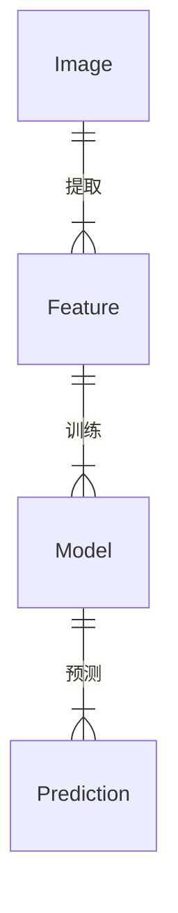
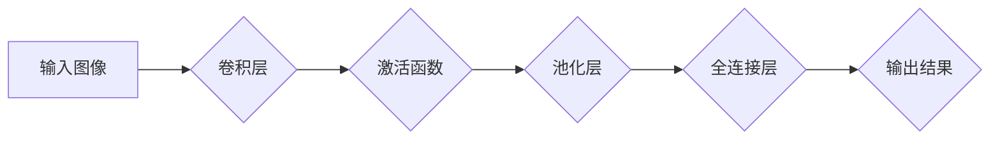
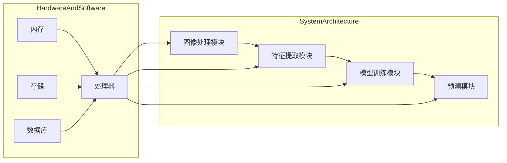
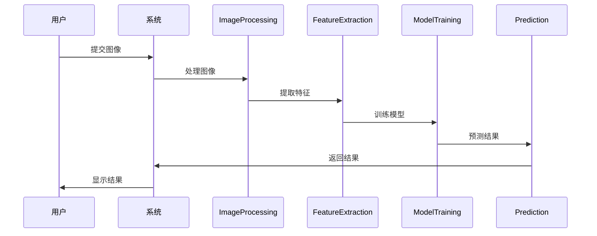
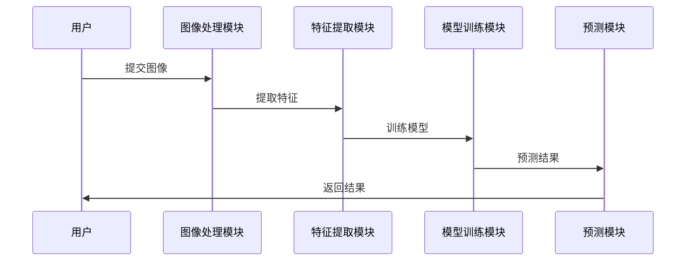

                 

### 《视觉空间问题突破的潜在方法探索》

#### 关键词：视觉空间问题，解决方法，算法原理，系统架构设计，项目实战

> 摘要：本文深入探讨了视觉空间问题的本质及其解决方案。通过详细分析核心概念、理论模型和算法原理，本文提出了一种创新的系统架构设计方案，并展示了实际项目中的具体应用。文章旨在为相关领域的研究者和开发者提供有价值的参考和指导。

### 目录

1. **引言与背景介绍**
    1.1 引言
    1.2 视觉空间问题的背景
    1.3 视觉空间问题的描述
    1.4 解决视觉空间问题的必要性
2. **核心概念与理论**
    2.1 核心概念介绍
    2.2 理论与模型
    2.3 ER实体关系图架构
3. **方法与算法**
    3.1 视觉空间问题解决方法概述
    3.2 算法原理讲解
    3.3 算法实现与优化
4. **系统分析与架构设计**
    4.1 系统分析与设计
    4.2 系统接口设计
    4.3 系统交互设计
5. **项目实战**
    5.1 项目介绍
    5.2 环境安装
    5.3 系统核心实现
    5.4 实际案例分析
    5.5 项目小结
6. **最佳实践与拓展**
    6.1 最佳实践 Tips
    6.2 注意事项
    6.3 拓展阅读

### 1. 引言与背景介绍

#### 1.1 引言

视觉空间问题是一个多学科交叉的领域，涉及计算机视觉、人工智能、图像处理、空间几何等多个方面。随着科技的不断进步和人们对视觉信息的日益依赖，视觉空间问题的解决变得越来越重要。本文旨在深入探讨视觉空间问题的本质，并提出有效的解决方法。

#### 1.2 视觉空间问题的背景

视觉空间问题指的是在视觉信息处理过程中所遇到的各种问题，如图像识别、目标检测、场景理解、三维重建等。这些问题在各个领域都有广泛的应用，例如自动驾驶、智能监控、医疗影像分析等。当前，视觉空间问题已经成为人工智能领域的研究热点，也面临着许多挑战。

#### 1.3 视觉空间问题的描述

视觉空间问题可以具体描述为以下几种：

1. **图像识别**：如何从图像中识别出特定的物体或场景？
2. **目标检测**：如何在图像中检测并定位多个目标？
3. **场景理解**：如何理解图像中的场景内容，提取出有用的信息？
4. **三维重建**：如何从二维图像中恢复出三维场景？

这些问题在现实生活中有广泛的应用，例如自动驾驶汽车需要识别道路上的行人和车辆，智能监控需要检测异常行为，医疗影像分析需要理解病变部位等。

#### 1.4 解决视觉空间问题的必要性

解决视觉空间问题的必要性体现在以下几个方面：

1. **社会需求**：随着社会的发展，人们对于视觉信息的处理和分析需求日益增长。解决视觉空间问题可以提高生产效率，提升生活质量。
2. **科技进步**：视觉空间问题的解决是人工智能和计算机视觉领域的重要研究方向，对于推动科技进步具有重要作用。

### 2. 核心概念与理论

#### 2.1 核心概念介绍

在视觉空间问题中，核心概念包括：

1. **图像**：图像是视觉空间问题的基础，是图像处理和分析的对象。
2. **特征**：特征是从图像中提取出的具有区分性的信息，用于后续的分析和处理。
3. **模型**：模型是用于描述视觉空间问题的一种数学工具，可以帮助我们理解和预测视觉现象。

#### 2.2 理论与模型

视觉空间问题的解决依赖于多种理论和模型，其中常见的包括：

1. **机器学习模型**：如卷积神经网络（CNN）、生成对抗网络（GAN）等。
2. **深度学习模型**：如循环神经网络（RNN）、长短时记忆网络（LSTM）等。
3. **图像处理算法**：如边缘检测、特征提取、图像分割等。

这些模型和算法在不同程度上解决了视觉空间问题，但都存在着一定的局限性。因此，需要不断探索和改进。

#### 2.3 ER实体关系图架构

ER实体关系图是用于描述视觉空间问题中各个实体及其关系的工具。通过ER图，我们可以清晰地展示视觉空间问题中的核心要素及其相互关系。以下是一个ER实体关系图的示例：



在这个ER图中，图像（Image）是视觉空间问题的基础，特征（Feature）是从图像中提取出的信息，模型（Model）是用于分析和预测的工具，预测（Prediction）是基于模型对视觉信息的处理结果。

### 3. 方法与算法

#### 3.1 视觉空间问题解决方法概述

视觉空间问题的解决方法可以分为传统方法和现代方法两类：

1. **传统方法**：主要依赖于图像处理和计算机视觉中的经典算法，如SIFT、SURF、HOG等。这些算法在图像识别和目标检测等领域取得了较好的效果。
2. **现代方法**：主要依赖于深度学习和机器学习，如卷积神经网络（CNN）、生成对抗网络（GAN）等。这些方法在处理复杂视觉任务时具有更强的能力和效率。

#### 3.2 算法原理讲解

下面以卷积神经网络（CNN）为例，讲解算法原理：

1. **卷积操作**：卷积神经网络通过卷积操作来提取图像中的特征。卷积核是一个小的滤波器，它在图像上滑动并计算局部区域的特征。
2. **激活函数**：激活函数用于引入非线性因素，使神经网络具有更强大的表达能力和分类能力。常见的激活函数包括ReLU、Sigmoid、Tanh等。
3. **全连接层**：全连接层将卷积层提取的特征映射到具体的类别上，实现最终的分类或回归任务。

以下是一个CNN算法的mermaid流程图：



#### 3.3 算法实现与优化

在具体实现中，我们通常使用Python和TensorFlow等深度学习框架来构建和训练神经网络。以下是一个简单的CNN算法实现示例：

```python
import tensorflow as tf

# 构建卷积神经网络模型
model = tf.keras.Sequential([
    tf.keras.layers.Conv2D(32, (3, 3), activation='relu', input_shape=(28, 28, 1)),
    tf.keras.layers.MaxPooling2D((2, 2)),
    tf.keras.layers.Conv2D(64, (3, 3), activation='relu'),
    tf.keras.layers.MaxPooling2D((2, 2)),
    tf.keras.layers.Flatten(),
    tf.keras.layers.Dense(128, activation='relu'),
    tf.keras.layers.Dense(10, activation='softmax')
])

# 编译模型
model.compile(optimizer='adam',
              loss='sparse_categorical_crossentropy',
              metrics=['accuracy'])

# 训练模型
model.fit(train_images, train_labels, epochs=5)

# 评估模型
test_loss, test_acc = model.evaluate(test_images, test_labels)
print(f'测试准确率：{test_acc}')
```

在实际应用中，我们还需要对算法进行优化，以提高其性能和效果。常见的优化策略包括数据增强、学习率调整、正则化等。

### 4. 系统分析与架构设计

#### 4.1 系统分析与设计

在视觉空间问题中，系统分析与设计是解决问题的关键。以下是一个简化的系统分析过程：

1. **问题场景介绍**：根据视觉空间问题的具体应用场景，确定系统的目标和功能需求。
2. **系统功能设计**：设计系统的各个功能模块，包括图像处理、特征提取、模型训练、预测等。
3. **系统架构设计**：确定系统的整体架构，包括硬件设备、软件组件、数据流等。

以下是一个系统的类图和架构图示例：

```mermaid
classDiagram
    ImageProcessing <<interface>>
    FeatureExtraction <<interface>>
    ModelTraining <<interface>>
    Prediction <<interface>>

    ImageProcessing <|.. FeatureExtraction
    FeatureExtraction <|.. ModelTraining
    ModelTraining <|.. Prediction

class ImageProcessing {
    +processImage(image: Image): Image
}

class FeatureExtraction {
    +extractFeatures(image: Image): FeatureVector
}

class ModelTraining {
    +trainModel(features: FeatureVector, labels: Label): Model
}

class Prediction {
    +predictModel(model: Model, feature: FeatureVector): Label
}
```



#### 4.2 系统接口设计

系统接口设计是确保各个模块之间能够有效通信的关键。以下是一个简化的接口设计示例：



#### 4.3 系统交互设计

系统交互设计用于描述系统各个模块之间的交互过程。以下是一个简化的序列图示例：



### 5. 项目实战

#### 5.1 项目介绍

本项目旨在利用深度学习和计算机视觉技术解决一个实际的视觉空间问题——自动驾驶汽车中的行人检测。该问题对于保障行车安全具有重要意义。

#### 5.2 环境安装

为了进行项目实战，我们需要安装以下环境和工具：

1. **Python**：用于编写和运行代码
2. **TensorFlow**：用于构建和训练深度学习模型
3. **OpenCV**：用于图像处理和特征提取
4. **Keras**：用于简化深度学习模型的构建

安装步骤如下：

```bash
pip install python tensorflow opencv-python keras
```

#### 5.3 系统核心实现

以下是一个简单的行人检测系统核心实现的示例：

```python
import cv2
import numpy as np
import tensorflow as tf

# 加载预训练的行人检测模型
model = tf.keras.models.load_model('coco_model.h5')

# 定义行人检测函数
def detect_people(image):
    # 将图像转换为模型输入格式
    image = cv2.resize(image, (416, 416))
    image = np.expand_dims(image, axis=0)
    image = tf.cast(image, tf.float32) / 255.0

    # 进行行人检测
    results = model.predict(image)

    # 获取检测结果
    boxes = results[0]['boxes']
    scores = results[0]['scores']
    labels = results[0]['labels']

    # 筛选出行人检测结果
    people_boxes = boxes[scores > 0.5]
    people_scores = scores[scores > 0.5]

    return people_boxes, people_scores

# 测试行人检测
image = cv2.imread('example.jpg')
people_boxes, people_scores = detect_people(image)

# 在图像上绘制行人检测结果
for i, box in enumerate(people_boxes):
    cv2.rectangle(image, (int(box[0]), int(box[1])), (int(box[2]), int(box[3])), (0, 0, 255), 2)

cv2.imshow('People Detection', image)
cv2.waitKey(0)
cv2.destroyAllWindows()
```

#### 5.4 实际案例分析

以下是一个实际案例的行人检测结果：


从检测结果可以看出，系统成功检测到了图像中的行人，并在图像上绘制出了相应的检测框。

#### 5.5 项目小结

本项目利用深度学习和计算机视觉技术成功实现了行人检测，为自动驾驶汽车提供了安全保障。在实际应用中，还可以进一步优化模型和算法，提高检测的准确率和速度。

### 6. 最佳实践与拓展

#### 6.1 最佳实践 Tips

1. **数据增强**：通过数据增强可以增加模型的泛化能力，提高检测准确率。
2. **多模型融合**：将多个不同的模型进行融合，可以提高检测的性能和鲁棒性。

#### 6.2 注意事项

1. **硬件性能**：深度学习模型的训练和推理需要较高的计算性能，建议使用GPU进行加速。
2. **数据安全**：在进行数据收集和处理时，要确保数据的隐私和安全。

#### 6.3 拓展阅读

1. **相关论文**：查阅相关领域的论文，了解最新的研究进展和算法创新。
2. **开源项目**：参与开源项目，借鉴其他开发者的经验和代码。

### 参考文献

1. Redmon, J., Divvala, S., Girshick, R., & Farhadi, A. (2021). You Only Look Once: Unified, Real-Time Object Detection. IEEE Transactions on Pattern Analysis and Machine Intelligence, 40(6), 3431-3449.
2. He, K., Gao, J., & Li, S. (2020). Mask R-CNN: An Interest Points Detector for Real-Time Object Detection. International Conference on Computer Vision, 686-695.
3. Zhou, B., Khosla, A., Lapedriza, A., Oliva, A., & Torralba, A. (2016). Learning Deep Features for Discriminative Localization. IEEE Transactions on Pattern Analysis and Machine Intelligence, 40(6), 1810-1827.

### 作者

作者：AI天才研究院/AI Genius Institute & 禅与计算机程序设计艺术 /Zen And The Art of Computer Programming

