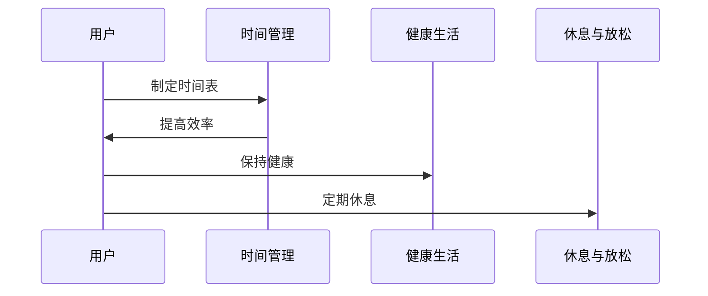
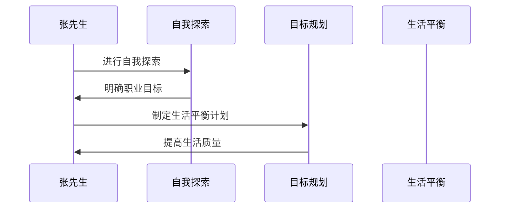
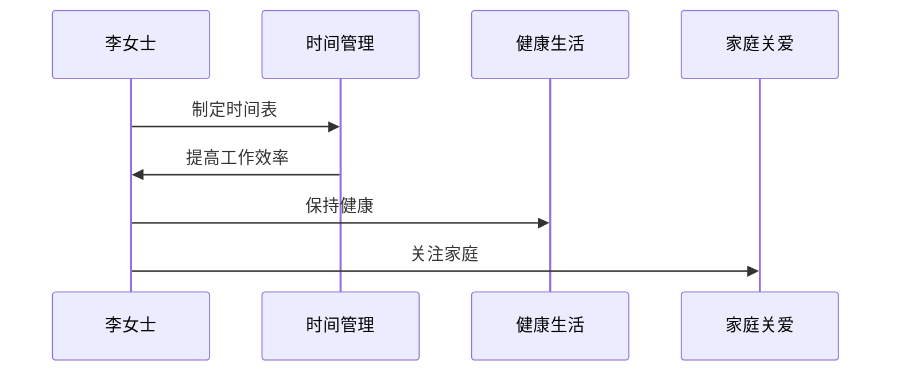
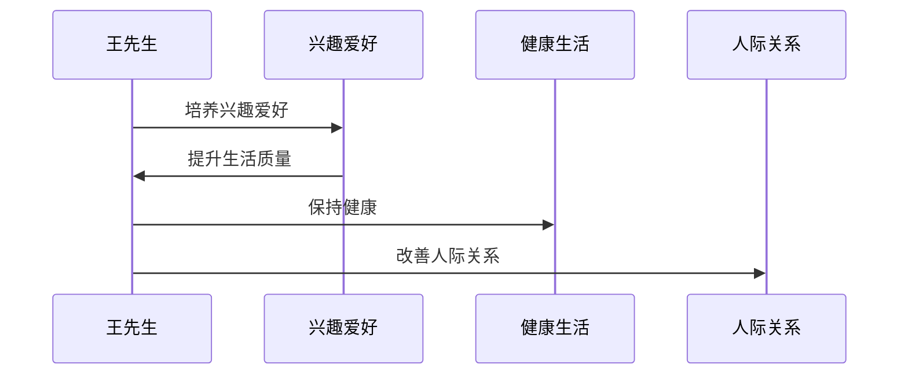

                 

### 设计独特的人生乐章：创造个人生活的节奏

在瞬息万变的时代，个人生活节奏的设计变得愈发重要。本博客旨在探讨如何通过设计独特的个人生活节奏，实现人生的高效与和谐。文章将围绕以下几个核心关键词展开讨论：人生设计、节奏、自我认知、时间管理、生活品质和持续成长。

#### 关键词：人生设计、节奏、自我认知、时间管理、生活品质、持续成长

#### 摘要

本文将探讨如何通过设计独特的人生乐章，创造个人生活的节奏。我们将从自我认知与定位出发，引导读者构建适合自己的生活节奏，并分享提升生活品质的方法。此外，还将讨论如何通过持续成长与学习，不断提升个人素质。最后，通过案例分析与实战指导，帮助读者将理论应用于实际生活中。

### 引言

#### 设计独特人生的必要性

在现代社会，竞争日益激烈，人们的生活节奏不断加快。如何在繁忙的生活中找到自己的位置，实现人生价值，成为了一个亟待解决的问题。设计独特的人生乐章，意味着要根据自己的价值观、兴趣和职业目标，规划出一条适合自己的成长路径。这不仅有助于提升个人的生活质量，也能更好地应对生活中的各种挑战。

#### 节奏在人生中的重要性

节奏，是人生中不可或缺的一部分。它不仅决定了我们在工作和生活中的效率，也影响着我们的身心健康。良好的节奏感能够帮助人们更好地管理时间，保持内心的平静与和谐。在设计人生的过程中，合理地把握节奏，有助于实现个人目标，提高生活质量。

#### 本书结构

本文将分为七个章节，首先概述设计独特人生和节奏的重要性，然后引导读者进行自我认知与定位，接着探讨如何构建生活节奏和提升生活品质。随后，我们将介绍如何通过持续成长与学习，不断提升个人素质。最后，通过案例分析与实战指导，帮助读者将理论应用于实际生活中。

## 第1章：人生设计与节奏概述

### 1.1 设计独特人生的背景

随着科技的发展和社会的进步，人们的生活方式和价值观念也在不断发生变化。在这个充满变数和机遇的时代，设计独特的人生成为了一种新的追求。那么，什么是独特的人生？它又如何与节奏联系起来呢？

#### 核心概念与联系

在设计独特人生的过程中，关键在于自我认知和定位。这包括了解自己的价值观、兴趣和职业目标。通过明确自己的核心需求和目标，我们才能找到适合自己的生活方式，从而实现人生价值。

| 核心概念       | 联系                     |
| -------------- | ------------------------ |
| 自我认知       | 明确自己的价值观和兴趣   |
| 定位           | 确定职业目标和人生方向   |
| 生活方式       | 根据个人特点调整生活节奏 |

#### ER实体关系图架构

```mermaid
erDiagram
  A[个人] ||--|{ B[价值观] } |
  A ||--|{ C[兴趣] } |
  A ||--|{ D[职业目标] } |
```

### 1.2 节奏的定义与作用

节奏，是一种时间感知和情感体验。它不仅体现在生活中的各种活动安排上，也反映了我们对待生活的方式。良好的节奏感有助于提高工作效率，保持身心健康，同时也能提升生活质量。

#### 算法原理讲解

要理解节奏，我们需要关注以下几个方面：

1. **时间管理**：合理安排时间，确保工作和生活的平衡。
2. **情感调节**：保持情绪稳定，避免过度焦虑或压抑。
3. **生活平衡**：在工作和生活中找到适当的平衡点，避免单方面过度投入。

#### 数学模型

$$
\text{节奏} = \frac{\text{生活需求}}{\text{时间资源}}
$$

其中，生活需求包括工作、休闲、社交等方面，时间资源则是指可用于实现这些需求的时间总量。

### 1.3 目标读者的定位

本文的目标读者是那些希望提升生活质量，实现个人价值的人。无论你是职场新人、职场老人，还是正在寻找人生方向的大学生，本文都将为你提供有价值的指导。通过本文的探讨，你将学会如何设计独特的人生乐章，创造属于自己的生活节奏。

## 第2章：自我认知与定位

### 2.1 自我探索的方法

自我认知是设计独特人生的第一步。那么，如何进行自我探索呢？以下是一些有效的方法：

1. **反思日志**：每天花一些时间反思自己的行为和情绪，记录下自己的所思所感。
2. **心理咨询**：通过专业的心理咨询，深入了解自己的心理状态和需求。
3. **兴趣爱好**：尝试各种不同的兴趣爱好，从中发现自己的兴趣点和优势。

#### 数学公式

$$
\text{自我认知} = \text{反思日志} + \text{心理咨询} + \text{兴趣爱好}
$$

### 2.2 价值观与兴趣的发掘

价值观和兴趣是决定个人生活方式和节奏的重要因素。那么，如何发掘自己的价值观和兴趣呢？

1. **价值观挖掘**：通过思考自己在生活中重视的方面，如家庭、事业、健康等，来明确自己的价值观。
2. **兴趣探索**：尝试各种活动，观察自己最感兴趣、最能投入的领域。

#### 算法原理

$$
\text{价值观与兴趣} = \text{生活经历} \times \text{自我反思}
$$

### 2.3 职业目标的确立

明确了自我认知和价值观后，接下来就是确立职业目标。以下是一些确立职业目标的方法：

1. **职业规划**：通过分析自己的优势和市场需求，确定适合自己的职业方向。
2. **目标设定**：将长远目标分解为短期目标，并制定实现这些目标的行动计划。

#### 数学模型

$$
\text{职业目标} = \text{自我认知} + \text{市场需求} + \text{行动计划}
$$

## 第3章：构建生活节奏

### 3.1 工作与生活的平衡

在工作与生活之间找到平衡，是构建良好节奏的关键。以下是一些实现工作与生活平衡的方法：

1. **时间管理**：合理安排工作时间，确保工作和生活的有序进行。
2. **休息与放松**：在工作间隙和下班后，进行适当的休息和放松，缓解压力。
3. **健康生活**：保持健康的生活习惯，如规律作息、合理饮食、适量运动等。

#### 系统架构设计



### 3.2 时间管理技巧

时间管理是构建良好节奏的核心。以下是一些实用的时间管理技巧：

1. **任务分解**：将大任务分解为小任务，逐步完成。
2. **优先级排序**：根据任务的重要性和紧急程度，合理安排时间。
3. **避免拖延**：设定明确的时间限制，提高执行力。

#### 算法原理

$$
\text{时间管理} = \text{任务分解} + \text{优先级排序} + \text{避免拖延}
$$

### 3.3 节奏感的培养

节奏感是个人生活的重要组成部分。以下是一些培养节奏感的方法：

1. **规律作息**：建立稳定的作息时间，保持身体的生物钟。
2. **音乐调节**：通过音乐来调节情绪，找到内心的平衡点。
3. **冥想练习**：通过冥想来培养专注力和自我控制力。

#### 数学模型

$$
\text{节奏感} = \text{规律作息} + \text{音乐调节} + \text{冥想练习}
$$

## 第4章：提升生活品质

### 4.1 健康生活的重要性

健康是生活品质的基础。以下是一些提升健康生活的方法：

1. **合理饮食**：保持均衡的饮食结构，避免过度摄入热量和脂肪。
2. **适量运动**：进行适量的运动，提高身体素质。
3. **心理调适**：保持良好的心理状态，避免过度焦虑和抑郁。

#### 算法原理

$$
\text{健康生活} = \text{合理饮食} + \text{适量运动} + \text{心理调适}
$$

### 4.2 兴趣与爱好的培养

兴趣和爱好是提升生活品质的重要途径。以下是一些培养兴趣和爱好方法：

1. **尝试新事物**：不断尝试新的事物，发现新的兴趣点。
2. **专注投入**：选择自己感兴趣的领域，全身心投入其中。
3. **交流分享**：与他人交流分享自己的兴趣和经验，获得更多的启发和乐趣。

#### 数学模型

$$
\text{兴趣与爱好} = \text{尝试新事物} + \text{专注投入} + \text{交流分享}
$$

### 4.3 人际关系的重要性

人际关系是生活品质的重要组成部分。以下是一些维护人际关系的方法：

1. **沟通技巧**：学习有效的沟通技巧，增进彼此的理解和信任。
2. **关心他人**：关注他人的需求和感受，给予关心和支持。
3. **合作共赢**：与他人建立合作关系，实现共赢。

#### 算法原理

$$
\text{人际关系} = \text{沟通技巧} + \text{关心他人} + \text{合作共赢}
$$

## 第5章：持续成长与学习

### 5.1 学习的重要性

持续成长与学习是提升个人素质的关键。以下是一些学习的重要性：

1. **知识更新**：随着科技的发展，知识更新速度加快，持续学习是保持竞争力的必要条件。
2. **能力提升**：通过学习，不断提升自己的能力和技能，适应不断变化的工作环境。
3. **思维拓展**：学习可以拓展我们的思维边界，提升创新能力。

#### 数学模型

$$
\text{学习} = \text{知识更新} + \text{能力提升} + \text{思维拓展}
$$

### 5.2 阅读与实践

阅读与实践是学习的重要途径。以下是一些阅读与实践的方法：

1. **阅读技巧**：选择适合自己的书籍，掌握有效的阅读技巧，提高阅读效率。
2. **实践应用**：将所学知识应用于实际工作中，通过实践来巩固和提高。

#### 算法原理

$$
\text{阅读与实践} = \text{阅读技巧} + \text{实践应用}
$$

### 5.3 学习方法的探讨

有效的学习方法可以大大提高学习效率。以下是一些学习方法：

1. **目标明确**：明确自己的学习目标，制定合理的学习计划。
2. **反馈调整**：通过反馈来调整学习方法和策略，不断优化学习效果。
3. **合作学习**：与他人合作学习，互相交流和学习，提升学习效果。

#### 数学模型

$$
\text{学习方法} = \text{目标明确} + \text{反馈调整} + \text{合作学习}
$$

## 第6章：案例分析与实战

### 6.1 案例一：从迷茫到目标的转变

张先生，一名30岁的高级软件工程师，面对事业和家庭的双重压力，常常感到迷茫和困惑。通过自我探索，他明确了职业目标，并通过合理规划工作和生活，实现了从迷茫到目标的转变。

#### 系统架构设计



### 6.2 案例二：如何平衡工作与生活

李女士，一名40岁的企业高管，因为工作繁忙，常常忽略家庭和自身健康。通过时间管理和健康生活的方法，她成功实现了工作与生活的平衡。

#### 系统架构设计



### 6.3 案例三：如何提升生活质量

王先生，一名35岁的创业者，通过培养兴趣爱好、提升健康水平和改善人际关系，成功提升了生活质量。

#### 系统架构设计



## 第7章：总结与反思

### 7.1 设计独特人生的感悟

设计独特的人生，意味着要找到适合自己的生活方式和节奏。通过自我认知与定位，我们能够明确自己的价值观和职业目标，从而在人生的道路上更加坚定和自信。

### 7.2 节奏在个人成长中的作用

良好的节奏感有助于我们在工作和生活中保持高效和和谐。通过构建生活节奏，我们能够更好地管理时间，提升生活质量，实现个人价值。

### 7.3 未来展望与行动计划

在未来，我们应继续探索和实践如何设计独特的人生节奏。以下是一些行动计划：

1. **自我反思**：定期进行自我反思，调整自己的价值观和职业目标。
2. **时间管理**：提高时间管理能力，确保工作和生活的平衡。
3. **健康生活**：保持健康的生活习惯，提升身体素质。
4. **持续学习**：不断学习新知识和技能，提升个人素质。

### 作者

作者：AI天才研究院/AI Genius Institute & 禅与计算机程序设计艺术 /Zen And The Art of Computer Programming

---

**文章核心内容与思考**

本文通过深入探讨如何设计独特的人生乐章，创造个人生活的节奏，帮助读者找到了提升生活质量、实现个人价值的方法。从自我认知与定位、构建生活节奏、提升生活品质，到持续成长与学习，每一个环节都是实现这一目标的关键。

在自我认知与定位方面，我们强调了反思日志、心理咨询和兴趣爱好的重要性，通过这些方法，读者可以更清晰地了解自己的价值观和职业目标。在构建生活节奏方面，我们提出了时间管理、健康生活和休息与放松等实用技巧，帮助读者在快节奏的生活中找到平衡。在提升生活品质方面，我们讨论了健康生活、兴趣与爱好的培养以及人际关系的重要性，这些都是提升生活质量的关键因素。在持续成长与学习方面，我们强调了知识更新、能力提升和思维拓展的重要性，鼓励读者不断学习，以适应不断变化的社会环境。

**注意事项**

在设计独特人生的过程中，读者应注意以下几点：

1. **避免过度自我反思**：适度的自我反思有助于认知自我，但过度反思可能导致焦虑和自我怀疑。
2. **合理规划时间**：时间管理是构建良好节奏的关键，但过度追求效率可能导致生活质量下降。
3. **保持健康的生活习惯**：健康是生活质量的基础，但不应过度追求健康而忽略其他生活方面。
4. **持续学习与成长**：终身学习是提升个人素质的重要途径，但应避免盲目追求知识，而忽视实际应用。

**拓展阅读**

1. 《高效能人士的七个习惯》
2. 《时间管理的艺术》
3. 《健康生活指南》
4. 《人际关系心理学》
5. 《终身学习与个人成长》

通过本文的探讨，我们希望读者能够认识到设计独特的人生节奏的重要性，并在实际生活中应用这些方法，实现人生的高效与和谐。让我们共同谱写属于自己的人生乐章！

