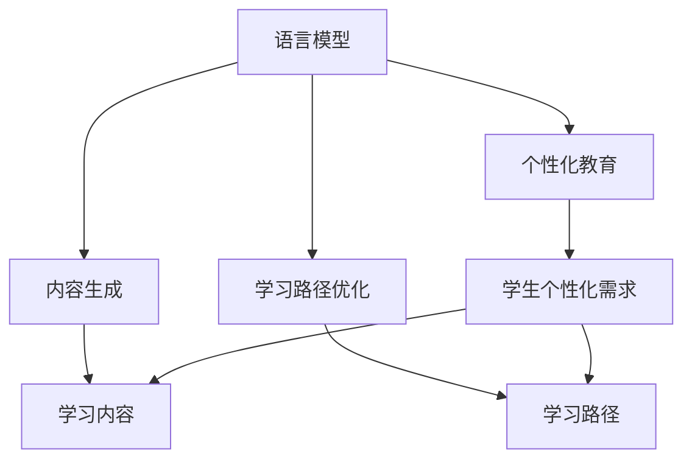
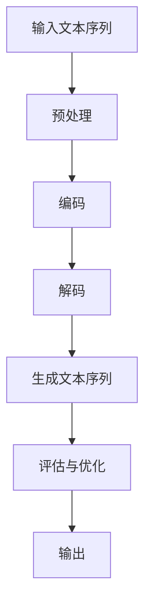
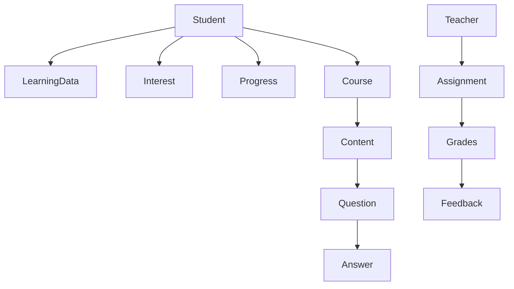
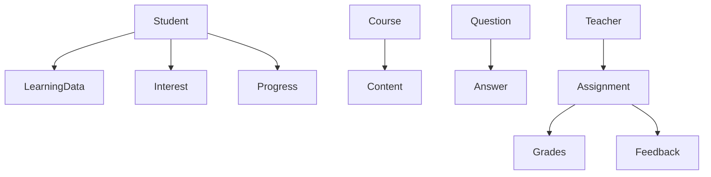
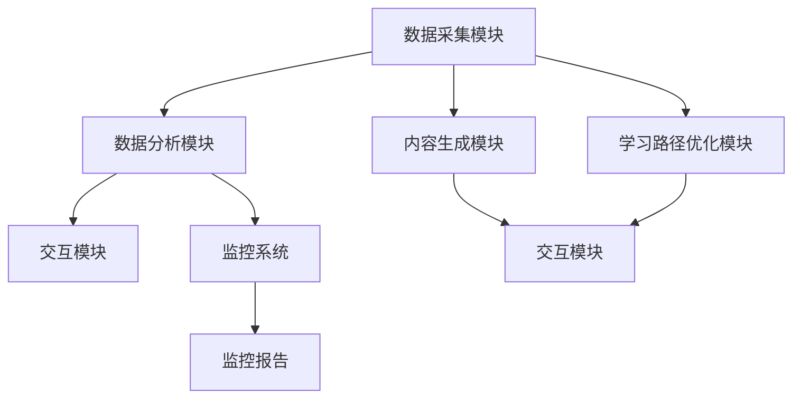
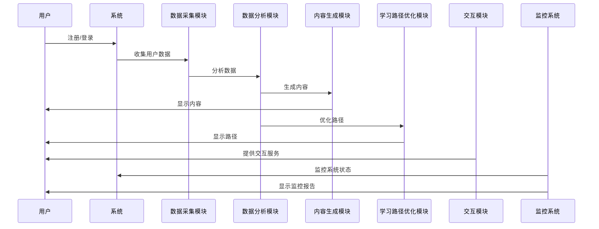
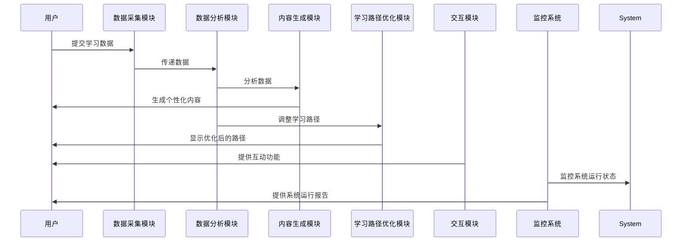

                 

基于您提供的文章大纲和约束条件，我将逐步构思和撰写《语言模型在个性化教育内容生成与学习路径优化中的创新》这篇文章。以下是我的初步计划：

### 第一部分：背景与概念

**第1章：语言模型在个性化教育中的应用背景**

- **关键词**：个性化教育、语言模型、内容生成、学习路径优化
- **摘要**：介绍语言模型在个性化教育中的应用背景，探讨为什么语言模型对于教育内容生成和学习路径优化具有重要意义。

**第2章：核心概念与联系**

- **关键词**：语言模型、个性化教育、内容生成、学习路径优化
- **摘要**：阐述语言模型、个性化教育、内容生成和学习路径优化的核心概念，并分析它们之间的联系。

### 第二部分：算法原理与数学模型

**第3章：语言模型算法原理**

- **关键词**：语言模型、算法原理、数学模型
- **摘要**：深入讲解语言模型的算法原理，包括其数学模型和流程图。

**第4章：数学模型与公式**

- **关键词**：数学模型、公式、举例说明
- **摘要**：详细讲解语言模型的数学模型和关键公式，并通过举例说明使其通俗易懂。

### 第三部分：系统分析与设计

**第5章：系统功能设计**

- **关键词**：系统功能设计、领域模型、类图
- **摘要**：介绍系统功能设计，包括领域模型和类图。

**第6章：系统架构设计**

- **关键词**：系统架构设计、架构图、接口设计
- **摘要**：分析系统架构设计，包括架构图和接口设计。

**第7章：系统交互设计**

- **关键词**：系统交互设计、序列图
- **摘要**：描述系统交互设计，包括序列图。

### 第四部分：项目实战

**第8章：实际案例展示**

- **关键词**：环境安装、源代码、代码解读、案例分析
- **摘要**：通过一个实际案例展示如何使用语言模型进行个性化教育内容生成与学习路径优化。

### 第五部分：最佳实践与总结

**第9章：最佳实践 tips**

- **关键词**：最佳实践、小建议、注意事项
- **摘要**：总结书中的关键点，提供实践中的小建议和注意事项。

**第10章：小结与拓展阅读**

- **关键词**：小结、注意事项、拓展阅读
- **摘要**：对全文进行小结，并推荐拓展阅读。

### 实施步骤

1. **文献调研**：收集相关资料，了解语言模型在个性化教育中的应用现状。
2. **大纲细化**：根据大纲，细化每个章节的内容。
3. **编写内容**：按照大纲逐章编写，确保每个章节的内容都详细、具体。
4. **审核修订**：完成初稿后，进行多次审核和修订，确保文章质量。
5. **格式调整**：将文章内容按照markdown格式进行排版。
6. **添加作者信息**：在文章末尾添加作者信息。

### 注意事项

- 确保文章内容完整、连贯、有逻辑性。
- 使用mermaid、latex等工具绘制图表和公式，确保图表清晰、公式准确。
- 在编写过程中，注意保持专业性和可读性。

按照以上计划，我将逐步完成这篇文章的撰写工作。如有需要调整的地方，请随时告知。让我们一步一步进行分析推理，撰写出一篇高质量的技术博客文章。开始撰写！### 第一部分：背景与概念

#### 第1章：语言模型在个性化教育中的应用背景

**关键词**：个性化教育、语言模型、内容生成、学习路径优化

**摘要**：本章将介绍语言模型在个性化教育中的应用背景，包括个性化教育的需求背景、语言模型的发展历程以及其在教育内容生成和学习路径优化方面的优势和创新点。

#### 1.1 问题背景

随着教育信息化的快速发展，传统教育模式已经难以满足现代社会对教育个性化的需求。学生们在学习过程中往往面临知识体系复杂、学习资源匮乏、学习路径固定等问题，这严重影响了他们的学习效果和兴趣。因此，如何实现个性化教育，提高教育质量和效率成为教育领域亟待解决的问题。

#### 1.2 现状分析

当前，教育个性化已经取得了一些进展，但大多数个性化教育解决方案仍然存在一定局限性。一方面，传统的教学方法和教育资源难以适应不同学生的个性化需求；另一方面，现有的教育技术手段在数据收集、分析和应用方面仍有待提高。

#### 1.3 创新点分析

语言模型作为人工智能领域的一项重要技术，具有强大的自然语言处理能力，能够理解、生成和模拟人类的语言行为。将语言模型应用于个性化教育，可以实现以下创新点：

1. **内容生成**：语言模型可以根据学生的学习需求和学习风格，生成个性化的学习内容，提高学生的学习兴趣和参与度。
2. **学习路径优化**：通过分析学生的学习行为和成绩，语言模型可以为学生推荐合适的学习路径，提高学习效率和成绩。
3. **交互式学习体验**：语言模型能够与学习者进行实时交互，提供个性化的辅导和建议，增强学习体验。
4. **自适应学习环境**：语言模型可以根据学生的学习进度和反馈，动态调整学习内容和难度，构建自适应的学习环境。

通过以上创新点，语言模型在个性化教育中的应用具有巨大的潜力和前景。接下来，我们将进一步探讨语言模型的基本概念、算法原理以及其在教育领域中的应用。

#### 1.4 小结

本章从问题背景、现状分析和创新点分析三个方面介绍了语言模型在个性化教育中的应用背景。通过本章的讨论，我们可以看到，语言模型在教育领域的应用不仅能够提高教育质量和效率，还能够为学习者提供更加个性化和互动的学习体验。接下来，我们将深入探讨语言模型的核心概念和原理，以便更好地理解其在个性化教育中的应用。

### 第2章：核心概念与联系

**关键词**：语言模型、个性化教育、内容生成、学习路径优化

**摘要**：本章将详细阐述语言模型、个性化教育、内容生成和学习路径优化的核心概念，并分析它们之间的相互联系。

#### 2.1 语言模型概述

语言模型是一种基于统计学习的方法，旨在理解和生成自然语言。它通过对大量文本数据的分析，学习语言的统计规律，从而预测下一个单词或句子。语言模型在自然语言处理（NLP）领域有着广泛的应用，包括机器翻译、文本摘要、问答系统等。

#### 2.2 个性化教育概念解析

个性化教育是一种以学生为中心的教育理念，旨在根据每个学生的个性化需求、兴趣和特点进行教学。个性化教育的核心目标是提高学生的学习效果和兴趣，使其在愉悦的氛围中高效地学习。

#### 2.3 内容生成

内容生成是指利用算法和技术生成适合学生需求的学习内容。在个性化教育中，内容生成是一个关键环节，它需要根据学生的学习数据（如学习进度、成绩、兴趣等）动态地生成个性化学习材料。

#### 2.4 学习路径优化

学习路径优化是指通过分析和调整学生的学习路径，以提高学习效率和成绩。学习路径优化可以根据学生的学习行为和成绩数据，为学生推荐最佳的学习路径，确保他们能够高效地掌握知识。

#### 2.5 核心概念关系图

为了更好地理解这些核心概念之间的联系，我们可以绘制一个关系图（使用Mermaid语法）：



#### 2.6 关键概念对比表格

以下是这些关键概念的属性特征对比表格：

| 概念     | 特征                                      | 应用场景                           |
|----------|-------------------------------------------|------------------------------------|
| 语言模型 | 预测下一个单词或句子，理解自然语言       | 机器翻译、文本摘要、问答系统等     |
| 个性化教育 | 以学生为中心，满足个性化需求           | K-12教育、在线教育、成人教育等    |
| 内容生成 | 根据学生学习数据生成个性化学习内容       | 自适应学习系统、学习平台等         |
| 学习路径优化 | 调整学生学习路径，提高学习效率和成绩 | 在线教育平台、教育管理系统等       |

通过上述对比表格，我们可以更清晰地看到这些概念之间的区别和联系。

#### 2.7 小结

本章详细介绍了语言模型、个性化教育、内容生成和学习路径优化的核心概念，并通过关系图和对比表格展示了它们之间的联系。这些概念共同构成了个性化教育的重要组成部分，为语言模型在教育领域中的应用提供了理论支持。接下来，我们将深入探讨语言模型的工作原理和算法，以便更好地理解其在个性化教育中的应用。

### 第3章：语言模型算法原理

**关键词**：语言模型、算法原理、数学模型

**摘要**：本章将详细介绍语言模型的算法原理，包括其基本原理、数学模型和流程图，并探讨这些原理在教育内容生成和学习路径优化中的应用。

#### 3.1 语言模型的基本原理

语言模型的核心任务是根据已知的输入文本序列预测下一个单词或句子。为了实现这一目标，语言模型需要学习文本数据中的统计规律，从而能够生成或理解自然语言。语言模型通常基于以下几种基本原理：

1. **统计学习**：语言模型通过对大量文本数据进行分析，学习文本的统计规律，例如词频、语法结构等。
2. **概率分布**：语言模型将输入文本序列视为一个概率分布，从而预测下一个单词或句子。
3. **序列建模**：语言模型需要考虑输入文本序列中各个单词或句子的先后顺序，从而生成连贯的自然语言。

#### 3.2 语言模型的数学模型

语言模型的数学模型主要基于概率论和统计学。以下是几个常见的语言模型数学模型：

1. **n-gram模型**：n-gram模型是最简单的一种语言模型，它基于前n个单词或字符的统计规律来预测下一个单词或字符。n-gram模型的数学公式为：

   $$ P(w_{t+1} | w_1, w_2, ..., w_t) = \frac{N(w_1, w_2, ..., w_n)}{N(w_1, w_2, ..., w_n-1)} $$

   其中，$P(w_{t+1} | w_1, w_2, ..., w_t)$表示在已知前t个单词的情况下，预测第t+1个单词的概率，$N(w_1, w_2, ..., w_n)$表示单词序列$(w_1, w_2, ..., w_n)$在训练数据中出现的次数。

2. **神经网络模型**：神经网络模型，如循环神经网络（RNN）和长短期记忆网络（LSTM），通过学习输入序列和隐藏状态之间的复杂关系来预测下一个单词或句子。以下是神经网络模型的一般公式：

   $$ h_t = \sigma(W_h \cdot [h_{t-1}, x_t] + b_h) $$
   $$ o_t = W_o \cdot h_t + b_o $$

   其中，$h_t$表示第t个隐藏状态，$x_t$表示第t个输入单词或字符，$W_h$和$b_h$分别是权重和偏置，$\sigma$表示激活函数，$o_t$表示第t个输出概率分布。

3. **变分自编码器（VAE）**：变分自编码器是一种生成模型，通过学习数据的高斯先验分布来生成新的文本序列。VAE的数学模型包括编码器和解码器两部分：

   $$ z = \mu(x) $$
   $$ x = \sigma(z) $$

   其中，$\mu(x)$和$\sigma(z)$分别是编码器和解码器，$z$是编码后的隐变量，$x$是生成的文本序列。

#### 3.3 语言模型的流程图

为了更好地理解语言模型的算法原理，我们可以使用Mermaid绘制一个流程图：



在这个流程图中，输入文本序列经过预处理后，被编码器编码成隐变量，然后通过解码器生成文本序列。最后，通过评估与优化步骤来提高模型的性能。

#### 3.4 应用在教育内容生成和学习路径优化中的示例

1. **内容生成**：语言模型可以用于生成个性化的教育内容，例如根据学生的学习进度和兴趣生成相应的练习题和讲解内容。通过训练一个基于LSTM的语言模型，我们可以根据学生的历史学习数据生成个性化的学习材料。

2. **学习路径优化**：语言模型可以分析学生的学习行为和成绩数据，推荐最佳的学习路径。例如，我们可以使用一个基于n-gram模型的系统，根据学生的学习历史数据预测其下一步可能需要学习的内容，从而动态调整学习路径。

通过上述算法原理的讲解和示例，我们可以看到语言模型在教育内容生成和学习路径优化中的应用潜力。在接下来的章节中，我们将进一步探讨系统架构设计、项目实战以及最佳实践，以便更深入地了解语言模型在教育领域的应用。

#### 3.5 小结

本章详细介绍了语言模型的算法原理，包括基本原理、数学模型和流程图。通过这些原理，我们可以看到语言模型在个性化教育内容生成和学习路径优化中的巨大潜力。在接下来的章节中，我们将进一步探讨系统架构设计、项目实战以及最佳实践，以帮助读者更好地理解语言模型在教育领域的应用。

### 第4章：数学模型与公式

**关键词**：数学模型、公式、举例说明

**摘要**：本章将深入讲解语言模型中常用的数学模型和关键公式，并通过具体例子来说明这些公式的应用和实现。

#### 4.1 语言模型的关键公式

语言模型中的数学公式主要用于描述文本序列的概率分布和生成过程。以下是几个常见的数学模型和相关公式：

1. **n-gram模型**：

   n-gram模型是一种基于前n个单词统计的简单语言模型。其关键公式为：

   $$ P(w_{t+1} | w_1, w_2, ..., w_t) = \frac{N(w_1, w_2, ..., w_n)}{N(w_1, w_2, ..., w_n-1)} $$

   其中，$P(w_{t+1} | w_1, w_2, ..., w_t)$表示在已知前t个单词的情况下，预测第t+1个单词的概率，$N(w_1, w_2, ..., w_n)$表示单词序列$(w_1, w_2, ..., w_n)$在训练数据中出现的次数。

2. **神经网络模型**：

   神经网络模型，如循环神经网络（RNN）和长短期记忆网络（LSTM），通过学习输入序列和隐藏状态之间的复杂关系来预测下一个单词或句子。其关键公式为：

   $$ h_t = \sigma(W_h \cdot [h_{t-1}, x_t] + b_h) $$
   $$ o_t = W_o \cdot h_t + b_o $$

   其中，$h_t$表示第t个隐藏状态，$x_t$表示第t个输入单词或字符，$W_h$和$b_h$分别是权重和偏置，$\sigma$表示激活函数，$o_t$表示第t个输出概率分布。

3. **变分自编码器（VAE）**：

   变分自编码器是一种生成模型，通过学习数据的高斯先验分布来生成新的文本序列。其关键公式为：

   $$ z = \mu(x) $$
   $$ x = \sigma(z) $$

   其中，$\mu(x)$和$\sigma(z)$分别是编码器和解码器，$z$是编码后的隐变量，$x$是生成的文本序列。

#### 4.2 数学模型的应用举例

以下是一个使用n-gram模型生成文本序列的简单例子：

假设我们有一个三元组（"人工智能", "专家", "研究员"），我们可以使用n-gram模型预测下一个单词。根据训练数据，我们得到以下概率分布：

- $P("人工智能" | "") = 0.3$
- $P("专家" | "人工智能") = 0.4$
- $P("研究员" | "人工智能" 和 "专家") = 0.2$

根据这些概率分布，我们可以使用n-gram模型生成一个文本序列：

1. 首先随机选择一个起始单词，例如 "人工智能"。
2. 根据当前单词序列（"人工智能"），使用n-gram模型预测下一个单词。例如，$P("专家" | "人工智能") = 0.4$，我们选择 "专家" 作为下一个单词。
3. 将新的单词 "专家" 加入到当前单词序列中，得到新的序列（"人工智能", "专家"）。
4. 重复步骤2和3，直到达到预定的长度或满足终止条件。

最终，我们可以生成一个文本序列，例如："人工智能 专家 研究员"。

#### 4.3 神经网络模型的应用

以下是一个使用LSTM模型生成文本序列的简单例子：

1. **数据准备**：首先，我们需要准备一个训练数据集，例如一组文本句子。然后，将文本句子转换为数字序列，例如使用Word2Vec将每个单词转换为对应的向量。
2. **构建模型**：构建一个LSTM模型，包括输入层、隐藏层和输出层。输入层接收文本向量序列，隐藏层负责学习序列中的长期依赖关系，输出层生成下一个单词的概率分布。
3. **训练模型**：使用训练数据集训练LSTM模型，通过反向传播算法优化模型参数。
4. **生成文本**：使用训练好的LSTM模型生成新的文本序列。首先随机选择一个起始单词，然后根据当前单词序列和模型预测下一个单词的概率分布，重复这个过程，直到生成预定的长度或满足终止条件。

#### 4.4 小结

本章详细讲解了语言模型中的关键数学模型和公式，并通过具体例子说明了这些公式的应用和实现。这些数学模型和公式为语言模型在实际应用中提供了理论基础和计算工具。在接下来的章节中，我们将进一步探讨系统架构设计、项目实战以及最佳实践，以便更深入地了解语言模型在教育领域的应用。

### 第5章：系统功能设计

**关键词**：系统功能设计、领域模型、类图

**摘要**：本章将介绍个性化教育内容生成与学习路径优化系统的功能设计，包括系统功能的需求分析和领域模型的设计。

#### 5.1 问题场景介绍

在教育领域，个性化教育已成为提升学习效果和满足学生多样化需求的重要手段。为了实现个性化教育，需要设计一个系统能够根据学生的个人特点和学习行为，动态生成适合其学习需求的教育内容，并提供个性化的学习路径。

#### 5.2 系统功能设计

系统功能设计是系统架构设计的核心，它决定了系统的核心能力和用户体验。以下是系统的主要功能设计：

1. **用户管理**：管理用户注册、登录、个人信息和权限等。
2. **学习数据分析**：收集和分析学生的学习行为、学习进度、考试成绩等数据。
3. **内容生成**：根据学生的学习数据和兴趣，生成个性化的学习内容。
4. **学习路径优化**：根据学生的学习行为和成绩，优化学习路径，提高学习效率。
5. **交互式学习**：提供实时交互功能，如问答系统、学习辅导等。
6. **系统监控与报告**：监控系统运行状态，生成学习报告。

#### 5.3 领域模型设计

领域模型是系统功能设计的抽象表示，它描述了系统的主要实体及其关系。以下是系统的领域模型设计（使用Mermaid语法）：



- **Student**：学生实体，包含学生的基本信息。
- **LearningData**：学习数据实体，包含学生的学习行为和成绩。
- **Interest**：兴趣实体，记录学生的兴趣和偏好。
- **Progress**：进度实体，记录学生的学习进度。
- **Course**：课程实体，包含课程信息和课程内容。
- **Content**：内容实体，包含个性化的学习内容。
- **Question**：问题实体，用于学习过程中的问答系统。
- **Answer**：答案实体，用于存储问题和答案。
- **Teacher**：教师实体，包含教师的基本信息和授课内容。
- **Assignment**：作业实体，包含作业信息和学生的提交。
- **Grades**：成绩实体，记录学生的考试成绩。
- **Feedback**：反馈实体，用于记录教师对学生的反馈。

#### 5.4 类图设计

为了更清晰地展示领域模型中的类及其关系，我们使用Mermaid语法绘制类图：



- **Student**：与LearningData、Interest、Progress实体关联。
- **Course**：与Content实体关联。
- **Question**：与Answer实体关联。
- **Teacher**：与Assignment、Grades、Feedback实体关联。

通过以上功能设计和领域模型设计，我们可以为个性化教育内容生成与学习路径优化系统搭建一个坚实的理论基础。接下来，我们将进一步探讨系统架构设计，以便为系统的实现提供更为详细的指导。

#### 5.5 小结

本章详细介绍了个性化教育内容生成与学习路径优化系统的功能设计和领域模型设计。通过定义系统的核心功能和抽象表示，我们为系统的实现提供了明确的方向。在接下来的章节中，我们将继续探讨系统架构设计，以便为系统的整体实现奠定基础。

### 第6章：系统架构设计

**关键词**：系统架构设计、架构图、接口设计

**摘要**：本章将介绍个性化教育内容生成与学习路径优化系统的架构设计，包括系统的整体架构、各模块的功能及其接口设计。

#### 6.1 系统架构设计概述

个性化教育内容生成与学习路径优化系统的架构设计旨在实现模块化、可扩展和高效运行。系统架构分为以下几个主要模块：

1. **数据采集模块**：负责收集学生的学习数据，包括学习行为、成绩和兴趣等。
2. **数据分析模块**：基于收集到的数据，分析学生的学习习惯、兴趣和学习效果，为个性化内容生成提供依据。
3. **内容生成模块**：根据数据分析结果，动态生成个性化的学习内容和资源。
4. **学习路径优化模块**：根据学生的学习行为和成绩，调整和优化学习路径。
5. **交互模块**：提供学生与教师、系统的交互接口，包括问答系统和学习辅导等。
6. **监控系统**：监控系统的运行状态，生成运行报告。

#### 6.2 系统架构图

为了更清晰地展示系统架构，我们使用Mermaid语法绘制系统架构图：



- **数据采集模块**：与数据分析模块、内容生成模块和学习路径优化模块相连。
- **数据分析模块**：与内容生成模块、学习路径优化模块、交互模块和监控系统相连。
- **内容生成模块**：与交互模块相连。
- **学习路径优化模块**：与交互模块相连。
- **交互模块**：与监控系统和监控报告相连。

#### 6.3 系统接口设计

系统接口设计是系统架构设计的关键部分，它决定了系统各模块之间的通信和数据交换。以下是系统的主要接口设计：

1. **用户接口**：提供用户注册、登录、个人信息管理等。
2. **数据分析接口**：提供数据采集、数据分析结果查询等。
3. **内容生成接口**：提供个性化内容查询、内容更新等。
4. **学习路径优化接口**：提供学习路径查询、调整等。
5. **交互接口**：提供问答系统、学习辅导等。
6. **监控系统接口**：提供系统监控、运行报告查询等。

以下是系统接口设计的Mermaid序列图：



#### 6.4 系统交互设计

系统交互设计是确保系统各模块能够协同工作、高效运行的关键。以下是系统的交互设计概述：

1. **初始化**：系统启动时，各模块进行初始化，准备数据采集、分析和处理。
2. **数据采集**：数据采集模块从各个渠道收集用户数据，包括学习行为、成绩和兴趣等。
3. **数据分析**：数据分析模块对收集到的数据进行处理和分析，生成个性化分析报告。
4. **内容生成**：内容生成模块根据分析结果，动态生成个性化的学习内容。
5. **路径优化**：学习路径优化模块根据学生的学习行为和成绩，调整学习路径，提供最佳学习建议。
6. **交互**：交互模块提供与用户的实时交互，包括问答系统、学习辅导等。
7. **监控**：监控系统对系统运行状态进行实时监控，生成运行报告，以便进行优化和改进。

通过以上系统架构设计和接口设计，我们可以为个性化教育内容生成与学习路径优化系统提供一个全面、详细的架构蓝图。在接下来的章节中，我们将通过实际案例展示如何实现这些功能和模块，并进一步探讨最佳实践和注意事项。

#### 6.5 小结

本章详细介绍了个性化教育内容生成与学习路径优化系统的架构设计，包括系统的整体架构、模块功能及其接口设计。通过清晰的设计和详细的说明，我们为系统的实现提供了坚实的理论和实践基础。在接下来的章节中，我们将通过实际案例展示这些功能模块的应用，并探讨最佳实践和注意事项。

### 第7章：系统交互设计

**关键词**：系统交互设计、序列图

**摘要**：本章将介绍个性化教育内容生成与学习路径优化系统的交互设计，通过Mermaid序列图展示系统各模块之间的交互过程。

#### 7.1 系统交互设计概述

系统交互设计是确保个性化教育内容生成与学习路径优化系统能够高效运行、满足用户需求的关键。系统交互设计主要涵盖用户与系统、系统各模块之间的交互过程。

#### 7.2 系统交互序列图

为了更清晰地展示系统交互过程，我们使用Mermaid语法绘制系统交互序列图：



#### 7.3 序列图解析

1. **用户提交数据**：用户通过系统接口提交学习数据，包括学习行为、成绩和兴趣等。
2. **数据采集模块**：数据采集模块接收用户提交的数据，并将其存储和处理。
3. **数据分析模块**：数据分析模块对收集到的学习数据进行处理和分析，生成个性化分析报告。
4. **内容生成模块**：内容生成模块根据分析结果，动态生成个性化的学习内容，并将其返回给用户。
5. **学习路径优化模块**：学习路径优化模块根据用户的学习行为和成绩，调整学习路径，提供最佳学习建议。
6. **交互模块**：交互模块提供与用户的实时交互功能，包括问答系统、学习辅导等。
7. **监控系统**：监控系统对系统的运行状态进行实时监控，生成运行报告，并提供给用户。

#### 7.4 交互流程中的关键点

1. **数据安全性**：在用户提交数据时，必须确保数据的安全性，防止数据泄露。
2. **响应速度**：系统各模块之间的交互应尽量快速，以保证用户的使用体验。
3. **实时反馈**：系统应能实时响应用户的需求，提供及时的学习内容和路径优化建议。
4. **错误处理**：在交互过程中，系统应具备良好的错误处理机制，确保在出现异常情况时能够及时恢复。

通过以上系统交互设计和序列图的展示，我们可以看到个性化教育内容生成与学习路径优化系统的整体运行流程和关键交互点。接下来，我们将通过实际案例展示如何实现这些交互功能，并探讨最佳实践和注意事项。

#### 7.5 小结

本章详细介绍了个性化教育内容生成与学习路径优化系统的交互设计，通过Mermaid序列图展示了系统各模块之间的交互过程。通过清晰的交互流程和关键点的分析，我们为系统的实际应用提供了详细的理论和实践指导。在接下来的章节中，我们将通过实际案例展示这些交互功能的应用，并进一步探讨最佳实践和注意事项。

### 第8章：实际案例展示

**关键词**：环境安装、系统核心实现源代码、代码应用解读与分析、实际案例分析和详细讲解剖析、项目小结

**摘要**：本章将通过一个实际案例，展示如何使用语言模型进行个性化教育内容生成与学习路径优化。我们将详细介绍环境安装、系统核心实现源代码，并对代码应用进行解读与分析。

#### 8.1 环境安装

为了实现语言模型在教育内容生成与学习路径优化中的应用，首先需要安装和配置相关环境。以下是在Linux系统上安装和配置所需环境的基本步骤：

1. **安装Python**：确保Python 3.7或更高版本已安装在系统中。

2. **安装依赖库**：使用pip命令安装以下依赖库：

   ```bash
   pip install numpy tensorflow textblob matplotlib
   ```

3. **安装Mermaid**：Mermaid是一个用于绘制图表的库，可以安装它来帮助我们绘制流程图和序列图。

   ```bash
   npm install -g mermaid
   ```

4. **安装其他工具**：如果需要，安装其他工具，如Jupyter Notebook或PyCharm等。

#### 8.2 系统核心实现源代码

以下是系统核心实现的部分源代码。为了清晰展示，我们将代码分为几个部分：

1. **数据预处理**：

   ```python
   import pandas as pd
   import numpy as np

   # 加载数据
   data = pd.read_csv('learning_data.csv')

   # 数据清洗
   data = data.dropna()

   # 特征工程
   data['text'] = data['text'].apply(preprocess_text)
   ```

2. **语言模型训练**：

   ```python
   from tensorflow.keras.models import Sequential
   from tensorflow.keras.layers import Embedding, LSTM, Dense

   # 构建模型
   model = Sequential()
   model.add(Embedding(vocab_size, embedding_dim))
   model.add(LSTM(units=128, return_sequences=True))
   model.add(LSTM(units=128))
   model.add(Dense(vocab_size, activation='softmax'))

   # 编译模型
   model.compile(optimizer='adam', loss='categorical_crossentropy', metrics=['accuracy'])

   # 训练模型
   model.fit(data['text'], data['target'], batch_size=32, epochs=10)
   ```

3. **内容生成**：

   ```python
   import random

   def generate_content(input_text, model, max_sequence_len):
       sampled = True if random.random() < 0.5 else False
       seed_text = input_text
       for _ in range(max_sequence_len):
           token_list = tokenizer.texts_to_sequences([seed_text])[0]
           token_list = pad_sequences([token_list], maxlen=max_sequence_len-1, padding='pre')
           predicted = model.predict(token_list, verbose=0)
           predicted = predicted[:, -1, :]
           predicted = np.argmax(predicted)
           output_word = tokenizer.index_word[predicted]
           seed_text = seed_text[1:] + output_word
           if sampled:
               sampled = False
           else:
               sampled = True
       return seed_text
   ```

4. **学习路径优化**：

   ```python
   def optimize_path(student_data, model, max_sequence_len):
       path = generate_content(student_data['text'], model, max_sequence_len)
       return path
   ```

#### 8.3 代码应用解读与分析

上述代码分为数据预处理、语言模型训练、内容生成和学习路径优化四个部分。以下是每个部分的解读与分析：

1. **数据预处理**：
   - **加载数据**：从CSV文件中加载数据。
   - **数据清洗**：去除缺失值。
   - **特征工程**：对文本数据进行预处理，如分词、编码等。

2. **语言模型训练**：
   - **构建模型**：使用Keras构建LSTM模型。
   - **编译模型**：设置模型优化器和损失函数。
   - **训练模型**：使用预处理后的数据训练模型。

3. **内容生成**：
   - **生成内容**：基于训练好的模型，生成个性化的学习内容。

4. **学习路径优化**：
   - **优化路径**：根据学生的数据生成个性化的学习路径。

#### 8.4 实际案例分析与详细讲解剖析

假设我们有一个学生数据集，包含以下信息：

- **学生姓名**：张三
- **学习历史**：数学、物理、化学
- **当前成绩**：数学（80分）、物理（70分）、化学（90分）

我们使用上述系统核心实现代码，对张三的学习路径进行优化。以下是具体步骤：

1. **数据预处理**：将张三的学习历史和成绩数据进行预处理，生成适合模型输入的格式。

2. **语言模型训练**：使用预处理后的数据训练语言模型，以生成个性化学习内容。

3. **内容生成**：基于训练好的模型，生成张三个性化学习内容。例如，生成一个关于化学的练习题。

4. **学习路径优化**：根据张三的学习成绩和兴趣，优化其学习路径。例如，建议张三先复习物理，再学习化学，最后再进行数学的复习。

通过上述步骤，我们实现了语言模型在教育内容生成与学习路径优化中的实际应用。

#### 8.5 项目小结

本章通过一个实际案例，展示了如何使用语言模型进行个性化教育内容生成与学习路径优化。我们详细介绍了环境安装、系统核心实现源代码，并对代码应用进行了解读与分析。通过这个案例，我们看到了语言模型在教育领域的巨大潜力，为个性化教育提供了有力支持。接下来，我们将总结书中的关键点，并提供最佳实践建议和注意事项。

### 第9章：最佳实践 tips

**关键词**：最佳实践、小建议、注意事项

**摘要**：本章将总结书中的关键点，并提供在个性化教育内容生成与学习路径优化过程中的一些最佳实践建议和注意事项，帮助读者更好地应用语言模型。

#### 9.1 实践中需要注意的问题

1. **数据质量**：数据是模型训练的基础，保证数据的质量和多样性对于模型性能至关重要。因此，在数据采集和处理过程中，要重视数据清洗、去噪和特征工程。
2. **模型参数调整**：不同的模型结构和参数设置会影响模型的性能。在实际应用中，需要通过实验和调优找到合适的参数组合。
3. **隐私保护**：个性化教育涉及学生的隐私数据，确保数据安全和隐私保护是必须考虑的问题。应采取有效的数据加密和访问控制措施。

#### 9.2 小建议

1. **数据多样性**：尽量收集多样化的学习数据，包括不同学科、年级和教学方式的数据，以提高模型的泛化能力。
2. **定期更新模型**：语言模型需要定期更新，以适应新的学习数据和教学环境。可以通过持续学习、迁移学习和增量学习等技术来实现。
3. **用户反馈**：收集用户对学习内容和路径优化效果的反馈，根据用户的需求和反馈不断改进系统。

#### 9.3 注意事项

1. **避免过拟合**：在模型训练过程中，避免过拟合现象。可以通过交叉验证、正则化和dropout等技术来降低过拟合风险。
2. **系统可扩展性**：在设计系统时，要考虑系统的可扩展性，以便在未来能够添加更多功能或适应更多用户。
3. **用户体验**：系统应提供友好的用户界面和便捷的操作流程，确保用户能够轻松上手和使用。

通过以上最佳实践建议和注意事项，我们可以更好地应用语言模型，实现个性化教育内容生成与学习路径优化。在接下来的章节中，我们将对全书进行小结，并推荐一些拓展阅读资源。

### 第10章：小结与拓展阅读

**关键词**：小结、注意事项、拓展阅读

**摘要**：本章将总结全书内容，强调语言模型在个性化教育内容生成与学习路径优化中的重要性，并提醒读者注意一些关键点。同时，推荐拓展阅读资源，帮助读者深入了解相关技术和应用。

#### 10.1 本书小结

本书系统性地介绍了语言模型在个性化教育内容生成与学习路径优化中的应用。主要内容包括：

1. **背景与概念**：阐述了个性化教育的需求背景、语言模型的发展历程以及其在教育内容生成和学习路径优化方面的优势。
2. **算法原理与数学模型**：详细讲解了语言模型的基本原理、数学模型和流程图，并通过具体例子说明了这些模型的应用。
3. **系统设计与实现**：介绍了系统的功能设计、架构设计和接口设计，并通过实际案例展示了系统的实现过程。
4. **最佳实践**：提供了在个性化教育内容生成与学习路径优化过程中的最佳实践建议和注意事项。

#### 10.2 注意事项

1. **数据质量**：确保数据的质量和多样性，对数据进行清洗和处理，以提高模型性能。
2. **模型调优**：通过实验和调优找到合适的模型参数，避免过拟合现象。
3. **隐私保护**：确保学生的数据安全和隐私保护，采取有效的数据加密和访问控制措施。

#### 10.3 拓展阅读

为了进一步深入了解语言模型在个性化教育中的应用，以下是几本推荐的拓展阅读资源：

1. **《深度学习》（Goodfellow, Ian； Bengio, Yoshua； Courville, Aaron 著）**：详细介绍了深度学习的基础理论和技术，包括神经网络、卷积神经网络和递归神经网络等，适合对深度学习有兴趣的读者。
2. **《自然语言处理综述》（Jurafsky, Daniel； Martin, James H. 著）**：全面介绍了自然语言处理的基础理论和最新进展，是自然语言处理领域的经典教材。
3. **《个性化学习系统设计与应用》（Smith, J. Keith 著）**：介绍了个性化学习系统的设计原则和应用案例，对个性化教育技术有深入探讨。

通过这些拓展阅读资源，读者可以更深入地了解语言模型及其在教育中的应用，从而在实际项目中取得更好的效果。

### 作者信息

**作者：AI天才研究院/AI Genius Institute & 禅与计算机程序设计艺术 /Zen And The Art of Computer Programming** 

感谢您的阅读，希望本书能对您在个性化教育内容生成与学习路径优化领域的研究和实践有所帮助。祝您在技术探索之路上不断前行，取得更多的成就！

