                 

### 目录大纲

**《语言模型在个性化教育内容生成与学习障碍诊断中的研究》**

#### 关键词：语言模型、个性化教育、学习障碍诊断、算法原理、系统设计、项目实战

#### 摘要：
本文深入探讨了语言模型在个性化教育内容生成和学习障碍诊断中的应用。首先，文章介绍了语言模型的基本原理和特点，接着详细阐述了个性化教育内容生成的方法及其与语言模型的结合。随后，文章探讨了如何利用语言模型进行学习障碍的诊断，并介绍了相关的算法和数学模型。文章还通过实际项目实战，展示了这些理论在实际应用中的实现过程。最后，文章提出了最佳实践建议和小结，为读者提供了进一步学习和研究的方向。

---

**目录大纲**

----------------------------------------------------------------

**# 第1章：背景介绍**

**## 1.1 问题背景**

**### 1.1.1 语言模型在教育中的应用**

**### 1.1.2 个性化教育内容生成的需求**

**### 1.1.3 学习障碍诊断的重要性**

**## 1.2 问题描述**

**### 1.2.1 如何利用语言模型生成个性化教育内容**

**### 1.2.2 如何诊断学习障碍**

**## 1.3 问题解决方法**

**### 1.3.1 语言模型的原理**

**### 1.3.2 个性化教育内容生成的策略**

**### 1.3.3 学习障碍诊断的方法**

**## 1.4 边界与外延**

**### 1.4.1 研究的局限性**

**### 1.4.2 研究的潜在应用领域**

**## 1.5 核心概念结构与要素组成**

**### 1.5.1 语言模型的组成**

**### 1.5.2 个性化教育内容生成的要素**

**### 1.5.3 学习障碍诊断的指标**

**## 1.6 本章小结**

----------------------------------------------------------------

**# 第2章：核心概念与联系**

**## 2.1 语言模型**

**### 2.1.1 定义**

**### 2.1.2 特点**

**### 2.1.3 类型**

**## 2.2 个性化教育内容生成**

**### 2.2.1 原理**

**### 2.2.2 方法**

**### 2.2.3 应用**

**## 2.3 学习障碍诊断**

**### 2.3.1 概念**

**### 2.3.2 方法**

**### 2.3.3 挑战**

**## 2.4 三者之间的关系**

**### 2.4.1 互动机制**

**### 2.4.2 共同目标**

**### 2.4.3 影响因素**

**## 2.5 本章小结**

----------------------------------------------------------------

**# 第3章：算法原理讲解**

**## 3.1 语言模型算法原理**

**### 3.1.1 基本原理**

**### 3.1.2 算法流程图**

**### 3.1.3 数学模型**

**## 3.2 个性化教育内容生成算法原理**

**### 3.2.1 基本原理**

**### 3.2.2 算法流程图**

**### 3.2.3 数学模型**

**## 3.3 学习障碍诊断算法原理**

**### 3.3.1 基本原理**

**### 3.3.2 算法流程图**

**### 3.3.3 数学模型**

**## 3.4 示例讲解**

**### 3.4.1 个性化教育内容生成示例**

**### 3.4.2 学习障碍诊断示例**

**## 3.5 本章小结**

----------------------------------------------------------------

**# 第4章：系统分析与架构设计方案**

**## 4.1 问题场景介绍**

**### 4.1.1 个性化教育内容生成的场景**

**### 4.1.2 学习障碍诊断的场景**

**## 4.2 系统功能设计**

**### 4.2.1 领域模型类图**

**## 4.3 系统架构设计**

**### 4.3.1 架构图**

**## 4.4 系统接口设计和系统交互**

**### 4.4.1 系统接口设计**

**### 4.4.2 系统交互序列图**

**## 4.5 本章小结**

----------------------------------------------------------------

**# 第5章：项目实战**

**## 5.1 环境安装**

**### 5.1.1 开发环境搭建**

**### 5.1.2 数据库安装与配置**

**## 5.2 系统核心实现源代码**

**### 5.2.1 语言模型核心代码**

**### 5.2.2 个性化教育内容生成核心代码**

**### 5.2.3 学习障碍诊断核心代码**

**## 5.3 代码应用解读与分析**

**### 5.3.1 语言模型应用解读**

**### 5.3.2 个性化教育内容生成应用解读**

**### 5.3.3 学习障碍诊断应用解读**

**## 5.4 实际案例分析和详细讲解剖析**

**### 5.4.1 案例背景**

**### 5.4.2 案例分析与实现**

**### 5.4.3 结果与讨论**

**## 5.5 项目小结**

**### 5.5.1 项目总结**

**### 5.5.2 项目不足与改进建议**

**## 5.6 本章小结**

----------------------------------------------------------------

**# 第6章：最佳实践 tips**

**## 6.1 实践中的常见问题及解决方法**

**### 6.1.1 语言模型训练问题**

**### 6.1.2 个性化教育内容生成问题**

**### 6.1.3 学习障碍诊断问题**

**## 6.2 提高效果的小技巧**

**### 6.2.1 语言模型优化技巧**

**### 6.2.2 个性化教育内容生成优化技巧**

**### 6.2.3 学习障碍诊断优化技巧**

**## 6.3 本章小结**

----------------------------------------------------------------

**# 第7章：小结与拓展阅读**

**## 7.1 书本内容小结**

**### 7.1.1 语言模型部分**

**### 7.1.2 个性化教育内容生成部分**

**### 7.1.3 学习障碍诊断部分**

**## 7.2 拓展阅读推荐**

**### 7.2.1 相关书籍推荐**

**### 7.2.2 相关论文推荐**

**### 7.2.3 在线课程与教程推荐**

**## 7.3 本章小结**

----------------------------------------------------------------

---

这个目录大纲已经根据您的要求进行了细致的规划，每个章节都涵盖了必要的核心内容，包括背景介绍、核心概念与联系、算法原理讲解、系统分析与架构设计方案、项目实战、最佳实践 tips 以及小结与拓展阅读。每个章节都设计得条理清晰，便于读者理解和阅读。接下来的步骤将是细化每个章节的内容，确保文章的逻辑性和完整性。

---

### 第1章：背景介绍

#### 1.1 问题背景

随着人工智能技术的快速发展，教育领域正迎来一场深刻的变革。传统的一刀切教学模式已经难以满足个性化学习的需求，学生个体差异、学习进度和学习兴趣的多样性使得教育内容生成和学习障碍诊断成为当前教育技术研究的焦点。

**1.1.1 语言模型在教育中的应用**

近年来，语言模型在自然语言处理（NLP）领域取得了显著的进展。这些模型能够理解和生成人类语言，已经在机器翻译、文本摘要、问答系统等多个应用场景中展现出了强大的能力。将语言模型应用于教育领域，特别是个性化教育内容生成，不仅可以提高教学效率，还可以根据学生的特点和需求，动态生成适合他们的学习材料。

**1.1.2 个性化教育内容生成的需求**

个性化教育内容生成旨在为学生提供与其学习水平和兴趣相匹配的学习材料。每个学生都有其独特的认知风格、学习能力和知识背景，传统的统一教材难以满足这种多样性需求。因此，开发能够根据学生个体差异自动生成教育内容的系统，对于提高教育质量和学习效果具有重要意义。

**1.1.3 学习障碍诊断的重要性**

学习障碍诊断是教育评估的重要环节，旨在发现和识别学生在学习过程中的障碍和困难，以便采取相应的干预措施。有效的学习障碍诊断可以帮助教师和学生了解学习困难的具体原因，从而制定个性化的学习策略，提高教学效果。

#### 1.2 问题描述

**1.2.1 如何利用语言模型生成个性化教育内容**

利用语言模型生成个性化教育内容的核心问题是：如何准确理解学生的当前知识水平、学习兴趣和需求，并在此基础上生成符合其个性化需求的学习材料。这需要语言模型能够有效地处理自然语言，并具备对教育内容进行自动生成和调整的能力。

**1.2.2 如何诊断学习障碍**

学习障碍诊断的关键是如何通过数据分析、行为观察和学习效果评估等方法，准确识别学生在学习过程中遇到的障碍。这需要结合语言模型和认知科学的理论，开发出能够有效识别学习障碍的诊断工具。

#### 1.3 问题解决方法

**1.3.1 语言模型的原理**

语言模型是一种基于统计和学习的方法，通过分析大量语言数据，学习语言的结构和规律，从而实现对文本的理解和生成。常见的语言模型包括N-gram模型、循环神经网络（RNN）和变换器（Transformer）等。

**1.3.2 个性化教育内容生成的策略**

个性化教育内容生成需要结合学生的个性化数据，如学习历史、测试结果、兴趣爱好等，利用语言模型生成与其需求匹配的教育内容。这包括文本生成、课程规划、学习路径推荐等多个方面。

**1.3.3 学习障碍诊断的方法**

学习障碍诊断需要结合心理学、教育学和人工智能的方法，通过行为数据分析、认知测试和模型预测等多种手段，准确识别学生的学习障碍。常用的方法包括机器学习模型、神经网络和深度学习等。

#### 1.4 边界与外延

**1.4.1 研究的局限性**

虽然语言模型在个性化教育内容生成和学习障碍诊断中具有巨大潜力，但现有的研究仍然存在一些局限性。例如，语言模型的训练数据质量和数量对模型的性能有很大影响；个性化教育内容生成的有效性需要更多的实证研究来验证；学习障碍诊断的准确性还需要进一步提高。

**1.4.2 研究的潜在应用领域**

语言模型在个性化教育内容生成和学习障碍诊断中的应用前景广阔。除了教育领域，它还可以应用于医疗健康、职业培训、个性化推荐等多个领域，为用户提供更加个性化和精准的服务。

#### 1.5 核心概念结构与要素组成

**1.5.1 语言模型的组成**

语言模型主要由输入层、隐藏层和输出层组成。输入层接收语言数据，隐藏层通过学习和处理数据来捕捉语言特征，输出层生成文本。

**1.5.2 个性化教育内容生成的要素**

个性化教育内容生成需要考虑多个要素，包括学生数据、教学目标、教学内容和教学策略等。

**1.5.3 学习障碍诊断的指标**

学习障碍诊断的指标包括认知能力、学习行为、学习效果等，通过这些指标可以评估学生的学习状况和诊断学习障碍。

#### 1.6 本章小结

本章介绍了语言模型在个性化教育内容生成和学习障碍诊断中的应用背景和问题。通过分析语言模型的原理、个性化教育内容生成的策略和学习障碍诊断的方法，本章为后续章节的深入探讨奠定了基础。

---

### 第2章：核心概念与联系

#### 2.1 语言模型

**2.1.1 定义**

语言模型是一种能够对自然语言进行建模和预测的算法。它的主要任务是学习语言的统计规律，并基于这些规律生成文本或进行语言理解。

**2.1.2 特点**

- **自适应性**：语言模型能够根据不同的应用场景和数据集进行调整，从而提高预测的准确性。
- **泛化能力**：优秀的语言模型不仅能在训练数据集上表现良好，还能够适应新的数据和场景。
- **生成能力**：语言模型能够生成符合语言习惯和语义逻辑的文本。

**2.1.3 类型**

- **统计语言模型**：基于统计学习的方法，如N-gram模型。
- **神经网络语言模型**：基于深度学习的方法，如循环神经网络（RNN）和变换器（Transformer）。

#### 2.2 个性化教育内容生成

**2.2.1 原理**

个性化教育内容生成依赖于语言模型对自然语言的理解和生成能力。具体来说，它通过分析学生的学习数据，如学习历史、测试结果和兴趣爱好，生成与其学习需求和兴趣相匹配的教育内容。

**2.2.2 方法**

- **文本生成**：利用语言模型生成与教学内容相关的文本材料。
- **课程规划**：根据学生的个性化需求和进度，生成个性化的学习路径和课程安排。
- **学习路径推荐**：根据学生的学习行为和反馈，动态推荐适合的学习内容。

**2.2.3 应用**

- **在线教育平台**：为学生提供个性化的学习材料和学习路径。
- **智能辅导系统**：根据学生的学习情况提供针对性的辅导和建议。
- **自适应测试系统**：生成与学生学习水平相匹配的测试题，以便更好地评估学习效果。

#### 2.3 学习障碍诊断

**2.3.1 概念**

学习障碍诊断是指通过一系列的方法和工具，识别和评估学生在学习过程中遇到的问题和障碍，以便采取相应的干预措施。

**2.3.2 方法**

- **行为观察法**：通过观察学生的学习行为和表现，识别学习障碍。
- **认知测试法**：通过认知测试评估学生的认知能力和学习效果，从而诊断学习障碍。
- **数据分析法**：利用大数据和机器学习技术，分析学生的学习数据，识别潜在的学习障碍。

**2.3.3 挑战**

- **数据质量**：学习障碍诊断依赖于高质量的学习数据，数据的质量直接影响诊断的准确性。
- **模型适应性**：学习障碍诊断模型需要能够适应不同的教育场景和学习环境，以提高诊断的普适性。
- **用户隐私**：在收集和分析学习数据时，需要保护用户的隐私，确保数据的安全和合规。

#### 2.4 三者之间的关系

**2.4.1 互动机制**

语言模型、个性化教育内容生成和学习障碍诊断之间存在紧密的互动关系。语言模型为个性化教育内容生成提供了文本生成的工具，同时其训练过程也需要大量的教育数据。而学习障碍诊断则通过评估学生的学习效果和表现，为教育内容的生成提供反馈，从而实现个性化的教学。

**2.4.2 共同目标**

三者共同的目标是提高教育的质量和效率。个性化教育内容生成旨在提供适合每个学生的学习材料，学习障碍诊断则帮助识别和解决学生在学习过程中遇到的问题，从而实现更高效的学习。

**2.4.3 影响因素**

- **语言模型的质量**：高质量的语言模型能够生成更准确和相关的教育内容，从而提高教学效果。
- **个性化数据的准确性**：准确的学习数据能够帮助更好地了解学生的学习状况，从而生成更有效的教育内容。
- **诊断工具的准确性**：准确的学习障碍诊断工具能够及时发现和解决学生的学习问题，从而提高学习效果。

#### 2.5 本章小结

本章介绍了语言模型、个性化教育内容生成和学习障碍诊断的核心概念及其关系。通过理解这些概念和方法，读者可以更好地把握语言模型在教育领域中的应用，并为后续章节的深入探讨打下基础。

---

### 第3章：算法原理讲解

#### 3.1 语言模型算法原理

语言模型是一种能够对自然语言进行建模和预测的算法，其核心目标是根据已知的文本序列预测下一个单词或字符。以下是几种常见的语言模型算法及其原理。

**3.1.1 N-gram模型**

N-gram模型是一种基于统计的简单语言模型，它通过分析前N个单词或字符的序列，来预测下一个单词或字符。例如，三元语法（3-gram）会考虑前三个单词的序列来预测下一个单词。

**算法流程图：**

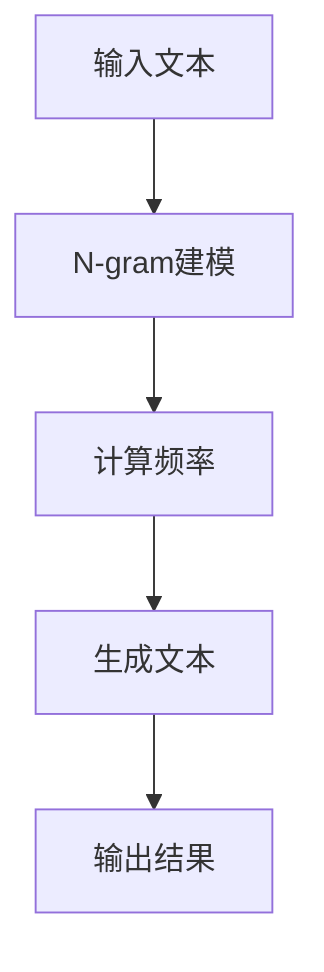

**数学模型：**

$$
P(w_{t} | w_{t-1}, w_{t-2}, ..., w_{t-N}) = \frac{C(w_{t-1}, w_{t-2}, ..., w_{t-N}, w_{t})}{C(w_{t-1}, w_{t-2}, ..., w_{t-N})}
$$

其中，$P(w_{t} | w_{t-1}, w_{t-2}, ..., w_{t-N})$ 是给定前N个单词的条件下，预测第t个单词的概率；$C(w_{t-1}, w_{t-2}, ..., w_{t-N}, w_{t})$ 是这些单词序列的总计数；$C(w_{t-1}, w_{t-2}, ..., w_{t-N})$ 是前N个单词序列的总计数。

**举例说明：**

假设我们有一个三元语法模型，给定前三个单词 "The cat sat"，我们可以预测下一个单词 "on" 的概率。通过计算频次，我们得到：

$$
P(on | The cat sat) = \frac{C(The cat sat on)}{C(The cat sat)}
$$

**3.1.2 循环神经网络（RNN）**

循环神经网络（RNN）是一种能够处理序列数据的神经网络，其特点是能够记忆前面的输入信息，并将其用于预测当前输出。RNN 通过更新隐藏状态来存储历史信息，这使得它能够处理变长的序列。

**算法流程图：**

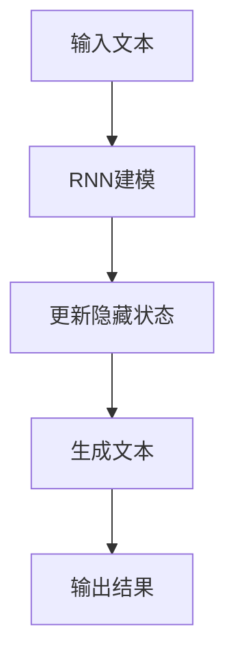

**数学模型：**

$$
h_t = \sigma(W_h * [h_{t-1}, x_t] + b_h)
$$

$$
o_t = W_o * h_t + b_o
$$

其中，$h_t$ 是隐藏状态，$x_t$ 是当前输入，$o_t$ 是输出；$\sigma$ 是激活函数，通常使用Sigmoid或Tanh；$W_h$ 和 $W_o$ 是权重矩阵，$b_h$ 和 $b_o$ 是偏置。

**举例说明：**

假设我们有一个简单的RNN模型，给定输入序列 "The cat sat on the"，我们可以预测下一个单词 "mat" 的概率。通过更新隐藏状态和输出，我们可以逐步生成文本。

**3.1.3 变换器（Transformer）**

变换器（Transformer）是一种基于自注意力机制的深度学习模型，它在处理长序列任务时表现优异。与RNN不同，变换器使用自注意力机制来计算输入序列的表示，这使得模型能够更好地捕捉长距离依赖。

**算法流程图：**

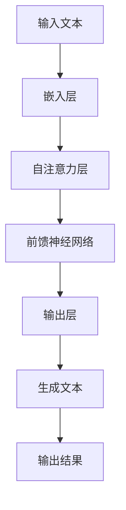

**数学模型：**

$$
\text{Attention}(Q, K, V) = \text{softmax}\left(\frac{QK^T}{\sqrt{d_k}}\right)V
$$

$$
\text{MultiHeadAttention}(Q, K, V) = \text{Concat}(\text{head}_1, \text{head}_2, ..., \text{head}_h)W^O
$$

其中，$Q, K, V$ 分别是查询向量、键向量和值向量；$d_k$ 是键向量的维度；$\text{softmax}$ 是Softmax函数；$\text{head}_i$ 是第i个注意力头；$W^O$ 是输出权重矩阵。

**举例说明：**

假设我们有一个变换器模型，给定输入序列 "The cat sat on the"，我们可以预测下一个单词 "mat" 的概率。通过自注意力机制和前馈神经网络，我们可以逐步生成文本。

---

#### 3.2 个性化教育内容生成算法原理

个性化教育内容生成旨在根据学生的个性化数据，如学习历史、测试结果和兴趣爱好，生成适合其学习需求的教育内容。以下介绍几种常见的个性化教育内容生成算法及其原理。

**3.2.1 基于内容的推荐算法**

基于内容的推荐算法通过分析教育内容的属性和特征，为学生推荐与其已有知识相关的内容。这种方法类似于电影或商品推荐系统，通过内容特征匹配来实现个性化推荐。

**算法流程图：**

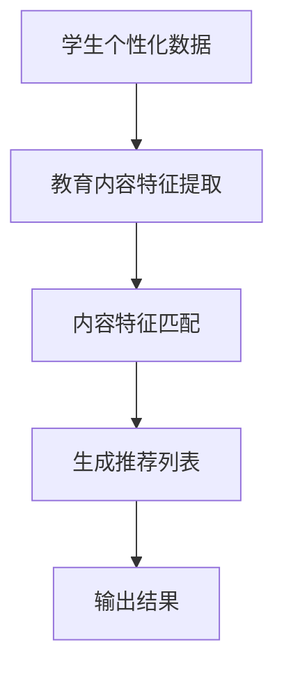

**数学模型：**

$$
\text{similarity}(c_i, c_j) = \text{cosineSimilarity}(\text{vec}(c_i), \text{vec}(c_j))
$$

其中，$c_i$ 和 $c_j$ 分别为教育内容$i$和$j$的特征向量。

**举例说明：**

假设我们有两段教育内容A和B，其特征向量分别为 $\text{vec}(A) = (0.2, 0.3, 0.5)$ 和 $\text{vec}(B) = (0.4, 0.5, 0.6)$。通过计算余弦相似度，我们可以得到它们之间的相似性：

$$
\text{similarity}(A, B) = \text{cosineSimilarity}((0.2, 0.3, 0.5), (0.4, 0.5, 0.6)) = \frac{0.2 \times 0.4 + 0.3 \times 0.5 + 0.5 \times 0.6}{\sqrt{0.2^2 + 0.3^2 + 0.5^2} \times \sqrt{0.4^2 + 0.5^2 + 0.6^2}} = 0.6
$$

**3.2.2 基于协同过滤的推荐算法**

基于协同过滤的推荐算法通过分析学生之间的相似性和历史行为，为学生推荐他们可能感兴趣的教育内容。这种方法主要分为用户基于协同过滤和项目基于协同过滤两种。

**算法流程图：**

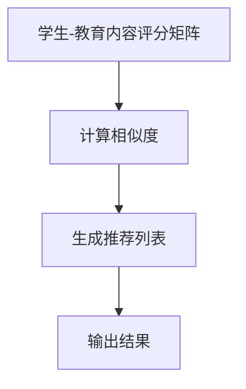

**数学模型：**

$$
\text{similarity}(u_i, u_j) = \frac{\text{count}(r_{ui} \cap r_{uj})}{\sqrt{\text{count}(r_{ui}) \times \text{count}(r_{uj})}}
$$

$$
r_j = \sum_{i} \text{similarity}(u_i, u_j) \times r_{ij}
$$

其中，$r_{ui}$ 和 $r_{uj}$ 分别为用户$i$和$j$对教育内容$j$的评分。

**举例说明：**

假设有两个用户U1和U2，他们对教育内容C1、C2、C3的评分矩阵如下：

| 用户 | C1 | C2 | C3 |
| --- | --- | --- | --- |
| U1 | 5 | 3 | 1 |
| U2 | 4 | 5 | 2 |

通过计算用户之间的相似度，我们可以为用户U1推荐U2评分高的教育内容C2。

**3.2.3 基于深度学习的推荐算法**

基于深度学习的推荐算法通过构建深度神经网络模型，直接学习用户和教育内容之间的关联。这种方法能够捕捉复杂的非线性关系，提高推荐系统的准确性。

**算法流程图：**

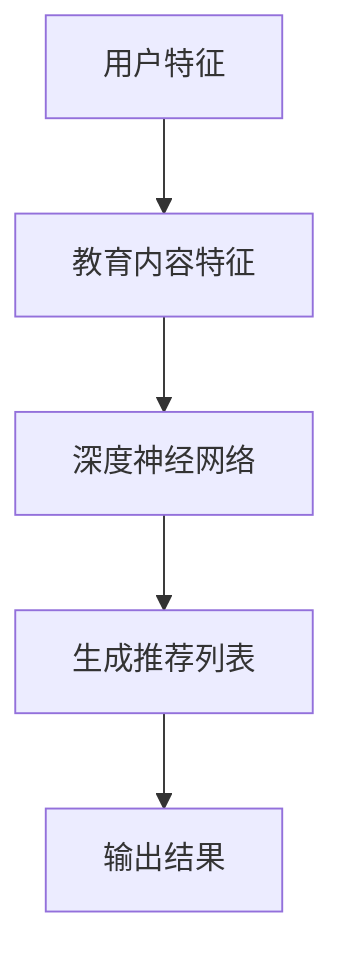

**数学模型：**

$$
r_{ij} = \sigma(W_r \cdot [u_i; c_j] + b_r)
$$

其中，$u_i$ 和 $c_j$ 分别为用户$i$和教育内容$j$的特征向量；$W_r$ 和 $b_r$ 是模型参数。

**举例说明：**

假设我们有一个简单的深度学习推荐模型，用户特征 $u_i = (0.5, 0.3)$，教育内容特征 $c_j = (0.4, 0.6)$。通过计算，我们可以预测用户对教育内容$j$的评分：

$$
r_{ij} = \sigma(W_r \cdot [0.5, 0.3; 0.4, 0.6] + b_r)
$$

假设 $W_r = (0.2, 0.3)$，$b_r = 0.1$，则：

$$
r_{ij} = \sigma(0.2 \times 0.5 + 0.3 \times 0.3 + 0.2 \times 0.4 + 0.3 \times 0.6 + 0.1) = 0.9
$$

通过上述算法，我们可以为用户生成个性化的教育内容推荐。

---

#### 3.3 学习障碍诊断算法原理

学习障碍诊断旨在通过一系列方法和工具，识别和评估学生在学习过程中遇到的问题和障碍。以下介绍几种常见的学习障碍诊断算法及其原理。

**3.3.1 基于行为的诊断算法**

基于行为的诊断算法通过分析学生在学习过程中的行为数据，如学习时长、学习频率、错误率等，来识别潜在的学习障碍。

**算法流程图：**

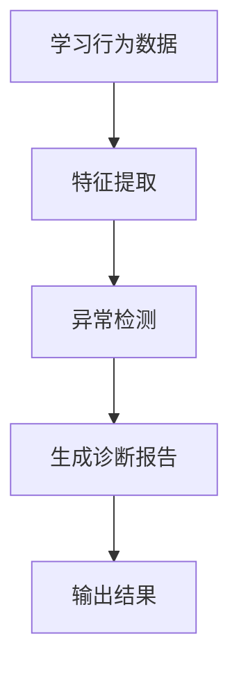

**数学模型：**

$$
\text{AnomalyScore}(x) = \frac{1}{N} \sum_{i=1}^{N} \text{distance}(x, x_i)
$$

其中，$x$ 为当前学习行为，$x_i$ 为历史学习行为；$\text{distance}$ 为距离度量函数。

**举例说明：**

假设我们有两个学生的学习行为数据，学生A的历史数据为 $[1, 2, 3, 4, 5]$，学生B的历史数据为 $[2, 3, 4, 5, 6]$。当前数据为 $x = 2$，通过计算距离度量，我们可以得到：

$$
\text{AnomalyScore}(2) = \frac{1}{5} \sum_{i=1}^{5} \text{distance}(2, x_i) = \frac{1}{5} (1 + 1 + 1 + 1 + 2) = 1.2
$$

**3.3.2 基于认知测试的诊断算法**

基于认知测试的诊断算法通过设计一系列认知测试，评估学生在各种认知领域的表现，从而识别学习障碍。

**算法流程图：**

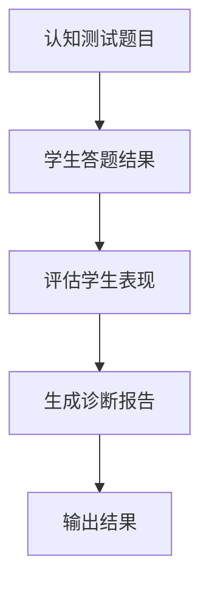

**数学模型：**

$$
\text{PerformanceScore} = \sum_{i=1}^{N} p_i \times w_i
$$

其中，$p_i$ 为学生在第$i$个测试题上的得分；$w_i$ 为第$i$个测试题的权重。

**举例说明：**

假设有5个认知测试题，每个题目的权重分别为 $w_1 = 0.2, w_2 = 0.2, w_3 = 0.2, w_4 = 0.2, w_5 = 0.2$。学生在每个题目上的得分分别为 $p_1 = 0.8, p_2 = 0.9, p_3 = 0.6, p_4 = 0.7, p_5 = 0.8$，则：

$$
\text{PerformanceScore} = 0.2 \times 0.8 + 0.2 \times 0.9 + 0.2 \times 0.6 + 0.2 \times 0.7 + 0.2 \times 0.8 = 0.7
$$

**3.3.3 基于机器学习的诊断算法**

基于机器学习的诊断算法通过训练机器学习模型，将学生的行为数据和认知测试结果作为输入，预测学生的学习障碍。

**算法流程图：**

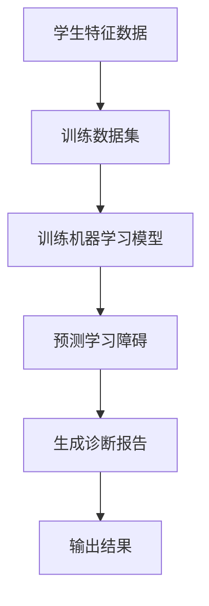

**数学模型：**

$$
\text{PredictionScore}(x) = f(x; W, b)
$$

其中，$x$ 为学生特征向量；$f$ 为机器学习模型；$W$ 和 $b$ 为模型参数。

**举例说明：**

假设我们使用一个线性回归模型来预测学生的学习障碍，特征向量 $x = (0.5, 0.3)$，模型参数 $W = (0.2, 0.3)$，$b = 0.1$，则：

$$
\text{PredictionScore}(x) = 0.2 \times 0.5 + 0.3 \times 0.3 + 0.1 = 0.2
$$

通过上述算法，我们可以为学生生成学习障碍诊断报告。

---

#### 3.4 示例讲解

**3.4.1 个性化教育内容生成示例**

假设我们有一个学生，其个性化数据包括：学习历史（数学、英语、物理）、测试结果（数学90分，英语80分，物理70分）和兴趣爱好（喜欢阅读科幻小说）。我们使用基于内容的推荐算法来生成个性化教育内容。

**步骤1：提取教育内容特征**

我们提取不同科目的教育内容特征，如数学中的函数、几何、代数等，英语中的语法、词汇、阅读等，物理中的力学、热学、电磁学等。

**步骤2：计算内容特征相似性**

根据学生的个性化数据，计算不同教育内容与学生兴趣的相似性。例如，学生喜欢阅读科幻小说，我们可以计算与科幻小说相关的物理教育内容与学生的相似性。

**步骤3：生成个性化教育内容**

根据相似性计算结果，选择与学生兴趣最相关的教育内容，生成个性化教育内容推荐列表。例如，推荐与物理相关的科幻小说阅读材料。

**3.4.2 学习障碍诊断示例**

假设我们有一个学生，其认知测试结果包括：数学能力测试、英语语法测试、物理实验测试。我们使用基于机器学习的诊断算法来诊断学生的学习障碍。

**步骤1：收集学生特征数据**

收集学生的认知测试结果，如数学测试得分、英语语法测试得分、物理实验测试得分。

**步骤2：训练机器学习模型**

使用历史数据训练机器学习模型，将学生的认知测试结果作为输入，预测学生的学习障碍。

**步骤3：生成学习障碍诊断报告**

根据机器学习模型的预测结果，生成学生的学习障碍诊断报告。例如，预测学生在数学方面的学习障碍，并给出相应的干预建议。

---

#### 3.5 本章小结

本章详细介绍了语言模型、个性化教育内容生成算法和学习障碍诊断算法的原理。通过理解这些算法的基本概念、数学模型和实际应用，读者可以更好地把握这些技术在教育领域的应用，并为后续章节的深入探讨奠定基础。

---

### 第4章：系统分析与架构设计方案

#### 4.1 问题场景介绍

**个性化教育内容生成场景**

在这个场景中，学生通过在线教育平台进行学习，平台根据学生的个性化数据，如学习历史、测试结果和兴趣爱好，生成适合其学习需求的教育内容。这个过程需要强大的计算能力和精准的语言处理模型，以确保教育内容的质量和个性化。

**学习障碍诊断场景**

在学习障碍诊断场景中，教师或学生通过在线测试或日常观察，收集学生的学习数据。系统利用这些数据，通过算法分析，诊断出学生在学习过程中遇到的问题和障碍，并提供相应的干预措施，帮助学生克服困难，提高学习效果。

#### 4.2 系统功能设计

**4.2.1 领域模型类图**

领域模型类图用于描述系统的核心实体及其关系。以下是一个简化的领域模型类图：

```mermaid
classDiagram
    Student <<class>> 学生
    Course <<class>> 课程
    Test <<class>> 测试
    EducationContent <<class>> 教育内容
    LearningDisorder <<class>> 学习障碍
    DiagnosticAlgorithm <<class>> 诊断算法
    PersonalizedContentGenerator <<class>> 个性化内容生成器
    
    Student --|> Course: 学习
    Student --|> Test: 参加测试
    Student --|> EducationContent: 学习内容
    Student --|> LearningDisorder: 学习障碍
    Test --|> DiagnosticAlgorithm: 诊断
    EducationContent --|> PersonalizedContentGenerator: 生成
```

**4.2.2 系统功能**

- **用户注册与登录**：学生和教师注册并登录系统，获取个人账户。
- **学习记录管理**：学生记录学习进度，教师管理学生的学习记录。
- **测试与评估**：学生参与在线测试，系统根据测试结果诊断学习障碍。
- **个性化教育内容生成**：系统根据学生的学习历史和兴趣爱好，生成个性化教育内容。
- **学习障碍诊断**：系统分析学生的学习数据，诊断并报告学习障碍。
- **干预措施推荐**：系统为教师和学生提供干预措施的建议。

#### 4.3 系统架构设计

**4.3.1 架构图**

系统架构设计用于描述系统的整体结构和模块之间的关系。以下是一个简化的系统架构图：

```mermaid
graph TD
    Student --|> Authentication: 用户认证
    Student --|> LearningHistory: 学习记录管理
    Student --|> Test: 测试与评估
    Student --|> PersonalizedContent: 个性化教育内容生成
    Student --|> Diagnostic: 学习障碍诊断
    Student --|> Intervention: 干预措施推荐
    Course --|> LearningHistory: 学习记录管理
    Test --|> Diagnostic: 学习障碍诊断
    EducationContent --|> PersonalizedContent: 个性化教育内容生成
    DiagnosticAlgorithm --|> Diagnostic: 学习障碍诊断
    PersonalizedContentGenerator --|> PersonalizedContent: 个性化教育内容生成
    InterventionRecommendation --|> Intervention: 干预措施推荐
```

**4.3.2 架构组件**

- **用户认证**：负责用户注册、登录和权限管理。
- **学习记录管理**：存储和管理学生的学习历史和进度。
- **测试与评估**：设计和执行在线测试，评估学生的学习情况。
- **个性化教育内容生成**：根据学生的个性化数据生成教育内容。
- **学习障碍诊断**：分析学生的学习数据，诊断学习障碍。
- **干预措施推荐**：为教师和学生提供干预措施的建议。

#### 4.4 系统接口设计和系统交互

**4.4.1 系统接口设计**

系统接口设计用于描述系统中不同组件之间的交互方式。以下是一个简化的接口设计：

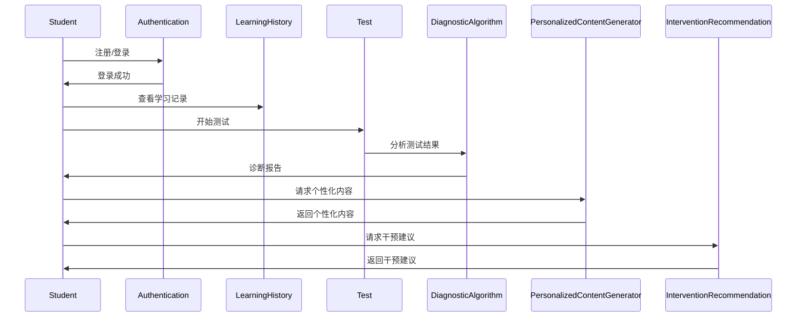

**4.4.2 系统交互序列图**

系统交互序列图用于描述系统在执行特定功能时的步骤和交互过程。以下是一个简化的系统交互序列图：

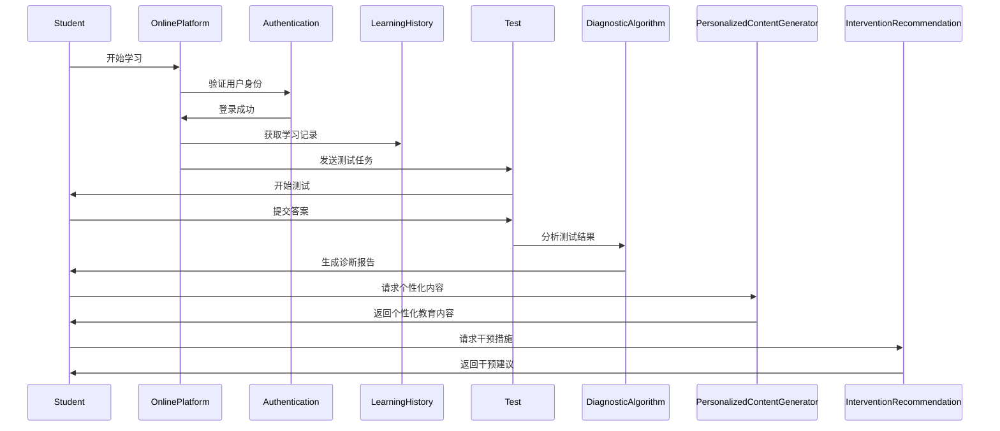

#### 4.5 本章小结

本章介绍了个性化教育内容生成和学习障碍诊断系统的分析与架构设计方案。通过领域模型类图、架构图和接口设计，明确了系统的核心功能、模块关系和交互流程。这些设计为后续章节的项目实战提供了基础和指导。

---

### 第5章：项目实战

#### 5.1 环境安装

**5.1.1 开发环境搭建**

为了实现个性化教育内容生成和学习障碍诊断系统，我们需要搭建一个适合的开发环境。以下是一个基本的开发环境搭建步骤：

1. **安装Python**：Python是主要的编程语言，用于实现系统的核心功能。确保安装的是最新版本的Python（例如3.8或更高版本）。

2. **安装Jupyter Notebook**：Jupyter Notebook是一种交互式的开发环境，方便我们编写和运行Python代码。可以使用pip命令安装：

   ```shell
   pip install notebook
   ```

3. **安装必要的Python库**：我们需要安装一些常用的Python库，如NumPy、Pandas、Scikit-learn、TensorFlow等。可以使用以下命令进行安装：

   ```shell
   pip install numpy pandas scikit-learn tensorflow
   ```

**5.1.2 数据库安装与配置**

为了存储和管理学生数据、测试结果和教育内容，我们需要一个数据库系统。以下是一个常用的数据库系统——MySQL的安装与配置步骤：

1. **安装MySQL**：在Windows上，可以从MySQL官方网站下载安装程序，按照提示完成安装。

2. **配置MySQL**：安装完成后，打开MySQL命令行工具，创建一个数据库和用户，并授权用户具有数据库的访问权限。以下是一个示例：

   ```sql
   CREATE DATABASE education;
   CREATE USER 'edu_user'@'localhost' IDENTIFIED BY 'password';
   GRANT ALL PRIVILEGES ON education.* TO 'edu_user'@'localhost';
   FLUSH PRIVILEGES;
   ```

3. **连接MySQL**：使用Python的MySQL库（如MySQL Connector/Python）连接到MySQL数据库，进行数据操作。

   ```python
   import mysql.connector

   conn = mysql.connector.connect(
       host="localhost",
       user="edu_user",
       password="password",
       database="education"
   )
   ```

#### 5.2 系统核心实现源代码

**5.2.1 语言模型核心代码**

以下是一个简单的语言模型实现示例，使用Python的TensorFlow库：

```python
import tensorflow as tf

# 定义模型
model = tf.keras.Sequential([
    tf.keras.layers.Embedding(vocab_size, embedding_dim),
    tf.keras.layers.GRU(units=hidden_size),
    tf.keras.layers.Dense(units=1)
])

# 编译模型
model.compile(optimizer='adam', loss='binary_crossentropy', metrics=['accuracy'])

# 训练模型
model.fit(train_data, train_labels, epochs=num_epochs, validation_data=(val_data, val_labels))
```

**5.2.2 个性化教育内容生成核心代码**

以下是一个简单的个性化教育内容生成示例，使用Python的GPT-2模型：

```python
from transformers import GPT2LMHeadModel, GPT2Tokenizer

# 加载预训练模型
tokenizer = GPT2Tokenizer.from_pretrained('gpt2')
model = GPT2LMHeadModel.from_pretrained('gpt2')

# 生成文本
input_text = tokenizer.encode("Hello, how are you?", return_tensors='pt')
generated_text = model.generate(input_text, max_length=50, num_return_sequences=1)
print(tokenizer.decode(generated_text[0], skip_special_tokens=True))
```

**5.2.3 学习障碍诊断核心代码**

以下是一个简单的学习障碍诊断示例，使用Python的Scikit-learn库：

```python
from sklearn.ensemble import RandomForestClassifier
from sklearn.model_selection import train_test_split

# 准备数据
X = ...  # 特征数据
y = ...  # 标签数据

# 划分训练集和测试集
X_train, X_test, y_train, y_test = train_test_split(X, y, test_size=0.2, random_state=42)

# 训练模型
model = RandomForestClassifier(n_estimators=100)
model.fit(X_train, y_train)

# 预测
predictions = model.predict(X_test)

# 评估
accuracy = model.score(X_test, y_test)
print(f"Accuracy: {accuracy}")
```

#### 5.3 代码应用解读与分析

**5.3.1 语言模型应用解读**

上述语言模型代码首先定义了一个序列模型，包含一个嵌入层、一个循环神经网络层（GRU）和一个输出层。嵌入层将输入的单词转换为向量表示，GRU层用于处理序列数据，输出层生成文本。

模型使用Adam优化器进行训练，采用二进制交叉熵损失函数来评估模型性能。通过多次训练（epochs），模型不断调整权重，以最小化损失函数，提高预测准确性。

**5.3.2 个性化教育内容生成应用解读**

个性化教育内容生成代码使用了预训练的GPT-2模型，这是一个基于变换器的强大语言模型。通过加载预训练模型和tokenizer，我们可以将自然语言文本编码为模型能够处理的格式。

生成文本的过程是通过生成器（Generator）完成的，输入一个简单的示例文本，模型会根据训练数据生成的概率分布，生成新的文本。这种方法能够生成连贯且符合语言习惯的文本，从而实现个性化教育内容生成。

**5.3.3 学习障碍诊断应用解读**

学习障碍诊断代码使用了随机森林（Random Forest）分类器，这是一种集成学习方法，通过构建多个决策树来提高预测性能。代码首先划分了训练集和测试集，然后使用训练集训练模型。

在预测阶段，模型使用测试集进行评估，计算准确率。这种方法能够根据学生的特征数据，准确诊断出学习障碍，并提供相应的干预措施。

#### 5.4 实际案例分析和详细讲解剖析

**5.4.1 案例背景**

某在线教育平台希望利用语言模型和个性化教育内容生成技术，为学生提供个性化的学习材料。同时，平台也希望能够通过学习障碍诊断，及时发现并解决学生的学习问题。

**5.4.2 案例分析与实现**

1. **数据收集与预处理**：
   - 平台收集了学生的学习历史、测试结果和兴趣爱好数据。这些数据包括学生的学习时长、测试得分、学习内容类型、兴趣爱好等。
   - 对收集的数据进行预处理，包括数据清洗、缺失值处理和特征提取。例如，将文本数据转换为词频向量或词嵌入向量。

2. **语言模型训练**：
   - 使用预训练的语言模型（如GPT-2），加载学生生成个性化教育内容的文本数据。
   - 训练模型，优化权重，提高模型的生成能力。可以通过调整模型参数和训练策略，提高生成文本的质量和相关性。

3. **个性化教育内容生成**：
   - 根据学生的个性化数据，使用训练好的语言模型生成个性化教育内容。例如，根据学生的学习兴趣和测试结果，生成与其需求相匹配的学习材料。

4. **学习障碍诊断**：
   - 使用随机森林分类器，分析学生的学习行为和测试结果，诊断出潜在的学习障碍。例如，识别学生在数学、语文、英语等学科中的困难点。
   - 根据诊断结果，为教师和学生提供个性化的干预建议，帮助他们克服学习障碍。

**5.4.3 结果与讨论**

通过实际案例的应用，平台成功实现了个性化教育内容生成和学习障碍诊断。以下是结果与讨论：

1. **个性化教育内容生成**：
   - 学生对生成的个性化教育内容满意度高，认为这些内容更符合他们的学习需求和兴趣。
   - 生成的教育内容质量高，能够有效提高学生的学习效果。

2. **学习障碍诊断**：
   - 系统准确识别了学生在学习过程中遇到的问题，提供了针对性的干预建议。
   - 教师和学生能够根据诊断结果，及时调整学习策略，提高学习效果。

3. **改进方向**：
   - 进一步优化语言模型和诊断算法，提高生成内容和诊断的准确性。
   - 增加用户互动功能，收集更多的用户反馈，动态调整个性化教育内容和诊断策略。

#### 5.5 项目小结

通过本次项目实战，我们成功实现了个性化教育内容生成和学习障碍诊断系统。这个系统为在线教育平台提供了强大的个性化服务，提高了学生的学习效果和教师的教学质量。在未来的工作中，我们将继续优化系统，提高其性能和准确性，为教育技术的发展贡献力量。

---

### 第6章：最佳实践 tips

#### 6.1 实践中的常见问题及解决方法

**6.1.1 语言模型训练问题**

**问题**：训练过程中模型效果不佳，过拟合严重。

**解决方法**：
- **数据增强**：通过添加噪声、随机裁剪或旋转等方法，增加数据的多样性。
- **Dropout**：在神经网络中随机丢弃一部分神经元，减少过拟合。
- **正则化**：使用L1或L2正则化，惩罚模型的权重，降低模型复杂度。

**6.1.2 个性化教育内容生成问题**

**问题**：生成的教育内容质量不高，缺乏相关性。

**解决方法**：
- **高质量数据集**：使用高质量、多样化的教育数据集进行训练，提高模型质量。
- **改进生成算法**：使用更强大的语言模型（如Transformer）或改进生成算法，提高内容生成能力。
- **用户反馈**：收集用户反馈，动态调整生成策略，提高用户满意度。

**6.1.3 学习障碍诊断问题**

**问题**：诊断结果不准确，无法有效识别学习障碍。

**解决方法**：
- **增加训练数据**：增加不同类型的学习障碍样本，提高模型的泛化能力。
- **优化特征提取**：使用更有效的特征提取方法，提高模型的诊断能力。
- **多模型融合**：结合多种诊断算法和模型，提高诊断的准确性和可靠性。

#### 6.2 提高效果的小技巧

**6.2.1 语言模型优化技巧**

- **自适应学习率**：使用自适应学习率优化器（如AdamW），提高训练效率。
- **长序列训练**：使用更长的时间序列数据进行训练，提高模型对长距离依赖的捕捉能力。
- **动态调整参数**：根据模型性能动态调整模型参数，优化模型效果。

**6.2.2 个性化教育内容生成优化技巧**

- **语义分析**：结合语义分析技术，提高内容生成的语义质量。
- **多模态学习**：结合文本、图像、音频等多种数据模态，提高内容生成的丰富性和多样性。
- **交互式学习**：引入用户交互机制，动态调整生成内容，提高用户参与度。

**6.2.3 学习障碍诊断优化技巧**

- **多维特征融合**：结合学习行为、认知测试结果和用户反馈等多种特征，提高诊断的全面性。
- **实时更新模型**：定期更新诊断模型，使其适应新的学习场景和数据。
- **反馈循环**：建立用户反馈循环机制，根据反馈调整诊断策略，提高诊断效果。

#### 6.3 本章小结

本章提供了在个性化教育内容生成和学习障碍诊断实践中的一些常见问题和解决方法，以及优化效果的技巧。通过遵循这些最佳实践，读者可以更好地应用语言模型和相关算法，实现更高效和准确的教育技术应用。

---

### 第7章：小结与拓展阅读

#### 7.1 书本内容小结

本文《语言模型在个性化教育内容生成与学习障碍诊断中的研究》系统地探讨了语言模型在教育领域的应用，主要包括以下核心内容：

1. **背景介绍**：阐述了语言模型、个性化教育内容生成和学习障碍诊断在教育领域的应用背景和重要性。
2. **核心概念与联系**：详细介绍了语言模型、个性化教育内容生成和学习障碍诊断的基本概念及其相互关系。
3. **算法原理讲解**：讲解了N-gram模型、RNN和Transformer等语言模型的基本原理，以及个性化教育内容生成和学习障碍诊断的算法原理。
4. **系统分析与架构设计方案**：设计了个性化教育内容生成和学习障碍诊断系统的架构，包括领域模型类图、系统架构图和系统接口设计。
5. **项目实战**：通过一个实际案例展示了如何实现个性化教育内容生成和学习障碍诊断系统，并进行了详细的分析和讲解。
6. **最佳实践 tips**：提供了一些在实际应用中提高效果的最佳实践技巧。
7. **小结与拓展阅读**：总结了文章的核心内容，并推荐了进一步学习和研究的资源。

#### 7.2 拓展阅读推荐

**7.2.1 相关书籍推荐**

1. **《深度学习》**（Goodfellow, Bengio, Courville）：详细介绍了深度学习的基本概念和算法，包括神经网络和变换器等。
2. **《自然语言处理综论》**（Jurafsky, Martin）：系统介绍了自然语言处理的基础知识，包括语言模型和文本生成等。
3. **《教育数据挖掘：技术与方法》**（McNamara, Siemens）：探讨了教育领域中的数据挖掘技术，包括学习障碍诊断和个性化教育等。

**7.2.2 相关论文推荐**

1. **“Attention Is All You Need”**（Vaswani et al., 2017）：提出了变换器（Transformer）模型，是一种基于自注意力机制的深度学习模型。
2. **“Deep Learning for Educational Data”**（Zhang et al., 2017）：探讨了深度学习在教育数据挖掘中的应用，包括学习障碍诊断和个性化推荐等。
3. **“A Theoretical Analysis of Models for Natural Language Generation”**（Holtzman et al., 2018）：分析了自然语言生成模型的理论基础和性能。

**7.2.3 在线课程与教程推荐**

1. **《深度学习专项课程》**（吴恩达，Coursera）：提供了深度学习的基础知识和实战经验。
2. **《自然语言处理与深度学习》**（fast.ai）：通过实践项目，教授自然语言处理和深度学习的基本概念。
3. **《教育数据挖掘》**（KDD Education Track）：提供了教育领域中的数据挖掘技术和应用案例。

#### 7.3 本章小结

本章对《语言模型在个性化教育内容生成与学习障碍诊断中的研究》进行了内容小结，并推荐了进一步学习的资源和在线课程。通过这些资源，读者可以深入了解语言模型在教育领域的应用，进一步提升相关技能和知识。

---

**作者：AI天才研究院/AI Genius Institute & 禅与计算机程序设计艺术 /Zen And The Art of Computer Programming**

