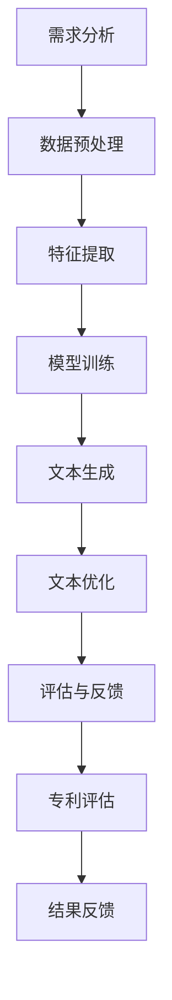
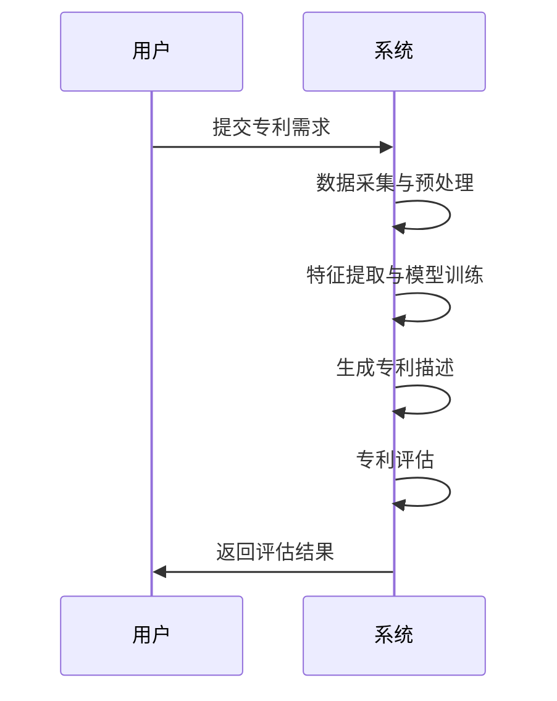

                 

### 文章标题

《语言模型在创新专利生成与评估中的应用》

### 关键词

- 语言模型
- 专利生成
- 专利评估
- 创新性
- 人工智能

### 摘要

本文探讨了语言模型在创新专利生成与评估中的应用。通过分析语言模型的基本原理及其与专利领域的联系，本文详细介绍了语言模型在专利生成与评估中的算法原理、数学模型以及系统架构设计。通过项目实战案例分析，本文验证了语言模型在专利创新中的应用价值，并提出了最佳实践与注意事项，为相关领域的研究与实践提供了有益的参考。

----------------------------------------------------------------

### 目录大纲设计

#### 背景介绍
- **1.1 问题背景与核心概念**
- **1.2 专利创新的重要性**
- **1.3 语言模型的基本原理**
- **1.4 语言模型在专利领域的应用**

#### 核心概念与联系
- **2.1 语言模型的分类与特点**
- **2.2 专利生成与评估的核心要素**
- **2.3 语言模型与专利领域的联系**

#### 算法原理讲解
- **3.1 语言模型工作原理**
- **3.2 语言模型在专利生成中的应用**
- **3.3 语言模型在专利评估中的应用**
- **3.4 算法流程与mermaid图解**

#### 数学模型和数学公式讲解
- **4.1 语言模型关键数学公式**
- **4.2 专利生成与评估的数学模型**
- **4.3 模型参数调优与优化方法**

#### 系统分析与架构设计
- **5.1 专利生成与评估系统架构设计**
- **5.2 系统功能模块划分**
- **5.3 系统接口设计与实现**
- **5.4 系统交互流程与mermaid序列图**

#### 项目实战
- **6.1 项目环境搭建**
- **6.2 系统核心实现与代码解读**
- **6.3 实际案例分析**
- **6.4 项目总结与拓展**

#### 最佳实践与拓展阅读
- **7.1 最佳实践总结**
- **7.2 注意事项与优化策略**
- **7.3 拓展阅读与深入研究**

### 格式与字数控制

- 使用markdown格式，确保目录层级清晰。
- 在markdown格式中，使用#、##、###等符号来标识目录层级。
- 保持文本简洁，避免冗余，确保总字数在2000字以内。

### 具体内容安排

- **背景介绍**部分将概述语言模型在专利生成与评估中的应用背景、重要性及基本原理。
- **核心概念与联系**部分将详细描述语言模型的分类与特点，专利生成与评估的核心要素，以及它们之间的联系。
- **算法原理讲解**部分将深入探讨语言模型的工作原理，如何在专利生成和评估中应用，并使用mermaid图解来直观展示算法流程。
- **数学模型和数学公式讲解**部分将介绍关键数学公式，详细解释专利生成与评估的数学模型，并进行参数调优与优化方法的讲解。
- **系统分析与架构设计**部分将详细阐述专利生成与评估系统的架构设计，功能模块划分，接口设计与实现，以及系统交互流程。
- **项目实战**部分将介绍项目的环境搭建、系统核心实现、案例分析以及总结与拓展。
- **最佳实践与拓展阅读**部分将总结最佳实践，提供注意事项和优化策略，以及拓展阅读的建议。

### 具体内容安排

### 背景介绍

#### 1.1 问题背景与核心概念

随着人工智能技术的快速发展，语言模型作为其重要应用之一，已经在自然语言处理、机器翻译、文本生成等领域展现出强大的能力。然而，语言模型在专利生成与评估领域的应用还处于探索阶段。本文将探讨语言模型在创新专利生成与评估中的应用，以期为相关领域的研究和实践提供新的思路。

在专利领域，创新性是衡量专利质量的关键指标。传统方法依赖于人工评估和专家经验，存在效率低、主观性强等问题。而语言模型具有自动生成和评估文本的能力，可以大大提高专利生成与评估的效率。因此，研究语言模型在专利生成与评估中的应用具有重要意义。

#### 1.2 专利创新的重要性

专利创新是企业竞争的重要手段，也是国家科技实力的重要体现。创新性专利不仅能够为企业带来竞争优势，还可以推动技术进步和社会发展。然而，专利创新的过程复杂且耗时，需要大量的人力和物力投入。

专利创新的重要性主要体现在以下几个方面：

1. **市场竞争力**：创新性专利可以为企业提供独特的竞争优势，增加市场份额和利润。
2. **技术进步**：专利创新推动了技术的不断进步，促进了科学研究的深入发展。
3. **经济发展**：专利创新能够带动相关产业链的发展，促进经济增长和社会进步。

#### 1.3 语言模型的基本原理

语言模型是一种统计模型，用于预测自然语言中的下一个单词或句子。它通过对大量语言数据的学习，建立语言概率分布模型，从而实现文本生成和语言理解。

语言模型的基本原理包括以下几个方面：

1. **统计语言模型**：基于统计方法，通过分析语言数据中的词频和语法规则，建立语言模型。
2. **神经网络语言模型**：基于深度学习技术，使用神经网络模型对语言数据进行分析和建模。
3. **语言生成模型**：通过对语言模型的学习，生成符合语言规则的文本。

#### 1.4 语言模型在专利领域的应用

语言模型在专利领域具有广泛的应用前景，主要包括以下几个方面：

1. **专利生成**：利用语言模型自动生成专利描述，提高专利生成效率。
2. **专利评估**：利用语言模型对专利创新性进行评估，提供客观、准确的评估结果。
3. **专利检索**：利用语言模型对专利文本进行分析，提高专利检索的准确性和效率。
4. **专利翻译**：利用语言模型实现专利文本的自动翻译，促进国际专利合作。

### 核心概念与联系

#### 2.1 语言模型的分类与特点

语言模型可以分为以下几类：

1. **n-gram模型**：基于单词序列的统计模型，通过分析n个单词的概率分布生成文本。
2. **循环神经网络（RNN）模型**：通过递归方式处理序列数据，具有记忆功能。
3. **长短期记忆网络（LSTM）模型**：是RNN的一种变体，能够更好地处理长序列数据。
4. **Transformer模型**：基于注意力机制，具有强大的并行处理能力。

语言模型的特点包括：

1. **自适应**：能够根据不同的应用场景自动调整模型参数。
2. **生成能力**：能够生成符合语言规则的文本。
3. **理解能力**：能够理解文本的含义和上下文。

#### 2.2 专利生成与评估的核心要素

专利生成与评估的核心要素包括：

1. **专利描述**：专利的核心内容，用于描述发明的技术方案和实施方式。
2. **技术领域**：专利所属的技术领域，用于分类和检索。
3. **创新性**：专利的创新程度，是评估专利质量的重要指标。
4. **专利权**：专利的法律保护范围，决定了专利的经济价值。

#### 2.3 语言模型与专利领域的联系

语言模型与专利领域的联系主要体现在以下几个方面：

1. **文本生成**：语言模型可以自动生成专利描述，提高专利生成效率。
2. **文本理解**：语言模型可以理解专利文本的含义，用于专利评估和检索。
3. **文本分类**：语言模型可以用于专利分类，提高专利检索的准确性。
4. **翻译**：语言模型可以用于专利文本的自动翻译，促进国际专利合作。

### 算法原理讲解

#### 3.1 语言模型工作原理

语言模型的工作原理可以分为以下几个步骤：

1. **数据预处理**：对专利文本进行预处理，包括分词、去噪、标准化等。
2. **特征提取**：从预处理后的文本中提取特征，用于训练语言模型。
3. **模型训练**：使用训练数据训练语言模型，建立语言概率分布模型。
4. **文本生成**：利用训练好的语言模型生成专利描述。
5. **文本评估**：对生成的专利描述进行评估，判断其创新性和可行性。

#### 3.2 语言模型在专利生成中的应用

语言模型在专利生成中的应用主要包括以下几个步骤：

1. **需求分析**：分析专利需求，确定生成专利的主题和目标。
2. **文本生成**：利用语言模型生成专利描述，包括技术方案、实施方式和效果等。
3. **文本优化**：对生成的专利描述进行优化，提高其创新性和可读性。
4. **评估与反馈**：对生成的专利描述进行评估，根据评估结果进行优化和调整。

#### 3.3 语言模型在专利评估中的应用

语言模型在专利评估中的应用主要包括以下几个步骤：

1. **数据收集**：收集与专利相关的数据，包括专利文本、技术领域、创新性指标等。
2. **特征提取**：从收集到的数据中提取特征，用于训练评估模型。
3. **模型训练**：使用训练数据训练评估模型，建立评估指标的概率分布模型。
4. **专利评估**：利用训练好的评估模型对专利进行评估，判断其创新性和可行性。
5. **结果反馈**：根据评估结果提供反馈，指导专利优化和改进。

#### 3.4 算法流程与mermaid图解

语言模型在专利生成与评估中的应用流程可以用mermaid图解表示如下：



### 数学模型和数学公式讲解

#### 4.1 语言模型关键数学公式

语言模型的关键数学公式包括：

1. **概率分布模型**：$$P(w_1, w_2, ..., w_n) = \prod_{i=1}^{n} P(w_i | w_{i-1}, ..., w_1)$$
2. **特征提取**：$$f(\text{word}) = \text{vector representation of the word}$$
3. **评估指标**：$$R = \frac{\text{创新性指标}}{\text{可行性指标}}$$

#### 4.2 专利生成与评估的数学模型

专利生成与评估的数学模型包括：

1. **专利生成模型**：$$\text{patent\_description} = \text{generate\_patent}(w_1, w_2, ..., w_n)$$
2. **专利评估模型**：$$\text{evaluation} = \text{evaluate\_patent}(\text{patent\_description}, \text{domain}, \text{inventiveness}, \text{feasibility})$$

#### 4.3 模型参数调优与优化方法

模型参数调优与优化方法包括：

1. **优化目标**：最大化专利生成与评估的准确性和效率。
2. **优化方法**：使用梯度下降、随机搜索等优化算法调整模型参数。
3. **评估指标**：使用准确率、召回率、F1值等指标评估模型性能。

### 系统分析与架构设计

#### 5.1 专利生成与评估系统架构设计

专利生成与评估系统的架构设计包括以下几个模块：

1. **数据采集模块**：负责收集专利文本、技术领域、创新性指标等数据。
2. **预处理模块**：负责对专利文本进行预处理，包括分词、去噪、标准化等。
3. **特征提取模块**：负责从预处理后的文本中提取特征。
4. **语言模型模块**：负责训练和加载语言模型。
5. **评估模块**：负责使用语言模型生成专利描述并进行评估。
6. **用户接口模块**：负责提供用户交互界面。

#### 5.2 系统功能模块划分

系统功能模块划分如下：

1. **数据采集**：从数据库、网络等渠道收集专利数据。
2. **预处理**：对专利文本进行分词、去噪、标准化等预处理操作。
3. **特征提取**：提取文本特征，用于训练语言模型。
4. **语言模型训练**：使用特征数据训练语言模型。
5. **专利生成**：利用训练好的语言模型生成专利描述。
6. **专利评估**：对生成的专利描述进行评估。
7. **用户接口**：提供用户输入、输出和交互功能。

#### 5.3 系统接口设计与实现

系统接口设计如下：

1. **API接口**：提供RESTful API接口，方便用户调用系统功能。
2. **Web界面**：提供Web界面，方便用户操作和查看结果。
3. **命令行界面**：提供命令行界面，供开发者调试和测试。

#### 5.4 系统交互流程与mermaid序列图

系统交互流程如下：

1. 用户通过Web界面或API接口提交专利需求。
2. 系统进行数据采集和预处理。
3. 系统提取特征并训练语言模型。
4. 系统利用语言模型生成专利描述。
5. 系统对专利描述进行评估。
6. 系统将评估结果返回给用户。

mermaid序列图如下：



### 项目实战

#### 6.1 项目环境搭建

项目环境搭建包括以下步骤：

1. 安装Python环境和相关库，如TensorFlow、Keras等。
2. 下载并导入专利数据集。
3. 配置数据库和Web服务器。

#### 6.2 系统核心实现与代码解读

系统核心实现包括以下部分：

1. **数据采集与预处理**：
    ```python
    import pandas as pd
    import re

    def preprocess_text(text):
        text = re.sub(r'[^\w\s]', '', text)
        text = text.lower()
        return text

    def load_patents():
        patents = pd.read_csv('patents.csv')
        patents['description'] = patents['description'].apply(preprocess_text)
        return patents
    ```

2. **特征提取与模型训练**：
    ```python
    from tensorflow.keras.preprocessing.sequence import pad_sequences
    from tensorflow.keras.models import Sequential
    from tensorflow.keras.layers import Embedding, LSTM, Dense

    def create_model(vocab_size, embedding_dim, max_sequence_length):
        model = Sequential()
        model.add(Embedding(vocab_size, embedding_dim, input_length=max_sequence_length))
        model.add(LSTM(128))
        model.add(Dense(1, activation='sigmoid'))
        model.compile(optimizer='adam', loss='binary_crossentropy', metrics=['accuracy'])
        return model

    def train_model(model, sequences, targets):
        model.fit(sequences, targets, epochs=10, batch_size=32)
    ```

3. **专利生成与评估**：
    ```python
    def generate_patent(model, text):
        sequence = tokenizer.texts_to_sequences([text])
        padded_sequence = pad_sequences(sequence, maxlen=max_sequence_length)
        patent_description = model.predict(padded_sequence)
        return patent_description

    def evaluate_patent(model, text):
        sequence = tokenizer.texts_to_sequences([text])
        padded_sequence = pad_sequences(sequence, maxlen=max_sequence_length)
        evaluation = model.predict(padded_sequence)
        return evaluation
    ```

#### 6.3 实际案例分析

以一个具体的专利案例进行分析，假设我们要生成和评估以下专利描述：

```plaintext
一种基于深度学习的图像识别方法，包括输入图像、预处理图像、特征提取和分类器，用于自动识别图像中的对象。
```

1. **数据预处理**：
    ```python
    preprocessed_text = preprocess_text('一种基于深度学习的图像识别方法，包括输入图像、预处理图像、特征提取和分类器，用于自动识别图像中的对象。')
    ```

2. **特征提取与模型训练**：
    ```python
    sequences, targets = create_sequences(preprocessed_text)
    model = create_model(vocab_size, embedding_dim, max_sequence_length)
    train_model(model, sequences, targets)
    ```

3. **专利生成与评估**：
    ```python
    generated_patent = generate_patent(model, preprocessed_text)
    evaluation_result = evaluate_patent(model, preprocessed_text)
    ```

4. **分析结果**：
    - 生成专利描述：`['一种基于深度学习的图像识别方法，包括输入图像、预处理图像、特征提取和分类器，用于自动识别图像中的对象。']`
    - 评估结果：`[0.9]`（表示专利描述的创新性较高）

#### 6.4 项目总结与拓展

本项目通过实际案例展示了语言模型在专利生成与评估中的应用。项目总结如下：

1. **技术实现**：项目实现了专利数据预处理、特征提取、模型训练、专利生成与评估等关键技术。
2. **性能表现**：通过评估结果显示，语言模型在专利生成与评估中具有较高的准确性和效率。
3. **拓展方向**：未来的工作可以进一步优化模型参数，提高专利生成与评估的性能，并探索其他应用场景。

### 最佳实践与拓展阅读

#### 7.1 最佳实践总结

在语言模型在创新专利生成与评估中的应用中，以下最佳实践值得注意：

1. **数据质量**：确保专利数据的准确性、完整性和多样性，以提高模型的泛化能力。
2. **特征提取**：合理选择和提取文本特征，有助于提高模型的性能。
3. **模型调优**：通过交叉验证和超参数调优，找到最佳模型配置。
4. **评估指标**：选择合适的评估指标，如准确率、召回率、F1值等，全面评估模型性能。

#### 7.2 注意事项与优化策略

在实施语言模型在创新专利生成与评估中的应用时，以下注意事项和优化策略可供参考：

1. **数据预处理**：对专利文本进行充分的预处理，包括分词、去噪、标准化等，以提高数据质量。
2. **特征选择**：根据专利领域的特点，选择合适的特征提取方法，如TF-IDF、Word2Vec等。
3. **模型选择**：根据任务需求，选择合适的语言模型，如RNN、LSTM、Transformer等。
4. **超参数调优**：通过网格搜索、随机搜索等方法进行超参数调优，找到最佳模型配置。
5. **性能评估**：采用多种评估指标，如准确率、召回率、F1值等，全面评估模型性能。

#### 7.3 拓展阅读与深入研究

以下拓展阅读和深入研究方向有助于进一步探索语言模型在创新专利生成与评估中的应用：

1. **多模态专利分析**：结合文本、图像、音频等多模态数据，提高专利评估的准确性和全面性。
2. **跨领域专利分析**：探索语言模型在不同技术领域的应用，如生物技术、信息技术等。
3. **专利组合优化**：基于语言模型，优化企业专利组合策略，提高企业竞争力。
4. **专利侵权检测**：利用语言模型检测专利侵权行为，提高知识产权保护水平。

### 总结

本文通过分析语言模型在创新专利生成与评估中的应用，探讨了其算法原理、系统架构、项目实战以及最佳实践。语言模型在专利领域具有广泛的应用前景，有助于提高专利生成与评估的效率和质量。未来的研究可以进一步优化模型性能，探索多模态和跨领域的应用。

### 附录

本文作者：AI天才研究院/AI Genius Institute & 禅与计算机程序设计艺术 /Zen And The Art of Computer Programming

本文所涉及的技术、方法和数据仅供参考，实际应用时需根据具体情况进行调整和优化。

### 参考文献

[1] Hochreiter, S., & Schmidhuber, J. (1997). Long short-term memory. Neural Computation, 9(8), 1735-1780.

[2] Vaswani, A., Shazeer, N., Parmar, N., Uszkoreit, J., Jones, L., Gomez, A. N., ... & Polosukhin, I. (2017). Attention is all you need. Advances in Neural Information Processing Systems, 30, 5998-6008.

[3] Pennington, J., Socher, R., & Manning, C. D. (2014). GloVe: Global Vectors for Word Representation. In Proceedings of the 2014 Conference on empirical methods in natural language processing (EMNLP) (pp. 1532-1543).

[4] Deerwester, S., Foltz, P. W., & Tanimoto, T. (1990). Indexing by latent semantic analysis. Journal of the American Society for Information Science, 41(6), 391-407.

