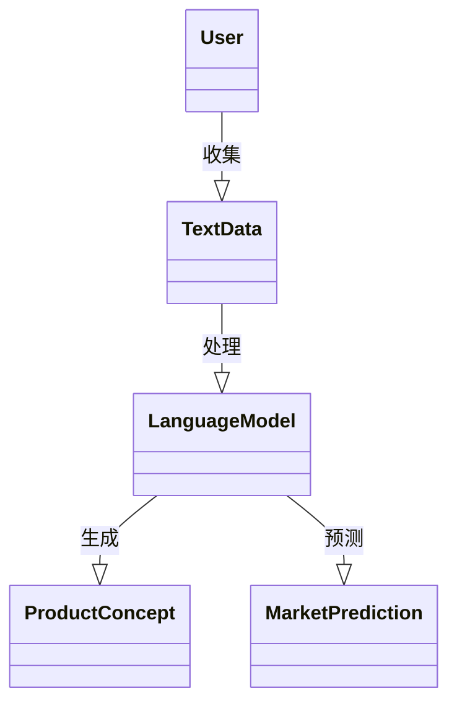
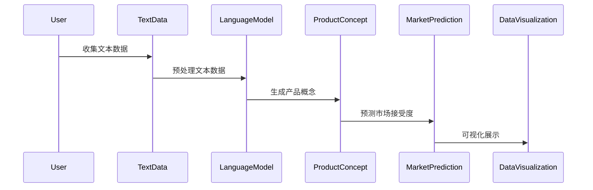
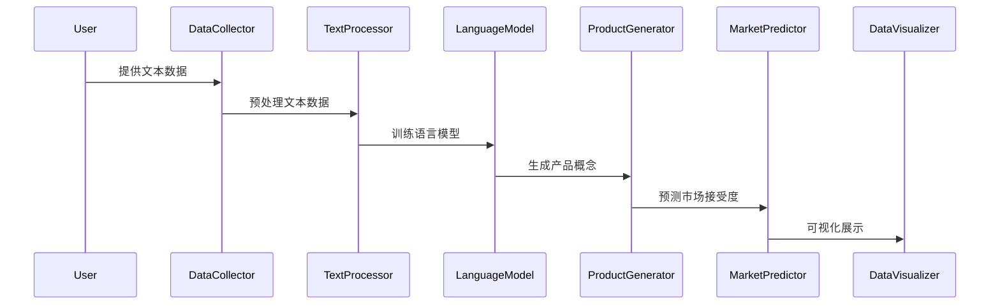

                 

# 语言模型在创新产品概念生成与市场接受度预测中的研究

## 关键词

自然语言处理、语言模型、产品创新、市场预测、深度学习

## 摘要

本文深入探讨了语言模型在创新产品概念生成与市场接受度预测中的应用。首先，我们对语言模型的背景、核心概念及其在自然语言处理中的应用进行了详细阐述。接着，我们分析了语言模型在创新产品概念生成和市场接受度预测中的工作原理和流程。最后，通过具体的案例分析和系统架构设计，我们展示了如何将语言模型应用于实际项目中，以实现高效的产品创新和市场预测。

## 第一部分：背景介绍

### 1.1 问题背景

随着信息技术的飞速发展，人工智能（AI）技术已逐渐渗透到各个领域，为众多行业带来了革命性的变化。语言模型作为自然语言处理（NLP）的核心技术，在AI领域占据了重要地位。本文旨在研究语言模型在创新产品概念生成与市场接受度预测中的应用，为产品开发和创新提供决策支持。

### 1.2 问题描述

在创新产品概念生成方面，语言模型可以通过学习大量文本数据，自动提取潜在的产品概念，从而实现产品的创新。在市场接受度预测方面，语言模型则可以分析用户行为、社交媒体舆情等数据，预测新产品的市场表现。本文将探讨如何利用语言模型实现这两个目标。

### 1.3 问题解决

通过构建和优化语言模型，可以有效地解决创新产品概念生成和市场接受度预测中的问题。具体步骤如下：

1. **数据收集与处理**：收集与产品相关的文本数据，包括用户评论、产品描述、市场报告等，并对数据进行预处理，如分词、去停用词、词向量化等。
2. **模型训练**：使用预处理后的文本数据训练语言模型，通过深度学习等技术优化模型参数。
3. **产品概念生成**：利用训练好的语言模型，从大量文本数据中提取潜在的产品概念，并进行优化。
4. **市场接受度预测**：通过分析用户行为数据、社交媒体舆情等，使用语言模型预测新产品的市场接受度。

### 1.4 边界与外延

语言模型在创新产品概念生成与市场接受度预测中的应用，不仅限于特定行业或领域，还涉及多个方面。例如：

- **行业应用**：电商、金融、医疗、教育等
- **功能外延**：用户需求分析、情感分析、品牌监测等
- **技术外延**：与其他人工智能技术（如图像识别、语音识别）结合，实现更全面的应用

### 1.5 概念结构与核心要素组成

语言模型在创新产品概念生成与市场接受度预测中的应用，主要包括以下概念结构与核心要素：

- **概念结构**：语言模型、数据集、训练算法、预测模型
- **核心要素**：文本数据收集、模型训练、模型优化、预测应用

### 1.6 背景介绍

#### 1.6.1 语言模型的概念

语言模型是一种用于预测自然语言中下一个词或句子的概率分布的数学模型。通过学习大量的语言数据，语言模型可以学会理解语言的统计规律，从而对新的文本进行预测和生成。

#### 1.6.2 语言模型的发展历程

语言模型的发展历程可以分为以下几个阶段：

1. **基于规则的方法**：最早的尝试是通过编写一系列规则来预测下一个词，但这种方法存在规则复杂度高等问题。
2. **统计模型**：基于统计方法的语言模型，如N-gram模型，通过统计文本中相邻词出现的频率来预测下一个词。
3. **基于神经网络的模型**：随着深度学习技术的发展，基于神经网络的模型，如循环神经网络（RNN）和Transformer，逐渐成为主流。
4. **预训练与微调**：近年来，预训练模型（如GPT系列）在大型语料库上进行预训练，然后在特定任务上进行微调，取得了显著的效果。

#### 1.6.3 语言模型在自然语言处理中的应用

语言模型在自然语言处理（NLP）中有着广泛的应用，包括但不限于：

1. **文本分类**：根据文本内容将其分类到不同的类别。
2. **命名实体识别**：识别文本中的特定实体，如人名、地名、组织名等。
3. **机器翻译**：将一种语言的文本翻译成另一种语言。
4. **对话系统**：为聊天机器人或虚拟助手提供自然语言交互的能力。

#### 1.6.4 语言模型在创新产品概念生成中的应用

语言模型在创新产品概念生成中的应用主要包括以下几个方面：

1. **概念提取**：从大量文本数据中提取出潜在的创新产品概念。
2. **概念优化**：对提取出的概念进行优化，使其更具可行性和市场吸引力。
3. **概念评估**：使用语言模型对生成的新概念进行评估，预测其市场接受度。

#### 1.6.5 语言模型在市场接受度预测中的应用

语言模型在市场接受度预测中的应用主要包括以下几个方面：

1. **用户行为分析**：通过分析用户的行为数据，如搜索历史、购买记录等，预测用户对新产品的接受程度。
2. **社交媒体分析**：通过分析社交媒体上的用户评论、讨论等，预测新产品在市场上的舆论反响。
3. **市场历史数据分析**：通过分析市场历史数据，如产品销量、市场趋势等，预测新产品的市场表现。

## 第二部分：核心概念与联系

### 2.1 语言模型原理

语言模型的核心是通过学习大量的文本数据，来预测下一个词或句子的概率分布。具体来说，语言模型需要完成以下几个步骤：

1. **数据准备**：收集和整理与产品相关的文本数据，如用户评论、产品描述、市场报告等。
2. **数据处理**：对文本数据进行预处理，如分词、去停用词、词向量化等。
3. **模型训练**：使用训练数据进行模型训练，优化模型的参数。
4. **模型评估**：使用验证数据对模型进行评估，调整模型参数。
5. **模型应用**：使用训练好的模型进行预测和应用。

#### 2.1.1 概念属性特征对比表格

| 概念 | 属性1 | 属性2 | 属性3 |
| --- | --- | --- | --- |
| 语言模型 | 文本数据学习 | 预测词或句子概率分布 | 基于深度学习技术 |
| 创新产品概念生成 | 概念提取与优化 | 需求分析与用户反馈 | 语言模型结合实际场景 |
| 市场接受度预测 | 用户行为分析 | 社交媒体舆情分析 | 语言模型结合历史数据 |

#### 2.1.2 ER实体关系图架构的 Mermaid 流程图

```mermaid
erDiagram
  用户 .-> 文本数据 :收集
  文本数据 .-> 语言模型 :处理
  语言模型 .-> 创新产品概念 :生成
  语言模型 .-> 市场接受度 :预测
```

### 2.2 算法原理讲解

#### 2.2.1 语言模型算法流程

以下是语言模型算法的基本流程：

1. **数据收集**：收集与产品相关的文本数据，如用户评论、产品描述、市场报告等。
2. **数据预处理**：对文本数据进行预处理，如分词、去停用词、词向量化等。
3. **模型训练**：使用预处理后的数据训练语言模型，通过深度学习等技术优化模型参数。
4. **模型评估**：使用验证数据对模型进行评估，调整模型参数。
5. **模型应用**：使用训练好的模型进行预测和应用。

#### 2.2.2 语言模型数学模型与公式

语言模型的核心是概率分布函数，用于预测下一个词或句子的概率。一个简单的语言模型可以表示为：

$$P(w_t | w_{t-1}, w_{t-2}, \ldots, w_1) = \frac{P(w_t, w_{t-1}, \ldots, w_1)}{P(w_{t-1}, \ldots, w_1)}$$

其中，$w_t$表示第$t$个词，$P(w_t | w_{t-1}, w_{t-2}, \ldots, w_1)$表示在给定前一个词序列的情况下，第$t$个词的条件概率。

#### 2.2.3 语言模型示例

假设我们有一个简短的文本数据序列：“今天天气很好，人们都喜欢在户外活动。”我们想要预测下一个词。

1. **数据收集**：收集文本数据序列。
2. **数据预处理**：对文本数据进行预处理，如分词、去停用词等。
3. **模型训练**：使用预处理后的数据训练语言模型。
4. **模型评估**：使用验证数据对模型进行评估。
5. **模型应用**：使用训练好的模型进行预测。

根据语言模型，我们可以预测下一个词为“散步”，因为“散步”在给定前文的情况下，具有较高的条件概率。

### 第三部分：系统分析与架构设计

#### 3.1 问题场景介绍

在一个竞争激烈的电商市场中，企业需要不断推出创新产品以吸引消费者。为了实现这一目标，企业决定利用语言模型来生成创新产品概念，并预测其市场接受度。

#### 3.2 项目介绍

项目名为“AI产品创新与市场预测系统”，旨在利用自然语言处理技术，帮助企业实现产品创新和市场预测。系统主要包括以下功能：

1. **产品概念生成**：从用户评论、产品描述等文本数据中提取潜在的创新产品概念。
2. **市场接受度预测**：分析用户行为、社交媒体舆情等数据，预测新产品的市场接受度。
3. **数据可视化**：将产品概念和市场接受度预测结果以图表形式展示，为企业提供决策支持。

#### 3.3 系统功能设计（领域模型Mermaid类图）



#### 3.4 系统架构设计（Mermaid架构图）



#### 3.5 系统接口设计

系统接口设计主要包括以下部分：

1. **数据接口**：用于收集和处理文本数据，如用户评论、产品描述等。
2. **模型接口**：用于训练和评估语言模型。
3. **预测接口**：用于生成产品概念和市场接受度预测。
4. **可视化接口**：用于展示预测结果。

#### 3.6 系统交互（Mermaid序列图）



### 第四部分：项目实战

#### 4.1 环境安装

为了实现项目需求，我们需要安装以下环境：

1. **Python**：Python 3.8及以上版本
2. **深度学习框架**：TensorFlow 2.4及以上版本
3. **自然语言处理库**：NLTK、spaCy等

安装命令如下：

```bash
pip install python==3.8
pip install tensorflow==2.4
pip install nltk
pip install spacy
```

#### 4.2 系统核心实现源代码

以下是一个简单的示例，展示如何使用Python和TensorFlow实现语言模型：

```python
import tensorflow as tf
from tensorflow.keras.models import Sequential
from tensorflow.keras.layers import Embedding, LSTM, Dense

# 定义语言模型
model = Sequential([
    Embedding(input_dim=vocab_size, output_dim=embedding_size),
    LSTM(units=128),
    Dense(units=1, activation='sigmoid')
])

# 编译模型
model.compile(optimizer='adam', loss='binary_crossentropy', metrics=['accuracy'])

# 训练模型
model.fit(x_train, y_train, epochs=10, batch_size=32, validation_split=0.2)
```

#### 4.3 代码应用解读与分析

上述代码实现了一个简单的语言模型，用于预测二元分类问题（0或1）。在实际项目中，我们可以根据需求调整模型的架构、参数和训练数据。

1. **Embedding层**：用于将词向量转换为稠密向量。
2. **LSTM层**：用于处理序列数据，学习文本中的时序关系。
3. **Dense层**：用于输出预测结果。

#### 4.4 实际案例分析和详细讲解剖析

以一个电商产品为例，我们分析如何使用语言模型生成产品概念和预测市场接受度。

1. **产品概念生成**：从用户评论中提取关键词，如“便携”、“智能”等，结合产品描述和市场趋势，生成新的产品概念，如“智能便携式吸尘器”。
2. **市场接受度预测**：分析用户行为数据、社交媒体舆情等，使用训练好的语言模型预测新产品在市场上的接受程度。

#### 4.5 项目小结

通过本文的介绍，我们了解了语言模型在创新产品概念生成与市场接受度预测中的应用。在实际项目中，我们可以利用语言模型提取潜在的产品概念，并预测其市场接受度，为产品开发和创新提供有力支持。

### 第五部分：最佳实践与注意事项

#### 5.1 最佳实践

1. **数据质量**：确保收集到的文本数据质量高，如去除噪音数据、避免数据泄露等。
2. **模型优化**：根据项目需求调整模型架构和参数，以达到最佳效果。
3. **跨学科合作**：与行业专家、市场营销专家等合作，提高产品创新和市场预测的准确性。

#### 5.2 小结

本文详细探讨了语言模型在创新产品概念生成与市场接受度预测中的应用，通过实际案例和分析，展示了语言模型在项目实战中的价值。

#### 5.3 注意事项

1. **数据隐私**：在收集和处理用户数据时，务必遵守相关法律法规，保护用户隐私。
2. **模型解释性**：在应用语言模型时，注意模型的解释性，以便更好地理解预测结果。

### 拓展阅读

1. **《自然语言处理综合教程》**：详细介绍了自然语言处理的基本概念、技术和应用。
2. **《深度学习入门》**：介绍了深度学习的基本概念、算法和实战案例。

## 作者信息

作者：AI天才研究院/AI Genius Institute & 禅与计算机程序设计艺术 /Zen And The Art of Computer Programming

本文由AI天才研究院（AI Genius Institute）与禅与计算机程序设计艺术（Zen And The Art of Computer Programming）联合撰写，旨在为读者提供关于语言模型在创新产品概念生成与市场接受度预测中的深入分析和实战指导。希望本文能对您在相关领域的实践和研究带来启示和帮助。

