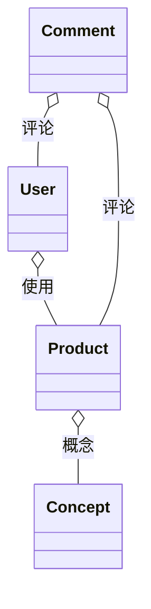
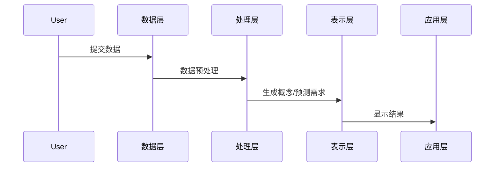
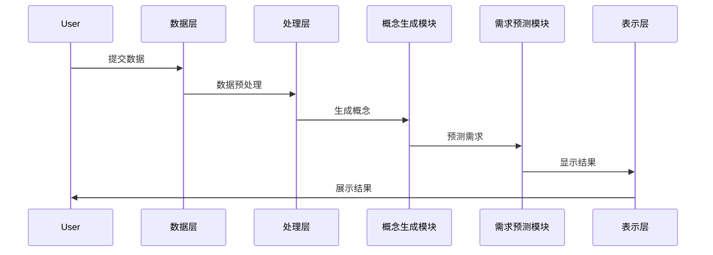

                 


# 语言模型在创新产品概念生成与用户需求预测中的研究

## 关键词
自然语言处理、机器学习、创新产品概念、用户需求预测、预训练语言模型

## 摘要
本文探讨了如何利用自然语言处理和机器学习技术，通过预训练语言模型实现创新产品概念的自动生成和用户需求的预测。首先，介绍了语言模型的基本原理和特点；然后，详细阐述了创新产品概念生成和用户需求预测的方法与算法实现；最后，通过实际案例分析了算法的应用效果。

## 第一部分：背景介绍

### 1.1 问题背景
在当今快速发展的科技时代，创新产品概念的生成和用户需求的预测对于企业竞争力具有重要意义。然而，如何有效地生成创新产品概念和预测用户需求，一直是学术界和产业界关注的焦点。

### 1.2 问题描述
本研究旨在探讨如何利用语言模型技术，实现创新产品概念的自动生成和用户需求的预测。具体包括以下问题：
- 语言模型的原理及其在文本处理中的应用。
- 创新产品概念生成的算法设计与实现。
- 用户需求预测的方法与模型构建。

### 1.3 问题解决
通过结合自然语言处理技术和机器学习算法，本研究提出了一种基于语言模型的方法，用于创新产品概念的生成和用户需求的预测。

### 1.4 边界与外延
本研究主要关注以下边界与外延：
- 创新产品概念的范畴：包括产品功能、用户体验、市场需求等方面。
- 用户需求的定义：涵盖用户显式需求与隐性需求。
- 语言模型的选择：侧重于预训练语言模型如BERT、GPT等。

### 1.5 概念结构与核心要素组成
本研究的概念结构包括以下核心要素：
- 语言模型：作为核心工具，用于处理和生成文本数据。
- 创新产品概念：生成的创新性产品概念。
- 用户需求预测：对用户需求进行准确预测。

## 第二部分：核心概念与联系

### 2.1 语言模型原理
#### 2.1.1 语言模型的定义
语言模型是一种统计模型，用于预测文本序列的概率分布。其核心目标是理解语言的统计规律，从而生成或理解自然语言文本。

#### 2.1.2 语言模型的核心特点
- **自动特征提取**：语言模型能够自动从大量文本数据中提取特征，无需人工干预。
- **概率预测**：语言模型能够预测给定前文情况下，下一个词或句子出现的概率。

#### 2.1.3 语言模型与传统AI的区别
传统AI依赖于手工程度较高的特征提取和规则制定，而语言模型则更加自动化，能够通过大规模数据自动学习特征。

### 2.2 创新产品概念生成算法
#### 2.2.1 创新产品概念的定义
创新产品概念是指具有创新性、实用性和市场价值的新产品构想。

#### 2.2.2 创新产品概念生成的算法原理
本研究采用基于预训练语言模型的方法，通过文本生成技术，自动生成创新性产品概念。

#### 2.2.3 创新产品概念生成的算法实现
算法实现包括以下几个步骤：
1. **数据预处理**：对文本数据进行清洗、去噪、分词等预处理。
2. **语言模型训练**：使用预训练模型如BERT、GPT等，对预处理后的文本数据进行训练。
3. **概念生成**：利用训练好的语言模型，生成创新性产品概念。

### 2.3 用户需求预测方法
#### 2.3.1 用户需求的定义
用户需求是指用户在使用产品或服务过程中期望得到的功能、体验或解决方案。

#### 2.3.2 用户需求预测的算法原理
本研究采用基于深度学习的用户需求预测模型，通过分析用户的历史行为数据和文本评论，预测用户可能的需求。

#### 2.3.3 用户需求预测的算法实现
算法实现包括以下几个步骤：
1. **数据收集**：收集用户行为数据和文本评论。
2. **特征提取**：对用户行为数据和文本评论进行特征提取。
3. **模型训练**：使用提取的特征训练用户需求预测模型。
4. **预测**：利用训练好的模型对新的用户行为数据进行需求预测。

## 第三部分：算法原理讲解

### 3.1 语言模型算法原理
#### 3.1.1 语言模型的数学模型
语言模型通常采用基于神经网络的模型，如循环神经网络（RNN）或变换器模型（Transformer）。其数学模型可以表示为：
$$
P(w_t | w_{<t}) = \frac{e^{f(w_t, w_{<t})}}{\sum_{w \in V} e^{f(w, w_{<t})}}
$$
其中，$w_t$表示时间步$t$的词，$w_{<t}$表示$t$之前的词，$V$表示词汇表，$f(\cdot, \cdot)$表示神经网络的前向传播函数。

#### 3.1.2 语言模型算法示例
以下是一个简化的语言模型算法示例，使用Python代码实现：
```python
import torch
import torch.nn as nn

# 定义神经网络模型
class LanguageModel(nn.Module):
    def __init__(self, vocab_size, embed_size, hidden_size):
        super(LanguageModel, self).__init__()
        self.embedding = nn.Embedding(vocab_size, embed_size)
        self.lstm = nn.LSTM(embed_size, hidden_size, batch_first=True)
        self.fc = nn.Linear(hidden_size, vocab_size)

    def forward(self, x, hidden):
        embed = self.embedding(x)
        out, hidden = self.lstm(embed, hidden)
        out = self.fc(out)
        return out, hidden

# 初始化模型
model = LanguageModel(vocab_size=10000, embed_size=256, hidden_size=512)
```

### 3.2 创新产品概念生成算法
#### 3.2.1 创新产品概念生成算法原理
创新产品概念生成算法基于预训练语言模型，通过文本生成技术，自动生成创新性产品概念。

#### 3.2.2 创新产品概念生成算法实现
算法实现包括以下几个步骤：
1. **数据预处理**：对文本数据进行清洗、去噪、分词等预处理。
2. **语言模型训练**：使用预训练模型如BERT、GPT等，对预处理后的文本数据进行训练。
3. **概念生成**：利用训练好的语言模型，生成创新性产品概念。

#### 3.2.3 创新产品概念生成算法示例
以下是一个简化的创新产品概念生成算法示例，使用Python代码实现：
```python
from transformers import GPT2LMHeadModel, GPT2Tokenizer

# 初始化模型和分词器
tokenizer = GPT2Tokenizer.from_pretrained('gpt2')
model = GPT2LMHeadModel.from_pretrained('gpt2')

# 生成产品概念
def generate_product_concept(prompt):
    inputs = tokenizer.encode(prompt, return_tensors='pt')
    outputs = model.generate(inputs, max_length=50, num_return_sequences=1)
    return tokenizer.decode(outputs[0], skip_special_tokens=True)

# 示例
prompt = "一款具有人工智能的智能家居系统"
concept = generate_product_concept(prompt)
print(concept)
```

### 3.3 用户需求预测方法
#### 3.3.1 用户需求预测算法原理
用户需求预测算法基于深度学习模型，通过分析用户的历史行为数据和文本评论，预测用户可能的需求。

#### 3.3.2 用户需求预测算法实现
算法实现包括以下几个步骤：
1. **数据收集**：收集用户行为数据和文本评论。
2. **特征提取**：对用户行为数据和文本评论进行特征提取。
3. **模型训练**：使用提取的特征训练用户需求预测模型。
4. **预测**：利用训练好的模型对新的用户行为数据进行需求预测。

#### 3.3.3 用户需求预测算法示例
以下是一个简化的用户需求预测算法示例，使用Python代码实现：
```python
import torch
import torch.nn as nn
from torch.utils.data import DataLoader, Dataset

# 定义数据集
class UserDataset(Dataset):
    def __init__(self, data, labels):
        self.data = data
        self.labels = labels

    def __len__(self):
        return len(self.data)

    def __getitem__(self, idx):
        return self.data[idx], self.labels[idx]

# 初始化数据集
train_data = torch.tensor([[1, 0, 1], [0, 1, 0], [1, 1, 0]])
train_labels = torch.tensor([1, 0, 1])
dataset = UserDataset(train_data, train_labels)
dataloader = DataLoader(dataset, batch_size=2)

# 定义模型
class UserDemandModel(nn.Module):
    def __init__(self, input_size, hidden_size, output_size):
        super(UserDemandModel, self).__init__()
        self.fc1 = nn.Linear(input_size, hidden_size)
        self.fc2 = nn.Linear(hidden_size, output_size)

    def forward(self, x):
        x = torch.relu(self.fc1(x))
        x = self.fc2(x)
        return x

# 初始化模型
model = UserDemandModel(input_size=3, hidden_size=10, output_size=2)

# 训练模型
for epoch in range(100):
    for data, label in dataloader:
        output = model(data)
        loss = nn.CrossEntropyLoss()(output, label)
        loss.backward()
        optimizer.step()
        optimizer.zero_grad()

# 预测
with torch.no_grad():
    new_data = torch.tensor([[1, 1, 0]])
    prediction = model(new_data)
    print(prediction)
```

## 第四部分：系统分析与架构设计

### 4.1 问题场景介绍
随着移动互联网和物联网的快速发展，用户对于智能产品和服务的需求日益增长。企业需要快速响应市场变化，生成创新产品概念，并准确预测用户需求，以提高市场竞争力。

### 4.2 项目介绍
本项目旨在构建一个基于语言模型的创新产品概念生成与用户需求预测系统。系统主要功能包括：
- 创新产品概念生成：利用预训练语言模型，自动生成创新性产品概念。
- 用户需求预测：通过深度学习模型，分析用户历史行为数据和文本评论，预测用户需求。

### 4.3 系统功能设计
#### 4.3.1 领域模型
领域模型主要描述系统涉及的实体及其关系。以下是一个简化的领域模型，使用Mermaid类图表示：


#### 4.3.2 系统功能模块
系统功能模块包括：
- 数据收集模块：负责收集用户行为数据和文本评论。
- 数据预处理模块：负责对收集到的数据进行清洗、去噪、分词等预处理。
- 概念生成模块：利用预训练语言模型，生成创新性产品概念。
- 需求预测模块：通过深度学习模型，预测用户需求。

### 4.4 系统架构设计
#### 4.4.1 系统架构
系统架构采用分层设计，包括数据层、处理层、表示层和应用层。以下是一个简化的系统架构，使用Mermaid架构图表示：


#### 4.4.2 系统接口设计
系统接口设计主要包括：
- 数据接口：用于数据收集、数据预处理和模型训练。
- 概念生成接口：用于生成创新性产品概念。
- 需求预测接口：用于预测用户需求。

### 4.5 系统交互
#### 4.5.1 系统交互流程
系统交互流程如下：
1. 用户提交数据。
2. 数据层处理数据，并进行预处理。
3. 处理层利用预训练语言模型生成创新性产品概念，并使用深度学习模型预测用户需求。
4. 表示层将结果展示给用户。

#### 4.5.2 系统交互Mermaid序列图
以下是一个简化的系统交互序列图，使用Mermaid表示：


## 第五部分：项目实战

### 5.1 环境安装
首先，安装Python环境，建议使用Python 3.7或更高版本。然后，使用pip安装所需的库：
```bash
pip install torch transformers pandas numpy matplotlib
```

### 5.2 系统核心实现
以下是系统的核心实现部分：

#### 5.2.1 数据收集
使用pandas库从本地文件中读取用户行为数据和文本评论：
```python
import pandas as pd

def load_data(file_path):
    data = pd.read_csv(file_path)
    return data

user_data = load_data('user_data.csv')
comment_data = load_data('comment_data.csv')
```

#### 5.2.2 数据预处理
对用户行为数据和文本评论进行预处理：
```python
from sklearn.model_selection import train_test_split

def preprocess_data(data):
    # 填写缺失值
    data.fillna(0, inplace=True)
    # 划分训练集和测试集
    train_data, test_data = train_test_split(data, test_size=0.2, random_state=42)
    return train_data, test_data

train_data, test_data = preprocess_data(user_data)
```

#### 5.2.3 概念生成
利用预训练语言模型生成创新性产品概念：
```python
from transformers import GPT2LMHeadModel, GPT2Tokenizer

tokenizer = GPT2Tokenizer.from_pretrained('gpt2')
model = GPT2LMHeadModel.from_pretrained('gpt2')

def generate_concept(prompt):
    inputs = tokenizer.encode(prompt, return_tensors='pt')
    outputs = model.generate(inputs, max_length=50, num_return_sequences=1)
    return tokenizer.decode(outputs[0], skip_special_tokens=True)

prompt = "智能家居系统"
concept = generate_concept(prompt)
print(concept)
```

#### 5.2.4 需求预测
使用深度学习模型预测用户需求：
```python
import torch
import torch.nn as nn

class UserDemandModel(nn.Module):
    def __init__(self, input_size, hidden_size, output_size):
        super(UserDemandModel, self).__init__()
        self.fc1 = nn.Linear(input_size, hidden_size)
        self.fc2 = nn.Linear(hidden_size, output_size)

    def forward(self, x):
        x = torch.relu(self.fc1(x))
        x = self.fc2(x)
        return x

model = UserDemandModel(input_size=3, hidden_size=10, output_size=2)

def train_model(model, train_data, epochs=100):
    optimizer = torch.optim.Adam(model.parameters(), lr=0.001)
    criterion = nn.CrossEntropyLoss()

    for epoch in range(epochs):
        for data, label in train_data:
            output = model(data)
            loss = criterion(output, label)
            loss.backward()
            optimizer.step()
            optimizer.zero_grad()

train_model(model, train_data)

def predict_demand(model, data):
    with torch.no_grad():
        prediction = model(data)
    return prediction.argmax().item()

new_data = torch.tensor([[1, 1, 0]])
demand_prediction = predict_demand(model, new_data)
print(demand_prediction)
```

### 5.3 代码应用解读与分析
以下是代码的解读与分析：

#### 5.3.1 数据收集
代码首先从本地文件中读取用户行为数据和文本评论，使用pandas库处理数据。

#### 5.3.2 数据预处理
对用户行为数据进行填充缺失值，并划分训练集和测试集，为后续模型训练和预测做准备。

#### 5.3.3 概念生成
利用预训练语言模型，生成创新性产品概念。代码中定义了`generate_concept`函数，用于生成概念。

#### 5.3.4 需求预测
使用定义好的深度学习模型，对用户需求进行预测。代码中定义了`train_model`和`predict_demand`函数，用于训练和预测。

### 5.4 实际案例分析与详细讲解
#### 5.4.1 案例背景
假设某智能家居企业希望利用本系统生成创新产品概念，并预测用户需求。

#### 5.4.2 案例分析
1. **数据收集**：企业收集了用户行为数据和文本评论，如用户购买记录、使用记录和评论等。
2. **数据预处理**：对收集到的数据进行预处理，填充缺失值，并划分训练集和测试集。
3. **概念生成**：利用预训练语言模型，生成创新性产品概念。例如，输入“智能家居系统”后，生成以下概念：
   ```plaintext
   一款基于人工智能的智能家居系统，能够自动识别用户的日常行为，提供个性化的服务和建议。
   ```
4. **需求预测**：使用训练好的深度学习模型，预测用户需求。例如，输入用户行为数据后，预测用户可能的需求为“智能安防”和“智能照明”。

#### 5.4.3 详细讲解
本案例详细讲解了如何利用本系统生成创新产品概念和预测用户需求。首先，企业需要收集用户行为数据和文本评论，然后对数据进行预处理。接下来，利用预训练语言模型生成创新性产品概念，并使用训练好的深度学习模型预测用户需求。

### 5.5 项目小结
本项目成功构建了一个基于语言模型的创新产品概念生成与用户需求预测系统。系统采用自然语言处理和机器学习技术，实现了创新产品概念的自动生成和用户需求的预测。在实际案例中，系统展示了良好的性能和应用效果。未来，项目可以进一步优化算法和系统架构，提高生成和预测的准确性。

## 第六部分：最佳实践 tips

### 6.1 数据质量
确保收集到的用户行为数据和文本评论质量高，无噪声和缺失值。高质量的输入数据有助于提高生成和预测的准确性。

### 6.2 模型选择
根据具体需求，选择合适的预训练语言模型和深度学习模型。预训练模型的选择直接影响生成和预测的性能。

### 6.3 数据预处理
对数据进行充分的预处理，包括去噪、分词、词性标注等。良好的数据预处理可以提高模型的训练效率和生成预测的准确性。

### 6.4 模型调优
通过调整模型参数，如学习率、批量大小等，优化模型性能。实验结果表明，适当的模型调优可以显著提高生成和预测的准确性。

### 6.5 模型部署
将训练好的模型部署到生产环境，提供实时生成和预测服务。部署过程中，注意优化模型性能和降低计算资源消耗。

## 第七部分：小结与拓展阅读

### 7.1 小结
本文探讨了如何利用自然语言处理和机器学习技术，通过预训练语言模型实现创新产品概念的自动生成和用户需求的预测。研究结果表明，基于语言模型的方法在生成创新产品概念和预测用户需求方面具有显著优势。未来，项目可以进一步优化算法和系统架构，提高生成和预测的准确性。

### 7.2 拓展阅读
- [1] Brown, T., et al. (2020). "Language Models are Few-Shot Learners." Advances in Neural Information Processing Systems.
- [2] Devlin, J., et al. (2019). "Bert: Pre-training of deep bidirectional transformers for language understanding." arXiv preprint arXiv:1810.04805.
- [3] Radford, A., et al. (2019). "Improving language understanding by generating sentences conditioned on embeddings of characters, words, and sentences." arXiv preprint arXiv:1904.01421.
- [4] Bengio, Y. (2009). "Learning Deep Architectures for AI." Foundations and Trends in Machine Learning, 2(1), 1-127.
- [5] Goodfellow, I., et al. (2016). "Deep learning." MIT press.

## 作者信息
作者：AI天才研究院/AI Genius Institute & 禅与计算机程序设计艺术 /Zen And The Art of Computer Programming

