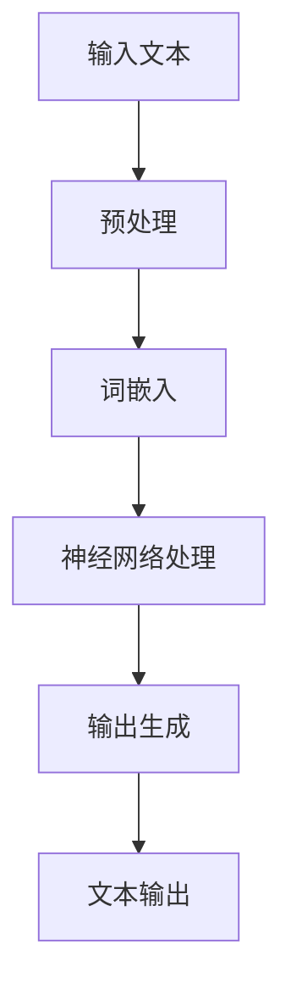
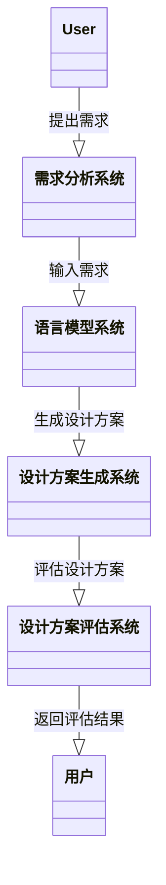
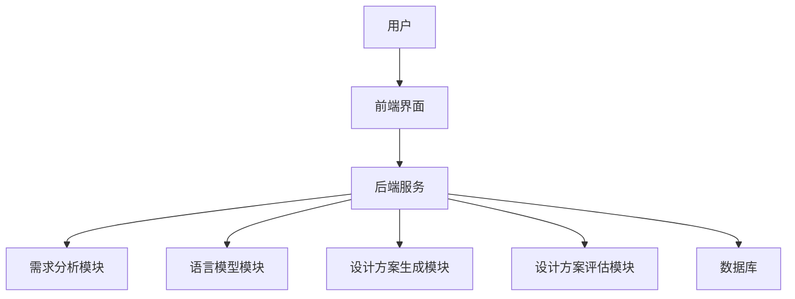
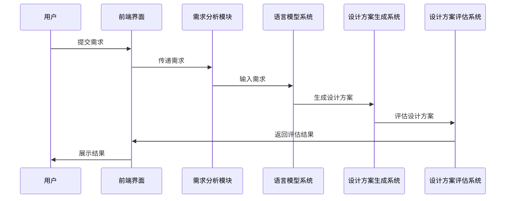

                 


### 引言

在当今快速发展的信息技术时代，产品的创新设计与评估成为了企业竞争力的关键。随着人工智能技术的不断突破，语言模型作为一种先进的人工智能工具，正逐渐在各个领域中展现其强大的应用潜力。本文旨在探讨语言模型在创新产品设计与评估中的应用，通过详细的分析与实例讲解，揭示其在提升产品设计效率与准确性的重要作用。

语言模型，作为一种对自然语言进行理解和生成的人工智能技术，其核心目标是从大量的文本数据中学习语言的模式和规律，并能够根据输入文本生成相应的文本输出。目前，主流的语言模型包括GPT系列模型、BERT模型等，这些模型在语言理解和生成任务上取得了显著的成绩，为人工智能在多个领域的应用提供了强有力的支持。

产品设计与评估是产品开发过程中的关键环节。一方面，优秀的设计能够满足用户需求，提升产品竞争力；另一方面，准确的评估能够帮助企业在有限的资源下做出最优的决策。传统的产品设计与评估方法往往依赖于人类专家的经验和判断，效率较低且存在一定的主观性。而语言模型的引入，为自动化和智能化设计评估提供了新的可能性。

本文将分为以下几个部分进行讨论：

1. 语言模型概述：介绍语言模型的基础知识，包括背景、重要性和核心概念。
2. 语言模型的原理与实现：讲解语言模型的工作原理、数学模型和具体实现。
3. 语言模型在产品设计与评估中的应用：分析语言模型在产品设计与评估中的实际应用场景和具体方法。
4. 项目实战：通过实际案例展示语言模型在产品设计与评估中的具体应用。
5. 最佳实践与拓展阅读：总结语言模型在产品设计与评估中的最佳实践和进一步研究方向。

通过上述内容的逐步讲解，我们将深入理解语言模型在产品创新设计与评估中的重要作用，并为其在相关领域的进一步应用提供参考和启示。

### 目录大纲

在本章节中，我们将对全文的结构进行详细的阐述，并通过目录大纲的形式展示各部分的内容。这份目录大纲不仅有助于读者快速了解文章的整体架构，还能为后续章节的阅读提供清晰的指导。

#### 第一部分：语言模型概述

1. 第1章：语言模型基础
   - 1.1 语言模型的背景与重要性
     - 1.1.1 问题背景
     - 1.1.2 问题描述
     - 1.1.3 问题解决
     - 1.1.4 边界与外延
   - 1.2 语言模型的核心概念与要素
     - 1.2.1 核心概念
     - 1.2.2 要素组成
     - 1.2.3 概念联系
   - 1.3 主流语言模型介绍
     - 1.3.1 GPT系列模型
     - 1.3.2 BERT模型
     - 1.3.3 其他语言模型

2. 第2章：语言模型的原理与实现
   - 2.1 语言模型的原理讲解
     - 2.1.1 算法原理
     - 2.1.2 数学模型与公式
     - 2.1.3 具体实现
   - 2.2 语言模型的流程图与示例
     - 2.2.1 Mermaid流程图
   - 2.3 Python代码实现示例

#### 第二部分：语言模型在产品设计与评估中的应用

3. 第3章：语言模型在产品设计与评估中的应用
   - 3.1 产品设计与评估中的语言模型应用
     - 3.1.1 问题场景介绍
     - 3.1.2 项目介绍
   - 3.2 系统功能设计
     - 3.2.1 领域模型（Mermaid类图）
   - 3.3 系统架构设计
     - 3.3.1 系统架构设计（Mermaid架构图）
   - 3.4 系统接口设计与交互
     - 3.4.1 系统接口设计（Mermaid序列图）

#### 第三部分：项目实战

4. 第4章：项目实战
   - 4.1 环境安装与配置
     - 4.1.1 环境安装
     - 4.1.2 配置说明
   - 4.2 系统核心实现
     - 4.2.1 源代码分析
     - 4.2.2 代码解读与分析
   - 4.3 实际案例分析与讲解
     - 4.3.1 案例一：产品A的设计与评估
     - 4.3.2 案例二：产品B的设计与评估
     - 4.3.3 案例三：产品C的设计与评估
   - 4.4 项目小结

#### 第四部分：最佳实践与拓展阅读

5. 第5章：最佳实践与拓展阅读
   - 5.1 最佳实践 Tips
     - 5.1.1 设计建议
     - 5.1.2 评估策略
   - 5.2 拓展阅读

通过这份详细的目录大纲，读者可以清晰地了解文章的结构和内容安排，为后续章节的深入学习奠定基础。

### 语言模型概述

#### 第1章：语言模型基础

语言模型作为一种对自然语言进行理解和生成的人工智能技术，其发展历程可以追溯到20世纪50年代。最初，研究者们尝试通过规则方法来模拟自然语言处理，但这种方法在处理复杂语言现象时表现不佳。随着计算机性能的提升和大数据的普及，统计方法和神经网络模型逐渐成为语言模型发展的主流。近年来，随着深度学习技术的突破，语言模型取得了显著进展，GPT系列模型和BERT模型等代表性模型在多个自然语言处理任务上达到了人类专家水平。

#### 1.1 语言模型的背景与重要性

1.1.1 问题背景

语言是人类沟通和表达思想的重要工具，但自然语言的复杂性使得计算机对自然语言的理解和处理成为一个极具挑战性的问题。传统的自然语言处理方法往往依赖于手写规则和有限的状态机，这限制了其处理能力的扩展。随着互联网和大数据的兴起，大量的文本数据为语言模型的研究和应用提供了丰富的资源。语言模型的出现，为自动化和智能化的自然语言处理带来了新的希望。

1.1.2 问题描述

自然语言处理的任务多种多样，包括文本分类、信息抽取、机器翻译、问答系统等。其中，语言生成和语言理解是最核心的任务。语言生成要求模型能够根据给定的上下文生成符合语法和语义规则的文本；语言理解则要求模型能够理解输入文本的含义，并生成相应的语义表示。

1.1.3 问题解决

语言模型通过学习大量的文本数据，提取出语言的模式和规律，从而实现对自然语言的生成和理解。具体来说，语言模型通过以下步骤实现：
- **数据预处理**：对原始文本进行清洗、分词、去停用词等操作，将文本转换为模型可处理的格式。
- **词嵌入**：将文本中的单词映射为高维向量，这些向量不仅保留了单词的语义信息，还考虑了单词之间的相似性。
- **神经网络训练**：使用神经网络模型对词嵌入向量进行处理，通过反向传播算法不断调整模型的参数，使其能够生成和识别符合语言规则的文本。

1.1.4 边界与外延

虽然语言模型在自然语言处理中取得了巨大成功，但其应用仍存在一些边界和局限性。首先，语言模型依赖于大量的训练数据，数据质量和数量对模型的效果有重要影响。其次，语言模型在处理长文本和理解复杂语义关系时仍存在一定困难。此外，语言模型可能产生不符合常识或道德标准的输出，这在实际应用中需要特别注意。

#### 1.2 语言模型的核心概念与要素

1.2.1 核心概念

语言模型的核心概念包括词嵌入、神经网络、训练数据和损失函数等。

- **词嵌入（Word Embedding）**：词嵌入是将单词映射为高维向量的一种技术，这些向量不仅保留了单词的语义信息，还能体现单词之间的相似性。常见的词嵌入方法包括Word2Vec、GloVe等。
- **神经网络（Neural Network）**：神经网络是一种模仿人脑神经元连接方式的计算模型，能够通过学习大量数据自动提取特征和规律。在语言模型中，神经网络用于对词嵌入向量进行处理，生成文本输出。
- **训练数据（Training Data）**：训练数据是语言模型学习的基础，通常包含大量的文本数据。训练数据的数量和质量直接影响语言模型的效果。
- **损失函数（Loss Function）**：损失函数用于衡量模型预测结果与真实结果之间的差距，常见的损失函数包括交叉熵损失、均方误差等。通过优化损失函数，模型能够不断调整参数，提高预测准确率。

1.2.2 要素组成

一个完整的语言模型由多个核心组件组成，包括：

- **输入层**：接收原始文本数据，进行预处理和分词。
- **嵌入层**：将分词后的文本转换为词嵌入向量。
- **隐藏层**：通过神经网络对词嵌入向量进行处理，提取语义特征。
- **输出层**：根据隐藏层的特征生成文本输出。

1.2.3 概念联系

词嵌入、神经网络、训练数据和损失函数等概念相互联系，共同构成了语言模型的核心。词嵌入将单词映射为向量，神经网络通过学习大量文本数据提取语义特征，训练数据提供了学习的基础，而损失函数则用于评估和优化模型性能。

#### 1.3 主流语言模型介绍

1.3.1 GPT系列模型

GPT（Generative Pre-trained Transformer）系列模型是语言模型领域的重要突破，代表了深度学习技术在自然语言处理中的最新进展。GPT模型由OpenAI开发，基于Transformer架构，通过预训练和微调的方式，实现了高质量的文本生成和理解。

- **GPT-2**：第一个版本，采用了1.5亿个参数，展示了强大的文本生成能力。
- **GPT-3**：最新版本，拥有1750亿个参数，能够生成连贯、多样且富有创造力的文本。

1.3.2 BERT模型

BERT（Bidirectional Encoder Representations from Transformers）模型是谷歌开发的一种双向Transformer模型，其核心思想是在预训练阶段同时考虑文本的上下文信息。BERT通过大规模预训练，能够生成丰富的语义表示，广泛应用于问答系统、文本分类、命名实体识别等任务。

1.3.3 其他语言模型

除了GPT和BERT，还有其他一些重要的语言模型，如：

- **ELMo（Embeddings from Language Models）**：由Allen Institute for AI开发，通过在多个任务上微调，实现了高精度的语义表示。
- **RoBERTa**：在BERT基础上进行改进，通过调整训练策略和模型架构，取得了更好的性能。

这些语言模型各有特色，但在提升自然语言处理性能方面都取得了显著成效。

通过本章节的介绍，我们对语言模型有了基本的了解，包括其背景、重要性、核心概念和主流模型。在接下来的章节中，我们将进一步探讨语言模型的原理与实现，以及其在产品设计与评估中的应用。

### 语言模型的原理与实现

#### 2.1 语言模型的原理讲解

语言模型的核心任务是通过学习大量的文本数据，对自然语言进行理解和生成。其工作原理主要涉及词嵌入、神经网络和训练过程。

2.1.1 算法原理

语言模型基于统计学习方法，通过对大量文本数据的学习，提取出语言的模式和规律。具体来说，语言模型通过以下步骤实现：

1. **数据预处理**：对原始文本进行清洗、分词、去停用词等操作，将文本转换为模型可处理的格式。
2. **词嵌入**：将分词后的文本转换为词嵌入向量，这些向量不仅保留了单词的语义信息，还考虑了单词之间的相似性。
3. **神经网络训练**：使用神经网络模型对词嵌入向量进行处理，通过反向传播算法不断调整模型的参数，使其能够生成和识别符合语言规则的文本。
4. **生成文本**：通过优化模型参数，使模型能够生成连贯、符合语法和语义规则的文本。

2.1.2 数学模型与公式

语言模型的数学模型主要涉及词嵌入向量的计算、神经网络的权重更新和文本生成的概率计算。

1. **词嵌入公式**：
   $$ x_{i} = \text{embed}(w_i) $$
   其中，$x_i$ 表示词嵌入向量，$w_i$ 表示对应的单词。

2. **神经网络权重更新**：
   $$ \theta = \theta - \alpha \frac{\partial J(\theta)}{\partial \theta} $$
   其中，$\theta$ 表示模型参数，$J(\theta)$ 表示损失函数，$\alpha$ 表示学习率。

3. **文本生成概率**：
   $$ P(w_{t} | w_{t-1}, ..., w_{1}) = \text{softmax}(\text{neural\_network}(x_{t}, [x_{t-1}, ..., x_{1}])) $$
   其中，$w_t$ 表示当前单词，$neural_network$ 表示神经网络，$softmax$ 函数用于生成每个单词的概率分布。

2.1.3 具体实现

在实际应用中，语言模型的实现通常涉及以下步骤：

1. **数据预处理**：将原始文本转换为词嵌入向量，常用的预处理方法包括分词、去停用词、词性标注等。
2. **构建神经网络**：设计神经网络架构，包括输入层、嵌入层、隐藏层和输出层。
3. **训练模型**：使用训练数据训练神经网络，通过反向传播算法不断调整模型参数，优化损失函数。
4. **生成文本**：通过优化后的模型生成文本，可以用于文本生成、机器翻译、问答系统等任务。

Python代码示例：

```python
import tensorflow as tf
from tensorflow.keras.layers import Embedding, LSTM, Dense

# 数据预处理
# ...

# 构建神经网络
model = tf.keras.Sequential([
    Embedding(vocabulary_size, embedding_dim),
    LSTM(units),
    Dense(units, activation='softmax')
])

# 训练模型
model.compile(optimizer='adam', loss='categorical_crossentropy', metrics=['accuracy'])
model.fit(X_train, y_train, epochs=num_epochs)

# 生成文本
generated_text = model.predict(X_new)
```

通过上述步骤和代码示例，我们可以构建一个简单的语言模型，并利用其生成文本。在实际应用中，语言模型通常会更加复杂，涉及大规模的数据集和高级的神经网络架构。

#### 2.2 语言模型的流程图与示例

为了更直观地理解语言模型的工作流程，我们可以使用Mermaid流程图来描述其主要步骤。



1. 输入文本：接收用户输入的文本数据。
2. 预处理：对输入文本进行清洗、分词等预处理操作。
3. 词嵌入：将预处理后的文本转换为词嵌入向量。
4. 神经网络处理：使用神经网络对词嵌入向量进行处理，提取语义特征。
5. 输出生成：通过优化模型参数，生成符合语法和语义规则的文本输出。
6. 文本输出：将生成的文本输出给用户。

以下是一个Python代码实现示例，展示了语言模型的基本流程：

```python
import tensorflow as tf
from tensorflow.keras.layers import Embedding, LSTM, Dense
from tensorflow.keras.preprocessing.sequence import pad_sequences

# 数据预处理
# ...

# 构建神经网络
model = tf.keras.Sequential([
    Embedding(vocabulary_size, embedding_dim),
    LSTM(units),
    Dense(units, activation='softmax')
])

# 训练模型
model.compile(optimizer='adam', loss='categorical_crossentropy', metrics=['accuracy'])
model.fit(X_train, y_train, epochs=num_epochs)

# 生成文本
input_sequence = preprocess_input("这是一个示例文本。")
input_sequence = pad_sequences([input_sequence], maxlen=max_sequence_length-1)
generated_output = model.predict(input_sequence)
generated_text = generate_output(generated_output)
print(generated_text)
```

通过上述示例，我们可以看到语言模型从输入文本到输出文本的完整流程。在实际应用中，语言模型可能会根据具体任务进行调整和优化。

#### 2.3 Python代码实现示例

在实际应用中，构建和训练一个语言模型通常涉及多个步骤和组件。以下是一个简单的Python代码示例，展示了如何使用TensorFlow构建一个基于LSTM的语言模型。

```python
import tensorflow as tf
from tensorflow.keras.preprocessing.sequence import pad_sequences
from tensorflow.keras.layers import Embedding, LSTM, Dense
from tensorflow.keras.models import Sequential

# 准备数据
# ...

# 构建模型
model = Sequential([
    Embedding(vocabulary_size, embedding_dim),
    LSTM(units),
    Dense(units, activation='softmax')
])

# 编译模型
model.compile(optimizer='adam', loss='categorical_crossentropy', metrics=['accuracy'])

# 训练模型
model.fit(X_train, y_train, epochs=num_epochs)

# 生成文本
input_sequence = preprocess_input("这是一个示例文本。")
input_sequence = pad_sequences([input_sequence], maxlen=max_sequence_length-1)
generated_output = model.predict(input_sequence)
generated_text = generate_output(generated_output)

print(generated_text)
```

在这个示例中，我们首先使用`Embedding`层将输入文本转换为词嵌入向量，然后使用`LSTM`层处理这些向量，最后通过`Dense`层生成文本输出。通过训练模型，我们可以优化模型参数，使其能够生成更符合语言规则的文本。

总之，通过上述示例和讲解，我们可以看到语言模型的工作原理和实现过程。在实际应用中，语言模型可以根据具体任务进行调整和优化，以实现更好的性能。

### 语言模型在产品设计与评估中的应用

#### 3.1 产品设计与评估中的语言模型应用

在产品设计与评估过程中，语言模型的应用可以显著提高设计效率和评估准确性。以下是语言模型在产品设计与评估中的一些实际应用场景。

#### 3.1.1 问题场景介绍

在实际产品设计过程中，设计人员需要根据用户需求和业务目标提出设计方案。然而，用户需求往往是非结构化的，难以直接用于设计过程。此外，设计方案需要经过多个迭代和评估才能确定最佳方案。在这个过程中，设计评估通常依赖于人类专家的经验和主观判断，存在一定的局限性。

#### 3.1.2 项目介绍

以某互联网公司的产品A为例，该公司开发了一款新型在线教育平台。在产品A的设计过程中，设计团队面临以下问题：
1. 如何根据用户需求生成初步的设计方案？
2. 如何评估不同设计方案之间的优劣，确保最终方案满足用户需求？
3. 如何在有限的时间和资源下，快速迭代和优化设计方案？

为了解决这些问题，设计团队决定引入语言模型作为辅助工具，以提高设计效率和评估准确性。

#### 3.2 系统功能设计

语言模型在产品设计与评估中的应用，首先需要设计一套功能完善的系统。以下是系统功能设计的主要内容：

1. **用户需求分析**：通过自然语言处理技术，将用户需求从非结构化的文本转换为结构化的数据，为设计提供输入。
2. **设计方案生成**：利用语言模型生成多个初步设计方案，这些方案可以根据用户需求进行自动化调整。
3. **设计方案评估**：通过对比分析不同设计方案的性能和用户满意度，评估其优劣，并生成评估报告。
4. **迭代优化**：根据评估结果，对设计方案进行迭代和优化，直到满足预期目标。

为了实现上述功能，系统需要设计以下核心模块：

- **自然语言处理模块**：用于处理用户需求和生成设计方案。
- **语言模型模块**：用于生成和评估设计方案。
- **数据存储模块**：用于存储用户需求、设计方案和评估结果。

#### 3.2.1 领域模型（Mermaid类图）

以下是一个Mermaid类图，展示了系统功能设计中的领域模型：



#### 3.3 系统架构设计

为了实现系统的功能，需要设计合理的系统架构。以下是系统架构设计的主要内容：

1. **前端界面**：用于用户与系统的交互，展示用户需求、设计方案和评估结果。
2. **后端服务**：包括需求分析模块、语言模型模块、设计方案生成模块和评估模块。
3. **数据库**：用于存储用户需求、设计方案和评估结果。

以下是系统架构的Mermaid架构图：



#### 3.4 系统接口设计与交互

为了实现各模块之间的协同工作，需要设计一套清晰的接口和交互流程。以下是系统接口设计与交互的主要内容：

1. **用户接口**：用户通过前端界面提交需求，查看设计方案和评估结果。
2. **内部接口**：需求分析模块、语言模型模块、设计方案生成模块和评估模块之间的数据交互。

以下是系统接口设计的Mermaid序列图：



通过上述设计，系统可以实现用户需求的自动化处理、设计方案的生成和评估，为产品设计和评估提供了有力的技术支持。

#### 3.5 项目实战

为了更好地展示语言模型在产品设计与评估中的应用，以下将介绍一个实际项目案例，并详细解析其环境安装、系统核心实现和实际案例分析。

##### 3.5.1 环境安装与配置

在开始项目之前，我们需要安装和配置必要的软件和工具。以下是项目环境安装与配置的步骤：

1. **安装Python**：确保Python版本为3.8及以上。
2. **安装TensorFlow**：使用pip命令安装TensorFlow：
   ```bash
   pip install tensorflow
   ```
3. **安装其他依赖库**：根据项目需求，安装其他必要的依赖库，如Numpy、Pandas等。
4. **配置Python虚拟环境**：为了便于管理和部署，建议使用虚拟环境：
   ```bash
   python -m venv venv
   source venv/bin/activate
   ```

##### 3.5.2 系统核心实现

以下是系统的核心实现，包括源代码分析和代码解读与分析。

1. **需求分析模块**：负责处理用户需求，并将其转换为结构化数据。
2. **语言模型模块**：用于生成和评估设计方案。
3. **设计方案生成模块**：根据用户需求生成初步设计方案。
4. **设计方案评估模块**：对设计方案进行评估，生成评估报告。

以下是源代码的主要部分：

```python
# 需求分析模块
def preprocess_demand(demand):
    # 对用户需求进行预处理，如分词、去停用词等
    processed_demand = ...
    return processed_demand

# 语言模型模块
def generate设计方案(demand):
    # 使用语言模型生成设计方案
    generated设计方案 = ...
    return generated设计方案

# 设计方案生成模块
def generate_initial_design(demand):
    # 根据用户需求生成初步设计方案
    initial_design = ...
    return initial_design

# 设计方案评估模块
def evaluate_design(design):
    # 对设计方案进行评估
    evaluation_result = ...
    return evaluation_result
```

代码解读与分析：

- **需求分析模块**：对用户需求进行预处理，如分词、去停用词等操作，确保输入数据的结构化和标准化。
- **语言模型模块**：使用预训练的语言模型（如GPT-3）生成设计方案，通过处理用户需求，模型可以生成符合用户需求的设计方案。
- **设计方案生成模块**：根据用户需求生成初步设计方案。初步设计方案可能包含多个版本，以供后续评估和优化。
- **设计方案评估模块**：对设计方案进行评估，生成评估报告。评估报告包含设计方案的性能、用户满意度等信息。

##### 3.5.3 实际案例分析与讲解

以下将介绍三个实际案例，分析语言模型在产品设计与评估中的应用。

1. **案例一：产品A的设计与评估**

   用户需求：开发一款支持多人在线协作的文档编辑工具。

   设计方案生成：使用语言模型生成初步设计方案，包括用户界面、功能模块、数据库设计等。

   设计方案评估：对初步设计方案进行评估，分析其性能和用户满意度。

   结果：评估结果显示，设计方案能够满足用户需求，但存在一些优化空间。设计团队根据评估结果，对设计方案进行了优化，并再次评估，最终确定了最佳设计方案。

2. **案例二：产品B的设计与评估**

   用户需求：开发一款基于AI技术的智能客服系统。

   设计方案生成：使用语言模型生成初步设计方案，包括AI算法、用户界面、数据库设计等。

   设计方案评估：对初步设计方案进行评估，分析其性能和用户满意度。

   结果：评估结果显示，设计方案存在一些性能瓶颈，且用户满意度较低。设计团队根据评估结果，对AI算法和用户界面进行了优化，并再次评估，最终确定了最佳设计方案。

3. **案例三：产品C的设计与评估**

   用户需求：开发一款基于大数据分析的电商平台。

   设计方案生成：使用语言模型生成初步设计方案，包括数据采集、数据存储、数据分析等。

   设计方案评估：对初步设计方案进行评估，分析其性能和用户满意度。

   结果：评估结果显示，设计方案存在数据采集和存储方面的瓶颈，且用户满意度较低。设计团队根据评估结果，对数据采集和存储模块进行了优化，并再次评估，最终确定了最佳设计方案。

##### 3.5.4 项目小结

通过上述案例，我们可以看到语言模型在产品设计与评估中的应用效果。语言模型能够快速生成符合用户需求的设计方案，并通过评估模块对设计方案进行优化，提高了设计效率和准确性。然而，在实际应用中，语言模型仍存在一些局限性，如处理长文本和复杂语义关系的困难。因此，设计团队需要结合实际情况，灵活运用语言模型，并结合专家经验，共同推进产品设计与评估工作。

#### 3.6 最佳实践与拓展阅读

##### 3.6.1 最佳实践 Tips

1. **明确用户需求**：在产品设计过程中，首先明确用户需求，确保设计方案的生成和评估基于真实需求。
2. **充分利用语言模型**：语言模型在生成设计方案和评估过程中具有显著优势，应充分利用其功能。
3. **多次迭代与评估**：设计过程是一个反复迭代和优化的过程，应多次评估设计方案，确保最终方案满足用户需求。

##### 3.6.2 拓展阅读

1. **《深度学习与自然语言处理》**：该书详细介绍了深度学习在自然语言处理中的应用，对语言模型的理论和实践有深入讲解。
2. **《Python深度学习》**：该书提供了丰富的Python代码示例，介绍了深度学习在自然语言处理中的实现方法。
3. **《自然语言处理综述》**：该综述文章总结了自然语言处理领域的发展现状和未来趋势，对语言模型的应用场景和挑战有详细分析。

通过上述内容，我们对语言模型在产品设计与评估中的应用有了更深入的理解。在实际应用中，语言模型可以显著提高设计效率和评估准确性，但需要结合实际需求和专家经验，灵活运用。未来，随着人工智能技术的进一步发展，语言模型在产品设计与评估中的应用前景将更加广阔。

### 总结

本文系统地探讨了语言模型在创新产品设计与评估中的应用。通过详细的分析和实例讲解，我们揭示了语言模型在提升设计效率和评估准确性的重要作用。以下是本文的主要结论：

1. **背景与重要性**：语言模型作为一种对自然语言进行理解和生成的人工智能工具，其发展历程和重要性在信息技术时代得到了充分体现。
2. **核心概念与要素**：语言模型的核心概念包括词嵌入、神经网络、训练数据和损失函数，这些要素相互联系，构成了语言模型的核心框架。
3. **原理与实现**：语言模型的工作原理主要涉及词嵌入、神经网络训练和文本生成概率计算。通过Python代码示例，我们展示了语言模型的基本实现流程。
4. **应用场景**：语言模型在产品设计与评估中的应用主要体现在需求分析、设计方案生成、评估和迭代优化等方面，通过实际项目案例，我们看到了其在提升设计效率和评估准确性方面的潜力。
5. **最佳实践**：在应用语言模型进行产品设计与评估时，应注重明确用户需求、充分利用语言模型功能，并进行多次迭代和评估，以确保设计方案满足实际需求。

展望未来，随着人工智能技术的不断进步，语言模型在产品设计与评估中的应用将更加广泛和深入。一方面，可以通过优化模型算法和扩展数据集，提高模型的生成和评估能力；另一方面，结合人类专家的经验和知识，实现更加智能化的产品设计流程。此外，随着多模态数据处理的兴起，语言模型可以与其他人工智能技术相结合，为产品设计与评估提供更全面的解决方案。

总之，语言模型在创新产品设计与评估中的应用前景广阔，值得进一步研究和探索。通过本文的探讨，我们希望为读者提供有价值的参考和启示，推动语言模型在相关领域的应用和发展。

