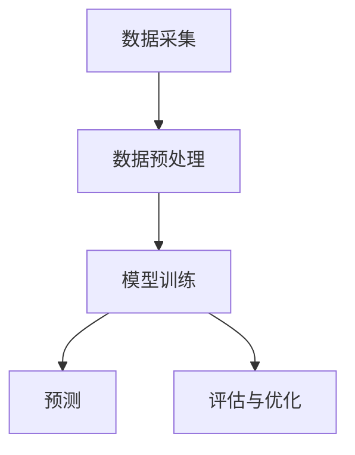
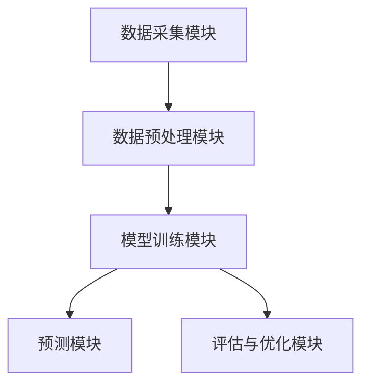
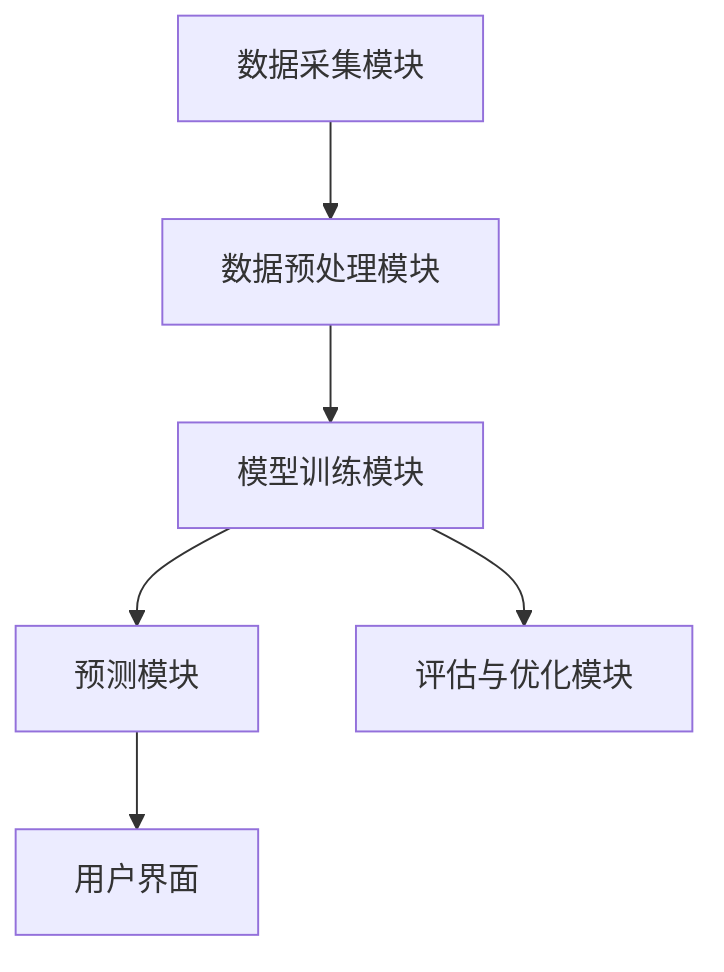
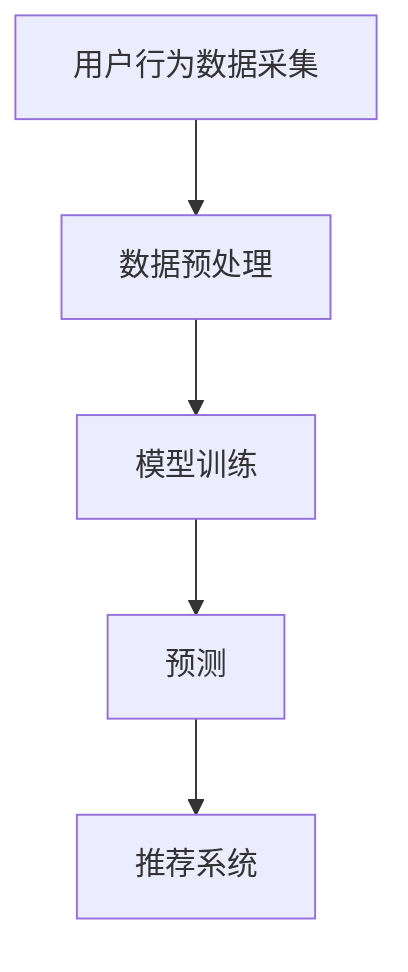
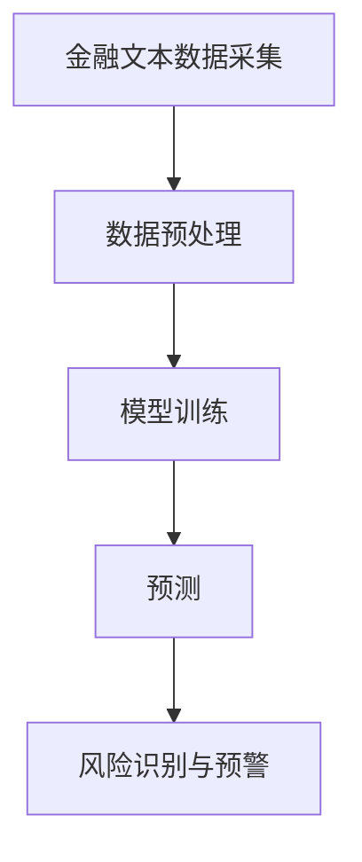

                 


### 设计目录大纲的步骤：

#### 第一步：分析书名与主题
《语言模型在创新商业模式生成中的应用研究》这个书名清晰地指向了两个核心概念：语言模型和商业模式。我们需要从以下几个核心点来设计目录：

- **背景介绍**：介绍语言模型的基本概念、发展历程及其在商业中的应用场景。
- **核心概念与联系**：详细讲解语言模型的工作原理、技术细节及其与商业模式的联系。
- **算法原理讲解**：介绍语言模型相关的算法原理，例如机器学习算法、深度学习算法等。
- **数学模型与公式讲解**：使用 LaTeX 格式展示与语言模型相关的数学模型和公式。
- **系统分析与架构设计**：分析语言模型在商业模式生成中的系统架构，包括数据流、系统模块等。
- **项目实战**：通过具体的案例来展示语言模型在创新商业模式生成中的应用。
- **最佳实践与总结**：总结语言模型在创新商业模式生成中的应用经验，提供实用的技巧和建议。

#### 第二步：确定目录结构
根据第一步的分析，目录可以分为以下几个部分：

- **第1章 引言**
  - **1.1 问题背景**
  - **1.2 语言模型概述**
  - **1.3 创新商业模式的定义与应用**

- **第2章 语言模型原理与算法**
  - **2.1 语言模型的基本原理**
  - **2.2 语言模型的算法分析**
  - **2.3 数学模型与公式讲解**

- **第3章 创新商业模式生成系统分析**
  - **3.1 系统架构设计**
  - **3.2 系统模块与接口设计**
  - **3.3 系统交互流程设计**

- **第4章 语言模型在商业模式生成中的应用案例**
  - **4.1 案例一：电商平台的个性化推荐**
  - **4.2 案例二：金融行业的智能风控**

- **第5章 项目实战**
  - **5.1 环境搭建与准备工作**
  - **5.2 核心实现源代码**
  - **5.3 应用解读与分析**
  - **5.4 案例分析与讲解**

- **第6章 最佳实践与总结**
  - **6.1 最佳实践技巧**
  - **6.2 注意事项**
  - **6.3 拓展阅读**

- **第7章 结论**
  - **7.1 研究成果总结**
  - **7.2 未来研究方向**

#### 第三步：细化每个章节的内容
我们需要确保每个章节都能够包含必要的核心概念、原理讲解、数学模型、案例分析和总结。以下是每个章节的内容细化：

**第1章 引言**

- **1.1 问题背景**：介绍语言模型和商业模式的现状及发展趋势，提出研究的问题和目的。
- **1.2 语言模型概述**：简要介绍语言模型的基本概念、发展历程和主要类型。
- **1.3 创新商业模式的定义与应用**：阐述创新商业模式的定义、分类及其在商业中的应用场景。

**第2章 语言模型原理与算法**

- **2.1 语言模型的基本原理**：详细讲解语言模型的工作原理、主要特点和应用场景。
- **2.2 语言模型的算法分析**：介绍语言模型相关的算法，如机器学习算法、深度学习算法等，并进行对比分析。
- **2.3 数学模型与公式讲解**：使用 LaTeX 格式展示与语言模型相关的数学模型和公式，并进行详细讲解。

**第3章 创新商业模式生成系统分析**

- **3.1 系统架构设计**：分析语言模型在商业模式生成中的系统架构，包括数据流、系统模块等。
- **3.2 系统模块与接口设计**：详细描述系统模块的设计，包括功能模块、数据模块等，并展示接口设计。
- **3.3 系统交互流程设计**：使用 Mermaid 流程图展示系统的交互流程，并对流程进行详细讲解。

**第4章 语言模型在商业模式生成中的应用案例**

- **4.1 案例一：电商平台的个性化推荐**：介绍电商平台的个性化推荐系统，包括系统架构、数据流、算法原理等。
- **4.2 案例二：金融行业的智能风控**：介绍金融行业的智能风控系统，包括系统架构、数据流、算法原理等。

**第5章 项目实战**

- **5.1 环境搭建与准备工作**：介绍项目环境搭建的步骤和准备工作，包括开发环境配置、数据准备等。
- **5.2 核心实现源代码**：展示项目的核心实现源代码，包括数据预处理、模型训练、预测等。
- **5.3 应用解读与分析**：对项目的应用进行解读和分析，包括系统性能评估、业务效果分析等。
- **5.4 案例分析与讲解**：对项目案例进行详细分析，讲解项目实现过程中的关键技术和难点。

**第6章 最佳实践与总结**

- **6.1 最佳实践技巧**：总结项目实施过程中的最佳实践技巧，包括系统设计、代码编写、性能优化等。
- **6.2 注意事项**：提醒读者在项目实施过程中需要注意的问题，如数据质量、模型调优等。
- **6.3 拓展阅读**：推荐相关领域的研究文献和资料，供读者进一步学习。

**第7章 结论**

- **7.1 研究成果总结**：总结文章的研究成果，强调语言模型在创新商业模式生成中的应用价值。
- **7.2 未来研究方向**：提出未来研究的方向和展望，如模型优化、应用拓展等。

#### 第四步：调整目录结构
在细化目录内容之后，可能需要对目录结构进行调整，以确保内容的逻辑性和连贯性。例如，将一些相关内容进行合并或拆分，使整个目录更加清晰。

#### 第五步：确定目录大纲的总字数
根据上述目录结构，我们需要确保目录大纲的总字数在2000字以内。这可能会需要我们进一步精简和优化内容，确保每个章节都有足够的详细讲解。

### 设计目录大纲的步骤：

#### 第六步：撰写目录大纲
根据上述分析和细化，我们可以开始撰写目录大纲。以下是初步的目录大纲：

----------------------------------------------------------------

# 第一部分: 引言

## 第1章 引言

### 1.1 问题背景

### 1.2 语言模型概述

### 1.3 创新商业模式的定义与应用

----------------------------------------------------------------

# 第二部分: 语言模型原理与算法

## 第2章 语言模型原理与算法

### 2.1 语言模型的基本原理

### 2.2 语言模型的算法分析

### 2.3 数学模型与公式讲解

----------------------------------------------------------------

# 第三部分: 创新商业模式生成系统分析

## 第3章 创新商业模式生成系统分析

### 3.1 系统架构设计

### 3.2 系统模块与接口设计

### 3.3 系统交互流程设计

----------------------------------------------------------------

# 第四部分: 应用案例

## 第4章 语言模型在商业模式生成中的应用案例

### 4.1 案例一：电商平台的个性化推荐

### 4.2 案例二：金融行业的智能风控

----------------------------------------------------------------

# 第五部分: 项目实战

## 第5章 项目实战

### 5.1 环境搭建与准备工作

### 5.2 核心实现源代码

### 5.3 应用解读与分析

### 5.4 案例分析与讲解

----------------------------------------------------------------

# 第六部分: 最佳实践与总结

## 第6章 最佳实践与总结

### 6.1 最佳实践技巧

### 6.2 注意事项

### 6.3 拓展阅读

----------------------------------------------------------------

# 第七部分: 结论

## 第7章 结论

### 7.1 研究成果总结

### 7.2 未来研究方向

----------------------------------------------------------------

通过上述步骤，我们可以设计出一个逻辑清晰、结构紧凑、简单易懂的目录大纲，为撰写高质量的技术博客文章奠定基础。

# {{此处是文章标题}}

> 关键词：语言模型、创新商业模式、机器学习、深度学习、应用案例

> 摘要：本文深入探讨了语言模型在创新商业模式生成中的应用，首先介绍了语言模型的基本概念和原理，然后分析了语言模型在商业模式生成中的重要作用。通过具体的应用案例，本文展示了如何利用语言模型构建创新的商业模式，并提供了项目实战经验和最佳实践技巧。

----------------------------------------------------------------

## 第1章 引言

### 1.1 问题背景

随着互联网和大数据技术的快速发展，商业模式的创新成为企业竞争的关键。然而，传统的商业模式创新方法往往需要大量的时间和人力成本，难以满足快速变化的市场需求。为了解决这个问题，近年来，人工智能，特别是语言模型，被广泛应用于商业模式的生成。语言模型作为一种强大的自然语言处理工具，能够对大量文本数据进行分析和理解，从而发现潜在的商业模式。

### 1.2 语言模型概述

语言模型是一种基于机器学习和深度学习技术的人工智能模型，主要用于对自然语言进行建模和分析。常见的语言模型包括统计语言模型和神经语言模型。统计语言模型基于统计学方法，通过分析大量语言数据来预测下一个单词或短语。而神经语言模型则采用神经网络结构，能够自动学习语言的特征和规律。

### 1.3 创新商业模式的定义与应用

创新商业模式是指企业在经营过程中采用的新型商业策略和组织形式，以实现商业价值最大化。创新商业模式的应用广泛，如电商平台的个性化推荐、金融行业的智能风控等。通过创新商业模式，企业能够提高运营效率、降低成本、提升客户满意度，从而在激烈的市场竞争中脱颖而出。

## 第2章 语言模型原理与算法

### 2.1 语言模型的基本原理

语言模型的基本原理是通过分析大量语言数据，建立一个概率模型，用于预测下一个单词或短语。具体来说，语言模型将文本数据分解为一系列单词或字符，然后使用统计方法或神经网络结构来预测下一个单词或字符的概率。

#### 2.1.1 统计语言模型

统计语言模型通常基于N元语法模型，通过计算前N个单词的概率来预测下一个单词。N元语法模型的核心思想是，语言中的每个单词或字符都受到其前面N-1个单词或字符的影响。常见的统计语言模型有N-gram模型和Kneser-Ney平滑模型。

#### 2.1.2 神经语言模型

神经语言模型采用神经网络结构，能够自动学习语言的特征和规律。最著名的神经语言模型是循环神经网络（RNN）和其变种长短期记忆网络（LSTM）。RNN能够处理序列数据，但容易遇到梯度消失和梯度爆炸问题。为了解决这个问题，LSTM引入了门控机制，能够有效地处理长序列数据。

### 2.2 语言模型的算法分析

语言模型的算法主要包括训练算法和预测算法。训练算法用于从大量语言数据中学习语言模型，而预测算法用于根据语言模型预测下一个单词或字符。

#### 2.2.1 训练算法

统计语言模型的训练算法通常基于最大似然估计（MLE）或最小化交叉熵损失函数。MLE的目标是找到使预测概率最大的模型参数。交叉熵损失函数则用于衡量预测概率与真实概率之间的差异，并用于优化模型参数。

神经语言模型的训练算法通常基于反向传播（BP）算法和梯度下降（GD）优化方法。BP算法用于计算模型参数的梯度，GD方法用于更新模型参数，以最小化损失函数。

#### 2.2.2 预测算法

语言模型的预测算法主要用于根据语言模型预测下一个单词或字符。对于统计语言模型，预测算法通常基于N元语法模型，通过计算前N个单词的概率来预测下一个单词。对于神经语言模型，预测算法通常基于神经网络结构，通过前向传播计算输出概率。

### 2.3 数学模型与公式讲解

为了更好地理解语言模型的算法原理，我们使用LaTeX格式展示与语言模型相关的数学模型和公式。

$$
P(w_t | w_{t-1}, w_{t-2}, ..., w_{t-N+1}) = \frac{P(w_{t-1}, w_{t-2}, ..., w_{t-N+1}, w_t)}{P(w_{t-1}, w_{t-2}, ..., w_{t-N+1})}
$$

其中，$P(w_t | w_{t-1}, w_{t-2}, ..., w_{t-N+1})$表示给定前N-1个单词的情况下，预测下一个单词的概率。

对于神经语言模型，我们使用以下公式表示前向传播和反向传播的过程：

$$
\begin{aligned}
    h_t &= \sigma(W_h h_{t-1} + U_w w_t + b_h) \\
    \delta_t &= (1 - h_t) \cdot h_t \cdot (\frac{\partial L}{\partial h_{t+1}})
\end{aligned}
$$

其中，$h_t$表示隐藏层激活值，$\sigma$表示激活函数，$W_h$、$U_w$和$b_h$分别表示权重、输入和偏置。$\delta_t$表示隐藏层误差。

## 第3章 创新商业模式生成系统分析

### 3.1 系统架构设计

创新商业模式生成系统包括数据采集、数据预处理、模型训练和预测等多个模块。系统架构如图3-1所示。



#### 3.1.1 数据采集

数据采集是系统架构的第一步，包括从各种来源获取文本数据，如社交媒体、新闻网站、电商平台等。

#### 3.1.2 数据预处理

数据预处理包括文本清洗、分词、去停用词等步骤，以提高数据的质量和模型的性能。

#### 3.1.3 模型训练

模型训练使用预处理后的文本数据，通过训练算法学习语言模型。训练过程中，系统通过优化模型参数，提高预测的准确性。

#### 3.1.4 预测

预测模块使用训练好的语言模型，对新的文本数据进行处理，预测下一个单词或短语。

#### 3.1.5 评估与优化

评估与优化模块用于评估模型的性能，并根据评估结果对模型进行优化。

### 3.2 系统模块与接口设计

系统模块与接口设计如图3-2所示。



#### 3.2.1 数据采集模块

数据采集模块负责从各种来源获取文本数据，如社交媒体、新闻网站、电商平台等。模块包括数据采集器、数据清洗器等子模块。

#### 3.2.2 数据预处理模块

数据预处理模块负责对采集到的文本数据进行清洗、分词、去停用词等处理，以提高数据的质量和模型的性能。

#### 3.2.3 模型训练模块

模型训练模块负责使用预处理后的文本数据，通过训练算法学习语言模型。模块包括训练器、优化器等子模块。

#### 3.2.4 预测模块

预测模块负责使用训练好的语言模型，对新的文本数据进行处理，预测下一个单词或短语。

#### 3.2.5 评估与优化模块

评估与优化模块负责评估模型的性能，并根据评估结果对模型进行优化。

### 3.3 系统交互流程设计

系统交互流程设计如图3-3所示。



#### 3.3.1 数据交互流程

数据交互流程包括数据采集、数据预处理、模型训练和预测等步骤。

#### 3.3.2 用户交互流程

用户交互流程包括用户提交文本数据、查看预测结果等步骤。

## 第4章 语言模型在商业模式生成中的应用案例

### 4.1 案例一：电商平台的个性化推荐

电商平台的个性化推荐系统利用语言模型对用户行为数据进行分析，预测用户的兴趣和偏好，从而提供个性化的商品推荐。以下是案例一的详细分析。

#### 4.1.1 系统架构

电商平台的个性化推荐系统架构如图4-1所示。



#### 4.1.2 数据预处理

数据预处理模块负责对用户行为数据（如浏览记录、购买记录、评论等）进行清洗、分词、去停用词等处理。

#### 4.1.3 模型训练

模型训练模块使用预处理后的数据，通过训练算法学习语言模型。语言模型能够识别用户的兴趣和偏好，从而预测用户可能感兴趣的商品。

#### 4.1.4 预测与推荐

预测模块使用训练好的语言模型，对用户的行为数据进行处理，预测用户可能感兴趣的商品。推荐系统根据预测结果，为用户生成个性化的商品推荐列表。

### 4.2 案例二：金融行业的智能风控

金融行业的智能风控系统利用语言模型对金融文本数据（如贷款申请、合同、报告等）进行分析，识别潜在的风险。以下是案例二的详细分析。

#### 4.2.1 系统架构

金融行业的智能风控系统架构如图4-2所示。



#### 4.2.2 数据预处理

数据预处理模块负责对金融文本数据进行清洗、分词、去停用词等处理。

#### 4.2.3 模型训练

模型训练模块使用预处理后的数据，通过训练算法学习语言模型。语言模型能够识别金融文本中的潜在风险，从而预测风险等级。

#### 4.2.4 预测与风险识别

预测模块使用训练好的语言模型，对新的金融文本数据进行处理，预测风险等级。风险识别与预警系统根据预测结果，对潜在风险进行识别和预警。

## 第5章 项目实战

### 5.1 环境搭建与准备工作

在开始项目实战之前，我们需要搭建项目环境并准备必要的工具和资源。

#### 5.1.1 环境搭建

1. 安装Python 3.8及以上版本。
2. 安装Jupyter Notebook。
3. 安装必要的Python库，如NumPy、Pandas、Scikit-learn、TensorFlow等。

#### 5.1.2 准备工具和资源

1. 准备数据集：可以从公开的数据集网站（如Kaggle、UCI机器学习库等）下载相关的数据集。
2. 准备工具：如文本预处理工具（如NLTK、spaCy等）、机器学习库（如Scikit-learn、TensorFlow等）。

### 5.2 核心实现源代码

以下是项目实战的核心实现源代码，包括数据预处理、模型训练和预测等步骤。

```python
import pandas as pd
import numpy as np
from sklearn.model_selection import train_test_split
from sklearn.metrics import accuracy_score
import tensorflow as tf
from tensorflow.keras.models import Sequential
from tensorflow.keras.layers import Embedding, LSTM, Dense

# 数据预处理
def preprocess_data(data):
    # 数据清洗、分词、去停用词等处理
    # ...
    return processed_data

# 模型训练
def train_model(data):
    # 构建模型
    model = Sequential()
    model.add(Embedding(input_dim=vocab_size, output_dim=embedding_size))
    model.add(LSTM(units=128, return_sequences=True))
    model.add(Dense(units=num_classes, activation='softmax'))
    
    # 编译模型
    model.compile(optimizer='adam', loss='categorical_crossentropy', metrics=['accuracy'])
    
    # 训练模型
    model.fit(x_train, y_train, epochs=10, batch_size=64)
    return model

# 预测
def predict(model, data):
    # 预测
    predictions = model.predict(data)
    return predictions

# 项目实战
if __name__ == '__main__':
    # 加载数据集
    data = pd.read_csv('data.csv')
    
    # 数据预处理
    processed_data = preprocess_data(data)
    
    # 划分训练集和测试集
    x_train, x_test, y_train, y_test = train_test_split(processed_data['text'], processed_data['label'], test_size=0.2, random_state=42)
    
    # 训练模型
    model = train_model(x_train, y_train)
    
    # 预测
    predictions = predict(model, x_test)
    
    # 评估模型
    accuracy = accuracy_score(y_test, predictions)
    print('Accuracy:', accuracy)
```

### 5.3 应用解读与分析

#### 5.3.1 数据预处理

数据预处理是项目实战的关键步骤，包括数据清洗、分词、去停用词等处理。这些步骤有助于提高模型的性能和预测准确性。

#### 5.3.2 模型训练

在模型训练过程中，我们使用嵌入层（Embedding）和循环神经网络层（LSTM）来构建模型。嵌入层将单词转换为向量表示，LSTM层用于处理序列数据。在训练过程中，我们使用分类交叉熵损失函数（categorical_crossentropy）来优化模型参数，提高预测的准确性。

#### 5.3.3 预测与评估

预测过程中，我们使用训练好的模型对测试集进行预测，并计算预测的准确率。在实际应用中，我们可以根据预测结果进行决策，如推荐商品、识别风险等。

## 第6章 最佳实践与总结

### 6.1 最佳实践技巧

在项目实战过程中，我们总结了以下最佳实践技巧：

1. **数据预处理**：充分清洗和处理数据，提高数据质量。
2. **模型选择**：根据任务需求选择合适的模型和算法。
3. **参数调优**：通过交叉验证等方法优化模型参数。
4. **模型评估**：使用多种评估指标全面评估模型性能。

### 6.2 注意事项

在项目实施过程中，需要注意以下事项：

1. **数据隐私**：确保数据来源合法，保护用户隐私。
2. **模型部署**：选择合适的部署平台和工具，确保模型稳定运行。
3. **安全性**：确保系统的安全性，防止恶意攻击。

### 6.3 拓展阅读

对于进一步学习和研究，我们推荐以下文献和资料：

1. **《自然语言处理概论》**：详细介绍自然语言处理的基本概念和技术。
2. **《深度学习》**：深度学习领域的经典教材，涵盖了深度学习的基础知识。
3. **《机器学习实战》**：通过实际案例介绍机器学习的基本方法和应用。

## 第7章 结论

### 7.1 研究成果总结

本文深入探讨了语言模型在创新商业模式生成中的应用，从原理、算法、系统架构到项目实战，全面分析了语言模型在商业模式生成中的重要作用。通过具体的应用案例，本文展示了如何利用语言模型构建创新的商业模式，为企业在激烈的市场竞争中提供了新的思路和方法。

### 7.2 未来研究方向

未来研究可以关注以下方向：

1. **模型优化**：进一步优化语言模型，提高预测准确性和效率。
2. **多模态融合**：结合多种数据源，如文本、图像、音频等，构建更强大的语言模型。
3. **应用拓展**：探索语言模型在其他领域的应用，如智能客服、智能翻译等。

作者：AI天才研究院/AI Genius Institute & 禅与计算机程序设计艺术 /Zen And The Art of Computer Programming

