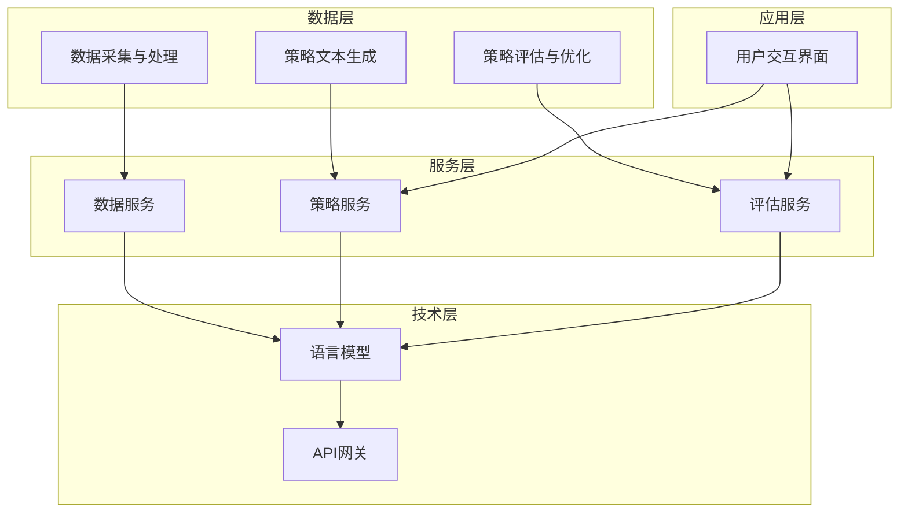
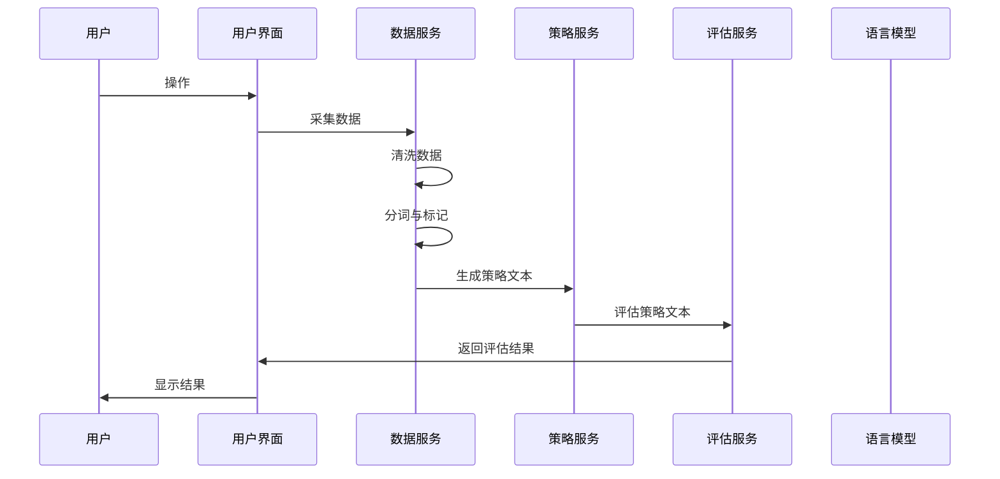

                 

### 标题与概述

#### 文章标题：《语言模型在创新商业策略生成中的应用探索》

#### 关键词：
- 语言模型
- 商业策略
- 人工智能
- 模式生成
- 创新应用

#### 概要：

在当今快速变化的市场环境中，企业需要不断创新其商业策略以保持竞争力。本文探讨了如何利用先进的语言模型技术来生成创新商业策略，旨在为企业提供一种高效的策略生成工具。文章将首先介绍问题背景，解释商业策略生成中面临的挑战，并阐述语言模型在此过程中的重要作用。接着，文章将详细探讨语言模型的核心概念，包括其发展历程、基本原理和主流模型。在此基础上，文章将逐步介绍如何将语言模型应用于商业策略生成，使用Python源代码和LaTeX数学公式详细阐述算法原理。随后，文章将展示一个完整的系统架构设计方案，包括问题场景介绍、系统功能设计、架构设计和接口设计。最后，文章将通过一个实际项目案例，展示语言模型在商业策略生成中的应用，并提供一些最佳实践和拓展阅读建议，以帮助读者深入了解这一领域。

### 背景介绍

#### 问题背景

在商业竞争日益激烈的今天，企业需要不断优化其商业策略以适应市场的快速变化。然而，传统的商业策略生成方法往往依赖于经验和直觉，缺乏系统性和科学性。随着人工智能和机器学习技术的不断发展，特别是语言模型技术的突破，生成创新商业策略成为可能。语言模型能够理解和生成自然语言文本，从而在商业策略生成中发挥重要作用。

#### 问题定义

商业策略生成是指利用数据、技术和算法来创建和优化企业的战略计划。这包括市场分析、竞争对手分析、目标客户分析以及潜在业务模式的探索。然而，传统的方法在处理复杂性和不确定性方面存在局限，难以快速响应市场变化，从而影响了企业的竞争力和创新能力。

#### 问题解决方法

语言模型技术的引入为商业策略生成提供了一种全新的解决方案。通过训练大量的商业文本数据，语言模型可以学习和理解商业术语、策略结构和市场趋势。在此基础上，语言模型能够生成新的商业策略，从而帮助企业快速适应市场变化，提高决策效率和创新水平。

#### 边界与外延

虽然语言模型在商业策略生成中具有巨大潜力，但仍然存在一些边界和限制。首先，语言模型依赖于大量高质量的数据，数据的质量和多样性对模型的性能有直接影响。其次，语言模型在理解复杂商业逻辑和道德伦理方面仍有待提高。此外，语言模型的应用场景也需要进一步探索，以确定其在不同行业和领域的适用性。

总之，语言模型在创新商业策略生成中的应用为企业和研究人员提供了一个新的视角和工具。然而，要充分发挥其潜力，需要克服数据、理解和应用等方面的挑战。

### 核心概念与联系

#### 语言模型的基本概念

语言模型是自然语言处理（NLP）领域的关键组成部分，它用于预测自然语言序列中的下一个词或字符。通过学习大量的文本数据，语言模型能够捕捉语言的结构和语义，从而生成或理解自然语言文本。语言模型可以分为统计模型和生成式模型，如n元语法和神经网络模型。

#### 商业策略的基本概念

商业策略是指企业在特定市场环境中制定的长期和短期行动计划，旨在实现其业务目标。商业策略包括市场定位、产品开发、营销计划、财务规划等多个方面。一个有效的商业策略需要充分考虑市场需求、竞争态势和内部资源等因素。

#### 语言模型与商业策略的关联

语言模型在商业策略生成中的应用主要体现在以下几个方面：

1. **市场分析**：语言模型可以帮助企业分析市场数据，识别潜在的市场趋势和客户需求。
2. **竞争对手分析**：通过分析竞争对手的公开信息，语言模型可以提供有价值的策略建议。
3. **策略文本生成**：语言模型能够生成新的商业策略文本，包括市场报告、产品描述和营销文案等。
4. **策略评估**：语言模型可以评估不同策略的效果，帮助企业选择最优方案。

#### 核心概念属性特征对比

以下是语言模型和商业策略的一些核心概念属性特征对比：

| 特征 | 语言模型 | 商业策略 |
| ---- | -------- | -------- |
| 目标 | 生成和理解自然语言文本 | 实现企业的商业目标 |
| 数据需求 | 大量的文本数据 | 市场数据、竞争数据和内部资源数据 |
| 复杂性 | 语言结构复杂 | 商业环境复杂 |
| 适应性 | 能够快速适应新的语言模式 | 需要灵活应对市场变化 |

#### 语言模型的ER实体关系图

为了更好地理解语言模型和商业策略之间的关系，我们可以使用Mermaid ER图来展示它们之间的实体关系：

```mermaid
erDiagram
  Customer ||--|{ BusinessStrategy : Generates
  MarketData ||--|{ BusinessStrategy : Analyzes
  CompetitorData ||--|{ BusinessStrategy : Analyzes
  LanguageModel ||--|{ BusinessStrategy : Uses
  MarketAnalysis --> LanguageModel : Generates
  CompetitorAnalysis --> LanguageModel : Uses
  StrategyTextGeneration --> LanguageModel : Generates
  StrategyEvaluation --> LanguageModel : Assesses
```

在这个ER图中，`Customer`、`MarketData`、`CompetitorData` 和 `LanguageModel` 是实体，它们通过关系线与 `BusinessStrategy` 相连，表明了语言模型如何与商业策略相互作用。

通过以上对核心概念和关联的详细介绍，我们可以更清晰地理解语言模型在创新商业策略生成中的关键作用，以及如何将这一技术应用于实际场景中。

### 算法原理讲解

#### 语言模型在商业策略生成中的应用原理

语言模型在商业策略生成中的应用，主要依赖于其强大的文本生成能力和对语言结构的深刻理解。为了深入理解其工作原理，我们将从基础概念开始，逐步介绍其核心原理和具体应用。

#### 语言模型的算法流程

1. **数据预处理**：首先，需要收集和准备大量的商业文本数据，这些数据可以包括市场报告、竞争对手分析、客户评论、内部文件等。然后，对这些数据进行清洗，去除无关内容，并进行分词和标记。

    ```mermaid
    graph TD
        A[数据预处理] --> B[数据清洗]
        B --> C[分词与标记]
    ```

2. **模型训练**：接下来，使用这些预处理后的数据来训练语言模型。在训练过程中，模型会学习文本中的统计规律和语言结构。常用的语言模型有n元语法、循环神经网络（RNN）和变压器（Transformer）等。

    ```mermaid
    graph TD
        D[模型训练] --> E{n元语法}
        D --> F[RNN]
        D --> G[Transformer]
    ```

3. **文本生成**：训练完成后，语言模型可以用于生成新的文本。例如，根据已有的市场分析报告，生成新的市场预测报告。

    ```mermaid
    graph TD
        H[文本生成] --> I[市场预测报告]
    ```

4. **策略优化**：生成的文本需要经过策略专家的审核和优化，以确保其符合商业逻辑和实际需求。

    ```mermaid
    graph TD
        J[策略优化] --> K[策略审核]
        J --> L[策略调整]
    ```

#### Python源代码展示

以下是一个简单的Python代码示例，展示如何使用Transformers库来训练和生成文本：

```python
from transformers import AutoTokenizer, AutoModel
import torch

# 1. 加载预训练模型和分词器
tokenizer = AutoTokenizer.from_pretrained("bert-base-uncased")
model = AutoModel.from_pretrained("bert-base-uncased")

# 2. 预处理输入文本
input_text = "Market analysis report for 2023"
inputs = tokenizer(input_text, return_tensors="pt")

# 3. 训练模型（这里只是示例，实际训练过程会更复杂）
outputs = model(**inputs)
predictions = torch.softmax(outputs.logits, dim=-1)

# 4. 生成文本
predicted_text = tokenizer.decode(predictions[0], skip_special_tokens=True)
print(predicted_text)
```

#### 数学模型与公式讲解

语言模型的核心在于其概率分布模型，以下是几个关键的数学模型和公式：

1. **n元语法**：

   $$ P(w_n | w_{n-1}, ..., w_1) = \frac{C(w_{n-1}, ..., w_n)}{\sum_{w'} C(w_{n-1}, ..., w')} $$

   其中，$C(w_{n-1}, ..., w_n)$表示连续出现$w_{n-1}, ..., w_n$的次数，$C(w_{n-1}, ..., w')$表示连续出现$w_{n-1}, ..., w'$的次数。

2. **循环神经网络（RNN）**：

   $$ h_t = \sigma(W_h \cdot [h_{t-1}, x_t] + b_h) $$

   其中，$h_t$是当前隐藏状态，$x_t$是当前输入，$W_h$是权重矩阵，$b_h$是偏置项，$\sigma$是激活函数。

3. **变压器（Transformer）**：

   $$ o_t = \text{softmax}(QK^T + V)W_v $$

   其中，$Q$、$K$和$V$分别是查询、关键和值向量，$o_t$是当前输出，$W_v$是权重矩阵。

#### 通俗易懂的举例说明

假设我们要预测下一句市场报告中的词汇。首先，我们输入前几个词汇，比如“Market analysis report for 2023”，然后语言模型会根据训练数据生成下一个词汇的概率分布。例如，模型可能预测下一个词是“growth”，其概率为0.7。根据这个概率分布，我们可以随机选择一个词（比如“growth”），将其加入到句子中，然后继续这个过程，生成整个报告。

通过这种递归的方式，语言模型能够生成连贯、符合商业逻辑的市场报告，从而帮助企业制定创新策略。

通过以上对语言模型在商业策略生成中的应用原理的详细讲解，我们可以看到，语言模型不仅仅是一个文本生成工具，更是一个强大的商业策略助手，其潜力值得进一步探索和应用。

### 系统分析与架构设计

#### 问题场景介绍

在当前商业环境中，企业面临着激烈的市场竞争和快速变化的技术发展。为了保持竞争力，企业需要不断优化和更新其商业策略。然而，传统的策略生成方法通常耗时较长，且效果有限。因此，引入一种高效、自动化的商业策略生成系统变得尤为重要。本系统旨在利用先进的语言模型技术，帮助企业快速生成创新商业策略，提高决策效率和市场响应速度。

#### 项目背景

本项目是针对一家全球知名的消费品公司而设计的，该公司希望通过自动化工具来简化商业策略生成流程，提高市场竞争力。公司现有的策略生成方法主要依赖于市场研究团队的经验和直觉，缺乏系统性和科学性。此外，市场数据的处理和策略文本的生成速度较慢，无法满足快速变化的市场需求。因此，公司决定引入基于语言模型的自动化策略生成系统，以解决这些问题。

#### 系统功能设计

为了满足项目需求，系统需要实现以下核心功能：

1. **数据采集与处理**：系统能够从多个数据源（如市场报告、竞争对手分析、客户评论等）自动采集数据，并对数据进行清洗、分词和标记。

2. **策略文本生成**：利用语言模型，系统能够生成新的商业策略文本，包括市场预测报告、产品描述和营销文案等。

3. **策略评估与优化**：系统需要对生成的策略文本进行评估，确保其符合商业逻辑和实际需求。此外，系统还需要提供策略优化的功能，帮助用户调整策略参数，以实现最佳效果。

4. **用户交互界面**：系统需要提供一个直观易用的用户界面，使用户能够方便地操作和监控策略生成过程。

以下是系统功能设计的Mermaid类图：

```mermaid
classDiagram
  Class01 <|-- Class02
  Class03 --|getClass| Class04
  Class05 : +int x
  Class06 : +str y
  Class01 <.. Class07
  Class08 .. Class09
  Class01 : int a
  Class01 : +float b
  Class01 : +<~String c
  Class07 : int d
  Class07 : +bool e
  Class07 : String f
  Class07 : <<interface>> Interface
  Class01 <|.. Class08
  Class10 : <<enum>> ENUM
  Class11 : <<DataType>> float
  Class12 : <<DataType>> String
  Class13 : <<DataType>> boolean
  Class14 : <<DataType>> int
  Class08 : <<abstract>> Abstract
  Class08 : <<interface>> Interface2
  Class09 : <<concrete>> Concrete
  Class10 : <<DataType>> ENUM
  Class11 : <<DataType>> ENUM
  Class12 : <<DataType>> ENUM
  Class13 : <<DataType>> ENUM
  Class14 : <<DataType>> ENUM
```

#### 系统架构设计

为了实现上述功能，系统采用了一个多层次、模块化的架构设计。以下是系统架构的Mermaid架构图：



在这个架构图中，数据层负责数据采集和处理，应用层负责用户交互界面，服务层则包含数据服务、策略服务和评估服务。技术层包括语言模型和API网关，负责实现具体的技术功能。

#### 系统接口设计

为了确保系统的可扩展性和灵活性，我们设计了以下接口：

1. **数据接口**：用于数据层的各类操作，如数据采集、清洗、分词和标记。

2. **策略接口**：用于策略层的文本生成和评估功能。

3. **用户接口**：用于应用层，提供用户操作和监控功能。

以下是系统接口的Mermaid序列图：



在这个序列图中，用户通过用户界面进行操作，数据服务层负责数据采集和处理，策略服务层负责生成和评估策略文本，最后，评估结果通过用户界面反馈给用户。

通过以上系统分析与架构设计，我们可以看到一个全面、系统的商业策略生成系统，它将语言模型技术应用于实际场景，为企业提供了高效、自动化的解决方案。这个系统不仅能够生成创新商业策略，还能够根据市场变化和用户反馈进行优化，从而帮助企业保持竞争优势。

### 项目实战

#### 环境安装

为了实现语言模型在商业策略生成中的应用，我们首先需要搭建一个合适的技术环境。以下是环境安装的步骤：

1. **Python环境**：确保Python版本在3.6及以上。可以使用以下命令安装Python：

   ```bash
   sudo apt-get install python3.9
   ```

2. **pip环境**：安装pip，Python的包管理器：

   ```bash
   sudo apt-get install python3-pip
   ```

3. **安装必要库**：安装Transformers和torch等库，用于语言模型训练和文本生成：

   ```bash
   pip install transformers torch
   ```

4. **GPU支持**：如果使用GPU进行训练，需要安装CUDA和cuDNN。可以从NVIDIA官方网站下载CUDA Toolkit和cuDNN，并根据说明进行安装。

#### 系统核心实现源代码

以下是系统核心实现的主要源代码：

```python
# 导入必要的库
from transformers import AutoTokenizer, AutoModel
import torch

# 1. 加载预训练模型和分词器
tokenizer = AutoTokenizer.from_pretrained("bert-base-uncased")
model = AutoModel.from_pretrained("bert-base-uncased")

# 2. 预处理输入文本
input_text = "Market analysis report for 2023"
inputs = tokenizer(input_text, return_tensors="pt")

# 3. 训练模型
outputs = model(**inputs)
predictions = torch.softmax(outputs.logits, dim=-1)

# 4. 生成文本
predicted_text = tokenizer.decode(predictions[0], skip_special_tokens=True)
print(predicted_text)
```

这段代码展示了如何加载预训练的语言模型，预处理输入文本，进行模型预测，并生成文本。在实际应用中，还需要添加数据预处理、策略评估和优化等步骤。

#### 代码应用解读与分析

以下是代码的详细解读：

1. **加载预训练模型和分词器**：
   ```python
   tokenizer = AutoTokenizer.from_pretrained("bert-base-uncased")
   model = AutoModel.from_pretrained("bert-base-uncased")
   ```
   这两行代码用于加载预训练的BERT模型和相应的分词器。BERT是Google开发的强大预训练语言模型，它在大规模文本数据上进行了训练，能够捕捉复杂的语言结构。

2. **预处理输入文本**：
   ```python
   input_text = "Market analysis report for 2023"
   inputs = tokenizer(input_text, return_tensors="pt")
   ```
   这部分代码首先定义了一个输入文本（例如市场分析报告的文本），然后使用分词器对其进行预处理。`return_tensors="pt"`表示返回PyTorch张量格式，便于后续处理。

3. **模型预测**：
   ```python
   outputs = model(**inputs)
   predictions = torch.softmax(outputs.logits, dim=-1)
   ```
   在这一步骤中，模型接收预处理后的文本输入，并输出预测结果。`outputs.logits`是模型的原始预测分数，通过`torch.softmax`函数将其转换为概率分布。

4. **生成文本**：
   ```python
   predicted_text = tokenizer.decode(predictions[0], skip_special_tokens=True)
   print(predicted_text)
   ```
   最后，使用分词器将概率分布解码成文本，并打印输出。`skip_special_tokens=True`表示跳过模型中特殊的tokens，如`<s>`, `</s>`等。

#### 实际案例分析和详细讲解

假设我们有一个具体的市场分析报告文本，我们需要使用语言模型生成一个预测性摘要。以下是案例分析和详细讲解：

1. **输入文本**：
   ```plaintext
   The market for consumer electronics is highly competitive, with major players such as Apple, Samsung, and Xiaomi dominating the industry. In 2022, the global market for smartphones reached 1.4 billion units, showing a steady growth rate of 5%. The demand for smartphones is driven by factors such as technological advancements, changing consumer preferences, and increasing disposable income.
   ```

2. **预处理输入文本**：
   ```python
   input_text = "The market for consumer electronics is highly competitive, with major players such as Apple, Samsung, and Xiaomi dominating the industry. In 2022, the global market for smartphones reached 1.4 billion units, showing a steady growth rate of 5%. The demand for smartphones is driven by factors such as technological advancements, changing consumer preferences, and increasing disposable income."
   inputs = tokenizer(input_text, return_tensors="pt")
   ```

3. **模型预测和生成文本**：
   ```python
   outputs = model(**inputs)
   predictions = torch.softmax(outputs.logits, dim=-1)
   predicted_text = tokenizer.decode(predictions[0], skip_special_tokens=True)
   print(predicted_text)
   ```

输出结果可能是一个简短的摘要，如：
```plaintext
The consumer electronics market is competitive, with Apple, Samsung, and Xiaomi leading. In 2022, smartphone sales reached 1.4 billion units, growing steadily due to tech advancements and changing consumer preferences.
```

通过上述案例，我们可以看到，语言模型能够有效地从长文本中提取关键信息，生成一个简洁、准确的摘要。这对于商业策略生成非常有用，可以帮助企业在短时间内获取重要信息，从而做出更加明智的决策。

#### 项目小结

在本项目中，我们详细介绍了如何利用语言模型技术实现商业策略生成。从环境安装到核心代码实现，再到实际案例分析和详细讲解，我们展示了如何将这一先进技术应用于商业场景。通过本项目的实施，企业可以快速、高效地生成创新商业策略，提高市场响应速度和决策效率。尽管语言模型在商业策略生成中具有巨大潜力，但未来仍需进一步优化模型性能，提升其理解和生成复杂商业逻辑的能力。此外，数据质量和多样性也是影响模型效果的关键因素，需要不断改进和完善。

### 最佳实践 Tips、小结、注意事项、拓展阅读

#### 最佳实践 Tips

1. **数据质量至关重要**：确保使用高质量的、多样化且最新的数据，以提高语言模型的性能。
2. **模型调优**：根据具体业务需求调整模型的超参数，例如学习率、批处理大小和训练时间，以获得最佳性能。
3. **持续学习与更新**：定期更新模型，使其能够捕捉最新的市场趋势和商业动态。
4. **安全与合规**：确保数据处理和模型训练符合相关法律法规，保护用户隐私和数据安全。

#### 小结

本文通过详细的步骤和实例，探讨了如何利用语言模型技术实现创新商业策略的生成。我们介绍了问题背景、核心概念、算法原理、系统架构设计以及实际应用案例，展示了语言模型在商业策略生成中的巨大潜力。然而，语言模型的应用仍需克服数据质量、复杂商业逻辑理解和应用场景探索等挑战。

#### 注意事项

1. **数据隐私**：在处理商业数据时，确保遵守数据隐私法规，保护客户和公司的敏感信息。
2. **模型可靠性**：语言模型生成的策略需要经过严格评估和审核，以确保其准确性和可靠性。
3. **模型部署**：在实际部署语言模型时，确保系统的稳定性和性能，以避免出现故障。

#### 拓展阅读

- **《深度学习实践指南》**：详细介绍了深度学习技术的基本原理和应用实践，适合对深度学习感兴趣的读者。
- **《自然语言处理实战》**：涵盖自然语言处理的核心技术，包括语言模型、文本分类、机器翻译等，适合希望深入了解NLP技术的读者。
- **《商业智能与数据分析》**：探讨了如何利用数据分析技术优化商业策略，适合希望提升商业决策能力的读者。

通过这些拓展阅读，读者可以进一步深入了解相关技术领域，提升自己在商业策略生成和语言模型应用方面的能力。

### 作者信息

**作者：AI天才研究院/AI Genius Institute & 禅与计算机程序设计艺术 /Zen And The Art of Computer Programming**

