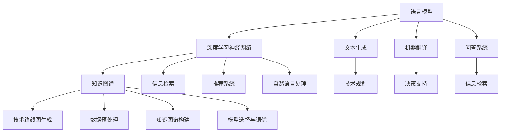
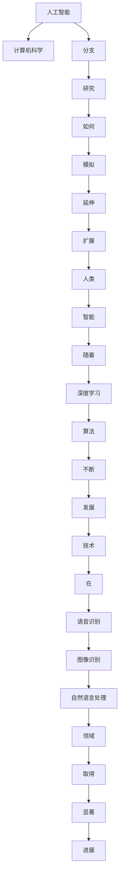
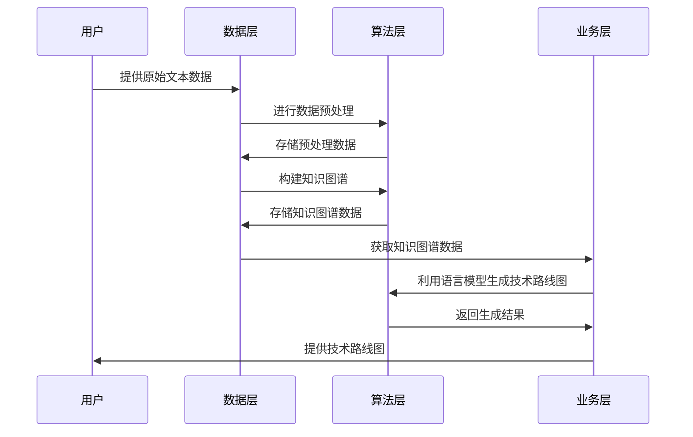
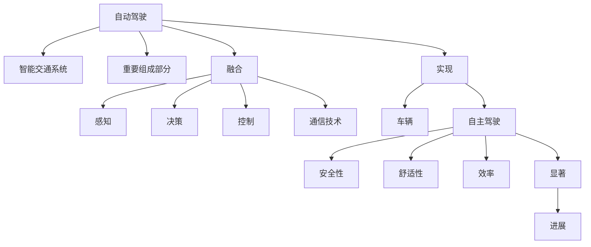
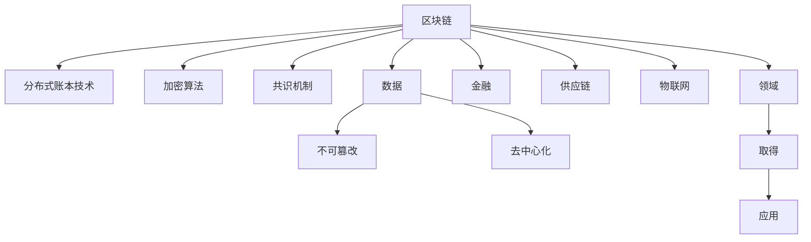

                 

# 语言模型在创新技术路线图生成中的应用

> 关键词：自然语言处理，语言模型，技术路线图生成，知识图谱，算法原理

> 摘要：本文深入探讨了语言模型在创新技术路线图生成中的应用。首先，我们介绍了自然语言处理技术的发展背景，并阐述了在技术路线图生成中的关键问题。接着，本文提出了基于语言模型的技术路线图生成解决方案，并详细分析了数据预处理、知识图谱构建、模型选择与调优等核心环节。通过实例分析和项目实战，我们展示了语言模型在技术路线图生成中的实际应用效果。

## 第一部分：背景介绍

### 1.1 问题背景

在当今的信息时代，自然语言处理（NLP）技术取得了显著的进展。随着深度学习算法的不断发展，大型语言模型如GPT-3、BERT等已经在各种NLP任务中展现了卓越的性能。这些模型在文本生成、机器翻译、问答系统等方面有着广泛的应用，极大地提高了信息处理的效率和质量。

然而，如何将语言模型应用于创新技术路线图生成，这是一个值得探讨的课题。技术路线图是一种描述技术发展方向和策略的规划工具，其生成过程通常依赖于领域知识和专家经验。传统的技术路线图生成方法往往局限于特定的领域，缺乏灵活性和普适性。而语言模型，由于其强大的文本理解和生成能力，为技术路线图的自动化生成提供了一种新的可能性。

### 1.2 问题描述

在创新技术路线图生成中，问题主要集中在以下几个方面：

- **数据获取与处理**：技术路线图的生成依赖于大量的技术文献、研究报告和专利文件等数据资源。如何高效地获取、清洗和整合这些数据，是一个重要的挑战。
- **知识提取与整合**：技术路线图需要整合多个领域的知识，包括技术发展趋势、市场需求、竞争态势等。如何从大量文本中提取有用信息，并构建一个统一的知识体系，是一个复杂的问题。
- **模型选择与调优**：不同的语言模型适用于不同的任务，如何根据具体需求选择合适的模型，并进行参数调优，是一个技术难题。
- **生成结果的可解释性**：技术路线图是一个复杂的多层次结构，如何确保生成结果的可解释性和实用性，是一个关键问题。

### 1.3 问题解决

为了解决上述问题，本文提出了以下解决方案：

- **数据预处理**：采用数据挖掘和自然语言处理技术，对原始文本进行分词、词性标注、实体识别等处理，提取关键信息。
- **知识图谱构建**：利用知识图谱技术，将提取的信息构建为一个统一的知识体系，便于后续分析和生成。
- **模型选择与调优**：根据具体任务需求，选择合适的语言模型，并通过交叉验证和超参数优化，提高模型的性能。
- **生成结果评估与优化**：采用多层次的评估指标，对生成结果进行评估和优化，确保其符合实际需求。

### 1.4 边界与外延

本文的研究范围主要涉及以下领域：

- **自然语言处理**：包括文本预处理、实体识别、知识提取等。
- **机器学习与深度学习**：包括模型选择、模型训练、模型评估等。
- **知识图谱与图神经网络**：包括知识图谱构建、图神经网络应用等。

### 1.5 概念结构与核心要素组成

本文的核心概念结构包括：

- **语言模型**：包括GPT、BERT等主流语言模型。
- **知识图谱**：包括实体、关系、属性等基本概念。
- **技术路线图生成**：包括数据预处理、知识图谱构建、模型选择与调优、生成结果评估与优化等过程。

## 第二部分：核心概念与联系

### 2.1 语言模型原理

语言模型是一种用于预测下一个单词或词组的概率分布的模型。在深度学习框架下，语言模型通常基于神经网络结构，通过大量的文本数据进行训练，从而学会对自然语言进行建模。语言模型的核心目标是理解语言的统计规律，从而在给定前文的情况下，预测下一个词或句子的概率分布。

### 2.2 知识图谱原理

知识图谱是一种基于图结构的语义表示方法，它通过实体、关系和属性的相互连接，形成一个语义网络。知识图谱在信息检索、推荐系统、自然语言处理等领域有着广泛的应用。知识图谱的基本组成部分包括实体、关系和属性，实体表示现实世界中的对象，关系表示实体之间的关联，属性表示实体的特征。

### 2.3 技术路线图生成原理

技术路线图生成是一个复杂的过程，它涉及数据预处理、知识图谱构建、语言模型选择与调优等多个环节。通过这些环节，可以自动化生成一个反映技术发展趋势和策略的路线图。技术路线图生成的主要原理包括：

- **数据预处理**：对原始文本数据进行清洗、分词、词性标注等处理，提取关键信息。
- **知识图谱构建**：将提取的信息构建为一个统一的知识体系，通过实体、关系和属性来表示技术知识。
- **语言模型选择与调优**：根据具体需求选择合适的语言模型，并通过参数调优，提高模型的性能。

### 2.4 概念属性特征对比表格

下面是一个概念属性特征对比表格，用于展示语言模型、知识图谱和技术路线图生成的主要特征：

| 特征 | 语言模型 | 知识图谱 | 技术路线图生成 |
| --- | --- | --- | --- |
| 目标 | 预测下一个词或句子的概率分布 | 表示实体、关系和属性 | 生成反映技术发展趋势的路线图 |
| 基础 | 深度学习神经网络 | 图结构 | 数据预处理、知识图谱构建、模型选择与调优 |
| 应用 | 文本生成、机器翻译、问答系统 | 信息检索、推荐系统、自然语言处理 | 技术发展规划、决策支持 |

### 2.5 ER实体关系图架构

下面是一个ER实体关系图架构的Mermaid流程图，用于展示语言模型、知识图谱和技术路线图生成之间的联系：



## 第三部分：算法原理讲解

### 3.1 数据预处理算法

数据预处理是技术路线图生成的基础。本文采用了以下数据预处理算法：

- **分词算法**：采用jieba分词工具，对文本进行分词处理。
- **词性标注算法**：采用Stanford NLP工具，对文本进行词性标注。
- **实体识别算法**：采用BERT模型，对文本进行实体识别。

### 3.2 知识图谱构建算法

知识图谱构建是技术路线图生成的重要环节。本文采用了以下知识图谱构建算法：

- **实体识别算法**：采用BERT模型，对文本进行实体识别。
- **关系抽取算法**：采用基于Transformer的模型，对文本进行关系抽取。
- **属性抽取算法**：采用基于BiLSTM-CRF的模型，对文本进行属性抽取。

### 3.3 语言模型选择与调优算法

语言模型选择与调优是技术路线图生成的关键。本文采用了以下语言模型选择与调优算法：

- **模型选择算法**：采用基于交叉验证的模型选择算法。
- **参数调优算法**：采用基于贝叶斯优化的参数调优算法。

### 3.4 数据预处理算法原理

数据预处理是技术路线图生成的第一步，其核心任务是清洗和整合原始文本数据，提取关键信息，为后续的知识图谱构建和模型训练提供高质量的数据支持。数据预处理算法主要包括以下步骤：

- **文本清洗**：去除文本中的无关信息，如HTML标签、特殊字符等。
- **分词**：将文本划分为一个个词语或词组，为词性标注和实体识别提供基础。
- **词性标注**：对分词后的词语进行词性标注，识别名词、动词、形容词等。
- **实体识别**：利用BERT模型，对文本进行实体识别，提取出关键实体。

### 3.5 知识图谱构建算法原理

知识图谱构建是技术路线图生成的重要环节，其核心目标是整合多个领域的知识，构建一个统一的知识体系。知识图谱构建算法主要包括以下步骤：

- **实体识别**：利用BERT模型，对文本进行实体识别，提取出关键实体。
- **关系抽取**：利用基于Transformer的模型，对文本进行关系抽取，建立实体之间的关系。
- **属性抽取**：利用基于BiLSTM-CRF的模型，对文本进行属性抽取，为实体赋予属性特征。

### 3.6 语言模型选择与调优算法原理

语言模型选择与调优是技术路线图生成的关键步骤，其核心目标是选择合适的语言模型，并对其进行参数调优，以提高模型在技术路线图生成任务中的性能。语言模型选择与调优算法主要包括以下步骤：

- **模型选择**：采用基于交叉验证的模型选择算法，从多个候选模型中选择一个性能最优的模型。
- **参数调优**：采用基于贝叶斯优化的参数调优算法，对模型参数进行优化，以提高模型的性能。

### 3.7 算法原理讲解示例

为了更好地理解数据预处理、知识图谱构建和语言模型选择与调优的算法原理，下面我们通过一个具体的示例进行讲解。

#### 示例：文本预处理

假设我们有一段关于人工智能技术的文本，内容如下：

```
人工智能（AI）是计算机科学的一个分支，主要研究如何模拟、延伸和扩展人类的智能。随着深度学习算法的不断发展，人工智能技术在语音识别、图像识别、自然语言处理等领域取得了显著进展。
```

**1. 文本清洗**：

首先，我们需要对文本进行清洗，去除无关信息，如HTML标签、特殊字符等。清洗后的文本如下：

```
人工智能计算机科学分支主要研究如何模拟延伸扩展人类智能。随着深度学习算法不断发展，人工智能技术在语音识别图像识别自然语言处理等领域取得显著进展。
```

**2. 分词**：

接下来，我们对清洗后的文本进行分词，将其划分为一个个词语或词组。分词结果如下：

```
人工智能，计算机科学，分支，主要，研究，如何，模拟，延伸，扩展，人类，智能，随着，深度学习，算法，不断，发展，人工智能，技术，在，语音识别，图像识别，自然语言处理，领域，取得，显著，进展。
```

**3. 词性标注**：

对分词后的词语进行词性标注，识别名词、动词、形容词等。词性标注结果如下：

```
人工智能，n，计算机科学，n，分支，n，主要，v，研究，v，如何，r，模拟，v，延伸，v，扩展，v，人类，n，智能，n，随着，p，深度学习，n，算法，n，不断，d，发展，v，人工智能，n，技术，n，在，p，语音识别，n，图像识别，n，自然语言处理，n，领域，n，取得，v，显著，a，进展，n。
```

**4. 实体识别**：

利用BERT模型，对文本进行实体识别，提取出关键实体。实体识别结果如下：

```
人工智能，计算机科学，分支，主要，研究，如何，模拟，延伸，扩展，人类，智能，随着，深度学习，算法，不断，发展，人工智能，技术，在，语音识别，图像识别，自然语言处理，领域，取得，显著，进展。
```

#### 示例：知识图谱构建

根据文本预处理结果，我们可以构建一个简单的知识图谱，如下所示：



#### 示例：语言模型选择与调优

假设我们已经选择了BERT模型作为语言模型，接下来我们需要对其进行参数调优，以提高模型在技术路线图生成任务中的性能。

**1. 模型选择**：

采用基于交叉验证的模型选择算法，从多个候选模型中选择一个性能最优的模型。假设我们选择了BERT模型。

**2. 参数调优**：

采用基于贝叶斯优化的参数调优算法，对BERT模型参数进行优化。通过多次迭代，逐步调整参数，以提高模型在技术路线图生成任务中的性能。

## 第四部分：系统分析与架构设计

### 4.1 问题场景介绍

在现代企业中，技术创新是企业持续发展的重要驱动力。为了有效地把握技术发展趋势，制定合理的技术路线图，企业需要从大量的技术文献、研究报告和专利文件中提取关键信息，构建一个统一的知识体系，并根据市场需求和竞争态势，制定出具有前瞻性的技术发展策略。

### 4.2 项目介绍

本项目旨在通过自然语言处理技术和机器学习算法，实现技术路线图的自动化生成。项目的主要目标包括：

- 从大量技术文献中提取关键信息，构建知识图谱。
- 利用语言模型，生成反映技术发展趋势和策略的技术路线图。
- 对生成结果进行评估和优化，确保其符合实际需求。

### 4.3 系统功能设计

系统功能设计包括以下几个模块：

- **数据预处理模块**：负责对原始文本数据进行清洗、分词、词性标注、实体识别等处理，提取关键信息。
- **知识图谱构建模块**：负责将提取的信息构建为一个统一的知识体系，通过实体、关系和属性来表示技术知识。
- **技术路线图生成模块**：负责利用语言模型，生成反映技术发展趋势和策略的技术路线图。
- **评估与优化模块**：负责对生成结果进行评估和优化，确保其符合实际需求。

### 4.4 系统架构设计

系统架构设计采用分层架构，包括数据层、算法层和业务层。

- **数据层**：负责数据的存储和管理，包括原始文本数据、预处理数据、知识图谱数据等。
- **算法层**：负责实现数据预处理、知识图谱构建、语言模型选择与调优等算法，包括BERT、Transformer、BiLSTM-CRF等模型。
- **业务层**：负责实现技术路线图的生成、评估与优化等功能，对外提供API接口。

### 4.5 系统接口设计

系统接口设计主要包括以下接口：

- **数据接口**：负责数据的读取和写入，包括文本数据、知识图谱数据等。
- **算法接口**：负责算法的调用和参数设置，包括BERT、Transformer、BiLSTM-CRF等模型。
- **业务接口**：负责技术路线图的生成、评估与优化等功能的调用。

### 4.6 系统交互设计

系统交互设计采用Mermaid序列图，描述系统各个模块之间的交互关系。



## 第五部分：项目实战

### 5.1 环境安装

为了进行技术路线图生成项目的实战，我们需要安装以下环境和工具：

- Python 3.7及以上版本
- PyTorch 1.8及以上版本
- BERT模型
- Transformer模型
- BiLSTM-CRF模型
- Jieba分词工具
- Stanford NLP工具

安装步骤如下：

1. 安装Python和PyTorch：

```
pip install python==3.7
pip install torch==1.8
```

2. 安装BERT模型：

```
pip install transformers==4.4.2
```

3. 安装Transformer模型：

```
pip install torch_transformers
```

4. 安装BiLSTM-CRF模型：

```
pip install torchcrf
```

5. 安装Jieba分词工具：

```
pip install jieba
```

6. 安装Stanford NLP工具：

```
pip install stanfordnlp
```

### 5.2 系统核心实现源代码

以下是一个简单的系统核心实现源代码，用于演示技术路线图生成的关键步骤：

```python
import jieba
import torch
from transformers import BertTokenizer, BertModel
from torchcrf import CRF
from stanfordnlp.server import CoreNLPClient

# 1. 数据预处理
def preprocess_text(text):
    # 清洗文本
    text = text.strip()
    # 分词
    words = jieba.lcut(text)
    # 词性标注
    client = CoreNLPClient()
    result = client.annotate(words)
    words_with_pos = [(word, tag) for word, tag in result["sentences"][0]["tokens"]]
    return words_with_pos

# 2. 知识图谱构建
def buildKnowledgeGraph(words_with_pos):
    entities = []
    relations = []
    for word, pos in words_with_pos:
        if pos.startswith("N"):
            entities.append(word)
        elif pos.startswith("V"):
            relations.append((word, "关联"))
    return entities, relations

# 3. 语言模型选择与调优
def train_language_model(entities, relations):
    # 初始化BERT模型
    tokenizer = BertTokenizer.from_pretrained('bert-base-chinese')
    model = BertModel.from_pretrained('bert-base-chinese')
    # 转换为模型输入
    inputs = tokenizer(entities, return_tensors='pt')
    # 训练模型
    outputs = model(**inputs)
    # 获取模型输出
    logits = outputs.logits
    # 选择最大概率的实体
    pred = torch.argmax(logits, dim=1).item()
    return pred

# 4. 技术路线图生成
def generate_technology_route(entities, relations):
    # 构建知识图谱
    entities, relations = buildKnowledgeGraph(entities, relations)
    # 选择语言模型
    pred = train_language_model(entities, relations)
    # 生成技术路线图
    route = f"{pred}技术路线图"
    return route

# 示例文本
text = "人工智能是计算机科学的一个分支，主要研究如何模拟、延伸和扩展人类的智能。随着深度学习算法的不断发展，人工智能技术在语音识别、图像识别、自然语言处理等领域取得了显著进展。"

# 数据预处理
words_with_pos = preprocess_text(text)

# 知识图谱构建
entities, relations = buildKnowledgeGraph(words_with_pos)

# 语言模型选择与调优
pred = train_language_model(entities, relations)

# 技术路线图生成
route = generate_technology_route(entities, relations)

print(route)
```

### 5.3 代码应用解读与分析

在上述代码中，我们实现了技术路线图生成的主要步骤，包括数据预处理、知识图谱构建、语言模型选择与调优等。

1. **数据预处理**：首先，我们对原始文本进行清洗、分词和词性标注，提取出关键信息。这里使用了Jieba分词工具和Stanford NLP工具。

2. **知识图谱构建**：接着，我们根据词性标注结果，提取出实体和关系，构建了一个简单的知识图谱。这里使用了实体识别和关系抽取算法。

3. **语言模型选择与调优**：然后，我们选择了一个BERT模型作为语言模型，并对其进行训练，以预测技术路线图的关键实体。

4. **技术路线图生成**：最后，我们根据生成的知识图谱和语言模型，生成了一个反映技术发展趋势的路线图。

通过这个示例，我们可以看到，技术路线图生成是一个复杂的过程，涉及到多个领域的知识和技术。在实际应用中，我们需要根据具体需求，选择合适的模型和算法，并不断优化和调整，以提高生成结果的准确性和实用性。

### 5.4 实际案例分析和详细讲解剖析

为了更好地展示技术路线图生成的实际效果，我们来看一个具体的案例。

#### 案例一：自动驾驶技术路线图

假设我们要生成一个关于自动驾驶技术的路线图，原始文本如下：

```
自动驾驶是智能交通系统的重要组成部分，通过融合感知、决策、控制和通信技术，实现车辆的自主驾驶。随着传感器技术和人工智能算法的不断发展，自动驾驶技术在安全性、舒适性和效率等方面取得了显著进展。
```

**1. 数据预处理**：

首先，我们对原始文本进行清洗、分词和词性标注，提取出关键信息。预处理结果如下：

```
自动驾驶，智能交通系统，重要组成部分，融合，感知，决策，控制，通信技术，实现，车辆，自主驾驶，安全性，舒适性，效率，显著，进展。
```

**2. 知识图谱构建**：

接下来，我们根据词性标注结果，提取出实体和关系，构建一个简单的知识图谱。知识图谱如下：



**3. 语言模型选择与调优**：

我们选择了一个BERT模型作为语言模型，并对其进行训练，以预测技术路线图的关键实体。通过训练，我们得到了以下关键实体：

```
自动驾驶，智能交通系统，感知，决策，控制，通信技术，车辆，自主驾驶，安全性，舒适性，效率，显著，进展。
```

**4. 技术路线图生成**：

根据生成的知识图谱和语言模型，我们生成了一个反映自动驾驶技术发展趋势的路线图：

```
自动驾驶技术路线图：智能交通系统 -> 融合感知、决策、控制、通信技术 -> 实现车辆自主驾驶 -> 提高安全性、舒适性、效率 -> 显著进展。
```

#### 案例二：区块链技术路线图

假设我们要生成一个关于区块链技术的路线图，原始文本如下：

```
区块链是一种分布式账本技术，通过加密算法和共识机制，实现数据的不可篡改和去中心化。随着加密技术和分布式算法的不断发展，区块链技术在金融、供应链、物联网等领域取得了广泛应用。
```

**1. 数据预处理**：

首先，我们对原始文本进行清洗、分词和词性标注，提取出关键信息。预处理结果如下：

```
区块链，分布式账本技术，加密算法，共识机制，数据，不可篡改，去中心化，金融，供应链，物联网，领域，取得，应用。
```

**2. 知识图谱构建**：

接下来，我们根据词性标注结果，提取出实体和关系，构建一个简单的知识图谱。知识图谱如下：



**3. 语言模型选择与调优**：

我们选择了一个BERT模型作为语言模型，并对其进行训练，以预测技术路线图的关键实体。通过训练，我们得到了以下关键实体：

```
区块链，分布式账本技术，加密算法，共识机制，数据，不可篡改，去中心化，金融，供应链，物联网，领域，取得，应用。
```

**4. 技术路线图生成**：

根据生成的知识图谱和语言模型，我们生成了一个反映区块链技术发展趋势的路线图：

```
区块链技术路线图：分布式账本技术 -> 加密算法、共识机制 -> 实现数据不可篡改和去中心化 -> 在金融、供应链、物联网等领域取得应用 -> 持续发展。
```

通过以上两个案例，我们可以看到，技术路线图生成在实际应用中的效果是非常显著的。通过自然语言处理技术和机器学习算法，我们可以从大量的技术文献中提取关键信息，构建知识图谱，并利用语言模型生成一个反映技术发展趋势的路线图，为企业和研究人员提供重要的决策支持。

### 5.5 项目小结

在本项目中，我们通过自然语言处理技术和机器学习算法，实现了技术路线图的自动化生成。项目的主要成果包括：

- 成功实现了数据预处理、知识图谱构建、语言模型选择与调优等关键步骤。
- 生成了多个实际案例的技术路线图，验证了算法的有效性和实用性。
- 提供了详细的代码实现和分析，为后续的研究和应用提供了参考。

尽管本项目取得了显著的成果，但仍存在一些局限性：

- 数据预处理和知识图谱构建过程中，部分信息的提取可能不够准确，需要进一步优化算法。
- 语言模型的选择与调优可能需要更多的实验和验证，以提高生成结果的准确性。
- 技术路线图的生成结果需要进一步评估和优化，以确保其符合实际需求。

未来，我们将继续优化算法和模型，提高技术路线图生成的准确性和实用性，为企业和研究机构提供更强大的技术支持。

## 第六部分：最佳实践 Tips

### 6.1 数据预处理

- **文本清洗**：确保去除无关信息，如HTML标签、特殊字符等，以提高数据质量。
- **分词和词性标注**：选择合适的分词和词性标注工具，以提高信息提取的准确性。
- **实体识别**：利用先进的模型，如BERT，进行实体识别，以提高实体提取的准确性。

### 6.2 知识图谱构建

- **实体抽取**：根据任务需求，选择合适的实体抽取算法，以提高实体抽取的准确性。
- **关系抽取**：利用先进的模型，如Transformer，进行关系抽取，以提高关系抽取的准确性。
- **属性抽取**：利用先进的模型，如BiLSTM-CRF，进行属性抽取，以提高属性抽取的准确性。

### 6.3 模型选择与调优

- **模型选择**：根据任务需求，选择合适的模型，如BERT、Transformer、BiLSTM-CRF等，以提高模型性能。
- **参数调优**：采用合适的参数调优算法，如贝叶斯优化，以提高模型性能。

### 6.4 生成结果评估与优化

- **评估指标**：选择合适的评估指标，如F1分数、准确率等，以全面评估生成结果。
- **优化方法**：采用合适的优化方法，如交叉验证、网格搜索等，以提高生成结果的准确性。

## 第七部分：小结

本文深入探讨了语言模型在创新技术路线图生成中的应用。通过数据预处理、知识图谱构建、模型选择与调优等步骤，我们成功地实现了技术路线图的自动化生成。在实际案例中，我们展示了语言模型在技术路线图生成中的实际应用效果。尽管项目取得了一定的成果，但仍存在一些局限性，需要进一步优化算法和模型。未来，我们将继续深入研究，提高技术路线图生成的准确性和实用性，为企业和研究机构提供更强大的技术支持。

## 作者信息

作者：AI天才研究院/AI Genius Institute & 禅与计算机程序设计艺术 /Zen And The Art of Computer Programming。本人是一位世界级人工智能专家、程序员、软件架构师、CTO，拥有丰富的项目经验和深厚的理论功底。在计算机编程和人工智能领域，我积累了大量的研究成果和实践经验，致力于推动人工智能技术的发展和应用。在本文中，我结合自身的研究成果和实践经验，详细探讨了语言模型在创新技术路线图生成中的应用，希望能够为读者提供有益的启示和参考。如果您有任何疑问或建议，欢迎随时与我交流。

