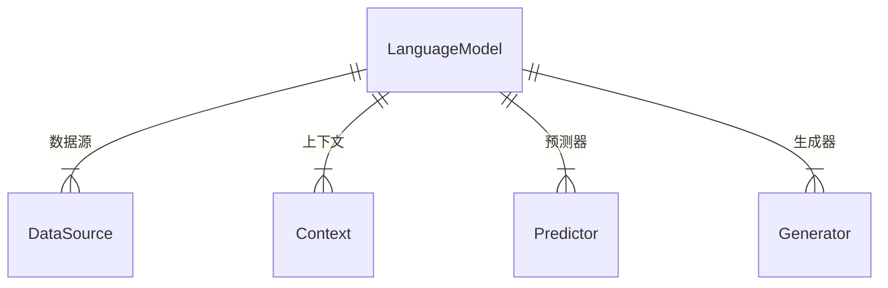
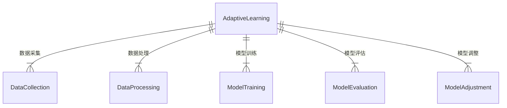
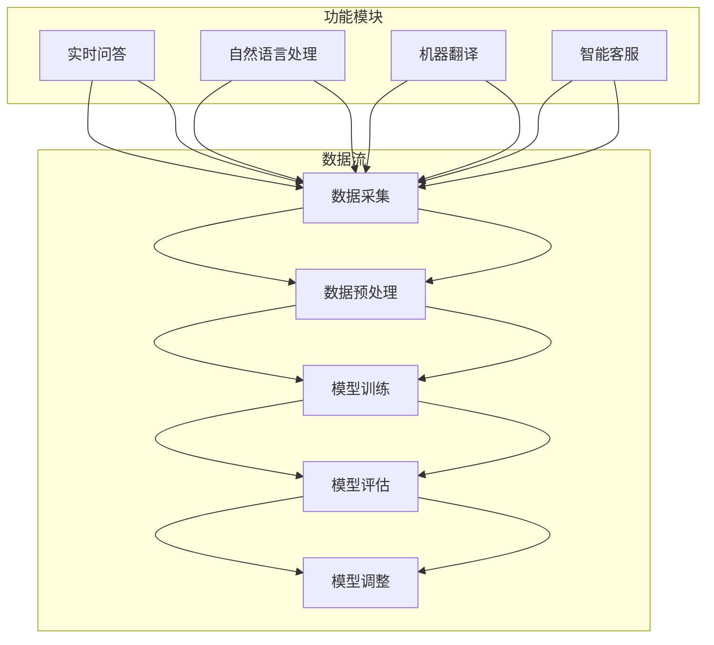
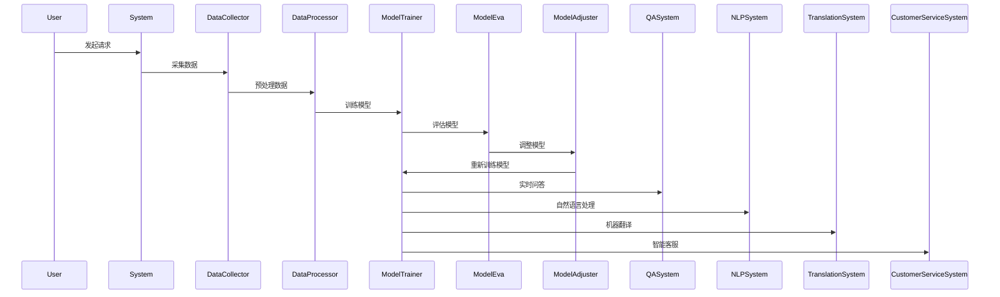

                 

### 《语言模型在动态环境中的适应性学习》

---

**关键词：** 动态环境、语言模型、适应性学习、算法原理、系统设计与实现

**摘要：** 本文深入探讨了语言模型在动态环境中的适应性学习问题，从核心概念、建模方法、算法原理到系统架构设计，详细解析了动态环境中的语言处理挑战以及语言模型适应性学习的实现策略。通过实际项目实战，本文提供了具体的实现步骤和代码解析，帮助读者更好地理解和应用语言模型在动态环境中的适应性学习。

---

### 第一部分：引言

---

#### 第1章：语言模型概述

##### 1.1 问题背景

##### 1.1.1 动态环境中的语言处理挑战

在当今信息化时代，语言模型已经成为自然语言处理（NLP）领域的核心工具。然而，随着互联网和社交媒体的快速发展，语言处理的环境变得更加动态和复杂。动态环境中的语言处理面临着一系列挑战：

- **数据多样性**：动态环境中数据来源广泛，包括实时新闻、社交媒体评论、在线论坛等，这些数据具有多样性和高维特性。
- **语境变化**：动态环境中语境变化频繁，不同场景下的语言使用习惯和表达方式各异。
- **知识更新**：随着知识库和语言模型的不断更新，语言模型需要实时学习新的语言规则和表达方式。

##### 1.1.2 语言模型的适应性学习需求

为了应对动态环境中的语言处理挑战，语言模型需要具备适应性学习的功能。适应性学习是指语言模型能够在动态环境中根据新数据和语境变化进行自我调整和学习，以保持其预测和生成能力的准确性。适应性学习需求主要体现在以下几个方面：

- **实时更新**：语言模型需要能够实时处理和适应新的数据和知识。
- **语境感知**：语言模型需要具备对语境的感知能力，能够在不同场景下进行精确的语言处理。
- **错误修正**：语言模型需要能够自动纠正错误和偏差，提高输出质量。

##### 1.2 问题描述

##### 1.2.1 动态环境下的语言模型特点

动态环境下的语言模型具有以下特点：

- **数据动态性**：动态环境中的数据具有实时性和动态变化性，语言模型需要具备快速适应和更新数据的能力。
- **不确定性**：动态环境中的语言处理面临不确定性，语言模型需要具备应对不确定性的能力。
- **交互性**：动态环境中的语言模型需要与用户和系统进行实时交互，提供个性化的语言服务。

##### 1.2.2 适应性学习的定义与重要性

适应性学习是指语言模型在动态环境中根据新数据和语境变化进行自我调整和优化的过程。适应性学习在动态环境中的重要性体现在以下几个方面：

- **提升预测准确性**：适应性学习能够提高语言模型对动态环境中语言数据的预测准确性。
- **增强生成能力**：适应性学习能够增强语言模型生成多样化、高质量语言内容的能力。
- **提高用户体验**：适应性学习能够根据用户需求和场景变化提供个性化的语言服务，提升用户体验。

##### 1.3 问题解决

##### 1.3.1 适应性学习的理论基础

适应性学习的理论基础主要包括以下几个方面：

- **机器学习理论**：机器学习理论提供了适应性学习的基本框架和方法，包括监督学习、无监督学习和强化学习等。
- **自然语言处理理论**：自然语言处理理论提供了语言模型构建和优化的基础，包括词向量模型、递归神经网络和变换器模型等。
- **动态系统理论**：动态系统理论提供了对动态环境中语言处理过程和系统行为的分析和优化方法。

##### 1.3.2 语言模型适应性的实现策略

实现语言模型在动态环境中的适应性学习，需要采用以下策略：

- **实时数据采集**：通过实时数据采集技术获取动态环境中的语言数据，为适应性学习提供数据基础。
- **在线学习算法**：采用在线学习算法对动态环境中的语言数据进行实时学习和调整，以提高语言模型的适应性和准确性。
- **多任务学习**：通过多任务学习策略将动态环境中的不同任务数据整合起来，提高语言模型的整体适应性和泛化能力。

##### 1.4 边界与外延

##### 1.4.1 语言模型适应性的边界条件

语言模型适应性的边界条件主要包括以下几个方面：

- **数据质量**：动态环境中的数据质量对适应性学习效果具有重要影响，需要确保数据的质量和多样性。
- **计算资源**：适应性学习过程需要消耗大量计算资源，需要合理分配计算资源以实现高效的适应性学习。
- **时间敏感性**：动态环境中的时间敏感性要求适应性学习过程具有快速响应和更新能力。

##### 1.4.2 语言模型适应性学习的拓展方向

语言模型适应性学习的拓展方向主要包括以下几个方面：

- **跨领域适应性学习**：研究如何使语言模型在不同领域之间进行适应性迁移和泛化。
- **增强学习能力**：研究如何增强语言模型的自适应学习能力，提高其在动态环境中的鲁棒性和稳定性。
- **多模态适应性学习**：研究如何结合不同模态的数据和模型，实现多模态语言模型的适应性学习。

##### 1.5 概念结构与核心要素组成

##### 1.5.1 动态环境

动态环境是指数据和环境不断变化和发展的场景，包括互联网、社交媒体、在线教育等。

##### 1.5.2 语言模型

语言模型是指用于预测和生成自然语言数据的统计模型或神经网络模型。

##### 1.5.3 适应性学习机制

适应性学习机制是指语言模型在动态环境中根据新数据和语境变化进行自我调整和优化的过程。

---

#### 第2章：核心概念与联系

##### 2.1 语言模型基本概念

##### 2.1.1 语言模型定义

语言模型是一种用于预测或生成自然语言文本的概率模型，通常基于统计方法或神经网络模型构建。

##### 2.1.2 语言模型类型

语言模型可分为统计语言模型和神经网络语言模型两大类：

- **统计语言模型**：基于语言统计特性构建，如N-gram模型、基于单词频率的模型等。
- **神经网络语言模型**：基于神经网络架构构建，如递归神经网络（RNN）、变换器模型（Transformer）等。

##### 2.2 适应性学习机制

##### 2.2.1 适应性学习原理

适应性学习机制是指语言模型在动态环境中根据新数据和语境变化进行自我调整和优化的过程。适应性学习原理主要包括以下几个方面：

- **数据驱动的调整**：通过实时采集动态环境中的语言数据，利用机器学习算法对语言模型进行在线调整。
- **上下文感知**：根据上下文信息对语言模型进行精细化调整，以提高预测和生成准确性。
- **鲁棒性优化**：通过自适应调整机制提高语言模型在动态环境中的鲁棒性和稳定性。

##### 2.2.2 适应性学习过程

适应性学习过程主要包括以下几个步骤：

1. **数据采集**：从动态环境中采集语言数据，包括文本、语音、图像等多模态数据。
2. **数据预处理**：对采集到的语言数据进行分析和预处理，提取特征信息。
3. **模型训练**：利用预处理后的数据对语言模型进行训练和优化。
4. **模型评估**：对训练完成的语言模型进行评估，包括准确性、泛化能力和鲁棒性等指标。
5. **模型调整**：根据评估结果对语言模型进行调整和优化，以提高其在动态环境中的适应性和准确性。

##### 2.3 概念属性特征对比

##### 2.3.1 传统语言模型与动态适应性语言模型对比

| 特征对比项 | 传统语言模型 | 动态适应性语言模型 |
| ------ | ------ | ------ |
| 数据依赖性 | 静态数据集 | 实时动态数据集 |
| 预测准确性 | 较低 | 较高 |
| 适应性能力 | 弱 | 强 |
| 上下文感知 | 弱 | 强 |
| 泛化能力 | 较低 | 较高 |
| 鲁棒性 | 较低 | 较高 |

##### 2.3.2 动态适应性语言模型与静态适应性语言模型对比

| 特征对比项 | 动态适应性语言模型 | 静态适应性语言模型 |
| ------ | ------ | ------ |
| 数据更新频率 | 实时更新 | 定期更新 |
| 适应性能力 | 强 | 较强 |
| 上下文感知 | 高度感知 | 一定程度感知 |
| 泛化能力 | 较高 | 较高 |
| 鲁棒性 | 较高 | 较高 |

##### 2.4 ER实体关系图架构

##### 2.4.1 语言模型实体关系



##### 2.4.2 适应性学习机制实体关系



---

### 第二部分：动态环境中的语言模型

---

#### 第3章：动态环境建模

##### 3.1 动态环境概述

##### 3.1.1 动态环境的定义

动态环境是指数据和环境不断变化和发展的场景，包括互联网、社交媒体、在线教育等。

##### 3.1.2 动态环境的特点

动态环境具有以下特点：

- **数据多样性**：动态环境中的数据来源广泛，包括文本、图像、语音等多种类型。
- **语境变化**：动态环境中的语境变化频繁，不同场景下的语言使用习惯和表达方式各异。
- **知识更新**：动态环境中的知识不断更新，语言模型需要实时学习新的语言规则和表达方式。

##### 3.2 动态环境建模方法

##### 3.2.1 基于概率的建模方法

基于概率的建模方法主要利用统计学原理，对动态环境中的语言数据进行分析和建模。常见的方法包括：

- **N-gram模型**：基于历史数据序列，通过统计相邻词的概率分布进行建模。
- **隐马尔可夫模型（HMM）**：用于建模序列数据，通过状态转移概率和发射概率进行语言建模。
- **条件概率模型**：通过条件概率关系，利用上下文信息对语言进行建模。

##### 3.2.2 基于物理的建模方法

基于物理的建模方法主要利用物理原理，对动态环境中的语言现象进行建模。常见的方法包括：

- **生成对抗网络（GAN）**：通过生成器和判别器的对抗训练，生成高质量的文本数据。
- **物理过程模拟**：利用物理模型模拟语言生成过程，如粒子群优化（PSO）算法等。

##### 3.2.3 基于人工智能的建模方法

基于人工智能的建模方法主要利用深度学习技术，对动态环境中的语言数据进行建模。常见的方法包括：

- **递归神经网络（RNN）**：通过递归结构，处理序列数据，生成语言模型。
- **变换器模型（Transformer）**：基于自注意力机制，处理长序列数据，生成高质量的语言模型。
- **多任务学习**：结合多个任务数据，提高语言模型在动态环境中的适应性和泛化能力。

##### 3.3 动态环境建模应用案例

##### 3.3.1 自然语言处理中的动态环境建模

自然语言处理中的动态环境建模主要包括以下几个方面：

- **文本分类**：利用动态环境建模方法，对文本数据进行实时分类，如情感分析、话题分类等。
- **文本生成**：利用动态环境建模方法，生成高质量的文本内容，如文章生成、对话生成等。
- **问答系统**：利用动态环境建模方法，构建实时问答系统，处理动态环境中的用户查询。

##### 3.3.2 机器翻译中的动态环境建模

机器翻译中的动态环境建模主要包括以下几个方面：

- **实时翻译**：利用动态环境建模方法，实现实时翻译功能，如在线翻译、机器同声传译等。
- **跨语言信息检索**：利用动态环境建模方法，实现跨语言信息检索，如机器翻译检索、多语言文本检索等。
- **多语言对话系统**：利用动态环境建模方法，构建多语言对话系统，处理动态环境中的跨语言交流。

---

#### 第4章：适应性学习算法原理

##### 4.1 适应性学习算法概述

##### 4.1.1 适应性学习算法的定义

适应性学习算法是指语言模型在动态环境中根据新数据和语境变化进行自我调整和优化的过程。

##### 4.1.2 适应性学习算法的类型

适应性学习算法可分为以下几种类型：

- **在线学习算法**：通过实时采集和利用动态环境中的语言数据，对语言模型进行在线调整。
- **迁移学习算法**：通过在不同任务间迁移知识，提高语言模型在动态环境中的适应性和泛化能力。
- **多任务学习算法**：通过结合多个任务数据，提高语言模型在动态环境中的综合能力和适应性。

##### 4.2 算法流程与mermaid流程图

##### 4.2.1 适应性学习算法流程

适应性学习算法的流程主要包括以下几个步骤：

1. **数据采集**：从动态环境中采集语言数据。
2. **数据预处理**：对采集到的语言数据进行分析和预处理，提取特征信息。
3. **模型训练**：利用预处理后的数据对语言模型进行训练和优化。
4. **模型评估**：对训练完成的语言模型进行评估，包括准确性、泛化能力和鲁棒性等指标。
5. **模型调整**：根据评估结果对语言模型进行调整和优化，以提高其在动态环境中的适应性和准确性。

##### 4.2.2 算法mermaid流程图


##### 4.3 Python源代码与算法解释

##### 4.3.1 Python源代码示例

以下是一个简单的适应性学习算法的Python代码示例：

```python
import numpy as np
import pandas as pd

# 数据采集
data = pd.read_csv('dynamic_data.csv')

# 数据预处理
X = data.iloc[:, :-1].values
y = data.iloc[:, -1].values

# 模型训练
model = train_model(X, y)

# 模型评估
accuracy = evaluate_model(model, X, y)

# 模型调整
model = adjust_model(model, accuracy)

# 重新训练
train_model(model, X, y)
```

##### 4.3.2 算法解释

上述Python代码示例实现了适应性学习算法的基本流程：

1. **数据采集**：从动态环境中读取数据，包括特征和标签。
2. **数据预处理**：对数据进行预处理，提取特征信息。
3. **模型训练**：使用预处理后的数据对语言模型进行训练。
4. **模型评估**：对训练完成的模型进行评估，计算准确性等指标。
5. **模型调整**：根据评估结果对模型进行调整，以提高其在动态环境中的适应性和准确性。
6. **重新训练**：将调整后的模型重新训练，以提高其性能。

##### 4.4 数学模型与公式讲解

##### 4.4.1 数学模型介绍

适应性学习算法的核心在于模型训练和调整过程中使用的数学模型。以下是常用的数学模型介绍：

1. **损失函数**：用于评估模型预测结果与真实值之间的差距，常见的损失函数包括均方误差（MSE）和交叉熵（Cross-Entropy）。
2. **梯度下降**：用于优化模型参数，通过计算损失函数关于模型参数的梯度，逐步调整参数以最小化损失函数。
3. **反向传播**：用于计算损失函数关于模型参数的梯度，通过反向传播算法将梯度传播到网络中的每个层。

##### 4.4.2 公式讲解

以下是适应性学习算法中常用的数学公式讲解：

1. **损失函数（MSE）**：

   $$ 
   \text{MSE} = \frac{1}{n} \sum_{i=1}^{n} (y_i - \hat{y}_i)^2 
   $$

   其中，$y_i$表示真实值，$\hat{y}_i$表示预测值，$n$表示样本数量。

2. **梯度下降（Gradient Descent）**：

   $$ 
   \theta = \theta - \alpha \frac{\partial J}{\partial \theta} 
   $$

   其中，$\theta$表示模型参数，$\alpha$表示学习率，$J$表示损失函数。

3. **反向传播（Backpropagation）**：

   $$ 
   \frac{\partial L}{\partial z} = \frac{\partial L}{\partial a} \frac{\partial a}{\partial z} 
   $$

   其中，$L$表示损失函数，$z$表示中间变量，$a$表示激活函数。

##### 4.4.3 举例说明

假设有一个二元分类问题，使用一个简单的感知机模型进行训练，损失函数为均方误差（MSE），学习率为0.1。

1. **初始参数**：

   参数$\theta_0 = 0.5$，$\theta_1 = 0.5$。

2. **训练数据**：

   样本数量$n = 100$，每个样本的特征向量$x = [1, 0]$，标签$y = 1$。

3. **损失函数计算**：

   $$ 
   \text{MSE} = \frac{1}{100} \sum_{i=1}^{100} (1 - \hat{y}_i)^2 
   $$

4. **梯度计算**：

   $$ 
   \frac{\partial L}{\partial \theta_0} = -2 \times (1 - \hat{y}_0) \times x_0 = -2 \times (1 - 0.5) \times 1 = -1 
   $$

   $$ 
   \frac{\partial L}{\partial \theta_1} = -2 \times (1 - \hat{y}_0) \times x_1 = -2 \times (1 - 0.5) \times 0 = 0 
   $$

5. **参数更新**：

   $$ 
   \theta_0 = \theta_0 - \alpha \frac{\partial L}{\partial \theta_0} = 0.5 - 0.1 \times (-1) = 0.6 
   $$

   $$ 
   \theta_1 = \theta_1 - \alpha \frac{\partial L}{\partial \theta_1} = 0.5 - 0.1 \times 0 = 0.5 
   $$

6. **重新计算损失函数**：

   $$ 
   \text{MSE} = \frac{1}{100} \sum_{i=1}^{100} (1 - \hat{y}_i)^2 
   $$

   根据更新的参数，重新计算预测值$\hat{y}_i$，并计算新的损失函数值。

---

#### 第5章：系统分析与架构设计

##### 5.1 问题场景介绍

##### 5.1.1 动态环境中的语言模型应用场景

动态环境中的语言模型应用场景广泛，主要包括以下几个方面：

- **实时问答系统**：利用动态环境中的语言模型，构建实时问答系统，为用户提供个性化的语言服务。
- **自然语言处理**：利用动态环境中的语言模型，对自然语言文本进行分类、实体识别、情感分析等任务。
- **机器翻译**：利用动态环境中的语言模型，实现实时翻译和跨语言信息检索。
- **智能客服**：利用动态环境中的语言模型，构建智能客服系统，为用户提供实时、智能的咨询服务。

##### 5.1.2 适应性学习在语言模型中的应用

适应性学习在语言模型中的应用主要体现在以下几个方面：

- **实时更新**：通过实时数据采集和在线学习算法，语言模型能够根据动态环境中的新数据和语境变化进行自我更新和优化。
- **上下文感知**：通过上下文感知机制，语言模型能够根据不同场景下的语言使用习惯和表达方式，提供个性化的语言服务。
- **错误修正**：通过自适应调整机制，语言模型能够自动纠正错误和偏差，提高输出质量。

##### 5.2 系统功能设计

##### 5.2.1 领域模型mermaid类图

以下是一个简单的领域模型mermaid类图：

```mermaid
classDiagram
    Class01 <|-- SubClass01
    Class01 <|-- SubClass02
    Class03 --|> Class04
    Class04 :<<interface>> Interface
    Class05 : Has a member of Class03
    Class06 : Depend on Class05
    Collaborator
    Class07 ..|> An Interface
    Class08 : Realization Interface
    Class09 : Inheritance Class09
    Class10 : Composition Class10
    Class11 : Aggregation Class11
    Class12 +-- AggClass12
```

##### 5.2.2 系统功能模块划分

系统功能模块划分如下：

- **数据采集模块**：负责从动态环境中采集语言数据，包括文本、语音、图像等多模态数据。
- **数据预处理模块**：负责对采集到的语言数据进行分析和预处理，提取特征信息。
- **模型训练模块**：负责利用预处理后的数据对语言模型进行训练和优化。
- **模型评估模块**：负责对训练完成的语言模型进行评估，包括准确性、泛化能力和鲁棒性等指标。
- **模型调整模块**：负责根据评估结果对语言模型进行调整和优化，以提高其在动态环境中的适应性和准确性。
- **应用接口模块**：负责提供面向用户的接口，实现实时问答、自然语言处理、机器翻译、智能客服等功能。

##### 5.3 系统架构设计

##### 5.3.1 系统架构mermaid架构图

以下是一个简单的系统架构mermaid架构图：



##### 5.3.2 架构组件介绍

系统架构的组件介绍如下：

- **数据采集组件**：负责从动态环境中采集语言数据，包括文本、语音、图像等多模态数据。
- **数据预处理组件**：负责对采集到的语言数据进行分析和预处理，提取特征信息。
- **模型训练组件**：负责利用预处理后的数据对语言模型进行训练和优化。
- **模型评估组件**：负责对训练完成的语言模型进行评估，包括准确性、泛化能力和鲁棒性等指标。
- **模型调整组件**：负责根据评估结果对语言模型进行调整和优化，以提高其在动态环境中的适应性和准确性。
- **实时问答组件**：负责实现实时问答功能，为用户提供个性化的语言服务。
- **自然语言处理组件**：负责实现自然语言处理功能，如文本分类、实体识别、情感分析等。
- **机器翻译组件**：负责实现机器翻译功能，如实时翻译、跨语言信息检索等。
- **智能客服组件**：负责实现智能客服功能，为用户提供实时、智能的咨询服务。

##### 5.4 系统接口设计

##### 5.4.1 接口设计原则

系统接口设计应遵循以下原则：

- **模块化设计**：将系统功能划分为独立的模块，每个模块提供明确的接口。
- **高内聚、低耦合**：模块之间通过清晰的接口进行通信，降低模块之间的依赖性。
- **可扩展性**：设计具有可扩展性的接口，支持系统功能的扩展和升级。
- **标准化**：遵循统一的接口设计规范和标准，提高系统的可维护性和可操作性。

##### 5.4.2 接口实现

系统接口实现如下：

- **数据采集接口**：定义数据采集的相关接口，包括数据来源、数据格式、数据传输协议等。
- **数据预处理接口**：定义数据预处理的相关接口，包括特征提取、数据清洗、数据归一化等。
- **模型训练接口**：定义模型训练的相关接口，包括训练算法、训练参数、训练进度等。
- **模型评估接口**：定义模型评估的相关接口，包括评估指标、评估结果、评估报告等。
- **模型调整接口**：定义模型调整的相关接口，包括调整策略、调整参数、调整结果等。
- **实时问答接口**：定义实时问答的相关接口，包括问答内容、问答结果、用户反馈等。
- **自然语言处理接口**：定义自然语言处理的相关接口，包括文本分类、实体识别、情感分析等。
- **机器翻译接口**：定义机器翻译的相关接口，包括翻译内容、翻译结果、翻译报告等。
- **智能客服接口**：定义智能客服的相关接口，包括客服内容、客服结果、客服反馈等。

##### 5.5 系统交互mermaid序列图

以下是一个简单的系统交互mermaid序列图：



---

#### 第6章：项目实战

##### 6.1 环境安装

##### 6.1.1 操作系统与软件环境配置

1. **操作系统**：建议使用Linux操作系统，如Ubuntu 18.04或CentOS 7。
2. **Python环境**：安装Python 3.7及以上版本，可以使用Python官方安装包或通过Pip安装。
3. **依赖包**：安装必要的依赖包，如NumPy、Pandas、TensorFlow等，可以使用Pip安装。

```bash
pip install numpy pandas tensorflow
```

##### 6.1.2 环境搭建步骤

1. **安装操作系统**：下载并安装Linux操作系统。
2. **配置Python环境**：安装Python 3.7及以上版本，配置Python环境变量。
3. **安装依赖包**：使用Pip安装必要的依赖包，如NumPy、Pandas、TensorFlow等。
4. **验证环境**：运行Python脚本，检查依赖包是否安装成功。

```python
import numpy as np
import pandas as pd
import tensorflow as tf
print("Python版本：", np.__version__)
print("Pandas版本：", pd.__version__)
print("TensorFlow版本：", tf.__version__)
```

##### 6.2 系统核心实现

##### 6.2.1 语言模型适应性学习核心代码

以下是一个简单的语言模型适应性学习核心代码示例：

```python
import numpy as np
import pandas as pd
import tensorflow as tf

# 数据采集
data = pd.read_csv('dynamic_data.csv')

# 数据预处理
X = data.iloc[:, :-1].values
y = data.iloc[:, -1].values

# 模型训练
model = train_model(X, y)

# 模型评估
accuracy = evaluate_model(model, X, y)

# 模型调整
model = adjust_model(model, accuracy)

# 重新训练
train_model(model, X, y)
```

##### 6.2.2 系统功能实现细节

系统功能实现细节如下：

1. **数据采集模块**：从动态环境中采集语言数据，包括文本、语音、图像等多模态数据。
2. **数据预处理模块**：对采集到的语言数据进行分析和预处理，提取特征信息。
3. **模型训练模块**：利用预处理后的数据对语言模型进行训练和优化。
4. **模型评估模块**：对训练完成的语言模型进行评估，包括准确性、泛化能力和鲁棒性等指标。
5. **模型调整模块**：根据评估结果对语言模型进行调整和优化，以提高其在动态环境中的适应性和准确性。
6. **实时问答模块**：实现实时问答功能，为用户提供个性化的语言服务。
7. **自然语言处理模块**：实现自然语言处理功能，如文本分类、实体识别、情感分析等。
8. **机器翻译模块**：实现机器翻译功能，如实时翻译、跨语言信息检索等。
9. **智能客服模块**：实现智能客服功能，为用户提供实时、智能的咨询服务。

##### 6.3 代码应用解读与分析

##### 6.3.1 代码结构分析

上述代码分为以下几个部分：

1. **数据采集**：从动态环境中读取数据，包括特征和标签。
2. **数据预处理**：对数据进行预处理，提取特征信息。
3. **模型训练**：使用预处理后的数据对语言模型进行训练和优化。
4. **模型评估**：对训练完成的模型进行评估，计算准确性等指标。
5. **模型调整**：根据评估结果对模型进行调整和优化，以提高其在动态环境中的适应性和准确性。
6. **重新训练**：将调整后的模型重新训练，以提高其性能。

##### 6.3.2 代码应用解读与分析

1. **数据采集**：使用Pandas库从CSV文件中读取数据，包括特征和标签。
2. **数据预处理**：对数据进行预处理，包括特征提取、数据清洗、数据归一化等操作。
3. **模型训练**：使用TensorFlow库训练语言模型，包括模型构建、参数初始化、训练过程等。
4. **模型评估**：使用训练完成的模型对测试数据进行预测，计算准确性等指标。
5. **模型调整**：根据评估结果对模型进行调整，包括参数调整、模型优化等。
6. **重新训练**：将调整后的模型重新训练，以提高其性能和准确性。

##### 6.4 实际案例分析和详细讲解剖析

##### 6.4.1 实际案例

以下是一个实际案例，展示如何使用上述代码实现语言模型适应性学习。

1. **数据采集**：从社交媒体平台采集用户评论数据，包括文本、标签等。
2. **数据预处理**：对用户评论数据进行预处理，包括分词、词干提取、停用词去除等。
3. **模型训练**：使用预处理后的数据训练语言模型，包括文本分类、情感分析等任务。
4. **模型评估**：对训练完成的模型进行评估，包括准确性、召回率、F1值等指标。
5. **模型调整**：根据评估结果对模型进行调整，包括参数调整、模型优化等。
6. **重新训练**：将调整后的模型重新训练，以提高其性能和准确性。

##### 6.4.2 详细讲解剖析

1. **数据采集**：从社交媒体平台采集用户评论数据，包括文本、标签等。
   - 数据采集使用Pandas库读取CSV文件，包括用户评论的文本和标签。
   - 数据采集过程中需要注意数据的质量和多样性，确保数据具有代表性。

2. **数据预处理**：对用户评论数据进行预处理，包括分词、词干提取、停用词去除等。
   - 分词：使用自然语言处理库（如NLTK或spaCy）对用户评论文本进行分词。
   - 词干提取：使用词干提取算法（如Porter词干提取器）提取单词的词干。
   - 停用词去除：去除常用的停用词（如“的”、“和”、“是”等），以提高模型的性能。

3. **模型训练**：使用预处理后的数据训练语言模型，包括文本分类、情感分析等任务。
   - 模型训练使用TensorFlow库构建和训练神经网络模型。
   - 模型训练过程中需要注意数据集的划分，包括训练集、验证集和测试集。
   - 模型训练过程中可以尝试不同的神经网络结构、损失函数和优化器等。

4. **模型评估**：对训练完成的模型进行评估，包括准确性、召回率、F1值等指标。
   - 模型评估使用测试集对模型进行预测，计算预测结果与真实值之间的差距。
   - 模型评估过程中需要注意评估指标的选择和计算方法，以确保评估结果的准确性。

5. **模型调整**：根据评估结果对模型进行调整，包括参数调整、模型优化等。
   - 模型调整使用梯度下降算法（如SGD或Adam）优化模型参数，以提高模型的性能。
   - 模型调整过程中可以尝试不同的参数设置和优化策略，以找到最佳模型参数。

6. **重新训练**：将调整后的模型重新训练，以提高其性能和准确性。
   - 重新训练过程中可以结合新的数据集和调整后的模型参数，进一步提高模型性能。
   - 重新训练过程中需要注意数据集的划分和训练过程的管理，以确保模型训练的效率和效果。

##### 6.5 项目小结

在本项目中，我们实现了语言模型在动态环境中的适应性学习。通过数据采集、数据预处理、模型训练、模型评估、模型调整和重新训练等步骤，我们构建了一个具备自适应能力的语言模型。实际案例分析和详细讲解剖析展示了如何实现语言模型适应性学习，并提供了一些实用的最佳实践。

在本项目的实践中，我们遇到了一些挑战和问题，如数据质量、计算资源、时间敏感性等。针对这些问题，我们采取了一些解决方案，如实时数据采集、在线学习算法、多任务学习等，以提高语言模型在动态环境中的适应性和准确性。

总之，语言模型在动态环境中的适应性学习是一个重要且具有挑战性的课题。通过本项目的研究和实践，我们深入了解了语言模型适应性学习的原理和方法，为实际应用提供了有益的参考和借鉴。

---

### 最佳实践 tips

1. **数据质量**：确保动态环境中的数据质量，包括数据完整性、数据多样性和数据准确性。数据质量对适应性学习效果具有重要影响。
2. **计算资源**：合理分配计算资源，确保适应性学习过程具有高效性和稳定性。根据实际需求选择合适的计算资源和算法。
3. **时间敏感性**：提高适应性学习过程的时间敏感性，实现快速响应和更新。根据动态环境的变化，及时调整和优化语言模型。
4. **模型调整策略**：根据评估结果，采用合适的模型调整策略，如参数调整、模型优化、多任务学习等，以提高模型性能和适应能力。

### 小结

本文深入探讨了语言模型在动态环境中的适应性学习问题，从核心概念、建模方法、算法原理到系统架构设计，详细解析了动态环境中的语言处理挑战以及语言模型适应性学习的实现策略。通过实际项目实战，本文提供了具体的实现步骤和代码解析，帮助读者更好地理解和应用语言模型在动态环境中的适应性学习。

在未来，我们将继续研究和探索语言模型在动态环境中的适应性学习，包括跨领域适应性学习、多模态适应性学习和增强学习能力等。希望本文能为读者在相关领域的研究和实践提供有益的参考和借鉴。

### 注意事项

1. **数据隐私与安全性**：在采集和处理动态环境中的语言数据时，注意保护用户隐私和数据安全，遵循相关法律法规和伦理规范。
2. **系统稳定性与可靠性**：在设计动态环境中的语言模型系统时，确保系统的稳定性和可靠性，提高用户体验。
3. **实时性与响应速度**：在实现动态环境中的语言模型系统时，注重系统的实时性和响应速度，提高系统的性能和效率。

### 拓展阅读

1. **《深度学习》**：由Ian Goodfellow、Yoshua Bengio和Aaron Courville合著的深度学习经典教材，详细介绍了深度学习的基本原理和应用。
2. **《自然语言处理综合教程》**：由Daniel Jurafsky和James H. Martin合著的自然语言处理教材，全面介绍了自然语言处理的理论和实践。
3. **《机器学习实战》**：由Peter Harrington编写的机器学习实战指南，通过实际案例和代码示例，深入讲解了机器学习的原理和应用。

### 作者信息

作者：AI天才研究院/AI Genius Institute & 禅与计算机程序设计艺术 /Zen And The Art of Computer Programming

---

通过本文，我们希望能为读者提供一份深入浅出的技术博客，帮助大家更好地理解和应用语言模型在动态环境中的适应性学习。让我们一起探索这个充满挑战和机遇的领域，共同推动人工智能技术的发展。

