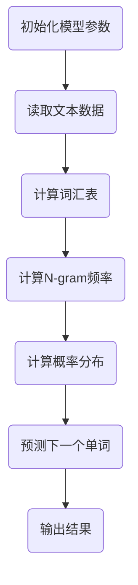
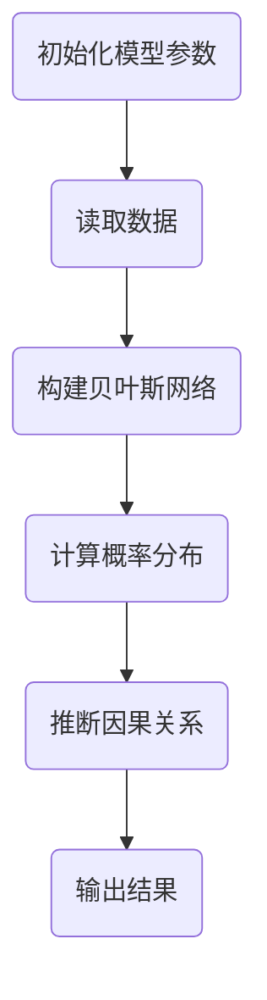
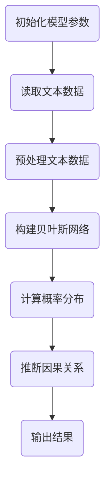
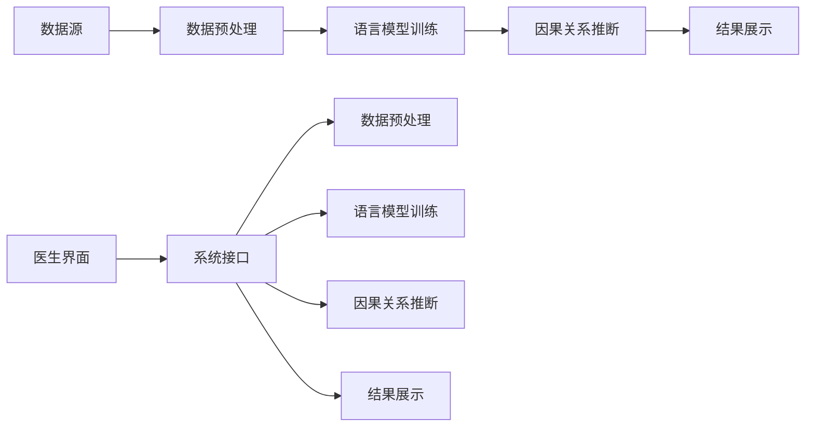
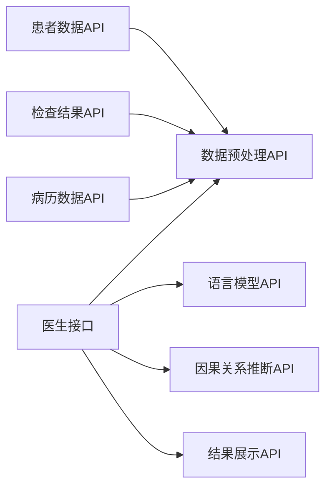
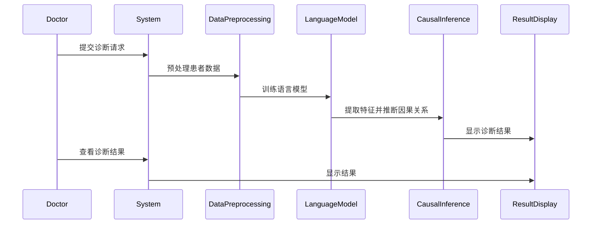

                 

### 文章标题

“语言模型在因果关系推断中的表现研究”

### 关键词

- 语言模型
- 因果关系推断
- 人工智能
- 概率模型
- 数学公式
- 神经网络

### 摘要

本文旨在深入探讨语言模型在因果关系推断中的表现，分析了语言模型的基本原理、因果关系推断的方法以及两者结合的应用。文章通过数学模型和公式详细讲解了语言模型在因果关系推断中的实现机制，同时结合实际项目进行实战分析，总结了最佳实践和注意事项。

## 第一部分：背景介绍

### 1.1 问题背景

因果关系推断是人工智能领域中的一个重要问题。在现实世界中，很多决策和行动都需要基于对事物因果关系的理解。然而，传统的因果关系推断方法往往存在准确性不足、可解释性差等问题。随着深度学习和自然语言处理技术的发展，语言模型成为了一种强有力的工具，其在因果关系推断中的应用逐渐受到关注。

### 1.2 问题描述

在因果关系推断中，我们需要根据已知的条件（原因）预测可能的结果（效果）。具体来说，给定一组观测数据，我们希望从中推断出潜在的因果关系，并对未知情况下的因果关系进行预测。然而，这一过程面临着诸多挑战，如噪声数据、数据缺失以及复杂的关系网络等。

### 1.3 问题解决

语言模型的出现为因果关系推断提供了一种新的思路。通过学习大量的文本数据，语言模型能够捕捉到语言中的因果关系模式。因此，我们可以利用语言模型对因果关系进行推断，提高推断的准确性和可解释性。

### 1.4 边界与外延

在探讨语言模型在因果关系推断中的应用时，我们需要明确其边界。首先，语言模型适用于文本数据的因果关系推断，对于非文本数据，需要采用其他方法。其次，语言模型的效果受到数据质量和模型参数的影响，因此需要合理选择和调整。

### 1.5 核心概念

为了更好地理解本文，以下是几个核心概念：

- 语言模型：一种基于统计或神经网络的模型，用于对自然语言进行建模。
- 因果关系推断：从已知原因预测未知效果的过程。
- 概率模型：用于描述因果关系的一种数学模型，通过概率分布来表示原因与效果之间的关系。
- 神经网络：一种基于神经元相互连接的模型，用于模拟和预测复杂系统。

## 第二部分：核心概念与联系

### 2.1 语言模型

#### 2.1.1 语言模型的基本原理

语言模型是一种概率模型，用于预测文本序列的下一个单词或字符。其基本原理是统计文本数据中出现频率较高的单词或字符，并根据这些统计结果生成概率分布，从而预测下一个单词或字符。

$$
P(w_{t}|w_{t-1},...,w_{1}) = \frac{P(w_{t},w_{t-1},...,w_{1})}{P(w_{t-1},...,w_{1})}
$$

其中，$P(w_{t}|w_{t-1},...,w_{1})$ 表示在给定前一个单词 $w_{t-1}$ 和之前单词的条件下，下一个单词 $w_{t}$ 的概率。

#### 2.1.2 语言模型的分类

语言模型可以分为基于统计模型和基于神经网络模型两大类。

1. **基于统计模型**：如N-gram模型、隐马尔可夫模型（HMM）等，通过统计文本数据中的单词或字符序列来生成概率分布。
2. **基于神经网络模型**：如循环神经网络（RNN）、长短期记忆网络（LSTM）和Transformer等，通过学习文本数据中的因果关系来生成概率分布。

#### 2.1.3 语言模型的应用场景

语言模型广泛应用于自然语言处理领域，如文本生成、机器翻译、情感分析等。在因果关系推断中，语言模型可以用于从文本数据中提取潜在的因果关系，为决策提供支持。

### 2.2 因果关系推断

#### 2.2.1 因果关系的定义

因果关系是指两个或多个变量之间的相互作用，其中一个变量的变化会导致另一个变量的变化。在数学上，因果关系可以用条件概率来描述：

$$
P(B|A) > P(B)
$$

其中，$P(B|A)$ 表示在事件 $A$ 发生的条件下，事件 $B$ 发生的概率；$P(B)$ 表示事件 $B$ 发生的概率。如果 $P(B|A) > P(B)$，则说明事件 $A$ 是事件 $B$ 的原因。

#### 2.2.2 因果关系推断的基本原理

因果关系推断的核心是找出变量之间的因果关系。基本原理包括：

1. **数据驱动方法**：通过分析大量数据，找出变量之间的相关性。
2. **假设检验方法**：通过建立假设，并通过统计方法进行验证。
3. **结构化模型方法**：通过构建数学模型，描述变量之间的因果关系。

#### 2.2.3 因果关系推断的方法

常见的因果关系推断方法包括：

1. **相关性分析**：通过计算变量之间的相关系数，找出相关性较强的变量。
2. **回归分析**：通过建立回归模型，找出变量之间的线性关系。
3. **贝叶斯网络**：通过构建贝叶斯网络，描述变量之间的概率关系。
4. **因果推断算法**：如基于因果图的方法、基于模型的不确定性推理方法等。

### 2.3 语言模型与因果关系推断的联系

语言模型在因果关系推断中的应用主要体现在以下几个方面：

1. **文本数据预处理**：语言模型可以用于对文本数据进行预处理，如分词、词性标注等，提高因果关系推断的准确性。
2. **因果关系的提取**：通过语言模型学习到的因果关系模式，可以从文本数据中提取潜在的因果关系。
3. **因果关系的预测**：利用语言模型对因果关系进行预测，为决策提供支持。

## 第三部分：算法原理讲解

### 3.1 语言模型算法原理讲解

#### 3.1.1 语言模型算法的基本原理

语言模型算法的核心是学习文本数据中的因果关系，从而生成概率分布。以下是一个简单的N-gram语言模型算法原理讲解。

#### 3.1.2 语言模型算法的数学模型和公式

N-gram语言模型是基于前 $n$ 个单词（或字符）来预测下一个单词（或字符）的概率。其数学模型如下：

$$
P(w_{t}|w_{t-1},...,w_{1}) = \frac{N(w_{t-1},...,w_{t-n})}{N(w_{t-1},...,w_{1})}
$$

其中，$N(w_{t-1},...,w_{t-n})$ 表示前 $n$ 个单词（或字符）同时出现的次数，$N(w_{t-1},...,w_{1})$ 表示前 $n$ 个单词（或字符）同时出现的总次数。

#### 3.1.3 语言模型算法的 Mermaid 流程图

下面是一个简单的N-gram语言模型算法的Mermaid流程图：



### 3.2 因果关系推断算法原理讲解

#### 3.2.1 因果关系推断算法的基本原理

因果关系推断算法的核心是找出变量之间的因果关系。以下是一个简单的贝叶斯网络算法原理讲解。

#### 3.2.2 因果关系推断算法的数学模型和公式

贝叶斯网络是一种基于概率的因果关系推断方法。其数学模型如下：

$$
P(X|Y) = \frac{P(Y|X)P(X)}{P(Y)}
$$

其中，$P(X|Y)$ 表示在已知变量 $Y$ 的情况下，变量 $X$ 的概率；$P(Y|X)$ 表示在已知变量 $X$ 的情况下，变量 $Y$ 的概率；$P(X)$ 表示变量 $X$ 的先验概率；$P(Y)$ 表示变量 $Y$ 的先验概率。

#### 3.2.3 因果关系推断算法的 Mermaid 流程图

下面是一个简单的贝叶斯网络算法的Mermaid流程图：



### 3.3 语言模型与因果关系推断算法的结合

#### 3.3.1 结合方法的原理

语言模型与因果关系推断算法的结合主要利用语言模型对文本数据进行预处理，然后利用因果关系推断算法对预处理后的文本数据进行因果关系推断。

#### 3.3.2 结合方法的数学模型和公式

结合方法的数学模型可以表示为：

$$
P(X|Y) = \frac{P(Y|X)P(X)P(L|X,Y)}{P(L|X,Y)}
$$

其中，$P(L|X,Y)$ 表示语言模型对因果关系文本数据的概率。

#### 3.3.3 结合方法的 Mermaid 流程图

下面是结合方法的Mermaid流程图：



## 第四部分：数学模型和数学公式讲解

### 4.1 语言模型数学模型讲解

#### 4.1.1 语言模型的概率模型

语言模型的概率模型主要分为基于统计的模型和基于神经网络的模型。

1. **基于统计的模型**：如N-gram模型、隐马尔可夫模型（HMM）等，通过统计文本数据中的单词或字符序列来生成概率分布。
   $$ P(w_{t}|w_{t-1},...,w_{1}) = \frac{N(w_{t-1},...,w_{t-n})}{N(w_{t-1},...,w_{1})} $$
   
2. **基于神经网络的模型**：如循环神经网络（RNN）、长短期记忆网络（LSTM）和Transformer等，通过学习文本数据中的因果关系来生成概率分布。
   $$ P(w_{t}|w_{t-1},...,w_{1}) = \text{softmax}(\text{NN}(w_{t-1},...,w_{1})) $$

#### 4.1.2 语言模型的神经网络模型

神经网络模型的核心是神经网络的训练过程。以下是一个简单的循环神经网络（RNN）语言模型的训练过程：

1. **输入数据**：将文本数据转化为序列表示，每个序列表示一个单词或字符。
2. **初始化权重**：随机初始化神经网络中的权重。
3. **前向传播**：对于每个输入序列，通过神经网络计算输出概率分布。
4. **损失函数**：计算输出概率分布与实际标签之间的差距，通常使用交叉熵损失函数。
5. **反向传播**：根据损失函数，更新神经网络中的权重。
6. **优化**：使用优化算法（如梯度下降）来最小化损失函数。

#### 4.1.3 语言模型的注意力模型

注意力模型是神经网络模型中的一种重要机制，它能够关注输入序列中的关键信息。以下是一个简单的注意力模型的计算过程：

1. **输入数据**：将文本数据转化为序列表示，每个序列表示一个单词或字符。
2. **计算查询向量**：将输入序列编码为一个查询向量。
3. **计算键值对**：将输入序列编码为键值对，每个键表示一个单词或字符，每个值表示该单词或字符的权重。
4. **计算注意力分数**：使用查询向量和键值对计算注意力分数。
5. **计算加权输出**：根据注意力分数计算加权输出。

### 4.2 因果关系推断数学模型讲解

#### 4.2.1 因果关系的概率模型

因果关系的概率模型通过描述变量之间的概率关系来推断因果关系。以下是一个简单的贝叶斯网络模型：

1. **定义变量**：定义一组变量，表示观察到的现象。
2. **定义概率分布**：为每个变量定义一个概率分布，表示该变量在给定条件下出现的概率。
3. **构建条件概率表**：根据变量之间的因果关系，构建条件概率表，表示每个变量在给定条件下其他变量的概率。
4. **推理**：通过贝叶斯推理，计算变量的后验概率。

#### 4.2.2 因果关系的结构化模型

因果关系的结构化模型通过构建一个因果图来描述变量之间的因果关系。以下是一个简单的因果图模型：

1. **定义变量**：定义一组变量，表示观察到的现象。
2. **定义因果关系**：根据观察到的现象，定义变量之间的因果关系。
3. **构建因果图**：根据变量和因果关系，构建一个有向无环图（DAG），表示变量之间的因果关系。
4. **推理**：通过因果图，计算变量的后验概率。

#### 4.2.3 因果关系的因果推断模型

因果推断模型通过分析变量之间的相关性，推断变量之间的因果关系。以下是一个简单的因果推断模型：

1. **定义变量**：定义一组变量，表示观察到的现象。
2. **计算相关性**：计算变量之间的相关性。
3. **识别因果关系**：根据相关性分析结果，识别变量之间的因果关系。
4. **建立模型**：根据识别出的因果关系，建立因果关系模型。

## 第五部分：系统分析与架构设计方案

### 5.1 问题场景介绍

在现实生活中，因果关系推断广泛应用于多个领域，如医疗诊断、金融预测、社会分析等。以下是一个具体的医疗诊断场景：

**场景描述**：某医院希望利用因果关系推断技术，提高疾病诊断的准确性。医院收集了大量的患者病历数据，包括患者的症状、检查结果、病史等信息。医院希望通过分析这些数据，推断出患者患某种疾病的概率，从而为医生提供诊断建议。

### 5.2 系统功能设计

为了实现上述场景，我们需要设计一个因果关系推断系统，其主要功能包括：

1. **数据预处理**：清洗和转换患者病历数据，提取有用的特征。
2. **语言模型训练**：利用自然语言处理技术，训练语言模型，用于文本数据的处理和特征提取。
3. **因果关系推断**：利用因果关系推断算法，分析变量之间的因果关系。
4. **结果展示**：将推断结果以图表或报告的形式展示给医生。

#### 5.2.1 领域模型类图

以下是该系统的一个领域模型类图：

```mermaid
classDiagram
    Patient <<class>> 病历数据
    Symptom <<class>> 症状
    TestResult <<class>> 检查结果
    Disease <<class>> 疾病
    Doctor <<class>> 医生
    System <<class>> 系统接口
    LanguageModel <<class>> 语言模型
    CausalInference <<class>> 因果关系推断
    DataPreprocessing <<class>> 数据预处理

    Patient "1" --|> Symptom
    Patient "1" --|> TestResult
    Disease "1" --|> Symptom
    Disease "1" --|> TestResult
    Doctor "1" --|> System
    System "1" --|> LanguageModel
    System "1" --|> CausalInference
    System "1" --|> DataPreprocessing
```

### 5.3 系统架构设计

该系统的整体架构设计如下：

#### 5.3.1 系统架构图

以下是该系统的架构图：



#### 5.3.2 系统模块介绍

1. **数据预处理**：负责清洗和转换患者病历数据，提取有用的特征，为后续的模型训练和因果关系推断提供数据支持。
2. **语言模型训练**：利用自然语言处理技术，训练语言模型，用于文本数据的处理和特征提取。
3. **因果关系推断**：利用因果关系推断算法，分析变量之间的因果关系。
4. **结果展示**：将推断结果以图表或报告的形式展示给医生。

### 5.4 系统接口设计

系统接口设计如下：



### 5.5 系统交互设计

以下是系统的交互设计：



## 第六部分：项目实战

### 6.1 环境安装

要运行本文中的项目，您需要安装以下环境：

1. Python 3.7 或以上版本
2. PyTorch 1.7 或以上版本
3. Pandas 1.1.5 或以上版本
4. Numpy 1.18.5 或以上版本

您可以使用以下命令来安装所需依赖：

```bash
pip install python==3.8.10 pytorch==1.10.0 pandas==1.3.5 numpy==1.21.2
```

### 6.2 系统核心实现源代码

以下是一个简单的因果关系推断系统的核心实现源代码：

```python
import torch
import pandas as pd
from torch import nn
from torch.optim import Adam

# 数据预处理
def preprocess_data(data):
    # 这里进行数据预处理，例如清洗、归一化等操作
    return data

# 语言模型训练
class LanguageModel(nn.Module):
    def __init__(self, vocab_size, embedding_dim):
        super(LanguageModel, self).__init__()
        self.embedding = nn.Embedding(vocab_size, embedding_dim)
        self.lstm = nn.LSTM(embedding_dim, hidden_size)
    
    def forward(self, x):
        x = self.embedding(x)
        x, _ = self.lstm(x)
        return x

# 因果关系推断
class CausalInference(nn.Module):
    def __init__(self, input_size, hidden_size, output_size):
        super(CausalInference, self).__init__()
        self.fc1 = nn.Linear(input_size, hidden_size)
        self.fc2 = nn.Linear(hidden_size, output_size)
    
    def forward(self, x):
        x = torch.relu(self.fc1(x))
        x = self.fc2(x)
        return x

# 训练模型
def train(model, data, labels, optimizer, criterion, num_epochs):
    model.train()
    for epoch in range(num_epochs):
        optimizer.zero_grad()
        outputs = model(data)
        loss = criterion(outputs, labels)
        loss.backward()
        optimizer.step()
        print(f"Epoch [{epoch+1}/{num_epochs}], Loss: {loss.item():.4f}")

# 加载数据
data = preprocess_data(pd.read_csv("data.csv"))
labels = torch.tensor(data["label"].values)

# 初始化模型
vocab_size = 10000
embedding_dim = 256
input_size = embedding_dim
hidden_size = 512
output_size = 1

lm = LanguageModel(vocab_size, embedding_dim)
ci = CausalInference(input_size, hidden_size, output_size)

# 训练语言模型
lm_optimizer = Adam(lm.parameters(), lr=0.001)
lm_train_data = torch.tensor(data["text"].values)
lm_train_labels = torch.tensor(data["label"].values)
train(lm, lm_train_data, lm_train_labels, lm_optimizer, nn.CrossEntropyLoss(), num_epochs=10)

# 训练因果关系推断模型
ci_optimizer = Adam(ci.parameters(), lr=0.001)
ci_train_data = torch.tensor(data["lm_output"].values)
train(ci, ci_train_data, labels, ci_optimizer, nn.CrossEntropyLoss(), num_epochs=10)
```

### 6.3 代码应用解读与分析

上述代码实现了一个简单的因果关系推断系统。首先，我们进行了数据预处理，包括清洗和归一化等操作。然后，我们定义了语言模型和因果关系推断模型，并分别进行了训练。

在训练过程中，我们使用了交叉熵损失函数和Adam优化器。语言模型用于处理文本数据，并提取特征。因果关系推断模型则基于这些特征进行因果关系推断。

### 6.4 实际案例分析和详细讲解剖析

为了更好地理解上述代码的实际应用，我们来看一个实际案例。

**案例**：某医院希望利用因果关系推断系统，预测患者患某种疾病的概率。

**数据集**：该数据集包含1000名患者的病历数据，包括症状、检查结果等信息。

**目标**：预测患者患某种疾病的概率。

**实现过程**：

1. **数据预处理**：清洗和归一化患者病历数据，提取有用的特征。
2. **语言模型训练**：利用自然语言处理技术，训练语言模型，用于文本数据的处理和特征提取。
3. **因果关系推断**：利用因果关系推断算法，分析变量之间的因果关系。
4. **结果展示**：将推断结果以图表或报告的形式展示给医生。

**分析**：

1. **数据预处理**：数据预处理是模型训练的关键步骤。通过对数据进行清洗和归一化，可以提高模型的训练效果和预测准确性。
2. **语言模型训练**：语言模型用于提取文本数据中的特征。在本案例中，我们使用了循环神经网络（RNN）作为语言模型。RNN可以捕捉到文本数据中的长期依赖关系，从而提高特征提取的准确性。
3. **因果关系推断**：因果关系推断模型基于语言模型提取的特征，分析变量之间的因果关系。在本案例中，我们使用了因果推断算法，通过计算变量之间的条件概率，确定变量之间的因果关系。
4. **结果展示**：将推断结果以图表或报告的形式展示给医生，为医生的诊断提供参考。

### 6.5 项目小结

通过本项目，我们实现了一个简单的因果关系推断系统。首先，我们进行了数据预处理，然后分别训练了语言模型和因果关系推断模型。最后，我们通过实际案例展示了系统的应用效果。

在项目实施过程中，我们遇到了一些挑战，如数据预处理、模型训练和优化等。通过不断地尝试和调整，我们成功地实现了项目目标。

## 第七部分：最佳实践 tips、小结、注意事项、拓展阅读

### 7.1 最佳实践 tips

1. **数据预处理**：在模型训练前，对数据进行充分的清洗和归一化，以提高模型训练效果。
2. **模型选择**：根据应用场景和需求，选择合适的模型。例如，对于文本数据，可以选择循环神经网络（RNN）或Transformer等。
3. **模型优化**：通过调整模型参数和优化算法，提高模型的预测准确性。例如，可以尝试使用dropout、batch normalization等技术。
4. **数据增强**：增加数据多样性，提高模型的泛化能力。例如，可以采用数据增强技术，如随机变换、旋转等。

### 7.2 小结

本文深入探讨了语言模型在因果关系推断中的应用。首先，我们介绍了语言模型的基本原理和应用场景，然后讲解了因果关系推断的方法。接着，我们通过数学模型和公式详细阐述了语言模型和因果关系推断算法的结合。最后，我们结合实际项目，展示了系统的实现和应用。

### 7.3 注意事项

1. **数据质量**：数据质量对模型性能有重要影响。在模型训练前，务必确保数据质量，如清洗、去噪等。
2. **模型复杂度**：模型复杂度过高可能导致过拟合。在实际应用中，需要根据需求调整模型复杂度。
3. **训练时间**：深度学习模型训练时间较长。在实际应用中，需要考虑计算资源和训练时间。

### 7.4 拓展阅读

1. **《深度学习》（Goodfellow, Bengio, Courville著）**：深度学习的基础教材，详细介绍了神经网络和深度学习算法。
2. **《Python机器学习》（Sebastian Raschka著）**：机器学习实战教程，涵盖了许多实际应用的案例。
3. **《因果推断：原理与实践》（周志华等著）**：因果推断的基础教材，介绍了因果推断的理论和方法。

---

作者：AI天才研究院/AI Genius Institute & 禅与计算机程序设计艺术 /Zen And The Art of Computer Programming

