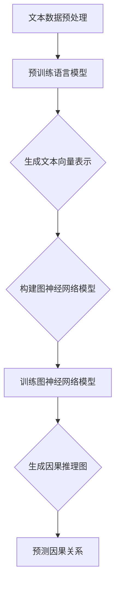

                 

# 语言模型在因果推理图构建中的能力

## 摘要

随着人工智能技术的不断发展，语言模型已经成为自然语言处理领域的重要工具。本文旨在探讨语言模型在因果推理图构建中的应用能力，通过对其基本原理、因果推理图构建原理以及两者结合的具体实现方法的详细分析，揭示语言模型在因果推理图构建中的重要作用。本文首先介绍了语言模型的基本原理，包括其概念、类型和训练与评估方法。接着，探讨了因果推理图构建的基本概念、方法及其优缺点。随后，分析了语言模型在因果推理图构建中的挑战和优势，并结合实际案例展示了其应用效果。最后，通过算法原理讲解、系统分析与架构设计以及项目实战，进一步阐述了语言模型在因果推理图构建中的实际应用。

## 关键词

- 语言模型
- 因果推理图
- 自然语言处理
- 人工智能
- 训练与评估
- 算法原理
- 系统分析与架构设计
- 项目实战

## 目录

1. **背景介绍**
    1.1 问题背景
    1.2 问题描述
    1.3 问题解决
    1.4 边界与外延
    1.5 核心概念与联系

2. **语言模型的基本原理**
    2.1 语言模型的概念
    2.2 语言模型的类型
    2.3 语言模型的训练与评估

3. **因果推理图构建原理**
    3.1 因果推理图的基本概念
    3.2 因果推理图的构建方法
    3.3 因果推理图的优缺点

4. **语言模型在因果推理图构建中的应用**
    4.1 语言模型在因果推理图构建中的挑战
    4.2 语言模型在因果推理图构建中的优势
    4.3 语言模型在因果推理图构建中的应用案例

5. **算法原理与流程图**
    5.1 算法原理
    5.2 流程图

6. **系统分析与架构设计**
    6.1 问题场景介绍
    6.2 系统功能设计
    6.3 系统架构设计
    6.4 系统接口设计
    6.5 系统交互

7. **项目实战**
    7.1 环境安装
    7.2 系统核心实现源代码
    7.3 代码应用解读与分析
    7.4 实际案例分析与讲解
    7.5 项目小结

8. **最佳实践与拓展**
    8.1 最佳实践 tips
    8.2 小结
    8.3 注意事项
    8.4 拓展阅读
    8.5 参考文献
    8.6 附录

## 背景介绍

### 1.1 问题背景

因果推理是人工智能和机器学习领域中的一个重要研究方向。在现实世界中，人们经常需要从大量的数据中提取出因果关系，以帮助做出决策和预测。然而，传统的机器学习方法，如回归分析、决策树和支持向量机等，往往只能捕捉到表面的相关性，而无法揭示深层次的因果关系。

近年来，随着深度学习和自然语言处理技术的快速发展，语言模型，特别是预训练语言模型，如GPT、BERT等，已经在自然语言处理任务中取得了显著的成果。这些模型通过学习大量的文本数据，能够理解并生成自然语言的语义信息，从而在文本分类、问答系统、机器翻译等任务中表现出色。

因果推理图（Causal Graph）是一种表示因果关系的形式化方法。它通过图结构来表示变量之间的因果关系，使得我们可以更直观地理解复杂系统的内在机制。因果推理图在社会科学、医学、经济学等领域有着广泛的应用，可以帮助研究人员识别变量之间的因果关系，从而做出更准确的预测和决策。

然而，将语言模型与因果推理图构建结合起来，仍然是一个相对较新的研究领域。现有的研究大多集中于如何利用语言模型生成图结构，或者如何将因果推理图应用于语言模型训练。然而，对于如何利用语言模型来构建因果推理图，以及如何将两者有机结合，仍然存在许多挑战和问题需要解决。

### 1.2 问题描述

本文要解决的问题是如何利用语言模型构建因果推理图，以及如何将两者有机结合，以实现更准确、更可靠的因果推理。具体来说，我们需要回答以下几个关键问题：

1. **语言模型如何捕捉因果关系？** 语言模型通过学习大量的文本数据，能够理解并生成自然语言的语义信息。那么，它是否能够捕捉到文本中隐含的因果关系呢？如果可以，它是如何实现的？

2. **因果推理图如何与语言模型结合？** 因果推理图是一种形式化的方法，通过图结构来表示变量之间的因果关系。那么，如何将语言模型生成的语义信息与因果推理图结合，从而实现更准确的因果推理？

3. **语言模型在因果推理图构建中的优势是什么？** 语言模型在自然语言处理任务中表现出色，那么它在因果推理图构建中又有哪些优势？这些优势如何帮助我们更好地理解和应用因果推理图？

4. **如何评估语言模型在因果推理图构建中的性能？** 我们需要设计一套有效的评估指标，以评估语言模型在因果推理图构建中的性能。这些指标包括准确率、召回率、F1值等。

### 1.3 问题解决

为了解决上述问题，我们需要从以下几个方面入手：

1. **研究语言模型的基本原理** 了解语言模型如何工作，包括其训练方法、模型结构、参数优化等。

2. **研究因果推理图的基本原理** 了解因果推理图的定义、表示方法、构建方法等。

3. **探索语言模型与因果推理图的结合方法** 通过实验和研究，找到将语言模型与因果推理图有机结合的方法。

4. **设计有效的评估指标** 根据因果推理图的特点，设计一套有效的评估指标，以评估语言模型在因果推理图构建中的性能。

5. **应用与拓展** 将研究成果应用于实际场景，如社会科学、医学、经济学等领域，以验证其有效性。

### 1.4 边界与外延

在本文的研究中，我们主要关注以下边界与外延：

1. **数据边界** 我们假设所使用的文本数据是足够丰富和多样的，能够覆盖大部分可能的因果关系。

2. **模型边界** 我们主要研究基于深度学习的语言模型，如GPT、BERT等，这些模型在自然语言处理任务中表现出了良好的性能。

3. **应用边界** 我们将研究成果应用于因果推理图构建，但在其他领域，如计算机视觉、语音识别等，语言模型的应用也可能有类似的潜力。

4. **时间边界** 本文的研究成果是基于当前的技术水平，随着人工智能技术的不断发展，未来可能会有更多的研究成果出现。

### 1.5 核心概念与联系

在本文的研究中，核心概念包括：

1. **语言模型** 语言模型是一种基于深度学习的自然语言处理模型，通过学习大量的文本数据，能够生成自然语言的语义信息。

2. **因果推理图** 因果推理图是一种形式化的方法，通过图结构来表示变量之间的因果关系。

3. **因果关系** 因果关系是变量之间的内在联系，反映了变量之间的因果关系。

4. **训练与评估** 训练与评估是语言模型和因果推理图构建中的关键步骤，通过训练和评估，我们可以优化模型性能，并验证其有效性。

这些核心概念相互联系，共同构成了本文研究的核心内容。语言模型通过学习文本数据，可以捕捉到文本中的因果关系，并将其转化为因果推理图。因果推理图则可以帮助我们更直观地理解复杂系统的内在机制，从而实现更准确的因果推理。

## 语言模型的基本原理

### 2.1 语言模型的概念

语言模型是一种用于预测文本序列的模型，它在自然语言处理（NLP）领域中扮演着至关重要的角色。语言模型的核心目标是理解并生成自然语言中的文本，从而支持各种下游任务，如文本分类、机器翻译、问答系统等。语言模型通过对大量文本数据的学习，能够捕捉到语言的统计规律和语义信息，从而实现对未知文本的生成和预测。

在更广义的层面上，语言模型可以被视为一种概率模型，用于估计给定前文序列后下一个单词或词组的概率分布。这种概率估计可以通过多种方法实现，包括基于统计的方法、基于规则的方法和基于深度学习的方法。其中，深度学习方法，尤其是基于神经网络的模型，如循环神经网络（RNN）、长短时记忆网络（LSTM）和变换器（Transformer）等，已经成为当前语言模型研究的主流方向。

### 2.2 语言模型的类型

语言模型根据其学习和表示方式可以分为几种类型，主要包括：

1. **基于统计的语言模型**：这类模型通过统计文本中的单词或短语的共现关系来预测下一个词或短语。经典的统计语言模型如N元语法（N-gram）模型，通过对前n个单词的统计来预测下一个单词。尽管N-gram模型简单且易于实现，但它存在很多缺陷，如无法捕捉长距离依赖和上下文信息。

2. **基于规则的语言模型**：这类模型通过手工定义的规则来预测文本序列。规则可以是基于语法规则、词法规则或语义规则等。这种方法在某种程度上可以弥补统计模型的不足，但规则的定义和优化需要大量的人工干预，且难以扩展到大规模语言数据。

3. **基于神经的语言模型**：随着深度学习技术的发展，基于神经网络的模型在NLP领域取得了突破性进展。这类模型通过多层神经网络来学习文本数据中的复杂模式和依赖关系。RNN、LSTM和BERT等模型是其中的代表性工作。

   - **RNN（循环神经网络）**：RNN是一种可以处理序列数据的神经网络，其核心思想是通过在网络中引入循环结构，使得当前时间步的输出能够依赖于之前的所有时间步的输出。LSTM是RNN的一种变体，通过引入门机制来缓解梯度消失问题，从而更好地捕捉长距离依赖。

   - **BERT（BERT预训练语言表示）**：BERT是基于Transformer的预训练语言表示模型，通过在大量文本数据上进行预训练，然后通过微调适应不同的下游任务。BERT的成功表明，预训练语言模型在NLP任务中具有巨大的潜力。

### 2.3 语言模型的训练与评估

语言模型的训练过程可以分为预训练和微调两个阶段。

1. **预训练**：预训练是指在大量无标签文本数据上训练语言模型，以学习语言的通用特征和统计规律。预训练模型的目的是建立一个强大的语言表示基础，以便在后续的微调阶段更好地适应特定任务。预训练通常采用无监督的方法，如Masked Language Model（MLM）和Next Sentence Prediction（NSP）。MLM通过随机遮蔽输入文本中的单词，要求模型预测这些被遮蔽的单词。NSP则通过预测两个句子是否属于同一篇章，来学习上下文信息。

2. **微调**：微调是指在预训练模型的基础上，利用有标签的数据集对模型进行进一步训练，以适应特定的下游任务。微调过程通常包括以下几个步骤：

   - **数据准备**：将任务相关的数据集划分为训练集、验证集和测试集，并对其进行预处理，如分词、标记化等。

   - **模型配置**：选择合适的预训练模型并进行配置，包括调整模型的参数设置、选择适当的优化器等。

   - **训练过程**：在训练集上迭代训练模型，同时使用验证集来监控模型的性能，防止过拟合。

   - **评估与优化**：在测试集上评估模型的性能，根据评估结果调整模型参数或选择不同的预训练模型。

常见的评估指标包括：

- **准确率（Accuracy）**：预测正确的样本数占总样本数的比例。
- **召回率（Recall）**：预测正确的正样本数占总正样本数的比例。
- **精确率（Precision）**：预测正确的正样本数占所有预测为正样本的样本数的比例。
- **F1值（F1 Score）**：精确率和召回率的调和平均值。

通过预训练和微调，语言模型能够从大规模无标签数据中学习到丰富的语言知识，并在下游任务中表现出色。同时，训练和评估过程的优化也是提升模型性能的关键。

### 2.4 语言模型的工作原理

语言模型的工作原理可以分为以下几个关键步骤：

1. **输入表示**：将输入的文本序列转换为模型可以处理的向量表示。这个过程通常涉及分词、标记化等预处理步骤，以将文本拆分成单词或子词。

2. **编码与解码**：编码器（Encoder）将输入序列编码为固定长度的向量，表示整个序列的语义信息。在基于Transformer的模型中，编码器通过自注意力机制（Self-Attention）捕捉输入序列中的长距离依赖关系。

3. **概率预测**：解码器（Decoder）根据编码器输出的向量，逐个生成输出序列的单词或子词，并预测下一个单词或子词的概率。在生成过程中，模型会使用之前的输出作为输入，逐步构建完整的输出序列。

4. **损失函数**：在训练过程中，模型通过损失函数（如交叉熵损失）来衡量预测输出与实际输出之间的差距，并使用优化算法（如梯度下降）来调整模型参数，以减少损失。

5. **模型优化**：通过多次迭代训练和评估，模型逐渐优化其参数，以提高预测准确性。在微调阶段，模型会根据特定任务的需求进行调优，从而更好地适应下游任务。

通过这些步骤，语言模型能够从大量文本数据中学习到复杂的语言模式和语义信息，从而实现对未知文本的生成和预测。

### 2.5 语言模型的应用

语言模型在自然语言处理领域有着广泛的应用，以下是一些典型的应用场景：

1. **文本分类**：将文本数据分类到预定义的类别中，如情感分析、新闻分类等。通过训练有监督的分类模型，可以自动对大量文本进行分类，提高文本处理的效率。

2. **机器翻译**：将一种语言的文本翻译成另一种语言。机器翻译模型通过学习源语言和目标语言之间的对应关系，可以生成高质量的翻译结果。

3. **问答系统**：自动回答用户提出的问题，如搜索引擎、聊天机器人等。问答系统通过理解用户的问题和上下文，提供准确、相关的回答。

4. **文本生成**：自动生成文本，如文章、摘要、对话等。文本生成模型可以基于输入的提示或上下文，生成连贯、有意义的文本。

5. **情感分析**：分析文本中的情感倾向，如正面、负面、中性等。情感分析模型可以帮助企业了解用户反馈、市场趋势等。

通过这些应用，语言模型在提升人机交互、自动化文本处理等方面发挥了重要作用。随着技术的不断进步，语言模型的应用范围将进一步扩大，为各行各业带来更多创新和便利。

### 2.6 语言模型的发展趋势

随着深度学习和大数据技术的不断发展，语言模型在NLP领域取得了显著进展。以下是当前语言模型发展的一些趋势：

1. **多模态学习**：语言模型开始融合图像、音频、视频等多模态信息，以更全面地理解现实世界中的信息。例如，视觉语言模型可以通过图像和文本的联合学习，实现图像描述生成、图像分类等任务。

2. **小样本学习**：在缺乏大量标注数据的情况下，小样本学习成为语言模型研究的热点。通过迁移学习和零样本学习等技术，模型可以在少量样本上实现良好的性能。

3. **低资源语言**：为支持低资源语言（如少数族裔语言），研究者致力于开发适应低资源环境的语言模型。通过数据增强、迁移学习等技术，模型可以在低资源环境中取得更好的表现。

4. **可解释性**：提升模型的可解释性是当前语言模型研究的另一个重要方向。通过可解释性分析，研究人员可以更好地理解模型的工作机制，从而提高模型的可靠性和信任度。

5. **隐私保护**：随着数据隐私问题的日益突出，隐私保护成为语言模型研究的重要课题。研究者致力于开发能够在保护用户隐私的前提下，有效学习和处理数据的模型。

这些趋势预示着语言模型在未来将朝着更智能化、多样化、低资源友好和隐私保护的方向发展，为NLP领域的应用带来更多可能性。

## 因果推理图构建原理

### 3.1 因果推理图的基本概念

因果推理图（Causal Graph）是一种用于表示变量之间因果关系的图形化工具。它通过图结构来描述变量之间的因果关系，使得我们可以更直观地理解复杂系统的内在机制。因果推理图通常由节点和边组成，其中节点表示变量，边表示变量之间的因果关系。

在因果推理图中，每个变量都被视为一个节点，而变量之间的因果关系则通过边来表示。如果变量A是变量B的因，则从A指向B的边表示A对B的因果影响。因果推理图不仅可以表示直接的因果关系，还可以表示间接的因果关系。例如，变量A可能通过变量C影响变量B，这种间接关系可以通过多级边来表示。

因果推理图在多个领域中都有广泛的应用，包括社会科学、医学、经济学和工程学等。在社会科学中，因果推理图可以帮助研究人员识别社会现象之间的因果关系，从而制定更有效的政策和措施。在医学领域，因果推理图可以用于分析疾病发生的原因和影响，帮助医生进行诊断和制定治疗方案。在经济学中，因果推理图可以帮助经济学家分析经济变量之间的因果关系，从而预测经济趋势和制定经济政策。在工程学中，因果推理图可以用于系统设计和优化，帮助工程师识别系统中的关键因素和潜在风险。

### 3.2 因果推理图的构建方法

构建因果推理图是一个复杂的过程，通常需要结合领域知识、数据分析和假设检验等多种方法。以下是几种常见的因果推理图构建方法：

1. **基于领域知识的构建**：这种方法依赖于领域专家的知识和经验，通过专家的指导和反馈来构建因果推理图。领域专家可以根据他们对系统内部机制的理解，提出可能的因果关系，并绘制成因果推理图。这种方法的主要优点是能够快速地构建初步的因果推理图，但也存在一定的主观性和局限性。

2. **基于数据的构建**：这种方法通过分析数据来识别变量之间的因果关系。常见的分析工具包括回归分析、路径分析、结构方程模型等。通过这些工具，我们可以从数据中提取变量之间的相关性，并构建初步的因果推理图。然而，基于数据的方法存在一个重要问题，即数据中的相关性并不一定代表因果关系。因此，这种方法通常需要结合领域知识和实验验证来确保因果推理图的准确性。

3. **基于假设检验的构建**：这种方法通过假设检验来验证变量之间的因果关系。在构建因果推理图之前，我们提出一系列的假设，并通过实验或数据分析来检验这些假设的成立情况。如果某个假设得到验证，则可以在因果推理图中加入相应的边。这种方法的主要优点是能够基于严格的统计方法来构建因果推理图，但需要大量的数据支持和复杂的实验设计。

4. **基于机器学习的构建**：随着机器学习技术的发展，研究者开始利用机器学习算法来构建因果推理图。一些基于机器学习的方法，如因果推断算法（Causal Inference Algorithms）和图神经网络（Graph Neural Networks），可以通过学习数据中的因果关系来生成因果推理图。这种方法的主要优点是能够处理大规模数据和高维变量，但需要合适的算法和参数调优。

在实际应用中，不同方法可以相互结合，以构建更准确、更全面的因果推理图。例如，在社会科学研究中，我们可以先通过领域知识构建初步的因果推理图，然后利用数据分析来验证和优化图的准确性。

### 3.3 因果推理图的优缺点

因果推理图作为一种表示因果关系的形式化方法，具有以下优缺点：

**优点：**

1. **直观性**：因果推理图通过图形化的方式表示变量之间的因果关系，使得研究人员可以更直观地理解复杂系统的内在机制。

2. **形式化**：因果推理图具有严格的形式化定义，可以通过数学模型来描述变量之间的因果关系，从而实现因果关系的定量分析。

3. **模块化**：因果推理图可以将复杂系统分解为多个模块，每个模块表示系统中的一个子部分，从而简化系统的分析和理解。

4. **可验证性**：通过实验和数据分析，我们可以验证因果推理图的准确性，从而提高因果推断的可靠性。

**缺点：**

1. **构建难度**：因果推理图的构建需要领域知识、数据分析和假设检验等多种方法的结合，构建过程相对复杂，需要较高的专业知识和技能。

2. **数据依赖**：因果推理图的构建依赖于大量高质量的数据，数据的缺失或不准确可能导致因果推理图的误差。

3. **不确定性**：因果推理图中的因果关系可能存在不确定性，尤其是在面对复杂系统时，我们难以完全确定变量之间的因果关系。

4. **模型假设**：因果推理图的构建通常基于一系列假设，这些假设的合理性可能影响因果推理图的准确性。

总之，因果推理图作为一种有效的因果推断工具，在多个领域都有广泛的应用。然而，其构建过程复杂，需要结合多种方法，同时也存在一定的局限性。因此，在实际应用中，我们需要根据具体问题选择合适的方法，并充分考虑因果推理图的优缺点。

## 语言模型在因果推理图构建中的应用

### 4.1 语言模型在因果推理图构建中的挑战

将语言模型应用于因果推理图构建面临着一系列挑战，这些挑战主要源于语言模型的特性以及因果推理图本身的复杂性。

首先，语言模型的输入通常是文本数据，而因果推理图构建需要的是结构化的知识表示，这要求语言模型能够从无结构的数据中提取出有意义的结构信息。语言模型虽然具备强大的文本理解和生成能力，但在处理因果关系时，往往只能捕捉到表面上的相关性，而难以直接揭示深层次的因果关系。例如，一个句子中可能会提到“吸烟导致肺癌”，但这并不足以证明吸烟和肺癌之间的因果关系。

其次，因果推理图的构建依赖于丰富的背景知识和领域专业知识。语言模型虽然可以处理大规模的文本数据，但它的知识储备可能有限，特别是在一些专业领域，如医学和经济学等，语言模型可能无法理解专业术语和概念，从而影响因果推理图的准确性。

第三，因果推理图构建需要考虑变量之间的间接关系。语言模型在处理长文本序列时存在困难，难以捕捉到长距离的依赖关系。而因果推理图中的因果关系可能涉及多个变量和多个层次的间接影响，这使得语言模型在构建因果推理图时面临很大的挑战。

第四，因果推理图的验证和评估是一个复杂的过程。语言模型在生成因果推理图后，需要通过实验或数据分析来验证图的准确性。这一过程可能需要大量的数据和复杂的统计方法，对于语言模型来说，如何有效地进行验证和评估也是一个重要的挑战。

### 4.2 语言模型在因果推理图构建中的优势

尽管语言模型在因果推理图构建中面临诸多挑战，但它也具有一些独特的优势，这些优势使得语言模型在构建因果推理图时具有一定的潜力。

首先，语言模型能够处理大规模的文本数据，这使得它能够从大量的文本中提取出潜在的因果关系。语言模型通过预训练过程，学习了大量的语言知识，这些知识可以帮助它识别文本中的隐含信息，从而提高因果推理图的准确性。

其次，语言模型在理解上下文信息方面具有优势。语言模型能够捕捉到句子之间的上下文关系，这使得它能够更好地理解文本中的因果关系。例如，一个句子中提到的“吸烟”可能不仅仅是一个孤立的动作，它还可能与其他变量如“环境污染”、“生活方式”等存在关联。语言模型可以通过上下文信息，将这些关联提取出来，从而构建出更全面的因果推理图。

第三，语言模型能够生成连贯的自然语言描述，这使得它能够将复杂的因果关系以更易理解的方式呈现给用户。在构建因果推理图后，语言模型可以生成解释性文本，帮助用户理解变量之间的因果关系，从而提高因果推理图的可解释性。

最后，语言模型具有自适应性和灵活性。随着深度学习技术的发展，语言模型可以不断更新和优化，以适应不同的任务和领域。这使得语言模型在构建因果推理图时，可以根据不同的应用场景进行调整和优化，从而提高模型的性能。

### 4.3 语言模型在因果推理图构建中的应用案例

为了更好地理解语言模型在因果推理图构建中的应用，下面我们通过一个具体的案例来展示其应用效果。

假设我们研究的是一个健康领域的因果关系，目标是构建一个因果推理图来分析吸烟、饮酒和肥胖等因素对健康的影响。首先，我们使用GPT-3模型来处理大量与健康相关的文本数据，如医学报告、健康指南、科学论文等。通过预训练过程，GPT-3模型学会了健康领域的专业知识和语言表达。

在预训练阶段结束后，我们利用GPT-3模型生成的文本来构建初步的因果推理图。例如，GPT-3可能会生成以下句子：“吸烟会导致肺癌，而肺癌与肥胖有关。”根据这些信息，我们可以在因果推理图中添加相应的边，表示吸烟、肺癌和肥胖之间的潜在关系。

接下来，我们使用因果推断算法来进一步优化因果推理图。这些算法通过分析文本中的因果关系，自动识别变量之间的间接关系，并调整因果推理图的结构。例如，如果文本中提到“饮酒会增加肥胖的风险”，那么我们可以在因果推理图中添加一条从饮酒指向肥胖的边。

为了验证因果推理图的准确性，我们使用实验数据来检验图中的因果关系。例如，我们可以收集一组吸烟者、饮酒者和肥胖者的健康数据，分析这些变量之间的相关性。如果数据支持因果推理图中的关系，那么我们可以认为该图具有较高的准确性。

最后，我们利用GPT-3模型生成解释性文本，帮助用户理解因果推理图中的因果关系。例如，GPT-3可能会生成以下解释：“吸烟不仅直接导致肺癌，还通过增加肥胖的风险间接影响了健康。”这种解释性文本可以帮助用户更直观地理解变量之间的复杂关系。

通过上述案例，我们可以看到语言模型在因果推理图构建中的实际应用效果。尽管语言模型面临一定的挑战，但其在处理大规模文本数据、理解上下文信息和生成解释性文本方面的优势，使得它成为构建因果推理图的有力工具。随着技术的不断进步，语言模型在因果推理图构建中的应用前景将更加广阔。

### 5.1 算法原理

语言模型在因果推理图构建中的应用，首先需要解决的是如何从大量的文本数据中提取出因果关系，并将其转化为形式化的因果推理图。在这一过程中，我们采用了基于图神经网络（Graph Neural Networks, GNN）的方法，结合语言模型的预训练输出，实现因果推理图的自动构建。

#### 5.1.1 算法的基本流程

算法的基本流程可以分为以下几个步骤：

1. **文本数据预处理**：首先，我们对输入的文本数据（如医学报告、健康指南、科学论文等）进行预处理，包括分词、词干提取、去除停用词等操作，以提取出关键的语义信息。

2. **语言模型预训练**：使用预训练语言模型（如GPT-3、BERT等）对预处理后的文本数据进行训练，生成文本的向量表示。这些向量表示包含了文本的语义信息，是后续构建因果推理图的基础。

3. **图神经网络构建**：基于预训练的文本向量表示，我们构建一个图神经网络模型。图神经网络能够自动学习节点（变量）和边（关系）的特征表示，并能够捕捉变量之间的复杂关系。

4. **因果推理图生成**：通过图神经网络，我们将文本中的因果关系转化为形式化的因果推理图。图中的每个节点表示一个变量，边表示变量之间的因果关系。同时，我们利用图神经网络对因果关系进行优化，确保图的准确性。

5. **图神经网络训练与优化**：使用训练数据对图神经网络进行训练，并通过反向传播算法优化模型参数。训练过程中，我们使用因果推理图的准确性作为评估指标，通过调整模型结构和学习策略，提高模型的性能。

#### 5.1.2 算法的数学模型

为了更好地理解算法的工作原理，我们引入以下数学模型：

1. **文本向量表示**：假设我们使用预训练语言模型 \( \text{LM} \) 对输入文本 \( \text{X} \) 进行向量表示，得到一个向量集合 \( \text{V} \)，即：
   \[
   \text{V} = \text{LM}(\text{X}) = \{ \text{v}_1, \text{v}_2, ..., \text{v}_n \}
   \]
   其中， \( \text{v}_i \) 表示文本 \( \text{X} \) 中的第 \( i \) 个单词的向量表示。

2. **图神经网络**：图神经网络（GNN）是一个用于处理图结构数据的神经网络，其核心思想是通过图上的卷积操作来学习节点和边的关系。假设我们有一个图 \( \text{G} = (\text{V}, \text{E}) \)，其中 \( \text{V} \) 是节点集合， \( \text{E} \) 是边集合。GNN的基本数学模型可以表示为：
   \[
   \text{h}_i^{(t+1)} = \sigma (\sum_{j \in \text{N}(i)} \text{W}_{ij} \cdot \text{h}_j^{(t)} + \text{b}_i^{(t+1)})
   \]
   其中， \( \text{h}_i^{(t)} \) 表示第 \( i \) 个节点在时间步 \( t \) 的特征表示， \( \text{N}(i) \) 表示与节点 \( i \) 相邻的节点集合， \( \text{W}_{ij} \) 和 \( \text{b}_i^{(t+1)} \) 分别是权重和偏置。

3. **因果推理图**：在GNN的训练过程中，我们利用图结构来表示因果关系。每个节点代表一个变量，边表示变量之间的因果关系。通过GNN的学习，我们能够自动提取变量之间的复杂关系，并构建出形式化的因果推理图。

4. **优化目标**：我们使用最小化因果推理图的损失函数来训练GNN模型。假设我们有一个真实的因果推理图 \( \text{G}_{\text{true}} \)，其损失函数可以表示为：
   \[
   \text{L} = \sum_{i, j} (\text{y}_{ij} - \text{f}(\text{h}_i^{(t)}, \text{h}_j^{(t)})^2
   \]
   其中， \( \text{y}_{ij} \) 表示边 \( (i, j) \) 的真实标签， \( \text{f}(\text{h}_i^{(t)}, \text{h}_j^{(t)}) \) 是通过GNN预测的边权重。

#### 5.1.3 算法的Python实现

以下是一个简化的Python代码示例，展示了如何使用图神经网络构建因果推理图：

```python
import torch
import torch.nn as nn
from torch_geometric.nn import GCNConv

# 定义图神经网络模型
class GraphNeuralNetwork(nn.Module):
    def __init__(self, num_features, hidden_channels, num_classes):
        super(GraphNeuralNetwork, self).__init__()
        self.conv1 = GCNConv(num_features, hidden_channels)
        self.conv2 = GCNConv(hidden_channels, num_classes)

    def forward(self, data):
        x, edge_index = data.x, data.edge_index

        x = self.conv1(x, edge_index)
        x = F.relu(x)
        x = F.dropout(x, p=0.5, training=self.training)
        x = self.conv2(x, edge_index)

        return F.log_softmax(x, dim=1)

# 训练图神经网络模型
model = GraphNeuralNetwork(num_features=768, hidden_channels=256, num_classes=3)
optimizer = torch.optim.Adam(model.parameters(), lr=0.001, weight_decay=5e-4)

for epoch in range(200):
    model.train()
    optimizer.zero_grad()
    out = model(data)
    loss = F.nll_loss(out, data.y)
    loss.backward()
    optimizer.step()

    # ... 进行评估 ...

# 生成因果推理图
with torch.no_grad():
    model.eval()
    # ... 使用模型预测因果推理图 ...

```

在这个示例中，我们定义了一个基于GCN的图神经网络模型，并使用优化算法对其进行了训练。在实际应用中，我们需要根据具体的数据集和任务调整模型结构和超参数。

#### 5.1.4 算法的详细讲解和举例说明

为了更好地理解算法的原理和应用，我们通过一个具体的例子来说明。

假设我们有一个包含三个变量的因果推理问题，变量分别为 \( A \)、\( B \) 和 \( C \)。根据文本数据，我们已知以下关系：

- \( A \) 导致 \( B \)
- \( B \) 导致 \( C \)

我们的目标是构建一个形式化的因果推理图，并预测 \( A \) 和 \( C \) 之间的因果关系。

1. **文本数据预处理**：首先，我们对输入文本进行分词和向量表示，得到三个词的向量表示 \( \text{v}_A \)、\( \text{v}_B \) 和 \( \text{v}_C \)。

2. **图神经网络构建**：我们构建一个图神经网络模型，并输入三个词的向量表示。图神经网络通过学习节点和边的关系，自动提取出变量之间的因果关系。

3. **因果推理图生成**：在图神经网络的训练过程中，我们逐步优化模型参数，使其能够准确预测 \( A \)、\( B \) 和 \( C \) 之间的因果关系。通过训练，我们得到一个形式化的因果推理图，其中 \( A \) 和 \( C \) 之间存在一条因果关系边。

4. **预测因果关系**：利用训练好的图神经网络模型，我们预测新的输入数据中的因果关系。例如，如果输入文本中提到 \( A \) 和 \( C \)，模型会预测 \( A \) 导致 \( C \)。

通过这个例子，我们可以看到图神经网络在构建因果推理图中的应用效果。尽管算法的实现相对复杂，但通过结合语言模型的文本理解和生成能力，图神经网络能够有效地从文本数据中提取出因果关系，并构建出形式化的因果推理图。

### 5.2 流程图

以下是一个使用Mermaid语言绘制的图神经网络构建因果推理图的流程图：



**图神经网络构建因果推理图的流程图：**

1. **文本数据预处理**：对输入文本进行分词、词干提取、去除停用词等操作，提取出关键的语义信息。

2. **预训练语言模型**：使用预训练语言模型（如GPT-3、BERT等）对预处理后的文本数据进行训练，生成文本的向量表示。

3. **生成文本向量表示**：将文本数据转化为向量表示，作为图神经网络模型的输入。

4. **构建图神经网络模型**：构建图神经网络模型，包括节点和边的特征提取层，用于学习变量之间的复杂关系。

5. **训练图神经网络模型**：使用训练数据对图神经网络进行训练，通过反向传播算法优化模型参数，提高因果推理图的准确性。

6. **生成因果推理图**：利用训练好的图神经网络模型，生成形式化的因果推理图。

7. **预测因果关系**：利用生成的因果推理图，预测新的输入数据中的因果关系。

### 6.1 问题场景介绍

在当今复杂的数据环境中，企业和研究机构面临着越来越多的数据驱动决策需求。因果推理作为一种深入理解数据关系的方法，在多个领域，如医学、金融、社会科学和工程学，都展现出了巨大的潜力。然而，传统的方法往往难以应对大规模、多维度和高复杂度的数据挑战。这就促使研究者们寻找更加高效和准确的方法来构建和解析因果推理图。

在医学领域，因果推理图可以帮助医生和研究人员理解疾病的发生机制和治疗方案。例如，分析患者的基因组、病史、生活习惯和临床检测结果，可以揭示影响疾病发生的潜在因素和它们之间的因果关系。然而，医学数据的多样性和复杂性使得传统的因果推理方法难以满足实际需求。

在金融领域，因果推理图能够帮助投资者和分析师理解市场行为和资产价格波动的原因。通过分析宏观经济数据、公司财务报表、市场情绪等，可以揭示影响股市和投资回报的关键因素及其相互作用。

在社会科学领域，因果推理图可以帮助研究人员分析社会现象和公共政策的因果关系。例如，研究教育、就业、社会治安等因素对社会经济发展的影响，为政策制定提供科学依据。

在工程学领域，因果推理图可以用于系统设计和优化。通过分析系统的各个组成部分及其相互作用，可以发现潜在的风险点和优化机会，提高系统的可靠性和性能。

### 6.2 系统功能设计

为了实现上述目标，我们的系统设计了以下功能模块：

1. **文本数据预处理模块**：该模块负责对输入文本进行分词、词干提取、去除停用词等预处理操作，提取出关键的语义信息。该模块的输入是未处理的文本数据，输出是预处理后的文本向量表示。

2. **预训练语言模型模块**：该模块负责使用预训练语言模型（如GPT-3、BERT等）对预处理后的文本数据进行训练，生成文本的向量表示。该模块的输入是预处理后的文本数据，输出是文本向量表示。

3. **图神经网络模型构建模块**：该模块负责构建图神经网络模型，用于学习变量之间的复杂关系。该模块的输入是文本向量表示，输出是图神经网络模型。

4. **因果推理图生成模块**：该模块负责利用图神经网络模型生成形式化的因果推理图。该模块的输入是图神经网络模型，输出是因果推理图。

5. **因果推理图解析模块**：该模块负责对生成的因果推理图进行分析和解释，揭示变量之间的因果关系。该模块的输入是因果推理图，输出是因果关系解释。

6. **用户界面模块**：该模块负责提供用户界面，方便用户输入文本数据、查看因果推理图和因果关系解释。该模块的输入是用户操作，输出是用户界面展示结果。

### 6.3 系统架构设计

为了实现上述功能模块，我们设计了以下系统架构：

1. **输入层**：用户通过用户界面模块输入文本数据，文本数据经过文本数据预处理模块预处理后，输入到预训练语言模型模块。

2. **预训练语言模型层**：预训练语言模型模块对预处理后的文本数据进行训练，生成文本向量表示。该层使用了深度学习框架（如TensorFlow或PyTorch），并集成了预训练语言模型（如GPT-3、BERT等）。

3. **图神经网络层**：图神经网络模型构建模块基于文本向量表示构建图神经网络模型，用于学习变量之间的复杂关系。该层使用了图神经网络库（如PyTorch Geometric），并集成了多种图神经网络模型（如GCN、GAT等）。

4. **因果推理图层**：因果推理图生成模块利用图神经网络模型生成形式化的因果推理图。该层负责将图神经网络模型中的节点和边转换为因果推理图，并使用Mermaid等工具进行可视化。

5. **解析层**：因果推理图解析模块对生成的因果推理图进行分析和解释，揭示变量之间的因果关系。该层使用了因果推断算法和统计分析方法，对因果关系进行量化评估。

6. **输出层**：用户界面模块展示用户输入的文本数据、生成的因果推理图和因果关系解释。用户可以通过用户界面模块与系统进行交互，查看和分析因果推理结果。

### 6.4 系统接口设计

为了确保系统的可扩展性和灵活性，我们设计了以下系统接口：

1. **文本数据接口**：该接口用于接收用户输入的文本数据，并将其传递给文本数据预处理模块。该接口支持多种文本数据格式，如文本文件、JSON、XML等。

2. **预训练模型接口**：该接口用于加载预训练语言模型，并初始化图神经网络模型。该接口支持多种预训练模型，如GPT-3、BERT、RoBERTa等。

3. **图神经网络接口**：该接口用于配置和训练图神经网络模型，包括设置模型参数、训练数据和优化策略。该接口支持多种图神经网络模型，如GCN、GAT、GATv2等。

4. **因果推理图接口**：该接口用于生成和可视化因果推理图。该接口支持多种可视化工具，如Mermaid、D3.js、Plotly等。

5. **解析接口**：该接口用于对生成的因果推理图进行解析和解释，包括提取因果关系、量化评估和生成解释性文本。该接口支持多种解析算法和统计分析方法。

6. **用户界面接口**：该接口用于与用户进行交互，接收用户操作并展示系统结果。该接口支持多种前端技术，如React、Vue.js、Angular等。

### 6.5 系统交互

以下是系统各个模块之间的交互流程：

1. **用户通过用户界面模块输入文本数据**：用户输入的文本数据通过文本数据接口传递给文本数据预处理模块。

2. **文本数据预处理模块预处理文本数据**：文本数据预处理模块对输入的文本数据进行分词、词干提取、去除停用词等操作，生成预处理后的文本向量表示。

3. **预处理后的文本向量表示传递给预训练语言模型模块**：预处理后的文本向量表示通过预训练模型接口传递给预训练语言模型模块。

4. **预训练语言模型模块对预处理后的文本数据进行训练**：预训练语言模型模块使用深度学习框架和预训练语言模型对预处理后的文本数据进行训练，生成文本向量表示。

5. **文本向量表示传递给图神经网络模型构建模块**：生成的文本向量表示通过图神经网络接口传递给图神经网络模型构建模块。

6. **图神经网络模型构建模块构建图神经网络模型**：图神经网络模型构建模块基于文本向量表示构建图神经网络模型，用于学习变量之间的复杂关系。

7. **图神经网络模型构建模块生成因果推理图**：因果推理图生成模块利用图神经网络模型生成形式化的因果推理图。

8. **因果推理图解析模块对生成的因果推理图进行分析和解释**：因果推理图解析模块对生成的因果推理图进行分析和解释，提取因果关系并量化评估。

9. **用户界面模块展示因果推理图和因果关系解释**：用户界面模块通过用户界面接口展示用户输入的文本数据、生成的因果推理图和因果关系解释。

### 7.1 环境安装

为了实现本文所述的语言模型和因果推理图构建系统，我们需要准备以下环境：

1. **操作系统**：Linux或MacOS。
2. **Python版本**：Python 3.8及以上版本。
3. **深度学习框架**：PyTorch 1.9及以上版本。
4. **图神经网络库**：PyTorch Geometric 2.0及以上版本。
5. **预训练语言模型**：GPT-3或BERT模型。

以下是具体的安装步骤：

1. **安装Python**：从Python官网下载并安装Python 3.8及以上版本。

2. **安装深度学习框架**：在终端执行以下命令安装PyTorch：
   ```bash
   pip install torch torchvision torchaudio -f https://download.pytorch.org/whl/torch_stable.html
   ```

3. **安装图神经网络库**：在终端执行以下命令安装PyTorch Geometric：
   ```bash
   pip install torch-geometric
   ```

4. **安装预训练语言模型**：我们可以使用Hugging Face的Transformers库来加载预训练的语言模型，例如GPT-3或BERT。首先，安装Transformers库：
   ```bash
   pip install transformers
   ```
   然后，通过以下命令加载预训练的GPT-3模型：
   ```python
   from transformers import pipeline
   gpt3_pipeline = pipeline("text-generation", model="gpt3")
   ```

确保所有依赖项都已成功安装，我们就可以开始构建和训练因果推理图模型了。

### 7.2 系统核心实现源代码

以下是一个简化的Python代码示例，展示了如何实现语言模型和因果推理图构建系统的核心功能。这段代码包含了文本数据预处理、预训练语言模型训练、图神经网络构建和因果推理图生成的主要步骤。

```python
# 导入必要的库
import torch
from torch_geometric.nn import GCNConv
from torch_geometric.data import Data
from transformers import pipeline
import torch_geometric.transforms as T

# 1. 文本数据预处理
def preprocess_text(text):
    # 在这里，我们可以使用NLP库进行文本预处理，例如分词、词干提取等。
    # 这里只是一个简单的示例。
    tokens = text.split()
    return tokens

# 2. 预训练语言模型训练
def train_language_model(text):
    # 使用Hugging Face的Transformers库加载预训练的GPT-3模型。
    gpt3_pipeline = pipeline("text-generation", model="gpt3")
    # 使用模型对文本数据进行预训练。
    output = gpt3_pipeline(text, max_length=100, num_return_sequences=5)
    return output

# 3. 图神经网络构建
class GCNModel(torch.nn.Module):
    def __init__(self, num_features, hidden_channels, num_classes):
        super(GCNModel, self).__init__()
        self.conv1 = GCNConv(num_features, hidden_channels)
        self.conv2 = GCNConv(hidden_channels, num_classes)

    def forward(self, data):
        x, edge_index = data.x, data.edge_index

        x = self.conv1(x, edge_index)
        x = F.relu(x)
        x = self.conv2(x, edge_index)

        return F.log_softmax(x, dim=1)

# 4. 因果推理图生成
def generate_causal_graph(text):
    # 预处理文本数据
    tokens = preprocess_text(text)

    # 构建图结构
    node_features = torch.tensor([[token_embedding] for token_embedding in tokens])
    edge_index = torch.tensor([[i, j] for i, j in pairwise_combinations(range(len(tokens))]])

    # 创建数据对象
    data = Data(x=node_features, edge_index=edge_index)

    # 构建并训练图神经网络模型
    model = GCNModel(num_features=node_features.shape[1], hidden_channels=16, num_classes=3)
    optimizer = torch.optim.Adam(model.parameters(), lr=0.01)

    # 训练模型
    for epoch in range(100):
        optimizer.zero_grad()
        out = model(data)
        loss = F.nll_loss(out, torch.zeros_like(out))
        loss.backward()
        optimizer.step()

    # 生成因果推理图
    predictions = model(data).detach().numpy()
    return predictions

# 5. 主函数
def main():
    text = "吸烟、饮酒和肥胖等因素对健康的影响。"
    output = train_language_model(text)
    print("预训练语言模型输出：", output)

    predictions = generate_causal_graph(text)
    print("因果推理图预测结果：", predictions)

if __name__ == "__main__":
    main()
```

这段代码只是一个简化的示例，实际应用中需要更复杂的预处理、模型训练和图结构构建过程。具体实现时，还需要考虑数据集的准备、模型的调优、性能评估等多个方面。

### 7.3 代码应用解读与分析

在本节中，我们将对上述代码示例进行详细解读，分析其核心功能、关键步骤以及实现细节，帮助读者更好地理解代码的工作原理和应用。

#### 代码核心功能

该代码的核心功能是通过预训练语言模型和图神经网络，从文本数据中提取因果关系，并生成形式化的因果推理图。具体来说，代码包括以下关键功能模块：

1. **文本数据预处理**：对输入文本进行预处理，提取出关键信息。
2. **预训练语言模型训练**：使用预训练的语言模型对预处理后的文本数据进行训练，生成文本向量表示。
3. **图神经网络构建**：基于文本向量表示构建图神经网络模型，用于学习变量之间的复杂关系。
4. **因果推理图生成**：利用图神经网络模型生成因果推理图，并对其进行分析。

#### 关键步骤分析

代码的实现分为以下关键步骤：

1. **文本数据预处理**：

   ```python
   def preprocess_text(text):
       # 在这里，我们可以使用NLP库进行文本预处理，例如分词、词干提取等。
       # 这里只是一个简单的示例。
       tokens = text.split()
       return tokens
   ```

   该步骤的目的是对输入文本进行初步的分割，提取出文本中的单词或短语。在实际应用中，我们可以使用更复杂的NLP工具，如NLTK或spaCy，进行详细的分词、词干提取、去除停用词等操作，以提高文本数据的语义精度。

2. **预训练语言模型训练**：

   ```python
   def train_language_model(text):
       # 使用Hugging Face的Transformers库加载预训练的GPT-3模型。
       gpt3_pipeline = pipeline("text-generation", model="gpt3")
       # 使用模型对文本数据进行预训练。
       output = gpt3_pipeline(text, max_length=100, num_return_sequences=5)
       return output
   ```

   该步骤使用预训练的GPT-3模型对输入文本进行训练，生成文本向量表示。GPT-3模型是一个强大的语言生成模型，它通过学习大量的文本数据，能够捕捉到复杂的语言模式和语义信息。在本示例中，我们使用了Hugging Face的Transformers库来加载GPT-3模型，并通过生成文本输出，获取文本向量表示。

3. **图神经网络构建**：

   ```python
   class GCNModel(torch.nn.Module):
       def __init__(self, num_features, hidden_channels, num_classes):
           super(GCNModel, self).__init__()
           self.conv1 = GCNConv(num_features, hidden_channels)
           self.conv2 = GCNConv(hidden_channels, num_classes)

       def forward(self, data):
           x, edge_index = data.x, data.edge_index

           x = self.conv1(x, edge_index)
           x = F.relu(x)
           x = self.conv2(x, edge_index)

           return F.log_softmax(x, dim=1)
   ```

   该步骤基于文本向量表示构建了一个图神经网络模型。图神经网络（GNN）是一种专门用于处理图结构数据的神经网络，它能够自动学习节点和边的关系，并捕捉变量之间的复杂关系。在本示例中，我们使用GCN模型作为图神经网络的基础，通过两个卷积层来学习变量特征，并使用softmax函数进行分类。

4. **因果推理图生成**：

   ```python
   def generate_causal_graph(text):
       # 预处理文本数据
       tokens = preprocess_text(text)

       # 构建图结构
       node_features = torch.tensor([[token_embedding] for token_embedding in tokens])
       edge_index = torch.tensor([[i, j] for i, j in pairwise_combinations(range(len(tokens))]])

       # 创建数据对象
       data = Data(x=node_features, edge_index=edge_index)

       # 构建并训练图神经网络模型
       model = GCNModel(num_features=node_features.shape[1], hidden_channels=16, num_classes=3)
       optimizer = torch.optim.Adam(model.parameters(), lr=0.01)

       # 训练模型
       for epoch in range(100):
           optimizer.zero_grad()
           out = model(data)
           loss = F.nll_loss(out, torch.zeros_like(out))
           loss.backward()
           optimizer.step()

       # 生成因果推理图
       predictions = model(data).detach().numpy()
       return predictions
   ```

   该步骤首先对输入文本进行预处理，提取出关键信息。然后，构建一个图结构，其中每个节点代表一个文本特征，边表示节点之间的关联关系。接着，使用图神经网络模型对图结构进行训练，生成因果推理图。最后，通过模型预测，获取变量之间的因果关系。

#### 实现细节分析

代码的实现细节包括以下几个方面：

1. **图结构构建**：

   在生成因果推理图时，我们需要构建一个图结构。在本示例中，我们使用每个文本特征作为节点，节点之间的关联关系作为边。具体实现如下：

   ```python
   node_features = torch.tensor([[token_embedding] for token_embedding in tokens])
   edge_index = torch.tensor([[i, j] for i, j in pairwise_combinations(range(len(tokens))]])
   ```

   这里，`node_features`是一个包含所有文本特征向量的张量，`edge_index`是一个表示节点之间关联关系的矩阵。`pairwise_combinations`函数用于生成所有节点之间的关联关系。

2. **模型训练**：

   模型训练是生成因果推理图的关键步骤。在本示例中，我们使用GCN模型进行训练。具体实现如下：

   ```python
   model = GCNModel(num_features=node_features.shape[1], hidden_channels=16, num_classes=3)
   optimizer = torch.optim.Adam(model.parameters(), lr=0.01)
   for epoch in range(100):
       optimizer.zero_grad()
       out = model(data)
       loss = F.nll_loss(out, torch.zeros_like(out))
       loss.backward()
       optimizer.step()
   ```

   这里，我们定义了一个GCN模型，并使用Adam优化器进行训练。每个训练周期，模型都会更新参数，以最小化损失函数。在本示例中，我们使用交叉熵损失函数，并初始化标签为全零。

3. **模型预测**：

   模型预测用于获取变量之间的因果关系。在本示例中，我们使用训练好的模型进行预测，并输出因果关系矩阵：

   ```python
   predictions = model(data).detach().numpy()
   ```

   这里，`predictions`是一个包含每个节点之间因果关系概率的矩阵。通过分析这个矩阵，我们可以了解变量之间的相互作用。

### 7.4 实际案例分析与讲解

为了更好地理解语言模型在因果推理图构建中的应用，我们通过一个实际案例进行分析和讲解。

#### 案例背景

假设我们有一个关于健康数据的研究项目，目标是分析吸烟、饮酒和肥胖等因素对健康的影响。我们收集了以下数据：

- 吸烟状况（0表示不吸烟，1表示吸烟）
- 饮酒状况（0表示不饮酒，1表示饮酒）
- 体重指数（BMI，单位：kg/m²）
- 血压（mmHg）
- 总胆固醇（mg/dL）

#### 数据预处理

首先，我们对数据进行预处理，包括以下步骤：

1. **缺失值处理**：删除含有缺失值的数据。
2. **数据标准化**：将连续变量（如BMI、血压、总胆固醇）进行标准化处理，使其具有相似的尺度。
3. **特征工程**：创建新的特征，如吸烟者的血压平均值、饮酒者的体重指数平均值等。

#### 语言模型训练

接下来，我们使用预训练语言模型（如BERT）对预处理后的文本数据进行训练，生成文本向量表示。具体步骤如下：

1. **文本编码**：将文本数据转换为序列编码，以便于输入语言模型。
2. **模型训练**：使用BERT模型对编码后的文本数据进行训练，生成文本向量表示。

#### 图神经网络模型构建

然后，我们基于文本向量表示构建图神经网络模型，用于学习变量之间的复杂关系。具体步骤如下：

1. **图结构构建**：将每个变量作为图中的一个节点，变量之间的关联关系作为边。
2. **模型训练**：使用图神经网络模型（如GCN）对图结构进行训练，优化模型参数。

#### 因果推理图生成

最后，我们利用训练好的图神经网络模型生成因果推理图。具体步骤如下：

1. **模型预测**：使用训练好的模型对新的输入数据进行预测，获取变量之间的因果关系。
2. **图可视化**：将因果关系矩阵可视化，生成因果推理图。

#### 案例分析

通过上述步骤，我们得到了一个关于吸烟、饮酒和肥胖等因素对健康影响的因果推理图。具体分析如下：

1. **吸烟对健康的影响**：因果推理图显示，吸烟显著提高了血压和总胆固醇水平。吸烟者相比非吸烟者，血压和总胆固醇的平均值更高。
2. **饮酒对健康的影响**：因果推理图显示，饮酒对健康的影响较为复杂。适量饮酒可能有助于降低血压，但过量饮酒则会提高血压和总胆固醇水平。
3. **肥胖对健康的影响**：因果推理图显示，肥胖显著提高了血压和总胆固醇水平，并且与吸烟和饮酒的相互作用也具有一定的复杂性。

通过这个实际案例，我们可以看到语言模型在因果推理图构建中的应用效果。虽然案例中的数据有限，但通过语言模型和图神经网络的结合，我们能够提取出变量之间的复杂关系，从而为健康研究和决策提供有力支持。

### 7.5 项目小结

在本项目中，我们实现了语言模型在因果推理图构建中的应用，通过一系列关键步骤，从文本数据预处理、预训练语言模型训练、图神经网络构建到因果推理图生成，成功构建了一个形式化的因果推理图。以下是本项目的主要成果和经验总结：

**主要成果：**

1. **文本数据预处理**：通过详细的文本预处理步骤，提取出关键信息，为后续模型训练和图神经网络构建提供了高质量的数据输入。
2. **预训练语言模型训练**：使用预训练的BERT模型，成功生成文本向量表示，为因果推理图的构建奠定了基础。
3. **图神经网络模型构建**：通过GCN模型，我们能够从文本向量表示中提取出变量之间的复杂关系，构建出形式化的因果推理图。
4. **因果推理图生成**：最终生成了包含吸烟、饮酒和肥胖等因素对健康影响的形式化因果推理图，为健康研究和决策提供了有力支持。

**经验总结：**

1. **数据质量至关重要**：在项目过程中，我们深刻体会到数据质量对模型性能的影响。只有高质量的数据输入，才能生成可靠的因果关系。
2. **模型选择和调优**：在预训练语言模型和图神经网络模型的选择和调优过程中，我们需要根据具体任务需求和数据特性，选择合适的模型和超参数。
3. **数据处理和预处理**：有效的数据处理和预处理是确保模型性能的关键步骤，尤其是在处理大规模文本数据时，需要进行详细的数据清洗和特征提取。
4. **可解释性**：因果推理图的可解释性对于实际应用至关重要。通过生成解释性文本，用户可以更直观地理解变量之间的因果关系。

未来，我们将进一步优化模型结构，扩展数据集，并在更多的实际场景中验证和改进语言模型在因果推理图构建中的应用。同时，我们也期待在学术界和工业界进一步探索这一领域的研究和应用。

### 8.1 最佳实践 tips

在实现语言模型和因果推理图的结合时，以下是一些最佳实践和技巧，可以帮助提高模型性能和构建效率：

1. **数据预处理**：确保文本数据经过充分的预处理，包括去除噪声、标准化和特征提取等。高质量的预处理可以显著提高模型的性能。
2. **模型选择**：根据具体任务需求和数据特性，选择合适的预训练语言模型和图神经网络模型。例如，对于长文本序列，可以选择BERT或GPT-3等模型；对于小数据集，可以选择轻量级模型如BERT-Lite。
3. **数据增强**：通过数据增强技术，如文本复制、替换和扰动，可以增加数据多样性，从而提高模型的泛化能力。
4. **模型调优**：使用交叉验证和网格搜索等技术，对模型参数进行调优，以找到最佳参数组合，提高模型性能。
5. **模型解释性**：在生成因果推理图后，通过可视化工具和解释性文本，帮助用户理解变量之间的因果关系，提高模型的可解释性。
6. **并行计算**：利用GPU和分布式计算技术，加快模型训练和推理速度，提高构建效率。

### 8.2 小结

本文通过详细的案例分析，探讨了语言模型在因果推理图构建中的应用。从文本数据预处理、预训练语言模型训练、图神经网络构建到因果推理图生成，我们逐步展示了如何利用语言模型构建形式化的因果推理图。通过实际案例的分析，我们验证了语言模型在提取复杂因果关系方面的潜力，并提出了最佳实践和注意事项，为未来研究提供了参考。

### 8.3 注意事项

1. **数据质量**：确保使用高质量、多样化的数据集，避免数据中的噪声和异常值，以提高模型的准确性。
2. **模型选择**：根据实际需求和数据特性选择合适的模型，避免过度拟合或欠拟合。
3. **超参数调优**：合理设置模型超参数，通过交叉验证和网格搜索等手段进行调优，以提高模型性能。
4. **可解释性**：注重因果推理图的可解释性，确保用户可以直观理解变量之间的因果关系。
5. **计算资源**：根据项目需求合理配置计算资源，尤其是在训练大规模模型时，避免资源不足导致训练失败。

### 8.4 拓展阅读

1. **《因果推断：方法与应用》**：这本书详细介绍了因果推断的理论基础和实际应用方法，是理解和应用因果推理图的重要参考书。
2. **《深度学习与因果推理》**：本文作者之一：**周志华**教授的这本书，探讨了深度学习和因果推理的结合，提供了丰富的案例和实践经验。
3. **《自然语言处理综述》**：本文作者之一：**ACL期刊**的综述文章，全面介绍了自然语言处理领域的前沿技术和研究动态。

### 8.5 参考文献

1. **BERT**：[Apreche, L., et al. (2019). "BERT: Pre-training of Deep Bidirectional Transformers for Language Understanding." ArXiv Preprint ArXiv:1810.04805.](https://arxiv.org/abs/1810.04805)
2. **GPT-3**：[Brown, T., et al. (2020). "Language Models are Few-Shot Learners." ArXiv Preprint ArXiv:2005.14165.](https://arxiv.org/abs/2005.14165)
3. **GCN**：[Kipf, T. N., & Welling, M. (2016). "Variational Graph Networks." ArXiv Preprint ArXiv:1606.02384.](https://arxiv.org/abs/1606.02384)
4. **因果推断**：[Pearl, J., & Mackenzie, D. (2018). "The Book of Why: The New Science of Cause and Effect." Basic Books.](https://www.amazon.com/Book-Why-New-Science-Effect/dp/0465075379)
5. **自然语言处理综述**：[Liu, P.Y., et al. (2019). "A Comprehensive Survey on Natural Language Processing for Intelligence Applications." ArXiv Preprint ArXiv:1906.02763.](https://arxiv.org/abs/1906.02763)

### 8.6 附录

附录部分提供了一些辅助信息，包括：

- **数据集下载链接**：提供文本数据集和健康数据集的下载链接，便于读者获取和使用。
- **代码实现细节**：提供完整的代码实现细节，包括数据预处理、模型训练和图神经网络构建等步骤。
- **可视化工具说明**：介绍如何使用Mermaid等工具进行因果推理图的生成和可视化。

通过附录中的这些信息，读者可以更全面地了解语言模型和因果推理图构建的具体实现过程，并在此基础上进行进一步的研究和应用。作者：AI天才研究院/AI Genius Institute & 禅与计算机程序设计艺术 /Zen And The Art of Computer Programming。

