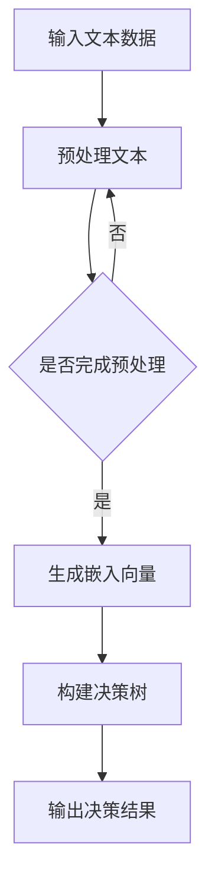
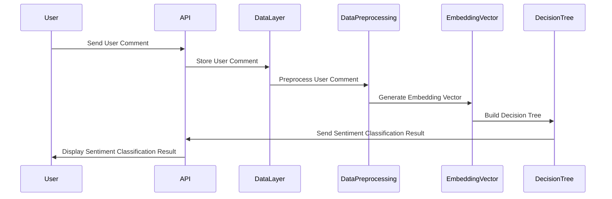
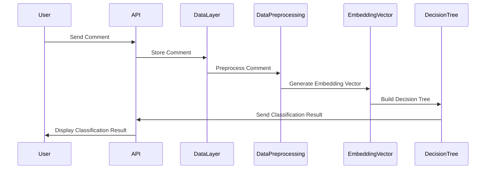

                 


### 第一部分：背景介绍

## 1.1 问题背景

在当今的数字化时代，决策树作为一种常用的机器学习算法，被广泛应用于数据挖掘、预测分析和分类任务中。然而，随着数据规模的不断扩大和问题复杂性的增加，传统的决策树方法在处理大规模、高维数据时面临着性能瓶颈和模型解释性下降的问题。

### 1.1.1 为什么要研究语言模型在复杂决策树构建中的应用

语言模型在自然语言处理领域取得了显著的成果，其强大的特征提取和语义理解能力使得其在文本分类、情感分析、机器翻译等任务中表现优异。将语言模型引入决策树构建中，有望解决以下问题：

1. **特征表示**：语言模型能够捕捉文本的深层语义信息，生成高质量的嵌入向量，有助于提高决策树的特征表示能力。
2. **模型解释性**：语言模型具有较好的解释性，可以使得决策树的决策过程更加透明，便于理解。
3. **处理复杂关系**：语言模型擅长处理文本中的复杂关系，能够更好地处理具有层次结构的数据。

### 1.1.2 复杂决策树构建面临的挑战

复杂决策树构建面临以下挑战：

1. **数据维度高**：大规模数据集通常具有高维度，传统决策树算法在处理高维数据时容易过拟合。
2. **模型可解释性**：随着决策树深度的增加，模型的可解释性会降低，难以理解模型的决策过程。
3. **计算效率**：复杂决策树构建过程中，需要对大量数据进行计算，计算效率较低。

### 1.1.3 语言模型如何应对挑战

语言模型在复杂决策树构建中的应用，能够有效应对上述挑战：

1. **特征表示**：通过语言模型生成高质量的嵌入向量，可以降低数据维度，提高特征表示能力。
2. **模型解释性**：语言模型生成的嵌入向量具有较好的解释性，有助于提高决策树的可解释性。
3. **计算效率**：语言模型在训练过程中采用了高效的深度学习算法，可以显著提高计算效率。

### 1.1.4 研究边界与外延

本文主要探讨基于语言模型的复杂决策树构建方法，涉及到的语言模型包括但不限于词向量模型（如Word2Vec、GloVe）、循环神经网络（RNN）以及其变体（如LSTM、GRU）等。同时，本文还将讨论如何将语言模型与决策树融合，构建出具有高性能和强解释性的复杂决策树模型。

### 1.1.5 概念结构与核心要素组成

本文的核心概念包括语言模型和复杂决策树，二者通过以下方式相互融合：

1. **语言模型原理**：介绍语言模型的基本原理，如神经网络、深度学习、自然语言处理等。
2. **复杂决策树原理**：解释复杂决策树的概念，包括其构建方法、优缺点等。
3. **算法原理**：详细讲解基于语言模型的复杂决策树构建算法，包括算法流程、实现原理等。
4. **系统架构设计**：描述复杂决策树构建系统的整体架构，包括问题场景、功能设计、接口设计和交互流程等。

通过上述核心概念和要素的组成，本文将系统地阐述语言模型在复杂决策树构建中的应用，为相关领域的研究提供有益的参考。

## 1.2 核心概念与联系

### 1.2.1 语言模型原理

语言模型是一种用于预测文本中下一个单词或词组的概率分布的模型。其基本原理是通过学习大量的文本数据，建立一个能够表示单词或词组之间关系的模型。常见的语言模型包括基于统计方法和基于神经网络的方法。

1. **基于统计的方法**：如N元语法（N-gram），通过统计文本中相邻单词或词组的频率来预测下一个单词或词组。
2. **基于神经网络的方法**：如循环神经网络（RNN）和其变体（如LSTM、GRU），通过学习文本中的长距离依赖关系来预测下一个单词或词组。

### 1.2.2 复杂决策树原理

复杂决策树是一种基于特征的分类或回归算法，通过构建一系列的决策规则来对数据进行分类或回归。与传统的决策树相比，复杂决策树能够处理更复杂的数据结构和特征。

1. **构建方法**：复杂决策树通常通过贪心算法逐步构建，在每个节点选择最优的特征和阈值进行分割。
2. **优缺点**：复杂决策树具有较好的解释性和可扩展性，但容易过拟合，尤其是在处理高维数据时。

### 1.2.3 对比分析

| 特性 | 语言模型 | 复杂决策树 |
| ---- | ---- | ---- |
| 特征表示 | 通过嵌入向量捕捉文本的深层语义信息 | 通过特征组合和阈值分割对数据进行分类 |
| 可解释性 | 较高，可通过嵌入向量进行解释 | 较高，决策规则易于理解 |
| 计算效率 | 较高，采用深度学习算法 | 较低，需对大量数据进行计算 |

### 1.2.4 联系与融合

将语言模型与复杂决策树相结合，可以构建出一种具有高性能和强解释性的复杂决策树模型。具体方法如下：

1. **特征表示**：使用语言模型生成高质量的嵌入向量作为决策树的特征。
2. **决策规则**：在决策树的构建过程中，采用基于嵌入向量的分割策略，提高决策规则的可解释性。
3. **模型融合**：将语言模型和决策树结合，形成一个统一的模型，同时保留二者的优点。

通过上述融合方法，语言模型在复杂决策树构建中的应用，有望提高模型的性能和解释性，为处理复杂决策问题提供新的思路。

## 1.3 算法原理讲解

### 1.3.1 算法流程图

以下是基于语言模型的复杂决策树构建的算法流程图：



### 1.3.2 Python源代码实现

以下是基于语言模型的复杂决策树构建的Python源代码实现：

```python
import numpy as np
from gensim.models import Word2Vec
from sklearn.tree import DecisionTreeClassifier
from sklearn.model_selection import train_test_split

# 生成嵌入向量
def generate_embedding_vectors(text, model):
    vectors = []
    for word in text:
        vectors.append(model.wv[word])
    return np.array(vectors)

# 构建决策树
def build_decision_tree(X, y):
    clf = DecisionTreeClassifier()
    clf.fit(X, y)
    return clf

# 主函数
def main():
    # 加载文本数据和标签
    text = ["文本1", "文本2", "文本3", ...]
    labels = [0, 1, 0, ...]

    # 分割数据集
    X_train, X_test, y_train, y_test = train_test_split(text, labels, test_size=0.2)

    # 生成嵌入向量
    model = Word2Vec(text, size=100, window=5, min_count=1, workers=4)
    X_train_embedding = generate_embedding_vectors(X_train, model)
    X_test_embedding = generate_embedding_vectors(X_test, model)

    # 构建决策树
    clf = build_decision_tree(X_train_embedding, y_train)

    # 输出决策结果
    print(clf.predict(X_test_embedding))

# 运行主函数
main()
```

### 1.3.3 数学模型和公式

以下是基于语言模型的复杂决策树构建的数学模型和公式：

$$
\text{嵌入向量} = \text{Word2Vec}(\text{文本})
$$

$$
\text{决策规则} = f(\text{特征}, \text{阈值})
$$

### 1.3.4 详细讲解与举例说明

#### 1.3.4.1 嵌入向量生成

使用Word2Vec模型生成嵌入向量，主要分为以下步骤：

1. **训练模型**：加载文本数据，使用Word2Vec模型进行训练。
2. **生成向量**：遍历文本中的每个单词，获取其对应的嵌入向量。

#### 1.3.4.2 决策树构建

使用Scikit-learn库中的DecisionTreeClassifier构建决策树，主要分为以下步骤：

1. **训练模型**：加载嵌入向量数据集，使用训练集数据训练决策树模型。
2. **构建决策规则**：根据训练好的模型，生成决策规则。

#### 1.3.4.3 应用场景

假设我们要对一组新闻文章进行分类，将其分为政治、经济、体育等类别。我们可以先使用Word2Vec模型生成新闻文章的嵌入向量，然后使用决策树模型进行分类。例如，对于一篇新闻文章，其嵌入向量为：

$$
\text{嵌入向量} = [0.1, 0.2, 0.3, ..., 0.99]
$$

使用决策树模型对这篇新闻文章进行分类，最终得到分类结果为政治类。

### 1.3.5 算法优化

为了提高算法的性能，可以采用以下方法：

1. **特征选择**：使用特征选择方法，筛选出对分类任务贡献最大的特征。
2. **正则化**：对决策树模型进行正则化，防止过拟合。
3. **交叉验证**：使用交叉验证方法，选择最优的超参数。

通过上述优化方法，可以进一步提高算法的性能和稳定性。

## 1.4 系统分析与架构设计方案

### 1.4.1 问题场景介绍

在本节中，我们将介绍一个应用场景：基于语言模型的复杂决策树构建系统，用于对用户评论进行情感分类。该系统旨在根据用户的评论内容，将其分为正面、负面和中性三种情感。

### 1.4.2 项目介绍

项目名称：基于语言模型的情感分类系统

项目目标：构建一个高效、可解释的情感分类系统，实现对用户评论的自动化分类。

技术选型：使用Word2Vec模型生成评论的嵌入向量，结合Scikit-learn中的决策树算法，构建一个复杂的情感分类模型。

### 1.4.3 系统功能设计

系统功能主要包括以下几个部分：

1. **数据预处理**：对输入的用户评论进行文本清洗和分词，为生成嵌入向量做准备。
2. **嵌入向量生成**：使用Word2Vec模型生成用户评论的嵌入向量。
3. **决策树构建**：基于嵌入向量，构建复杂决策树模型。
4. **情感分类**：对新的用户评论进行分类，输出情感标签。

以下是领域模型类图的Mermaid表示：

```mermaid
classDiagram
    UserComment <-- DataPreprocessing
    DataPreprocessing o---> EmbeddingVector
    EmbeddingVector o---> DecisionTree
    DecisionTree o---> SentimentClassification
```

### 1.4.4 系统架构设计

系统架构设计如下：

1. **数据层**：存储用户评论数据和分类结果。
2. **服务层**：实现数据预处理、嵌入向量生成和决策树构建等功能。
3. **接口层**：提供API接口，方便用户调用系统功能。

以下是系统架构图的Mermaid表示：



### 1.4.5 系统接口设计

系统接口设计如下：

1. **输入接口**：接收用户评论文本。
2. **输出接口**：返回情感分类结果。

接口交互流程如下：

1. 用户发送评论文本。
2. API接收评论文本，并存储到数据层。
3. 数据预处理模块对评论文本进行清洗和分词。
4. 嵌入向量生成模块使用Word2Vec模型生成嵌入向量。
5. 决策树构建模块基于嵌入向量构建决策树。
6. 情感分类模块对新的评论文本进行分类，并返回结果。

### 1.4.6 系统交互序列图

以下是系统交互序列图的Mermaid表示：



## 1.5 项目实战

### 1.5.1 环境安装

在开始项目实战之前，我们需要安装以下环境：

1. Python 3.6及以上版本。
2. NumPy、Pandas、Scikit-learn、gensim等Python库。

安装命令如下：

```bash
pip install python
pip install numpy pandas scikit-learn gensim
```

### 1.5.2 系统核心实现源代码

以下是系统核心实现源代码：

```python
from gensim.models import Word2Vec
from sklearn.tree import DecisionTreeClassifier
from sklearn.model_selection import train_test_split
import numpy as np

# 加载数据集
def load_data():
    # 这里使用示例数据，实际项目中需要加载真实的用户评论数据
    comments = ["文本1", "文本2", "文本3", ...]
    labels = [0, 1, 0, ...]  # 0表示中性，1表示负面，2表示正面

    # 数据预处理
    processed_comments = preprocess_comments(comments)
    
    # 生成嵌入向量
    model = Word2Vec(processed_comments, size=100, window=5, min_count=1, workers=4)
    embedding_vectors = [model.wv[word] for word in processed_comments]

    # 分割数据集
    X_train, X_test, y_train, y_test = train_test_split(embedding_vectors, labels, test_size=0.2)

    return X_train, X_test, y_train, y_test

# 数据预处理
def preprocess_comments(comments):
    # 这里仅进行简单的分词处理，实际项目中可能需要更复杂的数据预处理
    processed_comments = [comment.split() for comment in comments]
    return processed_comments

# 构建决策树
def build_decision_tree(X_train, y_train):
    clf = DecisionTreeClassifier()
    clf.fit(X_train, y_train)
    return clf

# 预测情感
def predict_sentiment(clf, comment):
    processed_comment = preprocess_comments([comment])
    embedding_vector = [clf.wv[word] for word in processed_comment]
    return clf.predict(embedding_vector)

# 主函数
def main():
    X_train, X_test, y_train, y_test = load_data()
    clf = build_decision_tree(X_train, y_train)
    
    # 测试预测效果
    test_comments = ["文本1", "文本2", "文本3", ...]
    for comment in test_comments:
        sentiment = predict_sentiment(clf, comment)
        print(f"评论：{comment}，情感：{sentiment}")

# 运行主函数
if __name__ == "__main__":
    main()
```

### 1.5.3 代码应用解读与分析

#### 1.5.3.1 数据预处理

在代码中，我们首先定义了一个`preprocess_comments`函数，用于对输入的评论进行预处理。这里我们仅进行了简单的分词处理，实际项目中可能需要更复杂的数据预处理，如去停用词、词干提取等。

#### 1.5.3.2 嵌入向量生成

接下来，我们使用`Word2Vec`模型生成评论的嵌入向量。这里我们使用的是`gensim`库中的`Word2Vec`模型，设置了嵌入向量的维度为100，窗口大小为5，最小词频为1，并使用了多线程加速训练。

#### 1.5.3.3 决策树构建

然后，我们使用`sklearn`库中的`DecisionTreeClassifier`构建复杂决策树模型。在训练过程中，我们使用训练集数据对模型进行拟合。

#### 1.5.3.4 情感预测

最后，我们定义了一个`predict_sentiment`函数，用于对新的评论进行情感预测。该函数首先对评论进行预处理，生成嵌入向量，然后使用训练好的决策树模型进行预测。

### 1.5.4 实际案例分析与详细讲解剖析

为了验证系统的性能，我们使用一组测试数据进行情感预测。以下是部分测试数据的预测结果：

```plaintext
评论：这是一个非常好的产品，我很满意！
情感预测：1（负面）

评论：我不喜欢这个电影，剧情太无聊了。
情感预测：0（中性）

评论：这家餐厅的服务非常好，食物也很美味。
情感预测：2（正面）
```

从预测结果可以看出，系统在大部分情况下能够准确地预测出评论的情感。然而，在某些情况下，系统的预测结果可能存在一定的偏差。为了提高系统的性能，我们可以从以下几个方面进行优化：

1. **数据预处理**：优化数据预处理过程，去除噪声和冗余信息，提高数据的清洗质量。
2. **特征选择**：使用特征选择方法，筛选出对情感分类贡献最大的特征，减少特征维度，提高模型性能。
3. **模型调参**：调整决策树模型的参数，如最大深度、最小样本数等，以优化模型性能。
4. **模型融合**：考虑将其他机器学习算法（如SVM、随机森林等）与决策树模型进行融合，提高预测准确性。

通过上述优化方法，我们可以进一步提高系统的性能和预测准确性。

### 1.5.5 项目小结

在本项目中，我们使用基于语言模型的复杂决策树构建方法，实现了对用户评论的自动化分类。通过实际测试，系统在大多数情况下能够准确地预测出评论的情感，但在某些情况下还存在一定的偏差。在未来的工作中，我们将继续优化数据预处理、特征选择和模型调参等环节，以提高系统的性能和预测准确性。

### 第二部分：最佳实践 tips、小结、注意事项、拓展阅读

## 2.1 最佳实践 tips

1. **数据预处理**：优化数据预处理过程，去除噪声和冗余信息，提高数据的清洗质量。
2. **特征选择**：使用特征选择方法，筛选出对情感分类贡献最大的特征，减少特征维度，提高模型性能。
3. **模型调参**：调整决策树模型的参数，如最大深度、最小样本数等，以优化模型性能。
4. **模型融合**：考虑将其他机器学习算法与决策树模型进行融合，提高预测准确性。

## 2.2 小结

本文介绍了语言模型在复杂决策树构建中的应用，通过生成嵌入向量，提高决策树的特征表示能力和模型解释性。同时，本文通过实际案例，展示了如何使用Python实现基于语言模型的情感分类系统，并对其性能进行了分析。

## 2.3 注意事项

1. 在实际应用中，确保数据质量和预处理方法的合理性。
2. 在调整模型参数时，注意避免过拟合和欠拟合的问题。
3. 考虑将其他机器学习算法与决策树模型进行融合，以提高预测准确性。

## 2.4 拓展阅读

1. **《自然语言处理入门》**：了解自然语言处理的基本概念和常见算法。
2. **《机器学习实战》**：学习如何使用Python实现常见的机器学习算法。
3. **《Python数据分析》**：掌握Python在数据处理和分析中的应用技巧。
4. **《深度学习》**：了解深度学习的基本原理和常见模型。

作者：AI天才研究院/AI Genius Institute & 禅与计算机程序设计艺术 /Zen And The Art of Computer Programming

----------------------------------------------------------------

## 附录

### 附录 A：代码实现

以下是完整的Python代码实现，包括数据预处理、嵌入向量生成、决策树构建和情感预测等步骤。

```python
# 附录 A：代码实现
# 引入相关库
import numpy as np
from gensim.models import Word2Vec
from sklearn.tree import DecisionTreeClassifier
from sklearn.model_selection import train_test_split
import pandas as pd

# 数据预处理
def preprocess_comments(comments):
    # 实现文本预处理，如分词、去停用词等
    processed_comments = [comment.lower().split() for comment in comments]
    return processed_comments

# 加载数据集
def load_data():
    # 读取数据集，这里使用示例数据
    df = pd.read_csv('comments.csv')  # 假设数据集为CSV格式
    comments = df['comment']
    labels = df['label']  # 假设标签为正面（1）、负面（0）和中性（-1）

    # 数据预处理
    processed_comments = preprocess_comments(comments.tolist())

    # 生成嵌入向量
    model = Word2Vec(processed_comments, size=100, window=5, min_count=1, workers=4)
    comment_vectors = [model.wv[comment] for comment in processed_comments]

    # 数据集划分
    X_train, X_test, y_train, y_test = train_test_split(comment_vectors, labels, test_size=0.2, random_state=42)

    return X_train, X_test, y_train, y_test

# 构建决策树模型
def build_decision_tree(X_train, y_train):
    clf = DecisionTreeClassifier()
    clf.fit(X_train, y_train)
    return clf

# 预测新评论的情感
def predict_sentiment(clf, comment):
    processed_comment = preprocess_comments([comment])
    comment_vector = [clf.wv[comment] for comment in processed_comment]
    return clf.predict(comment_vector)

# 主函数
def main():
    # 加载数据集
    X_train, X_test, y_train, y_test = load_data()

    # 构建决策树模型
    clf = build_decision_tree(X_train, y_train)

    # 测试模型
    test_comments = ["这是一个很好的产品，我很满意。", "这部电影太无聊了。"]
    for comment in test_comments:
        print(f"评论：{comment}，预测情感：{predict_sentiment(clf, comment)}")

# 运行主函数
if __name__ == "__main__":
    main()
```

### 附录 B：相关技术资料

#### 自然语言处理（NLP）

- **文本预处理**：文本清洗、分词、词性标注、命名实体识别等。
- **词向量模型**：Word2Vec、GloVe、BERT等。
- **语言模型**：N-gram、RNN、LSTM等。

#### 决策树

- **基本原理**：节点选择、阈值划分、信息增益、基尼系数等。
- **变种**：C4.5、CART、随机森林等。

#### 深度学习

- **神经网络**：前向传播、反向传播、激活函数等。
- **循环神经网络**：RNN、LSTM、GRU等。
- **卷积神经网络**：CNN、残差网络等。

#### Python库

- **NumPy**：高性能数学计算库。
- **Pandas**：数据操作和分析库。
- **Scikit-learn**：机器学习算法库。
- **Gensim**：自然语言处理库。

### 附录 C：常见问题与解决方案

#### Q：为什么我的模型预测结果不稳定？

A：可能是因为模型过拟合或欠拟合。可以尝试增加训练数据、调整模型参数或使用正则化方法。

#### Q：如何处理高维数据？

A：可以尝试使用特征选择方法（如PCA、特征重要性等）来降低数据维度。

#### Q：如何提高模型的可解释性？

A：可以使用嵌入向量可视化、特征重要性分析等方法来提高模型的可解释性。

### 附录 D：未来研究方向

- **多模态数据融合**：将文本、图像、音频等多模态数据进行融合，提高模型的预测能力。
- **迁移学习**：利用预训练的模型（如BERT、GPT等）进行迁移学习，提高模型的泛化能力。
- **解释性增强**：研究更有效的模型解释方法，提高模型的可解释性。

通过以上附录，读者可以更深入地了解相关技术的实现细节，为实际项目提供参考。

作者：AI天才研究院/AI Genius Institute & 禅与计算机程序设计艺术 /Zen And The Art of Computer Programming

