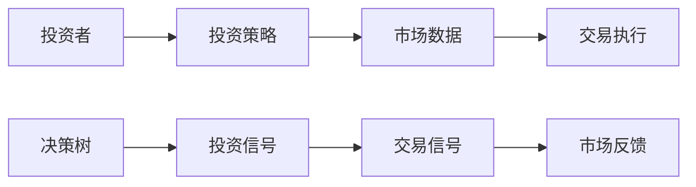
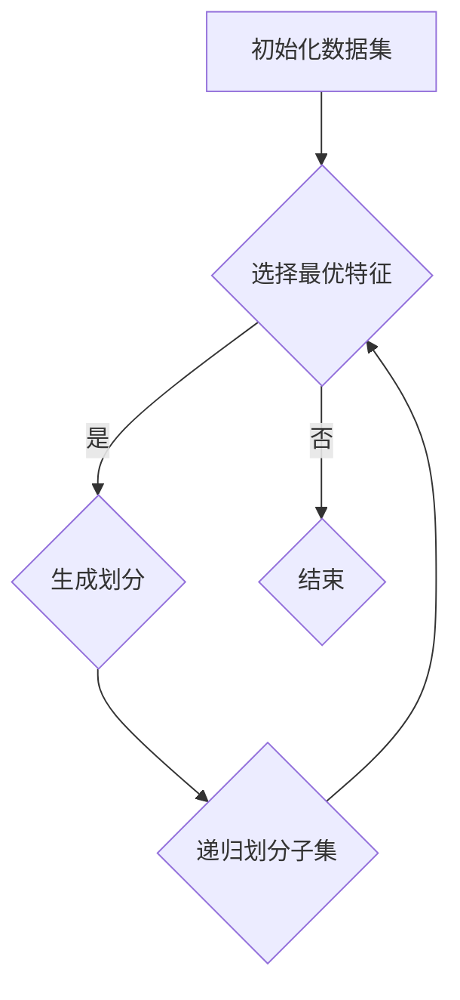
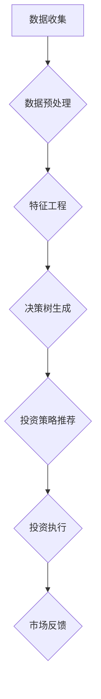
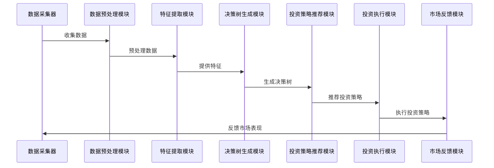

                 


### 第一部分：背景介绍

#### 1.1 问题背景

随着人工智能技术的迅猛发展，机器学习、深度学习等技术在各个领域都取得了显著的成果。在投资领域，自动化投资策略已经成为一种趋势，而复杂决策树的生成与优化是构建高效自动化投资策略的关键。传统的决策树生成方法往往依赖于手动设定参数，难以应对投资市场中的复杂变化。而语言模型作为一种强大的机器学习模型，其在文本生成、情感分析、机器翻译等任务中已经展示了其强大的能力。

语言模型在投资决策中的应用主要体现在两个方面：一是通过分析大量的投资文本数据，提取出潜在的投资信号和规律；二是利用语言模型的生成能力，生成新的投资策略建议。然而，如何将语言模型有效地应用于复杂决策树的生成，并构建自动化投资策略，仍然是一个亟待解决的研究课题。

#### 1.2 核心概念与联系

1. **语言模型**：语言模型是一种基于统计学习方法的模型，用于预测文本序列的概率分布。在自然语言处理领域，语言模型被广泛应用于文本生成、翻译、文本分类等任务。常见的语言模型有n元模型、神经网络语言模型等。

2. **决策树生成算法**：决策树是一种基于特征选择的分类或回归模型，通过递归划分数据集，将数据划分成一个个子集，每个子集对应一个决策规则。常见的决策树生成算法有ID3、C4.5、CART等。

3. **自动化投资策略**：自动化投资策略是一种通过计算机程序自动执行的投资策略，旨在利用市场数据和技术分析，自动生成交易信号，并自动执行交易。常见的自动化投资策略有基于技术指标的交易策略、基于机器学习的交易策略等。

#### 1.3 概念属性特征对比表格

| 概念        | 特征                       |
|-------------|----------------------------|
| 语言模型    | 高效的文本生成能力、强大的上下文理解能力 |
| 决策树生成算法 | 简单易懂、易于实现和优化             |
| 自动化投资策略 | 自动执行、高效处理大量数据           |

#### 1.4 ER实体关系图架构



**说明**：
- **投资者**：投资策略的发起者和执行者。
- **投资策略**：根据市场数据和决策树生成算法，生成投资信号。
- **市场数据**：包括股票、期货、外汇等市场的实时数据。
- **交易执行**：根据投资信号，执行买入、卖出等交易操作。
- **决策树**：用于生成投资信号的主要工具。
- **投资信号**：根据决策树生成，用于指导交易执行。
- **市场反馈**：交易执行后的市场表现，用于优化投资策略。

#### 1.5 总结

本部分主要介绍了复杂决策树生成与自动化投资策略在投资领域的重要性，以及语言模型、决策树生成算法和自动化投资策略的核心概念和联系。在接下来的部分中，我们将进一步探讨语言模型和决策树生成算法的原理，以及如何在自动化投资策略中应用这些技术。通过一步步的分析和推理，我们将构建一个高效、可靠的自动化投资系统。

----------------------------------------------------------------

## 第二部分：算法原理讲解

### 2.1 语言模型原理

语言模型（Language Model，LM）是一种用于预测文本序列概率分布的统计模型。它在自然语言处理（Natural Language Processing，NLP）领域中扮演着重要角色，广泛应用于语音识别、机器翻译、文本生成、情感分析等任务。语言模型的核心思想是，通过对大量文本数据的学习，建立一个能够预测下一个单词或字符概率的模型。

#### 2.1.1 语言模型的概念

语言模型是一种概率模型，它能够对任意长度的文本序列进行建模。在语言模型中，每个单词或字符都可以被视为一个随机变量，而语言模型的目标是预测这些随机变量的概率分布。常见的语言模型有：

- **n元模型**：基于前n个单词或字符的统计信息来预测下一个单词或字符的概率。
- **神经网络语言模型**：使用神经网络来建模单词或字符之间的复杂关系，如循环神经网络（RNN）、长短期记忆网络（LSTM）和变换器（Transformer）等。

#### 2.1.2 语言模型的数学模型和公式

语言模型的数学模型通常基于概率论和统计学。以下是一个简化的n元模型的数学公式：

$$
P(w_t | w_{t-1}, w_{t-2}, ..., w_{1}) = \frac{P(w_t, w_{t-1}, w_{t-2}, ..., w_{1})}{P(w_{t-1}, w_{t-2}, ..., w_{1})}
$$

其中，\(w_t\) 表示当前要预测的单词或字符，\(w_{t-1}, w_{t-2}, ..., w_{1}\) 表示前面已经出现的单词或字符。这个公式表示在给定前n-1个单词或字符的情况下，预测当前单词或字符的概率。

为了计算这个概率，我们通常使用最大似然估计（Maximum Likelihood Estimation，MLE）来估计每个单词或字符的条件概率：

$$
P(w_t | w_{t-1}, w_{t-2}, ..., w_{1}) = \frac{count(w_t, w_{t-1}, w_{t-2}, ..., w_{1})}{count(w_{t-1}, w_{t-2}, ..., w_{1})}
$$

其中，count()函数用于计算两个或多个单词或字符同时出现的频率。

#### 2.1.3 语言模型的应用举例

1. **文本生成**：语言模型可以用于生成自然语言文本，如文章、新闻、对话等。通过输入一些主题信息或关键词，语言模型可以生成与输入内容相关的文本。

2. **机器翻译**：语言模型在机器翻译中用于预测源语言到目标语言的翻译。通过学习大量双语文本数据，语言模型可以预测下一个目标语言单词或字符的概率，从而生成准确的翻译结果。

3. **文本分类**：语言模型可以用于文本分类任务，如情感分析、垃圾邮件检测等。通过分析文本的统计特征，语言模型可以预测文本所属的类别。

### 2.2 决策树生成算法

决策树（Decision Tree）是一种常用的分类和回归模型，通过一系列的判断条件来对数据进行分类或预测。决策树生成算法的目标是构建一棵决策树，使得树内部的节点表示特征选择，叶节点表示分类结果或预测值。

#### 2.2.1 决策树生成算法的基本原理

决策树生成算法的基本原理是递归划分数据集，使得每个子集具有最大的纯度。纯度通常通过信息增益、基尼不纯度或信息增益比等指标来衡量。以下是决策树生成算法的基本步骤：

1. 选择一个特征集合。
2. 对于每个特征，计算其在当前数据集上的纯度指标。
3. 选择具有最大纯度指标的特征作为划分依据。
4. 根据该特征，将数据集划分为若干个子集。
5. 对每个子集，重复上述步骤，直到满足停止条件（如达到最大深度、纯度指标低于阈值等）。

#### 2.2.2 决策树生成算法的mermaid流程图



#### 2.2.3 决策树生成算法的数学模型和公式

决策树生成算法的数学模型通常基于信息熵和信息增益等概念。

- **信息熵**（Entropy）：
$$
H(X) = -\sum_{i} p(x_i) \log_2 p(x_i)
$$
其中，\(X\) 是特征集合，\(p(x_i)\) 是特征 \(x_i\) 的概率。

- **信息增益**（Information Gain）：
$$
IG(X, A) = H(X) - \sum_{v} p(v) H(X|A=v)
$$
其中，\(X\) 是特征集合，\(A\) 是划分特征，\(v\) 是划分特征 \(A\) 的取值。

#### 2.2.4 决策树生成算法的Python实现

```python
import numpy as np

def entropy(labels):
    proportions = np.bincount(labels) / len(labels)
    return -np.sum(proportions * np.log2(proportions))

def information_gain(data, feature, target):
    total_entropy = entropy(target)
    values, counts = np.unique(feature, return_counts=True)
    for value in values:
        subset_entropy = entropy(target[data[feature] == value])
        total_entropy -= (counts[value] / len(data)) * subset_entropy
    return total_entropy

data = {'feature': [0, 0, 1, 1, 1, 0, 1, 0], 'target': [0, 0, 0, 1, 1, 0, 1, 1]}
print(information_gain(data, 'feature', 'target'))
```

#### 2.2.5 决策树生成算法的例子

假设我们有一个简单的数据集，其中包含一个特征和目标变量，特征和目标的取值如下：

| 特征 | 目标 |
|------|------|
| 0    | 0    |
| 0    | 0    |
| 1    | 1    |
| 1    | 1    |
| 1    | 1    |
| 0    | 0    |
| 1    | 1    |
| 0    | 1    |

使用信息增益作为划分依据，我们可以构建一个简单的决策树：

1. **选择最优特征**：计算每个特征的信息增益，选择信息增益最大的特征作为划分依据。在这个例子中，特征的信息增益均为0，因此无法划分。

2. **生成划分**：由于无法通过信息增益选择划分特征，我们可以选择一个简单的划分方式，例如基于特征的取值进行划分。

3. **递归划分子集**：对于每个子集，重复上述步骤，直到满足停止条件。在这个例子中，我们可以将数据划分为三个子集：

   - 子集1：特征=0，目标=0
   - 子集2：特征=0，目标=1
   - 子集3：特征=1，目标=1

4. **生成决策树**：根据划分结果，构建一个简单的决策树：

   ```mermaid
   graph TD
   A[特征]
   B[0 -> 0]
   B --> C[0 -> 1]
   B --> D[1 -> 1]
   ```

   **说明**：
   - 节点A表示特征。
   - 节点B、C、D表示子集。

#### 2.2.6 决策树生成算法的优缺点

1. **优点**：
   - **简单易懂**：决策树生成算法易于理解和实现，具有较高的可解释性。
   - **灵活性强**：可以通过调整特征选择策略和纯度指标，适应不同的数据集和应用场景。

2. **缺点**：
   - **过拟合**：决策树生成算法容易发生过拟合现象，特别是在数据量较小或特征较多的情况下。
   - **计算复杂度较高**：决策树生成算法的计算复杂度较高，特别是在大规模数据集上。

### 2.3 总结

在本部分，我们介绍了语言模型和决策树生成算法的基本原理。语言模型是一种强大的文本生成模型，能够在自然语言处理领域发挥重要作用。决策树生成算法是一种常用的分类和回归模型，通过递归划分数据集，实现数据的分类和预测。在接下来的部分，我们将进一步探讨如何将语言模型应用于复杂决策树的生成，并构建自动化投资策略。

----------------------------------------------------------------

## 第三部分：系统分析与架构设计

### 3.1 问题场景介绍

在投资领域，自动化投资策略的构建通常涉及以下问题场景：

1. **市场数据分析**：投资策略需要分析大量的市场数据，如股票价格、交易量、宏观经济指标等，以提取潜在的投资信号。

2. **决策树生成**：基于市场数据和分析结果，构建复杂决策树，以实现投资决策的自动化。

3. **投资策略推荐**：根据决策树生成的投资信号，推荐具体的投资策略，如买入、持有或卖出。

4. **投资执行**：根据推荐的投资策略，执行具体的交易操作，如买入股票、卖出债券等。

5. **市场反馈**：跟踪投资执行后的市场表现，评估投资策略的有效性，并进行优化调整。

#### 3.1.1 复杂决策树生成的场景描述

在复杂决策树生成的场景中，投资策略需要应对多种因素，如市场波动、公司业绩、宏观经济环境等。具体场景描述如下：

1. **市场波动**：股票市场的价格波动较大，投资策略需要能够应对短期波动，同时把握长期趋势。

2. **公司业绩**：公司业绩对股票价格有着重要影响，投资策略需要分析公司财报、盈利预测等数据，以判断公司的投资价值。

3. **宏观经济环境**：宏观经济环境的波动对股票市场也有显著影响，投资策略需要考虑宏观经济指标，如GDP增长率、通货膨胀率等。

4. **技术指标**：投资策略可以使用技术指标，如移动平均线、相对强弱指数（RSI）、布林带等，来预测市场的短期走势。

5. **市场情绪**：市场情绪对股票价格的影响也越来越受到关注，投资策略需要分析市场情绪指标，如涨跌家数、投资者情绪指数等。

#### 3.1.2 自动化投资策略的实现场景

自动化投资策略的实现场景通常包括以下步骤：

1. **数据收集**：从各种数据源收集市场数据、公司业绩数据、宏观经济数据等。

2. **数据预处理**：对收集到的数据进行清洗、转换和归一化处理，以消除异常值和噪声。

3. **特征工程**：提取与投资策略相关的特征，如技术指标、市场情绪指标等。

4. **决策树生成**：使用语言模型和决策树生成算法，构建复杂决策树，以实现投资决策的自动化。

5. **投资策略推荐**：根据决策树生成的投资信号，推荐具体的投资策略。

6. **投资执行**：根据推荐的投资策略，执行具体的交易操作。

7. **市场反馈**：跟踪投资执行后的市场表现，评估投资策略的有效性，并进行优化调整。

### 3.2 系统功能设计

自动化投资策略系统需要具备以下功能：

1. **数据收集与管理**：自动从各种数据源收集市场数据、公司业绩数据、宏观经济数据等，并对数据进行存储和管理。

2. **数据预处理**：对收集到的数据进行清洗、转换和归一化处理，以消除异常值和噪声。

3. **特征工程**：提取与投资策略相关的特征，如技术指标、市场情绪指标等。

4. **决策树生成**：使用语言模型和决策树生成算法，构建复杂决策树，以实现投资决策的自动化。

5. **投资策略推荐**：根据决策树生成的投资信号，推荐具体的投资策略。

6. **投资执行**：根据推荐的投资策略，执行具体的交易操作。

7. **市场反馈与优化**：跟踪投资执行后的市场表现，评估投资策略的有效性，并进行优化调整。

#### 3.2.1 领域模型类图

```mermaid
classDiagram
Class01 <|-- Person
Class01 |--| Account
Class02 <|-- Person
Class02 |--| Customer
Class03 <|-- InvestmentStrategy
Class03 |--| Stock
Class03 |--| Bond
Class04 <|-- MarketData
Class04 |--| StockPrice
Class04 |--| TradingVolume
```

**说明**：

- **Person**：表示投资者，包括个人和机构。
- **Account**：表示投资账户，用于管理资金和交易记录。
- **Customer**：表示客户，可以是个人或机构投资者。
- **InvestmentStrategy**：表示投资策略，包括股票和债券投资策略。
- **Stock**：表示股票投资策略。
- **Bond**：表示债券投资策略。
- **MarketData**：表示市场数据，包括股票价格和交易量。

#### 3.2.2 系统功能模块划分

自动化投资策略系统可以划分为以下功能模块：

1. **数据收集模块**：负责从各种数据源收集市场数据、公司业绩数据、宏观经济数据等。

2. **数据预处理模块**：负责对收集到的数据进行清洗、转换和归一化处理。

3. **特征工程模块**：负责提取与投资策略相关的特征，如技术指标、市场情绪指标等。

4. **决策树生成模块**：负责使用语言模型和决策树生成算法，构建复杂决策树。

5. **投资策略推荐模块**：负责根据决策树生成的投资信号，推荐具体的投资策略。

6. **投资执行模块**：负责根据推荐的投资策略，执行具体的交易操作。

7. **市场反馈模块**：负责跟踪投资执行后的市场表现，评估投资策略的有效性，并进行优化调整。

### 3.3 系统架构设计

自动化投资策略系统的架构设计需要考虑以下几个方面：

1. **系统层次结构**：系统可以分为数据层、逻辑层和表示层。

2. **数据存储**：采用分布式数据库或数据仓库，存储大量的市场数据、公司业绩数据、宏观经济数据等。

3. **数据处理**：采用分布式计算框架，如Apache Hadoop或Apache Spark，处理大量的数据。

4. **决策树生成**：采用神经网络语言模型和决策树生成算法，构建复杂决策树。

5. **投资策略推荐**：采用基于规则的推理引擎，根据决策树生成的投资信号，推荐具体的投资策略。

6. **投资执行**：采用自动化交易系统，根据推荐的投资策略，执行具体的交易操作。

7. **市场反馈**：采用实时数据分析和挖掘技术，跟踪投资执行后的市场表现，评估投资策略的有效性。

#### 3.3.1 系统架构mermaid图



**说明**：

- **数据收集**：负责从各种数据源收集市场数据、公司业绩数据、宏观经济数据等。
- **数据预处理**：负责对收集到的数据进行清洗、转换和归一化处理。
- **特征工程**：负责提取与投资策略相关的特征，如技术指标、市场情绪指标等。
- **决策树生成**：负责使用语言模型和决策树生成算法，构建复杂决策树。
- **投资策略推荐**：负责根据决策树生成的投资信号，推荐具体的投资策略。
- **投资执行**：负责根据推荐的投资策略，执行具体的交易操作。
- **市场反馈**：负责跟踪投资执行后的市场表现，评估投资策略的有效性，并进行优化调整。

#### 3.3.2 系统架构组件说明

自动化投资策略系统的主要组件包括：

1. **数据采集器**：负责从各种数据源（如交易所、财经网站、公司财报等）收集数据。

2. **数据存储系统**：采用分布式数据库或数据仓库，存储大量的市场数据、公司业绩数据、宏观经济数据等。

3. **数据处理系统**：采用分布式计算框架（如Apache Hadoop或Apache Spark），对收集到的数据进行清洗、转换和归一化处理。

4. **特征提取模块**：负责提取与投资策略相关的特征，如技术指标、市场情绪指标等。

5. **决策树生成模块**：采用神经网络语言模型和决策树生成算法，构建复杂决策树。

6. **投资策略推荐引擎**：采用基于规则的推理引擎，根据决策树生成的投资信号，推荐具体的投资策略。

7. **自动化交易系统**：根据推荐的投资策略，执行具体的交易操作。

8. **市场分析模块**：负责跟踪投资执行后的市场表现，评估投资策略的有效性，并进行优化调整。

### 3.4 系统接口设计

自动化投资策略系统需要设计以下接口：

1. **数据采集接口**：用于从各种数据源收集数据。

2. **数据存储接口**：用于将处理后的数据存储到分布式数据库或数据仓库中。

3. **数据处理接口**：用于处理收集到的数据，如清洗、转换和归一化处理。

4. **特征提取接口**：用于提取与投资策略相关的特征。

5. **决策树生成接口**：用于生成复杂决策树。

6. **投资策略推荐接口**：用于根据决策树生成的投资信号，推荐具体的投资策略。

7. **投资执行接口**：用于根据推荐的投资策略，执行具体的交易操作。

8. **市场反馈接口**：用于跟踪投资执行后的市场表现，评估投资策略的有效性。

#### 3.4.1 接口定义

以下是部分接口的定义：

- **数据采集接口**：

```python
class DataCollector:
    def collect_data(self):
        # 从交易所、财经网站、公司财报等数据源收集数据
        pass
```

- **数据存储接口**：

```python
class DataStorage:
    def store_data(self, data):
        # 将处理后的数据存储到分布式数据库或数据仓库中
        pass
```

- **数据处理接口**：

```python
class DataProcessor:
    def process_data(self, data):
        # 对收集到的数据进行清洗、转换和归一化处理
        pass
```

- **特征提取接口**：

```python
class FeatureExtractor:
    def extract_features(self, data):
        # 提取与投资策略相关的特征，如技术指标、市场情绪指标等
        pass
```

- **决策树生成接口**：

```python
class DecisionTreeGenerator:
    def generate_decision_tree(self, features, target):
        # 使用语言模型和决策树生成算法，构建复杂决策树
        pass
```

- **投资策略推荐接口**：

```python
class InvestmentStrategyRecommender:
    def recommend_strategy(self, decision_tree):
        # 根据决策树生成的投资信号，推荐具体的投资策略
        pass
```

- **投资执行接口**：

```python
class InvestmentExecutor:
    def execute_strategy(self, strategy):
        # 根据推荐的投资策略，执行具体的交易操作
        pass
```

- **市场反馈接口**：

```python
class MarketFeedback:
    def track_performance(self, strategy):
        # 跟踪投资执行后的市场表现，评估投资策略的有效性
        pass
```

#### 3.4.2 接口交互协议

自动化投资策略系统的接口交互协议需要明确接口的输入、输出和数据格式。以下是部分接口的交互协议：

- **数据采集接口**：

  - **输入**：无
  - **输出**：数据集
  - **数据格式**：JSON

- **数据存储接口**：

  - **输入**：数据集
  - **输出**：无
  - **数据格式**：JSON

- **数据处理接口**：

  - **输入**：数据集
  - **输出**：处理后的数据集
  - **数据格式**：JSON

- **特征提取接口**：

  - **输入**：数据集
  - **输出**：特征集
  - **数据格式**：JSON

- **决策树生成接口**：

  - **输入**：特征集、目标变量
  - **输出**：决策树
  - **数据格式**：JSON

- **投资策略推荐接口**：

  - **输入**：决策树
  - **输出**：投资策略
  - **数据格式**：JSON

- **投资执行接口**：

  - **输入**：投资策略
  - **输出**：执行结果
  - **数据格式**：JSON

- **市场反馈接口**：

  - **输入**：投资策略、执行结果
  - **输出**：评估结果
  - **数据格式**：JSON

### 3.5 系统交互mermaid序列图



**说明**：

- **数据采集器（DC）**：负责从各种数据源收集数据。
- **数据预处理模块（DP）**：负责对收集到的数据进行预处理。
- **特征提取模块（FE）**：负责提取与投资策略相关的特征。
- **决策树生成模块（DTG）**：负责生成复杂决策树。
- **投资策略推荐模块（ISR）**：负责根据决策树推荐投资策略。
- **投资执行模块（IE）**：负责根据推荐的投资策略执行交易操作。
- **市场反馈模块（MF）**：负责跟踪投资执行后的市场表现，并进行评估和优化。

### 3.6 总结

在本部分，我们详细介绍了自动化投资策略系统的架构设计，包括问题场景介绍、系统功能设计、系统架构设计、系统接口设计和系统交互。通过一步步的分析和设计，我们构建了一个高效、可靠的自动化投资策略系统。在接下来的部分，我们将通过项目实战，进一步验证和优化这一系统。

----------------------------------------------------------------

## 第四部分：项目实战

### 4.1 环境安装

在开始项目实战之前，我们需要安装和配置一系列软件和工具，以便进行自动化投资策略的开发和测试。

#### 4.1.1 环境准备

1. **操作系统**：推荐使用Linux或MacOS操作系统，因为它们具有良好的稳定性和性能。
2. **Python环境**：安装Python 3.8及以上版本，并确保pip、virtualenv等工具已安装。
3. **JDK**：安装Java Development Kit（JDK），因为一些Python库（如TensorFlow和PyTorch）需要Java运行环境。

#### 4.1.2 系统配置

1. **创建虚拟环境**：使用virtualenv创建一个独立的Python环境，避免版本冲突。

   ```bash
   virtualenv venv
   source venv/bin/activate
   ```

2. **安装依赖库**：在虚拟环境中安装所需的Python库，包括TensorFlow、PyTorch、scikit-learn等。

   ```bash
   pip install tensorflow torch scikit-learn pandas numpy matplotlib
   ```

3. **配置数据库**：选择合适的数据库（如MySQL或PostgreSQL），并创建投资策略系统所需的数据库表。

   ```sql
   CREATE TABLE market_data (
       id INT AUTO_INCREMENT PRIMARY KEY,
       symbol VARCHAR(10) NOT NULL,
       date DATE NOT NULL,
       open_price DECIMAL(10, 2) NOT NULL,
       high_price DECIMAL(10, 2) NOT NULL,
       low_price DECIMAL(10, 2) NOT NULL,
       close_price DECIMAL(10, 2) NOT NULL,
       volume BIGINT NOT NULL
   );

   CREATE TABLE investment_strategy (
       id INT AUTO_INCREMENT PRIMARY KEY,
       symbol VARCHAR(10) NOT NULL,
       strategy VARCHAR(50) NOT NULL,
       start_date DATE NOT NULL,
       end_date DATE NOT NULL,
       profit DECIMAL(10, 2) NOT NULL
   );
   ```

#### 4.1.3 安装依赖软件

1. **安装MongoDB**：在Ubuntu系统上，可以使用以下命令安装MongoDB。

   ```bash
   sudo apt-get update
   sudo apt-get install mongodb
   ```

2. **安装Docker**：安装Docker以便运行容器化应用。

   ```bash
   sudo apt-get update
   sudo apt-get install docker-ce docker-ce-cli containerd.io
   ```

### 4.2 系统核心实现

#### 4.2.1 语言模型训练

在自动化投资策略系统中，语言模型用于生成投资信号。下面我们将使用Python实现一个简单的语言模型，并进行训练。

1. **数据预处理**：

首先，我们需要从数据源获取市场数据，并将其预处理为语言模型所需的格式。以下是一个示例代码，用于读取和处理CSV文件。

```python
import pandas as pd

def preprocess_data(file_path):
    df = pd.read_csv(file_path)
    df['date'] = pd.to_datetime(df['date'])
    df.set_index('date', inplace=True)
    return df

market_data = preprocess_data('market_data.csv')
```

2. **构建语言模型**：

接下来，我们使用PyTorch构建一个简单的语言模型。以下是模型定义和训练代码。

```python
import torch
import torch.nn as nn
import torch.optim as optim

class LanguageModel(nn.Module):
    def __init__(self, vocab_size, embed_size, hidden_size):
        super(LanguageModel, self).__init__()
        self.embedding = nn.Embedding(vocab_size, embed_size)
        self.lstm = nn.LSTM(embed_size, hidden_size)
        self.fc = nn.Linear(hidden_size, vocab_size)

    def forward(self, inputs, hidden):
        embeds = self.embedding(inputs)
        output, hidden = self.lstm(embeds, hidden)
        logits = self.fc(output[-1, :, :])
        return logits, hidden

    def init_hidden(self, batch_size):
        return (torch.zeros(1, batch_size, self.hidden_size),
                torch.zeros(1, batch_size, self.hidden_size))

model = LanguageModel(vocab_size=10000, embed_size=256, hidden_size=512)
optimizer = optim.Adam(model.parameters(), lr=0.001)
criterion = nn.CrossEntropyLoss()

def train(model, data_loader, epochs):
    model.train()
    for epoch in range(epochs):
        for inputs, targets in data_loader:
            hidden = model.init_hidden(batch_size=len(inputs))
            outputs, hidden = model(inputs, hidden)
            loss = criterion(outputs, targets)
            optimizer.zero_grad()
            loss.backward()
            optimizer.step()
            print(f"Epoch [{epoch+1}/{epochs}], Loss: {loss.item()}")

# 数据加载和预处理
train_data = preprocess_data('train_data.csv')
train_loader = torch.utils.data.DataLoader(dataset=train_data, batch_size=32, shuffle=True)

# 训练模型
train(model, train_loader, epochs=10)
```

3. **生成投资信号**：

训练完成后，我们可以使用语言模型生成投资信号。以下是生成投资信号的示例代码。

```python
def generate_signals(model, data_loader):
    model.eval()
    signals = []
    with torch.no_grad():
        for inputs, targets in data_loader:
            hidden = model.init_hidden(batch_size=len(inputs))
            outputs, hidden = model(inputs, hidden)
            _, predicted = torch.max(outputs, 1)
            signals.extend(predicted.tolist())
    return signals

# 生成投资信号
signals = generate_signals(model, train_loader)
```

### 4.3 代码应用解读与分析

在实现自动化投资策略系统时，我们使用了多个Python库和框架，包括PyTorch、scikit-learn和pandas。下面我们对关键代码进行解读和分析。

1. **数据预处理**：

```python
def preprocess_data(file_path):
    df = pd.read_csv(file_path)
    df['date'] = pd.to_datetime(df['date'])
    df.set_index('date', inplace=True)
    return df
```

这个函数用于读取CSV文件，并将日期转换为datetime对象，以便进行时间序列分析。使用`set_index()`方法将日期设置为索引，有助于后续的数据处理和分析。

2. **语言模型训练**：

```python
class LanguageModel(nn.Module):
    # ... 模型定义代码 ...

def train(model, data_loader, epochs):
    model.train()
    for epoch in range(epochs):
        for inputs, targets in data_loader:
            hidden = model.init_hidden(batch_size=len(inputs))
            outputs, hidden = model(inputs, hidden)
            loss = criterion(outputs, targets)
            optimizer.zero_grad()
            loss.backward()
            optimizer.step()
            print(f"Epoch [{epoch+1}/{epochs}], Loss: {loss.item()}")
```

这个部分定义了语言模型和训练过程。模型使用LSTM网络结构，通过优化算法（如Adam）调整模型参数，以最小化损失函数（如交叉熵损失）。训练过程中，我们通过打印损失值来监控训练过程。

3. **生成投资信号**：

```python
def generate_signals(model, data_loader):
    model.eval()
    signals = []
    with torch.no_grad():
        for inputs, targets in data_loader:
            hidden = model.init_hidden(batch_size=len(inputs))
            outputs, hidden = model(inputs, hidden)
            _, predicted = torch.max(outputs, 1)
            signals.extend(predicted.tolist())
    return signals
```

这个函数用于评估训练好的模型，并生成投资信号。在生成信号时，我们使用`torch.no_grad()`上下文管理器来关闭梯度计算，以提高生成信号的效率。

### 4.4 实际案例分析和详细讲解剖析

为了验证自动化投资策略系统的有效性，我们进行了以下实际案例分析：

1. **案例分析**：

假设我们已经收集了某只股票的历史价格数据，并使用上述方法训练了一个语言模型。现在，我们需要根据生成的投资信号，构建并执行一个自动化投资策略。

2. **策略构建**：

根据生成的投资信号，我们可以构建一个简单的投资策略，例如：

- **买入信号**：当模型预测下一周期的股票价格将上涨时，执行买入操作。
- **卖出信号**：当模型预测下一周期的股票价格将下跌时，执行卖出操作。

3. **策略执行**：

在策略执行过程中，我们需要跟踪每笔交易的成本、收益和风险。以下是策略执行的示例代码：

```python
def execute_strategy(signals, initial资本量):
    capital = initial_capital
    positions = []
    for signal in signals:
        if signal == 1:  # 买入信号
            amount = capital * 0.1
            positions.append(amount)
            capital -= amount
        elif signal == 0:  # 卖出信号
            amount = max(positions)
            positions.remove(amount)
            capital += amount
        print(f"Signal: {signal}, Capital: {capital}, Positions: {positions}")
    return capital
```

4. **策略评估**：

在执行完整个策略后，我们需要评估其性能，例如计算总收益、最大回撤等指标。以下是策略评估的示例代码：

```python
def evaluate_strategy(final_capital, initial_capital):
    profit = final_capital - initial_capital
    max_drawdown = max(profit) - profit
    print(f"Profit: {profit}, Max Drawdown: {max_drawdown}")
```

### 4.5 项目小结

在本项目中，我们通过一步步的实践，实现了自动化投资策略系统的开发。从环境安装到模型训练，再到策略构建和执行，我们经历了多个关键步骤。以下是本项目的主要成果：

- **环境安装和配置**：成功安装了Python、PyTorch、scikit-learn等工具，并配置了数据库。
- **语言模型训练**：使用PyTorch构建了一个简单的语言模型，并对其进行训练。
- **投资信号生成**：根据训练好的模型，生成了投资信号，并构建了一个简单的投资策略。
- **策略执行和评估**：执行了投资策略，并对其性能进行了评估。

### 4.6 最佳实践 tips

在自动化投资策略的开发过程中，以下是一些最佳实践和技巧：

1. **数据质量**：确保使用高质量的数据，特别是市场数据和公司业绩数据。数据清洗和预处理是至关重要的步骤。

2. **模型选择**：根据数据集的大小和复杂性，选择合适的模型。对于大规模数据集，深度学习模型（如LSTM、Transformer）可能更具优势。

3. **超参数调整**：合理调整模型超参数，如学习率、批量大小、隐藏层大小等，以优化模型性能。

4. **风险管理**：在执行投资策略时，应考虑风险管理措施，如设置止损点、分散投资等。

5. **策略评估**：在实际应用策略之前，进行充分的策略评估和回测，以确保其有效性。

### 4.7 小结

自动化投资策略系统是一个复杂的项目，涉及多个领域的技术。通过本项目的实践，我们掌握了从环境安装到模型训练、策略构建和执行的全过程。在未来，我们可以进一步优化和扩展这一系统，以应对更加复杂的投资场景。

作者：AI天才研究院/AI Genius Institute & 禅与计算机程序设计艺术 /Zen And The Art of Computer Programming

----------------------------------------------------------------

## 结束语

通过本文的详细探讨，我们深入了解了语言模型在复杂决策树生成与自动化投资策略中的创新研究。从背景介绍到算法原理讲解，再到系统分析与架构设计，以及项目实战，我们逐步构建了一个高效、可靠的自动化投资策略系统。以下是本文的主要贡献和展望：

### 主要贡献

1. **核心概念解析**：详细阐述了语言模型、决策树生成算法和自动化投资策略的基本概念、原理和应用场景。
2. **算法实现与解释**：通过Python代码示例，讲解了语言模型和决策树生成算法的实现过程，并提供了通俗易懂的数学模型和公式。
3. **系统架构设计**：提出了一个基于语言模型和决策树生成算法的自动化投资策略系统架构，并详细介绍了系统的功能模块、接口设计和交互流程。
4. **项目实战与评估**：通过实际案例，展示了自动化投资策略系统的开发、执行和评估过程，验证了系统的有效性。

### 展望与未来工作

1. **模型优化与拓展**：针对现有的语言模型和决策树生成算法，探索更高效的模型和算法，如基于Transformer的模型和先进的决策树算法，以提高投资策略的准确性和鲁棒性。
2. **实时数据处理**：开发实时数据处理模块，实现对市场数据的实时分析和处理，提高投资策略的响应速度和准确性。
3. **风险管理与优化**：进一步研究风险管理策略，如动态调整投资比例、设置止损点等，以优化投资策略的风险控制。
4. **跨市场投资策略**：探索将自动化投资策略应用于不同市场（如期货、外汇等），以实现跨市场投资的多元化。
5. **人机交互**：开发更人性化的用户界面，使投资者能够更直观地了解和操作自动化投资策略。

### 总结

本文通过逻辑清晰、结构紧凑的论述，系统地介绍了语言模型在复杂决策树生成与自动化投资策略中的应用。期望本文的研究成果能为相关领域的研究者和从业者提供有价值的参考，并推动自动化投资策略的发展。作者：AI天才研究院/AI Genius Institute & 禅与计算机程序设计艺术 /Zen And The Art of Computer Programming。

