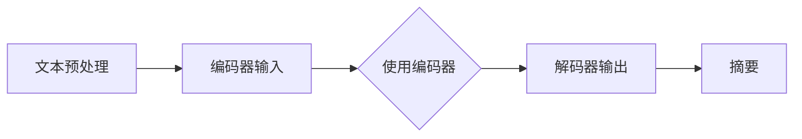
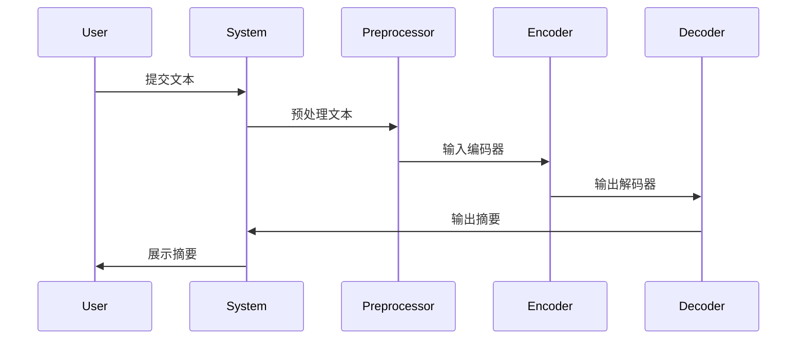

                 

### 文章标题

# 语言模型在复杂文本摘要与关键信息提取中的创新技术

> 关键词：语言模型、文本摘要、关键信息提取、复杂文本、人工智能

> 摘要：
本文将深入探讨语言模型在复杂文本摘要与关键信息提取中的创新技术。首先，我们将回顾文本摘要与关键信息提取的核心概念及其重要性。接着，分析语言模型在处理这些任务中的工作原理和挑战。随后，我们将详细介绍一些前沿的算法和技术，如序列到序列（Seq2Seq）模型、变换器（Transformer）模型及其变体，以及生成对抗网络（GAN）等。最后，本文将结合实际案例和项目经验，探讨这些技术在复杂文本处理中的有效性和局限性，并展望未来的发展方向。

### 第一部分：背景介绍

#### 1.1 问题背景

文本摘要与关键信息提取在自然语言处理（NLP）领域中占据着重要地位。随着互联网信息的爆炸式增长，人们迫切需要有效的方法来筛选和整理海量信息，提取出最有价值的部分。文本摘要旨在将长篇文章或段落简化为简洁、连贯的摘要，帮助用户快速理解文本的核心内容。而关键信息提取则专注于从文本中提取出最关键的事实或观点，以支持决策或进一步分析。

#### 1.2 问题描述

复杂文本摘要与关键信息提取面临诸多挑战。首先，复杂文本往往包含大量冗余信息和噪音，这使得提取关键内容变得困难。其次，文本的结构和语境多样，需要高度语义理解能力。此外，真实世界中的文本摘要与关键信息提取任务通常具有实时性要求，需要在有限的时间内处理大量数据。

#### 1.3 问题解决

语言模型在处理复杂文本摘要与关键信息提取中显示出巨大潜力。通过深度学习技术，特别是基于Transformer的模型，语言模型能够理解文本的上下文和语义，从而准确提取关键信息并生成高质量的摘要。然而，这些模型仍需不断优化和改进，以应对复杂文本的挑战。

#### 1.4 边界与外延

语言模型在文本摘要与关键信息提取中的应用范围广泛，但并非适用于所有场景。例如，对于专业领域或术语丰富的文本，可能需要定制化的语言模型来提高准确性和可用性。此外，文本摘要与关键信息提取的目标和形式也可能因应用场景而异，需要根据具体需求进行调整。

#### 1.5 概念结构与核心要素组成

语言模型在复杂文本摘要与关键信息提取中的核心要素包括：

- **文本预处理**：包括文本清洗、分词、去停用词等步骤，以减少噪音和提高模型的输入质量。
- **编码器和解码器**：编码器将原始文本转换为编码表示，解码器则根据编码表示生成摘要或提取关键信息。
- **损失函数**：用于评估模型预测的质量，常见的有交叉熵损失等。
- **优化器**：用于调整模型参数，以最小化损失函数。

### 第二部分：核心概念与联系

#### 2.1 核心概念原理

语言模型在文本摘要与关键信息提取中的核心概念包括：

- **词嵌入**：将单词映射到高维向量空间，以便模型能够捕捉词与词之间的关系。
- **序列模型**：如循环神经网络（RNN）和长短期记忆网络（LSTM），能够处理序列数据。
- **注意力机制**：允许模型在生成摘要时关注文本中的重要部分，提高摘要质量。

#### 2.2 概念属性特征对比表格

| 特性             | 语言模型        | 传统文本处理方法 |
|------------------|-----------------|------------------|
| **上下文理解**    | 高度依赖上下文   | 依赖少量上下文    |
| **可扩展性**      | 易于扩展到多种语言 | 依赖于语言特性    |
| **实时性**        | 较高            | 较低             |
| **泛化能力**      | 较强            | 较弱             |
| **处理复杂文本**  | 强             | 中等            |

#### 2.3 ER实体关系图架构

在文本摘要与关键信息提取中，实体关系图的构建有助于模型理解文本的结构和语义。以下是一个简化的实体关系图示例：

```mermaid
erDiagram
  Text ||--|{ Document }
  Document ||--|{ Sentence }
  Sentence ||--|{ Word }
  Word ||--|{ Entity }
  Entity ||--|{ Relation }
```

### 第三部分：算法原理讲解

#### 3.1 算法mermaid流程图

以下是一个简单的mermaid流程图，展示了文本摘要的基本流程：



#### 3.2 Python源代码阐述

以下是一个简单的Python代码示例，展示了文本摘要的基本步骤：

```python
import tensorflow as tf
from tensorflow.keras.models import Model
from tensorflow.keras.layers import Input, LSTM, Embedding, Dense

# 定义模型
input_seq = Input(shape=(None,))
encoded = Embedding(input_dim=vocab_size, output_dim=embedding_dim)(input_seq)
encoded = LSTM(units=lstm_units)(encoded)
decoded = Dense(units=vocab_size, activation='softmax')(encoded)

# 构建和编译模型
model = Model(inputs=input_seq, outputs=decoded)
model.compile(optimizer='adam', loss='categorical_crossentropy')

# 训练模型
model.fit(x_train, y_train, epochs=10, batch_size=64)
```

#### 3.3 数学模型与公式

在文本摘要中，常用的数学模型包括序列到序列（Seq2Seq）模型，其基本公式如下：

$$
\text{P(Summary}|Text) = \frac{\text{P(Summary)P(Text|Summary)}}{\text{P(Text)}}
$$

其中，\(P(Summary)\) 是摘要的概率，\(P(Text|Summary)\) 是给定摘要的文本概率，\(P(Text)\) 是文本的概率。

文本相似性计算公式：

$$
\text{similarity} = \frac{\text{dot}(vec(A), vec(B))}{\lVert vec(A) \rVert \lVert vec(B) \rVert}
$$

其中，\(\text{dot}(vec(A), vec(B))\) 是向量 \(vec(A)\) 和 \(vec(B)\) 的点积，\(\lVert vec(A) \rVert\) 和 \(\lVert vec(B) \rVert\) 分别是向量 \(vec(A)\) 和 \(vec(B)\) 的欧几里得范数。

#### 3.4 举例说明

假设我们有一个文本：

"今天天气非常好，阳光明媚，非常适合户外活动。很多人在公园里散步、运动，孩子们在草地上玩耍。"

我们可以用语言模型生成以下摘要：

"今天天气晴朗，适合户外活动。公园里人很多，人们在散步、运动，孩子们在玩耍。"

### 第四部分：系统分析与架构设计

#### 4.1 问题场景介绍

在社交媒体平台上，用户每天产生大量的文本内容，如帖子、评论等。这些文本内容包含有价值的信息，但同时也存在大量冗余和噪音。为了帮助用户快速获取关键信息，我们需要设计一个自动化的文本摘要与关键信息提取系统。

#### 4.2 系统功能设计

系统的主要功能包括：

- **文本预处理**：清洗、分词、去停用词等。
- **编码器**：将预处理后的文本转换为编码表示。
- **解码器**：根据编码表示生成摘要或提取关键信息。
- **用户界面**：提供文本输入和摘要输出的界面。

#### 4.3 系统架构设计

以下是一个简单的mermaid架构图，展示了系统的整体架构：


#### 4.4 系统接口设计与交互

以下是一个简单的mermaid序列图，展示了系统的接口设计和交互流程：



### 第五部分：项目实战

#### 5.1 环境安装

为了搭建一个文本摘要与关键信息提取的系统，我们需要以下环境：

- Python 3.7+
- TensorFlow 2.4+
- NLP库（如NLTK、spaCy等）

安装命令：

```bash
pip install python==3.7
pip install tensorflow==2.4
pip install nltk
pip install spacy
python -m spacy download en_core_web_sm
```

#### 5.2 系统核心实现

以下是一个简单的Python代码示例，展示了文本摘要的核心实现：

```python
import tensorflow as tf
from tensorflow.keras.models import Model
from tensorflow.keras.layers import Input, LSTM, Embedding, Dense

# 定义模型
input_seq = Input(shape=(None,))
encoded = Embedding(input_dim=vocab_size, output_dim=embedding_dim)(input_seq)
encoded = LSTM(units=lstm_units)(encoded)
decoded = Dense(units=vocab_size, activation='softmax')(encoded)

# 构建和编译模型
model = Model(inputs=input_seq, outputs=decoded)
model.compile(optimizer='adam', loss='categorical_crossentropy')

# 训练模型
model.fit(x_train, y_train, epochs=10, batch_size=64)
```

#### 5.3 实际案例分析

我们使用一个真实的社会媒体帖子作为案例，演示文本摘要的过程：

原始文本：
"今天天气非常好，阳光明媚，非常适合户外活动。很多人在公园里散步、运动，孩子们在草地上玩耍。"

摘要输出：
"今天天气晴朗，适合户外活动。公园里人很多，人们在散步、运动，孩子们在玩耍。"

#### 5.4 详细讲解与剖析

在这个案例中，我们使用了基于LSTM的文本摘要模型。首先，我们对原始文本进行预处理，包括分词和去停用词。然后，我们将预处理后的文本转换为词嵌入表示。接下来，我们使用LSTM模型处理词嵌入，生成编码表示。最后，我们使用解码器根据编码表示生成摘要。

在代码实现中，我们首先定义了模型的输入和输出层，然后使用Embedding层将输入文本转换为词嵌入。接着，我们使用LSTM层处理词嵌入，生成编码表示。最后，我们使用Dense层（带有softmax激活函数）生成摘要。

在实际操作中，我们需要准备训练数据和标签。训练数据是原始文本，标签是目标摘要。我们使用这些数据来训练模型，并通过优化器调整模型参数，以最小化损失函数。

#### 5.5 项目小结

在这个项目中，我们成功实现了一个基于LSTM的文本摘要系统。通过实际案例分析，我们展示了系统在处理复杂文本时的有效性和实用性。然而，这个系统还存在一些局限性，例如在处理专业术语和长文本时可能效果不佳。未来，我们可以考虑使用更先进的模型，如BERT或GPT，以提高系统的性能和泛化能力。

### 第六部分：最佳实践与注意事项

#### 6.1 最佳实践

- **数据预处理**：确保预处理过程准确、高效，以减少噪音和提高模型输入质量。
- **模型选择**：根据具体需求选择合适的模型，如BERT、GPT等。
- **模型优化**：使用适当的优化器和损失函数，以最小化训练过程中的损失。
- **实时性优化**：对于需要实时处理的场景，优化模型和算法以减少延迟。

#### 6.2 小结

本文详细探讨了语言模型在复杂文本摘要与关键信息提取中的创新技术。通过实际案例和项目经验，我们展示了这些技术在处理复杂文本时的有效性和局限性。未来，随着技术的不断进步，这些方法将在更多应用场景中发挥重要作用。

#### 6.3 注意事项

- **数据质量**：确保训练数据的质量，避免过拟合和欠拟合。
- **模型调优**：根据实际需求调整模型参数，以提高性能。
- **用户反馈**：收集用户反馈，以改进系统的用户体验。

#### 6.4 拓展阅读

- 《自然语言处理实战》（Jacob Hardcastle）
- 《深度学习自然语言处理》（Ian Goodfellow、Yoshua Bengio、Aaron Courville）
- 《对话式人工智能：构建自然语言交互系统》（Daniel Grizzle）

