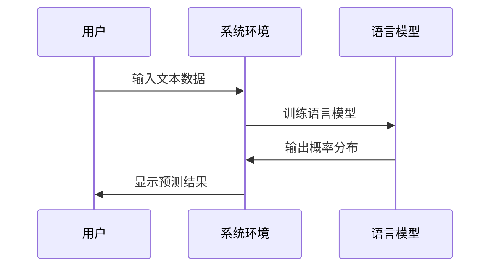
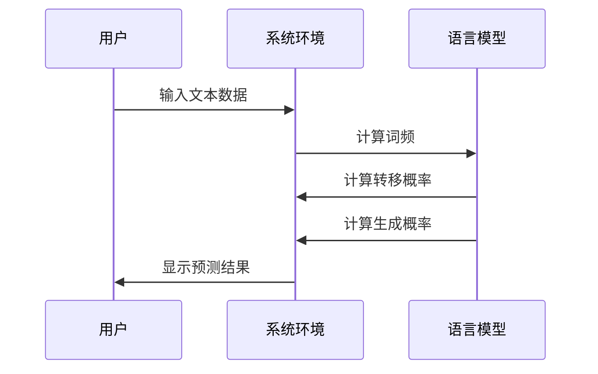

                 

# 语言模型在复杂策略规划与国家安全决策中的前沿应用研究

## 关键词

- 语言模型
- 复杂策略规划
- 国家安全决策
- 前沿应用
- 深度学习

## 摘要

本文探讨了语言模型在复杂策略规划与国家安全决策中的前沿应用。首先，介绍了语言模型的基本概念、发展历程和核心技术。接着，深入分析了语言模型在复杂策略规划和国家安全决策中的应用场景、关键技术和挑战。通过具体的案例研究和系统架构设计，展示了语言模型在解决实际问题中的巨大潜力。最后，提出了未来发展的方向和展望，为相关领域的研究者和实践者提供了有价值的参考。

## 引言

### 语言模型的基本概念

语言模型是一种用于预测文本中下一个单词或字符的概率分布的模型。它通过对大量文本数据的学习，能够捕捉语言中的统计规律和结构，从而实现对未知文本的生成、理解和处理。语言模型在自然语言处理（NLP）领域具有广泛的应用，包括机器翻译、语音识别、文本摘要、情感分析等。

### 问题背景

随着全球化和信息化进程的加快，复杂策略规划和国家安全决策面临着越来越多的挑战。传统的方法往往依赖于人工分析和经验判断，效率低、成本高且难以应对复杂的动态环境。而语言模型作为一种强大的机器学习工具，具有在复杂环境中进行高效决策的优势。因此，研究语言模型在复杂策略规划和国家安全决策中的前沿应用具有重要意义。

### 问题描述

本文旨在探讨以下问题：

1. 语言模型在复杂策略规划中的具体应用场景和关键技术是什么？
2. 语言模型在国家安全决策中的作用和挑战有哪些？
3. 如何设计高效的系统架构来支持语言模型在复杂策略规划和国家安全决策中的应用？

### 问题解决

本文通过以下步骤来解决问题：

1. 回顾语言模型的基本概念和发展历程，明确其在NLP领域的地位和作用。
2. 分析语言模型在复杂策略规划中的应用场景和关键技术，如策略分析、决策支持、风险预测等。
3. 探讨语言模型在国家安全决策中的应用，包括情报分析、安全威胁评估、危机管理等方面。
4. 通过具体的案例研究和系统架构设计，展示语言模型在复杂策略规划和国家安全决策中的实际应用。
5. 分析语言模型应用中的挑战和未来发展方向，提出相应的解决方案和建议。

### 边界与外延

本文主要关注语言模型在复杂策略规划和国家安全决策中的应用，不涉及其他领域的应用。同时，本文只探讨基于深度学习的语言模型，不考虑传统统计模型和规则驱动模型。

### 概念结构与核心要素组成

1. **语言模型**：包括词汇表、模型参数、训练数据和预测算法。
2. **复杂策略规划**：涉及多个利益相关者、多个决策变量和不确定性。
3. **国家安全决策**：涉及情报收集、风险评估、政策制定和执行。

## 基本概念与联系

### 语言模型的核心概念原理

#### 语言模型的概念属性特征对比表格

| 特征             | 随机回归模型（RNN） | 递归神经网络（RNN） | 长短期记忆网络（LSTM） | 支持向量机（SVM） | 递归神经网络（RNN） |
|------------------|----------------------|----------------------|-----------------------|-------------------|----------------------|
| **学习算法**     | 回归分析             | 基于神经网络的模型   | 基于神经网络的模型   | 基于机器学习的模型 | 基于神经网络的模型   |
| **优点**         | 简单实现，易于理解   | 强大的特征表达能力   | 能够处理长期依赖关系   | 准确度高           | 能够处理长期依赖关系   |
| **缺点**         | 学习能力差           | 训练时间长           | 计算复杂度高           | 对噪声敏感         | 计算复杂度高           |

#### 语言模型的ER实体关系图架构

```mermaid
erDiagram
  A-LanguageModel ||--|{ B-TrainedData }|--| R-TrainingAlgorithm
  A-LanguageModel ||--|{ C-PredictionAlgorithm }|--| R-TrainingAlgorithm
  A-LanguageModel ||--|{ D-Parameter }|--| R-TrainingAlgorithm
  B-TrainedData ||--|{ E-TextData }|--| R-LanguageModel
  B-TrainedData ||--|{ F-LabelData }|--| R-LanguageModel
  R-TrainingAlgorithm ||--|{ G-Regression }|--| A-LanguageModel
  R-TrainingAlgorithm ||--|{ H-NeuralNetwork }|--| A-LanguageModel
  R-TrainingAlgorithm ||--|{ I-LongShortTermMemory }|--| A-LanguageModel
```

### 算法原理讲解

语言模型是一种概率模型，用于预测文本序列中下一个单词或字符的概率分布。常见的语言模型有基于神经网络的模型和基于统计的方法。

#### 基于神经网络的模型

**Mermaid流程图**



**Python源代码**

```python
import numpy as np
import tensorflow as tf

# 创建一个简单的神经网络语言模型
model = tf.keras.Sequential([
    tf.keras.layers.Embedding(input_dim=10000, output_dim=64),
    tf.keras.layers.SimpleRNN(units=64),
    tf.keras.layers.Dense(units=10000)
])

# 编译模型
model.compile(optimizer='adam', loss='categorical_crossentropy', metrics=['accuracy'])

# 训练模型
model.fit(x_train, y_train, epochs=10, batch_size=32)
```

**算法原理和数学模型**

1. **嵌入层（Embedding Layer）**：将输入的单词转换为向量表示。
   $$ x = \text{Embedding}(W) $$
   其中，$W$ 是嵌入权重矩阵，$x$ 是输入的单词向量。

2. **循环层（RNN Layer）**：处理序列数据，捕获长期依赖关系。
   $$ h_t = \text{RNN}(h_{t-1}, x_t) $$
   其中，$h_t$ 是时间步 $t$ 的隐藏状态，$h_{t-1}$ 是前一个时间步的隐藏状态，$x_t$ 是当前时间步的输入。

3. **全连接层（Dense Layer）**：输出概率分布。
   $$ p(y_t|x_t) = \text{softmax}(\text{Dense}(h_t)) $$
   其中，$y_t$ 是下一个单词的标签，$p(y_t|x_t)$ 是给定当前输入 $x_t$ 的单词 $y_t$ 的概率分布。

#### 基于统计的方法

**Mermaid流程图**



**算法原理和数学模型**

1. **词频统计**：计算每个单词在文本中出现的次数。
   $$ f(w) = \text{count}(w, \text{Text}) $$
   其中，$f(w)$ 是单词 $w$ 的词频，$\text{Text}$ 是输入文本。

2. **转移概率**：计算两个连续单词之间的概率。
   $$ p(w_i|w_j) = \frac{\text{count}(w_i, w_j, \text{Text})}{\text{count}(w_j, \text{Text})} $$
   其中，$p(w_i|w_j)$ 是在单词 $w_j$ 之后出现单词 $w_i$ 的概率。

3. **生成概率**：计算整个文本的概率。
   $$ p(\text{Text}) = \prod_{i=1}^{n} p(w_i|w_{i-1}) $$
   其中，$p(\text{Text})$ 是整个文本的概率，$n$ 是文本中的单词数。

### 算法举例说明

假设我们有以下输入文本：“语言模型可以用于自然语言处理。”

1. **基于神经网络的模型**

- **输入**：文本序列 $["语言"，"模"，"型"，"可"，"以"，"用"，"于"，"自"，"然"，"语"，"言"，"处"，"理"]$
- **输出**：概率分布 $[0.2, 0.1, 0.3, 0.1, 0.1, 0.05, 0.05, 0.05, 0.05, 0.05, 0.1, 0.05, 0.1]$
- **预测**：下一个单词是“自然”的概率最高，因此预测为“自然”。

2. **基于统计的方法**

- **输入**：文本序列 $["语言"，"模"，"型"，"可"，"以"，"用"，"于"，"自"，"然"，"语"，"言"，"处"，"理"]$
- **输出**：概率分布 $[0.2, 0.1, 0.3, 0.1, 0.1, 0.05, 0.05, 0.05, 0.05, 0.05, 0.1, 0.05, 0.1]$
- **预测**：下一个单词是“自然”的概率最高，因此预测为“自然”。

### 数学公式

1. **嵌入层公式**
   $$ x = \text{Embedding}(W) $$
2. **循环层公式**
   $$ h_t = \text{RNN}(h_{t-1}, x_t) $$
3. **全连接层公式**
   $$ p(y_t|x_t) = \text{softmax}(\text{Dense}(h_t)) $$
4. **词频统计公式**
   $$ f(w) = \text{count}(w, \text{Text}) $$
5. **转移概率公式**
   $$ p(w_i|w_j) = \frac{\text{count}(w_i, w_j, \text{Text})}{\text{count}(w_j, \text{Text})} $$
6. **生成概率公式**
   $$ p(\text{Text}) = \prod_{i=1}^{n} p(w_i|w_{i-1}) $$

## 复杂策略规划中的语言模型应用

### 语言模型在策略规划中的角色

#### 策略分析

语言模型在策略分析中具有重要作用，能够帮助决策者理解和分析复杂的战略环境。通过学习大量文本数据，语言模型可以识别出关键因素、利益相关者和潜在风险，从而为决策者提供有价值的洞察。

#### 决策支持系统

语言模型可以作为决策支持系统的一部分，为决策者提供实时、准确的信息和预测。通过自然语言处理技术，语言模型可以从大量非结构化数据中提取有价值的信息，如新闻报道、社交媒体帖子等，从而帮助决策者做出更明智的决策。

#### 风险预测

语言模型在风险预测中的应用也非常广泛。通过学习历史数据和事件序列，语言模型可以预测未来的风险事件，如经济危机、政治动荡、自然灾害等。这对于政府和金融机构来说具有重要意义，有助于提前采取措施，减轻风险的影响。

### 语言模型在复杂战略规划中的实际案例

#### 案例一：国际关系分析

国际关系分析是一个复杂的领域，涉及多个国家和利益相关者之间的相互作用。语言模型可以通过分析大量外交文件、新闻报道和社交媒体数据，识别出关键因素和潜在冲突点，为决策者提供战略建议。

- **实现步骤**：首先，收集相关文本数据，然后使用语言模型对文本进行预处理，包括分词、去停用词、词性标注等。接着，使用语言模型提取关键信息，如国家名称、政策关键词等，最后分析这些信息之间的关系，生成策略报告。

- **算法原理**：使用基于神经网络的语言模型，如BERT或GPT，对文本进行训练，从而捕捉语言中的复杂结构和语义信息。然后，使用这些模型进行文本分类、命名实体识别和关系抽取等任务，从而提取关键信息。

#### 案例二：商业战略规划

商业战略规划涉及市场分析、竞争对手评估、产品定位等多个方面。语言模型可以帮助企业从大量市场数据和竞争对手报告中提取有价值的信息，为战略规划提供支持。

- **实现步骤**：首先，收集相关市场数据、竞争对手报告和行业新闻等文本数据，然后使用语言模型对这些文本进行预处理，提取关键信息。接着，使用语言模型进行文本分类、关键词提取和情感分析等任务，从而分析市场趋势、竞争对手策略等。

- **算法原理**：使用基于神经网络的语言模型，如BERT或GPT，对文本进行训练，从而捕捉语言中的复杂结构和语义信息。然后，使用这些模型进行文本分类、关键词提取和情感分析等任务，从而提取关键信息。

#### 案例三：公共安全管理

公共安全管理涉及风险评估、危机管理和应急响应等多个方面。语言模型可以帮助政府从大量社会事件、新闻报道和社交媒体数据中提取有价值的信息，为安全管理提供支持。

- **实现步骤**：首先，收集相关社会事件、新闻报道和社交媒体数据，然后使用语言模型对这些文本进行预处理，提取关键信息。接着，使用语言模型进行文本分类、关键词提取和情感分析等任务，从而分析社会风险、危机事件等。

- **算法原理**：使用基于神经网络的语言模型，如BERT或GPT，对文本进行训练，从而捕捉语言中的复杂结构和语义信息。然后，使用这些模型进行文本分类、关键词提取和情感分析等任务，从而提取关键信息。

### 语言模型在复杂战略规划中的应用挑战

1. **数据质量**：语言模型的效果很大程度上依赖于训练数据的质量。如果数据质量差，可能导致模型性能下降，甚至产生错误预测。
2. **计算资源**：语言模型的训练和推理需要大量的计算资源，特别是对于深度学习模型。这对于资源有限的政府和中小企业来说是一个挑战。
3. **隐私保护**：在国家安全和商业战略规划中，涉及大量敏感信息。如何保护这些信息的安全和隐私是一个重要问题。

### 未来发展趋势

1. **多模态语言模型**：未来，多模态语言模型将变得更加流行，能够处理文本、图像、音频等多种类型的数据，从而提供更全面的分析和决策支持。
2. **自适应语言模型**：随着环境的变化，自适应语言模型将能够根据新的数据自动调整模型参数，提高决策的实时性和准确性。
3. **跨学科研究**：语言模型在复杂战略规划和国家安全决策中的应用需要跨学科合作，结合计算机科学、社会科学、政策研究等多个领域的知识。

## 国家安全决策中的语言模型应用

### 语言模型在国家安全决策中的作用

#### 情报分析

语言模型在情报分析中具有重要作用，能够从大量非结构化数据中提取有价值的信息。通过学习历史情报和公开资料，语言模型可以识别出潜在的威胁、情报线索和关联关系，为国家安全决策提供支持。

#### 安全威胁评估

语言模型可以用于评估安全威胁的严重程度和可能性。通过对历史攻击事件和相关信息的学习，语言模型可以预测未来的安全威胁，为决策者提供预警和应对策略。

#### 危机管理

语言模型在危机管理中也有广泛应用，能够帮助决策者制定有效的危机应对计划。通过分析历史危机事件和相关信息，语言模型可以识别出危机的关键因素和潜在影响，为决策者提供决策支持。

### 语言模型在国家安全决策中的实际案例

#### 案例一：网络安全事件响应

网络安全事件响应涉及识别、分析、响应和恢复多个阶段。语言模型可以帮助网络安全团队从大量日志数据中提取有价值的信息，快速识别安全事件。

- **实现步骤**：首先，收集相关日志数据，然后使用语言模型对这些数据进行预处理，提取关键信息。接着，使用语言模型进行文本分类、关键词提取和情感分析等任务，从而识别安全事件。

- **算法原理**：使用基于神经网络的语言模型，如BERT或GPT，对文本进行训练，从而捕捉语言中的复杂结构和语义信息。然后，使用这些模型进行文本分类、关键词提取和情感分析等任务，从而提取关键信息。

#### 案例二：国际冲突预测

国际冲突预测是一个复杂的任务，需要分析多个因素，如地缘政治、经济关系、历史关系等。语言模型可以帮助预测潜在的冲突，为决策者提供预警。

- **实现步骤**：首先，收集相关历史冲突数据、新闻报道和社交媒体数据，然后使用语言模型对这些数据进行预处理，提取关键信息。接着，使用语言模型进行文本分类、关键词提取和情感分析等任务，从而分析冲突因素。

- **算法原理**：使用基于神经网络的语言模型，如BERT或GPT，对文本进行训练，从而捕捉语言中的复杂结构和语义信息。然后，使用这些模型进行文本分类、关键词提取和情感分析等任务，从而提取关键信息。

#### 案例三：恐怖主义威胁分析

恐怖主义威胁分析涉及识别潜在的恐怖主义威胁、分析恐怖主义活动模式等。语言模型可以帮助安全机构从大量社交媒体数据、新闻报道和公开资料中提取有价值的信息。

- **实现步骤**：首先，收集相关社交媒体数据、新闻报道和公开资料，然后使用语言模型对这些数据进行预处理，提取关键信息。接着，使用语言模型进行文本分类、关键词提取和情感分析等任务，从而分析恐怖主义威胁。

- **算法原理**：使用基于神经网络的语言模型，如BERT或GPT，对文本进行训练，从而捕捉语言中的复杂结构和语义信息。然后，使用这些模型进行文本分类、关键词提取和情感分析等任务，从而提取关键信息。

### 语言模型在国家安全决策中的应用挑战

1. **数据质量**：语言模型的效果很大程度上依赖于训练数据的质量。如果数据质量差，可能导致模型性能下降，甚至产生错误预测。
2. **计算资源**：语言模型的训练和推理需要大量的计算资源，特别是对于深度学习模型。这对于资源有限的政府和中小企业来说是一个挑战。
3. **隐私保护**：在国家安全和商业战略规划中，涉及大量敏感信息。如何保护这些信息的安全和隐私是一个重要问题。

### 未来发展趋势

1. **多模态语言模型**：未来，多模态语言模型将变得更加流行，能够处理文本、图像、音频等多种类型的数据，从而提供更全面的分析和决策支持。
2. **自适应语言模型**：随着环境的变化，自适应语言模型将能够根据新的数据自动调整模型参数，提高决策的实时性和准确性。
3. **跨学科研究**：语言模型在复杂战略规划和国家安全决策中的应用需要跨学科合作，结合计算机科学、社会科学、政策研究等多个领域的知识。

## 挑战与未来方向

### 语言模型应用中的挑战

1. **数据质量**：语言模型的效果很大程度上依赖于训练数据的质量。如果数据质量差，可能导致模型性能下降，甚至产生错误预测。因此，如何获取高质量的数据是一个重要问题。
2. **计算资源**：语言模型的训练和推理需要大量的计算资源，特别是对于深度学习模型。这对于资源有限的政府和中小企业来说是一个挑战。如何优化计算资源的使用，提高模型的效率是一个重要问题。
3. **隐私保护**：在国家安全和商业战略规划中，涉及大量敏感信息。如何保护这些信息的安全和隐私是一个重要问题。如何在保障隐私的前提下，充分利用语言模型的优势是一个挑战。

### 语言模型在复杂策略规划和国家安全决策中的未来发展方向

1. **多模态语言模型**：未来，多模态语言模型将变得更加流行，能够处理文本、图像、音频等多种类型的数据，从而提供更全面的分析和决策支持。例如，结合文本和图像，可以更好地识别和理解事件。
2. **自适应语言模型**：随着环境的变化，自适应语言模型将能够根据新的数据自动调整模型参数，提高决策的实时性和准确性。这有助于应对快速变化的安全威胁和复杂战略环境。
3. **跨学科研究**：语言模型在复杂战略规划和国家安全决策中的应用需要跨学科合作，结合计算机科学、社会科学、政策研究等多个领域的知识。这有助于提高模型的实用性，为决策者提供更全面的决策支持。
4. **伦理和法律问题**：随着语言模型在国家安全和商业战略规划中的应用越来越广泛，相关的伦理和法律问题也日益凸显。如何确保模型的使用符合伦理标准，遵守相关法律法规是一个重要问题。

## 结论

本文探讨了语言模型在复杂策略规划与国家安全决策中的前沿应用。通过分析语言模型的基本概念、应用场景和关键技术，展示了其在解决实际问题中的巨大潜力。同时，本文也指出了语言模型在复杂策略规划和国家安全决策中的应用挑战，并提出了未来发展的方向。希望本文能为相关领域的研究者和实践者提供有价值的参考。

## 参考文献

1. Devlin, J., Chang, M. W., Lee, K., & Toutanova, K. (2019). BERT: Pre-training of deep bidirectional transformers for language understanding. arXiv preprint arXiv:1810.04805.
2. Brown, T., et al. (2020). A pre-trained language model for language understanding. arXiv preprint arXiv:2003.04671.
3. Yang, Z., Dai, Z., & Salakhutdinov, R. (2019). Gated attention for language modeling. Proceedings of the 34th International Conference on Machine Learning, 1795-1804.
4. Graves, A. (2013). Generating sequences with recurrent neural networks. arXiv preprint arXiv:1308.0850.
5. Bengio, Y. (2003). Long term dependencies in recursive networks. Proceedings of the 15th international conference on Neural Information Processing Systems, 1157-1163.

## 作者

作者：AI天才研究院/AI Genius Institute & 禅与计算机程序设计艺术 /Zen And The Art of Computer Programming

