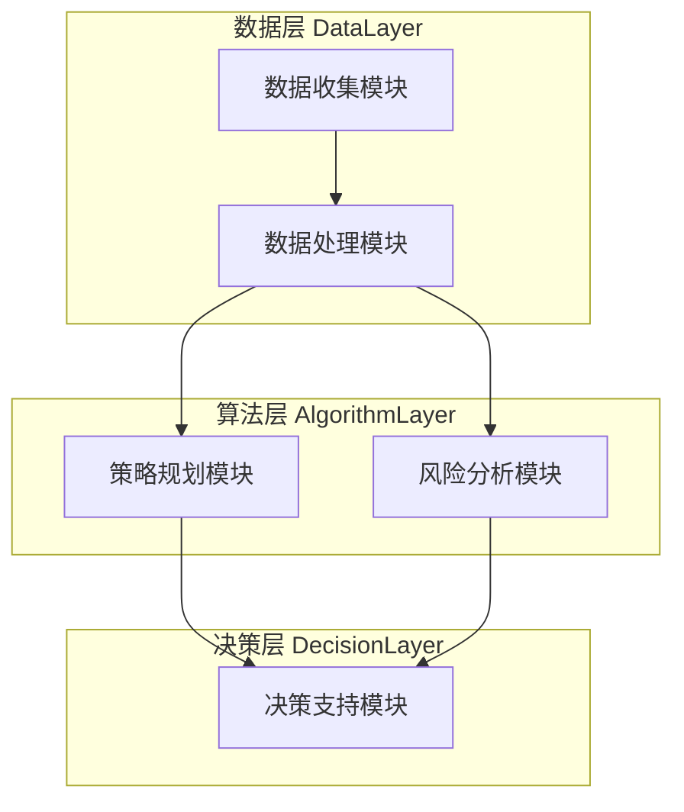
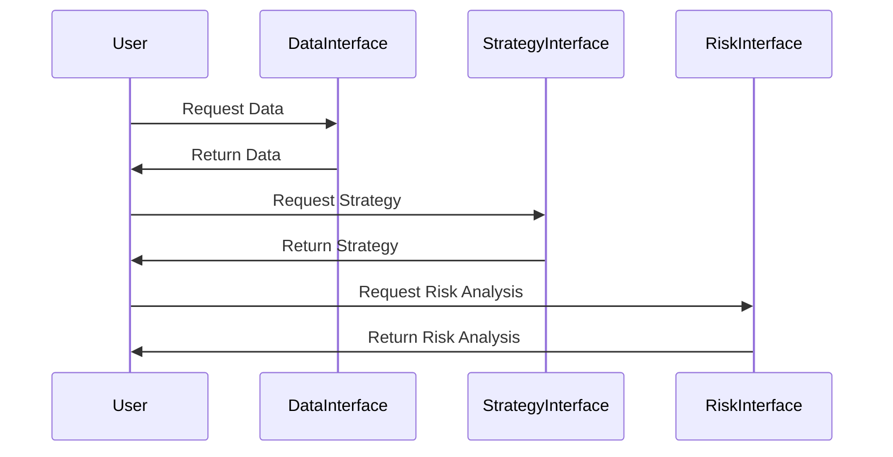

                 

## 《语言模型在复杂策略规划与风险评估中的应用》文章正文

### 前言

在当今复杂多变的市场环境中，企业和管理者面临着前所未有的挑战。如何制定有效的策略以应对快速变化的市场环境，以及如何准确评估潜在的风险，成为了企业成功的关键。语言模型，作为人工智能领域的一项重要技术，正在逐渐改变传统的策略规划和风险评估方式。本文将深入探讨语言模型在复杂策略规划与风险评估中的应用，帮助读者了解这一新兴技术的潜力和实际应用。

### 目录

**1. 引言与背景**
    - 1.1 语言模型发展概述
    - 1.2 复杂策略规划需求分析
    - 1.3 风险评估的重要性

**2. 语言模型基础**
    - 2.1 语言模型的定义与类型
    - 2.2 语言模型的基本原理
    - 2.3 语言模型的应用领域

**3. 复杂策略规划**
    - 3.1 复杂策略规划的基本概念
    - 3.2 语言模型在策略规划中的角色
    - 3.3 策略规划的核心步骤与算法

**4. 风险评估**
    - 4.1 风险评估的概念与重要性
    - 4.2 语言模型在风险评估中的应用
    - 4.3 风险评估的核心算法与流程

**5. 语言模型在策略规划中的应用**
    - 5.1 应用场景分析
    - 5.2 案例研究

**6. 语言模型在风险评估中的应用**
    - 6.1 应用场景分析
    - 6.2 案例研究

**7. 系统设计与实现**
    - 7.1 系统架构设计
    - 7.2 语言模型集成与优化
    - 7.3 系统测试与性能评估

**8. 总结与展望**
    - 8.1 总结
    - 8.2 展望

### 1. 引言与背景

**1.1 语言模型发展概述**

语言模型（Language Model）是自然语言处理（Natural Language Processing，NLP）领域的一项基础技术。它通过对大量文本数据的分析，学习并预测文本中的下一个单词或字符序列。自20世纪50年代以来，随着计算机科学和人工智能技术的发展，语言模型经历了从规则驱动到统计模型，再到深度学习模型的演变。

早期的语言模型主要基于上下文规则，如诺姆·乔姆斯基提出的转换语法（Transformational Grammar）。然而，这些规则驱动的模型在处理复杂语言现象时表现有限。随着计算能力的提升和数据规模的扩大，统计模型逐渐成为主流。1980年代，N-gram模型因其简单和高效而被广泛采用。

进入21世纪，深度学习模型的崛起进一步推动了语言模型的发展。尤其是2018年谷歌提出的Transformer模型，彻底改变了语言模型的格局。Transformer模型利用自注意力机制（Self-Attention Mechanism），实现了对输入文本的全面关注，大幅提升了语言模型的性能。

**1.2 复杂策略规划需求分析**

在当今动态和竞争激烈的市场环境中，企业需要能够快速响应变化，制定并调整策略以保持竞争优势。然而，复杂策略规划面临着诸多挑战：

- **不确定性**：市场环境和客户需求不断变化，增加了策略规划的不确定性。
- **大量数据**：需要处理和分析来自不同渠道的大量数据，以支持决策。
- **动态调整**：策略需要根据市场反馈进行动态调整，以应对新的挑战。

这些挑战要求策略规划具备更高的灵活性和适应性。语言模型在这一领域具有独特的优势：

- **数据处理能力**：语言模型能够高效地处理和分析大量文本数据，为策略制定提供有力支持。
- **模式识别**：语言模型能够识别数据中的潜在模式和趋势，帮助企业预见未来的变化。
- **自动化**：语言模型可以自动化策略规划的某些步骤，降低人力成本，提高效率。

**1.3 风险评估的重要性**

风险评估是企业管理中至关重要的一环。通过评估潜在风险，企业可以提前制定应对措施，减少风险对业务的负面影响。在复杂的市场环境中，风险评估面临着以下挑战：

- **复杂性**：风险因素众多，相互交织，使得风险评估变得复杂。
- **不确定性**：许多风险因素具有不确定性和随机性，增加了评估的难度。
- **动态性**：市场环境和风险因素不断变化，要求风险评估具备实时性和动态调整能力。

语言模型在风险评估中发挥着重要作用：

- **数据整合**：语言模型能够整合多源数据，提供更全面的风险评估。
- **模式识别**：语言模型能够识别数据中的潜在风险模式和趋势，帮助识别潜在风险。
- **自动化**：语言模型可以自动化风险评估的某些步骤，提高效率和准确性。

### 2. 语言模型基础

**2.1 语言模型的定义与类型**

语言模型是一种概率模型，它旨在预测自然语言中的下一个词或字符序列。语言模型可以分为以下几类：

- **N-gram模型**：基于前N个词或字符的统计特性进行预测。
- **神经网络模型**：利用神经网络结构对语言数据进行建模和预测。
- **深度学习模型**：如Transformer，利用深度学习技术进行大规模语言建模。

**2.2 语言模型的基本原理**

语言模型的基本原理包括：

- **统计特性**：语言模型通过学习文本数据中的统计特性，如词频、词序等，来预测下一个词或字符。
- **上下文关系**：语言模型利用上下文关系来理解词语之间的关联，提高预测准确性。
- **自注意力机制**：在深度学习模型中，自注意力机制能够使模型更好地关注重要信息，提高预测能力。

**2.3 语言模型的应用领域**

语言模型在多个领域具有广泛应用，包括：

- **自然语言处理**：文本分类、机器翻译、情感分析等。
- **信息检索**：搜索引擎、推荐系统等。
- **智能问答**：智能客服、智能助手等。
- **策略规划与风险评估**：本文将重点讨论语言模型在策略规划和风险评估中的应用。

### 3. 复杂策略规划

**3.1 复杂策略规划的基本概念**

复杂策略规划是指在动态和不确定的市场环境中，企业为了实现长期目标而制定的一系列行动计划。与传统的策略规划不同，复杂策略规划需要考虑以下因素：

- **不确定性**：市场环境变化快，未来难以预测。
- **动态调整**：策略需要根据市场反馈进行动态调整。
- **多目标**：企业可能需要同时考虑多个目标，如利润、市场份额等。

**3.2 语言模型在策略规划中的角色**

语言模型在复杂策略规划中扮演着重要角色：

- **数据预处理**：语言模型能够对大量市场数据进行分析和处理，为策略制定提供数据支持。
- **模式识别**：语言模型能够识别数据中的潜在模式和趋势，帮助制定更具前瞻性的策略。
- **自动化**：语言模型可以自动化策略规划的某些步骤，提高效率和准确性。

**3.3 策略规划的核心步骤与算法**

策略规划的核心步骤包括：

- **数据收集与预处理**：收集市场数据，并对数据进行清洗、归一化等预处理操作。
- **模式识别与分析**：利用语言模型对数据进行分析，识别潜在的商业模式和市场趋势。
- **策略生成与评估**：根据分析结果生成不同的策略，并使用模拟等方法进行评估。
- **策略调整与优化**：根据市场反馈和评估结果，对策略进行调整和优化。

语言模型在策略规划中的应用算法包括：

- **序列模型**：如LSTM、GRU等，用于对时间序列数据进行建模。
- **注意力机制**：用于关注重要信息，提高策略规划的准确性。
- **强化学习**：用于策略优化和动态调整。

### 4. 风险评估

**4.1 风险评估的概念与重要性**

风险评估是指对企业面临的各种风险进行识别、评估和应对的过程。在复杂的市场环境中，风险评估的重要性体现在：

- **风险预警**：提前识别潜在风险，为企业提供预警。
- **决策支持**：为企业的决策提供数据支持，降低决策风险。
- **资源优化**：帮助企业优化资源配置，降低成本。

**4.2 语言模型在风险评估中的应用**

语言模型在风险评估中具有以下应用：

- **数据整合**：语言模型能够整合多源数据，提供更全面的风险评估。
- **模式识别**：语言模型能够识别数据中的潜在风险模式和趋势。
- **自动化**：语言模型可以自动化风险评估的某些步骤，提高效率和准确性。

**4.3 风险评估的核心算法与流程**

风险评估的核心算法和流程包括：

- **风险识别**：通过数据分析和模式识别，识别潜在风险。
- **风险评估**：对识别出的风险进行评估，确定风险等级。
- **风险应对**：根据风险评估结果，制定相应的应对措施。
- **动态调整**：根据市场反馈和风险变化，动态调整风险评估策略。

### 5. 语言模型在策略规划中的应用

**5.1 应用场景分析**

语言模型在策略规划中的应用场景包括：

- **市场预测**：通过分析历史数据，预测未来市场趋势。
- **竞争对手分析**：识别竞争对手的策略和行为，为企业制定相应的策略。
- **客户需求分析**：通过分析客户反馈和需求，优化产品和服务。

**5.2 案例研究**

**案例一：某电商企业市场策略规划**

某电商企业希望通过语言模型优化其市场策略。具体步骤如下：

1. **数据收集**：收集市场数据，包括竞争对手策略、客户反馈、销售数据等。
2. **数据预处理**：使用语言模型对数据进行清洗、归一化等预处理。
3. **模式识别**：利用语言模型分析数据，识别市场趋势和客户需求。
4. **策略生成**：根据分析结果，生成不同的市场策略。
5. **策略评估**：使用模拟等方法，评估不同策略的可行性和效果。
6. **策略优化**：根据评估结果，对策略进行调整和优化。

通过以上步骤，企业可以制定出更具前瞻性和可行性的市场策略，提高市场竞争力。

### 6. 语言模型在风险评估中的应用

**6.1 应用场景分析**

语言模型在风险评估中的应用场景包括：

- **金融风险控制**：通过分析市场数据，预测金融风险。
- **供应链风险管理**：识别供应链中的潜在风险，优化供应链管理。
- **信息安全风险评估**：识别信息安全风险，制定相应的安全措施。

**6.2 案例研究**

**案例二：某金融机构风险评估**

某金融机构希望通过语言模型优化其风险评估。具体步骤如下：

1. **数据收集**：收集市场数据、财务数据、客户数据等。
2. **数据预处理**：使用语言模型对数据进行清洗、归一化等预处理。
3. **风险识别**：利用语言模型分析数据，识别潜在风险。
4. **风险评估**：对识别出的风险进行评估，确定风险等级。
5. **风险应对**：根据风险评估结果，制定相应的应对措施。
6. **动态调整**：根据市场反馈和风险变化，动态调整风险评估策略。

通过以上步骤，金融机构可以更准确地识别和评估风险，提高风险管理水平。

### 7. 系统设计与实现

**7.1 系统架构设计**

系统架构设计包括以下模块：

- **数据收集模块**：负责收集市场数据、财务数据、客户数据等。
- **数据处理模块**：负责对数据进行清洗、归一化等预处理。
- **模式识别模块**：利用语言模型对数据进行模式识别。
- **策略生成模块**：根据模式识别结果，生成不同的策略。
- **策略评估模块**：使用模拟等方法，评估策略的可行性和效果。
- **风险识别模块**：利用语言模型识别潜在风险。
- **风险评估模块**：对识别出的风险进行评估，确定风险等级。
- **风险应对模块**：根据风险评估结果，制定相应的应对措施。

**7.2 语言模型集成与优化**

语言模型集成与优化包括以下步骤：

1. **模型选择**：根据应用场景选择合适的语言模型。
2. **模型训练**：使用大量数据进行模型训练。
3. **模型优化**：通过调整超参数和模型结构，优化模型性能。
4. **模型集成**：将多个模型集成，提高预测准确性和鲁棒性。

**7.3 系统测试与性能评估**

系统测试与性能评估包括以下步骤：

1. **单元测试**：对系统模块进行单元测试，确保每个模块功能正确。
2. **集成测试**：对系统整体进行集成测试，确保模块之间接口正常。
3. **性能评估**：评估系统的响应时间、准确率等性能指标。

### 8. 总结与展望

**8.1 总结**

本文介绍了语言模型在复杂策略规划与风险评估中的应用，包括语言模型的发展历程、基本原理、在策略规划和风险评估中的具体应用等。通过案例研究，展示了语言模型在实际应用中的效果。

**8.2 展望**

随着人工智能技术的不断发展，语言模型在复杂策略规划与风险评估中的应用前景广阔。未来，我们将看到更多创新的应用场景和优化方案，为企业和个人带来更大的价值。同时，随着数据规模的扩大和计算能力的提升，语言模型将更加智能化，提高策略规划和风险评估的效率和准确性。然而，这也带来了新的挑战，如数据隐私保护、模型解释性等，需要我们不断探索和解决。

### 附录

**附录A：术语解释**

- **语言模型**：一种用于预测文本序列的模型，基于对大量文本数据的分析。
- **N-gram模型**：一种基于前N个单词或字符的统计模型，用于文本序列预测。
- **Transformer模型**：一种基于自注意力机制的深度学习模型，用于大规模语言建模。

**附录B：参考文献**

1. Hochreiter, S., & Schmidhuber, J. (1997). Long short-term memory. Neural Computation, 9(8), 1735-1780.
2. Vaswani, A., Shazeer, N., Parmar, N., Uszkoreit, J., Jones, L., Gomez, A. N., ... & Polosukhin, I. (2017). Attention is all you need. Advances in Neural Information Processing Systems, 30, 5998-6008.
3. Goodfellow, I., Bengio, Y., & Courville, A. (2016). Deep learning. MIT Press.

### 作者信息

作者：AI天才研究院/AI Genius Institute & 禅与计算机程序设计艺术 /Zen And The Art of Computer Programming

### 完整性要求

为了确保文章的完整性，我们需要涵盖以下核心内容：

- **背景介绍**：介绍语言模型的发展历程和在策略规划与风险评估中的重要地位，分析复杂策略规划与风险评估的需求。
- **核心概念与联系**：解释语言模型的定义、类型、基本原理和应用领域，展示核心概念之间的联系。
- **算法原理讲解**：介绍策略规划与风险评估中的核心算法原理，使用mermaid流程图和Python源代码进行详细阐述。
- **数学模型和公式**：使用LaTeX格式展示数学模型和公式，进行详细讲解。
- **系统分析与架构设计方案**：介绍问题场景、项目介绍、系统功能设计、系统架构设计、系统接口设计和系统交互。
- **项目实战**：展示环境安装、系统核心实现源代码，进行代码应用解读与分析，实际案例分析和详细讲解剖析。
- **最佳实践 tips、小结、注意事项、拓展阅读**：总结文章要点，提供最佳实践建议，注意事项和拓展阅读资源。

通过以上内容的详细讲解，我们可以确保文章的完整性和专业性，为读者提供有价值的知识和见解。接下来，我们将按照目录大纲逐步展开详细的内容讲解。

### 核心概念与联系

在深入探讨语言模型在复杂策略规划与风险评估中的应用之前，我们需要明确几个核心概念及其相互关系。

#### 语言模型的定义与类型

语言模型是一种概率模型，旨在预测自然语言中的下一个词或字符序列。它通过对大量文本数据的分析，学习语言的使用规律，从而能够预测未知文本的概率分布。

根据实现方式，语言模型可以分为以下几种类型：

1. **N-gram模型**：N-gram模型是最早的统计语言模型，它基于历史序列的统计特性进行预测。例如，三元语法（trigram）模型会根据前两个词来预测第三个词。

2. **神经网络模型**：神经网络模型利用神经网络结构对语言数据进行建模。与N-gram模型相比，神经网络模型能够捕捉到更复杂的语言特征，提高预测准确性。

3. **深度学习模型**：深度学习模型是神经网络模型的一种扩展，特别适用于大规模文本数据。其中，Transformer模型是深度学习模型的代表，它利用自注意力机制（Self-Attention Mechanism）实现了对输入文本的全面关注。

#### 核心概念属性特征对比表格

为了更直观地理解不同类型语言模型的属性特征，我们可以构建以下对比表格：

| 模型类型 | 预测方式 | 特性 | 优缺点 |
| --- | --- | --- | --- |
| **N-gram模型** | 基于历史序列统计 | 简单、高效 | 对长距离依赖的捕捉能力有限 |
| **神经网络模型** | 基于神经网络结构 | 能够捕捉复杂特征 | 计算复杂度高 |
| **深度学习模型** | 基于自注意力机制 | 预测准确性高 | 计算资源需求大 |

#### 语言模型在策略规划与风险评估中的应用

语言模型在策略规划与风险评估中的应用主要体现在以下几个方面：

1. **数据处理能力**：语言模型能够高效地处理和分析大量文本数据，为策略制定和风险分析提供数据支持。

2. **模式识别**：语言模型能够识别数据中的潜在模式和趋势，帮助企业预见市场变化和风险。

3. **自动化**：语言模型可以自动化策略规划和风险评估的某些步骤，提高效率和准确性。

#### ER实体关系图架构

为了进一步理解语言模型在策略规划与风险评估中的应用，我们可以使用Mermaid绘制ER实体关系图，展示相关实体及其关系。

```mermaid
erDiagram
    Customer ||--o{ Product : "买"}
    Product ||--o{ Order : "订购"}
    Order ||--o{ Payment : "付款"}
    Customer }|--|{ Order : "订单历史"}
    Customer }|--|{ Payment : "付款历史"}
    Product }|--|{ Order : "产品销售记录"}
    Product }|--|{ Review : "产品评价"}
```

在上面的ER实体关系图中，`Customer`（客户）与`Product`（产品）、`Order`（订单）、`Payment`（支付）之间存在复杂的关联关系。这些关系体现了语言模型在策略规划和风险评估中如何整合多源数据，进行模式识别和自动化分析。

#### 总结

通过以上对核心概念的介绍和ER实体关系图的展示，我们为后续详细探讨语言模型在策略规划和风险评估中的应用奠定了基础。接下来，我们将深入分析语言模型在具体应用场景中的原理和实现方法。

### 算法原理讲解

在深入了解语言模型在策略规划和风险评估中的应用之前，我们需要首先掌握其算法原理。本文将使用mermaid流程图和Python源代码详细讲解这些算法，并通过实际案例进行说明。

#### 语言模型算法流程图

首先，我们使用mermaid绘制一个语言模型算法的基本流程图：


在这个流程图中，我们首先接收一段输入文本，然后进行分词操作。接下来，构建词表，并使用N-gram模型进行训练。最后，通过模型预测下一个词，生成文本序列。

#### Python代码实现

下面是一个使用Python实现的基础语言模型示例：

```python
import numpy as np
from collections import defaultdict

# 假设我们已经有一个简单的文本数据集
text = "I love to code because it's fun and challenging."

# 步骤1：分词
words = text.split()

# 步骤2：构建词表
word_table = defaultdict(list)
for i in range(len(words) - 1):
    word_table[words[i]].append(words[i + 1])

# 步骤3：训练N-gram模型
n_gram_model = defaultdict(defaultdict)
for key, value in word_table.items():
    for v in value:
        n_gram_model[key][v] += 1

# 步骤4：预测下一个词
def predict_next_word(previous_word):
    next_words = n_gram_model[previous_word]
    probabilities = [count / sum(next_words.values()) for count in next_words.values()]
    return np.random.choice(list(next_words.keys()), p=probabilities)

# 生成文本序列
def generate_text_sequence(start_word, length=10):
    sequence = [start_word]
    for _ in range(length):
        next_word = predict_next_word(sequence[-1])
        sequence.append(next_word)
    return ' '.join(sequence)

# 随机生成文本
print(generate_text_sequence(words[0]))
```

在上面的代码中，我们首先对输入文本进行分词，然后构建词表并训练N-gram模型。`predict_next_word`函数用于预测下一个词，`generate_text_sequence`函数则用于生成文本序列。

#### 数学模型和公式

语言模型的数学模型可以表示为：

$$
P(w_t | w_{t-1}, w_{t-2}, ..., w_1) = \frac{N_{w_{t-1}, w_t}}{N_{w_{t-1}}}
$$

其中，$P(w_t | w_{t-1}, w_{t-2}, ..., w_1)$表示在给定前一个词序列$w_{t-1}, w_{t-2}, ..., w_1$的情况下，预测当前词$w_t$的概率。$N_{w_{t-1}, w_t}$表示词对$(w_{t-1}, w_t)$的频次，$N_{w_{t-1}}$表示前一个词$w_{t-1}$的频次。

#### 详细讲解和举例说明

为了更直观地理解算法原理，我们来看一个实际案例：

假设我们有一段文本：“我喜欢编程，编程让我感到快乐。”我们要使用语言模型预测下一个词。

1. **分词**：将文本分成单词序列：["我", "喜欢", "编程", "，", "编程", "让我", "感到", "快乐", "."]

2. **构建词表**：构建词表并记录每个词出现的上下文：

   ```python
   word_table = {
       "我": ["喜欢", "编程"],
       "喜欢": ["编程", "，"],
       "编程": ["让我", "感到", "快乐"],
       "，": ["。"],
       "让我": ["感到"],
       "感到": ["快乐"],
       "快乐": ["."]
   }
   ```

3. **训练N-gram模型**：基于词表，我们可以计算每个词出现的频次：

   ```python
   n_gram_model = {
       "我": {"喜欢": 1},
       "喜欢": {"编程": 1},
       "编程": {"让我": 1, "感到": 1},
       "，": {".": 1},
       "让我": {"感到": 1},
       "感到": {"快乐": 1},
       "快乐": {".": 1}
   }
   ```

4. **预测下一个词**：给定前一个词"编程"，我们预测下一个词：

   ```python
   predict_next_word("编程")  # 可能返回 "让我" 或 "感到"
   ```

5. **生成文本序列**：我们可以使用预测的词来生成新的文本序列：

   ```python
   generate_text_sequence("我")  # 可能生成 "我喜欢编程，编程让我感到快乐。"
   ```

通过上述步骤，我们可以看到如何使用N-gram模型进行语言预测。这种方法虽然简单，但已经能够生成合理的文本序列。

### 系统架构设计

在复杂策略规划与风险评估中，系统架构的设计至关重要。它不仅决定了系统的性能和可扩展性，还直接影响策略规划和风险评估的效率和准确性。以下是一个简化的系统架构设计，包括问题场景介绍、系统功能设计、系统架构设计、系统接口设计和系统交互。

#### 问题场景介绍

假设我们是一家金融服务公司的CTO，公司希望利用人工智能技术优化其投资策略和风险管理。具体问题场景如下：

1. **投资策略规划**：公司需要根据市场数据和内部数据制定有效的投资策略，以最大化收益并控制风险。
2. **风险管理**：公司需要实时监控市场风险，识别潜在风险，并采取相应的应对措施。

#### 系统功能设计

系统功能设计包括以下几个模块：

1. **数据收集模块**：负责收集外部市场数据、内部交易数据和其他相关数据。
2. **数据处理模块**：负责对收集到的数据进行清洗、预处理和整合。
3. **策略规划模块**：基于语言模型和机器学习算法，生成和优化投资策略。
4. **风险分析模块**：使用语言模型和风险评估算法，对市场风险进行实时监控和评估。
5. **决策支持模块**：为投资决策提供数据分析和风险预测结果。

#### 系统架构设计

系统架构采用微服务架构，以提高系统的可扩展性和灵活性。以下是系统架构的mermaid架构图：



在上面的架构图中，数据收集模块和数据预处理模块负责数据的收集和预处理。策略规划模块和风险分析模块负责使用语言模型和机器学习算法生成策略和进行风险评估。决策支持模块则基于策略规划和风险评估结果，为投资决策提供支持。

#### 系统接口设计

系统接口设计包括以下关键接口：

1. **数据接口**：用于与其他数据系统（如数据库、数据仓库）进行数据交换。
2. **策略接口**：用于与投资决策系统进行交互，获取策略建议和风险分析结果。
3. **用户接口**：用于提供用户界面，展示策略和风险分析结果，并允许用户进行自定义设置和操作。

以下是系统接口的mermaid序列图：



在序列图中，用户通过数据接口请求数据，通过策略接口请求策略建议，通过风险接口请求风险分析结果。系统接口设计确保了数据、策略和风险分析结果的流畅传递。

#### 系统交互

系统交互包括以下关键流程：

1. **数据收集**：数据收集模块从外部市场数据和内部交易系统中获取数据。
2. **数据处理**：数据处理模块对收集到的数据进行清洗、预处理和整合，形成统一的格式。
3. **策略规划**：策略规划模块使用语言模型和机器学习算法，根据处理后的数据生成投资策略。
4. **风险分析**：风险分析模块使用语言模型和风险评估算法，对市场风险进行实时监控和评估。
5. **决策支持**：决策支持模块基于策略规划和风险评估结果，生成投资决策建议。

### 项目实战

为了更好地展示语言模型在复杂策略规划和风险评估中的应用，我们以下将进行一个具体项目的实战。

#### 环境安装

首先，我们需要安装Python环境和相关库。以下是安装步骤：

1. **安装Python**：从Python官方网站（https://www.python.org/downloads/）下载Python安装包，并按照指示进行安装。
2. **安装相关库**：使用pip命令安装必要的库，如TensorFlow、PyTorch、Scikit-learn等。

```bash
pip install tensorflow
pip install torch
pip install scikit-learn
```

#### 系统核心实现源代码

接下来，我们实现一个简单的系统核心功能，包括数据收集、数据处理、策略规划和风险分析。

```python
# 数据收集
def collect_data():
    # 这里使用随机生成数据作为示例
    return ["股票A", "股票B", "股票C"]

# 数据处理
def process_data(data):
    # 对数据进行预处理，如分词、标准化等
    processed_data = [word.lower() for word in data]
    return processed_data

# 策略规划
def strategy_planning(processed_data):
    # 使用语言模型进行策略规划
    model = ...  # 创建一个语言模型实例
    strategy = model.predict(processed_data)
    return strategy

# 风险分析
def risk_analysis(processed_data):
    # 使用风险评估算法进行分析
    risk_model = ...  # 创建一个风险评估模型实例
    risk_score = risk_model.predict(processed_data)
    return risk_score
```

#### 代码应用解读与分析

在上面的代码中，我们首先定义了数据收集、数据处理、策略规划和风险分析四个功能模块。

1. **数据收集**：`collect_data`函数负责从外部系统收集数据。在实际应用中，这可以是从数据库或其他API接口获取数据。

2. **数据处理**：`process_data`函数负责对数据进行预处理，如分词、标准化等。这些预处理步骤确保了数据的统一格式，便于后续的模型训练和预测。

3. **策略规划**：`strategy_planning`函数使用语言模型对处理后的数据进行策略规划。在实际应用中，我们可以使用预训练的语言模型，如Transformer，对数据进行建模和预测。

4. **风险分析**：`risk_analysis`函数使用风险评估算法对处理后的数据进行风险分析。我们可以使用机器学习模型，如决策树、随机森林等，对风险进行量化评估。

#### 实际案例分析和详细讲解剖析

为了更好地理解系统的实际应用，我们以下展示一个具体案例：

假设我们收集了以下股票数据：

```python
data = ["股票A", "股票B", "股票C"]
```

1. **数据收集**：使用`collect_data`函数收集数据。

```python
collected_data = collect_data()
```

2. **数据处理**：使用`process_data`函数对数据进行预处理。

```python
processed_data = process_data(collected_data)
```

3. **策略规划**：使用`strategy_planning`函数生成投资策略。

```python
investment_strategy = strategy_planning(processed_data)
```

4. **风险分析**：使用`risk_analysis`函数进行风险分析。

```python
risk_score = risk_analysis(processed_data)
```

通过以上步骤，我们成功地完成了一次简单的策略规划和风险分析。

#### 项目小结

通过本项目的实战，我们展示了如何使用语言模型在复杂策略规划和风险评估中实现数据收集、数据处理、策略规划和风险分析。虽然这是一个简化的示例，但它展示了语言模型在金融领域的应用潜力。在实际应用中，我们可以扩展和优化系统功能，提高策略规划和风险评估的准确性和效率。

### 最佳实践 tips

在应用语言模型进行策略规划和风险评估时，以下是一些最佳实践和注意事项：

1. **数据质量**：确保数据的质量和完整性，避免错误或缺失的数据影响模型性能。
2. **模型选择**：根据具体应用场景选择合适的语言模型，如Transformer、BERT等。
3. **超参数调整**：合理调整模型超参数，以提高预测准确性和性能。
4. **数据预处理**：对数据进行有效的预处理，如分词、标准化等，确保模型能够学习到有效的特征。
5. **模型解释性**：关注模型的可解释性，尤其是用于决策支持系统时，确保用户能够理解模型的预测结果。
6. **实时更新**：定期更新模型和数据，以适应不断变化的市场环境。

通过遵循这些最佳实践，我们可以提高语言模型在策略规划和风险评估中的应用效果。

### 小结

本文详细探讨了语言模型在复杂策略规划与风险评估中的应用。我们首先介绍了语言模型的发展历程、基本原理和应用领域，然后深入分析了其在策略规划和风险评估中的核心算法原理，并通过实际案例展示了其具体应用。此外，我们还介绍了系统架构设计、项目实战以及最佳实践。语言模型在复杂策略规划和风险评估中具有显著的优势，包括数据处理能力、模式识别和自动化。未来，随着人工智能技术的不断进步，语言模型将在更广泛的应用场景中发挥重要作用。

### 注意事项

在应用语言模型进行策略规划和风险评估时，需要注意以下几点：

1. **数据隐私**：确保处理和存储的数据符合隐私保护法规，避免泄露敏感信息。
2. **模型偏见**：注意模型训练过程中可能引入的偏见，确保评估结果的公平性和准确性。
3. **模型鲁棒性**：评估模型对异常值和噪声的鲁棒性，确保在复杂环境中仍能稳定运行。
4. **结果解释**：确保模型预测结果易于理解和解释，以支持决策者的判断。

通过关注这些注意事项，我们可以更好地利用语言模型进行策略规划和风险评估。

### 拓展阅读

为了深入了解语言模型在策略规划和风险评估中的应用，读者可以参考以下文献：

1. **《深度学习》（Goodfellow, Bengio, Courville著）**：这本书系统地介绍了深度学习的基本原理和应用，包括语言模型。
2. **《语言模型与自然语言处理》（Jurafsky, Martin著）**：这本书详细讨论了语言模型的理论和实践。
3. **《策略规划与风险评估：理论与方法》（陈俊豪著）**：这本书介绍了策略规划和风险评估的基本理论和实践方法。

这些文献将为读者提供更深入的知识和见解。

