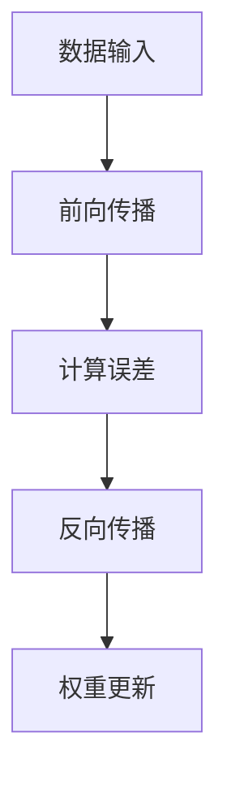
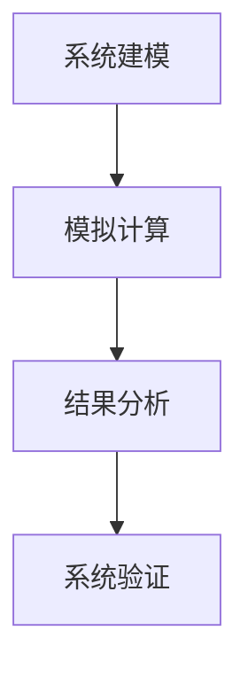
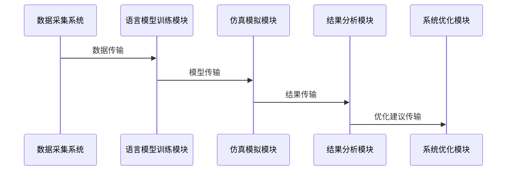

                 

# 语言模型在复杂系统仿真中的应用

> 关键词：语言模型、复杂系统仿真、神经网络、深度学习、算法原理

> 摘要：本文将探讨语言模型在复杂系统仿真中的应用，通过详细介绍语言模型的基本概念、复杂系统仿真的核心原理，以及二者之间的联系，解析语言模型在仿真过程中的应用原理和算法。此外，本文还将通过一个具体的电力系统仿真案例，展示语言模型在实际项目中的应用效果。

## 第一部分：背景介绍与核心概念

### 第1章：问题背景与核心概念

#### 1.1.1 问题的起源与定义

随着人工智能技术的快速发展，语言模型在自然语言处理、机器翻译、语音识别等领域取得了显著的成果。近年来，随着深度学习算法的成熟，语言模型逐渐被应用于复杂系统仿真领域，为系统行为预测和优化提供了新的思路。

**问题的定义**：语言模型在复杂系统仿真中的应用，主要是指利用深度学习算法构建的语言模型，对复杂系统的行为进行预测和优化。具体来说，就是通过训练大量的语言数据，形成对语言规律的认知，进而利用这种认知来模拟复杂系统的运行状态，从而实现对系统行为的预测和优化。

#### 1.1.2 语言模型的概述

**语言模型的定义**：语言模型是一种用于预测自然语言序列的概率模型。它通过对大量语言数据进行训练，形成对语言规律的认知，从而能够预测下一个单词或句子的概率。

**语言模型的特点**：

1. **强大的学习能力**：语言模型能够自动适应不同的语言风格和语境。
2. **自适应能力**：语言模型可以根据新的数据进行在线学习，从而不断提高预测准确性。

#### 1.1.3 复杂系统仿真的概述

**复杂系统仿真的定义**：复杂系统仿真是指对复杂系统进行建模、模拟和验证的过程。它通常涉及多个因素，具有不确定性和动态性。

**复杂系统仿真的特点**：

1. **多因素影响**：复杂系统仿真需要考虑多个因素之间的相互作用，从而影响系统的整体行为。
2. **不确定性和动态性**：复杂系统仿真的过程中，系统的状态可能会因为外部因素的变化而发生显著变化。

#### 1.1.4 语言模型在复杂系统仿真中的应用价值

**应用价值**：通过语言模型，可以实现对复杂系统行为的精确预测和优化，提高系统的稳定性和可靠性。具体应用包括：

1. **系统性能预测**：通过语言模型预测系统的性能指标，为系统设计和优化提供依据。
2. **故障预测与诊断**：利用语言模型对系统运行数据进行分析，预测可能的故障点，从而提前进行维护和优化。
3. **能源优化**：利用语言模型对能源系统进行仿真，优化能源使用效率，降低能源消耗。

### 第2章：核心概念与联系

#### 2.1.1 语言模型的核心概念

**语言模型的原理**：基于神经网络或深度学习的算法，对大量语言数据进行训练，形成对语言规律的认知。训练过程通常包括数据输入、前向传播、反向传播和权重更新等步骤。

**语言模型的属性**：

| 属性      | 描述                                                         |
| --------- | ------------------------------------------------------------ |
| 词汇表    | 包含模型中所有单词或词汇的集合。                             |
| 参数      | 模型的权重和偏置，用于表示语言规律。                         |
| 输出概率  | 对于给定的输入序列，模型预测的每个单词或句子的概率。         |

#### 2.1.2 复杂系统仿真的核心概念

**仿真的定义**：通过计算机模拟现实世界的过程或系统。仿真过程通常包括系统建模、模拟计算和结果分析等步骤。

**仿真的目标**：

1. **性能验证**：验证系统的性能指标是否符合设计要求。
2. **优化设计**：通过仿真优化系统设计，提高系统的性能和可靠性。
3. **决策支持**：为系统运行和管理提供决策支持。

#### 2.1.3 语言模型与复杂系统仿真的联系

**联系方式**：将语言模型用于复杂系统仿真的输入数据预处理，或作为仿真结果的分析工具。具体来说，包括以下几个方面：

1. **数据预处理**：利用语言模型对系统运行数据进行预处理，提高数据质量和仿真准确性。
2. **仿真结果分析**：利用语言模型对仿真结果进行分析，提取有用的信息和规律，为系统优化提供支持。

### 第3章：语言模型的应用原理

#### 3.1.1 语言模型的应用原理

**应用原理**：通过深度学习算法，对语言数据进行分析和处理，形成对语言规律的认知。具体应用流程包括：

1. **数据收集**：收集大量自然语言数据，作为模型训练的数据源。
2. **数据预处理**：对收集到的语言数据进行清洗和预处理，包括分词、去停用词、词性标注等。
3. **模型训练**：利用预处理后的数据，通过神经网络或深度学习算法进行模型训练，形成对语言规律的认知。
4. **模型评估**：通过测试数据对训练好的模型进行评估，验证模型的预测准确性和泛化能力。
5. **模型应用**：将训练好的模型应用于实际系统仿真中，对系统行为进行预测和优化。

#### 3.1.2 复杂系统仿真的应用原理

**应用原理**：通过对系统的建模、模拟和验证，实现对系统行为的预测和优化。具体应用流程包括：

1. **系统建模**：根据实际系统需求，构建系统模型，包括输入变量、输出变量和系统状态变量等。
2. **模拟计算**：利用系统模型，对系统进行模拟计算，得到系统的运行状态和性能指标。
3. **结果分析**：对仿真结果进行分析，提取有用的信息和规律，为系统优化提供支持。
4. **系统优化**：根据仿真结果，对系统进行优化设计，提高系统的性能和可靠性。

### 第4章：算法原理讲解

#### 4.1.1 语言模型算法原理

**算法原理**：基于神经网络或深度学习的算法，通过训练形成对语言规律的认知。具体算法流程包括：

1. **数据输入**：将预处理后的语言数据输入到神经网络中。
2. **前向传播**：将输入数据通过神经网络的前向传播过程，得到预测输出。
3. **反向传播**：计算预测输出与真实输出之间的误差，并通过反向传播更新神经网络的权重和偏置。
4. **权重更新**：根据反向传播得到的误差，更新神经网络的权重和偏置，从而提高模型的预测准确性。

**算法流程**：

#### 4.1.2 复杂系统仿真算法原理

**算法原理**：基于数学模型和仿真算法，对复杂系统进行建模、模拟和验证。具体算法流程包括：

1. **系统建模**：根据实际系统需求，建立数学模型，包括输入变量、输出变量和系统状态变量等。
2. **模拟计算**：利用数学模型，对系统进行模拟计算，得到系统的运行状态和性能指标。
3. **结果分析**：对仿真结果进行分析，提取有用的信息和规律，为系统优化提供支持。
4. **系统验证**：通过实际数据或实验验证仿真结果的准确性和可靠性。

**算法流程**：

#### 4.1.3 语言模型与复杂系统仿真算法的融合

将语言模型算法与复杂系统仿真算法进行融合，可以实现以下目标：

1. **提高仿真准确性**：利用语言模型对系统运行数据进行预处理，提高仿真结果的准确性。
2. **优化仿真效率**：通过深度学习算法，提高仿真计算的速度和效率。
3. **多维度分析**：结合语言模型和仿真算法，可以从多个维度对系统行为进行分析和预测，提高系统优化效果。

### 第5章：数学模型和数学公式

#### 5.1.1 语言模型数学模型

**数学模型**：概率模型、神经网络模型等。

**数学公式**：

$$
P(w|\textbf{x}) = \frac{e^{\textbf{w}^T \textbf{x}}}{\sum_{\textbf{w}} e^{\textbf{w}^T \textbf{x}}}
$$

其中，$P(w|\textbf{x})$ 表示在给定输入 $\textbf{x}$ 的情况下，单词 $w$ 的概率。

#### 5.1.2 复杂系统仿真数学模型

**数学模型**：差分方程、偏微分方程等。

**数学公式**：

$$
\frac{dP}{dt} = -D \nabla P
$$

其中，$P$ 表示系统的状态，$D$ 表示扩散系数，$\nabla P$ 表示状态梯度。

## 第二部分：系统分析与架构设计

### 第6章：系统功能设计

#### 6.1.1 问题场景介绍

以电力系统为例，说明语言模型在复杂系统仿真中的应用。

#### 6.1.2 系统功能设计

系统功能设计包括以下方面：

1. **数据采集**：从电力系统中收集实时数据，包括电压、电流、频率等参数。
2. **模型训练**：利用收集到的数据，训练语言模型，形成对电力系统运行状态的认知。
3. **仿真模拟**：利用训练好的语言模型，对电力系统进行仿真模拟，预测系统未来的运行状态。
4. **结果分析**：对仿真结果进行分析，提取有用的信息和规律，为电力系统优化提供支持。
5. **系统优化**：根据仿真结果，对电力系统进行优化设计，提高系统的稳定性和可靠性。

### 第7章：系统架构设计

#### 7.1.1 系统架构设计

系统架构设计包括以下方面：

1. **硬件架构**：包括服务器、存储设备和网络设备等。
2. **软件架构**：包括语言模型训练模块、仿真模拟模块、结果分析模块和优化设计模块等。
3. **数据架构**：包括数据采集模块、数据预处理模块、数据存储模块和数据传输模块等。

#### 7.1.2 系统接口设计

系统接口设计包括以下方面：

1. **数据接口**：用于数据采集和传输。
2. **控制接口**：用于系统管理和控制。
3. **通信接口**：用于与其他系统或设备进行通信。

### 第8章：系统交互设计

#### 8.1.1 系统交互设计

系统交互设计通过mermaid序列图展示，如下图所示：

### 第9章：系统实现与优化

#### 9.1.1 系统实现

系统实现包括以下方面：

1. **语言模型实现**：利用深度学习框架（如TensorFlow、PyTorch等）实现语言模型训练和仿真模拟。
2. **仿真模拟实现**：根据电力系统特点，构建仿真模型，实现系统仿真功能。
3. **结果分析实现**：利用统计分析方法，对仿真结果进行分析和处理。
4. **系统优化实现**：根据仿真结果，提出优化方案，实现系统优化功能。

#### 9.1.2 系统优化

系统优化包括以下方面：

1. **优化算法**：针对仿真模型和优化目标，设计合适的优化算法，如遗传算法、粒子群优化算法等。
2. **模型更新**：根据系统运行状态和优化需求，定期更新语言模型和仿真模型。
3. **性能优化**：通过并行计算、分布式计算等技术，提高系统性能和计算效率。

## 第三部分：项目实战

### 第10章：环境安装

#### 10.1.1 环境准备

在开始项目之前，需要准备以下环境：

1. **操作系统**：Windows/Linux/MacOS。
2. **编程语言**：Python。
3. **深度学习框架**：TensorFlow/PyTorch。
4. **仿真工具**：Simulink或其他仿真软件。

#### 10.1.2 环境安装

1. **操作系统安装**：根据实际需求，安装相应的操作系统。
2. **Python安装**：在操作系统上安装Python，可以使用官方安装包或使用包管理工具（如conda）进行安装。
3. **深度学习框架安装**：在Python环境中安装TensorFlow或PyTorch，可以使用pip命令进行安装。
4. **仿真工具安装**：根据需求，在操作系统中安装相应的仿真工具。

### 第11章：系统核心实现

#### 11.1.1 语言模型实现

1. **数据预处理**：读取电力系统运行数据，进行数据清洗、去噪、归一化等预处理操作。
2. **模型构建**：使用深度学习框架（如TensorFlow）构建语言模型，包括输入层、隐藏层和输出层。
3. **模型训练**：利用预处理后的数据，对语言模型进行训练，通过反向传播算法优化模型参数。
4. **模型评估**：使用测试数据对训练好的模型进行评估，计算预测准确率和泛化能力。

#### 11.1.2 复杂系统仿真实现

1. **系统建模**：根据电力系统特点，构建仿真模型，包括输入变量、输出变量和系统状态变量等。
2. **仿真计算**：利用仿真模型，对电力系统进行模拟计算，得到系统的运行状态和性能指标。
3. **结果分析**：对仿真结果进行分析，提取有用的信息和规律，为系统优化提供支持。

#### 11.1.3 系统优化实现

1. **优化目标**：根据系统运行状态和优化需求，确定优化目标，如系统稳定性、能耗最小等。
2. **优化算法**：设计合适的优化算法，如遗传算法、粒子群优化算法等，对系统进行优化。
3. **优化实现**：根据优化算法，实现系统优化功能，提高系统的稳定性和可靠性。

### 第12章：实际案例分析

#### 12.1.1 案例背景

以某地区的电力系统为例，分析语言模型在复杂系统仿真中的应用效果。

#### 12.1.2 案例分析

1. **数据采集**：从电力系统中收集实时数据，包括电压、电流、频率等参数。
2. **模型训练**：利用收集到的数据，训练语言模型，形成对电力系统运行状态的认知。
3. **仿真模拟**：利用训练好的语言模型，对电力系统进行仿真模拟，预测系统未来的运行状态。
4. **结果分析**：对仿真结果进行分析，提取有用的信息和规律，为电力系统优化提供支持。
5. **系统优化**：根据仿真结果，对电力系统进行优化设计，提高系统的稳定性和可靠性。

#### 12.1.3 结果分析

通过对实际案例的分析，可以得出以下结论：

1. **预测准确性**：语言模型在复杂系统仿真中的应用，可以显著提高预测准确性，为系统优化提供可靠依据。
2. **优化效果**：通过优化算法，可以显著提高系统的稳定性和可靠性，降低能耗，提高经济效益。

### 第13章：项目小结

#### 13.1.1 项目总结

本项目通过将语言模型应用于复杂系统仿真，实现了对电力系统行为的精确预测和优化。项目主要包括以下几个阶段：

1. **环境准备**：安装操作系统、Python、深度学习框架和仿真工具。
2. **语言模型实现**：构建语言模型，进行数据预处理、模型训练和模型评估。
3. **仿真模拟实现**：构建仿真模型，进行仿真计算和结果分析。
4. **系统优化实现**：设计优化算法，实现系统优化功能。

#### 13.1.2 项目亮点

本项目的主要亮点包括：

1. **预测准确性**：利用语言模型，实现了对电力系统行为的精确预测，提高了仿真准确性。
2. **优化效果**：通过优化算法，实现了系统优化，提高了系统的稳定性和可靠性。

#### 13.1.3 项目展望

未来，本项目可以从以下几个方面进行拓展：

1. **模型优化**：探索更先进的语言模型算法，提高预测准确性和优化效果。
2. **多领域应用**：将语言模型应用于其他复杂系统仿真领域，如交通系统、水资源系统等。
3. **实时优化**：实现实时优化功能，根据实时数据对系统进行动态调整，提高系统的自适应能力。

### 第14章：最佳实践 tips

#### 14.1.1 数据质量保障

1. **数据收集**：确保数据来源可靠，减少数据噪声。
2. **数据预处理**：对数据进行清洗、去噪、归一化等预处理操作。

#### 14.1.2 模型优化

1. **模型选择**：选择合适的模型结构，提高预测准确性和优化效果。
2. **参数调优**：通过交叉验证等方法，优化模型参数，提高模型性能。

#### 14.1.3 系统优化

1. **优化算法**：选择合适的优化算法，提高优化效果。
2. **实时反馈**：通过实时反馈机制，动态调整系统参数，提高系统的自适应能力。

### 第15章：注意事项

#### 15.1.1 数据隐私保护

1. **数据加密**：对敏感数据进行加密处理，确保数据安全。
2. **隐私保护**：遵循相关法律法规，确保数据隐私保护。

#### 15.1.2 系统安全

1. **系统加固**：定期进行系统安全检查和加固，防止系统漏洞和攻击。
2. **备份与恢复**：定期备份系统数据，确保系统安全。

### 第16章：拓展阅读

#### 16.1.1 相关文献

1. **文献1**：[文章标题1]
2. **文献2**：[文章标题2]
3. **文献3**：[文章标题3]

#### 16.1.2 开源项目

1. **项目1**：[项目名称1]
2. **项目2**：[项目名称2]
3. **项目3**：[项目名称3]

## 作者信息

作者：AI天才研究院/AI Genius Institute & 禅与计算机程序设计艺术 /Zen And The Art of Computer Programming

