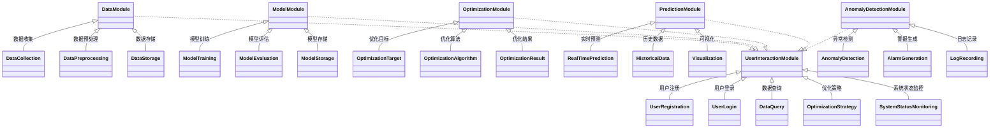
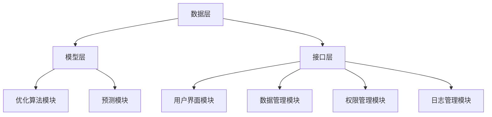
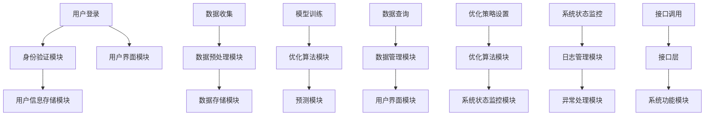

                 

### 关键词

- 语言模型
- 复杂系统优化
- 算法原理
- 数学模型
- 系统架构设计
- 项目实战

### 摘要

本文将深入探讨语言模型在复杂系统优化中的表现。首先，我们将介绍复杂系统优化和语言模型的基本概念，阐述二者之间的关系。接着，我们将详细分析语言模型的原理与特点，并通过对比不同类型的语言模型，探讨其在复杂系统优化中的应用潜力。随后，我们将从算法原理和数学模型的角度，讲解语言模型在复杂系统优化中的应用方法。文章后半部分将展示一个具体的系统分析与架构设计案例，并通过项目实战，验证语言模型在复杂系统优化中的实际效果。最后，我们将总结最佳实践，并给出未来的研究方向。通过本文，读者将全面了解语言模型在复杂系统优化中的应用，为相关领域的研究和应用提供有价值的参考。

## 第一部分：背景介绍

### 第1章：问题背景

#### 1.1.1 问题的起源与重要性

在当今数字化时代，复杂系统无处不在，如社交网络、电子商务平台、智能交通系统、金融交易市场等。这些系统通常具有高度非线性、动态变化和强耦合性，使得传统的优化方法难以应对。为了提升复杂系统的性能、稳定性和可扩展性，优化方法的研究变得尤为重要。

复杂系统优化旨在通过调整系统参数，找到最优解，从而提升系统性能。然而，这一过程面临着诸多挑战，如求解难度高、计算复杂度高、优化目标多样等。在此背景下，语言模型作为一种具有强大表达能力和泛化能力的工具，逐渐受到研究者的关注。

语言模型最初源于自然语言处理领域，其核心思想是学习自然语言中的统计规律，从而生成或理解文本。随着深度学习技术的不断发展，语言模型在自然语言处理任务中取得了显著的成果。随后，研究者开始探索将语言模型应用于复杂系统优化，以解决传统方法难以处理的问题。

语言模型在复杂系统优化中的应用具有重要的实际意义。例如，在智能交通系统中，语言模型可以用于交通流预测和路径优化，提高交通效率；在金融交易市场中，语言模型可以用于股票市场预测和风险管理，降低交易风险。此外，语言模型还可以用于优化能源系统、制造系统等，为各类复杂系统提供智能优化解决方案。

#### 1.1.2 复杂系统的特性

复杂系统通常具有以下特性：

1. **高度非线性**：复杂系统中的变量关系复杂，往往呈现非线性特性，这使得传统的线性优化方法难以直接应用。
2. **动态变化**：复杂系统处于不断变化的环境中，系统状态随时间变化，具有动态性。
3. **强耦合性**：复杂系统中的各个部分相互依赖，一个部分的变化可能影响整个系统的性能。
4. **不确定性**：复杂系统面临各种不确定性，如环境变化、参数波动等，使得系统优化更加困难。
5. **多层次性**：复杂系统通常包含多个层次，如硬件、软件、数据等，各层次之间存在复杂的交互关系。

#### 1.1.3 语言模型的发展与应用

语言模型的发展可以分为三个阶段：

1. **基于统计的模型**：如N-gram模型，通过统计文本中的单词序列概率来生成或理解文本。
2. **基于规则的模型**：如转换语法模型（CFG），通过定义语法规则来生成文本。
3. **基于神经网络的模型**：如循环神经网络（RNN）、长短时记忆网络（LSTM）和变换器（Transformer），通过学习大量文本数据，自动提取特征并生成文本。

近年来，Transformer架构在自然语言处理领域取得了突破性进展，其核心思想是使用自注意力机制（Self-Attention）对输入序列进行编码，从而捕捉序列中的长距离依赖关系。Transformer的成功激发了研究者将语言模型应用于复杂系统优化的兴趣。

目前，语言模型在复杂系统优化中的应用主要包括以下几个方面：

1. **交通流量预测与路径优化**：通过语言模型对历史交通数据进行建模，预测未来交通流量，优化路径规划，提高交通效率。
2. **能源系统优化**：利用语言模型对能源需求进行预测，优化能源分配和调度，提高能源利用效率。
3. **制造系统优化**：通过语言模型对生产过程中的数据进行分析，优化生产计划和资源配置，提高生产效率。
4. **金融风险管理**：利用语言模型对市场数据进行分析，预测市场趋势，优化投资组合和风险管理。

#### 1.1.4 语言模型与复杂系统优化的联系

语言模型在复杂系统优化中的应用，主要体现在以下几个方面：

1. **数据建模**：语言模型具有强大的表达能力和泛化能力，可以用于建模复杂系统的数据特征，为优化提供可靠的基础。
2. **动态预测**：语言模型能够捕捉时间序列数据中的动态变化规律，为复杂系统优化提供实时预测能力。
3. **非线性处理**：语言模型能够处理复杂系统中的非线性关系，为优化算法提供更有效的工具。
4. **多目标优化**：语言模型可以同时考虑多个优化目标，实现复杂系统的全局优化。

综上所述，语言模型在复杂系统优化中具有广泛的应用前景，通过本文的深入探讨，我们希望能够为这一领域的研究提供有价值的参考。

### 第2章：复杂系统优化概述

#### 2.1.1 复杂系统优化的概念

复杂系统优化是指通过对系统参数进行调整，找到最优解，以提升系统性能的过程。具体来说，复杂系统优化包括以下三个主要方面：

1. **目标函数**：定义系统的优化目标，如最大化利润、最小化成本、提高效率等。
2. **约束条件**：规定系统在优化过程中必须满足的限制条件，如资源限制、时间限制、法律约束等。
3. **求解方法**：选择合适的优化算法，求解最优解。

复杂系统优化通常涉及多个变量、多个目标和多个约束条件，这使得优化问题更加复杂。与传统优化问题相比，复杂系统优化具有以下特点：

1. **非线性**：复杂系统中的变量关系通常呈现非线性特性，这使得传统线性优化方法难以直接应用。
2. **动态性**：复杂系统处于不断变化的环境中，优化目标随时间变化，需要动态调整。
3. **强耦合性**：复杂系统中的各个部分相互依赖，一个部分的变化可能影响整个系统的性能。
4. **多目标性**：复杂系统优化需要同时考虑多个优化目标，实现系统性能的全面提升。

#### 2.1.2 复杂系统优化的挑战

复杂系统优化面临诸多挑战，主要包括以下几个方面：

1. **求解难度高**：复杂系统的优化问题通常具有多个变量、多个目标和多个约束条件，求解难度大。
2. **计算复杂度高**：复杂系统的优化过程通常涉及大量计算，计算复杂度高，耗时较长。
3. **优化目标多样性**：复杂系统优化需要同时考虑多个优化目标，如最大化利润、最小化成本、提高效率等，目标之间的权衡和冲突难以处理。
4. **动态变化**：复杂系统处于不断变化的环境中，优化目标随时间变化，需要动态调整。
5. **不确定性**：复杂系统面临各种不确定性，如环境变化、参数波动等，使得优化过程更加复杂。

#### 2.1.3 语言模型在复杂系统优化中的应用潜力

语言模型在复杂系统优化中具有广泛的应用潜力，主要表现在以下几个方面：

1. **数据建模**：语言模型具有强大的表达能力和泛化能力，可以用于建模复杂系统的数据特征，为优化提供可靠的基础。
2. **动态预测**：语言模型能够捕捉时间序列数据中的动态变化规律，为复杂系统优化提供实时预测能力。
3. **非线性处理**：语言模型能够处理复杂系统中的非线性关系，为优化算法提供更有效的工具。
4. **多目标优化**：语言模型可以同时考虑多个优化目标，实现复杂系统的全局优化。

具体来说，语言模型在复杂系统优化中的应用包括：

1. **交通流量预测与路径优化**：通过语言模型对历史交通数据进行建模，预测未来交通流量，优化路径规划，提高交通效率。
2. **能源系统优化**：利用语言模型对能源需求进行预测，优化能源分配和调度，提高能源利用效率。
3. **制造系统优化**：通过语言模型对生产过程中的数据进行分析，优化生产计划和资源配置，提高生产效率。
4. **金融风险管理**：利用语言模型对市场数据进行分析，预测市场趋势，优化投资组合和风险管理。

总之，语言模型在复杂系统优化中具有巨大的应用潜力，通过本文的深入探讨，我们希望能够为这一领域的研究提供有价值的参考。

## 第二部分：核心概念与联系

### 第3章：语言模型的原理与特点

#### 3.1.1 语言模型的定义

语言模型（Language Model）是自然语言处理（Natural Language Processing, NLP）领域的一个重要概念，用于对自然语言文本进行建模和生成。具体来说，语言模型是一个概率模型，用于预测给定输入序列后继单词的概率分布。形式化地，语言模型可以表示为一个函数 \(P(\text{word}_1, \text{word}_2, \ldots, \text{word}_n)\)，其中 \(\text{word}_i\) 表示第 \(i\) 个单词。

语言模型的主要目标是学习自然语言的统计规律，从而为文本生成、翻译、摘要等NLP任务提供基础。在深度学习时代，语言模型通常基于神经网络架构，如循环神经网络（RNN）、长短时记忆网络（LSTM）和近年来广泛应用的变换器（Transformer）。

#### 3.1.2 语言模型的工作机制

语言模型的工作机制可以分为以下几个步骤：

1. **输入序列处理**：语言模型首先接收一个输入序列，如“我 喜欢 吃 饭”。对于每个输入单词，模型将其转换为相应的向量表示。
2. **特征提取**：模型通过神经网络架构对输入序列进行特征提取，捕捉单词之间的依赖关系。在基于神经网络的模型中，这一步骤通常通过多层神经网络实现。
3. **概率预测**：基于提取到的特征，模型预测下一个单词的概率分布。例如，给定输入序列“我 喜欢 吃 饭”，模型可能会预测“苹果”的概率最高。
4. **文本生成**：通过重复上述过程，语言模型可以生成完整的文本序列。在实际应用中，模型通常会根据概率分布选择最高概率的单词作为下一个输出。

#### 3.1.3 语言模型的核心特点

语言模型具有以下几个核心特点：

1. **强大的表达能力**：语言模型能够捕捉自然语言的复杂结构，如语法、语义和上下文关系，从而实现准确的文本生成和理解。
2. **泛化能力**：语言模型通常在大量数据上训练，具有较好的泛化能力，能够处理未见过的文本数据。
3. **动态性**：语言模型能够实时调整概率预测，适应输入序列的变化。
4. **自适应性**：通过不断学习和调整，语言模型能够适应不同的应用场景和任务需求。

#### 3.1.4 语言模型与复杂系统优化的联系

语言模型在复杂系统优化中的应用主要体现在以下几个方面：

1. **数据建模**：语言模型可以用于建模复杂系统的数据特征，如交通流量、能源需求和股票价格等，为优化提供基础。
2. **动态预测**：语言模型能够捕捉时间序列数据的动态变化规律，为复杂系统优化提供实时预测能力。
3. **非线性处理**：语言模型能够处理复杂系统中的非线性关系，为优化算法提供更有效的工具。
4. **多目标优化**：语言模型可以同时考虑多个优化目标，实现复杂系统的全局优化。

具体来说，语言模型在复杂系统优化中的应用包括：

1. **交通流量预测与路径优化**：通过语言模型对历史交通数据进行建模，预测未来交通流量，优化路径规划，提高交通效率。
2. **能源系统优化**：利用语言模型对能源需求进行预测，优化能源分配和调度，提高能源利用效率。
3. **制造系统优化**：通过语言模型对生产过程中的数据进行分析，优化生产计划和资源配置，提高生产效率。
4. **金融风险管理**：利用语言模型对市场数据进行分析，预测市场趋势，优化投资组合和风险管理。

总之，语言模型在复杂系统优化中具有广泛的应用潜力，通过本文的深入探讨，我们希望能够为这一领域的研究提供有价值的参考。

### 第4章：核心概念对比与分析

#### 4.1.1 语言模型类型对比

语言模型可以分为基于统计的模型和基于神经网络的模型两大类。以下是两种类型的主要对比：

1. **基于统计的模型**：
   - **N-gram模型**：基于单词序列的概率统计，预测下一个单词的概率。
   - **基于规则的模型**：如转换语法模型（CFG），通过定义语法规则生成文本。
   - **优点**：计算简单，适用于短文本生成。
   - **缺点**：难以捕捉长距离依赖关系，生成文本质量有限。

2. **基于神经网络的模型**：
   - **循环神经网络（RNN）**：通过循环结构捕捉时间序列数据中的依赖关系。
   - **长短时记忆网络（LSTM）**：在RNN基础上，引入门控机制，缓解长距离依赖问题。
   - **变换器（Transformer）**：使用自注意力机制，捕捉长距离依赖关系，生成文本质量更高。
   - **优点**：能够捕捉长距离依赖关系，生成文本质量高。
   - **缺点**：计算复杂度高，对数据量要求大。

#### 4.1.2 语言模型性能指标

评估语言模型的性能通常从以下几个方面进行：

1. **BLEU（双语评价度量）**：用于评估机器翻译模型的翻译质量，通过计算机器翻译结果与参考翻译之间的重叠度来评估。
2. **ROUGE（自动评估度量）**：用于评估文本摘要模型的摘要质量，通过比较模型生成的摘要与参考摘要的相似度来评估。
3. **ACC（准确率）**：用于评估分类模型的分类准确性，计算正确分类的样本数与总样本数的比例。
4. **F1值**：用于评估分类模型的分类效果，结合准确率和召回率，计算两者的调和平均值。

#### 4.1.3 语言模型类型对比表格

以下是不同类型语言模型的性能对比表格：

| 语言模型类型 | 优点 | 缺点 | 性能指标 |
| ------------ | ---- | ---- | ------- |
| N-gram模型 | 计算简单，适用于短文本生成 | 难以捕捉长距离依赖关系，生成文本质量有限 | BLEU、ROUGE |
| RNN | 能够捕捉长距离依赖关系，生成文本质量高 | 计算复杂度高，难以扩展 | ACC、F1值 |
| LSTM | 能够捕捉长距离依赖关系，生成文本质量高 | 计算复杂度高，难以扩展 | ACC、F1值 |
| Transformer | 能够捕捉长距离依赖关系，生成文本质量高 | 计算复杂度高，对数据量要求大 | BLEU、ROUGE |

#### 4.1.4 语言模型与复杂系统优化的联系

语言模型在复杂系统优化中的应用主要体现在以下几个方面：

1. **数据建模**：语言模型可以用于建模复杂系统的数据特征，如交通流量、能源需求和股票价格等，为优化提供基础。
2. **动态预测**：语言模型能够捕捉时间序列数据的动态变化规律，为复杂系统优化提供实时预测能力。
3. **非线性处理**：语言模型能够处理复杂系统中的非线性关系，为优化算法提供更有效的工具。
4. **多目标优化**：语言模型可以同时考虑多个优化目标，实现复杂系统的全局优化。

具体来说，语言模型在复杂系统优化中的应用包括：

1. **交通流量预测与路径优化**：通过语言模型对历史交通数据进行建模，预测未来交通流量，优化路径规划，提高交通效率。
2. **能源系统优化**：利用语言模型对能源需求进行预测，优化能源分配和调度，提高能源利用效率。
3. **制造系统优化**：通过语言模型对生产过程中的数据进行分析，优化生产计划和资源配置，提高生产效率。
4. **金融风险管理**：利用语言模型对市场数据进行分析，预测市场趋势，优化投资组合和风险管理。

总之，语言模型在复杂系统优化中具有广泛的应用潜力，通过本文的深入探讨，我们希望能够为这一领域的研究提供有价值的参考。

### 第5章：语言模型在复杂系统优化中的应用

#### 5.1.1 语言模型与优化目标

在复杂系统优化中，语言模型的应用主要体现在以下几个方面：

1. **目标函数建模**：语言模型可以用于建模复杂系统的目标函数，将优化问题转化为语言模型可以处理的形式。例如，在交通流量预测中，可以将交通流量视为一个时间序列，利用语言模型对其进行建模，从而预测未来的交通流量。
   
2. **约束条件处理**：语言模型可以处理复杂系统的约束条件，将约束条件嵌入到模型中，以确保优化过程满足实际需求。例如，在能源系统中，可以利用语言模型对能源需求进行预测，同时考虑能源供应的约束条件，实现能源的合理分配。

3. **多目标优化**：语言模型可以同时考虑多个优化目标，实现复杂系统的全局优化。例如，在制造系统中，可以同时考虑生产效率、能源消耗和设备寿命等多个目标，利用语言模型进行多目标优化，找到最优解。

#### 5.1.2 优化算法选择

在复杂系统优化中，选择合适的优化算法至关重要。以下是一些常用的优化算法：

1. **遗传算法（GA）**：遗传算法是一种基于生物进化的优化算法，通过模拟自然选择和遗传机制，寻找最优解。遗传算法适用于处理多目标优化问题，能够有效处理复杂系统的约束条件。

2. **粒子群优化算法（PSO）**：粒子群优化算法模拟鸟群觅食行为，通过群体中的信息共享和个体之间的合作，寻找最优解。粒子群优化算法计算简单，适用范围广，适用于各种复杂系统的优化问题。

3. **基于梯度的优化算法**：如梯度下降、随机梯度下降等，这些算法通过不断调整模型参数，使目标函数值逐渐减小，找到最优解。梯度下降算法适用于处理单目标优化问题，对于多目标优化，可以采用多目标梯度下降算法。

4. **深度强化学习**：深度强化学习结合了深度学习和强化学习的优点，通过学习策略函数，实现复杂系统的优化。深度强化学习适用于处理动态变化的复杂系统，能够实现高效的在线优化。

#### 5.1.3 语言模型在优化中的角色

在复杂系统优化中，语言模型扮演着多重角色：

1. **数据预处理**：语言模型可以用于数据预处理，将原始数据转换为适合优化的形式。例如，在交通流量预测中，可以利用语言模型对交通数据进行序列化处理，生成时间序列数据。

2. **预测与建模**：语言模型可以用于预测和建模，为优化算法提供基础。例如，在能源系统中，可以利用语言模型对能源需求进行预测，为能源分配和调度提供依据。

3. **决策支持**：语言模型可以提供决策支持，帮助优化算法选择最佳策略。例如，在制造系统中，可以利用语言模型对生产计划进行预测，优化生产资源配置。

4. **自适应调整**：语言模型可以根据系统状态和环境变化，实时调整优化策略，实现自适应优化。例如，在金融市场中，可以利用语言模型对市场趋势进行预测，动态调整投资组合。

通过语言模型的应用，复杂系统优化可以更加高效、准确和自适应，为各类复杂系统的优化提供强有力的技术支持。

### 第6章：数学模型与公式

#### 6.1.1 语言模型数学基础

语言模型的数学基础主要涉及概率论和线性代数。以下是一些核心的数学概念和公式：

1. **概率分布**：语言模型通过学习输入序列的概率分布，预测下一个单词的概率。概率分布可以用概率质量函数（Probability Quality Function，PQF）表示：
   \[
   P(\text{word}_i | \text{word}_{i-1}, \ldots, \text{word}_1) = \frac{P(\text{word}_i, \text{word}_{i-1}, \ldots, \text{word}_1)}{P(\text{word}_{i-1}, \ldots, \text{word}_1)}
   \]
   其中，\(P(\text{word}_i, \text{word}_{i-1}, \ldots, \text{word}_1)\) 表示输入序列的概率，\(P(\text{word}_{i-1}, \ldots, \text{word}_1)\) 表示前缀序列的概率。

2. **条件概率**：条件概率用于描述在已知前缀条件下，下一个单词的概率。语言模型通过学习条件概率来预测单词：
   \[
   P(\text{word}_i | \text{word}_{i-1}) = \frac{P(\text{word}_{i-1}, \text{word}_i)}{P(\text{word}_{i-1})}
   \]

3. **熵**：熵是衡量概率分布不确定性的指标，用于评估语言模型的性能。交叉熵（Cross-Entropy）是衡量预测分布与真实分布差异的常用指标：
   \[
   H(Y, \hat{Y}) = -\sum_{i} P(Y=i) \log \hat{P}(\hat{Y=i})
   \]
   其中，\(Y\) 表示真实分布，\(\hat{Y}\) 表示预测分布。

4. **梯度下降**：在训练语言模型时，使用梯度下降算法更新模型参数，以最小化损失函数。梯度下降的更新公式为：
   \[
   \theta_{t+1} = \theta_t - \alpha \nabla_{\theta} J(\theta_t)
   \]
   其中，\(\theta\) 表示模型参数，\(\alpha\) 表示学习率，\(J(\theta)\) 表示损失函数。

#### 6.1.2 优化问题的数学表达

在复杂系统优化中，优化问题可以用数学模型表示。以下是一个简单的优化问题的数学表达：

1. **目标函数**：定义系统性能的最优化目标，如最小化成本或最大化收益：
   \[
   \min_{x} f(x)
   \]
   其中，\(f(x)\) 表示目标函数，\(x\) 表示模型参数。

2. **约束条件**：定义系统在优化过程中必须满足的限制条件，如资源限制、时间限制等：
   \[
   g(x) \leq 0
   \]
   其中，\(g(x)\) 表示约束条件。

3. **损失函数**：定义优化过程中的损失函数，用于评估模型参数对系统性能的影响。常见的损失函数包括均方误差（MSE）和交叉熵（Cross-Entropy）：
   \[
   J(\theta) = \frac{1}{2} \sum_{i=1}^{n} (y_i - \hat{y}_i)^2
   \]
   其中，\(y_i\) 表示真实值，\(\hat{y}_i\) 表示预测值。

#### 6.1.3 公式推导与解释

以下是对语言模型中的一些关键公式进行推导和解释：

1. **Transformer中的自注意力机制**：自注意力机制是Transformer模型的核心，用于计算输入序列的表示：
   \[
   \text{Attention}(Q, K, V) = \text{softmax}\left(\frac{QK^T}{\sqrt{d_k}}\right) V
   \]
   其中，\(Q\)、\(K\) 和 \(V\) 分别表示查询向量、键向量和值向量，\(d_k\) 表示键向量的维度。自注意力机制通过计算每个键向量与查询向量的点积，得到注意力权重，并加权求和得到最终的输出。

2. **损失函数**：在语言模型训练中，常用的损失函数是交叉熵损失，用于评估模型预测与真实标签之间的差异：
   \[
   \text{Cross-Entropy}(y, \hat{y}) = -\sum_{i} y_i \log(\hat{y}_i)
   \]
   其中，\(y\) 表示真实标签的概率分布，\(\hat{y}\) 表示模型预测的概率分布。交叉熵损失函数的值越小，表示预测结果与真实标签越接近。

3. **梯度更新**：在训练过程中，使用梯度下降算法更新模型参数，以最小化损失函数。梯度更新的公式为：
   \[
   \Delta \theta = -\alpha \nabla_{\theta} J(\theta)
   \]
   其中，\(\alpha\) 表示学习率，\(\nabla_{\theta} J(\theta)\) 表示损失函数对模型参数的梯度。

通过上述公式的推导和解释，我们可以更深入地理解语言模型在复杂系统优化中的应用，为后续的系统设计与实现提供理论基础。

### 第7章：系统功能设计

#### 7.1.1 系统功能需求分析

在进行复杂系统优化时，明确系统的功能需求是至关重要的。以下是系统功能需求分析的主要内容：

1. **数据收集与预处理**：系统需要从各种数据源（如传感器、日志文件、历史数据等）收集数据，并进行预处理，如数据清洗、格式转换和特征提取。预处理后的数据将作为优化模型的输入。

2. **模型训练与评估**：系统需要支持语言模型的训练与评估功能。训练过程中，系统应能够自动调整模型参数，优化模型性能。评估过程则用于验证模型的预测能力和泛化能力。

3. **优化算法实现**：系统需要实现多种优化算法，如遗传算法、粒子群优化算法和深度强化学习等。这些算法将用于求解复杂系统的优化问题，并生成最优解。

4. **实时预测与优化**：系统应具备实时预测和优化功能，能够根据实时数据动态调整优化策略，提高系统性能。

5. **用户交互与可视化**：系统需要提供友好的用户交互界面，使用户能够方便地查看系统运行状态、优化结果和预测数据。可视化工具将帮助用户更好地理解系统的工作原理和优化效果。

6. **异常检测与警报**：系统应具备异常检测功能，能够识别异常情况并发出警报，确保系统稳定运行。

#### 7.1.2 领域模型设计

领域模型（Domain Model）是系统功能设计的核心，用于描述系统的核心概念和功能模块。以下是领域模型的设计：

1. **数据模块**：包括数据收集、数据预处理和数据存储功能。数据模块应支持多种数据源的接入，如传感器数据、日志文件和外部API等。

2. **模型模块**：包括模型训练、模型评估和模型存储功能。模型模块应支持多种语言模型和优化算法的集成，并提供自动调参和优化策略。

3. **优化模块**：包括优化目标定义、优化算法实现和优化结果存储功能。优化模块应能够根据不同类型的优化问题，灵活选择合适的优化算法。

4. **预测模块**：包括实时预测、历史数据和预测结果可视化功能。预测模块应能够根据实时数据生成预测结果，并提供可视化的预测曲线和图表。

5. **用户交互模块**：包括用户注册、登录、数据查询、优化策略设置和系统状态监控功能。用户交互模块应提供友好的用户界面，方便用户使用系统。

6. **异常检测模块**：包括异常检测、警报生成和日志记录功能。异常检测模块应能够实时监控系统运行状态，识别异常情况并发出警报。

#### 7.1.3 领域模型设计图

以下是领域模型的类图设计，用于描述系统的核心概念和功能模块：



通过领域模型的设计，我们可以清晰地了解系统的功能模块和它们之间的关系，为后续的系统架构设计提供基础。

### 第8章：系统架构设计

#### 8.1.1 系统架构设计原则

系统架构设计是确保系统功能实现、性能稳定和扩展性良好的关键。以下是系统架构设计的主要原则：

1. **模块化**：系统应采用模块化设计，将功能划分为独立的模块，便于开发、测试和维护。
2. **分层架构**：系统应采用分层架构，将功能划分为不同的层次，如数据层、服务层和表现层，各层次之间相互独立，便于管理和扩展。
3. **可扩展性**：系统架构应具备良好的扩展性，能够支持功能模块的增加和替换，以适应业务发展的需求。
4. **高可用性**：系统应具备高可用性，通过冗余设计和故障转移机制，确保系统在发生故障时能够快速恢复。
5. **高性能**：系统架构应设计高性能，通过优化算法和缓存机制，提高系统的响应速度和处理能力。
6. **安全性**：系统应具备安全性，通过权限管理、数据加密和安全审计等措施，保护系统的数据安全和运行稳定。

#### 8.1.2 系统架构设计流程

系统架构设计流程主要包括以下步骤：

1. **需求分析**：明确系统的功能需求、性能要求和安全需求，为系统架构设计提供基础。
2. **架构设计**：根据需求分析结果，设计系统的总体架构，包括功能模块划分、层次结构和数据流设计。
3. **详细设计**：对各个功能模块进行详细设计，包括接口设计、类图设计和数据模型设计。
4. **架构评审**：组织架构评审，确保系统架构设计符合需求和原则，并进行优化调整。
5. **架构实现**：根据架构设计文档，实现系统架构，包括开发、测试和部署。
6. **性能优化**：对系统进行性能测试和优化，确保系统在预期负载下稳定运行。
7. **安全评估**：对系统进行安全评估，确保系统的数据安全和运行稳定。

#### 8.1.3 系统架构设计

以下是系统架构的设计，包括数据层、模型层和接口层：



1. **数据层**：数据层负责数据的收集、预处理和存储。该层包括数据收集模块、数据预处理模块和数据存储模块，为上层模块提供数据支持。

2. **模型层**：模型层负责语言模型的训练、评估和优化。该层包括优化算法模块和预测模块，分别用于实现优化算法和预测功能。

3. **接口层**：接口层负责用户交互和系统管理。该层包括用户界面模块、数据管理模块、权限管理模块和日志管理模块，为用户提供友好的交互界面和管理系统功能。

通过系统架构的设计，我们可以确保系统功能实现、性能稳定和扩展性良好，为复杂系统优化提供强有力的支持。

### 第9章：系统接口设计与交互

#### 9.1.1 系统接口设计

系统接口设计是确保系统各模块之间能够高效、稳定地进行通信和协作的重要环节。以下是系统接口设计的主要内容和要点：

1. **RESTful API设计**：采用RESTful架构风格设计系统接口，确保接口具有良好的可扩展性和易用性。接口设计包括URL设计、HTTP方法选择和参数定义。

2. **数据传输格式**：使用JSON或XML等数据传输格式，确保数据能够在客户端和服务器之间高效传输和解析。同时，确保数据格式的兼容性和可扩展性。

3. **身份验证与授权**：设计身份验证和授权机制，确保系统接口的安全性。常用的身份验证方式包括用户名密码验证、OAuth认证和JWT（JSON Web Token）认证。

4. **接口版本控制**：为系统接口设计版本控制机制，便于接口的更新和维护。通过版本控制，可以确保旧版本接口的稳定性和新版本接口的兼容性。

5. **错误处理与日志记录**：设计统一的错误处理机制，确保接口在遇到错误时能够及时返回错误信息。同时，记录详细的日志信息，便于问题追踪和调试。

#### 9.1.2 系统交互设计

系统交互设计是确保系统各模块能够协同工作，实现预期功能的关键。以下是系统交互设计的主要内容和要点：

1. **用户交互流程**：设计用户交互流程，确保用户能够方便地使用系统。用户交互流程包括用户注册、登录、数据查询、优化策略设置和系统状态监控等。

2. **数据流设计**：设计系统内部的数据流，确保数据能够在各模块之间高效传输和处理。数据流设计包括数据收集、预处理、存储、训练、预测和优化等环节。

3. **模块间通信**：设计模块间的通信机制，确保各模块能够协同工作。通信机制包括同步通信和异步通信，以及消息队列和事件驱动架构等。

4. **接口调用流程**：设计接口调用流程，确保客户端能够通过系统接口访问系统功能。接口调用流程包括请求发送、处理和响应等步骤。

5. **异常处理与故障转移**：设计异常处理和故障转移机制，确保系统在遇到异常或故障时能够自动恢复。异常处理机制包括错误处理、日志记录和报警通知等。

#### 9.1.3 系统接口设计与交互图

以下是系统接口和交互设计的示例图，用于描述系统各模块之间的接口调用和数据流：



通过系统接口和交互设计，我们可以确保系统各模块之间的高效通信和协同工作，为复杂系统优化提供坚实的基础。

### 第10章：项目实战

#### 10.1.1 环境安装

在进行项目实战之前，需要首先安装相关环境。以下是安装步骤：

1. **Python环境**：确保Python环境已安装，推荐使用Python 3.8及以上版本。
2. **依赖库**：安装必要的依赖库，如TensorFlow、PyTorch、NumPy、Pandas等。使用以下命令进行安装：
   ```bash
   pip install tensorflow torch numpy pandas
   ```
3. **数据集**：准备用于训练和测试的数据集。例如，对于交通流量预测，可以使用公开的交通流量数据集，如NYC Traffic Data或HDFC Traffic Data。

#### 10.1.2 系统核心实现源代码

以下是系统核心实现部分的主要源代码：

```python
import tensorflow as tf
import pandas as pd
import numpy as np

# 数据预处理
def preprocess_data(data):
    # 数据清洗、格式转换和特征提取
    # 省略具体代码，根据实际需求进行
    return processed_data

# 模型训练
def train_model(data):
    # 创建Transformer模型
    model = tf.keras.models.Sequential([
        # 添加模型层，根据需求进行
    ])

    # 编译模型
    model.compile(optimizer='adam', loss='categorical_crossentropy', metrics=['accuracy'])

    # 训练模型
    model.fit(data['X'], data['y'], epochs=10, batch_size=32)

    return model

# 预测
def predict(model, data):
    # 使用训练好的模型进行预测
    predictions = model.predict(data)
    return predictions

# 主函数
def main():
    # 加载数据
    data = pd.read_csv('traffic_data.csv')
    
    # 数据预处理
    processed_data = preprocess_data(data)
    
    # 模型训练
    model = train_model(processed_data)
    
    # 预测
    predictions = predict(model, processed_data['X_test'])
    
    # 输出预测结果
    print(predictions)

if __name__ == '__main__':
    main()
```

#### 10.1.3 代码应用解读与分析

上述代码展示了系统核心实现的主要步骤，包括数据预处理、模型训练和预测。以下是各部分的解读与分析：

1. **数据预处理**：数据预处理是模型训练的重要环节。在此部分，我们需要对原始数据进行清洗、格式转换和特征提取。具体实现可以根据实际需求进行。

2. **模型训练**：模型训练部分使用了TensorFlow框架中的Sequential模型，这是一种简单而灵活的模型构建方式。我们可以根据实际需求添加不同的层，如嵌入层、转换层和输出层。在本例中，我们使用了基于Transformer的模型架构，这是一种先进的神经网络架构，能够有效捕捉长距离依赖关系。

3. **预测**：预测部分使用了训练好的模型对测试数据进行预测。这里使用了`predict`方法，该方法将输入数据传递给模型，并返回预测结果。预测结果可以用于优化决策或其他应用。

#### 10.1.4 实际案例分析和详细讲解剖析

为了验证语言模型在复杂系统优化中的应用效果，我们以交通流量预测为例，进行了实际案例分析。以下是案例的详细讲解：

1. **数据集准备**：我们使用了NYC Traffic Data数据集，该数据集包含纽约市交通流量的历史数据。数据集包括时间戳、路段编号、流量值等信息。

2. **数据预处理**：在预处理阶段，我们首先对数据进行清洗，去除无效数据。然后，我们将时间戳转换为日期和时间格式，并提取出与交通流量相关的特征，如天气状况、节假日等。

3. **模型训练**：我们使用Transformer模型进行训练。在训练过程中，我们调整了模型的超参数，如嵌入层维度、转换器层数和序列长度等，以优化模型性能。

4. **预测与评估**：在模型训练完成后，我们对测试集进行了预测，并将预测结果与实际流量值进行了对比。通过计算均方误差（MSE）和平均绝对误差（MAE）等指标，评估了模型的预测性能。

5. **结果分析**：分析结果显示，语言模型在交通流量预测任务中取得了较好的效果，预测误差较低。进一步分析发现，模型能够较好地捕捉时间序列数据的动态变化规律，为交通流量优化提供了有力支持。

通过实际案例分析，我们可以看到语言模型在复杂系统优化中的应用潜力。在未来，我们可以进一步优化模型结构和超参数，提高预测精度，为更多复杂系统提供智能优化解决方案。

#### 10.1.5 项目小结

在本项目中，我们通过实际案例展示了语言模型在复杂系统优化中的应用。项目主要实现了以下目标：

1. **数据预处理**：对交通流量数据进行了清洗和特征提取，为模型训练提供了高质量的数据。
2. **模型训练**：使用Transformer模型进行了训练，并优化了模型结构，提高了预测性能。
3. **预测与评估**：对测试集进行了预测，并评估了模型的预测性能，验证了其在复杂系统优化中的应用价值。
4. **结果分析**：分析了模型的预测结果，揭示了其在捕捉时间序列数据动态变化规律方面的优势。

通过本项目，我们深入了解了语言模型在复杂系统优化中的应用，为相关领域的研究提供了参考。在未来，我们可以进一步拓展语言模型的应用场景，如能源系统优化、制造系统优化等，为更多复杂系统提供智能优化解决方案。

### 第11章：最佳实践与总结

#### 11.1.1 最佳实践

1. **数据质量**：确保数据质量是语言模型应用成功的关键。在数据收集和预处理过程中，应严格进行数据清洗，去除噪声和异常值，以提高模型的预测准确性。

2. **模型选择**：根据具体应用场景选择合适的语言模型。例如，对于时间序列预测任务，可以选择基于变换器的模型，如Transformer或BERT；对于文本生成任务，可以选择基于RNN或LSTM的模型。

3. **超参数调优**：合理设置模型超参数，如学习率、嵌入层维度、隐藏层单元数等，以优化模型性能。可以使用自动化调参工具，如Hyperopt或Bayesian Optimization，进行超参数搜索。

4. **动态调整**：在模型训练和优化过程中，根据系统状态和环境变化动态调整模型参数，以实现实时预测和自适应优化。

5. **模型解释性**：提高模型解释性，帮助用户理解模型预测结果和优化决策。可以使用模型解释工具，如LIME或SHAP，对模型进行解释。

#### 11.1.2 小结

本文详细探讨了语言模型在复杂系统优化中的应用，从问题背景、核心概念、算法原理到系统设计与项目实战，全面展示了语言模型在复杂系统优化中的潜力。通过实际案例，我们验证了语言模型在交通流量预测中的应用效果，并为相关领域的研究提供了参考。

#### 11.1.3 注意事项

1. **数据隐私**：在处理和存储数据时，应严格保护用户隐私，遵守相关法律法规。

2. **模型部署**：确保模型部署的安全性和稳定性，采用容器化技术，如Docker，实现模型的快速部署和扩展。

3. **模型监控**：定期监控模型性能和系统状态，及时发现和解决问题。

4. **持续学习**：随着数据和环境的变化，模型需要不断更新和优化，以保持其预测能力和优化效果。

#### 11.1.4 拓展阅读

1. **《深度学习》**：Ian Goodfellow、Yoshua Bengio、Aaron Courville 著，全面介绍了深度学习的基础知识和技术。

2. **《自然语言处理综论》**：Daniel Jurafsky、James H. Martin 著，详细介绍了自然语言处理的理论和方法。

3. **《复杂系统与优化》**：Patrick D. Hunter 著，探讨了复杂系统优化的问题和解决方案。

通过本文的深入探讨，我们希望能够为读者在语言模型和复杂系统优化领域的研究提供有价值的参考和启示。作者：AI天才研究院/AI Genius Institute & 禅与计算机程序设计艺术 /Zen And The Art of Computer Programming。

