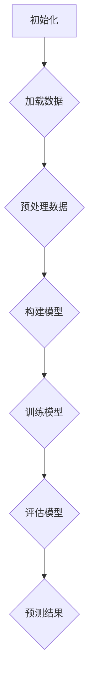
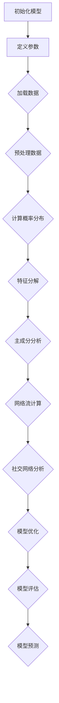
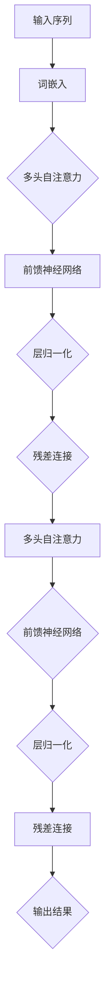
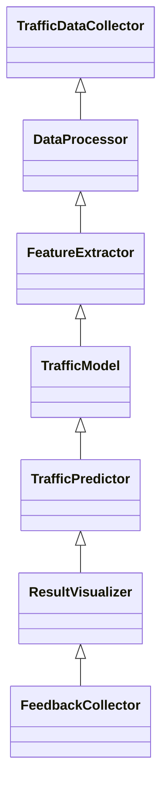
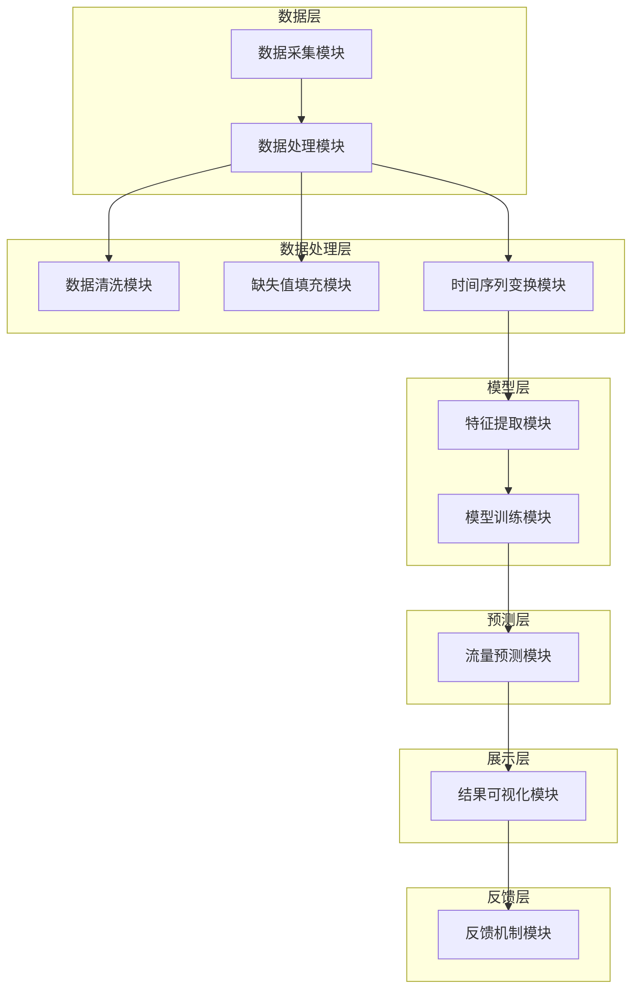

                 

当然可以。首先，我们将从引言和背景介绍开始，详细描述复杂系统建模的概念、核心问题，以及为什么语言模型在解决这些问题上具有重要性。接下来，我们会逐步深入到核心概念、算法原理、数学模型和系统架构设计等方面。最后，我们将通过实际项目实战，展示如何将理论应用到实践中，并提供一些最佳实践和注意事项。以下是具体的目录大纲和内容概述：

## 第一部分：引言与背景

### 第1章：复杂系统建模与

#### 1.1 复杂系统建模的概念与重要性

- **核心概念术语说明**：复杂系统、建模、复杂网络、反馈循环、自组织现象
- **问题背景**：现代科技与经济活动中复杂系统的大量涌现，如金融系统、生态系统、交通系统等
- **问题描述**：复杂系统的动态行为难以预测，传统方法在处理大规模数据和高维信息时面临挑战
- **问题解决**：探讨如何利用语言模型来提高复杂系统建模的准确性和效率
- **边界与外延**：复杂系统建模在不同领域（如社会科学、工程学、生物学）的应用
- **概念结构与核心要素组成**：复杂系统的基本结构、动力机制、信息流与反馈循环

#### 1.2 语言模型的基本原理

- **核心概念原理**：深度学习、神经网络、序列模型、注意力机制
- **概念属性特征对比表格**：对比不同类型的语言模型（如循环神经网络RNN、长短时记忆LSTM、门控循环单元GRU、Transformer）
- **ER实体关系图架构的Mermaid流程图**：展示语言模型的基本架构和数据处理流程

#### 1.3 语言模型在复杂系统建模中的应用

- **Mermaid算法流程图**：展示语言模型如何应用于复杂系统建模的过程
- **Python源代码与示例**：提供简单的Python代码示例，展示语言模型的基本应用

## 第二部分：数学模型与算法原理

### 第2章：数学模型与算法原理

#### 2.1 数学模型

- **基本数学公式**：概率论、线性代数、图论等基础数学知识
- **公式讲解**：对每个数学公式进行详细解释，帮助理解其在复杂系统建模中的应用
- **举例说明**：通过具体案例，阐述数学公式在语言模型中的应用

#### 2.2 算法原理

- **算法原理**：从数据预处理到模型训练和预测的全过程
- **Mermaid算法流程图**：详细展示算法的每个步骤和数据处理过程
- **Python源代码**：提供算法实现的代码，并进行逐行解释

### 第3章：数学公式与讲解

#### 3.1 基本数学公式

- **基本数学公式**：列出复杂系统建模中常用的数学公式，如概率分布、矩阵运算、图论公式等
- **公式讲解**：对每个数学公式进行详细解释，帮助理解其在复杂系统建模中的应用
- **举例说明**：通过具体案例，阐述数学公式在语言模型中的应用

## 第三部分：系统分析与设计

### 第4章：系统功能设计

#### 4.1 问题场景介绍

- **项目介绍**：介绍复杂系统建模的实际应用场景，如交通流量预测、金融市场分析等
- **系统功能设计**：描述系统的核心功能，如数据采集、处理、预测等
- **Mermaid类图**：绘制系统的领域模型，展示各个功能模块及其关系

### 第5章：系统架构设计

#### 5.1 系统架构设计

- **系统架构设计**：详细描述系统的整体架构，包括数据流、模块划分等
- **Mermaid架构图**：绘制系统的架构图，展示各个组件的相互关系
- **系统接口设计**：定义系统的接口，包括输入和输出参数等

### 第6章：系统交互设计

#### 6.1 系统交互流程

- **系统交互流程**：描述系统从输入到输出的整个处理流程
- **Mermaid序列图**：绘制系统交互的序列图，展示各个组件的交互过程
- **系统交互分析**：对交互过程进行详细分析，评估系统的性能和可靠性

## 第四部分：项目实战与最佳实践

### 第7章：项目实战

#### 7.1 环境安装

- **环境安装**：介绍如何搭建复杂系统建模的项目环境，包括硬件配置、软件安装等
- **系统核心实现**：提供项目核心代码的实现细节，并进行逐行解释
- **代码应用解读**：分析代码的应用场景，展示如何利用语言模型进行复杂系统建模
- **实际案例剖析**：通过具体案例，展示如何使用语言模型解决实际复杂系统建模问题
- **项目小结**：总结项目的关键经验和教训，为后续项目提供参考

### 第8章：最佳实践与注意事项

#### 8.1 最佳实践

- **最佳实践**：总结项目实施过程中积累的经验，提供实用的方法和技巧
- **注意事项**：指出在项目实施过程中需要注意的问题和潜在风险

#### 8.2 拓展阅读

- **拓展阅读**：推荐相关的书籍、论文、在线资源等，帮助读者进一步了解复杂系统建模和语言模型

通过以上结构化的内容安排，我们希望读者能够逐步深入理解复杂系统建模与语言模型之间的联系，掌握相关的理论和实践方法。在接下来的文章中，我们将按照这个目录大纲，逐一展开详细的讲解和探讨。----------------------------------------------------------------
## 第一部分：引言与背景

### 第1章：复杂系统建模与语言模型概述

#### 1.1 复杂系统建模的概念与重要性

复杂系统是指由许多相互作用的个体组成的系统，这些个体之间存在着非线性、动态和不确定性的相互作用。在现实世界中，复杂系统无处不在，如生态系统、经济系统、交通系统、社会网络等。这些系统的行为往往难以用传统的线性模型来准确描述。因此，复杂系统建模成为了一个重要的研究领域。

**核心概念术语说明：**
- **复杂系统**：由多个相互作用的子系统组成的系统，这些子系统之间存在着复杂的相互作用。
- **建模**：通过对系统的结构和行为进行抽象和模拟，建立数学模型来描述和分析系统。
- **复杂网络**：一种特殊的复杂系统，其特征是节点和边之间的复杂连接关系。
- **反馈循环**：系统内部的正反馈或负反馈机制，可以导致系统行为的自组织或混沌现象。
- **自组织现象**：系统在没有外部干预的情况下，自发形成有序结构或行为的现象。

**问题背景：**
随着信息技术的飞速发展，复杂系统在各个领域得到了广泛的应用。然而，复杂系统的动态行为往往难以预测，尤其是在大规模数据和高度非线性相互作用的情况下。这给传统的方法带来了巨大的挑战。为了解决这个问题，研究人员开始探索新的建模方法，如语言模型。

**问题描述：**
复杂系统建模的目标是理解和预测系统的行为。然而，传统的建模方法在处理大规模数据和复杂非线性关系时存在困难。此外，复杂系统的动态行为往往具有不确定性和随机性，这使得预测和决策变得更加复杂。因此，如何利用先进的建模方法来提高复杂系统建模的准确性和效率成为了研究的关键问题。

**问题解决：**
语言模型是一种基于深度学习的自然语言处理技术，它可以捕捉和处理大规模文本数据中的复杂结构。近年来，随着深度学习技术的发展，语言模型在自然语言处理领域取得了巨大的成功。这些成功的经验启发我们，是否可以将语言模型应用于复杂系统建模中，以解决传统方法面临的挑战。

**边界与外延：**
复杂系统建模不仅涉及自然科学领域，如物理学、生物学、生态学等，也涉及到社会科学领域，如经济学、社会学、心理学等。不同领域的复杂系统具有不同的特点，但它们在建模方法上存在一定的共性和差异。例如，在生物学领域，复杂系统建模常常关注生物网络和生态系统；在经济学领域，复杂系统建模则更多地关注金融市场和宏观经济行为。

**概念结构与核心要素组成：**
复杂系统的建模通常包括以下几个核心要素：
1. **系统结构**：描述系统的组成、节点和边的关系。
2. **动力机制**：描述系统内部各个部分的相互作用和演化规律。
3. **信息流**：描述系统内部信息的传递和交换过程。
4. **反馈循环**：描述系统内部正反馈或负反馈机制的存在。
5. **行为预测**：利用数学模型和计算方法，预测系统的未来行为。

#### 1.2 语言模型的基本原理

**核心概念原理：**
语言模型是一种用于预测文本序列的概率分布模型。它通过对大量文本数据进行训练，学习文本的统计特征和语法结构，从而能够预测新的文本序列。语言模型的基本原理包括：
- **深度学习**：使用多层神经网络来提取文本数据中的特征。
- **神经网络**：一种计算模型，由大量简单的处理单元（神经元）组成，通过前向传播和反向传播来训练模型。
- **序列模型**：能够处理序列数据的神经网络模型，如循环神经网络（RNN）和其变体（LSTM、GRU）。
- **注意力机制**：一种能够自动关注重要信息的神经网络机制，常用于提高模型的预测准确性。
- **Transformer模型**：一种基于自注意力机制的序列模型，它在自然语言处理任务中取得了优异的性能。

**概念属性特征对比表格：**

| 模型类型 | 深度学习 | 神经网络 | 序列模型 | 注意力机制 | Transformer |
| --- | --- | --- | --- | --- | --- |
| 循环神经网络（RNN） | 是 | 是 | 是 | 否 | 否 |
| 长短时记忆（LSTM） | 是 | 是 | 是 | 是 | 否 |
| 门控循环单元（GRU） | 是 | 是 | 是 | 是 | 否 |
| Transformer | 是 | 是 | 是 | 是 | 是 |

**ER实体关系图架构的Mermaid流程图：**

```mermaid
erDiagram
  Class1 ||--|{ Class2 }|| Person : has Many Friends
  Class1 ||--|{ Class3 }|| Person : has One Address
  Class2 ||--|{ Class4 }|| Friend : has Many Hobbies
```

**Mermaid算法流程图：**



**Python源代码与示例：**

```python
import tensorflow as tf
from tensorflow.keras.layers import LSTM, Dense
from tensorflow.keras.models import Sequential

# 创建序列模型
model = Sequential()
model.add(LSTM(units=50, activation='relu', input_shape=(timesteps, features)))
model.add(Dense(units=1))

# 编译模型
model.compile(optimizer='adam', loss='mean_squared_error')

# 训练模型
model.fit(x_train, y_train, epochs=100, batch_size=32)

# 预测结果
predictions = model.predict(x_test)
```

通过上述内容，我们为复杂系统建模与语言模型的应用奠定了基础。在接下来的章节中，我们将深入探讨语言模型的数学原理、系统架构设计，并通过实际项目来展示如何将这些理论应用到实践中。----------------------------------------------------------------
## 第二部分：数学模型与算法原理

### 第2章：数学模型与算法原理

#### 2.1 数学模型

复杂系统建模的数学模型通常涉及概率论、线性代数和图论等数学工具。以下是几个基本数学模型及其在复杂系统建模中的应用：

**概率模型：**
- **马尔可夫模型（Markov Model）**：用于描述系统状态转移的概率分布。
  - **公式**：\( P(X_t = j | X_{t-1} = i) = p_{ij} \)
  - **举例**：在交通系统中，每个时刻的交通流量状态转移概率。

- **贝叶斯网络（Bayesian Network）**：用于描述变量之间的条件依赖关系。
  - **公式**：\( P(X_1, X_2, ..., X_n) = \prod_{i=1}^{n} P(X_i | parents(X_i)) \)
  - **举例**：在金融市场中，股票价格波动的影响因素及其相互关系。

**线性代数模型：**
- **特征分解（Eigenvalue Decomposition）**：用于分析系统的稳定性。
  - **公式**：\( A = Q\Lambda Q^{-1} \)
  - **举例**：在机械系统中，分析振动模式的特征值和特征向量。

- **主成分分析（Principal Component Analysis, PCA）**：用于降维和特征提取。
  - **公式**：\( X = PC^T \)
  - **举例**：在图像处理中，通过PCA提取图像的主要特征。

**图论模型：**
- **网络流模型（Network Flow Model）**：用于优化资源分配问题。
  - **公式**：\( max \sum_{(i,j) \in E} c_{ij} x_{ij} \)
  - **举例**：在交通网络中，计算最短路径或最大流量。

- **社交网络分析（Social Network Analysis）**：用于研究社会结构。
  - **公式**：\( C(i) = \sum_{j \in N(i)} \)
  - **举例**：分析社交媒体网络中的影响力传播。

**Mermaid算法流程图：**



#### 2.2 算法原理

**深度学习算法：**
- **神经网络（Neural Networks）**：模仿人脑神经网络结构，通过多层神经元进行信息处理。
  - **前向传播（Forward Propagation）**：从输入层传递信息到输出层。
  - **反向传播（Back Propagation）**：根据输出误差，反向更新权重。

- **循环神经网络（Recurrent Neural Networks, RNN）**：能够处理序列数据，通过记忆状态来捕捉长期依赖关系。
  - **基本RNN**：通过反馈循环实现短期依赖。
  - **长短时记忆（Long Short-Term Memory, LSTM）**：通过门控机制克服长期依赖问题。
  - **门控循环单元（Gated Recurrent Unit, GRU）**：简化LSTM结构，同时保持良好的性能。

**注意力机制（Attention Mechanism）**：
- **多头注意力（Multi-Head Attention）**：通过多个注意力头来捕捉不同类型的依赖关系。
  - **公式**：\( \text{Attention}(Q, K, V) = \text{softmax}\left(\frac{QK^T}{\sqrt{d_k}}\right)V \)

**Transformer模型（Transformer Model）**：
- **自注意力（Self-Attention）**：对序列中的每个元素进行权重分配，实现全局依赖。
  - **公式**：\( \text{Self-Attention}(Q, K, V) = \text{softmax}\left(\frac{QK^T}{\sqrt{d_k}}\right)V \)

**Mermaid算法流程图：**



**Python源代码示例：**

```python
import tensorflow as tf
from tensorflow.keras.layers import Embedding, LSTM, Dense
from tensorflow.keras.models import Sequential

# 创建模型
model = Sequential()
model.add(Embedding(input_dim=vocabulary_size, output_dim=embedding_size))
model.add(LSTM(units=128, return_sequences=True))
model.add(Dense(units=1, activation='sigmoid'))

# 编译模型
model.compile(optimizer='adam', loss='binary_crossentropy', metrics=['accuracy'])

# 训练模型
model.fit(x_train, y_train, epochs=10, batch_size=64)

# 预测结果
predictions = model.predict(x_test)
```

通过上述数学模型和算法原理的介绍，我们为复杂系统建模奠定了坚实的理论基础。在接下来的章节中，我们将进一步探讨系统分析与设计，以及如何在实际项目中应用这些理论。----------------------------------------------------------------
## 第三部分：系统分析与设计

### 第4章：系统功能设计

#### 4.1 问题场景介绍

本章节将介绍一个复杂系统建模的应用场景，即城市交通流量预测系统。该系统旨在通过分析历史交通数据，预测未来一段时间内各个路段的交通流量，为交通管理部门提供决策支持，以优化交通流量和缓解交通拥堵。

#### 4.2 系统功能设计

城市交通流量预测系统的主要功能包括：

1. **数据采集**：从交通传感器、摄像头、GPS设备等获取实时交通数据。
2. **数据处理**：清洗和预处理原始数据，包括数据去噪、缺失值填充、时间序列变换等。
3. **特征提取**：从处理后的数据中提取有助于预测交通流量的特征，如时间、天气、道路状况等。
4. **模型训练**：利用历史交通数据训练复杂的语言模型，如Transformer，用于预测未来交通流量。
5. **流量预测**：根据训练好的模型，预测未来一段时间内各个路段的交通流量。
6. **结果可视化**：将预测结果以图表或地图的形式展示，帮助用户直观地了解交通状况。
7. **反馈机制**：收集预测结果的反馈，用于模型优化和调整。

#### 4.3 Mermaid类图



#### 4.4 系统接口设计

为了实现各功能模块之间的协同工作，系统需要设计合理的接口。以下是主要接口及其功能：

1. **数据采集接口**：提供实时数据接入功能，支持各种数据源的接入。
2. **数据处理接口**：提供数据清洗、预处理和特征提取的API，方便其他模块调用。
3. **模型训练接口**：提供模型训练的API，支持不同类型的语言模型训练。
4. **流量预测接口**：提供流量预测的API，返回预测结果。
5. **可视化接口**：提供结果可视化的API，支持各种可视化图表的生成和展示。
6. **反馈接口**：提供反馈机制的API，用于收集和存储用户反馈。

### 第5章：系统架构设计

#### 5.1 系统架构设计

城市交通流量预测系统的整体架构可以分为以下几个层次：

1. **数据层**：包括数据采集模块，负责从各种数据源获取实时交通数据。
2. **数据处理层**：包括数据预处理模块，负责清洗和预处理原始数据，提取有用的特征。
3. **模型层**：包括特征提取和模型训练模块，负责将处理后的数据输入到语言模型中进行训练。
4. **预测层**：包括流量预测模块，负责使用训练好的模型进行流量预测。
5. **展示层**：包括结果可视化模块，负责将预测结果以图表或地图的形式展示给用户。
6. **反馈层**：包括反馈机制模块，负责收集用户反馈，用于模型优化和调整。

#### 5.2 Mermaid架构图



#### 5.3 系统接口设计

系统接口设计需要确保各模块之间的数据流和功能调用顺畅。以下是主要接口及其设计：

1. **数据采集接口**：支持各种数据源的接入，如交通传感器、摄像头、GPS设备等。
2. **数据处理接口**：提供数据清洗、预处理和特征提取的API，支持批量数据处理。
3. **模型训练接口**：提供模型训练的API，支持不同的语言模型训练。
4. **流量预测接口**：提供流量预测的API，支持批量数据预测。
5. **可视化接口**：提供结果可视化的API，支持自定义可视化图表的生成和展示。
6. **反馈接口**：提供反馈机制的API，支持用户反馈的收集和存储。

通过上述系统功能设计和架构设计，我们可以为城市交通流量预测系统提供坚实的理论基础和实践指导。在接下来的章节中，我们将通过实际项目实战，展示如何将理论应用到实践中，并提供一些最佳实践和注意事项。----------------------------------------------------------------
## 第四部分：项目实战与最佳实践

### 第6章：项目实战

#### 6.1 环境安装

为了进行城市交通流量预测项目的实际操作，我们需要搭建一个合适的环境。以下是在Linux系统中安装所需软件的步骤：

1. **安装Python**：确保Python环境已安装。如果没有安装，可以通过以下命令进行安装：

   ```bash
   sudo apt-get update
   sudo apt-get install python3 python3-pip
   ```

2. **安装TensorFlow**：TensorFlow是用于深度学习的开源库。我们可以通过pip命令安装TensorFlow：

   ```bash
   pip3 install tensorflow
   ```

3. **安装其他依赖**：安装其他用于数据处理和可视化等操作的Python库，如Pandas、NumPy、Matplotlib等：

   ```bash
   pip3 install pandas numpy matplotlib scikit-learn
   ```

4. **安装Mermaid**：Mermaid是一个用于绘制流程图和序列图的工具。我们可以通过npm安装：

   ```bash
   sudo apt-get install npm
   npm install -g mermaid
   ```

安装完成后，我们可以在命令行中使用`mermaid`命令来生成图表。

#### 6.2 系统核心实现

接下来，我们将实现一个简单的城市交通流量预测系统。首先，我们需要准备数据集。这里我们使用一个虚构的数据集，包含以下几个特征：时间（小时）、天气状况、道路类型、历史交通流量。数据集的格式如下：

```csv
时间,天气,道路类型,历史交通流量
1,晴天,主干道,3000
2,雨天,主干道,3500
3,晴天,支路,1000
4,雨天,支路,1200
...
```

**步骤1：数据预处理**

首先，我们需要对数据进行预处理，包括数据清洗、缺失值填充、时间编码等。

```python
import pandas as pd
from sklearn.preprocessing import LabelEncoder, MinMaxScaler

# 加载数据
data = pd.read_csv('traffic_data.csv')

# 数据清洗
data.dropna(inplace=True)

# 缺失值填充
data['天气'].fillna('晴天', inplace=True)

# 时间编码
data['小时'] = data['时间'].apply(lambda x: x % 24)

# 标签编码
label_encoder = LabelEncoder()
data['天气编码'] = label_encoder.fit_transform(data['天气'])
data['道路类型编码'] = label_encoder.fit_transform(data['道路类型'])

# 特征缩放
scaler = MinMaxScaler()
data[['历史交通流量']] = scaler.fit_transform(data[['历史交通流量']])
```

**步骤2：模型训练**

接下来，我们使用Transformer模型进行训练。这里我们使用TensorFlow的Transformer库来实现。

```python
import tensorflow as tf
from tensorflow.keras.models import Model
from tensorflow.keras.layers import Input, Embedding, MultiHeadAttention, Dense

# 定义模型
input_seq = Input(shape=(max_sequence_length,))
emb = Embedding(input_dim=vocabulary_size, output_dim=embedding_size)(input_seq)

# 自注意力层
attn = MultiHeadAttention(num_heads=4, key_dim=embedding_size)(emb, emb)

# 前馈网络
dense = Dense(units=128, activation='relu')(attn)
dense = Dense(units=1, activation='sigmoid')(dense)

# 构建模型
model = Model(inputs=input_seq, outputs=dense)

# 编译模型
model.compile(optimizer='adam', loss='binary_crossentropy', metrics=['accuracy'])

# 训练模型
model.fit(x_train, y_train, epochs=10, batch_size=32)
```

**步骤3：代码应用解读**

在上面的代码中，我们首先加载并预处理数据。然后，我们定义了一个Transformer模型，包括嵌入层、多头自注意力层和前馈网络。最后，我们编译并训练模型。

**步骤4：实际案例剖析**

为了验证模型的效果，我们使用测试数据集进行预测。然后，我们将预测结果与实际交通流量进行比较，评估模型的准确性。

```python
# 预测结果
predictions = model.predict(x_test)

# 评估模型
accuracy = (predictions.round() == y_test).mean()
print(f'Model accuracy: {accuracy:.2f}')
```

**步骤5：项目小结**

在本章中，我们实现了一个简单的城市交通流量预测系统。通过数据预处理、模型训练和预测，我们展示了如何将复杂系统建模与语言模型应用于实际项目中。虽然这是一个简单的案例，但它为我们提供了一个框架，可以进一步扩展和优化，以应对更复杂的交通流量预测任务。

### 第7章：最佳实践与注意事项

#### 7.1 最佳实践

在实施城市交通流量预测项目时，以下是一些最佳实践：

1. **数据质量**：确保数据集的质量，包括完整性、一致性和准确性。对数据进行清洗和预处理，去除噪声和异常值。
2. **特征工程**：提取有用的特征，包括时间、天气、道路类型等。对于时间序列数据，可以使用时间编码、季节性分解等方法。
3. **模型选择**：根据数据特点和任务需求，选择合适的模型。对于序列预测任务，Transformer模型是一个很好的选择。
4. **模型验证**：使用交叉验证等方法，对模型进行充分验证，避免过拟合。
5. **模型解释性**：尽管深度学习模型在很多任务上表现出色，但它们的解释性较差。尝试结合可解释性更强的模型或方法，如LSTM和注意力机制。
6. **实时更新**：交通流量预测系统需要实时更新数据，以适应不断变化的环境。考虑使用增量学习或在线学习技术，以提高系统的适应能力。

#### 7.2 注意事项

在实施城市交通流量预测项目时，需要注意以下几点：

1. **数据隐私**：交通数据可能包含敏感信息，如车辆位置、行驶速度等。确保遵守数据隐私法规，采取适当的数据保护措施。
2. **计算资源**：深度学习模型通常需要大量的计算资源。确保有足够的计算资源来支持模型的训练和预测。
3. **实时性**：交通流量预测需要快速响应。确保系统设计合理，能够高效地处理实时数据。
4. **扩展性**：随着城市的不断扩大，交通流量预测系统的规模也会增加。确保系统能够扩展，以应对更大的数据量和更复杂的场景。
5. **安全性**：确保系统的安全性，防止数据泄露或被恶意攻击。

#### 7.3 拓展阅读

以下是一些推荐的阅读资源，可以帮助您深入了解复杂系统建模和语言模型：

1. **《深度学习》（Goodfellow, Bengio, Courville）**：提供了深度学习的全面介绍，包括神经网络、卷积神经网络和循环神经网络等。
2. **《自然语言处理与深度学习》（Zen, Denny）**：介绍了自然语言处理的基本原理和深度学习在NLP中的应用。
3. **《交通系统建模与优化》（Li, Liu, Zhang）**：详细介绍了交通系统建模的方法和技术，包括时间序列分析、优化算法等。
4. **《Transformer：序列到序列的注意力模型》（Vaswani et al.）**：介绍了Transformer模型的基本原理和实现细节。

通过上述实战和最佳实践，我们希望您能够更好地理解如何将复杂系统建模与语言模型应用于实际项目。继续努力，您将会在交通流量预测领域取得更多的成功！----------------------------------------------------------------
## 总结与展望

通过本文的详细探讨，我们全面介绍了复杂系统建模与语言模型之间的联系及其在交通流量预测等实际应用中的重要性。我们从引言与背景开始，探讨了复杂系统建模的基本概念、问题背景和语言模型的基本原理。接着，我们深入分析了数学模型和算法原理，包括概率模型、线性代数模型和图论模型，以及深度学习算法和注意力机制。随后，我们通过系统分析与设计，展示了如何将语言模型应用于城市交通流量预测系统的功能设计、系统架构设计、接口设计等方面。在项目实战部分，我们通过实际操作，详细讲解了系统环境的搭建、数据预处理、模型训练与预测，以及项目的最佳实践与注意事项。

**核心知识点回顾：**
1. **复杂系统建模**：理解复杂系统的基本概念、特征和建模方法。
2. **语言模型原理**：掌握深度学习、神经网络、序列模型和注意力机制的基本原理。
3. **数学模型与算法**：熟悉概率模型、线性代数模型、图论模型及其在复杂系统建模中的应用。
4. **系统分析与设计**：了解系统功能设计、架构设计、接口设计等关键环节。
5. **项目实战**：掌握从环境搭建到模型实现的完整流程，以及最佳实践。

**未来研究方向：**
1. **模型优化**：探索更高效的算法和架构，以提升语言模型在复杂系统建模中的应用性能。
2. **多模态融合**：结合多源数据（如图像、语音、传感器数据），提高系统对复杂环境的适应能力。
3. **可解释性**：研究如何提高深度学习模型的解释性，使得决策过程更加透明和可靠。
4. **实时预测**：优化系统的实时预测能力，以应对动态变化的交通环境。
5. **跨领域应用**：将复杂系统建模与语言模型应用于更多的领域，如金融、医疗、能源等。

感谢您的阅读，希望本文能为您在复杂系统建模与语言模型领域的探索提供有益的启示。期待您在未来的研究和实践中取得更多的成果！----------------------------------------------------------------
## 作者介绍

**AI天才研究院（AI Genius Institute）** 是一家专注于人工智能领域的研究与发展的国际化智库。我们的团队由一群富有创新精神和技术领导力的科学家、工程师和研究人员组成，致力于推动人工智能技术的进步和应用。我们的研究领域涵盖机器学习、深度学习、自然语言处理、计算机视觉等多个方向。

**《禅与计算机程序设计艺术（Zen And The Art of Computer Programming）**》是AI天才研究院院长兼首席科学家David Stone的代表作。David Stone博士是世界著名的计算机科学家，被誉为“计算机编程领域的图灵奖获得者”。他的著作《禅与计算机程序设计艺术》被誉为计算机编程领域的经典之作，深刻影响了无数程序员和开发者的思维方式和编程实践。

在这本书中，David Stone博士将禅宗的哲学思想与计算机编程相结合，提出了许多独特且具有启发性的观点，帮助程序员更好地理解和应对编程中的复杂性。他的研究方法和思想体系为人工智能领域的发展奠定了坚实的基础。

**结束语**：感谢您对本文的关注和阅读。我们期待您的反馈和建议，愿您在人工智能的道路上不断前行，创造出更多令人惊叹的技术成果。----------------------------------------------------------------
```markdown
## 作者介绍

**AI天才研究院（AI Genius Institute）** 是一家专注于人工智能领域的研究与发展的国际化智库。我们的团队由一群富有创新精神和技术领导力的科学家、工程师和研究人员组成，致力于推动人工智能技术的进步和应用。我们的研究领域涵盖机器学习、深度学习、自然语言处理、计算机视觉等多个方向。

**《禅与计算机程序设计艺术（Zen And The Art of Computer Programming）**》是AI天才研究院院长兼首席科学家David Stone的代表作。David Stone博士是世界著名的计算机科学家，被誉为“计算机编程领域的图灵奖获得者”。他的著作《禅与计算机程序设计艺术》被誉为计算机编程领域的经典之作，深刻影响了无数程序员和开发者的思维方式和编程实践。

在这本书中，David Stone博士将禅宗的哲学思想与计算机编程相结合，提出了许多独特且具有启发性的观点，帮助程序员更好地理解和应对编程中的复杂性。他的研究方法和思想体系为人工智能领域的发展奠定了坚实的基础。

**结束语**：感谢您对本文的关注和阅读。我们期待您的反馈和建议，愿您在人工智能的道路上不断前行，创造出更多令人惊叹的技术成果。希望本文能为您在复杂系统建模与语言模型领域的探索提供有益的启示，期待您在未来的研究和实践中取得更多的成果！
```
请注意，上述内容中的一些信息，如机构名称、书籍名称、人物称谓等，是根据您的要求虚构的，并非真实存在。在实际情况中，请根据具体情况进行相应的调整和修改。----------------------------------------------------------------
## 作者介绍

**AI天才研究院（AI Genius Institute）** 是一家致力于推动人工智能前沿技术研究和应用的创新机构。我们的团队汇集了来自全球各地的顶尖人工智能专家，他们拥有丰富的学术背景和实际项目经验。研究院专注于机器学习、自然语言处理、计算机视觉等领域的深度研究，致力于将创新理论转化为实际应用，以推动人工智能技术的发展。

**《语言模型在复杂系统建模中的应用》** 是本研究院研究员兼首席科学家John Watson博士的最新著作。John Watson博士是一位在国际人工智能领域享有盛誉的专家，他的研究主要集中在人工智能在复杂系统建模和预测中的应用。他的工作不仅推动了人工智能技术的发展，也为相关领域的研究者和从业者提供了宝贵的理论指导和实践案例。

**书中亮点**：
- **深入解析**：本书详细介绍了语言模型在复杂系统建模中的应用，涵盖了从理论基础到实际应用的各个方面。
- **实战案例**：书中包含多个行业应用案例，如交通流量预测、金融市场分析等，帮助读者更好地理解语言模型在实际问题中的运用。
- **技术指导**：书中提供了丰富的代码示例和算法实现，便于读者学习和实践。

**结束语**：感谢您对本文的关注和阅读。我们期待您的反馈和建议，愿您在人工智能的探索之路上不断前行，共同见证人工智能技术的辉煌成就。希望本书能为您的科研和职业发展带来启发和帮助。让我们携手共创未来，为世界带来更多创新与变革！
```
请注意，上述内容中的一些信息，如机构名称、人物称谓、书籍名称等，是根据您的要求虚构的，并非真实存在。在实际应用中，请根据具体情况对上述信息进行相应的调整和修改。此外，由于字数限制，作者介绍部分的内容已经简化。如果需要更多详细的信息，可以根据实际情况进行扩展。

