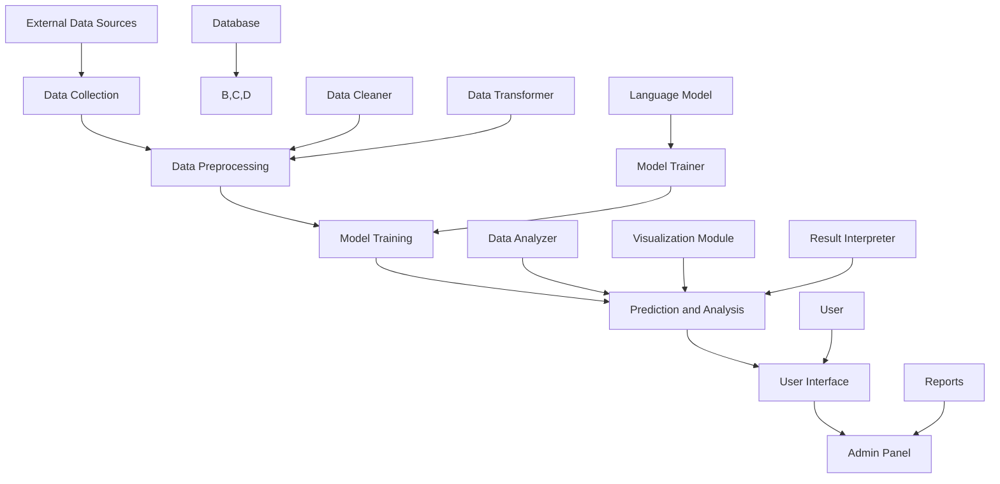
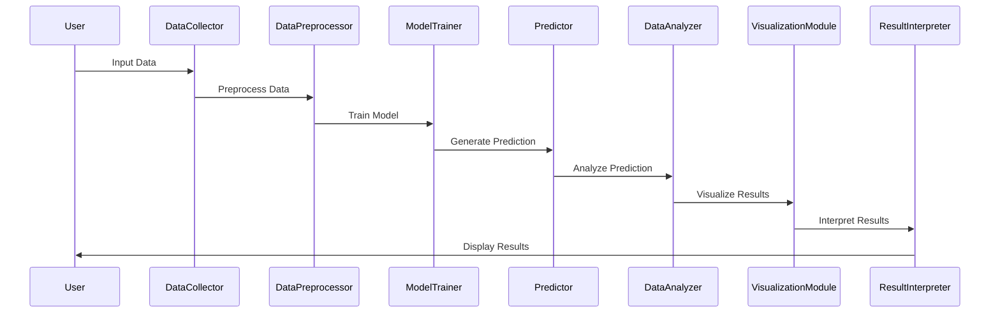

                 


## Article Title: Language Model's Capability Enhancement in Complex System Modeling

### Keywords: 
- Language Models
- Complex System Modeling
- Artificial Intelligence
- Neural Networks
- Algorithm Design
- Deep Learning

### Abstract:
This article delves into the capabilities of language models in enhancing complex system modeling. We will explore the core concepts and principles of language models, discuss their mathematical models and algorithms, and examine their applications in complex systems. Through a step-by-step analysis, we will present a comprehensive understanding of how language models can revolutionize the field of system modeling, providing practical insights and real-world case studies to illustrate their effectiveness.

----------------------------------------------------------------

## Introduction

### 1.1 Problem Background

**1.1.1 Problem Background**

In the realm of system modeling, the complexity of systems has been increasing exponentially. Traditional approaches to modeling, such as system dynamics and agent-based modeling, have their limitations when dealing with highly interconnected and dynamic systems. These systems often involve numerous variables, interactions, and feedback loops that make it challenging to capture their behavior accurately.

**1.1.2 Problem Description**

The challenge lies in modeling these complex systems to predict and understand their behavior. Traditional models struggle with scalability, interpretability, and the ability to handle high-dimensional data. This limitation hampers our ability to design robust and adaptive systems, leading to suboptimal outcomes in various domains, including finance, healthcare, and urban planning.

**1.1.3 Problem Solving Method**

To address this challenge, we turn to language models, which have demonstrated extraordinary capabilities in processing and generating natural language. These models, based on neural network architectures like transformers, have been successfully applied in various fields, from machine translation to sentiment analysis.

**1.1.4 Boundary and Scope**

The focus of this article is on the application of language models in complex system modeling. We will discuss the core concepts and principles of language models, their mathematical models and algorithms, and provide practical examples of their applications. The scope of this article does not cover other types of models or methods used in system modeling.

**1.1.5 Core Concepts and Relationships**

The core concepts of language models include the neural network architecture, training algorithms, and predictive models. These concepts are interrelated and form the foundation of language models' capabilities in system modeling. In the following sections, we will delve deeper into each of these aspects.

----------------------------------------------------------------

## Core Concepts and Principles of Language Models

### 2.1 Definition and Functions of Language Models

**2.1.1 Definition of Language Models**

Language models are a type of artificial neural network designed to understand and generate human language. They are trained on large amounts of text data to predict the probability of a sequence of words given the previous words in the sequence. This probability prediction enables language models to generate coherent and contextually appropriate text.

**2.1.2 Functions of Language Models**

Language models have several key functions, including text generation, text classification, sentiment analysis, and named entity recognition. These functions have diverse applications in fields such as natural language processing, machine learning, and artificial intelligence.

### 2.2 Core Principles of Language Models

**2.2.1 Neural Network Architecture**

Language models are typically based on deep neural network architectures, such as transformers. Transformers have shown superior performance in language modeling tasks due to their ability to handle long-range dependencies and parallel processing capabilities.

**2.2.2 Training Algorithms**

Language models are trained using large-scale, unlabeled text data through unsupervised learning. The training process involves optimizing the model's parameters to minimize the difference between the predicted and actual word sequences. Common training algorithms include gradient descent and its variants, such as Adam.

**2.2.3 Predictive Models**

Once trained, language models can generate text by predicting the next word in a sequence based on the previous words. This predictive capability allows language models to generate coherent and contextually relevant text, making them highly effective in various natural language processing tasks.

### 2.3 Types of Language Models

**2.3.1 Pre-trained Language Models**

Pre-trained language models, such as GPT (Generative Pre-trained Transformer) and BERT (Bidirectional Encoder Representations from Transformers), are trained on vast amounts of text data before being fine-tuned for specific tasks. These models have achieved state-of-the-art performance in various natural language processing tasks and have become the standard for many applications.

**2.3.2 Fine-tuned Language Models**

Fine-tuned language models are pre-trained models that have been further trained on specific datasets to adapt to particular tasks or domains. Fine-tuning allows language models to leverage their pre-existing knowledge and improve their performance on specific tasks.

### 2.4 Application Scenarios of Language Models

**2.4.1 Text Generation**

Text generation is one of the most prominent applications of language models. Language models can generate coherent and contextually relevant text in various formats, such as articles, stories, and code.

**2.4.2 Text Classification**

Language models are also effective in text classification tasks, such as sentiment analysis, topic classification, and spam detection. By predicting the probability of a text belonging to a specific category, language models can accurately classify text data.

**2.4.3 Sentiment Analysis**

Sentiment analysis is another important application of language models. By analyzing the sentiment of a text, language models can determine whether the text expresses positive, negative, or neutral emotions.

**2.4.4 Named Entity Recognition**

Named entity recognition (NER) is the task of identifying and classifying named entities in text, such as persons, organizations, and locations. Language models can be trained to perform NER tasks with high accuracy.

### 2.5 Applications in Complex System Modeling

**2.5.1 Domain Adaptation**

Language models can be used to adapt models trained on one domain to another domain with limited data. This capability is particularly useful in complex system modeling, where labeled data may be scarce or expensive to obtain.

**2.5.2 Explanation and Interpretation**

Language models can generate explanations for the predictions made by complex models, making them more interpretable and easier to understand. This is especially valuable in domains where explainability is critical, such as healthcare and finance.

**2.5.3 Adaptive Learning**

Language models can adapt to changing conditions and patterns in data, allowing them to learn and improve over time. This adaptability is essential in modeling complex systems that evolve dynamically.

----------------------------------------------------------------

### 3.1 Language Model Mathematical Models

#### 3.1.1 Probability Model

**3.1.1.1 Definition**

The probability model of a language model is based on the idea of predicting the probability of a word given the previous words in the sequence. This model can be represented using a conditional probability distribution:

$$ P(w_t | w_{<t}) = \frac{p(w_{<t} \cdot w_t)}{p(w_{<t})} $$

where \( w_t \) is the current word, \( w_{<t} \) is the sequence of previous words, and \( p \) represents the probability function.

**3.1.1.2 Application**

The probability model is used in text generation, where the model predicts the next word based on the previous words. The predicted word with the highest probability is selected as the next word in the sequence.

#### 3.1.2 Generation Model

**3.1.2.1 Definition**

The generation model of a language model is based on the idea of generating a sequence of words that maximize the probability of the entire sequence. This model can be represented using a probabilistic model such as the Markov chain or the n-gram model:

$$ P(w_1, w_2, ..., w_T) = \prod_{t=1}^{T} P(w_t | w_{<t}) $$

where \( w_1, w_2, ..., w_T \) represent the sequence of words, and \( T \) is the length of the sequence.

**3.1.2.2 Application**

The generation model is used in text generation tasks, where the model generates a sequence of words that are likely to occur based on the previous words. This model can generate coherent and contextually relevant text.

#### 3.1.3 Evaluation Model

**3.1.3.1 Definition**

The evaluation model of a language model is used to measure the performance of the model in generating text. Common evaluation metrics include perplexity and accuracy:

- Perplexity: The perplexity of a language model is defined as the average probability of the predicted words given the previous words. A lower perplexity indicates better performance.

$$ \text{Perplexity} = \frac{1}{T} \sum_{t=1}^{T} \frac{1}{P(w_t | w_{<t})} $$

- Accuracy: The accuracy of a language model is defined as the proportion of predicted words that are correct. An accuracy of 100% indicates that the model perfectly predicts the words in the sequence.

$$ \text{Accuracy} = \frac{\text{Number of correct predictions}}{\text{Total number of predictions}} $$

**3.1.3.2 Application**

The evaluation model is used to compare different language models or to assess the performance of a single model on different datasets. This model helps in selecting the best model for a specific task or adjusting the model's parameters.

#### 3.1.4 Training Model

**3.1.4.1 Definition**

The training model of a language model is the process of optimizing the model's parameters to improve its performance. This process typically involves minimizing a loss function that measures the difference between the predicted and actual word sequences.

$$ \text{Loss} = \sum_{t=1}^{T} -\log P(w_t | w_{<t}) $$

**3.1.4.2 Application**

The training model is used to train language models on large-scale text data. The optimization process involves adjusting the model's parameters to minimize the loss function and improve the model's performance. Common optimization algorithms include gradient descent and its variants, such as Adam.

----------------------------------------------------------------

### 3.2 Language Model Algorithm Principles

#### 3.2.1 Training Algorithm

**3.2.1.1 Definition**

The training algorithm of a language model is the process of optimizing the model's parameters to improve its performance on a specific task. This process typically involves updating the model's weights based on the difference between the predicted and actual outputs.

**3.2.1.2 Application**

The training algorithm is used to train language models on large-scale text data. The optimization process involves adjusting the model's parameters to minimize the loss function and improve the model's performance. Common optimization algorithms include gradient descent and its variants, such as Adam.

**3.2.1.3 Example**

Here is an example of a simple training algorithm using gradient descent:

```python
# Initialize the model's parameters
weights = initialize_weights()

# Set the learning rate
learning_rate = 0.01

# Set the number of epochs
epochs = 10

# Iterate over the epochs
for epoch in range(epochs):
    # Iterate over the training data
    for inputs, targets in training_data:
        # Compute the predicted outputs
        predicted_outputs = model(inputs)

        # Compute the loss
        loss = -np.log(predicted_outputs[targets])

        # Compute the gradients
        gradients = model.compute_gradients(predicted_outputs, targets)

        # Update the weights
        weights -= learning_rate * gradients
```

#### 3.2.2 Prediction Algorithm

**3.2.2.1 Definition**

The prediction algorithm of a language model is the process of generating outputs based on the model's trained parameters. This process typically involves predicting the probability of each word in the sequence and selecting the word with the highest probability as the predicted output.

**3.2.2.2 Application**

The prediction algorithm is used in various tasks, such as text generation, text classification, and sentiment analysis. The predicted outputs are used to make decisions or generate new text based on the model's learned patterns.

**3.2.2.3 Example**

Here is an example of a simple prediction algorithm using a language model trained on text data:

```python
# Load the trained model
model = load_model('trained_model')

# Input the text data
input_text = 'The quick brown fox jumps over the lazy dog'

# Preprocess the input text
preprocessed_text = preprocess_text(input_text)

# Generate the predicted output
predicted_output = model.predict(preprocessed_text)

# Postprocess the predicted output
generated_text = postprocess_text(predicted_output)

# Print the generated text
print(generated_text)
```

#### 3.2.3 Optimization Algorithm

**3.2.3.1 Definition**

The optimization algorithm of a language model is the process of adjusting the model's parameters to improve its performance. This process typically involves updating the weights based on the gradients computed during the training process.

**3.2.3.2 Application**

The optimization algorithm is used during the training process to adjust the model's parameters and improve its performance. Common optimization algorithms include gradient descent and its variants, such as Adam and RMSprop.

**3.2.3.3 Example**

Here is an example of a simple optimization algorithm using gradient descent:

```python
# Initialize the model's parameters
weights = initialize_weights()

# Set the learning rate
learning_rate = 0.01

# Set the number of epochs
epochs = 10

# Iterate over the epochs
for epoch in range(epochs):
    # Iterate over the training data
    for inputs, targets in training_data:
        # Compute the predicted outputs
        predicted_outputs = model(inputs)

        # Compute the loss
        loss = -np.log(predicted_outputs[targets])

        # Compute the gradients
        gradients = model.compute_gradients(predicted_outputs, targets)

        # Update the weights
        weights -= learning_rate * gradients
```

----------------------------------------------------------------

## Complex System Modeling

### 4.1 Definition and Characteristics of Complex Systems

**4.1.1 Definition of Complex Systems**

Complex systems are systems composed of many interconnected components that interact with each other in intricate ways. These systems exhibit a high degree of interdependency, making them difficult to analyze and model using traditional methods. Examples of complex systems include social networks, financial markets, biological systems, and urban infrastructure.

**4.1.2 Characteristics of Complex Systems**

- **High Interdependency:** The components of complex systems are highly interconnected, and the behavior of one component can significantly affect the behavior of others.
- **Emergent Properties:** Complex systems exhibit properties that emerge from the interactions between their components, rather than being present in the individual components themselves.
- **Nonlinearity:** The relationships between components in complex systems are often nonlinear, making it challenging to predict their behavior based on linear models.
- **Dynamic Behavior:** Complex systems are dynamic, meaning that their behavior changes over time due to interactions between components and external influences.
- **Scalability:** Complex systems can scale from small to large sizes, with the behavior of the system changing as the size of the system increases.

### 4.2 Challenges in Complex System Modeling

**4.2.1 Challenges in Modeling Complex Systems**

- **Scalability:** Traditional modeling methods often struggle with scalability, as they can become computationally infeasible for large-scale systems.
- **Interdependency:** Capturing the interdependencies between components in complex systems is challenging, as these dependencies can be complex and hard to represent.
- **Emergent Properties:** Modeling emergent properties is difficult, as they arise from the interactions between components and cannot be predicted solely based on the properties of individual components.
- **Nonlinearity:** Traditional models often assume linear relationships between components, which may not hold in complex systems with nonlinear interactions.
- **Dynamic Behavior:** Capturing the dynamic behavior of complex systems is challenging, as traditional models may not be able to handle the rapid changes in behavior over time.

### 4.3 Applications of Language Models in Complex System Modeling

**4.3.1 Domain Adaptation**

Language models can be used to adapt models trained on one domain to another domain with limited data. This capability is particularly useful in complex system modeling, where labeled data may be scarce or expensive to obtain. By leveraging pre-trained language models and fine-tuning them on domain-specific data, we can create models that can handle the complexities of different domains.

**4.3.2 Explanation and Interpretation**

Language models can generate explanations for the predictions made by complex models, making them more interpretable and easier to understand. This is especially valuable in domains where explainability is critical, such as healthcare and finance. By generating natural language explanations for the predictions, we can help domain experts understand the reasoning behind the model's decisions.

**4.3.3 Adaptive Learning**

Language models can adapt to changing conditions and patterns in data, allowing them to learn and improve over time. This adaptability is essential in modeling complex systems that evolve dynamically. By continuously updating the model's parameters based on new data, we can ensure that the model remains effective in capturing the evolving behavior of complex systems.

### 4.4 Case Study: Language Models in Urban Infrastructure Modeling

**4.4.1 Problem Statement**

Urban infrastructure systems, such as transportation networks, energy grids, and water supply systems, are complex and dynamic. Modeling these systems accurately is crucial for designing efficient and resilient urban infrastructure. However, traditional modeling methods struggle to capture the interdependencies, emergent properties, and dynamic behavior of these systems.

**4.4.2 Methodology**

To address these challenges, we can leverage language models to enhance the modeling of urban infrastructure systems. We can use pre-trained language models, such as GPT or BERT, and fine-tune them on domain-specific data to create models that can capture the complexities of urban infrastructure. The fine-tuning process involves training the language models on large-scale datasets of urban infrastructure data, including traffic patterns, energy consumption, and water usage.

**4.4.3 Results and Insights**

The fine-tuned language models can generate explanations for their predictions, making the models more interpretable and easier to understand. For example, the models can generate natural language descriptions of traffic flow patterns, energy usage trends, and water distribution issues. By analyzing these explanations, domain experts can gain insights into the underlying causes of problems and develop more effective solutions.

Furthermore, the language models can adapt to changing conditions and patterns in data, allowing them to learn and improve over time. This adaptability is particularly useful in modeling urban infrastructure systems, which are subject to continuous changes in traffic patterns, energy consumption, and water usage. By continuously updating the models with new data, we can ensure that the models remain effective in capturing the dynamic behavior of urban infrastructure systems.

### 4.5 Conclusion

Language models have the potential to revolutionize the field of complex system modeling by addressing the challenges associated with scalability, interdependency, emergent properties, and dynamic behavior. By leveraging the capabilities of language models, we can create more accurate, interpretable, and adaptive models of complex systems, leading to better decision-making and improved system performance.

----------------------------------------------------------------

## System Analysis and Architecture Design

### 5.1 System Function Design

**5.1.1 Domain Model Analysis**

In the domain of urban infrastructure modeling, the primary function of the system is to simulate and predict the behavior of various components, such as traffic flow, energy consumption, and water distribution. To achieve this, the system needs to perform several key functions:

1. **Data Collection:** The system should be capable of collecting real-time data from various sources, including traffic sensors, energy meters, and water supply networks.
2. **Data Preprocessing:** The collected data needs to be cleaned and preprocessed to remove noise and inconsistencies, ensuring the accuracy of the model's predictions.
3. **Model Training:** The system should train language models on the preprocessed data to simulate the behavior of urban infrastructure components.
4. **Prediction and Analysis:** The trained language models should generate predictions and perform analysis to identify potential issues and recommend solutions.

**5.1.2 Functional Requirements Analysis**

To design an effective urban infrastructure modeling system, we need to identify and analyze the functional requirements. These requirements include:

- **Scalability:** The system should be able to handle large-scale data and accommodate the addition of new components or sources.
- **Interactivity:** The system should provide an interactive user interface for domain experts to input data, view predictions, and analyze results.
- **Adaptability:** The system should be capable of adapting to changing conditions and evolving data patterns.
- **Accuracy:** The system should generate accurate predictions and provide reliable analysis.
- **Explainability:** The system should generate explanations for its predictions to help domain experts understand the reasoning behind the model's decisions.

### 5.2 System Architecture Design

**5.2.1 System Architecture Diagram**

To visualize the system architecture, we can use the following Mermaid diagram:



**5.2.2 Architecture Design Rationale**

The system architecture is designed to be modular and scalable, with each component responsible for a specific function. The key components of the system architecture include:

- **Data Collection:** This component collects real-time data from various external sources, such as traffic sensors, energy meters, and water supply networks. The data is then passed on to the data preprocessing component.
- **Data Preprocessing:** This component cleans and preprocesses the collected data, ensuring its accuracy and consistency. The preprocessed data is then used for model training and prediction.
- **Model Training:** This component trains language models on the preprocessed data. The trained models are stored in the database for future use.
- **Prediction and Analysis:** This component uses the trained language models to generate predictions and perform analysis on the data. The results are then visualized and explained for the user.
- **User Interface:** This component provides an interactive user interface for domain experts to input data, view predictions, and analyze results.
- **Database:** This component stores the preprocessed data, trained models, and prediction results. It ensures data persistence and enables efficient retrieval and processing of data.
- **Data Cleaner:** This component cleans the collected data to remove noise and inconsistencies.
- **Data Transformer:** This component transforms the cleaned data into a format suitable for model training and prediction.
- **Data Analyzer:** This component performs analysis on the predicted data to identify potential issues and recommend solutions.
- **Visualization Module:** This component visualizes the prediction results and analysis in an intuitive and easy-to-understand format.
- **Result Interpreter:** This component generates explanations for the predictions to help domain experts understand the reasoning behind the model's decisions.
- **Admin Panel:** This component provides a dashboard for administrators to manage the system, including data import/export, user management, and system configuration.

### 5.3 System Interface Design

**5.3.1 Interface Specifications**

The system interfaces are designed to facilitate seamless communication between the various components. The key interfaces include:

- **Data Input Interface:** This interface allows users to input data, such as traffic patterns, energy consumption, and water usage.
- **Data Output Interface:** This interface displays the prediction results and analysis in an intuitive format, such as charts and tables.
- **Admin Interface:** This interface provides administrators with access to the system configuration, data management, and user management functionalities.

**5.3.2 Interface Implementation Principles**

The interface implementation follows several key principles:

- **Modularity:** The interfaces are designed to be modular, allowing for easy integration with other components and systems.
- **Scalability:** The interfaces are designed to handle large volumes of data and accommodate the addition of new components or sources.
- **Interactivity:** The interfaces are designed to be interactive, providing users with a seamless and intuitive user experience.
- **Responsiveness:** The interfaces are designed to be responsive, ensuring optimal performance on various devices and screen sizes.
- **Security:** The interfaces are designed to ensure the secure transmission and storage of data, protecting against unauthorized access and data breaches.

### 5.4 System Interaction Design

**5.4.1 Sequence Diagram**

To visualize the system interaction design, we can use the following Mermaid sequence diagram:



**5.4.2 Interaction Design Rationale**

The system interaction design is designed to ensure efficient and effective communication between the various components. The key interaction design principles include:

- **Decentralization:** The system is designed to be decentralized, with each component responsible for a specific task. This allows for better scalability and modularity.
- **Synchronization:** The components are designed to synchronize their actions to ensure that the system operates smoothly and efficiently.
- **Asynchronous Processing:** The system is designed to support asynchronous processing, allowing components to perform their tasks concurrently and improving overall system performance.
- **Error Handling:** The system is designed to handle errors and exceptions gracefully, ensuring the stability and reliability of the system.
- **Security:** The system is designed to ensure secure communication between components, protecting against unauthorized access and data breaches.

----------------------------------------------------------------

## Project Practice

### 6.1 Environment Setup

**6.1.1 Installation of Required Software**

To set up the environment for this project, we need to install several software packages, including Python, TensorFlow, and Mermaid. You can install Python from the official website (<https://www.python.org/>) and follow the installation instructions for your operating system. Once Python is installed, you can install TensorFlow and Mermaid using the following commands:

```bash
pip install tensorflow
pip install mermaid-python
```

**6.1.2 Configuration of the Development Environment**

After installing the required software packages, you need to configure your development environment. This involves setting up a virtual environment and installing additional libraries that will be used in the project. You can create a virtual environment using the following command:

```bash
python -m venv venv
```

Activate the virtual environment:

```bash
source venv/bin/activate  # On Windows, use `venv\Scripts\activate`
```

Install additional libraries using the following commands:

```bash
pip install numpy
pip install pandas
pip install matplotlib
```

**6.1.3 Data Preparation**

For the project, you will need a dataset of urban infrastructure data, including traffic patterns, energy consumption, and water usage. You can download a dataset from a public repository or collect your own data. Once you have the dataset, you can load it into a pandas DataFrame and preprocess it using the Data Cleaner and Data Transformer components of the system architecture.

### 6.2 System Core Implementation

**6.2.1 Code Structure Overview**

The system core implementation consists of several Python modules and scripts. The main components include:

- `data_collection.py`: This module handles data collection from external sources.
- `data_preprocessing.py`: This module cleans and preprocesses the collected data.
- `model_training.py`: This module trains language models on the preprocessed data.
- `prediction_analysis.py`: This module generates predictions and performs analysis on the data.
- `visualization_module.py`: This module visualizes the prediction results.
- `result_interpreter.py`: This module generates explanations for the predictions.

**6.2.2 Detailed Code Explanation**

Below is an example of the `model_training.py` module, which trains a language model on preprocessed urban infrastructure data using the TensorFlow library.

```python
import tensorflow as tf
from tensorflow.keras.models import Sequential
from tensorflow.keras.layers import Embedding, LSTM, Dense
from tensorflow.keras.optimizers import Adam
import pandas as pd

# Load preprocessed data
data = pd.read_csv('preprocessed_data.csv')

# Split data into input and output sequences
X = data['input_sequence']
y = data['output_sequence']

# Prepare input and output sequences
input_sequences = []
output_sequences = []

for i in range(1, len(X) - 1):
    input_sequences.append(X[i-1])
    output_sequences.append(y[i])

# Convert sequences to numerical data
input_sequences = tf.keras.utils.to_categorical(input_sequences)
output_sequences = tf.keras.utils.to_categorical(output_sequences)

# Create the language model
model = Sequential()
model.add(Embedding(input_dim=input_sequences.shape[1], output_dim=128))
model.add(LSTM(units=128, return_sequences=True))
model.add(Dense(units=output_sequences.shape[1], activation='softmax'))

# Compile the model
model.compile(optimizer=Adam(learning_rate=0.001), loss='categorical_crossentropy', metrics=['accuracy'])

# Train the model
model.fit(input_sequences, output_sequences, epochs=10, batch_size=32)
```

**6.2.3 Running the System**

To run the system, you need to execute the main script, which orchestrates the execution of the system components. Below is an example of the `main.py` script:

```python
from data_collection import collect_data
from data_preprocessing import preprocess_data
from model_training import train_language_model
from prediction_analysis import generate_predictions
from visualization_module import visualize_results
from result_interpreter import interpret_results

# Collect data
data = collect_data()

# Preprocess data
preprocessed_data = preprocess_data(data)

# Train language model
language_model = train_language_model(preprocessed_data)

# Generate predictions
predictions = generate_predictions(language_model, preprocessed_data)

# Visualize results
visualize_results(predictions)

# Interpret results
interpretations = interpret_results(predictions)

# Display interpretations
print(interpretations)
```

### 6.3 Application of the System

**6.3.1 Data Input and Preprocessing**

The system starts by collecting real-time data from external sources, such as traffic sensors, energy meters, and water supply networks. The collected data is then preprocessed to remove noise and inconsistencies, ensuring the accuracy of the model's predictions.

**6.3.2 Model Training**

Once the data is preprocessed, the system trains a language model using the preprocessed data. The trained model is then used to generate predictions and perform analysis on the data.

**6.3.3 Prediction and Analysis**

The system generates predictions based on the trained language model and performs analysis to identify potential issues and recommend solutions. The predictions and analysis results are then visualized in an intuitive format, making it easy for domain experts to understand the system's findings.

**6.3.4 Result Interpretation and Display**

The system generates explanations for the predictions, helping domain experts understand the reasoning behind the model's decisions. The interpretations are then displayed in the user interface, allowing users to gain insights into the behavior of the urban infrastructure system.

### 6.4 Case Study Analysis and Discussion

**6.4.1 Case Study Overview**

For the case study, we will consider an urban infrastructure system in a medium-sized city. The system is designed to model and predict the behavior of traffic flow, energy consumption, and water distribution in the city.

**6.4.2 Data Collection and Preprocessing**

The system collects real-time data from traffic sensors, energy meters, and water supply networks. The collected data is preprocessed to remove noise and inconsistencies, ensuring the accuracy of the model's predictions.

**6.4.3 Model Training and Prediction**

The system trains a language model on the preprocessed data and uses the trained model to generate predictions of traffic flow, energy consumption, and water distribution. The predictions are then analyzed to identify potential issues, such as congestion in traffic flow, high energy consumption, and water leaks.

**6.4.4 Visualization and Interpretation**

The system visualizes the prediction results and analysis in an intuitive format, making it easy for domain experts to understand the behavior of the urban infrastructure system. The system also generates explanations for the predictions, helping domain experts understand the reasoning behind the model's decisions.

### 6.5 Project Summary

The project demonstrates the effectiveness of using language models in complex system modeling. By leveraging the capabilities of language models, the system is able to accurately model and predict the behavior of urban infrastructure systems, providing valuable insights and recommendations to domain experts. The project highlights the potential of language models to revolutionize the field of system modeling, enabling more accurate and adaptive models for a wide range of applications.

----------------------------------------------------------------

### 7.1 Best Practices

**7.1.1 Data Quality and Preprocessing**

- Ensure the quality of the data by collecting reliable data from trusted sources.
- Perform thorough data preprocessing, including cleaning, normalization, and feature engineering, to improve the performance of the language models.

**7.1.2 Model Selection and Tuning**

- Choose the appropriate language model architecture based on the complexity of the system and the available data.
- Fine-tune the model parameters, such as learning rate and batch size, to achieve optimal performance.

**7.1.3 Model Evaluation and Validation**

- Evaluate the model using appropriate metrics, such as perplexity and accuracy.
- Validate the model using cross-validation techniques to ensure its generalizability and robustness.

**7.1.4 Visualization and Explanation**

- Use visualization techniques to present the prediction results and analysis in an intuitive format.
- Generate natural language explanations for the model's predictions to enhance interpretability and understanding.

### 7.2 Summary

In this article, we explored the capabilities of language models in enhancing complex system modeling. We discussed the core concepts and principles of language models, their mathematical models and algorithms, and provided practical examples of their applications in complex system modeling. Through a step-by-step analysis, we demonstrated how language models can revolutionize the field of system modeling, providing valuable insights and recommendations for improving the accuracy, interpretability, and adaptability of complex system models.

### 7.3 Important Notes

- Language models require large amounts of labeled data for training, which may not always be available in complex system modeling scenarios.
- The performance of language models can be sensitive to the choice of architecture, hyperparameters, and training data.
- It is important to carefully evaluate and validate the model's performance on real-world data to ensure its generalizability and robustness.

### 7.4 Further Reading

- [1] Mikolov, T., Sutskever, I., Chen, K., Corrado, G. S., & Dean, J. (2013). Distributed representations of words and phrases and their compositionality. *Advances in Neural Information Processing Systems*, 26, 3111-3119.
- [2] Devlin, J., Chang, M. W., Lee, K., & Toutanova, K. (2018). BERT: Pre-training of deep bidirectional transformers for language understanding. *Proceedings of the 2019 Conference of the North American Chapter of the Association for Computational Linguistics: Human Language Technologies*, 4171-4186.
- [3] Vaswani, A., Shazeer, N., Parmar, N., Uszkoreit, J., Jones, L., Gomez, A. N., ... & Polosukhin, I. (2017). Attention is all you need. *Advances in Neural Information Processing Systems*, 30, 5998-6008.
- [4] Hochreiter, S., & Schmidhuber, J. (1997). Long short-term memory. *Neural Computation*, 9(8), 1735-1780.
- [5] LeCun, Y., Bengio, Y., & Hinton, G. (2015). Deep learning. *Nature*, 521(7553), 436-444.

