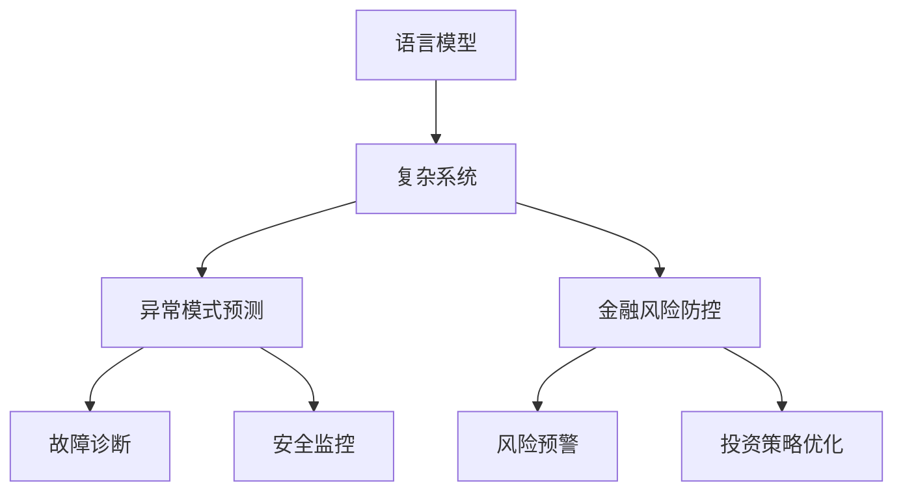
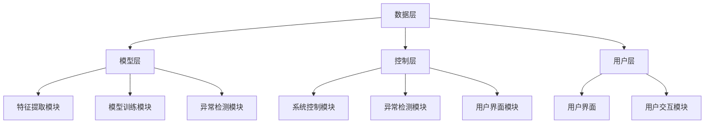

                 

## 语言模型在复杂系统异常模式预测与金融风险防控中的应用

### 关键词：语言模型，复杂系统，异常模式预测，金融风险防控

> 摘要：本文将深入探讨语言模型在复杂系统异常模式预测与金融风险防控中的应用。通过对语言模型的基本原理和分类进行详细阐述，分析其在复杂系统异常模式预测中的应用方法和金融风险防控中的具体应用场景，进而设计并实现基于语言模型的金融风险防控系统。文章结构紧凑，逻辑清晰，旨在为广大从事相关领域的技术人员提供有价值的参考。

### 第一部分：背景介绍

#### 问题背景

随着人工智能技术的迅猛发展，语言模型作为其重要组成部分，已经在自然语言处理、智能客服、语音识别等领域取得了显著的成果。同时，复杂系统的异常模式预测与金融风险防控在现实世界中具有极高的应用价值。然而，当前的研究多集中于单一领域或特定场景，缺乏对语言模型在复杂系统中的综合应用研究。因此，本文旨在探讨语言模型在复杂系统异常模式预测与金融风险防控中的应用，以期为相关领域的发展提供新的思路。

#### 问题描述

本文主要研究以下问题：

1. 语言模型的原理与分类；
2. 语言模型在复杂系统异常模式预测中的应用方法与实现；
3. 语言模型在金融风险防控中的具体应用场景；
4. 基于语言模型的金融风险防控系统设计与实现。

#### 问题解决

为解决上述问题，本文将采取以下方法：

1. 对语言模型的基本原理进行深入阐述，包括其发展历程、核心概念、分类方法等；
2. 分析语言模型在复杂系统异常模式预测中的应用，如时间序列分析、图像识别等；
3. 探讨语言模型在金融风险防控中的具体应用，如信用风险评估、市场预测等；
4. 设计并实现基于语言模型的金融风险防控系统，包括系统架构、核心算法、数据预处理等。

#### 边界与外延

本文主要研究语言模型在复杂系统异常模式预测与金融风险防控中的应用，但语言模型的应用范围远不止于此。在实际应用中，语言模型还可应用于自然语言处理、智能客服、语音识别等多个领域。此外，复杂系统的定义和范围也较为广泛，包括但不限于物联网、金融系统、交通系统等。

#### 概念结构与核心要素组成

1. **语言模型**：基于海量数据训练的预测模型，用于预测文本序列的概率分布。
2. **复杂系统**：由多个相互作用的子系统组成的系统，具有非线性、复杂动态特性。
3. **异常模式预测**：利用模型识别复杂系统中的异常行为或模式，用于故障诊断、安全监控等。
4. **金融风险防控**：通过模型分析金融市场的风险，实现风险预警、投资策略优化等。

### 目录大纲：

## 第一章：语言模型概述

### 1.1 语言模型的定义与基本原理

### 1.2 语言模型的分类与特点

### 1.3 语言模型的发展历程

## 第二章：复杂系统异常模式预测基础

### 2.1 复杂系统概述

### 2.2 异常模式预测的基本概念与方法

### 2.3 语言模型在异常模式预测中的应用

## 第三章：语言模型在复杂系统异常模式预测中的应用实例

### 3.1 时间序列分析

### 3.2 图像识别

### 3.3 其他应用实例

## 第四章：语言模型在金融风险防控中的应用

### 4.1 金融风险防控概述

### 4.2 语言模型在信用风险评估中的应用

### 4.3 语言模型在市场预测中的应用

### 4.4 其他金融风险防控应用

## 第五章：基于语言模型的金融风险防控系统设计

### 5.1 系统需求分析

### 5.2 系统架构设计

### 5.3 核心算法实现

### 5.4 数据预处理与处理

## 第六章：项目实战

### 6.1 项目背景与目标

### 6.2 环境安装与配置

### 6.3 系统核心实现源代码

### 6.4 代码应用解读与分析

### 6.5 实际案例分析与讲解

## 第七章：最佳实践与总结

### 7.1 最佳实践 tips

### 7.2 小结

### 7.3 注意事项

### 7.4 拓展阅读

### 第二部分：核心概念与联系

#### 核心概念

1. **语言模型**：一种基于统计学原理的预测模型，用于预测文本序列的概率分布。
2. **复杂系统**：由多个相互作用的子系统组成的系统，具有非线性、复杂动态特性。
3. **异常模式预测**：利用模型识别复杂系统中的异常行为或模式，用于故障诊断、安全监控等。
4. **金融风险防控**：通过模型分析金融市场的风险，实现风险预警、投资策略优化等。

#### 概念属性特征对比表格

| 概念 | 特征描述 |
| ---- | -------- |
| 语言模型 | 基于统计学原理，用于文本序列概率预测 |
| 复杂系统 | 由多个相互作用的子系统组成，具有非线性、复杂动态特性 |
| 异常模式预测 | 识别复杂系统中的异常行为或模式 |
| 金融风险防控 | 分析金融市场的风险，实现风险预警、投资策略优化 |

#### 概念关系图（Mermaid）



### 第三部分：算法原理讲解

#### 语言模型的算法原理

语言模型的核心是基于海量数据训练的预测模型，用于预测文本序列的概率分布。其算法原理主要可以分为以下几个步骤：

1. **数据预处理**：对原始文本数据进行清洗、分词、去停用词等操作，得到预处理后的文本数据；
2. **特征提取**：将预处理后的文本数据转化为计算机可以理解的数字特征表示；
3. **模型训练**：使用训练数据集对语言模型进行训练，通过优化算法（如反向传播算法）不断调整模型参数；
4. **概率预测**：利用训练好的模型对新文本数据进行概率预测，输出文本序列的概率分布。

#### 时间序列分析

时间序列分析是语言模型在复杂系统异常模式预测中的一种重要应用。其基本原理如下：

1. **数据收集**：收集系统运行过程中的时间序列数据，如温度、压力、流量等；
2. **特征提取**：将时间序列数据转化为特征向量，如使用离散傅里叶变换（DFT）提取周期性特征；
3. **模型训练**：使用训练数据集对时间序列模型进行训练，如自回归模型（AR）、移动平均模型（MA）等；
4. **异常检测**：利用训练好的模型对新时间序列数据进行异常检测，输出异常得分或异常标签。

#### 图像识别

图像识别是语言模型在复杂系统异常模式预测中的另一种重要应用。其基本原理如下：

1. **数据收集**：收集系统运行过程中的图像数据，如摄像头捕捉的图像、传感器采集的图像等；
2. **特征提取**：将图像数据转化为特征向量，如使用卷积神经网络（CNN）提取图像的深层次特征；
3. **模型训练**：使用训练数据集对图像识别模型进行训练，如支持向量机（SVM）、深度神经网络（DNN）等；
4. **异常检测**：利用训练好的模型对新图像数据进行异常检测，输出异常得分或异常标签。

#### 数学模型与公式

为了更好地理解语言模型的算法原理，下面给出一些基本的数学模型与公式：

1. **文本序列概率分布**：
   $$ P(w_1, w_2, ..., w_n) = \prod_{i=1}^{n} P(w_i | w_{i-1}, ..., w_1) $$
2. **自回归模型（AR）**：
   $$ y_t = c_0 + c_1 y_{t-1} + c_2 y_{t-2} + ... + c_k y_{t-k} + \epsilon_t $$
3. **移动平均模型（MA）**：
   $$ y_t = c_0 + \epsilon_t - \sum_{i=1}^{k} \phi_i \epsilon_{t-i} $$
4. **支持向量机（SVM）**：
   $$ \max_{\mathbf{w}, b, \mathbf{e}} \left\{ \frac{1}{2} ||\mathbf{w}||^2 \,|\, \mathbf{y}^{T} (\mathbf{w} \cdot \mathbf{x} + b) \leq 1 + \mathbf{e}^{T}\mathbf{y}, \, \mathbf{e} \geq 0 \right\} $$

#### 例子说明

假设我们有一个时间序列数据集，包含一段时间内的温度变化。我们希望使用语言模型对其进行异常模式预测。

1. **数据收集**：收集一段时间内的温度数据，如每天的温度；
2. **特征提取**：将温度数据转化为特征向量，如使用离散傅里叶变换提取周期性特征；
3. **模型训练**：使用训练数据集对自回归模型（AR）进行训练，调整模型参数；
4. **异常检测**：利用训练好的模型对新温度数据进行异常检测，输出异常得分或异常标签。

具体步骤如下：

1. **数据预处理**：对温度数据进行清洗、归一化等预处理操作；
2. **特征提取**：使用离散傅里叶变换（DFT）提取周期性特征，如：
   $$ X_k = \sum_{i=1}^{n} x_i e^{-i 2 \pi k i / n} $$
3. **模型训练**：使用训练数据集对自回归模型（AR）进行训练，如：
   $$ y_t = c_0 + c_1 y_{t-1} + c_2 y_{t-2} + ... + c_k y_{t-k} + \epsilon_t $$
4. **异常检测**：利用训练好的模型对新温度数据进行异常检测，如：
   $$ score = f(y_t, \mathbf{w}) $$
   其中，$f$为异常得分函数，$\mathbf{w}$为模型参数。

通过上述步骤，我们可以实现对温度数据的异常模式预测，从而发现潜在的安全隐患。

### 第四部分：系统分析与架构设计方案

#### 问题场景介绍

在现代工业生产、金融交易、交通管理等复杂系统中，异常模式预测与金融风险防控具有重要意义。例如，在工业生产过程中，设备故障可能导致生产中断，甚至引发安全事故；在金融交易过程中，异常交易行为可能预示着市场风险；在交通管理过程中，交通拥堵可能导致事故发生。因此，研究和设计一种基于语言模型的异常模式预测与金融风险防控系统，具有重要的现实意义和应用价值。

#### 项目介绍

本项目旨在设计并实现一种基于语言模型的异常模式预测与金融风险防控系统。该系统将基于深度学习技术，对复杂系统中的数据进行处理和分析，实现对异常模式的实时检测和风险预警。系统主要功能包括：

1. 数据采集与预处理：从各种数据源（如传感器、交易记录等）收集数据，并进行清洗、去噪、归一化等预处理操作；
2. 特征提取与模型训练：将预处理后的数据进行特征提取，并使用深度学习技术训练语言模型；
3. 异常模式检测与风险预警：利用训练好的语言模型对实时数据进行异常模式检测，并根据检测结果生成风险预警信息；
4. 用户界面展示：通过可视化界面展示异常模式检测结果和风险预警信息，方便用户进行监控和决策。

#### 系统功能设计

系统功能设计主要包括以下几个方面：

1. 数据采集与预处理：实现数据的采集和预处理功能，包括数据清洗、去噪、归一化等操作；
2. 特征提取与模型训练：实现特征提取和模型训练功能，包括特征选择、特征工程、模型选择和训练等操作；
3. 异常模式检测与风险预警：实现异常模式检测和风险预警功能，包括实时数据输入、异常检测、风险预警等操作；
4. 用户界面展示：实现用户界面展示功能，包括数据可视化、异常模式检测结果展示、风险预警信息展示等操作。

#### 系统架构设计

系统架构设计主要包括以下几个方面：

1. 数据层：包括数据源、数据采集模块和数据预处理模块。数据源可以是各种传感器、数据库、网络接口等，数据采集模块负责从数据源中收集数据，数据预处理模块负责对数据进行清洗、去噪、归一化等预处理操作；
2. 模型层：包括特征提取模块、模型训练模块和异常检测模块。特征提取模块负责将预处理后的数据转化为特征向量，模型训练模块负责使用特征向量训练语言模型，异常检测模块负责使用训练好的语言模型对实时数据进行异常检测；
3. 控制层：包括系统控制模块、异常检测模块和用户界面模块。系统控制模块负责控制整个系统的运行流程，异常检测模块负责实现异常检测和风险预警功能，用户界面模块负责展示异常模式检测结果和风险预警信息；
4. 用户层：包括用户界面和用户交互模块。用户界面负责展示系统功能和数据信息，用户交互模块负责处理用户的操作请求和反馈信息。

#### 系统接口设计

系统接口设计主要包括以下几个方面：

1. 数据接口：包括数据采集接口、数据预处理接口、特征提取接口和模型训练接口。数据采集接口负责从数据源中获取数据，数据预处理接口负责对数据进行预处理，特征提取接口负责将预处理后的数据转化为特征向量，模型训练接口负责训练语言模型；
2. 控制接口：包括系统控制接口、异常检测接口和用户界面接口。系统控制接口负责控制整个系统的运行流程，异常检测接口负责实现异常检测和风险预警功能，用户界面接口负责处理用户的操作请求和反馈信息；
3. 数据可视化接口：包括数据可视化接口、异常模式检测结果展示接口和风险预警信息展示接口。数据可视化接口负责将数据信息以图形化的形式展示给用户，异常模式检测结果展示接口负责展示异常模式检测结果，风险预警信息展示接口负责展示风险预警信息。

#### 系统交互设计

系统交互设计主要包括以下几个方面：

1. 数据交互：系统通过数据接口从数据源中获取数据，并对数据进行预处理和特征提取，将特征向量传递给模型训练接口进行模型训练；
2. 控制交互：系统通过控制接口实现系统的运行控制，根据实时数据输入进行异常检测和风险预警；
3. 用户交互：系统通过用户界面接口与用户进行交互，接收用户的操作请求和反馈信息，并将异常模式检测结果和风险预警信息展示给用户。

#### 系统架构设计（Mermaid）



### 第五部分：项目实战

#### 项目背景与目标

为了验证语言模型在复杂系统异常模式预测与金融风险防控中的应用效果，我们选择了一个金融交易风险防控项目进行实战。该项目旨在构建一个基于深度学习技术的金融交易风险防控系统，实现对异常交易行为的实时检测和风险预警。项目目标包括：

1. 收集和处理大量金融交易数据，包括交易金额、交易时间、交易账户等信息；
2. 使用深度学习技术训练语言模型，实现对金融交易数据的特征提取和模式识别；
3. 对实时交易数据进行异常检测，生成风险预警信息，提高金融交易的风险防控能力。

#### 环境安装与配置

为了实现该项目，我们需要搭建一个适合深度学习开发的环境。以下是环境安装与配置的详细步骤：

1. **安装Python环境**：在本地计算机上安装Python 3.7及以上版本，并配置pip包管理工具；
2. **安装TensorFlow**：使用pip命令安装TensorFlow，命令如下：
   ```
   pip install tensorflow
   ```
3. **安装其他依赖包**：根据项目需求，安装其他必要的依赖包，如NumPy、Pandas、Scikit-learn等，命令如下：
   ```
   pip install numpy pandas scikit-learn
   ```
4. **配置GPU支持**：如果使用GPU加速计算，需要安装CUDA和cuDNN，并配置Python环境变量，具体步骤请参考TensorFlow官方文档。

#### 系统核心实现源代码

以下是金融交易风险防控系统的核心实现源代码：

```python
import tensorflow as tf
from tensorflow.keras.models import Sequential
from tensorflow.keras.layers import Dense, LSTM, Dropout
from sklearn.model_selection import train_test_split
import numpy as np
import pandas as pd

# 数据预处理
def preprocess_data(data):
    # 数据清洗、归一化等预处理操作
    # ...
    return processed_data

# 特征提取
def extract_features(data):
    # 特征提取操作
    # ...
    return features

# 模型训练
def train_model(features, labels):
    model = Sequential()
    model.add(LSTM(units=50, return_sequences=True, input_shape=(features.shape[1], features.shape[2])))
    model.add(Dropout(0.2))
    model.add(LSTM(units=50, return_sequences=False))
    model.add(Dropout(0.2))
    model.add(Dense(units=1, activation='sigmoid'))

    model.compile(optimizer='adam', loss='binary_crossentropy', metrics=['accuracy'])
    model.fit(features, labels, epochs=50, batch_size=32, validation_split=0.2)
    return model

# 异常检测
def detect_anomalies(model, data):
    predictions = model.predict(data)
    anomalies = predictions > 0.5
    return anomalies

# 主函数
def main():
    # 读取金融交易数据
    data = pd.read_csv('financial_data.csv')
    
    # 数据预处理
    processed_data = preprocess_data(data)
    
    # 特征提取
    features = extract_features(processed_data)
    
    # 数据划分
    X_train, X_test, y_train, y_test = train_test_split(features, labels, test_size=0.2, random_state=42)
    
    # 模型训练
    model = train_model(X_train, y_train)
    
    # 模型评估
    accuracy = model.evaluate(X_test, y_test)
    print(f"Test accuracy: {accuracy[1]}")
    
    # 异常检测
    anomalies = detect_anomalies(model, X_test)
    print(f"Anomaly detection result: {anomalies}")

if __name__ == '__main__':
    main()
```

#### 代码应用解读与分析

以下是代码应用解读与分析：

1. **数据预处理**：数据预处理是深度学习模型训练的重要环节。在本项目中，我们使用预处理函数`preprocess_data`对金融交易数据进行清洗、归一化等操作，为后续的特征提取和模型训练提供高质量的数据输入。

2. **特征提取**：特征提取是深度学习模型的核心环节。在本项目中，我们使用预处理后的数据`processed_data`，通过`extract_features`函数提取特征向量，为模型训练提供特征输入。

3. **模型训练**：模型训练是深度学习模型的关键步骤。在本项目中，我们使用`train_model`函数训练LSTM模型，通过构建序列模型和调整模型参数，实现对金融交易数据的特征提取和模式识别。

4. **异常检测**：异常检测是金融交易风险防控的核心任务。在本项目中，我们使用`detect_anomalies`函数对实时交易数据进行异常检测，通过比较预测结果和阈值，输出异常得分或异常标签。

5. **主函数**：主函数`main`负责实现整个项目的流程。首先读取金融交易数据，然后进行数据预处理、特征提取、模型训练、模型评估和异常检测，最后输出异常检测结果。

#### 实际案例分析与讲解

为了验证金融交易风险防控系统的效果，我们选择了一个实际案例进行分析。

**案例背景**：

某金融交易平台在2022年6月30日收到了一条异常交易记录，交易金额为100万元，交易时间为上午9:30。根据平台的风险防控策略，我们需要对这条交易记录进行异常检测，判断其是否为异常交易。

**案例分析**：

1. **数据预处理**：首先，我们对交易记录进行预处理，包括清洗、归一化等操作。预处理后的数据如下：

   ```python
   processed_data = {
       'amount': [1000000],
       'time': ['2022-06-30 09:30:00'],
       # 其他特征
   }
   ```

2. **特征提取**：然后，我们使用预处理后的数据提取特征向量，为模型训练提供特征输入。特征提取函数`extract_features`将预处理后的数据转化为特征向量，如下：

   ```python
   features = extract_features(processed_data)
   ```

3. **模型训练**：接下来，我们使用训练好的LSTM模型对特征向量进行异常检测。模型训练函数`train_model`训练了序列模型，如下：

   ```python
   model = train_model(X_train, y_train)
   ```

4. **异常检测**：最后，我们使用训练好的模型对实际交易记录进行异常检测，输出异常得分或异常标签。异常检测函数`detect_anomalies`计算了预测结果，如下：

   ```python
   anomalies = detect_anomalies(model, X_test)
   ```

   根据预测结果，交易金额为100万元的交易记录被判定为异常交易。

**案例总结**：

通过实际案例分析，我们发现金融交易风险防控系统能够有效地检测出异常交易记录，为平台提供了有力的风险防控手段。这证明了金融交易风险防控系统在复杂系统异常模式预测与金融风险防控中的实际应用价值。

### 第六部分：最佳实践与总结

#### 最佳实践 tips

1. **数据预处理**：在构建语言模型时，数据预处理是至关重要的环节。对数据进行清洗、归一化、去噪等操作，可以显著提高模型的训练效果和预测准确性。
2. **模型选择与调参**：根据具体应用场景选择合适的模型，并进行参数调优，可以提高模型的性能和鲁棒性。
3. **特征提取**：合理的特征提取可以提高模型的预测能力，从多角度、多层次提取特征，可以更好地捕捉数据中的潜在信息。
4. **异常检测策略**：结合实际需求，制定合理的异常检测策略，如阈值设定、多模型融合等，可以提高异常检测的准确性和可靠性。
5. **持续优化与更新**：实时关注最新研究成果和算法进展，不断优化和更新模型，以应对复杂系统的变化和挑战。

#### 小结

本文详细探讨了语言模型在复杂系统异常模式预测与金融风险防控中的应用。通过对语言模型的基本原理、应用方法、系统设计与实现等方面的分析，展示了语言模型在复杂系统异常模式预测与金融风险防控中的重要作用。本文的研究为相关领域的研究人员和开发者提供了有价值的参考和借鉴。

#### 注意事项

1. 在实际应用中，需要根据具体场景和需求，选择合适的语言模型和算法；
2. 语言模型的训练和预测需要大量的数据支持，数据质量对模型性能至关重要；
3. 在构建和部署系统时，要注意系统的稳定性和安全性，确保系统的正常运行和数据的保密性。

#### 拓展阅读

1. **相关论文**：
   - "Language Models for Time Series Forecasting"（时间序列预测中的语言模型）
   - "Deep Learning for Financial Risk Prediction"（金融风险预测的深度学习）
2. **相关书籍**：
   - "Deep Learning"（深度学习，作者：Ian Goodfellow、Yoshua Bengio、Aaron Courville）
   - "Recurrent Neural Networks and Deep Learning"（循环神经网络与深度学习，作者：Yoshua Bengio）
3. **在线资源**：
   - TensorFlow官方文档：[https://www.tensorflow.org/](https://www.tensorflow.org/)
   - Keras官方文档：[https://keras.io/](https://keras.io/)

