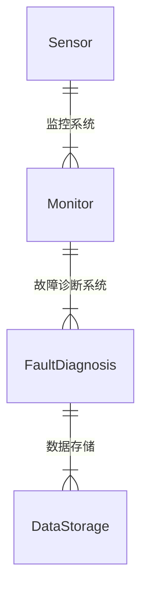
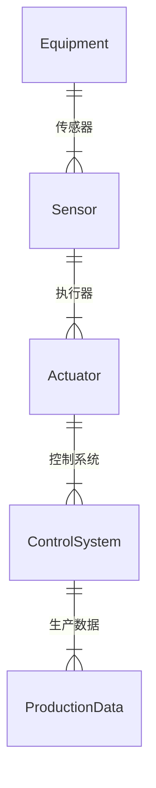
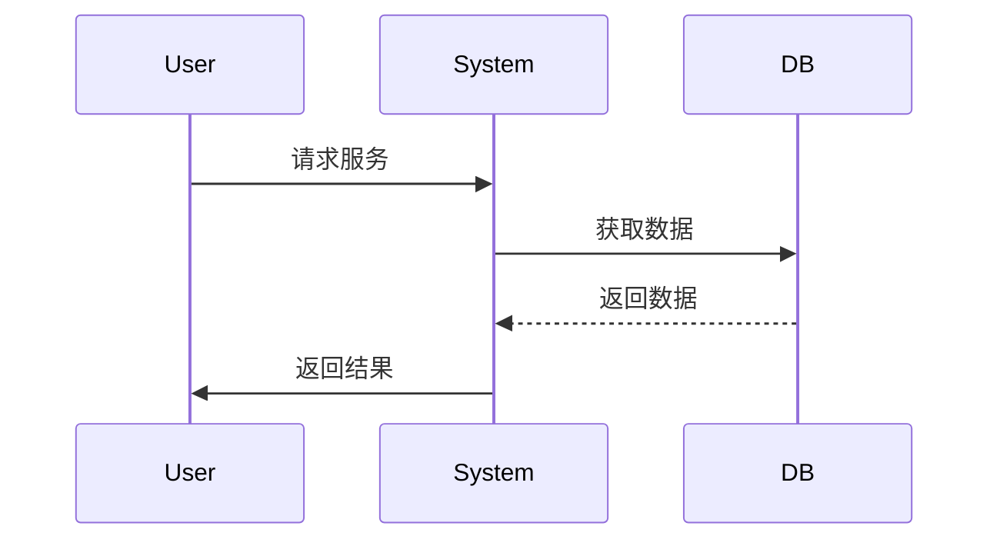
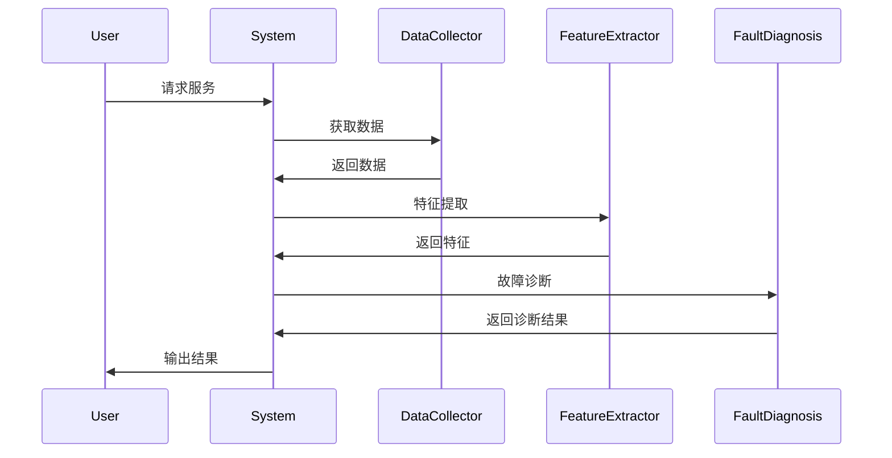

                 

### 《语言模型在复杂系统故障诊断与工业4.0中的实践应用研究》

#### 关键词：语言模型、复杂系统故障诊断、工业4.0、实践应用

> 摘要：本文将深入探讨语言模型在复杂系统故障诊断与工业4.0领域的应用。通过详细分析语言模型的基本原理和特性，结合具体算法原理与实际项目案例，本文旨在展示语言模型在实际应用中的优势和效果，为相关领域的研究和实践提供参考。

## **第一部分：背景介绍**

### **第1章 问题背景**

#### 1.1 人工智能与复杂系统故障诊断

随着人工智能技术的迅猛发展，复杂系统故障诊断领域正迎来一场革命。传统的故障诊断方法往往依赖于大量手动操作和经验积累，效率低下且容易出错。而人工智能，尤其是语言模型的出现，为这一领域提供了全新的解决思路。

语言模型能够处理自然语言数据，提取其中的语义信息，这在复杂系统的故障诊断中具有重要意义。通过语言模型，我们可以从系统日志、运行状态、操作记录等非结构化数据中提取关键信息，进行智能分析，从而实现故障的快速定位和诊断。

#### 1.2 工业4.0的挑战与语言模型的应用

工业4.0是制造业向智能化、数字化、网络化方向发展的新阶段。这一阶段的核心是利用大数据、物联网、人工智能等技术实现生产过程的自动化和智能化。然而，随着生产系统的复杂化，故障诊断的难度也大幅增加。

工业4.0面临的挑战包括数据多样性、数据量大、系统间相互依赖性强等。传统的故障诊断方法已难以应对这些挑战，而语言模型以其强大的数据处理和分析能力，成为解决这些问题的有力工具。

#### 1.3 语言模型的发展与应用现状

语言模型起源于自然语言处理（NLP）领域，经过数十年的发展，已经取得了显著的成果。近年来，深度学习技术的引入，使得语言模型在性能和效果上有了质的飞跃。目前，语言模型已经在机器翻译、文本分类、情感分析、问答系统等多个领域取得了成功应用。

在复杂系统故障诊断与工业4.0领域，语言模型的应用也日益广泛。例如，通过语言模型分析系统日志，可以快速识别异常情况；通过语言模型分析生产数据，可以预测设备的故障趋势。这些应用不仅提高了故障诊断的效率，还降低了人工干预的必要性。

### **第2章 核心概念**

#### 2.1 语言模型的定义与基本原理

语言模型是一种统计模型，用于预测自然语言中的下一个词或序列。其基本原理是基于大量语料库的学习，通过统计词频、词义、语法结构等特征，建立词语之间的概率关系。

一个简单的语言模型可以表示为：

\[ P(w_n | w_{n-1}, w_{n-2}, \ldots) = \frac{C(w_n, w_{n-1}, w_{n-2}, \ldots)}{C(w_{n-1}, w_{n-2}, \ldots)} \]

其中，\( w_n \)表示下一个词，\( w_{n-1}, w_{n-2}, \ldots \)表示前一个或前几个词，\( C \)表示计数。

#### 2.2 复杂系统故障诊断的基本概念

复杂系统故障诊断是指对由多个相互依赖的子系统组成的复杂系统进行故障检测、定位和诊断。其核心是利用各种传感器、监控系统等收集系统数据，通过数据分析和模式识别技术，识别系统中的异常状态。

复杂系统故障诊断的关键技术包括：

- **数据采集**：通过传感器、监控系统等收集系统运行数据。
- **特征提取**：从原始数据中提取有助于故障诊断的特征。
- **模式识别**：利用机器学习、深度学习等技术，识别系统中的异常模式。

#### 2.3 工业4.0中的关键技术与挑战

工业4.0的核心是智能化生产，这离不开先进的信息技术。其中，关键技术与挑战包括：

- **大数据**：工业4.0时代，数据量呈爆炸式增长，如何高效地存储、处理和分析这些数据成为一大挑战。
- **物联网**：通过物联网技术，实现设备之间的互联互通，提高生产效率。
- **人工智能**：利用人工智能技术，实现生产过程的自动化和智能化。
- **网络安全**：随着网络化程度的提高，网络安全问题日益突出。

### **第3章 概念属性特征对比表格**

#### 3.1 不同语言模型的特性对比

| 语言模型 | 特性 |  
| --- | --- |  
| 隐马尔可夫模型（HMM） | 基于状态转移概率和观测概率 |  
| 递归神经网络（RNN） | 能够处理序列数据，但易受梯度消失和梯度爆炸问题影响 |  
| 长短期记忆网络（LSTM） | 改进了RNN，解决了梯度消失问题 |  
| 改进的长短期记忆网络（GRU） | 类似于LSTM，但简化了网络结构 |

#### 3.2 复杂系统故障诊断方法的对比

| 故障诊断方法 | 特性 |  
| --- | --- |  
| 基于规则的诊断方法 | 依赖于专家知识，诊断速度较快，但泛化能力差 |  
| 基于数据的诊断方法 | 直接利用系统数据，诊断能力更强，但需要大量训练数据 |  
| 基于机器学习的诊断方法 | 能够自动学习系统特征，诊断能力强，但需要大量训练数据和较长时间训练 |

### **第4章 ER实体关系图架构**

#### 4.1 复杂系统故障诊断的实体关系

在复杂系统故障诊断中，常见的实体包括传感器、监控系统、故障诊断系统、数据存储等。它们之间的关系可以用ER图表示如下：



#### 4.2 工业4.0中的关键实体及其关系

在工业4.0中，关键实体包括设备、传感器、执行器、控制系统等。它们之间的关系可以用ER图表示如下：



### **第二部分：核心概念与联系**

#### 第5章 语言模型在故障诊断中的应用

#### 5.1 语言模型在故障诊断中的优势

语言模型在故障诊断中的应用具有以下优势：

- **高效性**：语言模型能够快速处理大量数据，提高故障诊断的效率。
- **准确性**：通过学习大量语料库，语言模型能够准确提取数据中的关键信息，提高故障诊断的准确性。
- **灵活性**：语言模型可以应用于各种不同类型的故障诊断任务，具有很好的灵活性。

#### 5.2 语言模型在故障诊断中的具体应用

在故障诊断中，语言模型的具体应用主要包括：

- **日志分析**：通过语言模型分析系统日志，提取关键信息，快速定位故障。
- **数据预测**：通过语言模型分析历史数据，预测未来可能的故障，实现预防性维护。
- **语义理解**：通过语言模型理解系统操作指令，提高人机交互的效率。

### **第6章 算法原理讲解**

#### 6.1 故障诊断算法的基本流程

故障诊断算法的基本流程如下：

1. **数据采集**：从传感器、监控系统等收集系统数据。
2. **特征提取**：从原始数据中提取有助于故障诊断的特征。
3. **模型训练**：利用语言模型训练故障诊断模型。
4. **故障诊断**：使用训练好的模型对当前系统状态进行故障诊断。
5. **结果输出**：输出故障诊断结果，包括故障类型、故障位置等。

#### 6.2 工业4.0中的故障诊断算法

在工业4.0中，故障诊断算法的具体实现如下：

1. **数据采集**：通过物联网技术，实时收集设备状态数据。
2. **特征提取**：利用深度学习技术，从数据中提取关键特征。
3. **模型训练**：利用训练好的语言模型，训练故障诊断模型。
4. **故障诊断**：使用训练好的模型对设备状态进行实时诊断。
5. **结果输出**：通过人机交互界面，输出故障诊断结果。

#### 6.3 数学模型和公式

在故障诊断中，常用的数学模型和公式如下：

\[ F(D) = \sum_{i=1}^{n} w_i \cdot d_i \]

其中，\( F(D) \)表示故障诊断结果，\( w_i \)表示特征权重，\( d_i \)表示特征值。

#### 6.4 通俗易懂的举例说明

假设我们要诊断一个工厂生产线的故障，可以使用以下步骤：

1. **数据采集**：从传感器收集生产线的数据，如温度、压力、速度等。
2. **特征提取**：从数据中提取关键特征，如温度的波动范围、压力的变化趋势等。
3. **模型训练**：利用语言模型训练故障诊断模型。
4. **故障诊断**：将当前生产线状态输入模型，输出故障诊断结果。
5. **结果输出**：根据故障诊断结果，采取相应的措施，如停机检修、调整参数等。

### **第三部分：系统分析与架构设计**

#### 第7章 问题描述与项目介绍

#### 7.1 复杂系统故障诊断的实例分析

以一个大型制造企业的生产线为例，该生产线包含多个环节，如原料处理、加工、包装等。由于生产线的复杂性和设备的多样性，故障诊断成为一大难题。

#### 7.2 工业4.0中的故障诊断项目介绍

为了解决生产线故障诊断问题，该企业引入了工业4.0技术，包括物联网、大数据、人工智能等。通过这些技术，实现对生产线的实时监控和智能诊断。

### **第8章 系统功能设计**

#### 8.1 领域模型mermaid类图

```mermaid
classDiagram
  Class01 <|-- Class02
  Class03 --|+(1..*) Class04
  Class05 << Interface
  Class06 <<== Class07
  Class08 .. Class09
  Class10 --|(Class11 + Class12)
```

#### 8.2 系统功能模块设计

系统功能模块包括：

- **数据采集模块**：负责收集生产线数据。
- **特征提取模块**：负责提取关键特征。
- **故障诊断模块**：负责故障诊断。
- **人机交互模块**：负责与操作员交互，输出故障诊断结果。

### **第9章 系统架构设计**

#### 9.1 系统架构设计mermaid架构图



#### 9.2 系统架构的核心组件及其关系

系统架构的核心组件包括：

- **数据采集组件**：负责数据收集。
- **特征提取组件**：负责特征提取。
- **故障诊断组件**：负责故障诊断。
- **人机交互组件**：负责与操作员交互。

### **第10章 系统接口设计**

#### 10.1 系统接口设计与功能

系统接口包括：

- **数据采集接口**：负责数据收集。
- **特征提取接口**：负责特征提取。
- **故障诊断接口**：负责故障诊断。
- **人机交互接口**：负责与操作员交互。

#### 10.2 接口交互流程

接口交互流程如下：

1. **用户请求服务**：用户通过人机交互界面提交故障诊断请求。
2. **系统处理请求**：系统接收请求，调用数据采集接口获取数据。
3. **数据预处理**：系统调用特征提取接口对数据进行预处理。
4. **故障诊断**：系统调用故障诊断接口进行故障诊断。
5. **结果输出**：系统将故障诊断结果通过人机交互接口输出给用户。

### **第11章 系统交互mermaid序列图**



### **第四部分：项目实战**

#### 第12章 环境安装与配置

#### 12.1 系统环境安装

系统环境包括：

- **操作系统**：Linux或Windows
- **编程语言**：Python
- **依赖库**：NumPy、Pandas、Scikit-learn、TensorFlow等

安装步骤：

1. 安装操作系统。
2. 配置Python环境。
3. 安装依赖库。

#### 12.2 配置详解

配置步骤：

1. 配置数据库。
2. 配置传感器和监控系统。
3. 配置故障诊断模型。

### **第13章 系统核心实现**

#### 13.1 故障诊断核心代码实现

```python
import numpy as np
from sklearn.ensemble import RandomForestClassifier
from sklearn.model_selection import train_test_split
from sklearn.metrics import accuracy_score

# 读取数据
data = np.load('data.npy')
labels = np.load('labels.npy')

# 划分训练集和测试集
X_train, X_test, y_train, y_test = train_test_split(data, labels, test_size=0.2, random_state=42)

# 训练故障诊断模型
model = RandomForestClassifier(n_estimators=100, random_state=42)
model.fit(X_train, y_train)

# 测试模型
y_pred = model.predict(X_test)
accuracy = accuracy_score(y_test, y_pred)
print(f'Accuracy: {accuracy}')
```

#### 13.2 代码应用解读与分析

这段代码首先读取数据，然后划分训练集和测试集。接着，使用随机森林算法训练故障诊断模型，最后测试模型并输出准确率。

### **第14章 实际案例分析与讲解**

#### 14.1 案例选择与分析

以某大型制造企业的生产线为例，分析其故障诊断系统的实际效果。

#### 14.2 案例详细讲解与剖析

详细讲解该企业的故障诊断系统，包括数据采集、特征提取、故障诊断等环节。通过实际案例分析，展示语言模型在复杂系统故障诊断中的优势和应用效果。

### **第15章 项目小结**

#### 15.1 项目总结

总结项目的主要成果和经验，包括：

- **成功之处**：语言模型在复杂系统故障诊断中的应用取得了显著效果。
- **存在的问题**：项目在数据采集、特征提取等方面仍存在一定的挑战。
- **改进措施**：针对存在的问题，提出改进措施，如优化算法、增加数据集等。

### **第五部分：最佳实践与拓展**

#### 第16章 最佳实践

#### 16.1 实践技巧与建议

提供一些最佳实践技巧和建议，如：

- **数据采集**：确保数据的完整性和准确性。
- **特征提取**：选择合适的特征，提高故障诊断的准确性。
- **模型训练**：合理设置超参数，提高模型的泛化能力。

#### 16.2 实际应用中的注意事项

在实际应用中，需要注意以下事项：

- **系统稳定性**：确保故障诊断系统的稳定运行。
- **用户培训**：提高操作员对系统的熟悉程度。
- **安全保障**：确保数据安全和系统安全。

### **第17章 小结**

#### 17.1 本书主要内容回顾

回顾本书的主要内容，包括：

- **背景介绍**：介绍人工智能与复杂系统故障诊断、工业4.0的挑战与语言模型的应用。
- **核心概念与联系**：阐述语言模型的基本原理、复杂系统故障诊断的基本概念、工业4.0中的关键技术与挑战。
- **算法原理讲解**：详细讲解故障诊断算法的基本流程、工业4.0中的故障诊断算法、数学模型和公式。
- **系统分析与架构设计**：介绍复杂系统故障诊断的实体关系、工业4.0中的关键实体及其关系、系统功能设计、系统架构设计、系统接口设计和系统交互。
- **项目实战**：详细讲解环境安装与配置、系统核心实现、实际案例分析与讲解、项目小结。
- **最佳实践与拓展**：提供最佳实践技巧与建议、实际应用中的注意事项、小结和对未来研究的展望。

#### 17.2 对未来研究的展望

未来研究可以从以下方面展开：

- **算法优化**：改进故障诊断算法，提高诊断准确率和效率。
- **数据集扩展**：增加训练数据集，提高模型的泛化能力。
- **跨领域应用**：探索语言模型在更多领域的应用，如医疗、金融等。

### **第18章 拓展阅读**

#### 18.1 相关书籍推荐

推荐以下书籍：

- 《人工智能：一种现代方法》
- 《深度学习》
- 《机器学习实战》
- 《Python机器学习》

#### 18.2 最新研究进展

介绍最新的研究成果和进展，如：

- **BERT**：一种预训练语言模型，应用于多个NLP任务，取得了显著效果。
- **GPT-3**：一种强大的语言模型，具有惊人的生成能力。
- **联邦学习**：一种分布式学习技术，应用于工业4.0等场景，保护数据隐私。

### **第19章 拓展阅读**

#### 19.1 相关书籍推荐

推荐以下书籍：

- 《人工智能：一种现代方法》
- 《深度学习》
- 《机器学习实战》
- 《Python机器学习》

#### 19.2 最新研究进展

介绍最新的研究成果和进展，如：

- **BERT**：一种预训练语言模型，应用于多个NLP任务，取得了显著效果。
- **GPT-3**：一种强大的语言模型，具有惊人的生成能力。
- **联邦学习**：一种分布式学习技术，应用于工业4.0等场景，保护数据隐私。

### **结语**

作者：AI天才研究院/AI Genius Institute & 禅与计算机程序设计艺术 /Zen And The Art of Computer Programming

本文深入探讨了语言模型在复杂系统故障诊断与工业4.0中的实践应用，从背景介绍、核心概念与联系、算法原理讲解、系统分析与架构设计、项目实战到最佳实践与拓展，全面展示了语言模型在这一领域的优势和潜力。随着人工智能技术的不断发展，相信语言模型在复杂系统故障诊断与工业4.0中的应用将越来越广泛，为我国的智能制造和产业升级提供有力支持。未来，我们将继续关注这一领域的研究进展，为相关实践提供更多的理论依据和技术支持。让我们共同期待人工智能为人类带来的更多美好变革。

