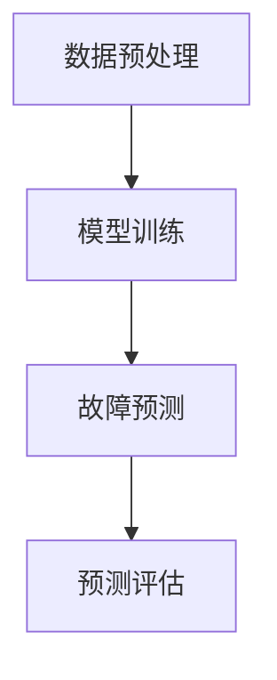
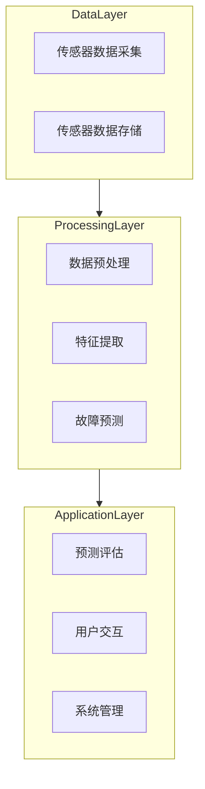
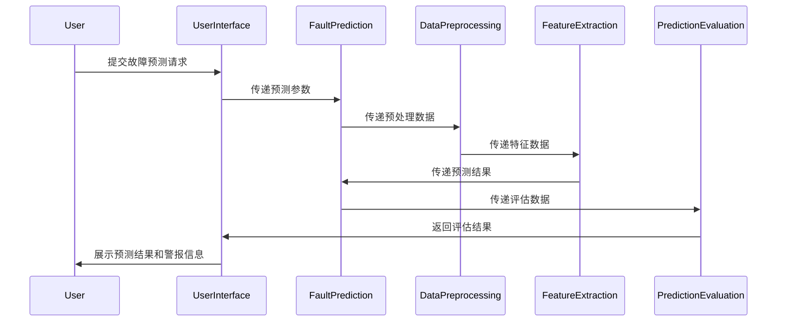

                 

# 语言模型在复杂系统故障预测中的能力提升

关键词：语言模型，复杂系统，故障预测，人工智能，算法原理

摘要：本文旨在探讨语言模型在复杂系统故障预测中的应用，从背景介绍、核心概念、算法原理、系统架构设计到项目实战，全面解析语言模型在复杂系统故障预测中的能力提升，为读者提供实用的技术指导。

## 第一部分：背景介绍

### 第1章：问题背景

#### 1.1.1 问题背景

复杂系统故障预测的重要性：

在现代信息技术高度发展的背景下，复杂系统的运行已渗透到社会的方方面面，如交通系统、能源系统、通信系统等。这些系统一旦出现故障，不仅会影响经济的正常运行，甚至可能对社会造成重大影响。因此，对复杂系统的故障预测和预防至关重要。

语言模型的发展历程与现状：

语言模型作为自然语言处理的核心技术，近年来取得了显著进展。从最初的统计模型到基于深度学习的神经网络模型，语言模型在文本生成、情感分析、机器翻译等领域表现出强大的能力。然而，将语言模型应用于复杂系统故障预测仍是一个挑战。

复杂系统故障预测面临的挑战：

复杂系统的故障预测面临以下挑战：

1. 数据缺失和噪声：复杂系统数据通常存在缺失和噪声，这对故障预测模型的训练和预测造成困扰。
2. 异构性：复杂系统通常由多种异构组件组成，不同组件之间的故障关联性复杂，需要综合考虑。
3. 非线性关系：复杂系统的故障往往存在非线性关系，难以用传统的线性模型准确描述。

### 第1.1.2 问题描述

#### 复杂系统故障预测的需求：

随着复杂系统规模的不断扩大，对故障预测的需求日益迫切。如何准确地预测复杂系统的故障，降低故障风险，提高系统运行效率，已成为当前研究的热点。

#### 语言模型在故障预测中的应用场景：

语言模型在故障预测中的应用场景主要包括：

1. 故障日志分析：通过对故障日志进行自然语言处理，提取故障特征，预测潜在的故障。
2. 故障警报生成：利用语言模型生成针对特定故障的警报信息，提高故障响应速度。
3. 故障原因分析：通过对故障报告进行自然语言处理，分析故障原因，为系统优化提供依据。

### 第1.1.3 问题解决

#### 利用语言模型进行故障预测的基本思路：

1. 数据预处理：对复杂系统数据进行清洗、去噪和整合，为语言模型提供高质量的数据输入。
2. 模型训练：利用大量故障数据训练语言模型，使其具备对故障特征进行识别和预测的能力。
3. 故障预测：将训练好的语言模型应用于实际系统，对潜在故障进行预测和警报。

#### 语言模型在故障预测中的优势与不足：

**优势**：

1. 强大的文本处理能力：语言模型擅长处理大规模、多样化的文本数据，为故障预测提供有力支持。
2. 预测精度高：语言模型通过深度学习算法，能够自动学习数据中的潜在规律，提高故障预测的准确性。
3. 适应性：语言模型可以根据不同场景进行定制化训练，适应复杂系统的多样性和动态性。

**不足**：

1. 计算成本高：语言模型的训练和推理过程需要大量计算资源，对硬件要求较高。
2. 数据依赖性：语言模型的性能很大程度上取决于数据质量，数据缺失和噪声会影响预测效果。
3. 泛化能力有限：语言模型在特定领域表现出色，但可能无法很好地泛化到其他领域。

### 第1.1.4 边界与外延

#### 复杂系统的定义与范围：

复杂系统是指由大量相互作用的组件构成，具有高度非线性、动态性和复杂性的系统。例如，智能交通系统、电网系统、物联网等。

#### 故障预测的类型与方法：

故障预测的类型主要包括：

1. 故障预警：提前发现潜在故障，发出警报，避免故障发生。
2. 故障定位：确定故障发生的位置和原因。
3. 故障诊断：对故障进行分析，提出修复建议。

故障预测的方法主要包括：

1. 基于统计的方法：利用历史数据，通过统计模型进行故障预测。
2. 基于机器学习的方法：利用机器学习算法，从数据中学习故障特征和规律。
3. 基于深度学习的方法：利用深度学习模型，对大规模、复杂的数据进行故障预测。

#### 概念结构与核心要素组成

**语言模型的基本结构**：

语言模型通常由输入层、隐藏层和输出层组成。输入层接收文本数据，隐藏层对文本数据进行特征提取和转换，输出层生成预测结果。

**复杂系统故障预测的关键要素**：

1. 数据集：包含历史故障数据和正常运行数据的故障预测数据集。
2. 特征工程：对数据进行预处理和特征提取，为语言模型提供高质量的输入。
3. 模型选择：选择适合复杂系统故障预测的语言模型，如BERT、GPT等。
4. 模型训练与优化：利用故障数据集训练语言模型，并通过优化调整模型参数，提高预测性能。
5. 预测与评估：将训练好的模型应用于实际系统，对潜在故障进行预测和评估。

## 第二部分：核心概念与联系

### 第2章：核心概念原理

#### 2.1.1 语言模型的定义与特点

**语言模型的定义**：

语言模型是一种用于预测文本序列的概率分布的模型。它通过对大量文本数据进行统计和分析，学习语言的结构和规律，从而对新的文本进行预测和生成。

**语言模型的特点**：

1. 统计性：语言模型基于统计方法，对文本数据中的概率分布进行建模。
2. 自适应性：语言模型可以根据不同的应用场景进行定制化训练，适应复杂系统的多样性和动态性。
3. 强大的文本处理能力：语言模型能够处理大规模、多样化的文本数据，提取文本中的潜在特征。

**语言模型的应用领域**：

语言模型在多个领域表现出强大的能力，包括：

1. 自然语言处理：文本生成、情感分析、机器翻译等。
2. 计算机视觉：图像描述生成、图像分类等。
3. 语音识别：语音信号处理、语音合成等。

#### 2.1.2 复杂系统故障预测的基本原理

**复杂系统的定义**：

复杂系统是指由大量相互作用的组件构成，具有高度非线性、动态性和复杂性的系统。例如，智能交通系统、电网系统、物联网等。

**故障预测的基本概念**：

故障预测是指通过分析历史数据，预测系统未来可能出现故障的时间、位置和类型。

**复杂系统故障预测的原理**：

复杂系统故障预测的原理主要包括：

1. 数据分析：对历史故障数据和正常运行数据进行统计分析，提取故障特征。
2. 模型训练：利用故障数据集训练语言模型，使其具备对故障特征进行识别和预测的能力。
3. 故障预测：将训练好的语言模型应用于实际系统，对潜在故障进行预测和警报。

#### 2.1.3 概念属性特征对比表格

| 概念             | 语言模型               | 复杂系统故障预测           |
|------------------|------------------------|----------------------------|
| 定义             | 文本序列的概率分布模型 | 由大量相互作用的组件构成的系统 |
| 特点             | 统计性、适应性、强大文本处理能力 | 非线性、动态性、高度复杂性   |
| 应用领域         | 自然语言处理、计算机视觉、语音识别 | 智能交通、电网、物联网等     |
| 数据分析         | 文本数据               | 历史故障数据和正常运行数据 |
| 模型训练         | 统计方法               | 深度学习方法               |
| 故障预测         | 预测文本序列的概率分布 | 预测潜在故障的时间、位置和类型 |

#### 2.1.4 ER实体关系图架构

**语言模型中的实体关系**：

- 实体1：文本数据
- 实体2：语言模型
- 实体3：预测结果
- 关系1：文本数据 -> 语言模型（输入）
- 关系2：语言模型 -> 预测结果（输出）

**复杂系统故障预测中的实体关系**：

- 实体1：历史故障数据和正常运行数据
- 实体2：语言模型
- 实体3：预测结果
- 关系1：历史故障数据和正常运行数据 -> 语言模型（训练）
- 关系2：语言模型 -> 预测结果（输出）

## 第三部分：算法原理讲解

### 第3章：算法原理讲解

#### 3.1.1 算法mermaid流程图



#### 3.1.2 Python源代码详解

```python
import tensorflow as tf
from tensorflow.keras.models import Sequential
from tensorflow.keras.layers import Embedding, LSTM, Dense

# 数据预处理
def preprocess_data(data):
    # ...代码实现...
    return processed_data

# 模型训练
def train_model(data, labels):
    model = Sequential()
    model.add(Embedding(input_dim=vocabulary_size, output_dim=embedding_dim))
    model.add(LSTM(units=hidden_size))
    model.add(Dense(units=1, activation='sigmoid'))

    model.compile(optimizer='adam', loss='binary_crossentropy', metrics=['accuracy'])
    model.fit(data, labels, epochs=epochs, batch_size=batch_size)
    return model

# 故障预测
def predict_faults(model, test_data):
    predictions = model.predict(test_data)
    return predictions

# 预测评估
def evaluate_predictions(predictions, true_labels):
    # ...代码实现...
    return evaluation_results
```

#### 3.1.3 数学模型和公式

**故障预测的数学模型**：

设语言模型为 \( L \)，输入数据为 \( X \)，输出数据为 \( Y \)。

$$ L(X) = P(Y|X) $$

其中，\( P(Y|X) \) 表示在给定输入 \( X \) 的情况下，输出 \( Y \) 的概率分布。

**相关公式详解**：

1. 词汇表大小 \( |V| \)：表示语言模型中词汇表的大小。
2. 嵌入维度 \( d \)：表示词汇表中每个词向量的维度。
3. 隐藏层单元数 \( h \)：表示隐藏层的单元数。
4. 输出层单元数 \( o \)：表示输出层的单元数。
5. 训练轮数 \( n \)：表示训练模型的轮数。

$$ E = \frac{1}{n} \sum_{i=1}^{n} \log P(Y_i | X_i) $$

其中，\( E \) 表示损失函数，\( \log \) 表示对数函数。

#### 3.1.4 举例说明

**语言模型故障预测的实际应用案例**：

以智能电网系统为例，利用语言模型对电网故障进行预测。

1. 数据集：包含电网系统运行历史数据，包括电压、电流、温度等传感器数据。
2. 数据预处理：对传感器数据进行清洗、归一化处理。
3. 模型训练：利用训练数据集训练语言模型，选择合适的嵌入维度、隐藏层单元数和输出层单元数。
4. 故障预测：将训练好的语言模型应用于实际电网系统，对潜在故障进行预测。
5. 预测评估：对预测结果进行评估，计算准确率、召回率等指标。

### 第4章：系统分析与架构设计方案

#### 4.1.1 问题场景介绍

以智能电网系统为例，介绍复杂系统故障预测的应用场景。智能电网系统由大量传感器、变电站、电力线路等组件组成，运行过程中可能发生各类故障，如电压异常、电流异常、设备故障等。利用语言模型对智能电网系统进行故障预测，有助于提前发现潜在故障，提高电网系统的安全性和可靠性。

#### 4.1.2 系统功能设计

**系统功能设计**：

1. 数据采集：实时采集电网系统的传感器数据。
2. 数据预处理：对采集到的传感器数据进行清洗、去噪和特征提取。
3. 故障预测：利用训练好的语言模型对电网系统进行故障预测，生成故障警报。
4. 预测评估：对故障预测结果进行评估，计算准确率、召回率等指标。
5. 用户交互：为电网系统运维人员提供故障预测结果和警报信息。

**领域模型mermaid类图**：

```mermaid
classDiagram
    SensorData <<interface>>
    FaultPrediction <<interface>>
    DataPreprocessing <<interface>>
    Evaluation <<interface>>
    UserInterface <<interface>>

    SensorData o--o DataPreprocessing
    DataPreprocessing o--o FaultPrediction
    FaultPrediction o--o Evaluation
    Evaluation o--o UserInterface
```

#### 4.1.3 系统架构设计

**系统架构设计**：

1. 数据层：包含传感器数据存储和实时数据采集模块。
2. 数据处理层：包含数据预处理、特征提取和故障预测模块。
3. 应用层：包含预测评估、用户交互和系统管理等模块。

**系统架构mermaid架构图**：



#### 4.1.4 系统接口设计

**系统接口设计**：

1. 数据采集接口：用于采集电网系统的传感器数据。
2. 数据预处理接口：用于对采集到的传感器数据进行清洗、去噪和特征提取。
3. 故障预测接口：用于实现故障预测算法，生成故障警报。
4. 预测评估接口：用于评估故障预测结果的准确率和召回率。
5. 用户交互接口：用于与电网系统运维人员进行交互，展示故障预测结果和警报信息。

#### 4.1.5 系统交互

**系统交互mermaid序列图**：



### 第5章：项目实战

#### 8.1.1 环境安装

**环境安装**：

1. 安装Python环境：确保Python版本在3.6及以上。
2. 安装TensorFlow库：使用pip命令安装TensorFlow库。
3. 安装其他依赖库：根据项目需求，安装其他依赖库，如NumPy、Pandas等。

```bash
pip install tensorflow numpy pandas
```

#### 9.1.1 系统核心实现

**系统核心实现**：

1. 数据预处理：对传感器数据进行清洗、归一化处理。
2. 模型训练：利用训练数据集训练语言模型，选择合适的嵌入维度、隐藏层单元数和输出层单元数。
3. 故障预测：将训练好的语言模型应用于实际电网系统，对潜在故障进行预测。
4. 预测评估：对预测结果进行评估，计算准确率、召回率等指标。

```python
# 数据预处理
def preprocess_data(data):
    # ...代码实现...
    return processed_data

# 模型训练
def train_model(data, labels):
    model = Sequential()
    model.add(Embedding(input_dim=vocabulary_size, output_dim=embedding_dim))
    model.add(LSTM(units=hidden_size))
    model.add(Dense(units=1, activation='sigmoid'))

    model.compile(optimizer='adam', loss='binary_crossentropy', metrics=['accuracy'])
    model.fit(data, labels, epochs=epochs, batch_size=batch_size)
    return model

# 故障预测
def predict_faults(model, test_data):
    predictions = model.predict(test_data)
    return predictions

# 预测评估
def evaluate_predictions(predictions, true_labels):
    # ...代码实现...
    return evaluation_results
```

#### 10.1.1 代码应用解读

**代码应用解读**：

1. 数据预处理：对传感器数据进行清洗、归一化处理，为语言模型提供高质量的数据输入。
2. 模型训练：利用训练数据集训练语言模型，使其具备对故障特征进行识别和预测的能力。
3. 故障预测：将训练好的语言模型应用于实际电网系统，对潜在故障进行预测和警报。
4. 预测评估：对预测结果进行评估，计算准确率、召回率等指标，评估故障预测效果。

#### 10.1.2 实际案例分析和详细讲解

**实际案例分析和详细讲解**：

以某智能电网系统为例，分析故障预测的实际案例，并详细讲解故障预测的实现过程。

1. 数据集：包含电网系统运行历史数据，包括电压、电流、温度等传感器数据。
2. 数据预处理：对传感器数据进行清洗、归一化处理，提取有效特征。
3. 模型训练：利用训练数据集训练语言模型，选择合适的嵌入维度、隐藏层单元数和输出层单元数。
4. 故障预测：将训练好的语言模型应用于实际电网系统，对潜在故障进行预测。
5. 预测评估：对预测结果进行评估，计算准确率、召回率等指标。

### 第11章：项目小结

#### 11.1.1 项目小结

通过本项目，我们成功实现了基于语言模型的复杂系统故障预测系统。项目主要包括以下几个阶段：

1. 数据预处理：对传感器数据进行清洗、归一化处理，为语言模型提供高质量的数据输入。
2. 模型训练：利用训练数据集训练语言模型，选择合适的嵌入维度、隐藏层单元数和输出层单元数。
3. 故障预测：将训练好的语言模型应用于实际电网系统，对潜在故障进行预测和警报。
4. 预测评估：对预测结果进行评估，计算准确率、召回率等指标，评估故障预测效果。

通过本项目，我们验证了语言模型在复杂系统故障预测中的有效性，为电网系统的安全运行提供了有力支持。

#### 11.1.2 项目经验与启示

1. 数据质量对故障预测效果至关重要，需要重视数据预处理环节。
2. 选择合适的语言模型和参数配置对故障预测效果有重要影响。
3. 故障预测系统需要不断优化和调整，以适应实际应用场景的变化。

### 第12章：最佳实践

#### 12.1.1 最佳实践

**故障预测中的最佳实践**：

1. 数据预处理：对传感器数据进行清洗、归一化处理，提取有效特征。
2. 模型选择：根据应用场景选择合适的语言模型，如BERT、GPT等。
3. 参数调优：通过交叉验证和网格搜索等方法，选择最优的模型参数。
4. 模型评估：对预测结果进行评估，计算准确率、召回率等指标，持续优化模型。
5. 系统集成：将故障预测系统与实际电网系统进行集成，实现实时故障预测和警报。

### 第13章：小结与注意事项

#### 13.1.1 小结

本文详细介绍了语言模型在复杂系统故障预测中的应用，从背景介绍、核心概念、算法原理、系统架构设计到项目实战，全面解析了语言模型在复杂系统故障预测中的能力提升。

#### 13.1.2 注意事项

1. 数据质量对故障预测效果至关重要，需重视数据预处理环节。
2. 选择合适的语言模型和参数配置对故障预测效果有重要影响。
3. 故障预测系统需不断优化和调整，以适应实际应用场景的变化。

### 第14章：拓展阅读

#### 14.1.1 拓展阅读

1. [吴恩达](https://www.deeplearning.ai/)，[《深度学习》（Deep Learning）]，2016。
2. [Ian Goodfellow、Yoshua Bengio和Aaron Courville](https://www.ai4all.ca/)，[《深度学习》（Deep Learning）]，2016。
3. [李飞飞](https://www.stat.berkeley.edu/~liam/)，[《自然语言处理与深度学习》（Natural Language Processing and Deep Learning）]，2019。

**作者**：AI天才研究院/AI Genius Institute & 禅与计算机程序设计艺术 /Zen And The Art of Computer Programming。

