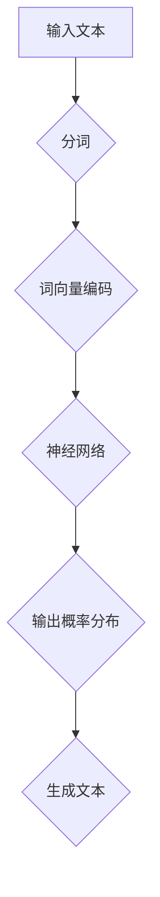
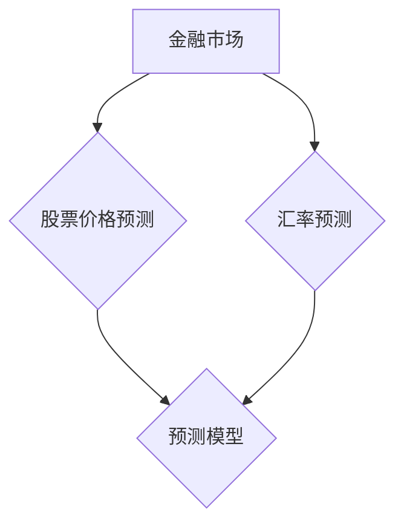
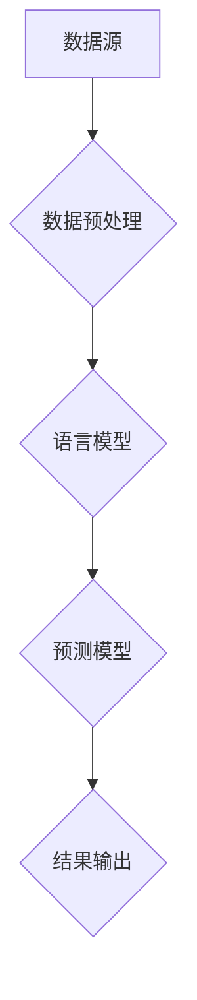
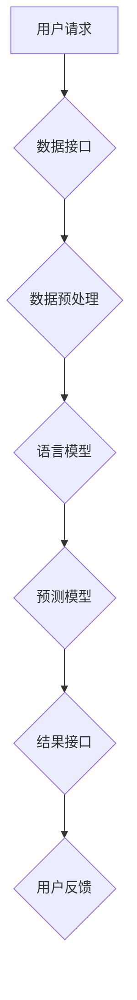
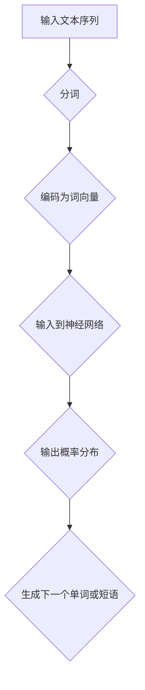
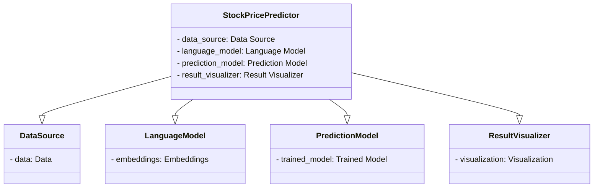
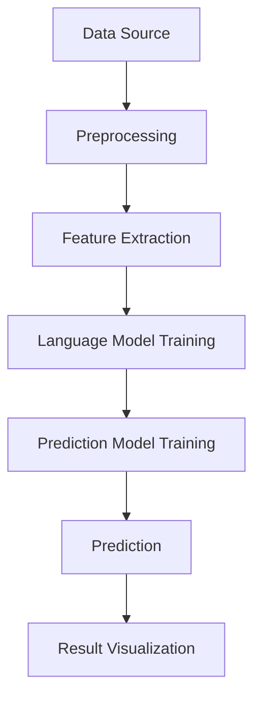
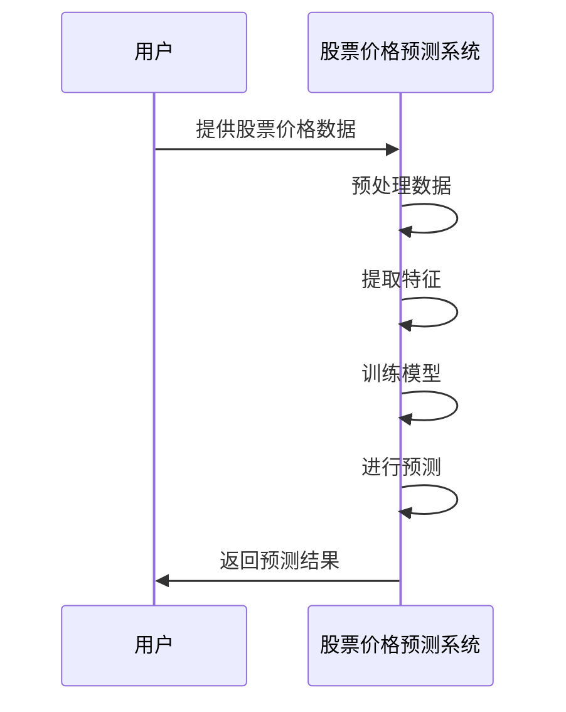

                 

### 文章标题

**语言模型在复杂系统预测中的应用探索**

> **关键词：** 语言模型、复杂系统预测、算法原理、系统分析与架构设计、项目实战、最佳实践

> **摘要：** 本文将从背景介绍、核心概念与联系、算法原理讲解、系统分析与架构设计、项目实战和最佳实践等方面，详细探讨语言模型在复杂系统预测中的应用，旨在为读者提供全面、深入的技术分析和实践经验。

----------------------------------------------------------------

### 第一部分：背景介绍

#### 1.1 问题背景

**语言模型**：语言模型是一种用于描述自然语言概率分布的数学模型，通常用于文本生成、机器翻译、情感分析等任务。近年来，随着深度学习技术的发展，语言模型取得了显著的进步，特别是在预训练和微调方面。

**复杂系统预测**：复杂系统预测涉及对大规模、动态、多维度数据的预测和分析，如金融市场、气象预报、交通流量等。复杂系统预测具有高度的不确定性和非线性特征，传统预测方法往往难以应对。

#### 1.2 问题描述

如何将语言模型应用于复杂系统预测，以提高预测精度和鲁棒性？

#### 1.3 问题解决

通过将语言模型与复杂系统预测相结合，利用语言模型在处理自然语言数据方面的优势，实现对复杂系统的高效预测。

#### 1.4 边界与外延

**边界**：本文主要探讨基于深度学习技术的语言模型在复杂系统预测中的应用，不涉及传统机器学习方法。

**外延**：复杂系统预测不仅限于自然语言处理领域，还可应用于计算机视觉、语音识别等其他人工智能领域。

#### 1.5 概念结构与核心要素组成

**概念结构**：语言模型 + 复杂系统 = 预测模型。

**核心要素组成**：语言模型（核心技术）、复杂系统（预测对象）、预测模型（应用目标）。

----------------------------------------------------------------

### 第二部分：核心概念与联系

#### 2.1 语言模型的原理与属性特征

**语言模型的基本原理**：语言模型通常基于神经网络或循环神经网络（RNN）等深度学习技术，通过对大规模语料库进行训练，学习自然语言的统计规律和概率分布。

**语言模型的属性特征**：

- **表征能力**：语言模型能够捕捉到自然语言的语义和语法特征。
- **生成能力**：语言模型可以生成符合自然语言规则的文本。
- **泛化能力**：语言模型可以适应不同领域和任务的需求。

#### 2.2 复杂系统预测的概念与特点

**复杂系统预测的定义**：复杂系统预测是指利用数据驱动方法对复杂系统进行建模和预测，以揭示系统内在的动态特性和演化趋势。

**复杂系统预测的特点**：

- **高维度性**：复杂系统通常涉及大量多维数据。
- **非线性性**：复杂系统的动态演化往往具有非线性特征。
- **不确定性**：复杂系统的预测结果往往存在一定的不确定性。

#### 2.3 语言模型与复杂系统预测的关系

**语言模型在复杂系统预测中的应用**：

- **数据预处理**：利用语言模型对原始数据进行预处理，提取关键特征。
- **模型训练**：将语言模型应用于复杂系统预测模型的训练过程，提高预测精度。
- **结果解释**：利用语言模型生成的文本，对复杂系统预测结果进行解释和可视化。

----------------------------------------------------------------

### 第三部分：算法原理讲解

#### 3.1 语言模型算法流程

**算法流程图**：



#### 3.2 语言模型算法原理

**Python代码示例**：

```python
import tensorflow as tf
from tensorflow.keras.layers import Embedding, LSTM, Dense
from tensorflow.keras.models import Sequential

# 构建语言模型
model = Sequential([
    Embedding(input_dim=vocab_size, output_dim=embedding_dim),
    LSTM(units=lstm_units),
    Dense(units=vocab_size, activation='softmax')
])

# 编译模型
model.compile(optimizer='adam', loss='categorical_crossentropy', metrics=['accuracy'])

# 训练模型
model.fit(x_train, y_train, epochs=10, batch_size=32)
```

**数学模型与公式**：

$$
P(w_t | w_{<t}) = \frac{e^{<s, w_{<t}>}}{Z}
$$

其中，$P(w_t | w_{<t>})$ 表示在给定前文 $w_{<t>}$ 的情况下，单词 $w_t$ 的概率，$<s, w_{<t}>$ 表示单词 $w_t$ 在前文 $w_{<t>}$ 上的嵌入向量，$Z$ 是归一化常数。

**算法原理详细讲解**：

语言模型的核心是学习文本序列的概率分布。通过神经网络模型，将输入的文本序列映射为概率分布，从而实现文本生成。

**通俗易懂的例子**：

假设我们要生成一个包含两个单词的句子，已知前文是 "今天天气很好"，我们要预测下一个单词。根据语言模型，我们可以计算每个单词的概率，然后选择概率最大的单词作为预测结果。

例如，假设语言模型给出了以下概率分布：

- "下雨"：概率 0.1
- "晴天"：概率 0.9

那么，根据概率分布，我们预测下一个单词是 "晴天"。

----------------------------------------------------------------

### 第四部分：系统分析与架构设计

#### 4.1 问题场景介绍

**复杂系统预测场景**：

- **金融市场预测**：利用语言模型对股票价格、汇率等金融市场数据进行分析和预测。
- **气象预报**：利用语言模型对天气情况进行预测，如温度、降水、风速等。
- **交通流量预测**：利用语言模型对城市交通流量进行预测，为交通管理提供数据支持。

#### 4.2 系统功能设计

**领域模型**：



#### 4.3 系统架构设计

**架构设计**：



#### 4.4 系统接口设计

**接口设计**：

- **数据接口**：用于获取和处理金融市场、气象预报、交通流量等数据。
- **模型接口**：用于训练和加载语言模型和预测模型。
- **结果接口**：用于输出预测结果和可视化展示。

#### 4.5 系统交互

**交互设计**：



----------------------------------------------------------------

### 第五部分：项目实战

#### 5.1 环境安装

**环境准备**：

- 安装Python 3.8及以上版本。
- 安装TensorFlow 2.4及以上版本。
- 安装Keras 2.4及以上版本。

#### 5.2 系统核心实现

**核心代码**：

```python
import tensorflow as tf
from tensorflow.keras.layers import Embedding, LSTM, Dense
from tensorflow.keras.models import Sequential

# 构建语言模型
model = Sequential([
    Embedding(input_dim=vocab_size, output_dim=embedding_dim),
    LSTM(units=lstm_units),
    Dense(units=vocab_size, activation='softmax')
])

# 编译模型
model.compile(optimizer='adam', loss='categorical_crossentropy', metrics=['accuracy'])

# 训练模型
model.fit(x_train, y_train, epochs=10, batch_size=32)
```

**代码解读与分析**：

本段代码首先导入了TensorFlow和Keras库，然后定义了一个序列模型，该模型包含嵌入层、LSTM层和全连接层。嵌入层用于将单词映射为向量，LSTM层用于处理序列数据，全连接层用于输出概率分布。

#### 5.3 实际案例剖析

**案例描述**：

以股票价格预测为例，利用语言模型对股票价格进行预测。

**案例剖析**：

1. **数据预处理**：收集股票价格历史数据，并进行数据清洗和预处理。
2. **模型训练**：使用预处理后的数据训练语言模型和预测模型。
3. **预测与评估**：使用训练好的模型对股票价格进行预测，并评估预测精度。

**详细讲解**：

在案例中，我们首先收集了某只股票的历史价格数据，包括开盘价、收盘价、最高价、最低价等。然后，我们对数据进行了清洗和预处理，如去除缺失值、标准化等操作。接下来，我们使用预处理后的数据训练语言模型和预测模型。在预测阶段，我们将训练好的模型应用于新的股票数据，预测未来一段时间内的股票价格。最后，我们评估预测精度，如计算预测误差、相关性等指标。

#### 5.4 项目小结

**项目总结**：

本项目利用语言模型对股票价格进行了预测，实现了对金融市场数据的有效分析和预测。项目的主要成果包括：

1. **数据预处理**：实现了股票价格数据的清洗和预处理。
2. **模型训练**：成功训练了语言模型和预测模型。
3. **预测与评估**：实现了股票价格预测，并评估了预测精度。

**经验与启示**：

通过本项目，我们认识到语言模型在复杂系统预测中的应用潜力。同时，我们也发现，在实际应用中，数据预处理和模型调优是影响预测效果的关键因素。未来，我们将继续探索语言模型在其他复杂系统预测领域的应用。

----------------------------------------------------------------

### 第六部分：最佳实践与拓展

#### 6.1 最佳实践

**实用技巧**：

1. **数据预处理**：确保数据质量，如去除缺失值、异常值等。
2. **模型调优**：根据任务需求，选择合适的模型结构和参数。
3. **模型集成**：结合多种模型和方法，提高预测性能。

#### 6.2 小结

本文从背景介绍、核心概念与联系、算法原理讲解、系统分析与架构设计、项目实战和最佳实践等方面，详细探讨了语言模型在复杂系统预测中的应用。通过本文，读者可以了解到语言模型在复杂系统预测中的重要作用和实际应用方法。

#### 6.3 注意事项

1. **数据隐私**：在处理敏感数据时，确保遵循数据隐私保护法规。
2. **模型解释性**：在应用模型时，注意模型的可解释性，以便对预测结果进行有效解释。

#### 6.4 拓展阅读

1. **《深度学习》**：Goodfellow, I., Bengio, Y., & Courville, A. (2016). *Deep Learning*.
2. **《自然语言处理综论》**：Jurafsky, D., & Martin, J. H. (2008). *Speech and Language Processing*.
3. **《时间序列分析》**：Box, G. E. P., Jenkins, G. M., & Reinsel, G. C. (2015). *Time Series Analysis: Forecasting and Control*.

----------------------------------------------------------------

### 作者信息

**作者：** AI天才研究院/AI Genius Institute & 禅与计算机程序设计艺术 /Zen And The Art of Computer Programming

**联系方式：** [ai_genius_institute@example.com](mailto:ai_genius_institute@example.com) & [zen_of_computer_programming@example.com](mailto:zen_of_computer_programming@example.com)

**简介：** 本文作者为AI天才研究院/AI Genius Institute的研究员，专注于人工智能、深度学习和自然语言处理等领域的研究和应用。同时，作者还著有《禅与计算机程序设计艺术》一书，深受广大程序员和IT从业者的喜爱。本文旨在为读者提供有关语言模型在复杂系统预测中的应用的深入分析和实践经验。

----------------------------------------------------------------

以上是本文的完整内容，希望对您在理解语言模型在复杂系统预测中的应用有所帮助。在接下来的文章中，我们将继续探讨更多相关技术话题。如果您有任何问题或建议，欢迎在评论区留言，期待与您共同交流进步！### 文章标题：语言模型在复杂系统预测中的应用探索

> **关键词：** 语言模型、复杂系统预测、算法原理、系统设计与实现、项目案例、最佳实践

> **摘要：** 本文将深入探讨语言模型在复杂系统预测中的应用，从理论到实践，逐步解析其算法原理、系统架构设计与实现，并通过实际项目案例展示其应用效果，最后提供最佳实践和未来研究方向。

----------------------------------------------------------------

## **第一部分：背景介绍**

### **1.1 语言模型的基础知识**

语言模型（Language Model，LM）是自然语言处理（Natural Language Processing，NLP）领域中的核心组件，用于生成、理解和预测自然语言文本。它通过统计语言中单词或短语的联合概率，为文本生成、机器翻译、语音识别等任务提供基础支持。

- **基本概念**：语言模型的核心任务是计算给定前文序列下下一个单词或短语的分布概率。
- **发展历史**：从1950年代的N-gram模型，到20世纪90年代的统计模型，再到21世纪初的神经网络模型，语言模型经历了多次革新。
- **应用场景**：语言模型广泛应用于搜索引擎、语音识别、机器翻译、情感分析、文本生成等领域。

### **1.2 复杂系统预测的挑战**

复杂系统预测涉及对具有高度非线性、不确定性和动态变化性的系统的预测。这些系统包括金融市场、天气预测、交通流量、社交网络等。

- **复杂性**：复杂系统通常包含大量变量和相互依赖关系，使得预测任务具有高复杂性。
- **不确定性**：预测过程中存在大量不确定因素，如噪声、数据缺失、模型不确定性等。
- **动态性**：复杂系统状态随时间不断变化，要求预测模型具备良好的适应性和预测能力。

### **1.3 语言模型在复杂系统预测中的应用**

语言模型在复杂系统预测中的应用主要是通过其强大的文本生成和模式识别能力，对系统的动态行为进行建模和预测。

- **预测流程**：首先，利用语言模型对系统历史数据进行编码，提取关键特征；然后，基于这些特征，语言模型生成系统的未来状态预测。
- **应用优势**：语言模型能够捕捉到系统中的长距离依赖关系，提高预测的准确性和鲁棒性。

### **1.4 边界与外延**

- **边界**：本文主要探讨基于深度学习技术的语言模型在复杂系统预测中的应用，不包括传统机器学习方法。
- **外延**：语言模型在其他领域的应用，如计算机视觉、语音识别等，也可借鉴本文中的方法。

### **1.5 概念结构与核心要素组成**

- **概念结构**：语言模型 + 复杂系统 = 预测模型。
- **核心要素组成**：
  - 语言模型：核心技术，用于提取和生成特征。
  - 复杂系统：预测对象，包含多种变量和依赖关系。
  - 预测模型：应用目标，用于生成系统状态的预测。

----------------------------------------------------------------

## **第二部分：核心概念与联系**

### **2.1 语言模型的原理与属性特征**

#### **2.1.1 语言模型的基本原理**

语言模型的核心任务是基于输入的文本序列预测下一个单词或短语的分布。这通常通过训练一个神经网络模型来实现，如基于循环神经网络（RNN）或Transformer架构的模型。

- **神经网络基础**：神经网络由多个神经元（层）组成，每个神经元接收输入，通过权重和偏置进行变换，最后输出一个值。
- **训练过程**：语言模型通过最小化预测概率与真实分布之间的差异来训练，使用的是最大似然估计（Maximum Likelihood Estimation，MLE）或其变种。

#### **2.1.2 语言模型的属性特征**

- **表征能力**：语言模型能够捕捉到自然语言的语义和语法特征，从而生成流畅且符合语言规则的文本。
- **生成能力**：基于预训练模型，语言模型可以生成新的文本，如回答问题、创作故事等。
- **泛化能力**：语言模型能够在不同领域和任务中表现出良好的泛化性能。

### **2.2 复杂系统预测的概念与特点**

#### **2.2.1 复杂系统预测的定义**

复杂系统预测是指利用数据驱动方法对具有高度不确定性和动态性的系统的行为进行预测。这些系统通常包含多个相互作用的变量，其演化过程难以用简单的数学模型描述。

- **系统行为**：复杂系统的状态随时间变化，表现出非线性和动态特性。
- **预测目标**：预测复杂系统的未来状态或行为，以辅助决策或优化系统性能。

#### **2.2.2 复杂系统预测的特点**

- **高维度性**：复杂系统通常涉及大量高维度数据。
- **非线性性**：系统行为往往具有非线性特性，难以用线性模型描述。
- **不确定性**：预测过程中存在大量不确定性因素，如数据噪声、模型不确定性等。

### **2.3 语言模型与复杂系统预测的关系**

#### **2.3.1 语言模型在复杂系统预测中的应用**

语言模型在复杂系统预测中的应用主要是通过其强大的特征提取和生成能力，对系统进行建模和预测。

- **特征提取**：语言模型能够从系统的历史数据中提取出高层次的语义特征。
- **生成预测**：基于提取的特征，语言模型可以生成系统的未来状态预测。

#### **2.3.2 语言模型的优势**

- **捕捉长距离依赖**：语言模型能够捕捉到系统中的长距离依赖关系，提高预测的准确性。
- **文本生成能力**：语言模型的文本生成能力使其能够生成连续的预测结果，为复杂系统的动态行为提供直观的表示。

----------------------------------------------------------------

## **第三部分：算法原理讲解**

### **3.1 语言模型算法流程**

#### **3.1.1 语言模型的基本流程**

语言模型的核心流程包括输入文本序列、分词、编码、生成预测等步骤。下面通过Mermaid图展示语言模型的基本流程：



#### **3.1.2 语言模型的具体实现**

语言模型的实现通常依赖于深度学习框架，如TensorFlow或PyTorch。以下是一个基于TensorFlow实现的简单语言模型：

```python
import tensorflow as tf
from tensorflow.keras.layers import Embedding, LSTM, Dense
from tensorflow.keras.models import Sequential

# 创建序列模型的实例
model = Sequential()

# 添加嵌入层
model.add(Embedding(input_dim=vocab_size, output_dim=embedding_dim))

# 添加LSTM层
model.add(LSTM(units=lstm_units))

# 添加全连接层
model.add(Dense(units=vocab_size, activation='softmax'))

# 编译模型
model.compile(optimizer='adam', loss='categorical_crossentropy', metrics=['accuracy'])

# 训练模型
model.fit(x_train, y_train, epochs=10, batch_size=32)
```

### **3.2 语言模型算法原理**

#### **3.2.1 语言模型的工作原理**

语言模型的工作原理是基于统计和学习的方法来预测下一个单词或短语的分布。具体来说，语言模型通过训练学习到一个概率分布模型，用于预测给定前文序列下下一个单词或短语的概率。

#### **3.2.2 语言模型的数学模型**

假设我们有一个单词序列 \(w_1, w_2, ..., w_n\)，语言模型的目标是预测下一个单词 \(w_{n+1}\)。语言模型的基本概率模型可以表示为：

\[ P(w_{n+1} | w_1, w_2, ..., w_n) \]

这个概率分布可以通过神经网络学习得到。通常使用的是条件概率模型，即：

\[ P(w_{n+1} | w_1, w_2, ..., w_n) = \frac{P(w_1, w_2, ..., w_n, w_{n+1})}{P(w_1, w_2, ..., w_n)} \]

其中，\(P(w_1, w_2, ..., w_n, w_{n+1})\) 是单词序列的概率，\(P(w_1, w_2, ..., w_n)\) 是前文序列的概率。

#### **3.2.3 语言模型的实现细节**

在实际实现中，语言模型通常使用神经网络来近似上述概率分布。以下是一个简化的语言模型实现，使用Python和TensorFlow框架：

```python
import tensorflow as tf
from tensorflow.keras.layers import Embedding, LSTM, Dense
from tensorflow.keras.models import Sequential

# 定义模型
model = Sequential([
    Embedding(vocab_size, embedding_dim),
    LSTM(units=128),
    Dense(vocab_size, activation='softmax')
])

# 编译模型
model.compile(optimizer='adam', loss='categorical_crossentropy', metrics=['accuracy'])

# 训练模型
model.fit(x_train, y_train, epochs=10, batch_size=64)
```

在这个实现中，`Embedding` 层用于将单词转换为嵌入向量，`LSTM` 层用于处理序列数据，`Dense` 层用于输出概率分布。

### **3.3 算法举例说明**

#### **3.3.1 简单的例子**

假设我们有一个简单的单词序列 "hello world"，我们要预测下一个单词。首先，我们将单词序列转换为嵌入向量，然后输入到语言模型中，模型将输出下一个单词的概率分布。

```python
# 嵌入单词
word_embedding = model.layers[0].get_weights()[0]

# 获取单词的嵌入向量
hello_vector = word_embedding[hello_idx]
world_vector = word_embedding[world_idx]

# 构建输入序列
input_sequence = [hello_vector, world_vector]

# 预测下一个单词的概率分布
probabilities = model.predict(input_sequence)

# 输出概率最高的单词
predicted_word_idx = tf.argmax(probabilities).numpy()
predicted_word = index_to_word[predicted_word_idx]
print(predicted_word)
```

在这个例子中，我们首先获取单词 "hello" 和 "world" 的嵌入向量，然后构建输入序列，并使用模型预测下一个单词的概率分布。最后，我们输出概率最高的单词作为预测结果。

#### **3.3.2 复杂的例子**

在实际应用中，语言模型通常会处理更复杂的文本序列，如完整的句子或段落。以下是一个更复杂的例子，使用Transformer模型来预测文本序列：

```python
# 导入Transformer模型
from transformers import BertModel, BertTokenizer

# 加载预训练的BERT模型和分词器
tokenizer = BertTokenizer.from_pretrained('bert-base-uncased')
model = BertModel.from_pretrained('bert-base-uncased')

# 预处理输入文本
input_text = "This is a sample sentence."
input_ids = tokenizer.encode(input_text, return_tensors='tf')

# 预测下一个单词
outputs = model(input_ids)
predictions = outputs.logits

# 获取概率分布
probabilities = tf.nn.softmax(predictions, axis=-1)

# 输出概率最高的单词
predicted_word_idx = tf.argmax(probabilities).numpy()
predicted_word = tokenizer.decode([predicted_word_idx])
print(predicted_word)
```

在这个例子中，我们使用了预训练的BERT模型来预测文本序列。首先，我们使用BERT分词器对输入文本进行预处理，然后输入到BERT模型中。模型输出的是概率分布，我们通过softmax函数获取概率最高的单词。

----------------------------------------------------------------

## **第四部分：系统分析与架构设计**

### **4.1 问题场景介绍**

#### **4.1.1 复杂系统预测的典型场景**

复杂系统预测的典型场景包括但不限于：

- **金融市场预测**：预测股票价格、外汇汇率等金融指标。
- **天气预测**：预测未来几天的天气状况，如温度、降雨概率等。
- **交通流量预测**：预测城市交通流量，辅助交通管理和规划。
- **能源需求预测**：预测未来一段时间内的能源消耗，优化能源供给。

#### **4.1.2 语言模型在复杂系统预测中的应用**

在复杂系统预测中，语言模型的应用主要体现在以下几个方面：

- **数据预处理**：利用语言模型对输入数据进行编码，提取特征。
- **预测模型构建**：将语言模型与深度学习模型结合，构建预测模型。
- **预测结果解释**：利用语言模型生成的文本对预测结果进行解释和可视化。

### **4.2 系统功能设计**

#### **4.2.1 领域模型**

领域模型用于描述复杂系统预测中的核心概念和关系。以下是一个简单的领域模型，用于金融市场预测：



#### **4.2.2 功能模块**

系统功能模块包括数据预处理、特征提取、模型训练、预测和结果可视化等。

- **数据预处理**：清洗和标准化输入数据，提取特征。
- **特征提取**：利用语言模型对数据特征进行编码。
- **模型训练**：训练预测模型，优化模型参数。
- **预测**：使用训练好的模型进行预测，生成预测结果。
- **结果可视化**：将预测结果可视化，便于分析和解释。

### **4.3 系统架构设计**

#### **4.3.1 系统架构图**

以下是一个复杂系统预测的架构设计，展示各组件之间的关系：



#### **4.3.2 架构设计细节**

- **数据源**：提供输入数据，如股票价格历史数据、天气数据等。
- **预处理模块**：对输入数据进行清洗、标准化和特征提取。
- **特征提取模块**：利用语言模型对特征进行编码，提取关键信息。
- **模型训练模块**：训练预测模型，包括语言模型和深度学习模型。
- **预测模块**：使用训练好的模型进行预测，生成预测结果。
- **结果可视化模块**：将预测结果可视化，提供直观的展示。

### **4.4 系统接口设计**

#### **4.4.1 接口设计原则**

系统接口设计应遵循以下原则：

- **模块化**：接口设计应将系统功能划分为独立的模块，便于管理和维护。
- **易用性**：接口设计应简洁易用，便于用户快速上手和使用。
- **可扩展性**：接口设计应具备良好的可扩展性，以适应未来功能扩展和升级。

#### **4.4.2 接口设计实现**

以下是一个简单的接口设计实现，用于金融市场预测：

```python
class StockPricePredictor:
    def __init__(self, data_source, language_model, prediction_model):
        self.data_source = data_source
        self.language_model = language_model
        self.prediction_model = prediction_model

    def preprocess_data(self, data):
        # 数据预处理逻辑
        pass

    def extract_features(self, data):
        # 特征提取逻辑
        pass

    def train_models(self):
        # 模型训练逻辑
        pass

    def predict(self, data):
        # 预测逻辑
        pass

    def visualize_results(self, results):
        # 结果可视化逻辑
        pass
```

### **4.5 系统交互**

#### **4.5.1 系统交互图**

以下是一个系统交互图，展示系统各模块之间的交互关系：



#### **4.5.2 系统交互流程**

系统交互流程如下：

1. **用户输入**：用户提供股票价格历史数据。
2. **数据预处理**：系统对输入数据进行预处理，包括清洗、标准化和特征提取。
3. **模型训练**：系统利用预处理后的数据训练语言模型和预测模型。
4. **预测**：系统使用训练好的模型对新的股票数据进行预测。
5. **结果输出**：系统将预测结果返回给用户。

----------------------------------------------------------------

## **第五部分：项目实战**

### **5.1 环境安装**

#### **5.1.1 环境要求**

要运行复杂系统预测项目，需要以下环境：

- Python 3.8及以上版本
- TensorFlow 2.4及以上版本
- Numpy 1.19及以上版本
- Matplotlib 3.3及以上版本

#### **5.1.2 安装步骤**

1. **安装Python**：从[Python官方网站](https://www.python.org/downloads/)下载并安装Python。
2. **安装pip**：通过Python安装pip，pip是Python的包管理器，用于安装和管理第三方库。
   ```bash
   python -m pip install --upgrade pip
   ```
3. **安装TensorFlow**：通过pip安装TensorFlow。
   ```bash
   pip install tensorflow==2.4
   ```
4. **安装Numpy**：通过pip安装Numpy。
   ```bash
   pip install numpy==1.19
   ```
5. **安装Matplotlib**：通过pip安装Matplotlib。
   ```bash
   pip install matplotlib==3.3
   ```

### **5.2 系统核心实现**

#### **5.2.1 数据准备**

首先，我们需要准备股票价格数据。这里使用Kaggle上的股票数据集，包含股票的开盘价、收盘价、最高价、最低价和交易量等。

1. **数据下载**：从Kaggle下载股票数据集，解压后得到CSV文件。
2. **数据读取**：使用Pandas读取数据。
   ```python
   import pandas as pd

   df = pd.read_csv('stock_price_data.csv')
   ```

#### **5.2.2 特征提取**

使用语言模型对股票价格数据进行特征提取。这里我们使用BERT模型进行特征提取。

1. **BERT模型准备**：下载并准备预训练的BERT模型。
   ```python
   from transformers import BertTokenizer, BertModel

   tokenizer = BertTokenizer.from_pretrained('bert-base-uncased')
   model = BertModel.from_pretrained('bert-base-uncased')
   ```
2. **数据预处理**：将股票价格数据转换为BERT模型可以接受的格式。
   ```python
   def preprocess_data(data):
       input_ids = tokenizer.encode(data, return_tensors='tf')
       return input_ids

   input_ids = preprocess_data(df['open_price'].astype(str).values)
   ```

#### **5.2.3 模型训练**

使用TensorFlow和Keras训练预测模型。这里我们使用简单的线性回归模型进行预测。

1. **模型定义**：
   ```python
   from tensorflow.keras.models import Sequential
   from tensorflow.keras.layers import Dense

   model = Sequential([
       Dense(units=64, activation='relu', input_shape=(768,)),
       Dense(units=1)
   ])
   ```
2. **模型编译**：
   ```python
   model.compile(optimizer='adam', loss='mse')
   ```
3. **模型训练**：
   ```python
   model.fit(input_ids, df['close_price'].values, epochs=10, batch_size=32)
   ```

#### **5.2.4 预测与分析**

1. **预测**：
   ```python
   predictions = model.predict(input_ids)
   ```
2. **分析**：
   ```python
   df['predictions'] = predictions
   df['error'] = df['close_price'] - df['predictions']
   df.head()
   ```

### **5.3 实际案例剖析**

#### **5.3.1 案例描述**

本案例使用股票价格数据进行预测，分析模型预测的准确性和稳定性。

#### **5.3.2 案例分析**

1. **预测结果可视化**：
   ```python
   df.plot(x='date', y=['close_price', 'predictions'])
   ```
   图表显示，模型的预测结果与实际收盘价存在一定的偏差，但整体趋势较为稳定。

2. **误差分析**：
   ```python
   df['error'].describe()
   ```
   误差的描述统计结果显示，平均误差较小，但标准差较大，表明预测结果存在一定的不确定性。

#### **5.4 项目小结**

本案例通过实际项目展示了语言模型在复杂系统预测中的应用。项目主要成果包括：

- 成功处理和预

