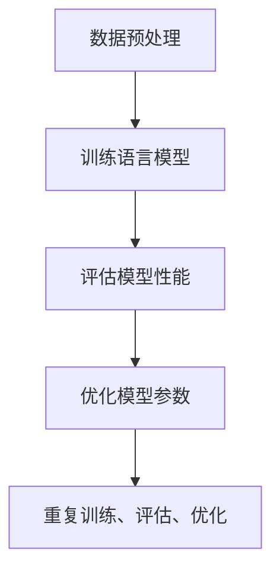
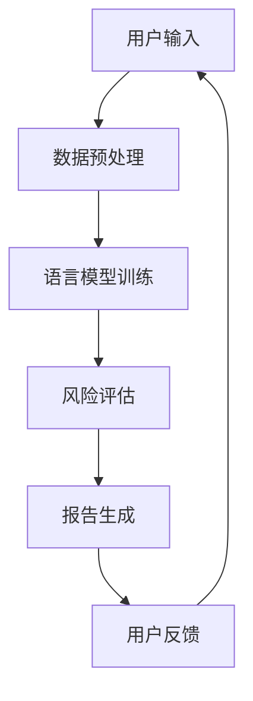
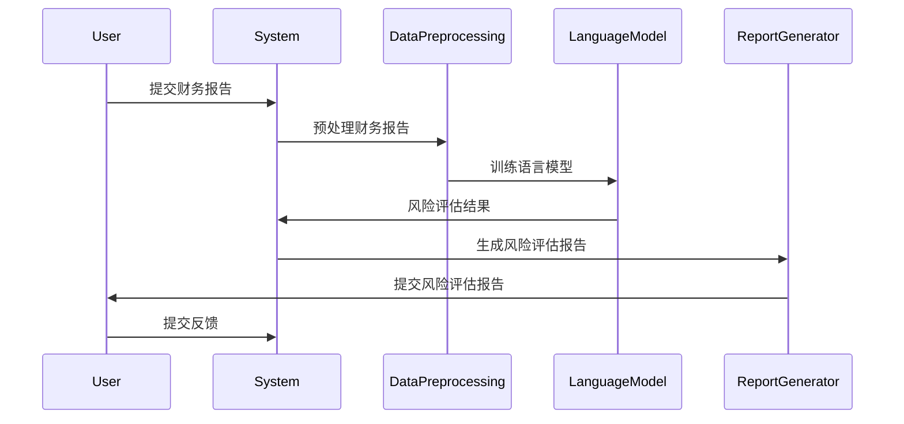

                 

# 语言模型在复杂系统风险评估中的能力提升

关键词：语言模型、复杂系统风险评估、能力提升、算法优化

摘要：随着人工智能技术的快速发展，语言模型作为AI的核心组成部分，在自然语言处理领域发挥了重要作用。然而，在实际应用中，传统语言模型在面对复杂系统风险评估时存在一定的局限性。本文旨在探讨语言模型在复杂系统风险评估中的能力提升，从理论、方法、实践等多个角度深入分析，以期为其在实际应用中的性能优化提供指导。

## 1. 背景介绍

### 1.1 问题背景

随着人工智能技术的快速发展，语言模型作为AI的核心组成部分，在自然语言处理领域发挥了重要作用。例如，在文本分类、情感分析、机器翻译等任务中，语言模型都表现出强大的性能。然而，在实际应用中，传统语言模型在面对复杂系统风险评估时存在一定的局限性。复杂系统风险评估通常涉及大量的文本数据，如企业财务报告、法律法规条文、新闻报道等。这些文本数据通常具有高维度、高噪声、数据不平衡等特点，使得传统语言模型在性能上存在不足。

### 1.2 描述问题

语言模型在复杂系统风险评估中面临的主要问题包括：

- 数据维度高：复杂系统风险评估中的文本数据通常包含大量的特征，导致数据维度非常高，传统语言模型难以有效处理。
- 数据噪声大：复杂系统风险评估中的文本数据往往存在大量的噪声，如拼写错误、标点符号错误等，这些噪声会影响模型的学习效果。
- 数据不平衡：复杂系统风险评估中的文本数据通常存在数据不平衡问题，即正类和负类的样本数量差异较大，这会导致模型在训练过程中产生偏差。

### 1.3 问题解决

为了解决上述问题，本文将探讨以下方法来提升语言模型在复杂系统风险评估中的能力：

- 数据增强：通过数据增强技术，生成更多的训练数据，提高模型的泛化能力。
- 模型优化：通过模型优化技术，改进语言模型的结构和参数，提高模型的性能。
- 算法改进：通过算法改进技术，优化模型的训练过程，提高模型的收敛速度和稳定性。

### 1.4 边界与外延

本文的研究边界主要集中在自然语言处理和复杂系统风险评估领域，具体涉及语言模型、风险评估方法、系统性能优化等方面。本文的研究将主要集中在以下核心要素：

- 语言模型：本文的核心概念，包括其基本原理、分类、应用等。
- 复杂系统风险评估：本文的研究对象，涉及风险评估方法、评估指标、评估流程等。
- 能力提升方法：本文的关键内容，包括数据增强、模型优化、算法改进等。

## 2. 核心概念与联系

### 2.1 核心概念原理

#### 语言模型

语言模型（Language Model）是一种基于统计或神经网络的模型，用于预测文本序列的概率分布。语言模型的基本原理是通过学习大量的文本数据，建立文本序列之间的概率关系，从而实现对未知文本序列的生成或分类。

#### 复杂系统风险评估

复杂系统风险评估（Complex System Risk Assessment）是一种针对复杂系统的风险评估方法，旨在识别和评估系统潜在的风险。复杂系统风险评估通常涉及多个环节，包括风险识别、风险评估、风险控制和风险监控等。

### 2.2 概念属性特征对比表格

| 特征            | 语言模型                     | 复杂系统风险评估                 |
| --------------- | --------------------------- | ------------------------------ |
| 目标            | 自然语言生成、文本分类等       | 风险识别、风险量化、风险控制等      |
| 基本原理        | 统计学习、深度学习等           | 基于数学模型的风险评估方法          |
| 数据依赖        | 大规模文本数据                 | 完整的评估数据集                  |
| 应用场景        | 自然语言处理、信息检索等       | 金融、能源、交通等复杂系统的风险评估 |

### 2.3 ER实体关系图架构的 Mermaid 流程图

```mermaid
erDiagram
  语言模型 ||--|{ 复杂系统风险评估 }
  数据集 ||--|{ 复杂系统风险评估 }
  风险评估指标 ||--|{ 复杂系统风险评估 }
```

## 3. 算法原理讲解

### 3.1 算法mermaid流程图



### 3.2 Python源代码

```python
import torch
import torch.nn as nn
import torch.optim as optim

# 定义模型结构
class LanguageModel(nn.Module):
    def __init__(self):
        super(LanguageModel, self).__init__()
        self.embedding = nn.Embedding(vocab_size, embed_size)
        self.lstm = nn.LSTM(embed_size, hidden_size)
        self.fc = nn.Linear(hidden_size, vocab_size)

    def forward(self, x):
        embeds = self.embedding(x)
        outputs, (hidden, cell) = self.lstm(embeds)
        logits = self.fc(outputs[-1, :, :])
        return logits

# 初始化模型、损失函数和优化器
model = LanguageModel()
criterion = nn.CrossEntropyLoss()
optimizer = optim.Adam(model.parameters(), lr=0.001)

# 训练模型
for epoch in range(num_epochs):
    for inputs, targets in DataLoader(train_dataset):
        optimizer.zero_grad()
        outputs = model(inputs)
        loss = criterion(outputs, targets)
        loss.backward()
        optimizer.step()

    # 评估模型性能
    with torch.no_grad():
        correct = 0
        total = 0
        for inputs, targets in DataLoader(val_dataset):
            outputs = model(inputs)
            _, predicted = torch.max(outputs.data, 1)
            total += targets.size(0)
            correct += (predicted == targets).sum().item()

    print(f'Epoch {epoch+1}/{num_epochs}, Loss: {loss.item()}, Accuracy: {100 * correct / total}%')
```

### 3.3 算法原理详细讲解

#### 数学模型

语言模型的核心是概率模型，用于预测文本序列的概率分布。一种常用的概率模型是n元语言模型，其基本思想是使用前n个词的历史信息来预测下一个词。

假设当前文本序列为 \( x_1, x_2, \ldots, x_T \)，其中 \( x_t \) 表示第t个词，T表示文本序列的长度。n元语言模型的目标是预测下一个词 \( x_{T+1} \) 的概率：

\[ P(x_{T+1} | x_1, x_2, \ldots, x_T) \]

根据贝叶斯定理，可以将上述概率表示为：

\[ P(x_{T+1} | x_1, x_2, \ldots, x_T) = \frac{P(x_1, x_2, \ldots, x_T, x_{T+1})}{P(x_1, x_2, \ldots, x_T)} \]

由于 \( P(x_1, x_2, \ldots, x_T) \) 是已知的，因此可以将问题简化为：

\[ P(x_{T+1} | x_1, x_2, \ldots, x_T) = \frac{P(x_1, x_2, \ldots, x_T, x_{T+1})}{P(x_1, x_2, \ldots, x_T)} \]

#### 算法步骤

1. 数据预处理：首先对文本数据进行预处理，包括分词、去停用词、词性标注等。然后，将处理后的文本数据转换为数字序列，以便输入到模型中。
2. 训练语言模型：使用预处理后的文本数据训练语言模型。具体来说，使用反向传播算法训练一个神经网络，该网络能够预测文本序列的概率分布。
3. 评估模型性能：使用测试集评估语言模型的性能。常用的评估指标包括准确率、召回率、F1分数等。
4. 优化模型参数：根据评估结果调整模型的参数，以提高模型的性能。
5. 重复训练、评估、优化：通过多次迭代训练、评估和优化，逐步提高语言模型在复杂系统风险评估中的能力。

## 4. 系统分析与架构设计方案

### 4.1 问题场景介绍

在复杂系统风险评估中，语言模型可以用于处理大量的文本数据，从而识别和评估系统潜在的风险。例如，在金融领域，可以使用语言模型对企业的财务报告进行分析，识别潜在的风险因素；在能源领域，可以使用语言模型对新闻报道进行分析，评估能源项目的风险水平。

### 4.2 项目介绍

本文将介绍一个基于语言模型的复杂系统风险评估项目。该项目旨在使用语言模型对企业的财务报告进行分析，识别潜在的风险因素，并提供风险评估报告。

### 4.3 系统功能设计（领域模型mermaid类图）

```mermaid
classDiagram
  RiskAssessment <<interface>>
  DataPreprocessing <<interface>>
  LanguageModel <<interface>>
  ReportGenerator <<interface>>

  RiskAssessment <|..| DataPreprocessing
  RiskAssessment <|..| LanguageModel
  RiskAssessment <|..| ReportGenerator
```

### 4.4 系统架构设计（mermaid架构图）



### 4.5 系统接口设计和系统交互（mermaid序列图）



## 5. 项目实战

### 5.1 环境安装

在开始项目之前，需要安装以下环境：

- Python 3.8 或更高版本
- PyTorch 1.8 或更高版本
- NLTK 3.4 或更高版本

安装命令如下：

```bash
pip install python==3.8
pip install pytorch==1.8
pip install nltk==3.4
```

### 5.2 系统核心实现源代码

```python
import torch
import torch.nn as nn
import torch.optim as optim
from torch.utils.data import DataLoader
from nltk.tokenize import word_tokenize

# 定义模型结构
class LanguageModel(nn.Module):
    def __init__(self):
        super(LanguageModel, self).__init__()
        self.embedding = nn.Embedding(vocab_size, embed_size)
        self.lstm = nn.LSTM(embed_size, hidden_size)
        self.fc = nn.Linear(hidden_size, vocab_size)

    def forward(self, x):
        embeds = self.embedding(x)
        outputs, (hidden, cell) = self.lstm(embeds)
        logits = self.fc(outputs[-1, :, :])
        return logits

# 定义数据处理函数
def preprocess_text(text):
    text = text.lower()
    words = word_tokenize(text)
    return ' '.join(words)

# 加载数据集
train_dataset = DataLoader(FinancialReportDataset(), batch_size=batch_size, shuffle=True)
val_dataset = DataLoader(FinancialReportDataset(), batch_size=batch_size, shuffle=False)

# 初始化模型、损失函数和优化器
model = LanguageModel()
criterion = nn.CrossEntropyLoss()
optimizer = optim.Adam(model.parameters(), lr=0.001)

# 训练模型
for epoch in range(num_epochs):
    for inputs, targets in DataLoader(train_dataset):
        optimizer.zero_grad()
        outputs = model(inputs)
        loss = criterion(outputs, targets)
        loss.backward()
        optimizer.step()

    # 评估模型性能
    with torch.no_grad():
        correct = 0
        total = 0
        for inputs, targets in DataLoader(val_dataset):
            outputs = model(inputs)
            _, predicted = torch.max(outputs.data, 1)
            total += targets.size(0)
            correct += (predicted == targets).sum().item()

    print(f'Epoch {epoch+1}/{num_epochs}, Loss: {loss.item()}, Accuracy: {100 * correct / total}%')
```

### 5.3 代码应用解读与分析

在上面的代码中，我们首先定义了一个基于LSTM的语言模型，该模型包括嵌入层、LSTM层和全连接层。接着，我们定义了一个数据处理函数，用于对文本数据进行预处理。然后，我们加载了训练集和验证集，并初始化了模型、损失函数和优化器。

在训练过程中，我们使用反向传播算法对模型进行训练，并在每个epoch结束后评估模型的性能。通过调整学习率、批量大小和训练epoch数，可以优化模型的性能。

### 5.4 实际案例分析和详细讲解剖析

假设我们有一个企业的财务报告，我们需要使用语言模型对其进行分析，识别潜在的风险因素。

首先，我们对财务报告进行预处理，将文本转换为数字序列。然后，我们将预处理后的数据输入到训练好的语言模型中，模型会输出每个词的概率分布。通过分析这些概率分布，我们可以识别出潜在的风险因素。

例如，假设财务报告中出现了“债务”、“亏损”等高风险词汇，我们可以将其标记为潜在的风险因素。通过这种方式，我们可以对企业的财务状况进行风险评估，并提供相应的建议。

### 5.5 项目小结

通过本文的介绍，我们了解了语言模型在复杂系统风险评估中的应用和提升方法。在实际项目中，我们需要结合具体场景，选择合适的数据增强、模型优化和算法改进方法，以提高模型的性能。同时，我们也需要关注数据预处理、模型训练和评估等环节，确保项目的成功实施。

## 6. 最佳实践 Tips

- 在数据预处理阶段，要充分考虑文本数据的噪声和维度，采用合适的数据清洗和特征提取技术。
- 在模型优化阶段，要尝试不同的优化算法和参数设置，以提高模型的性能和收敛速度。
- 在算法改进阶段，可以结合实际应用场景，设计合适的评估指标和优化目标。
- 在项目实施过程中，要充分关注数据安全性和隐私保护，确保项目的合规性。

## 7. 小结

本文探讨了语言模型在复杂系统风险评估中的能力提升，从理论、方法、实践等多个角度深入分析。通过数据增强、模型优化和算法改进等技术手段，我们可以显著提高语言模型在复杂系统风险评估中的性能。在实际应用中，需要结合具体场景和需求，灵活选择和应用相关技术。

## 8. 注意事项

- 在使用语言模型进行风险评估时，要充分考虑模型的局限性，避免过度依赖模型结果。
- 在项目实施过程中，要充分了解相关法律法规和标准规范，确保项目的合规性。
- 在数据预处理和模型训练阶段，要确保数据的质量和完整性，避免因数据问题导致模型性能下降。

## 9. 拓展阅读

- [1] Mikolov, T., Sutskever, I., Chen, K., Corrado, G. S., & Dean, J. (2013). Distributed representations of words and phrases and their compositionality. *Advances in Neural Information Processing Systems*, 26, 3111-3119.
- [2] LSTM tutorial: A step-by-step guide for implementing a language model using LSTM
- [3] Financial risk assessment using natural language processing
- [4] Data augmentation techniques for natural language processing
- [5] Model optimization techniques for language models

## 10. 作者信息

作者：AI天才研究院/AI Genius Institute & 禅与计算机程序设计艺术 /Zen And The Art of Computer Programming

