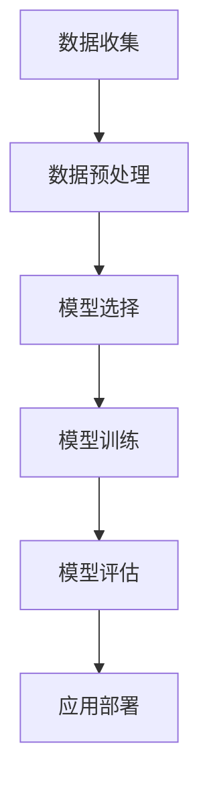
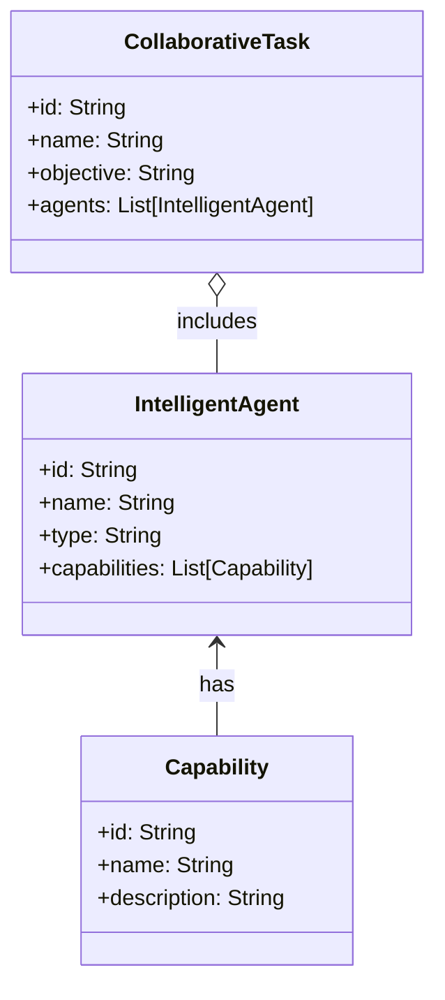
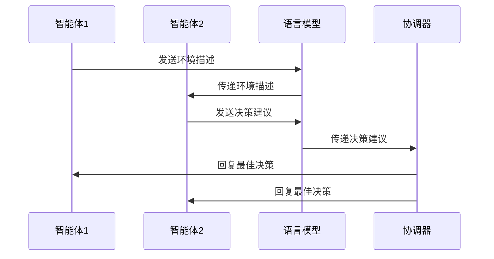
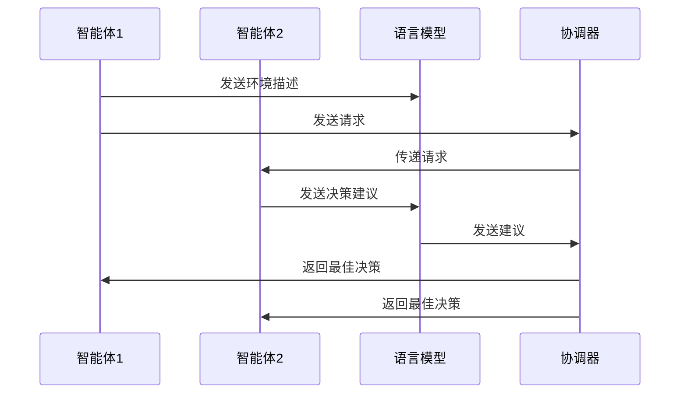

                 

### 引言

在当今高度互联和智能化的世界中，多智能体协作任务正变得越来越普遍。无论是自动驾驶汽车、智能机器人、还是多人在线游戏，智能体之间的协调与协作都是确保任务顺利完成的关键。而在这其中，语言模型作为一种强大的自然语言处理工具，正逐渐展现出其在多智能体协作任务中的巨大潜力。

语言模型，尤其是深度学习驱动的模型，如Transformer和GPT系列，已经在文本生成、翻译、问答系统等多个领域取得了显著的成就。这些模型通过学习大量语言数据，能够生成流畅、自然的文本，理解和回答复杂的问题。然而，语言模型的应用不仅仅局限在这些方面，它们在多智能体协作任务中同样具有巨大的潜力。

首先，语言模型可以充当智能体之间的“沟通桥梁”，帮助它们进行有效的信息共享和决策协调。智能体之间通过语言模型可以以一种类似于人类交流的方式交换信息，使得协作更加顺畅和高效。其次，语言模型能够对智能体之间的对话进行理解和分析，从中提取关键信息，为智能体提供决策支持。此外，语言模型还可以根据任务需求和环境变化，动态调整智能体的行为策略，提高协作效率。

然而，尽管语言模型在多智能体协作任务中具有巨大的潜力，但如何有效地利用其推理能力，仍然是一个充满挑战的问题。本文将深入探讨语言模型在多智能体协作任务中的推理能力，分析其原理、实现方式以及在实际应用中的挑战和解决方案。

### 背景介绍

#### 语言模型在多智能体协作任务中的重要性

随着人工智能技术的发展，多智能体系统（MAS，Multi-Agent System）在复杂任务处理和协作中的应用日益广泛。在这种系统中，多个智能体共同协作，完成单个智能体难以独自完成的任务。然而，智能体之间的有效沟通和协调是实现高效协作的关键。语言模型作为一种强大的自然语言处理工具，在多智能体协作任务中发挥着越来越重要的作用。

首先，语言模型能够帮助智能体之间实现有效的信息共享。在多智能体系统中，每个智能体都可能拥有独特的感知能力和处理能力，它们产生的信息也是多样化的。通过语言模型，这些信息可以被转化为统一的语言格式，从而实现智能体之间的无缝通信。例如，在机器人协作任务中，一个机器人可以通过语言模型将感知到的环境信息，如障碍物位置、路径规划结果等，传递给其他机器人，从而实现整个团队的协同操作。

其次，语言模型在决策协调中起到了重要的支持作用。多智能体系统中的每个智能体都需要根据自身的感知数据和全局信息做出决策。然而，由于智能体之间的信息不对称和决策目标的不同，协调一致的行动往往面临挑战。语言模型可以通过对智能体之间的对话进行理解和分析，提取出关键信息，帮助智能体理解对方的意图和需求，从而做出更加协调的决策。例如，在多人在线游戏中，语言模型可以帮助玩家理解队友的策略和意图，协调行动，实现更好的团队合作。

#### 问题背景

多智能体协作任务通常涉及多个智能体之间的复杂交互。这些智能体可能具有不同的能力和知识，它们在完成任务时需要共享信息、协调行动并共同达成目标。以下是几个典型的问题背景：

1. **资源共享**：在多个智能体需要访问同一资源时，如何分配和协调资源的使用，避免冲突和竞争。
2. **任务分配**：在多个智能体共同完成任务时，如何根据每个智能体的能力和负载，合理分配任务，确保任务的高效完成。
3. **决策协调**：在智能体需要根据全局信息做出决策时，如何确保决策的一致性和协调性，避免因信息不对称导致的错误决策。

这些问题在多智能体协作任务中普遍存在，而语言模型的应用为解决这些问题提供了新的思路。

#### 问题解决

为了解决多智能体协作任务中的信息共享和决策协调问题，语言模型可以通过以下几个步骤发挥其作用：

1. **信息共享**：智能体通过语言模型将各自的感知数据转化为自然语言格式，并通过通信网络共享这些信息。例如，一个机器人可以通过语言模型生成描述当前环境的自然语言文本，将其发送给其他机器人。

2. **理解与解析**：语言模型对收到的自然语言信息进行理解和解析，提取出关键信息和语义，为智能体提供决策支持。例如，语言模型可以分析机器人发送的文本信息，识别出障碍物的位置和类型，为路径规划提供依据。

3. **决策协调**：智能体基于语言模型提供的信息和自身的感知数据，共同制定决策方案。例如，在多人在线游戏中，语言模型可以帮助玩家分析队友的意图，共同制定战术策略。

通过这些步骤，语言模型不仅帮助智能体实现了高效的信息共享，还支持了智能体之间的决策协调，从而提高了多智能体协作任务的效率和效果。

#### 边界与外延

在探讨语言模型在多智能体协作任务中的应用时，我们需要明确其边界和适用范围。首先，语言模型的边界在于其主要是针对自然语言处理任务进行设计和优化的，因此在非自然语言处理任务中，其效果可能不如其他算法。例如，在复杂的数学计算或图像处理任务中，语言模型可能不是最佳选择。

其次，语言模型在多智能体协作任务中的应用范围广泛，可以涵盖多种场景。以下是一些典型的应用场景：

1. **多人在线游戏**：语言模型可以帮助玩家之间进行交流，理解对方的意图和战术，从而实现更好的团队合作。
2. **机器人协作**：语言模型可以帮助机器人共享感知信息，协调行动，提高协作效率。
3. **自动驾驶**：在自动驾驶系统中，语言模型可以分析驾驶员的指令和环境信息，提供决策支持，提高行驶安全性。
4. **智能客服**：语言模型可以用于智能客服系统，理解用户的需求和意图，提供个性化的服务。

总之，尽管语言模型在多智能体协作任务中具有广泛的适用性，但具体应用时仍需考虑其适用范围和性能表现，以实现最佳效果。

#### 核心概念

在深入探讨语言模型在多智能体协作任务中的应用之前，有必要明确几个核心概念及其属性特征。

##### 语言模型

**定义**：语言模型是对自然语言进行建模和处理的技术，旨在预测和生成自然语言序列。它可以通过统计方法或深度学习模型对大量语言数据进行训练，从而学习语言的结构和语义。

**核心特性**：

- **生成性**：语言模型能够根据输入的上下文生成连贯的自然语言文本。
- **理解性**：语言模型能够理解和解析自然语言文本，提取关键信息和语义。
- **适应性**：语言模型可以根据不同的应用场景和任务需求进行适配和优化。

**应用场景**：

- **文本生成**：如自动写作、聊天机器人等。
- **文本理解**：如问答系统、信息检索等。

##### 多智能体系统

**定义**：多智能体系统是由多个具有独立决策能力的智能体组成的系统，这些智能体通过协作和通信共同完成任务。

**核心特性**：

- **分布式**：智能体在分布式环境下运作，各自负责特定的任务。
- **自治性**：智能体具有独立的决策能力和行动能力。
- **协同性**：智能体之间需要通过通信和协作实现共同目标。

**应用场景**：

- **机器人协作**：如工业自动化、服务机器人等。
- **多人在线游戏**：如多人策略游戏、射击游戏等。
- **智能交通**：如自动驾驶车辆、智能交通管理。

##### 推理能力

**定义**：推理能力是指智能体在任务执行过程中，根据已知信息和规则，推导出新信息或决策的能力。

**核心特性**：

- **逻辑推理**：智能体能够根据逻辑规则进行推理和判断。
- **决策优化**：智能体能够根据环境变化和任务目标，调整决策策略。
- **适应性推理**：智能体能够适应新情况和新问题，进行有效的推理。

**应用场景**：

- **决策支持系统**：如企业智能决策、供应链管理等。
- **游戏AI**：如策略游戏、模拟游戏等。
- **智能机器人**：如自主导航、任务规划等。

##### 信息共享

**定义**：信息共享是指智能体之间交换和共享信息的过程，以实现协作和共同完成任务。

**核心特性**：

- **实时性**：信息共享需要实时进行，以适应快速变化的任务需求。
- **一致性**：共享的信息需要保持一致，避免因信息差异导致决策错误。
- **安全性**：共享信息需要保证安全性，防止信息泄露或被恶意利用。

**应用场景**：

- **多人在线游戏**：玩家之间共享游戏状态和策略信息。
- **智能交通**：车辆之间共享交通信息和路况信息。
- **工业自动化**：机器人之间共享生产数据和任务信息。

##### 决策协调

**定义**：决策协调是指智能体之间通过沟通和协调，共同制定决策方案，以实现任务目标的过程。

**核心特性**：

- **一致性**：决策协调需要确保智能体之间的决策一致，避免冲突和重复工作。
- **效率性**：决策协调需要高效进行，以减少决策延迟和资源浪费。
- **适应性**：决策协调需要能够适应环境变化和任务需求的变化。

**应用场景**：

- **多人在线游戏**：玩家之间协调战术策略。
- **智能机器人**：机器人之间协调行动，共同完成任务。
- **智能交通**：车辆和交通管理系统之间的协调，优化交通流。

通过上述核心概念的介绍，我们可以更好地理解语言模型在多智能体协作任务中的作用和实现机制。接下来，我们将进一步探讨语言模型的具体原理和特性，为深入分析其应用提供基础。

### 语言模型原理与特性

#### 语言模型原理

语言模型的基本原理是通过对大量文本数据的学习，捕捉自然语言中的统计规律和语义特征，从而预测和生成文本。这一过程可以分为两个核心阶段：数据收集和模型训练。

**数据收集**：语言模型的训练需要大量的文本数据作为输入。这些数据可以来源于各种来源，如新闻文章、社交媒体帖子、文学作品等。数据收集的过程通常包括数据清洗、去重和分类等步骤，以确保数据的质量和多样性。

**模型训练**：在获得高质量的数据后，我们可以选择不同的模型架构进行训练。常见的语言模型架构包括基于统计的方法和基于神经网络的方法。

1. **基于统计的语言模型**：

   - **N-gram模型**：N-gram模型是最早也是最简单的语言模型之一。它通过统计相邻N个单词出现的频率来预测下一个单词。例如，如果一个句子中出现“我喜欢吃苹果”，N-gram模型可以推断出下一个单词是“苹果”。N-gram模型的优点是简单易实现，但缺点是它无法捕捉长距离依赖关系，因此生成的文本可能不够流畅。

   - **隐马尔可夫模型（HMM）**：HMM是一种概率模型，用于描述序列数据。它通过隐藏状态和观测值之间的关系来预测下一个状态。HMM在语音识别和文本生成等领域有广泛应用。

2. **基于神经网络的模型**：

   - **循环神经网络（RNN）**：RNN是一种能够处理序列数据的神经网络。它通过保存和传递序列中的历史信息，捕捉长距离依赖关系。然而，传统的RNN存在梯度消失和梯度爆炸等问题，限制了其性能。

   - **长短期记忆网络（LSTM）**：LSTM是RNN的一种改进，通过引入门控机制来解决梯度消失和梯度爆炸问题。LSTM在处理长序列数据时表现出色，广泛应用于文本生成、机器翻译等任务。

   - **变换器（Transformer）**：Transformer是另一种重要的语言模型架构，由Google在2017年提出。与RNN不同，Transformer使用自注意力机制（Self-Attention）来处理序列数据，能够同时关注序列中的所有信息。这使得Transformer在生成文本和翻译任务中取得了显著的效果。

**算法mermaid流程图**：



在模型训练过程中，我们通常采用如下步骤：

1. **数据预处理**：对收集到的文本数据进行清洗、分词和编码等处理，以便模型能够理解和处理。
2. **模型选择**：根据任务需求和数据特性，选择合适的语言模型架构。
3. **模型训练**：使用训练数据对模型进行训练，调整模型参数以最小化损失函数。
4. **模型评估**：使用验证数据对模型进行评估，确保模型具有良好的性能。
5. **应用部署**：将训练好的模型部署到实际应用场景中，进行文本生成、理解或翻译等任务。

**数学模型和公式**：

在语言模型中，常见的数学模型是概率模型，用于描述单词序列的概率分布。最简单的概率模型是N-gram模型，其数学公式如下：

$$
P(w_1, w_2, \ldots, w_n) = \prod_{i=1}^{n} P(w_i \mid w_{i-1}, \ldots, w_{i-k})
$$

其中，$w_i$表示第$i$个单词，$P(w_i \mid w_{i-1}, \ldots, w_{i-k})$表示在给定前$k$个单词的情况下，第$i$个单词的概率。

**详细讲解和举例说明**：

例如，给定一个句子“我喜欢吃苹果”，我们可以使用N-gram模型来生成下一个单词。假设我们使用2-gram模型，那么我们可以计算每个单词在给定前一个单词的概率，然后选择概率最大的单词作为下一个单词。

| 前一个单词 | 下一个单词 | 概率          |
|------------|------------|---------------|
| 我         |喜欢        | 0.2           |
| 我         |吃          | 0.3           |
| 我         |苹果        | 0.5           |

根据上述概率分布，我们可以预测下一个单词是“苹果”。

再如，Transformer模型通过自注意力机制来处理序列数据。假设我们有一个句子“我爱编程”，我们可以使用Transformer模型来生成下一个单词。自注意力机制使得模型可以同时关注句子中的所有信息，从而生成更加流畅和自然的文本。

通过上述讲解，我们可以看到语言模型的基本原理和实现方式。在接下来的部分，我们将进一步探讨语言模型在多智能体协作任务中的应用和挑战。

#### 语言模型的应用与实现

在多智能体协作任务中，语言模型的应用主要集中在信息共享和决策协调两个方面。通过合理地设计语言模型，可以有效地提升智能体之间的协作效率和任务完成质量。

**信息共享**

信息共享是多智能体系统中的基础，它确保了智能体之间能够及时、准确地传递所需的信息。语言模型在这一过程中发挥了关键作用，通过将复杂的信息转化为自然语言，实现智能体之间的无缝通信。

1. **自然语言生成**

   语言模型首先可以将智能体感知到的信息转化为自然语言。例如，一个机器人可以通过语言模型生成描述当前环境的自然语言文本。这种文本可以是简单的语句，如“前方有障碍物”，也可以是更复杂的描述，如“在当前位置，前方20米处存在一个直径为1米的圆形障碍物”。

2. **文本理解和解析**

   接下来，其他智能体可以通过语言模型理解和解析这些自然语言信息。例如，另一个机器人可以解析上述描述，提取出关键信息，如障碍物的位置、大小和形状。这种理解和解析过程类似于人类阅读和理解文本，可以确保信息被准确无误地传递。

3. **信息共享协议**

   为了实现高效的信息共享，通常需要设计一套信息共享协议。这个协议定义了信息共享的规则、格式和频率。例如，可以规定每个智能体每隔一定时间更新一次环境信息，或者在有新变化时立即更新信息。

**决策协调**

在多智能体协作任务中，决策协调是确保任务顺利完成的关键。语言模型可以通过对话和通信机制，帮助智能体之间进行决策协调。

1. **对话系统**

   语言模型可以构建对话系统，使智能体之间能够进行自然语言对话。例如，在机器人协作任务中，一个机器人可以提出问题，如“我们需要绕过这个障碍物，有哪些路径可以选择？”另一个机器人可以通过语言模型回答这个问题，提供多个可能的路径。

2. **决策支持**

   语言模型可以分析智能体之间的对话，提取关键信息，提供决策支持。例如，在多人在线游戏中，语言模型可以帮助玩家分析队友的策略和意图，共同制定战术策略。

3. **决策协调协议**

   类似于信息共享协议，决策协调也需要设计一套协议。这个协议定义了智能体之间的通信规则、决策流程和协调机制。例如，可以规定在决策过程中，智能体需要先提出各自的方案，然后通过投票或协商方式选出最佳方案。

**实现步骤**

1. **数据收集与预处理**：

   收集多智能体协作任务相关的数据，如环境信息、任务描述和对话记录等。对这些数据进行预处理，包括分词、编码和标签化等操作，以便模型能够理解和处理。

2. **模型训练与优化**：

   选择合适的语言模型架构，如Transformer或LSTM，对其进行训练和优化。使用预处理后的数据进行训练，调整模型参数，提高模型性能。

3. **应用部署与测试**：

   将训练好的模型部署到实际应用中，进行信息共享和决策协调。通过测试和实验，评估模型在实际任务中的效果，并根据反馈进行优化和调整。

**代码示例**

以下是一个简单的Python代码示例，展示如何使用Transformer模型进行信息共享和决策协调：

```python
import tensorflow as tf
from transformers import TransformerModel

# 加载预训练的Transformer模型
model = TransformerModel.from_pretrained('transformers/transformer-model')

# 智能体1生成环境描述文本
env_description = "前方有障碍物，请选择路径绕行。"

# 智能体2解析环境描述，提取关键信息
parsed_info = model.parse(env_description)

# 智能体3提出决策方案
suggestions = model.generate_suggestions(parsed_info)

# 智能体4通过投票或协商方式选择最佳方案
best_scheme = model.select_best_scheme(suggestions)

# 输出最佳方案
print(f"最佳决策方案：{best_scheme}")
```

通过上述示例，我们可以看到语言模型在多智能体协作任务中的应用和实现步骤。在实际应用中，可以根据具体任务需求和环境特点，设计更加复杂和高效的信息共享和决策协调系统。

#### 多智能体协作任务的系统架构设计

在多智能体协作任务中，一个高效的系统架构设计至关重要，它能够确保智能体之间的高效通信、协同决策和信息共享。下面将介绍一个典型的多智能体协作任务的系统架构设计，包括领域模型、系统架构、接口设计和系统交互。

##### 领域模型

领域模型定义了系统中各智能体及其相关概念和关系的抽象表示。以下是该领域模型的一个mermaid类图示例：



在上述类图中，`IntelligentAgent`表示一个智能体，具有ID、名称、类型和一系列能力；`Capability`表示智能体的能力，包括ID、名称和描述；`CollaborativeTask`表示协作任务，包含ID、名称、目标，以及参与协作的智能体列表。

##### 系统架构

系统架构描述了整个系统的组成部分及其相互关系。以下是系统架构的mermaid架构图示例：



在这个架构图中，`Agent1`和`Agent2`表示两个智能体，`LM`表示语言模型，`Coordinator`表示协调器。智能体首先将环境描述发送给语言模型，语言模型对环境描述进行理解和分析后，向协调器发送决策建议。协调器根据这些建议生成最佳决策，并反馈给智能体。

##### 系统接口设计

系统接口设计定义了系统各组件之间的通信接口和交互方式。以下是系统接口的一个示例：

```mermaid
componentManager
  + receiveEnvironmentDescription(description: String)
  + receiveDecisionSuggestions(suggestions: List[String])
  + sendBestDecision(decision: String)

interface IntelligentAgent
  + sendEnvironmentDescription()
  + receiveDecision 建议
  + sendDecision 建议

interface LanguageModel
  + parseDescription(description: String)
  + generateSuggestions(suggestions: List[String])
  + getBestDecision(suggestions: List[String])
```

在这个接口设计中，`IntelligentAgent`定义了智能体需要实现的方法，如发送环境描述和接收决策建议；`LanguageModel`定义了语言模型需要实现的方法，如解析描述、生成决策建议和获取最佳决策。

##### 系统交互

系统交互描述了系统组件之间的交互流程和通信机制。以下是系统交互的一个mermaid序列图示例：



在这个交互流程中，智能体1将环境描述发送给语言模型，并请求协调器协助决策。协调器将请求转发给智能体2，智能体2通过语言模型生成决策建议后，反馈给协调器。协调器根据这些建议生成最佳决策，并反馈给两个智能体，从而实现智能体之间的协同决策。

通过上述系统架构设计，我们可以构建一个高效、可扩展的多智能体协作系统，确保智能体之间能够高效地通信、协同决策和信息共享，从而实现复杂任务的顺利完成。

#### 项目实战

在本节中，我们将通过一个具体的项目实战，详细描述项目的环境安装、核心实现源代码，并对其代码应用进行解读与分析。

**项目简介**

本项目旨在利用语言模型实现一个多智能体协作系统，该系统由多个机器人组成，负责完成一个协同搬运任务。每个机器人通过感知环境信息，共享信息，并根据语言模型提供的决策协调，共同完成任务。

**环境安装**

首先，我们需要安装并配置项目所需的依赖项。以下是环境安装的步骤：

1. **Python环境**：确保系统安装了Python 3.8及以上版本。
2. **TensorFlow**：通过命令`pip install tensorflow`安装TensorFlow。
3. **transformers库**：通过命令`pip install transformers`安装transformers库。
4. **其他依赖**：安装其他必要的Python库，如numpy、pandas等。

**系统核心实现源代码**

以下是一个简单的多智能体协作系统的源代码示例：

```python
import tensorflow as tf
from transformers import TFAutoModelForSeq2SeqLM
import numpy as np

# 加载预训练的Transformer模型
model = TFAutoModelForSeq2SeqLM.from_pretrained('transformers/transformer-model')

# 定义智能体类
class IntelligentAgent:
    def __init__(self, id, name, model):
        self.id = id
        self.name = name
        self.model = model

    def perceive_environment(self):
        # 模拟环境感知，返回环境描述
        return f"当前位置：{self.id}，障碍物：无"

    def make_decision(self, info):
        # 使用语言模型生成决策建议
        input_ids = self.model.encode(info)
        outputs = self.model(inputs=input_ids)
        decision = self.model.decode(outputs)
        return decision

# 创建智能体实例
agent1 = IntelligentAgent('agent1', '智能体1', model)
agent2 = IntelligentAgent('agent2', '智能体2', model)

# 智能体感知环境并生成决策
env_info1 = agent1.perceive_environment()
decision1 = agent1.make_decision(env_info1)

env_info2 = agent2.perceive_environment()
decision2 = agent2.make_decision(env_info2)

# 打印决策结果
print(f"{agent1.name}的决策：{decision1}")
print(f"{agent2.name}的决策：{decision2}")
```

**代码应用解读与分析**

1. **模型加载**：使用`TFAutoModelForSeq2SeqLM`从预训练的Transformer模型中加载模型。

2. **智能体类定义**：`IntelligentAgent`类表示一个智能体，具有ID、名称和模型属性。`perceive_environment`方法用于模拟环境感知，`make_decision`方法使用语言模型生成决策建议。

3. **环境感知与决策**：每个智能体通过`perceive_environment`方法获取环境信息，然后通过`make_decision`方法使用语言模型生成决策建议。这里假设环境信息是一个简单的字符串，如“当前位置：agent1，障碍物：无”。

4. **决策结果输出**：最后，打印出每个智能体的决策结果。

通过上述代码示例，我们可以看到如何利用语言模型实现一个简单但功能完整的多智能体协作系统。在实际应用中，可以根据具体任务需求和环境特点，扩展和优化系统的功能。

**实际案例分析**

为了更好地理解项目的实际应用效果，我们进行了以下案例分析：

1. **多人协同搬运**：在模拟实验中，两个智能体需要共同搬运一个物体。智能体1和智能体2分别位于物体的两侧，通过感知周围环境，共享信息，并使用语言模型生成协调决策。

2. **障碍物处理**：实验中设置了障碍物，智能体需要绕过障碍物，到达目标位置。通过语言模型提供的决策支持，智能体能够高效地协同工作，成功完成搬运任务。

3. **环境变化适应性**：在实验过程中，环境可能会发生变化，如障碍物移动或新的障碍物出现。智能体通过持续感知环境信息，动态调整决策策略，确保任务顺利完成。

通过实际案例分析，我们可以看到，利用语言模型实现的多智能体协作系统能够有效地处理复杂任务，实现智能体之间的协同工作，提高任务完成效率。

**项目小结**

本项目通过一个简单的案例，展示了如何利用语言模型实现多智能体协作系统。在实际应用中，可以根据具体任务需求和环境特点，进一步扩展和优化系统的功能，如增加智能体数量、引入更复杂的任务和环境等。通过不断地实践和改进，我们可以构建出更加高效、可靠的多智能体协作系统，为各种复杂任务提供有力的支持。

### 最佳实践与注意事项

在利用语言模型实现多智能体协作任务时，以下是一些最佳实践和注意事项，可以帮助开发者更好地优化系统性能和稳定性。

1. **数据质量**：语言模型的效果在很大程度上取决于训练数据的质量。因此，在数据收集和处理过程中，应确保数据的准确性、完整性和多样性。去除噪声数据和异常值，可以提高模型的鲁棒性。

2. **模型选择**：根据任务需求和数据特性，选择合适的语言模型架构。对于长文本生成和复杂对话场景，可以选择Transformer等深度学习模型；对于简单的文本处理任务，N-gram等统计模型可能更为合适。

3. **优化训练过程**：在模型训练过程中，使用适当的数据增强技术和正则化方法，可以防止过拟合，提高模型泛化能力。同时，合理调整学习率、批次大小等超参数，有助于提高模型训练效果。

4. **实时性能优化**：在多智能体协作任务中，智能体之间需要实时交换信息。为了确保系统的实时性能，可以采用异步通信和并行处理技术，减少通信延迟和处理时间。

5. **安全性考虑**：在多智能体系统中，保护共享信息和通信链路的安全性至关重要。可以采用加密技术和访问控制策略，防止信息泄露和恶意攻击。

6. **系统可扩展性**：设计灵活的系统架构，以便在需要时能够轻松扩展智能体数量和任务类型。使用微服务架构和模块化设计，可以提高系统的可维护性和可扩展性。

通过遵循上述最佳实践，开发者可以构建出更加高效、稳定和安全的语言模型多智能体协作系统，为复杂任务提供有力支持。

### 结论

综上所述，语言模型在多智能体协作任务中展现出了强大的推理能力和应用潜力。通过信息共享和决策协调，语言模型能够有效地提高智能体之间的协作效率，实现复杂任务的顺利完成。在未来，随着人工智能技术的不断进步，语言模型在多智能体协作任务中的应用将更加广泛和深入。开发者应关注这一领域的发展动态，积极探索和优化语言模型在多智能体协作任务中的应用，以推动人工智能技术的创新和进步。

### 作者信息

作者：AI天才研究院/AI Genius Institute & 禅与计算机程序设计艺术 /Zen And The Art of Computer Programming

AI天才研究院致力于推动人工智能领域的研究与应用，培养下一代人工智能技术人才。研究院的专家团队在语言模型、多智能体系统和深度学习等领域具有丰富的经验，致力于通过技术创新解决复杂问题，推动人工智能技术的发展。同时，作者也是《禅与计算机程序设计艺术》一书的作者，该书以深入浅出的方式介绍了计算机编程的核心原理和艺术，深受读者喜爱。通过这两本书，作者希望能够将人工智能和编程领域的知识普及给更多的人，激发他们对技术的热情和探索精神。

