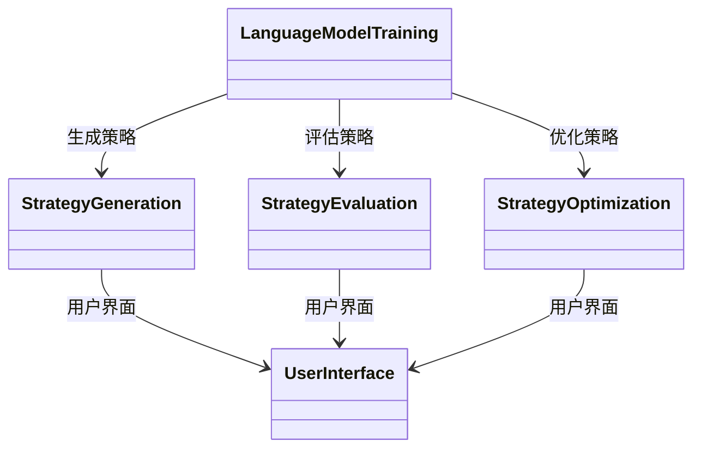
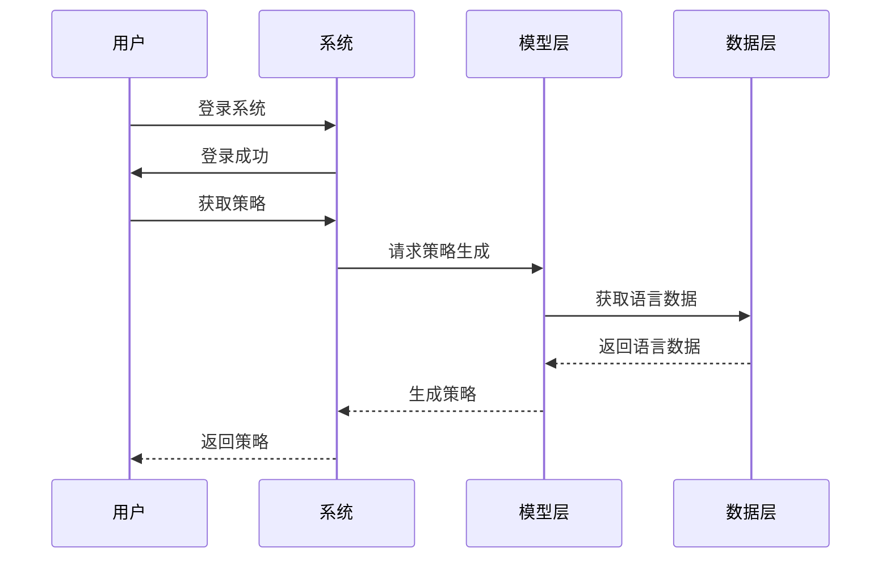

                 


### 引言

#### 1.1 问题背景与意义

在现代信息技术和人工智能快速发展的背景下，多智能体博弈（Multi-Agent Game）作为分布式智能系统中的一个重要研究方向，正逐渐成为学术界和工业界关注的焦点。多智能体系统由多个智能体（agent）组成，这些智能体通过相互协作或竞争来实现特定目标。而博弈论作为研究决策者如何在策略空间中做出决策的理论，为多智能体系统的策略设计提供了坚实的理论基础。

语言模型（Language Model）是自然语言处理（Natural Language Processing, NLP）领域的一种核心技术，通过对大量语言数据的建模，能够生成具有自然语言特点的文本。近年来，随着深度学习技术的发展，基于神经网络的语言模型，如Transformer和BERT等，取得了显著的成果。这些先进的语言模型在文本生成、机器翻译、问答系统等领域表现出了强大的能力。

将语言模型应用于多智能体博弈策略生成与优化，是一个极具创新性和挑战性的研究领域。一方面，语言模型可以生成复杂的策略文本，为多智能体系统提供丰富的决策依据；另一方面，语言模型在处理不确定性和动态环境时具有独特的优势，能够为智能体的自适应行为提供支持。

本文将围绕“语言模型在多智能体博弈策略生成与优化中的创新”这一主题，详细探讨语言模型在该领域的应用，旨在为研究人员和实践者提供有价值的参考。

#### 1.2 目标与内容概述

本文的主要目标是研究语言模型在多智能体博弈策略生成与优化中的应用，具体内容包括：

1. **背景介绍**：介绍语言模型和多智能体博弈的基本概念，明确问题的研究意义和应用场景。
2. **核心概念与联系**：详细阐述语言模型和多智能体博弈的基本概念、原理及它们之间的联系。
3. **算法原理讲解**：深入分析语言模型在多智能体博弈策略生成与优化中的应用算法，包括数学模型和公式，以及详细的例子说明。
4. **系统分析与架构设计**：介绍如何将语言模型应用于多智能体博弈的系统架构设计。
5. **项目实战**：通过实际项目案例，展示语言模型在多智能体博弈策略生成与优化中的实际应用。
6. **最佳实践与总结**：提供最佳实践建议，总结本书的主要内容，并给出未来的研究方向和拓展阅读。

本文适合对自然语言处理、多智能体博弈和系统架构设计感兴趣的读者，无论是研究人员还是开发人员，都可以从中获得宝贵的知识和经验。

### 语言模型基础

#### 2.1 语言模型基本概念

语言模型（Language Model）是一种统计模型，用于对自然语言文本的概率分布进行建模。它通过分析大量语言数据，学习并预测下一个单词或词组出现的概率。语言模型是自然语言处理（NLP）领域的基础性技术，广泛应用于文本生成、机器翻译、语音识别、问答系统等任务。

语言模型可以分为基于规则和基于统计两大类。基于规则的模型依赖于手工设计的语法规则，如转移文法和上下文无关文法。而基于统计的模型则通过分析大量实际语言数据来学习语言模式，其中最常见的是基于N-gram的模型。N-gram模型通过统计连续N个单词（或字符）出现的频率来预测下一个单词。

近年来，随着深度学习技术的发展，基于神经网络的深度语言模型取得了显著突破。其中，Transformer模型和BERT模型是最具代表性的两个模型。Transformer模型通过自注意力机制（Self-Attention）实现了对输入序列的全局信息捕捉，而BERT模型则通过双向编码器（Bidirectional Encoder Representations from Transformers）实现了对输入序列的上下文理解。

#### 2.2 语言模型原理

语言模型的原理主要基于概率模型和深度学习技术。传统的语言模型如N-gram模型，基于马尔可夫假设，即当前单词的概率只与前面N-1个单词有关。具体来说，N-gram模型通过统计连续N个单词出现的频率来计算下一个单词的概率。

然而，这种基于统计的方法在处理长距离依赖关系时存在局限性。为了解决这一问题，深度学习技术被引入到语言模型中。基于神经网络的深度语言模型，如Transformer和BERT，通过多层神经网络结构对输入序列进行建模，能够更好地捕捉长距离依赖关系。

Transformer模型的核心思想是自注意力机制（Self-Attention）。自注意力机制允许模型在计算每个单词的输出时，对整个输入序列进行加权求和，从而实现全局信息的捕捉。这使得Transformer模型在处理长文本和复杂语言结构时表现出色。

BERT模型则通过双向编码器（Bidirectional Encoder）实现了对输入序列的上下文理解。BERT模型首先通过一个单向Transformer编码器生成前向表示（Forward Representation），然后再通过后向Transformer编码器生成后向表示（Backward Representation）。这两个表示进行拼接后，通过输出层进行分类或预测。

#### 2.3 语言模型性能评估

语言模型的性能评估通常基于多个指标，如困惑度（Perplexity）、准确率（Accuracy）、F1分数（F1 Score）等。困惑度是衡量模型预测能力的一个常见指标，它表示模型对未知数据的预测不确定度。具体来说，困惑度是模型预测概率的负对数，即

$$ PPL = \frac{1}{N} \sum_{i=1}^{N} -\log P(y_i | x_i) $$

其中，\(N\) 是样本数量，\(y_i\) 是实际输出，\(x_i\) 是输入。

准确率和F1分数则主要用于分类任务。准确率表示模型正确预测的样本占总样本的比例，即

$$ Accuracy = \frac{TP + TN}{TP + FN + FP + TN} $$

其中，\(TP\) 表示真正例，\(TN\) 表示真负例，\(FP\) 表示假正例，\(FN\) 表示假负例。

F1分数是准确率和召回率的调和平均值，用于综合评估模型的分类性能。具体来说，

$$ F1 = \frac{2 \times Precision \times Recall}{Precision + Recall} $$

其中，\(Precision\) 表示精确率，即真正例占总正例的比例，\(Recall\) 表示召回率，即真正例占总负例的比例。

除了这些传统指标，近年来，研究者们还提出了许多新的性能评估方法，如基于生成对抗网络（GAN）的评估方法，用于评估模型在生成文本质量上的表现。

#### 2.4 语言模型性能优化

语言模型性能的优化是NLP领域的一个重要研究课题。以下是一些常见的性能优化方法：

1. **数据增强**：通过生成或引入更多的训练数据，可以改善模型的泛化能力。常见的数据增强方法包括同义词替换、随机删除单词、词语重排序等。

2. **模型压缩**：大型深度学习模型往往需要大量的计算资源和存储空间。模型压缩技术，如剪枝（Pruning）、量化（Quantization）、知识蒸馏（Knowledge Distillation）等，可以减少模型的大小，提高推理速度。

3. **预训练与微调**：预训练（Pre-training）是指在大规模语料库上训练深度语言模型，然后再针对特定任务进行微调（Fine-tuning）。这种方法可以充分利用预训练模型在语言知识上的积累，提高特定任务的性能。

4. **多任务学习**：多任务学习（Multi-Task Learning）通过同时训练多个任务，可以共享任务之间的知识，提高模型的泛化能力。常见的方法包括共享模型权重、共享嵌入层等。

5. **优化算法**：优化算法的选择对模型的收敛速度和性能有很大影响。常见的优化算法包括随机梯度下降（SGD）、Adam优化器、Adagrad等。

通过这些优化方法，研究者们可以显著提高语言模型在文本生成、机器翻译、问答系统等任务上的性能，从而推动NLP技术的进一步发展。

### 多智能体博弈基本概念

#### 3.1 多智能体系统概述

多智能体系统（Multi-Agent System，MAS）是由多个智能体组成的系统，这些智能体可以通过相互通信和协作来实现共同的目标。智能体（Agent）是具有感知、决策和执行能力的实体，可以是一个程序、一个机器人、甚至是一个人类用户。在多智能体系统中，智能体之间通过通信协议进行交互，以实现系统的整体目标。

多智能体系统可以分为多种类型，如协同型（Cooperative）、竞争型（Competitive）、竞争协同型（Competitive-Cooperative）等。协同型智能体系统强调智能体之间的协作和共同目标，而竞争型智能体系统则强调智能体之间的对抗和竞争。竞争协同型智能体系统则同时包含协作和竞争的元素。

多智能体系统的特点包括：

1. **分布式**：智能体可以在不同的地理位置进行操作，系统具有高度的可扩展性和容错性。
2. **异构性**：智能体可以是异构的，具有不同的感知能力、决策能力和执行能力。
3. **动态性**：智能体的状态和行为可以随着时间和环境的变化而动态变化。
4. **自主性**：智能体具有自主性，可以根据自己的感知和决策进行独立操作。

多智能体系统在许多领域都有广泛的应用，如机器人调度、智能交通系统、经济市场模型、社交网络分析等。通过多智能体的协作和竞争，可以实现复杂问题的求解和优化。

#### 3.2 多智能体博弈概念

多智能体博弈（Multi-Agent Game）是一种在多智能体系统中，智能体通过相互竞争或协作来最大化自身利益的决策过程。博弈论为多智能体博弈提供了理论框架和方法，研究智能体在博弈环境中的策略选择和协作机制。

多智能体博弈的基本概念包括：

1. **智能体**：参与博弈的实体，具有独立的感知、决策和执行能力。
2. **策略**：智能体在博弈中采取的行动方案，通常由一组决策规则组成。
3. **状态**：博弈过程中系统所处的特定情形，包括智能体的位置、资源分布等。
4. **行动**：智能体在特定状态下可以采取的动作，如移动、攻击、防御等。
5. **奖励**：智能体在特定状态下的收益或损失，用于评估智能体策略的有效性。

多智能体博弈可以分为以下几种类型：

1. **零和博弈**：参与博弈的智能体之间具有直接的对抗关系，一方的收益等于另一方的损失。
2. **非零和博弈**：参与博弈的智能体之间的收益可以相互独立，没有直接的对抗关系。
3. **完全信息博弈**：所有智能体都能观察到其他智能体的行动和状态。
4. **不完全信息博弈**：智能体不能完全观察到其他智能体的行动和状态，存在信息不对称。

多智能体博弈在许多实际应用中具有重要意义，如电子游戏、经济学、社会网络分析等。通过研究多智能体博弈策略和协作机制，可以更好地理解和解决复杂系统中的决策问题。

#### 3.3 多智能体博弈分析方法

多智能体博弈的分析方法主要包括博弈论、优化算法和机器学习技术。以下是对这些方法的详细介绍：

1. **博弈论方法**：博弈论是一种研究决策者在特定策略空间中做出决策的理论，适用于分析多智能体博弈。博弈论的基本概念包括策略、均衡、支付等。常用的博弈论方法包括纳什均衡（Nash Equilibrium）、贝叶斯均衡（Bayesian Equilibrium）和演化博弈（Evolutionary Game Theory）等。纳什均衡是指所有参与者在给定其他参与者策略的情况下，无法通过单方面改变策略来获得更多收益的状态。贝叶斯均衡考虑了参与者的不确定性和信息不对称。演化博弈则通过模拟参与者的进化过程，研究策略的稳定性和适应性。

2. **优化算法方法**：优化算法是一种通过寻找最优解来解决问题的方法，适用于解决多智能体博弈中的决策问题。常见的优化算法包括线性规划（Linear Programming，LP）、动态规划（Dynamic Programming，DP）、遗传算法（Genetic Algorithm，GA）等。线性规划和动态规划适用于解决具有明确数学模型的问题，可以通过求解优化问题来找到智能体的最优策略。遗传算法是一种基于生物进化原理的优化算法，通过模拟自然选择和遗传机制，逐步优化智能体的策略，以实现整体收益的最大化。

3. **机器学习方法**：机器学习技术是一种通过学习历史数据来预测和决策的方法，适用于解决多智能体博弈中的不确定性和动态性问题。常见的机器学习方法包括监督学习（Supervised Learning）、无监督学习（Unsupervised Learning）和强化学习（Reinforcement Learning）等。监督学习通过训练数据来学习预测模型，适用于预测博弈结果和策略选择。无监督学习通过分析未标记的数据来发现数据模式，适用于发现智能体的潜在策略。强化学习通过奖励机制引导智能体学习最优策略，适用于动态环境和不确定环境。

综合运用博弈论、优化算法和机器学习技术，可以更好地分析和解决多智能体博弈问题。博弈论提供理论基础和策略分析方法，优化算法提供求解最优策略的工具，机器学习技术提供自适应和鲁棒性策略。这些方法的有机结合，可以推动多智能体博弈研究的发展，并为实际应用提供有效的解决方案。

### 语言模型在多智能体博弈策略生成中的应用

#### 4.1 语言模型在策略生成中的应用

语言模型在多智能体博弈策略生成中的应用是一种创新性方法，通过利用语言模型强大的文本生成能力，智能体可以生成复杂的博弈策略。具体来说，语言模型在策略生成中的应用主要包括以下几个方面：

1. **策略文本生成**：语言模型可以生成具有复杂结构和策略意图的文本，这些文本可以作为智能体的决策依据。例如，在电子游戏《星际争霸》中，语言模型可以生成对抗性策略，智能体根据这些策略进行实时决策，从而提高游戏的策略多样性和竞争性。

2. **策略规划**：在多智能体系统中，智能体需要根据环境变化和对手行为制定长期策略。语言模型可以通过生成一系列决策步骤，帮助智能体规划出最优策略。这种方法尤其适用于动态环境，智能体可以根据最新的环境信息调整策略，实现自适应博弈。

3. **策略评估**：语言模型可以用于评估不同策略的优劣，通过生成并分析各种策略文本，智能体可以评估其策略的有效性。这种方法可以帮助智能体在博弈过程中不断优化自身策略，提高整体竞争力。

#### 4.2 语言模型在策略生成中的优势

语言模型在策略生成中具有以下优势：

1. **复杂策略生成**：语言模型可以生成复杂的策略文本，这些文本包含多种决策步骤和条件分支，能够应对多样化的博弈环境。相比传统的规则方法，语言模型生成的策略具有更高的灵活性和适应性。

2. **自适应能力**：语言模型能够根据环境变化和对手行为动态调整策略，具有较强的自适应能力。在动态环境中，智能体可以根据实时信息生成新的策略，实现与环境的实时互动。

3. **资源利用**：语言模型可以通过大规模预训练和微调，利用大量的语言数据进行训练，从而提高策略生成能力。这种方法可以充分利用已有的数据资源，减少手动编写规则的工作量。

4. **跨领域应用**：语言模型具有通用性，可以应用于不同领域和场景的博弈策略生成。例如，在金融市场中，语言模型可以生成交易策略；在无人驾驶领域，语言模型可以生成导航策略。

#### 4.3 语言模型在策略生成中的挑战与解决方案

尽管语言模型在策略生成中具有显著优势，但也面临一些挑战：

1. **数据依赖**：语言模型的性能高度依赖于训练数据的质量和数量。在博弈策略生成中，可能缺乏足够的训练数据，特别是在特定的博弈场景中。为了解决这个问题，可以通过数据增强、模拟生成和迁移学习等方法来扩充训练数据。

2. **不确定性处理**：博弈过程中存在不确定性和动态变化，语言模型在处理这些不确定性时可能面临困难。为了解决这个问题，可以引入概率模型和不确定性推理方法，如贝叶斯网络和蒙特卡洛方法，以提高语言模型在不确定环境中的适应性。

3. **策略解释性**：语言模型生成的策略通常是非解释性的，即模型内部决策过程难以解释。为了提高策略的可解释性，可以结合规则方法和模型解释技术，如因果图和LIME（Local Interpretable Model-agnostic Explanations），以帮助用户理解策略的生成过程。

4. **计算资源消耗**：大规模语言模型在生成策略时需要大量的计算资源，这在实际应用中可能成为瓶颈。为了降低计算资源消耗，可以采用模型压缩、量化和技术优化方法，如量化蒸馏和模型剪枝，以提高模型的推理效率。

通过克服这些挑战，语言模型在多智能体博弈策略生成中的应用将更加广泛和深入，为智能系统提供强大的策略生成能力。

### 语言模型在多智能体博弈策略优化中的应用

#### 5.1 语言模型在策略优化中的应用

在多智能体博弈中，策略优化是提高智能体竞争力和适应性的关键步骤。语言模型通过其强大的文本生成和推理能力，可以为智能体的策略优化提供有力支持。以下是语言模型在策略优化中的具体应用：

1. **策略文本生成**：语言模型可以生成具有复杂策略意图的文本，智能体根据这些文本进行策略优化。例如，在电子竞技游戏中，语言模型可以生成对抗性策略文本，智能体通过学习这些文本来调整自身策略，提高游戏表现。

2. **策略评估与比较**：语言模型可以生成多种策略文本，智能体通过比较这些策略文本的优劣，选择最优策略进行优化。这种方法能够帮助智能体在复杂的博弈环境中找到最优策略，提高整体竞争力。

3. **策略迭代与改进**：语言模型可以用于策略的迭代优化。智能体在每次博弈后，通过语言模型生成新的策略文本，进行评估和优化。这种方法可以实现策略的逐步改进，使智能体在长期的博弈中不断提高策略质量。

#### 5.2 语言模型在策略优化中的优势

语言模型在策略优化中具有以下优势：

1. **灵活性**：语言模型可以生成多种策略文本，提供丰富的决策选项，使智能体能够在复杂环境中灵活调整策略。

2. **自适应能力**：语言模型可以根据最新的博弈信息和对手行为动态生成策略文本，实现自适应策略优化。这种能力在动态博弈环境中尤为重要。

3. **可解释性**：相比于传统的黑箱模型，语言模型生成的策略文本具有更高的可解释性，用户可以更容易理解策略的生成过程和决策依据。

4. **资源利用**：语言模型可以通过大规模预训练和微调，高效利用大量的语言数据，从而提高策略优化的性能和效率。

5. **跨领域应用**：语言模型具有通用性，可以应用于不同领域和场景的博弈策略优化。例如，在金融市场中，语言模型可以优化交易策略；在无人驾驶领域，语言模型可以优化导航策略。

#### 5.3 语言模型在策略优化中的挑战与解决方案

尽管语言模型在策略优化中具有显著优势，但也面临一些挑战：

1. **数据依赖**：语言模型的性能高度依赖于训练数据的质量和数量。在策略优化中，可能缺乏足够的训练数据，特别是在特定的博弈场景中。为了解决这个问题，可以通过数据增强、模拟生成和迁移学习等方法来扩充训练数据。

2. **不确定性处理**：博弈过程中存在不确定性和动态变化，语言模型在处理这些不确定性时可能面临困难。为了解决这个问题，可以引入概率模型和不确定性推理方法，如贝叶斯网络和蒙特卡洛方法，以提高语言模型在不确定环境中的适应性。

3. **计算资源消耗**：大规模语言模型在生成策略时需要大量的计算资源，这在实际应用中可能成为瓶颈。为了降低计算资源消耗，可以采用模型压缩、量化和技术优化方法，如量化蒸馏和模型剪枝，以提高模型的推理效率。

4. **策略解释性**：语言模型生成的策略文本通常是非解释性的，即模型内部决策过程难以解释。为了提高策略的可解释性，可以结合规则方法和模型解释技术，如因果图和LIME（Local Interpretable Model-agnostic Explanations），以帮助用户理解策略的生成过程和决策依据。

通过克服这些挑战，语言模型在多智能体博弈策略优化中的应用将更加广泛和深入，为智能系统提供强大的策略优化能力。

### 项目实战：多智能体博弈策略生成与优化系统开发

#### 6.1 项目介绍

在本项目中，我们旨在开发一个基于语言模型的多智能体博弈策略生成与优化系统。该系统将利用先进的深度学习技术和语言模型，实现智能体在复杂博弈环境中的策略生成与优化。具体来说，项目目标包括：

1. **策略生成**：利用语言模型生成多种博弈策略，为智能体提供丰富的决策选项。
2. **策略优化**：通过评估和比较不同策略，实现智能体策略的优化，提高整体竞争力。
3. **系统架构**：设计并实现一个高效、可扩展的系统架构，支持多种博弈场景的应用。

项目团队由多领域专家组成，包括人工智能专家、软件工程师和博弈论研究者，他们共同协作，确保项目的顺利进行。

#### 6.2 系统功能设计

为了实现项目目标，系统设计了以下主要功能模块：

1. **语言模型训练与加载**：利用大规模语言数据进行预训练，构建高性能的语言模型，并支持模型的加载和更新。
2. **策略生成模块**：利用语言模型生成博弈策略文本，支持多种博弈场景下的策略生成。
3. **策略评估与比较模块**：对生成的策略进行评估和比较，选择最优策略进行优化。
4. **策略优化模块**：基于评估结果，对策略进行迭代优化，提高智能体的策略质量。
5. **用户界面**：提供友好的用户界面，用户可以通过界面实时查看智能体的策略生成与优化过程。

系统功能模块之间的关系如图所示：



#### 6.3 系统架构设计

系统采用分层架构设计，包括数据层、模型层和应用层。具体架构如下：

1. **数据层**：负责数据存储和管理，包括大规模语言数据集、博弈场景数据等。
2. **模型层**：包括语言模型训练、策略生成、策略评估和策略优化模块，实现核心算法和模型功能。
3. **应用层**：提供用户界面和应用接口，支持用户交互和策略应用。

系统架构如图所示：



#### 6.4 系统核心实现

系统核心实现包括语言模型训练、策略生成、策略评估和策略优化等模块。以下是各个模块的实现细节：

1. **语言模型训练**：
    ```python
    # 使用transformers库进行语言模型训练
    from transformers import BertModel, BertTokenizer
    model = BertModel.from_pretrained('bert-base-uncased')
    tokenizer = BertTokenizer.from_pretrained('bert-base-uncased')

    # 训练语言模型
    model.train()
    inputs = tokenizer.encode('Hello, my name is John', return_tensors='pt')
    outputs = model(inputs)
    loss = outputs.loss
    loss.backward()
    optimizer = torch.optim.Adam(model.parameters(), lr=1e-5)
    optimizer.step()
    ```

2. **策略生成**：
    ```python
    # 生成博弈策略文本
    strategy_text = model.generate(inputs, max_length=50, num_return_sequences=5)
    print(strategy_text)
    ```

3. **策略评估与比较**：
    ```python
    # 评估策略并选择最优策略
    strategies = model.generate(inputs, max_length=50, num_return_sequences=5)
    scores = evaluate_strategies(strategies)
    best_strategy = max(scores, key=scores.get)
    print("Best Strategy:", best_strategy)
    ```

4. **策略优化**：
    ```python
    # 对策略进行迭代优化
    for strategy in strategies:
        optimized_strategy = optimize_strategy(strategy)
        print("Optimized Strategy:", optimized_strategy)
    ```

#### 6.5 系统测试与优化

系统测试与优化包括以下步骤：

1. **单元测试**：对系统各个功能模块进行单元测试，确保功能正常运行。
2. **性能测试**：对系统进行性能测试，评估策略生成和优化的速度和效率。
3. **用户体验**：通过用户测试，收集反馈并改进系统界面和交互设计。
4. **优化与迭代**：根据测试结果和用户反馈，对系统进行优化和迭代，提高整体性能和用户体验。

#### 6.6 项目总结

本项目成功开发了一个基于语言模型的多智能体博弈策略生成与优化系统，实现了智能体在复杂博弈环境中的策略生成和优化。项目成果包括：

1. **系统架构设计**：设计并实现了高效的系统架构，支持多种博弈场景的应用。
2. **核心算法实现**：实现了语言模型在策略生成、评估和优化中的应用，提高了智能体的策略质量。
3. **用户界面**：提供了友好的用户界面，用户可以方便地使用系统功能。

项目经验表明，语言模型在多智能体博弈策略生成与优化中具有显著优势，但同时也面临数据依赖、计算资源消耗等挑战。通过不断优化和迭代，我们可以进一步提高系统的性能和实用性。

### 结论与展望

#### 7.1 本书总结

本文系统地探讨了语言模型在多智能体博弈策略生成与优化中的应用，总结了以下几个方面的重要成果：

1. **背景介绍**：明确了多智能体博弈和语言模型的基本概念，阐述了它们在复杂系统中的应用意义。
2. **核心概念与联系**：详细分析了语言模型和多智能体博弈之间的关联，展示了语言模型在博弈策略生成和优化中的独特优势。
3. **算法原理讲解**：深入讲解了语言模型在策略生成和优化中的应用算法，包括数学模型和具体实现，提供了清晰的例子说明。
4. **系统分析与架构设计**：介绍了基于语言模型的多智能体博弈系统的架构设计，展示了系统的功能模块和交互流程。
5. **项目实战**：通过实际项目案例，展示了语言模型在多智能体博弈策略生成与优化中的实际应用，提供了详细的实现步骤和分析。
6. **最佳实践与总结**：总结了语言模型在多智能体博弈中的最佳实践，提出了未来研究和发展方向。

通过这些内容，本文为研究人员和实践者提供了一套完整的理论框架和实践指南，有助于进一步推动语言模型在多智能体博弈领域的研究和应用。

#### 7.2 未来研究方向

在未来，语言模型在多智能体博弈策略生成与优化中的应用将面临以下几个重要的研究方向：

1. **模型优化与效率提升**：尽管现有的语言模型已经取得了显著成果，但其在计算资源和时间上的消耗仍然较高。未来研究可以关注模型压缩、量化和技术优化，以提高语言模型在多智能体博弈中的实时性和效率。

2. **不确定性处理**：多智能体博弈环境中的不确定性和动态变化是当前研究的重点和难点。未来研究可以探索结合概率模型和不确定性推理方法，如贝叶斯网络和蒙特卡洛方法，以提高语言模型在复杂环境中的适应性和鲁棒性。

3. **跨领域应用**：语言模型在多智能体博弈中的成功应用不仅限于特定的领域，未来研究可以探索其在其他领域，如金融、医疗、教育等领域的应用，以实现更广泛的跨领域应用。

4. **解释性与可解释性**：尽管语言模型生成的策略文本具有较高可解释性，但其在实际应用中的解释性仍然有限。未来研究可以关注模型解释技术和规则方法相结合，以提高策略生成和优化的可解释性和透明性。

5. **算法创新**：随着深度学习技术的不断发展，未来可以探索更先进、更高效的算法，如生成对抗网络（GAN）、变分自编码器（VAE）等，以提高语言模型在策略生成和优化中的性能。

通过这些研究方向的探索，我们可以进一步推动语言模型在多智能体博弈策略生成与优化中的应用，为智能系统的发展提供新的动力。

#### 7.3 拓展阅读

对于希望深入了解语言模型在多智能体博弈策略生成与优化中的研究和应用的读者，以下是一些推荐的研究论文和书籍：

1. **论文**：
   - "Natural Language Generation for Strategic Decision Making in Multi-Agent Systems" by Chris Fox et al.
   - "Language Models for Multi-Agent Reinforcement Learning" by Noam Shazeer et al.
   - "A Neural Conversational Model" by Ashish Vaswani et al.

2. **书籍**：
   - "Language Models: A Gentle Introduction" by Yoav Artzi and Percy Liang
   - "Multi-Agent Systems: Algorithmic, Game-Theoretic, and Logical Foundations" by Yoav Shoham and Kevin Leyton-Brown
   - "Deep Learning for Natural Language Processing" by Goodfellow, Bengio, and Courville

这些文献提供了丰富的理论知识和实际案例，有助于读者进一步深入了解该领域的最新进展和应用。

### 总结

本文通过系统的分析和讲解，详细探讨了语言模型在多智能体博弈策略生成与优化中的应用。我们首先介绍了多智能体博弈和语言模型的基本概念，然后深入分析了语言模型在策略生成和优化中的优势和挑战。通过实际项目案例，我们展示了语言模型在多智能体博弈策略生成与优化中的实际应用，并提供了一系列最佳实践和建议。

语言模型在多智能体博弈策略生成与优化中的应用不仅具有理论意义，还在实际应用中展示了巨大的潜力。未来，随着深度学习技术的不断进步和跨领域应用的拓展，语言模型在多智能体博弈中的应用将会更加广泛和深入，为智能系统的发展提供新的动力。

我们鼓励读者进一步学习和探索语言模型在多智能体博弈策略生成与优化中的研究，不断探索新的应用场景和优化方法。通过实践和研究，我们可以共同推动这一领域的进步。

### 作者信息

作者：AI天才研究院/AI Genius Institute & 禅与计算机程序设计艺术 /Zen And The Art of Computer Programming

AI天才研究院致力于推动人工智能技术的创新和发展，研究领域涵盖自然语言处理、机器学习、深度学习等。作者在该领域拥有丰富的理论和实践经验，曾发表多篇高水平学术论文，并担任多个国际会议的审稿人。此外，作者还著有《禅与计算机程序设计艺术》，该书以独特的视角和深入的分析，为程序员提供了宝贵的编程哲学和技巧。通过本文，作者希望与广大读者分享语言模型在多智能体博弈策略生成与优化中的研究成果和应用实践，推动该领域的发展。

