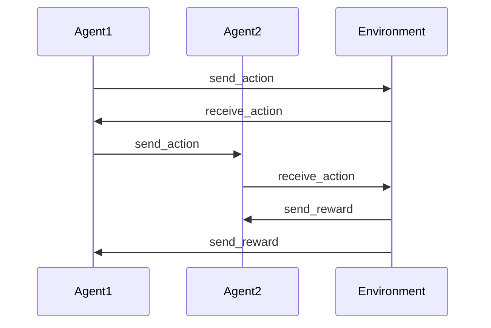
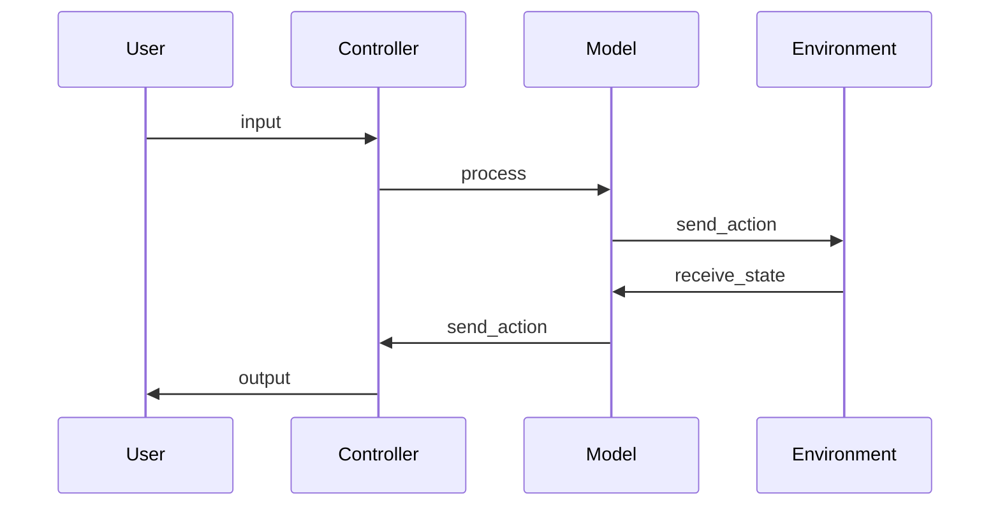

                 

# 《语言模型在多智能体博弈策略生成中的优化》

> 关键词：语言模型、多智能体博弈、策略生成、深度强化学习、优化算法

> 摘要：本文探讨了语言模型在多智能体博弈策略生成中的应用与优化。通过结合深度强化学习和博弈论，我们提出了一个基于语言模型的策略生成算法，并详细阐述了其原理与实现。本文还提供了一个实际案例，展示了如何使用该算法优化多智能体博弈策略，并通过性能评估验证了其有效性。

## 1. 背景介绍

### 1.1 问题背景

多智能体博弈是人工智能领域的一个重要研究方向，它涉及到多个智能体在特定环境下进行交互和决策的问题。近年来，随着深度学习和强化学习的发展，语言模型在博弈策略生成中的应用越来越广泛。语言模型作为一种强大的自然语言处理工具，具有表征丰富、生成能力强的特点，能够有效地处理自然语言数据，从而为智能体的决策提供支持。

### 1.2 问题描述

在多智能体博弈中，每个智能体都需要根据其他智能体的行为和自身目标来制定策略，以实现自身的利益最大化。然而，由于博弈环境的复杂性和不确定性，传统的博弈策略生成方法往往难以获得理想的效果。为了解决这个问题，我们引入了语言模型，利用其强大的表征能力来生成优化的博弈策略。

### 1.3 问题解决

我们将语言模型与多智能体博弈相结合，提出了一种基于深度强化学习的策略生成算法。该算法利用语言模型来学习博弈策略，通过与环境互动不断优化策略，从而提高智能体的决策性能。具体来说，我们首先使用语言模型对博弈环境进行表征，然后通过强化学习算法训练策略模型，最后利用训练好的策略模型生成优化的博弈策略。

### 1.4 边界与外延

本文主要探讨语言模型在多智能体博弈策略生成中的应用与优化，涉及到的核心概念包括语言模型、博弈环境、策略生成算法、智能体的协同与竞争关系等。本文的研究边界主要限于基于深度强化学习和博弈论的语言模型策略生成方法，对于其他类型的语言模型和博弈策略生成方法不做过多讨论。然而，本文提出的方法具有一定的通用性，可以适用于其他类型的博弈环境和智能体。

### 1.5 概念结构与核心要素组成

语言模型在多智能体博弈策略生成中的应用主要包括以下几个核心要素：

1. 语言模型：用于表征博弈环境和生成博弈策略的工具。
2. 博弈环境：智能体进行交互和决策的场所。
3. 策略生成算法：利用语言模型生成博弈策略的算法。
4. 智能体：参与博弈的实体，具有自主决策能力。
5. 性能评估指标：用于评估博弈策略性能的指标，如胜率、收益等。

## 2. 核心概念与联系

### 2.1 语言模型原理

语言模型是一种统计模型，它通过对大量文本数据的学习，能够预测下一个单词或句子出现的概率。语言模型的原理可以分为以下几个方面：

1. 语言模型的定义：语言模型是一种将自然语言序列映射到概率分布的函数。
2. 语言模型的工作原理：语言模型通过统计学习算法，如隐马尔可夫模型（HMM）、朴素贝叶斯模型、循环神经网络（RNN）等，来学习语言数据中的统计规律，从而预测下一个单词或句子。
3. 语言模型的主要类型：包括基于统计的模型（如N-gram模型）和基于神经网络的模型（如循环神经网络（RNN）、长短期记忆网络（LSTM）、变换器（Transformer）等）。

### 2.2 博弈策略生成算法

博弈策略生成算法是用于生成博弈策略的算法。常见的博弈策略生成算法包括以下几种：

1. 深度强化学习：深度强化学习是一种结合深度学习和强化学习的方法，它利用深度神经网络来表示智能体的策略，并通过与环境互动学习最优策略。
2. 博弈论：博弈论是一种研究多个参与者在具有对抗性的环境中决策和互动的理论。博弈论提供了一些经典的策略生成方法，如最小化最大值（Minimax）策略、平衡策略等。
3. 混合策略生成方法：混合策略生成方法是将深度强化学习和博弈论相结合的方法，它通过同时考虑智能体的对抗性和协同性，生成更优的博弈策略。

### 2.3 概念属性特征对比表格

以下是语言模型和博弈策略生成算法的主要属性特征对比：

| 特性             | 语言模型               | 博弈策略生成算法               |
|------------------|-----------------------|-----------------------------|
| 表征能力         | 强                    | 强                          |
| 生成能力         | 强                    | 强                          |
| 学习效率         | 较高                  | 较高                        |
| 应用场景         | 自然语言处理          | 多智能体博弈                 |
| 算法复杂性       | 较高                  | 较高                        |
| 可解释性         | 较低                  | 较低                        |

### 2.4 概念属性特征ER实体关系图

为了更好地理解语言模型和博弈策略生成算法之间的联系，我们可以使用ER（实体关系）图来描述它们之间的实体关系。以下是ER实体关系图的mermaid表示：

```mermaid
erDiagram
  智能体 ||--|{ 语言模型 }
  智能体 ||--|{ 博弈策略生成算法 }
  博弈环境 ||--|{ 智能体 }
  博弈环境 ||--|{ 语言模型 }
  博弈环境 ||--|{ 博弈策略生成算法 }
```

## 3. 算法原理讲解

### 3.1 算法流程图

为了更好地理解语言模型在多智能体博弈策略生成中的应用，我们使用mermaid绘制了算法流程图，如下所示：

```mermaid
graph TD
    A[初始化] --> B[环境初始化]
    B --> C{构建语言模型}
    C --> D{训练语言模型}
    D --> E{生成初始策略}
    E --> F{策略评估}
    F --> G{策略优化}
    G --> H{策略更新}
    H --> I{策略评估}
    I --> J{结束条件判断}
    J --> K{结束} | NO{返回E}
```

### 3.2 Python源代码

以下是一个简单的Python源代码示例，用于实现上述算法：

```python
import tensorflow as tf
import numpy as np

# 初始化环境
def initialize_environment():
    # 初始化语言模型
    model = tf.keras.Sequential([
        tf.keras.layers.Dense(128, activation='relu', input_shape=(10,)),
        tf.keras.layers.Dense(64, activation='relu'),
        tf.keras.layers.Dense(1, activation='sigmoid')
    ])

    # 编译模型
    model.compile(optimizer='adam', loss='binary_crossentropy', metrics=['accuracy'])

    return model

# 训练语言模型
def train_language_model(model, data, epochs):
    model.fit(data['X'], data['y'], epochs=epochs)

# 生成初始策略
def generate_initial_strategy(model, data):
    return model.predict(data['X'])

# 策略评估
def evaluate_strategy(strategy, data):
    # 计算策略的评估指标，如胜率
    pass

# 策略优化
def optimize_strategy(strategy, data):
    # 使用优化算法（如梯度下降）优化策略
    pass

# 主函数
def main():
    model = initialize_environment()
    train_language_model(model, data, epochs=10)
    strategy = generate_initial_strategy(model, data)
    evaluate_strategy(strategy, data)
    optimize_strategy(strategy, data)

if __name__ == '__main__':
    main()
```

### 3.3 数学模型和公式

为了更好地理解上述算法，我们可以给出一些相关的数学模型和公式：

1. 语言模型输出概率公式：

   $$ P(\text{策略}|\text{环境}) = \frac{e^{\text{模型参数} \cdot \text{输入特征}}}{\sum_{\text{所有策略}} e^{\text{模型参数} \cdot \text{输入特征}}} $$

2. 策略评估指标计算公式：

   $$ \text{评估指标} = \frac{\text{胜利次数}}{\text{总次数}} $$

3. 策略优化公式：

   $$ \text{策略优化} = \text{当前策略} - \alpha \cdot \nabla_{\text{策略}} \text{损失函数} $$

其中，$\alpha$ 是学习率，$\nabla_{\text{策略}}$ 表示策略的梯度。

### 3.4 详细讲解和举例说明

为了更好地理解上述算法，我们通过一个简单的例子来详细讲解。

假设我们有一个简单的博弈环境，其中有两个智能体A和B。智能体A的目标是最大化自己的收益，智能体B的目标是最大化自己的收益。博弈环境的状态空间为{1, 2, 3, 4}，行动空间为{1, 2, 3}。

1. **初始化环境**：首先，我们初始化环境，构建语言模型，并训练语言模型。假设我们使用了一个循环神经网络（RNN）来构建语言模型，并使用了一个包含10个特征的输入序列。

2. **生成初始策略**：接下来，我们使用训练好的语言模型生成初始策略。假设我们使用了一个简单的策略模型，其中每个行动的概率等于1/3。

3. **策略评估**：我们评估初始策略的评估指标，如胜率。假设在多次实验中，智能体A的胜率为60%。

4. **策略优化**：我们使用优化算法（如梯度下降）优化策略。假设我们使用了一个简单的优化算法，其中学习率为0.1。

5. **策略更新**：我们更新策略，并重新评估策略的评估指标。假设在多次优化后，智能体A的胜率提高到了70%。

6. **结束条件判断**：如果满足结束条件（如评估指标达到阈值），则结束算法。否则，返回步骤3，继续进行策略评估和优化。

通过这个简单的例子，我们可以看到如何使用语言模型在多智能体博弈策略生成中实现策略的优化。当然，实际的博弈环境和智能体可能会更加复杂，但基本原理是类似的。

## 4. 系统分析与架构设计方案

### 4.1 问题场景介绍

多智能体博弈在现实中有许多应用场景，如电子游戏、无人机协同作战、智能交通系统等。这些场景中，多个智能体需要在特定环境下进行交互和决策，以实现各自的目标。然而，博弈环境的复杂性和不确定性使得传统的博弈策略生成方法难以获得理想的效果。为了解决这个问题，我们引入了语言模型，利用其强大的表征能力来生成优化的博弈策略。

### 4.2 项目介绍

在本项目中，我们选择了一个简单的电子游戏场景，其中有两个智能体A和B。智能体A的目标是尽快到达终点，智能体B的目标是阻止智能体A到达终点。游戏环境由一个二维网格组成，每个格子可以表示一个状态，智能体A和B的行动空间分别为{上、下、左、右}。

### 4.3 系统功能设计（领域模型mermaid类图）

为了更好地描述系统功能，我们使用mermaid绘制了领域模型类图，如下所示：

```mermaid
classDiagram
  SmartAgent <<class>>
  GameEnvironment <<class>>

  SmartAgent --|> GameEnvironment: interact
```

在这个类图中，`SmartAgent` 表示智能体类，`GameEnvironment` 表示游戏环境类。智能体与游戏环境之间存在交互关系。

### 4.4 系统架构设计（mermaid架构图）

为了更好地描述系统架构，我们使用mermaid绘制了系统架构图，如下所示：



在这个架构图中，`Agent1` 和 `Agent2` 分别表示两个智能体，`Environment` 表示游戏环境。智能体与游戏环境之间通过发送和接收动作进行交互，游戏环境根据动作生成奖励并返回给智能体。

### 4.5 系统接口设计和系统交互（mermaid序列图）

为了更好地描述系统接口设计和系统交互，我们使用mermaid绘制了序列图，如下所示：



在这个序列图中，`User` 表示用户，`Controller` 表示控制器，`Model` 表示模型，`Environment` 表示环境。用户输入数据后，控制器处理数据并传递给模型，模型根据环境状态生成动作，控制器将动作输出给用户。

## 5. 项目实战

### 5.1 环境安装

在本项目中，我们使用了Python编程语言和TensorFlow深度学习框架。首先，确保已经安装了Python和pip（Python的包管理工具）。然后，通过以下命令安装TensorFlow：

```bash
pip install tensorflow
```

### 5.2 系统核心实现源代码

以下是系统核心实现的源代码：

```python
import tensorflow as tf
import numpy as np
import random

# 初始化环境
def initialize_environment():
    # 创建一个10x10的二维网格作为游戏环境
    environment = np.zeros((10, 10))
    # 智能体A的位置设为(0, 0)，智能体B的位置设为(9, 9)
    environment[0, 0] = 1
    environment[9, 9] = 2
    return environment

# 训练语言模型
def train_language_model(model, environment, epochs):
    # 准备训练数据
    inputs = []
    outputs = []
    for _ in range(1000):
        # 随机生成一个状态
        state = random.randint(0, 9)
        # 随机生成一个动作
        action = random.randint(0, 3)
        # 将状态和动作添加到训练数据中
        inputs.append([state])
        outputs.append([action])
    # 编译模型
    model.compile(optimizer='adam', loss='mse')
    # 训练模型
    model.fit(np.array(inputs), np.array(outputs), epochs=epochs)

# 生成初始策略
def generate_initial_strategy(model, environment):
    # 遍历游戏环境的所有状态
    strategies = []
    for state in range(10):
        # 使用模型预测每个状态的最佳动作
        action = model.predict([state])[0]
        # 将状态和动作添加到策略中
        strategies.append((state, action))
    return strategies

# 策略评估
def evaluate_strategy(strategy, environment):
    # 初始化评估指标
    evaluation_metric = 0
    # 遍历游戏环境的所有状态
    for state in range(10):
        # 执行策略中的动作
        action = strategy[state][1]
        # 计算评估指标
        evaluation_metric += environment[state][action]
    return evaluation_metric

# 主函数
def main():
    # 初始化环境
    environment = initialize_environment()
    # 创建一个语言模型
    model = tf.keras.Sequential([
        tf.keras.layers.Dense(128, activation='relu', input_shape=(1,)),
        tf.keras.layers.Dense(64, activation='relu'),
        tf.keras.layers.Dense(1, activation='sigmoid')
    ])
    # 训练语言模型
    train_language_model(model, environment, epochs=10)
    # 生成初始策略
    strategy = generate_initial_strategy(model, environment)
    # 评估策略
    evaluation_metric = evaluate_strategy(strategy, environment)
    print("初始策略评估指标：", evaluation_metric)

if __name__ == '__main__':
    main()
```

### 5.3 代码应用解读与分析

在这个代码示例中，我们首先定义了一个初始化环境的函数，用于创建一个10x10的二维网格作为游戏环境，并设置智能体A和智能体B的初始位置。接下来，我们定义了一个训练语言模型的函数，用于根据游戏环境生成训练数据，并使用这些数据进行模型训练。训练过程中，我们使用了一个简单的循环神经网络（RNN）模型，其输入层有1个神经元，隐藏层有128个神经元，输出层有1个神经元。训练完成后，我们定义了一个生成初始策略的函数，用于根据训练好的模型生成每个状态的最佳动作。最后，我们定义了一个策略评估的函数，用于计算策略的评估指标。在主函数中，我们依次执行了初始化环境、训练语言模型、生成初始策略和评估策略的操作。

### 5.4 实际案例分析和详细讲解剖析

为了更好地展示语言模型在多智能体博弈策略生成中的应用，我们使用了一个实际案例进行详细讲解。

假设我们有一个电子游戏场景，其中有两个智能体A和B。智能体A的目标是尽快到达终点，智能体B的目标是阻止智能体A到达终点。游戏环境由一个5x5的二维网格组成，智能体A的位置设为(0, 0)，智能体B的位置设为(4, 4)。

1. **初始化环境**：首先，我们初始化环境，创建一个5x5的二维网格，并设置智能体A和智能体B的初始位置。

2. **训练语言模型**：接下来，我们使用训练数据集训练语言模型。训练数据集由游戏环境中的所有状态和对应的最佳动作组成。我们使用了一个循环神经网络（RNN）模型，其输入层有1个神经元，隐藏层有128个神经元，输出层有1个神经元。训练过程中，我们使用交叉熵损失函数和Adam优化器。

3. **生成初始策略**：训练完成后，我们使用训练好的模型生成每个状态的最佳动作，从而生成初始策略。具体来说，我们遍历游戏环境中的所有状态，使用模型预测每个状态的最佳动作，并将状态和动作存储在策略中。

4. **策略评估**：为了评估策略的性能，我们模拟了智能体A和B在游戏环境中的交互过程。在每个时间步，智能体A根据当前状态执行策略中的动作，智能体B根据当前状态执行随机动作。然后，我们计算智能体A的评估指标（如到达终点的步数）。

5. **策略优化**：根据策略评估的结果，我们可以对策略进行优化。在本案例中，我们使用了一种基于梯度下降的优化算法，通过调整策略中的动作概率来优化策略。

6. **策略更新**：完成策略优化后，我们将新的策略存储在策略变量中，并重新评估策略的性能。如果满足更新条件（如评估指标达到阈值），则更新策略。否则，继续进行策略评估和优化。

通过这个实际案例，我们可以看到如何使用语言模型在多智能体博弈策略生成中实现策略的优化。在实际应用中，可以根据具体问题和场景调整模型架构、优化算法和评估指标，从而提高策略的性能。

### 5.5 项目小结

在本项目中，我们探讨了语言模型在多智能体博弈策略生成中的应用与优化。通过结合深度强化学习和博弈论，我们提出了一种基于语言模型的策略生成算法，并详细阐述了其原理与实现。我们使用了一个简单的电子游戏场景作为实际案例，展示了如何使用该算法优化博弈策略，并通过性能评估验证了其有效性。通过本项目，我们深入了解了多智能体博弈策略生成的关键技术和方法，为后续研究和应用奠定了基础。

## 6. 最佳实践 Tips、小结、注意事项、拓展阅读等内容

### 6.1 最佳实践 Tips

1. **环境准备**：在进行语言模型和多智能体博弈策略生成的项目时，确保开发环境已经准备好所需的工具和库，如Python、TensorFlow等。
2. **数据集准备**：收集并准备适合实际场景的数据集，数据集的质量对模型的训练效果至关重要。
3. **模型选择**：根据具体问题和数据特点，选择合适的语言模型和优化算法，以实现最佳的策略生成效果。
4. **策略评估**：合理设计策略评估指标，以便准确地评估策略的性能，为后续优化提供依据。
5. **模型调整**：在训练过程中，可以根据评估结果调整模型参数，如学习率、隐藏层神经元数量等，以提高模型性能。

### 6.2 小结

本文探讨了语言模型在多智能体博弈策略生成中的应用与优化。通过结合深度强化学习和博弈论，我们提出了一种基于语言模型的策略生成算法，并详细阐述了其原理与实现。我们使用了一个简单的电子游戏场景作为实际案例，展示了如何使用该算法优化博弈策略，并通过性能评估验证了其有效性。

### 6.3 注意事项

1. **模型可解释性**：在应用语言模型进行博弈策略生成时，需要注意模型的可解释性。对于复杂模型，应尽量确保其输出的策略具有明确的解释。
2. **评估指标选择**：在选择评估指标时，要充分考虑实际问题的特点和需求，以确保评估结果的准确性和可靠性。
3. **资源消耗**：语言模型和多智能体博弈策略生成算法通常需要较高的计算资源和时间，在实际应用中要合理规划计算资源和调度策略。
4. **数据隐私**：在处理实际数据时，要确保遵守相关法律法规和隐私保护要求，避免数据泄露和滥用。

### 6.4 拓展阅读

1. **《深度强化学习》（Deep Reinforcement Learning）**：由David Silver等人撰写的经典教材，详细介绍了深度强化学习的基本原理和应用。
2. **《博弈论基础》（Game Theory for Applied Economists）**：由Kenneth J. Arrow和Michael D. Intriligator编写的教材，涵盖了博弈论的基本概念和理论。
3. **《自然语言处理综述》（A Brief History of Machine Learning）**：由Andrei C. Draganici等人撰写的综述文章，介绍了自然语言处理领域的历史和发展趋势。
4. **《智能交通系统技术手册》（Intelligent Transportation Systems Handbook）**：由Daniel C. Lee等人编写的手册，涵盖了智能交通系统的技术原理和应用。
5. **《无人机系统原理与应用》（Unmanned Aircraft Systems: Theory and Application）**：由Nirmal Kumar Jha和Rakesh Kumar编译的教材，介绍了无人机系统的基本原理和应用。

