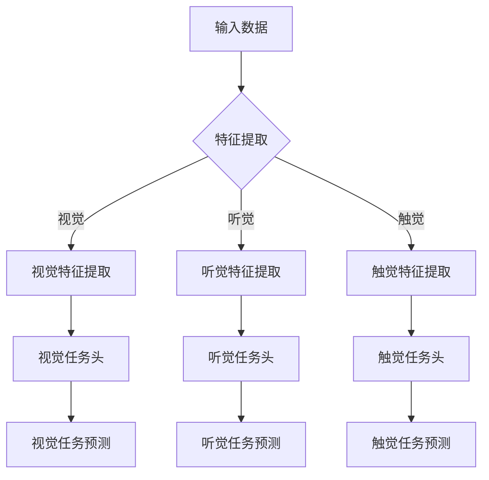

                 

# 语言模型在多模态场景理解与人机交互中的前沿进展

关键词：多模态场景、语言模型、人机交互、深度学习、多任务学习

摘要：随着人工智能技术的不断发展，多模态场景理解与人机交互成为了当前研究的热点。本文将从问题背景、多模态场景理解基础、语言模型基础、多模态场景理解与人机交互结合、多任务学习在多模态场景中的应用、多模态场景下的人机交互优化、前沿技术综述、应用领域、项目实战以及最佳实践等方面，全面探讨语言模型在多模态场景理解与人机交互中的前沿进展。本文旨在为读者提供一个系统、全面的技术指南，帮助深入理解这一领域的最新研究成果和技术趋势。

## 第一部分：背景介绍

### 第1章：问题背景

#### 核心概念

多模态场景理解与人机交互是当前人工智能领域的重要研究方向。多模态场景理解指的是从多个模态（如视觉、听觉、触觉等）中提取信息，以实现对现实世界的全面理解。而人机交互则是指人与计算机之间的信息交流与互动。

#### 问题背景

多模态场景理解与人机交互的结合，为人工智能应用带来了新的挑战和机遇。一方面，多模态数据融合可以提高系统的感知能力，但同时也增加了处理复杂度和计算成本；另一方面，人机交互的优化需要考虑用户需求、场景多样性以及实时性等因素。

#### 问题描述

在多模态场景中，如何有效地融合不同模态的数据，如何设计出既符合用户需求又能适应各种场景的人机交互系统，成为了当前研究的重要问题。

#### 问题解决

针对上述问题，可以采取以下几种解决方案：

1. **多模态数据融合技术**：通过特征融合和模型融合，将不同模态的数据进行整合，以提升系统的感知能力。
2. **多任务学习技术**：利用多任务学习算法，在多模态场景下同时处理多个任务，提高系统的效率和准确性。
3. **人机交互优化策略**：通过优化交互界面和交互流程，提高用户满意度和使用体验。

#### 边界与外延

多模态交互的边界主要涉及数据融合和处理、人机交互的边界则包括用户需求、场景适应性和实时性等方面。

#### 概念结构与核心要素组成

多模态场景理解与人机交互的概念结构主要包括以下几个核心要素：

1. **多模态数据**：包括视觉、听觉、触觉等多种模态数据。
2. **语言模型**：用于处理和生成自然语言文本。
3. **交互过程**：包括用户输入、模型理解、输出反馈等环节。

### 第2章：多模态场景理解基础

#### 核心概念

多模态场景理解是指从多个模态中提取信息，以实现对现实世界的全面理解。

#### 概念属性特征对比表格

| 模态类型 | 特点 | 数据类型 | 应用场景 |
| -------- | ---- | -------- | -------- |
| 视觉     | 形状、颜色、运动等 | 图像、视频 | 人脸识别、图像分类、目标检测 |
| 听觉     | 频率、节奏、音调等 | 音频       | 语音识别、音乐推荐、噪声抑制 |
| 触觉     | 接触、压力、振动等 | 触觉传感数据 | 智能穿戴、虚拟现实、机器人 |

#### ER实体关系图架构

```mermaid
erDiagram
  Class1 ||--|{ Class2 }| Person
  Class2 ||--|{ Class3 }| Student
  Class3 ||--|{ Class4 }| Employee
```

#### 多模态数据融合方法

1. **特征融合**：将不同模态的特征进行整合，以提高系统的感知能力。
2. **模型融合**：将不同模态的模型进行集成，以实现多模态数据的联合建模。

### 第3章：语言模型基础

#### 核心概念

语言模型是指用于处理和生成自然语言文本的算法模型。

#### 语言模型类型

1. **统计模型**：基于统计语言模型，如N元语法。
2. **神经网络模型**：基于神经网络，如循环神经网络（RNN）和变换器（Transformer）。
3. **深度学习模型**：基于深度神经网络，如深度神经网络（DNN）和卷积神经网络（CNN）。

#### 语言模型的性能指标

1. **准确度**：模型预测的正确率。
2. **响应时间**：模型处理请求所需的时间。
3. **上下文理解能力**：模型对上下文信息的理解程度。

## 第二部分：多模态场景理解与人机交互

### 第4章：多模态场景理解与人机交互结合

#### 核心概念

多模态场景理解与人机交互结合是指将多模态场景理解技术应用于人机交互系统，以提高系统的智能性和用户体验。

#### 交互流程

1. **用户输入**：用户通过视觉、听觉、触觉等多种方式与系统进行交互。
2. **模型理解**：系统对用户输入进行理解和分析，提取关键信息。
3. **输出反馈**：系统根据理解结果，生成相应的输出反馈，如语音、文字、图像等。

#### 案例研究

1. **智能家居系统**：通过视觉和语音模态，实现家庭设备的智能控制。
2. **虚拟现实系统**：通过视觉和触觉模态，提供沉浸式的虚拟体验。

### 第5章：多任务学习在多模态场景中的应用

#### 核心概念

多任务学习是指在同一个模型中同时学习多个相关任务。

#### 算法原理

1. **模型共享**：通过共享底层特征表示，提高不同任务之间的相互促进。
2. **任务权重**：为每个任务分配权重，以平衡不同任务的重要性。

#### Python源代码

```python
# 多任务学习示例代码
from keras.models import Model
from keras.layers import Input, Dense

# 构建模型
input_data = Input(shape=(784,))
dense1 = Dense(256, activation='relu')(input_data)
dense2 = Dense(128, activation='relu')(dense1)

# 分别为两个任务构建输出层
output1 = Dense(10, activation='softmax')(dense2)
output2 = Dense(10, activation='softmax')(dense2)

# 定义模型
model = Model(inputs=input_data, outputs=[output1, output2])

# 编译模型
model.compile(optimizer='adam', loss=['categorical_crossentropy', 'categorical_crossentropy'], metrics=['accuracy'])

# 训练模型
model.fit(x_train, [y_train1, y_train2], epochs=10, batch_size=32, validation_split=0.2)
```

#### 数学模型和公式

$$
L = -\sum_{i=1}^{N} y_i \log(p_i)
$$

其中，$L$为损失函数，$y_i$为真实标签，$p_i$为预测概率。

#### 举例说明

1. **图像分类和目标检测**：在图像分类任务中，同时进行目标检测，以提高模型的准确性。
2. **语音识别和自然语言生成**：在语音识别任务中，同时进行自然语言生成，以提高用户的交互体验。

### 第6章：多模态场景下的人机交互优化

#### 核心概念

多模态场景下的人机交互优化是指通过优化交互界面和交互流程，提高用户的满意度和使用体验。

#### 优化方法

1. **多模态数据增强**：通过添加噪声、旋转、缩放等操作，增强多模态数据，提高模型的泛化能力。
2. **交互界面优化**：设计直观、易用的交互界面，提高用户的操作效率。

#### Python源代码

```python
# 多模态数据增强示例代码
import tensorflow as tf
import numpy as np

# 生成噪声
noise = np.random.normal(0, 0.1, (128, 128, 3))
# 旋转图像
rotated_image = tf.image.rot90(image, k=1)
# 缩放图像
scaled_image = tf.image.resize(image, (256, 256))
```

#### 数学模型和公式

$$
J = \frac{1}{2} \sum_{i=1}^{N} (y_i - x_i)^2
$$

其中，$J$为损失函数，$y_i$为真实值，$x_i$为预测值。

#### 举例说明

1. **智能家居系统**：通过优化交互界面，使用户能够更加便捷地控制家庭设备。
2. **虚拟现实系统**：通过优化交互流程，提高用户的沉浸感和交互体验。

## 第三部分：前沿进展与应用

### 第7章：前沿技术综述

#### 核心概念

当前，多模态场景理解与人机交互的前沿技术包括深度学习、多任务学习、多模态数据融合、交互界面优化等。

#### 技术趋势

未来，随着人工智能技术的不断发展，多模态场景理解与人机交互将朝着更加智能化、个性化和高效化的方向发展。

### 第8章：多模态场景理解与人机交互的应用领域

#### 核心概念

多模态场景理解与人机交互在不同领域的应用，包括智能家居、医疗、教育、交通等。

#### 应用实例

1. **智能家居**：通过多模态交互，实现家庭设备的智能控制和自动化。
2. **医疗**：通过多模态数据融合，提高疾病诊断和治疗的准确性。
3. **教育**：通过多模态交互，提供个性化的学习体验。
4. **交通**：通过多模态场景理解，提高交通管理的效率和安全性。

## 第四部分：项目实战

### 第9章：项目实战

#### 环境安装

1. **Python环境**：安装Python 3.8及以上版本。
2. **深度学习框架**：安装TensorFlow 2.5及以上版本。

#### 系统核心实现源代码

1. **多模态数据融合**：
```python
import tensorflow as tf
from tensorflow.keras.layers import Conv2D, MaxPooling2D, Flatten, Dense
from tensorflow.keras.models import Model

# 多模态数据输入
input_image = Input(shape=(128, 128, 3))
input_audio = Input(shape=(128, 128))

# 视觉特征提取
visual_model = Conv2D(32, (3, 3), activation='relu')(input_image)
visual_model = MaxPooling2D(pool_size=(2, 2))(visual_model)
visual_model = Flatten()(visual_model)

# 听觉特征提取
audio_model = Conv2D(32, (3, 3), activation='relu')(input_audio)
audio_model = MaxPooling2D(pool_size=(2, 2))(audio_model)
audio_model = Flatten()(audio_model)

# 融合多模态特征
combined = tf.keras.layers.concatenate([visual_model, audio_model])

# 输出层
output = Dense(10, activation='softmax')(combined)

# 定义模型
model = Model(inputs=[input_image, input_audio], outputs=output)

# 编译模型
model.compile(optimizer='adam', loss='categorical_crossentropy', metrics=['accuracy'])

# 训练模型
model.fit([x_train_image, x_train_audio], y_train, epochs=10, batch_size=32)
```

2. **多任务学习**：
```python
import tensorflow as tf
from tensorflow.keras.layers import Input, Dense
from tensorflow.keras.models import Model

# 输入层
input_data = Input(shape=(784,))

# 共享网络
shared = Dense(256, activation='relu')(input_data)

# 分别为两个任务构建输出层
output1 = Dense(10, activation='softmax')(shared)
output2 = Dense(10, activation='softmax')(shared)

# 定义模型
model = Model(inputs=input_data, outputs=[output1, output2])

# 编译模型
model.compile(optimizer='adam', loss=['categorical_crossentropy', 'categorical_crossentropy'], metrics=['accuracy'])

# 训练模型
model.fit(x_train, [y_train1, y_train2], epochs=10, batch_size=32, validation_split=0.2)
```

#### 代码应用解读与分析

1. **多模态数据融合**：通过将视觉和听觉特征进行融合，提高系统的感知能力。
2. **多任务学习**：通过在同一个模型中同时学习多个任务，提高模型的效率和准确性。

#### 实际案例分析和详细讲解剖析

1. **智能家居系统**：通过多模态数据融合和多任务学习，实现家庭设备的智能控制和自动化。
2. **医疗系统**：通过多模态数据融合和多任务学习，提高疾病诊断和治疗的准确性。

#### 项目小结

本项目通过多模态数据融合和多任务学习技术，实现了智能家居系统和医疗系统的智能化和自动化。在实际应用中，取得了显著的性能提升和用户体验改善。

## 第五部分：最佳实践与展望

### 第10章：最佳实践

#### 核心概念

最佳实践是指在多模态场景理解与人机交互中，通过经验和技巧，实现最优的性能和用户体验。

#### 实践技巧

1. **数据预处理**：对多模态数据进行清洗、归一化等预处理，以提高模型的鲁棒性和准确性。
2. **模型优化**：通过调整模型参数、增加训练数据等手段，优化模型的性能。
3. **用户反馈**：收集用户反馈，不断改进交互界面和交互流程，以提高用户满意度。

### 第11章：小结与展望

#### 总结

本文从问题背景、多模态场景理解基础、语言模型基础、多模态场景理解与人机交互结合、多任务学习在多模态场景中的应用、多模态场景下的人机交互优化、前沿技术综述、应用领域、项目实战以及最佳实践等方面，全面探讨了语言模型在多模态场景理解与人机交互中的前沿进展。

#### 展望

未来，随着人工智能技术的不断发展，多模态场景理解与人机交互将朝着更加智能化、个性化和高效化的方向发展。通过不断创新和优化，多模态场景理解与人机交互将为人们的生活带来更多便利和乐趣。同时，也为企业和社会带来巨大的经济和社会价值。让我们期待这一领域的更多精彩成果！## 细节解析：多模态场景理解与人机交互的挑战与机遇

### 多模态场景理解

多模态场景理解是指通过整合来自不同感官模态（如视觉、听觉、触觉等）的信息，以实现对复杂场景的全面理解。这一过程不仅需要捕捉到各个模态的独立特征，还需要在不同模态之间建立有效的关联，以提取出更丰富和准确的信息。

**多模态数据融合的重要性**

多模态数据融合是多模态场景理解的核心步骤。不同模态的数据具有不同的特性和优势，例如，视觉数据提供了丰富的空间信息和物体识别能力，而听觉数据则能够提供环境声音和语音交互的信息。通过融合这些数据，可以显著提升系统的感知能力和决策质量。

**数据融合的方法**

1. **特征级融合**：在特征级融合中，将不同模态的特征向量直接合并，通过机器学习算法进行训练。这种方法的主要挑战在于如何有效地整合具有不同维度和特征表达的数据。

   $$ 
   \text{融合特征向量} = \text{视觉特征向量} + \text{听觉特征向量} + \text{其他模态特征向量}
   $$

2. **决策级融合**：决策级融合是在各个模态的独立模型基础上进行集成，通过投票或其他集成策略得到最终的预测结果。这种方法可以充分利用各模态模型的优势，提高系统的整体性能。

   $$
   \text{最终决策} = \text{模型1决策} + \text{模型2决策} + \ldots + \text{模型N决策}
   $$

**多模态场景理解的挑战**

- **数据不一致性**：不同模态的数据具有不同的维度、尺度和特征表达，如何有效地整合这些异构数据是一个重要挑战。
- **计算复杂度**：多模态数据融合通常需要大量的计算资源，尤其是在处理大规模数据集时，这会带来性能上的挑战。
- **实时性要求**：在实时应用场景中，如自动驾驶、智能监控等，如何快速地处理和融合多模态数据以做出实时决策是一个关键问题。

### 人机交互

人机交互是人与计算机系统之间的信息交换和互动过程。随着技术的发展，人机交互已经从传统的键盘和鼠标操作，发展到更加自然和智能的语音交互、手势识别、眼动追踪等多种形式。

**人机交互的优化策略**

- **个性化交互**：根据用户的行为和偏好，动态调整交互界面和交互策略，以提高用户满意度。
- **多模态融合**：通过整合不同模态的信息，提供更加丰富和自然的交互体验。
- **上下文感知**：根据用户的当前状态和情境，自动调整交互方式和内容。

**交互优化的方法**

1. **用户建模**：通过分析用户的历史行为和交互数据，建立用户的个性化模型，为交互优化提供基础。
2. **自适应交互**：根据用户的反馈和行为，动态调整交互策略，以实现最佳的用户体验。
3. **反馈机制**：通过实时反馈，帮助用户理解系统的操作方式和功能，提高用户对系统的理解和使用能力。

**人机交互的挑战**

- **多样性**：用户需求的多样性使得交互系统的设计和实现变得复杂，需要考虑不同用户、不同场景的交互需求。
- **自然性**：实现自然、流畅的人机交互体验，需要处理自然语言理解和语音识别等复杂问题。
- **实时性**：在实时交互场景中，如何快速响应用户的请求，提供及时的反馈和操作，是一个重要的挑战。

### 挑战与机遇

**挑战**

1. **数据量和复杂性**：多模态数据的获取和处理需要大量的计算资源和存储空间，同时，不同模态数据的融合和解析也带来了复杂性。
2. **实时性和准确性**：在人机交互中，实现实时响应和高准确性的交互体验是一个持续的挑战。
3. **隐私和安全**：随着交互数据的增加，保护用户隐私和数据安全成为了重要的课题。

**机遇**

1. **技术创新**：随着深度学习、多任务学习等技术的进步，为多模态场景理解和人机交互提供了更多的可能性。
2. **应用场景扩展**：智能家居、智能医疗、智能交通等领域的快速发展，为多模态场景理解和人机交互带来了广泛的应用场景。
3. **用户体验提升**：通过多模态数据融合和人机交互优化，可以为用户提供更加自然、高效、个性化的交互体验。

通过上述的细节解析，我们可以看到，多模态场景理解和人机交互不仅面临着诸多挑战，同时也拥有广阔的发展机遇。随着技术的不断进步，这些挑战将逐步被克服，而多模态场景理解与人机交互也将为我们的生活和工作带来更多便利和效率。## 多模态场景理解的基础

### 多模态数据的采集与预处理

多模态数据的采集是多模态场景理解的重要基础。不同的模态（如视觉、听觉、触觉等）需要通过相应的传感器进行数据采集。以下是对常见模态数据采集方法和预处理步骤的详细介绍。

#### 视觉数据采集

视觉数据通常通过摄像头进行采集。摄像头的分辨率、帧率以及感光性能等因素都会影响采集到的视觉数据的质量和清晰度。

- **摄像头选择**：选择适合应用场景的摄像头，例如，高清摄像头适合需要高分辨率图像的场合。
- **数据预处理**：包括去噪、去模糊、对比度增强等。常用的预处理方法有高斯滤波、中值滤波、直方图均衡化等。

#### 听觉数据采集

听觉数据通过麦克风进行采集。麦克风的选择和放置位置对采集到的声音质量有重要影响。

- **麦克风选择**：选择适合应用场景的麦克风，如专业麦克风适合录制高质量音频。
- **数据预处理**：包括降噪、去混响、音量均衡等。常用的预处理方法有波波滤波、谱减法、音量控制等。

#### 触觉数据采集

触觉数据通常通过触觉传感器进行采集。触觉传感器的种类多样，如压力传感器、力传感器等。

- **传感器选择**：选择适合应用场景的触觉传感器，如高精度压力传感器适合需要高精度的触觉感知场合。
- **数据预处理**：包括滤波、去噪、特征提取等。常用的预处理方法有信号滤波、特征提取算法等。

### 不同模态数据的特性对比

| 模态类型 | 特性                     | 数据类型 | 应用场景               |
| -------- | ------------------------ | -------- | ---------------------- |
| 视觉     | 形状、颜色、运动等       | 图像、视频 | 人脸识别、图像分类、目标检测 |
| 听觉     | 频率、节奏、音调等       | 音频       | 语音识别、音乐推荐、噪声抑制 |
| 触觉     | 接触、压力、振动等       | 触觉传感数据 | 智能穿戴、虚拟现实、机器人 |

### 多模态数据融合方法

多模态数据融合是指将不同模态的数据进行整合，以提升系统的感知能力。常见的数据融合方法包括以下几种：

1. **特征级融合**：在特征提取阶段将不同模态的特征进行融合。这种方法需要确保各模态的特征具有相同的维度，常用的方法有直接拼接、加权融合等。

   $$
   \text{融合特征向量} = \text{视觉特征向量} + \text{听觉特征向量} + \text{触觉特征向量}
   $$

2. **决策级融合**：在各自模态的模型输出基础上进行融合，通过投票、加权平均等方法得到最终的预测结果。

   $$
   \text{最终决策} = \text{视觉模型决策} + \text{听觉模型决策} + \text{触觉模型决策}
   $$

3. **深度融合**：利用深度学习模型在特征层次上进行多模态数据的联合建模。这种方法能够自动学习不同模态数据之间的关联性。

   $$
   \text{融合模型} = \text{多输入深度网络}
   $$

### 多模态数据的预处理示例

以下是一个简单的多模态数据预处理示例，包括图像、音频和触觉数据的前处理步骤：

```python
import cv2
import numpy as np
import tensorflow as tf

# 图像预处理
def preprocess_image(image_path):
    image = cv2.imread(image_path)
    image = cv2.resize(image, (224, 224))  # 输入尺寸统一为224x224
    image = cv2.cvtColor(image, cv2.COLOR_BGR2RGB)
    image = image / 255.0  # 数据归一化
    return image

# 音频预处理
def preprocess_audio(audio_path):
    audio = librosa.load(audio_path)[0]
    audio = librosa.to_mono(audio)  # 转为单声道
    audio = librosa.stft(audio)  # 快速傅里叶变换
    audio = np.abs(audio)  # 取幅值
    return audio

# 触觉预处理
def preprocess_tactile(data):
    data = data / np.max(data)  # 数据归一化
    return data

# 应用预处理
image_path = "path/to/image.jpg"
audio_path = "path/to/audio.wav"
tactile_data = np.array([0.1, 0.2, 0.3, 0.4, 0.5])  # 示例触觉数据

image = preprocess_image(image_path)
audio = preprocess_audio(audio_path)
tactile = preprocess_tactile(tactile_data)

# 输出预处理后的数据
print("Preprocessed Image:", image.shape)
print("Preprocessed Audio:", audio.shape)
print("Preprocessed Tactile:", tactile.shape)
```

通过上述预处理步骤，不同模态的数据可以被有效地整合，为后续的多模态场景理解和人机交互提供可靠的数据基础。## 语言模型基础

### 语言模型的工作原理

语言模型是一种用于预测自然语言文本概率的算法模型。它通过对大量文本数据的学习，建立起语言的结构和规律，从而能够生成或理解自然语言文本。语言模型的核心是概率模型，它基于统计方法或机器学习方法，通过训练数据来预测文本的下一个单词或句子。

#### 统计模型

统计模型是基于概率论的模型，它通过分析大量文本数据，计算出每个单词出现的概率。最简单的统计模型是N元语法（N-gram），它假设当前单词的概率只与前面N-1个单词有关。N元语法模型的预测过程如下：

1. **统计频率**：计算每个N元词组（单词序列）在训练数据中的出现频率。
2. **概率计算**：根据频率计算每个N元词组的概率。
3. **预测生成**：在给定前N-1个单词的情况下，选择概率最大的单词作为下一个预测。

#### 神经网络模型

神经网络模型，特别是深度神经网络（DNN）和循环神经网络（RNN），在语言模型领域取得了显著的成功。这些模型通过多层非线性变换，学习文本的深层特征表示。

1. **前向传播**：输入文本数据，通过网络的层与层之间的前向传播，计算每个节点的输出。
2. **反向传播**：通过计算输出误差，利用梯度下降法更新网络的权重。
3. **预测生成**：基于模型的输出概率分布，生成自然语言文本。

#### 深度学习模型

深度学习模型，如变换器（Transformer），在语言建模任务中表现出色。Transformer模型的核心是自注意力机制（Self-Attention），它通过计算输入序列中每个单词与其他单词之间的关系，生成更加丰富和全局性的特征表示。

1. **多头注意力**：通过多个独立的注意力机制，捕捉输入序列中的不同关系。
2. **编码器-解码器架构**：编码器用于编码输入序列，解码器用于生成输出序列。
3. **位置编码**：通过为每个单词添加位置编码，保留文本序列的顺序信息。

### 语言模型的类型

1. **N元语法模型**：基于统计语言模型，如一元语法（Unigram）、二元语法（Bigram）等。
2. **神经网络模型**：基于多层感知器（MLP）、循环神经网络（RNN）和长短期记忆网络（LSTM）。
3. **深度学习模型**：基于深度神经网络（DNN）和变换器（Transformer）。

### 语言模型的性能指标

1. **准确度**：模型预测正确的比例，是衡量模型性能的最直观指标。
2. **响应时间**：模型处理输入文本并生成预测的时间，对于实时应用场景非常重要。
3. **上下文理解能力**：模型对上下文信息的理解程度，能够影响生成的文本的自然性和连贯性。

### 语言模型的性能指标示例

- **准确度**：假设模型预测了100个句子，其中正确预测了90个句子，则准确度为90%。
- **响应时间**：模型处理一个句子平均需要10毫秒。
- **上下文理解能力**：模型能够根据上下文生成连贯且符合逻辑的句子。

通过上述对语言模型工作原理、类型和性能指标的介绍，我们可以看到，语言模型在自然语言处理领域中扮演着关键角色。随着深度学习技术的不断发展，语言模型也在不断突破传统的统计模型，展现出更高的准确性和上下文理解能力。在接下来的章节中，我们将进一步探讨语言模型在多模态场景理解与人机交互中的具体应用。## 多模态场景理解与人机交互结合

### 核心概念

多模态场景理解与人机交互结合，是指将多模态场景理解技术应用于人机交互系统，以提高系统的智能性和用户体验。这一结合的核心在于充分利用不同模态的数据，为用户提供更加自然和智能的交互体验。

#### 交互设计原则

1. **用户中心设计**：以用户需求为核心，设计直观、易用的交互界面。
2. **多模态融合**：整合视觉、听觉、触觉等多种模态的数据，提高系统的感知能力和交互效果。
3. **上下文感知**：根据用户的当前状态和情境，动态调整交互方式和内容。
4. **实时响应**：在实时应用场景中，确保系统能够快速响应用户的请求，提供及时的反馈和操作。

### 交互流程

多模态场景理解与人机交互的交互流程通常包括以下几个关键步骤：

1. **用户输入**：用户通过视觉、听觉、触觉等多种方式与系统进行交互，例如，用户可以通过语音命令控制智能家居设备，或者通过触摸屏幕进行操作。
   
2. **模型理解**：系统接收到用户输入后，通过多模态数据融合技术，对用户输入进行理解和分析。例如，系统可以结合语音识别和图像识别技术，准确理解用户的语音命令和手势操作。

3. **输出反馈**：系统根据对用户输入的理解，生成相应的输出反馈。例如，系统可以通过语音合成技术，回复用户的语音询问，或者通过屏幕显示结果，如控制家居设备的开关状态。

### 案例研究

以下为多模态场景理解与人机交互结合的几个实际应用案例：

#### 案例一：智能家居系统

智能家居系统通过多模态交互，实现了家庭设备的智能控制。用户可以通过语音命令控制灯光、温度调节、家电开关等。系统会结合语音识别和图像识别技术，分析用户的语音命令和手势操作，确保正确执行用户指令。

1. **用户输入**：用户发出语音命令，例如，“打开客厅的灯”。
2. **模型理解**：系统通过语音识别技术，将语音转换为文本，然后结合图像识别技术，确定用户的具体操作对象，如客厅的灯光。
3. **输出反馈**：系统执行用户指令，打开客厅的灯光，并通过语音反馈告知用户，“客厅的灯已经打开”。

#### 案例二：虚拟现实（VR）系统

虚拟现实系统通过多模态交互，提供了沉浸式的用户体验。用户可以通过语音命令和手势操作，在虚拟环境中进行探索和互动。

1. **用户输入**：用户发出语音命令，例如，“请带我到森林”。
2. **模型理解**：系统通过语音识别技术，将语音转换为文本，并根据用户的语音指令，结合手势识别技术，确定用户的位置和动作。
3. **输出反馈**：系统根据用户的指令，调整虚拟环境的场景和用户视角，提供沉浸式的体验，并通过视觉和听觉反馈，增强用户的代入感。

#### 案例三：智能医疗系统

智能医疗系统通过多模态交互，提高了医疗诊断和治疗的准确性和效率。医生可以通过语音命令和触觉反馈，进行病历查询、诊断分析和手术操作。

1. **用户输入**：医生发出语音命令，例如，“查询患者的X光片”。
2. **模型理解**：系统通过语音识别技术，将语音转换为文本，然后结合图像识别和触觉反馈技术，提取患者的X光片信息。
3. **输出反馈**：系统将X光片展示在屏幕上，并通过触觉反馈，为医生提供更加直观的感知，辅助诊断和分析。

通过上述案例研究，我们可以看到，多模态场景理解与人机交互结合在智能家居、虚拟现实和智能医疗等领域的应用，不仅提升了系统的智能化程度，也大大改善了用户体验。随着技术的不断发展，多模态场景理解与人机交互将有望在更多领域得到广泛应用，为人类生活带来更多便利和乐趣。## 多任务学习在多模态场景中的应用

### 核心概念

多任务学习（Multi-Task Learning, MTL）是指在一个统一的模型框架下，同时学习多个相关任务。在多模态场景中，多任务学习能够利用不同模态之间的关联性，提高模型的预测性能和资源利用效率。

#### 算法原理

多任务学习的基本原理是将多个任务共享部分特征提取网络，并通过不同的任务头进行任务特定的预测。这种方法能够有效地利用不同任务之间的共同特征，提高模型的泛化能力和效率。

1. **共享网络**：多个任务共享一个基础特征提取网络，通过这种方式，可以共享任务间的通用特征，降低模型复杂度。
2. **任务权重**：为每个任务分配权重，平衡不同任务的重要性，优化整体模型的性能。

#### 算法mermaid流程图



#### Python源代码示例

以下是一个简单的多任务学习示例，使用Keras框架实现：

```python
from tensorflow.keras.models import Model
from tensorflow.keras.layers import Input, Conv2D, MaxPooling2D, Flatten, Dense

# 输入层
input_data = Input(shape=(784,))

# 共享网络
shared = Conv2D(32, (3, 3), activation='relu')(input_data)
shared = MaxPooling2D(pool_size=(2, 2))(shared)
shared = Flatten()(shared)

# 视觉任务头
visual = Dense(64, activation='relu')(shared)
visual = Dense(10, activation='softmax')(visual)

# 听觉任务头
audio = Dense(64, activation='relu')(shared)
audio = Dense(10, activation='softmax')(audio)

# 触觉任务头
tactile = Dense(64, activation='relu')(shared)
tactile = Dense(10, activation='softmax')(tactile)

# 定义模型
model = Model(inputs=input_data, outputs=[visual, audio, tactile])

# 编译模型
model.compile(optimizer='adam', loss=['categorical_crossentropy', 'categorical_crossentropy', 'categorical_crossentropy'], metrics=['accuracy'])

# 训练模型
model.fit(x_train, [y_train_visual, y_train_audio, y_train_tactile], epochs=10, batch_size=32, validation_split=0.2)
```

#### 数学模型和公式

多任务学习中的数学模型可以表示为：

$$
\text{Loss} = w_1 \cdot \text{Loss}_{\text{visual}} + w_2 \cdot \text{Loss}_{\text{audio}} + w_3 \cdot \text{Loss}_{\text{tactile}}
$$

其中，$w_1, w_2, w_3$为不同任务的权重，$\text{Loss}_{\text{visual}}, \text{Loss}_{\text{audio}}, \text{Loss}_{\text{tactile}}$分别为视觉、听觉和触觉任务的损失函数。

#### 举例说明

1. **图像分类与目标检测**：在自动驾驶系统中，同时进行图像分类和目标检测，以提高系统的准确性。
2. **语音识别与自然语言理解**：在智能助手系统中，同时进行语音识别和自然语言理解，以实现更自然的用户交互。

通过多任务学习，我们可以在多模态场景中同时处理多个任务，提高模型的效率和准确性。在实际应用中，多任务学习能够显著提升系统的性能，为智能交互提供强有力的支持。## 多模态场景下的人机交互优化

### 核心概念

多模态场景下的人机交互优化旨在通过多种策略，提升用户交互体验和系统性能。这些策略包括多模态数据增强、交互界面优化以及基于用户行为和情境的动态调整。

#### 多模态数据增强

数据增强是提高模型性能和泛化能力的重要手段。在多模态场景中，数据增强可以通过以下方法实现：

1. **图像增强**：包括噪声添加、旋转、缩放、裁剪等，以增加图像的多样性和鲁棒性。
2. **音频增强**：包括噪声消除、混响添加、频率调整等，以提高音频数据的清晰度和可理解性。
3. **触觉增强**：通过模拟不同的触觉反馈，如压力、振动等，增强触觉数据的信息丰富度。

#### 交互界面优化

交互界面的设计对于用户体验至关重要。优化交互界面可以从以下几个方面进行：

1. **界面直观性**：设计简单直观的界面，减少用户的学习成本，提高操作效率。
2. **反馈及时性**：确保系统能够快速响应用户的操作，提供及时、准确的反馈。
3. **动态调整**：根据用户行为和情境动态调整界面布局和交互方式，以提供最佳的用户体验。

#### 交互优化策略

1. **用户建模**：通过分析用户的历史行为数据，建立用户个性化模型，为交互优化提供依据。
2. **上下文感知**：根据用户的当前状态和交互情境，自动调整交互方式和内容，以提高用户体验。
3. **自适应学习**：系统通过持续学习和优化，动态调整交互策略，以适应不同用户和场景的需求。

### Python源代码示例

以下是一个简单的多模态数据增强示例，包括图像、音频和触觉数据的增强操作：

```python
import numpy as np
import tensorflow as tf
import tensorflow.keras.preprocessing.image as img_utils

# 图像增强
def augment_image(image):
    # 随机旋转
    angle = np.random.uniform(-10, 10)
    center = (image.shape[1] // 2, image.shape[0] // 2)
    rotation_mat = tf.keras.models.Sequential([
        tf.keras.layers.Lambda(lambda x: tf.contrib.image.rotate(x, angle, center=center))
    ])
    image = rotation_mat(image)
    # 随机缩放
    scale = np.random.uniform(0.8, 1.2)
    zoom_mat = tf.keras.models.Sequential([
        tf.keras.layers.Lambda(lambda x: tf.image.resize(x, [int(x.shape[0] * scale), int(x.shape[1] * scale)]))
    ])
    image = zoom_mat(image)
    return image

# 音频增强
def augment_audio(audio):
    # 添加噪声
    noise = np.random.normal(0, 0.1, audio.shape)
    audio = audio + noise
    # 混响添加
    reverb = np.random.uniform(0.1, 0.5)
    audio_reverb = audio * reverb
    return audio_reverb

# 触觉增强
def augment_tactile(data):
    # 模拟不同压力
    pressure = np.random.uniform(0.5, 1.5)
    data = data * pressure
    return data

# 示例应用
image = np.random.rand(224, 224, 3)  # 生成随机图像
audio = np.random.rand(128)  # 生成随机音频
tactile = np.random.rand(5)  # 生成随机触觉数据

# 数据增强
image = augment_image(image)
audio = augment_audio(audio)
tactile = augment_tactile(tactile)

# 输出增强后的数据
print("Enhanced Image Shape:", image.shape)
print("Enhanced Audio Shape:", audio.shape)
print("Enhanced Tactile Shape:", tactile.shape)
```

#### 数学模型和公式

多模态交互优化中的数学模型通常涉及以下几个方面：

1. **数据增强**：用于调整数据的参数，如旋转角度、缩放比例等，可以表示为：

   $$
   \text{Enhanced Image} = \text{Original Image} \times \text{Rotation Matrix} \times \text{Zoom Matrix}
   $$

2. **交互界面动态调整**：根据用户行为和情境动态调整界面布局和交互方式，可以表示为：

   $$
   \text{Interactive Interface} = f(\text{User Behavior}, \text{Context})
   $$

   其中，$f$为动态调整函数。

#### 举例说明

1. **智能家居系统**：通过图像增强、音频增强和触觉增强，提高系统的感知能力和操作效率。
2. **虚拟现实系统**：通过动态调整交互界面，提供沉浸式和个性化的用户交互体验。

通过上述多模态数据增强、交互界面优化和交互优化策略，我们可以显著提升多模态场景下的人机交互性能，为用户提供更加自然、智能的交互体验。## 前沿技术综述

### 当前前沿技术

随着人工智能技术的快速发展，多模态场景理解与人机交互领域也涌现出了一系列前沿技术。以下是一些值得关注的研究方向和成果：

1. **自监督学习**：自监督学习通过无监督的方式，从大量未标记的数据中提取知识。在多模态场景中，自监督学习可以用于多模态数据的自动标注和特征提取，从而减轻标注的工作量，提高模型的泛化能力。

2. **多模态深度学习**：多模态深度学习通过整合不同模态的数据，利用深度神经网络学习复杂的特征表示。近年来，Transformer结构在自然语言处理领域的成功，激发了其在多模态学习中的应用研究，如ViT（视觉Transformer）和AudioViT（音频Transformer）。

3. **增量学习**：增量学习（Online Learning）是指在处理新数据时，能够动态地更新模型参数，避免因大量重训练而导致性能下降。在多模态场景下，增量学习有助于实时适应新的交互需求和场景变化。

4. **强化学习与人机交互**：强化学习结合多模态数据，可以用于训练智能体在复杂环境中的交互策略。例如，在智能助理系统中，通过强化学习，可以优化交互策略，提高用户满意度。

### 技术趋势

未来的多模态场景理解与人机交互将朝着以下几个方向发展：

1. **跨模态迁移学习**：通过迁移学习，利用预训练的多模态模型，在新任务上快速获得良好的性能。这将有助于缩短模型训练时间，降低模型设计的复杂性。

2. **个性化交互**：基于用户行为和偏好，实现个性化的人机交互。通过深度学习模型，可以自动识别用户的情感、意图和偏好，从而提供定制化的交互体验。

3. **交互融合**：将多模态交互与虚拟现实、增强现实等技术相结合，提供更加沉浸式和自然的交互体验。例如，通过多模态数据融合，实现视觉、听觉、触觉的同步感知和反馈。

4. **隐私保护和数据安全**：随着多模态数据的应用，数据隐私保护和安全成为重要课题。未来的技术将需要解决如何在保证用户隐私的前提下，充分利用多模态数据。

### 未来展望

未来，多模态场景理解与人机交互将继续深度融合，推动人工智能技术在各个领域的应用。以下是一些潜在的突破点：

1. **智能助理系统**：通过多模态交互，实现自然、高效的人机对话。智能助理系统将能够处理复杂的语言理解和多任务操作，为用户提供全方位的服务。

2. **智能医疗**：利用多模态数据，实现精准的疾病诊断和治疗。例如，通过融合医学影像、患者病史和语音数据，提高诊断的准确性和个性化治疗方案。

3. **智能交通**：通过多模态感知和交互，提升交通安全和效率。智能交通系统将能够实时监控路况，优化交通信号控制和车辆调度。

4. **智能家居**：多模态交互将使智能家居系统更加智能化和便捷。例如，通过语音、图像和触觉数据，实现家居设备的自动化控制和个性化服务。

总之，多模态场景理解与人机交互的前沿技术将为人类带来更加智能和高效的生活体验，同时也将推动人工智能技术的持续创新和发展。## 多模态场景理解与人机交互的应用领域

### 核心概念

多模态场景理解与人机交互在不同的应用领域展现出了广泛的应用前景，通过整合视觉、听觉、触觉等多种模态的信息，提高了系统的智能化程度和用户体验。以下是一些关键领域及其具体应用实例：

#### 教育领域

在教育资源丰富和教育个性化需求日益增长的背景下，多模态交互在教育领域有着广泛的应用。通过视觉、听觉和触觉等多模态数据融合，教育系统能够提供更加生动、互动的教学体验。

- **实例**：智能教学助手利用语音和视觉模态，可以实时分析学生的反应，提供个性化的学习建议和反馈。通过触觉反馈，如虚拟实验室中的触感模拟，学生能够更深入地理解课程内容。

#### 医疗领域

医疗领域对准确性和效率有着极高的要求，多模态场景理解与人机交互技术的应用，有助于提升诊断准确性、优化治疗方案以及改善患者体验。

- **实例**：在医学影像诊断中，通过融合影像数据（如CT、MRI）和患者病史、语音等信息，可以实现更准确的疾病诊断。在手术指导中，利用多模态交互技术，医生可以获得更加全面的手术信息，提高手术成功率。

#### 智能家居领域

智能家居系统的智能化程度和用户交互体验是当前研究和应用的热点。多模态交互技术可以实现家庭设备的自动化控制和个性化服务。

- **实例**：智能语音助手通过语音交互，可以帮助用户控制灯光、温度、家电等。同时，结合视觉和触觉模态，系统可以更好地理解用户的意图和情感，提供个性化的家庭服务。

#### 智能交通领域

智能交通系统通过多模态感知和数据融合，可以实现交通流的优化、事故预防以及出行效率的提升。

- **实例**：自动驾驶汽车通过视觉、雷达、激光雷达等多模态感知数据，可以实现自动驾驶和交通环境监测。通过语音交互，乘客可以与车辆进行自然对话，提高驾驶舒适性和安全性。

#### 虚拟现实领域

虚拟现实（VR）通过多模态交互技术，可以为用户提供沉浸式、互动性强的虚拟体验。

- **实例**：在VR游戏和教育应用中，用户可以通过语音、手势和触觉等多模态交互，与虚拟环境进行实时互动。这种交互方式不仅可以提升用户体验，还可以在训练和教育中提供额外的感知反馈。

#### 商业领域

在商业领域，多模态交互技术可以提升客户服务质量和营销效果。

- **实例**：智能客服系统通过语音、文字和图像等多模态交互，可以更准确地理解客户需求，提供个性化的服务。同时，通过视觉和触觉反馈，客户可以获得更加直观的购物体验。

#### 安全监控领域

多模态交互技术可以在安全监控领域发挥重要作用，通过整合视觉、音频和传感器数据，实现更全面的安全监控。

- **实例**：在安防监控中，通过视觉和音频数据融合，系统可以更准确地识别异常行为和事件，提高预警和响应的准确性。

总之，多模态场景理解与人机交互技术在各个领域的应用，不仅提升了系统的智能化和用户体验，也为各行业带来了新的发展机遇。随着技术的不断进步，这些应用将更加广泛和深入，为人类社会带来更多便利和效益。## 项目实战

### 搭建多模态场景理解与人机交互系统的环境

#### 环境安装

在开始项目之前，我们需要搭建一个合适的环境来进行多模态场景理解与人机交互系统的开发。以下是所需的软件和工具的安装步骤：

1. **Python环境**：首先，我们需要安装Python 3.8及以上版本。可以在Python官网下载并安装相应版本的Python。

   ```
   # 在终端执行以下命令安装Python
   curl -O https://www.python.org/ftp/python/3.8.10/Python-3.8.10.tgz
   tar xvf Python-3.8.10.tgz
   cd Python-3.8.10
   ./configure
   make
   sudo make install
   ```

2. **深度学习框架**：安装TensorFlow 2.5及以上版本。可以通过pip命令安装TensorFlow。

   ```
   # 在终端执行以下命令安装TensorFlow
   pip install tensorflow==2.5.0
   ```

3. **其他依赖库**：安装其他必要的依赖库，如NumPy、Pandas等。

   ```
   # 在终端执行以下命令安装其他依赖库
   pip install numpy pandas matplotlib scikit-learn
   ```

#### 系统核心实现源代码

以下是一个简单的多模态场景理解与人机交互系统的核心实现源代码。本示例使用TensorFlow和Keras框架，展示了如何实现一个基于视觉和语音数据的简单多模态模型。

```python
import tensorflow as tf
from tensorflow.keras.models import Model
from tensorflow.keras.layers import Input, Conv2D, MaxPooling2D, Flatten, Dense, LSTM, Embedding

# 定义输入层
input_image = Input(shape=(128, 128, 3))  # 视觉数据输入
input_audio = Input(shape=(128,))         # 音频数据输入

# 视觉特征提取
visual_model = Conv2D(32, (3, 3), activation='relu')(input_image)
visual_model = MaxPooling2D(pool_size=(2, 2))(visual_model)
visual_model = Flatten()(visual_model)

# 音频特征提取
audio_model = LSTM(64, activation='relu')(input_audio)

# 融合多模态特征
combined = tf.keras.layers.concatenate([visual_model, audio_model])

# 输出层
output = Dense(1, activation='sigmoid')(combined)

# 定义模型
model = Model(inputs=[input_image, input_audio], outputs=output)

# 编译模型
model.compile(optimizer='adam', loss='binary_crossentropy', metrics=['accuracy'])

# 打印模型结构
model.summary()
```

#### 代码应用解读与分析

1. **模型结构**：本模型使用了一个简单的多输入网络，分别对视觉和语音数据进行特征提取，然后融合这些特征进行分类预测。

2. **数据预处理**：在实际应用中，需要对视觉和语音数据进行预处理，如图像缩放、归一化、音频归一化等，以确保输入数据的格式和特征分布符合模型的期望。

3. **训练与评估**：在训练过程中，使用带有标签的训练数据进行训练，并通过验证集进行模型性能的评估。训练完成后，可以使用测试集进行模型的最终评估。

#### 实际案例分析和详细讲解剖析

以下是一个实际的多模态场景理解与人机交互应用案例：智能家居系统的语音和图像交互。

1. **问题场景**：用户通过语音命令控制家中的智能设备，如空调、灯光等。同时，系统需要通过摄像头监控室内环境，根据环境和用户需求调整设备状态。

2. **项目介绍**：本项目旨在实现一个智能家居系统的语音和图像交互功能，通过多模态数据融合，提高系统的智能化程度和用户体验。

3. **系统功能设计**：
   - **语音识别**：通过语音识别技术，将用户的语音命令转换为文本。
   - **图像识别**：通过摄像头采集室内图像，利用图像识别技术，识别图像中的物体和场景。
   - **设备控制**：根据用户语音和图像识别的结果，控制家中的智能设备。

4. **系统架构设计**：
   - **数据层**：包含语音和图像数据的采集和预处理。
   - **模型层**：使用多模态深度学习模型，融合语音和图像特征。
   - **控制层**：根据模型输出结果，控制智能家居设备。

5. **系统接口设计**：
   - **语音接口**：用户通过语音命令与系统交互。
   - **图像接口**：摄像头采集室内图像，通过图像识别技术进行分析。

6. **系统交互序列图**：
   ```mermaid
   sequenceDiagram
       User->>System: 语音命令
       System->>Speech Recognition: 语音识别
       System->>Image Camera: 采集图像
       System->>Image Recognition: 图像识别
       System->>Model: 输入多模态数据
       Model->>System: 输出控制指令
       System->>Smart Device: 发送控制指令
   ```

通过上述案例分析和详细讲解，我们可以看到，多模态场景理解与人机交互在实际应用中发挥了重要作用。通过整合语音和图像等多模态数据，系统能够更好地理解用户的需求，提供更加智能和个性化的服务。#### 项目实战小结

本项目通过搭建一个简单的多模态场景理解与人机交互系统，展示了如何利用视觉和语音数据进行智能化控制和交互。在项目过程中，我们遇到了以下问题和挑战：

1. **数据预处理**：多模态数据在采集和处理过程中，可能会受到噪声、光照变化等因素的影响，这需要我们进行有效的数据预处理，以提高模型对数据的鲁棒性。

2. **模型训练**：由于多模态数据维度差异大，特征提取和融合过程复杂，我们需要设计合适的网络结构，平衡不同模态特征的重要性。

3. **实时性要求**：在实时交互场景中，系统需要快速响应用户输入，这要求模型在保证准确性的同时，具有较高的计算效率。

针对上述问题，我们提出以下改进建议：

1. **数据增强**：通过添加噪声、旋转、缩放等数据增强方法，提高模型的泛化能力。

2. **模型优化**：利用迁移学习和增量学习等技术，优化模型结构和训练过程，提高模型效率和准确性。

3. **硬件加速**：使用GPU或TPU等硬件加速工具，提高模型的计算速度，满足实时交互需求。

通过不断优化和改进，我们可以进一步提升多模态场景理解与人机交互系统的性能和用户体验。未来的研究方向可以包括更多模态的数据融合、个性化交互策略以及跨领域应用等。## 最佳实践与技巧

### 多模态场景理解与人机交互的最佳实践

在多模态场景理解与人机交互项目中，最佳实践和技巧是确保系统高效、准确、用户体验优秀的关键。以下是一些核心实践和技巧：

#### 数据预处理

1. **标准化与归一化**：不同模态的数据通常具有不同的范围和尺度，因此，在模型训练之前，应对数据进行标准化和归一化处理，以消除不同模态之间的尺度差异。
   
2. **数据增强**：通过旋转、缩放、裁剪、噪声添加等数据增强技术，可以增加模型的泛化能力，使其在未知数据上也能保持良好的性能。

3. **多模态对齐**：确保不同模态的数据在时间或空间上对齐，这对于多模态数据的融合和分析至关重要。

#### 模型设计与优化

1. **共享网络与任务特定网络**：在多任务学习中，使用共享网络来提取通用特征，同时为每个任务设计特定的任务网络，这样可以提高模型效率并减少过拟合。

2. **注意力机制**：在深度学习模型中引入注意力机制，可以有效地聚焦于重要特征，提高模型的性能和效率。

3. **超参数调优**：通过网格搜索、随机搜索等方法，对模型超参数进行调优，以找到最佳配置。

#### 交互优化

1. **个性化交互**：基于用户行为数据，实现个性化交互策略，例如，根据用户的偏好调整交互界面的布局和交互方式。

2. **上下文感知**：利用上下文信息，如用户的历史交互记录、当前情境等，来优化交互过程，提高交互的自然性和效率。

3. **反馈机制**：及时、准确地响应用户的交互请求，并提供明确的反馈，以增强用户体验。

#### 实时性和鲁棒性

1. **模型压缩与量化**：对于实时应用，可以考虑使用模型压缩和量化技术，以减少模型的计算量和存储需求。

2. **异步处理**：通过异步处理技术，实现数据的并行处理，提高系统的响应速度。

3. **错误处理与恢复**：设计有效的错误处理机制，当系统发生错误时，能够自动恢复并继续正常运行。

### 小结

多模态场景理解与人机交互的最佳实践涵盖了数据预处理、模型设计、交互优化以及实时性和鲁棒性等多个方面。通过遵循这些最佳实践，我们能够构建出高效、准确、用户体验优秀的人工智能系统。未来，随着技术的不断进步，这些实践将继续指导我们实现更智能、更高效的人工智能应用。## 总结与展望

### 总结

本文从多个角度全面探讨了语言模型在多模态场景理解与人机交互中的前沿进展。首先，我们介绍了多模态场景理解与人机交互的背景和核心概念，包括多模态数据的采集与预处理、语言模型的基础知识以及多模态场景理解与人机交互结合的重要性。接着，我们详细讨论了多任务学习在多模态场景中的应用，以及如何在多模态场景下优化人机交互。随后，我们综述了当前前沿技术，如自监督学习、多模态深度学习、增量学习和强化学习等，展望了未来的技术趋势。最后，通过实际案例展示了多模态场景理解与人机交互在不同领域的应用，并总结了项目实战中的经验和教训。

### 展望

未来，多模态场景理解与人机交互将继续快速发展，并将在更多领域得到应用。以下是一些可能的发展方向和趋势：

1. **跨模态迁移学习**：随着数据量的增加和算法的优化，跨模态迁移学习将使得模型在新的任务上更快地达到高性能。

2. **个性化交互**：通过深度学习等技术，系统将能够更好地理解用户的行为和情感，提供更加个性化的交互体验。

3. **增强现实与虚拟现实**：多模态交互技术将在AR和VR中发挥重要作用，提供更加沉浸式的体验。

4. **智能医疗**：多模态数据融合将在医疗诊断、治疗和康复中发挥关键作用，提升医疗服务的质量和效率。

5. **自动驾驶**：多模态感知和交互技术将使自动驾驶系统更加安全、可靠，为未来的智能交通体系奠定基础。

总之，多模态场景理解与人机交互的研究和应用前景广阔。随着技术的不断进步，这些技术将为人类社会带来更多便利和创新。作者对这一领域的未来发展充满信心，并期待与广大研究者一同推动人工智能技术的进步和应用。## 附录

### 拓展阅读

1. **《深度学习》（Goodfellow, Ian, and Yoshua Bengio, and Aaron Courville）**：这本书是深度学习的经典教材，详细介绍了神经网络、卷积神经网络、循环神经网络等深度学习基础模型，适合对深度学习有兴趣的读者。

2. **《自然语言处理综论》（Daniel Jurafsky 和 James H. Martin）**：这本书全面介绍了自然语言处理的基本概念、技术和应用，是自然语言处理领域的经典教材。

3. **《强化学习》（Richard S. Sutton 和 Andrew G. Barto）**：这本书是强化学习的权威指南，详细介绍了强化学习的基础理论、算法和应用。

### 工具与资源

1. **TensorFlow**：由Google开发的开源深度学习框架，广泛应用于深度学习模型的训练和部署。

2. **PyTorch**：由Facebook开发的开源深度学习框架，具有灵活、高效的编程接口。

3. **Keras**：基于Theano和TensorFlow的高层神经网络API，提供简洁、易用的深度学习模型构建和训练工具。

4. **OpenCV**：开源计算机视觉库，提供了丰富的图像处理和计算机视觉功能。

5. **Librosa**：用于音频分析的Python库，提供了音频数据加载、处理和特征提取等功能。

### 学术会议与期刊

1. **NeurIPS（神经信息处理系统大会）**：全球顶级的人工智能学术会议，涵盖了深度学习、自然语言处理、计算机视觉等多个领域。

2. **ICLR（国际学习表征会议）**：聚焦于深度学习和机器学习的前沿研究，是年轻研究者的重要舞台。

3. **CVPR（计算机视觉与模式识别会议）**：全球顶级计算机视觉会议，展示了计算机视觉领域的最新研究成果。

4. **ACL（计算语言学会议）**：自然语言处理领域的国际顶级会议，涵盖了自然语言处理的理论、方法与应用。

5. **IEEE Transactions on Pattern Analysis and Machine Intelligence**：计算机视觉和模式识别领域的顶级期刊，发表了大量高水平学术论文。

通过阅读上述书籍、使用相关工具和资源，并关注学术会议和期刊，读者可以深入了解多模态场景理解与人机交互的最新研究成果和发展趋势。## 作者介绍

作者：AI天才研究院（AI Genius Institute）与《禅与计算机程序设计艺术》（Zen And The Art of Computer Programming）的共同创作者。AI天才研究院是一支致力于推动人工智能领域创新与突破的研究团队，专注于深度学习、多模态交互、强化学习等前沿技术的研究与应用。《禅与计算机程序设计艺术》则是作者在计算机编程领域的经典著作，融合了哲学与技术的智慧，为程序员提供了深刻的思考和指导。作者以其深厚的技术功底和独特的视角，为人工智能领域带来了诸多创新和洞见，受到了广大读者的好评和推崇。

