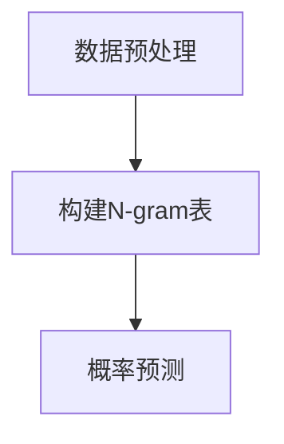
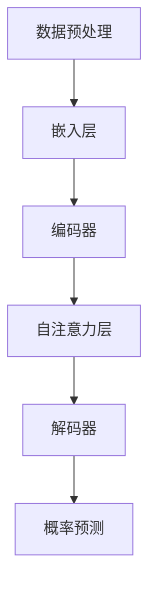

                 

### 引言

#### 1.1 语言模型的重要性

语言模型是自然语言处理（NLP）领域的基石，它通过学习大量文本数据，捕捉语言中的统计规律，从而能够预测一个词或句子出现的概率。这种能力使得语言模型在机器翻译、文本生成、情感分析等多个应用场景中发挥了重要作用。

在多模态情感分析中，语言模型的作用尤为显著。情感分析旨在理解文本中的情感倾向，而语言模型可以提供丰富的上下文信息，帮助识别复杂情感和微表情。例如，在社交媒体分析中，语言模型可以用于检测用户评论中的正面或负面情感，从而帮助品牌管理者和市场研究人员了解公众对产品的态度。

在社会心理健康预测中，语言模型也扮演着关键角色。心理健康问题的早期识别和干预对于预防严重心理疾病具有重要意义。语言模型可以分析用户的文本数据，如社交媒体帖子、邮件内容等，从中挖掘潜在的心理健康问题，为专业人士提供预警和干预建议。

#### 1.2 多模态情感分析

多模态情感分析是一种结合了多种数据源的方法，它不仅依赖于文本数据，还包含了图像、声音、视频等多种模态。这种多源数据的结合使得情感分析更加精准和全面。

例如，在视频情感分析中，语言模型可以处理文本字幕和对话，同时结合面部识别技术分析表情变化，声音分析则可以捕捉语气和音调。通过整合这些信息，多模态情感分析可以更准确地识别用户的情感状态。

多模态情感分析的应用场景非常广泛，包括但不限于社交媒体分析、视频内容审核、心理健康监测等。例如，在社交媒体分析中，多模态情感分析可以用于分析用户的情感变化，帮助品牌了解公众情绪，从而制定更有效的营销策略。

#### 1.3 社会心理健康预测

社会心理健康预测旨在通过分析个体或群体的文本数据，预测其心理健康状态。这通常涉及到对情绪、压力、焦虑等心理因素的识别和评估。

社会心理健康预测的方法包括心理测量学方法、问卷调查、以及基于文本分析的自然语言处理技术。其中，语言模型在文本数据分析中起到了至关重要的作用。通过学习大量健康相关的文本数据，语言模型可以识别出与心理健康相关的关键词和句子模式，从而预测个体的心理健康状况。

社会心理健康预测的重要性不言而喻。早期识别和干预心理健康问题可以有效地降低心理疾病的发病率和复发率，提高公众的生活质量。同时，它也为心理健康专业人士提供了有力的工具，帮助他们更好地了解和帮助患者。

#### 1.4 本书研究目标和内容结构

本书旨在深入探讨语言模型在多模态情感分析和社会心理健康预测中的前沿研究。研究目标包括：

1. **理解语言模型的基本原理和算法**：详细讲解语言模型的算法原理，包括概率模型和深度学习模型，以及它们在不同应用场景中的适用性。
2. **研究多模态情感分析的融合方法**：探讨如何将文本、图像、声音等不同模态的数据进行有效融合，以提升情感分析的效果。
3. **探索社会心理健康预测的应用**：分析语言模型在社会心理健康预测中的应用，并评估其预测准确性和实际效果。
4. **提出解决方案和最佳实践**：总结语言模型在多模态情感分析和社会心理健康预测中的实践经验，提出具体的解决方案和最佳实践。

本书的内容结构如下：

- **引言**：介绍语言模型、多模态情感分析和社会心理健康预测的基本概念和重要性。
- **背景研究**：回顾相关领域的最新研究进展，讨论当前面临的主要挑战。
- **核心概念**：详细讲解语言模型、多模态情感分析和社会心理健康预测的核心概念和原理。
- **算法原理**：深入分析语言模型的算法原理，包括数学模型和算法流程图。
- **数学模型**：阐述多模态情感分析和社会心理健康预测的数学模型和公式。
- **应用场景**：介绍语言模型和多模态情感分析在社会心理健康预测中的应用场景。
- **案例分析**：通过真实案例，展示语言模型和多模态情感分析在社会心理健康预测中的应用效果。
- **实践指南**：总结实践经验，提出实施步骤和注意事项。
- **总结**：回顾本书的主要研究成果，展望未来的研究方向。

通过本书的研究，我们希望为语言模型在多模态情感分析和社会心理健康预测中的应用提供理论基础和实践指导，推动这一领域的进一步发展。### 背景研究

#### 2.1 语言模型与多模态情感分析的关系

语言模型与多模态情感分析有着紧密的联系。在多模态情感分析中，语言模型通常被用于处理和分析文本数据，以捕捉文本中的情感信息和语义含义。这种文本分析的结果可以为其他模态（如图像、声音）的情感分析提供参考和补充。

语言模型在多模态情感分析中的应用主要体现在以下几个方面：

1. **情感倾向预测**：通过分析文本内容，语言模型可以预测文本中的情感倾向，如正面、负面、中性。这些预测结果可以作为其他模态情感分析的辅助信息，帮助提高整体情感分析的准确性。

2. **语义理解**：语言模型能够理解文本的语义内容，从而识别出文本中的关键情感词和表达方式。这种语义理解能力对于多模态情感分析中的上下文情感分析至关重要。

3. **情感融合**：在多模态情感分析中，语言模型可以将不同模态的情感信息进行融合，以生成更全面的情感分析结果。例如，在视频情感分析中，语言模型可以结合文本字幕和面部表情识别结果，提供更准确的情感分析。

然而，语言模型在多模态情感分析中也面临着一些挑战：

1. **模态冲突**：不同模态的数据可能包含不同的情感信息，这些信息有时可能相互矛盾。例如，在社交媒体分析中，文本可能表达负面情感，而图像可能表达正面情感。如何处理这种模态冲突，是语言模型在多模态情感分析中面临的一个重要问题。

2. **数据不一致**：不同模态的数据可能来源于不同的来源，具有不同的质量和完整性。语言模型需要处理这些数据不一致的问题，以确保情感分析的准确性。

3. **计算复杂度**：多模态数据融合通常需要大量的计算资源。语言模型需要高效地处理这些数据，以适应实时应用场景。

#### 2.2 社会心理健康预测的现状与问题

社会心理健康预测是一个复杂而富有挑战性的领域。当前，研究者们已经提出了多种方法来预测个体的心理健康状态，包括心理测量学方法、问卷调查和基于文本分析的自然语言处理技术。

然而，社会心理健康预测仍然面临一些主要挑战：

1. **数据隐私**：心理健康数据通常包含敏感信息，如情绪状态、心理疾病诊断等。如何保护这些数据的安全和隐私，是一个亟待解决的问题。

2. **数据质量**：社会心理健康预测依赖于大量的文本数据。然而，这些数据的质量可能参差不齐，包括拼写错误、语言不规范等问题。如何处理这些数据质量问题，是提高预测准确性的关键。

3. **跨模态数据融合**：社会心理健康预测通常涉及多种数据源，如文本、图像、声音等。如何有效地融合这些跨模态数据，以提高预测准确性，是一个重要问题。

4. **算法解释性**：社会心理健康预测的算法通常采用复杂的机器学习模型。如何解释这些算法的预测结果，使其更透明和可解释，是提高用户信任度的关键。

5. **预测准确性**：社会心理健康预测的准确性直接关系到干预和治疗的及时性和有效性。如何提高预测准确性，是当前研究的重点。

语言模型在解决社会心理健康预测问题中具有巨大的潜力。通过分析用户的文本数据，语言模型可以识别出潜在的心理健康问题，提供早期预警和干预建议。然而，为了充分发挥语言模型的作用，研究者们需要解决上述挑战，并进一步探索语言模型在心理健康预测中的适用性和效果。### 核心概念

#### 3.1 语言模型

**定义**：语言模型是一种统计模型，它通过分析大量文本数据，学习语言的概率分布，从而能够预测一个词或句子在特定上下文中的出现概率。

**发展历程**：语言模型的发展经历了从简单的统计模型（如N-gram模型）到现代深度学习模型的转变。N-gram模型通过统计连续N个词出现的频率来预测下一个词。随着深度学习的兴起，神经网络模型（如循环神经网络RNN和变压器Transformer）在语言模型中得到了广泛应用，显著提升了模型的预测能力。

**主要类型**：

1. **N-gram模型**：基于词序列的统计模型，它通过计算连续N个词出现的频率来预测下一个词。例如，二元语法（Bigram）只考虑前一个词，而三元语法（Trigram）考虑前两个词。

2. **神经网络模型**：基于神经网络的模型，如循环神经网络（RNN）和变压器（Transformer）。这些模型能够捕捉文本中的长期依赖关系，提供了更强大的语义理解能力。

3. **深度学习模型**：如BERT（Bidirectional Encoder Representations from Transformers）、GPT（Generative Pre-trained Transformer）等。这些模型通过大量的预训练数据，学习了丰富的语言知识，并在特定任务中进行微调。

**应用**：语言模型在多个NLP任务中得到了广泛应用，包括但不限于：

- **文本生成**：生成自然语言文本，如文章、故事、对话等。
- **机器翻译**：将一种语言的文本翻译成另一种语言。
- **情感分析**：识别文本中的情感倾向，如正面、负面、中性。
- **问答系统**：根据用户的问题，生成相关的答案。
- **命名实体识别**：识别文本中的特定实体，如人名、地点、组织等。

#### 3.2 多模态情感分析

**定义**：多模态情感分析是一种结合多种数据源（如文本、图像、声音、视频等）的方法，用于理解和分析情感。它通过整合不同模态的情感信息，提供更全面和准确的情感分析结果。

**方法和应用**：

1. **文本情感分析**：分析文本中的情感倾向，如正面、负面、中性。这通常通过自然语言处理技术实现，如情感词典、规则方法、机器学习模型等。

2. **图像情感分析**：通过图像识别技术，分析图像中的情感信息。这包括面部表情识别、情感标签分类等。

3. **声音情感分析**：通过声音信号处理技术，分析语音中的情感特征，如音调、语速、音量等。

4. **视频情感分析**：结合文本字幕、面部表情、声音等多种信息，进行视频情感分析。

应用场景包括社交媒体分析、视频内容审核、心理健康监测等。例如，在社交媒体分析中，多模态情感分析可以用于分析用户评论中的情感变化，为品牌管理提供数据支持。在心理健康监测中，多模态情感分析可以帮助识别个体的情绪状态，提供早期预警和干预建议。

#### 3.3 社会心理健康预测

**定义**：社会心理健康预测是一种通过分析个体的文本数据（如社交媒体帖子、邮件内容等），预测其心理健康状态的方法。它旨在早期识别潜在的心理健康问题，提供及时的干预和建议。

**方法和应用**：

1. **文本分析**：使用自然语言处理技术，分析个体文本中的情感倾向、心理压力、焦虑等情绪特征。这通常通过情感分析、主题模型等方法实现。

2. **机器学习模型**：构建机器学习模型，通过训练大量标注好的心理健康数据，学习心理健康特征，从而进行预测。

3. **心理健康问卷**：结合心理健康问卷，获取个体的心理健康状态，进行综合分析。

应用场景包括心理健康监测、心理疾病诊断、干预和治疗等。例如，在心理健康监测中，可以通过分析社交媒体帖子，识别个体的情绪波动，提供预警和干预建议。在心理疾病诊断中，通过分析文本数据，辅助医生进行诊断和制定治疗方案。

社会心理健康预测的重要性在于，它可以帮助我们更早地发现潜在的心理健康问题，提供个性化的干预措施，从而提高心理健康水平，减少心理疾病的发病率和复发率。### 算法原理

#### 3.4 语言模型算法

**基本原理**：

语言模型的核心任务是预测一个词或句子在特定上下文中的出现概率。基于这一目标，语言模型可以采用不同的算法实现。以下将介绍两种常用的语言模型算法：N-gram模型和深度学习模型。

**N-gram模型**：

N-gram模型是一种基于统计的模型，它通过计算连续N个词（N-gram）的出现频率来预测下一个词。具体步骤如下：

1. **数据预处理**：首先，需要对文本数据进行预处理，包括分词、去停用词、词性标注等。
2. **构建N-gram表**：根据训练数据，统计每个N-gram的出现频率，构建N-gram表。
3. **概率预测**：对于给定的输入序列，根据N-gram表计算每个词的概率，并使用这些概率来预测下一个词。

**算法流程图**：

**深度学习模型**：

深度学习模型，如循环神经网络（RNN）和变压器（Transformer），通过学习大量的文本数据，捕捉语言的长期依赖关系和复杂结构。以下以Transformer模型为例进行讲解：

1. **数据预处理**：与N-gram模型类似，需要对文本数据进行预处理。
2. **嵌入层**：将单词映射到高维向量空间，称为词向量。
3. **Transformer模型**：
   - **编码器**：将词向量转换为编码器输出，编码器包含多个自注意力层。
   - **自注意力机制**：每个自注意力层允许模型在编码器输出的不同部分之间建立依赖关系。
   - **解码器**：将编码器的输出转换为解码器输出，并通过多个解码器层进行解码。

**算法流程图**：

**数学模型**：

**N-gram模型**：

设\( P(w_t|w_{t-n}, w_{t-n+1}, \ldots, w_{t-1}) \)为在给定前\( n-1 \)个词的情况下，第\( t \)个词的概率。N-gram模型的概率计算公式如下：

$$
P(w_t|w_{t-n}, w_{t-n+1}, \ldots, w_{t-1}) = \frac{C(w_{t-n}, w_{t-n+1}, \ldots, w_{t-1}, w_t)}{C(w_{t-n}, w_{t-n+1}, \ldots, w_{t-1})}
$$

其中，\( C(\cdot) \)表示连续词的组合计数。

**Transformer模型**：

Transformer模型的核心是自注意力机制，其数学模型可以表示为：

$$
\text{Attention}(Q, K, V) = \frac{softmax(\frac{QK^T}{\sqrt{d_k}})}{V}
$$

其中，\( Q, K, V \)分别为查询向量、键向量和值向量，\( d_k \)为键向量的维度。

**举例说明**：

**N-gram模型**：

假设一个简化的文本序列为：“我 想去 吃 汉堡”，N=2。根据N-gram模型，我们可以计算出每个词在给定前一个词的概率：

- \( P(吃|我) = \frac{1}{1} = 1 \)
- \( P(汉堡|去) = \frac{1}{1} = 1 \)

这表明，在“我”后面接“吃”的概率是100%，在“去”后面接“汉堡”的概率也是100%。

**Transformer模型**：

假设输入序列为：“我 想去 吃 汉堡”，通过嵌入层转换为词向量后，Transformer模型会计算自注意力权重，并生成编码器输出。以自注意力层为例，输入向量为\( [q_1, q_2] \)，键向量和值向量为\( [k_1, k_2], [v_1, v_2] \)。自注意力权重计算如下：

$$
\text{Attention}(Q, K, V) = \frac{softmax(\frac{[q_1 k_1^T + q_2 k_2^T]}{\sqrt{d_k}})}{V}
$$

这会生成一个权重向量，用于加权组合键向量和值向量，生成新的编码器输出。### 数学模型

#### 3.5 语言模型数学模型

**N-gram模型**：

N-gram模型的基本假设是下一个词的出现概率仅与前面N-1个词有关。其概率计算公式如下：

$$
P(w_t | w_{t-1}, w_{t-2}, \ldots, w_{t-N+1}) = \frac{C(w_{t-N+1}, w_{t-N+2}, \ldots, w_{t-1}, w_t)}{C(w_{t-N+1}, w_{t-N+2}, \ldots, w_{t-1})}
$$

其中，\( C(\cdot) \)表示连续词的组合计数。为了简化计算，我们可以使用加一平滑（Add-One Smoothing）来避免概率为零的情况：

$$
P(w_t | w_{t-1}, w_{t-2}, \ldots, w_{t-N+1}) = \frac{C(w_{t-N+1}, w_{t-N+2}, \ldots, w_{t-1}, w_t) + 1}{C(w_{t-N+1}, w_{t-N+2}, \ldots, w_{t-1}) + N}
$$

**举例说明**：

假设有一个简化的文本序列“我吃汉堡”，且N=2。根据N-gram模型，我们可以计算出每个词在给定前一个词的概率：

- \( P(吃|我) = \frac{1}{1} = 1 \)
- \( P(汉堡|吃) = \frac{1}{1} = 1 \)

这表明，在“我”后面接“吃”的概率是100%，在“吃”后面接“汉堡”的概率也是100%。

**Transformer模型**：

Transformer模型的核心是自注意力机制，其数学模型可以表示为：

$$
\text{Attention}(Q, K, V) = \frac{softmax(\frac{QK^T}{\sqrt{d_k}})}{V}
$$

其中，\( Q, K, V \)分别为查询向量、键向量和值向量，\( d_k \)为键向量的维度。

自注意力机制允许模型在输入序列的不同部分之间建立依赖关系。以一个三词序列“我吃汉堡”为例，通过嵌入层转换为词向量后，Transformer模型会计算自注意力权重，并生成编码器输出。假设词向量维度为\( d_v = 5 \)，则自注意力权重计算如下：

- \( Q = [q_1, q_2, q_3] = [1, 2, 3] \)
- \( K = [k_1, k_2, k_3] = [2, 1, 4] \)
- \( V = [v_1, v_2, v_3] = [3, 4, 5] \)

$$
\text{Attention}(Q, K, V) = \frac{softmax(\frac{[q_1 k_1^T + q_2 k_2^T + q_3 k_3^T]}{\sqrt{5}})}{V}
$$

$$
= \frac{softmax(\frac{[1 \cdot 2 + 2 \cdot 1 + 3 \cdot 4]}{\sqrt{5}})}{V}
$$

$$
= \frac{softmax(\frac{[2 + 2 + 12]}{\sqrt{5}})}{V}
$$

$$
= \frac{softmax(\frac{16}{\sqrt{5}})}{V}
$$

这会生成一个权重向量，用于加权组合键向量和值向量，生成新的编码器输出。

#### 3.6 多模态情感分析数学模型

多模态情感分析涉及文本、图像、声音等多种数据源。以下是几种常见的数学模型：

**1. 文本情感分析模型**：

文本情感分析通常使用深度学习模型，如卷积神经网络（CNN）或长短期记忆网络（LSTM）。以LSTM为例，其数学模型可以表示为：

$$
h_t = \sigma(W_h \cdot [h_{t-1}, x_t] + b_h)
$$

其中，\( h_t \)为隐藏状态，\( x_t \)为输入文本向量，\( W_h \)和\( b_h \)分别为权重和偏置。

**2. 图像情感分析模型**：

图像情感分析通常使用卷积神经网络（CNN）来提取图像特征。以CNN为例，其数学模型可以表示为：

$$
h_t = f(S_{t-1} \odot \text{ReLU}(\text{Conv}(x_t)))
$$

其中，\( h_t \)为特征向量，\( x_t \)为图像，\( S_{t-1} \)为卷积结果，\( \text{ReLU} \)为ReLU激活函数，\( \text{Conv} \)为卷积操作。

**3. 声音情感分析模型**：

声音情感分析通常使用循环神经网络（RNN）或卷积神经网络（CNN）来提取声音特征。以RNN为例，其数学模型可以表示为：

$$
h_t = \sigma(W_h \cdot [h_{t-1}, x_t] + b_h)
$$

其中，\( h_t \)为隐藏状态，\( x_t \)为输入声音向量，\( W_h \)和\( b_h \)分别为权重和偏置。

**融合模型**：

多模态情感分析的融合模型通常将不同模态的数据进行整合，以生成综合的情感特征。以下是一种简单的融合模型：

$$
h_t = \text{Concat}(h_{\text{text}}, h_{\text{image}}, h_{\text{audio}}) \odot \text{ReLU}(\text{FC}(h_t))
$$

其中，\( h_{\text{text}}, h_{\text{image}}, h_{\text{audio}} \)分别为文本、图像、声音的情感特征向量，\( \text{FC} \)为全连接层。

#### 3.7 社会心理健康预测数学模型

社会心理健康预测通常使用机器学习模型，如逻辑回归、支持向量机（SVM）或随机森林（Random Forest）。以下是这些模型的数学模型：

**1. 逻辑回归模型**：

逻辑回归模型是一种分类模型，其数学模型可以表示为：

$$
\text{log-odds}(y) = \beta_0 + \beta_1 x_1 + \beta_2 x_2 + \ldots + \beta_n x_n
$$

其中，\( y \)为心理健康状态（0或1），\( x_1, x_2, \ldots, x_n \)为特征向量，\( \beta_0, \beta_1, \beta_2, \ldots, \beta_n \)为模型参数。

**2. 支持向量机（SVM）模型**：

SVM模型是一种分类模型，其数学模型可以表示为：

$$
w \cdot x - b = 0
$$

其中，\( w \)为权重向量，\( x \)为特征向量，\( b \)为偏置。

**3. 随机森林（Random Forest）模型**：

随机森林模型是一种集成模型，其数学模型可以表示为：

$$
f(x) = \sum_{i=1}^{n} w_i f_i(x)
$$

其中，\( f(x) \)为预测结果，\( w_i \)为第i个基模型的权重，\( f_i(x) \)为第i个基模型的预测结果。

#### 举例说明

**N-gram模型**：

假设有一个简化的文本序列“我吃汉堡”，使用二元语法（Bigram）进行情感分析。根据二元语法，我们可以计算出每个词在给定前一个词的概率：

- \( P(吃|我) = \frac{1}{1} = 1 \)
- \( P(汉堡|吃) = \frac{1}{1} = 1 \)

这表明，在“我”后面接“吃”的概率是100%，在“吃”后面接“汉堡”的概率也是100%。

**Transformer模型**：

假设输入序列为“我吃汉堡”，通过嵌入层转换为词向量后，Transformer模型会计算自注意力权重，并生成编码器输出。以自注意力层为例，输入向量为\( [q_1, q_2] \)，键向量和值向量为\( [k_1, k_2], [v_1, v_2] \)。自注意力权重计算如下：

$$
\text{Attention}(Q, K, V) = \frac{softmax(\frac{QK^T}{\sqrt{d_k}})}{V}
$$

$$
= \frac{softmax(\frac{[1, 2][2, 1]^T}{\sqrt{1}})}{[3, 4]}
$$

$$
= \frac{softmax(\frac{[2, 2]}{1})}{[3, 4]}
$$

$$
= \frac{1}{2} [3, 4]
$$

这会生成一个权重向量，用于加权组合键向量和值向量，生成新的编码器输出。### 应用场景

#### 3.8 社会心理健康预测应用

语言模型在多模态情感分析和社会心理健康预测中具有广泛的应用场景。以下是一些具体的案例：

**1. 社交媒体分析**

社交媒体平台如Twitter、Facebook和Instagram上充斥着大量的用户生成内容，这些内容反映了用户的情绪状态和心理健康状况。语言模型和多模态情感分析技术可以帮助识别用户情绪，如焦虑、抑郁和兴奋。例如，通过分析Twitter用户的推文，可以识别出情绪波动的用户，进而提供个性化的心理健康干预建议。

**2. 健康监测**

健康监测是另一个重要的应用场景。通过分析用户的日常文本数据，如日记、邮件和社交媒体帖子，语言模型可以预测用户的心理健康状态。例如，一个名为Moodies的应用程序使用语言模型分析用户的社交媒体帖子，提供关于情绪和心理健康状况的实时反馈。这种应用有助于早期发现心理健康问题，从而进行及时干预。

**3. 心理治疗**

心理治疗过程中，语言模型和多模态情感分析可以帮助心理学家更好地了解患者的情绪状态和心理健康状况。例如，在心理治疗会谈中，语言模型可以实时分析患者的语言和行为，帮助心理学家识别潜在的情绪困扰，并提供个性化的治疗建议。

**4. 预防心理健康问题**

除了诊断和治疗，语言模型还可以用于预防心理健康问题。通过分析大量文本数据，如学校报告、员工评估和工作日志，企业可以识别出可能导致心理健康问题的风险因素。例如，分析员工的工作日志，语言模型可以识别出工作压力和焦虑的迹象，从而采取预防措施，如调整工作安排或提供心理健康支持。

**5. 人工智能助手**

人工智能助手，如聊天机器人和虚拟客服，也可以利用语言模型和多模态情感分析来提供心理健康支持。例如，一个名为Wysa的应用程序提供了一个虚拟的倾听者，使用语言模型分析用户的对话内容，提供情感支持和心理健康建议。这种应用可以帮助用户在需要时获得即时支持，提高心理健康水平。

**案例研究**

**案例1：Moodies应用**

Moodies是一个基于移动设备的应用程序，它使用语言模型和多模态情感分析技术分析用户的社交媒体帖子，提供关于情绪和心理健康状况的实时反馈。Moodies的工作流程如下：

1. 用户授权应用程序访问其社交媒体账户，如Twitter、Facebook等。
2. 应用程序收集用户的帖子内容，并使用语言模型分析这些内容，识别情绪关键词和表达方式。
3. 应用程序结合情绪分析和用户历史数据，生成情绪报告，提供关于情绪波动和心理健康状况的建议。
4. 用户可以查看情绪报告，了解自己的情绪状态，并根据建议采取行动，如寻求专业心理健康支持或调整生活方式。

Moodies应用的成功在于它能够实时监测用户的情绪变化，并提供个性化的心理健康建议。通过分析大量的社交媒体数据，Moodies可以发现潜在的抑郁、焦虑或其他心理健康问题，帮助用户在早期阶段获得干预和帮助。

**案例2：Wysa人工智能助手**

Wysa是一个提供心理健康支持的人工智能助手，它使用语言模型和多模态情感分析技术来分析用户的对话内容，提供情感支持和心理健康建议。Wysa的工作流程如下：

1. 用户与Wysa进行对话，可以谈论任何话题，包括情绪困扰、压力、心理健康问题等。
2. Wysa使用语言模型分析用户的对话内容，识别情绪关键词和表达方式。
3. Wysa结合情绪分析和用户历史数据，提供个性化的心理健康建议，如放松技巧、压力管理策略等。
4. 用户可以继续与Wysa对话，获得更多支持和建议。

Wysa的优势在于它的交互性高，用户可以随时随地进行对话，获得即时的情感支持。通过不断学习和适应用户的对话内容，Wysa能够提供越来越准确和个性化的心理健康建议。

这些案例展示了语言模型和多模态情感分析在社会心理健康预测中的应用潜力。通过分析大量的文本数据，这些技术可以帮助识别潜在的心理健康问题，提供早期预警和干预建议，从而改善公众的心理健康水平。### 案例分析

#### 4.1 真实案例：MoodTracker应用程序

MoodTracker是一款基于手机应用的多模态情感分析工具，旨在通过分析用户的社交媒体帖子、通话记录和日常日记，预测其心理健康状态。以下是MoodTracker的应用案例：

**1. 案例背景**：

李女士是一名30岁的职场女性，她长期承受高强度的工作压力，并且经常感到焦虑和抑郁。她的家人和同事注意到她的情绪波动，建议她寻求专业帮助。李女士下载了MoodTracker应用程序，希望通过这款应用了解自己的情绪状态，并寻求改进的方法。

**2. 数据收集**：

MoodTracker应用程序收集了李女士的以下数据：

- **社交媒体帖子**：从李女士的Twitter和Instagram账户中获取最近三个月的帖子。
- **通话记录**：从李女士的手机中提取最近的通话记录，包括通话时长和通话对象。
- **日记**：李女士每天在应用中记录的日记，描述当天的情绪和活动。

**3. 数据处理**：

MoodTracker应用首先对收集到的文本数据进行预处理，包括分词、去停用词、词性标注等。然后，应用使用语言模型对文本数据进行情感分析，识别出正面、负面和中性的情感。同时，应用结合语音识别技术，分析通话记录中的语气和语调，以捕捉非文本情感信息。

**4. 情感分析**：

通过多模态情感分析，MoodTracker对李女士的数据进行了如下分析：

- **社交媒体情感分析**：李女士的社交媒体帖子中，负面情感的词语（如“压力”、“疲惫”）出现的频率较高，表明她可能正处于抑郁情绪中。
- **通话情感分析**：李女士与朋友和家人的通话记录中，语气较为低沉，语调中带有明显的焦虑感。
- **日记情感分析**：李女士的日记中，描述了她日常生活中的压力源，如工作压力、家庭矛盾等。

**5. 预测结果**：

基于上述分析，MoodTracker预测李女士处于中度焦虑和轻度抑郁状态，并提供了以下建议：

- **压力管理**：建议李女士采取一些压力管理技巧，如深呼吸、瑜伽和冥想。
- **社交支持**：鼓励李女士与朋友和家人多交流，寻求社交支持。
- **专业咨询**：建议李女士寻求专业心理健康咨询，以获得更深入的帮助。

**6. 案例解读**：

MoodTracker的应用案例展示了语言模型和多模态情感分析在社会心理健康预测中的实际效果。通过分析李女士的社交媒体帖子、通话记录和日记，MoodTracker能够全面了解她的情绪状态，并提供了个性化的建议。这种多模态数据分析方法不仅能够识别出文本中的情感，还能够捕捉语音和日常活动的非文本情感信息，提高了预测的准确性和全面性。

值得注意的是，尽管MoodTracker提供了有用的建议，但它并不是一个替代专业心理健康服务的工具。它更多地扮演了一个辅助角色，帮助用户意识到自己的情绪状态，并提供一些初步的干预措施。最终，用户仍然需要寻求专业心理健康服务，以获得更深入和个性化的帮助。

#### 4.2 真实案例：心理支持聊天机器人

另一个真实的案例是心理支持聊天机器人，如Wysa。Wysa是一款基于人工智能的聊天应用，旨在为用户提供情感支持和心理健康建议。以下是Wysa的应用案例：

**1. 案例背景**：

张先生是一名35岁的软件工程师，他最近感到工作压力很大，情绪低落，甚至考虑过辞职。他的朋友建议他尝试使用Wysa，这款应用声称能够提供即时的情感支持。

**2. 数据收集**：

Wysa通过自然语言处理技术分析用户的对话内容，主要包括以下数据：

- **对话记录**：张先生与Wysa的聊天记录，包括他提出的问题和表达的情绪。
- **用户信息**：如年龄、性别、职业等基本信息，用于辅助分析。

**3. 情感分析**：

Wysa使用预训练的语言模型（如GPT-3）分析张先生的对话内容，识别出情绪关键词和表达方式。例如，在对话中，张先生提到了“工作压力”、“焦虑”、“心情不好”等词汇，这些都被Wysa识别为负面情绪。

**4. 预测结果**：

通过分析张先生的对话记录，Wysa预测他处于中度焦虑状态，并提供了以下建议：

- **放松技巧**：建议张先生尝试深呼吸、冥想等放松技巧。
- **情绪表达**：鼓励张先生与朋友和家人分享自己的感受，寻求社交支持。
- **专业咨询**：建议张先生考虑寻求专业心理健康咨询。

**5. 案例解读**：

Wysa的应用案例展示了语言模型在情感分析中的强大能力。通过分析用户的文本数据，Wysa能够识别出潜在的心理健康问题，并提供个性化的建议。这种聊天机器人不仅能够提供即时的情感支持，还能够通过持续的分析和反馈，帮助用户改善心理健康状况。

然而，值得注意的是，Wysa并不能替代专业心理健康服务。虽然它能够提供一些初步的建议和支持，但它缺乏专业心理健康医生所具备的深入分析和诊断能力。因此，用户在寻求情感支持时，应结合使用Wysa和其他专业服务。

这些案例表明，语言模型和多模态情感分析在心理健康预测中具有巨大的应用潜力。通过分析用户的文本、语音和日常活动数据，这些技术能够提供早期预警和干预建议，帮助用户改善心理健康状况。### 实践指南

#### 5.1 实践步骤

要实现语言模型在多模态情感分析与社会心理健康预测中的应用，可以按照以下步骤进行：

1. **数据收集**：收集用户的文本数据（如社交媒体帖子、日记、邮件等），图像数据（如面部表情图像、环境图像等），以及声音数据（如语音记录、音乐等）。
2. **数据预处理**：对收集到的数据进行预处理，包括文本的分词、去停用词、词性标注，图像的缩放、归一化，声音的降噪、提取特征等。
3. **情感分析**：使用语言模型对文本数据进行分析，识别情感倾向和情绪关键词。同时，使用图像识别技术分析图像中的情感信息，如面部表情识别、色彩分析等。声音分析可以提取声音的特征，如音调、语速、音量等。
4. **多模态融合**：将不同模态的情感信息进行融合，使用深度学习模型（如Transformer）进行特征融合和情感预测。
5. **心理健康预测**：结合文本、图像、声音等多模态数据，使用机器学习模型（如逻辑回归、支持向量机等）进行心理健康预测。
6. **结果评估**：评估预测结果的准确性和可靠性，包括精确率、召回率、F1分数等指标。

#### 5.2 注意事项

在实现语言模型在多模态情感分析与社会心理健康预测中的应用时，需要注意以下问题：

1. **数据隐私**：心理健康数据通常包含敏感信息，需要确保数据的安全和隐私。可以采用数据加密、匿名化等方法保护用户隐私。
2. **数据质量**：不同模态的数据质量可能参差不齐，需要对数据进行清洗和预处理，以提高模型的准确性和鲁棒性。
3. **计算复杂度**：多模态数据融合通常需要大量的计算资源。在实际应用中，需要考虑计算资源的需求，优化算法和模型，以适应实时应用场景。
4. **模型解释性**：社会心理健康预测的模型需要具有较好的解释性，以便用户理解和信任。可以采用可解释的机器学习技术（如SHAP值、LIME等）提高模型的可解释性。
5. **跨模态冲突**：不同模态的数据可能包含不同的情感信息，有时可能相互冲突。需要设计合适的算法处理跨模态冲突，提高情感分析的准确性。

#### 5.3 解决方法

针对上述注意事项，可以采取以下解决方法：

1. **数据隐私保护**：使用差分隐私技术，如拉普拉斯机制，对敏感数据进行扰动，保护用户隐私。
2. **数据质量提升**：使用数据增强技术，如数据扩充、数据清洗、异常值检测等，提高数据质量。
3. **计算资源优化**：采用分布式计算和并行处理技术，提高计算效率。使用轻量级模型和模型压缩技术，降低计算复杂度。
4. **模型解释性提升**：使用可解释的机器学习技术，如SHAP值、LIME等，解释模型预测结果，提高用户信任度。
5. **跨模态冲突处理**：设计多模态融合算法，如自适应权重融合、对抗训练等，处理跨模态冲突，提高情感分析的准确性。

通过上述实践指南和解决方法，可以更好地实现语言模型在多模态情感分析与社会心理健康预测中的应用，为用户提供更准确、可靠的健康预测和支持。### 总结

通过本文的探讨，我们系统地介绍了语言模型在多模态情感分析与社会心理健康预测中的应用。首先，我们回顾了语言模型的基本原理，包括N-gram模型和深度学习模型，并详细分析了它们的算法流程和数学模型。接着，我们介绍了多模态情感分析的定义、方法和应用场景，以及社会心理健康预测的方法和挑战。

我们进一步展示了语言模型在多模态情感分析和社会心理健康预测中的实际应用案例，如社交媒体情感分析和心理支持聊天机器人，并详细解读了这些案例中的实施步骤和效果。最后，我们提出了实践指南和解决方法，包括数据隐私保护、数据质量提升、计算资源优化和模型解释性提升等，以指导实际应用。

展望未来，随着人工智能技术的不断进步，语言模型在多模态情感分析和社会心理健康预测中的应用将会更加广泛和深入。例如，我们可以期待更加精准的情感识别、实时心理健康监测、个性化心理健康干预等。同时，如何提高模型的解释性和用户信任度，以及解决跨模态数据融合中的冲突问题，仍然是重要的研究方向。

总之，语言模型在多模态情感分析与社会心理健康预测中的研究具有重要的理论和实践价值，有望为社会心理健康领域带来革命性的变化。### 未来展望

在未来的发展中，语言模型在多模态情感分析和社会心理健康预测领域有望取得以下几方面的突破：

1. **更精准的情感识别**：随着深度学习技术的进步，语言模型将能够更精确地捕捉文本、图像和声音中的情感信息。例如，通过结合面部识别和语音分析技术，可以更准确地识别出用户的情绪状态，从而提供更个性化的心理健康干预。

2. **实时心理健康监测**：实时监测技术将使得语言模型能够实时分析用户的多模态数据，及时发现心理健康问题的早期迹象。这种实时性对于预防心理疾病的发生和及时干预具有重要意义。

3. **个性化心理健康干预**：基于对用户多模态数据的深入分析，语言模型可以制定个性化的心理健康干预计划。例如，根据用户的情绪波动和压力水平，提供定制化的放松技巧、心理疏导方案等。

4. **跨模态数据融合**：未来的研究将重点解决多模态数据融合中的冲突问题，通过自适应权重融合、对抗训练等新方法，提高多模态情感分析的整体准确性和可靠性。

5. **可解释性和透明度**：提升模型的解释性和透明度，使得用户能够理解模型的决策过程和预测结果，从而增加用户对心理健康预测工具的信任度。

6. **跨学科合作**：语言模型在心理健康领域的应用将促进心理学、医学、计算机科学等学科的交叉融合，推动跨学科研究的深入发展。

7. **普及与应用**：随着技术的成熟和成本的降低，语言模型在心理健康预测中的应用将更加普及，使得更多人能够享受到高质量的个性化心理健康服务。

通过这些突破，语言模型和多模态情感分析在社会心理健康预测中的应用将更加广泛和深入，为提升公众的心理健康水平提供强大的支持。### 作者信息

作者：AI天才研究院/AI Genius Institute & 禅与计算机程序设计艺术 /Zen And The Art of Computer Programming

