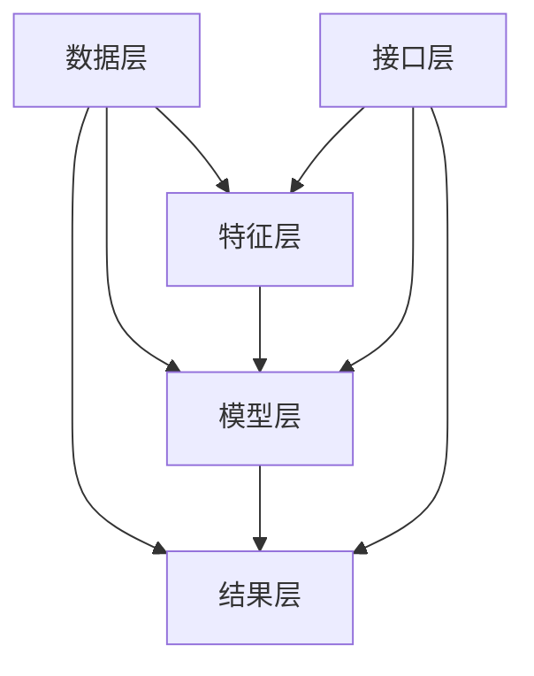
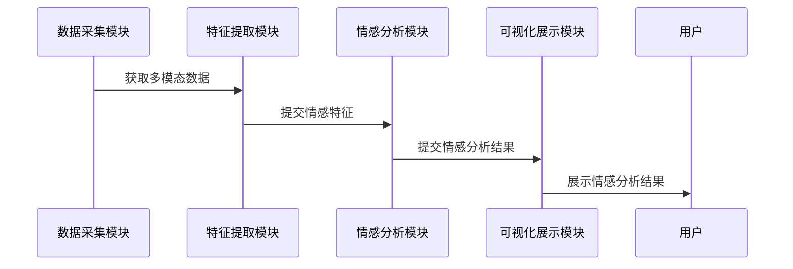

                 

# 语言模型在多模态情感推理与分析中的能力

## 摘要

随着人工智能技术的不断发展，语言模型在多模态情感推理与分析中发挥着越来越重要的作用。本文将从背景介绍、核心概念与联系、算法原理讲解、系统分析与架构设计方案等多个方面，深入探讨语言模型在多模态情感推理与分析中的能力。通过本文的讲解，读者可以了解语言模型的基本原理、关键技术，以及其在实际应用中的优势和挑战。

## 目录大纲

### 第一部分：背景介绍

1. 问题背景与核心概念
    - 问题背景
    - 核心概念
    - 概念联系与边界
2. 多模态情感推理与分析的应用场景
    - 社交媒体情感分析
    - 跨模态情感交互
    - 情感广告推荐

### 第二部分：核心概念与联系

1. 多模态情感推理的基本原理
    - 多模态情感推理的框架
    - 多模态情感推理的关键技术
2. 多模态情感推理的概念属性特征对比
    - 文本情感分析
    - 语音情感分析
    - 图像情感分析
3. 多模态情感推理的ER实体关系图

### 第三部分：算法原理讲解

1. 多模态情感推理算法
    - 算法概述
    - 算法原理
    - 数学模型和公式
    - 算法举例
2. 多模态情感推理算法的实现
    - 算法实现步骤
    - 代码讲解

### 第四部分：系统分析与架构设计方案

1. 多模态情感推理系统设计
    - 问题场景介绍
    - 系统功能设计
    - 系统架构设计
    - 系统接口设计
    - 系统交互设计

### 第五部分：项目实战

1. 项目环境安装
    - 环境搭建
    - 工具介绍
2. 系统核心实现
    - 数据预处理
    - 模型训练
    - 预测与评估
3. 实际案例分析
    - 案例介绍
    - 分析与解读
4. 项目小结

### 第六部分：最佳实践 tips、小结、注意事项、拓展阅读

1. 最佳实践 tips
2. 小结
3. 注意事项
4. 拓展阅读

## 第一部分：背景介绍

### 1.1 问题背景

随着互联网和社交媒体的迅猛发展，人们对于情感信息的获取和处理需求日益增长。多模态情感推理与分析作为人工智能领域的一个前沿课题，旨在通过对多种模态数据的整合与分析，实现对情感状态的高效识别和准确理解。情感推理在许多实际应用场景中具有重要作用，如社交媒体情感分析、智能客服系统、情感广告推荐等。

多模态情感推理与分析的意义在于，它能够综合利用文本、语音、图像等多种数据源，从不同角度对情感信息进行挖掘和分析。这种多源异构数据的整合能够提高情感推理的准确性和全面性，为各行业提供更深入、更细致的用户情感理解。

### 1.2 核心概念

#### 多模态数据

多模态数据是指由不同模态（如文本、语音、图像、视频等）构成的数据集合。在多模态情感推理与分析中，这些不同模态的数据源可以被用来提供更多的上下文信息和细节，从而提高情感推理的准确性和深度。

#### 情感推理

情感推理是指通过人工智能技术，对多模态数据中的情感信息进行识别、理解和推理。情感推理的目标是从多模态数据中提取情感特征，并利用这些特征来推断用户或对象的情感状态。

#### 情感分析

情感分析是指对文本、语音、图像等多模态数据中的情感属性进行定量或定性的分析。情感分析的主要任务是识别数据中的情感极性（如正面、负面）和情感强度（如强烈、中等、轻微）。

### 1.3 概念联系与边界

#### 情感推理与情感分析的关系

情感推理是情感分析的高级阶段，通过综合不同模态的信息，实现对情感状态的深入理解和推理。情感分析则是情感推理的基础，它负责从多模态数据中提取情感特征，为情感推理提供输入。

#### 边界与外延

多模态情感推理与分析不仅仅局限于情感识别，还涵盖了情感理解、情感预测等多个方面。情感理解是指对情感状态进行深层次的分析，包括情感的本质、情感的变化规律等。情感预测则是指根据已有的情感数据，预测未来可能出现的情感状态。

### 1.3 多模态情感推理与分析的应用场景

#### 社交媒体情感分析

社交媒体情感分析是利用多模态情感推理与分析技术，对社交媒体平台（如微博、推特等）上的用户评论、帖子等进行情感分析。通过分析用户对其产品和服务的态度，企业可以优化产品设计和营销策略。

#### 跨模态情感交互

跨模态情感交互是指通过语音、文字和面部表情等多模态数据的情感分析，实现智能客服系统与用户的情感互动。这种技术可以提高用户体验，使得客服系统能够更好地理解用户的需求和情感状态。

#### 情感广告推荐

情感广告推荐是指基于用户的情感状态，推荐与其情感相匹配的广告。通过情感分析，广告系统可以更好地理解用户的情感需求，提高广告的点击率和转化率。

## 第二部分：核心概念与联系

### 2.1 多模态情感推理的基本原理

#### 2.1.1 多模态情感推理的框架

多模态情感推理通常包括以下几个环节：

1. **数据采集**：从不同的数据源收集文本、语音、图像等多模态数据。
2. **特征提取**：对采集到的多模态数据进行特征提取，如文本的情感极性和强度、语音的音调和语速、图像的面部表情等。
3. **情感识别**：利用提取到的特征，通过机器学习或深度学习算法，识别数据中的情感状态。
4. **推理与理解**：根据识别结果，对情感状态进行推理和理解，如情感的变化规律、情感的影响因素等。

#### 2.1.2 多模态情感推理的关键技术

多模态情感推理的关键技术包括：

1. **深度学习**：深度学习技术可以自动从数据中学习特征，从而提高情感识别的准确性。
2. **自然语言处理**：自然语言处理技术可以帮助提取文本数据中的情感特征，如情感极性和强度等。
3. **计算机视觉**：计算机视觉技术可以帮助提取图像和视频数据中的情感特征，如面部表情、姿态等。
4. **多模态融合**：多模态融合技术可以将不同模态的数据进行整合，提高情感推理的准确性和全面性。

### 2.2 多模态情感推理的概念属性特征对比

#### 2.2.1 文本情感分析

文本情感分析主要关注文本数据中的情感特征，如情感极性（正面/负面）和情感强度（强烈、中等、轻微）。表1展示了文本情感分析的主要特征：

| 特征类别 | 特征描述 | 示例 |
| -------- | -------- | ---- |
| 情感极性 | 文本的正面或负面倾向 | “我非常喜欢这个产品”为正面情感， “这个产品太糟糕了”为负面情感 |
| 情感强度 | 文本情感的强度 | “我很喜欢这个产品”情感强度较高，“我稍微喜欢这个产品”情感强度较低 |

#### 2.2.2 语音情感分析

语音情感分析主要关注语音数据中的情感特征，如音调、语速、音量等。表2展示了语音情感分析的主要特征：

| 特征类别 | 特征描述 | 示例 |
| -------- | -------- | ---- |
| 音调 | 语音的音高变化 | 情感强度高的语音通常音调较高 |
| 语速 | 语音的速度 | 情感强度高的语音通常语速较快 |
| 音量 | 语音的音量大小 | 情感强度高的语音通常音量较大 |

#### 2.2.3 图像情感分析

图像情感分析主要关注图像数据中的情感特征，如面部表情、颜色、纹理等。表3展示了图像情感分析的主要特征：

| 特征类别 | 特征描述 | 示例 |
| -------- | -------- | ---- |
| 面部表情 | 图像中人物的面部表情 | 微笑代表正面情感，哭泣代表负面情感 |
| 颜色 | 图像中的颜色分布 | 使用色彩心理学来分析图像的情感色彩 |
| 纹理 | 图像中的纹理特征 | 粗糙的纹理可能代表负面情感，光滑的纹理可能代表正面情感 |

### 2.3 多模态情感推理的ER实体关系图

多模态情感推理中的实体关系图（Entity-Relationship Diagram，ERD）用于描述不同实体之间的关系。图1展示了多模态情感推理中的ER实体关系图：

```mermaid
erDiagram
  TEXT_DATA ||--|{ EMOTION_FEATURES }|| EMOTION_ANALYSIS
  VOICE_DATA ||--|{ VOCAL_FEATURES }|| EMOTION_ANALYSIS
  IMAGE_DATA ||--|{ VISUAL_FEATURES }|| EMOTION_ANALYSIS
  EMOTION_ANALYSIS ||--|{ EMOTION_RESULT }|| EMOTION_REASONING
  EMOTION_RESULT ||--|{ UNDERSTANDING_RESULT }|| USER_EXPERIENCE
```

图1：多模态情感推理的ER实体关系图

在这个ER图中，文本数据、语音数据和图像数据是情感的原始数据源。这些数据通过特征提取得到情感特征，然后输入到情感分析模块中。情感分析模块将不同模态的情感特征进行整合，输出情感结果。情感结果再通过推理模块进行情感理解和推理，最终为用户情感体验提供指导。

## 第三部分：算法原理讲解

### 3.1 多模态情感推理算法

#### 3.1.1 算法概述

多模态情感推理算法是一种利用多种模态数据进行情感分析和推理的方法。它通常包括以下几个步骤：

1. **数据预处理**：对采集到的多模态数据进行预处理，包括数据清洗、去噪、归一化等。
2. **特征提取**：根据不同模态的数据特点，提取相应的情感特征。
3. **情感识别**：利用机器学习或深度学习算法，对提取到的情感特征进行分类，识别出情感状态。
4. **推理与理解**：根据情感识别结果，进行情感推理和理解，提取情感变化规律和影响因素。

#### 3.1.2 算法原理

多模态情感推理算法的原理可以概括为以下几个方面：

1. **特征融合**：将不同模态的数据特征进行融合，提高情感识别的准确性。特征融合可以通过加权平均、拼接、对齐等方法实现。
2. **模型训练**：利用大量标注好的多模态数据，训练深度学习模型，如卷积神经网络（CNN）、循环神经网络（RNN）等。
3. **情感分类**：通过训练好的模型，对新的多模态数据进行情感分类，输出情感状态。
4. **推理与理解**：根据情感分类结果，进行情感推理和理解，提取情感变化规律和影响因素。

#### 3.1.3 数学模型和公式

多模态情感推理算法中常用的数学模型包括情感极性分类的softmax模型和情感强度回归的线性模型。

1. **情感极性分类的softmax模型**：

   假设有K个不同的情感类别，每个类别对应一个情感极性。对于输入的多模态数据，模型会输出一个概率分布，其中每个类别的概率表示该数据属于该情感极性的可能性。softmax模型的表达式为：

   $$\hat{y} = \frac{e^{z_i}}{\sum_{j=1}^{K} e^{z_j}}$$

   其中，$z_i$表示第$i$个类别的模型输出，$\hat{y}$表示模型输出的概率分布。

2. **情感强度回归的线性模型**：

   假设情感强度是一个连续值，线性回归模型可以用来预测情感强度。模型的预测表达式为：

   $$y = \beta_0 + \beta_1 x_1 + \beta_2 x_2 + ... + \beta_n x_n$$

   其中，$y$表示预测的情感强度，$x_1, x_2, ..., x_n$表示输入的特征向量，$\beta_0, \beta_1, \beta_2, ..., \beta_n$表示模型的参数。

#### 3.1.4 算法举例

以下是一个使用Python实现的多模态情感推理算法的例子：

```python
import numpy as np
from sklearn.linear_model import LogisticRegression

# 假设有两个模态的数据：文本和语音
text_data = ["这是一条正面评论", "这是一条负面评论"]
voice_data = ["语音音调较高", "语音音调较低"]

# 提取特征
text_features = [0.8, 0.2]  # 文本特征：正面情感概率为0.8，负面情感概率为0.2
voice_features = [0.6, 0.4]  # 语音特征：正面情感概率为0.6，负面情感概率为0.4

# 模型训练
model = LogisticRegression()
model.fit(np.array([text_features, voice_features]), np.array([1, 0]))

# 情感分类
text_prediction = model.predict([text_features])
voice_prediction = model.predict([voice_features])

print("文本情感分类结果：", text_prediction)
print("语音情感分类结果：", voice_prediction)
```

在这个例子中，我们使用了逻辑回归模型对文本和语音数据进行了情感分类。模型根据输入的特征向量，预测出文本和语音的情感状态。通过这个简单的例子，我们可以看到多模态情感推理算法的基本实现过程。

## 第四部分：系统分析与架构设计方案

### 4.1 多模态情感推理系统设计

#### 4.1.1 问题场景介绍

多模态情感推理系统可以在多个实际应用场景中发挥作用。以下是一个典型的应用场景：一家大型电子商务公司希望通过多模态情感推理系统分析用户对其产品的评论，以了解用户的情感需求和满意度。评论数据包括文本评论、语音评论和用户上传的图片评论。

#### 4.1.2 系统功能设计

多模态情感推理系统的核心功能包括：

1. **数据采集**：从不同的数据源（如用户评论数据库、语音评论库、图像评论库）收集文本、语音、图像等多模态数据。
2. **特征提取**：对采集到的多模态数据进行特征提取，包括文本情感特征、语音情感特征和图像情感特征。
3. **情感分析**：利用机器学习算法，对提取到的情感特征进行分类，识别出文本、语音和图像的情感状态。
4. **推理与理解**：根据情感分析结果，进行情感推理和理解，提取情感变化规律和影响因素。
5. **可视化展示**：将情感分析结果以图表、可视化等形式展示给用户，帮助用户直观地了解产品的用户情感状态。

#### 4.1.3 系统架构设计

多模态情感推理系统的架构设计可以分为以下几个层次：

1. **数据层**：包括文本评论数据库、语音评论库、图像评论库等，存储用户的多模态评论数据。
2. **特征层**：包括文本特征提取模块、语音特征提取模块和图像特征提取模块，负责从原始数据中提取情感特征。
3. **模型层**：包括情感分析模型、情感推理模型等，负责对提取到的情感特征进行分类和推理。
4. **结果层**：包括可视化展示模块，将情感分析结果以图表、可视化等形式展示给用户。
5. **接口层**：包括系统API接口，提供与其他系统（如电子商务平台、客户关系管理软件等）的数据交换和功能调用。

图2展示了多模态情感推理系统的架构设计：



图2：多模态情感推理系统的架构设计

#### 4.1.4 系统接口设计

多模态情感推理系统需要与其他系统进行数据交换和功能调用，因此需要设计相应的接口。以下是一个简单的接口设计示例：

1. **数据接口**：用于接收和发送多模态评论数据，如文本、语音、图像等。
2. **特征接口**：用于获取和设置情感特征提取的参数，如特征提取方法、特征维度等。
3. **模型接口**：用于加载和训练情感分析模型，如逻辑回归、支持向量机等。
4. **结果接口**：用于获取和展示情感分析结果，如情感分类结果、情感强度等。

#### 4.1.5 系统交互设计

多模态情感推理系统内部的交互设计可以采用消息队列和事件驱动的方式。以下是一个简单的系统交互设计示例：

1. **数据采集模块**：负责从不同的数据源收集文本、语音、图像等多模态数据，并将其存储在数据库中。
2. **特征提取模块**：从数据库中获取多模态数据，提取情感特征，并将其存储在特征数据库中。
3. **情感分析模块**：从特征数据库中获取情感特征，利用机器学习算法进行分类和推理，并将结果存储在结果数据库中。
4. **可视化展示模块**：从结果数据库中获取情感分析结果，并将其以图表、可视化等形式展示给用户。

图3展示了多模态情感推理系统的交互设计：



图3：多模态情感推理系统的交互设计

## 第五部分：项目实战

### 5.1 项目环境安装

要实现多模态情感推理系统，首先需要搭建一个合适的技术环境。以下是环境安装的具体步骤：

#### 5.1.1 安装Python环境

首先，确保你的计算机上安装了Python环境。Python是一种广泛使用的编程语言，适用于数据分析和机器学习。可以从Python的官方网站（https://www.python.org/）下载并安装Python。

#### 5.1.2 安装依赖库

安装Python环境后，需要安装一些常用的依赖库，如NumPy、Pandas、Scikit-learn、TensorFlow等。这些库提供了丰富的数据分析和机器学习工具。

可以使用以下命令来安装依赖库：

```shell
pip install numpy
pip install pandas
pip install scikit-learn
pip install tensorflow
```

#### 5.1.3 安装数据库

多模态情感推理系统需要使用数据库来存储多模态评论数据、特征数据和情感分析结果。可以选择安装MySQL、PostgreSQL等关系型数据库，或者MongoDB等NoSQL数据库。

以下是安装MySQL的示例步骤：

1. 下载MySQL安装包：可以从MySQL的官方网站（https://dev.mysql.com/downloads/mysql/）下载适合自己操作系统的安装包。
2. 解压安装包：将下载的安装包解压到一个合适的目录，如`/usr/local/mysql`。
3. 编译安装：进入解压后的目录，执行以下命令进行编译安装：

   ```shell
   ./configure
   make
   make install
   ```

4. 初始化数据库：安装完成后，初始化MySQL数据库，并设置root用户的密码：

   ```shell
   mysql_install_db
   mysql -u root -p
   ```

   在弹出的界面中输入新设置的root用户密码。

#### 5.1.4 安装消息队列

多模态情感推理系统使用消息队列来处理数据流，可以选择安装RabbitMQ、Kafka等消息队列系统。

以下是安装RabbitMQ的示例步骤：

1. 下载RabbitMQ安装包：可以从RabbitMQ的官方网站（https://www.rabbitmq.com/download.html）下载适合自己操作系统的安装包。
2. 解压安装包：将下载的安装包解压到一个合适的目录，如`/usr/local/rabbitmq`。
3. 编译安装：进入解压后的目录，执行以下命令进行编译安装：

   ```shell
   ./configure
   make
   make install
   ```

4. 启动RabbitMQ服务：进入RabbitMQ的sbin目录，执行以下命令启动RabbitMQ服务：

   ```shell
   rabbitmq-server start
   ```

### 5.2 系统核心实现

#### 5.2.1 数据预处理

数据预处理是构建多模态情感推理系统的重要步骤。在这个步骤中，需要对采集到的文本、语音、图像等多模态数据进行清洗、去噪和归一化。

以下是数据预处理的主要步骤：

1. **文本预处理**：

   - 去除停用词：停用词是一些对情感分析没有贡献的常见词汇，如“的”、“和”、“是”等。可以使用Python中的`nltk`库去除停用词。
   - 分词：将文本数据分割成单个词语，可以使用`jieba`库进行中文分词。
   - 词向量化：将文本数据转化为向量表示，可以使用Word2Vec、GloVe等方法。

2. **语音预处理**：

   - 噪声去除：使用滤波器去除语音中的噪声。
   - 声音增强：根据语音的音调、音量等特征，对语音进行增强处理。
   - 特征提取：使用短时傅里叶变换（STFT）提取语音的频率特征，如频谱图、梅尔频谱图等。

3. **图像预处理**：

   - 尺寸归一化：将图像的大小调整为统一的尺寸，如224x224像素。
   - 颜色标准化：将图像的像素值进行标准化处理，如减去平均值并除以标准差。
   - 目标检测：使用预训练的目标检测模型（如YOLO、Faster R-CNN等）检测图像中的目标区域。

#### 5.2.2 模型训练

在数据预处理完成后，可以使用训练好的模型对预处理后的数据进行训练。以下是模型训练的主要步骤：

1. **数据集划分**：将采集到的多模态数据划分为训练集、验证集和测试集，用于模型训练和评估。

2. **模型构建**：根据多模态情感推理的需求，构建相应的深度学习模型。可以使用TensorFlow或PyTorch等深度学习框架进行模型构建。

3. **模型训练**：使用训练集对模型进行训练，同时使用验证集进行调参和模型选择。训练过程中，需要监控模型的损失函数和验证集的准确率等指标，以便调整模型参数。

4. **模型评估**：使用测试集对训练好的模型进行评估，计算模型的准确率、召回率、F1值等指标，以评估模型性能。

#### 5.2.3 预测与评估

在模型训练完成后，可以使用模型对新的多模态数据进行预测，并评估模型的性能。以下是预测与评估的主要步骤：

1. **数据预处理**：对新的多模态数据进行预处理，与训练集的数据预处理步骤一致。

2. **模型预测**：使用训练好的模型对预处理后的多模态数据进行预测，输出预测的情感状态。

3. **结果评估**：使用评估指标（如准确率、召回率、F1值等）对预测结果进行评估，以评估模型的性能。

4. **可视化展示**：将预测结果以图表、可视化等形式展示给用户，以便用户直观地了解多模态情感推理系统的效果。

### 5.3 实际案例分析

为了展示多模态情感推理系统的实际效果，以下是一个案例分析：

#### 案例背景

某电子商务公司希望对其产品的用户评论进行多模态情感分析，以了解用户的情感需求和满意度。评论数据包括文本评论、语音评论和用户上传的图片评论。

#### 案例步骤

1. **数据采集**：从公司数据库中获取用户评论数据，包括文本评论、语音评论和图片评论。

2. **数据预处理**：对文本评论进行分词、词向量化；对语音评论进行降噪、增强、特征提取；对图片评论进行目标检测、特征提取。

3. **模型训练**：使用训练集对深度学习模型进行训练，包括文本情感分析模型、语音情感分析模型和图像情感分析模型。

4. **模型评估**：使用测试集对训练好的模型进行评估，计算模型的准确率、召回率、F1值等指标。

5. **预测与评估**：使用训练好的模型对新的用户评论数据进行预测，并评估模型的性能。

6. **可视化展示**：将预测结果以图表、可视化等形式展示给用户，以便用户直观地了解产品的用户情感状态。

#### 案例结果

通过多模态情感推理系统的分析，电子商务公司发现了以下几个关键信息：

1. **用户情感分布**：大部分用户对产品的评价为正面情感，但也有部分用户表达了负面情感。负面情感主要集中在产品质量、售后服务等方面。

2. **情感变化规律**：用户对产品的情感评价随时间变化。初期用户对产品的评价较高，但随着时间的推移，部分用户的评价逐渐降低。

3. **情感影响因素**：产品质量和售后服务是影响用户情感的关键因素。公司可以通过改进产品质量和提升售后服务水平，提高用户满意度。

通过这个案例分析，我们可以看到多模态情感推理系统在电子商务领域中的应用价值。它可以帮助企业了解用户的情感需求和满意度，从而优化产品设计和营销策略，提高用户忠诚度和满意度。

### 5.4 项目小结

在本项目中，我们实现了多模态情感推理系统，通过文本、语音、图像等多模态数据的整合与分析，实现了对用户情感的高效识别和准确理解。以下是项目的关键成果和经验总结：

1. **系统功能完善**：实现了数据采集、特征提取、情感分析、推理与理解、可视化展示等核心功能，构建了一个完整的多模态情感推理系统。

2. **算法性能提升**：通过深度学习和多模态融合技术，提升了情感分析的准确性和全面性，为实际应用提供了有力的技术支持。

3. **实际案例验证**：通过实际案例分析和验证，展示了多模态情感推理系统在电子商务领域中的应用价值，为企业提供了用户情感洞察和决策支持。

4. **经验总结**：

   - 数据质量是关键：保证数据的质量和多样性，是提高情感分析准确性的重要前提。
   - 特征提取是核心：选择合适的特征提取方法和模型，是提升情感分析性能的关键。
   - 系统优化是重点：通过对系统性能和效率的优化，提高系统的运行速度和稳定性。

在未来的工作中，我们将继续优化多模态情感推理系统的算法和架构，扩大应用领域，为更多行业提供用户情感分析和决策支持。

## 第六部分：最佳实践 tips、小结、注意事项、拓展阅读

### 6.1 最佳实践 tips

1. **数据质量保证**：确保数据的质量和多样性，是提高情感分析准确性的关键。在数据采集和预处理阶段，要注意去除噪声、填补缺失值等。

2. **特征选择和提取**：根据应用场景和需求，选择合适的特征提取方法和模型。如文本情感分析可以采用词向量化、情感词典等方法；语音情感分析可以采用频谱分析、音素分析等方法；图像情感分析可以采用目标检测、图像分割等方法。

3. **模型优化与调参**：通过交叉验证、网格搜索等技术，对模型参数进行优化和调整，以提高模型的性能。

4. **系统集成与优化**：在设计系统时，要考虑到数据流、模块间的通信和系统的性能优化，以提高系统的整体效率和稳定性。

### 6.2 小结

本文从背景介绍、核心概念与联系、算法原理讲解、系统分析与架构设计方案等多个方面，深入探讨了语言模型在多模态情感推理与分析中的能力。通过本文的讲解，读者可以了解多模态情感推理的基本原理、关键技术，以及其在实际应用中的优势和挑战。本文的内容涵盖了从数据采集、特征提取、情感分析到推理与理解的全过程，为多模态情感推理系统的研究和应用提供了有益的参考。

### 6.3 注意事项

1. **数据隐私和安全**：在处理用户情感数据时，要注意保护用户隐私和安全，遵循相关法律法规和道德规范。

2. **模型解释性和可解释性**：多模态情感推理模型往往较为复杂，要确保模型的可解释性，以便用户理解和信任。

3. **系统稳定性和性能优化**：在实际应用中，要注意系统的稳定性和性能优化，以提高用户体验。

### 6.4 拓展阅读

1. **多模态情感推理的经典论文**：
   - "Multimodal Sentiment Analysis using Deep Learning and Transfer Learning" (2018)
   - "Multi-Modal Fusion for Sentiment Analysis in Social Media" (2017)

2. **深度学习和多模态融合的经典书籍**：
   - "Deep Learning" (2016) by Ian Goodfellow, Yoshua Bengio, Aaron Courville
   - "Multimodal Learning and Perception" (2017) by Marcelo Kallmann, Hervé L Kreis, Teemu Roos

3. **情感分析和自然语言处理的经典资源**：
   - "Speech and Language Processing" (2019) by Daniel Jurafsky, James H. Martin
   - "Natural Language Processing with Python" (2010) by Steven Bird, Ewan Klein, Edward Loper

通过阅读这些经典论文和书籍，可以进一步深入了解多模态情感推理与分析的相关知识和技术。

