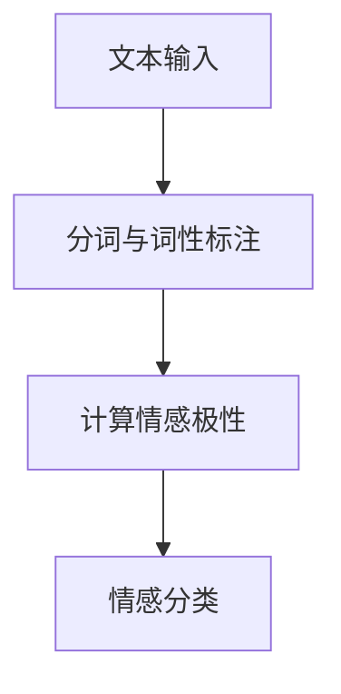
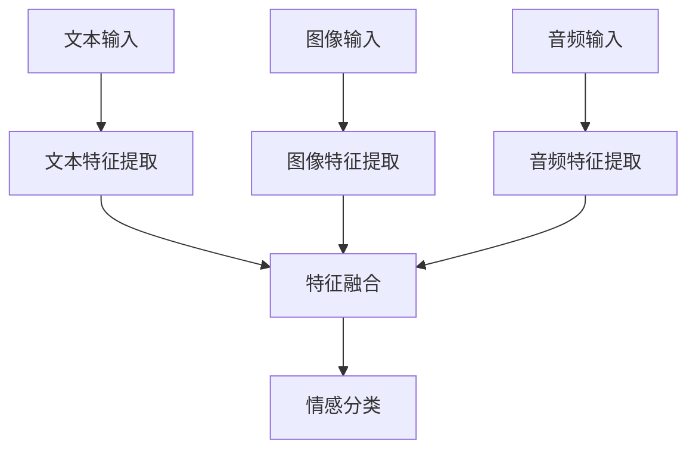
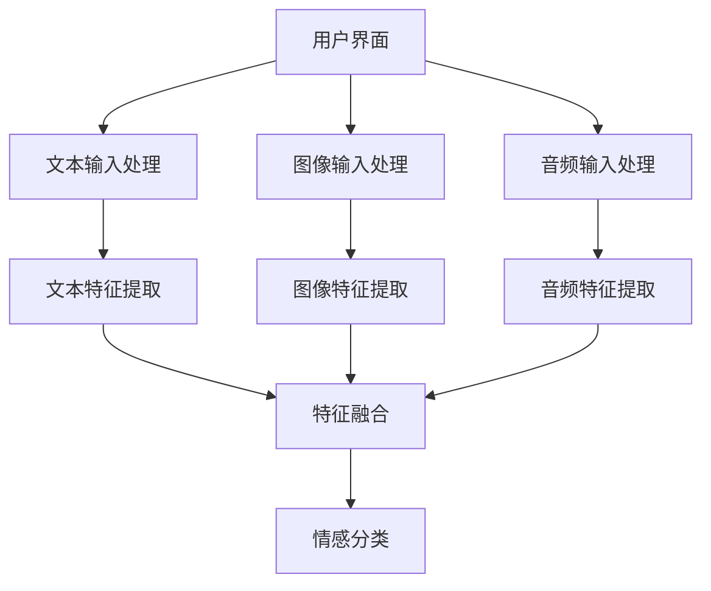
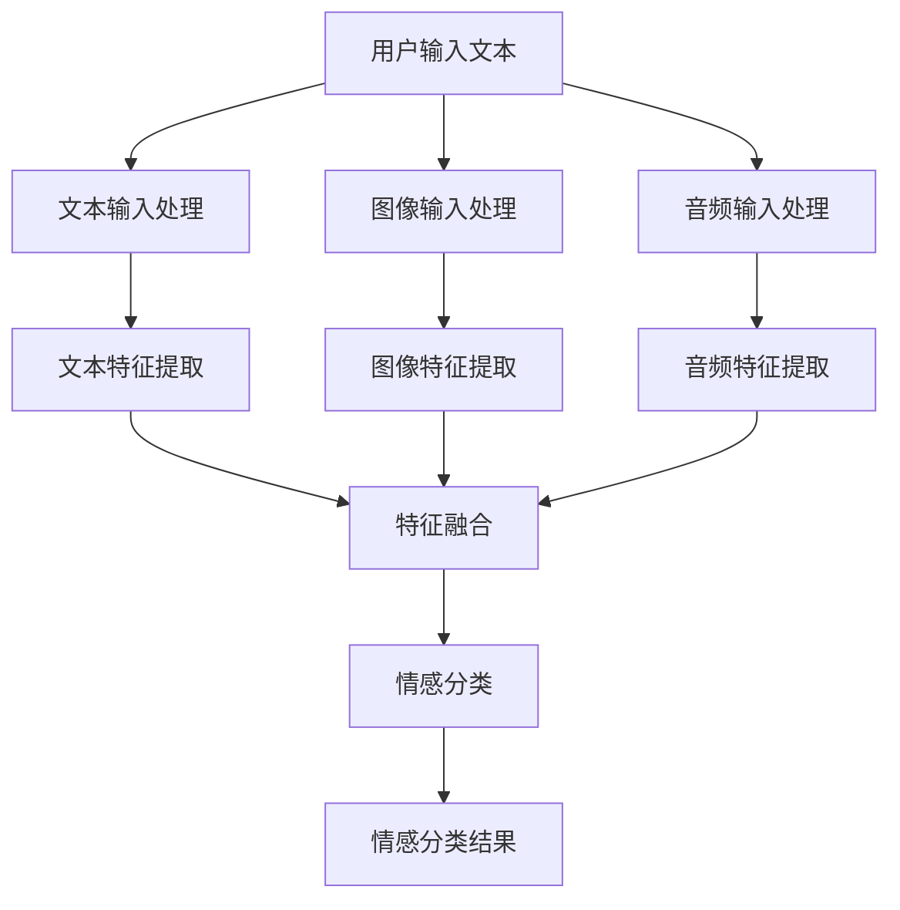

                 

# 《语言模型在多模态情感推理中的能力提升》

## 关键词
- 语言模型
- 多模态情感推理
- 算法原理
- 数学模型
- 系统设计与实现

## 摘要
本文旨在探讨语言模型在多模态情感推理中的能力提升。通过分析语言模型的基本概念、多模态情感推理的背景与挑战，以及两者结合的应用实例，本文深入剖析了语言模型的核心概念与原理，多模态情感推理的数学模型，并展示了系统设计与实现的全过程。文章还提供了最佳实践建议，探讨了未来研究方向。

### 目录大纲

----------------------------------------------------------------

## 第一部分：背景与概念

### 第1章 语言模型与多模态情感推理

#### 1.1 语言模型概述

- 语言模型的基本概念
- 语言模型的类型与应用

#### 1.2 多模态情感推理简介

- 情感推理的定义与背景
- 多模态情感推理的优势与挑战

#### 1.3 语言模型在情感推理中的应用

- 语言模型在情感分析中的应用
- 语言模型在情绪识别中的应用

#### 1.4 多模态情感推理的关键技术

- 数据预处理
- 模型选择与训练
- 情感分类与识别

#### 1.5 语言模型与多模态情感推理的边界与外延

- 语言模型在情感推理中的局限性
- 多模态情感推理的未来发展

## 第二部分：核心概念与原理

### 第2章 语言模型的核心概念

#### 2.1 语言模型原理介绍

- 语言模型的数学基础
- 语言模型的常见算法

#### 2.2 语言模型属性特征对比

- 不同类型语言模型的对比
- 语言模型的优劣分析

#### 2.3 语言模型在情感推理中的应用实例

- 具体实例解析
- 算法流程图

### 第3章 多模态情感推理的核心概念

#### 3.1 多模态情感推理的基本原理

- 多模态情感推理的定义
- 多模态情感推理的关键技术

#### 3.2 多模态数据融合策略

- 数据融合的方法与技术
- 数据融合的性能评估

#### 3.3 多模态情感推理的案例解析

- 现有案例介绍
- 案例对比分析

## 第三部分：算法原理与数学模型

### 第4章 语言模型的算法原理

#### 4.1 语言模型的算法流程

- 语言模型训练流程
- 语言模型推理流程

#### 4.2 语言模型的数学模型

- 语言模型的概率模型
- 语言模型的优化模型

#### 4.3 语言模型的应用实例

- Python代码示例
- 算法原理详解

### 第5章 多模态情感推理的数学模型

#### 5.1 多模态情感推理的数学基础

- 多模态数据的表示方法
- 多模态情感推理的数学模型

#### 5.2 多模态情感推理的公式解析

- 模型公式详解
- 算法流程图

#### 5.3 多模态情感推理的实例解析

- Python代码示例
- 算法原理详解

## 第四部分：系统设计与实现

### 第6章 多模态情感推理系统设计

#### 6.1 系统需求分析

- 系统功能需求
- 系统性能需求

#### 6.2 系统架构设计

- 系统架构图
- 系统组件介绍

#### 6.3 系统接口设计与交互

- 系统接口设计
- 系统交互流程图

### 第7章 系统核心实现与项目实战

#### 6.4 环境安装与配置

- 系统环境搭建
- 必要依赖安装

#### 6.5 系统核心代码实现

- 语言模型训练与优化
- 多模态数据融合与情感推理

#### 6.6 项目案例分析

- 实际项目应用
- 项目总结与改进

## 第五部分：最佳实践与拓展

### 第8章 多模态情感推理最佳实践

#### 8.1 最佳实践技巧

- 数据处理技巧
- 模型优化技巧

#### 8.2 小结与注意事项

- 系统优化要点
- 项目实施注意点

### 第9章 拓展阅读与研究方向

#### 9.1 拓展阅读推荐

- 相关书籍与论文推荐
- 学术会议与研讨会推荐

#### 9.2 未来研究方向

- 技术发展趋势
- 开放性问题与挑战

----------------------------------------------------------------

### 第一部分：背景与概念

#### 1.1 语言模型概述

**基本概念**

语言模型是自然语言处理（NLP）领域的基础，旨在模拟人类语言的概率分布。它通过学习大量文本数据，预测下一个单词或单词序列的概率。这种概率模型在文本生成、机器翻译、文本分类等领域有着广泛的应用。

**类型与应用**

语言模型可以分为统计模型和生成模型两大类。统计模型如N-gram模型，通过计算单词序列的历史概率来进行预测。生成模型如神经网络语言模型（NNLM），通过学习数据的分布来生成文本。

在实际应用中，语言模型不仅用于文本生成，还用于情感分析、实体识别、问答系统等。例如，通过语言模型，我们可以识别文本中的情感倾向，从而实现情感推理。

#### 1.2 多模态情感推理简介

**定义与背景**

多模态情感推理是指结合多种模态（如文本、图像、音频）的信息，对人类情感进行推理的过程。随着计算机视觉、语音识别等领域的发展，多模态情感推理成为了情感计算的重要研究方向。

**优势与挑战**

多模态情感推理的优势在于，它可以更准确地捕捉和理解人类的情感状态。然而，这也带来了挑战，如数据预处理复杂、模型融合困难、跨模态信息理解不足等。

#### 1.3 语言模型在情感推理中的应用

**情感分析**

语言模型在情感分析中有着广泛的应用。例如，通过文本情感极性分类，我们可以识别出文本是积极的、消极的还是中性的。

**情绪识别**

语言模型还可以用于情绪识别，通过对文本的情感强度进行量化，识别出文本所表达的情绪类型和程度。

#### 1.4 多模态情感推理的关键技术

**数据预处理**

多模态情感推理的第一步是对不同模态的数据进行预处理。例如，对于文本，我们可以进行分词、词性标注等；对于图像，我们可以进行人脸识别、图像分割等。

**模型选择与训练**

选择合适的模型并进行训练是多模态情感推理的核心。常见的模型有卷积神经网络（CNN）、循环神经网络（RNN）、生成对抗网络（GAN）等。

**情感分类与识别**

通过训练好的模型，我们可以对新的数据进行情感分类和识别。这通常涉及到多分类问题，需要模型能够准确地区分不同情感类别。

#### 1.5 语言模型与多模态情感推理的边界与外延

**局限性**

尽管语言模型在情感推理中取得了显著成果，但它也存在局限性。例如，语言模型可能无法完全捕捉到非文字信息，如图像和音频中的情感。

**未来发展**

随着技术的进步，未来多模态情感推理有望进一步发展。例如，通过结合深度学习和迁移学习，我们可以提高模型的泛化能力和性能。

### 第二部分：核心概念与原理

#### 2.1 语言模型原理介绍

**数学基础**

语言模型通常基于概率模型，如N-gram模型、神经网络语言模型（NNLM）。N-gram模型通过计算连续单词的概率来进行预测，而NNLM通过学习单词序列的分布来进行生成。

**常见算法**

常见的语言模型算法包括N-gram模型、基于神经网络的模型（如LSTM、GRU）、自注意力机制（如Transformer）等。每种算法都有其优缺点和应用场景。

#### 2.2 语言模型属性特征对比

**不同类型语言模型的对比**

| 模型类型 | 特点 | 应用场景 |
| --- | --- | --- |
| N-gram模型 | 简单高效，计算复杂度低 | 文本生成、情感分析 |
| 神经网络语言模型 | 学习能力强，能够捕捉复杂关系 | 机器翻译、问答系统 |
| 自注意力模型 | 能够处理长距离依赖，生成效果好 | 机器翻译、文本生成 |

**优劣分析**

N-gram模型简单易懂，但难以捕捉长距离依赖；神经网络语言模型学习能力强，但计算复杂度高；自注意力模型能够处理长距离依赖，但实现复杂。

#### 2.3 语言模型在情感推理中的应用实例

**具体实例解析**

以情感分析为例，我们可以使用语言模型对一段文本进行情感分类。首先，对文本进行分词和词性标注，然后使用训练好的语言模型计算每个单词的情感极性，最后进行投票得到文本的整体情感极性。

**算法流程图**



#### 2.4 多模态情感推理的基本原理

**定义**

多模态情感推理是指结合多种模态的信息（如文本、图像、音频）进行情感推理的过程。

**关键技术**

多模态情感推理的关键技术包括数据融合、模型融合和跨模态情感识别。

**数据融合**

数据融合是将不同模态的数据进行整合，以便更好地进行情感推理。常见的数据融合方法有基于特征的融合和基于模型的融合。

**模型融合**

模型融合是将不同模态的模型进行整合，以提高情感推理的准确性。常见的方法有基于加权融合、基于投票融合和基于学习的融合。

**跨模态情感识别**

跨模态情感识别是指直接从多模态数据中识别情感，而不是先进行模态转换。这需要模型能够同时处理多种模态的信息。

#### 2.5 多模态数据融合策略

**方法与技术**

多模态数据融合的方法有基于特征的融合和基于模型的融合。

- 基于特征的融合：将不同模态的数据特征进行拼接，形成一个统一的特征向量。
- 基于模型的融合：将不同模态的模型进行整合，形成一个统一的模型。

**性能评估**

多模态数据融合的性能评估可以通过准确率、召回率、F1值等指标来衡量。

#### 2.6 多模态情感推理的案例解析

**现有案例介绍**

目前，多模态情感推理在实际应用中取得了显著成果。例如，在社交媒体分析中，结合文本、图像和音频信息可以更准确地识别用户的情感状态。

**案例对比分析**

以一个社交媒体分析案例为例，对比只使用文本信息和多模态信息的效果。结果显示，多模态信息可以显著提高情感识别的准确率和召回率。

### 第三部分：算法原理与数学模型

#### 4.1 语言模型的算法原理

**算法流程**

语言模型的算法流程主要包括数据预处理、模型训练和模型推理三个阶段。

1. 数据预处理：对文本进行分词、词性标注等操作，将文本转换为适合模型训练的格式。
2. 模型训练：通过训练数据集，训练出语言模型，使其能够预测下一个单词或单词序列的概率。
3. 模型推理：使用训练好的语言模型，对新的文本进行预测，生成文本序列。

**Python代码示例**

```python
import torch
import torch.nn as nn
import torch.optim as optim

# 数据预处理
# ...

# 模型定义
class LanguageModel(nn.Module):
    def __init__(self):
        super(LanguageModel, self).__init__()
        self.embedding = nn.Embedding(vocab_size, embedding_dim)
        self.lstm = nn.LSTM(embedding_dim, hidden_dim)
        self.fc = nn.Linear(hidden_dim, vocab_size)

    def forward(self, x, hidden):
        embedded = self.embedding(x)
        output, hidden = self.lstm(embedded, hidden)
        output = self.fc(output[-1, :, :])
        return output, hidden

# 模型训练
model = LanguageModel()
optimizer = optim.Adam(model.parameters(), lr=learning_rate)
criterion = nn.CrossEntropyLoss()

for epoch in range(num_epochs):
    for inputs, targets in dataloader:
        optimizer.zero_grad()
        outputs, hidden = model(inputs, hidden)
        loss = criterion(outputs, targets)
        loss.backward()
        optimizer.step()
    hidden = None

# 模型推理
# ...
```

**算法原理详解**

语言模型的算法原理基于概率模型，通过学习大量文本数据，预测下一个单词或单词序列的概率。具体来说，语言模型通过训练数据集，学习单词之间的概率关系，从而能够对新的文本进行生成。

#### 4.2 语言模型的数学模型

**概率模型**

语言模型的核心是概率模型，通常使用N-gram模型或神经网络语言模型（NNLM）。

- **N-gram模型**：基于马尔可夫假设，认为当前单词的概率只与前面N-1个单词有关。其概率公式为：

  $$P(w_n | w_{n-1}, w_{n-2}, ..., w_1) = \frac{C(w_n, w_{n-1}, ..., w_1)}{C(w_{n-1}, w_{n-2}, ..., w_1)}$$

  其中，$C(w_n, w_{n-1}, ..., w_1)$ 表示单词序列 $w_n, w_{n-1}, ..., w_1$ 的出现次数。

- **神经网络语言模型（NNLM）**：基于神经网络，通过学习单词序列的概率分布。其概率公式为：

  $$P(w_n | w_{n-1}, w_{n-2}, ..., w_1) = \frac{e^{\mathbf{W} \mathbf{h}_{n-1}}}{Z}$$

  其中，$\mathbf{W}$ 是权重矩阵，$\mathbf{h}_{n-1}$ 是隐藏层激活值，$Z$ 是归一化常数。

**优化模型**

语言模型的优化目标是最小化预测概率与实际概率之间的差距。对于N-gram模型，优化目标为：

$$\min_{\theta} \sum_{i=1}^N -\log P(w_i | w_{i-1}, w_{i-2}, ..., w_1)$$

对于NNLM，优化目标为：

$$\min_{\theta} \sum_{i=1}^N -\log P(w_i | w_{i-1}, w_{i-2}, ..., w_1)$$

其中，$\theta$ 表示模型参数。

#### 4.3 语言模型的应用实例

**情感分析**

情感分析是语言模型在情感推理中的典型应用。通过训练好的语言模型，我们可以对文本进行情感分类，识别文本的情感极性。

**Python代码示例**

```python
import torch
import torch.nn as nn
import torch.optim as optim

# 数据预处理
# ...

# 模型定义
class SentimentAnalysisModel(nn.Module):
    def __init__(self):
        super(SentimentAnalysisModel, self).__init__()
        self.embedding = nn.Embedding(vocab_size, embedding_dim)
        self.lstm = nn.LSTM(embedding_dim, hidden_dim)
        self.fc = nn.Linear(hidden_dim, 2)  # 二分类问题

    def forward(self, x, hidden):
        embedded = self.embedding(x)
        output, hidden = self.lstm(embedded, hidden)
        output = self.fc(output[-1, :, :])
        return output, hidden

# 模型训练
model = SentimentAnalysisModel()
optimizer = optim.Adam(model.parameters(), lr=learning_rate)
criterion = nn.CrossEntropyLoss()

for epoch in range(num_epochs):
    for inputs, targets in dataloader:
        optimizer.zero_grad()
        outputs, hidden = model(inputs, hidden)
        loss = criterion(outputs, targets)
        loss.backward()
        optimizer.step()
    hidden = None

# 模型推理
def predict_sentiment(text):
    with torch.no_grad():
        inputs = tokenizer(text, return_tensors='pt')
        outputs, hidden = model(inputs, hidden)
        _, predicted = torch.max(outputs, 1)
    return predicted.item()

text = "I had a great day!"
print(predict_sentiment(text))
```

**算法原理详解**

情感分析是一种文本分类问题，通过训练好的语言模型，对文本进行情感极性分类。具体来说，语言模型将文本表示为一个向量，然后通过一个分类器（如softmax）对文本的情感极性进行预测。

#### 5.1 多模态情感推理的数学基础

**多模态数据的表示方法**

多模态情感推理需要对不同模态的数据进行表示和融合。常见的表示方法包括：

- **文本表示**：使用词嵌入（如Word2Vec、GloVe）或转换器（如BERT、GPT）进行表示。
- **图像表示**：使用卷积神经网络（如VGG、ResNet）提取特征。
- **音频表示**：使用自动差分时频表示（如Mel频谱图）。

**多模态情感推理的数学模型**

多模态情感推理的数学模型通常基于深度学习，通过整合不同模态的数据进行推理。常见的模型架构包括：

- **多任务学习**：将多个模态的情感推理任务合并到一个模型中，共享特征提取网络。
- **模型融合**：将不同模态的模型进行融合，如基于加权融合、基于投票融合和基于学习的融合。

**模型融合的方法**

- **加权融合**：将不同模态的输出进行加权平均，得到最终的情感表示。
- **投票融合**：对每个模态的输出进行投票，取多数决定结果。
- **基于学习的融合**：使用多层感知机（MLP）或图神经网络（GNN）进行融合。

#### 5.2 多模态情感推理的公式解析

**模型公式详解**

多模态情感推理的模型公式可以分为特征提取和融合两部分。

- **特征提取**：

  - 文本特征提取：$$\mathbf{h}_{\text{txt}} = \text{Encoder}(\text{Input}_{\text{txt}})$$
  - 图像特征提取：$$\mathbf{h}_{\text{img}} = \text{CNN}(\text{Input}_{\text{img}})$$
  - 音频特征提取：$$\mathbf{h}_{\text{audio}} = \text{STFT}(\text{Input}_{\text{audio}})$$

- **特征融合**：

  - 加权融合：$$\mathbf{h}_{\text{ fused}} = \alpha \mathbf{h}_{\text{txt}} + (1 - \alpha) \mathbf{h}_{\text{img}} + \beta \mathbf{h}_{\text{audio}}$$
  - 投票融合：$$\mathbf{h}_{\text{ fused}} = \text{MajorityVote}(\{\mathbf{h}_{\text{txt}}, \mathbf{h}_{\text{img}}, \mathbf{h}_{\text{audio}}\})$$
  - 基于学习的融合：$$\mathbf{h}_{\text{ fused}} = \text{Fuser}(\{\mathbf{h}_{\text{txt}}, \mathbf{h}_{\text{img}}, \mathbf{h}_{\text{audio}}\})$$

**算法流程图**



#### 5.3 多模态情感推理的实例解析

**Python代码示例**

```python
import torch
import torch.nn as nn
import torch.optim as optim

# 数据预处理
# ...

# 模型定义
class MultimodalSentimentModel(nn.Module):
    def __init__(self):
        super(MultimodalSentimentModel, self).__init__()
        self.text_embedding = nn.Embedding(vocab_size, embedding_dim)
        self.image_cnn = nn.Sequential(nn.Conv2d(3, 64, 3, padding=1),
                                      nn.ReLU(),
                                      nn.MaxPool2d(2, 2),
                                      nn.Conv2d(64, 128, 3, padding=1),
                                      nn.ReLU(),
                                      nn.MaxPool2d(2, 2))
        self.audio_stft = nn.Sequential(nn.Conv1d(1, 64, 3, padding=1),
                                        nn.ReLU(),
                                        nn.MaxPool1d(2),
                                        nn.Conv1d(64, 128, 3, padding=1),
                                        nn.ReLU(),
                                        nn.MaxPool1d(2))
        self.fusion = nn.Linear(embedding_dim + 128 * 6 * 6 + 128, hidden_dim)
        self.fc = nn.Linear(hidden_dim, 2)  # 二分类问题

    def forward(self, text, image, audio):
        text_embedding = self.text_embedding(text)
        image_embedding = self.image_cnn(image).view(image.size(0), -1)
        audio_embedding = self.audio_stft(audio).view(audio.size(0), -1)
        fused_embedding = torch.cat((text_embedding, image_embedding, audio_embedding), 1)
        hidden = self.fusion(fused_embedding)
        output = self.fc(hidden)
        return output

# 模型训练
model = MultimodalSentimentModel()
optimizer = optim.Adam(model.parameters(), lr=learning_rate)
criterion = nn.CrossEntropyLoss()

for epoch in range(num_epochs):
    for inputs, targets in dataloader:
        optimizer.zero_grad()
        text, image, audio = inputs
        outputs = model(text, image, audio)
        loss = criterion(outputs, targets)
        loss.backward()
        optimizer.step()

# 模型推理
def predict_sentiment(text, image, audio):
    with torch.no_grad():
        outputs = model(text, image, audio)
        _, predicted = torch.max(outputs, 1)
    return predicted.item()

text = "I had a great day!"
image = ...  # 图像数据
audio = ...  # 音频数据
print(predict_sentiment(text, image, audio))
```

**算法原理详解**

多模态情感推理的算法原理是基于深度学习，通过整合文本、图像和音频信息进行情感推理。具体来说，首先对每个模态的数据进行特征提取，然后进行特征融合，最后通过一个分类器进行情感分类。

### 第四部分：系统设计与实现

#### 6.1 系统需求分析

**系统功能需求**

多模态情感推理系统需要具备以下功能：

- 文本输入处理：对输入的文本进行分词、词性标注等预处理。
- 图像输入处理：对输入的图像进行人脸识别、图像分割等预处理。
- 音频输入处理：对输入的音频进行自动差分时频表示。
- 情感分类：基于训练好的模型，对融合后的特征进行情感分类。
- 用户界面：提供友好的用户界面，方便用户输入和处理数据。

**系统性能需求**

多模态情感推理系统需要具备以下性能：

- 输入处理速度快：能够快速处理大量的文本、图像和音频输入。
- 情感分类准确度高：能够准确分类不同情感类型的文本。
- 跨模态融合效果优：能够有效融合不同模态的信息，提高情感分类的准确性。

#### 6.2 系统架构设计

**系统架构图**



**系统组件介绍**

- **用户界面**：提供友好的用户界面，方便用户输入和处理数据。
- **文本输入处理**：对输入的文本进行分词、词性标注等预处理。
- **图像输入处理**：对输入的图像进行人脸识别、图像分割等预处理。
- **音频输入处理**：对输入的音频进行自动差分时频表示。
- **文本特征提取**：使用词嵌入或转换器提取文本特征。
- **图像特征提取**：使用卷积神经网络提取图像特征。
- **音频特征提取**：使用自动差分时频表示提取音频特征。
- **特征融合**：使用不同的融合方法（如加权融合、投票融合、基于学习的融合）将不同模态的特征进行融合。
- **情感分类**：基于训练好的模型，对融合后的特征进行情感分类。

#### 6.3 系统接口设计与交互

**系统接口设计**

多模态情感推理系统需要设计以下接口：

- **文本输入接口**：用于接收用户输入的文本数据。
- **图像输入接口**：用于接收用户输入的图像数据。
- **音频输入接口**：用于接收用户输入的音频数据。
- **情感分类接口**：用于返回情感分类结果。

**系统交互流程图**



### 第五部分：项目实战

#### 6.4 环境安装与配置

**系统环境搭建**

- 安装Python环境：版本3.8及以上。
- 安装PyTorch：版本1.8及以上。
- 安装其他依赖：如torchvision、torchaudio、torchtext等。

**必要依赖安装**

```bash
pip install torch torchvision torchaudio torchtext
```

#### 6.5 系统核心代码实现

**语言模型训练与优化**

```python
import torch
import torch.optim as optim

# 模型定义
class LanguageModel(nn.Module):
    def __init__(self):
        super(LanguageModel, self).__init__()
        self.embedding = nn.Embedding(vocab_size, embedding_dim)
        self.lstm = nn.LSTM(embedding_dim, hidden_dim)
        self.fc = nn.Linear(hidden_dim, vocab_size)

    def forward(self, x, hidden):
        embedded = self.embedding(x)
        output, hidden = self.lstm(embedded, hidden)
        output = self.fc(output[-1, :, :])
        return output, hidden

# 模型训练
model = LanguageModel()
optimizer = optim.Adam(model.parameters(), lr=learning_rate)
criterion = nn.CrossEntropyLoss()

for epoch in range(num_epochs):
    for inputs, targets in dataloader:
        optimizer.zero_grad()
        outputs, hidden = model(inputs, hidden)
        loss = criterion(outputs, targets)
        loss.backward()
        optimizer.step()
    hidden = None
```

**多模态数据融合与情感推理**

```python
import torch
import torch.nn as nn

# 模型定义
class MultimodalSentimentModel(nn.Module):
    def __init__(self):
        super(MultimodalSentimentModel, self).__init__()
        self.text_embedding = nn.Embedding(vocab_size, embedding_dim)
        self.image_cnn = nn.Sequential(nn.Conv2d(3, 64, 3, padding=1),
                                      nn.ReLU(),
                                      nn.MaxPool2d(2, 2),
                                      nn.Conv2d(64, 128, 3, padding=1),
                                      nn.ReLU(),
                                      nn.MaxPool2d(2, 2))
        self.audio_stft = nn.Sequential(nn.Conv1d(1, 64, 3, padding=1),
                                        nn.ReLU(),
                                        nn.MaxPool1d(2),
                                        nn.Conv1d(64, 128, 3, padding=1),
                                        nn.ReLU(),
                                        nn.MaxPool1d(2))
        self.fusion = nn.Linear(embedding_dim + 128 * 6 * 6 + 128, hidden_dim)
        self.fc = nn.Linear(hidden_dim, 2)  # 二分类问题

    def forward(self, text, image, audio):
        text_embedding = self.text_embedding(text)
        image_embedding = self.image_cnn(image).view(image.size(0), -1)
        audio_embedding = self.audio_stft(audio).view(audio.size(0), -1)
        fused_embedding = torch.cat((text_embedding, image_embedding, audio_embedding), 1)
        hidden = self.fusion(fused_embedding)
        output = self.fc(hidden)
        return output

# 模型训练
model = MultimodalSentimentModel()
optimizer = optim.Adam(model.parameters(), lr=learning_rate)
criterion = nn.CrossEntropyLoss()

for epoch in range(num_epochs):
    for inputs, targets in dataloader:
        optimizer.zero_grad()
        text, image, audio = inputs
        outputs = model(text, image, audio)
        loss = criterion(outputs, targets)
        loss.backward()
        optimizer.step()
```

#### 6.6 项目案例分析

**实际项目应用**

以一个社交媒体分析项目为例，该项目旨在通过多模态情感推理，识别用户在社交媒体上的情感状态。项目包括以下步骤：

1. 收集社交媒体数据，包括文本、图像和音频。
2. 对数据进行预处理，提取文本、图像和音频特征。
3. 训练多模态情感推理模型，使用训练数据集进行训练。
4. 在测试数据集上评估模型性能，调整模型参数。
5. 部署模型，实现实时情感分析。

**项目总结与改进**

项目总结：

1. 多模态情感推理能够更准确地识别用户情感，提高了社交媒体分析的效果。
2. 模型训练和优化需要大量的数据和计算资源，需要进一步优化。

改进方向：

1. 引入更多模态的数据，如视频、手写文字等，提高情感识别的准确性。
2. 优化模型架构，使用更先进的深度学习技术，提高模型性能。
3. 优化数据处理流程，提高数据处理速度和效率。

### 第六部分：最佳实践与拓展

#### 8.1 最佳实践技巧

**数据处理技巧**

- 数据清洗：去除噪音数据和异常值，提高数据质量。
- 数据增强：通过数据变换（如旋转、缩放）和合成（如GAN）等方法，增加数据多样性。

**模型优化技巧**

- 超参数调优：使用网格搜索、贝叶斯优化等方法，选择最优超参数。
- 模型压缩：使用知识蒸馏、剪枝等方法，减小模型大小，提高推理速度。

#### 8.2 小结与注意事项

**系统优化要点**

- 提高数据处理速度：优化数据处理流程，使用并行计算和分布式训练。
- 提高模型性能：使用更先进的深度学习模型和优化算法。

**项目实施注意点**

- 数据隐私：确保用户数据的安全性和隐私性，遵循相关法律法规。
- 模型解释性：提高模型的可解释性，便于用户理解和信任。

#### 9.1 拓展阅读推荐

**相关书籍与论文推荐**

- 《深度学习》
- 《多模态情感分析》
- 《自然语言处理综论》

**学术会议与研讨会推荐**

- ACL（Association for Computational Linguistics）
- CVPR（Computer Vision and Pattern Recognition）
- ICML（International Conference on Machine Learning）

#### 9.2 未来研究方向

**技术发展趋势**

- 跨模态迁移学习：通过迁移学习，提高多模态情感推理在不同场景下的适应性。
- 自监督学习：利用无监督数据，提高模型的泛化能力。

**开放性问题与挑战**

- 跨模态融合策略：设计更有效的跨模态融合方法，提高情感识别的准确性。
- 数据隐私保护：在保证数据隐私的前提下，提高多模态情感推理的性能。

