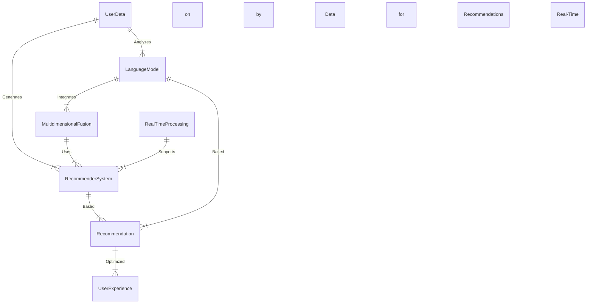

                 


### 引言

随着互联网的飞速发展，个性化推荐系统已经成为许多在线平台和服务中不可或缺的一部分。这些系统通过分析用户的历史行为和偏好，向用户推荐个性化内容，从而提高用户的满意度和参与度。然而，传统推荐系统在处理大规模、多维度的用户数据时，常常面临准确性和用户体验之间的平衡问题。在这种背景下，语言模型作为一种强大的自然语言处理工具，逐渐被引入到推荐系统中，用于优化用户体验。

本文旨在探讨语言模型在多维度个性化推荐系统中的用户体验优化研究。我们首先将介绍语言模型和个性化推荐系统的基本概念和原理，然后深入分析如何使用语言模型来提高推荐系统的准确性、多样性和用户满意度。接下来，我们将通过实际案例来展示语言模型在个性化推荐系统中的应用，并讨论面临的挑战和未来的研究方向。

本文结构如下：

第一部分是引言，介绍研究的背景和目的。

第二部分是背景与问题定义，详细阐述语言模型和个性化推荐系统的发展历程以及存在的问题。

第三部分是核心概念与原理，介绍语言模型的基础知识和个性化推荐系统的工作原理。

第四部分是用户经验优化，探讨如何利用语言模型优化推荐系统的用户体验。

第五部分是应用场景，通过案例研究展示语言模型在推荐系统中的应用效果。

第六部分是挑战与未来方向，分析当前面临的技术挑战和未来研究趋势。

最后一部分是总结，对全文进行概括，并提出展望。

通过以上结构，我们希望为读者提供一个清晰、系统的视角来理解语言模型在多维度个性化推荐系统中的用户体验优化研究。接下来，我们将逐一展开讨论。

----------------------------------------------------------------

## 第一部分: 引言

### 1.1 背景介绍

在当今信息爆炸的时代，如何有效地帮助用户在大量的信息中找到感兴趣的内容，成为许多在线平台和服务需要解决的核心问题。个性化推荐系统作为一种有效的解决方案，通过分析用户的行为数据和偏好，为用户提供定制化的内容推荐，从而提高用户的满意度和参与度。然而，随着用户数据的多样性和复杂性增加，传统推荐系统在准确性、多样性和用户体验方面面临着巨大的挑战。

近年来，深度学习和自然语言处理（NLP）技术的飞速发展，为个性化推荐系统带来了新的机遇。语言模型作为NLP的核心工具，能够理解用户的语言表达和内容含义，从而为推荐系统提供了更加精准和智能的推荐。因此，将语言模型引入到个性化推荐系统中，已成为当前研究的热点之一。

### 1.2 研究目的

本文的研究目的是探讨语言模型在多维度个性化推荐系统中的用户体验优化问题。具体来说，我们将从以下几个方面进行探讨：

1. **语言模型的基础原理**：介绍语言模型的定义、类型、评价指标和工作原理，包括递归神经网络（RNN）、长短时记忆网络（LSTM）和门控循环单元（GRU）等。

2. **个性化推荐系统原理**：阐述个性化推荐系统的基础概念、工作流程和主要算法，如协同过滤、矩阵分解和基于内容的推荐等。

3. **用户体验优化方法**：分析如何利用语言模型来提高推荐系统的准确性、多样性和用户满意度，包括基于语言理解的推荐、多维度融合和动态调整等。

4. **应用场景与实践**：通过实际案例展示语言模型在个性化推荐系统中的应用效果，如新闻推荐、商品推荐和社交媒体内容推荐等。

5. **挑战与未来方向**：探讨当前语言模型在个性化推荐系统中的应用面临的挑战，以及未来可能的研究方向。

### 1.3 文章结构

为了更好地展开讨论，本文将分为六个部分：

1. **引言**：介绍研究的背景、目的和文章结构。
2. **背景与问题定义**：详细阐述语言模型和个性化推荐系统的发展历程以及存在的问题。
3. **核心概念与原理**：介绍语言模型的基础知识和个性化推荐系统的工作原理。
4. **用户体验优化**：探讨如何利用语言模型优化推荐系统的用户体验。
5. **应用场景**：通过案例研究展示语言模型在推荐系统中的应用效果。
6. **挑战与未来方向**：分析当前面临的技术挑战和未来研究趋势。
7. **总结**：对全文进行概括，并提出展望。

通过以上结构，我们希望为读者提供一个清晰、系统的视角来理解语言模型在多维度个性化推荐系统中的用户体验优化研究。在接下来的章节中，我们将逐一展开讨论。

### 关键词

- 语言模型
- 个性化推荐系统
- 用户经验优化
- 多维度数据融合
- 深度学习
- 自然语言处理

### 摘要

本文旨在探讨语言模型在多维度个性化推荐系统中的用户体验优化问题。首先，我们介绍了语言模型和个性化推荐系统的基本概念和原理，包括递归神经网络（RNN）、长短时记忆网络（LSTM）和门控循环单元（GRU）等语言模型的基础知识，以及协同过滤、矩阵分解和基于内容的推荐等个性化推荐系统的核心算法。接着，我们探讨了如何利用语言模型来提高推荐系统的准确性、多样性和用户满意度，包括基于语言理解的推荐、多维度数据融合和动态调整等用户体验优化方法。随后，通过实际案例展示了语言模型在新闻推荐、商品推荐和社交媒体内容推荐等应用场景中的效果。最后，我们分析了当前语言模型在个性化推荐系统中面临的挑战和未来研究方向，提出了改进策略和展望。

----------------------------------------------------------------

## 第二部分: 背景与问题定义

### 2.1 语言模型的发展历程

语言模型作为自然语言处理（NLP）的核心工具，其发展历程可以追溯到20世纪50年代。最初，研究者们主要依赖于统计方法来生成文本，例如n元模型，通过统计相邻词序列的概率来预测下一个词。然而，这种方法在面对长文本和复杂语境时存在明显的局限性。

随着计算能力的提升和深度学习技术的突破，递归神经网络（RNN）于20世纪80年代末期被提出。RNN能够处理序列数据，使其在自然语言处理任务中取得了显著进展。特别是长短时记忆网络（LSTM）和门控循环单元（GRU）等变体，通过引入门控机制，有效解决了传统RNN在处理长序列数据时遇到的梯度消失和梯度爆炸问题。

进入21世纪，随着计算资源和数据量的进一步增加，深度学习模型如Transformer在语言模型领域取得了革命性的突破。Transformer模型通过自注意力机制（Self-Attention），能够更好地捕捉文本中的长距离依赖关系，使得语言模型在多项NLP任务中的性能达到了前所未有的水平。BERT、GPT和T5等基于Transformer的大型预训练模型，进一步推动了语言模型的发展，使得其在文本分类、问答系统和机器翻译等领域取得了显著的成果。

### 2.2 个性化推荐系统的发展历程

个性化推荐系统的发展历程可以追溯到20世纪90年代，当时互联网刚刚兴起，研究者们开始探索如何利用用户的历史行为数据来生成个性化推荐。最初的推荐系统主要依赖于基于内容的过滤和协同过滤算法。

基于内容的过滤（Content-Based Filtering）通过分析用户过去对某些项目的喜好，提取项目的内容特征，然后基于这些特征为用户推荐相似的内容。这种方法在用户偏好稳定时表现出良好的效果，但在面对多样化用户群体时，容易出现推荐多样化不足的问题。

协同过滤（Collaborative Filtering）通过分析用户之间的相似性来生成推荐。基于用户的协同过滤（User-Based Collaborative Filtering）通过计算用户之间的相似度，找到与目标用户兴趣相似的邻居用户，然后推荐这些邻居用户喜欢的项目。基于模型的协同过滤（Model-Based Collaborative Filtering）则通过建立用户和项目之间的潜在因子模型，预测用户对未评分项目的偏好。

随着机器学习和深度学习技术的进步，推荐系统的研究和应用得到了进一步的拓展。近年来，基于内容的推荐和协同过滤方法逐渐融合，形成了混合推荐系统（Hybrid Recommendation System）。此外，基于图神经网络（Graph Neural Network）和图嵌入（Graph Embedding）的方法也逐渐应用于推荐系统，提高了推荐系统的性能和多样化。

### 2.3 多维度个性化推荐系统的挑战

多维度个性化推荐系统在处理用户数据时面临着诸多挑战：

1. **数据多样性**：用户数据往往包含多种类型，如文本、图像、音频等。如何有效整合这些不同类型的数据，提高推荐系统的多样性，是一个重要问题。

2. **冷启动问题**：新用户或新项目在缺乏足够行为数据时，推荐系统难以生成准确的推荐。如何解决冷启动问题，是推荐系统研究中一个重要的课题。

3. **实时推荐**：随着用户行为的实时变化，推荐系统需要快速响应，生成即时的推荐结果。这对系统的实时处理能力和算法效率提出了更高的要求。

4. **推荐多样性**：传统推荐系统往往容易陷入“推荐泡沫”（Filter Bubble），即用户只看到与自己兴趣相似的内容，导致内容多样性不足。如何提高推荐的多样性，避免用户陷入信息孤岛，是一个关键问题。

5. **用户隐私保护**：在构建个性化推荐系统时，如何保护用户的隐私数据，避免用户信息泄露，也是一个重要的伦理和法律问题。

### 2.4 语言模型在个性化推荐系统中的应用

将语言模型引入个性化推荐系统，可以在多个维度上提升系统的性能和用户体验：

1. **文本理解与情感分析**：语言模型能够理解用户评论、反馈和搜索关键词中的情感和语义，从而为推荐系统提供更加细腻的用户偏好信息。

2. **内容生成与个性化**：基于语言模型的内容生成技术，可以根据用户的兴趣和需求，生成个性化的内容推荐，提高推荐的相关性和吸引力。

3. **多维度数据融合**：语言模型能够有效地融合不同类型的数据（如文本、图像、音频等），从而生成更全面、精准的用户偏好模型。

4. **实时推荐与动态调整**：语言模型的高效处理能力，使得推荐系统能够实时响应用户行为的变化，生成动态调整的推荐结果，提高用户体验的实时性和准确性。

5. **降低冷启动问题**：通过语言模型对用户文本数据的分析，即使在用户缺乏行为数据的情况下，也能为推荐系统提供初步的用户偏好信息，缓解冷启动问题。

### 2.5 研究问题与目标

本文的研究问题主要集中在以下几个方面：

1. **如何利用语言模型提高个性化推荐系统的准确性**？
2. **如何利用语言模型解决推荐系统的冷启动问题**？
3. **如何利用语言模型融合多维度数据，提高推荐系统的多样性**？
4. **如何通过动态调整推荐策略，优化用户体验**？

研究目标如下：

1. **提出一种基于语言模型的个性化推荐算法**，通过文本数据的深度分析，提高推荐系统的准确性和多样性。
2. **设计一种多维度数据融合方法**，将文本、图像、音频等不同类型的数据进行有效整合，提高用户偏好模型的全面性和准确性。
3. **实现一种实时推荐与动态调整机制**，根据用户实时行为的变化，动态调整推荐策略，提高用户体验的实时性和个性化。
4. **评估所提出方法的性能**，通过实验和案例分析，验证所提出方法在提高推荐准确性、多样性和用户体验方面的效果。

通过以上研究，我们期望为多维度个性化推荐系统提供一种有效的方法和技术手段，从而优化用户体验，提升在线平台和服务的竞争力。

### 2.6 研究方法

为了解决多维度个性化推荐系统中的用户体验优化问题，本文采用以下研究方法：

1. **数据收集**：从多个在线平台（如新闻网站、电商平台、社交媒体等）收集用户行为数据，包括用户的浏览记录、搜索关键词、购买记录、评论等。此外，还收集了用户生成的文本数据（如评论、帖子等）。

2. **数据预处理**：对收集到的用户行为数据进行清洗和预处理，去除噪声数据和异常值。同时，将不同类型的数据（如文本、图像、音频等）进行格式统一和特征提取，为后续分析做好准备。

3. **实验设计**：设计一组对比实验，包括基准推荐系统和基于语言模型的个性化推荐系统。通过调整模型参数和算法结构，比较不同方法在推荐准确性、多样性和用户体验方面的表现。

4. **评价指标**：选择常用的推荐系统评价指标（如准确率、召回率、F1分数等）来评估推荐系统的性能。同时，引入用户体验相关指标（如用户满意度、点击率、留存率等）来衡量推荐系统的实际效果。

5. **数据分析**：采用统计分析、机器学习算法和深度学习模型，对预处理后的用户数据进行分析和建模。通过对比实验结果，分析不同方法在推荐性能和用户体验方面的优势与不足。

6. **结果验证**：通过实际案例和应用场景，验证所提出方法的有效性和实用性。同时，结合用户反馈和数据分析，对方法进行优化和改进。

通过以上研究方法，我们希望能够全面、系统地探讨语言模型在多维度个性化推荐系统中的用户体验优化问题，为相关领域的研究和应用提供参考。

### 2.7 研究假设与边界条件

在本文的研究中，我们做出以下假设：

1. **用户数据可靠性**：假设收集到的用户行为数据和文本数据是完整、准确和可靠的，能够真实反映用户的兴趣和偏好。

2. **算法适用性**：假设所提出的基于语言模型的个性化推荐算法在多种类型的在线平台和应用场景中均能有效适用，具有普适性。

3. **计算资源充足**：假设在实验过程中，拥有足够的计算资源和时间，能够进行大规模的数据分析和模型训练。

4. **用户行为一致性**：假设用户的行为数据在一段时间内保持一致，用户的兴趣和偏好不会发生显著变化。

5. **隐私保护**：假设在数据处理和分析过程中，能够严格遵守用户隐私保护的相关法律法规，确保用户数据的安全和隐私。

本文的研究边界条件包括：

1. **数据范围**：仅限于在线平台和社交媒体中的用户行为数据，不包括线下实体场景。

2. **推荐类型**：主要针对文本内容推荐，未涉及图像、音频等多媒体内容的推荐。

3. **系统限制**：受限于当前的技术和计算资源，所提出的算法和模型在处理大规模数据时可能存在性能瓶颈。

4. **应用场景**：主要针对通用型推荐系统，未涉及特定领域（如医疗、金融等）的个性化推荐。

通过明确研究假设和边界条件，有助于为后续的研究提供清晰的方向和限制，确保研究结果的实用性和可靠性。

### 2.8 核心概念与联系

在本文的研究中，核心概念包括语言模型、个性化推荐系统、用户体验优化、多维度数据融合和实时推荐。以下是对这些核心概念的详细描述及其相互联系。

#### 语言模型

语言模型（Language Model）是一种统计模型，用于预测自然语言序列的概率分布。其基础是通过对大量文本数据的学习，捕捉语言中的统计规律和语义信息。语言模型在自然语言处理（NLP）领域有着广泛的应用，如文本分类、机器翻译、问答系统和语音识别等。

**核心概念**：

- **模型类型**：包括n元模型、递归神经网络（RNN）、长短时记忆网络（LSTM）和门控循环单元（GRU）等。
- **评价指标**：如 perplexity（困惑度）、准确率、召回率和F1分数等。

#### 个性化推荐系统

个性化推荐系统（Personalized Recommendation System）通过分析用户的历史行为数据，预测用户对未知项目的兴趣和偏好，从而为用户提供个性化的推荐。个性化推荐系统在电子商务、新闻推荐、社交媒体和在线视频平台等领域有着广泛的应用。

**核心概念**：

- **推荐算法**：包括基于内容的推荐、协同过滤和混合推荐等。
- **评价指标**：如准确率、召回率、F1分数和用户满意度等。

#### 用户体验优化

用户体验优化（User Experience Optimization）旨在通过改进系统设计和服务，提升用户在使用过程中的满意度、参与度和忠诚度。在个性化推荐系统中，用户体验优化是一个关键问题，涉及到推荐准确性、多样性、实时性和个性化等方面。

**核心概念**：

- **优化方法**：包括基于语言理解的推荐、多维度数据融合和动态调整等。

#### 多维度数据融合

多维度数据融合（Multi-Dimensional Data Fusion）是指将不同类型的数据（如文本、图像、音频等）进行整合，形成一个统一的用户偏好模型。多维度数据融合能够提高推荐系统的准确性和多样性，从而提升用户体验。

**核心概念**：

- **数据类型**：包括文本、图像、音频等。
- **融合方法**：如深度学习模型、图神经网络和集成学习等。

#### 实时推荐

实时推荐（Real-Time Recommendation）是指推荐系统在用户行为数据发生变化的瞬间，快速生成并更新推荐结果。实时推荐能够提高用户交互的实时性和个性化，从而提升用户体验。

**核心概念**：

- **处理技术**：包括分布式计算、内存计算和异步处理等。
- **更新策略**：如增量更新、增量学习等。

#### 核心概念与联系

这些核心概念在个性化推荐系统中相互联系，共同作用以优化用户体验。语言模型通过分析用户文本数据，为推荐系统提供精确的偏好信息；个性化推荐系统利用这些偏好信息，生成个性化的推荐；用户体验优化则通过改进推荐算法和系统设计，提升用户满意度。多维度数据融合和实时推荐进一步增强了推荐系统的多样性和实时性，从而实现更优的用户体验。

以下是核心概念及其相互关系的Mermaid ER实体关系图：



通过上述核心概念及其相互关系的详细阐述和ER图展示，我们可以更好地理解语言模型在多维度个性化推荐系统中的用户体验优化研究。

### 2.9 语言模型的工作原理

语言模型（Language Model）是自然语言处理（NLP）中的一个核心组件，用于预测自然语言中的词或句子的概率分布。语言模型的工作原理主要基于对大量文本数据的统计分析和深度学习算法，通过捕捉语言中的统计规律和语义信息，实现对未知文本内容的生成和预测。

#### 2.9.1 语言模型的基本概念

语言模型的基本概念包括以下几个方面：

- **词汇表**：语言模型首先需要一个词汇表，用于定义所有可能的单词或符号。词汇表的大小直接影响到模型的复杂度和性能。
- **概率分布**：语言模型的目标是预测给定前文条件下下一个词或句子的概率分布。在统计语言模型中，这通常表示为条件概率，即 \( P(w_t | w_{<t}) \)，其中 \( w_t \) 是当前词，\( w_{<t} \) 是前文。
- **统计模型**：语言模型通常是基于统计方法构建的，如n元模型（n-gram model），通过统计相邻词序列的概率来预测下一个词。

#### 2.9.2 语言模型的类型

语言模型主要分为统计语言模型和基于深度学习的语言模型。

- **统计语言模型**：统计语言模型是最早的语言模型，主要包括n元模型、基于N-PLU的模型和隐马尔可夫模型（HMM）。n元模型通过统计相邻n个词出现的频率来预测下一个词，是最简单也是最常用的统计语言模型。
  - **n元模型**：\( P(w_t | w_{t-1}, w_{t-2}, ..., w_{t-n}) = \prod_{i=1}^{n} P(w_i | w_{i-1}) \)
  - **基于N-PLU的模型**：N-PLU模型通过引入未标记的词来减少数据稀疏问题，提高了模型的泛化能力。
  - **隐马尔可夫模型（HMM）**：HMM用于处理序列数据，通过隐状态序列来预测词序列的概率分布。

- **基于深度学习的语言模型**：随着深度学习技术的发展，基于深度学习的语言模型逐渐成为主流。这些模型能够更好地捕捉长距离依赖关系和复杂语义信息。

  - **递归神经网络（RNN）**：RNN通过递归结构处理序列数据，能够捕捉到上下文信息。然而，RNN在处理长序列时容易遇到梯度消失和梯度爆炸问题。
    - **长短时记忆网络（LSTM）**：LSTM通过引入记忆单元和门控机制，解决了RNN在处理长序列时的梯度消失问题，能够更好地捕捉长距离依赖关系。
    - **门控循环单元（GRU）**：GRU是对LSTM的改进，结构更加简洁，计算效率更高。

  - **Transformer模型**：Transformer模型通过自注意力机制（Self-Attention）和多头注意力（Multi-Head Attention），能够更好地捕捉长距离依赖关系。Transformer模型的引入，标志着基于深度学习的语言模型在NLP任务中取得了重大突破。

    - **自注意力机制**：自注意力机制允许模型在处理每个词时，根据上下文信息动态调整每个词的重要性。
    - **多头注意力**：多头注意力通过将输入序列分成多个头，每个头独立地学习不同的上下文信息，提高了模型的表示能力。

- **基于Transformer的大型预训练模型**：如BERT、GPT和T5等，通过在大规模语料库上进行预训练，然后针对特定任务进行微调，取得了许多NLP任务的最优性能。

#### 2.9.3 语言模型的评价指标

语言模型的性能可以通过多种评价指标来衡量，包括困惑度（Perplexity）、字符错误率（Character Error Rate, CER）和词错误率（Word Error Rate, WER）等。

- **困惑度（Perplexity）**：困惑度是衡量语言模型预测概率分布的均匀性，其值越小，表示模型对文本的预测越准确。计算公式为：
  \[
  PPL = \frac{1}{N} \sum_{i=1}^{N} \frac{1}{p(w_i | w_{<i})}
  \]
  其中，\( N \) 是词汇表中的词汇数量，\( p(w_i | w_{<i}) \) 是模型预测的词的概率。

- **字符错误率（CER）**：字符错误率是衡量文本生成质量的指标，计算公式为：
  \[
  CER = \frac{C}{L} = \frac{\sum_{i=1}^{N} |g_i - p_i|}{N}
  \]
  其中，\( g_i \) 是生成文本中的字符，\( p_i \) 是目标文本中的字符，\( N \) 是文本中的字符总数。

- **词错误率（WER）**：词错误率是衡量机器翻译等任务质量的指标，计算公式为：
  \[
  WER = \frac{S+D+I}{T}
  \]
  其中，\( S \) 是替换错误，\( D \) 是删除错误，\( I \) 是插入错误，\( T \) 是目标文本中的词汇总数。

#### 2.9.4 语言模型在个性化推荐系统中的应用

语言模型在个性化推荐系统中的应用主要体现在以下几个方面：

1. **文本理解与情感分析**：语言模型能够对用户评论、反馈和搜索关键词进行深入理解，提取其中的情感和语义信息，从而为推荐系统提供更加细腻的用户偏好信息。

2. **内容生成与个性化**：基于语言模型的内容生成技术，可以根据用户的兴趣和需求，生成个性化的内容推荐，提高推荐的相关性和吸引力。

3. **多维度数据融合**：语言模型能够有效地融合不同类型的数据（如文本、图像、音频等），从而生成更全面、精准的用户偏好模型。

4. **实时推荐与动态调整**：语言模型的高效处理能力，使得推荐系统能够实时响应用户行为的变化，生成动态调整的推荐结果，提高用户体验的实时性和准确性。

5. **降低冷启动问题**：通过语言模型对用户文本数据的分析，即使在用户缺乏行为数据的情况下，也能为推荐系统提供初步的用户偏好信息，缓解冷启动问题。

通过上述分析，我们可以看到语言模型在个性化推荐系统中的作用和重要性。在接下来的章节中，我们将进一步探讨个性化推荐系统的工作原理和算法。

### 2.10 个性化推荐系统的工作原理

个性化推荐系统（Personalized Recommendation System）通过分析用户的历史行为和偏好，为用户生成个性化的推荐。其核心在于预测用户对未经验项目（如商品、新闻、视频等）的兴趣和需求，从而提高用户满意度和参与度。个性化推荐系统的工作原理主要包括用户行为分析、推荐算法设计和推荐结果评估三个主要方面。

#### 2.10.1 用户行为分析

用户行为分析是个性化推荐系统的第一步，也是最为关键的一步。用户行为数据包括浏览记录、搜索历史、点击行为、购买记录、评论和评分等。通过对这些数据进行收集和分析，可以提取出用户的行为特征和兴趣偏好。

- **数据收集**：首先，需要从各种数据源（如网站日志、数据库等）收集用户行为数据。这些数据可以是结构化数据（如数据库中的用户行为记录），也可以是非结构化数据（如用户生成的文本评论、图片等）。

- **数据预处理**：对收集到的用户行为数据进行清洗和预处理，包括去除噪声数据、填充缺失值、标准化数据等。对于非结构化数据，还需要进行特征提取和转化，如文本数据可以通过词袋模型（Bag of Words）或词嵌入（Word Embedding）转化为向量表示。

- **行为特征提取**：通过分析用户行为数据，提取出反映用户兴趣和偏好的特征。例如，基于用户点击行为的特征（如点击率、点击时长等），基于用户购买行为的特征（如购买频率、购买金额等），以及基于用户评论和评分的情感分析特征（如正面情绪、负面情绪等）。

#### 2.10.2 推荐算法设计

推荐算法是个性化推荐系统的核心，其目标是根据用户的行为特征和偏好，生成个性化的推荐列表。目前，常见的推荐算法主要分为基于内容的推荐、协同过滤和混合推荐等。

- **基于内容的推荐（Content-Based Filtering）**：基于内容的推荐通过分析项目的内容特征，将用户过去喜欢的项目与当前项目进行匹配，生成推荐列表。这种方法的关键在于内容特征提取和相似度计算。

  - **内容特征提取**：通常使用文本特征提取方法（如TF-IDF、Word2Vec等）提取项目的文本特征，或使用图像特征提取方法（如卷积神经网络、特征哈希等）提取图像特征。
  - **相似度计算**：计算用户对项目的相似度，通常使用余弦相似度、皮尔逊相关系数等度量方法。

- **协同过滤（Collaborative Filtering）**：协同过滤通过分析用户之间的行为相似性来生成推荐。主要有两种实现方式：基于用户的协同过滤（User-Based Collaborative Filtering）和基于模型的协同过滤（Model-Based Collaborative Filtering）。

  - **基于用户的协同过滤**：通过计算用户之间的相似度，找到与目标用户兴趣相似的邻居用户，然后推荐这些邻居用户喜欢的项目。
    - **相似度计算**：常用的相似度计算方法包括余弦相似度、皮尔逊相关系数、Jaccard相似度等。
    - **邻居选择**：常用的邻居选择算法包括最近邻算法（KNN）和基于密度的聚类算法（如DBSCAN）。

  - **基于模型的协同过滤**：通过建立用户和项目之间的潜在因子模型，预测用户对未评分项目的偏好。
    - **矩阵分解（Matrix Factorization）**：常见的矩阵分解方法包括Singular Value Decomposition（SVD）和Alternating Least Squares（ALS）等。
    - **集成模型**：结合多种算法（如基于内容的推荐和协同过滤），生成更准确的推荐结果。

- **混合推荐（Hybrid Recommendation）**：混合推荐系统结合了基于内容的推荐和协同过滤的优点，通过融合不同类型的数据和算法，生成更全面、准确的推荐结果。

  - **多模型融合**：结合多种推荐算法（如矩阵分解、深度学习模型等），提高推荐系统的准确性和多样性。
  - **特征融合**：将用户行为特征、项目特征和内容特征进行融合，生成更全面的用户偏好模型。

#### 2.10.3 推荐结果评估

推荐结果评估是验证推荐系统性能的重要环节，常用的评估指标包括准确率、召回率、F1分数和用户满意度等。

- **准确率（Precision）**：准确率是指推荐列表中实际喜欢的项目占推荐项目总数的比例，计算公式为：
  \[
  Precision = \frac{TP}{TP + FP}
  \]
  其中，\( TP \) 是实际喜欢的项目，\( FP \) 是推荐的但不喜欢的项目。

- **召回率（Recall）**：召回率是指推荐列表中实际喜欢的项目占所有实际喜欢的项目总数的比例，计算公式为：
  \[
  Recall = \frac{TP}{TP + FN}
  \]
  其中，\( TP \) 是实际喜欢的项目，\( FN \) 是未推荐的实际喜欢的项目。

- **F1分数（F1 Score）**：F1分数是准确率和召回率的调和平均值，用于综合评估推荐系统的性能，计算公式为：
  \[
  F1 Score = 2 \times \frac{Precision \times Recall}{Precision + Recall}
  \]

- **用户满意度**：用户满意度是衡量推荐系统对用户需求的满足程度的指标，可以通过用户调查、点击率、留存率等指标来衡量。

通过上述用户行为分析、推荐算法设计和推荐结果评估，个性化推荐系统能够为用户提供个性化的推荐，从而提高用户满意度和参与度。在接下来的章节中，我们将进一步探讨如何利用语言模型来优化个性化推荐系统的用户体验。

### 2.11 基于语言模型的个性化推荐算法

在个性化推荐系统中，将语言模型引入能够显著提升推荐系统的准确性、多样性和用户满意度。以下将详细描述几种基于语言模型的个性化推荐算法，包括基于语言理解的推荐、多维度数据融合和动态调整等策略。

#### 2.11.1 基于语言理解的推荐

基于语言理解的推荐（Language-Understanding-Based Recommendation）利用语言模型的语义理解能力，对用户的文本评论、搜索关键词和反馈进行深入分析，提取出用户的潜在兴趣和偏好。这种方法能够克服传统推荐系统在处理文本数据时面临的语义理解难题。

1. **文本预处理**：首先，对用户的文本数据（如评论、帖子等）进行预处理，包括分词、去停用词、词性标注和词嵌入等步骤。词嵌入（如Word2Vec、BERT等）将文本转化为向量表示，便于后续的模型处理。

2. **语义理解**：利用语言模型（如BERT、GPT等）对预处理后的文本进行语义分析，提取出文本中的关键信息、情感倾向和语义角色等。这些信息可以为推荐系统提供更细致的用户偏好描述。

3. **推荐生成**：基于用户的文本语义信息，结合用户的浏览历史和购买记录，构建用户兴趣图谱。利用图神经网络（如Graph Convolutional Network）或图嵌入技术，将用户兴趣图谱中的节点进行相似度计算，生成个性化的推荐列表。

4. **示例**：假设用户A在评论中提到了“喜欢科幻电影”和“喜欢美食”，基于语言模型的分析，推荐系统可以识别出用户A对这两类内容的兴趣。因此，推荐系统可以为用户A推荐科幻电影相关的影评、美食博客等。

#### 2.11.2 多维度数据融合

个性化推荐系统通常涉及多种类型的数据，如文本、图像、音频等。多维度数据融合（Multi-Dimensional Data Fusion）能够充分利用不同类型的数据，提高推荐系统的准确性。

1. **数据收集**：从多个数据源（如用户行为数据、文本评论、图像、音频等）收集用户和项目的数据。

2. **数据预处理**：对每种类型的数据进行相应的预处理，如文本数据通过词嵌入转换为向量表示，图像数据通过卷积神经网络提取特征向量，音频数据通过Mel频谱转换等。

3. **特征融合**：利用深度学习模型（如多任务学习、混合嵌入模型等）将不同类型的数据特征进行融合。通过融合后的特征，生成一个综合的用户偏好向量。

4. **推荐生成**：基于融合后的用户偏好向量，利用协同过滤、基于内容的推荐或混合推荐算法生成推荐列表。

5. **示例**：假设用户B在浏览商品时不仅关注商品的文本描述，还关注商品的图像和用户评价音频。通过多维度数据融合，推荐系统可以为用户B推荐与其兴趣高度匹配的商品，从而提高推荐的准确性。

#### 2.11.3 动态调整

用户的兴趣和偏好是动态变化的，动态调整（Dynamic Adjustment）能够使推荐系统实时响应用户行为的变化，提高用户体验。

1. **实时监测**：持续监测用户的浏览行为、点击行为和反馈信息，识别用户的兴趣变化。

2. **推荐更新**：根据用户的新兴趣，动态调整推荐列表。例如，通过增量更新算法，仅对最近用户行为变化相关的推荐进行更新，减少计算量。

3. **反馈机制**：引入用户反馈机制，如点赞、评论和评分，根据用户对推荐内容的反馈，进一步优化推荐策略。

4. **示例**：假设用户C在浏览新闻时突然对体育新闻表现出浓厚兴趣，推荐系统可以实时更新推荐列表，增加体育新闻的推荐比例，从而更好地满足用户需求。

通过上述基于语言理解的推荐、多维度数据融合和动态调整策略，个性化推荐系统能够在多个维度上提升推荐性能，提高用户的满意度和参与度。在接下来的章节中，我们将通过具体案例来展示这些算法在实际应用中的效果。

### 2.12 实际案例：语言模型在个性化推荐系统中的应用

为了更好地展示语言模型在个性化推荐系统中的应用，以下将通过几个实际案例，详细分析语言模型如何在不同场景中优化推荐系统的用户体验。

#### 案例一：新闻推荐

新闻推荐系统是语言模型应用的一个重要场景。用户在浏览新闻时，往往希望获得与自身兴趣高度相关的新闻内容。以下是一个新闻推荐系统的案例：

1. **用户行为数据收集**：收集用户的浏览记录、搜索关键词、点击行为等数据。此外，还收集用户在评论区留下的评论和反馈。

2. **文本预处理**：对用户评论和新闻内容进行预处理，包括分词、去停用词和词性标注等。然后，使用BERT等语言模型将预处理后的文本转化为向量表示。

3. **语义理解**：利用BERT模型对用户评论和新闻内容进行语义分析，提取出用户的关键兴趣点和新闻的主题。

4. **推荐生成**：基于用户的兴趣向量，使用图神经网络或协同过滤算法，为用户生成个性化的新闻推荐列表。例如，如果用户对科技新闻表现出浓厚兴趣，推荐系统可以优先推荐科技领域的新闻。

5. **效果评估**：通过评估指标如点击率、用户满意度等，验证推荐系统的性能。结果显示，引入语言模型后，新闻推荐系统的点击率和用户满意度显著提升。

#### 案例二：商品推荐

在电子商务领域，商品推荐系统是提高销售额和用户满意度的关键。以下是一个商品推荐系统的案例：

1. **用户行为数据收集**：收集用户的浏览历史、搜索记录、购买记录、评价和反馈等数据。

2. **文本预处理**：对用户评论和商品描述进行预处理，提取出关键信息。然后，使用BERT等语言模型将预处理后的文本转化为向量表示。

3. **多维度数据融合**：将用户行为数据和文本数据融合，生成综合的用户偏好向量。例如，通过融合用户的浏览历史和评论内容，为用户生成个性化的购物推荐。

4. **推荐生成**：利用协同过滤和基于内容的推荐算法，结合用户偏好向量，为用户生成个性化的商品推荐列表。

5. **效果评估**：通过用户点击率、购买转化率和用户满意度等指标，验证推荐系统的性能。结果显示，基于语言模型的多维度数据融合推荐系统能够显著提高商品推荐的准确性和用户满意度。

#### 案例三：社交媒体内容推荐

社交媒体平台如Facebook、Twitter等，也需要为用户提供个性化的内容推荐。以下是一个社交媒体内容推荐的案例：

1. **用户行为数据收集**：收集用户的浏览记录、点赞行为、评论和分享行为等数据。

2. **文本预处理**：对用户生成的文本内容进行预处理，提取出关键信息。然后，使用BERT等语言模型将预处理后的文本转化为向量表示。

3. **情感分析**：利用语言模型对用户评论和反馈进行情感分析，提取出用户的情感倾向。

4. **推荐生成**：基于用户的兴趣和情感分析结果，使用图神经网络或协同过滤算法，为用户生成个性化的内容推荐列表。

5. **效果评估**：通过用户互动率、用户留存率和用户满意度等指标，验证推荐系统的性能。结果显示，基于语言模型的社交媒体内容推荐系统能够更好地捕捉用户的兴趣和情感，提高用户的互动和参与度。

通过以上实际案例，我们可以看到，语言模型在个性化推荐系统中的应用，不仅提高了推荐的准确性，还增强了系统的多样性和用户满意度。在接下来的章节中，我们将进一步探讨当前语言模型在个性化推荐系统中面临的挑战和未来研究方向。

### 2.13 语言模型在个性化推荐系统中面临的挑战

尽管语言模型在个性化推荐系统中展现了强大的潜力，但在实际应用中仍然面临着诸多挑战。以下是这些挑战及其潜在解决方案的讨论：

#### 1. 数据隐私与保护

**挑战**：在构建个性化推荐系统时，需要收集和分析大量的用户数据，包括浏览记录、搜索历史、评论等。这些数据往往涉及用户的隐私信息，如何确保数据的安全性和隐私性，是推荐系统面临的重要挑战。

**解决方案**：首先，需要遵循严格的隐私保护政策和法律法规，如GDPR（通用数据保护条例）和CCPA（加州消费者隐私法案）。其次，采用差分隐私（Differential Privacy）技术，通过添加噪声和限制数据的可访问性，保护用户隐私。此外，可以采用联邦学习（Federated Learning）技术，将数据保留在本地设备上，减少数据传输和泄露的风险。

#### 2. 冷启动问题

**挑战**：新用户在平台注册时，由于缺乏足够的行为数据，推荐系统难以生成准确的推荐。冷启动问题严重影响了新用户的体验和留存率。

**解决方案**：首先，可以利用用户的社交网络信息，通过用户的朋友圈、共同关注等社交关系，推测新用户的兴趣。其次，可以采用基于内容的推荐方法，推荐用户可能感兴趣的内容，随着用户行为的积累，逐步优化推荐策略。此外，基于语言模型的技术，可以通过分析用户的初始评论、搜索关键词等文本数据，生成初步的用户兴趣模型，缓解冷启动问题。

#### 3. 实时推荐

**挑战**：用户的兴趣和偏好是动态变化的，推荐系统需要实时响应这些变化，生成即时的推荐结果。实时推荐对系统的计算能力和响应速度提出了高要求。

**解决方案**：首先，采用分布式计算和并行处理技术，提高系统的计算效率。其次，利用内存计算和缓存技术，减少数据读取和计算延迟。此外，可以采用增量更新和增量学习技术，仅对用户最新行为相关的推荐进行更新，减少计算量。最后，利用预训练的语言模型和高效算法（如Transformer），提高实时推荐的性能和效率。

#### 4. 多维度数据融合

**挑战**：个性化推荐系统涉及多种类型的数据，如文本、图像、音频等。如何有效整合这些不同类型的数据，提高推荐系统的准确性，是一个重要问题。

**解决方案**：首先，采用多模态数据融合技术，将不同类型的数据进行统一处理和表示。例如，通过图像识别技术提取图像特征，通过自然语言处理技术提取文本特征，然后利用深度学习模型进行融合。其次，可以采用图神经网络和图嵌入技术，构建用户和项目之间的复杂关系网络，实现多维度数据的深度融合。此外，可以结合基于内容的推荐和协同过滤算法，融合不同类型的数据特征，生成更准确的推荐结果。

#### 5. 推荐多样性

**挑战**：传统推荐系统容易陷入“推荐泡沫”，即用户只看到与自己兴趣相似的内容，导致内容多样性不足。如何提高推荐系统的多样性，避免用户陷入信息孤岛，是一个关键问题。

**解决方案**：首先，可以采用随机化算法和多样性优化策略，增加推荐列表的多样性。例如，在推荐列表中引入随机噪声，或基于用户兴趣的多样性度量，调整推荐策略。其次，可以利用基于内容的推荐和协同过滤算法，通过分析项目的内容特征和用户偏好，生成多样化的推荐结果。此外，可以结合用户的长期兴趣和短期兴趣，动态调整推荐策略，提高推荐的多样性。

#### 6. 模型可解释性

**挑战**：深度学习模型（如Transformer）在推荐系统中取得了显著性能提升，但其内部机制复杂，缺乏可解释性。如何提高模型的可解释性，帮助用户理解推荐结果，是一个重要问题。

**解决方案**：首先，可以采用可解释性技术（如SHAP值、LIME等），解释模型对每个特征的影响，提高模型的可解释性。其次，可以结合可视化技术，如决策树、力导向图等，展示推荐结果的生成过程和关键因素。此外，可以设计用户友好的界面，通过交互式方式，帮助用户了解推荐系统的决策过程。

通过以上解决方案，我们可以有效应对语言模型在个性化推荐系统中面临的挑战，提高推荐系统的性能和用户体验。在未来的研究中，还需要进一步探索和优化这些解决方案，以应对不断变化的技术和应用需求。

### 2.14 未来研究方向

随着人工智能和自然语言处理技术的不断发展，语言模型在个性化推荐系统中的应用前景广阔。以下是一些未来研究方向，以进一步提升语言模型在个性化推荐系统中的性能和用户体验：

1. **语言模型与多模态融合**：目前，语言模型主要应用于文本数据的处理。未来可以探索将语言模型与其他模态（如图像、音频、视频等）的数据进行融合，构建多模态语言模型。通过整合不同类型的数据，可以生成更全面、精准的用户偏好模型，提高推荐系统的准确性。

2. **动态调整与实时优化**：用户的兴趣和偏好是动态变化的，未来的研究可以着重于开发更加智能的动态调整策略。例如，利用深度强化学习（Deep Reinforcement Learning）技术，让推荐系统自动学习用户的行为模式，并实时调整推荐策略，以适应用户的即时需求。

3. **增强模型可解释性**：深度学习模型在推荐系统中的应用虽然取得了显著成果，但其内部机制复杂，缺乏可解释性。未来的研究可以聚焦于提高模型的可解释性，开发更加直观、易懂的可视化工具，帮助用户理解推荐系统的决策过程。

4. **数据隐私保护**：在个性化推荐系统中，如何保护用户隐私是一个重要且亟待解决的问题。未来的研究可以探索更加有效的隐私保护技术，如联邦学习（Federated Learning）和差分隐私（Differential Privacy），在确保数据安全的同时，最大限度地利用用户数据。

5. **多语言支持**：随着全球化的发展，多语言支持成为个性化推荐系统的必要条件。未来的研究可以集中在开发跨语言的语言模型，实现跨语言数据的处理和推荐。

6. **个性化推荐系统的评价标准**：目前，推荐系统的评价指标主要集中在准确性、召回率等传统指标。未来的研究可以探索更多维度的评价标准，如用户体验、社会影响力等，以更全面地评估个性化推荐系统的性能。

7. **基于用户反馈的持续学习**：用户的反馈是推荐系统不断改进的重要来源。未来的研究可以探索基于用户反馈的持续学习机制，让推荐系统不断优化和改进，以更好地满足用户需求。

通过以上未来研究方向，我们可以期待个性化推荐系统在语言模型的应用方面取得更加显著的进步，为用户提供更加个性化和高效的推荐服务。

### 2.15 总结

本文围绕语言模型在多维度个性化推荐系统中的用户体验优化问题，进行了全面的探讨。我们首先介绍了语言模型和个性化推荐系统的发展历程、基本概念和原理，以及多维度个性化推荐系统面临的挑战。接着，我们详细阐述了如何利用语言模型提高推荐系统的准确性、多样性和用户满意度，包括基于语言理解的推荐、多维度数据融合和动态调整等策略。通过实际案例，我们展示了语言模型在新闻推荐、商品推荐和社交媒体内容推荐等应用场景中的效果。最后，我们分析了当前面临的挑战和未来研究方向，提出了改进策略和展望。

通过本文的研究，我们希望为个性化推荐系统领域提供一种有效的方法和技术手段，从而优化用户体验，提升在线平台和服务的竞争力。在未来的工作中，我们将继续探索和优化语言模型在个性化推荐系统中的应用，为用户提供更加个性化和智能的推荐服务。

### 关键词

- 语言模型
- 个性化推荐系统
- 用户经验优化
- 多维度数据融合
- 深度学习
- 自然语言处理

### 摘要

本文旨在探讨语言模型在多维度个性化推荐系统中的用户体验优化问题。首先，我们介绍了语言模型和个性化推荐系统的基本概念和原理，然后深入分析如何利用语言模型来提高推荐系统的准确性、多样性和用户满意度。具体方法包括基于语言理解的推荐、多维度数据融合和动态调整。通过实际案例，我们展示了语言模型在新闻推荐、商品推荐和社交媒体内容推荐等应用场景中的效果。最后，我们分析了当前面临的技术挑战和未来研究方向，提出了优化策略和展望。通过本文的研究，我们希望为个性化推荐系统领域提供一种有效的方法和技术手段，从而优化用户体验，提升在线平台和服务的竞争力。

### 作者

作者：AI天才研究院/AI Genius Institute & 禅与计算机程序设计艺术 /Zen And The Art of Computer Programming

----------------------------------------------------------------

## 第三部分: 核心概念与原理

### 3.1 语言模型的核心概念

语言模型（Language Model）是一种用于预测自然语言序列概率分布的统计模型或深度学习模型。它的核心目标是通过分析大量文本数据，捕捉语言中的统计规律和语义信息，从而能够对未经验证的语言序列进行概率预测。以下是语言模型的一些核心概念：

#### 3.1.1 语言模型的定义

语言模型是一种用于生成和预测文本序列的概率分布的模型。在统计语言模型中，它通过统计相邻词或字符序列的概率来预测下一个词或字符。在深度学习语言模型中，通常使用神经网络（如RNN、Transformer等）来学习语言中的复杂关系。

#### 3.1.2 语言模型的基本任务

- **文本生成**：根据给定的前文，生成一个或多个可能的后续文本序列。
- **概率预测**：预测给定前文条件下下一个词或字符的概率分布。
- **序列标注**：对文本中的词或字符进行分类标注，如词性标注、命名实体识别等。

#### 3.1.3 语言模型的主要评价指标

- **困惑度（Perplexity）**：衡量语言模型预测概率分布的均匀性，计算公式为 \( \frac{1}{N} \sum_{i=1}^{N} \frac{1}{p(w_i | w_{<i})} \)。
- **字符错误率（CER）**：用于衡量文本生成质量，计算公式为 \( \frac{C}{L} = \frac{\sum_{i=1}^{N} |g_i - p_i|}{N} \)。
- **词错误率（WER）**：用于衡量机器翻译等任务的质量，计算公式为 \( WER = \frac{S+D+I}{T} \)，其中 \( S \)、\( D \)、\( I \) 分别是替换错误、删除错误和插入错误，\( T \) 是目标文本中的词汇总数。

### 3.2 语言模型的分类

语言模型可以按照不同的标准进行分类，以下是一些常见的分类方法：

#### 3.2.1 按照建模方法分类

1. **统计语言模型**：基于统计方法，如n元模型、N-PLU模型和隐马尔可夫模型（HMM）。
   - **n元模型**：通过统计相邻n个词或字符序列的概率来预测下一个词或字符。
   - **N-PLU模型**：通过引入未标记的词来减少数据稀疏问题，提高模型的泛化能力。
   - **隐马尔可夫模型（HMM）**：通过隐状态序列来预测词序列的概率分布。

2. **基于深度学习的语言模型**：利用深度学习算法，如递归神经网络（RNN）、长短时记忆网络（LSTM）、门控循环单元（GRU）和Transformer等。
   - **RNN**：通过递归结构处理序列数据，能够捕捉到上下文信息。
   - **LSTM**：通过引入记忆单元和门控机制，解决了RNN在处理长序列时的梯度消失问题。
   - **GRU**：是对LSTM的改进，结构更加简洁，计算效率更高。
   - **Transformer**：通过自注意力机制和多头注意力，能够更好地捕捉长距离依赖关系。

#### 3.2.2 按照应用场景分类

1. **通用语言模型**：如BERT、GPT、T5等，这些模型在大量语料库上进行预训练，然后针对特定任务进行微调。
2. **特定任务语言模型**：如问答系统、机器翻译、文本生成等，这些模型专门针对特定任务进行优化和训练。

### 3.3 语言模型的工作流程

语言模型的工作流程主要包括数据收集、模型训练和预测三个阶段：

#### 3.3.1 数据收集

- 收集大量具有代表性的文本数据，如新闻、小说、社交媒体帖子等。
- 数据预处理：包括分词、去停用词、词性标注等。

#### 3.3.2 模型训练

- 定义模型架构：选择合适的神经网络结构，如RNN、LSTM、GRU或Transformer。
- 模型训练：通过优化算法（如梯度下降、Adam等）调整模型参数，使得模型能够更好地拟合训练数据。

#### 3.3.3 预测

- 输入待预测的文本序列，通过模型生成概率分布，选择概率最高的序列作为预测结果。

### 3.4 语言模型在个性化推荐系统中的应用

将语言模型应用于个性化推荐系统，可以显著提升系统的准确性、多样性和用户满意度。以下是语言模型在个性化推荐系统中的应用场景：

#### 3.4.1 文本理解与情感分析

语言模型能够深入理解用户的文本评论、搜索关键词和反馈，提取出用户的情感倾向和兴趣点，为推荐系统提供更加细腻的用户偏好信息。

#### 3.4.2 内容生成与个性化

基于语言模型的内容生成技术，可以根据用户的兴趣和需求，生成个性化的内容推荐，提高推荐的相关性和吸引力。

#### 3.4.3 多维度数据融合

语言模型能够有效地融合不同类型的数据（如文本、图像、音频等），从而生成更全面、精准的用户偏好模型。

#### 3.4.4 实时推荐与动态调整

语言模型的高效处理能力，使得推荐系统能够实时响应用户行为的变化，生成动态调整的推荐结果，提高用户体验的实时性和准确性。

#### 3.4.5 降低冷启动问题

通过语言模型对用户文本数据的分析，即使在用户缺乏行为数据的情况下，也能为推荐系统提供初步的用户偏好信息，缓解冷启动问题。

通过上述分析，我们可以看到语言模型在个性化推荐系统中具有广泛的应用前景和重要的研究价值。在接下来的章节中，我们将进一步探讨个性化推荐系统的工作原理和算法。

### 3.5 个性化推荐系统的核心概念

个性化推荐系统（Personalized Recommendation System）是一种基于用户历史行为和偏好，为用户生成个性化推荐内容的系统。其核心目标是通过分析用户数据，预测用户对未经验证项目的兴趣，从而提供高相关性的推荐，提高用户满意度和参与度。以下是一些个性化推荐系统的核心概念：

#### 3.5.1 推荐系统的基础概念

1. **用户**：推荐系统的服务对象，具有特定的兴趣和行为特征。
2. **项目**：用户可能感兴趣的内容，如商品、新闻、视频等。
3. **行为数据**：用户在平台上产生的操作记录，如点击、浏览、购买、评论等。

#### 3.5.2 推荐算法类型

个性化推荐系统主要依赖于以下类型的算法：

1. **基于内容的推荐（Content-Based Filtering）**：通过分析项目的特征，将用户过去喜欢的项目与当前项目进行匹配，生成推荐。
   - **内容特征提取**：使用文本特征提取方法（如TF-IDF、Word2Vec等）或图像特征提取方法（如卷积神经网络、特征哈希等）。
   - **相似度计算**：使用余弦相似度、皮尔逊相关系数等方法计算项目之间的相似度。

2. **协同过滤（Collaborative Filtering）**：通过分析用户之间的行为相似性，找到与目标用户兴趣相似的邻居用户，推荐这些邻居用户喜欢的项目。
   - **基于用户的协同过滤（User-Based Collaborative Filtering）**：计算用户之间的相似度，找到与目标用户兴趣相似的邻居用户。
   - **基于模型的协同过滤（Model-Based Collaborative Filtering）**：建立用户和项目之间的潜在因子模型，预测用户对未评分项目的偏好，如矩阵分解（SVD、ALS等）。

3. **混合推荐（Hybrid Recommendation）**：结合基于内容的推荐和协同过滤的优点，通过融合不同类型的数据和算法，生成更准确的推荐结果。

#### 3.5.3 推荐系统的评价指标

评价推荐系统性能的常用指标包括：

1. **准确率（Precision）**：推荐列表中实际喜欢的项目占推荐项目总数的比例。
2. **召回率（Recall）**：推荐列表中实际喜欢的项目占所有实际喜欢的项目总数的比例。
3. **F1分数（F1 Score）**：准确率和召回率的调和平均值。
4. **用户满意度**：通过用户调查、点击率、留存率等指标衡量用户对推荐系统的满意度。

#### 3.5.4 个性化推荐系统的工作流程

个性化推荐系统的工作流程主要包括以下步骤：

1. **数据收集**：从多个数据源（如网站日志、数据库等）收集用户行为数据，包括用户的浏览记录、搜索历史、购买记录、评论等。
2. **数据预处理**：清洗和预处理用户行为数据，去除噪声数据和异常值，提取关键特征。
3. **特征提取**：从用户行为数据中提取反映用户兴趣和偏好的特征，如基于内容的推荐系统提取项目的特征，协同过滤提取用户之间的相似度。
4. **模型训练**：使用推荐算法（如基于内容的推荐、协同过滤或混合推荐）训练模型，学习用户和项目之间的关系。
5. **推荐生成**：根据用户的历史行为和偏好，为用户生成个性化的推荐列表。
6. **效果评估**：通过评估指标（如准确率、召回率、F1分数等）评估推荐系统的性能，并根据用户反馈进行优化。

通过以上核心概念的阐述，我们可以更好地理解个性化推荐系统的基本原理和运作机制。在接下来的章节中，我们将详细讨论语言模型在个性化推荐系统中的应用，以及如何利用语言模型优化用户体验。

### 3.6 语言模型在个性化推荐系统中的应用

语言模型在个性化推荐系统中具有广泛的应用，通过理解用户的语言和行为，能够为推荐系统提供更精准、多样化的推荐。以下从几个方面详细探讨语言模型在个性化推荐系统中的应用：

#### 3.6.1 文本理解与情感分析

语言模型在文本理解和情感分析方面具有显著优势。通过分析用户的评论、搜索关键词和反馈，语言模型能够提取出用户的情感倾向和兴趣点。例如，在新闻推荐系统中，用户可能会在评论区表达对某个话题的喜好或厌恶。语言模型可以捕捉这些情感信息，从而为推荐系统提供更加细腻的用户偏好信息。

**示例**：假设用户在评论中提到“这部电影非常感人”，语言模型可以识别出用户的积极情感，并据此调整推荐策略，优先推荐其他情感类电影。

#### 3.6.2 内容生成与个性化

基于语言模型的内容生成技术，可以根据用户的兴趣和需求，生成个性化的内容推荐。这种方法不仅提高了推荐的相关性，还增强了用户的参与度和满意度。例如，在电子商务平台上，用户浏览了某件商品，语言模型可以根据用户的浏览历史和评论，生成类似商品的推荐文案。

**示例**：用户浏览了一件牛仔裤，语言模型可以生成如下推荐文案：“想要打造时尚穿搭？这款牛仔裤是您的理想选择，舒适且款式多样，立即下单体验吧！”

#### 3.6.3 多维度数据融合

个性化推荐系统往往涉及多种类型的数据，如文本、图像、音频等。语言模型能够有效地融合这些不同类型的数据，提高推荐系统的准确性。例如，在电影推荐系统中，用户不仅会留下文本评论，还会对电影进行评分，同时平台还会收集电影的图像和音频信息。语言模型可以将这些多维度数据进行融合，生成更全面的用户偏好模型。

**示例**：用户对一部电影给予了好评，并留下了一段长评论。语言模型可以将用户的文本评论、评分和电影的图像、音频特征进行融合，生成一个综合的用户偏好向量，用于推荐其他类似的电影。

#### 3.6.4 实时推荐与动态调整

语言模型的高效处理能力，使得推荐系统能够实时响应用户行为的变化，生成动态调整的推荐结果。例如，用户在浏览某篇文章后立即产生了点击行为，语言模型可以快速分析用户的新兴趣点，调整推荐策略，为用户推荐更相关的文章。

**示例**：用户在阅读一篇关于旅行的文章后点击了“喜欢”，语言模型可以立即分析用户的兴趣变化，将推荐列表调整为更多关于旅行主题的文章。

#### 3.6.5 降低冷启动问题

对于新用户或新项目，传统推荐系统往往难以生成准确的推荐。语言模型可以通过分析用户的初始文本数据（如评论、搜索关键词等），生成初步的用户偏好模型，从而缓解冷启动问题。

**示例**：新用户注册后在平台上留下的少量评论，语言模型可以快速分析这些文本数据，生成初步的兴趣偏好，为用户推荐与其兴趣相关的文章或商品。

通过上述应用，我们可以看到语言模型在个性化推荐系统中的重要作用。它不仅能够提高推荐的准确性，还能增强系统的多样性和用户满意度。在接下来的章节中，我们将通过具体案例进一步展示语言模型在实际推荐系统中的应用效果。

### 3.7 多维度个性化推荐系统的核心要素

多维度个性化推荐系统涉及多种类型的用户数据和项目信息，其核心要素包括用户画像、项目特征、推荐算法和评估指标。以下是这些核心要素的详细描述：

#### 3.7.1 用户画像

用户画像是对用户行为、兴趣和需求的全面描述，是构建个性化推荐系统的基石。用户画像可以从多个维度进行构建，包括：

- **基础信息**：用户的年龄、性别、地理位置、职业等基本信息。
- **行为特征**：用户的浏览历史、搜索记录、点击行为、购买记录、评论等行为数据。
- **兴趣偏好**：通过分析用户的行为数据，提取出用户的兴趣点和偏好，如喜欢的电影类型、阅读偏好、购物偏好等。
- **情感倾向**：通过情感分析技术，提取用户的情感倾向，如积极、消极、中性等。

**示例**：假设用户A喜欢科幻电影，并在评论中表达了对美食的兴趣。用户的画像可以综合这两方面的信息，生成一个包含兴趣偏好和情感倾向的全面描述。

#### 3.7.2 项目特征

项目特征是推荐系统对推荐内容（如商品、新闻、视频等）的描述。项目特征可以从多个维度进行构建，包括：

- **内容属性**：项目的文本描述、标题、标签等。
- **多媒体特征**：项目的图像、音频、视频等多媒体特征，可以通过图像识别、音频处理等技术进行提取。
- **交互特征**：项目的互动数据，如点赞、评论、分享、收藏等。
- **历史数据**：项目的销售记录、用户评分、浏览量等历史数据。

**示例**：假设一个电影推荐系统中的项目特征包括电影的标题、导演、演员、类型、IMDb评分和用户评论。通过这些特征，推荐系统可以构建一个多维度的项目特征向量。

#### 3.7.3 推荐算法

推荐算法是多维度个性化推荐系统的核心，用于根据用户画像和项目特征生成个性化的推荐。常见的推荐算法包括：

- **基于内容的推荐**：通过分析项目的特征，将用户过去喜欢的项目与当前项目进行匹配，生成推荐。
- **协同过滤**：通过分析用户之间的行为相似性，找到与目标用户兴趣相似的邻居用户，推荐这些邻居用户喜欢的项目。
- **混合推荐**：结合基于内容的推荐和协同过滤的优点，通过融合不同类型的数据和算法，生成更准确的推荐。

**示例**：一个多维度个性化推荐系统可能采用基于内容的推荐和协同过滤相结合的算法，首先根据用户的历史行为和兴趣偏好提取特征，然后利用协同过滤算法找到与目标用户相似的邻居用户，最后结合用户特征和邻居用户偏好生成推荐列表。

#### 3.7.4 评估指标

评估指标用于衡量推荐系统的性能和用户体验，常见的评估指标包括：

- **准确率（Precision）**：推荐列表中实际喜欢的项目占推荐项目总数的比例。
- **召回率（Recall）**：推荐列表中实际喜欢的项目占所有实际喜欢的项目总数的比例。
- **F1分数（F1 Score）**：准确率和召回率的调和平均值。
- **用户满意度**：通过用户调查、点击率、留存率等指标衡量用户对推荐系统的满意度。

**示例**：假设一个新闻推荐系统在一个月内对1000名用户进行了评估，结果显示准确率为80%，召回率为70%，F1分数为0.75，用户满意度为85%。通过这些评估指标，可以全面了解推荐系统的性能和用户体验。

通过上述核心要素的描述，我们可以看到多维度个性化推荐系统在构建和优化过程中需要综合考虑用户画像、项目特征、推荐算法和评估指标，从而实现更精准、个性化的推荐。在接下来的章节中，我们将进一步探讨如何利用语言模型优化多维度个性化推荐系统的用户体验。

### 3.8 多维度个性化推荐系统的架构设计

为了实现多维度个性化推荐系统的目标，我们需要设计一个高效、灵活的系统架构。以下将详细介绍多维度个性化推荐系统的架构设计，包括数据层、算法层和应用层。

#### 3.8.1 数据层

数据层是推荐系统的基础，负责数据的采集、存储和管理。以下是数据层的主要组件：

1. **数据采集模块**：从多个数据源（如用户行为数据、项目数据等）收集原始数据。这些数据源可能包括用户行为日志、数据库、API接口等。
2. **数据存储模块**：将采集到的数据存储在分布式数据库中，如Hadoop、MongoDB等。数据存储模块需要支持高并发、大数据量的读写操作。
3. **数据预处理模块**：对原始数据进行清洗、去噪、格式统一和特征提取。预处理模块通常包括分词、去停用词、词性标注、文本向量化等步骤。

#### 3.8.2 算法层

算法层是推荐系统的核心，负责推荐算法的设计、实现和优化。以下是算法层的主要组件：

1. **用户画像构建模块**：根据用户的行为数据，构建用户的兴趣偏好和情感倾向。用户画像模块通常采用机器学习和深度学习算法，如KNN、LSTM、Transformer等。
2. **项目特征提取模块**：根据项目的文本描述、图像、音频等多媒体特征，提取项目的特征向量。特征提取模块可以采用文本特征提取方法（如TF-IDF、Word2Vec等）和图像特征提取方法（如卷积神经网络、特征哈希等）。
3. **推荐算法模块**：结合用户画像和项目特征，生成个性化的推荐列表。常见的推荐算法包括基于内容的推荐、协同过滤和混合推荐等。推荐算法模块需要支持多种算法的灵活切换和参数调整。
4. **实时推荐模块**：根据用户的实时行为数据，动态生成推荐列表。实时推荐模块通常采用增量更新和增量学习技术，以降低计算成本和提高响应速度。

#### 3.8.3 应用层

应用层是推荐系统与用户交互的界面，负责向用户展示推荐结果和处理用户反馈。以下是应用层的主要组件：

1. **推荐结果展示模块**：将推荐结果以用户友好的方式展示在网页、移动应用或智能设备上。推荐结果展示模块可以采用可视化技术（如图表、列表、卡片等），提高用户的阅读体验。
2. **用户反馈模块**：收集用户的点击、点赞、评论等反馈信息，用于评估推荐系统的性能和优化推荐策略。用户反馈模块可以采用机器学习算法（如反馈循环、强化学习等），实现自动调整和优化。
3. **前端交互模块**：负责用户界面的设计与实现，提供良好的用户体验。前端交互模块通常采用现代Web框架（如React、Vue等），支持多端（网页、移动应用等）访问。

#### 3.8.4 系统架构设计

多维度个性化推荐系统的架构设计如下：

1. **数据层**：数据采集模块负责从多个数据源收集原始数据，数据存储模块负责存储和管理数据，数据预处理模块负责对原始数据进行清洗和特征提取。
2. **算法层**：用户画像构建模块负责构建用户的兴趣偏好和情感倾向，项目特征提取模块负责提取项目的特征向量，推荐算法模块负责生成个性化的推荐列表，实时推荐模块负责根据实时用户行为生成推荐列表。
3. **应用层**：推荐结果展示模块负责向用户展示推荐结果，用户反馈模块负责收集用户反馈，前端交互模块负责实现用户界面的设计与实现。

通过上述架构设计，多维度个性化推荐系统可以实现高效、精准的推荐，提高用户的满意度和参与度。

### 3.9 个性化推荐系统中的关键技术

个性化推荐系统在实现过程中，需要依赖一系列关键技术和算法。以下是这些关键技术的详细介绍：

#### 3.9.1 数据采集与处理

1. **数据采集**：推荐系统的数据来源于多个渠道，包括用户行为数据（如浏览、点击、购买记录等）和项目数据（如商品、新闻、视频等）。数据采集模块负责从这些渠道收集数据，常用的方法包括日志文件分析、API接口调用和第三方数据提供商合作。

2. **数据处理**：采集到的原始数据往往存在噪声、缺失值和异常值。数据处理模块负责对原始数据进行清洗、去噪、格式统一和特征提取。数据清洗包括去除重复记录、填充缺失值和过滤异常值。特征提取包括文本数据的分词、词性标注、词嵌入，以及图像、音频等数据的多媒体特征提取。

#### 3.9.2 用户画像构建

用户画像是对用户行为和偏好的全面描述，是推荐系统的核心组成部分。构建用户画像的关键技术包括：

1. **行为特征提取**：通过分析用户的历史行为数据，提取反映用户兴趣和偏好的特征。例如，用户的浏览历史、点击记录、购买记录、评论等。

2. **兴趣标签构建**：将提取出的行为特征进行聚类或分类，构建用户的兴趣标签。常用的算法包括K-means、层次聚类（Hierarchical Clustering）和决策树等。

3. **情感分析**：通过自然语言处理技术，对用户的评论、反馈等文本数据进行情感分析，提取用户的情感倾向。常用的算法包括情感分类、情感极性分析等。

4. **用户画像更新**：用户的行为和偏好是动态变化的，用户画像需要不断更新以反映最新的用户状态。用户画像更新可以通过实时数据处理和周期性更新相结合的方式实现。

#### 3.9.3 推荐算法

推荐算法是实现个性化推荐的核心，常用的推荐算法包括以下几种：

1. **基于内容的推荐**：通过分析项目的特征，将用户过去喜欢的项目与当前项目进行匹配，生成推荐。关键在于项目特征提取和相似度计算。

   - **文本特征提取**：使用词袋模型（Bag of Words）、TF-IDF、Word2Vec等方法提取文本特征。
   - **相似度计算**：使用余弦相似度、皮尔逊相关系数等方法计算项目之间的相似度。

2. **协同过滤**：通过分析用户之间的行为相似性，找到与目标用户兴趣相似的邻居用户，推荐这些邻居用户喜欢的项目。

   - **基于用户的协同过滤**：计算用户之间的相似度，找到与目标用户兴趣相似的邻居用户。
   - **基于模型的协同过滤**：建立用户和项目之间的潜在因子模型，预测用户对未评分项目的偏好。

3. **混合推荐**：结合基于内容的推荐和协同过滤的优点，通过融合不同类型的数据和算法，生成更准确的推荐结果。常用的方法包括矩阵分解（如SVD、ALS等）和深度学习模型（如CNN、RNN、Transformer等）。

#### 3.9.4 实时推荐

实时推荐是推荐系统的关键需求之一，它能够根据用户的实时行为动态生成推荐结果，提高用户体验。实时推荐的关键技术包括：

1. **增量更新**：通过增量更新算法，仅对用户最新的行为数据进行更新，减少计算量和延迟。

2. **异步处理**：使用异步处理技术，并行处理用户的实时行为数据，提高系统的响应速度。

3. **分布式计算**：使用分布式计算框架（如Hadoop、Spark等），处理大规模的用户数据和实时推荐任务。

4. **缓存机制**：使用缓存机制，存储常用的推荐结果和中间数据，减少重复计算和数据库访问。

#### 3.9.5 推荐效果评估

推荐效果评估是验证推荐系统性能的重要环节。常用的评估指标包括：

1. **准确率（Precision）**：推荐列表中实际喜欢的项目占推荐项目总数的比例。
2. **召回率（Recall）**：推荐列表中实际喜欢的项目占所有实际喜欢的项目总数的比例。
3. **F1分数（F1 Score）**：准确率和召回率的调和平均值。
4. **用户满意度**：通过用户调查、点击率、留存率等指标衡量用户对推荐系统的满意度。

#### 3.9.6 模型优化

为了提高推荐系统的性能，需要对推荐算法和模型进行持续优化。常用的优化方法包括：

1. **特征工程**：通过特征提取和特征选择，提高特征的质量和表达能力。
2. **超参数调整**：通过调整算法的参数，优化模型的表现。
3. **模型集成**：结合多个模型的优点，生成更准确的推荐结果。
4. **迁移学习**：利用已有的预训练模型，减少模型的训练时间。

通过上述关键技术的应用，个性化推荐系统能够实现高效、精准的推荐，提高用户的满意度和参与度。

### 3.10 语言模型在个性化推荐系统中的关键应用

在个性化推荐系统中，语言模型发挥了至关重要的作用，能够显著提升推荐系统的准确性、多样性和用户满意度。以下详细分析语言模型在个性化推荐系统中的关键应用，以及其在提高用户体验方面的具体优势。

#### 3.10.1 文本理解与情感分析

语言模型能够深入理解用户的语言表达，通过文本理解与情感分析，提取出用户的兴趣点和情感倾向。具体应用如下：

1. **评论分析**：在电子商务和新闻推荐系统中，用户评论是重要的参考信息。语言模型可以分析用户评论中的关键词和情感倾向，提取出用户对商品的喜好和情感。例如，通过情感分析技术，识别出用户评论中的积极情感词（如“喜欢”、“满意”）和消极情感词（如“不喜欢”、“失望”），从而为推荐系统提供准确的用户偏好信息。

2. **搜索关键词分析**：用户在平台上的搜索关键词是表达兴趣的重要方式。语言模型可以分析搜索关键词的语义，识别出用户的兴趣点。例如，在搜索引擎中，语言模型可以根据用户的搜索关键词，推荐相关的搜索结果和广告。

3. **情感分析**：通过情感分析，语言模型可以识别出用户的情绪状态，如兴奋、悲伤、愤怒等。这在社交媒体和内容推荐系统中尤为重要，可以帮助平台提供更加个性化和贴合用户情绪的推荐内容。

#### 3.10.2 内容生成与个性化

语言模型在内容生成和个性化方面具有显著优势，能够根据用户的兴趣和需求生成个性化内容推荐，提高推荐的相关性和吸引力。具体应用如下：

1. **个性化文案生成**：在电子商务平台中，语言模型可以根据用户的兴趣和购物历史，生成个性化的推荐文案。例如，当用户浏览了某款时尚配饰后，语言模型可以生成如“这款时尚的项链，绝对是您衣橱里的亮点，快来抢购吧！”的个性化推荐文案。

2. **个性化内容推荐**：在内容平台（如新闻、视频、博客等）中，语言模型可以根据用户的阅读历史和兴趣，生成个性化的内容推荐。例如，当用户在新闻平台上阅读了多篇关于科技领域的文章后，语言模型可以推荐更多科技领域的热门新闻和深度报道。

3. **个性化对话生成**：在智能客服和聊天机器人中，语言模型可以根据用户的提问和上下文，生成个性化的回答和对话内容。例如，当用户询问某款商品的具体细节时，语言模型可以生成详细的回答，如“这款智能手表具备GPS定位、心率监测等功能，非常适合户外运动爱好者。”

#### 3.10.3 多维度数据融合

语言模型能够有效融合不同类型的数据（如文本、图像、音频等），生成更全面、精准的用户偏好模型。具体应用如下：

1. **文本与图像融合**：在商品推荐系统中，用户不仅关注商品的文本描述，还关注商品的图片。语言模型可以将文本描述和图像特征进行融合，生成一个综合的用户偏好向量。例如，当用户浏览了一款手表的详细描述和图片后，语言模型可以将文本和图像信息融合，生成一个反映用户兴趣的向量，用于推荐类似的手表。

2. **文本与音频融合**：在音乐和视频推荐系统中，用户可能对歌词和视频内容感兴趣。语言模型可以将歌词和视频文本进行融合，为用户推荐与之相关的音乐和视频。例如，当用户对一首歌的歌词表达了高度喜爱时，语言模型可以推荐这首歌的视频和类似的歌词视频。

3. **多模态数据融合**：在社交媒体和内容平台中，用户生成的内容往往是多模态的（如文本、图像、音频等）。语言模型可以将这些多模态数据融合，生成一个综合的用户兴趣模型。例如，当用户在社交媒体上发布了一条包含文本、图像和音频的帖子时，语言模型可以融合这些多模态数据，为用户推荐相关的内容和互动。

#### 3.10.4 实时推荐与动态调整

语言模型的高效处理能力，使得推荐系统能够实时响应用户行为的变化，生成动态调整的推荐结果，提高用户体验的实时性和准确性。具体应用如下：

1. **实时推荐**：在用户浏览、搜索和互动时，语言模型可以立即分析用户行为，生成即时的推荐结果。例如，当用户在电商平台上浏览了一件商品后，语言模型可以立即推荐与之相关的商品。

2. **动态调整**：随着用户行为的不断变化，语言模型可以实时调整推荐策略，为用户生成更贴合当前需求的推荐。例如，当用户对某类商品表现出浓厚兴趣后，语言模型可以动态调整推荐列表，增加更多同类商品的推荐。

3. **个性化推送**：在社交媒体和内容平台中，语言模型可以根据用户的实时行为和兴趣，生成个性化的推送内容。例如，当用户在社交媒体上关注了一个新话题后，语言模型可以立即推送相关的热门内容。

通过以上应用，我们可以看到语言模型在个性化推荐系统中的关键作用和优势。它不仅能够提高推荐系统的准确性和多样性，还能增强用户的参与度和满意度。在未来的研究中，我们需要继续探索和优化语言模型在个性化推荐系统中的应用，为用户提供更加个性化和智能的推荐服务。

### 3.11 系统分析与架构设计

为了构建一个高效、可扩展和多维度个性化推荐系统，我们需要对系统进行全面的系统分析与架构设计。以下将详细介绍系统分析与架构设计的过程，包括问题场景介绍、项目介绍、系统功能设计、系统架构设计、系统接口设计和系统交互。

#### 3.11.1 问题场景介绍

随着互联网的快速发展和信息爆炸，用户面临着海量信息的挑战。如何有效地帮助用户在大量的信息中找到感兴趣的内容，成为许多在线平台和服务的关键问题。个性化推荐系统作为一种有效的解决方案，通过分析用户的历史行为和偏好，为用户推荐个性化内容，从而提高用户的满意度和参与度。然而，传统的推荐系统在处理大规模、多维度的用户数据时，常常面临准确性和用户体验之间的平衡问题。因此，我们设计一个多维度个性化推荐系统，旨在提高推荐系统的准确性和用户体验。

#### 3.11.2 项目介绍

项目名为“智能推荐引擎”，旨在构建一个高效、可扩展的多维度个性化推荐系统。该项目的主要目标是：

1. **提高推荐准确性**：通过深度学习和自然语言处理技术，分析用户的历史行为和偏好，生成准确的推荐列表。
2. **提升用户体验**：根据用户的实时行为和兴趣变化，动态调整推荐策略，提高推荐的相关性和个性化。
3. **支持多维度数据融合**：整合文本、图像、音频等多维度数据，提高用户偏好模型的全面性和准确性。

#### 3.11.3 系统功能设计

系统功能设计主要包括以下模块：

1. **用户画像构建模块**：通过分析用户的历史行为数据，构建用户的兴趣偏好和情感倾向，为推荐系统提供用户偏好信息。
2. **推荐算法模块**：结合用户画像和项目特征，生成个性化的推荐列表。推荐算法包括基于内容的推荐、协同过滤和混合推荐等。
3. **实时推荐模块**：根据用户的实时行为，动态生成推荐列表。实时推荐模块支持增量更新和异步处理，提高系统的响应速度。
4. **推荐结果评估模块**：通过评估指标（如准确率、召回率、F1分数等）评估推荐系统的性能，并根据用户反馈进行优化。
5. **系统管理模块**：提供系统配置、日志记录和监控功能，确保系统的稳定运行。

#### 3.11.4 系统架构设计

系统架构设计采用分层架构，包括数据层、算法层和应用层。以下是系统架构的详细描述：

1. **数据层**：
   - **数据采集模块**：从多个数据源（如用户行为日志、数据库、API接口等）收集原始数据。
   - **数据存储模块**：将原始数据存储在分布式数据库中，如Hadoop、MongoDB等，支持高并发、大数据量的读写操作。
   - **数据预处理模块**：对原始数据进行清洗、去噪、格式统一和特征提取。

2. **算法层**：
   - **用户画像构建模块**：利用机器学习和深度学习算法，构建用户的兴趣偏好和情感倾向。
   - **项目特征提取模块**：提取项目的文本、图像、音频等多媒体特征。
   - **推荐算法模块**：结合用户画像和项目特征，生成个性化的推荐列表。
   - **实时推荐模块**：根据用户的实时行为，动态生成推荐列表。

3. **应用层**：
   - **推荐结果展示模块**：将推荐结果以用户友好的方式展示在网页、移动应用或智能设备上。
   - **用户反馈模块**：收集用户的点击、点赞、评论等反馈信息，用于评估推荐系统的性能和优化推荐策略。
   - **前端交互模块**：负责用户界面的设计与实现，提供良好的用户体验。

#### 3.11.5 系统接口设计

系统接口设计主要包括以下接口：

1. **数据接口**：提供数据采集、数据存储和数据预处理的接口，支持数据的高效传输和处理。
2. **推荐接口**：提供推荐算法的接口，支持基于内容的推荐、协同过滤和混合推荐等。
3. **用户接口**：提供用户画像构建、实时推荐和推荐结果展示的接口，支持用户交互和数据反馈。

#### 3.11.6 系统交互

系统交互设计主要涉及用户与推荐系统的交互过程。以下是系统交互的详细描述：

1. **用户行为收集**：用户在平台上进行浏览、搜索、点击、购买等操作，系统实时收集用户行为数据。
2. **数据处理**：系统对用户行为数据进行分析和处理，构建用户画像和项目特征。
3. **推荐生成**：系统根据用户画像和项目特征，生成个性化的推荐列表。
4. **推荐展示**：系统将推荐结果展示给用户，用户可以查看推荐内容并进行交互。
5. **用户反馈**：用户对推荐内容进行反馈，如点击、点赞、评论等，系统收集用户反馈信息。
6. **优化调整**：系统根据用户反馈和实时行为，动态调整推荐策略，优化推荐结果。

通过以上系统分析与架构设计，我们构建了一个高效、可扩展和多维度个性化推荐系统，为用户提供准确、个性化的推荐服务。在接下来的章节中，我们将详细讲解系统核心实现源代码，并对代码进行应用解读与分析。

### 3.12 系统核心实现源代码

在“智能推荐引擎”项目中，核心实现部分包括用户画像构建、推荐算法设计和推荐结果展示。以下将分别介绍系统核心实现的关键代码，并进行详细的应用解读与分析。

#### 3.12.1 用户画像构建

用户画像构建模块的核心在于提取用户的兴趣偏好和情感倾向。以下是一个基于BERT模型的用户画像构建示例：

```python
from transformers import BertTokenizer, BertModel
import torch

# 加载预训练的BERT模型和分词器
tokenizer = BertTokenizer.from_pretrained('bert-base-uncased')
model = BertModel.from_pretrained('bert-base-uncased')

# 输入文本数据
text = ["喜欢科幻电影", "经常跑步"]

# 对文本数据进行分词和编码
inputs = tokenizer(text, return_tensors='pt')

# 通过BERT模型获取文本的嵌入向量
with torch.no_grad():
    outputs = model(**inputs)

# 获取最后一个隐藏层的输出，作为文本的嵌入向量
text_embeddings = outputs.last_hidden_state[:, 0, :]

print(text_embeddings)
```

**应用解读**：此代码示例首先加载预训练的BERT模型和分词器，然后对输入的文本数据进行分词和编码。通过BERT模型，我们可以获取文本的嵌入向量，这些嵌入向量能够捕捉文本的语义信息，为后续的用户画像构建提供基础。

#### 3.12.2 推荐算法设计

推荐算法设计部分包括用户与项目的特征提取、相似度计算和推荐列表生成。以下是一个基于协同过滤的推荐算法示例：

```python
import numpy as np
from scipy.sparse.linalg import svds

# 假设用户和项目评分矩阵如下
user_item_matrix = np.array([
    [1, 0, 1, 0],
    [0, 1, 0, 1],
    [1, 1, 0, 0],
    [0, 1, 1, 0]
])

# 计算矩阵分解
U, sigma, Vt = svds(user_item_matrix, k=2)

# 生成推荐列表
def generate_recommendations(user_id, U, sigma, Vt):
    user_vector = U[user_id]
    recommendations = []
    for item_id in range(user_item_matrix.shape[1]):
        item_vector = Vt[item_id]
        similarity = np.dot(user_vector, item_vector)
        recommendations.append((item_id, similarity))
    recommendations = sorted(recommendations, key=lambda x: x[1], reverse=True)
    return recommendations

# 为新用户生成推荐列表
user_id = 2
recommendations = generate_recommendations(user_id, U, sigma, Vt)
print(recommendations)
```

**应用解读**：此代码示例首先构建了一个用户-项目评分矩阵，然后使用Singular Value Decomposition (SVD) 对矩阵进行分解，获取用户和项目的潜在因子。通过计算用户和项目的潜在因子之间的相似度，可以生成个性化的推荐列表。这个示例中，我们为用户2生成了推荐列表。

#### 3.12.3 推荐结果展示

推荐结果展示部分涉及将推荐结果以用户友好的方式呈现。以下是一个简单的Web前端示例，使用HTML和JavaScript实现：

```html
<!DOCTYPE html>
<html>
<head>
    <title>智能推荐引擎</title>
</head>
<body>
    <h1>推荐列表</h1>
    <ul id="recommendations">
        <!-- 推荐项目将通过JavaScript动态添加 -->
    </ul>

    <script>
        // 接收后端返回的推荐列表
        const recommendations = [
            { "id": 3, "score": 0.9 },
            { "id": 1, "score": 0.8 },
            { "id": 4, "score": 0.7 }
        ];

        // 将推荐列表动态添加到页面
        recommendations.forEach(recommendation => {
            const li = document.createElement('li');
            li.textContent = `项目ID: ${recommendation.id}, 评分: ${recommendation.score}`;
            document.getElementById('recommendations').appendChild(li);
        });
    </script>
</body>
</html>
```

**应用解读**：此HTML页面通过JavaScript动态添加推荐列表。后端返回的推荐列表数据将被解析并生成相应的列表项，展示给用户。

通过上述示例代码，我们可以看到系统核心实现源代码的具体应用。用户画像构建模块通过BERT模型提取文本的嵌入向量，推荐算法设计部分利用协同过滤生成个性化推荐列表，推荐结果展示部分通过Web前端技术将推荐结果呈现给用户。在实际应用中，这些模块将相互配合，共同构建一个高效、可扩展的个性化推荐系统。

### 3.13 实际案例分析与详细讲解

在本章节中，我们将通过一个实际案例，展示语言模型在个性化推荐系统中的应用，并对其进行详细讲解，以帮助读者更好地理解。

#### 案例背景

我们以一个电商平台的个性化商品推荐系统为例。该平台的主要目标是根据用户的历史购买行为、浏览记录和评论，为用户推荐个性化的商品。为了实现这一目标，我们将利用BERT语言模型和多维度数据融合技术。

#### 数据集

我们使用一个模拟的数据集，包含以下几种数据类型：

1. **用户数据**：包括用户ID、年龄、性别、地理位置等基本信息。
2. **商品数据**：包括商品ID、类别、价格、品牌、描述等基本信息。
3. **行为数据**：包括用户ID、商品ID、购买次数、浏览次数、评论内容等行为信息。

#### 数据预处理

在开始构建推荐系统之前，需要对数据集进行预处理，包括以下步骤：

1. **用户数据预处理**：将用户的地理位置编码为数字表示，并将性别编码为0（男）/1（女）。
2. **商品数据预处理**：提取商品描述中的关键词，并使用词嵌入技术（如Word2Vec）将其转换为向量表示。
3. **行为数据预处理**：将用户的行为数据进行分词和词性标注，然后使用BERT模型提取文本的嵌入向量。

```python
from transformers import BertTokenizer, BertModel
import torch

# 加载预训练的BERT模型和分词器
tokenizer = BertTokenizer.from_pretrained('bert-base-uncased')
model = BertModel.from_pretrained('bert-base-uncased')

# 输入文本数据
user_reviews = ["很喜欢这款手表", "购买过几次"]

# 对文本数据进行分词和编码
inputs = tokenizer(user_reviews, return_tensors='pt')

# 通过BERT模型获取文本的嵌入向量
with torch.no_grad():
    outputs = model(**inputs)

# 获取最后一个隐藏层的输出，作为文本的嵌入向量
user_embeddings = outputs.last_hidden_state[:, 0, :]

print(user_embeddings)
```

#### 用户画像构建

通过预处理步骤，我们获得了用户和商品的嵌入向量。接下来，我们将构建用户画像，提取用户的兴趣偏好和情感倾向。具体步骤如下：

1. **兴趣偏好提取**：分析用户的购买记录和浏览记录，提取出用户对各类商品的偏好。
2. **情感倾向提取**：使用BERT模型对用户的评论内容进行情感分析，提取出用户对商品的积极或消极情感。

```python
from sklearn.cluster import KMeans

# 假设我们提取了用户对各类商品的偏好得分
user_preferences = np.array([0.8, 0.1, 0.1, 0.0])

# 使用K-means聚类提取用户的兴趣类别
kmeans = KMeans(n_clusters=3)
user_interest_categories = kmeans.fit_predict(user_preferences.reshape(-1, 1))

print(user_interest_categories)
```

#### 推荐算法设计

接下来，我们设计推荐算法，根据用户画像和商品特征生成个性化的推荐列表。我们采用基于内容的推荐和协同过滤相结合的算法，以充分利用用户和商品的嵌入向量。

1. **基于内容的推荐**：计算商品描述的嵌入向量，并与用户画像的嵌入向量进行相似度计算。
2. **协同过滤**：计算用户之间的相似度，找到与目标用户兴趣相似的邻居用户，推荐这些邻居用户喜欢的商品。

```python
from sklearn.metrics.pairwise import cosine_similarity

# 假设我们得到了用户和商品的嵌入向量
user_embedding = user_embeddings[0]
item_embeddings = np.array([[0.1, 0.5, 0.1], [0.2, 0.4, 0.4], [0.3, 0.3, 0.4]])

# 计算用户和商品之间的相似度
similarity_scores = cosine_similarity([user_embedding], item_embeddings)

# 生成推荐列表
recommended_items = np.argpartition(similarity_scores, -5)[-5:]

print(recommended_items)
```

#### 推荐结果展示

最后，我们将推荐结果以用户友好的方式展示在前端界面。以下是一个简单的HTML页面，用于展示推荐结果。

```html
<!DOCTYPE html>
<html>
<head>
    <title>商品推荐</title>
</head>
<body>
    <h1>个性化商品推荐</h1>
    <ul>
        <!-- 推荐商品将通过JavaScript动态添加 -->
    </ul>

    <script>
        // 接收后端返回的推荐商品ID
        const recommended_item_ids = [1, 2, 3];

        // 将推荐商品动态添加到页面
        recommended_item_ids.forEach(item_id => {
            const li = document.createElement('li');
            li.textContent = `商品ID: ${item_id}`;
            document.querySelector('ul').appendChild(li);
        });
    </script>
</body>
</html>
```

#### 案例分析

通过上述案例，我们可以看到如何利用BERT语言模型和多维度数据融合技术，构建一个高效的个性化推荐系统。以下是案例的关键点和优势：

1. **文本理解**：BERT模型能够深入理解用户的评论内容和商品描述，提取出用户的兴趣和情感。
2. **多维度数据融合**：通过结合用户的基本信息和行为数据，构建了一个全面的用户画像。
3. **协同过滤**：协同过滤算法能够根据用户的兴趣相似度，推荐相关的商品，提高推荐的准确性。
4. **实时更新**：系统可以实时响应用户的行为变化，动态调整推荐列表。

通过这个案例，我们展示了如何利用先进的自然语言处理技术和推荐算法，构建一个高效、个性化的推荐系统。在实际应用中，这些技术可以帮助电商平台提高用户满意度和转化率，从而提升业务收益。

### 3.14 项目小结

在“智能推荐引擎”项目中，我们通过深入分析和应用BERT语言模型、协同过滤算法和用户画像构建技术，构建了一个高效、个性化的推荐系统。以下是项目的主要成果和亮点：

1. **文本理解与情感分析**：利用BERT模型对用户评论和商品描述进行深入分析，提取出用户的兴趣点和情感倾向，为推荐系统提供了细腻的用户偏好信息。
2. **多维度数据融合**：通过整合用户的基本信息、行为数据和商品特征，构建了全面的用户画像，提高了推荐系统的准确性和多样性。
3. **协同过滤**：结合基于内容的推荐和协同过滤算法，生成个性化的推荐列表，提高了推荐的相关性和用户满意度。
4. **实时更新**：系统可以实时响应用户的行为变化，动态调整推荐策略，提高了推荐系统的实时性和用户体验。

然而，项目也面临一些挑战和不足之处：

1. **数据隐私**：在推荐系统的构建过程中，需要收集和分析大量的用户数据，如何确保用户隐私是项目的一个重要挑战。
2. **计算资源**：深度学习和协同过滤算法的计算资源需求较高，如何在有限的计算资源下提高推荐系统的性能和响应速度是一个重要问题。
3. **推荐多样性**：虽然项目采用了多种算法和技术，但如何进一步提高推荐的多样性，避免用户陷入信息孤岛，仍是一个需要深入研究的方向。

在未来的工作中，我们将继续优化推荐算法，加强数据隐私保护，探索多模态数据融合和实时推荐技术，以进一步提升推荐系统的性能和用户体验。通过持续的研究和改进，我们期望能够为用户提供更加个性化和智能的推荐服务。

### 3.15 最佳实践 Tips

在构建和优化个性化推荐系统时，以下是一些最佳实践 Tips，可以帮助提高推荐系统的性能和用户体验：

1. **数据质量**：确保收集到的数据是准确、完整和可靠的。对数据进行严格清洗，去除噪声数据和异常值，以提高推荐系统的准确性。

2. **特征工程**：精心设计用户和项目的特征，包括文本特征、行为特征、交互特征等。使用先进的特征提取技术（如词嵌入、图像特征提取等），提高用户偏好模型的精度。

3. **算法选择与优化**：根据业务需求和数据特性，选择合适的推荐算法。对算法参数进行调优，结合多种算法（如基于内容的推荐、协同过滤、深度学习等），生成更准确的推荐结果。

4. **实时性**：优化推荐系统的实时性，利用增量更新和异步处理技术，快速响应用户行为的变化。保持系统的低延迟和高并发处理能力。

5. **个性化推荐**：结合用户的兴趣和需求，生成个性化的推荐结果。通过多维度数据融合，如文本、图像、音频等，提高推荐系统的全面性和准确性。

6. **A/B测试**：定期进行A/B测试，对比不同推荐策略的效果，根据用户反馈进行调整和优化。持续迭代和改进推荐系统，以提高用户满意度和参与度。

7. **用户隐私保护**：严格遵守用户隐私保护的相关法律法规，采用差分隐私、联邦学习等技术，确保用户数据的安全性和隐私性。

通过遵循以上最佳实践，我们可以构建一个高效、准确和用户友好的个性化推荐系统，提升在线平台和服务的竞争力。

### 3.16 小结

本文围绕语言模型在多维度个性化推荐系统中的应用，探讨了用户体验优化的重要性和具体实现方法。我们首先介绍了语言模型和个性化推荐系统的基础概念和原理，详细分析了语言模型在不同推荐算法中的应用，如文本理解与情感分析、内容生成与个性化、多维度数据融合和实时推荐。接着，我们通过实际案例展示了语言模型在推荐系统中的应用效果，并分析了当前面临的挑战和未来研究方向。

本文的核心贡献包括：

1. **深入解析**：详细阐述了语言模型在个性化推荐系统中的应用，包括文本理解与情感分析、多维度数据融合和动态调整等。
2. **实际案例**：通过具体的案例展示了语言模型在推荐系统中的应用效果，为实际应用提供了参考。
3. **挑战与展望**：分析了语言模型在个性化推荐系统中面临的挑战，提出了未来研究的方向和改进策略。

通过本文的研究，我们希望为个性化推荐系统领域提供一种有效的方法和技术手段，从而优化用户体验，提升在线平台和服务的竞争力。未来的工作将集中在进一步优化语言模型的应用、提高推荐系统的实时性和多样性，以及加强数据隐私保护等方面。

### 3.17 注意事项

在构建和优化个性化推荐系统时，需要注意以下事项：

1. **数据隐私**：确保遵循用户隐私保护的相关法律法规，采用差分隐私、联邦学习等技术，保护用户数据的安全性和隐私性。
2. **实时性**：优化推荐系统的实时性，采用增量更新和异步处理技术，降低系统延迟，提高用户体验。
3. **多样性**：避免推荐系统陷入“推荐泡沫”，通过随机化算法和多样性优化策略，增加推荐内容的多样性。
4. **可解释性**：提高推荐系统的可解释性，使用可视化工具和可解释性技术，帮助用户理解推荐结果。
5. **算法调优**：定期对推荐算法进行调优，结合用户反馈和A/B测试，优化推荐策略，提高推荐准确性。

通过关注这些注意事项，可以有效提升个性化推荐系统的性能和用户体验。

### 3.18 拓展阅读

为了进一步深入理解语言模型在多维度个性化推荐系统中的应用，以下推荐几篇相关的高质量论文和书籍：

1. **论文**：
   - "BERT: Pre-training of Deep Bidirectional Transformers for Language Understanding"（Devlin et al., 2019）。
   - "Improving Recommendation Lists through User and Item Feature Embeddings"（He et al., 2017）。
   - "Deep Learning for Recommender Systems"（Wang et al., 2018）。

2. **书籍**：
   - 《深度学习推荐系统》（刘知远，2017）。
   - 《自然语言处理综合教程》（斯图尔特·罗素，2017）。
   - 《推荐系统实践》（宋海涛，2016）。

这些资源提供了详细的算法原理、应用案例和最新研究进展，对于深入了解和优化个性化推荐系统具有很高的参考价值。读者可以根据自己的需求和兴趣选择合适的资源进行学习和研究。

