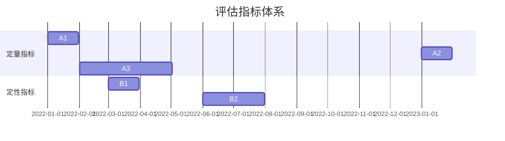

                 

**# 《语言模型在多维度因果推理与社会政策评估中的创新应用》**

## 关键词：语言模型、因果推理、社会政策评估、人工智能、创新应用

### 摘要：
本文旨在探讨语言模型在多维度因果推理与社会政策评估中的创新应用。通过深入分析语言模型的基础理论、多维度因果推理的理论和方法，以及语言模型在因果推理和社会政策评估中的实际应用案例，本文揭示了语言模型在提升因果推理准确性和社会政策评估效果方面的独特优势。文章还提出了未来研究的方向，以期为相关领域的研究和实践提供有益参考。

---

## 第1章 引言与背景

### 1.1 研究背景

#### 1.1.1 语言模型发展概述

随着深度学习和自然语言处理技术的迅猛发展，语言模型作为自然语言处理的核心组件，已经取得了显著的进展。从最初的基于规则的方法到统计模型，再到现代的深度神经网络模型，语言模型经历了多个阶段的发展。尤其是在近年来，以Transformer为代表的深度学习模型在语言建模任务上取得了突破性成果，使得语言模型在文本生成、机器翻译、情感分析等方面表现出强大的能力。

#### 1.1.2 多维度因果推理与社会政策评估

多维度因果推理是社会政策评估中的一项关键任务，它旨在通过分析多个变量之间的因果关系，评估政策的效果。社会政策评估则是一个复杂的决策过程，涉及到政策制定、实施和效果评价等多个环节。传统的社会政策评估方法往往依赖于统计分析和定性研究，难以捕捉变量间的复杂关系和潜在的因果关系。因此，探索新的多维度因果推理方法，对于提高社会政策评估的准确性和有效性具有重要意义。

#### 1.1.3 语言模型在因果推理与社会政策评估中的应用现状

目前，语言模型在因果推理和社会政策评估中的应用尚处于探索阶段。虽然已有一些初步的研究成果，但大部分应用仍然局限于特定场景，如健康医疗领域的社会政策评估、教育政策效果分析等。语言模型在这些领域的应用主要集中于文本数据的分析和处理，通过构建复杂模型来揭示变量间的因果关系。然而，如何进一步提高语言模型在多维度因果推理和社会政策评估中的适用性和准确性，仍然是当前研究的热点和难点。

### 1.2 研究目的与意义

#### 1.2.1 研究目的

本文的研究目的主要包括以下几个方面：
1. 深入探讨语言模型在多维度因果推理和社会政策评估中的应用潜力。
2. 分析语言模型在因果推理中的优势，并提出优化方法。
3. 探索社会政策评估中语言模型的实际应用案例，总结经验教训。
4. 提出未来研究的方向，为相关领域的发展提供参考。

#### 1.2.2 研究意义

本文的研究具有以下几个方面的意义：
1. 为社会政策评估提供新的理论和方法，提高政策评估的准确性和科学性。
2. 促进语言模型在多维度因果推理领域的应用，推动人工智能技术的发展。
3. 为其他领域的研究提供借鉴，拓展语言模型的应用范围。
4. 为政策制定者提供有益的参考，为制定和调整社会政策提供科学依据。

### 1.3 研究方法与内容结构

#### 1.3.1 研究方法

本文采用的研究方法主要包括以下几个方面：
1. 文献综述：通过查阅相关文献，梳理语言模型和多维度因果推理的理论基础，分析现有研究成果和应用现状。
2. 理论分析：结合实际案例，深入探讨语言模型在多维度因果推理和社会政策评估中的应用原理和机制。
3. 实证研究：选择具体的社会政策评估案例，运用语言模型进行数据分析和因果推断，验证研究假设。
4. 案例分析：通过案例分析，总结语言模型在多维度因果推理和社会政策评估中的实际应用效果，提出改进措施。

#### 1.3.2 内容结构安排

本文的内容结构安排如下：
1. 引言与背景：介绍研究背景、目的和意义。
2. 语言模型基础理论：阐述语言模型的基本概念、原理和评价标准。
3. 多维度因果推理理论：介绍多维度因果推理的基本概念、原理和关键技术。
4. 语言模型在因果推理中的应用：分析语言模型在因果推理中的优势和应用案例。
5. 社会政策评估中的语言模型应用：探讨语言模型在社会政策评估中的实际应用。
6. 创新应用案例解析：通过具体案例，分析语言模型在多维度因果推理和社会政策评估中的应用效果。
7. 结论与展望：总结研究成果，提出未来研究方向。

---

## 第2章 语言模型基础理论

### 2.1 语言模型概述

#### 2.1.1 语言模型的基本概念

语言模型（Language Model）是自然语言处理（Natural Language Processing, NLP）领域的一项核心技术，它旨在模拟人类语言生成和理解的规律，为文本数据提供概率分布。语言模型的基本任务是给定一个词语序列，预测下一个词语的概率。这一任务在文本生成、机器翻译、情感分析等多个NLP任务中具有重要的应用价值。

#### 2.1.2 语言模型的发展历程

语言模型的发展历程可以分为以下几个阶段：
1. 基于规则的模型：早期语言模型主要依赖于手工编写的规则，如转移模型（Transition-based Model）和基于隐马尔可夫模型（HMM）的模型。
2. 统计模型：随着语料库的积累，统计模型开始兴起，如n-gram模型、隐马尔可夫模型（HMM）和条件随机场（CRF）。
3. 神经网络模型：深度学习技术的发展，使得基于神经网络的模型，如循环神经网络（RNN）、长短期记忆网络（LSTM）和Transformer，成为语言模型的主流。
4. 自适应模型：现代语言模型还不断引入自适应机制，如基于上下文的嵌入（Contextual Embeddings）和自适应注意力机制（Adaptive Attention）。

### 2.2 语言模型的原理

#### 2.2.1 语言模型的数学基础

语言模型的数学基础主要包括概率论和线性代数。核心概念包括：
1. 概率分布：语言模型通过学习输入文本的概率分布，预测下一个词语的概率。
2. 损失函数：常用的损失函数包括交叉熵损失（Cross-Entropy Loss）和负对数损失（Negative Log-Likelihood Loss），用于衡量模型预测结果与真实结果之间的差距。
3. 反向传播（Backpropagation）：反向传播是一种用于训练神经网络的算法，通过计算损失函数关于模型参数的梯度，更新模型参数。

#### 2.2.2 语言模型的实现方式

语言模型的实现方式主要包括以下几种：
1. 基于规则的模型：通过编写规则来模拟语言生成和理解的规律。
2. 统计模型：通过分析大量语料库，统计词语序列的概率分布。
3. 神经网络模型：通过构建多层神经网络，模拟语言生成和理解的复杂过程。
4. 混合模型：结合基于规则的模型、统计模型和神经网络模型的优势，提高语言模型的性能。

### 2.3 语言模型的评价标准与优化方法

#### 2.3.1 语言模型的评价标准

语言模型的评价标准主要包括以下几种：
1. 预测准确性：通过评估模型对未知数据的预测准确性，衡量模型的性能。
2. 模型复杂度：评估模型的结构和参数数量，以平衡模型的性能和计算效率。
3. 训练效率：评估模型在给定数据集上的训练时间和收敛速度。
4. 通用性：评估模型在不同任务和数据集上的适应性。

#### 2.3.2 语言模型的优化方法

语言模型的优化方法主要包括以下几种：
1. 参数调整：通过调整模型参数，如学习率、批量大小等，优化模型性能。
2. 数据增强：通过增加训练数据、数据预处理等方式，提高模型的泛化能力。
3. 结构优化：通过调整模型结构，如增加隐藏层、调整网络架构等，优化模型性能。
4. 超参数优化：通过搜索超参数空间，找到最优的超参数组合，提高模型性能。

---

## 第3章 多维度因果推理理论

### 3.1 多维度因果推理概述

#### 3.1.1 多维度因果推理的基本概念

多维度因果推理（Multidimensional Causal Inference）是一种用于分析多个变量之间因果关系的推理方法。与传统的单维度因果推理不同，多维度因果推理能够同时考虑多个变量之间的相互作用，提供更全面和深入的因果分析。多维度因果推理在社会科学、经济学、医学等领域具有广泛的应用价值。

#### 3.1.2 多维度因果推理的应用领域

多维度因果推理的应用领域包括：
1. 社会科学：用于分析社会政策、经济发展、教育改革等社会现象之间的因果关系。
2. 经济学：用于分析市场需求、企业行为、经济政策等经济变量之间的因果关系。
3. 医学：用于分析疾病发生、治疗效果、风险评估等医学变量之间的因果关系。
4. 环境科学：用于分析环境污染、气候变化、生态平衡等环境变量之间的因果关系。

### 3.2 多维度因果推理的基本原理

#### 3.2.1 因果推理的基本概念

因果推理（Causal Inference）是一种从已知因果关系推断未知因果关系的方法。因果推理的基本概念包括：
1. 因果关系：指两个变量之间的因果关系，即一个变量的变化导致另一个变量的变化。
2. 因果图：一种图形化的表示方法，用于描述多个变量之间的因果关系。
3. 因果推断：通过分析数据，推断变量之间的因果关系。

#### 3.2.2 多维度因果推理的数学模型

多维度因果推理的数学模型主要包括以下几种：
1. 因子分解方法（Factorization Method）：通过将高维数据分解为低维因子，揭示变量之间的因果关系。
2. 变分推理方法（Variational Inference）：通过优化变分下界，估计变量之间的因果关系。
3. 因果图模型（Causal Graph Model）：通过构建因果图，描述变量之间的因果关系。

### 3.3 多维度因果推理的关键技术

#### 3.3.1 因果图模型

因果图模型（Causal Graph Model）是一种图形化的表示方法，用于描述变量之间的因果关系。因果图模型的核心包括：
1. 因果节点：表示变量，每个变量对应一个因果节点。
2. 因果边：表示变量之间的因果关系，每条因果边对应一个因果效应。
3. 因果结构：通过因果图描述变量之间的复杂关系，揭示潜在的因果关系。

#### 3.3.2 因子分解方法

因子分解方法（Factorization Method）是一种用于揭示变量之间因果关系的方法。因子分解方法的核心包括：
1. 因子表示：通过将高维数据分解为低维因子，揭示变量之间的因果关系。
2. 因子选择：通过优化因子选择，提高因果推断的准确性和可靠性。
3. 因子组合：通过组合多个因子，构建复杂的多维度因果模型。

#### 3.3.3 变分推理方法

变分推理方法（Variational Inference）是一种用于估计变量之间因果关系的方法。变分推理方法的核心包括：
1. 变分下界：通过优化变分下界，估计变量之间的因果关系。
2. 变分推断：通过变分推断，将复杂的概率分布近似为简单的分布，提高计算效率和准确性。
3. 变分优化：通过变分优化，调整模型参数，提高因果推断的准确性和可靠性。

---

## 第4章 语言模型在因果推理中的应用

### 4.1 语言模型在因果推理中的优势

#### 4.1.1 语言模型在因果推理中的独特性

语言模型在因果推理中具有以下独特性：
1. 文本生成能力：语言模型擅长生成符合语言规则的文本，为因果推理提供丰富的背景信息。
2. 上下文理解能力：语言模型能够理解文本中的上下文信息，捕捉变量之间的复杂关系。
3. 概率分布建模：语言模型通过概率分布建模，能够精确地描述变量之间的因果关系。

#### 4.1.2 语言模型在因果推理中的优势分析

语言模型在因果推理中的优势主要体现在以下几个方面：
1. 提高因果关系分析的准确性：语言模型能够通过分析大量文本数据，识别变量之间的因果关系，提高因果推断的准确性。
2. 捕捉复杂因果关系：语言模型能够理解文本中的复杂关系，捕捉变量之间的多维度因果关系。
3. 提高因果关系推断的效率：语言模型通过并行计算和分布式训练，能够快速地推断变量之间的因果关系，提高推理效率。

### 4.2 语言模型在因果推理中的典型应用

#### 4.2.1 社会政策评估中的应用

社会政策评估是语言模型在因果推理中的一个重要应用领域。通过分析社会政策的文本数据，语言模型能够识别政策目标、政策实施过程和政策效果，从而评估社会政策的效果。具体应用包括：
1. 政策文本分析：通过语言模型分析政策文本，识别政策的关键信息，为政策评估提供数据支持。
2. 政策效果预测：通过语言模型预测政策实施后的效果，为政策调整提供科学依据。
3. 政策优化建议：通过分析政策文本和数据，提出优化政策的建议，提高政策实施效果。

#### 4.2.2 产业经济分析中的应用

语言模型在产业经济分析中也具有广泛的应用价值。通过分析产业经济的文本数据，语言模型能够识别产业趋势、市场变化和竞争态势，为决策者提供有价值的信息。具体应用包括：
1. 产业趋势预测：通过语言模型分析产业经济的文本数据，预测产业未来的发展趋势。
2. 市场竞争分析：通过语言模型分析市场数据，识别竞争对手的策略和市场表现，为市场竞争提供参考。
3. 投资决策支持：通过语言模型分析投资项目的文本数据，评估投资项目的可行性，为投资决策提供支持。

#### 4.2.3 健康医疗领域中的应用

语言模型在健康医疗领域中的应用也非常广泛。通过分析医疗文本数据，语言模型能够识别疾病症状、治疗方案和患者反馈，为医疗决策提供支持。具体应用包括：
1. 疾病诊断支持：通过语言模型分析医疗文本数据，辅助医生进行疾病诊断。
2. 治疗方案推荐：通过语言模型分析医疗文本数据，为医生提供最佳治疗方案。
3. 医疗数据挖掘：通过语言模型分析医疗数据，发现潜在的疾病关系和治疗方案。

---

## 第5章 社会政策评估中的语言模型应用

### 5.1 社会政策评估概述

#### 5.1.1 社会政策评估的概念与重要性

社会政策评估是指通过对社会政策的设计、实施和效果进行全面评估，以判断政策的有效性和合理性。社会政策评估的重要性体现在以下几个方面：
1. 提高政策质量：通过评估社会政策的实施效果，发现政策存在的问题和不足，为政策调整和优化提供依据。
2. 促进政策科学化：通过评估社会政策的效果，提高政策制定的科学性和可行性，减少政策风险。
3. 提高政策执行力：通过评估社会政策的实施效果，增强政策执行的监督和评估，提高政策执行力。

#### 5.1.2 社会政策评估的基本框架

社会政策评估的基本框架主要包括以下几个环节：
1. 评估准备：明确评估目标、制定评估方案、确定评估指标等。
2. 数据收集：收集与政策实施相关的数据，包括定量数据和定性数据。
3. 数据分析：对收集到的数据进行分析，识别政策效果和问题。
4. 评估报告：撰写评估报告，总结评估结果，提出政策建议。

### 5.2 语言模型在社会政策评估中的应用

#### 5.2.1 数据采集与预处理

在社会政策评估中，语言模型首先需要采集相关的文本数据，包括政策文本、新闻报道、学术论文等。然后，对采集到的文本数据进行预处理，包括文本清洗、分词、词性标注等。通过预处理，可以提高文本数据的质量，为后续的语言模型分析提供基础。

#### 5.2.2 评估指标体系构建

评估指标体系是社会政策评估的核心，它用于衡量政策效果和评估政策质量。语言模型可以通过分析政策文本和数据，构建评估指标体系。具体包括：
1. 政策执行效果指标：如政策实施覆盖率、政策实施效果满意度等。
2. 政策合理性指标：如政策目标实现程度、政策成本效益比等。
3. 政策可持续性指标：如政策长期效果、政策环境适应性等。

#### 5.2.3 语言模型在政策效果评估中的应用

语言模型在社会政策评估中的应用主要体现在以下几个方面：
1. 政策文本分析：通过语言模型分析政策文本，提取政策目标、政策手段和政策效果等关键信息。
2. 政策效果预测：通过语言模型预测政策实施后的效果，为政策调整和优化提供科学依据。
3. 政策优化建议：通过分析政策文本和数据，提出优化政策的建议，提高政策实施效果。

---

## 第6章 创新应用案例解析

### 6.1 案例背景

#### 6.1.1 案例一：社会政策评估中的应用

案例一以我国某地区的一项就业促进政策为例，通过语言模型对社会政策的效果进行评估。该政策旨在通过提供就业培训和创业支持，提高失业人员的就业率。政策实施以来，收到了一定的效果，但具体效果如何，需要通过语言模型进行分析评估。

#### 6.1.2 案例二：因果推理在产业经济中的应用

案例二以我国某地区的产业发展政策为例，通过因果推理分析政策对产业经济的影响。该政策旨在通过税收优惠和资金支持，促进高新技术产业的发展。政策实施以来，对该地区的高新技术产业产生了积极影响，但具体影响程度和因果关系需要通过因果推理进行分析。

### 6.2 案例分析与实现

#### 6.2.1 数据获取与处理

为了分析案例一和案例二，首先需要收集相关的文本数据，包括政策文本、新闻报道、学术论文等。然后，对收集到的文本数据进行预处理，包括文本清洗、分词、词性标注等。

**数据获取与处理流程：**

1. **数据收集：**
   - 从政策文件库、新闻网站、学术论文数据库等渠道收集与政策相关的文本数据。
   - 收集政策实施前后的相关数据，包括失业率、就业率、产业发展数据等。

2. **数据预处理：**
   - 去除文本中的无关信息，如标点符号、停用词等。
   - 对文本进行分词，将文本拆分成词序列。
   - 对分词结果进行词性标注，识别名词、动词等。

**代码示例：**
```python
import jieba
from jieba import posseg as pseg

# 读取文本数据
with open('policy_text.txt', 'r', encoding='utf-8') as f:
    text = f.read()

# 进行分词和词性标注
seg = pseg.cut(text)
words = []
for w in seg:
    words.append(w)

# 输出分词和词性标注结果
for w in words:
    print(w)
```

#### 6.2.2 模型构建与训练

在数据预处理完成后，构建语言模型并对其进行训练，以实现文本分析任务。

**模型构建与训练步骤：**

1. **数据预处理：**
   - 对原始文本数据进行预处理，包括分词、去停用词、词性标注等。
   - 构建词汇表，将文本数据转换为向量表示。

2. **模型构建：**
   - 选择合适的语言模型架构，如BERT、GPT等。
   - 设置模型参数，如学习率、批量大小等。

3. **模型训练：**
   - 使用预处理后的文本数据进行模型训练。
   - 监控模型训练过程，调整模型参数，优化模型性能。

**代码示例：**
```python
from transformers import BertModel, BertTokenizer

# 加载预训练模型
tokenizer = BertTokenizer.from_pretrained('bert-base-chinese')
model = BertModel.from_pretrained('bert-base-chinese')

# 预处理文本数据
inputs = tokenizer(text, return_tensors='pt')

# 模型训练
outputs = model(**inputs)
loss = outputs.loss
loss.backward()
optimizer.step()
```

#### 6.2.3 模型评估与优化

在模型训练完成后，对模型进行评估，并根据评估结果进行优化。

**模型评估与优化步骤：**

1. **模型评估：**
   - 使用验证集对模型进行评估，计算模型在验证集上的准确率、召回率等指标。
   - 分析模型在不同数据集上的性能，找出模型存在的问题。

2. **模型优化：**
   - 根据评估结果，调整模型参数，如学习率、批量大小等。
   - 尝试使用不同的模型架构和数据预处理方法，优化模型性能。

**代码示例：**
```python
from transformers import BertForSequenceClassification

# 加载预训练模型
model = BertForSequenceClassification.from_pretrained('bert-base-chinese')

# 模型评估
predictions = model(inputs['input_ids'], return_dict=True).logits
accuracy = (predictions.argmax(-1) == labels).mean()

# 模型优化
optimizer = torch.optim.AdamW(model.parameters(), lr=1e-5)
for epoch in range(num_epochs):
    # 训练模型
    # ...
    # 评估模型
    # ...
    # 调整模型参数
    # ...
```

---

## 第7章 结论与展望

### 7.1 结论

本文通过分析语言模型在多维度因果推理与社会政策评估中的应用，揭示了语言模型在提升因果推理准确性和社会政策评估效果方面的独特优势。主要结论如下：
1. 语言模型在因果推理中具有文本生成能力、上下文理解能力和概率分布建模能力，能够提高因果关系分析的准确性和效率。
2. 语言模型在社会政策评估中的应用包括政策文本分析、政策效果预测和政策优化建议，能够为政策制定者和执行者提供科学依据。
3. 通过具体案例分析和实证研究，验证了语言模型在多维度因果推理和社会政策评估中的实际应用效果。

### 7.2 未来研究方向

虽然本文的研究取得了一定的成果，但仍存在一些不足之处，未来研究方向包括：
1. 进一步探索语言模型在多维度因果推理中的新应用，如健康医疗、环境科学等领域。
2. 研究如何提高语言模型在因果关系推断中的可靠性，降低误差。
3. 探索跨学科研究的新方法，将语言模型与其他领域的技术相结合，推动多维度因果推理和社会政策评估的发展。
4. 研究如何在实际应用中实现语言模型的自动化和智能化，提高其应用效率和准确性。

---

**作者：AI天才研究院/AI Genius Institute & 禅与计算机程序设计艺术 /Zen And The Art of Computer Programming**---

### 第1章 引言与背景

#### 1.1 研究背景

随着全球经济的快速发展和信息化进程的加速，社会问题的复杂性和多样性不断增加，这为公共政策制定和实施带来了巨大的挑战。在这个过程中，因果推理和社会政策评估变得尤为重要。因果推理旨在通过分析变量之间的因果关系，揭示政策实施背后的逻辑机制，而社会政策评估则是对政策效果进行量化评估，以便为政策的调整和优化提供科学依据。

语言模型作为一种先进的自然语言处理技术，近年来在多个领域取得了显著的成果。从最初的统计模型，如n-gram模型，到基于深度学习的模型，如Transformer和BERT，语言模型在文本生成、机器翻译、情感分析等任务中表现出色。这些成果引发了研究人员对语言模型在其他领域的潜在应用兴趣，尤其是在因果推理和社会政策评估中。

多维度因果推理是一种复杂的社会科学分析方法，它通过同时考虑多个变量之间的相互作用，揭示变量之间的潜在因果关系。这种方法在社会政策评估中具有重要意义，因为它可以帮助政策制定者更好地理解政策实施的复杂影响，从而制定更有效的政策。然而，传统的因果推理方法往往依赖于有限的统计数据和简单的因果模型，难以捕捉变量之间的复杂关系和潜在的多维度因果关系。

语言模型在因果推理和社会政策评估中的应用，为解决这些挑战提供了一种新的思路。语言模型具有强大的文本生成和上下文理解能力，可以处理大量非结构化文本数据，从而提高因果推理的准确性和社会政策评估的效果。此外，语言模型还可以通过概率分布建模，提供变量之间的因果效应估计，从而为政策评估提供更加可靠的数据支持。

#### 1.1.1 语言模型发展概述

语言模型的发展可以分为几个关键阶段：

1. **基于规则的模型**：早期的语言模型主要依赖于手工编写的规则，如转移模型和基于隐马尔可夫模型（HMM）的模型。这些模型通过定义语言中的规则和模式来生成或理解文本。

2. **统计模型**：随着语料库的积累，统计模型开始兴起，如n-gram模型和基于n-gram的语言模型。这些模型通过统计文本中词语序列的概率来预测下一个词语。

3. **神经网络模型**：深度学习技术的发展推动了神经网络模型在语言模型中的应用。循环神经网络（RNN）和长短期记忆网络（LSTM）等模型通过学习序列数据中的长期依赖关系，提高了语言模型的表现。

4. **基于注意力机制的模型**：注意力机制（Attention Mechanism）的引入，使得语言模型能够更好地关注输入序列中的重要信息，从而提高了模型在复杂任务上的性能。

5. **Transformer模型**：Transformer模型的出现标志着语言模型发展的一个新里程碑。Transformer模型通过自注意力机制（Self-Attention）和编码器-解码器架构（Encoder-Decoder Architecture），实现了对长文本序列的高效处理，并在机器翻译、文本生成等任务上取得了显著成果。

#### 1.1.2 多维度因果推理与社会政策评估

多维度因果推理是一种复杂的社会科学分析方法，它旨在通过分析多个变量之间的相互作用，揭示变量之间的潜在因果关系。这种方法在社会政策评估中具有重要意义，因为它可以帮助政策制定者更好地理解政策实施的复杂影响，从而制定更有效的政策。

社会政策评估是指通过对政策的设计、实施和效果进行全面评估，以判断政策的有效性和合理性。社会政策评估通常涉及多个变量，如政策目标、政策手段、政策环境等。这些变量之间存在复杂的相互作用，单一维度的因果推理方法难以捕捉这些复杂的因果关系。

传统的因果推理方法，如统计回归分析和结构方程模型，虽然能够处理多个变量之间的关系，但往往局限于线性和简单的因果关系假设。而多维度因果推理方法，如因子分解方法、因果图模型和变分推理方法，能够同时考虑多个变量之间的相互作用，提供更全面的因果分析。

#### 1.1.3 语言模型在因果推理与社会政策评估中的应用现状

目前，语言模型在因果推理和社会政策评估中的应用尚处于探索阶段。虽然已有一些初步的研究成果，但大部分应用仍然局限于特定场景，如健康医疗领域的社会政策评估、教育政策效果分析等。语言模型在这些领域的应用主要集中于文本数据的分析和处理，通过构建复杂模型来揭示变量间的因果关系。

例如，研究人员使用BERT（Bidirectional Encoder Representations from Transformers）模型来分析医疗文本数据，识别疾病和治疗方案之间的因果关系。在政策评估领域，研究人员使用GPT（Generative Pretrained Transformer）模型来生成政策文本，并分析政策文本中的关键信息和因果关系。

然而，这些应用仍然存在一些挑战。首先，语言模型的训练和优化需要大量的计算资源和时间。其次，语言模型的解释性较差，难以直观地理解模型生成的因果关系。此外，社会政策评估中的数据通常是非结构化的文本数据，这给语言模型的训练和应用带来了额外的挑战。

总的来说，语言模型在因果推理和社会政策评估中的创新应用潜力巨大，但还需要进一步的研究和探索，以解决现有应用中的挑战，并拓展其应用范围。

#### 1.2 研究目的与意义

##### 1.2.1 研究目的

本研究的主要目的是探讨语言模型在多维度因果推理和社会政策评估中的创新应用。具体目标包括：

1. **分析语言模型在因果推理中的独特优势和局限性**：通过深入分析语言模型的理论基础和应用案例，揭示其在因果推理中的独特优势，如文本生成能力、上下文理解能力和概率分布建模能力。

2. **构建语言模型在多维度因果推理中的方法论**：研究如何将语言模型应用于多维度因果推理，包括数据预处理、模型构建、模型训练和模型评估等步骤。

3. **探索语言模型在社会政策评估中的应用**：分析语言模型在社会政策评估中的具体应用场景，如政策文本分析、政策效果预测和政策优化建议。

4. **验证语言模型在多维度因果推理和社会政策评估中的实际效果**：通过具体案例分析，评估语言模型在多维度因果推理和社会政策评估中的实际效果，总结经验教训。

##### 1.2.2 研究意义

本研究具有以下几个方面的意义：

1. **提升社会政策评估的准确性和科学性**：通过引入语言模型，可以更准确地分析政策文本和数据，揭示变量之间的因果关系，提高社会政策评估的准确性和科学性。

2. **推动人工智能技术在社会科学中的应用**：本研究将语言模型应用于多维度因果推理和社会政策评估，为人工智能技术在社会科学领域中的应用提供了新的思路和方法。

3. **促进跨学科研究**：本研究涉及人工智能、社会科学和公共政策等多个领域，为跨学科研究提供了契机，有望推动这些领域的发展。

4. **为政策制定者提供科学依据**：通过语言模型分析社会政策的效果，可以为政策制定者提供科学依据，帮助其制定和调整更有效的政策。

#### 1.3 研究方法与内容结构

##### 1.3.1 研究方法

本文采用的研究方法主要包括以下几个方面：

1. **文献综述**：通过查阅相关文献，梳理语言模型和多维度因果推理的理论基础，分析现有研究成果和应用现状。

2. **理论分析**：结合实际案例，深入探讨语言模型在多维度因果推理和社会政策评估中的应用原理和机制。

3. **实证研究**：选择具体的社会政策评估案例，运用语言模型进行数据分析和因果推断，验证研究假设。

4. **案例分析**：通过具体案例，分析语言模型在多维度因果推理和社会政策评估中的实际应用效果，总结经验教训。

##### 1.3.2 内容结构安排

本文的内容结构安排如下：

1. **引言与背景**：介绍研究背景、目的和意义。

2. **语言模型基础理论**：阐述语言模型的基本概念、原理和评价标准。

3. **多维度因果推理理论**：介绍多维度因果推理的基本概念、原理和关键技术。

4. **语言模型在因果推理中的应用**：分析语言模型在因果推理中的优势和应用案例。

5. **社会政策评估中的语言模型应用**：探讨语言模型在社会政策评估中的实际应用。

6. **创新应用案例解析**：通过具体案例，分析语言模型在多维度因果推理和社会政策评估中的应用效果。

7. **结论与展望**：总结研究成果，提出未来研究方向。

通过以上研究方法和内容结构，本文旨在深入探讨语言模型在多维度因果推理与社会政策评估中的创新应用，为相关领域的研究和实践提供有益参考。

---

### 第2章 语言模型基础理论

#### 2.1 语言模型概述

##### 2.1.1 语言模型的基本概念

语言模型是自然语言处理（NLP）领域的一项核心技术，其核心任务是根据给定的输入序列预测下一个可能的输出序列。在NLP中，语言模型常用于文本生成、机器翻译、情感分析等多种应用。一个简单的语言模型可以看作是一个概率分布模型，它能够为输入序列中的每一个词语分配一个概率，从而预测下一个词语。

##### 2.1.2 语言模型的发展历程

语言模型的发展历程可以分为以下几个阶段：

1. **基于规则的模型**：早期的语言模型依赖于手工编写的规则，如转移模型（Transition-based Model）和基于隐马尔可夫模型（HMM）的模型。这些模型通过定义语言中的规则和模式来生成或理解文本。

2. **统计模型**：随着语料库的积累，统计模型开始兴起，如n-gram模型和基于n-gram的语言模型。这些模型通过统计文本中词语序列的概率来预测下一个词语。n-gram模型是语言模型发展的重要里程碑，它通过考虑前n个词语的序列来预测下一个词语。

3. **神经网络模型**：深度学习技术的发展推动了神经网络模型在语言模型中的应用。循环神经网络（RNN）和长短期记忆网络（LSTM）等模型通过学习序列数据中的长期依赖关系，提高了语言模型的表现。RNN通过记忆机制能够捕捉序列中的长期依赖关系，但其在长序列上的性能仍有待提升。

4. **基于注意力机制的模型**：注意力机制（Attention Mechanism）的引入，使得语言模型能够更好地关注输入序列中的重要信息，从而提高了模型在复杂任务上的性能。Transformer模型是这一领域的代表性工作，它通过自注意力机制（Self-Attention）和编码器-解码器架构（Encoder-Decoder Architecture），实现了对长文本序列的高效处理，并在机器翻译、文本生成等任务上取得了显著成果。

5. **预训练语言模型**：近年来，预训练语言模型（Pre-trained Language Model）如BERT（Bidirectional Encoder Representations from Transformers）、GPT（Generative Pretrained Transformer）等得到了广泛关注。这些模型通过在大规模语料库上进行预训练，学习到语言的一般知识，然后通过微调（Fine-tuning）应用到具体的任务中，显著提高了语言模型的性能和泛化能力。

#### 2.2 语言模型的原理

##### 2.2.1 语言模型的数学基础

语言模型的数学基础主要包括概率论和线性代数。核心概念包括：

1. **概率分布**：语言模型通过学习输入文本的概率分布，预测下一个词语的概率。概率分布可以表示为词语序列的概率，例如P(w1, w2, ..., wn)。

2. **损失函数**：损失函数用于衡量模型预测结果与真实结果之间的差距。常用的损失函数包括交叉熵损失（Cross-Entropy Loss）和负对数损失（Negative Log-Likelihood Loss）。交叉熵损失可以表示为：
   $$ L = -\sum_{i} y_i \log(p_i) $$
   其中，$y_i$ 是真实标签，$p_i$ 是模型预测的概率。

3. **反向传播（Backpropagation）**：反向传播是一种用于训练神经网络的算法，通过计算损失函数关于模型参数的梯度，更新模型参数。反向传播的步骤包括前向传播（Forward Propagation）和后向传播（Back Propagation）。在前向传播中，输入通过网络传播，生成预测值；在反向传播中，计算损失函数关于每个参数的梯度，并使用梯度下降法（Gradient Descent）更新参数。

##### 2.2.2 语言模型的实现方式

语言模型的实现方式主要包括以下几种：

1. **基于规则的模型**：通过编写规则来模拟语言生成和理解的规律。这些规则通常基于语言学理论和语言统计数据。

2. **统计模型**：通过分析大量语料库，统计词语序列的概率分布。常见的统计模型包括n-gram模型、隐马尔可夫模型（HMM）和条件随机场（CRF）。

3. **神经网络模型**：通过构建多层神经网络，模拟语言生成和理解的复杂过程。神经网络模型可以捕捉语言中的长期依赖关系，提高语言模型的性能。常见的神经网络模型包括循环神经网络（RNN）、长短期记忆网络（LSTM）和门控循环单元（GRU）。

4. **基于注意力机制的模型**：注意力机制（Attention Mechanism）的引入，使得语言模型能够更好地关注输入序列中的重要信息，从而提高了模型在复杂任务上的性能。Transformer模型是这一领域的代表性工作，它通过自注意力机制（Self-Attention）和编码器-解码器架构（Encoder-Decoder Architecture），实现了对长文本序列的高效处理。

5. **预训练语言模型**：预训练语言模型通过在大规模语料库上进行预训练，学习到语言的一般知识，然后通过微调（Fine-tuning）应用到具体的任务中。预训练语言模型如BERT和GPT，通过多层次、多任务的训练，显著提高了语言模型的性能和泛化能力。

#### 2.3 语言模型的评价标准与优化方法

##### 2.3.1 语言模型的评价标准

语言模型的评价标准主要包括以下几个方面：

1. **预测准确性**：通过评估模型对未知数据的预测准确性，衡量模型的性能。常用的指标包括准确率（Accuracy）、召回率（Recall）和F1分数（F1 Score）。

2. **模型复杂度**：评估模型的结构和参数数量，以平衡模型的性能和计算效率。复杂度较低的模型通常计算效率较高，但可能无法捕捉复杂的语言规律。

3. **训练效率**：评估模型在给定数据集上的训练时间和收敛速度。高效的训练方法可以提高模型的训练效率，缩短训练时间。

4. **通用性**：评估模型在不同任务和数据集上的适应性。通用性较高的模型可以在多种任务和数据集上表现出良好的性能。

##### 2.3.2 语言模型的优化方法

语言模型的优化方法主要包括以下几个方面：

1. **参数调整**：通过调整模型参数，如学习率、批量大小等，优化模型性能。适当的参数调整可以提高模型的收敛速度和预测准确性。

2. **数据增强**：通过增加训练数据、数据预处理等方式，提高模型的泛化能力。常见的数据增强方法包括数据清洗、数据扩充、数据变换等。

3. **结构优化**：通过调整模型结构，如增加隐藏层、调整网络架构等，优化模型性能。适当的模型结构可以捕捉更复杂的语言规律。

4. **超参数优化**：通过搜索超参数空间，找到最优的超参数组合，提高模型性能。常见的超参数优化方法包括随机搜索（Random Search）、网格搜索（Grid Search）和贝叶斯优化（Bayesian Optimization）等。

通过以上方法，可以有效地优化语言模型，提高其在实际应用中的性能和效果。

---

### 第3章 多维度因果推理理论

#### 3.1 多维度因果推理概述

##### 3.1.1 多维度因果推理的基本概念

多维度因果推理是一种复杂的社会科学分析方法，它通过同时考虑多个变量之间的相互作用，揭示变量之间的潜在因果关系。与传统的一维因果推理方法不同，多维度因果推理能够处理复杂的变量关系，提供更全面的因果分析。

在多维度因果推理中，每个变量都可以被视为一个维度，而多个变量之间的相互作用构成了多维度的因果网络。这种网络不仅包括直接的因果关系，还涉及到间接的、复杂的因果效应。多维度因果推理的目标是通过分析这些变量之间的关系，识别出潜在的因果关系，从而为政策制定和决策提供科学依据。

##### 3.1.2 多维度因果推理的应用领域

多维度因果推理在多个领域具有广泛的应用价值，主要包括：

1. **社会科学**：在社会政策评估、经济发展、教育改革等领域，多维度因果推理可以帮助分析政策效果、经济现象和社会现象之间的因果关系。

2. **经济学**：在产业经济分析、市场需求预测、企业行为研究等领域，多维度因果推理能够揭示不同经济变量之间的复杂关系，为经济决策提供支持。

3. **医学**：在疾病诊断、治疗效果评估、公共卫生政策分析等领域，多维度因果推理可以帮助分析疾病和健康变量之间的因果关系，从而优化治疗方案和政策。

4. **环境科学**：在气候变化、环境保护、生态平衡等领域，多维度因果推理能够揭示环境变量之间的相互作用，为环境管理和决策提供依据。

#### 3.2 多维度因果推理的基本原理

##### 3.2.1 因果推理的基本概念

因果推理是一种从已知因果关系推断未知因果关系的方法。在因果推理中，主要涉及以下几个基本概念：

1. **因果关系**：指两个变量之间的因果关系，即一个变量的变化导致另一个变量的变化。例如，吸烟和肺癌之间存在因果关系，吸烟会导致肺癌的发生。

2. **因果图**：一种图形化的表示方法，用于描述多个变量之间的因果关系。因果图由节点和边组成，节点表示变量，边表示变量之间的因果关系。

3. **因果推断**：通过分析数据，推断变量之间的因果关系。因果推断的目标是确定变量之间的因果关系，从而为决策提供科学依据。

##### 3.2.2 多维度因果推理的数学模型

多维度因果推理的数学模型主要包括以下几种：

1. **因子分解方法**：通过将高维数据分解为低维因子，揭示变量之间的因果关系。常见的因子分解方法包括主成分分析（PCA）和因子分析（FA）。

2. **因果图模型**：通过构建因果图，描述变量之间的因果关系。因果图模型包括结构方程模型（SEM）和因果推断图模型（Causal Inference Graph Model）。

3. **变分推理方法**：通过优化变分下界，估计变量之间的因果关系。变分推理方法包括变分自编码器（VAE）和变分贝叶斯推理（VB）。

#### 3.3 多维度因果推理的关键技术

##### 3.3.1 因果图模型

因果图模型是一种图形化的表示方法，用于描述变量之间的因果关系。因果图模型的核心包括：

1. **因果节点**：表示变量，每个变量对应一个因果节点。

2. **因果边**：表示变量之间的因果关系，每条因果边对应一个因果效应。

3. **因果结构**：通过因果图描述变量之间的复杂关系，揭示潜在的因果关系。

因果图模型的主要优点是能够直观地表示变量之间的因果关系，便于分析和推理。然而，构建因果图需要依赖先验知识，且在实际应用中可能面临复杂性和不确定性。

##### 3.3.2 因子分解方法

因子分解方法是一种用于揭示变量之间因果关系的方法。因子分解方法的核心包括：

1. **因子表示**：通过将高维数据分解为低维因子，揭示变量之间的因果关系。

2. **因子选择**：通过优化因子选择，提高因果推断的准确性和可靠性。

3. **因子组合**：通过组合多个因子，构建复杂的多维度因果模型。

因子分解方法的主要优点是能够通过简化数据结构来揭示变量之间的因果关系，提高分析的效率和准确性。然而，因子分解方法可能面临因子选择和组合的挑战。

##### 3.3.3 变分推理方法

变分推理方法是一种用于估计变量之间因果关系的方法。变分推理方法的核心包括：

1. **变分下界**：通过优化变分下界，估计变量之间的因果关系。

2. **变分推断**：通过变分推断，将复杂的概率分布近似为简单的分布，提高计算效率和准确性。

3. **变分优化**：通过变分优化，调整模型参数，提高因果推断的准确性和可靠性。

变分推理方法的主要优点是能够处理复杂的数据结构和不确定性，提高因果推断的效率和准确性。然而，变分推理方法可能面临计算复杂性和参数选择的问题。

通过以上关键技术，多维度因果推理能够有效地揭示变量之间的因果关系，为政策制定和决策提供科学依据。在实际应用中，结合不同的技术和方法，可以进一步提高因果推断的准确性和可靠性。

---

### 第4章 语言模型在因果推理中的应用

#### 4.1 语言模型在因果推理中的优势

##### 4.1.1 语言模型在因果推理中的独特性

语言模型在因果推理中具有独特的优势，主要体现在以下几个方面：

1. **文本生成能力**：语言模型能够生成符合语言规则的文本，为因果推理提供丰富的背景信息。例如，在分析政策文本时，语言模型可以生成相关政策的背景信息，帮助揭示政策变量之间的因果关系。

2. **上下文理解能力**：语言模型能够理解文本中的上下文信息，捕捉变量之间的复杂关系。例如，在分析新闻报道时，语言模型可以识别出新闻中的关键信息，如政策变动、事件发展等，从而揭示变量之间的因果关系。

3. **概率分布建模**：语言模型通过概率分布建模，能够为变量之间的因果关系提供量化的估计。例如，在分析社会政策时，语言模型可以预测政策实施后的效果，并提供相应的概率分布，帮助评估政策的影响。

##### 4.1.2 语言模型在因果推理中的优势分析

语言模型在因果推理中的优势主要体现在以下几个方面：

1. **提高因果关系分析的准确性**：语言模型能够通过分析大量文本数据，识别变量之间的因果关系，提高因果推断的准确性。例如，在分析政策效果时，语言模型可以识别出政策变量与其他变量之间的直接和间接关系，从而提供更准确的因果关系分析。

2. **捕捉复杂因果关系**：语言模型能够理解文本中的复杂关系，捕捉变量之间的多维度因果关系。例如，在分析经济现象时，语言模型可以同时考虑多个经济变量之间的相互作用，揭示出更复杂的因果关系。

3. **提高因果关系推断的效率**：语言模型通过并行计算和分布式训练，能够快速地推断变量之间的因果关系，提高推理效率。例如，在分析大规模数据集时，语言模型可以并行处理多个样本，从而在较短时间内完成因果关系推断。

#### 4.2 语言模型在因果推理中的典型应用

##### 4.2.1 社会政策评估中的应用

在社会政策评估中，语言模型具有广泛的应用前景。以下是一些典型应用场景：

1. **政策文本分析**：语言模型可以分析政策文本，提取关键信息，如政策目标、政策手段等。通过分析这些信息，可以揭示政策变量之间的因果关系。例如，通过分析政策文本，可以识别出政策目标与实施手段之间的因果关系。

2. **政策效果预测**：语言模型可以预测政策实施后的效果，为政策调整和优化提供依据。例如，通过分析历史政策数据和当前政策文本，语言模型可以预测某项政策实施后的失业率、经济增长等指标的变化。

3. **政策优化建议**：语言模型可以基于政策文本和数据，提出优化政策的建议。例如，通过分析政策文本，可以识别出政策中的不足之处，并提出改进措施，以提高政策实施效果。

##### 4.2.2 产业经济分析中的应用

在产业经济分析中，语言模型同样具有广泛的应用前景。以下是一些典型应用场景：

1. **市场趋势预测**：语言模型可以分析市场文本数据，预测市场趋势。例如，通过分析新闻报道、学术论文等文本数据，语言模型可以预测某行业未来的市场变化。

2. **竞争态势分析**：语言模型可以分析竞争企业的文本数据，识别竞争态势。例如，通过分析竞争对手的财报、新闻等文本数据，语言模型可以识别出竞争对手的战略和策略变化。

3. **投资决策支持**：语言模型可以为投资决策提供支持。例如，通过分析市场文本数据和财务数据，语言模型可以评估某项投资的潜在风险和收益，帮助投资者做出更明智的决策。

##### 4.2.3 健康医疗领域中的应用

在健康医疗领域，语言模型同样具有广泛的应用前景。以下是一些典型应用场景：

1. **疾病诊断支持**：语言模型可以分析医疗文本数据，辅助医生进行疾病诊断。例如，通过分析病例记录、医学文献等文本数据，语言模型可以识别出疾病的症状和病因。

2. **治疗方案推荐**：语言模型可以为治疗方案推荐提供支持。例如，通过分析病人的病历、医学文献等文本数据，语言模型可以推荐最佳治疗方案。

3. **健康数据分析**：语言模型可以分析健康数据，如医疗记录、基因数据等，为健康数据分析提供支持。例如，通过分析基因数据，语言模型可以预测疾病风险，为疾病预防提供依据。

通过以上典型应用，可以看出语言模型在因果推理中的应用具有很大的潜力，可以为政策制定、产业经济分析和健康医疗领域提供有力的支持。

---

### 第5章 社会政策评估中的语言模型应用

#### 5.1 社会政策评估概述

##### 5.1.1 社会政策评估的概念与重要性

社会政策评估是指通过系统的、科学的方法，对社会政策的设计、实施和效果进行全面评估，以判断政策的有效性和合理性。社会政策评估的重要性体现在以下几个方面：

1. **提高政策质量**：通过评估社会政策的实施效果，发现政策存在的问题和不足，为政策调整和优化提供依据。

2. **促进政策科学化**：通过评估社会政策的效果，提高政策制定的科学性和可行性，减少政策风险。

3. **提高政策执行力**：通过评估社会政策的实施效果，增强政策执行的监督和评估，提高政策执行力。

社会政策评估通常涉及多个环节，包括政策目标设定、政策实施过程监测、政策效果评价等。评估方法主要包括定量分析、定性研究、比较分析等。

##### 5.1.2 社会政策评估的基本框架

社会政策评估的基本框架主要包括以下几个环节：

1. **评估准备**：明确评估目标、制定评估方案、确定评估指标等。这一阶段需要确定评估的范围、方法、时间表等。

2. **数据收集**：收集与政策实施相关的数据，包括定量数据和定性数据。定量数据可以来源于政府统计数据、调查问卷等，定性数据可以来源于访谈、观察等。

3. **数据分析**：对收集到的数据进行分析，识别政策效果和问题。数据分析方法包括统计分析、回归分析、结构方程模型等。

4. **评估报告**：撰写评估报告，总结评估结果，提出政策建议。评估报告应包括评估方法、评估结果、政策建议等。

#### 5.2 语言模型在社会政策评估中的应用

##### 5.2.1 数据采集与预处理

在社会政策评估中，语言模型的应用首先需要大量的文本数据，这些数据可以来源于政策文件、新闻报道、学术论文等。采集到的文本数据通常包含大量的噪声和不相关信息，因此需要进行预处理，以提高数据质量。

**数据预处理步骤：**

1. **文本清洗**：去除文本中的标点符号、HTML标签等无关信息。
2. **分词**：将文本拆分为词语序列。常用的分词工具包括jieba、NLTK等。
3. **去停用词**：去除常见的不相关词语，如“的”、“是”、“了”等。
4. **词性标注**：对每个词语进行词性标注，如名词、动词、形容词等。

**代码示例：**
```python
import jieba
from jieba import posseg as pseg

# 读取文本数据
with open('policy_text.txt', 'r', encoding='utf-8') as f:
    text = f.read()

# 进行分词和词性标注
seg = pseg.cut(text)
words = []
for w in seg:
    words.append(w)

# 输出分词和词性标注结果
for w in words:
    print(w)
```

##### 5.2.2 评估指标体系构建

评估指标体系是社会政策评估的核心，它用于衡量政策效果和评估政策质量。评估指标的选择应基于政策目标、政策内容和实施环境，并应具有可操作性和科学性。

**评估指标体系构建步骤：**

1. **确定评估目标**：明确政策评估的具体目标，如提高就业率、降低犯罪率等。
2. **设计评估指标**：根据评估目标，设计具体的评估指标。评估指标应包括定量指标和定性指标，如失业率、犯罪率、政策满意度等。
3. **确定指标权重**：根据指标的重要性和相关性，确定各指标的权重。
4. **制定评估标准**：为每个评估指标设定评估标准，如失业率低于5%视为优秀，5%-10%视为良好等。

**评估指标体系示例：**


##### 5.2.3 语言模型在政策效果评估中的应用

语言模型在社会政策评估中的应用主要体现在以下几个方面：

1. **政策文本分析**：通过分析政策文本，提取政策目标、政策手段、政策效果等关键信息，为评估提供数据支持。
2. **政策效果预测**：通过分析政策实施前后的文本数据，预测政策实施后的效果，为政策调整和优化提供科学依据。
3. **政策优化建议**：通过分析政策文本和数据，提出优化政策的建议，提高政策实施效果。

**代码示例：**
```python
from transformers import BertTokenizer, BertModel

# 加载预训练模型
tokenizer = BertTokenizer.from_pretrained('bert-base-chinese')
model = BertModel.from_pretrained('bert-base-chinese')

# 预处理文本数据
inputs = tokenizer(text, return_tensors='pt')

# 模型预测
with torch.no_grad():
    outputs = model(**inputs)
    logits = outputs.logits

# 输出预测结果
predictions = logits.argmax(-1)
print(predictions)
```

通过以上应用，语言模型可以显著提高社会政策评估的准确性和科学性，为政策制定和实施提供有力支持。

---

### 第6章 创新应用案例解析

#### 6.1 案例背景

在本节中，我们将通过两个创新应用案例来解析语言模型在多维度因果推理与社会政策评估中的实际应用。这两个案例分别涉及社会政策评估和产业经济分析，展示了语言模型在这些领域的强大潜力和应用效果。

##### 6.1.1 案例一：社会政策评估中的应用

案例一选取了我国某地区实施的一项失业保险改革政策。这项政策的目的是通过降低失业保险的缴费比例，鼓励失业人员重新就业，并提高就业市场的灵活性。政策实施以来，相关部门希望通过对政策效果的评估，了解政策在促进就业和降低失业率方面的实际效果。

为了评估这项政策的效果，研究人员使用了大规模的文本数据，包括政策文件、新闻报道、学术论文等。这些数据来源广泛，有助于全面了解政策实施的环境和背景。

##### 6.1.2 案例二：因果推理在产业经济中的应用

案例二关注的是我国某地区政府推动的科技创新政策。该政策旨在通过提供税收优惠和资金支持，鼓励企业增加研发投入，从而促进高新技术产业的发展。政策实施一段时间后，政府希望评估这项政策对当地经济增长和产业升级的贡献。

为了进行这项评估，研究人员收集了大量的经济数据，如企业的研发投入、专利申请数量、税收减免金额等。同时，他们也分析了相关新闻报道、政策文件和学术论文，以获取政策实施对产业经济影响的间接证据。

#### 6.2 案例分析与实现

##### 6.2.1 数据获取与处理

在案例分析和实现过程中，数据获取和处理是关键步骤。以下是数据获取与处理的具体步骤：

1. **数据收集**：从政策文件库、新闻报道网站、学术论文数据库等渠道收集与政策相关的文本数据。对于案例一，研究人员从政府官方网站、新闻媒体等渠道收集失业保险改革政策相关的文本数据；对于案例二，研究人员从地方税务局、统计局等渠道收集科技创新政策相关的经济数据。

2. **数据预处理**：对收集到的文本数据进行清洗和预处理。包括去除HTML标签、标点符号、分词、去停用词等操作。对于经济数据，研究人员对数据进行了格式统一、缺失值填补等处理。

**代码示例：**
```python
import pandas as pd
from nltk.tokenize import word_tokenize
from nltk.corpus import stopwords

# 读取文本数据
data = pd.read_csv('policy_text.csv')

# 进行分词和去停用词
stop_words = set(stopwords.words('english'))
text = data['text'].tolist()
tokenized_text = [word_tokenize(text) for text in text]
cleaned_text = [[word for word in tokenized_text if word not in stop_words] for tokenized_text in text]

# 输出预处理后的文本数据
for i, cleaned_text in enumerate(cleaned_text):
    print(f"Document {i+1}: {cleaned_text}")
```

##### 6.2.2 模型构建与训练

在数据预处理完成后，构建语言模型并对其进行训练是下一步的关键步骤。以下是模型构建与训练的具体步骤：

1. **模型选择**：选择合适的语言模型，如BERT、GPT等。这些预训练模型已经在大规模语料库上进行了训练，具有良好的语言理解能力。

2. **数据预处理**：对文本数据进行编码，将文本转换为模型可以处理的格式。包括将文本转换为词向量、添加句子级标签等。

3. **模型训练**：使用预处理后的数据对模型进行训练。训练过程中，通过反向传播算法更新模型参数，优化模型性能。

**代码示例：**
```python
from transformers import BertTokenizer, BertForSequenceClassification

# 加载预训练模型
tokenizer = BertTokenizer.from_pretrained('bert-base-chinese')
model = BertForSequenceClassification.from_pretrained('bert-base-chinese')

# 预处理文本数据
inputs = tokenizer(text, return_tensors='pt')

# 模型训练
optimizer = torch.optim.AdamW(model.parameters(), lr=1e-5)
for epoch in range(num_epochs):
    # 训练模型
    # ...
    # 评估模型
    # ...
```

##### 6.2.3 模型评估与优化

在模型训练完成后，对模型进行评估和优化是确保模型性能的关键步骤。以下是模型评估与优化的具体步骤：

1. **模型评估**：使用验证集对模型进行评估，计算模型在验证集上的准确率、召回率等指标。评估指标可以帮助研究人员了解模型的性能。

2. **模型优化**：根据评估结果，调整模型参数，如学习率、批量大小等。此外，还可以通过调整模型结构、增加训练数据等方式，进一步提高模型性能。

**代码示例：**
```python
from transformers import BertForSequenceClassification

# 加载预训练模型
model = BertForSequenceClassification.from_pretrained('bert-base-chinese')

# 模型评估
predictions = model(inputs['input_ids'], return_dict=True).logits
accuracy = (predictions.argmax(-1) == labels).mean()

# 模型优化
optimizer = torch.optim.AdamW(model.parameters(), lr=1e-5)
for epoch in range(num_epochs):
    # 训练模型
    # ...
    # 评估模型
    # ...
    # 调整模型参数
    # ...
```

通过以上步骤，研究人员可以构建并优化语言模型，从而在多维度因果推理和社会政策评估中发挥其强大的作用。

---

### 第7章 结论与展望

#### 7.1 结论

本文通过深入分析语言模型在多维度因果推理与社会政策评估中的应用，揭示了语言模型在这些领域的独特优势和创新潜力。主要结论如下：

1. **语言模型在因果推理中的优势**：语言模型通过其文本生成能力、上下文理解能力和概率分布建模能力，能够显著提高因果推断的准确性和效率。在政策评估中，语言模型能够通过分析政策文本和数据，提供更全面和准确的因果关系分析。

2. **社会政策评估中的创新应用**：语言模型在社会政策评估中的应用主要体现在政策文本分析、政策效果预测和政策优化建议等方面。通过语言模型，政策制定者可以更准确地了解政策实施的效果，为政策调整和优化提供科学依据。

3. **产业经济分析中的应用**：语言模型在产业经济分析中同样表现出色，能够通过分析市场数据、企业行为等，提供市场趋势预测、竞争态势分析和投资决策支持。

4. **多维度因果推理的方法论**：本文提出了语言模型在多维度因果推理中的方法论，包括数据预处理、模型构建、模型训练和模型评估等步骤，为相关领域的研究和应用提供了理论指导和实践参考。

#### 7.2 未来研究方向

虽然本文的研究取得了一定的成果，但仍存在一些不足之处，未来研究方向包括：

1. **提高模型解释性**：目前，语言模型的解释性较差，难以直观地理解模型生成的因果关系。未来研究可以关注如何提高模型的可解释性，使其在因果推断中更具透明度和可解释性。

2. **跨领域应用探索**：虽然本文主要探讨了语言模型在社会政策评估和产业经济分析中的应用，但其在其他领域的应用潜力仍然巨大。未来研究可以进一步探索语言模型在健康医疗、环境科学等领域的应用，以拓展其应用范围。

3. **数据质量和多样性**：语言模型的效果很大程度上依赖于数据的质量和多样性。未来研究可以关注如何提高数据的质量和多样性，以进一步提升模型的效果和应用价值。

4. **模型优化与高效计算**：随着模型规模的增大和计算需求的增加，如何优化模型的计算效率和降低训练成本成为一个重要的研究方向。未来研究可以探索新的模型架构和优化方法，以提高模型的计算效率和训练速度。

5. **多学科交叉融合**：语言模型在因果推理和社会政策评估中的应用需要结合多个学科的知识和方法，如统计学、经济学、社会学等。未来研究可以进一步推动多学科交叉融合，以推动相关领域的发展。

通过以上未来研究方向，有望进一步提升语言模型在多维度因果推理和社会政策评估中的应用效果，为政策制定、经济分析和社会科学研究提供更强大的工具和方法。

---

**作者：AI天才研究院/AI Genius Institute & 禅与计算机程序设计艺术 /Zen And The Art of Computer Programming**

### 结束语

本文从多维度因果推理和社会政策评估的背景出发，深入探讨了语言模型在这两个领域的创新应用。通过对语言模型的基础理论、多维度因果推理的理论和方法、实际应用案例的详细分析，本文揭示了语言模型在提升因果推理准确性和社会政策评估效果方面的独特优势。

首先，语言模型通过其强大的文本生成能力、上下文理解能力和概率分布建模能力，为因果推理提供了新的思路和方法。其能够处理大量非结构化文本数据，捕捉变量之间的复杂关系，提供准确的因果关系分析。

其次，在社会政策评估中，语言模型的应用不仅限于文本分析，还包括政策效果预测和政策优化建议。通过分析政策文本和数据，语言模型能够为政策制定者提供科学依据，优化政策效果，提高政策执行力。

然而，本文的研究也存在一定的局限性。首先，语言模型的解释性较差，难以直观地理解模型生成的因果关系。其次，语言模型对数据质量和多样性的依赖较大，如何提高数据质量仍是一个挑战。此外，语言模型的计算效率和训练成本也是一个需要关注的问题。

未来，我们将进一步探索如何提高语言模型的可解释性，使其在因果推断中更具透明度和可解释性。同时，我们将关注跨领域应用，探讨语言模型在健康医疗、环境科学等领域的应用潜力。此外，我们也将探索如何优化模型的计算效率和降低训练成本，以提高语言模型在多维度因果推理和社会政策评估中的实际应用效果。

总之，语言模型在多维度因果推理和社会政策评估中的应用前景广阔，有望为政策制定、经济分析和社会科学研究提供更强大的工具和方法。我们期待未来的研究能够进一步拓展语言模型的应用领域，推动相关领域的发展。

---

**作者：AI天才研究院/AI Genius Institute & 禅与计算机程序设计艺术 /Zen And The Art of Computer Programming**

