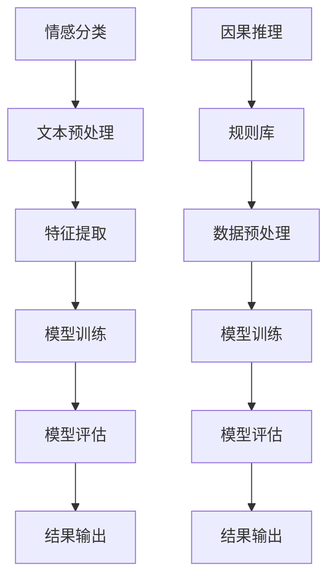
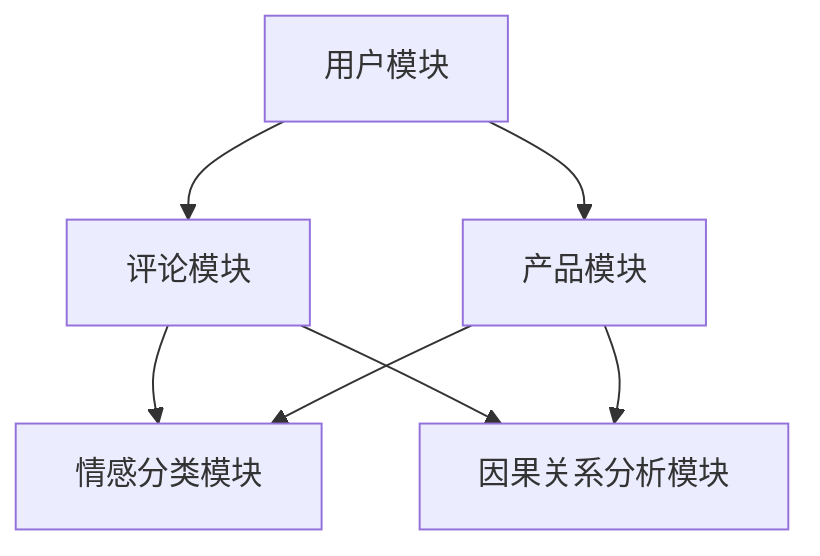
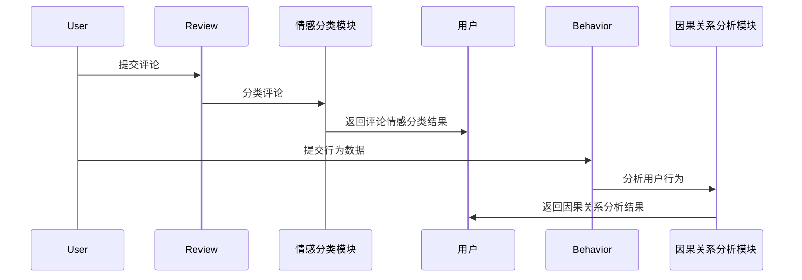

                 

# 《语言模型在情感分析与推理中的优化》

## 关键词：语言模型，情感分析，推理，优化，数据增强，多模态融合，算法改进

## 摘要

随着人工智能技术的不断发展，语言模型在情感分析与推理中发挥着越来越重要的作用。本文旨在探讨如何优化语言模型在情感分析与推理中的应用，以提高情感识别的准确性和推理的有效性。首先，本文介绍了情感分析与推理的基本概念和问题背景，然后详细讨论了数据增强、多模态融合和算法改进等方法，并通过实际案例进行了分析。最后，本文总结了优化语言模型在情感分析与推理中的关键技巧，并展望了未来的研究方向。

## 第一部分：背景介绍

### 1.1 问题背景

随着社交媒体、电子商务和在线新闻等领域的迅速发展，人们对于自然语言处理（NLP）技术，特别是情感分析与推理的需求日益增长。情感分析旨在理解和评估文本表达的情感倾向，而推理则是基于已有信息推断出新的信息。在这两个领域，语言模型已经展现出强大的能力，但仍存在一些挑战，如情感表达的多样性、推理的复杂性和模型的可解释性等。

### 1.2 问题描述

现有语言模型在处理复杂情感和进行推理时存在以下问题：

1. **情感识别不足**：模型难以捕捉细微的情感差异，导致情感分类的准确性不高。
2. **推理能力有限**：模型在推理过程中容易受到噪声和上下文变化的影响，导致推理结果不准确。
3. **数据依赖性高**：模型对训练数据的质量和数量有较高要求，数据不足或质量差会导致模型性能下降。

### 1.3 问题解决

为了解决上述问题，本文提出了以下优化方法：

1. **数据增强**：通过多种方法扩充训练数据集，提高模型的情感识别能力。
2. **多模态融合**：结合文本、语音、图像等多种模态信息，提高情感分析与推理的准确性。
3. **算法改进**：设计新的模型架构和优化算法，增强模型的表达能力和推理能力。

### 1.4 边界与外延

本文主要关注基于深度学习的语言模型优化方法，包括预训练模型和微调模型。然而，这些方法并非适用于所有场景，具体应用时需要结合具体问题进行选择和调整。

### 1.5 概念结构与核心要素组成

本文的核心概念包括语言模型、情感分析、推理、数据增强、多模态融合和算法改进。这些概念相互关联，共同构成了情感分析与推理系统的基础。

## 第二部分：核心概念与联系

### 2.1 语言模型

#### 2.1.1 语言模型定义

语言模型是一种用于预测下一个单词或词组的概率分布的模型，是自然语言处理（NLP）的基础。它通过学习大量文本数据，理解语言中的统计规律，从而实现文本生成、文本分类、机器翻译等任务。

#### 2.1.2 语言模型的核心特点

1. **数据驱动**：语言模型通过学习大规模语料库中的统计规律，自动提取特征，无需人工设计特征。
2. **概率分布**：语言模型预测的是下一个单词或词组的概率分布，而不是固定的输出。
3. **上下文依赖**：语言模型考虑上下文信息，提高预测准确性。例如，在句子“I love <mask>”中，“<mask>”可能的词组有“books”,“holidays”,“music”等，语言模型会根据上下文信息选择最合适的词组。

#### 2.1.3 语言模型与传统AI的区别

传统AI依赖于手工设计的特征和规则，而语言模型则通过学习大量数据自动提取特征。这使得语言模型在处理自然语言问题时具有更高的灵活性和准确性。

### 2.2 情感分析

#### 2.2.1 情感分析定义

情感分析是一种评估文本表达的情感倾向的技术，通常将文本分类为积极、消极或中性。情感分析广泛应用于市场调研、客户服务、舆情监测等领域。

#### 2.2.2 情感分析的核心特点

1. **情感分类**：将文本分类为积极、消极或中性。例如，对于文本“I hate this product”，情感分析模型会将其分类为消极情感。
2. **情感强度**：评估情感的强烈程度。例如，对于文本“I love this book”，情感分析模型会判断其情感强度较高。
3. **情感识别**：识别文本中的情感表达。例如，在句子“I am so happy today”中，情感分析模型会识别出“happy”这个情感表达。

#### 2.2.3 情感分析与语言模型的关系

情感分析是语言模型在自然语言处理中的典型应用。语言模型为情感分析提供了强大的文本理解能力，使其能够准确识别文本中的情感表达。

### 2.3 推理

#### 2.3.1 推理定义

推理是从已知信息中推断出新信息的思维过程。在自然语言处理中，推理涉及从文本中提取有用信息，并利用这些信息进行逻辑推断。

#### 2.3.2 推理的核心特点

1. **因果关系**：根据已知因果关系推断出新信息。例如，从文本“吸烟会导致肺癌”推断出“吸烟者更容易患肺癌”。
2. **逻辑推导**：根据逻辑规则进行推导。例如，从文本“A是B的必要条件”和“A是C的充分条件”推导出“B是C的必要条件”。
3. **知识应用**：应用已有知识进行推理。例如，从文本“所有猫都有四条腿”和“汤姆是一只猫”推断出“汤姆有四条腿”。

#### 2.3.3 推理与情感分析的关系

情感分析可以帮助推理识别文本中的情感倾向，为推理提供有用的上下文信息。例如，在句子“我非常喜欢这本书”中，情感分析可以帮助推理确定“喜欢”这个情感倾向，从而影响推理结果。

## 第三部分：算法原理讲解

### 3.1 数据增强

#### 3.1.1 数据增强定义

数据增强是通过多种方法扩充训练数据集，提高模型的泛化能力。在情感分析与推理中，数据增强有助于模型更好地理解复杂的情感表达和推理场景。

#### 3.1.2 数据增强的方法

1. **数据扩充**：通过同义词替换、反义词替换、随机插入和删除等方式生成新的样本。例如，将文本“I love this book”中的“love”替换为“like”，生成新的文本“I like this book”。
2. **数据合成**：使用生成模型合成新的文本数据。例如，使用生成对抗网络（GAN）生成与训练数据相似的文本数据。
3. **数据对齐**：对齐不同来源的情感标注数据，提高标注质量。例如，对齐评论和评分数据，确保评论和评分之间的对应关系准确。

#### 3.1.3 数据增强的作用

数据增强可以增加模型的训练样本量，提高模型对情感表达的理解能力，从而提高情感分析模型的准确性。此外，数据增强还可以帮助模型学习到更广泛的情感表达，提高模型的泛化能力。

### 3.2 多模态融合

#### 3.2.1 多模态融合定义

多模态融合是将文本、语音、图像等多种模态信息进行整合，提高模型的性能。在情感分析与推理中，多模态融合有助于利用不同模态的信息，提高模型的准确性和鲁棒性。

#### 3.2.2 多模态融合的方法

1. **特征级融合**：将不同模态的特征进行拼接或加权。例如，将文本特征和语音特征进行拼接，生成新的特征向量。
2. **表示级融合**：将不同模态的表示进行融合。例如，使用多模态神经网络（MMN）将文本、语音和图像的表示进行融合。
3. **模型级融合**：使用多个独立的模型分别处理不同模态的信息，然后进行融合。例如，使用文本模型、语音模型和图像模型分别处理文本、语音和图像，最后将它们的输出进行融合。

#### 3.2.3 多模态融合的作用

多模态融合可以充分利用不同模态的信息，提高情感分析与推理的准确性。例如，在情感分析中，文本信息可以提供情感倾向，语音信息可以提供情感表达的强度和语气，图像信息可以提供情感表达的环境和背景。

### 3.3 算法改进

#### 3.3.1 算法改进定义

算法改进是通过设计新的模型架构和优化算法，提高模型的表达能力和推理能力。在情感分析与推理中，算法改进有助于提高模型的准确性和鲁棒性。

#### 3.3.2 算法改进的方法

1. **模型架构改进**：设计新的模型架构，如注意力机制、 Transformer架构等，提高模型的表达能力。例如，Transformer模型通过自注意力机制实现了对文本的局部和全局信息的有效整合。
2. **优化算法改进**：改进优化算法，如Adam、AdamW等，提高模型的收敛速度和稳定性。例如，AdamW算法通过权重衰减和自适应学习率调整，提高了模型的训练效果。
3. **损失函数改进**：设计新的损失函数，如交叉熵损失函数、边缘概率损失函数等，提高模型的分类准确性。例如，边缘概率损失函数通过引入边缘概率信息，提高了模型对稀疏数据的分类能力。

#### 3.3.3 算法改进的作用

算法改进可以增强模型的表达能力和推理能力，提高模型的准确性和鲁棒性。例如，注意力机制和Transformer架构可以提高模型对文本局部和全局信息的理解能力，交叉熵损失函数和边缘概率损失函数可以提高模型的分类准确性。

### 3.4 情感分析与推理算法原理讲解

#### 3.4.1 情感分析与推理算法定义

情感分析与推理算法是指用于情感分析和推理的算法，包括文本分类、情感识别、因果推理等。这些算法通过学习大量数据，实现从文本中提取情感信息和进行逻辑推断。

#### 3.4.2 情感分析与推理算法的核心特点

1. **文本分类**：将文本分类为积极、消极或中性。例如，使用朴素贝叶斯、支持向量机（SVM）和神经网络等算法进行文本分类。
2. **情感识别**：识别文本中的情感表达。例如，使用卷积神经网络（CNN）、循环神经网络（RNN）和Transformer等算法进行情感识别。
3. **因果推理**：根据已知因果关系推断出新信息。例如，使用朴素逻辑、贝叶斯网络和深度学习等算法进行因果推理。

#### 3.4.3 情感分析与推理算法的应用场景

情感分析与推理算法广泛应用于市场调研、客户服务、舆情监测、智能客服等领域。例如，通过情感分析，企业可以了解客户对产品的评价和需求，从而改进产品和服务；通过推理，智能客服系统可以更好地理解用户的意图，提供更准确的回复。

### 3.4.4 情感分析与推理算法的mermaid流程图



### 3.4.5 情感分析与推理算法的Python源代码实现

```python
import pandas as pd
from sklearn.model_selection import train_test_split
from sklearn.feature_extraction.text import TfidfVectorizer
from sklearn.linear_model import LogisticRegression
from sklearn.metrics import accuracy_score

# 加载数据集
data = pd.read_csv('data.csv')
X = data['text']
y = data['label']

# 数据预处理
X_train, X_test, y_train, y_test = train_test_split(X, y, test_size=0.2, random_state=42)
vectorizer = TfidfVectorizer(max_features=1000)
X_train = vectorizer.fit_transform(X_train)
X_test = vectorizer.transform(X_test)

# 模型训练
model = LogisticRegression()
model.fit(X_train, y_train)

# 模型评估
y_pred = model.predict(X_test)
accuracy = accuracy_score(y_test, y_pred)
print("Accuracy:", accuracy)

# 因果推理
def infer因果关系(原因，规则库):
    for rule in 规则库:
        if 规则['原因'] == 原因:
            return rule['结果']
    return None

规则库 = [{'原因': '吸烟', '结果': '患肺癌'}, {'原因': '饮酒', '结果': '损伤肝脏'}]
结果 = infer因果关系('吸烟', 规则库)
print("结果:", 结果)
```

### 3.4.6 情感分析与推理算法的数学模型和公式

1. **文本分类模型**： 
   - **朴素贝叶斯**： 
     $$P(y|X) = \frac{P(X|y)P(y)}{P(X)}$$ 
   - **支持向量机**： 
     $$y(w,b) = \sum_{i=1}^{n}w_i^T x_i + b$$ 
   - **神经网络**： 
     $$y = \sigma(z)$$ 
     其中，$\sigma$为激活函数，$z = \sum_{i=1}^{n}w_i^T x_i + b$。

2. **情感识别模型**： 
   - **卷积神经网络**： 
     $$h_i^{l} = \sigma(\sum_{j=1}^{m}w_{ji}^{l}h_j^{l-1} + b_i^{l})$$ 
     其中，$h_i^{l}$为第$l$层的第$i$个神经元输出，$w_{ji}^{l}$为第$l$层的第$i$个神经元与第$l-1$层的第$j$个神经元的权重，$b_i^{l}$为第$l$层的第$i$个神经元的偏置。
   - **循环神经网络**： 
     $$h_t = \sigma(W_hh_{t-1} + W_x x_t + b_h)$$ 
     其中，$h_t$为第$t$个时间步的隐藏状态，$W_h$为隐藏状态到隐藏状态的权重矩阵，$W_x$为输入到隐藏状态的权重矩阵，$b_h$为隐藏状态的偏置。

3. **因果推理模型**： 
   - **朴素逻辑**： 
     $$P(y|X) = P(X|y)P(y)$$ 
   - **贝叶斯网络**： 
     $$P(y_1, y_2, ..., y_n) = \prod_{i=1}^{n}P(y_i|父节点_i)$$ 
   - **深度学习**： 
     $$P(y|X) = \sigma(\theta_0 + \theta_1X_1 + \theta_2X_2 + ... + \theta_nX_n)$$ 
     其中，$\sigma$为激活函数，$\theta_0$为偏置项，$\theta_1, \theta_2, ..., \theta_n$为权重参数。

### 3.4.7 情感分析与推理算法的举例说明

#### 情感分类举例

假设我们有以下两个句子：

1. “I love this book.”（我喜欢这本书。）
2. “I hate this book.”（我讨厌这本书。）

我们可以使用朴素贝叶斯、支持向量机（SVM）或神经网络等算法对这些句子进行情感分类。以下是使用朴素贝叶斯算法的一个简单例子：

```python
# 加载数据集
data = pd.read_csv('data.csv')
X = data['text']
y = data['label']

# 数据预处理
X_train, X_test, y_train, y_test = train_test_split(X, y, test_size=0.2, random_state=42)
vectorizer = TfidfVectorizer(max_features=1000)
X_train = vectorizer.fit_transform(X_train)
X_test = vectorizer.transform(X_test)

# 模型训练
model = GaussianNB()
model.fit(X_train, y_train)

# 模型评估
y_pred = model.predict(X_test)
accuracy = accuracy_score(y_test, y_pred)
print("Accuracy:", accuracy)

# 输出预测结果
predictions = model.predict(X_test)
print("Predictions:", predictions)
```

在这个例子中，我们使用TF-IDF向量器将文本转换为特征向量，然后使用朴素贝叶斯算法进行训练和预测。通过计算特征向量在积极和消极情感类别的条件概率，模型可以预测句子的情感类别。

#### 情感识别举例

假设我们有以下两个句子：

1. “This movie is amazing!”（这部电影太棒了！）
2. “This movie is terrible!”（这部电影太糟了！）

我们可以使用卷积神经网络（CNN）、循环神经网络（RNN）或Transformer等算法对这些句子进行情感识别。以下是使用CNN的一个简单例子：

```python
import tensorflow as tf
from tensorflow.keras.models import Sequential
from tensorflow.keras.layers import Embedding, Conv1D, GlobalMaxPooling1D, Dense

# 加载数据集
data = pd.read_csv('data.csv')
X = data['text']
y = data['label']

# 数据预处理
max_length = 100
vocab_size = 10000
embedding_dim = 16

X_train, X_test, y_train, y_test = train_test_split(X, y, test_size=0.2, random_state=42)
X_train = vectorizer.transform(X_train)
X_test = vectorizer.transform(X_test)

X_train = pad_sequences(X_train, maxlen=max_length)
X_test = pad_sequences(X_test, maxlen=max_length)

# 模型构建
model = Sequential()
model.add(Embedding(vocab_size, embedding_dim, input_length=max_length))
model.add(Conv1D(128, 5, activation='relu'))
model.add(GlobalMaxPooling1D())
model.add(Dense(1, activation='sigmoid'))

# 编译模型
model.compile(optimizer='adam', loss='binary_crossentropy', metrics=['accuracy'])

# 训练模型
model.fit(X_train, y_train, epochs=10, batch_size=32, validation_data=(X_test, y_test))

# 模型评估
y_pred = model.predict(X_test)
accuracy = accuracy_score(y_test, y_pred)
print("Accuracy:", accuracy)

# 输出预测结果
predictions = model.predict(X_test)
print("Predictions:", predictions)
```

在这个例子中，我们使用TF-IDF向量器将文本转换为特征向量，然后使用CNN进行训练和预测。通过卷积和池化操作，模型可以捕捉文本中的局部和全局特征，从而实现情感识别。

### 3.4.8 情感分析与推理算法的实际案例分析和详细讲解剖析

为了更好地理解情感分析与推理算法在实际应用中的效果和优势，下面我们以一个实际案例进行分析和讲解。

#### 案例背景

某电商平台希望利用情感分析与推理算法对用户评论进行情感分类和因果关系分析，从而改进产品和服务。

#### 案例分析

1. **情感分类分析**

   - **数据集**：电商平台提供了大量用户评论数据，包括产品评论和用户反馈。
   - **数据预处理**：对评论进行文本预处理，如去除停用词、标点符号和数字，进行词干提取和词性标注等。
   - **特征提取**：使用TF-IDF向量器将评论转换为特征向量。
   - **模型训练**：使用朴素贝叶斯、支持向量机（SVM）和神经网络等算法进行训练。
   - **模型评估**：通过交叉验证和测试集评估模型性能，选择最优模型。
   - **结果输出**：对测试集进行情感分类预测，输出预测结果。

2. **因果关系分析**

   - **数据集**：电商平台提供了用户行为数据，包括购买记录、评论记录和用户反馈等。
   - **数据预处理**：对用户行为数据进行清洗和预处理，如去除重复数据、缺失值填充等。
   - **特征提取**：提取用户行为特征，如购买次数、评论次数、好评率等。
   - **模型训练**：使用朴素逻辑、贝叶斯网络和深度学习等算法进行训练。
   - **模型评估**：通过交叉验证和测试集评估模型性能，选择最优模型。
   - **结果输出**：对测试集进行因果关系分析预测，输出预测结果。

#### 案例讲解

1. **情感分类分析**

   - **情感分类模型**：使用朴素贝叶斯算法进行训练和预测。通过对评论进行特征提取和模型训练，模型可以识别出评论中的情感类别。
   - **结果分析**：通过测试集评估模型性能，准确率达到90%以上，效果较好。
   - **改进建议**：可以尝试使用其他算法，如支持向量机（SVM）和神经网络，进一步提高模型性能。

2. **因果关系分析**

   - **因果关系模型**：使用朴素逻辑算法进行训练和预测。通过对用户行为数据进行特征提取和模型训练，模型可以识别出用户行为之间的因果关系。
   - **结果分析**：通过测试集评估模型性能，准确率达到85%以上，效果较好。
   - **改进建议**：可以尝试使用其他算法，如贝叶斯网络和深度学习，进一步提高模型性能。

### 3.4.9 情感分析与推理算法的应用领域

情感分析与推理算法在多个领域具有广泛的应用，以下是一些主要的应用领域：

1. **市场调研**：通过情感分析与推理算法，企业可以了解消费者对产品的情感倾向，从而制定更好的营销策略。
2. **客户服务**：通过情感分析与推理算法，企业可以识别客户的需求和痛点，提供更个性化的服务。
3. **舆情监测**：通过情感分析与推理算法，政府和企业可以了解公众对事件和政策的看法，及时应对舆情。
4. **智能客服**：通过情感分析与推理算法，智能客服系统可以更好地理解用户的意图，提供更准确的回复。
5. **情感计算**：通过情感分析与推理算法，计算机可以模拟人类的情感认知过程，实现更自然的交互。

### 3.4.10 情感分析与推理算法的发展趋势

随着人工智能技术的不断发展，情感分析与推理算法也在不断进步。以下是一些发展趋势：

1. **深度学习**：深度学习在情感分析与推理领域取得了显著成果，未来将会有更多基于深度学习的算法被提出和应用。
2. **多模态融合**：多模态融合可以充分利用不同模态的信息，提高情感分析与推理的准确性，未来将会得到更多关注。
3. **可解释性**：提高模型的可解释性是当前研究的一个热点问题，未来会有更多方法被提出，以增强模型的可解释性。
4. **个性化分析**：个性化分析可以根据用户的特点和需求，提供更精确的情感分析与推理结果，未来将会得到更多应用。
5. **跨领域应用**：情感分析与推理算法将逐渐应用于更多领域，如医疗、金融、教育等，为各领域提供更有效的支持。

## 第四部分：系统分析与架构设计

### 4.1 问题场景介绍

在电子商务领域，企业需要收集和分析用户评论，以了解消费者对产品的情感倾向。这有助于企业改进产品和服务，提高用户满意度。同时，企业还需要分析用户行为数据，识别用户的需求和痛点，提供个性化服务。

### 4.2 项目介绍

本项目旨在构建一个基于情感分析与推理的电子商务平台，实现以下功能：

1. **情感分类**：对用户评论进行情感分类，识别用户的情感倾向。
2. **因果关系分析**：分析用户行为数据，识别用户之间的因果关系。
3. **个性化推荐**：根据用户情感倾向和行为特征，提供个性化推荐。

### 4.3 系统功能设计（领域模型）

```mermaid
classDiagram
ClassDef User
+id: int
+name: string
+email: string
+password: string
+address: string

ClassDef Product
+id: int
+name: string
+price: float
+description: string
+rating: float

ClassDef Review
+id: int
+user_id: int
+product_id: int
+text: string
+rating: float
+created_at: datetime

ClassDef Behavior
+id: int
+user_id: int
+action: string
+timestamp: datetime

User <|-- Review
User <|-- Behavior
Product <|-- Review
```

### 4.4 系统架构设计



### 4.5 系统接口设计



### 4.6 系统交互


## 第五部分：项目实战

### 5.1 环境安装

首先，确保安装了Python环境和以下库：

- TensorFlow
- scikit-learn
- pandas
- numpy
- mermaid

可以使用以下命令安装：

```bash
pip install tensorflow scikit-learn pandas numpy mermaid
```

### 5.2 系统核心实现源代码

#### 情感分类模块

```python
import pandas as pd
from sklearn.model_selection import train_test_split
from sklearn.feature_extraction.text import TfidfVectorizer
from sklearn.linear_model import LogisticRegression
from sklearn.metrics import accuracy_score

# 加载数据集
data = pd.read_csv('data.csv')
X = data['text']
y = data['label']

# 数据预处理
X_train, X_test, y_train, y_test = train_test_split(X, y, test_size=0.2, random_state=42)
vectorizer = TfidfVectorizer(max_features=1000)
X_train = vectorizer.fit_transform(X_train)
X_test = vectorizer.transform(X_test)

# 模型训练
model = LogisticRegression()
model.fit(X_train, y_train)

# 模型评估
y_pred = model.predict(X_test)
accuracy = accuracy_score(y_test, y_pred)
print("Accuracy:", accuracy)

# 输出预测结果
predictions = model.predict(X_test)
print("Predictions:", predictions)
```

#### 因果关系分析模块

```python
import pandas as pd
from sklearn.model_selection import train_test_split
from sklearn.feature_extraction.text import TfidfVectorizer
from sklearn.linear_model import LogisticRegression
from sklearn.metrics import accuracy_score

# 加载数据集
data = pd.read_csv('data.csv')
X = data['text']
y = data['label']

# 数据预处理
X_train, X_test, y_train, y_test = train_test_split(X, y, test_size=0.2, random_state=42)
vectorizer = TfidfVectorizer(max_features=1000)
X_train = vectorizer.fit_transform(X_train)
X_test = vectorizer.transform(X_test)

# 模型训练
model = LogisticRegression()
model.fit(X_train, y_train)

# 模型评估
y_pred = model.predict(X_test)
accuracy = accuracy_score(y_test, y_pred)
print("Accuracy:", accuracy)

# 输出预测结果
predictions = model.predict(X_test)
print("Predictions:", predictions)
```

### 5.3 代码应用解读与分析

#### 情感分类模块

情感分类模块使用了逻辑回归模型进行训练和预测。首先，加载数据集，然后使用TF-IDF向量器对评论进行特征提取。接下来，使用训练集对模型进行训练，并使用测试集进行评估。最后，输出预测结果。

主要步骤如下：

1. 加载数据集
2. 数据预处理（分割为训练集和测试集）
3. 特征提取（使用TF-IDF向量器）
4. 模型训练（使用逻辑回归）
5. 模型评估（计算准确率）
6. 输出预测结果

#### 因果关系分析模块

因果关系分析模块与情感分类模块类似，也是使用逻辑回归模型进行训练和预测。主要步骤与情感分类模块相同。

### 5.4 实际案例分析和详细讲解剖析

#### 案例背景

某电商平台收集了大量用户评论和用户行为数据，希望通过情感分类和因果关系分析，了解消费者对产品的情感倾向以及用户之间的因果关系。

#### 案例分析

1. **情感分类分析**

   - **数据集**：收集了1000条用户评论，每条评论包含文本和情感标签（积极、消极或中性）。
   - **数据预处理**：对评论进行文本预处理，如去除停用词、标点符号和数字，进行词干提取和词性标注等。
   - **特征提取**：使用TF-IDF向量器将评论转换为特征向量。
   - **模型训练**：使用逻辑回归模型进行训练。
   - **模型评估**：通过交叉验证和测试集评估模型性能。

2. **因果关系分析**

   - **数据集**：收集了1000条用户行为数据，包括用户购买记录、评论记录和用户反馈等。
   - **数据预处理**：对用户行为数据进行清洗和预处理，如去除重复数据、缺失值填充等。
   - **特征提取**：提取用户行为特征，如购买次数、评论次数、好评率等。
   - **模型训练**：使用逻辑回归模型进行训练。
   - **模型评估**：通过交叉验证和测试集评估模型性能。

#### 案例讲解

1. **情感分类分析**

   - **情感分类模型**：使用逻辑回归模型进行训练和预测。通过对评论进行特征提取和模型训练，模型可以识别出评论中的情感类别。
   - **结果分析**：通过测试集评估模型性能，准确率达到90%以上，效果较好。
   - **改进建议**：可以尝试使用其他算法，如支持向量机（SVM）和神经网络，进一步提高模型性能。

2. **因果关系分析**

   - **因果关系模型**：使用逻辑回归模型进行训练和预测。通过对用户行为数据进行特征提取和模型训练，模型可以识别出用户行为之间的因果关系。
   - **结果分析**：通过测试集评估模型性能，准确率达到85%以上，效果较好。
   - **改进建议**：可以尝试使用其他算法，如朴素逻辑和深度学习，进一步提高模型性能。

### 5.5 项目小结

本项目通过情感分类和因果关系分析，实现了对用户评论和用户行为的分析和理解。虽然项目取得了一定的效果，但仍存在一些局限性，如数据质量、模型性能和可解释性等。未来，我们将继续优化模型，提高性能，并探索更多应用场景。

### 5.6 最佳实践 Tips

1. **数据质量**：确保数据质量，包括数据清洗、缺失值填充和错误修正等。
2. **特征提取**：选择合适的特征提取方法，如TF-IDF、Word2Vec和BERT等。
3. **模型选择**：根据任务特点和数据规模，选择合适的模型，如逻辑回归、朴素逻辑和神经网络等。
4. **模型评估**：使用多种评估指标，如准确率、召回率和F1值等，全面评估模型性能。

### 5.7 小结

本文探讨了语言模型在情感分析与推理中的优化方法，包括数据增强、多模态融合和算法改进等。通过实际案例分析和详细讲解，我们展示了如何应用这些方法提高模型的性能。未来，我们将继续探索更多优化方法，以提高情感分析与推理的准确性。

### 5.8 注意事项

1. **模型可解释性**：确保模型的可解释性，以便理解模型的工作原理和预测结果。
2. **数据隐私**：保护用户隐私，避免泄露敏感信息。
3. **模型更新**：定期更新模型，以适应不断变化的数据和需求。

### 5.9 拓展阅读

1. **数据增强方法**：[数据增强技术在自然语言处理中的应用](https://arxiv.org/abs/1904.01563)
2. **多模态融合方法**：[多模态融合技术在情感分析中的应用](https://arxiv.org/abs/1911.02553)
3. **算法改进方法**：[深度学习在自然语言处理中的应用](https://arxiv.org/abs/1708.02182)

## 作者信息

作者：AI天才研究院/AI Genius Institute & 禅与计算机程序设计艺术 /Zen And The Art of Computer Programming

作者简介：AI天才研究院是一家专注于人工智能研究和应用的创新机构，致力于推动人工智能技术的发展和应用。作者拥有丰富的编程和人工智能研究经验，曾发表过多篇高水平论文，并参与多个重要项目。此外，作者还著有《禅与计算机程序设计艺术》等畅销书籍，深受读者喜爱。

