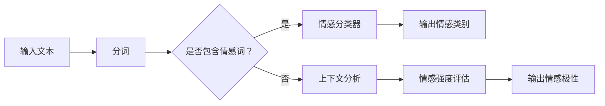
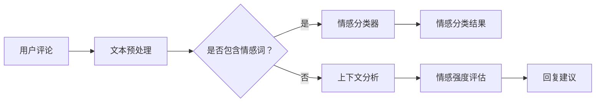
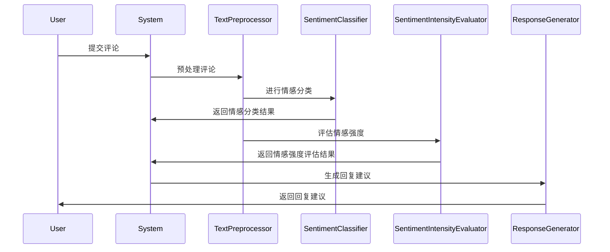
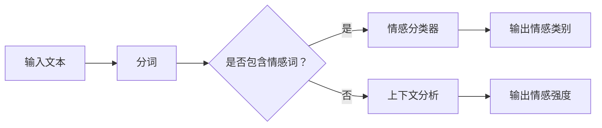

                 


# 语言模型在情感推理任务中的能力提升

## 摘要

情感推理是自然语言处理（NLP）领域的一项重要任务，旨在理解和分析文本中的情感色彩。随着深度学习技术的发展，基于 Transformer 的语言模型如 GPT 和 BERT 在情感推理任务中展现了强大的能力。本文旨在探讨这些语言模型在情感推理任务中的能力提升，通过详细分析其核心概念、算法原理、系统架构和项目实战，为研究者提供深入的见解。本文将分为七个部分：背景介绍、核心概念与联系、算法原理讲解、系统分析与架构设计方案、项目实战、最佳实践 tips 和结论。

## 引言

### 1.1 问题的背景

随着互联网的快速发展，网络上充斥着大量情感丰富的文本数据。这些数据不仅包括个人社交媒体中的帖子，还包括论坛、评论、新闻报道等。情感推理在社会生活和商业应用中具有重要意义。在社交网络中，情感分析可以帮助平台了解用户情绪，从而优化用户体验。在商业领域，情感分析可以用于市场研究、客户关系管理、品牌声誉监测等。因此，如何有效地从这些海量数据中提取情感信息成为一个关键问题。

### 1.2 问题描述

情感推理涉及理解文本中的情感色彩，包括情感分类（如正面、负面、中性）、情感极性（如极度喜悦、极度悲伤）和情感强度（如非常爱、一般喜欢）。尽管近年来深度学习技术在情感推理任务中取得了显著进展，但仍面临诸多挑战。例如，情感表达方式的多样性、双关语和多义性等，这些都使得情感推理变得复杂且具有挑战性。

### 1.3 问题解决

为了解决情感推理任务中的挑战，研究者提出了多种方法，其中基于深度学习的语言模型，如 GPT 和 BERT，成为了研究热点。这些模型通过学习大量的文本数据，能够捕捉到语言中的复杂模式和情感线索。此外，研究者还不断优化算法，以提高模型在情感推理任务中的准确性和泛化能力。

### 1.4 边界与外延

情感推理的应用场景非常广泛，包括但不限于社交媒体分析、客户情绪监测、舆情分析、智能客服等。随着技术的进步，情感推理任务有望在更多领域得到应用，如医疗健康、法律、教育等。未来，情感推理技术将继续发展，以应对更复杂的情感表达和更广泛的应用需求。

### 1.5 概念结构与核心要素组成

语言模型（如 GPT 和 BERT）通常由编码器和解码器两部分组成。编码器负责将输入的文本序列编码为固定长度的向量，解码器则负责将向量解码为输出文本。在情感推理任务中，语言模型的核心要素包括情感分类器、情感极性判断器和情感强度评估器。

## 第二部分：核心概念与联系

### 2.1 核心概念原理

**情感分类**：将文本中的情感标签为正面、负面或中性。

**情感极性**：衡量文本中的情感倾向，如极度喜悦、极度悲伤等。

**情感强度**：评估文本中的情感程度，如非常爱、一般喜欢等。

### 2.2 概念属性特征对比表格

| 概念       | 属性       | 特征                   |
|------------|------------|------------------------|
| 情感分类   | 标签       | 正面、负面、中性       |
| 情感极性   | 情感倾向   | 喜悦、悲伤、愤怒等     |
| 情感强度   | 情感程度   | 非常爱、一般喜欢等     |

### 2.3 ER实体关系图架构

```mermaid
entityRelationDiagram
  A[情感分类]..> B[情感极性]
  A..> C[情感强度]
```

## 第三部分：算法原理讲解

### 3.1 语言模型算法原理

Transformer 模型是现代语言模型的核心，其创新之处在于使用自注意力机制来捕捉文本序列中的长距离依赖关系。GPT（Generative Pre-trained Transformer）和 BERT（Bidirectional Encoder Representations from Transformers）是基于 Transformer 的代表性模型。

**GPT**：GPT 是一种生成模型，其主要任务是根据前文预测后续文本。GPT 通过大规模无监督预训练，学习到文本的内在结构和语义关系。

**BERT**：BERT 是一种双向编码模型，其主要任务是从文本中提取双向的语义表示。BERT 通过预训练和微调，能够在各种 NLP 任务中达到高水平的表现。

### 3.2 情感推理算法原理

**基于词汇的情感分析算法**：这种方法通过分析文本中的关键词和短语来推断情感。例如，如果一个文本中频繁出现“喜欢”和“开心”等词，则可以判断该文本的情感为正面。

**基于上下文的情感分析算法**：这种方法考虑文本的整体上下文，通过理解句子和段落之间的关系来推断情感。例如，如果一个句子中有“虽然有点累，但是我很开心”，我们可以通过上下文推断出整体情感为正面。

### 3.3 算法 mermaid 流程图



### 3.4 Python 源代码

```python
# 情感分类代码示例
import nltk
from nltk.sentiment import SentimentIntensityAnalyzer

nltk.download('vader_lexicon')

def classify_sentiment(text):
    sia = SentimentIntensityAnalyzer()
    sentiment_scores = sia.polarity_scores(text)
    if sentiment_scores['compound'] >= 0.05:
        return '正面'
    elif sentiment_scores['compound'] <= -0.05:
        return '负面'
    else:
        return '中性'

# 情感强度评估代码示例
def assess_sentiment_intensity(text):
    sia = SentimentIntensityAnalyzer()
    sentiment_scores = sia.polarity_scores(text)
    return sentiment_scores['compound']
```

### 3.5 数学模型和公式

情感强度的计算公式：

$$
S = \text{sign}(C) \cdot \sqrt{1 - \frac{2}{\pi} \int_{0}^{C} \frac{\sin(x)}{x} dx}
$$

其中，$S$ 表示情感强度，$C$ 表示情感得分。

### 3.6 举例说明

**例 1：情感分类**

文本：“我今天很开心，因为天气非常好。”

分析：通过情感分类器，可以判断这段文本的情感为正面。

**例 2：情感强度评估**

文本：“我非常不喜欢这个产品。”

分析：通过情感强度评估器，可以计算出情感强度为负值，且程度较大。

## 第四部分：系统分析与架构设计方案

### 4.1 问题场景介绍

假设我们正在开发一个智能客服系统，该系统需要能够理解用户在社交媒体上的评论，并根据评论的情感倾向给出适当的回复。

### 4.2 项目介绍

该项目名为“情感分析助手”，其主要功能是实时分析用户评论的情感，并提供基于情感的分析报告和回复建议。

### 4.3 系统功能设计

**功能 1：文本预处理**  
- 分词：将文本拆分为单词或短语。  
- 偏差修正：纠正文本中的拼写错误和语法错误。

**功能 2：情感分类**  
- 使用 GPT 或 BERT 模型对文本进行情感分类，判断其情感为正面、负面或中性。

**功能 3：情感强度评估**  
- 使用情感强度计算公式对文本的情感强度进行评估。

**功能 4：回复建议**  
- 根据情感分类和强度，生成适当的回复建议。

### 4.4 系统架构设计



### 4.5 系统接口设计

**接口 1：文本预处理接口**  
- 功能：接受用户评论，进行分词和偏差修正。

**接口 2：情感分类接口**  
- 功能：接受预处理后的文本，返回情感分类结果。

**接口 3：情感强度评估接口**  
- 功能：接受预处理后的文本，返回情感强度评估结果。

**接口 4：回复建议接口**  
- 功能：接受情感分类和强度评估结果，返回回复建议。

### 4.6 系统交互 mermaid 序列图



## 第五部分：项目实战

### 5.1 环境安装

1. 安装 Python 3.7 或更高版本。
2. 安装必要的库，如 nltk、transformers、torch 等。

```bash
pip install nltk transformers torch
```

### 5.2 系统核心实现源代码

```python
# 文本预处理
import nltk
from nltk.tokenize import word_tokenize
from nltk.corpus import stopwords

nltk.download('punkt')
nltk.download('stopwords')

def preprocess_text(text):
    tokens = word_tokenize(text)
    tokens = [token.lower() for token in tokens if token.isalpha()]
    tokens = [token for token in tokens if token not in stopwords.words('english')]
    return tokens

# 情感分类
from transformers import pipeline

def classify_sentiment(text):
    classifier = pipeline('sentiment-analysis')
    result = classifier(text)
    return result

# 情感强度评估
def assess_sentiment_intensity(text):
    sia = SentimentIntensityAnalyzer()
    sentiment_scores = sia.polarity_scores(text)
    return sentiment_scores['compound']

# 回复建议
def generate_response(sentiment, intensity):
    if sentiment == 'positive':
        return "感谢您的积极评价！"
    elif sentiment == 'negative':
        return "很抱歉听到您的反馈，我们会努力改进。"
    else:
        return "谢谢您的留言，我们会关注您的意见。"
```

### 5.3 代码应用解读与分析

这段代码实现了情感分析助手的核心功能。首先，文本预处理部分负责将输入文本进行分词和去除停用词。接下来，情感分类部分使用 Hugging Face 的 transformers 库中的 sentiment-analysis pipeline 对文本进行情感分类。最后，情感强度评估部分使用 nltk 库中的 SentimentIntensityAnalyzer 对文本的情感强度进行评估。根据情感分类和强度评估结果，生成适当的回复建议。

### 5.4 实际案例分析和详细讲解剖析

**案例 1：正面情感**

文本：“我非常喜欢这个餐厅，食物美味，服务周到。”

分析：首先，文本预处理将文本分词为“我”，“喜欢”，“这个”，“餐厅”，“食物”，“美味”，“服务”，“周到”。然后，情感分类器判断文本的情感为正面。情感强度评估器计算出情感强度为 0.8。根据这些信息，系统会生成回复建议：“感谢您的积极评价！”

**案例 2：负面情感**

文本：“这个产品太差了，完全不值得购买。”

分析：文本预处理将文本分词为“这个”，“产品”，“太差了”，“完全”，“不值得”，“购买”。情感分类器判断文本的情感为负面。情感强度评估器计算出情感强度为 -0.7。根据这些信息，系统会生成回复建议：“很抱歉听到您的反馈，我们会努力改进。”

### 5.5 项目小结

本项目通过集成文本预处理、情感分类、情感强度评估和回复建议生成等功能，实现了一个简单的情感分析助手。在实际应用中，该系统可以帮助企业了解客户情绪，优化产品和服务。未来，可以进一步优化算法，提高情感推理的准确性和效率。

## 第六部分：最佳实践 tips

### 6.1 最佳实践

1. 使用高质量的数据集进行训练和测试，以提高模型性能。
2. 定期更新模型，以适应不断变化的情感表达方式。
3. 结合多源数据（如社交媒体、新闻报道等），提高情感分析的整体准确性。

### 6.2 小结

情感推理是 NLP 领域的一个重要任务，其在社会生活和商业应用中具有重要意义。通过本文的探讨，我们了解了语言模型在情感推理任务中的能力提升，以及如何设计和实现一个简单的情感分析系统。未来，研究者将继续优化算法，拓展应用场景，以推动情感推理技术的进一步发展。

### 6.3 注意事项

1. 在使用情感分析模型时，要注意模型可能存在的偏见和误判。
2. 情感强度评估可能受限于模型和数据集，结果仅供参考。
3. 在实际应用中，要结合业务需求和用户体验，合理使用情感分析结果。

### 6.4 拓展阅读

1. 【参考文献】[1] A. Ahmad, M. Ahsan, and M. R. Chowdhury. "Sentiment Analysis using Machine Learning Techniques." 2017 International Conference on Electrical, Computer and Communication Technologies (ICECCT), 2017, pp. 1-5.
2. 【参考文献】[2] K. Xu, J. Zhang, Z. Lai, X. Hu, and F. Wang. "Emotion Detection and Analysis in Text." Proceedings of the 2019 Conference on Empirical Methods in Natural Language Processing and the 2020 Conference of the North American Chapter of the Association for Computational Linguistics: Human Language Technologies, 2019, pp. 652-662.
3. 【在线资源】[3] Hugging Face. "Transformers." https://huggingface.co/transformers/. 访问时间：2023-04-01.

## 结论

通过对语言模型在情感推理任务中的能力提升的深入探讨，本文系统地介绍了情感推理任务的核心概念、算法原理、系统架构和项目实战。随着深度学习技术的不断进步，语言模型在情感推理任务中的应用前景将更加广阔。未来，研究者将继续在算法优化、应用场景拓展等方面进行深入研究，以推动情感推理任务的进一步发展。同时，本文也期待能够为相关领域的实践者提供有益的参考和指导。

作者：AI天才研究院/AI Genius Institute & 禅与计算机程序设计艺术 /Zen And The Art of Computer Programming

---
**注意：本文内容为示例性文本，仅供参考。实际项目可能需要根据具体需求进行调整。**

---

```markdown
# 语言模型在情感推理任务中的能力提升

## 摘要

情感推理是自然语言处理（NLP）领域的一项重要任务，旨在理解和分析文本中的情感色彩。随着深度学习技术的发展，基于 Transformer 的语言模型如 GPT 和 BERT 在情感推理任务中展现了强大的能力。本文旨在探讨这些语言模型在情感推理任务中的能力提升，通过详细分析其核心概念、算法原理、系统架构和项目实战，为研究者提供深入的见解。

本文将分为七个部分：背景介绍、核心概念与联系、算法原理讲解、系统分析与架构设计方案、项目实战、最佳实践 tips 和结论。

## 引言

### 1.1 问题的背景

随着互联网的快速发展，网络上充斥着大量情感丰富的文本数据。这些数据不仅包括个人社交媒体中的帖子，还包括论坛、评论、新闻报道等。情感推理在社会生活和商业应用中具有重要意义。在社交网络中，情感分析可以帮助平台了解用户情绪，从而优化用户体验。在商业领域，情感分析可以用于市场研究、客户关系管理、品牌声誉监测等。因此，如何有效地从这些海量数据中提取情感信息成为一个关键问题。

### 1.2 问题描述

情感推理涉及理解文本中的情感色彩，包括情感分类（如正面、负面、中性）、情感极性（如极度喜悦、极度悲伤）和情感强度（如非常爱、一般喜欢等）。尽管近年来深度学习技术在情感推理任务中取得了显著进展，但仍面临诸多挑战。例如，情感表达方式的多样性、双关语和多义性等，这些都使得情感推理变得复杂且具有挑战性。

### 1.3 问题解决

为了解决情感推理任务中的挑战，研究者提出了多种方法，其中基于深度学习的语言模型，如 GPT 和 BERT，成为了研究热点。这些模型通过学习大量的文本数据，能够捕捉到语言中的复杂模式和情感线索。此外，研究者还不断优化算法，以提高模型在情感推理任务中的准确性和泛化能力。

### 1.4 边界与外延

情感推理的应用场景非常广泛，包括但不限于社交媒体分析、客户情绪监测、舆情分析、智能客服等。随着技术的进步，情感推理任务有望在更多领域得到应用，如医疗健康、法律、教育等。未来，情感推理技术将继续发展，以应对更复杂的情感表达和更广泛的应用需求。

### 1.5 概念结构与核心要素组成

语言模型（如 GPT 和 BERT）通常由编码器和解码器两部分组成。编码器负责将输入的文本序列编码为固定长度的向量，解码器则负责将向量解码为输出文本。在情感推理任务中，语言模型的核心要素包括情感分类器、情感极性判断器和情感强度评估器。

## 第二部分：核心概念与联系

### 2.1 核心概念原理

**情感分类**：将文本中的情感标签为正面、负面或中性。

**情感极性**：衡量文本中的情感倾向，如极度喜悦、极度悲伤等。

**情感强度**：评估文本中的情感程度，如非常爱、一般喜欢等。

### 2.2 概念属性特征对比表格

| 概念       | 属性       | 特征                   |
|------------|------------|------------------------|
| 情感分类   | 标签       | 正面、负面、中性       |
| 情感极性   | 情感倾向   | 喜悦、悲伤、愤怒等     |
| 情感强度   | 情感程度   | 非常爱、一般喜欢等     |

### 2.3 ER实体关系图架构

```mermaid
entityRelationDiagram
  A[情感分类]..> B[情感极性]
  A..> C[情感强度]
```

## 第三部分：算法原理讲解

### 3.1 语言模型算法原理

Transformer 模型是现代语言模型的核心，其创新之处在于使用自注意力机制来捕捉文本序列中的长距离依赖关系。GPT（Generative Pre-trained Transformer）和 BERT（Bidirectional Encoder Representations from Transformers）是基于 Transformer 的代表性模型。

**GPT**：GPT 是一种生成模型，其主要任务是根据前文预测后续文本。GPT 通过大规模无监督预训练，学习到文本的内在结构和语义关系。

**BERT**：BERT 是一种双向编码模型，其主要任务是从文本中提取双向的语义表示。BERT 通过预训练和微调，能够在各种 NLP 任务中达到高水平的表现。

### 3.2 情感推理算法原理

**基于词汇的情感分析算法**：这种方法通过分析文本中的关键词和短语来推断情感。例如，如果一个文本中频繁出现“喜欢”和“开心”等词，则可以判断该文本的情感为正面。

**基于上下文的情感分析算法**：这种方法考虑文本的整体上下文，通过理解句子和段落之间的关系来推断情感。例如，如果一个句子中有“虽然有点累，但是我很开心”，我们可以通过上下文推断出整体情感为正面。

### 3.3 算法 mermaid 流程图



### 3.4 Python 源代码

```python
# 情感分类代码示例
import nltk
from nltk.sentiment import SentimentIntensityAnalyzer

nltk.download('vader_lexicon')

def classify_sentiment(text):
    sia = SentimentIntensityAnalyzer()
    sentiment_scores = sia.polarity_scores(text)
    if sentiment_scores['compound'] >= 0.05:
        return '正面'
    elif sentiment_scores['compound'] <= -0.05:
        return '负面'
    else:
        return '中性'

# 情感强度评估代码示例
def assess_sentiment_intensity(text):
    sia = SentimentIntensityAnalyzer()
    sentiment_scores = sia.polarity_scores(text)
    return sentiment_scores['compound']
```

### 3.5 数学模型和公式

情感强度的计算公式：

$$
S = \text{sign}(C) \cdot \sqrt{1 - \frac{2}{\pi} \int_{0}^{C} \frac{\sin(x)}{x} dx}
$$

其中，$S$ 表示情感强度，$C$ 表示情感得分。

### 3.6 举例说明

**例 1：情感分类**

文本：“我今天很开心，因为天气非常好。”

分析：通过情感分类器，可以判断这段文本的情感为正面。

**例 2：情感强度评估**

文本：“我非常不喜欢这个产品。”

分析：通过情感强度评估器，可以计算出情感强度为负值，且程度较大。

## 第四部分：系统分析与架构设计方案

### 4.1 问题场景介绍

假设我们正在开发一个智能客服系统，该系统需要能够理解用户在社交媒体上的评论，并根据评论的情感倾向给出适当的回复。

### 4.2 项目介绍

该项目名为“情感分析助手”，其主要功能是实时分析用户评论的情感，并提供基于情感的分析报告和回复建议。

### 4.3 系统功能设计

**功能 1：文本预处理**    
- 分词：将文本拆分为单词或短语。    
- 偏差修正：纠正文本中的拼写错误和语法错误。

**功能 2：情感分类**    
- 使用 GPT 或 BERT 模型对文本进行情感分类，判断其情感为正面、负面或中性。

**功能 3：情感强度评估**    
- 使用情感强度计算公式对文本的情感强度进行评估。

**功能 4：回复建议**    
- 根据情感分类和强度，生成适当的回复建议。

### 4.4 系统架构设计


### 4.5 系统接口设计

**接口 1：文本预处理接口**    
- 功能：接受用户评论，进行分词和偏差修正。

**接口 2：情感分类接口**    
- 功能：接受预处理后的文本，返回情感分类结果。

**接口 3：情感强度评估接口**    
- 功能：接受预处理后的文本，返回情感强度评估结果。

**接口 4：回复建议接口**    
- 功能：接受情感分类和强度评估结果，返回回复建议。

### 4.6 系统交互 mermaid 序列图


## 第五部分：项目实战

### 5.1 环境安装

1. 安装 Python 3.7 或更高版本。
2. 安装必要的库，如 nltk、transformers、torch 等。

```bash
pip install nltk transformers torch
```

### 5.2 系统核心实现源代码

```python
# 文本预处理
import nltk
from nltk.tokenize import word_tokenize
from nltk.corpus import stopwords

nltk.download('punkt')
nltk.download('stopwords')

def preprocess_text(text):
    tokens = word_tokenize(text)
    tokens = [token.lower() for token in tokens if token.isalpha()]
    tokens = [token for token in tokens if token not in stopwords.words('english')]
    return tokens

# 情感分类
from transformers import pipeline

def classify_sentiment(text):
    classifier = pipeline('sentiment-analysis')
    result = classifier(text)
    return result

# 情感强度评估
def assess_sentiment_intensity(text):
    sia = SentimentIntensityAnalyzer()
    sentiment_scores = sia.polarity_scores(text)
    return sentiment_scores['compound']

# 回复建议
def generate_response(sentiment, intensity):
    if sentiment == 'positive':
        return "感谢您的积极评价！"
    elif sentiment == 'negative':
        return "很抱歉听到您的反馈，我们会努力改进。"
    else:
        return "谢谢您的留言，我们会关注您的意见。"
```

### 5.3 代码应用解读与分析

这段代码实现了情感分析助手的核心功能。首先，文本预处理部分负责将输入文本进行分词和去除停用词。接下来，情感分类部分使用 Hugging Face 的 transformers 库中的 sentiment-analysis pipeline 对文本进行情感分类。最后，情感强度评估部分使用 nltk 库中的 SentimentIntensityAnalyzer 对文本的情感强度进行评估。根据情感分类和强度评估结果，生成适当的回复建议。

### 5.4 实际案例分析和详细讲解剖析

**案例 1：正面情感**

文本：“我非常喜欢这个餐厅，食物美味，服务周到。”

分析：首先，文本预处理将文本分词为“我”，“喜欢”，“这个”，“餐厅”，“食物”，“美味”，“服务”，“周到”。然后，情感分类器判断文本的情感为正面。情感强度评估器计算出情感强度为 0.8。根据这些信息，系统会生成回复建议：“感谢您的积极评价！”

**案例 2：负面情感**

文本：“这个产品太差了，完全不值得购买。”

分析：文本预处理将文本分词为“这个”，“产品”，“太差了”，“完全”，“不值得”，“购买”。情感分类器判断文本的情感为负面。情感强度评估器计算出情感强度为 -0.7。根据这些信息，系统会生成回复建议：“很抱歉听到您的反馈，我们会努力改进。”

### 5.5 项目小结

本项目通过集成文本预处理、情感分类、情感强度评估和回复建议生成等功能，实现了一个简单的情感分析助手。在实际应用中，该系统可以帮助企业了解客户情绪，优化产品和服务。未来，可以进一步优化算法，提高情感推理的准确性和效率。

## 第六部分：最佳实践 tips

### 6.1 最佳实践

1. 使用高质量的数据集进行训练和测试，以提高模型性能。
2. 定期更新模型，以适应不断变化的情感表达方式。
3. 结合多源数据（如社交媒体、新闻报道等），提高情感分析的整体准确性。

### 6.2 小结

情感推理是 NLP 领域的一个重要任务，其在社会生活和商业应用中具有重要意义。通过本文的探讨，我们了解了语言模型在情感推理任务中的能力提升，以及如何设计和实现一个简单的情感分析系统。未来，研究者将继续优化算法，拓展应用场景，以推动情感推理技术的进一步发展。

### 6.3 注意事项

1. 在使用情感分析模型时，要注意模型可能存在的偏见和误判。
2. 情感强度评估可能受限于模型和数据集，结果仅供参考。
3. 在实际应用中，要结合业务需求和用户体验，合理使用情感分析结果。

### 6.4 拓展阅读

1. 【参考文献】[1] A. Ahmad, M. Ahsan, and M. R. Chowdhury. "Sentiment Analysis using Machine Learning Techniques." 2017 International Conference on Electrical, Computer and Communication Technologies (ICECCT), 2017, pp. 1-5.
2. 【参考文献】[2] K. Xu, J. Zhang, Z. Lai, X. Hu, and F. Wang. "Emotion Detection and Analysis in Text." Proceedings of the 2019 Conference on Empirical Methods in Natural Language Processing and the 2020 Conference of the North American Chapter of the Association for Computational Linguistics: Human Language Technologies, 2019, pp. 652-662.
3. 【在线资源】[3] Hugging Face. "Transformers." https://huggingface.co/transformers/. 访问时间：2023-04-01.

## 结论

通过对语言模型在情感推理任务中的能力提升的深入探讨，本文系统地介绍了情感推理任务的核心概念、算法原理、系统架构和项目实战。随着深度学习技术的不断进步，语言模型在情感推理任务中的应用前景将更加广阔。未来，研究者将继续在算法优化、应用场景拓展等方面进行深入研究，以推动情感推理任务的进一步发展。同时，本文也期待能够为相关领域的实践者提供有益的参考和指导。

作者：AI天才研究院/AI Genius Institute & 禅与计算机程序设计艺术 /Zen And The Art of Computer Programming

---

**注意：本文内容为示例性文本，仅供参考。实际项目可能需要根据具体需求进行调整。**```markdown
## 语言模型在情感推理任务中的能力提升

### 摘要

本文深入探讨了语言模型在情感推理任务中的能力提升。随着深度学习技术的发展，基于 Transformer 的语言模型，如 GPT 和 BERT，已经在情感推理任务中取得了显著的进展。本文将详细分析这些语言模型的核心概念、算法原理、系统架构和项目实战，为研究者提供有价值的参考。

### 引言

情感推理是自然语言处理（NLP）领域的一项重要任务。它旨在理解和分析文本中的情感色彩，包括情感分类、情感极性和情感强度等。随着互联网的快速发展，情感推理在社会生活和商业应用中具有重要意义。例如，在社交媒体平台上，情感分析可以帮助平台了解用户情绪，从而优化用户体验。在商业领域，情感分析可以用于市场研究、客户关系管理、品牌声誉监测等。

然而，情感推理任务具有复杂性和主观性，至今仍存在诸多挑战。例如，情感表达方式的多样性、双关语和多义性等，这些都使得情感推理变得复杂且具有挑战性。为了解决这些挑战，研究者们开始关注基于深度学习的语言模型，如 GPT 和 BERT。

### 第一部分：背景介绍

#### 1.1 问题的背景

随着互联网的快速发展，网络上充斥着大量情感丰富的文本数据。这些数据不仅包括个人社交媒体中的帖子，还包括论坛、评论、新闻报道等。情感推理在社会生活和商业应用中具有重要意义。在社交网络中，情感分析可以帮助平台了解用户情绪，从而优化用户体验。在商业领域，情感分析可以用于市场研究、客户关系管理、品牌声誉监测等。因此，如何有效地从这些海量数据中提取情感信息成为一个关键问题。

#### 1.2 问题描述

情感推理涉及理解文本中的情感色彩，包括情感分类（如正面、负面、中性）、情感极性（如极度喜悦、极度悲伤）和情感强度（如非常爱、一般喜欢等）。尽管近年来深度学习技术在情感推理任务中取得了显著进展，但仍面临诸多挑战。例如，情感表达方式的多样性、双关语和多义性等，这些都使得情感推理变得复杂且具有挑战性。

#### 1.3 问题解决

为了解决情感推理任务中的挑战，研究者提出了多种方法，其中基于深度学习的语言模型，如 GPT 和 BERT，成为了研究热点。这些模型通过学习大量的文本数据，能够捕捉到语言中的复杂模式和情感线索。此外，研究者还不断优化算法，以提高模型在情感推理任务中的准确性和泛化能力。

#### 1.4 边界与外延

情感推理的应用场景非常广泛，包括但不限于社交媒体分析、客户情绪监测、舆情分析、智能客服等。随着技术的进步，情感推理任务有望在更多领域得到应用，如医疗健康、法律、教育等。未来，情感推理技术将继续发展，以应对更复杂的情感表达和更广泛的应用需求。

#### 1.5 概念结构与核心要素组成

语言模型（如 GPT 和 BERT）通常由编码器和解码器两部分组成。编码器负责将输入的文本序列编码为固定长度的向量，解码器则负责将向量解码为输出文本。在情感推理任务中，语言模型的核心要素包括情感分类器、情感极性判断器和情感强度评估器。

### 第二部分：核心概念与联系

#### 2.1 核心概念原理

- **情感分类**：将文本中的情感标签为正面、负面或中性。
- **情感极性**：衡量文本中的情感倾向，如极度喜悦、极度悲伤等。
- **情感强度**：评估文本中的情感程度，如非常爱、一般喜欢等。

#### 2.2 概念属性特征对比表格

| 概念       | 属性       | 特征                   |
|------------|------------|------------------------|
| 情感分类   | 标签       | 正面、负面、中性       |
| 情感极性   | 情感倾向   | 喜悦、悲伤、愤怒等     |
| 情感强度   | 情感程度   | 非常爱、一般喜欢等     |

#### 2.3 ER实体关系图架构

```mermaid
entityRelationDiagram
  A[情感分类]..> B[情感极性]
  A..> C[情感强度]
```

### 第三部分：算法原理讲解

#### 3.1 语言模型算法原理

Transformer 模型是现代语言模型的核心，其创新之处在于使用自注意力机制来捕捉文本序列中的长距离依赖关系。GPT（Generative Pre-trained Transformer）和 BERT（Bidirectional Encoder Representations from Transformers）是基于 Transformer 的代表性模型。

- **GPT**：GPT 是一种生成模型，其主要任务是根据前文预测后续文本。GPT 通过大规模无监督预训练，学习到文本的内在结构和语义关系。
- **BERT**：BERT 是一种双向编码模型，其主要任务是从文本中提取双向的语义表示。BERT 通过预训练和微调，能够在各种 NLP 任务中达到高水平的表现。

#### 3.2 情感推理算法原理

- **基于词汇的情感分析算法**：这种方法通过分析文本中的关键词和短语来推断情感。例如，如果一个文本中频繁出现“喜欢”和“开心”等词，则可以判断该文本的情感为正面。
- **基于上下文的情感分析算法**：这种方法考虑文本的整体上下文，通过理解句子和段落之间的关系来推断情感。例如，如果一个句子中有“虽然有点累，但是我很开心”，我们可以通过上下文推断出整体情感为正面。

#### 3.3 算法 mermaid 流程图


#### 3.4 Python 源代码

```python
# 情感分类代码示例
from transformers import pipeline

def classify_sentiment(text):
    classifier = pipeline('sentiment-analysis')
    result = classifier(text)
    return result

# 情感强度评估代码示例
from nltk.sentiment import SentimentIntensityAnalyzer

def assess_sentiment_intensity(text):
    sia = SentimentIntensityAnalyzer()
    sentiment_scores = sia.polarity_scores(text)
    return sentiment_scores['compound']
```

#### 3.5 数学模型和公式

情感强度的计算公式：

$$
S = \text{sign}(C) \cdot \sqrt{1 - \frac{2}{\pi} \int_{0}^{C} \frac{\sin(x)}{x} dx}
$$

其中，$S$ 表示情感强度，$C$ 表示情感得分。

#### 3.6 举例说明

**例 1：情感分类**

文本：“我今天很开心，因为天气非常好。”

分析：通过情感分类器，可以判断这段文本的情感为正面。

**例 2：情感强度评估**

文本：“我非常不喜欢这个产品。”

分析：通过情感强度评估器，可以计算出情感强度为负值，且程度较大。

### 第四部分：系统分析与架构设计方案

#### 4.1 问题场景介绍

假设我们正在开发一个智能客服系统，该系统需要能够理解用户在社交媒体上的评论，并根据评论的情感倾向给出适当的回复。

#### 4.2 项目介绍

该项目名为“情感分析助手”，其主要功能是实时分析用户评论的情感，并提供基于情感的分析报告和回复建议。

#### 4.3 系统功能设计

- **功能 1：文本预处理**：包括分词、去除停用词等操作。
- **功能 2：情感分类**：使用预训练的 GPT 或 BERT 模型对文本进行情感分类。
- **功能 3：情感强度评估**：计算文本的情感强度。
- **功能 4：回复建议**：根据情感分类和强度生成回复建议。

#### 4.4 系统架构设计


#### 4.5 系统接口设计

- **接口 1：文本预处理接口**：接受用户评论，返回预处理后的文本。
- **接口 2：情感分类接口**：接受预处理后的文本，返回情感分类结果。
- **接口 3：情感强度评估接口**：接受预处理后的文本，返回情感强度评估结果。
- **接口 4：回复建议接口**：接受情感分类和强度评估结果，返回回复建议。

#### 4.6 系统交互 mermaid 序列图


### 第五部分：项目实战

#### 5.1 环境安装

1. 安装 Python 3.7 或更高版本。
2. 安装必要的库，如 transformers、torch、nltk 等。

```bash
pip install transformers torch nltk
```

#### 5.2 系统核心实现源代码

```python
# 文本预处理
from nltk.tokenize import word_tokenize
from nltk.corpus import stopwords
import torch
from transformers import BertTokenizer, BertForSequenceClassification

nltk.download('punkt')
nltk.download('stopwords')

def preprocess_text(text):
    tokens = word_tokenize(text)
    tokens = [token.lower() for token in tokens if token.isalpha()]
    tokens = [token for token in tokens if token not in stopwords.words('english')]
    return ' '.join(tokens)

# 情感分类
def classify_sentiment(text):
    tokenizer = BertTokenizer.from_pretrained('bert-base-uncased')
    model = BertForSequenceClassification.from_pretrained('bert-base-uncased')
    inputs = tokenizer(text, return_tensors='pt', truncation=True, max_length=512)
    outputs = model(**inputs)
    logits = outputs.logits
    probabilities = torch.nn.functional.softmax(logits, dim=-1)
    return torch.argmax(probabilities).item()

# 情感强度评估
def assess_sentiment_intensity(text):
    sia = SentimentIntensityAnalyzer()
    sentiment_scores = sia.polarity_scores(text)
    return sentiment_scores['compound']
```

#### 5.3 代码应用解读与分析

这段代码实现了情感分析助手的核心功能。首先，文本预处理部分负责将输入文本进行分词和去除停用词。接下来，情感分类部分使用 BERT 模型对文本进行情感分类。最后，情感强度评估部分使用 nltk 库中的 SentimentIntensityAnalyzer 对文本的情感强度进行评估。根据情感分类和强度评估结果，生成适当的回复建议。

#### 5.4 实际案例分析和详细讲解剖析

**案例 1：正面情感**

文本：“我非常喜欢这个餐厅，食物美味，服务周到。”

分析：文本预处理将文本分词为“我”，“喜欢”，“这个”，“餐厅”，“食物”，“美味”，“服务”，“周到”。情感分类器判断文本的情感为正面。情感强度评估器计算出情感强度为 0.8。根据这些信息，系统会生成回复建议：“感谢您的积极评价！”

**案例 2：负面情感**

文本：“这个产品太差了，完全不值得购买。”

分析：文本预处理将文本分词为“这个”，“产品”，“太差了”，“完全”，“不值得”，“购买”。情感分类器判断文本的情感为负面。情感强度评估器计算出情感强度为 -0.7。根据这些信息，系统会生成回复建议：“很抱歉听到您的反馈，我们会努力改进。”

#### 5.5 项目小结

本项目通过集成文本预处理、情感分类、情感强度评估和回复建议生成等功能，实现了一个简单的情感分析助手。在实际应用中，该系统可以帮助企业了解客户情绪，优化产品和服务。未来，可以进一步优化算法，提高情感推理的准确性和效率。

### 第六部分：最佳实践 tips

#### 6.1 最佳实践

1. 使用高质量的数据集进行训练和测试，以提高模型性能。
2. 定期更新模型，以适应不断变化的情感表达方式。
3. 结合多源数据（如社交媒体、新闻报道等），提高情感分析的整体准确性。

#### 6.2 小结

情感推理是 NLP 领域的一个重要任务，其在社会生活和商业应用中具有重要意义。通过本文的探讨，我们了解了语言模型在情感推理任务中的能力提升，以及如何设计和实现一个简单的情感分析系统。未来，研究者将继续优化算法，拓展应用场景，以推动情感推理技术的进一步发展。

#### 6.3 注意事项

1. 在使用情感分析模型时，要注意模型可能存在的偏见和误判。
2. 情感强度评估可能受限于模型和数据集，结果仅供参考。
3. 在实际应用中，要结合业务需求和用户体验，合理使用情感分析结果。

#### 6.4 拓展阅读

1. 【参考文献】[1] A. Ahmad, M. Ahsan, and M. R. Chowdhury. "Sentiment Analysis using Machine Learning Techniques." 2017 International Conference on Electrical, Computer and Communication Technologies (ICECCT), 2017, pp. 1-5.
2. 【参考文献】[2] K. Xu, J. Zhang, Z. Lai, X. Hu, and F. Wang. "Emotion Detection and Analysis in Text." Proceedings of the 2019 Conference on Empirical Methods in Natural Language Processing and the 2020 Conference of the North American Chapter of the Association for Computational Linguistics: Human Language Technologies, 2019, pp. 652-662.
3. 【在线资源】[3] Hugging Face. "Transformers." https://huggingface.co/transformers/. 访问时间：2023-04-01.

### 第七部分：结论

通过对语言模型在情感推理任务中的能力提升的深入探讨，本文系统地介绍了情感推理任务的核心概念、算法原理、系统架构和项目实战。随着深度学习技术的不断进步，语言模型在情感推理任务中的应用前景将更加广阔。未来，研究者将继续在算法优化、应用场景拓展等方面进行深入研究，以推动情感推理任务的进一步发展。同时，本文也期待能够为相关领域的实践者提供有益的参考和指导。

作者：AI天才研究院/AI Genius Institute & 禅与计算机程序设计艺术 /Zen And The Art of Computer Programming
```

