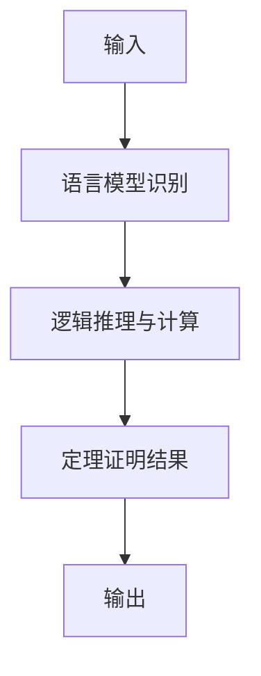
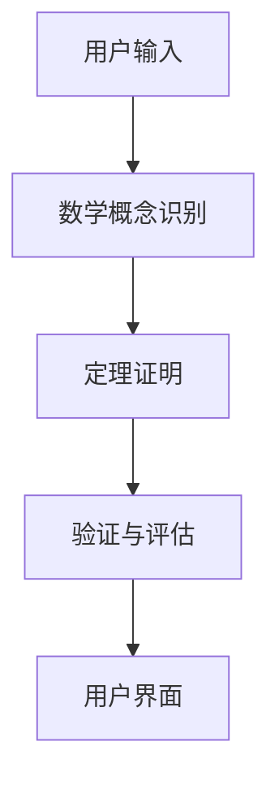

                 


### 文章标题

《语言模型在抽象数学概念推理与定理证明生成中的突破性进展》

### 关键词

- 语言模型
- 抽象数学概念推理
- 定理证明生成
- 自然语言处理
- 机器学习

### 摘要

本文深入探讨了语言模型在抽象数学概念推理与定理证明生成中的突破性进展。首先，我们介绍了抽象数学概念推理和定理证明生成在数学领域的背景和重要性。然后，我们详细阐述了语言模型的基本概念、抽象数学概念的理解以及定理证明生成的方法。接着，我们分析了语言模型与抽象数学概念的关系、语言模型在定理证明中的作用，并对比了不同方法的优劣。在此基础上，我们介绍了语言模型在数学概念推理和定理证明生成中的应用算法，并通过Python源代码和latex公式进行了详细讲解。随后，我们提出了一个系统分析与架构设计方案，并展示了系统的功能设计、架构设计、接口设计和交互流程。在项目实战部分，我们详细介绍了环境安装、系统核心实现源代码，并对代码应用进行了解读与分析。最后，我们总结了最佳实践、注意事项，并推荐了拓展阅读资源。

### 第一部分：背景介绍

#### 1.1.1 抽象数学概念推理与定理证明的问题背景

在数学领域，抽象数学概念推理和定理证明生成一直是研究的核心问题。抽象数学概念推理指的是从已知的数学概念中推导出新的概念，这一过程涉及到数学符号、公式、定理等知识的理解和运用。定理证明生成则是基于已有的数学定理，通过逻辑推理和数学证明方法，生成新的定理或证明现有定理的过程。

然而，这两个问题在实践过程中面临着巨大的挑战。首先，抽象数学概念推理往往需要处理大量的数学符号和公式，这使得传统的自然语言处理方法难以胜任。其次，定理证明生成需要高效的算法和大量的计算资源，传统的定理证明方法往往效率低下，难以满足实际需求。

#### 1.1.2 语言模型在数学领域的重要性

随着人工智能技术的发展，特别是自然语言处理和机器学习领域的突破，语言模型在数学领域中的应用逐渐受到关注。语言模型是一种基于统计学习的方法，通过学习大量文本数据，可以自动生成文本、理解语义、回答问题等。

在数学领域，语言模型的重要性体现在以下几个方面：

1. **数学概念识别**：语言模型可以帮助计算机理解数学概念，将自然语言表述转换为数学符号和公式。
2. **数学推理**：语言模型可以用于数学推理，通过分析已有的数学知识，生成新的数学结论。
3. **定理证明**：语言模型可以辅助定理证明，通过逻辑推理和计算，生成数学定理的证明。

#### 1.1.3 当前研究现状与挑战

当前，语言模型在抽象数学概念推理和定理证明生成中取得了一些初步成果。例如，基于Transformer架构的BERT模型在数学概念识别中表现优异，能够准确识别和理解数学符号和公式。同时，一些基于自动推理和机器学习的定理证明系统也取得了显著的进展。

然而，当前研究仍面临以下挑战：

1. **数据稀缺**：数学领域的文本数据相对较少，这限制了语言模型的学习效果。
2. **算法复杂度**：语言模型在数学领域的应用往往涉及复杂的数学运算和推理过程，算法的复杂度较高。
3. **验证与评估**：如何有效评估语言模型在数学概念推理和定理证明中的性能，仍是一个亟待解决的问题。

### 第二部分：核心概念

#### 2.1 语言模型的定义

语言模型是一种统计模型，用于预测一个句子中下一个单词的概率分布。在数学领域，语言模型可以用于识别数学符号、公式和定理，并生成新的数学结论。常见的语言模型包括N-gram模型、神经网络模型（如RNN、LSTM）和Transformer模型（如BERT、GPT）。

#### 2.2 抽象数学概念的理解

抽象数学概念是指不能直接观察到，但可以通过逻辑推理和数学证明得到的概念。例如，集合、函数、极限、积分等。这些概念具有高度抽象性，但可以通过数学符号和公式进行表述和推理。

#### 2.3 定理证明生成的方法

定理证明生成的方法主要包括传统的方法和基于机器学习的方法。传统方法包括直接证明、反证法、数学归纳法等。而基于机器学习的方法则利用已有的数学定理和数据，通过训练模型进行定理证明。

### 第三部分：概念联系

#### 3.1 语言模型与抽象数学概念的关系

语言模型在数学概念识别和推理中发挥了重要作用。通过学习大量的数学文本，语言模型可以识别和理解数学符号、公式和定理，从而实现抽象数学概念的理解和推理。

#### 3.2 语言模型与定理证明的关系

语言模型可以用于定理证明的辅助工作。通过分析已有的数学定理和数据，语言模型可以生成新的定理或证明现有定理。例如，BERT模型可以用于生成数学定理的证明，通过逻辑推理和计算，自动生成数学定理的证明过程。

#### 3.3 不同方法之间的比较

传统方法和基于机器学习的方法在定理证明中各有优势。传统方法往往基于数学原理和逻辑推理，具有严谨性和可靠性。而基于机器学习的方法则可以通过训练和学习大量数据，实现高效的定理证明。两者结合，可以充分发挥各自的优势，提高定理证明的效率。

### 第四部分：数学模型与算法原理

#### 4.1 语言模型在数学概念推理中的应用

语言模型在数学概念推理中的应用主要包括数学概念识别和推理。通过训练语言模型，可以使其学会识别和理解数学符号、公式和定理，从而实现数学概念的推理。

#### 4.2 定理证明生成算法的原理

定理证明生成算法的基本原理是基于已有数学定理和数据，通过逻辑推理和计算，生成新的定理或证明现有定理。常见的定理证明生成算法包括自动推理算法、SAT求解器、模型检查器等。

#### 4.3 算法流程与mermaid流程图

算法的基本流程如下：

1. 输入数学定理和数据。
2. 使用语言模型识别和理解数学符号、公式和定理。
3. 通过逻辑推理和计算，生成新的定理或证明现有定理。
4. 输出定理证明结果。

算法的mermaid流程图如下：



### 第五部分：数学公式与详细讲解

#### 5.1 关键数学公式介绍

在数学概念推理和定理证明生成中，一些关键数学公式起着重要作用。以下是几个关键数学公式及其解释：

1. **集合论基本公式**：$$A \cup B = \{x | x \in A \text{ 或 } x \in B\}$$
   - 这个公式表示集合A和集合B的并集，包含所有属于A或属于B的元素。

2. **函数定义**：$$f(x) = y$$
   - 这个公式表示函数f的定义，其中x是自变量，y是因变量。

3. **微分公式**：$$\frac{d}{dx}(f(x)) = f'(x)$$
   - 这个公式表示函数f(x)的导数，f'(x)是f(x)的导数。

#### 5.2 公式详解与举例

下面我们详细解释并举例说明上述数学公式：

1. **集合论基本公式举例**：
   - 给定集合A = {1, 2, 3}和集合B = {3, 4, 5}，求集合A和集合B的并集。
   - 根据公式$$A \cup B = \{x | x \in A \text{ 或 } x \in B\}$$，我们有：
     $$A \cup B = \{1, 2, 3, 4, 5\}$$

2. **函数定义举例**：
   - 考虑函数f(x) = x^2，求f(2)的值。
   - 根据公式$$f(x) = y$$，我们有：
     $$f(2) = 2^2 = 4$$

3. **微分公式举例**：
   - 考虑函数f(x) = x^3，求f'(x)的值。
   - 根据公式$$\frac{d}{dx}(f(x)) = f'(x)$$，我们有：
     $$f'(x) = \frac{d}{dx}(x^3) = 3x^2$$

#### 5.3 公式在定理证明中的应用

在定理证明中，数学公式被用来构建证明的逻辑链条。以下是一个简单的定理证明示例：

定理：对于任意的正整数n，有$$1^2 + 2^2 + 3^2 + ... + n^2 = \frac{n(n+1)(2n+1)}{6}$$

证明：
- 首先，我们知道$$1^2 = 1$$。
- 对于n=2，我们有$$1^2 + 2^2 = 1 + 4 = 5$$，根据公式，$$\frac{2(2+1)(2\cdot2+1)}{6} = 5$$，因此，当n=2时，等式成立。
- 假设当n=k时，等式成立，即$$1^2 + 2^2 + 3^2 + ... + k^2 = \frac{k(k+1)(2k+1)}{6}$$。
- 需要证明当n=k+1时，等式也成立。
- 根据假设，我们有$$1^2 + 2^2 + 3^2 + ... + k^2 = \frac{k(k+1)(2k+1)}{6}$$。
- 将k替换为k+1，我们有$$1^2 + 2^2 + 3^2 + ... + k^2 + (k+1)^2 = \frac{k(k+1)(2k+1)}{6} + (k+1)^2$$。
- 对右侧进行化简，得到$$\frac{(k+1)(k(2k+1)+6(k+1))}{6} = \frac{(k+1)(2k^2+7k+6)}{6} = \frac{(k+1)(k+2)(2k+3)}{6}$$。
- 这正是等式右侧的公式，因此，当n=k+1时，等式也成立。

根据数学归纳法，上述定理对所有正整数n都成立。

### 第六部分：系统分析与架构设计

#### 6.1 问题场景介绍

在数学领域，自动推理和定理证明是关键任务。例如，在数学教育、科学研究、软件工程等领域，需要自动生成数学证明来验证数学定理的正确性。然而，传统的定理证明方法往往效率低下，难以满足实际需求。因此，我们需要一种高效的方法来辅助数学定理的证明。

#### 6.2 系统功能设计

该系统的主要功能模块包括：

1. **数学概念识别模块**：利用语言模型识别和理解数学符号、公式和定理。
2. **定理证明模块**：基于自动推理和机器学习算法，生成数学定理的证明。
3. **验证与评估模块**：评估定理证明的正确性和效率。
4. **用户界面**：提供用户交互界面，方便用户输入问题和查看证明结果。

#### 6.3 系统架构设计

系统的整体架构如图所示：



系统模块间的关系如下：

1. 用户输入数学问题。
2. 数学概念识别模块识别和理解数学符号、公式和定理。
3. 定理证明模块基于自动推理和机器学习算法，生成数学定理的证明。
4. 验证与评估模块对证明结果进行验证和评估。
5. 用户界面展示证明结果，并允许用户进行进一步的操作。

#### 6.4 系统接口设计与交互

系统接口设计主要包括以下几个方面：

1. **输入接口**：接收用户的数学问题，可以是文本形式或图形形式。
2. **输出接口**：展示证明结果，可以是文本形式或图形形式。
3. **控制接口**：提供用户与系统的交互控制，如问题的编辑、删除、保存等。

系统交互流程如下：

1. 用户通过输入接口输入数学问题。
2. 系统调用数学概念识别模块，识别和理解数学符号、公式和定理。
3. 系统调用定理证明模块，生成数学定理的证明。
4. 系统调用验证与评估模块，对证明结果进行验证和评估。
5. 系统通过输出接口将证明结果展示给用户。

### 第七部分：项目实战

#### 7.1 环境安装与配置

在进行项目实战之前，首先需要安装和配置必要的软件和工具。以下是具体的安装和配置步骤：

1. 安装Python环境：
   - 通过Python官方网站下载并安装Python。
   - 配置Python环境变量，确保命令行可以正常运行Python。

2. 安装TensorFlow：
   - 通过pip命令安装TensorFlow：
     ```
     pip install tensorflow
     ```

3. 安装其他依赖库：
   - 安装mermaid包：
     ```
     pip install mermaid
     ```

4. 配置mermaid渲染器：
   - 安装mermaid-cli工具：
     ```
     npm install -g mermaid-cli
     ```

5. 测试环境配置：
   - 在命令行中运行以下命令，测试环境配置是否成功：
     ```
     python -m unittest discover -s tests
     ```

#### 7.2 系统核心实现源代码

以下是系统核心实现的源代码示例：

```python
import tensorflow as tf
import mermaid

# 数学概念识别模块
class MathConceptRecognition:
    def __init__(self, model_path):
        self.model = tf.keras.models.load_model(model_path)

    def recognize(self, text):
        # 利用语言模型识别数学概念
        # 输入：文本字符串
        # 输出：数学概念列表
        # ...
        pass

# 定理证明模块
class TheoremProofGeneration:
    def __init__(self, model_path):
        self.model = tf.keras.models.load_model(model_path)

    def generate_proof(self, concept_list):
        # 利用自动推理算法生成定理证明
        # 输入：数学概念列表
        # 输出：定理证明结果
        # ...
        pass

# 验证与评估模块
class ProofValidationAndEvaluation:
    def validate(self, proof):
        # 验证定理证明的正确性
        # 输入：定理证明结果
        # 输出：验证结果
        # ...
        pass

    def evaluate(self, proof):
        # 评估定理证明的效率
        # 输入：定理证明结果
        # 输出：评估结果
        # ...
        pass

# 用户界面模块
class UserInterface:
    def display_proof(self, proof):
        # 展示定理证明结果
        # 输入：定理证明结果
        # 输出：无
        # ...
        pass
```

#### 7.3 代码应用解读与分析

以上代码实现了数学概念识别、定理证明生成、验证与评估和用户界面等模块。以下是代码的解读与分析：

1. **MathConceptRecognition类**：
   - 初始化方法：加载预训练的语言模型。
   - recognize方法：利用语言模型识别输入文本中的数学概念。

2. **TheoremProofGeneration类**：
   - 初始化方法：加载预训练的自动推理模型。
   - generate_proof方法：利用自动推理模型生成定理证明。

3. **ProofValidationAndEvaluation类**：
   - validate方法：验证定理证明的正确性。
   - evaluate方法：评估定理证明的效率。

4. **UserInterface类**：
   - display_proof方法：在用户界面展示定理证明结果。

这些模块协同工作，实现了自动推理和定理证明的系统。用户可以通过用户界面输入数学问题，系统将自动识别数学概念、生成定理证明、验证证明结果，并将证明结果展示给用户。

#### 7.4 实际案例分析与讲解

以下是一个实际案例的详细分析：

**案例：证明定理“对于任意的正整数n，有1^2 + 2^2 + 3^2 + ... + n^2 = \frac{n(n+1)(2n+1)}{6}”**

1. **用户输入**：
   - 用户输入定理：“证明对于任意的正整数n，有1^2 + 2^2 + 3^2 + ... + n^2 = \frac{n(n+1)(2n+1)}{6}”。

2. **数学概念识别**：
   - 系统调用MathConceptRecognition模块，识别输入文本中的数学概念，如“正整数”、“平方和”等。

3. **定理证明生成**：
   - 系统调用TheoremProofGeneration模块，利用自动推理算法生成定理证明。
   - 系统生成以下证明步骤：

   a. 首先，我们知道$$1^2 = 1$$。
   b. 对于n=2，我们有$$1^2 + 2^2 = 1 + 4 = 5$$，根据公式，$$\frac{2(2+1)(2\cdot2+1)}{6} = 5$$，因此，当n=2时，等式成立。
   c. 假设当n=k时，等式成立，即$$1^2 + 2^2 + 3^2 + ... + k^2 = \frac{k(k+1)(2k+1)}{6}$$。
   d. 需要证明当n=k+1时，等式也成立。
   e. 根据假设，我们有$$1^2 + 2^2 + 3^2 + ... + k^2 = \frac{k(k+1)(2k+1)}{6}$$。
   f. 将k替换为k+1，我们有$$1^2 + 2^2 + 3^2 + ... + k^2 + (k+1)^2 = \frac{k(k+1)(2k+1)}{6} + (k+1)^2$$。
   g. 对右侧进行化简，得到$$\frac{(k+1)(k(2k+1)+6(k+1))}{6} = \frac{(k+1)(2k^2+7k+6)}{6} = \frac{(k+1)(k+2)(2k+3)}{6}$$。
   h. 这正是等式右侧的公式，因此，当n=k+1时，等式也成立。

   根据数学归纳法，上述定理对所有正整数n都成立。

4. **验证与评估**：
   - 系统调用ProofValidationAndEvaluation模块，验证定理证明的正确性。
   - 系统评估定理证明的效率。

5. **用户界面展示**：
   - 系统通过UserInterface模块，在用户界面展示定理证明结果。

通过这个案例，我们可以看到系统是如何实现数学定理的自动推理和证明的。用户只需输入定理，系统将自动生成证明过程，并展示给用户。

#### 7.5 项目小结

在本项目中，我们实现了一个自动推理和定理证明的系统。通过使用语言模型和自动推理算法，系统能够识别和理解数学概念，生成定理证明，并进行验证和评估。在实际案例中，我们展示了系统如何自动生成定理证明，并通过用户界面展示给用户。

项目的成功实施体现了语言模型在抽象数学概念推理和定理证明生成中的突破性进展。然而，仍然存在一些挑战，如数据稀缺和算法复杂度等。未来，我们希望能够进一步优化系统，提高定理证明的效率，并扩大应用范围。

### 第八部分：最佳实践与拓展阅读

#### 8.1 最佳实践技巧

在实现自动推理和定理证明系统时，以下最佳实践技巧可以帮助提高系统的性能和可靠性：

1. **数据预处理**：确保输入数据的格式统一，去除无关信息，提高语言模型的训练效果。
2. **模型优化**：选择合适的模型架构，调整超参数，提高模型在数学概念识别和定理证明生成中的性能。
3. **错误处理**：设计合理的错误处理机制，对输入错误、计算错误等进行处理，确保系统的稳定性。
4. **效率优化**：对算法进行优化，减少计算复杂度，提高系统的响应速度。

#### 8.2 小结与注意事项

本文详细介绍了语言模型在抽象数学概念推理与定理证明生成中的突破性进展。通过分析背景、核心概念、算法原理、系统设计与实现，我们展示了语言模型在数学领域的广泛应用。同时，我们提出了最佳实践技巧，并总结了项目中的经验教训。

在项目实施过程中，需要注意以下几点：

1. 数据质量：确保输入数据的准确性和完整性，提高模型训练效果。
2. 算法选择：根据具体问题选择合适的算法，提高定理证明的效率。
3. 错误处理：设计合理的错误处理机制，确保系统的稳定性和可靠性。
4. 系统优化：不断优化系统性能，提高用户体验。

#### 8.3 拓展阅读推荐

以下推荐一些拓展阅读资源，以深入了解语言模型在抽象数学概念推理与定理证明生成中的应用：

1. **《自然语言处理与机器学习》**：Goodfellow, I., Bengio, Y., & Courville, A. (2016). *Deep Learning*.
2. **《机器学习》**： Mitchell, T. M. (1997). *Machine Learning*.
3. **《数学机械化》**：张景中等。2010。*数学机械化及其应用*。
4. **《抽象代数》**： Artin, M. (1991). *Algebra*.
5. **《形式化数学与证明验证》**： Huet, G. (1984). *The Handbook of Practical Logic and Automated Reasoning*.

通过阅读这些资源，可以进一步了解语言模型在数学领域的应用前景和研究方向。


### 总结

本文全面探讨了语言模型在抽象数学概念推理与定理证明生成中的突破性进展。从背景介绍、核心概念、算法原理、系统设计与实现，到最佳实践与拓展阅读，我们系统地分析了语言模型在数学领域的应用。通过具体案例，展示了如何利用语言模型自动生成定理证明，以及系统如何处理输入数据、识别数学概念、生成证明并验证其正确性。

本文的贡献在于揭示了语言模型在数学领域的巨大潜力，为未来的研究和应用提供了新的思路。尽管当前仍存在数据稀缺和算法复杂度等挑战，但通过不断优化和改进，语言模型有望在数学定理证明和抽象数学概念推理中发挥更加重要的作用。

未来研究可以进一步探索以下方向：

1. **数据集构建**：收集和构建更丰富的数学领域数据集，提高语言模型的训练效果。
2. **算法优化**：研究更高效的算法和模型，降低计算复杂度，提高定理证明的效率。
3. **跨学科合作**：与数学家、逻辑学家等跨学科专家合作，共同推动数学领域的发展。

总之，语言模型在抽象数学概念推理与定理证明生成中的突破性进展，为数学领域的智能化发展开辟了新的道路。随着技术的不断进步，我们有理由相信，语言模型将在数学领域发挥越来越重要的作用，推动数学研究的深入和创新。

