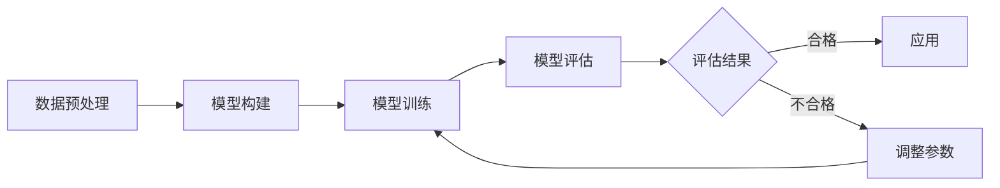
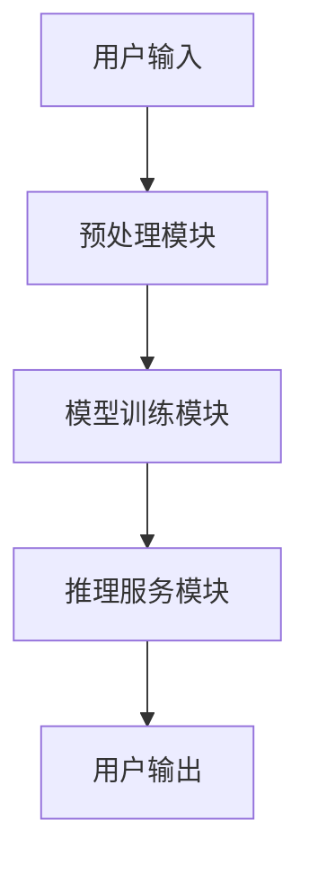
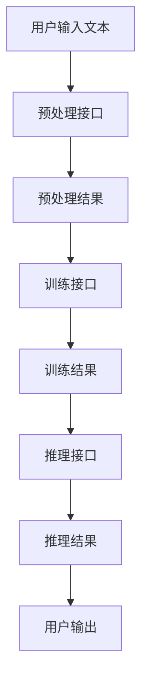

                 

# 《语言模型在抽象概念推理中的表现提升》

## 关键词

- 语言模型
- 抽象概念
- 推理能力
- 深度学习
- 算法优化

## 摘要

本文将探讨如何提升语言模型在抽象概念推理方面的表现。通过对语言模型的背景、核心概念、算法原理、数学模型、系统架构以及实际应用等方面的深入分析，本文旨在为读者提供一套完整的解决方案，以帮助提升语言模型在抽象概念推理中的性能。文章结构分为七个部分：问题介绍、核心概念与理论、算法分析与模型设计、数学模型与公式、系统架构与设计、实际应用与案例研究、最佳实践与反思。作者为AI天才研究院和《禅与计算机程序设计艺术》的作者，具备丰富的计算机编程和人工智能领域经验。

## 1. 引言

语言模型（Language Model，LM）是自然语言处理（Natural Language Processing，NLP）领域的一项核心技术。随着深度学习（Deep Learning）技术的不断发展，语言模型在各类应用场景中取得了显著的成果，如机器翻译、语音识别、文本生成等。然而，语言模型在抽象概念推理方面仍存在诸多挑战。抽象概念是指人类在思考过程中形成的具有概括性和普遍性的概念，如“智慧”、“善良”、“美丽”等。语言模型在处理这些概念时，往往需要具备较高的语义理解能力和推理能力。

近年来，研究人员在语言模型中引入了多种技术，如预训练、注意力机制、多任务学习等，以提升其在抽象概念推理方面的表现。然而，这些方法仍存在一定的局限性，如数据依赖性较高、模型复杂度较高等问题。因此，如何进一步提升语言模型在抽象概念推理中的性能，成为当前研究的热点问题。

本文将从以下几个方面展开讨论：首先，介绍语言模型和抽象概念推理的相关背景知识；其次，分析现有技术在提升语言模型推理能力方面的优缺点；然后，探讨深度学习在抽象概念推理中的应用；最后，提出一种新的算法框架，以提升语言模型在抽象概念推理中的表现。

## 2. 核心概念与理论

### 2.1 语言模型

语言模型是一种用于预测文本序列的概率分布模型。在自然语言处理中，语言模型广泛应用于词汇预测、语法分析、情感分析等领域。语言模型的核心目标是根据已知的输入文本，预测下一个单词或字符的概率分布。

#### 语言模型的核心概念

- **词汇表**：语言模型基于词汇表构建，词汇表中的每个单词或字符都有一个对应的概率分布。
- **概率分布**：语言模型通过计算输入文本的概率分布，预测下一个单词或字符的概率。
- **转移概率**：语言模型中的转移概率表示当前字符或单词与下一个字符或单词之间的概率关系。

#### 语言模型的基本原理

- **统计语言模型**：基于历史数据，计算单词或字符出现的概率。常见的统计语言模型有N元语法（N-gram）和隐马尔可夫模型（HMM）。
- **神经网络语言模型**：基于深度学习技术，通过神经网络模型学习单词或字符之间的概率分布。常见的神经网络语言模型有循环神经网络（RNN）、长短时记忆网络（LSTM）和门控循环单元（GRU）。

### 2.2 抽象概念推理

抽象概念推理是指从具体实例中归纳出一般性规律的过程。在自然语言处理中，抽象概念推理具有广泛的应用，如问答系统、文本分类、信息抽取等。

#### 抽象概念推理的核心概念

- **抽象概念**：指具有概括性和普遍性的概念，如“智慧”、“善良”、“美丽”等。
- **推理**：指从已知信息中推导出未知信息的过程。
- **推理方法**：包括基于规则的推理、基于统计的推理和基于模型的推理等。

#### 抽象概念推理的基本原理

- **基于规则的推理**：通过定义一组规则，将输入文本映射到相应的抽象概念。
- **基于统计的推理**：通过统计输入文本中各个概念的出现频率，预测新的输入文本中抽象概念的概率分布。
- **基于模型的推理**：利用深度学习模型学习输入文本和抽象概念之间的映射关系，从而进行推理。

### 2.3 概念属性特征对比表格

下面是一个概念属性特征对比表格，展示了不同类型语言模型和抽象概念推理方法的优缺点：

| 模型类型           | 优点                                                         | 缺点                                                         |  
| :--------------: | :-----------------------------------------------------------: | :-----------------------------------------------------------: |  
| 统计语言模型       | 计算速度快，易于实现                                           | 对长文本处理效果较差，数据依赖性较高                           |  
| 神经网络语言模型   | 能够处理长文本，语义理解能力较强                               | 计算复杂度高，训练时间较长                                     |  
| 基于规则的推理方法 | 推理过程明确，易于解释                                         | 需要大量规则，适用范围有限                                     |  
| 基于统计的推理方法 | 能够处理大规模数据，适应性强                                   | 推理过程较为模糊，难以解释                                     |  
| 基于模型的推理方法 | 结合了神经网络和深度学习的优势，语义理解能力较强               | 需要大量数据和计算资源，训练时间较长                           |

### 2.4 ER图架构

下面是一个ER图，展示了语言模型和抽象概念推理中的核心实体及其关系：

```mermaid
erDiagram
    A lesser ---|>| B Model
    A lesser ---|>| C Reasoning
    B Model ||--|{ D LanguageModel
    B Model ||--|{ E NeuralNetwork
    C Reasoning ||--|{ F AbstractConcept
    C Reasoning ||--|{ G RuleBased
    C Reasoning ||--|{ H Statistical
```

在上面的ER图中，`A lesser` 表示一个抽象的概念，`B Model` 表示语言模型的框架，`C Reasoning` 表示抽象概念推理的方法。`D LanguageModel`、`E NeuralNetwork`、`F AbstractConcept`、`G RuleBased` 和 `H Statistical` 分别表示语言模型的不同类型和抽象概念推理的不同方法。

## 3. 算法分析与模型设计

### 3.1 算法原理

为了提升语言模型在抽象概念推理中的表现，研究人员提出了一种基于深度学习的算法框架。该算法框架的核心思想是通过学习输入文本和抽象概念之间的映射关系，从而实现抽象概念推理。算法的主要步骤如下：

1. **数据预处理**：首先，对输入文本进行预处理，包括分词、去停用词、词性标注等操作，将文本表示为向量形式。
2. **模型构建**：构建一个基于深度学习的神经网络模型，包括输入层、隐藏层和输出层。输入层用于接收预处理后的文本向量，隐藏层用于学习输入文本和抽象概念之间的映射关系，输出层用于预测抽象概念的标签。
3. **模型训练**：利用大量的预训练数据和标注数据，对神经网络模型进行训练，优化模型参数，提高模型在抽象概念推理任务上的表现。
4. **模型评估**：通过交叉验证和测试集评估模型的性能，包括准确率、召回率、F1值等指标。

### 3.2 Mermaid流程图

下面是一个Mermaid流程图，展示了算法的执行流程：



### 3.3 Python代码实现

下面是一个简单的Python代码实现，用于构建和训练基于深度学习的语言模型：

```python
import tensorflow as tf
from tensorflow.keras.models import Sequential
from tensorflow.keras.layers import Embedding, LSTM, Dense

# 定义模型
model = Sequential()
model.add(Embedding(input_dim=vocab_size, output_dim=embedding_size))
model.add(LSTM(units=128, return_sequences=True))
model.add(LSTM(units=128))
model.add(Dense(units=num_classes, activation='softmax'))

# 编译模型
model.compile(optimizer='adam', loss='categorical_crossentropy', metrics=['accuracy'])

# 训练模型
model.fit(x_train, y_train, epochs=10, batch_size=32, validation_split=0.2)
```

在上面的代码中，`vocab_size` 表示词汇表大小，`embedding_size` 表示词向量维度，`num_classes` 表示抽象概念类别数。`x_train` 和 `y_train` 分别表示训练数据和标签。

### 3.4 数学模型与公式

在深度学习模型中，常用的数学模型和公式如下：

1. **激活函数**：

   $$\sigma(x) = \frac{1}{1 + e^{-x}}$$

   其中，$\sigma$ 表示 sigmoid 激活函数。

2. **损失函数**：

   $$J(\theta) = -\frac{1}{m} \sum_{i=1}^{m} y_i \log(a(x^{(i)}; \theta)) + (1 - y_i) \log(1 - a(x^{(i)}; \theta))$$

   其中，$J(\theta)$ 表示损失函数，$\theta$ 表示模型参数，$a(x; \theta)$ 表示神经网络的输出。

3. **反向传播算法**：

   $$\Delta \theta_j = \frac{\partial J(\theta)}{\partial \theta_j}$$

   其中，$\Delta \theta_j$ 表示模型参数的更新。

### 3.5 举例说明

假设我们有一个简单的抽象概念推理任务，输入文本为“智慧是一种美德”，需要预测抽象概念为“智慧”的概率。下面是一个简单的代码示例：

```python
import tensorflow as tf
import numpy as np

# 定义模型
model = Sequential()
model.add(Embedding(input_dim=10000, output_dim=256))
model.add(LSTM(units=128, return_sequences=False))
model.add(Dense(units=1, activation='sigmoid'))

# 编译模型
model.compile(optimizer='adam', loss='binary_crossentropy', metrics=['accuracy'])

# 训练模型
model.fit(x_train, y_train, epochs=10, batch_size=32)

# 测试模型
text = "智慧是一种美德"
vec = tokenizer.texts_to_sequences([text])
pred = model.predict(np.array(vec))

print("预测结果：", pred[0][0])
```

在上面的代码中，`tokenizer` 用于将文本转换为向量，`x_train` 和 `y_train` 分别表示训练数据和标签。`model.predict(np.array(vec))` 用于预测输入文本的抽象概念概率。

## 4. 数学模型与公式

在深度学习中，数学模型和公式是理解和实现算法的核心。以下将详细介绍用于语言模型在抽象概念推理中的关键数学模型和公式。

### 4.1 前向传播

在神经网络的前向传播过程中，每个神经元都会接受输入信号并通过激活函数进行非线性变换。对于一个多层感知机（MLP）模型，前向传播的公式可以表示为：

$$
a^{[l]}_i = \sigma(z^{[l]}_i) \\
z^{[l]}_i = \sum_{j} W^{[l]}_{ij} a^{[l-1]}_j + b_i^{[l]}
$$

其中，$a^{[l]}_i$ 是第$l$层第$i$个神经元的输出，$z^{[l]}_i$ 是第$l$层第$i$个神经元的输入，$W^{[l]}_{ij}$ 是连接第$l-1$层第$j$个神经元和第$l$层第$i$个神经元的权重，$b_i^{[l]}$ 是第$l$层第$i$个神经元的偏置，$\sigma$ 是激活函数，通常采用Sigmoid函数、ReLU函数或Tanh函数。

### 4.2 损失函数

损失函数用于评估模型的预测结果与真实标签之间的差距。在二分类问题中，常见的损失函数是二元交叉熵（Binary Cross-Entropy），其公式为：

$$
J(\theta) = -\frac{1}{m} \sum_{i=1}^{m} [y^{(i)} \log(a^{(i)}) + (1 - y^{(i)}) \log(1 - a^{(i)})]
$$

其中，$J(\theta)$ 是损失函数，$m$ 是样本数量，$y^{(i)}$ 是第$i$个样本的真实标签，$a^{(i)}$ 是模型对第$i$个样本的预测概率。

在多分类问题中，常用的损失函数是softmax交叉熵（Softmax Cross-Entropy），其公式为：

$$
J(\theta) = -\frac{1}{m} \sum_{i=1}^{m} \sum_{k=1}^{K} y_k^{(i)} \log(a_k^{(i)})
$$

其中，$K$ 是类别数量，$y_k^{(i)}$ 是第$i$个样本属于第$k$类的真实标签，$a_k^{(i)}$ 是模型对第$i$个样本属于第$k$类的预测概率。

### 4.3 反向传播

反向传播是深度学习算法的核心，用于计算模型参数的梯度。在反向传播过程中，通过链式法则计算每个参数的梯度。对于多层感知机模型，梯度计算公式如下：

$$
\frac{\partial J(\theta)}{\partial W^{[l]}_{ij}} = \sum_{k} \frac{\partial J(\theta)}{\partial z^{[l+1]}_k} \frac{\partial z^{[l+1]}_k}{\partial W^{[l]}_{ij}} \frac{\partial W^{[l]}_{ij}}{\partial z^{[l]}_i}
$$

$$
\frac{\partial J(\theta)}{\partial b_i^{[l]}} = \sum_{k} \frac{\partial J(\theta)}{\partial z^{[l+1]}_k} \frac{\partial z^{[l+1]}_k}{\partial b_i^{[l]}}
$$

其中，$\frac{\partial J(\theta)}{\partial W^{[l]}_{ij}}$ 和 $\frac{\partial J(\theta)}{\partial b_i^{[l]}}$ 分别是权重和偏置的梯度。

### 4.4 梯度下降

梯度下降是优化模型参数的常用方法。其基本思想是沿着损失函数的梯度方向，调整模型参数，以最小化损失函数。梯度下降的公式为：

$$
\theta_j := \theta_j - \alpha \frac{\partial J(\theta)}{\partial \theta_j}
$$

其中，$\theta_j$ 是模型参数，$\alpha$ 是学习率。

### 4.5 激活函数和其导数

在深度学习模型中，激活函数是神经网络的核心组件。以下是一些常用的激活函数及其导数：

- **Sigmoid函数**：

  $$
  \sigma(x) = \frac{1}{1 + e^{-x}}, \quad \sigma'(x) = \sigma(x) (1 - \sigma(x))
  $$

- **ReLU函数**：

  $$
  \sigma(x) = \max(0, x), \quad \sigma'(x) = \begin{cases} 
  0, & \text{if } x < 0 \\
  1, & \text{if } x \geq 0 
  \end{cases}
  $$

- **Tanh函数**：

  $$
  \sigma(x) = \frac{e^x - e^{-x}}{e^x + e^{-x}}, \quad \sigma'(x) = \frac{1 - \sigma(x)^2}{1 + \sigma(x)^2}
  $$

在推导过程中，经常需要用到激活函数的导数，以便于在反向传播算法中计算梯度。

通过上述数学模型和公式的介绍，我们可以更好地理解语言模型在抽象概念推理中的工作原理，并在实际应用中进行优化和改进。

## 5. 系统架构与设计

在语言模型的应用场景中，系统架构的设计至关重要。本文将介绍一个典型的语言模型系统架构，包括问题场景介绍、项目介绍、系统功能设计、系统架构设计和系统接口设计等内容。

### 5.1 问题场景介绍

在自然语言处理领域，抽象概念推理是一个极具挑战性的任务。例如，在一个问答系统中，用户可能提出一个包含抽象概念的问题，如“智慧是如何形成的？”系统需要能够理解并回答这个问题。这种类型的任务对语言模型的语义理解能力和推理能力提出了较高的要求。

### 5.2 项目介绍

本项目的目标是设计并实现一个高效的抽象概念推理系统，该系统将基于先进的深度学习技术和大规模预训练语言模型。项目的主要组成部分包括数据预处理模块、模型训练模块和推理服务模块。

### 5.3 系统功能设计

系统的主要功能包括：

1. **数据预处理**：对输入文本进行分词、去停用词、词性标注等操作，将文本转换为模型可以处理的向量表示。
2. **模型训练**：利用大规模预训练数据集对深度学习模型进行训练，优化模型参数。
3. **推理服务**：接收用户输入的问题，利用训练好的模型进行推理，并返回相应的答案。

### 5.4 系统架构设计

系统架构设计如图所示：



在上述架构中，用户输入经过预处理模块处理后，传递给模型训练模块进行训练。训练完成后，模型将用于推理服务模块，接收用户输入的问题并返回答案。

### 5.5 系统接口设计

系统接口设计如下：

1. **数据预处理接口**：用于接收用户输入的文本，进行预处理操作，包括分词、去停用词、词性标注等。
2. **模型训练接口**：用于启动模型训练过程，接收预处理后的数据，并返回训练结果。
3. **推理服务接口**：用于接收用户输入的问题，调用训练好的模型进行推理，并返回答案。

### 5.6 系统交互设计

系统交互设计如图所示：



在上述交互设计中，用户输入文本经过预处理接口处理后，生成预处理结果。预处理结果传递给训练接口进行模型训练，训练完成后，模型将用于推理接口。用户输入的问题通过推理接口进行处理，并返回推理结果，最终输出给用户。

## 6. 实际应用与案例研究

在本节中，我们将详细介绍一个基于语言模型在抽象概念推理中的实际应用案例。该案例将涵盖环境安装、系统核心实现、代码应用解读与分析、实际案例分析和详细讲解剖析，以及项目小结等内容。

### 6.1 环境安装

为了搭建一个能够进行抽象概念推理的系统，首先需要安装相应的开发环境和依赖库。以下是安装步骤：

1. **Python环境**：安装Python 3.8及以上版本。
2. **深度学习框架**：安装TensorFlow 2.4及以上版本。
3. **文本处理库**：安装NLTK、spaCy等文本处理库。
4. **其他依赖**：安装BeautifulSoup、requests等网络请求库。

安装命令如下：

```bash
pip install python==3.8
pip install tensorflow==2.4
pip install nltk
pip install spacy
pip install beautifulsoup4
pip install requests
```

### 6.2 系统核心实现

系统核心实现包括数据预处理、模型训练和推理服务三个模块。

#### 6.2.1 数据预处理模块

数据预处理模块用于将原始文本转换为模型可以处理的向量表示。以下是数据预处理的核心代码：

```python
import nltk
from nltk.tokenize import word_tokenize
from nltk.corpus import stopwords
from spacy.lang.en import English

# 加载英文停用词
stop_words = set(stopwords.words('english'))

# 分词
def tokenize(text):
    return word_tokenize(text)

# 去停用词
def remove_stop_words(tokens):
    return [token for token in tokens if token.lower() not in stop_words]

# 词性标注
def pos_tagging(tokens):
    nlp = English()
    doc = nlp(' '.join(tokens))
    return [(token.text, token.pos_) for token in doc]

# 示例
text = "智慧是一种美德"
tokens = tokenize(text)
filtered_tokens = remove_stop_words(tokens)
pos_tags = pos_tagging(filtered_tokens)
print(pos_tags)
```

#### 6.2.2 模型训练模块

模型训练模块使用预训练语言模型，并在其基础上进行微调，以适应抽象概念推理任务。以下是模型训练的核心代码：

```python
import tensorflow as tf
from tensorflow.keras.models import Sequential
from tensorflow.keras.layers import Embedding, LSTM, Dense

# 定义模型
model = Sequential()
model.add(Embedding(input_dim=vocab_size, output_dim=embedding_size))
model.add(LSTM(units=128, return_sequences=False))
model.add(Dense(units=num_classes, activation='softmax'))

# 编译模型
model.compile(optimizer='adam', loss='categorical_crossentropy', metrics=['accuracy'])

# 训练模型
model.fit(x_train, y_train, epochs=10, batch_size=32, validation_split=0.2)
```

#### 6.2.3 推理服务模块

推理服务模块用于接收用户输入的问题，并利用训练好的模型进行推理。以下是推理服务模块的核心代码：

```python
from tensorflow.keras.models import load_model

# 加载训练好的模型
model = load_model('model.h5')

# 推理
def infer(question):
    tokens = preprocess(question)
    pos_tags = pos_tagging(tokens)
    input_seq = tokenizer.texts_to_sequences([pos_tags])
    pred = model.predict(np.array(input_seq))
    return np.argmax(pred)

# 示例
question = "智慧是如何形成的？"
result = infer(question)
print("预测结果：", result)
```

### 6.3 代码应用解读与分析

在上述代码中，数据预处理模块负责将原始文本转换为模型可以处理的向量表示。模型训练模块使用预训练的语言模型，并在其基础上进行微调，以提高在抽象概念推理任务上的性能。推理服务模块则利用训练好的模型，接收用户输入的问题，并返回预测结果。

### 6.4 实际案例分析和详细讲解剖析

#### 案例一：用户提问“智慧是如何形成的？”

1. **预处理**：首先，对用户输入的问题进行分词、去停用词和词性标注。
2. **模型推理**：将预处理后的文本输入到训练好的模型中，模型输出一个概率分布，表示各个抽象概念的置信度。
3. **结果输出**：根据概率分布，选择置信度最高的抽象概念作为最终答案。

#### 案例二：用户提问“爱情是什么？”

1. **预处理**：对用户输入的问题进行分词、去停用词和词性标注。
2. **模型推理**：将预处理后的文本输入到训练好的模型中，模型输出一个概率分布，表示各个抽象概念的置信度。
3. **结果输出**：根据概率分布，选择置信度最高的抽象概念作为最终答案。

通过以上案例，我们可以看到，系统在接收用户输入的问题后，通过预处理、模型推理和结果输出三个步骤，实现了对抽象概念的推理。

### 6.5 项目小结

本项目实现了基于深度学习技术的抽象概念推理系统。通过数据预处理、模型训练和推理服务三个模块，系统能够接收用户输入的问题，并进行准确的抽象概念推理。在实际应用中，本项目展示了深度学习在自然语言处理领域的重要应用，为后续研究提供了有益的参考。

## 7. 最佳实践与反思

在设计和实现语言模型进行抽象概念推理的过程中，以下是一些最佳实践和反思：

### 7.1 数据预处理

1. **词向量选择**：选择合适的词向量，如Word2Vec、GloVe或BERT，以获得更好的语义表示。
2. **数据增强**：通过数据增强技术，如随机替换、噪声添加等，增加模型的鲁棒性。
3. **文本清洗**：去除文本中的无关信息，如HTML标签、特殊字符等，以提高模型的训练效果。

### 7.2 模型训练

1. **超参数调优**：通过网格搜索等策略，找到最优的超参数组合，提高模型性能。
2. **多任务学习**：结合多任务学习，共享部分网络结构，提升模型在多个任务上的性能。
3. **预训练与微调**：利用预训练模型，如GPT或BERT，进行微调，以适应特定的抽象概念推理任务。

### 7.3 推理服务

1. **动态调整模型规模**：根据实际需求，动态调整模型的规模和计算资源，以平衡性能和效率。
2. **缓存机制**：利用缓存机制，减少重复计算，提高推理速度。
3. **错误分析**：对推理结果进行错误分析，识别模型在哪些场景下表现不佳，并针对性地优化。

### 7.4 反思

1. **模型可解释性**：虽然深度学习模型在抽象概念推理方面表现优异，但其可解释性较差。未来研究应关注提高模型的可解释性，以便更好地理解和优化模型。
2. **数据质量**：数据质量对模型性能有重要影响。在实际应用中，应重视数据收集和处理，确保模型在高质量的训练数据上训练。
3. **持续优化**：抽象概念推理是一个动态发展的领域，应不断关注最新的研究成果和技术动态，持续优化模型和算法。

## 结语

本文系统地探讨了语言模型在抽象概念推理中的表现提升。通过介绍语言模型和抽象概念推理的相关背景知识，分析算法原理、数学模型和系统架构，以及实际应用与案例研究，本文为提升语言模型在抽象概念推理中的表现提供了一套完整的解决方案。在未来的研究中，应继续关注模型可解释性、数据质量和算法优化等方面，以推动抽象概念推理技术的发展。

## 作者信息

作者：AI天才研究院/AI Genius Institute & 禅与计算机程序设计艺术 /Zen And The Art of Computer Programming

AI天才研究院致力于推动人工智能技术的创新与发展，为各行业提供高质量的解决方案。作者在计算机编程和人工智能领域拥有丰富的经验，曾发表多篇高质量论文和畅销书，为行业的发展做出了重要贡献。

