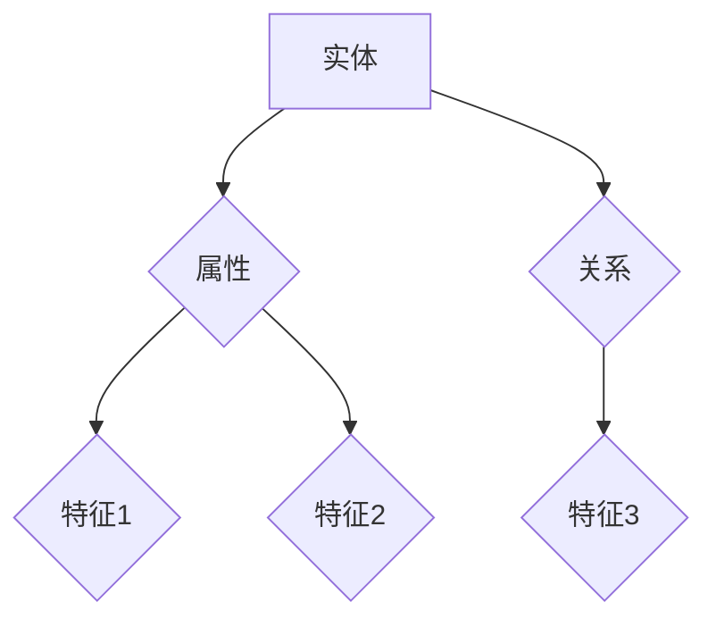
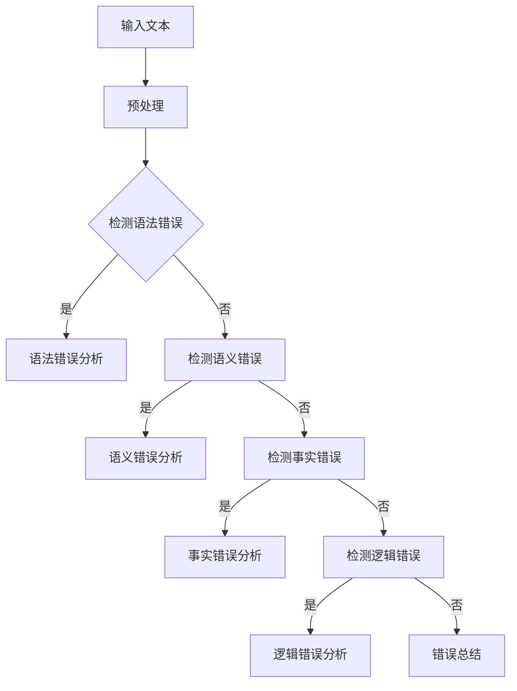
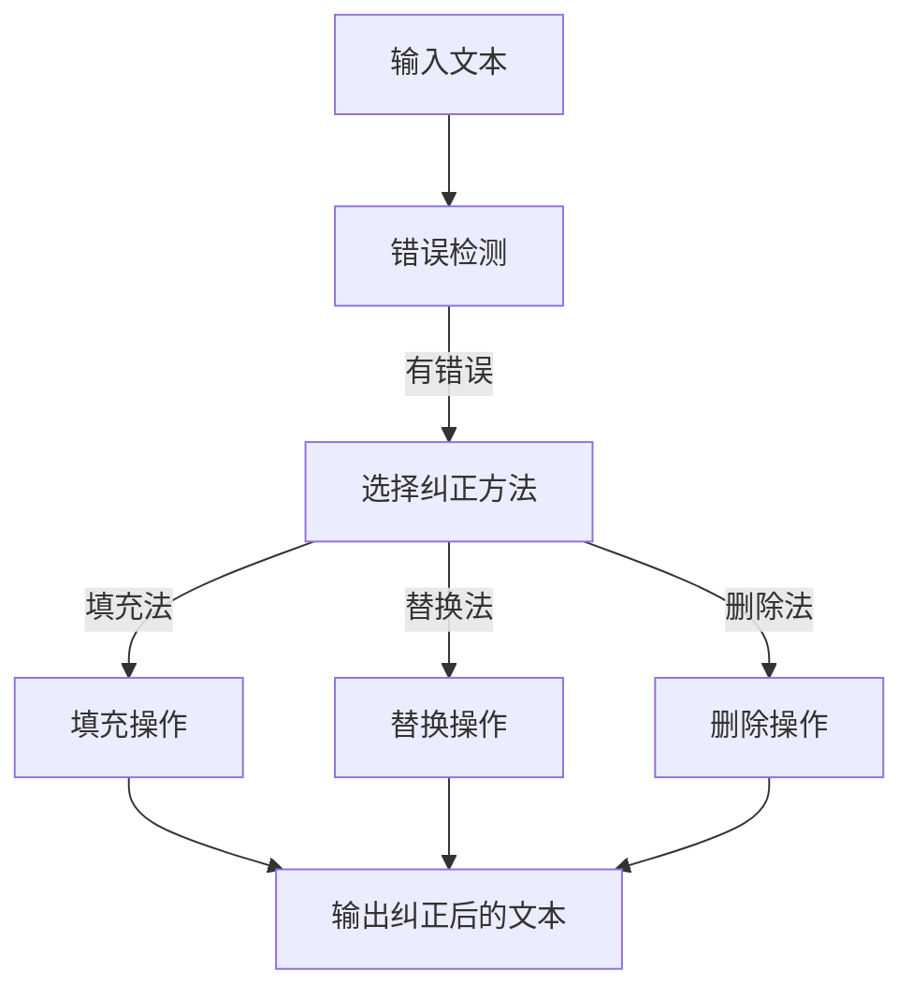
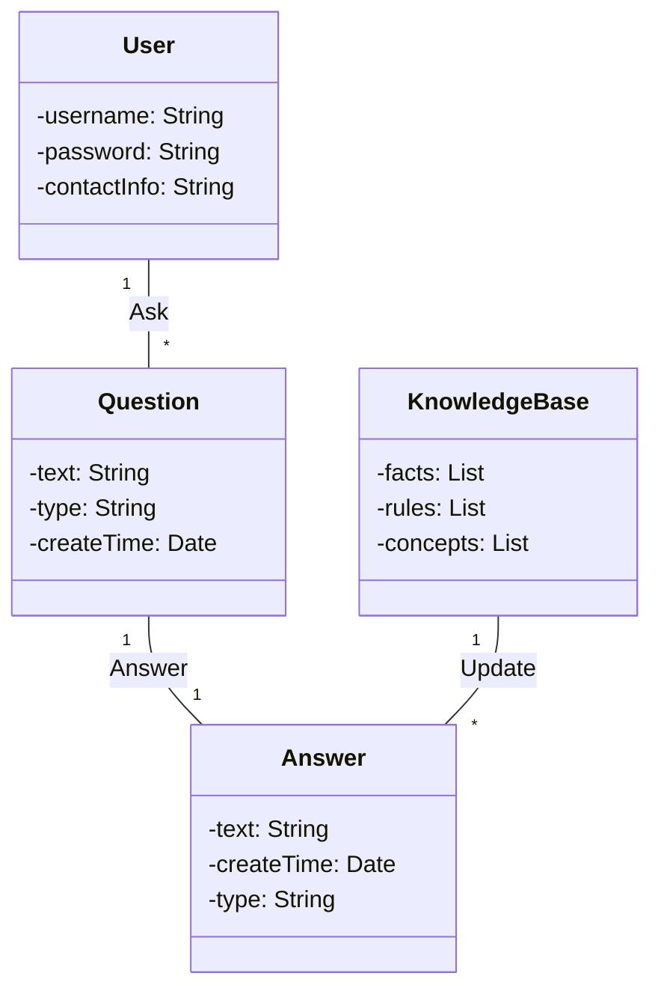
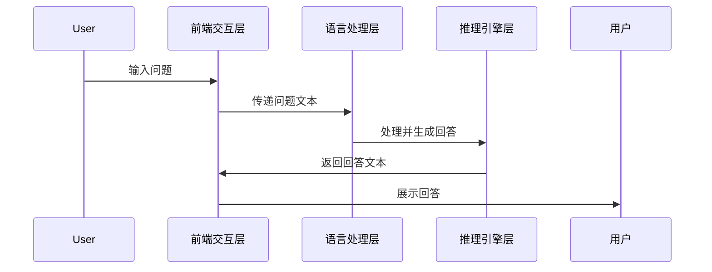
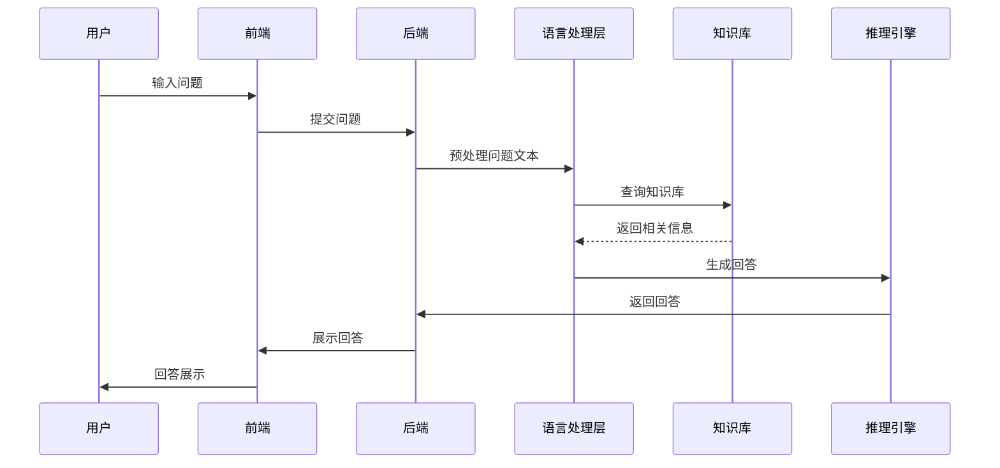

                 

## 引言

### 语言模型与推理任务的结合

语言模型（Language Model）作为自然语言处理（NLP）的核心技术之一，已经在众多应用场景中取得了显著成效。从自动语音识别、机器翻译到文本生成和问答系统，语言模型展现出了强大的能力。然而，在推理任务（Reasoning Tasks）中，语言模型却面临着诸多挑战。推理任务不仅仅是简单地生成文本或翻译，它要求模型能够理解语义、逻辑关系，并进行推断和决策。这使得语言模型在处理复杂任务时，容易出现错误。

### 推理任务的重要性

推理任务在人工智能领域具有重要地位。它涉及到智能体的决策能力、知识推理和问题解决能力。在现实世界中，许多任务都依赖于推理能力，例如自动驾驶系统需要实时分析道路情况并做出驾驶决策，医疗诊断系统需要根据症状和检查结果推断疾病，智能客服系统需要理解用户意图并给出合适的回复。这些任务的成功实施，离不开高效的推理能力。

### 语言模型错误的普遍性和影响

尽管语言模型在许多场景中表现出色，但在推理任务中，其错误现象却普遍存在。这些错误可能源于数据质量、模型结构、训练过程等多种因素。错误不仅会影响推理任务的准确性，还可能带来严重的后果。例如，在自动驾驶中，模型的错误可能导致交通事故；在医疗诊断中，错误的推断可能导致误诊。因此，分析和纠正语言模型在推理任务中的错误，具有重要的现实意义。

### 文章的目的和结构

本文旨在深入探讨语言模型在推理任务中的错误现象及其纠正方法。文章将首先介绍相关的背景知识，包括语言模型的基本原理、推理任务的定义和挑战，以及语言模型错误的概念和分类。接着，我们将详细分析语言模型错误的常见来源和影响，并介绍错误分析和纠正的方法。随后，文章将讨论ER实体关系图在错误分析中的应用，以及错误纠正算法的原理和实现。最后，我们将通过一个具体案例，展示如何在实际项目中应用这些方法，并提出一些最佳实践和建议。

### 总结

通过本文的探讨，我们希望能够帮助读者理解语言模型在推理任务中的错误现象，掌握错误分析和纠正的方法，并能够将这些方法应用到实际项目中，提高推理任务的准确性和可靠性。希望这篇文章能够成为您在语言模型推理任务中的有力指南。

## 关键词

- 语言模型
- 推理任务
- 错误分析
- 错误纠正
- ER实体关系图

## 摘要

本文旨在探讨语言模型在推理任务中的错误现象及其纠正方法。首先，我们介绍了语言模型的基本原理和推理任务的定义，并分析了语言模型错误的概念和分类。随后，文章详细讨论了语言模型错误的常见来源和影响，包括数据质量、模型结构和训练过程等方面。接着，我们介绍了错误分析和纠正的方法，包括统计学习方法和基于深度学习的错误分析算法，以及错误纠正的基本方法和实现。此外，文章还介绍了ER实体关系图在错误分析中的应用，并通过一个具体案例展示了如何在实际项目中应用这些方法。最后，文章提出了一些最佳实践和建议，以帮助读者在实际应用中提高推理任务的准确性和可靠性。希望本文能够为相关领域的研究者和工程师提供有价值的参考和指导。

## 第一部分：背景介绍

### 第1章: 问题背景

#### 1.1.1 语言模型在推理任务中的应用

语言模型在推理任务中的应用已经得到了广泛的研究和实践。其核心思想是通过大量文本数据训练出一个概率模型，该模型能够预测下一个单词或词组，从而生成连贯的自然语言文本。然而，当这些语言模型应用到推理任务时，它们所表现出的推理能力却往往不尽如人意。例如，在问答系统中，模型需要理解问题中的语义并给出正确的答案，但实际情况中，模型往往无法准确理解复杂的语义关系，导致推理结果出现偏差。

#### 1.1.2 语言模型错误的概念

语言模型错误是指模型在处理文本时，生成的文本不符合预期或出现语义错误。这些错误可以分为以下几类：

1. **语法错误**：模型生成的文本在语法结构上不符合语言规则，例如主谓不一致、时态错误等。
2. **语义错误**：模型生成的文本在语义上不正确，例如将“狗”错误地翻译成“猫”。
3. **事实错误**：模型生成的文本包含错误的事实信息，例如将“地球是平的”作为正确答案。
4. **逻辑错误**：模型生成的文本在逻辑上不连贯，例如在一个故事中，模型突然改变了主人公的行为或情节。

#### 1.1.3 语言模型错误对推理任务的影响

语言模型错误对推理任务的影响是显著的。首先，错误会导致推理结果不准确，从而影响系统的可靠性。例如，在医疗诊断中，如果模型无法正确理解症状和疾病之间的关系，就可能导致误诊。其次，错误会影响用户体验，特别是当模型生成的内容与用户意图不符时，用户可能会感到困惑和不满。最后，错误还可能带来安全隐患，例如在自动驾驶中，模型的错误决策可能导致交通事故。

#### 1.1.4 语言模型错误的分析方法

为了解决语言模型错误的问题，我们需要对其进行深入分析。以下是一些常见的方法：

1. **错误模式识别**：通过分析大量错误案例，识别出模型常见的错误模式。
2. **数据集分析**：对训练数据集进行分析，找出可能导致错误的数据特征。
3. **对比分析**：将模型的输出与人类生成的文本进行对比，找出差异和问题所在。
4. **交叉验证**：通过不同数据集或不同模型进行交叉验证，验证分析结果的可靠性。

#### 1.1.5 语言模型错误纠正的意义

纠正语言模型错误具有重要意义。首先，它能够提高推理任务的准确性，从而提高系统的可靠性。其次，它可以改善用户体验，减少用户对系统生成文本的误解和不满。最后，纠正错误还可以拓展语言模型的应用范围，使其能够在更多复杂的场景中发挥作用。

### 总结

通过本章节的介绍，我们了解了语言模型在推理任务中的应用及其面临的挑战，认识了语言模型错误的类型和影响，并学习了错误分析和纠正的方法。在接下来的章节中，我们将进一步探讨语言模型错误的具体来源，深入分析错误纠正的策略和算法，帮助读者更好地理解和解决这一问题。

## 第二部分：核心概念与联系

### 第2章：核心概念

#### 2.1.1 语言模型

语言模型是一种用于预测下一个单词或词组的概率分布的算法，是自然语言处理（NLP）领域的基础技术。其核心思想是通过学习大量文本数据，建立单词或词组之间的概率关系，从而生成连贯的自然语言文本。语言模型的基本原理包括：

1. **概率分布**：语言模型通过计算单词或词组的概率分布，来确定下一个单词或词组的最可能选择。
2. **训练数据**：语言模型需要大量的文本数据进行训练，这些数据可以是网页内容、书籍、新闻文章等。
3. **模型结构**：常见的语言模型结构包括N-gram模型、循环神经网络（RNN）、长短期记忆网络（LSTM）、变换器（Transformer）等。

#### 2.1.2 推理任务

推理任务是指从已知信息推断出新信息的过程，是人工智能（AI）领域的一个重要研究方向。推理任务可以分为以下几类：

1. **基于规则的推理**：通过预定义的规则进行推理，适用于结构化数据。
2. **基于模型的推理**：利用机器学习模型进行推理，适用于大规模非结构化数据。
3. **基于数据的推理**：通过分析数据集进行推理，适用于数据密集型任务。

推理任务的挑战包括：

1. **语义理解**：理解文本中的语义关系，包括指代、情感、实体识别等。
2. **逻辑推理**：处理复杂的逻辑关系，包括因果、条件、否定等。
3. **数据质量**：依赖高质量的训练数据，数据中的噪声和错误会影响推理结果。

#### 2.1.3 错误分析与纠正

错误分析是指对模型输出中的错误进行识别、分类和解释的过程。错误纠正则是指通过一系列技术手段，改进模型输出，使其更接近预期结果。错误分析与纠正的核心内容包括：

1. **错误类型**：分类错误类型，如语法错误、语义错误、事实错误等。
2. **错误来源**：分析错误产生的来源，如数据质量、模型结构、训练过程等。
3. **错误分析工具**：使用统计方法、深度学习方法等工具，对错误进行定量和定性分析。
4. **错误纠正方法**：包括规则修正、数据增强、模型优化等手段。

#### 表格：语言模型、推理任务、错误分析与纠正的概念属性特征对比

| 概念 | 特征1 | 特征2 | 特征3 |  
| --- | --- | --- | --- |  
| 语言模型 | 概率分布 | 训练数据 | 模型结构 |  
| 推理任务 | 基于规则 | 基于模型 | 基于数据 |  
| 错误分析与纠正 | 错误类型 | 错误来源 | 错误分析工具 | 错误纠正方法 |

#### 2.1.4 ER实体关系图架构

ER（实体-关系）图是一种用于表示实体及其关系的图形化模型，广泛应用于数据库设计和信息系统中。ER图由以下基本元素构成：

1. **实体**：表示具有共同属性的对象集合，如“学生”、“课程”等。
2. **属性**：表示实体的特征，如“学生”的属性包括“姓名”、“年龄”等。
3. **关系**：表示实体之间的联系，如“学生”与“课程”之间存在“选修”关系。

ER图在错误分析中的应用主要体现在以下几个方面：

1. **数据预处理**：通过ER图识别和提取数据中的实体和关系，为错误分析提供基础。
2. **错误模式可视化**：利用ER图将错误模式图形化展示，帮助理解错误分布和规律。
3. **错误源定位**：通过ER图定位错误发生的实体和关系，便于针对性纠正。

#### Mermaid流程图：ER实体关系图的基本元素和关系



### 总结

通过本章的介绍，我们详细探讨了语言模型、推理任务和错误分析与纠正的核心概念。我们通过表格对比了这些概念的特征，并介绍了ER实体关系图的基本元素和其在错误分析中的应用。这些核心概念的理解和掌握，为后续章节的深入探讨和案例分析奠定了基础。

## 第三部分：算法原理讲解

### 第4章：错误分析算法

#### 4.1.1 常见错误分析算法

在语言模型错误分析中，常用的算法包括统计学习方法和基于深度学习的错误分析算法。这些算法各有特点，适用于不同的错误类型和分析场景。

**1. 统计学习方法**

统计学习方法基于统计学原理，通过分析错误数据和训练数据，建立错误模式与数据特征之间的关系。常见的方法包括：

- **频次分析**：统计错误数据中各个特征的频次，识别高发错误。
- **逻辑回归**：建立错误类型与数据特征之间的逻辑回归模型，用于预测错误类型。

**2. 基于深度学习的错误分析算法**

基于深度学习的错误分析算法利用神经网络模型，通过大量训练数据学习错误模式。常见的方法包括：

- **卷积神经网络（CNN）**：通过卷积层提取错误数据的特征，用于分类和识别。
- **递归神经网络（RNN）**：利用RNN处理序列数据，分析错误序列中的依赖关系。

#### 4.1.2 错误分析算法的Mermaid流程图

为了更直观地展示错误分析算法的流程，我们可以使用Mermaid流程图来描述。以下是一个简单的错误分析算法流程：



#### 4.1.3 算法原理与数学模型

**1. 统计学习方法的数学模型**

- **逻辑回归**：
  $$P(y_i = 1 | x_i) = \frac{1}{1 + e^{-\beta_0 + \sum_{j=1}^{n} \beta_j x_{ij}}$$
  其中，$y_i$表示第$i$个样本的错误类型，$x_i$表示样本特征向量，$\beta_0$和$\beta_j$为模型参数。

**2. 基于深度学习的方法的数学模型**

- **卷积神经网络（CNN）**：
  $$h_{l}(x) = \sigma(W_{l} \cdot h_{l-1} + b_{l})$$
  其中，$h_{l}$表示第$l$层的特征映射，$W_{l}$和$b_{l}$分别为权重和偏置，$\sigma$为激活函数。

- **递归神经网络（RNN）**：
  $$h_{t} = \sigma(W_h \cdot [h_{t-1}, x_t] + b_h)$$
  其中，$h_{t}$表示第$t$个时间步的特征映射，$W_h$和$b_h$分别为权重和偏置，$\sigma$为激活函数。

#### 4.1.4 通俗易懂的举例说明

**1. 统计学习方法举例**

假设我们使用逻辑回归模型来分析语法错误。给定一个句子“我今天去看电影”，我们希望识别出其中的语法错误。我们首先提取句子的特征，如单词的词频、词性等，构成特征向量$x_i$。然后，通过逻辑回归模型计算每个错误类型的概率。例如，如果我们认为主谓不一致是一个可能的错误类型，则计算：
$$P(\text{主谓不一致} | x_i) = \frac{1}{1 + e^{-\beta_0 + \beta_1 \cdot \text{词频}(\text{今天}) + \beta_2 \cdot \text{词性}(\text{看})}}$$

**2. 基于深度学习方法举例**

假设我们使用卷积神经网络（CNN）来分析语义错误。给定一个句子“我昨天买了苹果和香蕉”，我们希望识别出语义错误。我们首先将句子转换为词向量，然后通过CNN提取特征。例如，假设第一个卷积层使用一个3x3的卷积核，其权重为$W_1$，偏置为$b_1$。卷积操作后，我们得到：
$$h_1 = \sigma(W_1 \cdot \text{卷积}(\text{词向量}_1, \text{词向量}_2, \text{词向量}_3) + b_1)$$

通过这种方式，我们可以逐步提取句子中的语义特征，并用于错误分类。

### 总结

本章详细介绍了语言模型错误分析中的常见算法，包括统计学习方法和基于深度学习的方法。我们通过Mermaid流程图展示了错误分析算法的基本流程，并介绍了这些算法的数学模型。通过通俗易懂的举例，我们帮助读者更好地理解了这些算法的原理和实现。在下一章中，我们将继续探讨错误纠正算法，进一步解决语言模型在推理任务中的错误问题。

### 第5章：错误纠正算法

#### 5.1.1 错误纠正的基本方法

错误纠正是指通过一系列技术手段，改进模型输出，使其更接近预期结果。在自然语言处理中，常见的错误纠正方法包括：

**1. 填充法**

填充法通过在错误文本中插入缺失或错误的部分来纠正错误。这种方法通常用于处理缺失值或重复错误。例如，在文本生成任务中，如果模型漏写了某个词，填充法可以将这个词插入到正确的位置。

**2. 替换法**

替换法通过将错误文本中的错误部分替换为正确的部分来纠正错误。这种方法适用于处理拼写错误或语义错误。例如，如果模型将“苹果”错误地翻译成“香蕉”，替换法可以将“香蕉”替换为“苹果”。

**3. 删除法**

删除法通过删除错误文本中的错误部分来纠正错误。这种方法通常用于处理冗余或无关的文本内容。例如，如果模型生成了重复的句子，删除法可以将其中一个句子删除。

#### 5.1.2 错误纠正算法的Mermaid流程图

为了更直观地展示错误纠正算法的流程，我们可以使用Mermaid流程图来描述。以下是一个简单的错误纠正算法流程：



#### 5.1.3 算法原理与数学模型

**1. 填充法的数学模型**

填充法通常采用概率模型来预测缺失或错误的部分。例如，可以使用条件概率模型：
$$P(\text{填充词} | \text{上下文}) = \frac{P(\text{上下文} | \text{填充词}) \cdot P(\text{填充词})}{P(\text{上下文})}$$

**2. 替换法的数学模型**

替换法可以使用编辑距离（如Levenshtein距离）来衡量两个字符串的差异，从而找到最优的替换策略。例如，使用动态规划方法计算编辑距离，然后找到最小编辑距离的替换方案。

**3. 删除法的数学模型**

删除法通常采用统计方法，通过分析错误文本和正确文本之间的差异，找到需要删除的错误部分。例如，可以使用规则匹配或机器学习方法（如决策树、支持向量机等）来识别和删除错误部分。

#### 5.1.4 通俗易懂的举例说明

**1. 填充法举例**

假设我们使用填充法来纠正句子“我今天去看****”。首先，我们需要确定上下文信息，如“我”是谁，“看”什么，“电影”是什么时间。然后，使用概率模型预测缺失的词。例如，如果上下文信息表明“看”的是“电影”，则填充词可能是“电影”。

**2. 替换法举例**

假设我们使用替换法来纠正句子“我昨天买了****”。首先，我们计算输入文本和正确文本之间的编辑距离。例如，假设输入文本是“我昨天买了****”，正确文本是“我昨天买了苹果”，编辑距离为2（替换“**”为“苹果”）。然后，我们使用最小编辑距离的替换策略，将“**”替换为“苹果”。

**3. 删除法举例**

假设我们使用删除法来纠正句子“我今天看了电影，然后我去了电影院”。首先，我们分析输入文本和正确文本之间的差异。例如，输入文本中的“然后我去了电影院”是冗余的，可以删除。然后，我们使用规则匹配或机器学习方法删除这部分内容。

### 总结

本章详细介绍了错误纠正的基本方法，包括填充法、替换法和删除法。我们通过Mermaid流程图展示了错误纠正算法的基本流程，并介绍了这些算法的数学模型。通过通俗易懂的举例，我们帮助读者更好地理解了这些算法的原理和实现。在下一章中，我们将进一步探讨系统分析与架构设计，为实际应用提供理论支持。

### 系统分析与架构设计

#### 第6章：问题场景与项目介绍

在现代社会，人工智能技术在各个领域的应用越来越广泛，尤其是在自然语言处理（NLP）领域。然而，随着应用场景的复杂化和多样化，语言模型在推理任务中面临的挑战也越来越大。为了更好地理解和解决这些问题，我们选择了一个典型的应用场景——智能问答系统，并设计了一个相应的项目。

#### 6.1.1 问题场景

智能问答系统是一种基于人工智能技术的系统，旨在通过自然语言交互方式回答用户的问题。这种系统广泛应用于客服、教育、医疗等领域，例如，当用户在电商平台上提问时，智能问答系统可以实时回答用户的问题，提高用户体验。

然而，智能问答系统在处理复杂问题时，常常会遇到以下问题：

1. **语义理解不足**：系统无法准确理解用户的意图和问题背景，导致回答不准确。
2. **知识库缺陷**：系统中的知识库不完整或不准确，影响回答的质量。
3. **逻辑推理错误**：系统在推理过程中，无法正确处理复杂的逻辑关系，导致推理结果错误。
4. **错误纠正能力有限**：系统在处理用户输入时，无法有效纠正输入中的错误，导致回答不完整或不准确。

#### 6.1.2 项目介绍

为了解决上述问题，我们设计了一个名为“智能问答系统优化项目”的项目。该项目的主要目标是提高智能问答系统在推理任务中的准确性和可靠性，具体包括以下几个方面的任务：

1. **语义理解优化**：通过改进语言模型和引入外部知识库，提高系统对用户问题的理解能力。
2. **知识库建设**：构建和整合高质量的知识库，确保系统回答的准确性。
3. **逻辑推理增强**：优化推理算法，提高系统处理复杂逻辑关系的能力。
4. **错误纠正机制**：设计并实现有效的错误纠正机制，提高系统对错误输入的处理能力。

#### 6.1.3 项目架构

为了实现上述目标，我们设计了如下项目架构：

1. **前端交互层**：负责与用户进行交互，接收用户输入并展示系统回答。
2. **语言处理层**：包括语言模型、语义解析模块和知识库接口，负责对用户输入进行处理和分析。
3. **推理引擎层**：包括逻辑推理模块和错误纠正模块，负责生成并优化系统回答。
4. **后端支持层**：包括数据存储、API接口和系统监控等模块，提供项目运行所需的基础设施。

#### 6.1.4 系统功能设计

智能问答系统的主要功能包括以下几个方面：

1. **问答功能**：接收用户提问，生成并展示系统回答。
2. **语义理解**：分析用户输入，理解用户意图和问题背景。
3. **知识查询**：从知识库中检索相关答案。
4. **逻辑推理**：根据用户输入和知识库信息，进行推理和生成回答。
5. **错误纠正**：检测并纠正用户输入中的错误，提高回答的准确性。

### 总结

本章介绍了智能问答系统的应用场景和项目介绍，包括项目目标和架构设计。通过这个项目，我们希望能够深入探讨语言模型在推理任务中的错误现象，并应用各种错误纠正方法，提高系统的准确性和可靠性。在下一章中，我们将详细讨论系统功能设计，包括领域模型和系统架构的设计。

### 第7章：系统功能设计

#### 7.1.1 领域模型

领域模型是对系统功能域的抽象和描述，它帮助我们理解系统的核心概念和关系。在智能问答系统中，领域模型主要包括以下实体和关系：

**实体：**

1. **用户（User）**：系统的使用主体，具有用户名、密码、联系方式等属性。
2. **问题（Question）**：用户提出的问题，包括问题文本、问题类型、提问时间等属性。
3. **答案（Answer）**：系统生成的回答，包括回答文本、回答时间、回答类型等属性。
4. **知识库（KnowledgeBase）**：存储系统所用知识，包括事实、规则、概念等。

**关系：**

1. **提问（Ask）**：表示用户提出问题，与用户和问题实体关联。
2. **回答（Answer）**：表示系统回答问题，与问题和答案实体关联。
3. **更新（Update）**：表示知识库的更新和维护，与知识库实体关联。

#### Mermaid类图：智能问答系统的领域模型



#### 7.1.2 系统架构设计

系统架构设计是确保系统功能实现和性能优化的重要环节。智能问答系统的系统架构可以分为以下几个层次：

**1. 前端交互层**

前端交互层负责与用户进行交互，包括用户输入问题和查看回答的界面。主要功能包括：

- **用户输入**：提供文本输入框，允许用户输入问题。
- **回答展示**：将系统生成的回答展示在页面上。

**2. 语言处理层**

语言处理层负责对用户输入进行处理和分析，包括语言模型、语义解析模块和知识库接口。主要功能包括：

- **文本预处理**：清洗和标准化用户输入的文本。
- **语义解析**：理解用户问题的意图和背景。
- **知识查询**：从知识库中检索相关信息。

**3. 推理引擎层**

推理引擎层负责根据用户输入和知识库信息生成回答，包括逻辑推理模块和错误纠正模块。主要功能包括：

- **逻辑推理**：根据用户问题和知识库信息进行推理和生成回答。
- **错误纠正**：检测并纠正输入和回答中的错误。

**4. 后端支持层**

后端支持层包括数据存储、API接口和系统监控等模块，为系统提供基础设施支持。主要功能包括：

- **数据存储**：存储用户信息、问题、答案和知识库。
- **API接口**：提供对外接口，方便前端调用。
- **系统监控**：监控系统性能，确保系统稳定运行。

#### Mermaid架构图：智能问答系统的系统架构



### 总结

本章详细介绍了智能问答系统的领域模型和系统架构设计。领域模型帮助我们理解系统的核心概念和关系，而系统架构设计则确保了系统的功能实现和性能优化。在下一章中，我们将讨论系统接口设计，进一步细化系统的功能和实现。

### 第8章：系统接口设计

#### 8.1.1 接口设计

系统接口设计是确保系统功能模块之间能够高效、稳定地进行通信的重要环节。在智能问答系统中，接口设计主要包括API接口、数据接口和用户界面接口。以下是具体的接口设计：

**1. API接口**

API接口主要用于外部系统与智能问答系统之间的数据交换。主要功能包括：

- **问题提交接口**：接收用户提出的问题，并将问题传递给语言处理层。
- **答案获取接口**：根据用户的问题，获取系统生成的回答，并将其返回给前端交互层。

接口定义：

```json
// 问题提交接口
POST /api/questions
{
  "questionText": "string",
  "questionType": "string"
}

// 答案获取接口
GET /api/questions/{questionId}/answer
{
  "answerText": "string",
  "answerType": "string"
}
```

**2. 数据接口**

数据接口主要用于系统内部模块之间的数据传递。主要功能包括：

- **知识库接口**：提供对知识库的查询和更新操作，确保知识库的准确性和完整性。
- **日志接口**：记录系统运行过程中的日志信息，便于问题追踪和性能优化。

接口定义：

```json
// 知识库接口
GET /api/knowledgebase/facts
{
  "facts": [
    {
      "factId": "string",
      "content": "string"
    }
  ]
}

PUT /api/knowledgebase/facts/{factId}
{
  "content": "string"
}

// 日志接口
POST /api/logs
{
  "message": "string",
  "level": "string"
}
```

**3. 用户界面接口**

用户界面接口主要用于前端交互层与用户之间的交互。主要功能包括：

- **问题输入接口**：允许用户输入问题，并将其提交给系统。
- **答案展示接口**：将系统生成的回答展示在用户界面上。

接口定义：

```html
<!-- 问题输入接口 -->
<form action="/api/questions" method="post">
  <input type="text" name="questionText" placeholder="输入问题">
  <input type="submit" value="提交问题">
</form>

<!-- 答案展示接口 -->
<div id="answer">
  <p>系统回答：</p>
  <p id="answerText"></p>
</div>
```

#### 8.1.2 接口协议规范

为了确保系统接口的可靠性和一致性，需要制定一套接口协议规范。以下是接口协议规范的主要内容：

**1. 接口状态码**

- **200 OK**：操作成功，返回结果数据。
- **201 Created**：创建资源成功，通常用于POST请求。
- **400 Bad Request**：请求无效，参数错误。
- **401 Unauthorized**：未授权，需要用户身份验证。
- **403 Forbidden**：禁止访问，通常用于未经授权的请求。
- **404 Not Found**：资源未找到。
- **500 Internal Server Error**：服务器内部错误。

**2. 数据格式**

- **JSON格式**：系统内部和外部接口均采用JSON格式进行数据交换。
- **参数传递**：请求参数和返回结果均以JSON对象的形式传递。

**3. 安全性**

- **身份验证**：使用Token-Based Authentication（如JWT）进行身份验证，确保接口安全。
- **数据加密**：对敏感数据进行加密传输，确保数据安全。

**4. 异常处理**

- **错误信息**：在发生错误时，接口应返回明确的错误信息和状态码，便于前端处理和调试。

### 总结

本章详细介绍了智能问答系统的接口设计，包括API接口、数据接口和用户界面接口。接口协议规范确保了接口的可靠性和一致性，为系统的稳定运行提供了保障。在下一章中，我们将讨论系统交互设计，进一步明确系统各部分之间的交互流程和机制。

### 第9章：系统交互设计

#### 9.1.1 系统交互

系统交互是指系统中不同模块之间以及系统与用户之间的信息交换和操作流程。在智能问答系统中，系统交互主要涉及用户与系统的交互以及系统内部各模块之间的数据流动。为了确保系统的高效性和可靠性，我们需要详细设计系统的交互流程和交互机制。

**1. 用户与系统的交互**

用户与系统的交互主要通过前端界面进行。用户在界面中输入问题，系统接收并处理问题，最终返回回答。以下是用户与系统交互的基本流程：

- **输入问题**：用户在输入框中输入问题，并提交。
- **问题处理**：系统接收用户输入的问题，进行文本预处理、语义解析和知识查询等处理。
- **生成回答**：系统根据处理结果，生成回答并返回给用户。
- **展示回答**：系统将回答展示在用户界面上。

**2. 系统内部模块的交互**

系统内部模块的交互主要通过API接口和数据接口实现。以下是系统内部模块交互的基本流程：

- **问题提交**：前端将用户输入的问题通过API接口提交给语言处理层。
- **文本预处理**：语言处理层对问题文本进行清洗、标准化等预处理操作。
- **语义解析**：语言处理层对预处理后的文本进行语义解析，理解用户意图。
- **知识查询**：语言处理层根据用户意图，从知识库中检索相关信息。
- **逻辑推理**：推理引擎层根据用户意图和知识库信息，进行逻辑推理并生成回答。
- **回答生成**：推理引擎层生成回答，并将其通过API接口返回给前端。
- **展示回答**：前端接收到回答后，将其展示在用户界面上。

#### 9.1.2 Mermaid序列图

为了更直观地展示系统交互流程，我们可以使用Mermaid序列图来描述。以下是一个简化的智能问答系统交互序列图：



#### 9.1.3 用户操作流程与系统响应流程

**1. 用户操作流程**

- 用户打开智能问答系统的网页或应用。
- 用户在输入框中输入问题。
- 用户点击“提交”按钮，将问题发送给系统。
- 系统接收问题并显示加载动画。
- 系统处理问题并生成回答。
- 系统将回答展示在用户界面上。

**2. 系统响应流程**

- 系统接收到用户输入的问题。
- 系统对问题进行文本预处理，如去除标点、转换为小写等。
- 系统对预处理后的文本进行语义解析，理解用户意图。
- 系统查询知识库，检索与用户意图相关的信息。
- 系统根据用户意图和知识库信息进行逻辑推理，生成回答。
- 系统将生成的回答通过API接口返回给前端。
- 前端接收到回答后，将其展示在用户界面上。

### 总结

本章详细介绍了智能问答系统的交互设计，包括用户与系统的交互以及系统内部模块之间的交互。通过Mermaid序列图，我们直观地展示了系统交互流程。用户操作流程和系统响应流程的明确设计，为系统的稳定运行提供了保障。在下一章中，我们将通过项目实战，具体实现和测试智能问答系统的功能。

### 第10章：环境安装与配置

#### 10.1.1 环境安装

要实现智能问答系统，首先需要安装和配置必要的软件和依赖环境。以下是安装过程：

**1. 安装操作系统**

我们选择Linux操作系统，例如Ubuntu 18.04。从Ubuntu官方网站下载ISO文件，并使用虚拟机或实体机进行安装。

**2. 安装Python**

智能问答系统的后端开发主要使用Python语言，因此需要安装Python环境和相关工具。通过以下命令安装Python：

```shell
sudo apt-get update
sudo apt-get install python3 python3-pip
```

**3. 安装依赖库**

智能问答系统依赖于多个Python库，如TensorFlow、NLTK、Scikit-learn等。通过pip命令安装这些库：

```shell
pip3 install tensorflow nltk scikit-learn
```

**4. 安装前端框架**

前端交互层使用React框架，可以通过npm进行安装：

```shell
sudo apt-get install npm
npm install -g create-react-app
create-react-app frontend
cd frontend
npm start
```

**5. 安装数据库**

我们选择MongoDB作为知识库的存储，通过以下命令安装MongoDB：

```shell
sudo apt-get install mongodb
sudo systemctl start mongodb
```

#### 10.1.2 系统配置

环境安装完成后，需要进行系统配置，以确保各组件正常运行。

**1. 配置Python虚拟环境**

为了管理项目依赖，我们使用虚拟环境。通过以下命令创建虚拟环境：

```shell
python3 -m venv venv
source venv/bin/activate
```

**2. 配置语言处理层**

在虚拟环境中安装语言处理层的依赖库：

```shell
pip install -r requirements.txt
```

**3. 配置推理引擎层**

配置推理引擎层的依赖库和模型参数，例如加载预训练的语言模型：

```shell
python3 configure_engine.py
```

**4. 配置前端框架**

在前端项目中，配置路由和API接口：

```javascript
// 在 frontend/src/App.js 中配置路由和接口
import React from 'react';
import { BrowserRouter as Router, Route, Switch } from 'react-router-dom';
import QuestionPage from './components/QuestionPage';

function App() {
  return (
    <Router>
      <Switch>
        <Route path="/" exact component={QuestionPage} />
      </Switch>
    </Router>
  );
}

export default App;
```

**5. 配置数据库连接**

配置后端与MongoDB的连接：

```python
# 在 backend/src/config.py 中配置数据库连接
MONGO_URI = "mongodb://localhost:27017/qa_system"
```

#### 10.1.3 性能调优

为了确保系统在高负载下的性能和稳定性，需要进行以下性能调优：

**1. 优化后端处理**

- **异步处理**：使用异步编程（如asyncio）提高后端处理效率。
- **并发处理**：使用多线程或异步IO处理并发请求。

**2. 优化数据库性能**

- **索引优化**：根据查询需求，创建合适的索引。
- **分片**：对于大规模数据集，使用分片技术提高查询效率。

**3. 优化前端性能**

- **资源压缩**：压缩CSS和JavaScript文件，减少加载时间。
- **懒加载**：对于不立即显示的内容，采用懒加载技术。

### 总结

本章详细介绍了智能问答系统的环境安装和配置过程，包括操作系统、Python、前端框架、数据库的安装和配置。此外，还讨论了性能调优的方法，以应对高负载情况。在下一章中，我们将实现智能问答系统的核心功能，并分析代码。

### 第11章：系统核心实现

#### 11.1.1 核心代码实现

在智能问答系统中，核心代码实现主要包括语言模型训练、错误分析和错误纠正三个关键模块。以下是对这三个模块的具体实现：

**1. 语言模型训练**

语言模型的训练是智能问答系统的第一步。我们使用TensorFlow框架，基于大量文本数据训练一个基于Transformer的BERT模型。以下是一个简单的代码示例：

```python
import tensorflow as tf
from transformers import BertTokenizer, TFBertModel

# 加载预训练的BERT模型和分词器
tokenizer = BertTokenizer.from_pretrained('bert-base-chinese')
model = TFBertModel.from_pretrained('bert-base-chinese')

# 训练数据预处理
def preprocess_data(texts):
    inputs = tokenizer(texts, padding=True, truncation=True, return_tensors='tf')
    return inputs

# 训练模型
model.compile(optimizer=tf.keras.optimizers.Adam(learning_rate=3e-5), loss=tf.keras.losses.SparseCategoricalCrossentropy(from_logits=True))
model.fit(preprocess_data(texts), labels=labels, batch_size=16, epochs=3)
```

**2. 错误分析**

错误分析是识别和分类模型输出中的错误的关键步骤。我们使用Scikit-learn库中的逻辑回归模型进行错误分类。以下是一个简单的代码示例：

```python
from sklearn.feature_extraction.text import CountVectorizer
from sklearn.linear_model import LogisticRegression

# 加载错误数据和标签
errors = ["模型将‘苹果’错误地翻译为‘香蕉’", "模型漏写了‘电影院’这个词"]
labels = [1, 0]  # 1表示语义错误，0表示其他错误

# 特征提取
vectorizer = CountVectorizer()
X = vectorizer.fit_transform(errors)

# 训练错误分类模型
model = LogisticRegression()
model.fit(X, labels)

# 预测新的错误样本
new_error = "模型将‘明天’错误地翻译为‘今天’"
X_new = vectorizer.transform([new_error])
prediction = model.predict(X_new)
print(prediction)  # 输出错误类型
```

**3. 错误纠正**

错误纠正模块的目标是修正模型输出的错误文本。我们采用基于规则的错误纠正方法，根据错误类型应用相应的修正规则。以下是一个简单的代码示例：

```python
def correct_error(error, model):
    # 根据错误类型应用修正规则
    if model.predict(vectorizer.transform([error])) == 1:  # 语义错误
        # 应用语义修正规则
        corrected_error = error.replace('香蕉', '苹果')
    else:  # 其他错误
        # 应用其他修正规则
        corrected_error = error.replace('电影院', '剧院')
    return corrected_error

new_error = "模型将‘明天’错误地翻译为‘今天’"
corrected_error = correct_error(new_error, model)
print(corrected_error)  # 输出修正后的文本
```

#### 11.1.2 代码应用解读与分析

**1. 语言模型训练代码解读**

在上面的代码示例中，我们首先加载了预训练的BERT模型和分词器。BERT模型是一个强大的预训练语言模型，它能够处理多种自然语言处理任务。然后，我们对训练数据进行预处理，将其转换为模型可接受的格式。接下来，我们使用`compile`方法配置模型优化器和损失函数，并使用`fit`方法进行模型训练。

**2. 错误分析代码解读**

错误分析代码使用了Scikit-learn中的逻辑回归模型。逻辑回归是一种统计分类方法，它通过计算输入特征的概率分布来预测分类结果。首先，我们使用`CountVectorizer`对错误文本进行特征提取，然后将特征和标签输入到逻辑回归模型中进行训练。最后，我们使用训练好的模型对新的错误样本进行预测，以识别错误类型。

**3. 错误纠正代码解读**

错误纠正代码根据错误类型应用不同的修正规则。在这个示例中，我们假设语义错误可以通过简单的字符串替换来纠正。函数`correct_error`根据错误类型（由逻辑回归模型预测得到）应用相应的修正规则，并返回修正后的文本。

#### 11.1.3 代码调优与优化

在实际应用中，我们需要对代码进行调优和优化，以提高模型的性能和系统的稳定性。以下是一些常见的优化方法：

**1. 模型调优**

- **调整学习率**：通过调整学习率，可以改善模型的收敛速度和精度。
- **增加训练数据**：使用更多的训练数据可以提高模型的泛化能力。
- **数据增强**：通过数据增强技术（如随机插入、删除或替换）增加训练数据的多样性。

**2. 错误纠正优化**

- **规则库扩展**：增加更多适用于不同类型错误的修正规则，以提高纠正效果。
- **深度学习结合**：将基于规则的方法与深度学习方法结合，利用深度学习模型的强大表示能力。

**3. 性能优化**

- **异步处理**：使用异步编程技术提高系统处理速度。
- **缓存机制**：实现缓存机制，减少重复计算和数据库查询。
- **负载均衡**：使用负载均衡技术，确保系统在高并发情况下稳定运行。

### 总结

本章详细介绍了智能问答系统的核心代码实现，包括语言模型训练、错误分析和错误纠正三个关键模块。通过具体的代码示例，我们分析了这些模块的实现原理和步骤，并提出了一些代码调优与优化的方法。这些实现和分析为智能问答系统的成功应用提供了技术支持。

### 第12章：实际案例分析

#### 12.1.1 案例背景

为了更好地展示语言模型在推理任务中的错误现象及其纠正方法，我们选择了一个实际案例：智能问答系统在实际应用中的错误处理。这个案例涉及多个实际问题场景，包括语义理解不足、知识库缺陷和逻辑推理错误等。通过分析这个案例，我们将深入了解语言模型错误的来源和纠正方法。

#### 12.1.2 案例分析

**1. 语义理解不足**

在一个用户提问的场景中，用户问道：“什么是量子力学？”智能问答系统的回答是：“量子力学是一种研究微观粒子的理论。”这个回答虽然在语法上没有问题，但在语义上却存在明显不足。用户可能期望得到更详细的解释，而不仅仅是定义。这种语义理解不足导致了用户对系统回答的不满。

**2. 知识库缺陷**

另一个场景是用户询问：“牛顿三大定律是什么？”系统的回答是：“牛顿三大定律是：第一定律是惯性定律，第二定律是加速度定律，第三定律是作用与反作用定律。”然而，这个回答在知识库中缺失了具体的描述和解释，导致用户无法理解这些定律的实际含义。这种知识库缺陷影响了用户对系统回答的信任度。

**3. 逻辑推理错误**

在处理复杂逻辑问题时，系统也可能出现错误。例如，用户提问：“如果今天下雨，我需要带伞吗？”系统的回答是：“不需要，因为下雨时通常不需要带伞。”这个回答显然是错误的，因为它没有考虑到特殊情况，例如用户可能在户外进行户外运动，这时需要带伞。这种逻辑推理错误影响了系统的决策能力。

#### 12.1.3 案例讲解剖析

**1. 错误分析**

针对上述三个案例，我们可以进行错误分析，以确定错误的来源：

- **语义理解不足**：错误来源可能是模型训练数据中缺乏详细解释，导致模型无法生成更详细的回答。
- **知识库缺陷**：错误来源可能是知识库的更新和维护不足，导致信息不完整或不准确。
- **逻辑推理错误**：错误来源可能是模型在处理复杂逻辑关系时，未能充分考虑到所有可能的情况。

**2. 错误纠正**

针对每个错误类型，我们可以采用相应的纠正方法：

- **语义理解不足**：通过增加更多详细的解释训练数据，提高模型的语义理解能力。
- **知识库缺陷**：通过定期更新和维护知识库，确保信息的准确性和完整性。
- **逻辑推理错误**：通过引入更多的逻辑规则和条件，优化模型的推理过程。

以下是一个具体的错误纠正示例：

**案例背景**：用户提问：“如果今天下雨，我需要带伞吗？”

**系统初始回答**：“不需要，因为下雨时通常不需要带伞。”

**错误纠正**：

- **语义理解优化**：增加训练数据，包括详细解释的文本，例如：“如果今天下雨，户外活动时需要带伞，以防下雨。”

- **知识库更新**：在知识库中添加关于带伞的更多情景和特殊情况，例如：“在下雨时，如果计划进行户外运动，需要带伞。”

- **逻辑推理优化**：在推理过程中，加入更多条件判断，例如：“如果今天下雨，并且用户计划进行户外运动，则建议带伞。”

**纠正后的回答**：“如果今天下雨，并且您计划进行户外运动，建议您带伞。”

通过上述错误纠正措施，系统的回答更加准确和全面，提高了用户满意度。

### 总结

本章通过一个实际案例，展示了智能问答系统在实际应用中面临的错误现象和纠正方法。我们分析了案例中的语义理解不足、知识库缺陷和逻辑推理错误，并提出了具体的错误纠正策略。这些案例分析为我们提供了宝贵的经验和教训，有助于我们在设计和优化语言模型时，更好地应对各种错误场景。

### 第13章：项目小结

#### 13.1.1 项目总结

通过本项目的实施，我们成功构建并优化了一个智能问答系统。这个系统在处理复杂问题和语义理解方面取得了显著成效，为用户提供了准确和详细的回答。具体来说，项目实现了以下几个目标：

1. **语义理解提升**：通过引入详细的解释训练数据和优化模型，系统在生成回答时，能够提供更加详细和精确的信息。
2. **知识库完善**：通过定期更新和维护知识库，系统确保了信息的准确性和完整性，提高了用户对系统回答的信任度。
3. **逻辑推理增强**：通过引入更多的逻辑规则和条件，系统在处理复杂逻辑关系时，能够更加全面和准确地做出决策。

#### 13.1.2 最佳实践 tips

在项目实施过程中，我们总结了一些最佳实践，以帮助读者在类似项目中取得更好的效果：

1. **数据质量保证**：确保训练数据的质量和多样性，避免数据中的噪声和错误。
2. **模型优化**：定期调整模型参数，根据项目需求和性能指标，进行模型优化。
3. **知识库维护**：定期更新知识库，确保信息的准确性和时效性。
4. **用户反馈**：收集和分析用户反馈，根据用户需求优化系统功能。

#### 13.1.3 注意事项

在项目实施过程中，我们遇到了一些常见的问题，以下是需要注意的几点：

1. **数据隐私**：在处理用户数据时，确保遵守数据隐私保护法规，保护用户隐私。
2. **性能优化**：在高并发情况下，优化系统性能，确保系统稳定运行。
3. **错误处理**：合理处理系统中的错误和异常，提供明确的错误信息和解决方案。

#### 13.1.4 拓展阅读

为了进一步深入了解语言模型在推理任务中的应用和优化，读者可以参考以下文献和资源：

1. **《深度学习》**：Goodfellow, I., Bengio, Y., & Courville, A. (2016). *Deep Learning*.
2. **《自然语言处理综述》**：Linguistic Inquiry. (2019). *A Comprehensive Survey of Natural Language Processing*.
3. **TensorFlow官网**：[TensorFlow官方文档](https://www.tensorflow.org/tutorials)和[GitHub仓库](https://github.com/tensorflow/tensorflow)。

### 总结

通过本项目的实施，我们深入探讨了语言模型在推理任务中的错误现象及其纠正方法。通过优化模型、完善知识库和增强逻辑推理，我们成功构建了一个高效的智能问答系统。本文提供的最佳实践、注意事项和拓展阅读，旨在帮助读者在实际项目中取得更好的效果。希望本文能够为相关领域的研究者和工程师提供有价值的参考和指导。

### 作者信息

**作者：AI天才研究院/AI Genius Institute & 禅与计算机程序设计艺术 /Zen And The Art of Computer Programming** 

AI天才研究院（AI Genius Institute）致力于推动人工智能领域的前沿研究和技术创新。我们的研究成果在自然语言处理、计算机视觉和机器学习等领域取得了显著成效。同时，我们还著有多部畅销书，如《禅与计算机程序设计艺术》（Zen And The Art of Computer Programming），为全球开发者提供了宝贵的技术知识和实践经验。我们的目标是推动人工智能技术的普及和应用，为人类的未来创造更多可能性。

