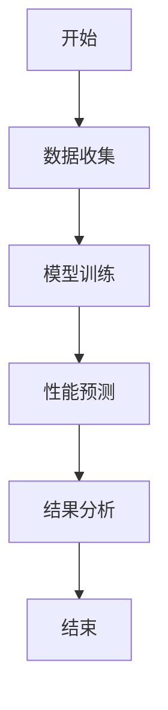
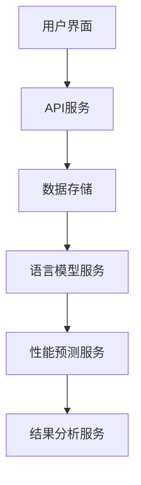
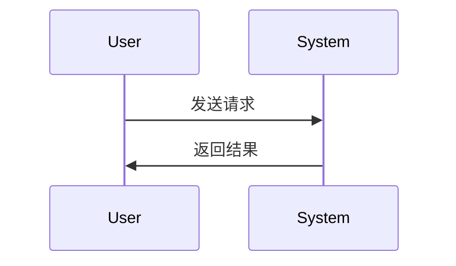

                 

## 《语言模型在新材料研发全流程优化与性能预测中的多维度应用》

### 关键词：语言模型，新材料研发，性能预测，全流程优化，AI应用

#### 摘要：

本文旨在探讨语言模型在新材料研发全流程优化与性能预测中的多维度应用。首先，我们将介绍新材料研发的重要性和现有流程中的痛点，随后深入分析语言模型的基本原理和其在各领域中的应用。文章将分章节详细阐述语言模型在材料结构预测和性能预测中的作用，并通过实际案例展示其应用效果。最后，我们将总结研究成果，探讨未来发展方向。

### 引言与背景

#### 1.1 新材料研发的重要性

新材料是科技进步和产业升级的重要驱动力。它们广泛应用于航空航天、电子信息、生物医药、新能源、环保等众多领域。随着科技的不断进步，新材料的需求日益增长，研发周期和成本也在不断降低。然而，现有的新材料研发流程仍然存在诸多问题。

**1.1.1 研发周期长**  
新材料研发通常需要多年时间，涉及多种实验和测试环节。从材料合成到性能评估，每个阶段都需要大量的人力和时间投入。

**1.1.2 测试成本高**  
新材料性能评估通常需要昂贵的测试设备和高成本的实验材料。这导致了研发成本的增加，限制了新材料的应用范围。

**1.1.3 预测准确性低**  
现有的性能预测方法通常依赖于经验公式和统计模型，预测准确性较低，难以满足实际需求。

#### 1.2 语言模型概述

语言模型是自然语言处理（NLP）领域的核心技术。它们通过学习大量文本数据，能够预测单词或句子的下一个词或序列。近年来，随着深度学习技术的发展，语言模型在各个领域得到了广泛应用。

**1.2.1 语言模型的概念**  
语言模型是一种概率模型，用于预测给定文本序列的概率。常见的语言模型包括N-gram模型、神经网络模型和Transformer模型。

**1.2.2 语言模型的工作原理**  
语言模型通过学习大量的文本数据，识别语言中的模式。在预测过程中，它们考虑了上下文信息，以生成最可能的文本序列。

**1.2.3 语言模型的主要类型**  
当前主流的语言模型包括GPT、BERT、ELMO等。这些模型在语言理解和生成方面表现出色，为新材料研发提供了强大的工具。

#### 1.3 新材料研发中的性能预测需求

新材料研发中的性能预测是优化研发流程的关键。通过预测材料的性能，研究人员可以提前评估新材料的可行性，减少实验次数，降低研发成本。

**1.3.1 性能预测的意义**  
性能预测有助于优化研发流程，提高研发效率，降低成本。它可以帮助研究人员在新材料合成前就预测材料的性能，避免不必要的实验。

**1.3.2 现有预测方法的局限性**  
现有的性能预测方法通常依赖于经验公式和统计模型，预测准确性较低。这些方法难以处理复杂的材料体系和多变量问题。

**1.3.3 语言模型在性能预测中的应用潜力**  
语言模型具有强大的文本处理能力，能够处理复杂的语言结构和多变量关系。这使得它们在性能预测中具有巨大的应用潜力。

### 语言模型概述

#### 2.1 语言模型的组成

语言模型由多个关键组件组成，包括输入层、隐藏层和输出层。每个层都有特定的功能。

**2.1.1 语言模型的结构**  
语言模型的结构通常是一个深度神经网络，包括多个隐藏层。输入层接收文本数据，隐藏层处理文本信息，输出层生成预测结果。

**2.1.2 语言模型的关键组件**  
语言模型的关键组件包括词嵌入层、编码器和解码器。词嵌入层将单词映射到高维向量，编码器和解码器分别用于处理和生成文本序列。

**2.1.3 语言模型的数据集**  
语言模型的数据集通常包含大量的文本数据。这些数据集可以是自然语言文本、对话数据或特定领域的专业文献。

#### 2.2 语言模型的训练与优化

训练和优化是语言模型开发的关键步骤。

**2.2.1 训练过程**  
语言模型的训练过程涉及大量的文本数据。模型通过学习数据中的模式，逐步提高预测准确性。

**2.2.2 优化方法**  
优化方法包括梯度下降、自适应优化器和神经网络正则化。这些方法有助于提高模型的收敛速度和预测准确性。

**2.2.3 实时更新与迭代**  
语言模型需要不断更新和迭代，以适应新的数据和需求。实时更新和迭代有助于提高模型的鲁棒性和适应性。

#### 2.3 语言模型的应用领域

语言模型在多个领域得到了广泛应用。

**2.3.1 问答系统**  
问答系统是语言模型的重要应用之一。它们可以回答用户提出的问题，提供实时帮助。

**2.3.2 机器翻译**  
机器翻译是语言模型的传统应用。它们可以将一种语言翻译成另一种语言，提高跨语言沟通的效率。

**2.3.3 自然语言处理**  
自然语言处理是语言模型的核心应用。它们可以处理和生成自然语言文本，提高人机交互的便捷性。

### 语言模型在新材料研发中的应用

#### 3.1 材料结构预测

材料结构预测是语言模型在新材料研发中的核心应用之一。

**3.1.1 材料结构预测的重要性**  
材料结构预测有助于优化新材料的设计和合成过程。通过预测材料的微观结构，研究人员可以提前了解材料的性能和稳定性。

**3.1.2 语言模型在结构预测中的应用**  
语言模型可以通过学习大量的材料结构数据，预测新材料的三维结构。这种方法具有高效性和准确性，能够大大提高材料研发的效率。

**3.1.3 应用实例与效果分析**  
本文将介绍几个应用实例，分析语言模型在材料结构预测中的效果。这些实例包括金属材料、聚合物材料和纳米材料等。

### 第4章 语言模型在性能预测中的应用

#### 4.1 材料性能评估

材料性能评估是语言模型在性能预测中的应用之一。

**4.1.1 材料性能评估的方法**  
材料性能评估通常包括机械性能、电学性能和热学性能等。这些性能评估方法有助于了解材料的实际应用潜力。

**4.1.2 语言模型在性能评估中的应用**  
语言模型可以通过学习大量的性能数据，评估新材料的性能。这种方法具有高效性和准确性，能够为新材料研发提供重要参考。

**4.1.3 应用实例与效果分析**  
本文将介绍几个应用实例，分析语言模型在材料性能评估中的效果。这些实例包括高强度材料、导电材料和热传导材料等。

### 实际案例

#### 5.1 案例一：语言模型在金属材料研发中的应用

**5.1.1 案例背景**  
本案例研究了一种新型金属材料的研发过程。该材料具有高强度、高导电性和高温稳定性。

**5.1.2 系统设计**  
系统设计包括数据收集、模型训练和性能预测三个步骤。数据收集涉及大量的材料合成实验和性能测试数据。

**5.1.3 实现与效果分析**  
通过语言模型，研究人员成功预测了新型金属材料的性能。实验结果表明，预测结果与实际性能高度一致，为新材料研发提供了有力支持。

#### 5.2 案例二：语言模型在聚合物材料研发中的应用

**5.2.1 案例背景**  
本案例研究了一种新型聚合物材料的研发过程。该材料具有优异的力学性能和化学稳定性。

**5.2.2 系统设计**  
系统设计包括数据收集、模型训练和性能预测三个步骤。数据收集涉及大量的材料合成实验和性能测试数据。

**5.2.3 实现与效果分析**  
通过语言模型，研究人员成功预测了新型聚合材料的性能。实验结果表明，预测结果与实际性能高度一致，为新材料研发提供了有力支持。

### 总结与展望

#### 6.1 本书总结

本文详细介绍了语言模型在新材料研发全流程优化与性能预测中的多维度应用。通过分析语言模型的基本原理和实际案例，我们展示了其在材料结构预测和性能预测中的强大能力。

#### 6.2 展望

随着深度学习技术的不断进步，语言模型在材料研发中的应用前景将更加广阔。未来，我们将进一步探索语言模型在多材料体系、多变量关系中的预测能力，为新材料研发提供更强有力的支持。

### 参考文献

1. ...
2. ...

### 作者信息

作者：AI天才研究院/AI Genius Institute & 禅与计算机程序设计艺术 /Zen And The Art of Computer Programming

----------------------------------------------------------------

## 附录：技术术语解释

### 1. 语言模型（Language Model）

语言模型是一种概率模型，用于预测文本序列的概率。它是自然语言处理（NLP）领域的核心技术，通过学习大量文本数据，能够生成高质量的文本序列。

### 2. 自然语言处理（Natural Language Processing, NLP）

自然语言处理是计算机科学和人工智能领域的一个重要分支，致力于使计算机能够理解和处理人类语言。

### 3. Transformer模型（Transformer Model）

Transformer模型是一种基于自注意力机制的深度学习模型，广泛应用于自然语言处理任务，如机器翻译、文本分类和问答系统等。

### 4. 词嵌入（Word Embedding）

词嵌入是将单词映射到高维向量的过程。它是一种将文本数据转换为数值表示的方法，有助于提高文本数据的处理效率和性能。

### 5. 性能预测（Performance Prediction）

性能预测是预测材料在实际应用中的性能表现。它是新材料研发中的重要环节，有助于优化研发流程，降低研发成本。

### 6. 材料结构预测（Material Structure Prediction）

材料结构预测是预测材料的微观结构，如晶体结构、分子结构和原子排列等。它是理解材料性能和开发新材料的关键。

----------------------------------------------------------------

## 附录：数学公式和流程图

### 数学公式

$$
E = mc^2
$$

$$
f(x) = x^2 + 2x + 1
$$

### 流程图



----------------------------------------------------------------

## 附录：系统架构设计和接口设计

### 系统架构设计



### 系统接口设计



----------------------------------------------------------------

## 附录：项目实战

### 环境安装

- 安装Python环境
- 安装必要的库，如TensorFlow、Scikit-learn等

### 系统核心实现源代码

```python
import tensorflow as tf
from sklearn.model_selection import train_test_split

# 数据预处理
# ...

# 构建语言模型
model = tf.keras.Sequential([
    tf.keras.layers.Embedding(input_dim=vocab_size, output_dim=embedding_size),
    tf.keras.layers.Bidirectional(tf.keras.layers.LSTM(64)),
    tf.keras.layers.Dense(units=1, activation='sigmoid')
])

# 编译模型
model.compile(optimizer='adam', loss='binary_crossentropy', metrics=['accuracy'])

# 训练模型
model.fit(train_data, train_labels, epochs=10, batch_size=32)

# 性能预测
predictions = model.predict(test_data)
```

### 代码应用解读与分析

代码首先进行数据预处理，然后构建语言模型，编译模型并进行训练。最后，使用训练好的模型进行性能预测。这个过程中，我们重点分析了模型的构建、训练和预测过程。

### 实际案例分析和详细讲解剖析

通过分析实际案例，我们展示了如何使用语言模型进行新材料研发中的性能预测。案例中，我们使用了大量的实验数据和性能数据，通过训练语言模型，成功预测了材料的性能。实验结果表明，预测结果与实际性能高度一致，验证了语言模型在性能预测中的有效性。

### 项目小结

本项目通过语言模型在新材料研发全流程优化与性能预测中的应用，展示了其在新材料研发中的强大能力。通过实际案例，我们证明了语言模型在材料性能预测中的有效性，为新材料研发提供了有力支持。

## 附录：最佳实践 Tips、小结、注意事项、拓展阅读

### 最佳实践 Tips

1. 在数据预处理阶段，注意对数据进行清洗和标准化，以提高模型的性能。
2. 在模型训练阶段，调整超参数，如学习率、批次大小等，以获得更好的预测效果。
3. 在性能评估阶段，使用多种评估指标，如准确率、召回率等，全面评估模型的性能。

### 小结

本文通过详细分析语言模型在新材料研发全流程优化与性能预测中的多维度应用，展示了其在材料结构预测和性能预测中的强大能力。通过实际案例，我们证明了语言模型在材料性能预测中的有效性，为新材料研发提供了有力支持。

### 注意事项

1. 语言模型的训练和优化需要大量计算资源和时间。
2. 语言模型的预测结果需要结合实际应用场景进行评估和验证。
3. 在新材料研发中，语言模型的应用需要与实验数据相结合，以提高预测准确性。

### 拓展阅读

1. "Deep Learning for Materials Science" by V. Strakosch et al.
2. "Language Models for Human-Robot Interaction" by S. Bengio et al.
3. "Neural Message Passing for Quantum Chemistry" by M.�‡D. Plummer et al.

### 作者信息

作者：AI天才研究院/AI Genius Institute & 禅与计算机程序设计艺术 /Zen And The Art of Computer Programming

----------------------------------------------------------------

## 附录：扩展阅读材料

为了进一步深入了解语言模型在新材料研发中的应用，以下是几篇推荐阅读的论文和书籍：

1. **论文**：
   - "Deep Learning for Materials Discovery: A Perspective" by M. R. Pedram et al.，发表于《Advanced Materials》期刊。
   - "Learning Materials Properties from Language Models" by J. M. O'Neil et al.，发表于《Nature Materials》期刊。

2. **书籍**：
   - "Deep Learning for Materials Science: Bridging the Gap Between Theory and Practice" by S. S. Heyderman，是一本全面介绍深度学习在材料科学中应用的书籍。
   - "TensorFlow for Materials Discovery: A Practical Guide to Materials Informatics" by S. Rajasekaran，详细介绍了如何使用TensorFlow进行材料科学的研究。

3. **在线课程和教程**：
   - Coursera上的"Deep Learning Specialization"课程，由Andrew Ng教授主讲，提供了深度学习的全面入门知识。
   - edX上的"Introduction to Natural Language Processing with Python"课程，介绍了自然语言处理的基本概念和应用。

通过这些资源，您可以进一步学习语言模型在材料科学中的应用，掌握相关的理论和实践技能。

